# Aerodynamics of horizontal axis wind turbines

# Author’s note on aerodynamics

To study the aerodynamics of wind turbines, some knowledge of suid dynamics in general is necessary and, in particular, aircraft aerodynamics. Excellent text books on aerodynamics are readily available, a reference list and a further reading list are given at the end of this chapter, and any abbreviated account of the subject that could have been included in these pages would not have done it justice; recourse to text books would have been necessary anyway. Some direction on which aerodynamics topics are necessary for the study of wind turbines would, however, be useful to the reader, and a brief introduction is given in Appendix A3.

For Sections 3.2 and 3.3, a knowledge of Bernoulli’s theorem for steady, incompressible sow is required together with the concept of continuity.

For Section 3.4, which may be omitted at rrst reading, an understanding of vortices and the sow reld induced by vortices is desirable. The Biot–Savart law, which will be familiar to those with a knowledge of electric and magnetic relds, is used to determine velocities induced by vortices. The Kutta–Joukowski theorem for determining the force on a bound vortex should also be studied.

For Sections 3.5 to 3.8, a knowledge of the lift and drag of aerofoils is essential, including stalled sow.

# 3.1 Introduction

A wind turbine is a device for extracting kinetic energy from the wind. By removing some of its kinetic energy, the wind must slow down, but only that mass of air that passes through the rotor disc is directly affected. Assuming that the affected mass of air remains separate from the air that does not pass through the rotor disc and does not mix with it, a boundary surface can be drawn containing the affected air mass, and this boundary can be extended upstream as well as downstream, forming a long streamtube of circular cross-section. No air sows across the boundary, and so the mass sow rate of the air sowing along the streamtube will be the same for all streamwise positions along the streamtube. Outside the streamtube, air that passes close to the rotor is not retarded in the same way but is subject to both retardation and acceleration associated with the divergence of the streamlines around the rotor. Because the air within the streamtube slows down, but is effectively incompressible at these speeds, the cross-sectional area of the streamtube must expand to accommodate the slower moving air; see Figure 3.1.

Although kinetic energy is extracted from the air sow, a sudden step change in velocity is neither possible nor desirable because of the enormous accelerations and forces this would require. Pressure energy can be extracted in a step-like manner, however, and all wind turbines, whatever their design, operate in this way.

The presence of the turbine causes the approaching air, upstream, gradually to slow down such that when the air arrives at the rotor disc its velocity is already lower than the free-stream wind speed. The streamtube expands as a result of the slowing down and, because no work has yet been done on, or by, the air, its static pressure rises to absorb the decrease in kinetic energy.

As the air passes through the rotor disc, by design, there is a drop in static pressure such that, on leaving, the air is below the atmospheric pressure level. The air then proceeds downstream with reduced speed and static pressure: this region of the sow is called the wake. Eventually, far downstream, the static pressure in the wake must return to the atmospheric level for equilibrium to be achieved. The rise in static pressure is at the expense of the kinetic energy and so causes an additional slowing down of the wind. Thus, between the far upstream and far wake conditions, no difference in static pressure exists, but there is a reduction in kinetic energy.

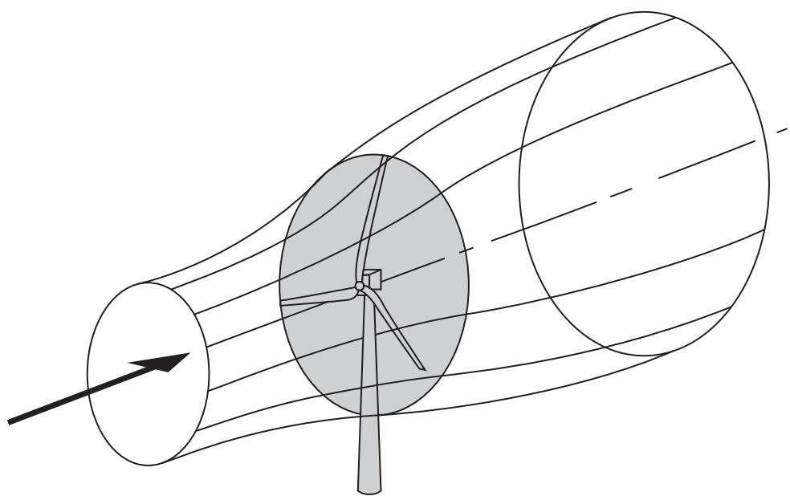

natural_image

Diagram of a mechanical or optical system with concentric circular layers and a central vertical structure, showing no text or symbols.

Figure 3.1 The energy extracting streamtube of a wind turbine.

# 3.2 The actuator disc concept

The mechanism described above accounts for the extraction of kinetic energy but in no way explains what happens to that energy: it may well be put to useful work, but some may be spilled back into the wind as turbulence and eventually be dissipated as heat.

Nevertheless, we can begin an analysis of the aerodynamic behaviour of wind turbines without any specirc turbine design just by considering the energy extraction process. The general device that carries out this task is called an actuator disc; see Figure 3.2.

Upstream of the disc, the streamtube has a cross-sectional area smaller than that of the disc and an area larger than the disc downstream. The expansion of the streamtube is because the mass sow rate must be the same everywhere. The mass of air that passes through a given cross-section of the streamtube in a unit length of time is $\rho A U _ { : }$ , where 휌 is the air density, A is the cross-sectional area, and U is the sow velocity. The mass sow rate must be the same everywhere along the streamtube, and so

$$
\rho A _ {\infty} U _ {\infty} = \rho A _ {D} U _ {D} = \rho A _ {W} U _ {W} \tag {3.1}
$$

The symbol ∞ refers to conditions far upstream, D refers to conditions at the disc, and W refers to conditions in the far wake.

It is usual to consider that the actuator disc induces a velocity variation that must be superimposed on the free-stream velocity. The streamwise component of this induced sow at the disc is given by $- a U _ { \infty }$ , where a is called the axial Tow induction factor, or the inTow factor. At the disc, therefore, the net streamwise velocity is

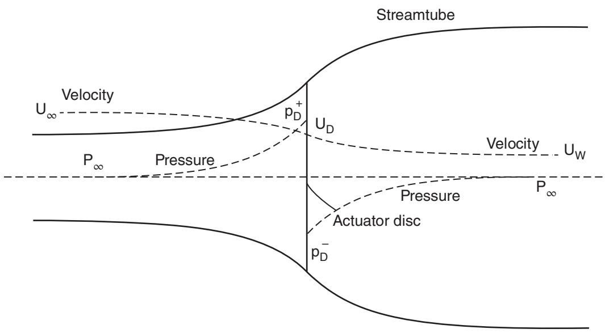

text_image

Streamtube
Velocity
U∞
p∞
Pressure
pD+
UD
Velocity
UW
P∞
Pressure
Actuator disc
pD-

Figure 3.2 An energy extracting actuator disc and streamtube.

$$
U _ {D} = U _ {\infty} (1 - a) \tag {3.2}
$$

# 3.2.1 Simple momentum theory

The air that passes through the disc undergoes an overall change in velocity, $U _ { \infty } - U _ { W } ,$ and a rate of change of momentum equal to the overall change of velocity times the mass sow rate:

$$
\text { Rate   of   change   of   momentum } = (U _ {\infty} - U _ {W}) \rho A _ {D} U _ {D} \tag {3.3}
$$

The force causing this change in momentum comes entirely from the pressure difference across the actuator disc and the axial component of the pressure acting on the curved surface of the streamtube. This latter pressure is usually assumed to be ambient and therefore to give zero contribution, without further explanation. In fact this pressure is different from ambient due to the axial variation of velocity along the streamtube, but the integral of its axial component from far upstream to far downstream can be shown to be exactly equal to zero, the streamwise contribution upstream of the actuator disc exactly balancing the downstream contribution that opposes the stream (Jamieson 2018).

Therefore,

$$
(p _ {D} ^ {+} - p _ {D} ^ {-}) A _ {D} = (U _ {\infty} - U _ {W}) \rho A _ {D} U _ {\infty} (1 - a) \tag {3.4}
$$

To obtain the pressure difference ${ ( p _ { D } } ^ { + } - { p _ { D } } ^ { - } )$ , Bernoulli’s equation is applied separately to the upstream and downstream sections of the streamtube: separate equations are necessary because the total energy is different upstream and downstream. Bernoulli’s equation states that, under steady conditions, the total energy in the sow, comprising kinetic energy, static pressure energy, and gravitational potential energy, remains constant provided no work is done on or by the suid. Thus, for a unit volume of air,

$$
\frac {1}{2} \rho U ^ {2} + p + \rho g h = c o n s t \tag {3.5a}
$$

Upstream, therefore, we have

$$
\frac {1}{2} \rho_ {\infty} U _ {\infty} ^ {2} + p _ {\infty} + \rho_ {\infty} g h _ {\infty} = \frac {1}{2} \rho_ {D} U _ {D} ^ {2} + p _ {D} ^ {+} + \rho_ {D} g h _ {D} \tag {3.5b}
$$

Assuming the sow speed to be at low Mach number M (typically M < 0.3 is sufrcient), it may be treated as incompressible $( \rho _ { \infty } = \rho _ { D } )$ and to be independent of buoyancy effects $( \rho g h _ { \infty } = \rho g h _ { D } )$ then,

$$
\frac {1}{2} \rho U _ {\infty} ^ {2} + p _ {\infty} = \frac {1}{2} \rho U _ {D} ^ {2} + p _ {D} ^ {+} (3. 5 \mathrm{c})
$$

Similarly, downstream,

$$
\frac {1}{2} \rho U _ {W} ^ {2} + p _ {\infty} = \frac {1}{2} \rho U _ {D} ^ {2} + p _ {D} ^ {-} \tag {3.5d}
$$

Subtracting these equations, we obtain

$$
(p _ {D} ^ {+} - p _ {D} ^ {-}) = \frac {1}{2} \rho (U _ {\infty} ^ {2} - U _ {W} ^ {2}) \tag {3.6}
$$

Equation (3.4) then gives

$$
\frac {1}{2} \rho (U _ {\infty} ^ {2} - U _ {W} ^ {2}) A _ {D} = (U _ {\infty} - U _ {W}) \rho A _ {D} U _ {\infty} (1 - a) \tag {3.7}
$$

and so,

$$
U _ {W} = (1 - 2 a) U _ {\infty} \tag {3.8}
$$

That is, half the axial speed loss in the streamtube takes place upstream of the actuator disc and half downstream.

# 3.2.2 Power coefJcient

The force on the air becomes, from Eq. (3.4),

$$
T = (p _ {D} ^ {+} - p _ {D} ^ {-}) A _ {D} = 2 \rho A _ {D} U _ {\infty} ^ {2} a (1 - a) \tag {3.9}
$$

As this force is concentrated at the actuator disc, the rate of work done by the force is $T U _ { D }$ and hence the power extraction from the air is given by

$$
P o w e r = T U _ {D} = 2 \rho A _ {D} U _ {\infty} ^ {3} a (1 - a) ^ {2} \tag {3.10}
$$

A power coefScient is then derned as

$$
C _ {P} = \frac {\text { Power }}{\frac {1}{2} \rho U _ {\infty} ^ {3} A _ {D}} \tag {3.11}
$$

where the denominator represents the power available in the air, in the absence of the actuator disc.Therefore,

$$
C _ {P} = 4 a (1 - a) ^ {2} \tag {3.12}
$$

# 3.2.3 The Betz limit

(This limit is also referred to as the Lanchester–Betz limit or the Betz–Joukowski limit).1

The maximum value of $C _ { P }$ occurs when

$$
\frac {d C _ {P}}{d a} = 4 (1 - a) (1 - 3 a) = 0
$$

that gives a value of $\begin{array} { r } { a = \frac { 1 } { 3 } } \end{array}$

Hence,

$$
C _ {P \max} = \frac {1 6}{2 7} = 0. 5 9 3 \tag {3.13}
$$

The maximum achievable value of the power coefrcient is known as the Betz limit after Albert Betz (1919), the German aerodynamicist. Frederic Lanchester (1915), a British aeronautical pioneer, worked earlier on a similar analysis and is sometimes given prior credit, and Joukowski (1920) also contributed an analysis. To date, no unducted wind turbine has been designed that is capable of exceeding the Betz limit. The limit is caused not by any derciency in design because, as yet in our discussion, we have no design. However, because the streamtube has to expand upstream of the actuator disc, the cross-section of the tube where the air is at the full, free-stream velocity is smaller than the area of the disc.

The efSciency of the rotor might more properly be derned as

$$
\frac {\text { Power   extracted }}{\text { Power   available }} = \frac {\text { Power   extracted }}{\frac {1 6}{2 7} \cdot \left\{\frac {1}{2} \rho U _ {\infty} ^ {3} A _ {D} \right\}} \tag {3.14}
$$

but note that $C _ { P }$ is not the same as this efrciency.

# 3.2.4 The thrust coefJcient

The force on the actuator disc caused by the pressure drop, given by Eq. (3.9), can also be non-dimensionalised to give a coefScient of thrust $C _ { T }$

$$
C _ {T} = \frac {\text { Thrust }}{\frac {1}{2} \rho U _ {\infty} ^ {2} A _ {D}} \tag {3.15}
$$

$$
C _ {T} = 4 a (1 - a) \tag {3.16}
$$

A problem arises for values of $\begin{array} { r } { a \geq \frac { 1 } { 2 } } \end{array}$ because the wake velocity, given by $( 1 - 2 a ) U _ { \infty }$ becomes zero, or even negative: in these conditions the momentum theory, as described, no longer applies, and an empirical modircation has to be made (Section 3.7).

The variation of power coefrcient and thrust coefrcient with a is shown in Figure 3.3. The solid lines indicate where the theory is representative and the dashed lines where it is not.

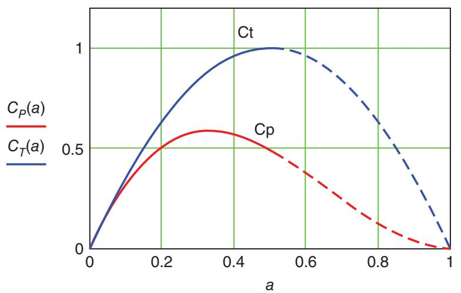

line

| a    | Cp(a) | CT(a) |
| ---- | ----- | ----- |
| 0.0  | 0.0   | 0.0   |
| 0.2  | 0.4   | 0.6   |
| 0.4  | 0.55  | 0.95  |
| 0.6  | 0.45  | 0.98  |
| 0.8  | 0.2   | 0.7   |
| 1.0  | 0.0   | 0.0   |

Figure 3.3 Variation of $C _ { P }$ and $C _ { T }$ with axial induction factor a.

# 3.3 Rotor disc theory

The manner in which the extracted energy is converted into usable energy depends upon the particular turbine design. The most common type of wind energy converter, the horizontal axis wind turbine or HAWT, employs a rotor with a number of blades rotating with an angular velocity Ω about an axis normal to the rotor plane and parallel to the wind direction. The blades sweep out a disc and by virtue of their aerodynamic design develop a pressure difference across the disc, which, as discussed in the previous section, is responsible for the loss of axial momentum in the wake. Associated with the loss of axial momentum is a loss of energy that can be collected by, say, an electrical generator attached to the rotor shaft. As well as a thrust, the rotor experiences a torque in the direction of rotation that will oppose the torque that the generator exerts. The work done by the aerodynamic torque on the generator is converted into electrical energy. The required aerodynamic design of the rotor blades to provide a torque as well as a thrust is discussed in Section 3.5.

# 3.3.1 Wake rotation

The exertion of a torque on the rotor disc by the air passing through it requires an equal and opposite torque to be imposed upon the air. The consequence of the reaction torque is to cause the air to rotate in a direction opposite to that of the rotor; the air gains angular momentum, and so in the wake of the rotor disc the air particles have a velocity component in a direction that is tangential to the rotation as well as an axial component; see Figure 3.4.

The acquisition of the tangential component of velocity by the air means an increase in its kinetic energy that is compensated for by a fall in the static pressure of the air in the wake in addition to that which is described in the previous section.

The sow entering the actuator disc has no rotational motion at all. The sow exiting the disc does have rotation, and that rotation remains constant as the suid progresses down the wake. The transfer of rotational motion to the air takes place entirely across the thickness of the disc (see Figure 3.5). The change in tangential velocity is expressed in terms of a tangential sow induction factor a′ . Upstream of the disc the tangential velocity is zero. Immediately downstream of the disc the tangential velocity is $2 r \Omega a ^ { \prime }$ . In the plane of the disc the tangential velocity is rΩa ′ (see also Figure 3.10 and the associated discussion). Because it is produced in reaction to the torque, the tangential velocity is opposed to the motion of the rotor.

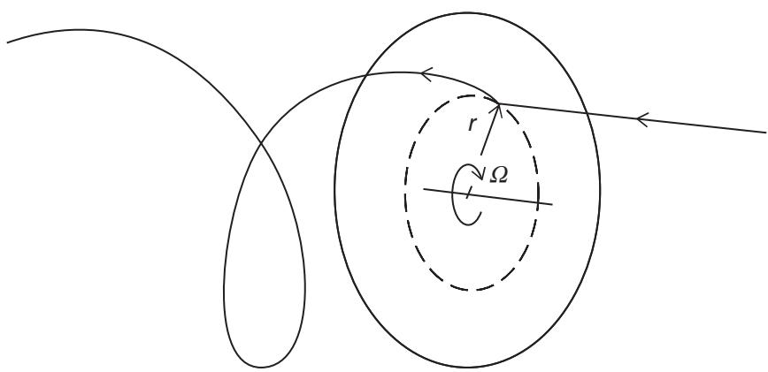

text_image

r
Ω

Figure 3.4 The trajectory of an air particle passing through the rotor disc.

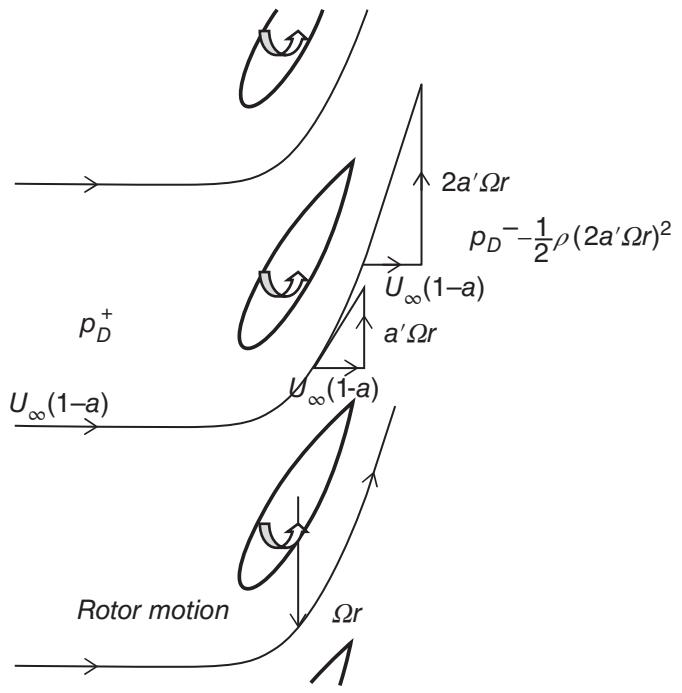

text_image

2a'Ωr
pD-1/2ρ(2a'Ωr)²
U∞(1-a)
a'Ωr
U∞(1-a)
U∞(1-a)
Rotor motion
Ωr

Figure 3.5 Tangential velocity grows across the disc thickness.

An abrupt acquisition of tangential velocity cannot occur in practice and must be gradual. Figure 3.5 shows, for example, a sector of a rotor with multiple blades. The sow accelerates in the tangential direction through the ‘actuator disc’ as it is turned between the blades by the lift forces generated by their angle of attack to the incident sow.

# 3.3.2 Angular momentum theory

The tangential velocity will not be the same for all radial positions, and it may well also be that the axial induced velocity is not the same. To allow for variation of both induced velocity components, consider only an annular ring of the rotor disc that is of radius r and of radial width 훿r.

The increment of rotor torque acting on the annular ring will be responsible for imparting the tangential velocity component to the air, whereas the axial force acting on the ring will be responsible for the reduction in axial velocity. The whole disc comprises a multiplicity of annular rings, and each ring is assumed to act independently in imparting momentum only to the air that actually passes through the ring.

The torque on the ring will be equal to the rate of change of angular momentum of the air passing through the ring.

Thus, torque = rate of change of angular momentum

= mass sow rate through disc × change of tangential velocity × radius

$$
\delta Q = \rho \delta A _ {D} U _ {\infty} (1 - a) 2 \Omega a ^ {\prime} r ^ {2} \tag {3.17}
$$

where $\delta A _ { D }$ is taken as being the area of an annular ring.

The driving torque on the rotor shaft is also $\delta Q ,$ and so the increment of rotor shaft power output is

$$
\delta P = \delta Q \Omega
$$

The total power extracted from the wind by slowing it down is therefore determined by the rate of change of axial momentum given by Eq. (3.10) in Section 3.2.2:

$$
\delta P = 2 \rho \delta A _ {D} U _ {\infty} ^ {3} a (1 - a) ^ {2}
$$

Hence

$$
2 \rho \delta A _ {D} U _ {\infty} ^ {3} a (1 - a) ^ {2} = \rho \delta A _ {D} U _ {\infty} (1 - a) 2 \Omega^ {2} a ^ {\prime} r ^ {2}
$$

and

$$
U _ {\infty} ^ {2} a (1 - a) = \Omega^ {2} r ^ {2} a ^ {\prime}
$$

Ωr is the tangential velocity of the spinning annular ring, and so $\begin{array} { r } { \lambda _ { r } = \frac { r \Omega } { U _ { \infty } } } \end{array}$ U∞ is called the local speed ratio. At the edge of the disc $r = R$ and $\begin{array} { r } { \lambda = \frac { R \Omega } { U _ { \infty } } } \end{array}$ RΩ is known as the tip speed ratio.

Thus

$$
a (1 - a) = \lambda_ {r} ^ {2} a ^ {\prime} \tag {3.18}
$$

The area of the ring is $\delta A _ { D } = 2 \pi r \delta r$ , therefore the incremental shaft power is, from Eq. (3.17),

$$
\delta P = \delta Q \Omega = \left(\frac {1}{2} \rho U _ {\infty} ^ {3} 2 \pi r \delta r\right) 4 a ^ {\prime} (1 - a) \lambda_ {r} ^ {2}
$$

The rrst term in brackets represents the power sux through the annulus in the absence of any rotor action; the term outside these brackets, therefore, is the efrciency of the blade element in capturing that power.

Blade element efrciency is

$$
\eta_ {r} = 4 a ^ {\prime} (1 - a) \lambda_ {r} ^ {2} \tag {3.19}
$$

in terms of power coefrcient

$$
\frac {d C _ {P}}{d r} = \frac {4 \pi \rho U _ {\infty} ^ {3} (1 - a) a ^ {\prime} \lambda_ {r} ^ {2} r}{\frac {1}{2} \rho U _ {\infty} ^ {3} \pi R ^ {2}} = \frac {8 (1 - a) a ^ {\prime} \lambda_ {r} ^ {2} r}{R ^ {2}}
$$

$$
\frac {d C _ {P}}{d \mu} = 8 (1 - a) a ^ {\prime} \lambda^ {2} \mu^ {3} \tag {3.20}
$$

where $\begin{array} { r } { \mu = \frac { r } { R } } \end{array}$

Knowing how a and $a ^ { \prime }$ vary radially [Eq. (3.20)] can be integrated to determine the overall power coefrcient for the disc for a given tip speed ratio 휆.

It was argued by Glauert (1935b) that the rotation in the wake required energy that is taken from the sow and is unavailable for extraction, but this can be shown not to be the case. The residual rotation in the far wake is supplied by the rotation component $a ^ { \prime } \Omega$ induced at the rotor. The lift forces on the blades forming the rotor disc are normal to the resultant velocity relative to the blades, and so no work is done on or by the suid.

Therefore, Bernoulli’s theorem can be applied to the sow across the disc, relative to the disc spinning at angular velocity Ω, to give for an annulus of radius r

$$
\frac {1}{2} \rho U _ {\infty} ^ {2} (1 - a) ^ {2} + \frac {1}{2} \rho \Omega^ {2} r ^ {2} + \frac {1}{2} \rho w ^ {2} + p _ {D} ^ {+}
$$

$$
= \frac {1}{2} \rho U _ {\infty} ^ {2} (1 - a) ^ {2} + \frac {1}{2} \rho \Omega^ {2} (1 + 2 a ^ {\prime}) ^ {2} r ^ {2} + \frac {1}{2} \rho w ^ {2} + p _ {D} ^ {-}
$$

where w is the radial component of velocity. which is assumed continuous across the disc.

Consequently,

$$
\Delta p _ {D} = 2 \rho \Omega^ {2} (1 + a ^ {\prime}) a ^ {\prime} r ^ {2}
$$

The pressure drop across the disc clearly has two components. The rrst component

$$
\Delta p _ {D 1} = 2 \rho \Omega^ {2} a ^ {\prime} r ^ {2} \tag {3.21}
$$

is shown to be, from Eq. (3.18), the same as that given by Eq. (3.9) in the simple momentum theory in which rotation plays no part. The second component is

$$
\Delta p _ {D 2} = 2 \rho \Omega^ {2} a ^ {\prime 2} r ^ {2} \tag {3.22}
$$

$\Delta p _ { D 2 }$ can be shown to provide a radial, static pressure gradient

$$
\frac {d p}{d r} = \rho (2 \Omega a ^ {\prime}) ^ {2} r
$$

in the rotating wake that balances the centrifugal force on the rotating suid, because [see Eq. (3.33) $a ^ { \prime } ( r ) = a ^ { \prime } ( R ) R ^ { 2 } / r ^ { 2 }$ . This pressure causes a small discontinuity in the pressure at the wake boundary equal to $2 \rho ( a ^ { \prime } ( R ) \Omega R ) ^ { 2 }$ , which in reality, along with the other discontinuities there, is smeared out.

The kinetic energy per unit volume of the rotating suid in the wake is also equal to the drop in static pressure of Eq. (3.22), and so the two are in balance and there is no loss of available kinetic energy.

However, the pressure drop of Eq. (3.22) balancing the centrifugal force on the rotating suid does cause an additional thrust on the rotor disc. In principle, the low-pressure region close to the axis caused by the centrifugal forces in the wake can increase the local power coefrcient. This is because it sucks in additional suid from the far upstream region that accelerates through the rotor plane. This effect would cause a slight reduction in the diverging of the insow streamlines. However, the degree to which this effect might allow a useful increase in power to be achieved is still the subject of discussion; see, e.g. the analyses given by Sorensen and van Kuik (2011), Sharpe (2004), and Jamieson (2011). The ideal model with constant blade circulation right in to the axis is not consistent due to the effect on the blade angle of attack by the arbitrarily large rotation velocities induced there, and in reality, the circulation must drop off smoothly to zero at the axis, and the root vortex must be a vortex with a rnite diameter. This is discussed later in Section 3.4, where the vortex model of the wake is analysed. Numerical simulations of optimum actuator discs by Madsen et al. (2007) have not found the optimum power coefrcient ever to exceed the Betz limit. But the relevance of the issue is that it may be possible to extract more power than predicted by the Betz limit in cases of turbines running at very low tip speed ratios, even recognising that the rotor vortex has a rnite sized core or is shed as a helix at a radius greater than zero, and taking account of the small amount of residual rotational energy lost in the far wake.

# 3.3.3 Maximum power

The values of a and $a ^ { \prime }$ that will provide the maximum possible efrciency can be determined by differentiating Eq. (3.19) by either factor and putting the result equal to zero.

Hence

$$
\frac {d a}{d a ^ {\prime}} = \frac {1 - a}{a ^ {\prime}} \tag {3.23}
$$

From Eq. (3.18)

$$
{\frac {d a}{d a ^ {\prime}}} = {\frac {{\lambda_ {r}} ^ {2}}{1 - 2 a}}
$$

giving

$$
a ^ {\prime} \lambda_ {r} ^ {2} = (1 - a) (1 - 2 a) \tag {3.24}
$$

The combination of Eqs. (3.18) and (3.21) gives the required values of a and $a ^ { \prime }$ that maximise the incremental power coefrcient:

$$
a = \frac {1}{3} \text { and } a ^ {\prime} = \frac {a (1 - a)}{\lambda_ {r} ^ {2}} \tag {3.25}
$$

The axial sow induction for maximum power extraction is the same as for the non-rotating wake case, that is, $\begin{array} { r } { a = \frac { 1 } { 3 } } \end{array}$ , and is therefore uniform over the entire disc. However, a ′varies with radial position.

From Eq. (3.20) the power coefrcient for the whole rotor is

$$
C _ {P} = 8 \int_ {0} ^ {1} (1 - a) a ^ {\prime} \lambda^ {2} \mu^ {3} d \mu
$$

Substituting for the expression for $a ^ { \prime }$ in Eq. (3.25) gives maximum power as

$$
C _ {P} = 8 \int_ {0} ^ {1} (1 - a) \frac {a (1 - a)}{\lambda^ {2} \mu^ {2}} \lambda^ {2} \mu^ {3} d \mu = 4 a (1 - a) ^ {2} = \frac {1 6}{2 7} \tag {3.26}
$$

which is precisely the same as for the non-rotating wake case.

# 3.4 Vortex cylinder model of the actuator disc

# 3.4.1 Introduction

The momentum theory of Section 3.1 uses the concept of the actuator disc across which a pressure drop develops, constituting the energy extracted by the rotor. In the rotor disc theory of Section 3.3, the actuator disc is depicted as being swept out by a multiplicity of aerofoil blades, each represented by a radial vortex of constant strength $\Delta \Gamma$ that denotes the bound circulation around each blade section (the totality of spanwise vorticity in the blade surface sheets). Each of these vortex lines is usually considered to lie along the quarter-chord line of the blade but cannot terminate in the sow reld at the tip. Therefore, each vortex is shed at the tip of the blade and convects downstream with the local sow velocity, forming a wake vortex in the form of a helix with strength ΔΓ. If the number, B, of blades is assumed to be very large but the solidity of the total is rnite and small, then the accumulation of helical tip vortices will form the surface of a tube. As the number of blades approaches inrnity, the tube surface will become a continuous tubular vortex sheet; see Figure 3.6.

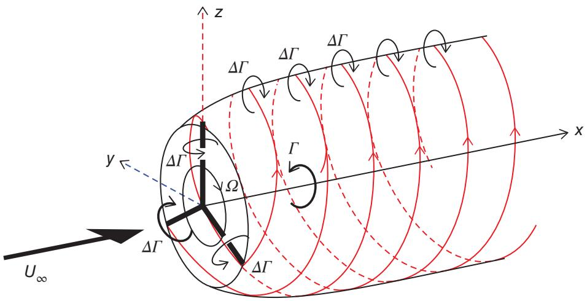

text_image

z
ΔΓ
ΔΓ
ΔΓ
y
Ω
Γ
x
U∞
ΔΓ
ΔΓ

Figure 3.6 Helical vortex wake shed by rotor with three blades each with uniform circulation ΔΓ.

From the root of each blade, assuming it reaches to the axis of rotation, a line vortex of strength ΔΓ will extend downstream along the axis of rotation, contributing to the total root vortex of strength Γ(=BΔΓ). The streamtube will expand in radius as the sow of the wake inside the tube slows down. Because the axial convection of the tip vortices is therefore slowing from the rotor to the far wake, their spacing decreases and hence the vorticity density on the tube sheet representing the tip vortices increases. The vorticity is conrned to the surface of this tube, the root vortex, and to the bound vortex sheet swept by the multiplicity of blades to form the rotor disc; elsewhere in the wake and everywhere else in the entire sow reld the sow is irrotational.

The nature of the tube’s expansion cannot be determined by means of the momentum theory but is known from numerical simulations to be usually fairly small. Therefore, as an approximation, the tube is considered to remain cylindrical, as shown in Figure 3.7.

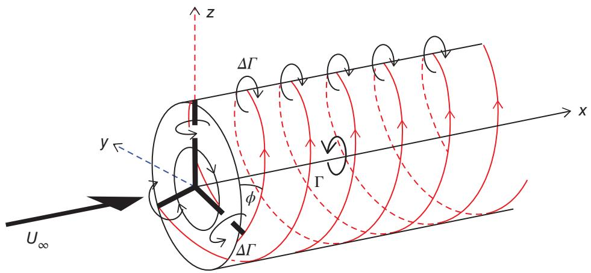

text_image

z
ΔΓ
y
φ
ΔΓ
x
U∞

Figure 3.7 Simplired helical vortex wake ignoring wake expansion.

The Biot–Savart law is used to determine the induced velocity at any point in the vicinity of the actuator disc. The cylindrical vortex model allows the whole sow reld to be determined and is accurate within the limitations of the non-expanding cylindrical wake.

# 3.4.2 Vortex cylinder theory

In the limit of an inrnite number of blades and ignoring expansion the tip vortices form a cylinder with surface vorticity that follows a helical path with a helix angle $\phi _ { t , \cdot }$ which is the same as the sow angle at the outer edge of the disc. The strength of the vorticity is $\begin{array} { r } { g = \frac { \Delta \Gamma } { \Delta n } } \end{array}$ , where $\Delta n$ is the distance along the tube surface in a direction normal to $\Delta \Gamma$ between two successive tip vortices. $g$ has components $g _ { \theta }$ in the azimuthal direction and $g _ { x }$ in the axial direction. Due to $g _ { \theta }$ the axial (parallel to the axis of rotor rotation) induced velocity $u _ { d }$ at the rotor plane is uniform over the rotor disc and can be determined by means of the Biot–Savart law as

$$
u _ {d} = - \frac {g _ {\theta}}{2} = - a U _ {\infty} \tag {3.27}
$$

In the far wake the axial induced velocity $u _ { w }$ is also uniform within the cylindrical wake and is

$$
u _ {w} = - g _ {\theta} = - 2 a U _ {\infty} \tag {3.28}
$$

The ratio of the two induced velocities corresponds to that of the simple momentum theory and justires the assumption of a cylindrical vortex sheet.

# 3.4.3 Relationship between bound circulation and the induced velocity

The total circulation on all of the multiplicity of blades is Γ which is shed at a uniform rate into the wake in one revolution. So, from Figure 3.8 in which the cylinder has been slit longitudinally and opened out sat, we must have for the strength of the axial vorticity that

$$
g _ {x} = \Gamma / 2 \pi R \tag {3.29}
$$

since irrespective of the vortex convection velocities the whole circulation Γ is distributed over the peripheral length 2휋R.

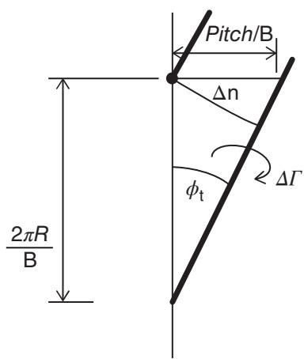

text_image

Pitch/B
Δn
φt
ΔΓ
2πR/B

Figure 3.8 The geometry of the vorticity in the cylinder surface.

To evaluate the strength of the azimuthal vorticity, we require the axial spacing over which it is distributed, i.e. the axial spacing of any tip vortex between one vortex and the next. Vortices and sheets of vorticity must be convected at the velocity of the local sow reld if they are to be force-free. This velocity can be evaluated as the velocity of the whole sow reld at the vortex or vorticity element location less its own local (singular) contribution. In the case of a continuous sheet, it is the average of the velocities on the two sides of the sheet. For axial convection in the ‘far’ wake the two axial velocities are:

$$
U _ {\infty} (1 - 2 a) (\text { inside }) \text {   and   } U _ {\infty} (\text { outside })
$$

so that the axial convection velocity is $U _ { \infty } ( l - a )$ . However, the vortex wake also rotates relative to stationary axes at a rate similarly calculated as halfway between the rotation rate of the suid just inside the downstream wake = 2a ′ΩR and just outside = 0. Therefore, the helical wake vortices (or vortex tube in the limit) rotate at $a ^ { \prime } \Omega R .$ . The result is that the pitch of the helical vortex wake (see Figure 3.8) is

$$
X _ {p} = 2 \pi U _ {\infty} (1 - a) / \Omega (1 + a ^ {\prime}) \tag {3.30}
$$

Using this value we obtain

$$
g _ {\theta} = \lambda \Gamma (1 + a ^ {\prime}) / 2 \pi R (1 - a) \tag {3.31}
$$

where $\lambda = \Omega R / U _ { \infty }$ the tip speed ratio and the rotation period $= 2 \pi / \Omega$ .

$\mathrm { S o } ,$ the total circulation is related to the induced velocity factors

$$
\Gamma = \frac {4 \pi U _ {\infty} ^ {2} a (1 - a)}{\Omega (1 + a ^ {\prime})} \tag {3.32}
$$

It is similarly necessary to include the rotation induction factor to calculate the angle of slant $\varphi _ { t }$ of the vortices:

Thus Tan $\varphi _ { t } = ( 1 - a ) / ( 1 + a ^ { \prime } ) \lambda$

# 3.4.4 Root vortex

Just as a vortex is shed from each blade tip, a vortex is also shed from each blade root. If it is assumed that the blades extend to the axis of rotation, obviously not a practical option, then the root vortices will each be a line vortex running axially downstream from the centre of the disc. The direction of rotation of all of the root vortices will be the same, forming a core, or root, vortex of total strength Γ. The root vortex is primarily responsible for inducing the tangential velocity in the wake sow and in particular the tangential velocity on the rotor disc.

On the rotor disc surface the tangential velocity induced by the root vortex, given by the Biot–Savart law, is

$$
\frac {\Gamma}{4 \pi r} = a ^ {\prime} \Omega r
$$

so

$$
a ^ {\prime} = \frac {\Gamma}{4 \pi r ^ {2} \Omega} \tag {3.33}
$$

This relationship can also be derived from the momentum theory – the rate of change of angular momentum of the air that passes through an annulus of the disc of radius r and radial width 훿r is equal to the torque increment imposed upon the annulus:

$$
\delta Q = \rho U _ {\infty} (1 - a) 2 \pi r 2 a ^ {\prime} r ^ {2} \Omega \delta r \tag {3.34}
$$

The torque per unit span acting on all the blades is given by the Kutta–Joukowski theorem. The lift per unit radial width L is

$$
L = \rho (W \times \Gamma)
$$

where (W × Γ) is a vector product, and W is the relative velocity of the air sow past the blade:

$$
\delta Q = \rho W \times \Gamma r \sin \phi_ {t} \delta r = \rho \Gamma r U _ {\infty} (1 - a) \delta r \tag {3.35}
$$

Equating the two expressions for 훿Q gives

$$
a ^ {\prime} = \frac {\Gamma}{4 \pi r ^ {2} \Omega}
$$

If a ′ in Eq. (3.32) is now treated as being negligible with respect to 1 (which it is in normal circumstances) then:

$$
a ^ {\prime} = \frac {U _ {\infty} ^ {2} a (1 - a)}{(\Omega r) ^ {2}} = \frac {a (1 - a)}{\lambda_ {r} ^ {2}}
$$

At the outer edge of the disc the tangential induced velocity is

$$
a _ {t} ^ {\prime} = \frac {a (1 - a)}{\lambda^ {2}} \tag {3.36}
$$

Equation (3.36) is exactly the same as Eq. (3.23) of Section 3.3.3.

If a ′ is retained in Eq. (3.32), there is a small inconsistency here between vortex theory and the one-dimensional actuator disc theory, which ignores rotation effects.

# 3.4.5 Torque and power

The torque on an annulus of radius r and radial width 훿r (ignoring a′ as actuator disc theory ignores rotation) is

$$
\frac {d Q}{d r} \delta r = \rho W \Gamma r \sin \phi_ {t} \delta r = \frac {\rho 4 \pi r U _ {\infty} ^ {3} a (1 - a) ^ {2}}{\Omega} \delta r \tag {3.37}
$$

The radial distribution of power is

$$
\frac {d P}{d r} = \Omega \frac {d Q}{d r} = \frac {1}{2} \rho U _ {\infty} ^ {3} 2 \pi r 4 a (1 - a) ^ {2} \tag {3.38}
$$

and, therefore, the total power is

$$
P = \frac {1}{2} \rho U _ {\infty} ^ {3} \pi R ^ {2} 4 a (1 - a) ^ {2} \tag {3.39}
$$

Power coefrcient:

$$
C _ {P} = 4 a (1 - a) ^ {2} = 4 a _ {t} ^ {\prime} (1 - a) \lambda^ {2} \tag {3.40}
$$

Again, a result that is identical to that predicted by the simple momentum theory.

What is particularly interesting is that the residual rotational sow in the wake makes no apparent reduction in the efrciency of the power extraction.

# 3.4.6 Axial Kow Jeld

The induced velocity in the windwise (axial) direction can be determined both upstream of the disc and downstream in the developing wake, as well as on the disc itself. This velocity is induced by the azimuthal component of vorticity in the cylindrical wake sheet at radius R (which generates an axisymmetric axial back-sow within the wake) as shown for a radial section in Figure 3.9. Both radial and axial distances are divided by the disc radius, with the axial distance being measured downstream from the disc and the radial distance being measured from the rotational axis. The velocity is divided by the wind speed.

The axial velocity within the wake in this model falls discontinuously across the wake boundary from the external value and is radially uniform at the disc and in the far wake, just as the momentum theory predicts. There is a small acceleration of the sow around the disc immediately outside of the wake. The induced velocity at the wake cylinder surface itself and hence its convection velocity is $- 1 \mathit { h }$ a at the disc and −a in the far wake.

# 3.4.7 Tangential Kow Jeld

The tangential induced velocity is induced by three contributions: that due to the root line vortex along the axis (which generates a rising swirl from zero upstream to a constant value in the far wake), that due to the axial component of vorticity g sin $\phi _ { t }$ in the cylindrical sheet at radius R, and that due to the bound vorticity, everywhere in the radial direction on the disc. The bound vorticity causes rotation in opposite senses upstream and downstream of the disc with a step change across the disc. The upstream rotation, which is in the same sense as the rotor rotation, is nullired by the root vortex, which induces rotation in the opposite sense to that of the rotor. The downstream rotation is in the same sense for both the root vortex and the bound vorticity, the streamwise variations of the two summing to give a uniform velocity in the streamwise sense. The vorticity located on the surface of the wake cylinder makes a small contribution.

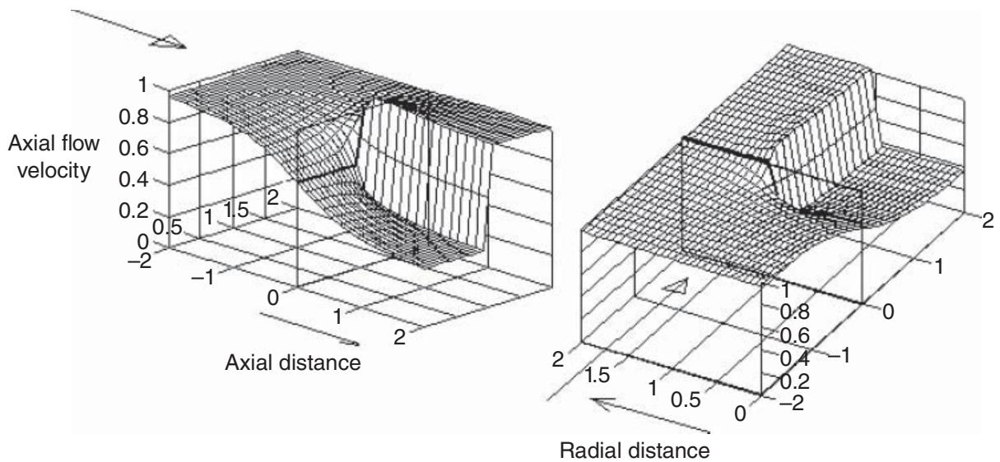

surface_3d

| Axial distance | Radial distance |
| -------------- | --------------- |
| 0              | 0               |
| 1              | 0.5             |
| 2              | 1               |
| 0.5            | 0.8             |
| 1.5            | 0.6             |
| 2              | 0.4             |
| 0              | 0.2             |
| -1             | -0.2            |
| -2             | -0.5            |
| -1.5           | -0.8            |
| 0              | -1              |
| 1              | -1.5            |
| 2              | -2              |

Figure 3.9 The radial and axial variation of axial velocity in the vicinity of an actuator disc, $\begin{array} { r } { a = \frac { 1 } { 3 } } \end{array}$ .

Note that the bound vorticity (being the circulation on the rotor blades in response to the incident and induced sow) induces zero rotation at the disc and decays axially up and downstream. The discontinuity in tangential velocity at the disc is because the idealised changes are assumed to take place through a disc of zero thickness. In reality the azimuthal velocity rises rapidly but continuously as the sow passes through the rotor blades, which sweep through a disc and insuence region of rnite thickness as shown in Figure 3.5.

At the disc itself, because the bound vorticity induces no rotation and the wake cylinder induces no rotation within the wake cylinder either, it is only the root vortex that does induce rotation, and that value is half the total induced generally in the wake. Hence the root vortex induced rotation that is only half the rotational velocity is used to determine the sow angle at the disc. At a radial distance equal to half the disc radius, as an example, the axial variation of the three contributions is shown in Figure 3.10.

The rotational sow is conrned to the wake, that is, inside the cylinder, and tends asymptotically to $2 a ^ { \prime } \Omega$ well downstream of the rotor. There is no rotational sow anywhere outside the wake, neither upstream of the disc nor at radial distances outside the wake cylinder. Because of this there is no rrst order transverse effect of the proximity of a ground plane on the downstream convection of the vortex wake of a wind turbine as there is on the trailing vortices of a rxed wing aircraft. The rotational sow within the wake cylinder decreases radially from the axis to the wake boundary but is not zero at the outer edge of the wake, therefore there is an abrupt fall of rotational velocity across this cylindrical wake surface vortex sheet.

And because of this prorle of rotation the cylindrical vortex sheet itself, therefore, rotates with the mean of the inside and outside angular velocities, $a _ { t } ^ { \prime } \Omega$ , and so the rotation of the sow relative to the disc is $( 1 + a ^ { \prime } ) \Omega$ . The helix angle $\phi _ { t }$ takes this additional rotation into account, as determined from Eq. (3.30).

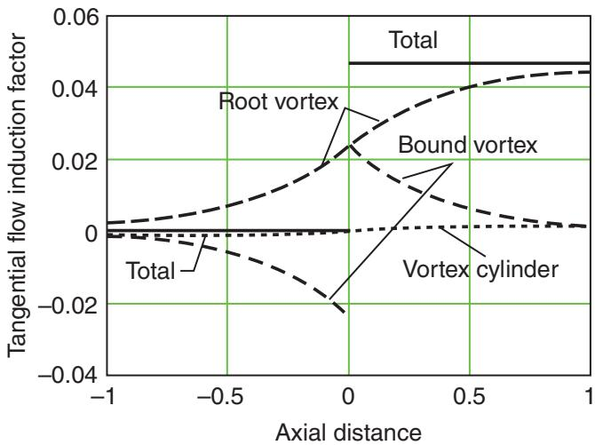

line

| Axial distance | Total | Root vortex | Bound vortex |
| -------------- | ----- | ----------- | ------------ |
| -1.0           | 0.00  | 0.00        | 0.00         |
| -0.5           | 0.00  | 0.01        | 0.00         |
| 0.0            | 0.00  | 0.03        | 0.02         |
| 0.5            | 0.00  | 0.04        | 0.01         |
| 1.0            | 0.00  | 0.05        | 0.00         |

Figure 3.10 The axial variation of tangential velocity in the vicinity of an actuator disc at 50% radius, $\begin{array} { r } { a = \frac 1 3 , \lambda = 6 } \end{array}$ .

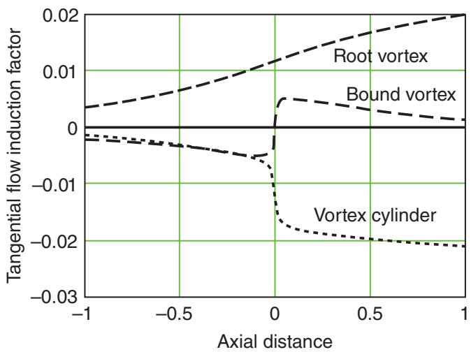

line

| Axial distance | Root vortex | Bound vortex | Vortex cylinder |
| -------------- | ----------- | ------------ | --------------- |
| -1.0           | 0.005       | 0.002        | 0.001           |
| -0.5           | 0.007       | 0.003        | -0.002          |
| 0.0            | 0.010       | 0.004        | -0.015          |
| 0.5            | 0.015       | 0.003        | -0.020          |
| 1.0            | 0.020       | 0.002        | -0.022          |

Figure 3.11 The axial variation of tangential velocity in the vicinity of an actuator disc at 101% radius, $\begin{array} { r } { a = \frac 1 3 , \lambda = 6 } \end{array}$ .

The contributions of the three vorticity sources to the rotational sow at a radius of 101% of the disc radius are shown in Figure 3.11: the total rotational sow is zero at all axial positions, but the individual components are not zero.

# 3.4.8 Axial thrust

The axial thrust T on the disc can be determined using the Kutta–Joukowski theorem:

$$
\frac {d T}{d r} = \rho \Gamma V
$$

where V is the tangential velocity component at the disc. If $\boldsymbol { V } = r \boldsymbol { \Omega } ( \boldsymbol { I } + \boldsymbol { a } ^ { \prime } )$ , then, using Eq. (3.32) ignoring any additional insow at the disc caused by the centrifugal pressure reduction due to wake swirl discussed at the end of Section 3.3.2:

$$
\frac {d T}{d r} = \rho 4 \pi r U _ {\infty} ^ {2} a (1 - a) \tag {3.41}
$$

Integration of Eq. (3.41) over the entire disc gives the thrust coefrcient as

$$
C _ {T} = 4 a (1 - a) \tag {3.42}
$$

That is, the same as for the simple momentum theory and so in balance with the rate of change of axial momentum. Note that if the induced tangential velocity $a ^ { \prime } r \Omega$ is included in V as it is in blade-element/momentum (BEM) theory and the blade circulation is constant from the axis to the tip, there is a singularity in the axial force on the blade section at the axis as there is also at the outer tip. This points to the failure of a simple constant strength bound vortex model at the blade ends as discussed in the section on tip-loss corrections.

# 3.4.9 Radial Kow and the general Kow Jeld

Although the vortex cylinder model has been simplired by not allowing the cylinder to expand, the vortex theory nevertheless predicts sow expansion. A radial velocity is predicted by this theory as in Figure 3.12, which shows a longitudinal section of the sow reld through the rotor disc. The theory is in fact a ‘small disturbance theory’ in which the singularities in the sow reld (the vortex sheets in the present case) are placed on the surfaces they would lie on in the limit of vanishingly small disturbance by the rotor.

The radial velocity reld that is predicted is largest on any given streamline at the actuator disc rising from zero at the axis to a weak logarithmic inrnite value at the edge of the disc, which is the path of the blade tips. The inrnite radial velocity at the edge is associated with non-zero disc loading right up to the edge. This is not realistic, being a consequence of assuming the rotor to consist of an inrnite number of blades whose effect is ‘smeared’ uniformly over the disc, but being a weak singularity does not signircantly affect the rest of the sow reld. In applying the more detailed BEM theory the tip region is corrected by a tip correction factor to recognise that in reality the blade loading must fall to zero at the blade tips.

An alternative method of deriving the velocity reld of the actuator disc has been given more recently by Conway (1998). This method takes the approach of building up the sow reld from a sum of Bessel functions that are fundamental solutions of a cylindrical potential sow. The method has advantages if it is required to calculate the velocity at general points throughout the sow reld both within the bounding streamtube that forms the boundary of the wake and outside it. For the streamwise velocity $U _ { 1 }$ in the simple uniform actuator disc sow:

$$
U _ {1} (r, x) = 1 - a _ {1} \int_ {0} ^ {\infty} e ^ {x x ^ {\prime}} J _ {1} (x ^ {\prime}) J _ {0} (r x ^ {\prime}) d x ^ {\prime} x <   0
$$

$$
U _ {1} (r, x) = 1 - a _ {1} \int_ {0} ^ {\infty} (2 - e ^ {- x x ^ {\prime}}) J _ {1} (x ^ {\prime}) J _ {0} (r x ^ {\prime}) d x ^ {\prime} x \geq 0
$$

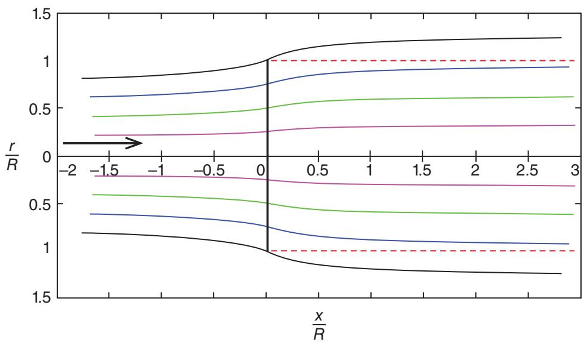

line

| x/R   | r/R (Black) | r/R (Blue) | r/R (Green) | r/R (Pink) |
|-------|-------------|------------|-------------|------------|
| -2.0  | 0.8         | 0.6        | 0.4         | 0.2        |
| -1.5  | 0.8         | 0.6        | 0.4         | 0.2        |
| -1.0  | 0.8         | 0.6        | 0.4         | 0.2        |
| -0.5  | 0.8         | 0.6        | 0.4         | 0.2        |
| 0.0   | 1.0         | 0.8        | 0.5         | 0.3        |
| 0.5   | 1.2         | 0.9        | 0.6         | 0.3        |
| 1.0   | 1.2         | 0.9        | 0.6         | 0.3        |
| 1.5   | 1.2         | 0.9        | 0.6         | 0.3        |
| 2.0   | 1.2         | 0.9        | 0.6         | 0.3        |
| 2.5   | 1.2         | 0.9        | 0.6         | 0.3        |
| 3.0   | 1.2         | 0.9        | 0.6         | 0.3        |

Figure 3.12 Flow reld through an actuator disc for $a = I / 3$ .

where r and x here are radial and streamwise coordinates non-dimensionalised by the tip radius, $a _ { 1 }$ is the wake induction factor, and $J _ { 0 }$ and $J _ { 1 }$ are Bessel functions of the rrst kind.

This sow reld may also be computed by solving the axisymmetric sow equations numerically either as inviscid Euler equations or as the full Navier–Stokes equations to compute the effects of viscous (or turbulent) mixing in the wake of the rotor (see section on computational suid dynamics [CFD] in Chapter 4). Both stream function – vorticity and primitive variable (velocity – pressure) formulations have been used to do this; see, e.g. Mikkelsen (2003), Soerensen et al. (1998), Madsen et al. (2010).

The limiting condition of the cylindrical wake model of the sow through an actuator disc occurs as the loading on the actuator disc is increased so that the wake induction factor a approaches a value of 0.5. At this value the streamwise velocity in the wake $U _ { w } ( =$ $( 1 - 2 \mathrm { a } ) U _ { \infty } )$ falls to zero, and the wake is therefore predicted to expand indernitely to an inrnite cross-section. Beyond this value the wake sow is predicted to be negative, and the theory must break down. The wakes of rotors and also of porous discs normal to a sow that similarly correspond to actuator discs all reach a state when the pressure in the wake region immediately downstream of the body has fallen sufrciently that steady streamline sow can no longer continue stably in the near wake region. Castro (1971) has studied the wake of a porous disc in detail, showing how a reverse sow bubble forms downstream in the wake and moves upstream towards the actuator disc as the loading increases further. This regime is known as the turbulent wake state for a turbine rotor and will be discussed further in the following Section 3.5 on BEM theory.

# 3.4.10 Further development of the actuator model

The one-dimensional actuator disc model and associated vortex cylinder representation of the sow reld is the simplest model of a HAWT that can provide useful results. This model may be developed in several ways to be more representative of the details of the sow.

Radial variation across the actuator disc may be considered as in BEM theory, Section 3.5 below.

Also, recognition may be given to the fact that the turbine has a rnite number of blades, usually a small number such as two or three, each of which may be treated individually as a momentum sink actuator. In the simplest version taking average values, the forces on each blade are assumed to be radially constant. The lift and drag forces calculated from the sow angles at the blades with the relevant aerofoil section characteristics (as in Section 3.5.2) are converted into rotating axial and tangential momentum sinks projected onto a larger reld grid computation. This is the basis of the simplest actuator line model (see Section 3.6).

With the development of large wind farms, particularly offshore, it has become important to simulate the sow through the whole wind farm to calculate the effect of multiple wakes interacting with each other and with the incident atmospheric boundary layer (ABL) and impinging on downstream rotors. Wake interactions have a very signircant effect on power generated by turbines downstream of others (see, e.g. Argyle et al. 2018) and on the buffeting of downstream rotors. The usual method of carrying out these computations is to embed actuator models of the turbines within much larger numerical grid representations of the sow through and surrounding the whole wind farm. This outer large-scale sow is solved numerically on the grid by conventional, and now well-established, CFD Reynolds averaged Navier–Stokes (RANS) or higher rdelity but much more computationally expensive large eddy simulation (LES) computer codes. The actuator model embedded in the grid to represent the action of each turbine may be at the simplest level of an actuator disc model, in which the thrust force on the rotor disc is inserted as a momentum sink, i.e. a step change in momentum in the streamwise direction across grid cells that are intersected by the rotor disc. However, it is usually found desirable to go to a higher level of representation including swirl and embed an actuator line model for each turbine blade in the grid. The rotating actuator lines are now the momentum sinks of both axial and azimuthal forces including the radial variations, which are projected at each timestep onto the adjacent grid points (see, for example, Soerensen and Shen 2002).

# 3.4.11 Conclusions

Despite the exclusion of wake expansion, the vortex theory produces results in agreement with the momentum theory and enlightens understanding of the sow through an energy extracting actuator disc. However, the inrnite radial velocity predicted at the outer edge of the disc is further evidence that the actuator disc is physically unrealisable.

# 3.5 Rotor blade theory (blade-element/momentum theory)

# 3.5.1 Introduction

The aerodynamic lift (and drag) forces on the spanwise elements of radius r and length 훿r of the several blades of a wind turbine rotor are responsible for the rate of change of axial and angular momentum of all of the air that passes through the annulus swept by the blade elements. In addition, the force on the blade elements caused by the drop in pressure associated with the rotational velocity in the wake must also be provided by the aerodynamic lift and drag. As there is no rotation of the sow approaching the rotor, the reduced pressure on the downwind side of the rotor caused by wake rotation appears as a step pressure drop just as is that which causes the change in axial momentum. Because the wake is still rotating in the far wake, the pressure reduction associated with the rotation is still present and so does not contribute to the axial momentum change.

# 3.5.2 Blade element theory

It is assumed that the forces on a blade element can be calculated by means of two-dimensional (2-D) aerofoil characteristics using an angle of attack determined from the incident resultant velocity in the cross-sectional plane of the element. Applying the independence principle (see Appendix 3.1), the velocity component in the spanwise direction is ignored. Three-dimensional (3-D) effects are also ignored.

The velocity components at a radial position on the blade expressed in terms of the wind speed, the sow factors, and the rotational speed of the rotor together with the blade pitch angle will determine the angle of attack. Having information about how the aerofoil characteristic coefrcients $C _ { l }$ and $C _ { d }$ vary with the angle of attack, the forces on the blades for given values of a and $a ^ { \prime }$ can be determined.

Consider a turbine with B blades of tip radius R each with chord c and set pitch angle 훽 measured between the aerofoil chord-line and the plane of the disc. (Note that in referencing the pitch to the blade chord line the zero incidence lift coefrcient must be included). Both the chord length, section prorle (thickness and camber), and the pitch angle may vary along the blade span. Let the blades be rotating at angular velocity Ω and let the wind speed be $U _ { \infty }$ . The tangential velocity experienced by the blade element shown in Figure 3.13 is $( 1 + a ^ { \prime } ) r \Omega$ . The actuator disc is inrnitesimally thin; the change in tangential velocity is abrupt, but it is only the component induced by the root vortex that contributes. This varies smoothly across the region of the actuator disc (Figure 3.10). The bound velocity induced by the vorticity on the disc does not contribute.

Figure 3.14 shows all the velocities and forces relative to the blade chord line at radius r.

From Figure 3.14, the resultant relative velocity at the blade is

$$
W = \sqrt {U _ {\infty} ^ {2} (1 - a) ^ {2} + r ^ {2} \Omega^ {2} (1 + a ^ {\prime}) ^ {2}} \tag {3.43}
$$

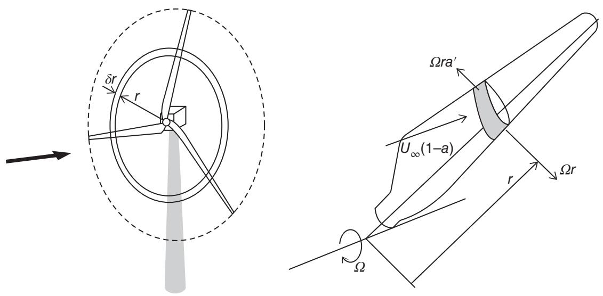

text_image

δr
r
U∞(1-a)
Ωra′
r
Ωr
Ω

Figure 3.13 A blade element sweeps out an annular ring.

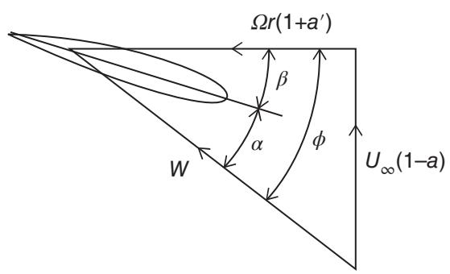

text_image

Ωr(1+a')
β
α
φ
W
U∞(1-a)

Velocities   
(a)

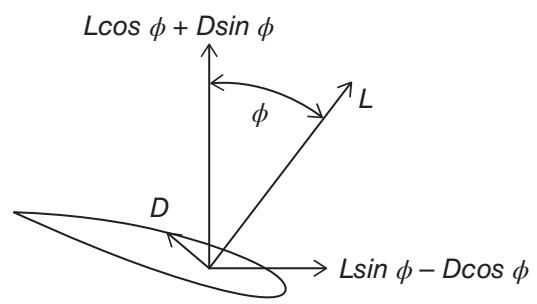

text_image

Lcos φ + Dsin φ
φ
L
D
Lsin φ - Dcos φ

Forces   
(b)   
Figure 3.14 Blade element velocities and forces: (a) velocities, and (b) forces.

that acts at an angle 휙 to the plane of rotation such that

$$
\sin \phi = \frac {U _ {\infty} (1 - a)}{W} \text {   and   } \cos \phi = \frac {r \Omega (1 + a ^ {\prime})}{W} \tag {3.44}
$$

The angle of attack 훼 is then given by

$$
\alpha = \phi - \beta \tag {3.45}
$$

The basic assumption of the blade element theory is that the aerodynamic lift and drag forces acting upon an element are the same as those acting on an isolated, identical element at the same angle of attack in 2-D sow.

The lift force on a spanwise length 훿r of each blade, normal to the direction of W , is therefore

$$
\delta L = \frac {1}{2} \rho W ^ {2} c C _ {l} \delta r
$$

and the drag force parallel to W is

$$
\delta D = \frac {1}{2} \rho W ^ {2} c C _ {d} \delta r
$$

The axial thrust on an annular ring of the actuator disc is

$$
\delta T = \delta L \cos \phi + \delta D \sin \phi = \frac {1}{2} \rho W ^ {2} B c (C _ {l} \cos \phi + C _ {d} \sin \phi) \delta r \tag {3.46}
$$

The torque on an annular ring is

$$
\delta Q = (\delta L \sin \phi - \delta D \cos \phi) r = \frac {1}{2} \rho W ^ {2} B c r (C _ {l} \sin \phi - C _ {d} \cos \phi) \delta r \tag {3.47}
$$

where B is the number of blades.

# 3.5.3 The BEM theory

The basic assumption of the BEM theory is that the force of a blade element is solely responsible for the change of axial momentum of the air that passes through the annulus swept by the element. It is therefore to be assumed that there is no radial interaction between the sows through contiguous annuli: a condition that is, strictly, only true if pressure gradients acting axially on the curved streamlines can be neglected if the axial sow induction factor does not vary radially. In practice, the axial sow induction factor is seldom uniform, but experimental examination of sow through propeller discs by Lock (1924) shows that the assumption of radial independence is acceptable.

Equating the axial thrust on all blade elements, given by Eq. (3.46), with the rate of change of axial momentum of the air that passes through the annulus swept out by the elements, given by Eq. (3.9), with $A _ { D } = 2 \pi r \delta r$

$$
\delta T = \frac {1}{2} \rho W ^ {2} B c (C _ {l} \cos \phi + C _ {d} \sin \phi) \delta r = 2 \pi r \delta r \rho U _ {\infty} (1 - a) 2 a U _ {\infty} (3. 4 8)
$$

It should be noted here that the right hand side of Eq. (3.48) ignores the effect of the swirl velocity (2a’Ωr) on the axial momentum balance through generating a centrifugal pressure gradient in the far wake from the axis to the wake boundary. The resulting pressure reduction that generates an additional pressure drop across the disc was termed $\Delta { p } _ { \mathrm { d } 2 }$ when considered previously in Eq. (3.22).

Equating the torque on the elements, given by Eq. (3.47), with the rate of change of angular momentum of the air passing through the swept annulus, given by Eq. (3.34),

$$
\delta Q = \frac {1}{2} \rho W ^ {2} B c r (C _ {L} \sin \phi - C _ {D} \cos \phi) \delta r = 2 \pi r \delta r \rho U _ {\infty} (1 - a) 2 a ^ {\prime} r ^ {2} \Omega \tag {3.49}
$$

If drag is eliminated from the above two equations, to make a comparison with the results of the vortex theory of Section 3.4, the sow angle $\phi$ can be determined:

$$
\tan \phi = \frac {a ^ {\prime} r \Omega}{a U _ {\infty}} = \frac {a ^ {\prime}}{a} \frac {r}{R} \lambda
$$

However, from the velocity triangle at a blade element given by Eq. (3.44), the sow angle is also

$$
\tan \phi = \frac {1 - a}{\lambda_ {r} (1 + a ^ {\prime})}
$$

Equating the two above expressions for tan휙

$$
{\frac {a ^ {\prime}}{a}} {\frac {r}{R}} \lambda = {\frac {1 - a}{\lambda_ {r} (1 + a ^ {\prime})}}
$$

$$
a (1 - a) = \lambda_ {r} ^ {2} a ^ {\prime} (1 + a ^ {\prime}) \tag {3.50a}
$$

At the outer edge of the rotor $\mu = 1$ and $\boldsymbol { a } ^ { \prime } = \boldsymbol { a } _ { \mathit { t } } ^ { \prime }$ , so

$$
a (1 - a) = \lambda^ {2} a _ {t} ^ {\prime} (1 + a _ {t} ^ {\prime}) \tag {3.50b}
$$

Equation (3.2) is consistent with the earlier Eqs. (3.32) and (3.33).

With drag included the thrust Eq. (3.48) can be reduced to

$$
\frac {W ^ {2}}{U _ {\infty} {} ^ {2}} B \frac {c}{R} (C _ {l} \cos \phi + C _ {d} \sin \phi) = 8 \pi a (1 - a) \mu \tag {3.51}
$$

where the parameter $\begin{array} { r } { \mu = \frac { r } { R } } \end{array}$

If the pressure drop term $\Delta { p } _ { \mathrm { d } 2 }$ is not ignored, the right hand side of Eq. (3.51) becomes $8 \pi \mu \{ a ( 1 - ~ a ) + ( a ^ { \prime } \lambda \mu ) ^ { 2 } \}$ . The additional term $( \boldsymbol a ^ { \prime } \lambda \mu ) ^ { 2 }$ is small and usually negligible except very close to the rotor axis or at low tip speed ratios.

The torque Eq. (3.49) simplires to

$$
\frac {W ^ {2}}{U _ {\infty} {} ^ {2}} B \frac {c}{R} (C _ {l} \sin \phi - C _ {d} \cos \phi) = 8 \pi \lambda \mu^ {2} a ^ {\prime} (1 - a) \tag {3.52}
$$

It is convenient to put

$$
C _ {l} \cos \phi + C _ {d} \sin \phi = C _ {x} \tag {3.53a}
$$

and

$$
C _ {l} \sin \phi - C _ {d} \cos \phi = C _ {y} \tag {3.53b}
$$

Solving Eqs. (3.51) and (3.52) to obtain values for the sow induction factors $a$ and $\boldsymbol { a } ^ { \prime }$ using 2-D aerofoil characteristics requires an iterative process for which the following equations, derived from (3.51), (3.52), and (3.53a and b), are convenient. The right hand sides are evaluated using existing values of the sow induction factors, yielding simple equations for the next iteration of the sow induction factors:

$$
\frac {a}{1 - a} = \frac {\sigma_ {r}}{4 \sin^ {2} \phi} C _ {x} \tag {3.54a}
$$

$$
\frac {a ^ {\prime}}{1 + a ^ {\prime}} = \frac {\sigma_ {r} C _ {y}}{4 \sin \phi \cos \phi} \tag {3.55}
$$

If the additional pressure-drop term $\Delta p _ { \mathrm { d } 2 }$ at the rotor due to wake rotation is included in the analysis, following from Eq. (3.48), Eq. (3.54a) becomes

$$
\frac {a}{1 - a} = \frac {\sigma_ {r}}{4 \sin^ {2} \phi} \left(C _ {x} - \frac {\sigma_ {r}}{4} \frac {C _ {y} ^ {2}}{\sin^ {2} \phi}\right) \tag {3.54b}
$$

Blade solidity 휎 is derned as total blade area divided by the rotor disc area and is a primary parameter in determining rotor performance. Chord solidity $\sigma _ { r }$ is derned as the total blade chord length at a given radius divided by the circumferential length around the annulus at that radius:

$$
\sigma_ {r} = \frac {B}{2 \pi r} \frac {c}{-} = \frac {B}{2 \pi \mu} \frac {c}{R} \tag {3.56}
$$

It is argued by Wilson et al. (1974) that the drag coefrcient should not be included in Eqs. (3.54a or b) and (3.55) because the velocity dercit caused by drag is conrned to the narrow wake that sows from the trailing edge of the aerofoil. Furthermore, Wilson and Lissaman reason, the drag based velocity dercit is only a feature of the wake and does not contribute to the velocity dercit upstream of the rotor disc. The basis of the argument for excluding drag in the determination of the sow induction factors is that, for attached sow, drag is caused only by skin friction and does not affect the pressure drop across the rotor. Clearly, in stalled sow the drag is overwhelmingly caused by pressure. In attached sow – see, e.g. Young and Squire (1938) – the modircation to the inviscid pressure distribution around an aerofoil caused by the boundary layer has a small effect both on lift and drag. The ratio of pressure drag to total drag at zero angle of attack is approximately the same as the thickness to chord ratio of the aerofoil and increases as the angle of attack increases.

One last point about the BEM theory: the theory neglects the axial components of the pressure forces at curved boundaries between streamtubes. It is more accurate if the blades have uniform circulation, i.e. if a is uniform. For non-uniform circulation there is increased radial interaction and exchange of momentum as a result of normal pressure and viscous shear forces between sows through adjacent elemental annular streamtubes. However, in practice, it appears that the error involved is small for tip speed ratios greater than three.

# 3.5.4 Determination of rotor torque and power

The calculation of torque and power developed by a rotor requires a knowledge of the sow induction factors, which are obtained by solving Eqs. (3.54a or b) and (3.55). The solution is usually carried out iteratively because the 2-D aerofoil characteristics are non-linear functions of the angle of attack.

To determine the complete performance characteristic of a rotor, that is, the manner in which the power coefrcient varies over a wide range of tip speed ratio, requires the iterative solution.

The iterative procedure is to assume a and $a ^ { \prime }$ to be zero initially, determining 휙, $C _ { l } ,$ and $C _ { d }$ on that basis, and then to calculate new values of the sow factors using Eqs. (3.54a or b) and (3.55). The iteration is repeated until convergence is achieved.

From $\operatorname { E q } .$ (3.49), the torque developed by the blade elements of spanwise length 훿r is

$$
\delta Q = 4 \pi \rho U _ {\infty} \Omega r a ^ {\prime} (1 - a) r ^ {2} \delta r
$$

If drag, or part of the drag, has been excluded from the determination of the sow induction factors, then its effect must be introduced when the torque is calculated [see Eq. (3.49)]:

$$
\delta Q = 4 \pi \rho U _ {\infty} \Omega r a ^ {\prime} (1 - a) r ^ {2} \delta r - \frac {1}{2} \rho W ^ {2} B c C _ {d} \cos \phi r \delta r
$$

The complete rotor, therefore, develops a total torque $Q \colon$

$$
Q = \frac {1}{2} \rho U _ {\infty} ^ {2} \pi R ^ {3} \lambda \int_ {0} ^ {R} \mu^ {2} \left(8 a ^ {\prime} (1 - a) \mu - \frac {W}{U _ {\infty}} \frac {B \frac {c}{R}}{\pi} C _ {d} (1 + a ^ {\prime})\right) d \mu \tag {3.57}
$$

The power developed by the rotor is $P = Q \Omega$

The power coefrcient is, therefore, $\begin{array} { r } { C _ { P } = \frac { P } { \frac { 1 } { 7 } \rho { U _ { \infty } } ^ { 3 } \pi R ^ { 2 } } } \end{array}$

Solving the blade element − momentum Eqs. (3.54a or b) and (3.55) for a given, suitable blade geometrical and aerodynamic design yields a series of values for the power and torque coefrcients that are functions of the tip speed ratio. A typical performance curve for a modern, high-speed wind turbine is shown in Figure 3.15.

The maximum power coefrcient occurs at a tip speed ratio for which the axial sow induction factor $^ { a , }$ which in general varies with radius, approximates most closely to the Betz limit value of $\mathbf { \partial } \cdot \frac { 1 } { 3 }$ . At lower tip speed ratios the axial sow induction factor can be much less than $\frac { 1 } { 3 }$ and aerofoil angles of attack are high, leading to stalled conditions. For most wind turbines stalling is more likely to occur at the blade root because, from practical constraints, the pitch angle $\beta$ due to built-in twist of a blade is not large enough in that region. At low tip speed ratios blade stalling is the cause of a signircant loss of power, as demonstrated in Figure 3.15. At high tip speed ratios $a$ is high, angles of attack are low, and drag begins to predominate. At both high and low tip speed ratios, therefore, drag is high and the general level of a is non-optimum so the power coefrcient is low. Clearly, it would be best if a turbine can be operated at all wind speeds at a tip speed ratio close to that which gives the maximum power coefrcient.

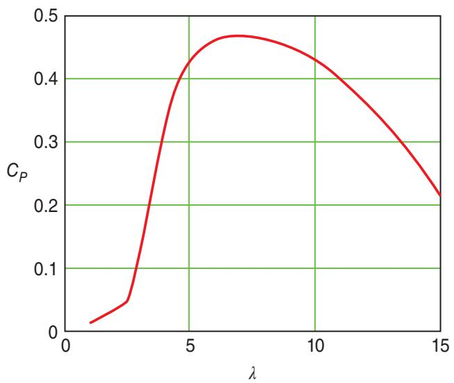

line

| λ   | Cp    |
| --- | ----- |
| 0   | 0.01  |
| 2   | 0.05  |
| 4   | 0.35  |
| 6   | 0.45  |
| 8   | 0.46  |
| 10  | 0.43  |
| 12  | 0.38  |
| 14  | 0.30  |
| 15  | 0.22  |

Figure 3.15 Power coefrcient – tip speed ratio performance curve.

# 3.6 Actuator line theory, including radial variation

Actuator line theory combines the 2-D blade sectional characteristics used in BEM theory with, usually, a CFD grid calculation of the whole sow reld external to the rotor blades including the wake. It is particularly useful for calculating the aerodynamic loads and sow reld quantities where wind turbine rotors operate within a larger complex sow reld such as a wind farm or a non-simple ABL topography.

In this method, the outer sow is computed on a rnite volume or element grid by some method of numerical simulation (usually viscous and turbulent) of the unsteady sow equations, such as unsteady Reynolds averaged Navier–Stokes (URANS) or LES (see discussion in Chapter 4). A number of open-source or commercial codes are available to do this with varying degrees of rdelity and cost. Because the computations are carried out over a sequence of timesteps and are spatially 3-D, this always requires signircant computing resource. The discretisation scale should be appropriate to resolve the major structures of the ABL and its turbulence and the rotor (diameters) and the turbulent structures in their wakes. But it does not resolve the sows on the length scales of the blade chords and their boundary layers and hence is orders of magnitude faster than a complete simulation of all scales in the sow reld.

Instead of resolving the sectional blade sows, these are replaced, as in BEM theory, by aerofoil characteristics from look-up tables (or possibly a fast panel method such as XFOIL; Drela 1989). The rotor blades are tracked through the outer sow grid and the velocity reld, which has been computed on that grid, is interpolated onto the designated rotor blade sections. The resulting sectional blade forces obtained by interpolating from the blade characteristic look-up tables are projected back onto the outer grid as a series of momentum sinks for the components of force in the three coordinate directions. These sinks then form part of the grid sow reld calculation at the next timestep. This coupling between the inner and outer sow calculations may be either loose going from timestep to timestep as indicated or may be a strong coupling in which the sow is converged within each timestep by iteration or by solving the whole in a single very large matrix. Transfer of force and large-scale velocities between the inner and outer sow relds is well established, but methods of determining the effective turbulence input from the smaller-scale structures in the rotor blade sows as sources for the larger-scale outer sow are not, and further work is required here. Good references for this method are Mikkelsen (2003) and Troldborg et al. (2006).

# 3.7 Breakdown of the momentum theory

# 3.7.1 Free-stream/wake mixing

For heavily loaded turbines, when a is high, the momentum theory predicts a reversal of the sow in the wake. Such a situation cannot actually apply uniformly throughout the far wake as predicted. What happens is that the wake becomes unstable with local sow reversal and breakdown into turbulence. This increases the mixing process, which entrains air from outside the wake, re-energising the slow moving air that has passed through the rotor.

A rotor operating at increasingly high tip speed ratios presents a decreasingly permeable disc to the sow. Eventually, when 휆 is high enough for the axial sow factor to be equal to one, the sow reld of the disc would appear to have reached a condition like that of a normal solid disc, including the sow in the wake.

As this condition is approached, the sow through a rotor has many of the features of sow through a porous disc of low and decreasing permeability and hence a large increasing resistance to through-sow. The air that does pass through the rotor emerges into a low-pressure region and is moving slowly. There is insufrcient kinetic energy to provide the rise in static pressure necessary to achieve the ambient atmospheric pressure that exists outside the wake and must exist in the wake far downstream. The air can only achieve this ambient pressure by gaining energy from mixing with the sow that has bypassed the rotor disc and is outside the wake. Castro (1971) has studied in detail the wake of a porous plate as the plate is made increasingly impermeable to sow. At a certain level of resistance, a counter-rotating vortex pair (in planar 2-D sow) or a ring vortex (in axisymmetric sow) forms downstream in the wake as a result of the instability of the wake shear. This vortex structure generates a growing region of reversed sow near the plane of symmetry or axis of the wake. As the resistance is increased further, the vortex structure and region of reversed sow moves upstream until it reaches the downstream face of the plate. Depending on the Reynolds number, but increasingly so for a high Reynolds number, the vortex structure develops further instability and the wake becomes turbulent, greatly increasing mixing with the external sow and recovery of kinetic energy. The wake of a rotor has some signircant differences from that of a porous disc: in particular that the latter does not have the strong helical vortex structure present in the wake of a rotor. Nevertheless, the behaviour of the rotor wake as its resistance is increased is qualitatively very similar, although the point at which the ordered axial sow through a rotor reverses and breaks down into turbulence is not exactly the same as for a porous disc.

# 3.7.2 ModiJcation of rotor thrust caused by wake breakdown

When sow reversal and breakdown into turbulence in the wake of a porous plate occurs, typically starting when the resistance coefrcient K $( = \Delta \mathfrak { p } / ( ^ { 1 } / _ { 2 } \varrho \mathbf { U } ^ { 2 } ) )$ exceeds 4, experimental measurements show that the axial force on the body departs from the well-known theory of Taylor (1944) for ordered sow through a porous plate. Similarly, experimental measurements of the thrust force coefrcient for a rotor – for example, reported by Glauert (1926) and plotted in Figure 3.16 – show a departure from the actuator disc momentum theory $C _ { T } = 4 a ( 1 - a )$ . In both cases the measured forces are larger than the predictions of theory, and in both cases the point of break-away is near the maximum predicted by the momentum theory.

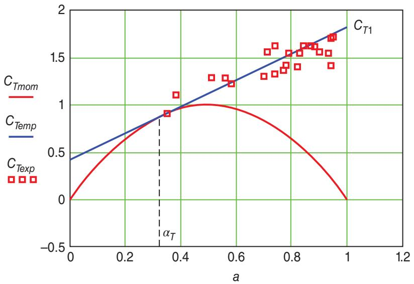

line

| a    | C_Tmom | C_Temp | C_Texp |
|------|--------|--------|--------|
| 0.0  | 0.0    | 0.4    | -      |
| 0.3  | 0.9    | 0.9    | 0.9    |
| 0.4  | 1.0    | 1.0    | 1.1    |
| 0.5  | 1.0    | 1.1    | 1.3    |
| 0.6  | 0.9    | 1.2    | 1.2    |
| 0.7  | 0.8    | 1.3    | 1.5    |
| 0.8  | 0.7    | 1.4    | 1.6    |
| 0.9  | 0.6    | 1.5    | 1.7    |
| 1.0  | 0.0    | 1.6    | -      |

Figure 3.16 Comparison of theoretical and measured values of $C _ { T } .$ .

The thrust (or drag) coefrcient for a simple, sat circular plate is given by Hoerner (1965) as 1.17 but, as demonstrated in Figure 3.16, the thrust on the rotor reaches a higher value. A major difference between the wake of the circular plate and of the rotor is that the latter contains a strong rotating component even after sow reversal in the wake has started.

It would follow from the above arguments that for high values of the axial induction factor a large part of the pressure drop across the disc is not simply associated with blade circulation, just as it is absent in the case of the circular plate. Circulation would cause a pressure drop similar to that given by the momentum theory determined by the very low axial velocity of the sow that actually permeates the disc.

# 3.7.3 Empirical determination of thrust coefJcient

A suitable straight line through the experimental points would appear to be possible, although Glauert proposed a parabolic curve, and provides an empirical solution to the problem of the thrust on a heavily loaded turbine (a rotor operating at a high value of the axial sow induction factor).

Most authors assume that the entire thrust on the rotor disc is associated with axial momentum change. Therefore, for the empirical line to be useful it must be assumed that it applies not only to the whole rotor but also to each separate streamtube. Let $C _ { T 1 }$ be the empirical value of $C _ { T }$ when a = 1. Then, as the straight line must be a tangent to the momentum theory parabola at the transition point, the equation for the line is

$$
C _ {T} = C _ {T 1} - 4 (\sqrt {C} _ {T 1} - 1) (1 - a) \tag {3.58}
$$

and the value of a at the transition point is

$$
a _ {T} = 1 - \frac {1}{2} \sqrt {C _ {T 1}}
$$

By inspection, $C _ { T 1 }$ must lie between 1.6 and 2: $C _ { T 1 } = 1 . 8 1 6$ would appear to be the best rt to the experimental data of Figure 3.16, whereas Wilson et al. (1974) favour the lower value of $C _ { T 1 } = 1 . 6$ . Glauert rts a parabolic curve to the data [replacing a in the mass sow expression by $4 a ( { I - a } ) / ( 0 . 6 + 0 . 6 I a + 0 . 7 9 a ^ { 2 } )$ when $a > I / 3 ]$ giving much higher values of $C _ { T 1 }$ at high values of a but he was considering the case of an airscrew in the windmill brake state where the angles of attack are negative. De Vaal et al. (2014) suggest a be replaced by $ { \theta . 2 5 a ( 5 - 3 a ) }$ , similarly giving a somewhat lower windmill brake state result.

The sow reld through the turbine under heavily loaded conditions cannot be modelled easily, and the results of this empirical analysis must be regarded as being only approximate at best. They are, nevertheless, better than those predicted by the momentum theory. For most practical designs the value of the axial sow induction factor rarely exceeds 0.6 and for a well-designed rotor will be in the vicinity of 0.33 for much of its operational range.

For values of a greater than $a _ { T , }$ it is common to replace the momentum theory thrust in Eq. (3.9) with Eq. (3.58), in which case Eq. (3.1) is replaced by

$$
(1 - a) ^ {2} \frac {\sigma_ {r}}{\sin^ {2} \phi} C _ {x} + 4 (\sqrt {C _ {T 1}} - 1) (1 - a) - C _ {T 1} = 0 \tag {3.59}
$$

However, as the additional pressure drop is caused by breakdown of the streamline wake, this course of action is questionable, and it may be more appropriate to retain Eq. (3.54).

# 3.8 Blade geometry

# 3.8.1 Introduction

The purpose of most wind turbines is to extract as much energy from the wind as possible, and each component of the turbine has to be optimised for that goal. Optimal blade design is insuenced by the mode of operation of the turbine, that is, rxed rotational speed or variable rotational speed and, ideally, the wind distribution at the intended site. In practice engineering compromises are made, but it is still necessary to know what would be the best design.

Optimising a blade design means maximising the power output, and so a suitable solution to BEM Eqs. (3.54 or (3.59) and (3.55)) is necessary.

# 3.8.2 Optimal design for variable-speed operation

A turbine operating at variable speed can maintain the constant tip speed ratio required for the maximum power coefrcient to be developed regardless of wind speed. To develop the maximum possible power coefrcient requires a suitable blade geometry, the conditions for which will now be derived.

For a chosen tip speed ratio 휆 the torque developed at each blade station is given by Eq. (3.49) and is maximised if

$$
\frac {d}{d a ^ {\prime}} a ^ {\prime} (1 - a) = 0
$$

giving

$$
\frac {d a}{d a ^ {\prime}} = \frac {1 - a}{a ^ {\prime}} \tag {3.60}
$$

From Eqs. (3.51) and (3.52) a relationship between the sow induction factors can be obtained. Dividing Eq. (3.52) by the modired Eq. (3.51), modired to include the additional loss of axial momentum from the pressure drop term $\Delta { p } _ { \mathrm { d } 2 }$ in the far wake due to the centrifugal swirl generated radial pressure gradient, leads to:

$$
\frac {C _ {l} / C _ {d} \tan \phi - 1}{C _ {l} / C _ {d} + \tan \phi} = \frac {\lambda \mu a ^ {\prime} (1 - a)}{a (1 - a) + (a ^ {\prime} \lambda \mu) ^ {2}} \tag {3.61}
$$

The sow angle 휙 is given by

$$
\tan \phi = \frac {1 - a}{\lambda \mu (1 + a ^ {\prime})} \tag {3.62}
$$

Substituting Eq. (3.62) into Eq. (3.61) gives

$$
\frac {C _ {l} / C _ {d} \frac {1 - a}{\lambda \mu (1 + a ^ {\prime})} - 1}{C _ {l} / C _ {d} + \frac {1 - a}{\lambda \mu (1 + a ^ {\prime})}} = \frac {\lambda \mu a ^ {\prime} (1 - a)}{a (1 - a) + (a ^ {\prime} \lambda \mu) ^ {2}}
$$

Simplifying:

$$
\begin{array}{l} [ (1 - a) C _ {L} - \lambda \mu (1 + a ^ {\prime}) C _ {D} ]. [ a (1 - a) + (\mathrm{a} ^ {\prime} \lambda \mu) ^ {2} ] \\ = [ \lambda \mu (1 + a ^ {\prime}) C _ {L} + (1 - a) C _ {D} ] \lambda \mu a ^ {\prime} (1 - a) \tag {3.63} \\ \end{array}
$$

At this stage the process is made easier to follow if drag is ignored; Eq. (3.63) then reduces to

$$
a (1 - a) - \lambda^ {2} \mu^ {2} a ^ {\prime} = 0 \tag {3.64}
$$

Differentiating Eq. (3.64) with respect to a′ gives

$$
(1 - 2 a) \frac {d a}{d a ^ {\prime}} - \lambda^ {2} \mu^ {2} = 0 \tag {3.65}
$$

and substituting Eq. (3.60) into (3.65)

$$
(1 - 2 a) (1 - a) - \lambda^ {2} \mu^ {2} a ^ {\prime} = 0 \tag {3.66}
$$

Equations (3.64, 3.66), together, give the sow induction factors for optimised operation:

$$
a = \frac {1}{3} \text {   and   } a ^ {\prime} = \frac {a (1 - a)}{\lambda^ {2} \mu^ {2}} \tag {3.67}
$$

These are consistent at the rotor tip (where 휇 = 1) with Eq. (3.2) provided a′ is sufrciently small compared with unity for terms in $a ^ { \prime 2 }$ to be neglected. This is normally true at the rotor tip, and these results agree exactly with the momentum theory prediction, because no losses such as aerodynamic drag have been included, and the number of blades is assumed to be large. This last assumption means that every suid particle that passes through the rotor disc interacts strongly with a blade, resulting in the axial velocity being more uniform over the area of the disc. If the same analysis is followed excluding the swirl pressure drop term, then $a = 1 / 3 - \mathtt { a }$ small term ${ \sim } 2 / ( 9 \lambda \mu ) ^ { 2 }$ , which is negligible except very close to the axis (blade root) or when the rotor tip speed ratio is very low.

To achieve the optimum conditions, the blade design has to be specirc and can be determined from either of the fundamental Eqs. (3.48) and (3.49). Choosing Eq. (3.49), because it is the simpler, ignoring the drag, and assuming $a ^ { \prime } \ll 1$ , the torque developed in optimised operation is

$$
\delta Q = 4 \pi \rho U _ {\infty} \Omega r a ^ {\prime} (1 - a) r ^ {2} \delta r = 4 \pi \rho \frac {U _ {\infty} ^ {3}}{\Omega} a (1 - a) ^ {2} r \delta r
$$

The component of the lift per unit span in the tangential direction is therefore

$$
L \sin \phi = 4 \pi \rho \frac {U _ {\infty} ^ {3}}{\Omega} a (1 - a) ^ {2}
$$

By the Kutta–Joukowski theorem the lift per unit span is

$$
L = \rho W \Gamma
$$

where Γ is the sum of the individual blade circulations and W is the component of incident velocity mutually perpendicular to both Γ and $L .$ .

It is important to note that where the incident velocity varies spatially, as here, W takes the value that would exist at the effective position of the bound vortex representing the local blade circulation excluding its own induced velocity.

Consequently,

$$
\rho W \Gamma \sin \phi = \rho \Gamma U _ {\infty} (1 - a) = 4 \pi \rho \frac {U _ {\infty} ^ {3}}{\Omega} a (1 - a) ^ {2} \tag {3.68}
$$

so

$$
\Gamma = 4 \pi \frac {U _ {\infty} ^ {2}}{\Omega} a (1 - a) \tag {3.69}
$$

If, therefore, $a$ is to take everywhere the optimum value (1/3), the circulation must be uniform along the blade span, and this is a condition for optimised operation.

To determine the blade geometry, that is, how should the chord size vary along the blade and what pitch angle $\beta$ distribution is necessary, neglecting the effect of drag, we must return to Eq. (3.52) with $C _ { D }$ set to zero:

$$
\frac {W ^ {2}}{U _ {\infty} ^ {2}} B \frac {c}{R} C _ {l} \sin \phi = 8 \pi \lambda \mu^ {2} a ^ {\prime} (1 - a)
$$

substituting for sin휙 gives

$$
\frac {W}{U _ {\infty}} B \frac {c}{R} C _ {l} (1 - a) = 8 \pi \lambda \mu^ {2} a ^ {\prime} (1 - a) \tag {3.70}
$$

The value of the lift coefrcient $C _ { l }$ in the above equation is an input, and it is commonly included as above on the left side of Eq. (3.70) with a ‘chord solidity’ parameter representing blade geometry. The lift coefrcient can be chosen as that value that corresponds to the maximum lift/drag ratio $\frac { C _ { l } } { C _ { d } }$ as this will minimise drag losses: even though drag has been ignored in the determination of the optimum sow induction factors and blade geometry, it cannot be ignored in the calculation of torque and power. Blade geometry also depends upon the tip speed ratio 휆, which is also an input. From Eq. (3.70) the blade geometry parameter can be expressed as

$$
\frac {B}{2 \pi} \frac {c}{R} = \frac {4 \lambda \mu^ {2} a ^ {\prime}}{\frac {W}{U _ {\infty}} C _ {l}}
$$

Hence

$$
\sigma_ {r} \lambda \mu C _ {l} = \frac {B}{2 \pi} \frac {c}{R} \lambda C _ {l} = \frac {4 \lambda^ {2} \mu^ {2} a ^ {\prime}}{\sqrt {(1 - a) ^ {2} + (\lambda \mu (1 + a ^ {\prime})) ^ {2}}} \tag {3.71}
$$

Introducing the optimum conditions of Eq. (3.67),

$$
\sigma_ {r} \lambda \mu C _ {l} = \frac {B c}{2 \pi R} \lambda C _ {l} = \frac {\frac {8}{9}}{\sqrt {\left[ 1 - \frac {1}{3} \right] ^ {2} + \lambda^ {2} \mu^ {2} \left[ 1 + \frac {2}{9 \lambda^ {2} \mu^ {2}} \right] ^ {2}}} \tag {3.72}
$$

The parameter $\lambda \mu$ is the local speed ratio $\lambda _ { r }$ and is equal to the tip speed ratio where $\mu = 1$ .

If, for a given design, $C _ { l }$ is held constant, then Figure 3.17 shows the blade plan-form for increasing tip speed ratio. A high design tip speed ratio would require a long, slender blade (high aspect ratio) whilst a low design tip speed ratio would need a short, fat blade. The design tip speed ratio is that at which optimum performance is achieved. Operating a rotor at other than the design tip speed ratio gives a less than optimum performance even in ideal drag-free conditions.

In off-optimum operation, the axial insow factor is not uniformly equal to $1 / 3 ;$ in fact, it is not uniform at all.

The local insow angle $\phi$ at each blade station also varies along the blade span, as shown in Eq. (3.73) and Figure 3.18:

$$
\phi = \tan^ {- 1} \left\{\frac {1 - a}{\lambda \mu (1 + a ^ {\prime})} \right\} \tag {3.73}
$$

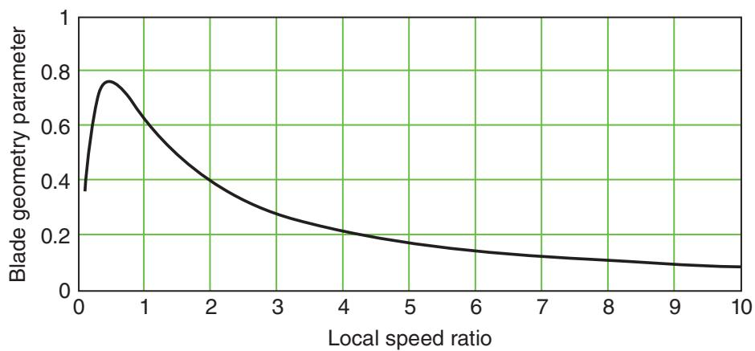

line

| Local speed ratio | Blade geometry parameter |
| ----------------- | ------------------------ |
| 0                 | 0.38                     |
| 0.5               | 0.78                     |
| 1                 | 0.65                     |
| 2                 | 0.40                     |
| 3                 | 0.28                     |
| 4                 | 0.22                     |
| 5                 | 0.18                     |
| 6                 | 0.15                     |
| 7                 | 0.13                     |
| 8                 | 0.11                     |
| 9                 | 0.10                     |
| 10                | 0.09                     |

Figure 3.17 Variation of blade geometry parameter with local speed ratio.

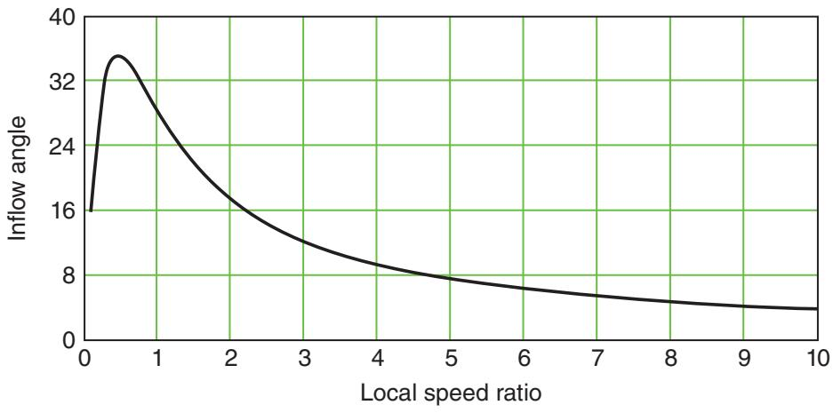

line

| Local speed ratio | Inflow angle |
| ----------------- | ------------ |
| 0                 | 16           |
| 1                 | 32           |
| 2                 | 24           |
| 3                 | 16           |
| 4                 | 10           |
| 5                 | 8            |
| 6                 | 7            |
| 7                 | 6            |
| 8                 | 5            |
| 9                 | 4            |
| 10                | 3            |

Figure 3.18 Variation of insow angle with local speed ratio.

which, for optimum operation, is

$$
\phi = \tan^ {- 1} \left\{\frac {1 - \frac {1}{3}}{\lambda \mu \left(1 + \frac {2}{9 \lambda^ {2} \mu^ {2}}\right)} \right\} \tag {3.74}
$$

Close to the blade root the insow angle is large, which could cause the blade to stall in that region. If the lift coefrcient is to be held constant such that drag is minimised everywhere, then the angle of attack 훼 also needs to be uniform at the appropriate value. For a prescribed angle of attack variation, the design pitch angle $\beta = \phi - \alpha$ of the blade must vary accordingly.

As an example, suppose that the blade aerofoil is National Advisory Committee for Aeronautics (NACA) 4412, popular for hand-built wind turbines because the bottom (high-pressure) side of the prorle is almost sat, which facilitates manufacture. At a Reynolds number of about $5 \cdot 1 0 ^ { 5 }$ the maximum lift/drag ratio occurs at a lift coefrcient of about 0.7 and an angle of attack of about $3 ^ { \circ }$ . Assuming that both $C _ { l }$ and 훼 are to be held constant along each blade and there are to be three blades operating at a tip speed ratio of 6 then the blade design in pitch (twist) and plan-form variation are shown in Figures 3.19a and b, respectively. This blade solidity becomes very large at the root but can be accommodated to around $\mathrm { r / R } = 0$ .1 depending on the location of the blade axis.

# 3.8.3 A simple blade design

The blade design of Figure 3.19 is efrcient but complex to build and therefore costly. Suppose the plan-form was prescribed to have a uniform taper such that the outer part of the blade corresponds closely to Figure 3.19b. The straight line given by Eq. (3.75) and shown as the solid line in Figure 3.20 has been derived to minimise the departure from the true curve [Eq. (3.72))] in the outer region $0 . 7 < r / R < 0 . 9$ . This linear taper not only simplires the plan-form but removes a lot of material close to the root.

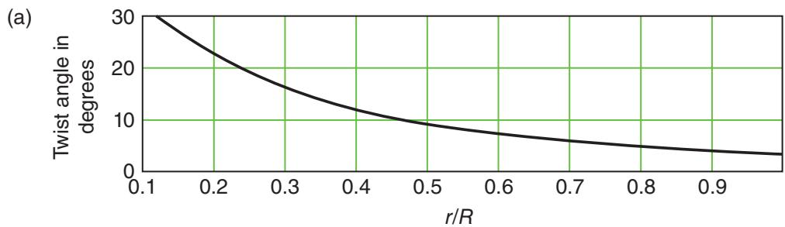

line

| r/R  | Twist angle in degrees |
| ---- | ---------------------- |
| 0.1  | 30.0                   |
| 0.2  | 25.0                   |
| 0.3  | 20.0                   |
| 0.4  | 15.0                   |
| 0.5  | 10.0                   |
| 0.6  | 8.0                    |
| 0.7  | 6.0                    |
| 0.8  | 5.0                    |
| 0.9  | 4.0                    |

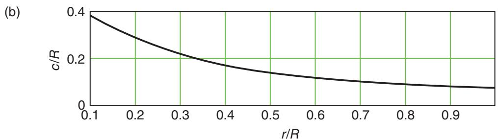

line

| r/R  | c/R  |
| ---- | ---- |
| 0.1  | 0.4  |
| 0.2  | 0.3  |
| 0.3  | 0.25 |
| 0.4  | 0.2  |
| 0.5  | 0.15 |
| 0.6  | 0.12 |
| 0.7  | 0.1  |
| 0.8  | 0.08 |
| 0.9  | 0.07 |

Figure 3.19 Optimum blade design for three blades and 휆 = 6: (a) blade twist distribution, and (b) blade plan-form.

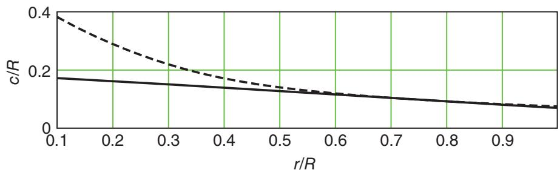

line

| r/R  | c/R (solid line) | c/R (dashed line) |
|------|------------------|-------------------|
| 0.1  | 0.18             | 0.38              |
| 0.2  | 0.17             | 0.30              |
| 0.3  | 0.16             | 0.24              |
| 0.4  | 0.15             | 0.19              |
| 0.5  | 0.14             | 0.15              |
| 0.6  | 0.13             | 0.12              |
| 0.7  | 0.12             | 0.10              |
| 0.8  | 0.11             | 0.08              |
| 0.9  | 0.10             | 0.07              |

Figure 3.20 Uniform taper blade design for optimal operation.

The expression for this chord distribution approximation to the optimum plan-form (Figure 3.20) is

$$
c _ {l i n} = \frac {8}{9 \cdot 0 . 8 \lambda} \left(2 - \frac {\lambda \mu}{0 . 8 \lambda}\right) \frac {2 \pi R}{C _ {l} \lambda B} \tag {3.75}
$$

The 0.8 in Eq. (3.75) refers to the 80% point, approximating in this case the solid line between target points 0.7 and 0.9 by the tangent at 0.8, which is very close to it.

Equation (3.75) can then be combined with Eq. (3.72) to give the modired spanwise variation of $C _ { l }$ for optimal operation of the uniformly tapered blade (Figure 3.21):

$$
C _ {l} = \frac {8}{9} \frac {1}{\frac {B c _ {\text {lin}} \lambda}{2 \pi R} \sqrt {\left(1 - \frac {1}{3}\right) ^ {2} + \lambda^ {2} \mu^ {2} \left(1 + \frac {2}{9 \lambda^ {2} \mu^ {2}}\right) ^ {2}}}
$$

Close to the blade root the lift coefrcient approaches the stalled condition and drag is high, but the penalty is small because the adverse torque is small in that region.

Assuming that stall does not occur, for the aerofoil in question, which has a 4% camber (this approximates to a zero lift angle of attack of $- 4 ^ { o } )$ , the lift coefrcient is given

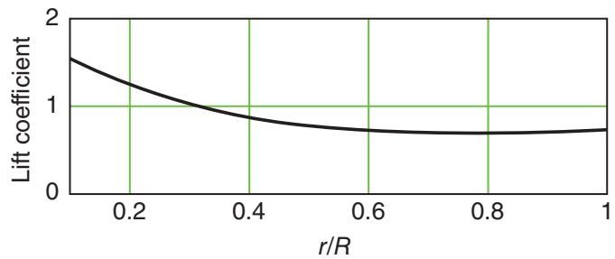

line

| r/R  | Lift coefficient |
| ---- | ---------------- |
| 0.0  | 1.5              |
| 0.2  | 1.2              |
| 0.4  | 0.9              |
| 0.6  | 0.7              |
| 0.8  | 0.6              |
| 1.0  | 0.6              |

Figure 3.21 Spanwise distribution of the lift coefrcient required for the linear taper blade.

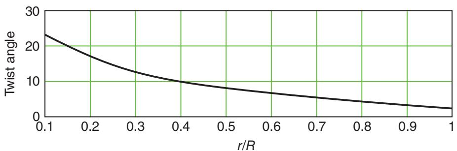

line

| r/R | Twist angle |
| --- | --- |
| 0.1 | 23.0 |
| 0.2 | 18.0 |
| 0.3 | 14.0 |
| 0.4 | 10.0 |
| 0.5 | 8.0 |
| 0.6 | 6.0 |
| 0.7 | 5.0 |
| 0.8 | 4.0 |
| 0.9 | 3.0 |
| 1.0 | 2.0 |

Figure 3.22 Spanwise distribution of the twist in degrees required for the linear taper blade.

approximately by

$$
C _ {l} = 0. 1 (\alpha + 4 ^ {o})
$$

where 훼 is in degrees and 0.1 is a good approximation to the gradient of the $C _ { l }$ vs $\alpha ^ { \mathrm { o } }$ for most aerofoils, so $\begin{array} { r } { \alpha = \frac { C _ { l } } { 0 . 1 } - 4 ^ { o } } \end{array}$ .

The blade twist distribution can now be determined from Eqs. (3.74) and (3.45) and is shown in Figure 3.22.

The twist angle close to the root is still high but lower than for the constant $C _ { l }$ blade.

# 3.8.4 Effects of drag on optimal blade design

If, despite the views of Wilson et al. (1974) – see Section 3.5.3, the effects of drag are included in the determination of the sow induction factors, we must return to Eq. (3.48) and follow the same procedure as described for the drag-free case.

In the current context, the effects of drag are dependent upon the magnitude of the lift/drag ratio, which, in turn, depends on the aerofoil prorle but largely on Reynolds number and on the surface roughness of the blade. A high value of lift/drag ratio would be about 150, whereas a low value would be about 40.

Unfortunately, with the inclusion of drag, the algebra of the analysis is complex. Polynomial equations have to be solved for both a and $a ^ { \prime }$ . The details of the analysis are left for the reader to discover.

In the presence of drag, the axial sow induction factor for optimal operation is not uniform over the disc because it is in the hypothetical drag-free situation. However, the departure of the axial sow distribution from uniformity is not great, even when the lift/drag ratio is low, provided the sow around a blade remains attached.

The radial variation of the axial and tangential sow induction factors is shown in Figure 3.23 for zero drag and for a lift/drag ratio of 40. The tangential sow induction factor is lower in the presence of drag than without because the blade drags the suid around in the direction of rotation, opposing the general rotational reaction to the shaft torque.

From the torque/angular momentum Eq. (3.52), the blade geometry parameter becomes

$$
\frac {B c \lambda}{2 \pi R} C _ {l} = \frac {4 \lambda^ {2} \mu^ {2} a ^ {\prime} (1 - a)}{\frac {W}{U _ {\infty}} \left[ (1 - a) - \frac {C _ {d}}{C _ {l}} \lambda \mu (1 + a ^ {\prime}) \right]} \tag {3.76}
$$

Figure 3.24 compares the blade geometry parameter distributions for zero drag and a lift/drag ratio of 40, and, as is evident, drag has very little effect on blade optimal design.

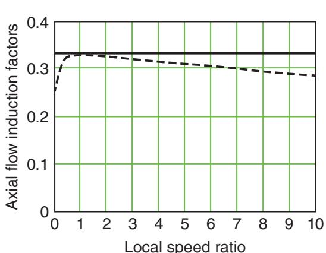

line

| Local speed ratio | Axial flow induction factors |
| ----------------- | ---------------------------- |
| 0                 | 0.25                         |
| 1                 | 0.33                         |
| 2                 | 0.33                         |
| 3                 | 0.32                         |
| 4                 | 0.31                         |
| 5                 | 0.30                         |
| 6                 | 0.29                         |
| 7                 | 0.28                         |
| 8                 | 0.27                         |
| 9                 | 0.26                         |
| 10                | 0.25                         |

Zero drag L/D = 40

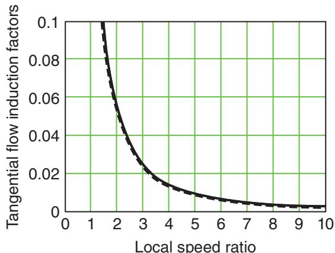

line

| Local speed ratio | Tangential flow induction factors |
| ----------------- | ---------------------------------- |
| 0                 | 0.1                                |
| 1                 | 0.08                               |
| 2                 | 0.06                               |
| 3                 | 0.04                               |
| 4                 | 0.02                               |
| 5                 | 0.01                               |
| 6                 | 0.005                              |
| 7                 | 0.003                              |
| 8                 | 0.002                              |
| 9                 | 0.001                              |
| 10                | 0.001                              |

Figure 3.23 Radial variation of the sow induction factors with and without drag.   
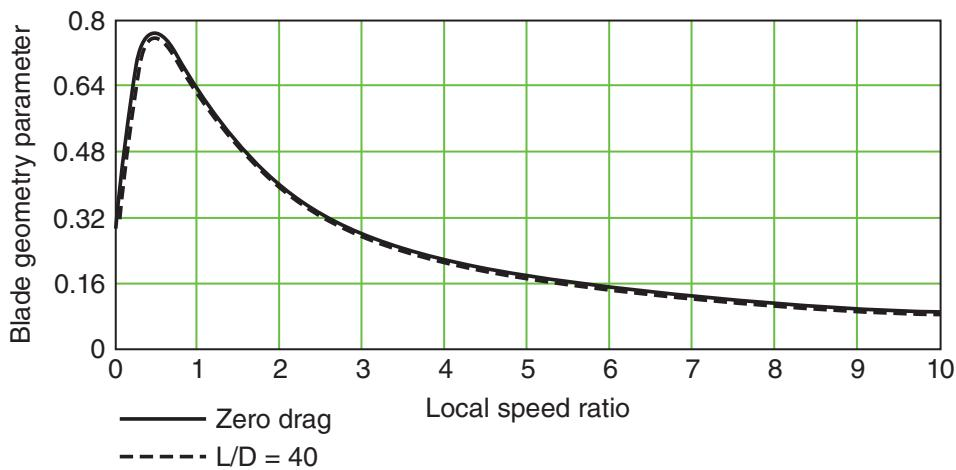

line

| Local speed ratio | Blade geometry parameter (Zero drag) | Blade geometry parameter (L/D = 40) |
| ----------------- | ------------------------------------ | ----------------------------------- |
| 0                 | 0.32                                 | 0.32                                |
| 1                 | 0.78                                 | 0.78                                |
| 2                 | 0.64                                 | 0.64                                |
| 3                 | 0.48                                 | 0.48                                |
| 4                 | 0.32                                 | 0.32                                |
| 5                 | 0.24                                 | 0.24                                |
| 6                 | 0.16                                 | 0.16                                |
| 7                 | 0.12                                 | 0.12                                |
| 8                 | 0.10                                 | 0.10                                |
| 9                 | 0.08                                 | 0.08                                |
| 10                | 0.06                                 | 0.06                                |

Figure 3.24 Spanwise variation of the blade geometry parameter with and without drag.

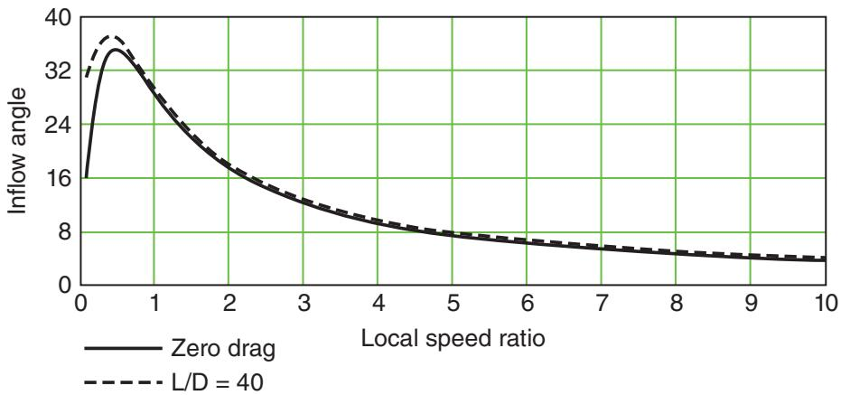

line

| Local speed ratio | Zero drag | L/D = 40 |
| ----------------- | --------- | -------- |
| 0                 | 16        | 32       |
| 1                 | 36        | 34       |
| 2                 | 24        | 24       |
| 3                 | 16        | 16       |
| 4                 | 12        | 12       |
| 5                 | 8         | 8        |
| 6                 | 7         | 7        |
| 7                 | 6         | 6        |
| 8                 | 5         | 5        |
| 9                 | 4         | 4        |
| 10                | 3         | 3        |

Figure 3.25 Variation of insow angle with local speed ratio with and without drag.

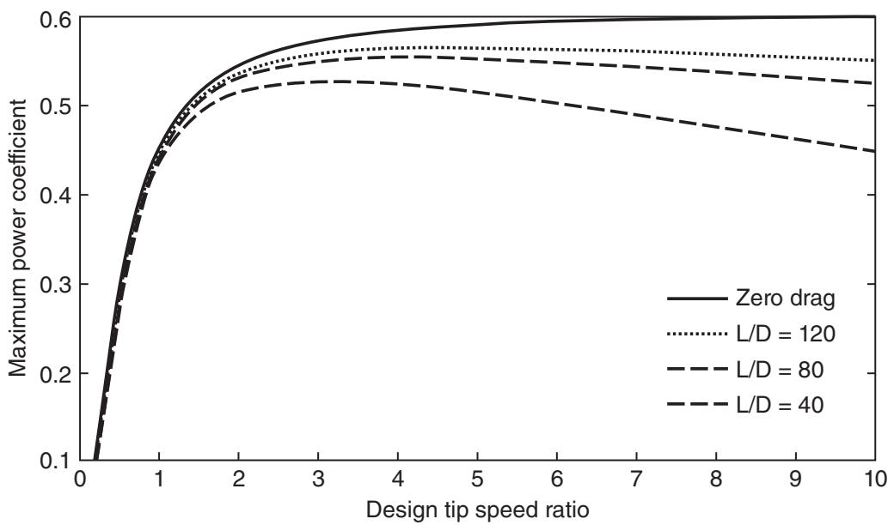

line

| Design tip speed ratio | Zero drag | L/D = 120 | L/D = 80 | L/D = 40 |
| ---------------------- | --------- | --------- | -------- | -------- |
| 0                      | 0.1       | 0.1       | 0.1      | 0.1      |
| 1                      | 0.5       | 0.48      | 0.45     | 0.43     |
| 2                      | 0.55      | 0.52      | 0.5      | 0.48     |
| 3                      | 0.57      | 0.54      | 0.52     | 0.5      |
| 4                      | 0.58      | 0.55      | 0.53     | 0.51     |
| 5                      | 0.59      | 0.56      | 0.54     | 0.52     |
| 6                      | 0.595     | 0.565     | 0.545    | 0.525    |
| 7                      | 0.597     | 0.567     | 0.547    | 0.527    |
| 8                      | 0.598     | 0.568     | 0.548    | 0.528    |
| 9                      | 0.599     | 0.569     | 0.549    | 0.529    |
| 10                     | 0.6       | 0.57      | 0.55     | 0.53     |

Figure 3.26 The variation of maximum $C _ { P }$ with design 휆 for various lift/drag ratios.

A similar result is apparent for the insow angle distribution (Figure 3.25), in which drag is also seen to have little insuence.

As far as blade design for optimal operation is concerned, drag can be ignored, greatly simplifying the process.

The results of Eq. (3.57) show that the maximum power coefrcients for a range of design tip speed ratios and several lift/drag ratios are as shown in Figure 3.26. The sow induction factors have been determined without drag using Eqs. (3.54a) and (3.55), but the torque has been calculated using Eq. (3.57), which includes drag. The losses caused by drag are signircant and increase with increasing design tip speed ratio. As will be shown later, when tip-losses are also taken into account, the losses at low tip speed ratios are even greater.

# 3.8.5 Optimal blade design for constant-speed operation

If the rotational speed of a turbine is maintained at a constant level, then the tip speed ratio is continuously changing, and a blade optimised for a rxed tip speed ratio would not be appropriate. Closed-form solutions have been derived for optimum wind turbines; see Peters and Modarres (2013) and Jamieson (2018).

No simple technique is available for the optimal design of a blade operating at constant rotational speed. Non-linear (numerical) optimisation techniques may be used to solve the problem of maximising energy capture at a given site incorporating the data on its specirc wind speed distribution. Alternatively, a design tip speed ratio can be chosen corresponding to the wind speed at the specired site that contains the most energy, or, more practically, the pitch angle for the whole blade can be adjusted to maximise energy capture.

# 3.9 The effects of a discrete number of blades

# 3.9.1 Introduction

The analysis described in all prior sections assumes that the rotor has an inrnite number of blades of inrnitesimal chord so that every suid particle passing through the rotor disc passes close to a blade through a region of strong interaction, i.e. that the loss of momentum in any annulus is uniform with respect to azimuth angle 휃. With a rnite (usually small, two or three) number of blades, some suid particles will interact more strongly with the blades and some less strongly. The immediate loss of (kinetic) momentum by a particle will depend on the distance between its streamline and the blade as the particle passes through the rotor disc. These differences are subsequently reduced but not eliminated by the action of pressure forces between the adjacent curved streamlines and eventually by mixing. The axial induced velocity will therefore vary around the disc, the average value determining the overall axial momentum of the sow. What is also relevant is the incident velocity (relative angle and speed) that each blade section senses, i.e. to which it responds, as it rotates. When as here the incident sow is not uniform, a blade section senses a weighted average of the sow induced in the region occupied by the section in the absence of its own self-generated sow reld. This is usually evaluated as the velocity at the quarter chord of the section (cf. lifting line theory). For a rotor for which the product 휎휆 of solidity and tip speed ratio is not too small, as is usual, it is found that the combination of incident wind, average axial induced velocity, and blade rotation speed gives a very good approximation to this incident velocity except close to the tip and root ends of the blade, where the sectional approximation breaks down.

# 3.9.2 Tip-losses

Where the axial sow induction factor a becomes large at the blade position, then, by Eqs. (3.44), the insow angle 휙 will reduce, and for a given pitch angle the angle of attack 훼 and hence the lift force will become small. At the tip the lift force must decrease to zero because the blade surface pressures must be continuous around the tip. The component of the lift force in the tangential direction in the tip region will therefore be small and so will be its contribution to the torque. A reduced torque means reduced power, and this reduction is known as tip-loss because the effect occurs at the outermost parts of the blades. A similar effect occurs for the same reason at the blade root but being at small radius has much less effect on torque and power.

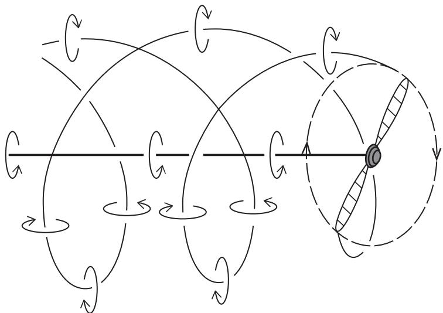

flowchart

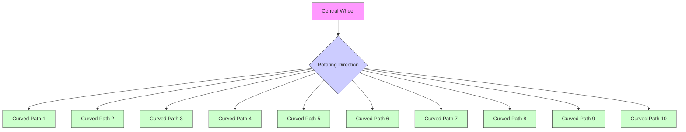
```mermaid
graph TD
    A["Central Wheel"] --> B{Rotating Direction}
    B --> C["Curved Path 1"]
    B --> D["Curved Path 2"]
    B --> E["Curved Path 3"]
    B --> F["Curved Path 4"]
    B --> G["Curved Path 5"]
    B --> H["Curved Path 6"]
    B --> I["Curved Path 7"]
    B --> J["Curved Path 8"]
    B --> K["Curved Path 9"]
    B --> L["Curved Path 10"]
    style A fill:#f9f,stroke:#333
    style B fill:#ccf,stroke:#333
    style C fill:#cfc,stroke:#333
    style D fill:#cfc,stroke:#333
    style E fill:#cfc,stroke:#333
    style F fill:#cfc,stroke:#333
    style G fill:#cfc,stroke:#333
    style H fill:#cfc,stroke:#333
    style I fill:#cfc,stroke:#333
    style J fill:#cfc,stroke:#333
    style K fill:#cfc,stroke:#333
    style L fill:#cfc,stroke:#333
```

Figure 3.27 Helical trailing tip vortices of a horizontal axis turbine wake.

To account for tip-losses, the manner in which the axial sow induction factor varies azimuthally needs to be known, but, unfortunately, this requirement is beyond the abilities of the BEM theory.

Just as a vortex trails from the tip of an aircraft wing so does a vortex trail from the tip of a wind turbine blade. Because the blade tip follows a circular path, it leaves a trailing vortex as a helical structure that convects downstream with the wake velocity. For example, on a two blade rotor, unlike an aircraft wing, the bound circulations on the two blades shown in Figure 3.27 are opposite in sign and so combine in the idealised case of the blade root being at the rotational axis to shed a straight line vortex along the axis with strength equal to the blade circulation times the number of blades. If as is usual in practice the blade root is somewhat outboard of the axis, the two blade root vortices form independent helices similar to the blade tips but of small radius, close together, and the combined straight line axis vortex is not a bad approximation of their effect.

For a single vortex to be shed from the blade at its tip, only the circulation strength along the blade span must be uniform right out to the tip with an abrupt drop to zero at the tip. As has been shown, such a uniform circulation provides optimum power coefrcient. However, the uniform circulation requirement assumes that the axial sow induction factor is uniform across the disc. With an inrnite number of blades, the tip vortices form a continuous cylindrical sheet of vorticity directed at a constant angle around the surface. Such a sheet is consistent with a uniform value of the axial induction factor over the disc. But, as has been argued above, with a rnite number of blades rather than a uniform disc, the sow factor is not uniform. Sustaining uniform circulation until very close to the two ends (tip and root) of a blade results in a very large gradient of the blade circulation at the tips, which in turn induces large radial variations in the induced velocity factors a and $a ^ { \prime }$ in those regions, with both tending to inrnity in the limit of constant circulation up to the tip and root.

As in Figure 3.27, close to a blade tip a single concentrated tip vortex would on its own cause very high values of the sow factor a with an inrnite value at the tip such that, locally, the net sow past the blade is in the upstream direction. This effect is similar to what occurs for the simple ‘horseshoe vortex’ model for a rxed wing aircraft showing that this model is not applicable at a blade or wing tip where a more detailed induced sow analysis is required. The azimuthal average of the axial induction a is uniform radially. Higher values of a tend to be induced close to the blades towards root and tip, becoming higher the closer to the tips. Therefore, low values relative to the average must occur in the regions between the blades. The azimuthal variation of a for a number of radial positions is shown in Figure 3.28 for a three blade rotor operating at a tip speed ratio of 6. The calculation for Figure 3.28 assumes a discrete vortex for each blade with a constant pitch and constant radius helix and is calculated from the effect of the shed wake vortices only.

At a particular radial position the ratio of the azimuthal average of a (which from here on will be written as a) to the value $a _ { b } ( \mathbf { r } )$ at the blade quarter chord is shown in Figure 3.29, being unity for most of the blade span, and only near the tip does it begin to fall to zero. This ratio is called the tip-loss factor.

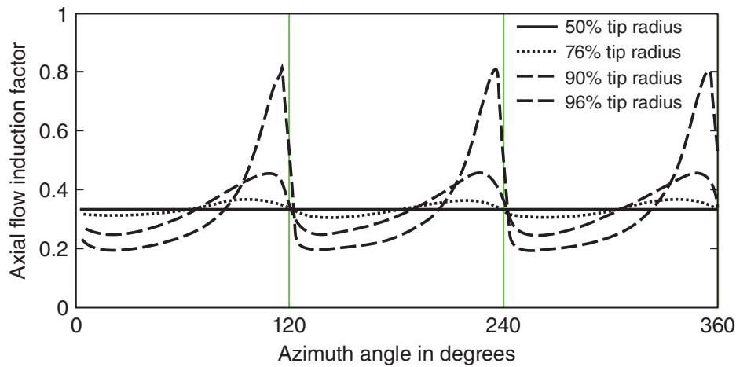

line

| Azimuth angle in degrees | 50% tip radius | 76% tip radius | 90% tip radius | 96% tip radius |
| ------------------------ | -------------- | -------------- | -------------- | -------------- |
| 0                        | 0.3            | 0.3            | 0.2            | 0.2            |
| 120                      | 0.3            | 0.3            | 0.8            | 0.4            |
| 240                      | 0.3            | 0.3            | 0.8            | 0.4            |
| 360                      | 0.3            | 0.3            | 0.8            | 0.4            |

Figure 3.28 Azimuthal variation of a for various radial positions for a three blade rotor with uniform blade circulation operating at a tip speed ratio of 6. The blades are at $1 2 0 ^ { \circ }$ , $2 4 0 ^ { \circ }$ , and 360∘.

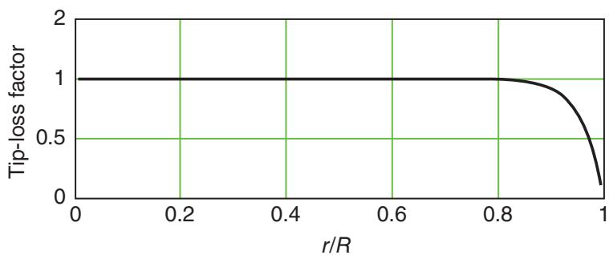

line

| r/R | Tip-loss factor |
| --- | --------------- |
| 0.0 | 1.0             |
| 0.2 | 1.0             |
| 0.4 | 1.0             |
| 0.6 | 1.0             |
| 0.8 | 1.0             |
| 0.9 | 0.8             |
| 1.0 | 0.0             |

Figure 3.29 Spanwise variation of the tip-loss factor for a blade with uniform circulation.

From Eq. (3.20) and in the absence of tip-loss and drag the contribution of each blade element to the overall power coefrcient is

$$
\delta C _ {P} = 8 \lambda^ {2} \mu^ {3} a ^ {\prime} (1 - a) \delta \mu \tag {3.77}
$$

Substituting for $a ^ { \prime }$ from Eq. (3.25) gives

$$
\delta C _ {P} = 8 \mu a (1 - a) ^ {2} \delta \mu \tag {3.78}
$$

From the Kutta–Joukowski theorem, the circulation Γ on the blade, which is uniform, provides a torque per unit span of

$$
\frac {d Q}{d r} = \rho | W \times \Gamma | \sin \phi_ {r} r
$$

where the angle $\phi _ { r }$ is determined by the sow velocity local to the blade.

If the strength of the total circulation for all three blades is still given by Eq. (3.69), in the presence of tip-loss, the increment of power coefrcient from a blade element is

$$
\delta C _ {\mathrm{P}} = 8 \mu \mathrm{a} (1 - a) (1 - a _ {\mathrm{b}}) \delta \mu \tag {3.79}
$$

in agreement with Eq. (3.78), except that the factor $a ( 1 - a )$ , which relates Γ to the angular momentum loss in the wake, must be expressed as $\overline { { a } } ( 1 - \overline { { a } } )$ in terms of the azimuthally averaged axial sow induction factor ${ \overline { { a } } } ,$ which = 1/3 for optimum operation. However, the rnal induction term $( 1 - a _ { b } )$ relates to the sow angle at the blade and must therefore be in terms of $a _ { b } .$ , the axial induction factor at the blade, with $a _ { b } = { \overline { { a } } } / f ,$ , and therefore $a _ { b } \approx$ $\overline { { a } }$ except near the tips. The notation $\overline { { a } } , a _ { b } , \overline { { a ^ { \prime } } }$ , and $a _ { \scriptscriptstyle b } ^ { \prime }$ derned as here will be used in this section where required to distinguish them.

The high value of the axial sow induction factor $a _ { b }$ at the tip, due to the proximity of the tip vortex, acts to reduce the angle of attack in the tip region and hence the circulation so that the circulation strength Γ(r) cannot be constant right out to the tip but must fall smoothly through the tip region to zero at the tip. Thus, the loading falls smoothly to zero at the tip, as it must for the same reason as on a rxed wing, and this is a manifestation of the effect of tip-loss on loading. The result of the continuous fall-off of circulation towards the tip means that the vortex shedding from the tip region that is equal to the radial gradient of the bound circulation is not shed as a single concentrated helical line vortex but as a distributed ribbon of vorticity that then follows a helical path. The effect of the distributed vortex shedding from the tip region is to remove the inrnite induction velocity at the tip, and, through the closed loop between shed vorticity, induction velocity and circulation, converge to a rnite induction velocity together with a smooth reduction in loading to zero at the tip. The effect on the loading is incorporated into the BEM method, which treats all sections as independent $ { ^ { 6 } 2 }  { - }  { \mathbf { D } } ^ { \ast }$ sows, by multiplying a suitably calculated tip-loss factor f(r) by the axial and rotational induction factors $a _ { b }$ and $a _ { b } ^ { \prime }$ that have been calculated by the uncorrected BEM method. Because the blade circulation must similarly fall to zero at the root of the blade, a similar ‘tip-loss’ factor is applied there in the same way.

It is important to note that tip-loss factors should only be applied in methods that assume disc-type actuators (i.e. azimuthally uniform), such as the BEM method, and not, for example, to the line actuator method because methods such as this that compute individual blades and the velocities induced at them already incorporate the tip effect.

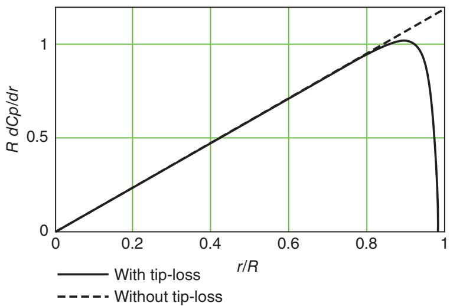

line

| r/R | With tip-loss | Without tip-loss |
| --- | ------------- | ---------------- |
| 0.0 | 0.0           | 0.0              |
| 0.2 | 0.2           | 0.2              |
| 0.4 | 0.4           | 0.4              |
| 0.6 | 0.6           | 0.6              |
| 0.8 | 0.8           | 0.8              |
| 0.9 | 1.0           | 1.0              |
| 1.0 | 0.0           | 1.2              |

Figure 3.30 Spanwise variation of power extraction in the presence of tip-loss for a blade with uniform circulation on a three blade turbine operating at a tip speed ratio of 6.

The results from Eq. (3.79) with and without this tip-loss factor are plotted in Figure 3.30 and clearly show the effect of tip-loss on power. Equation (3.78)) has assumed that $\overline { { a } } = 1 / 3$ uniformly over the whole disc, but applying the tip-loss factor means recognising that a cannot be uniform radially. The tip-loss results from the tip vortices, which generate the induction factor a (effectively the induced drag). It is important to note that there is no additional effective drag associated with tip-loss.

If the circulation varies along the blade span, vorticity is shed into the wake in a continuous fashion from the trailing edge of all sections where the spanwise (radial) gradient of circulation is non-zero.

Therefore, each blade sheds a helicoidal sheet of vorticity, as shown in Figure 3.31, rather than a single helical vortex, as shown in Figure 3.27. The helicoidal sheets convect with the wake velocity and so there can be no sow across the sheets, which can therefore be regarded as impermeable. The intensity of the vortex sheets is equal to the rate of change of bound circulation along the blade span and so usually increases rapidly towards the blade tips. There is sow around the blade tips because of the pressure difference between the blade surfaces, which means that on the upwind surface of the blades the sow moves towards the tips and on the downwind surface the sow moves towards the root. The sows from either surface leaving the trailing edge of a blade will not be parallel to one another and will form a surface of discontinuity of velocity in a radial sense within the wake; the axial velocity components will be equal. The surface of discontinuity is called a vortex sheet. A similar phenomenon occurs with aircraft wings, and a textbook of aircraft aerodynamics will explain it in greater detail.

The azimuthally averaged value of a can be expressed as $a _ { b } ( \mathbf { r } ) \mathcal { I } ( \mathbf { r } )$ , where f(r) is known as the tip-loss factor, has a value of unity inboard, and falls to zero at the edge of the rotor disc.

In the application of the BEM theory, it is argued that the rate of change of axial momentum is determined by the azimuthally averaged value of the axial sow induction factor, whereas the blade forces are determined by the value of the sow factor that the blade element ‘senses’. This needs careful interpretation, as discussed in Section 3.9.2.

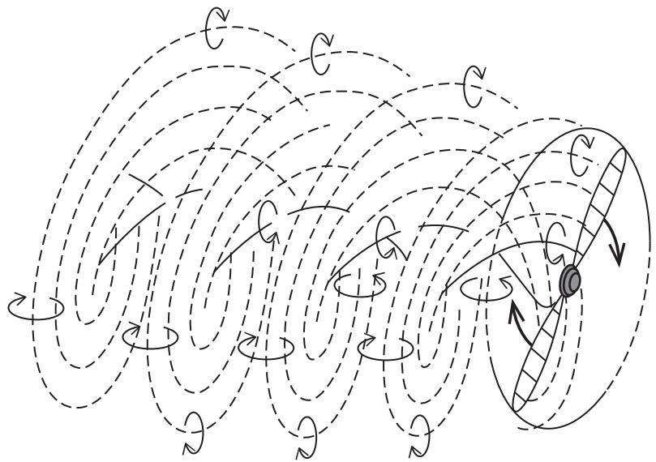

flowchart

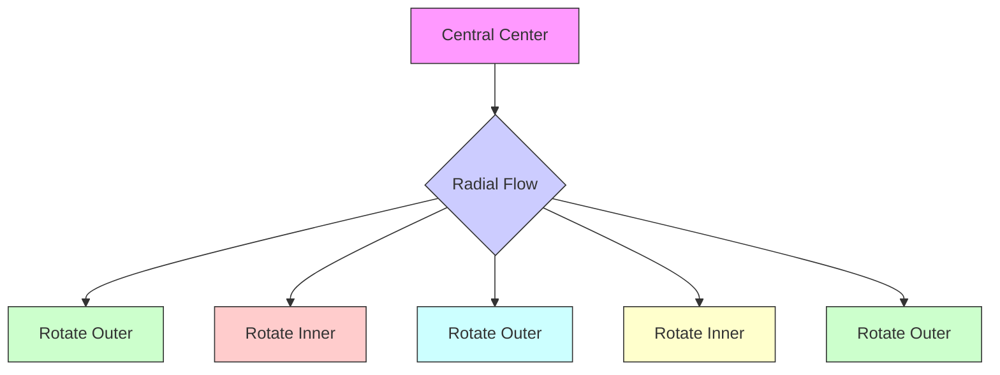
```mermaid
graph TD
    A["Central Center"] --> B{Radial Flow}
    B --> C["Rotate Outer"]
    B --> D["Rotate Inner"]
    B --> E["Rotate Outer"]
    B --> F["Rotate Inner"]
    B --> G["Rotate Outer"]
    style A fill:#f9f,stroke:#333
    style B fill:#ccf,stroke:#333
    style C fill:#cfc,stroke:#333
    style D fill:#fcc,stroke:#333
    style E fill:#cff,stroke:#333
    style F fill:#ffc,stroke:#333
    style G fill:#cfc,stroke:#333
```

Figure 3.31 A (discretised) helicoidal vortex sheet wake for a two bladed rotor whose blades have radially varying circulation.

The mass sow rate through an annulus $= \rho \mathrm { U } _ { \infty } ( 1 - \overline { { a } } \left( \mathrm { r } \right) )$ .2휋r훿r.

The azimuthally averaged overall change of axial velocity $= 2 \overline { { a } } ( \mathbf { r } ) . \mathbf { U } _ { \infty }$

The rate of change of axial momentum $= 4 \pi \rho \mathrm { U } _ { \infty } { } ^ { 2 } ( 1 - \overline { { a } } ( \mathrm { r } ) ) . \overline { { a } } ( \mathrm { r } ) \delta \mathrm { r } .$ .

The blade element forces are $\scriptstyle { \frac { 1 } { 2 } } \rho W ^ { 2 } B c C _ { l }$ and $\scriptstyle { \frac { 1 } { 2 } } \rho W ^ { 2 } B c C _ { d }$ , where W and $C _ { l }$ are determined using $a _ { b } ( \mathbf { r } )$ .

The torque caused by the rotation of the wake is also calculated using an azimuthally averaged value of the tangential sow induction factor $2 \overline { { a } } ^ { \prime } ( \mathrm { r } )$ with tip-loss similarly applied for the value at a blade because both induction velocities are induced by the same distribution of shed vorticity.

# 3.9.3 Prandtl’s approximation for the tip-loss factor

The function for the tip-loss factor f(r) is shown in Figure 3.29 for a blade with uniform circulation operating at a tip speed ratio of 6 and is not readily obtained by analytical means for any desired tip speed ratio. Sidney Goldstein (1929) did analyse the tip-loss problem for application to propellers and achieved a solution in terms of Bessel functions, but neither that nor the vortex method with the Biot–Savart solution used above is suitable for inclusion in the BEM theory. Fortunately, in 1919, Ludwig Prandtl, reported by Betz (1919), had already developed an ingenious approximate solution that does yield a relatively simple analytical formula for the tip-loss function.

Prandtl’s approximation was inspired by considering that the vortex sheets could be replaced by material sheets, which, provided they move with the velocity dictated by the wake, would have no effect upon the wake sow. The theory applies only to the developed wake. To simplify his analysis Prandtl replaced the helicoidal sheets with a succession of discs, moving with the uniform, central wake velocity $U _ { \infty } ( 1 - a )$ and separated by the same distance as the normal distance between the vortex sheets. Conceptually, the discs, travelling axially with velocity $U _ { \infty } ( 1 - a )$ , would encounter the unattenuated free-stream velocity $U _ { \infty }$ at their outer edges. The fast sowing free-stream air would tend to weave in and out between successive discs. The wider apart successive discs the deeper, radially, the free-stream air would penetrate. Taking any line parallel to the rotor axis at a radius r, somewhat smaller than the wake radius $\mathtt { R } _ { \mathrm { w } }$ (∼ rotor radius R), the average axial velocity along that line would be greater than $U _ { \infty } ( 1 - a )$ and less than $U _ { \infty }$ . Let the average velocity be $U _ { \infty } ( 1 - a f ( r ) )$ , where $f ( r )$ is the tip-loss function, has a value less than unity and falls to zero at the wake boundary. At a distance from the wake edge the free stream fails to penetrate, and there is little or no difference between the wake-induced velocity and the velocity of the discs, i.e. $f ( r ) = 1$ .

A particle path, as shown in Figure 3.32, may be interpreted as an average particle passing through the rotor disc at a given radius in the actual situation: the azimuthal variations of particle axial velocities at various radii are shown in Figure 3.28, and a ‘Prandtl particle’ would have a velocity equal to the azimuthal average of each. Figure 3.32 depicts the wake model.

The mathematical detail of Prandtl’s analysis is given in Glauert (1935a), and because it is based on a somewhat strangely simplired model of the wake will not be repeated here. It has, however, remained the most commonly used tip-loss correction because it is reasonably accurate and, unlike Goldstein’s theory, the result can be expressed in closed solution form. The Prandtl tip-loss factor is given by

$$
f (r) = \frac {2}{\pi} \cos^ {- 1} \left\{e ^ {- \pi \left(\frac {R _ {W} - r}{d}\right)} \right\} \tag {3.80}
$$

$R _ { w } - r$ is a distance measured from the wake edge. Distance d between the discs should be that of the distance travelled by the sow between successive vortex sheets. Glauert (1935a), takes d as being the normal distance between successive helicoidal vortex sheets.

The helix angle of the vortex sheets $\phi _ { s }$ is the sow angle assumed to be the same as $\phi _ { t }$ , the helix angle at the blade tip, and so with B sheets intertwining from B blades and assuming that the discs move with the mean axial velocity in the wake, $\mathrm { U } _ { \infty } ( 1 - \overline { { a } } )$ :

$$
d = \frac {2 \pi R _ {w}}{B} \sin \phi_ {s} = \frac {2 \pi R _ {w}}{B} \frac {U _ {\infty} (1 - \overline {{{a}}})}{W _ {s}} \tag {3.81}
$$

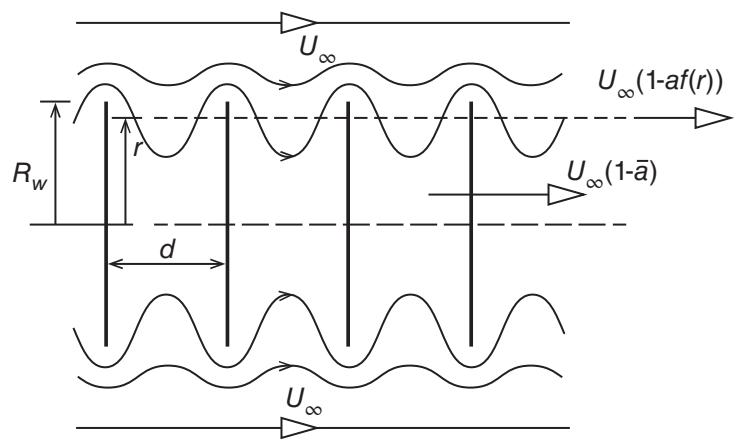

text_image

U∞
U∞(1-af(r))
Rw
r
d
U∞(1-ā)
U∞

Figure 3.32 Prandtl’s wake-disc model to account for tip-losses.

Prandtl’s model has no wake rotation, but whether the discs are considered to spin is irrelevant to the sow reld, as it is inviscid, thus $a ^ { \prime }$ is zero and $W _ { s }$ is the resultant velocity (not including the radial velocity) at the edge of a disc. Glauert (1935a) argues that $\frac { R _ { w } } { W _ { s } } \stackrel { \textstyle \cdot } { \approx }$ $\frac { r } { W }$ r , which is more convenient to use,

$$
W = \sqrt {[ U _ {\infty} (1 - \overline {{a}}) ] ^ {2} + (r \Omega) ^ {2}}
$$

so

$$
\pi \left(\frac {R - r}{d}\right) = \frac {B}{2} \left(\frac {R _ {w} - r}{r}\right) \sqrt {1 + \frac {(r \Omega) ^ {2}}{[ U _ {\infty} (1 - \overline {{a}}) ] ^ {2}}}
$$

and

$$
f (\mu) = \frac {2}{\pi} \cos^ {- 1} \left\{\exp \left[ - \frac {B (1 - \mu)}{2 \mu} \sqrt {1 + \left(\frac {\lambda \mu}{1 - \bar {a}}\right) ^ {2}} \right] \right\} \tag {3.82}
$$

Although the physical basis of this model is not correct, it does quite effectively represent a convenient approximation to the attenuation towards the tips of the real velocities induced by the helicoidal vortex sheets.

The Prandtl tip-loss factor for a three blade rotor operating at a tip speed ratio of 6 is compared with the tip-loss factor of the helical vortex wake in Figure 3.33.

It should also be pointed out that the vortex theory of Figure 3.28 also predicts that the tip-loss factor should be applied to the tangential sow induction factor.

It is now useful to know what the variation of circulation along the blade is. For the previous analysis, which disregarded tip-losses, the blade circulation was uniform [Eq. (3.69))].

Following the same procedure from which Eq. (3.68) was developed:

$$
\rho W \Gamma s i n \phi = \rho \Gamma U _ {\infty} (1 - a _ {b} (r)) = 4 \pi \rho \frac {U _ {\infty} ^ {3}}{\Omega} \overline {{a}} (\mathrm{r}) (1 - \overline {{a}} (\mathrm{r})) (1 - a _ {b} (r))
$$

Recall that $a _ { b } ( r )$ is the sow factor local to the blade at radius r and $\overline { { a } } ( \mathrm { r } )$ is the average value of the sow factor at radius r.

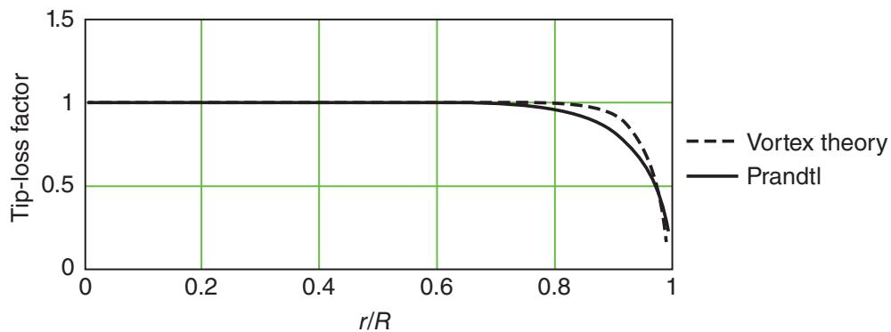

line

| r/R | Vortex theory | Prandtl |
| --- | ------------- | ------- |
| 0.0 | 1.0           | 1.0     |
| 0.2 | 1.0           | 1.0     |
| 0.4 | 1.0           | 1.0     |
| 0.6 | 1.0           | 1.0     |
| 0.8 | 1.0           | 1.0     |
| 1.0 | 0.2           | 0.2     |

Figure 3.33 Comparison of Prandtl tip-loss factor with that predicted by a vortex theory for a three blade turbine optimised for a tip speed ratio of 6.

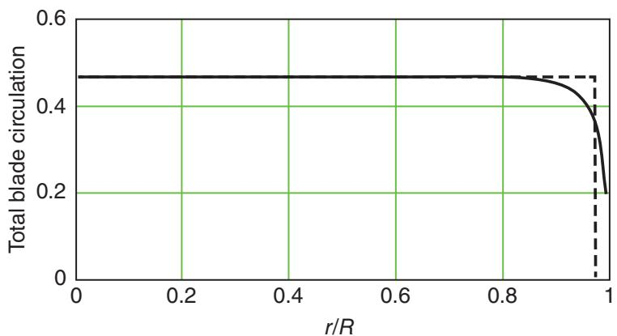

line

| r/R | Total blade circulation |
| --- | ---------------------- |
| 0.0 | 0.45                   |
| 0.2 | 0.45                   |
| 0.4 | 0.45                   |
| 0.6 | 0.45                   |
| 0.8 | 0.45                   |
| 0.9 | 0.40                   |
| 0.95 | 0.30                   |
| 1.0 | 0.20                   |

Figure 3.34 Spanwise variation of blade circulation for a three blade turbine optimised for a tip speed ratio of 6.

Therefore,

$$
\frac {\Gamma (r)}{U _ {\infty} R} = \frac {4 \pi}{\lambda (1 - a _ {b} (r))} \overline {{a}} (\mathrm{r}) (1 - \overline {{a}} (\mathrm{r})) (1 - a _ {b} (r)) \tag {3.83}
$$

Γ(r) is the total circulation for all blades and is shown in Figure 3.34, and, as can be seen, it is almost uniform except near to the tip. The dashed vertical line shows the effective blade length (radius) $R _ { e f } = 0 . 9 7 5$ if the circulation is assumed to be uniform at the level that pertains at the blade sections away from the tip.

The Prandtl tip-loss factor that is widely used in industry codes appears to offer an acceptable, simple solution to a complex problem; not only does it account for the effects of discrete blades, it also allows the induction factors to fall to zero at the edge of the rotor disc.

A more recently derived tip-loss factor that has been calibrated against experimental data and appears to give improved performance was given by Shen et al. (2005). The spanwise distribution of axial and tangential forces is multiplied by the factor

$\begin{array} { r l } & { \quad F _ { 1 } ( r ) = \frac { 2 } { \pi } c o s ^ { - 1 } \{ \exp ( - g _ { 1 } \frac { B ( R - r ) } { 2 r \sin ( \phi ( r ) ) } ) \} \mathrm { w h e r e } \ g _ { 1 } = 0 . 1 + \exp . \{ - \mathtt { c } _ { 1 } ( \mathtt { B } \lambda \mathtt { - c } _ { 2 } ) \} \mathrm { ~ w i t h ~ } \mathtt { c } _ { 1 } = 0 . 1 2 5 } \\ & { \mathrm { a n d ~ } \mathtt { c } _ { 2 } = 2 1 . 0 . } \end{array}$ F1 (r) = 2 푐표푠−1{exp(−g1 2rsin( (r)) B(R−r) )}where g = 0.1 + exp.{−c (B휆-c )} with c = 0.125

This formulation is similar to Glauert’s (1935a) original simplircation of the Prandtl tip-loss correction but introduces a variable factor $g _ { 1 }$ rather than unity. Wimshurst and Willden (2018) suggest that a better rt is given in the above by using different constants for the axial force correction $( \mathrm { c } _ { 1 } \sim 0 . 1 2 2$ and $\mathbf { c } _ { 2 } \sim 2 1 . 5 )$ and for the tangential force correction to be similarly derned but with $( \mathrm { c } _ { 1 } \sim 0 . 1$ and $\mathbf { c } _ { 2 } \sim 1 3 . 0 )$ .

# 3.9.4 Blade root losses

At the root of a blade the circulation must fall to zero as it does at the blade tip, and so it can be presumed that a similar process occurs. The blade root will be at some distance from the rotor axis, and the air sow through the disc inside the blade root radius will be at the free-stream velocity. Actually, the vortex theory of Section 3.4 can be extended to show that the sow through the root disc is somewhat higher than the free-stream velocity. It is usual, therefore, to apply the Prandtl tip-loss function at the blade root as well as at the tip (see Figure 3.35).

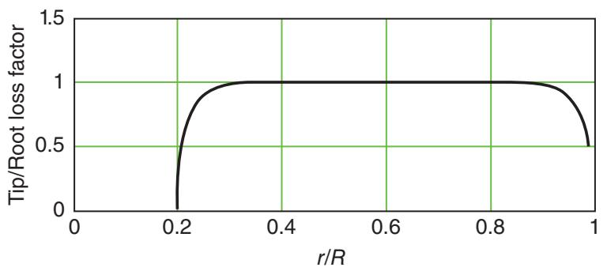

line

| r/R  | Tip/Root loss factor |
| ---- | -------------------- |
| 0.0  | 0.0                  |
| 0.2  | 0.5                  |
| 0.4  | 1.0                  |
| 0.6  | 1.0                  |
| 0.8  | 1.0                  |
| 1.0  | 0.5                  |

Figure 3.35 Spanwise variation of combined tip/root loss factor for a three blade turbine optimised for a tip speed ratio of 6 and with a blade root at 20% span.

If $\mu _ { R }$ is the normalised root radius, then the root loss factor can be determined by modifying the tip-loss factor of Eq. (3.82):

$$
f _ {R} (\mu) = \frac {2}{\pi} \cos^ {- 1} \left\{e ^ {- \frac {B (\mu - \mu_ {R})}{2 \mu} \sqrt {1 + \frac {(\lambda \mu) ^ {2}}{(1 - \overline {{a}}) ^ {2}}}} \right\} \tag {3.84}
$$

If Eq. (3.82) is now termed $f _ { T } ( r )$ the complete tip/root loss factor is

$$
f (\mu) = f _ {T} (\mu) f _ {R} (\mu) \tag {3.85}
$$

# 3.9.5 Effect of tip-loss on optimum blade design and power

With no tip-loss the optimum axial sow induction factor is uniformly 1/3 over the whole swept rotor. The presence of tip-loss changes the optimum value of the average value of a, which reduces to zero at the edge of the wake but local to the blade tends to increase in the tip region.

For the analysis involving induction factors from here on in this chapter, only the azimuthal averages and the local values at the blade are required so it is convenient to use a(r) and $a ^ { \prime } ( r )$ to mean azimuthal averages at radius r with $\begin{array} { r } { a _ { b } = \frac { a ( r ) } { f ( r ) } } \end{array}$ and $\begin{array} { r } { { a ^ { \prime } } _ { b } = \frac { a ^ { \prime } ( r ) } { f ( r ) } } \end{array}$ f (r) f (r) for the local values at the blade, thus avoiding the need for the overbar and subscript b notation in the algebraic expressions. The insow angle $\phi$ at the blade is from Eq. (3.62):

$$
\tan \phi = \frac {1}{\lambda \mu} \left(\frac {1 - \frac {a}{f}}{1 + \frac {a ^ {\prime}}{f}}\right) \tag {3.86}
$$

but Eq. (3.61) derives tan $\phi$ from the ratio of the non-dimensional rate of change of angular momentum to the non-dimensional rate of change of axial momentum, which is not changed because it deals with the average sow through the disc and so uses average values. If drag is ignored for the present, Eq. (3.62) becomes

$$
\tan \phi = \frac {\lambda \mu a ^ {\prime} (1 - a)}{a (1 - a) + (a ^ {\prime} \lambda \mu) ^ {2}} \tag {3.87}
$$

Hence

$$
\frac {(1 - a) \lambda \mu a ^ {\prime}}{a (1 - a) + (a ^ {\prime} \lambda \mu) ^ {2}} = \frac {\left(1 - \frac {a}{f}\right)}{\lambda \mu \left(1 + \frac {a ^ {\prime}}{f}\right)}
$$

which becomes

$$
\lambda^ {2} \mu^ {2} \frac {(f - 1)}{f} a ^ {\prime 2} - \lambda^ {2} \mu^ {2} (1 - a) a ^ {\prime} + a (1 - a) \left(1 - \frac {a}{f}\right) = 0 \tag {3.88}
$$

A great simplircation can be made to Eq. (3.88) by ignoring the rrst term because, clearly, it disappears for much of the blade, where $f = 1$ , and for the tip region the value of $a ^ { \prime 2 }$ is very small. For tip speed ratios greater than 3, neglecting the rrst term makes negligible difference to the result:

$$
\lambda^ {2} \mu^ {2} a ^ {\prime} = a \left(1 - \frac {a}{f}\right) \tag {3.89}
$$

As before, Eq. (3.60) still applies, $\begin{array} { r } { \frac { d a } { d a ^ { \prime } } = \frac { 1 - a } { a ^ { \prime } } } \end{array}$

From Eq. (3.89), $\begin{array} { r } { \frac { d a ^ { \prime } } { d a } = \frac { 1 } { \lambda ^ { 2 } \mu ^ { 2 } } \left( 1 - 2 \frac { a } { f } \right) } \end{array}$

Consequently,

$$
(1 - a) \left(1 - 2 \frac {a}{f}\right) = \lambda^ {2} \mu^ {2} a ^ {\prime}
$$

which, combined with Eq. (3.89), gives

$$
a ^ {2} - \frac {2}{3} (f + 1) a + \frac {1}{3} f = 0
$$

so

$$
a = \frac {1}{3} + \frac {1}{3} f - \frac {1}{3} \sqrt {1 - f + f ^ {2}} \tag {3.90}
$$

The radial variation of the average value of $| a ,$ as given by Eq. (3.90), and the value local to the blade $\frac { a } { f }$ is shown in Figure 3.36. An exact solution would also have the local induced velocity falling to zero at the blade tip.

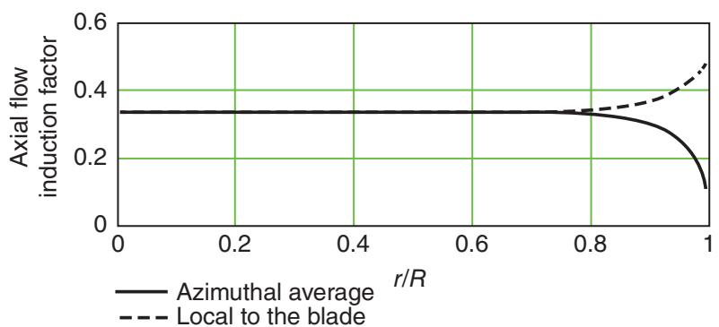

line

| r/R | Azimuthal average | Local to the blade |
| --- | --- | --- |
| 0.0 | 0.35 | 0.35 |
| 0.2 | 0.35 | 0.35 |
| 0.4 | 0.35 | 0.35 |
| 0.6 | 0.35 | 0.35 |
| 0.8 | 0.35 | 0.35 |
| 1.0 | 0.1 | 0.45 |

Figure 3.36 Axial sow factor variation with radius for a three blade turbine optimised for a tip speed ratio of 6.

Clearly, the required blade design for optimal operation would be a little different to that which corresponds to the Prandtl tip-loss factor because $\begin{array} { r } { a _ { b } = \frac { a } { f } } \end{array}$ ; the local sow factor does not fall to zero at the blade tip. The use of the Prandtl tip-loss factor leads to an approximation, but that was recognised from the outset.

The blade design, which gives optimum power output, can now be determined by adapting Eqs. (3.70) and (3.71), noting that the left hand side of Eq. (3.70) refers to a local insow angle at the blade, hence the factor becomes $( I - a / f )$ :

$$
\mu \sigma_ {r} \lambda C _ {l} = \frac {4 \lambda^ {2} \mu^ {2} a ^ {\prime}}{\sqrt {\left(1 - \frac {a}{f}\right) ^ {2} + \left[ \lambda \mu \left(1 + \frac {a ^ {\prime}}{f}\right) \right] ^ {2}}} \left(\frac {1 - a}{1 - \frac {a}{f}}\right)
$$

Introducing Eq. (3.89) gives

$$
\mu \sigma_ {r} \lambda C _ {l} = \frac {4 a (1 - a) / \mu}{\sqrt {\left(1 - \frac {a}{f}\right) ^ {2} + \left[ \lambda \mu \left(1 + \frac {a \left(1 - \frac {a}{f}\right)}{\lambda^ {2} \mu^ {2} f}\right) \right] ^ {2}}} \tag {3.91}
$$

The blade geometry parameter given by Eq. (3.91) is shown in Figure 3.37 compared with the design that excludes tip-loss. As shown, only in the tip region is there any difference between the two designs.

Similarly, the insow angle distribution, shown in Figure 3.38, can be determined by suitably modifying Eq. (3.73):

$$
\tan \phi = \frac {1 - \frac {a}{f}}{\lambda \mu \left(1 + \frac {a \left(1 - \frac {a}{f}\right)}{\lambda^ {2} \mu^ {2} f}\right)} \tag {3.92}
$$

Again, the effects of tip-loss are conrned to the blade tip.

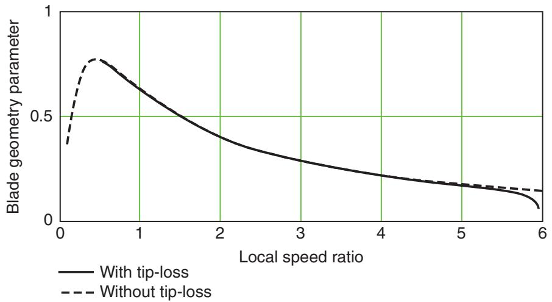

line

| Local speed ratio | With tip-loss | Without tip-loss |
| ----------------- | ------------- | ---------------- |
| 0                 | 0.3           | 0.3              |
| 1                 | 0.7           | 0.7              |
| 2                 | 0.4           | 0.4              |
| 3                 | 0.3           | 0.3              |
| 4                 | 0.2           | 0.2              |
| 5                 | 0.15          | 0.15             |
| 6                 | 0.05          | 0.1              |

Figure 3.37 Variation of blade geometry parameter with local speed ratio, with and without tip-loss for a three blade rotor with a design tip speed ratio of 6.

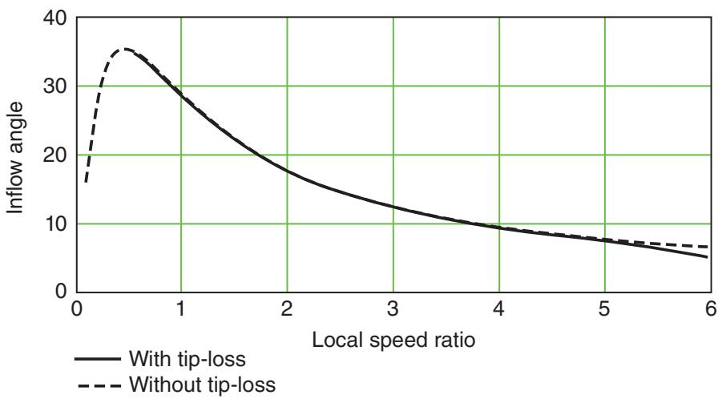

line

| Local speed ratio | With tip-loss | Without tip-loss |
| ----------------- | ------------- | ---------------- |
| 0                 | 17            | 17               |
| 0.5               | 35            | 35               |
| 1                 | 28            | 28               |
| 2                 | 18            | 18               |
| 3                 | 12            | 12               |
| 4                 | 9             | 9                |
| 5                 | 7             | 7                |
| 6                 | 5             | 5                |

Figure 3.38 Variation of insow angle with local speed ratio, with and without tip-loss for a three blade rotor with a design tip speed ratio of 6.

The power coefrcient for an optimised rotor, operating at the design tip speed ratio, without drag and tip-losses is equal to the Lanchester–Betz limit 0.593, but with tip-loss there is obviously a reduced optimum power coefrcient. Equation (3.20) determines the power coefrcient; see Figure 3.39:

$$
C _ {P} = \frac {P}{\frac {1}{2} \rho U _ {\infty} ^ {3} \pi R ^ {2}} = 8 \lambda^ {2} \int_ {0} ^ {1} \left\{a ^ {\prime} (1 - a) / \left(1 + a ^ {\prime} / f\right) \right\} \mu^ {3} d \mu \tag {3.93}
$$

for which $a ^ { \prime }$ and a are obtained from Eqs. (3.89) and (3.90). This differs from the result given by Eq. (3.20) by the term $a ^ { \prime } / f$ in the denominator, which is very small except close to the root at low tip speed ratio.

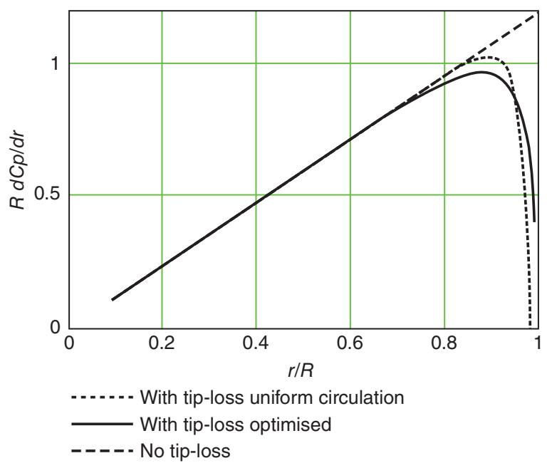

line

| r/R | With tip-loss uniform circulation | With tip-loss optimised | No tip-loss |
| --- | --- | --- | --- |
| 0.0 | 0.0 | 0.1 | 0.0 |
| 0.2 | 0.2 | 0.3 | 0.0 |
| 0.4 | 0.4 | 0.5 | 0.0 |
| 0.6 | 0.6 | 0.7 | 0.0 |
| 0.8 | 0.8 | 0.9 | 0.8 |
| 0.9 | 1.0 | 1.0 | 1.0 |
| 1.0 | 0.4 | 0.4 | 1.2 |

Figure 3.39 Spanwise variation of power extraction in the presence of tip-loss for three blades with uniform circulation and of optimised design for a tip speed ratio of 6.

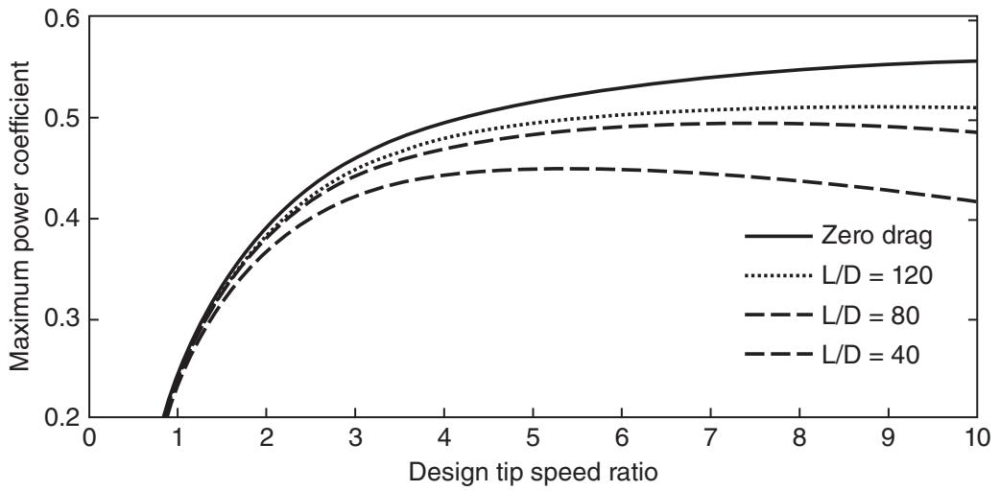

line

| Design tip speed ratio | Zero drag | L/D = 120 | L/D = 80 | L/D = 40 |
| ---------------------- | --------- | --------- | -------- | -------- |
| 1                      | 0.2       | 0.2       | 0.2      | 0.2      |
| 2                      | 0.35      | 0.36      | 0.34     | 0.33     |
| 3                      | 0.45      | 0.46      | 0.43     | 0.42     |
| 4                      | 0.50      | 0.51      | 0.47     | 0.46     |
| 5                      | 0.52      | 0.53      | 0.49     | 0.48     |
| 6                      | 0.53      | 0.54      | 0.50     | 0.49     |
| 7                      | 0.54      | 0.55      | 0.51     | 0.50     |
| 8                      | 0.55      | 0.56      | 0.52     | 0.51     |
| 9                      | 0.56      | 0.57      | 0.53     | 0.52     |
| 10                     | 0.57      | 0.58      | 0.54     | 0.53     |

Figure 3.40 The variation of maximum $C _ { P }$ with design휆 for various lift/drag ratios and including tip-losses for a three bladed rotor.

The maximum power coefrcient that can be achieved in the presence of both drag and tip-loss is signircantly less than the Betz limit at all tip speed ratios. As is shown in Figure 3.40, drag reduces the power coefrcient at high tip speed ratios, but the effect of tip-loss is most signircant at low tip speed ratios because the pitch of the helicoidal vortex sheets is larger.

An alternative formulation for incorporating tip-loss effect is to assume that tip-loss effect may be applied to correct the blade section forces directly ensuring that they fall to zero at the blade root and tip. Thus the tip-loss only appears as a factor f multiplying the right hand sides of Eqs. (3.48) and (3.49), which predict 훿T and 훿Q in terms of the momentum losses in the wake; see, for example, Wilson et al. (1974) and Jamieson (2018). This formulation if used simplires the foregoing analysis of power coefrcient because f only appears as a factor multiplying the expression for $C _ { \mathrm { P } }$ .

But in the following analysis, we will continue to follow the method of applying the tip-loss factor derived in Section 3.9.2.

# 3.9.6 Incorporation of tip-loss for non-optimal operation

The BEM Eqs. (3.54a) and (3.55) are used to determine the sow induction factors for non-optimal operation. With tip-loss included the BEM equations have to be modired. The necessary modircation depends upon whether the azimuthally averaged values of the sow factors are to be the determined or the maximum (local to a blade element) values. If the former alternative is chosen, then, in the momentum terms, the averaged sow factors a and $a ^ { \prime }$ remain unmodired, but in the blade element terms, the sow factors must appear as the average values divided by the tip-loss factor. Choosing to determine the maximum values of the sow factors, i.e. $a _ { b }$ and ${ { a } _ { b } } ^ { \prime }$ , means that they are not modired in the blade element terms but are multiplied by the tip-loss factor in the momentum terms. The former choice allows the simpler modircation of Eqs. (3.54a) and (3.55):

$$
\frac {a}{1 - a / f} = \frac {\sigma_ {r}}{4 \sin^ {2} \phi} C _ {x} \frac {1 - a / f}{1 - a} \tag {3.54c}
$$

$$
\frac {a ^ {\prime}}{1 + a ^ {\prime} / f} = \frac {\sigma_ {r}}{4 \sin \phi \cos \phi} C _ {y} \frac {1 - a / f}{1 - a} \tag {3.55a}
$$

where the sow factor values determined are the averaged values a and $a ^ { \prime } .$ .

There remains the problem of the breakdown of the momentum theory when wake mixing occurs. The helicoidal vortex structure may not exist, and so Prandtl’s approximation is less physically appropriate. Nevertheless, due to the rnite length of the blades and radius of the vortex wake, the application of a tip-loss factor is necessary. Prandtl’s approximation is the only practical method available and so is commonly used. In view of the manner in which the experimental results of Figure 3.16 were gathered, it is the average value of a that should determine at which stage the momentum theory breaks down.

# 3.9.7 Radial effects and an alternative explanation for tip-loss

The sow approaching the rotor is expanding because it is slowing down and so is not axial, that is, it is not parallel to the rotation axis or the undisturbed sow direction. Consequently, there is a radial sow velocity component at the upwind side of the rotor that arises because there is a radial pressure gradient with lower pressure in the tip region than in the inner region. The change of radial momentum at a point on the rotor disc is approximately balanced by the equal and opposite radial momentum at the diametrically opposite point. The magnitude of the radial velocity increases with radius, and so its effects will be greatest at the tip region. The kinetic energy associated with the radial sow does not directly affect the energy capture because it does not insuence the aerodynamic force on the blade.

At the blade tip the blade chord length becomes zero (usually but not always in a gradual fashion) and so must also the axial force exerted on the air sow beyond the blade tip that bypasses the rotor. The idealised actuator disc theory predicts a logarithmically singular radial velocity at the tip. This is not possible, and the pressure difference across the disc must fall continuously radially over a small tip region to zero at the tip.

Both a and $\psi ,$ which is the angle of the resultant sow to the axial direction at the rotor plane, will vary radially and will change according to how the circulation on the disc varies radially. Disc circulation, or the bound vorticity on the disc, must also rise and fall from blade root to blade tip, as shown in Figure 3.41.

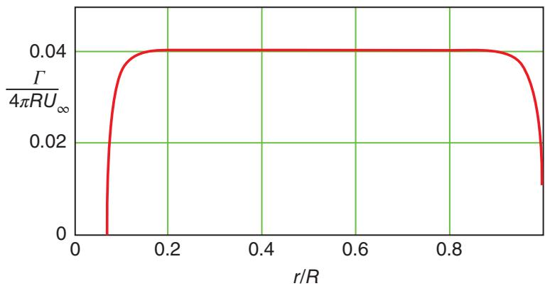

line

| r/R | Γ/(4πRU∞) |
| --- | -------- |
| 0.0 | 0.0000   |
| 0.1 | 0.0400   |
| 0.2 | 0.0400   |
| 0.3 | 0.0400   |
| 0.4 | 0.0400   |
| 0.5 | 0.0400   |
| 0.6 | 0.0400   |
| 0.7 | 0.0400   |
| 0.8 | 0.0400   |
| 0.9 | 0.0400   |
| 1.0 | 0.0100   |

Figure 3.41 The variation of circulation along the length of a blade.

Using just the momentum theory, it is not possible to determine the manner of the variation of a and 휓, but it is clear that the integration with respect to radius r of Eq. (3.93) with (3.89) would result in a value for the optimised power coefrcient that would be less than the Betz limit.

Throughout the BEM analysis, it is assumed implicitly that the swirl component generated in the wake of the rotor is sufrciently small that its insuence on the pressure reld may be ignored and specircally that the pressure far downstream in the wake where the momentum balance is calculated is uniform and ambient. However, as discussed earlier at the end of Section 3.3.2, under lower tip speed ratio conditions, typically within streamtubes that pass close to the blade roots so that the local speed ratio $\lambda = \Omega r / U _ { \infty } < 2$ , this is increasingly untrue. However, there is not as yet any fully agreed analysis for this effect except that it may offer the possibility of achieving local power coefrcients in excess of the Betz limit. In practical terms the possible increase in total rotor power is unlikely to be very signircant.

# 3.10 Stall delay

A phenomenon rrst noticed on propellers by Himmelskamp (1945) is that of lift coefrcients being attained at the inboard section of a rotating blade that are signircantly in excess of the maximum value possible in 2-D static tests. In other words, the angle of attack at which stall occurs is greater for a rotating blade than for the same blade tested statically. The power output of a rotor is measurably increased by the stall delay phenomenon and, if included, improves the comparison of theoretical prediction with measured output. It is noticed that the effect is greater near the blade root and decreases with radius.

The reason for stall delay has been much discussed, but as yet there is no fully agreed explanation. Partly this may be because stall regulation of rxed-pitch rotors has been largely phased out for modern turbines that use pitch control. Stall occurs on an aerofoil section when the adverse pressure gradient on the surface following the suction peak is sufrciently strong to reduce the momentum in the lower layers of the boundary layer to zero faster than viscous or turbulent diffusion can re-energise them. At this point sow reversal occurs, and the boundary layer separates from the surface, causing the aerofoil to stall, decreasing or even changing the sign of the lift curve slope and rapidly increasing the drag. However, on a turbine blade, particularly near the blade root, there is a strong outward radial component to the sow, and the pressure gradient following the streamlines in the boundary layer is less adverse than the section and local incidence would suggest. This may explain at least part of the phenomenon.

Aerodynamic analyses (Wood 1991; Snel et al. 1993) of rotating blades using computational suid dynamic techniques, which include the effects of viscosity, also do show a decreased adverse pressure gradient. It is agreed that the parameter that insuences stall delay predominantly is the local blade solidity $c ( r ) / r$ .

The evidence that does exist shows that for attached sow conditions, below what would otherwise be the static (non-rotating) stall angle of attack, there is little difference between 2-D sow conditions and rotating conditions. Due to the rotation, the air that is moving slowly with respect to the blade close to its surface in the boundary layer

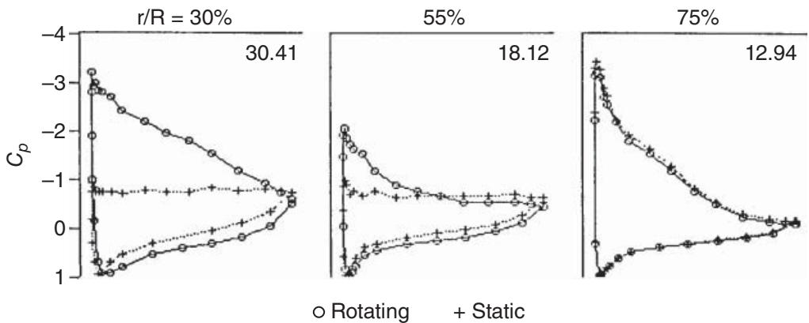  
Rotating Static+

Figure 3.42 Pressure measurements on the surface of a wind turbine blade while rotating and while static by Ronsten (1991).

is subject to strong centrifugal forces. The centrifugal force manifests as a radial pressure gradient, causing a component of velocity radially outwards. Prior to stalling taking place, this effect tends to reduce the adverse pressure gradient along the surface streamlines and hence the growth of boundary layer displacement thickness, thus decreasing the tendency to separate. When stall does occur, the region of slow moving air becomes much thicker throughout a growing separated region, and comparatively large volumes of air sow radially outwards, changing the sow patterns, reducing spanwise pressure gradients in the separated sow regions and hence changing the chordwise surface pressure distributions signircantly.

Blade surface pressures have been measured by Ronsten (1991) on a blade while static and while rotating. Figure 3.42 shows the comparison of surface pressure coefrcients for similar angles of attack in the static and rotating conditions (tip speed ratio of 4.32) for three spanwise locations. At the 30% span location, the estimated angle of attack at $3 0 . 4 1 ^ { \circ }$ is well above the static stall level, which is demonstrated by the static pressure coefrcient distribution. The rotating pressure coefrcient distribution at 30% span shows a high leading edge suction pressure peak with a uniform pressure recovery slope over the rear section of the upper surface of the chord. The gradual slope of the pressure recovery indicates a reduced adverse pressure gradient with the effect on the boundary layer that it is less likely to separate. The level of the leading edge suction peak, however, is much less than it would be if, in the non-rotating situation, it were possible for sow still to be attached at 30.41∘.

The situation at the 55% spanwise location is similar to that at 30%; the static pressures indicate that the section has stalled, but the rotating pressures show a leading edge suction peak that is small but signircant. At the 75% span location there is almost no difference between static and rotating blade pressure coefrcient distributions at an angle of attack of 12.94∘ , which is below the static stall level: the leading edge suction pressure peak is little higher than that at 30% span, much higher than that at 55%, but the pressure recovery slope is much steeper. The measured pressure distributions are very different from those corresponding to stall, suggesting that the sow may still be attached at the 30% and 55% span locations on the rotating blade. However, the suction pressure peaks are much too low for the corresponding fully attached sow at these angles of attack, so stall appears to be greatly delayed, and the low adverse pressure gradient shown by the reduced slope of the pressure recovery may be a reason for the delay. At 30% span the ratio $\begin{array} { r } { \frac { c } { r } = 0 . 3 7 4 , \frac { c } { r } = 0 . 1 6 1 } \end{array}$ at 55% span, and at the 75% location $\begin{array} { r } { \frac { c } { r } = 0 . 0 9 3 } \end{array}$ . The increased lift also occurs in the post-stall region and is attributed to the radial sow in the separated sow regions.

Snel et al. (1993) have proposed a simple, empirical modircation to the usually available 2-D, static aerofoil lift coefrcient data that rts the measured lift coefrcients by Ronsten (1991) and the computed results given by 3-D RANS CFD.

If the linear part of the static, 2-D, $C _ { l } - \alpha$ curve is extended beyond the stall, then let $\Delta C _ { l }$ be the difference between the two curves. Then the correction to the 2-D curve to account for the rotational, 3-D, effects is $3 { \left( \frac { c } { r } \right) } ^ { 2 } \Delta C _ { l }$ :

$$
C _ {l. 3 D} = C _ {l. 2 D} + 3 \left(\frac {c}{r}\right) ^ {2} \Delta C _ {l} \tag {3.94}
$$

Table 3.1 compares the measured static $( C _ { l . 2 D } )$ and rotating $( C _ { l . 3 D } )$ lift coefrcients with the calculated values for the rotating values using Snel’s correction of Eq. (3.94). The correction is quite good and is very simple to apply. An example of the correction is given by Snel in (1993) and is shown in Figure 3.43.

Table 3.1 Summary of Ronsten’s measurements of lift coefrcient and lift coefrcients corrected to rotating conditions using Eq. (3.94). 

<table><tr><td>r/R*100</td><td>30%</td><td>55%</td><td>75%</td></tr><tr><td>c/r</td><td>0.374</td><td>0.161</td><td>0.093</td></tr><tr><td>Angle of attack α</td><td>30.41°</td><td>18.12°</td><td>12.94°</td></tr><tr><td> $C_l$  static (measured)</td><td>0.8</td><td>0.74</td><td>1.3</td></tr><tr><td> $C_l$  rotating (measured)</td><td>1.83</td><td>0.93</td><td>1.3</td></tr><tr><td> $C_l$  rotating (Snel)</td><td>1.87</td><td>0.84</td><td>1.3</td></tr></table>

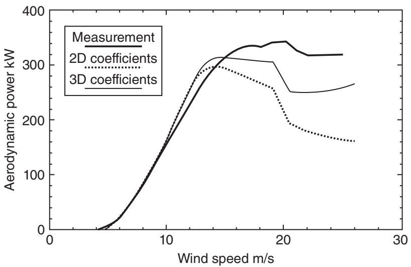

line

| Wind speed m/s | Measurement | 2D coefficients | 3D coefficients |
| -------------- | ----------- | --------------- | --------------- |
| 0              | 0           | 0               | 0               |
| 5              | 50          | 50              | 50              |
| 10             | 150         | 150             | 150             |
| 15             | 300         | 280             | 290             |
| 20             | 330         | 250             | 260             |
| 25             | 320         | 170             | 160             |
| 30             | 320         | 160             | 150             |

Figure 3.43 A comparison of measured and Snel’s predicted power curves for a NORD-TANK 300 kW turbine.

# 3.11 Calculated results for an actual turbine

The blade design of a turbine operating at constant uniform rotational speed and rxed pitch is given in Table 3.2, and the aerofoil characteristics are shown in Figure 3.44.

The complete $C _ { P ^ { - } } \lambda$ curve for the design is given in Figure 3.15.

Using the above data the results shown in Figure 3.45 are obtained.

The blade is designed for optimum performance at a tip speed ratio of about 6 and, ideally, the angle of attack, uniform along the span at the level for which the lift/drag ratio is a maximum, is about $7 ^ { \circ }$ for the aerofoil concerned. At the lowest tip speed ratio shown in Figure 3.45, the entire blade is stalled, and for a rotational speed of 60 rpm, the corresponding wind speed will be 26 m/s, which is the cut-out speed. For the highest tip speed ratio shown, the corresponding wind speed will be 4.5 m/s, the cut-in speed. Maximum power is developed at a tip speed ratio of 4.0 in a wind speed of 13 m/s and, clearly, much of the blade is stalled.

The axial sow induction factor is not uniform along the span at any tip speed ratio, indicating that the blade design is an engineering compromise, but at the tip speed ratio of 6.0 there is a range where the value is a little higher than 1/3. The sow factors shown in Figure 3.46 are those local to the blade, and so the average value of axial sow factor will be close to 1/3 at a tip speed ratio of 6.

Generally, the axial sow factor increases with tip speed ratio while the tangential sow factor decreases with tip speed ratio. The angular velocity of the wake increases sharply

Table 3.2 Blade design of a 17 m diameter rotor. 

<table><tr><td>Radius r mm</td><td> $\mu = \frac{r}{R}$ </td><td>Chord c mm</td><td>Pitch  $\beta$  deg</td><td>Thickness/chord ratio of blade %</td></tr><tr><td>1700</td><td>0.20</td><td>1085</td><td>15.0</td><td>24.6</td></tr><tr><td>2125</td><td>0.25</td><td>1045</td><td>12.1</td><td>22.5</td></tr><tr><td>2150</td><td>0.30</td><td>1005</td><td>9.5</td><td>20.7</td></tr><tr><td>2975</td><td>0.35</td><td>965</td><td>7.6</td><td>19.5</td></tr><tr><td>3400</td><td>0.40</td><td>925</td><td>6.1</td><td>18.7</td></tr><tr><td>3825</td><td>0.45</td><td>885</td><td>4.9</td><td>18.1</td></tr><tr><td>4250</td><td>0.50</td><td>845</td><td>3.9</td><td>17.6</td></tr><tr><td>4675</td><td>0.55</td><td>805</td><td>3.1</td><td>17.1</td></tr><tr><td>5100</td><td>0.60</td><td>765</td><td>2.4</td><td>16.6</td></tr><tr><td>5525</td><td>0.65</td><td>725</td><td>1.9</td><td>16.1</td></tr><tr><td>5950</td><td>0.70</td><td>685</td><td>1.5</td><td>15.6</td></tr><tr><td>6375</td><td>0.75</td><td>645</td><td>1.2</td><td>15.1</td></tr><tr><td>6800</td><td>0.80</td><td>605</td><td>0.9</td><td>14.6</td></tr><tr><td>6375</td><td>0.85</td><td>565</td><td>0.6</td><td>14.1</td></tr><tr><td>7225</td><td>0.90</td><td>525</td><td>0.4</td><td>13.6</td></tr><tr><td>8075</td><td>0.95</td><td>485</td><td>0.2</td><td>13.1</td></tr><tr><td>8500</td><td>1.00</td><td>445</td><td>0.0</td><td>12.6</td></tr></table>

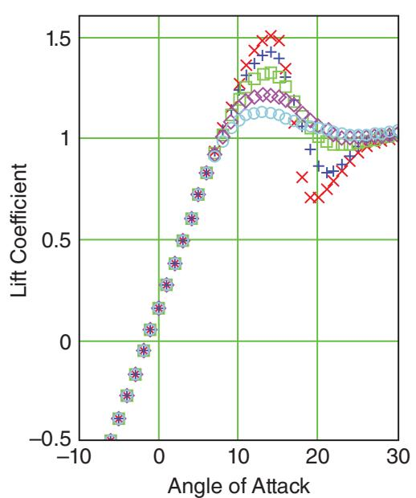

scatter

| Angle of Attack | Lift Coefficient |
| --------------- | ---------------- |
| -10             | -0.5             |
| -5              | -0.4             |
| 0               | 0.0              |
| 5               | 0.5              |
| 10              | 1.0              |
| 15              | 1.2              |
| 20              | 1.0              |
| 25              | 0.9              |
| 30              | 1.0              |

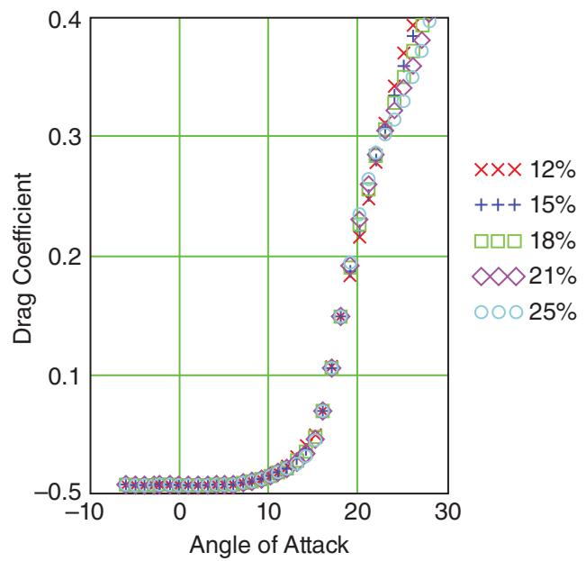  
Figure 3.44 The aerodynamic characteristics of the NACA632XX aerofoil series. (XX corresponding to the percentage thickness ratio of each section indicated.)

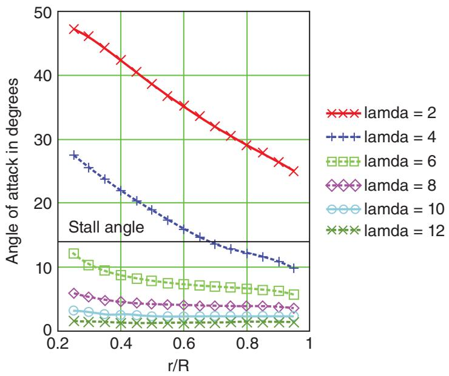

line

| r/R  | lamda = 2 | lamda = 4 | lamda = 6 | lamda = 8 | lamda = 10 | lamda = 12 |
|------|-----------|-----------|-----------|-----------|------------|------------|
| 0.2  | 48.0      | 28.0      | 12.0      | 6.0       | 3.0        | 1.0        |
| 0.4  | 42.0      | 22.0      | 9.0       | 5.0       | 3.0        | 1.0        |
| 0.6  | 36.0      | 16.0      | 8.0       | 4.5       | 3.0        | 1.0        |
| 0.8  | 30.0      | 12.0      | 7.0       | 4.0       | 3.0        | 1.0        |
| 1.0  | 25.0      | 10.0      | 6.0       | 3.5       | 3.0        | 1.0        |

Figure 3.45 Angle of attack distribution for a range of tip speed ratios.

with decreasing radius because it is mainly determined by the root vortex, the angular velocity about a straight line vortex being inversely proportional to distance.

The importance of the outboard section of the blade is clearly demonstrated in Figure 3.47. The dramatic effect of stall is shown in the difference in torque distribution between the tip speed ratio of 4 and the tip speed ratio of 2. Note, also, the sat distribution of torque at the high tip speed ratio of 12; this is caused by the effect of drag, which reduces torque as the square of the local speed ratio and with the low angle of attack at 휆 = 12 drag causes a signircant loss of power.

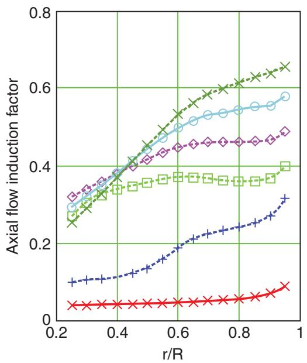

line

| r/R  | Axial flow induction factor (Red) | Axial flow induction factor (Blue) | Axial flow induction factor (Green) | Axial flow induction factor (Purple) | Axial flow induction factor (Light Blue) |
|------|-----------------------------------|------------------------------------|-------------------------------------|--------------------------------------|------------------------------------------|
| 0.2  | 0.03                              | 0.10                               | 0.25                                | 0.30                                 | 0.28                                     |
| 0.4  | 0.03                              | 0.12                               | 0.35                                | 0.38                                 | 0.35                                     |
| 0.6  | 0.03                              | 0.18                               | 0.45                                | 0.45                                 | 0.48                                     |
| 0.8  | 0.03                              | 0.25                               | 0.55                                | 0.47                                 | 0.55                                     |
| 1.0  | 0.03                              | 0.32                               | 0.65                                | 0.48                                 | 0.58                                     |

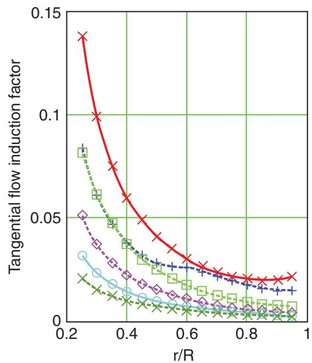

line

| r/R  | Tangential flow induction factor (Red) | Tangential flow induction factor (Green) | Tangential flow induction factor (Blue) | Tangential flow induction factor (Purple) | Tangential flow induction factor (Light Blue) |
|------|----------------------------------------|------------------------------------------|-----------------------------------------|------------------------------------------|-----------------------------------------------|
| 0.2  | 0.14                                   | 0.08                                     | 0.05                                    | 0.05                                     | 0.03                                          |
| 0.3  | 0.10                                   | 0.06                                     | 0.04                                    | 0.04                                     | 0.02                                          |
| 0.4  | 0.07                                   | 0.04                                     | 0.03                                    | 0.03                                     | 0.01                                          |
| 0.5  | 0.05                                   | 0.03                                     | 0.02                                    | 0.02                                     | 0.01                                          |
| 0.6  | 0.03                                   | 0.02                                     | 0.02                                    | 0.01                                     | 0.01                                          |
| 0.7  | 0.02                                   | 0.01                                     | 0.01                                    | 0.01                                     | 0.01                                          |
| 0.8  | 0.02                                   | 0.01                                     | 0.01                                    | 0.01                                     | 0.01                                          |
| 0.9  | 0.02                                   | 0.01                                     | 0.01                                    | 0.01                                     | 0.01                                          |
| 1.0  | 0.02                                   | 0.01                                     | 0.01                                    | 0.01                                     | 0.01                                          |

Figure 3.46 Distribution of the sow induction factors for a range of tip speed ratios (lines and symbols as for Figure 3.45).

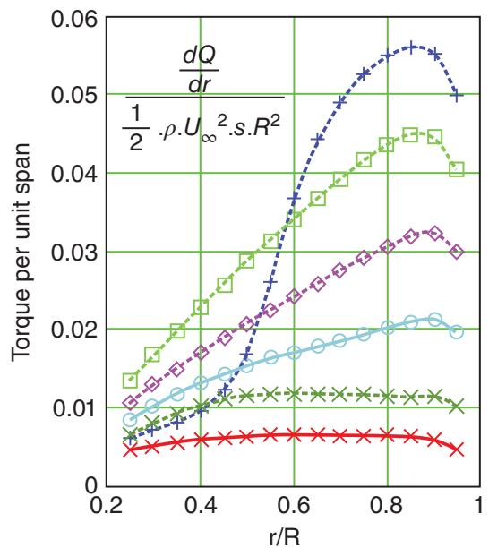

line

| r/R  | Torque per unit span (dQ/dr / (1/2)·ρ.U∞².s.R²) |
|------|-----------------------------------------------|
| 0.2  | 0.005                                         |
| 0.4  | 0.01                                          |
| 0.6  | 0.03                                          |
| 0.8  | 0.05                                          |
| 1.0  | 0.05                                          |

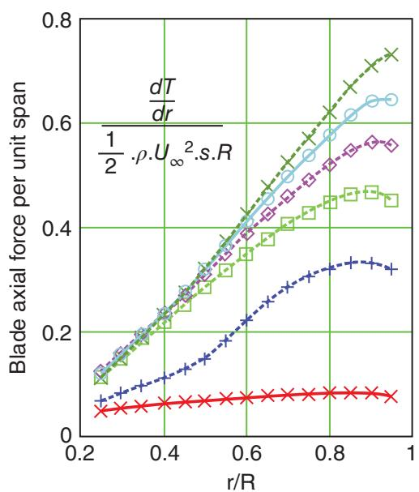

line

| r/R   | Blade axial force per unit span (dT/dr / 1/2 ·ρ.U∞².s.R) |
|-------|--------------------------------------------------------|
| 0.2   | ~0.1                                                   |
| 0.4   | ~0.3                                                   |
| 0.6   | ~0.5                                                   |
| 0.8   | ~0.65                                                  |
| 1.0   | ~0.75                                                  |

Figure 3.47 Distribution of blade loads for a range of tip speed ratios (lines and symbols as for Figure 3.45).

Although the blade thrust coefScient increases with tip speed ratio as shown in Figure 3.48, it must be remembered that the actual thrust force increases with wind speed, as is demonstrated in Figure 3.49.

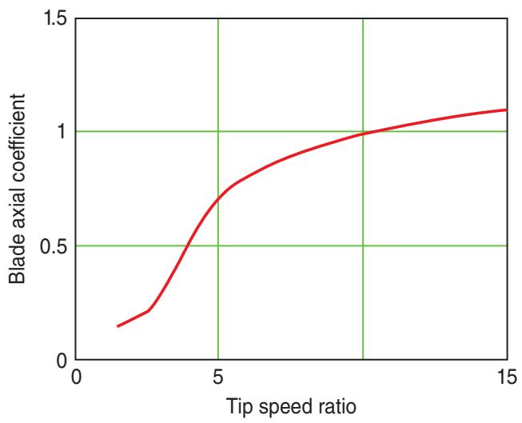

line

| Tip speed ratio | Blade axial coefficient |
| --------------- | ------------------------ |
| 0               | 0.1                      |
| 5               | 0.7                      |
| 15              | 1.1                      |

Figure 3.48 Variation of thrust coefrcient with tip speed ratio.

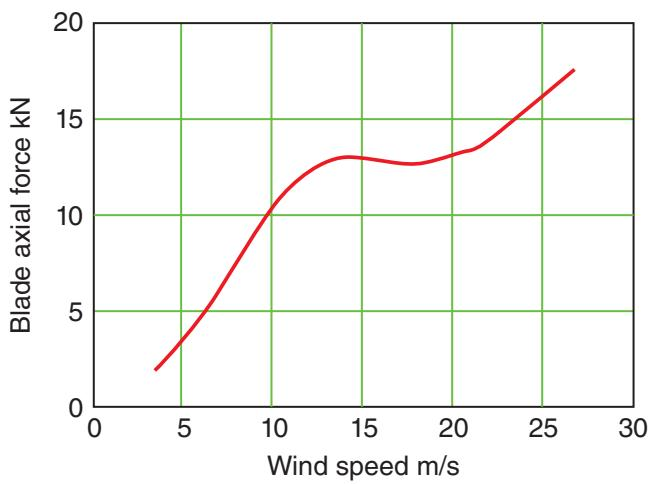

line

| Wind speed m/s | Blade axial force kN |
| -------------- | -------------------- |
| 4              | 2                    |
| 10             | 10                   |
| 15             | 13                   |
| 20             | 13                   |
| 25             | 16                   |
| 27             | 18                   |

Figure 3.49 Variation of the actual force with wind speed.

# 3.12 The performance curves

# 3.12.1 Introduction

The performance of a wind turbine can be characterised by the manner in which the three main indicators, power, torque, and thrust, vary with wind speed. The power determines the amount of energy captured by the rotor, and the torque developed determines the size of the gearbox and must be matched by whatever generator is being driven by the rotor. The rotor thrust has great insuence on the structural design of the tower. It is usually convenient to express the performance by means of non-dimensional, characteristic performance curves from which the actual performance can be determined regardless of how the turbine is operated, e.g. at constant rotational speed or some regime of variable rotor speed. Assuming that the aerodynamic performance of the rotor blades does not deteriorate, the non-dimensional aerodynamic performance of the rotor will depend upon the tip speed ratio and, if appropriate, the pitch setting of the blades. It is usual, therefore, to display the power, torque, and thrust coefrcients as functions of tip speed ratio.

# 3.12.2 The $C _ { P } - \lambda$ performance curve

The theory described earlier in this chapter gives the wind turbine designer a means of examining how the power developed by a turbine is governed by the various design parameters. The usual method of presenting power performance is the non-dimensional $C _ { P } - \lambda$ curve, and the performance curve under rxed-pitch conditions for a typical three bladed turbine of the type used for large-scale generation of electrical power is shown in Figure 3.50.

The rrst point to notice is that the maximum value of $C _ { P }$ is only 0.47, achieved at a tip speed ratio of 7, which is much less than the Betz limit for that tip speed ratio. The discrepancy is caused, in this case, by drag and tip-losses, but the stall also reduces the $C _ { P }$ at low values of the tip speed ratio.

Even with no losses included in the analysis, the Betz limit is not reached because the blade design is not perfect; see Figure 3.51.

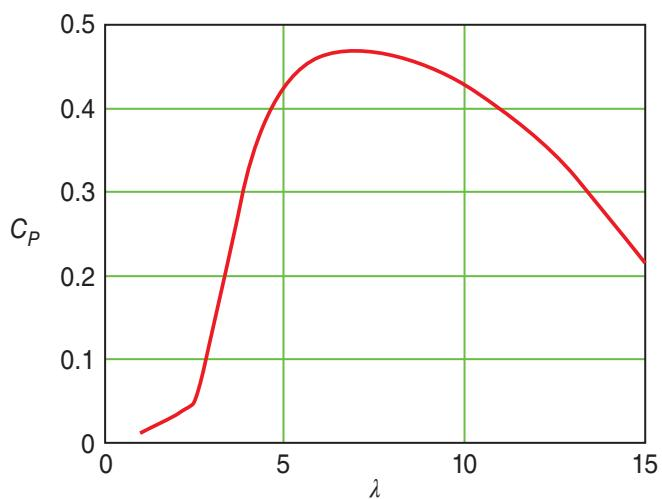

line

| λ   | Cp    |
| --- | ----- |
| 0   | 0.01  |
| 1   | 0.03  |
| 2   | 0.05  |
| 3   | 0.15  |
| 4   | 0.30  |
| 5   | 0.40  |
| 6   | 0.45  |
| 7   | 0.46  |
| 8   | 0.45  |
| 9   | 0.43  |
| 10  | 0.40  |
| 11  | 0.35  |
| 12  | 0.30  |
| 13  | 0.25  |
| 14  | 0.20  |
| 15  | 0.15  |

Figure 3.50 $C _ { P } - \lambda$ performance curve for a modern three blade turbine.

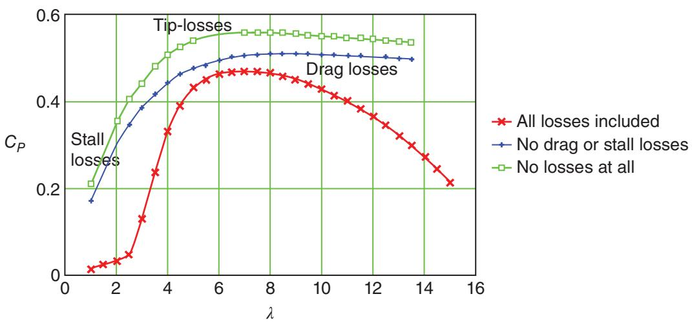

line

| λ    | All losses included | No drag or stall losses | No losses at all |
| ---- | ------------------- | ----------------------- | ----------------- |
| 1    | 0.02                | 0.18                    | 0.21              |
| 2    | 0.04                | 0.30                    | 0.35              |
| 3    | 0.12                | 0.38                    | 0.42              |
| 4    | 0.25                | 0.45                    | 0.48              |
| 5    | 0.35                | 0.48                    | 0.52              |
| 6    | 0.45                | 0.50                    | 0.55              |
| 7    | 0.47                | 0.51                    | 0.56              |
| 8    | 0.46                | 0.51                    | 0.56              |
| 9    | 0.45                | 0.51                    | 0.56              |
| 10   | 0.43                | 0.51                    | 0.56              |
| 11   | 0.41                | 0.51                    | 0.56              |
| 12   | 0.38                | 0.51                    | 0.56              |
| 13   | 0.35                | 0.51                    | 0.56              |
| 14   | 0.32                | 0.51                    | 0.56              |
| 15   | 0.28                | 0.51                    | 0.56              |
| 16   | 0.22                | 0.51                    | 0.56              |

Figure 3.51 $C _ { P } - \lambda$ performance curve for a modern three blade turbine showing losses.

# 3.12.3 The effect of solidity on performance

At this stage, the other principal parameter to consider is the solidity, derned as total blade area divided by the swept area. For the three blade machine, above, the solidity is 0.0345, but this can be altered readily by varying the number of blades, as shown in Figure 3.52.

The solidity could also have been changed by changing the blade chord.

The main effects to observe of changing solidity are:

1. Low solidity produces a broad, sat curve, which means that the $C _ { P }$ will change very little over a wide tip speed ratio range, but the maximum $C _ { P }$ is low because the drag losses are high (drag losses are roughly proportional to the cube of the tip speed ratio).   
2. High solidity produces a narrow performance curve with a sharp peak, making the turbine very sensitive to tip speed ratio changes and, if the solidity is too high, has a relatively low maximum $C _ { P }$ . The reduction in $C _ { P m a x }$ is caused by stall losses.   
3. An optimum solidity appears to be achieved with three blades, but two blades might be an acceptable alternative because although the maximum $C _ { P }$ is a little lower, the spread of the peak is wider, and that might result in a larger energy capture.

It might be argued that a good solution would be to have a large number of blades of small individual solidity, but this greatly increases production costs and results in blades that are structurally weak and very sexible.

There are applications that require turbines of relatively high solidity; one is the directly driven water pump, and the other is the very small turbine used for battery charging. In both cases it is the high starting torque (high torque at very low tip speed ratios)

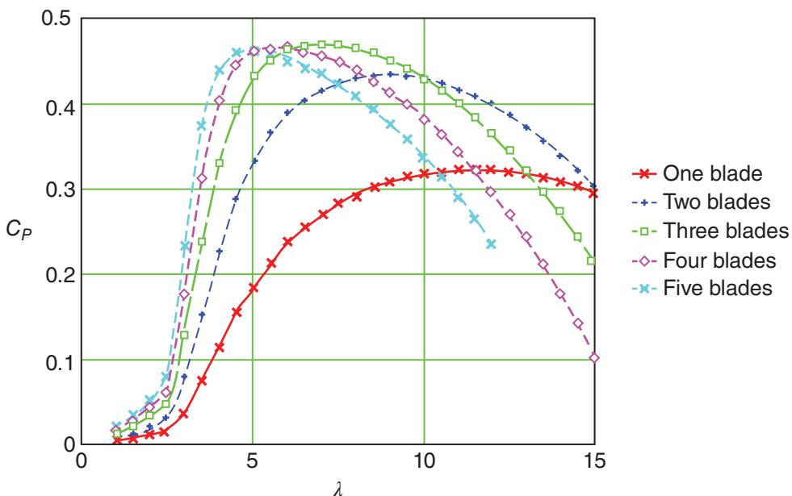

line

| λ    | One blade | Two blades | Three blades | Four blades | Five blades |
| ---- | --------- | ---------- | ------------ | ----------- | ----------- |
| 0    | 0.0       | 0.0        | 0.0          | 0.0         | 0.0         |
| 1    | 0.0       | 0.0        | 0.0          | 0.0         | 0.0         |
| 2    | 0.0       | 0.0        | 0.0          | 0.0         | 0.0         |
| 3    | 0.0       | 0.0        | 0.0          | 0.0         | 0.0         |
| 4    | 0.1       | 0.1        | 0.1          | 0.1         | 0.1         |
| 5    | 0.2       | 0.2        | 0.2          | 0.2         | 0.2         |
| 6    | 0.2       | 0.2        | 0.2          | 0.2         | 0.2         |
| 7    | 0.2       | 0.2        | 0.2          | 0.2         | 0.2         |
| 8    | 0.2       | 0.2        | 0.2          | 0.2         | 0.2         |
| 9    | 0.2       | 0.2        | 0.2          | 0.2         | 0.2         |
| 10   | 0.2       | 0.2        | 0.2          | 0.2         | 0.2         |
| 11   | 0.2       | 0.2        | 0.2          | 0.2         | 0.2         |
| 12   | 0.2       | 0.2        | 0.2          | 0.2         | 0.2         |
| 13   | 0.2       | 0.2        | 0.2          | 0.2         | 0.2         |
| 14   | 0.2       | 0.2        | 0.2          | 0.2         | 0.2         |
| 15   | 0.2       | 0.2        | 0.2          | 0.1         | 0.1         |

Figure 3.52 Effect of changing solidity.

that is of importance, and this also allows small amounts of power to be developed at very low wind speeds, ideal for trickle charging batteries.

# 3.12.4 The $C _ { Q } - \lambda$ curve

The torque coefrcient is derived from the power coefrcient simply by dividing by the tip speed ratio, and so it does not give any additional information about the turbine’s performance. The principal use of the $C _ { Q } - \lambda$ curve is for torque assessment purposes when the rotor is connected to a gearbox and generator.

Figure 3.53 shows how the torque developed by a turbine rises with increasing solidity. For modern high-speed turbines designed for electricity generation, as low a torque as possible is desirable to reduce gearbox costs. However, the multi-bladed, high solidity turbine, developed in the nineteenth century for water pumping, rotates slowly and has a very high starting torque coefrcient necessary for overcoming the torque required to start a positive displacement pump.

The peak of the torque curve is at the stall onset and occurs at a lower tip speed ratio than the peak of the power curve.

# 3.12.5 The $C _ { T } - \lambda$ curve

The thrust force on the rotor is directly applied to the tower on which the rotor is supported and so considerably insuences the structural design of the tower.

Generally, the thrust on the rotor increases with increasing solidity, as shown in Figure 3.54. These results are computed using Eq. (3.48) without the additional contribution from the rotational wake pressure term $\Delta { p } _ { \mathrm { d } 2 }$ [see Eq. (3.22) and the discussion following Eq. (3.48). Including this term increases the value of $C _ { \mathrm { T } }$ by the order of 1% when $\lambda = 8$ (specircally 1.39% for 휆 = 8, $a = 1 / 3$ and blade root at $r / R = 0 . 1 3 5 )$ .

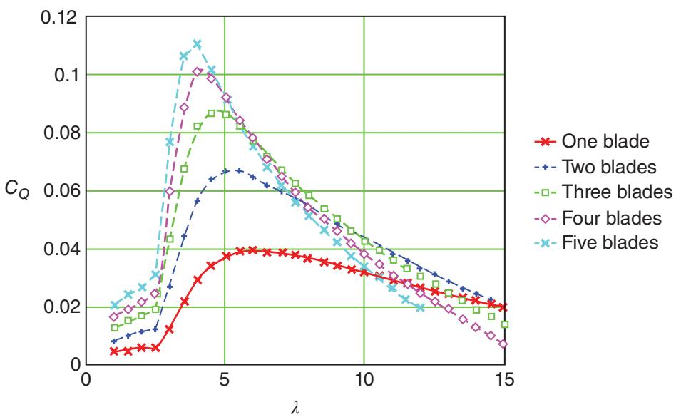

line

| λ    | One blade | Two blades | Three blades | Four blades | Five blades |
| ---- | --------- | ---------- | ------------ | ----------- | ----------- |
| 0    | 0.005     | 0.008      | 0.012        | 0.018       | 0.022       |
| 1    | 0.006     | 0.010      | 0.015        | 0.020       | 0.025       |
| 2    | 0.010     | 0.015      | 0.020        | 0.025       | 0.030       |
| 3    | 0.020     | 0.025      | 0.030        | 0.035       | 0.045       |
| 4    | 0.030     | 0.035      | 0.040        | 0.045       | 0.060       |
| 5    | 0.038     | 0.045      | 0.050        | 0.055       | 0.075       |
| 6    | 0.039     | 0.055      | 0.060        | 0.065       | 0.085       |
| 7    | 0.038     | 0.065      | 0.065        | 0.075       | 0.095       |
| 8    | 0.037     | 0.075      | 0.075        | 0.085       | 0.105       |
| 9    | 0.036     | 0.085      | 0.085        | 0.095       | 0.115       |
| 10   | 0.035     | 0.095      | 0.095        | 0.105       | 0.125       |
| 11   | 0.034     | 0.105      | 0.105        | 0.115       | 0.135       |
| 12   | 0.033     | 0.115      | 0.115        | 0.125       | 0.145       |
| 13   | 0.032     | 0.125      | 0.125        | 0.135       | 0.155       |
| 14   | 0.031     | 0.135      | 0.135        | 0.145       | 0.165       |
| 15   | 0.030     | 0.145      | 0.145        | 0.155       | 0.175       |

Figure 3.53 The effect of solidity on torque.

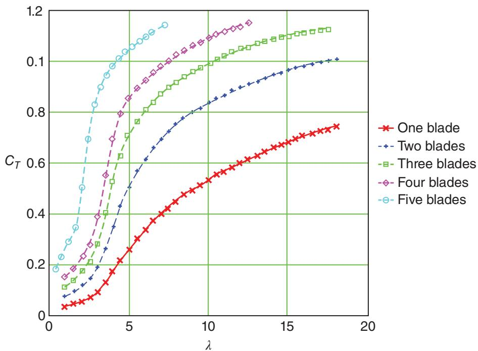

line

| λ    | One blade | Two blades | Three blades | Four blades | Five blades |
| ---- | --------- | ---------- | ------------ | ----------- | ----------- |
| 0    | 0.0       | 0.0        | 0.1          | 0.15        | 0.2         |
| 1    | 0.05      | 0.08       | 0.15         | 0.2         | 0.3         |
| 2    | 0.1       | 0.15       | 0.2          | 0.3         | 0.4         |
| 3    | 0.15      | 0.2        | 0.3          | 0.4         | 0.6         |
| 4    | 0.2       | 0.3        | 0.4          | 0.5         | 0.8         |
| 5    | 0.25      | 0.4        | 0.5          | 0.6         | 0.9         |
| 6    | 0.3       | 0.5        | 0.6          | 0.7         | 1.0         |
| 7    | 0.35      | 0.6        | 0.7          | 0.8         | 1.1         |
| 8    | 0.4       | 0.7        | 0.8          | 0.9         | 1.15        |
| 9    | 0.45      | 0.8        | 0.9          | 1.0         | 1.18        |
| 10   | 0.5       | 0.9        | 1.0          | 1.1         | 1.2         |
| 11   | 0.55      | 1.0        | 1.1          | 1.15        | 1.2         |
| 12   | 0.6       | 1.05       | 1.15         | 1.18        | 1.2         |
| 13   | 0.65      | 1.1        | 1.2          | 1.2         | 1.2         |
| 14   | 0.7       | 1.15       | 1.2          | 1.2         | 1.2         |
| 15   | 0.75      | 1.2        | 1.2          | 1.2         | 1.2         |
| 16   | 0.8       | 1.2        | 1.2          | 1.2         | 1.2         |
| 17   | 0.85      | 1.2        | 1.2          | 1.2         | 1.2         |
| 18   | 0.9       | 1.2        | 1.2          | 1.2         | 1.2         |
| 19   | 0.95      | 1.2        | 1.2          | 1.2         | 1.2         |
| 20   | 1.0       | 1.2        | 1.2          | 1.2         | 1.2         |

Figure 3.54 The effect of solidity on thrust.

# 3.13 Constant rotational speed operation

# 3.13.1 Introduction

The majority of wind turbines currently installed generate electricity. Whether or not these turbines are grid connected, they need to produce an electricity supply that is of constant frequency else many common appliances will not function properly. Consequently, a mode favoured in the early years of wind turbine development has been operation at constant rotational speed. Connected to the grid a constant-speed turbine is automatically controlled, whereas a stand-alone machine needs to have speed control and a means of dumping excess power.

# 3.13.2 The $K _ { P } - I I \lambda$ curve

An alternative performance curve can be produced for a turbine controlled at constant speed. The $C _ { P } - \lambda$ curve shows, non-dimensionally, how the power would vary with rotational speed if the wind speed was held constant. The $K _ { P } - I / \lambda$ curve describes, again non-dimensionally, how the power would change with wind speed when constant rotational speed is enforced. $K _ { P }$ is derned as

$$
K _ {p} = \frac {\text { Power }}{\left(\frac {1}{2}\right) \rho (\Omega R) ^ {3} A _ {d}} = \frac {C _ {p}}{\lambda^ {3}} \tag {3.95}
$$

The $C _ { P } - \lambda$ and $K _ { P } \mathrm { ~ - ~ } I / \lambda$ curves for a typical rxed-pitch wind turbine are shown in Figure 3.55. The $K _ { P } - I / \lambda$ curve, as stated above, has the same form as the power–wind speed characteristic of the turbine. The efrciency of the turbine (given by the $C _ { P } - \lambda$ curve) varies greatly with wind speed, a disadvantage of constant-speed operation, but it should be designed such that the maximum efrciencies are achieved at wind speeds where there is the most energy available.

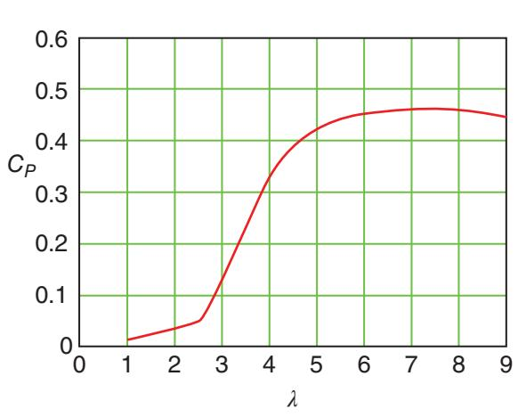

line

| λ | CP    |
|---|-------|
| 1 | 0.01  |
| 2 | 0.03  |
| 3 | 0.15  |
| 4 | 0.35  |
| 5 | 0.42  |
| 6 | 0.45  |
| 7 | 0.46  |
| 8 | 0.45  |
| 9 | 0.44  |

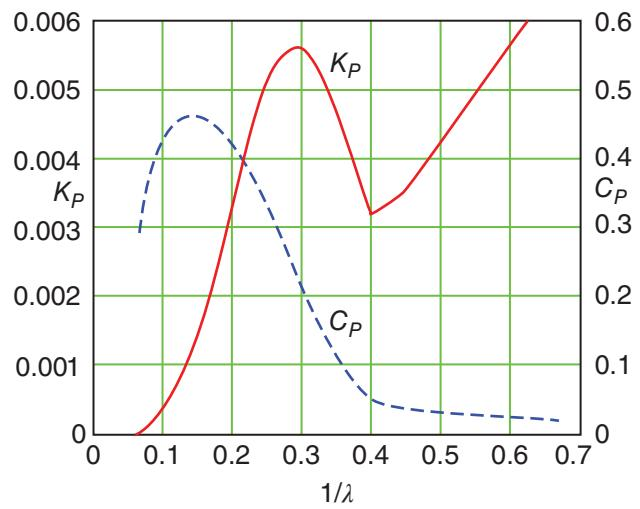

line

| 1/λ   | KP     | CP     |
|-------|--------|--------|
| 0.0   | 0.0000 | 0.0    |
| 0.1   | 0.0010 | 0.45   |
| 0.2   | 0.0035 | 0.40   |
| 0.3   | 0.0055 | 0.25   |
| 0.4   | 0.0032 | 0.05   |
| 0.5   | 0.0045 | 0.02   |
| 0.6   | 0.0058 | 0.01   |
| 0.7   | 0.0062 | 0.0    |

Figure 3.55 Non-dimensional performance curves for constant-speed operation.

# 3.13.3 Stall regulation

An important feature of this $K _ { P } - I / \lambda$ curve is that the power, initially, falls off once stall has occurred and then gradually increases with wind speed. This feature provides an element of passive power output regulation, ensuring that the generator is not overloaded as the wind speed increases. Ideally, the power should rise with wind speed to the maximum value and then remain constant regardless of the increase in wind speed: this is called perfect stall regulation. However, stall-regulated turbines do not exhibit the ideal, passive stall behaviour.

Stall regulation provides the simplest means of controlling the maximum power generated by a turbine to suit the sizes of the installed generator and gearbox. The principal advantage of stall control is simplicity, but there are signircant disadvantages. The power vs wind speed curve is rxed by the aerodynamic characteristics of the blades, in particular the stalling behaviour. The post-stall power output of a turbine varies very unsteadily and in a manner that, so far, deres prediction (see Figure 3.62, for example). The stalled blade also exhibits low vibration damping because the sow about the blade is unattached to the low-pressure surface, and blade vibration velocity has little effect on the aerodynamic forces. The low damping can give rise to large vibration displacement amplitudes, which will inevitably be accompanied by large bending moments and stresses, causing fatigue damage. When parked in high, turbulent winds, the rxed-pitch, stationary blade may well be subject to large aerodynamic loads that cannot be alleviated by adjusting (feathering) the blade pitch angle. Consequently, the blades of a rxed-pitch, stall-regulated turbine must be very strong, involving an appropriate cost penalty.

# 3.13.4 Effect of rotational speed change

The power output of a turbine running at constant speed is strongly governed by the chosen, operational rotational speed. If a low rotation speed is used, the power reaches a maximum at a low wind speed, and consequently it is very low. To extract energy at wind speeds higher than the stall peak, the turbine must operate in a stalled condition and so is very inefrcient. Conversely, a turbine operating efrciently at a high speed will extract a great deal of power at high wind speeds, but at moderate wind speeds it will be operating inefrciently because of the high drag losses. Figure 3.56 demonstrates the sensitivity to rotation speed of the power output – a 33% increase in rpm from 45 to 60 results in a 150% increase in peak power, resecting the increased wind speed at which peak power occurs at 60 rpm.

At low wind speeds, however, there is a marked fall in power with increasing rotational speed, as shown in Figure 3.57. In fact, the higher power available at low wind speeds if a lower rotational speed is adopted has led to two speed turbines being built. Operating at one rxed speed that maximises energy capture at wind speeds at or above the average level will result in a rather high cut-in wind speed, the lowest wind speed at which generation is possible. Employing a lower rotational speed at low wind speeds reduces the cut-in wind speed and increases energy capture. The increased energy capture is, of course, offset by the cost of the extra machinery.

# 3.13.5 Effect of blade pitch angle change

Another parameter that affects the power output is the pitch setting angle of the blades $\beta _ { s }$ . Blade designs almost always involve twist, but the blade can be set at the root with an overall pitch angle. The effects of a few degrees of pitch are shown in Figure 3.58.

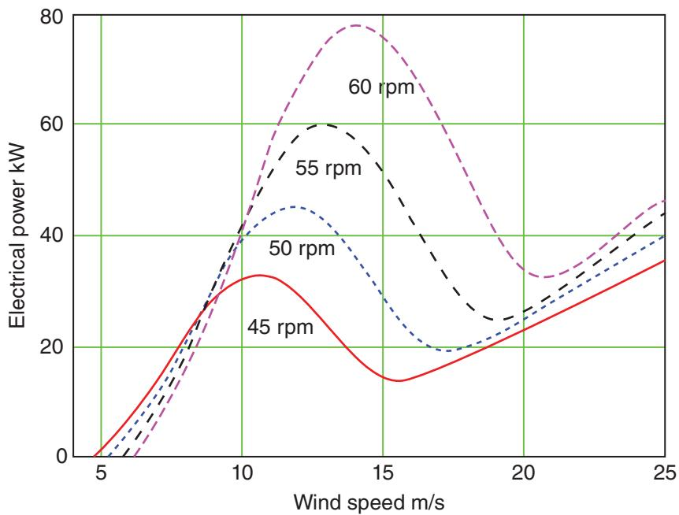

line

| Wind speed m/s | 45 rpm | 50 rpm | 55 rpm | 60 rpm |
| -------------- | ------ | ------ | ------ | ------ |
| 5              | 0      | 0      | 0      | 0      |
| 10             | 30     | 40     | 40     | 40     |
| 15             | 15     | 20     | 60     | 78     |
| 20             | 25     | 25     | 25     | 30     |
| 25             | 35     | 40     | 45     | 45     |

Figure 3.56 Effect on extracted power of rotational speed.

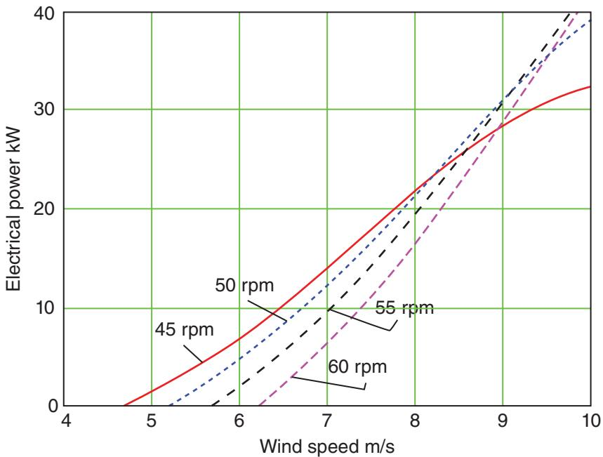

line

| Wind speed m/s | Electrical power kW (45 rpm) | Electrical power kW (50 rpm) | Electrical power kW (55 rpm) | Electrical power kW (60 rpm) |
| -------------- | ---------------------------- | ---------------------------- | ---------------------------- | ---------------------------- |
| 5              | 0                            | 0                            | 0                            | 0                            |
| 6              | ~5                           | ~7                           | ~10                          | ~12                          |
| 7              | ~10                          | ~13                          | ~18                          | ~20                          |
| 8              | ~15                          | ~20                          | ~25                          | ~28                          |
| 9              | ~20                          | ~25                          | ~30                          | ~32                          |
| 10             | ~25                          | ~30                          | ~35                          | ~38                          |

Figure 3.57 Effect on extracted power of rotational speed at low wind speeds.

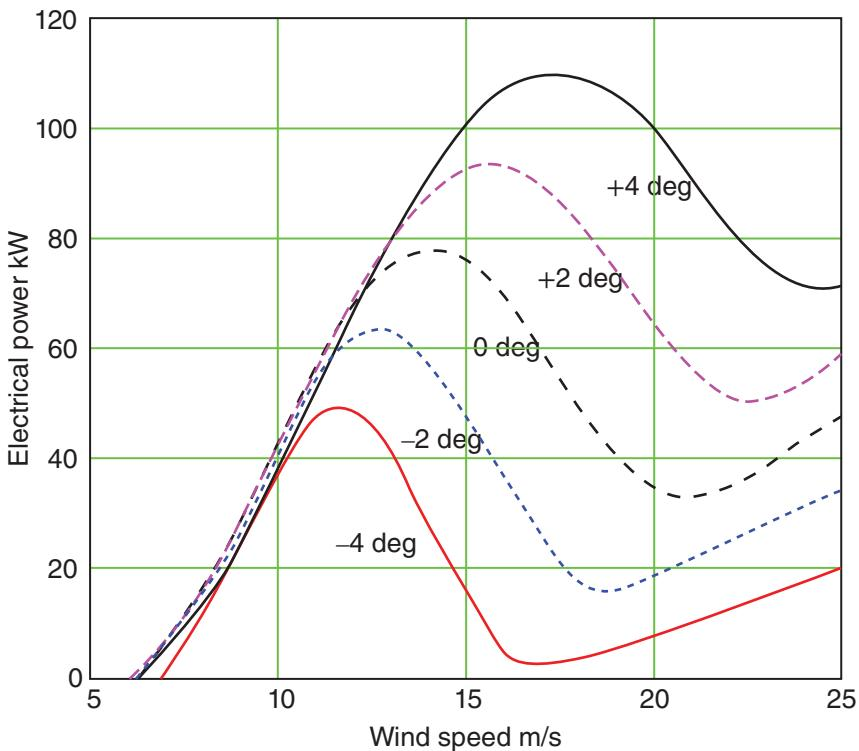

line

| Wind speed m/s | +4 deg | +2 deg | 0 deg | -2 deg | -4 deg |
| -------------- | ------ | ------ | ----- | ------ | ------ |
| 5              | 0      | 0      | 0     | 0      | 0      |
| 10             | 60     | 60     | 60    | 60     | 60     |
| 15             | 100    | 80     | 70    | 60     | 50     |
| 20             | 100    | 60     | 30    | 20     | 10     |
| 25             | 70     | 60     | 40    | 30     | 20     |

Figure 3.58 Effect on extracted power of blade pitch set angle.

Small changes in pitch setting angle can have a dramatic effect on the power output. Positive pitch angle settings increase the design pitch angle and so decrease the angle of attack. Conversely, negative pitch angle settings increase the angle of attack and may cause stalling to occur, as shown in Figure 3.58. A turbine rotor designed to operate optimally at a given set of wind conditions can be suited to other conditions by appropriate adjustments of blade pitch angle and rotational speed.

# 3.14 Pitch regulation

# 3.14.1 Introduction

Many of the shortcomings of rxed-pitch/passive stall regulation can be overcome by providing active pitch angle control. Figure 3.58 shows the sensitivity of power output to pitch angle changes.

The most important application of pitch control is for power regulation, but pitch control has other advantages. By adopting a large positive pitch angle, a large starting torque can be generated as a rotor begins to turn. A 90∘ pitch angle is usually used when the rotor is stationary because this will minimise forces on the blades such that they will not sustain damage in high winds. At 90∘ of positive pitch the blade is said to be ‘feathered’. The blades need not be as strong, therefore, as for a stall-regulated turbine, which reduces blade costs. Only a small change of pitch angle is needed to provide an assisted start-up.

The principal disadvantages of pitch control are lower reliability and cost, but the latter is offset by lower blade costs.

Power regulation can be achieved either by pitching to promote stalling or pitching to feather, which reduces the lift force on the blades by reducing the angle of attack.

# 3.14.2 Pitching to stall

Figure 3.58 shows the power curves for a turbine rated at 60 kW, which is achieved at 12 m/s. At wind speeds below the rated level, the blade pitch angle is kept at zero degrees. As rated power is reached, only a small negative pitch angle, initially of about 2∘, is necessary to promote stalling and so to limit the power to the rated level. As the wind speed increases, small adjustments in both the positive and negative directions are all that are needed to maintain constant power.

The small size of the pitch angle adjustments make pitching to stall very attractive to designers, but the blades have the same damping and fatigue problems as rxed-pitch turbines.

# 3.14.3 Pitching to feather

By increasing the pitch angle as rated power is reached, the angle of attack can be reduced. A reduced angle of attack will reduce the lift force and the torque. The sow around the blade remains attached. Figure 3.59 is for the same turbine as Figure 3.58, but only the zero degree power curve is relevant below the rated level. Above the rated level, fragments of power curves for higher-pitch angles are shown as they cross the rated power line: the crossing points give the necessary pitch angles to maintain rated power at the corresponding wind speeds. As can be seen in Figure 3.59, the required pitch angles increase progressively with wind speed and are generally much larger than is needed for the pitching to stall method. In gusty conditions, large pitch excursions are needed to maintain constant power, and the inertia of the blades will limit the speed of the control system’s response.

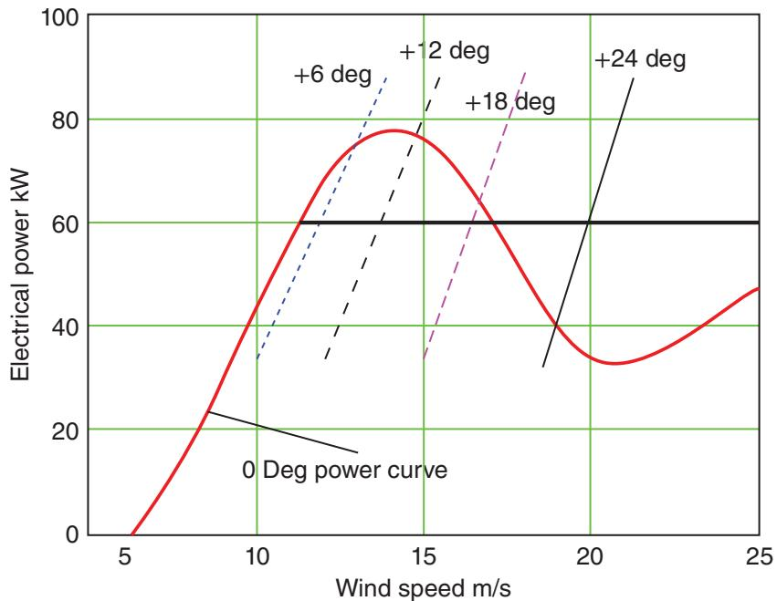

line

| Wind speed m/s | Electrical power kW |
| -------------- | ------------------- |
| 5              | 0                   |
| 10             | 35                  |
| 15             | 78                  |
| 20             | 33                  |
| 25             | 48                  |

Figure 3.59 Pitching to feather power regulation requires large changes of pitch angle.

Because the blades remain unstalled if large gusts occur at wind speeds above the rated level, large changes of angle of attack will take place with associated large changes in lift. Gust loads on the blades can therefore be more severe than for stalled blades.

The advantages of the pitching to feather method are that the sow around the blade remains attached, and so well understood, and provides good, positive damping. Feathered blade parking and assisted starting are also available.

Pitching to feather has been the preferred pitch control option mainly because the blade loads can be predicted with more conrdence than for stalled blades.

# 3.15 Comparison of measured with theoretical performance

The turbine considered in this section is stall regulated and is run at constant rotational speed. More detail about this method of operation will be discussed in the next section, but the main feature is that there is, theoretically, a unique power output for a given wind speed.

When the turbine was under test, the chosen rotational speed was 44 rpm. Energy output and wind speed were measured over one-minute time intervals and the average power and wind speed determined. The test was continued until a sufrcient range of wind speeds had been covered. The one-minute average results were then sorted in ‘bins’ 0.5 m/s of wind speed wide, and a fairly smooth power vs wind speed curve was obtained, as shown in Figure 3.60.

The turbine has a diameter of 17 m and would be expected to produce rather more power than shown above if operated at a higher rotational speed.

From the data in Figure 3.60, the $C _ { P } - \lambda$ curve can be derived. The tip speed of the blades is $( 4 4 \pi ) / 3 0 r a d / s \times 8 . 5 m = 3 9 . 2 m / s$ , the swept area is $8 . 5 ^ { 2 } . \pi = 2 2 7 m ^ { 2 }$ , and the air density was measured (from air pressure and temperature readings) at 1.19 kg/m3.

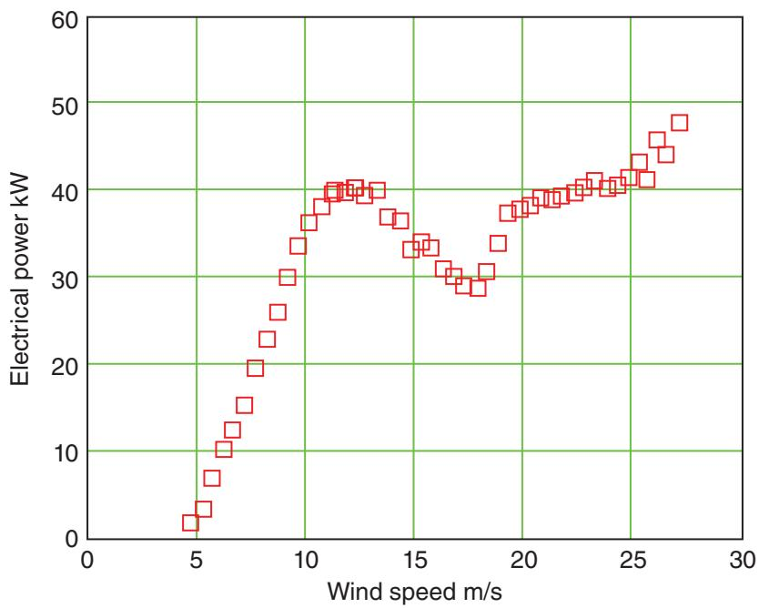

scatter

| Wind speed m/s | Electrical power kW |
| -------------- | ------------------- |
| 4.5            | 2.0                 |
| 5.0            | 3.0                 |
| 5.5            | 7.0                 |
| 6.0            | 10.0                |
| 6.5            | 12.0                |
| 7.0            | 15.0                |
| 7.5            | 18.0                |
| 8.0            | 20.0                |
| 8.5            | 23.0                |
| 9.0            | 26.0                |
| 9.5            | 30.0                |
| 10.0           | 34.0                |
| 10.5           | 37.0                |
| 11.0           | 39.0                |
| 11.5           | 40.0                |
| 12.0           | 40.5                |
| 12.5           | 40.0                |
| 13.0           | 39.0                |
| 13.5           | 37.0                |
| 14.0           | 35.0                |
| 14.5           | 33.0                |
| 15.0           | 32.0                |
| 15.5           | 31.0                |
| 16.0           | 30.0                |
| 16.5           | 29.0                |
| 17.0           | 28.0                |
| 17.5           | 29.0                |
| 18.0           | 30.0                |
| 18.5           | 31.0                |
| 19.0           | 33.0                |
| 19.5           | 35.0                |
| 20.0           | 37.0                |
| 20.5           | 38.0                |
| 21.0           | 39.0                |
| 21.5           | 39.5                |
| 22.0           | 40.0                |
| 22.5           | 40.5                |
| 23.0           | 41.0                |
| 23.5           | 41.5                |
| 24.0           | 42.0                |
| 24.5           | 42.5                |
| 25.0           | 43.0                |
| 25.5           | 44.0                |
| 26.0           | 45.0                |
| 26.5           | 46.0                |
| 27.0           | 47.0                |
| 27.5           | 48.0                |
| 28.0           | 49.0                |

Figure 3.60 Power vs wind speed curve from the binned measurements of a three blade stall-regulated turbine.

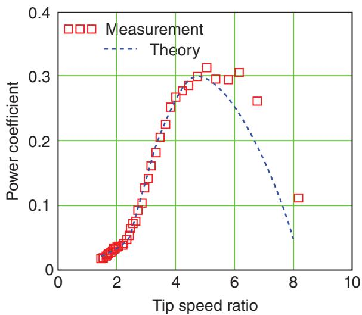

scatter

| Tip speed ratio | Power coefficient |
| --------------- | ----------------- |
| 1.0             | 0.02              |
| 1.5             | 0.03              |
| 2.0             | 0.05              |
| 2.5             | 0.08              |
| 3.0             | 0.12              |
| 3.5             | 0.16              |
| 4.0             | 0.20              |
| 4.5             | 0.25              |
| 5.0             | 0.30              |
| 5.5             | 0.31              |
| 6.0             | 0.30              |
| 6.5             | 0.27              |
| 7.0             | 0.25              |
| 7.5             | 0.20              |
| 8.0             | 0.11              |
| 8.5             | 0.08              |
| 9.0             | 0.05              |
| 9.5             | 0.03              |
| 10.0            | 0.02              |

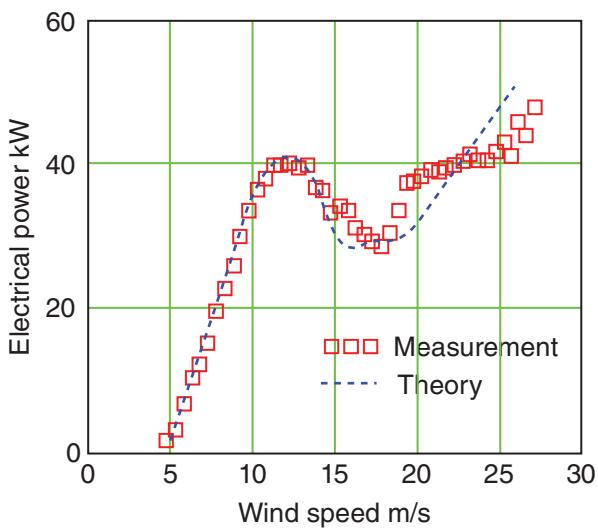

line

| Wind speed m/s | Electrical power kW |
| -------------- | ------------------- |
| 5              | 2                   |
| 6              | 8                   |
| 7              | 14                  |
| 8              | 20                  |
| 9              | 26                  |
| 10             | 32                  |
| 11             | 38                  |
| 12             | 40                  |
| 13             | 40                  |
| 14             | 38                  |
| 15             | 34                  |
| 16             | 30                  |
| 17             | 28                  |
| 18             | 30                  |
| 19             | 34                  |
| 20             | 38                  |
| 21             | 40                  |
| 22             | 42                  |
| 23             | 44                  |
| 24             | 46                  |
| 25             | 48                  |
| 26             | 50                  |
| 27             | 52                  |
| 28             | 54                  |
| 29             | 56                  |

Figure 3.61 Comparison of measured and theoretical performance curves.

Therefore,

$$
\lambda = \frac {3 9 . 2}{\text { windspeed }} \quad \text { and } \quad C _ {P} = \frac {\text { Power } \lambda^ {3}}{\frac {1}{2} . 1 . 1 9 . 3 9 . 2 ^ {3} . 2 2 7} \tag {3.96}
$$

The mechanical and electrical losses were estimated at 5.62 kW, and this value was used to adjust the theoretical values of $C _ { P }$ . The resulting comparison of measured and theoretical results is shown in Figure 3.61.

This comparison looks reasonable and shows that the theory is reliable, but the quality of the theoretical predictions really relies upon the quality of the aerofoil data. The blade and aerofoil design are the same as given in Section 3.11.

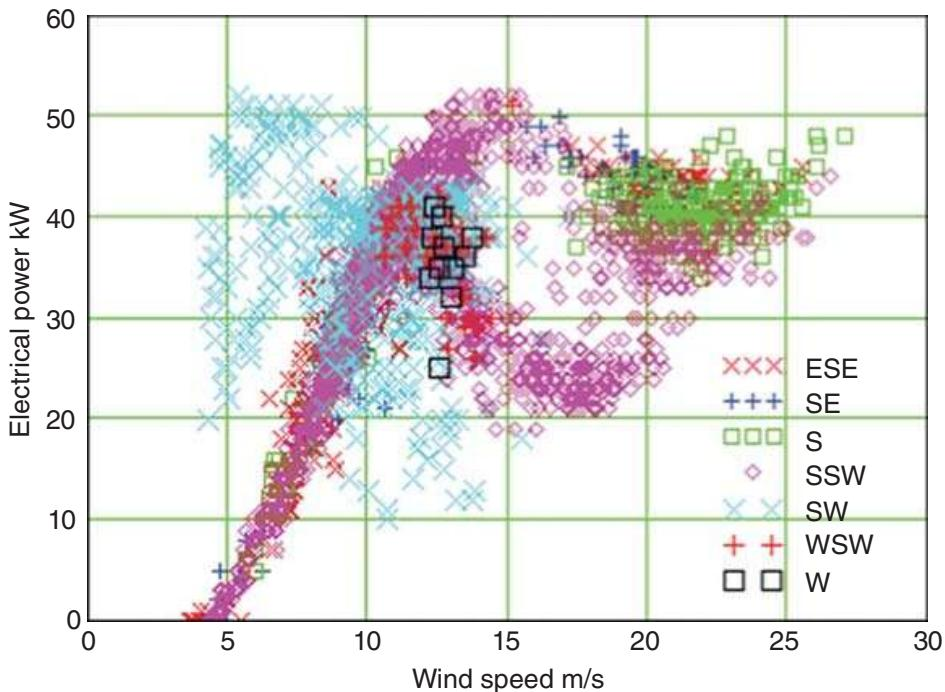

scatter

| Wind speed m/s | Electrical power kW | Group |
| -------------- | ------------------- | ----- |
| 5              | 0                   | ESE   |
| 10             | 20                  | SE    |
| 15             | 40                  | S     |
| 20             | 45                  | SSW   |
| 25             | 48                  | SW    |
| 30             | 50                  | WSW   |
| 12             | 25                  | W     |

Figure 3.62 Measured raw results of a three blade wind turbine.

One last point should be made before classifying the theory as complete: it would be as well to look at the raw, one-minute average data before it was reduced down by a binning process; this is shown in Figure 3.62. In the post-stall region, there seems to be a much more complex process taking place than the simple theory predicts, and this could be caused by unsteady aerodynamic effects or a bistable separation condition.

# 3.16 Estimation of energy capture

The quantity of energy that can be captured by a wind turbine depends upon the power vs wind speed characteristic of the turbine and the wind speed distribution at the turbine site.

Wind speed distribution is discussed in Section 2.4. The distribution at a given site is described by a probability density function, Eq. (2.3), with parameters specired for the site.

A performance curve is shown in Figure 3.63 for a turbine designed with an optimum tip speed ratio of 7. As an example, assume that this turbine is stall regulated and operates at a rxed rotational speed at a site where the average wind speed is 6 m/s and the Weibull shape factor $\mathrm { k } = 1 . 8$ , then, from Eq. (2.2), the scale factor $\mathrm { c } = 6 . 7 5 \mathrm { m } / \mathrm { s }$ .

Figure 3.64 shows the $K _ { P } - I / \lambda$ curve for the turbine: from inspection of that curve the tip speed ratio at which stall (maximum power) occurs is 3.7, and the corresponding $C _ { P }$ is 0.22.

The required maximum electrical power of the machine is 500 kW, the transmission loss is 10 kW, the mean generator efrciency is 90%, and the availability of the turbine (amount of time for which it is available to operate when maintenance and repair time is taken into account) is 98%.

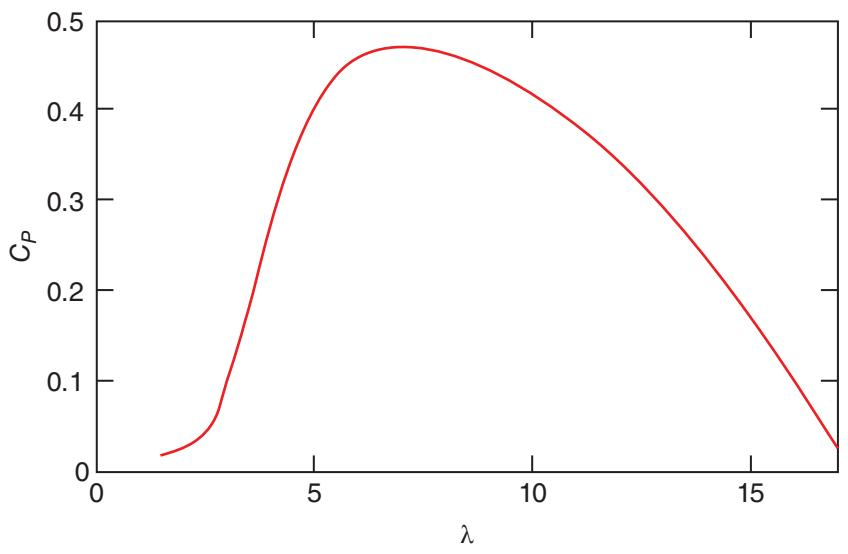

line

| λ   | Cp    |
| --- | ----- |
| 0   | 0.02  |
| 5   | 0.45  |
| 10  | 0.40  |
| 15  | 0.20  |
| 18  | 0.02  |

Figure 3.63 $C _ { P } - \lambda$ curve for a design tip speed ratio of 7 at 7 m/s.

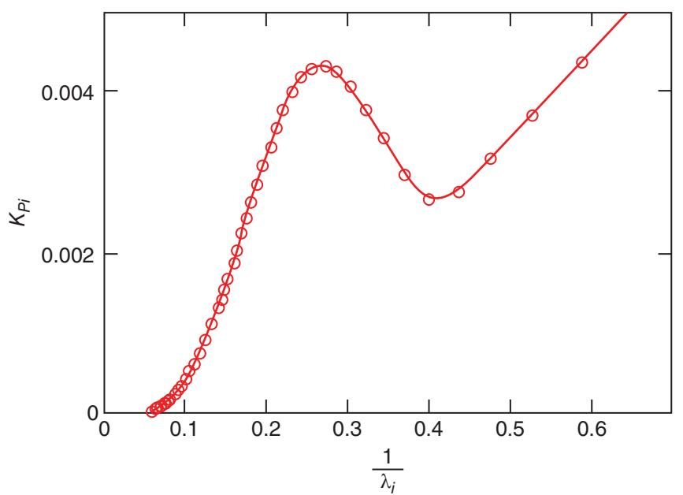

line

| 1/λi   | KPi     |
| ------ | ------- |
| 0.05   | 0.0001  |
| 0.06   | 0.0003  |
| 0.07   | 0.0005  |
| 0.08   | 0.0007  |
| 0.09   | 0.0009  |
| 0.10   | 0.0011  |
| 0.11   | 0.0013  |
| 0.12   | 0.0015  |
| 0.13   | 0.0017  |
| 0.14   | 0.0019  |
| 0.15   | 0.0021  |
| 0.16   | 0.0023  |
| 0.17   | 0.0025  |
| 0.18   | 0.0027  |
| 0.19   | 0.0029  |
| 0.20   | 0.0031  |
| 0.21   | 0.0033  |
| 0.22   | 0.0035  |
| 0.23   | 0.0037  |
| 0.24   | 0.0039  |
| 0.25   | 0.0041  |
| 0.26   | 0.0043  |
| 0.27   | 0.0044  |
| 0.28   | 0.0043  |
| 0.29   | 0.0042  |
| 0.30   | 0.0041  |
| 0.31   | 0.0040  |
| 0.32   | 0.0039  |
| 0.33   | 0.0038  |
| 0.34   | 0.0037  |
| 0.35   | 0.0036  |
| 0.36   | 0.0035  |
| 0.37   | 0.0034  |
| 0.38   | 0.0033  |
| 0.39   | 0.0032  |
| 0.40   | 0.0031  |
| 0.41   | 0.0032  |
| 0.42   | 0.0033  |
| 0.43   | 0.0034  |
| 0.44   | 0.0035  |
| 0.45   | 0.0036  |
| 0.46   | 0.0037  |
| 0.47   | 0.0038  |
| 0.48   | 0.0039  |
| 0.49   | 0.0040  |
| 0.50   | 0.0041  |
| 0.51   | 0.0042  |
| 0.52   | 0.0043  |
| 0.53   | 0.0044  |
| 0.54   | 0.0045  |
| 0.55   | 0.0046  |
| 0.56   | 0.0047  |
| 0.57   | 0.0048  |
| 0.58   | 0.0049  |
| 0.59   | 0.0050  |
| 0.60   | 0.055   |

Figure 3.64 $K _ { P } - I / \lambda$ curve for a rxed-speed, stall-regulated turbine.

The maximum rotor shaft power (aerodynamic power) is then

$$
\mathrm{P} _ {\mathrm{s}} = (5 0 0 + 1 0) / 0. 9 = 5 6 7 \mathrm{kW} \tag {3.97}
$$

The wind speed at which maximum power is developed (where $\mathrm { d } \mathrm { C } _ { \mathrm { p } } / \mathrm { d } \lambda = 3 \mathrm { C } _ { \mathrm { p } } / \lambda$ for rxed speed) is 13 m/s, therefore the rotor swept area must be, assuming an air density of 1.225 kg/m3,

$$
5 6 7 0 0 0 / (1 / 2 \times 1. 2 2 5 \times 1 3 ^ {3} \times 0. 2 2) = 1. 9 2 \times 1 0 ^ {3} \mathrm{m} ^ {2}
$$

The rotor radius is therefore 24.6 m.

The tip speed of the rotor will be $3 . 7 \times 1 3 \mathrm { m / s } = 4 8 . 1 \mathrm { m / s } ,$ and so the rotational speed will be

$$
4 8. 1 / 2 4. 6 \mathrm{rad/s} = 1. 9 6 \mathrm{rad/s}, \text {   which   is   } 1. 9 6 \times 6 0 / 2 \pi \mathrm{rev/min} = 1 8. 7 \mathrm{rev/min}.
$$

The power vs wind speed curve for the turbine can then be obtained from Figure 3.64.

Power (electrical)

$$
= \left(K _ {P} \times {} ^ {1} / _ {2} \times 1. 2 2 5 k g / m ^ {3} \times (4 8. 1 m / s) ^ {3} \times 1. 9 2 \times 1 0 ^ {3} m ^ {2} - 1 0 \times 1 0 0 0 W\right) \times 0. 9 \tag {3.98}
$$

since wind speed = 48.1 m/s / 휆, and these are shown in Figure 3.65.

To determine the energy capture of the turbine over a time period T, the product of the power characteristic $P ( u )$ with the probability $f ( u )$ is integrated with respect to time over T. This can be converted to an integral with respect to wind speed u over the wind speed range, since $f ( u )$ is the proportion of time T spent at wind speed $u ,$ and therefore:

$$
f (u). \delta u = \frac {\delta T}{T} \tag {3.99}
$$

with

$$
\int_ {0} ^ {\infty} f (u). d u = 1 \tag {3.100}
$$

$P ( u ) f ( u )$ can be plotted against u as in Figure 3.66 and then integrated over the operational wind speed range of the turbine to give the total energy capture.

The operational speed range will be between the cut-in speed and the cut-out speed. The cut-in speed is determined by the transmission losses: at what wind speed does the turbine begin to generate power? The cut-in speed is usually chosen to be somewhat higher than the zero power speed, in the present case, say 4 m/s.

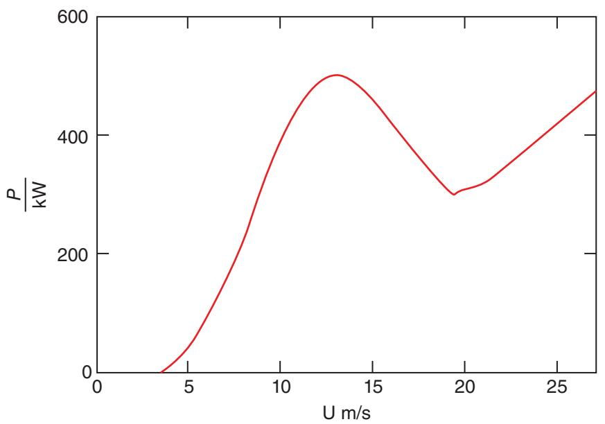

line

| U m/s | P/kW |
| ----- | ---- |
| 0     | 0    |
| 5     | 100  |
| 10    | 400  |
| 15    | 500  |
| 20    | 300  |
| 25    | 450  |
| 27    | 500  |

Figure 3.65 Power vs wind speed.

The cut-out speed is chosen to protect the turbine from high loads, usually about 25 m/s.

The total energy captured (E) by the turbine in a time period T is

$$
T \int_ {\frac {U _ {c i}}{U}} ^ {\frac {U _ {c o}}{U}} P (u) f (u) d u = E \tag {3.101}
$$

which is the area under the curve of Figure 3.66 times the time T. Unfortunately, the integral does not have a closed mathematical form in general, and so a numerical integration is required, such as the trapezoidal rule or, for better accuracy, Simpson’s rule.

For a time period of one year, the energy capture can be calculated numerically as indicated in Figure 3.67 to be

$$
E = 4. 5 4 1 3 \cdot 1 0 ^ {8} k W h \tag {3.102}
$$

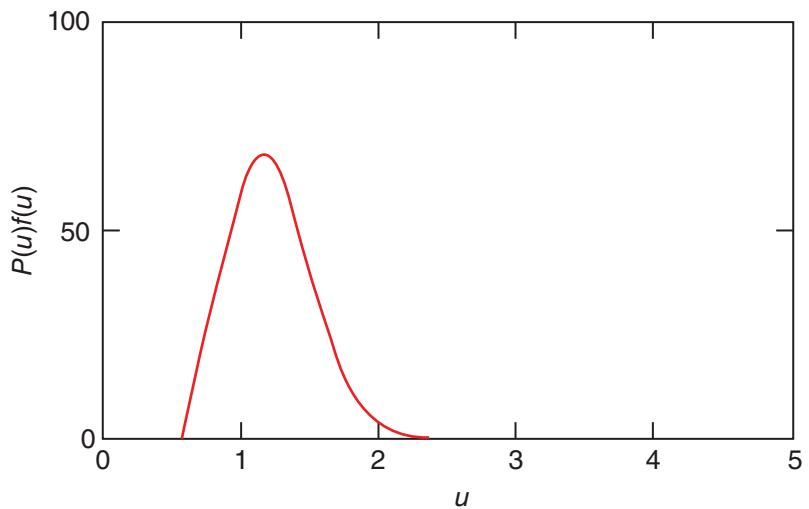

line

| u    | P(u)f(u) |
| ---- | -------- |
| 0.0  | 0.0      |
| 0.5  | 25.0     |
| 1.0  | 70.0     |
| 1.5  | 40.0     |
| 2.0  | 10.0     |
| 2.5  | 2.0      |
| 3.0  | 0.5      |
| 3.5  | 0.1      |
| 4.0  | 0.0      |
| 4.5  | 0.0      |
| 5.0  | 0.0      |

Figure 3.66 Energy capture curve.

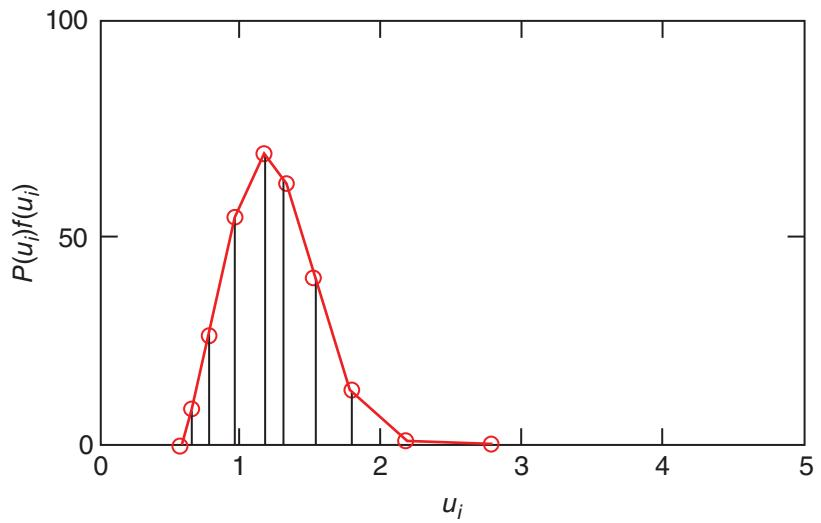

line

| u_i | P(u_i)f(u_i) |
| --- | ------------ |
| 0.5 | 0            |
| 0.7 | 10           |
| 0.9 | 25           |
| 1.0 | 55           |
| 1.1 | 70           |
| 1.2 | 65           |
| 1.4 | 40           |
| 1.8 | 15           |
| 2.1 | 0            |
| 2.8 | 0            |

Figure 3.67 Energy capture curve for numerical integration.

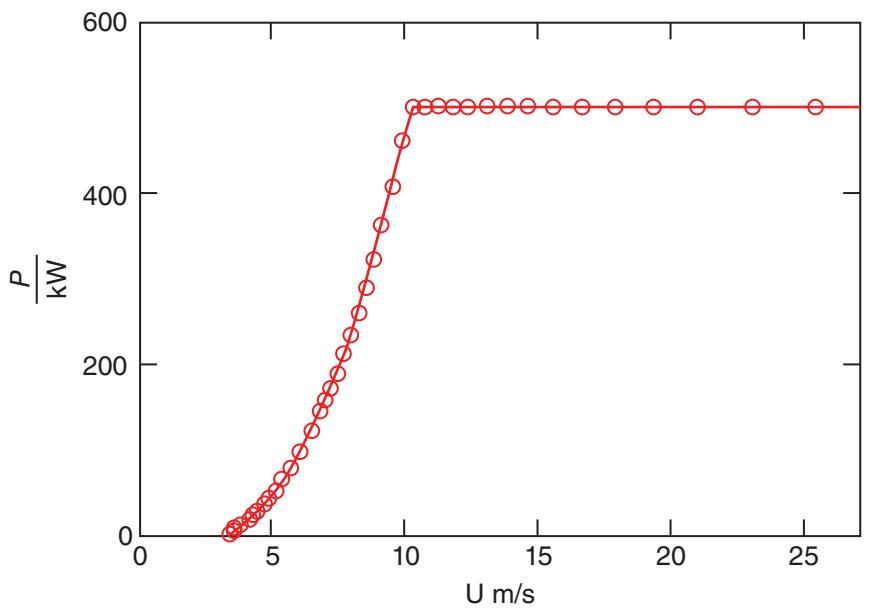

line

| U m/s | P / kW |
| ----- | ------ |
| 3.0   | 0      |
| 3.5   | 10     |
| 4.0   | 30     |
| 4.5   | 60     |
| 5.0   | 100    |
| 5.5   | 150    |
| 6.0   | 200    |
| 6.5   | 250    |
| 7.0   | 300    |
| 7.5   | 350    |
| 8.0   | 400    |
| 8.5   | 450    |
| 9.0   | 500    |
| 9.5   | 500    |
| 10.0  | 500    |
| 10.5  | 500    |
| 11.0  | 500    |
| 11.5  | 500    |
| 12.0  | 500    |
| 12.5  | 500    |
| 13.0  | 500    |
| 13.5  | 500    |
| 14.0  | 500    |
| 14.5  | 500    |
| 15.0  | 500    |
| 15.5  | 500    |
| 16.0  | 500    |
| 16.5  | 500    |
| 17.0  | 500    |
| 17.5  | 500    |
| 18.0  | 500    |
| 18.5  | 500    |
| 19.0  | 500    |
| 19.5  | 500    |
| 20.0  | 500    |
| 20.5  | 500    |
| 21.0  | 500    |
| 21.5  | 500    |
| 22.0  | 500    |
| 22.5  | 500    |
| 23.0  | 500    |
| 23.5  | 500    |
| 24.0  | 500    |
| 24.5  | 500    |
| 25.0  | 500    |

Figure 3.68 Power vs wind speed for variable-speed turbine.

The upper limit of integration $u _ { c o } = 4 . 1 7$ in this case is well above the highest value of u shown in Figure 3.67 for which there is any signircant energy.

A turbine that has pitch control would be able to capture more energy but at the expense of providing the control system and the concomitant reduction in reliability. A turbine operating at variable speed (constant tip speed ratio) until maximum power is reached and thence at constant speed and pitch control would capture the maximum possible amount of energy in a given time. The power curve for such a machine is shown in Figure 3.68.

The annual energy capture would be $E = 4 . 8 1 3 8 \cdot 1 0 ^ { 8 }$ kWh which is a $6 \%$ increase in energy capture compared with the rxed-speed, stall-regulated machine. Variable-speed operation has a number of other advantages that are discussed in Section 6.9.4; it is increasingly being implemented.

# 3.17 Wind turbine aerofoil design

# 3.17.1 Introduction

For many years the wind turbine industry relied on aeronautical experience for the aerodynamic design of turbine blades, but it became clear that aerofoil sections that were optimum for aircraft wings were not necessarily optimum for wind turbine blades.

A major problem for modern wind turbines in the early years of development was sensitivity to insect deposition on the leading edge regions of the blades. There were reports of turbines in the 1970s having to be regularly hosed with water to clear accumulated debris on the blades to restore power levels that had fallen dramatically. An aerofoil that was tolerant to leading edge roughness was required.

Most early turbines of rated power greater than about 50 kW operated at constant rotational speed and relied upon passive stall for power control. With many aircraft aerofoil sections, the stall produced a sudden sharp loss of power output that was not recovered until the wind speed increased. The stalling resulted in signircant losses of energy capture. Thus another requirement for a wind turbine aerofoil was a gentle stall.

Aerofoil stall occurs when the boundary layer on the low-pressure surface starts to separate at some point before the trailing edge is reached, as shown in Figure A3.12. This process, which is due to sufrciently long and strong regions of rising surface pressure following the ‘suction peak’, is discussed in more detail in A3.3. The process is strongly dependent on the state of the boundary layer (whether laminar or turbulent) and hence the location of transition from laminar to turbulent boundary layer sow and what happens immediately after transition. Transition itself is generated by the presence of sow disturbances in the form of small-scale turbulence in the incident sow, acoustic noise impinging the blade, roughness elements on the surface, the presence of velocity insexions $\begin{array} { r } { \left( \frac { \partial ^ { 2 } U } { \partial y ^ { 2 } } = 0 \right) } \end{array}$ 휕y2 – see Figures A3.2 and A3.3 – or prorles near to this state in the boundary layer, and by the thickness of the boundary layer. Usually the incident turbulence in the atmosphere is too large scale to affect transition other than by unsteady ‘sloshing’, effects but it is possible that wake turbulence from other turbines could be signircant. There are undoubtedly some acoustic disturbances, but the most signircant disturbance for a wind turbine blade is the presence of dirt, insects, and other solid particles accreting on blades, particularly near the leading edge. Velocity prorles tending towards insexion as described above, which result from regions of adverse pressure gradient, are more sensitive to instability. [Classical inviscid hydrodynamic stability theory – see, for example, Lin (1955), shows that an insected velocity prorle is immediately unstable to disturbances unless the Reynolds number is very low.] If the blade is fairly thick and rounded near the leading edge and the Reynolds number is sufrciently high, transition occurs soon after attachment at the leading edge, and the resulting turbulent boundary layer remains attached to fairly high angles of attack because the adverse pressure gradients are only moderately strong, and separation rrst occurs at the trailing edge where the boundary layer is thickest. As the angle of attack is increased further, the separation point moves steadily forward. The result is a reasonably high $\mathrm { C _ { L m a x } }$ with a more gradual rounded maximum of the $\mathrm { \bf C } _ { \mathrm { L } }$ -alpha curve, giving a gradual stall known as trailing edge stall. For somewhat thinner aerofoil sections and/or lower Reynolds numbers, the adverse pressure gradient developing with increased angle of attack on the suction surface causes the laminar boundary layer to separate before transition. Once separated, the resulting free shear layer is highly unstable (because of the insexion in the prorle) and immediately transitions to turbulence followed by rapid reattachment, forming a small separation bubble downstream of which the turbulent boundary layer remains attached up to the trailing edge. Two possibilities then can follow as the angle of attack is further increased: (i) the separation bubble grows steadily in length until reattachment just passes the trailing edge, the bubble bursts, and the aerofoil stalls, or (ii) the bubble remains short, reducing further in length, and suddenly bursts. Possibility (i) is known as thin aerofoil stall and occurs for rather thin sections at fairly low Reynolds numbers. The stall is gradual but not usually relevant to wind turbine blades. Possibility (ii) is known as leading edge stall, giving a very abrupt fall in lift at the stall, is usually very disadvantageous, and can occur on smaller size wind turbine blades. Mixed stalls can also occur involving two or three of the above types in a mixed sequence. Gault (1957) has given a very useful correlation to predict stall type by analysing the behaviour of a large number of (clean) NACA sections in low turbulence wind-tunnel tests. But it is clear from the above that the occurrence of dirt or insects on many of these sections can drastically change the stall type. Hence it has been of considerable importance to develop aerofoil sections that are less sensitive to dirt accretion. A further complication of stalling is that since the presence of a large separation region on the aerofoil section changes its suction surface pressure distribution, when the angle of attack of a stalled aerofoil is reduced systematically, reattachment and unstalling do not usually occur at the same angle of attack as separation and stalling did when the angle of attack was being increased. Thus the stall–unstall cycle results in a hysteresis loop with the early post-stall region exhibiting two possible levels of lift depending on the direction of change in angle of attack.

Because of data availability, a popular range of aerofoil sections for wind turbine blades was, but less so now, the NACA six-digit series, an example of which is discussed in Section 3.9. Although more tolerant to leading edge roughness, the NACA six-digit series is no better overall than the NACA four-digit series described in Appendix A3. The main reason for the popularity of the NACA aerofoils is because high quality experimental data is available from tests that were carried out in the 1930s in the pressurised wind tunnel built by NACA (superseded by NASA in 1959). The NACA technical reports are available free on the NASA website, and much of the force data is given in Theory of Wing Sections by Abbott and von Doenhoff (1959).

# 3.17.2 The NREL aerofoils

The development of special-purpose aerofoils for HAWTs began in 1984 jointly between the National Renewable Energy Laboratory (NREL), formerly the Solar Energy Research Institute (SERI), and Airfoils, Incorporated (Tangler and Somers 1995). Since that time, nine aerofoil families (see Table 3.3) have been designed for various size rotors. The principal requirement, depending to some extent on Reynolds number and hence rotor size, is that they have a maximum lift coefrcient that is maintained in the presence of leading edge surface roughness.

The primary design tool was based on the work of Eppler (1990, 1993), who developed a method of determining the nature of the 2-D viscous sow around an aerofoil of any prorle. The Eppler method includes sow separation in the initial stages of stall and has proved to be very successful.

In addition, several different aerofoil families have been designed for stall-regulated, variable-pitch, and variable-rpm wind turbines.

For stall-regulated rotors, improved post-stall power control is achieved through the design of aerofoils for the outer sections of a blade that limit the maximum lift coefrcient. The same aerofoils have a relatively high thickness to chord ratio to accommodate overspeed control devices.

For variable-pitch and variable-speed rotors, outer section aerofoils have a high maximum lift coefrcient, allowing low blade solidity.

Generally, aerofoil cross-sections with a high thickness to chord ratio give structural designs of high stiffness and strength without causing a large weight penalty, and aerofoils of low thickness result in less drag.

Table 3.3 Summary of the NREL aerofoils and their applications. 

<table><tr><td>Diameter</td><td>Type</td><td>Aerofoil thickness</td><td>Primary</td><td>Tip</td><td>Root</td></tr><tr><td rowspan="2">3–10 m</td><td>Variable speed</td><td>Thick</td><td>---</td><td>S822</td><td>S823</td></tr><tr><td>Variable pitch</td><td></td><td></td><td></td><td></td></tr><tr><td rowspan="2">10–20 m</td><td>Variable speed</td><td>Thin</td><td>S802</td><td>S802</td><td>S804</td></tr><tr><td>Variable pitch</td><td></td><td></td><td>S803</td><td></td></tr><tr><td>10–20 m</td><td>Stall regulated</td><td>Thin</td><td>S805 S805A</td><td>S806 S806A</td><td>S807 S808</td></tr><tr><td>10–20 m</td><td>Stall regulated</td><td>Thick</td><td>S819</td><td>S820</td><td>S821</td></tr><tr><td>20–30 m</td><td>Stall regulated</td><td>Thick</td><td>S809 S812</td><td>S810 S813</td><td>S811 S814, S815</td></tr><tr><td rowspan="2">20–40 m</td><td>Variable speed</td><td>—</td><td>S825</td><td>S826</td><td>S814</td></tr><tr><td>Variable pitch</td><td></td><td></td><td></td><td>S815</td></tr><tr><td>30–50 m</td><td>Stall regulated</td><td>Thick</td><td>S816</td><td>S817</td><td>S818</td></tr><tr><td>40–50 m</td><td>Stall regulated</td><td>Thick</td><td>S827</td><td>S828</td><td>S818</td></tr><tr><td rowspan="2">40–50 m</td><td>Variable speed</td><td>Thick</td><td>S830</td><td>S831</td><td>S818</td></tr><tr><td>Variable Pitch</td><td></td><td></td><td>S832</td><td></td></tr></table>

Annual energy capture improvements that are claimed for the NREL airfoil families are of the order of 23–35% for stall-regulated turbines, 8–20% for variable-pitch turbines, and 8–10% for variable-rpm turbines. The improvement for stall-regulated turbines has been verired in reld tests.

The aerofoil shape coordinates for some of the NREL aerofoils are available on the website of the National Wind Technology Center (NWTC) at Golden, Colorado. Measured aerofoil data for some aerofoils is also available. A licence must be purchased for information about those aerofoils that are restricted.

Some of the NREL large blade aerofoil prorles are illustrated in Figure 3.69.

# 3.17.3 The Risø aerofoils

The Risø National Laboratory in Denmark have also developed families of aerofoil designs for wind turbines with similar objectives to the NREL series (Fugslang and Bak 2004). Although the aerodynamic design techniques of the two laboratories were different, there is, perhaps not surprisingly, a signircant similarity about the actual designs.

The design tools for the Risø aerofoils were the X-FOIL code developed by Drela (1989), a development of the work of Eppler (1990, 1993), and the Ellipsys-2D CFD code developed at the Technical University of Denmark by Sørensen (1995).

Three families of aerofoils have been developed at Risø – Risø-A, Risø-P, and Risø-B. The Risø-A family was designed in the 1990s and was intended for stall-controlled turbines; however, sensitivity to surface roughness was found to be higher than expected in reld tests. The Risø-A family of aerofoil prorles is illustrated in Figure 3.70 and listed in Table 3.4.

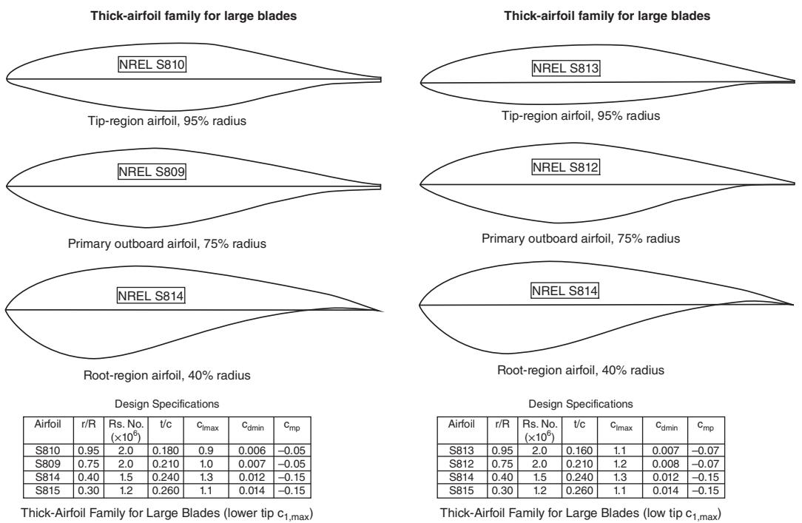

Design Specifications 

<table><tr><td>Airfoil</td><td>r/R</td><td>Rs. No. (×106)</td><td>t/c</td><td> $c_{lmax}$ </td><td> $c_{dmin}$ </td><td> $c_{mp}$ </td></tr><tr><td>S810</td><td>0.95</td><td>2.0</td><td>0.180</td><td>0.9</td><td>0.006</td><td>-0.05</td></tr><tr><td>S809</td><td>0.75</td><td>2.0</td><td>0.210</td><td>1.0</td><td>0.007</td><td>-0.05</td></tr><tr><td>S814</td><td>0.40</td><td>1.5</td><td>0.240</td><td>1.3</td><td>0.012</td><td>-0.15</td></tr><tr><td>S815</td><td>0.30</td><td>1.2</td><td>0.260</td><td>1.1</td><td>0.014</td><td>-0.15</td></tr></table>

Thick-Airfoil Family for Large Blades (lower tip $\mathsf { c } _ { 1 , \mathsf { m a x } } )$

Design Specifications 

<table><tr><td>Airfoil</td><td>r/R</td><td>Rs. No. (×106)</td><td>t/c</td><td> $c_{lmax}$ </td><td> $c_{dmin}$ </td><td> $c_{mp}$ </td></tr><tr><td>S813</td><td>0.95</td><td>2.0</td><td>0.160</td><td>1.1</td><td>0.007</td><td>-0.07</td></tr><tr><td>S812</td><td>0.75</td><td>2.0</td><td>0.210</td><td>1.2</td><td>0.008</td><td>-0.07</td></tr><tr><td>S814</td><td>0.40</td><td>1.5</td><td>0.240</td><td>1.3</td><td>0.012</td><td>-0.15</td></tr><tr><td>S815</td><td>0.30</td><td>1.2</td><td>0.260</td><td>1.1</td><td>0.014</td><td>-0.15</td></tr></table>

Thick-Airfoil Family for Large Blades (low tip $\mathsf { c } _ { 1 , \mathsf { m a x } } )$

Figure 3.69 NREL aerofoil prorles for large blades.

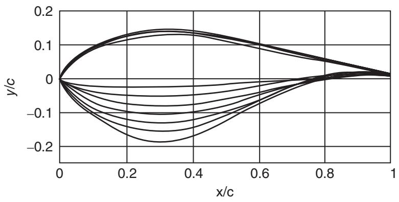

line

| x/c | y/c (Line 1) | y/c (Line 2) | y/c (Line 3) | y/c (Line 4) | y/c (Line 5) | y/c (Line 6) | y/c (Line 7) | y/c (Line 8) | y/c (Line 9) | y/c (Line 10) |
|-----|--------------|--------------|--------------|--------------|--------------|--------------|--------------|--------------|--------------|---------------|
| 0.0 | 0.0          | 0.0          | 0.0          | 0.0          | 0.0          | 0.0          | 0.0          | 0.0          | 0.0          | 0.0           |
| 0.2 | ~0.12        | ~0.11        | ~0.10        | ~0.09        | ~0.08        | ~0.07        | ~0.06        | ~0.05        | ~0.04        | ~0.03         |
| 0.4 | ~0.15        | ~0.14        | ~0.13        | ~0.12        | ~0.11        | ~0.10        | ~0.09        | ~0.08        | ~0.07        | ~0.06         |
| 0.6 | ~0.13        | ~0.12        | ~0.11        | ~0.10        | ~0.09        | ~0.08        | ~0.07        | ~0.06        | ~0.05        | ~0.04         |
| 0.8 | ~0.10        | ~0.09        | ~0.08        | ~0.07        | ~0.06        | ~0.05        | ~0.04        | ~0.03        | ~0.02        | ~0.01         |
| 1.0 | 0.0          | 0.0          | 0.0          | 0.0          | 0.0          | 0.0          | 0.0          | 0.0          | 0.0          | 0.0           |

Figure 3.70 The Risø-A series of aerofoil prorles.

Table 3.4 The principal characteristics of the Risø-A series. 

<table><tr><td>Aerofoil</td><td>Max t/c %</td><td>x/c at max t/c</td><td>y/c at TE</td><td> $Re \times 10^{-6}$ </td><td> $\alpha_o$ </td><td> $c_1 \max$ </td><td>Design  $\alpha$ </td><td>Design  $c_1$ </td><td>Max  $c_1/c_d$ </td></tr><tr><td>Risø-A1-15</td><td>15</td><td>0.325</td><td>0.0025</td><td>3.00</td><td>-4.0</td><td>1.50</td><td>6.0</td><td>1.13</td><td>168</td></tr><tr><td>Risø-A1-18</td><td>18</td><td>0.336</td><td>0.0025</td><td>3.00</td><td>-3.6</td><td>1.53</td><td>6.0</td><td>1.15</td><td>167</td></tr><tr><td>Risø-A1-21</td><td>21</td><td>0.298</td><td>0.005</td><td>3.00</td><td>-3.3</td><td>1.45</td><td>7.0</td><td>1.15</td><td>161</td></tr><tr><td>Risø-A1-24</td><td>24</td><td>0.302</td><td>0.01</td><td>2.75</td><td>-3.4</td><td>1.48</td><td>7.0</td><td>1.19</td><td>157</td></tr><tr><td>Risø-A1-27</td><td>27</td><td>0.303</td><td>0.01</td><td>2.75</td><td>-3.2</td><td>1.44</td><td>7.0</td><td>1.15</td><td>N/A</td></tr><tr><td>Risø-A1-30</td><td>30</td><td>0.300</td><td>0.01</td><td>2.50</td><td>-2.7</td><td>1.35</td><td>7.0</td><td>1.05</td><td>N/A</td></tr><tr><td>Risø-A1-33</td><td>30</td><td>0.304</td><td>0.01</td><td>2.50</td><td>-1.6</td><td>1.20</td><td>7.0</td><td>0.93</td><td>N/A</td></tr></table>

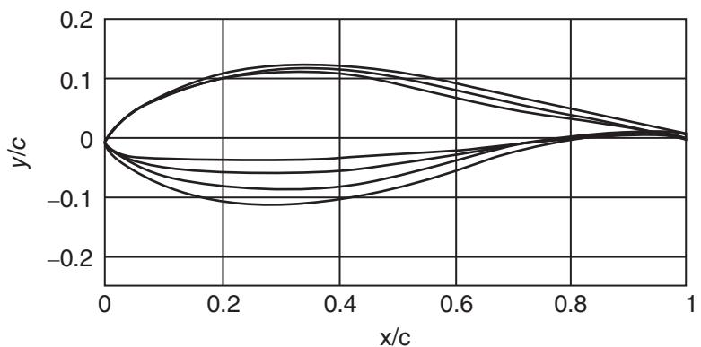

line

| x/c | y/c (Line 1) | y/c (Line 2) | y/c (Line 3) | y/c (Line 4) | y/c (Line 5) | y/c (Line 6) | y/c (Line 7) | y/c (Line 8) | y/c (Line 9) | y/c (Line 10) |
|-----|--------------|--------------|--------------|--------------|--------------|--------------|--------------|--------------|--------------|---------------|
| 0.0 | 0.0          | 0.0          | 0.0          | 0.0          | 0.0          | 0.0          | 0.0          | 0.0          | 0.0          | 0.0           |
| 0.2 | ~0.1         | ~0.08        | ~0.06        | ~0.04        | ~0.02        | ~0.0       | ~-0.02       | ~-0.04       | ~-0.06       | ~-0.08        |
| 0.4 | ~0.12        | ~0.1         | ~0.08        | ~0.06        | ~0.04        | ~0.02        | ~-0.02       | ~-0.04       | ~-0.06       | ~-0.08        |
| 0.6 | ~0.1         | ~0.08        | ~0.06        | ~0.04        | ~0.02        | ~0.0        | ~-0.02       | ~-0.04       | ~-0.06       | ~-0.08        |
| 0.8 | ~0.05        | ~0.03        | ~0.01        | ~-0.01       | ~-0.03       | ~-0.05       | ~-0.07       | ~-0.09       | ~-0.11       | ~-0.13        |
| 1.0 | 0.0          | 0.0          | 0.0          | 0.0          | 0.0          | 0.0          | 0.0          | 0.0          | 0.0          | 0.0           |

Figure 3.71 The Risø-P series of aerofoil prorles.

The Risø-P family of just four aerofoils, shown in Figure 3.71 and Table 3.5, was designed to replace the corresponding prorles in the Risø-A series for use on variable-pitch and variable-speed rotors.

The Risø-B family was designed as six separate aerofoils with an extended range of thickness to chord ratio from 15% to 36%. The aerofoils, generally, have high maximum lift coefrcients for use on multi-megawatt size rotors with low solidity, sexible blades having variable-speed pitch control. This family of aerofoil prorles is shown in Figure 3.72 and Table 3.6.

Table 3.5 The principal characteristics of the Risø-P series. 

<table><tr><td>Aerofoil</td><td>Max t/c %</td><td>x/c at max t/c</td><td>y/c at TE</td><td> $Re \times 10^{-6}$ </td><td> $\alpha_o$ </td><td> $c_1 \max$ </td><td>Design  $\alpha$ </td><td>Design  $c_1$ </td><td>Max  $c_1/c_d$ </td></tr><tr><td>Risø-P-15</td><td>15</td><td>0.328</td><td>0.0025</td><td>3.00</td><td>-3.5</td><td>1.49</td><td>6.0</td><td>1.12</td><td>173</td></tr><tr><td>Risø-P-18</td><td>18</td><td>0.328</td><td>0.0025</td><td>3.00</td><td>-3.7</td><td>1.50</td><td>6.0</td><td>1.15</td><td>170</td></tr><tr><td>Risø-P-21</td><td>21</td><td>0.323</td><td>0.005</td><td>3.00</td><td>-3.5</td><td>1.48</td><td>6.0</td><td>1.14</td><td>159</td></tr><tr><td>Risø-P-24</td><td>24</td><td>0.320</td><td>0.01</td><td>2.75</td><td>-3.7</td><td>1.48</td><td>6.0</td><td>1.17</td><td>156</td></tr></table>

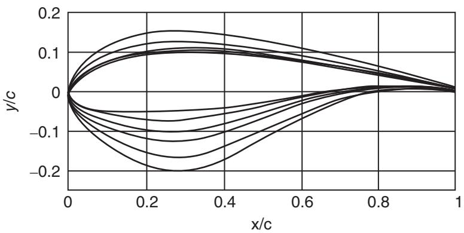

line

| x/c | y/c (Line 1) | y/c (Line 2) | y/c (Line 3) | y/c (Line 4) | y/c (Line 5) | y/c (Line 6) | y/c (Line 7) | y/c (Line 8) | y/c (Line 9) | y/c (Line 10) |
|-----|--------------|--------------|--------------|--------------|--------------|--------------|--------------|--------------|--------------|---------------|
| 0.0 | 0.0          | 0.0          | 0.0          | 0.0          | 0.0          | 0.0          | 0.0          | 0.0          | 0.0          | 0.0           |
| 0.2 | ~0.1         | ~0.1         | ~0.1         | ~0.1         | ~0.1         | ~0.1         | ~0.1         | ~0.1         | ~0.1         | ~0.1          |
| 0.4 | ~0.1         | ~0.1         | ~0.1         | ~0.1         | ~0.1         | ~0.1         | ~0.1         | ~0.1         | ~0.1         | ~0.1          |
| 0.6 | ~0.1         | ~0.1         | ~0.1         | ~0.1         | ~0.1         | ~0.1         | ~0.1         | ~0.1         | ~0.1         | ~0.1          |
| 0.8 | ~0.05        | ~0.05        | ~0.05        | ~0.05        | ~0.05        | ~0.05        | ~0.05        | ~0.05        | ~0.05        | ~0.05         |
| 1.0 | 0.0          | 0.0          | 0.0          | 0.0          | 0.0          | 0.0          | 0.0          | 0.0          | 0.0          | 0.0           |

Figure 3.72 The Risø-B series of aerofoil prorles.

Table 3.6 The principal characteristics of the Risø-B series. 

<table><tr><td>Aerofoil</td><td>Max t/c %</td><td>x/c at max t/c</td><td>y/c at TE</td><td> $Re \times 10^{-6}$ </td><td> $\alpha_o$ </td><td> $c_1 \max$ </td><td>Design  $\alpha$ </td><td>Design  $c_1$ </td><td>Max  $c_1/c_d$ </td></tr><tr><td>Risø-B1-15</td><td>15</td><td>0.278</td><td>0.006</td><td>6.00</td><td>-4.1</td><td>1.92</td><td>6.0</td><td>1.21</td><td>157</td></tr><tr><td>Risø-B1-18</td><td>18</td><td>0.279</td><td>0.004</td><td>6.00</td><td>-4.0</td><td>1.87</td><td>6.0</td><td>1.19</td><td>166</td></tr><tr><td>Risø-B1-21</td><td>21</td><td>0.278</td><td>0.005</td><td>6.00</td><td>-3.6</td><td>1.83</td><td>6.0</td><td>1.16</td><td>139</td></tr><tr><td>Risø-B1-24</td><td>24</td><td>0.270</td><td>0.007</td><td>6.00</td><td>-3.1</td><td>1.76</td><td>6.0</td><td>1.15</td><td>120</td></tr><tr><td>Risø-B1-30</td><td>30</td><td>0.270</td><td>0.01</td><td>6.00</td><td>-2.1</td><td>1.61</td><td>5.0</td><td>0.90</td><td>N/A</td></tr><tr><td>Risø-B1-36</td><td>36</td><td>0.270</td><td>0.012</td><td>6.00</td><td>-1.3</td><td>1.15</td><td>5.0</td><td>0.90</td><td>N/A</td></tr></table>

In the tables above, the ‘design ${ \mathrm { c } } _ { 1 } ^ { \prime }$ is the value of the lift coefrcient that corresponds to the maximum lift to drag ratio and the ‘design $\alpha ^ { \prime }$ the corresponding angle of attack. An optimised variable-speed turbine should be designed so that the blade sections operate at this angle of attack. It is a design feature of the Risø aerofoils that the design $\mathrm { c } _ { \mathrm { l } }$ is high so that a blade will be most efrcient at low solidity.

# 3.17.4 The Delft aerofoils

The Delft University of Technology in the Netherlands has also developed a number of aerofoils for wind turbine rotors (Timmer and van Rooij 2003). As with the NREL and Risø aerofoils, the principal feature driving the designs was surface roughness insensitivity, but more emphasis was placed upon seeking designs for thick aerofoils to gain a structural advantage. The Delft University series of aerofoil prorles are illustrated in Figure 3.73 and listed in Table 3.7.

The design tool for the Delft aerofoils was the RFOIL code, a modircation made at Delft of the XFOIL code to include the effects of stall delay.

The two thickest of these aerofoils have not been tested in a wind tunnel, and the characteristics have been determined by calculation.

# 3.17.5 General principles for outboard and inboard blade sections

The aerofoil sections of the outboard half of the blade are responsible for extracting the major part of the wind energy. These sections should therefore be efrcient with a high lift/drag ratio, hence reasonably thin, consistent with adequate structural strength. Thickness ratios around 18% are usual with relatively high $\mathbf { C } _ { \mathrm { { L m a x } } }$ so that the operating $\mathrm { C _ { L } }$ where the best $\mathrm { C _ { L } / C _ { D } }$ ratio occurs is signircantly below $\mathrm { C _ { L m a x } }$ . This allows efrcient operation while keeping sufrciently clear of the stall to avoid its adverse effects when wind gusts momentarily push up the angle of attack too quickly for pitch regulation to respond sufrciently.

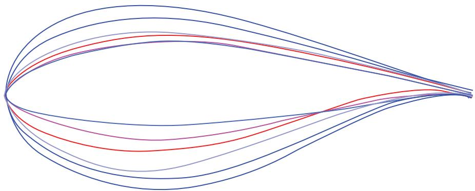

natural_image

Abstract line drawing with multiple curved lines in blue, red, and gray, no text or symbols present

Figure 3.73 The Delft University series of aerofoil prorles.

Table 3.7 The principal characteristics of the Delft University series. 

<table><tr><td>Aerofoil</td><td>Max t/c %</td><td>x/c at max t/c</td><td>y/c at TE</td><td> $Re \times \alpha_o$  $10^{-6}$ </td><td> $c_1$ max</td><td>Design  $\alpha$ </td><td>Design  $c_1$ </td><td>Max  $c_1/c_d$ </td></tr><tr><td>DU 96-W-180</td><td>18</td><td>0.3</td><td>0.0018</td><td>3.00–2.7</td><td>1.26</td><td>6.59</td><td>1.07</td><td>145</td></tr><tr><td>DU 00-W-212</td><td>21.2</td><td>0.3</td><td>0.0023</td><td>3.00–2.7</td><td>1.29</td><td>6.5</td><td>1.06</td><td>132</td></tr><tr><td>DU 91-W2–250</td><td>25</td><td>0.3</td><td>0.0054</td><td>3.00–3.2</td><td>1.37</td><td>6.68</td><td>1.24</td><td>137</td></tr><tr><td>DU 97-W-300</td><td>30</td><td>0.3</td><td>0.0048</td><td>3.00–2.2</td><td>1.56</td><td>9.3</td><td>1.39</td><td>98</td></tr><tr><td>DU 00-W-350</td><td>35</td><td>0.3</td><td>0.01</td><td>3.00–2.0</td><td>1.39</td><td>7.0</td><td>1.13</td><td>81</td></tr><tr><td>DU 00-W-401</td><td>40.1</td><td>0.3</td><td>0.01</td><td>3.00–3.0</td><td>1.04</td><td>5.0</td><td>0.82</td><td>54</td></tr></table>

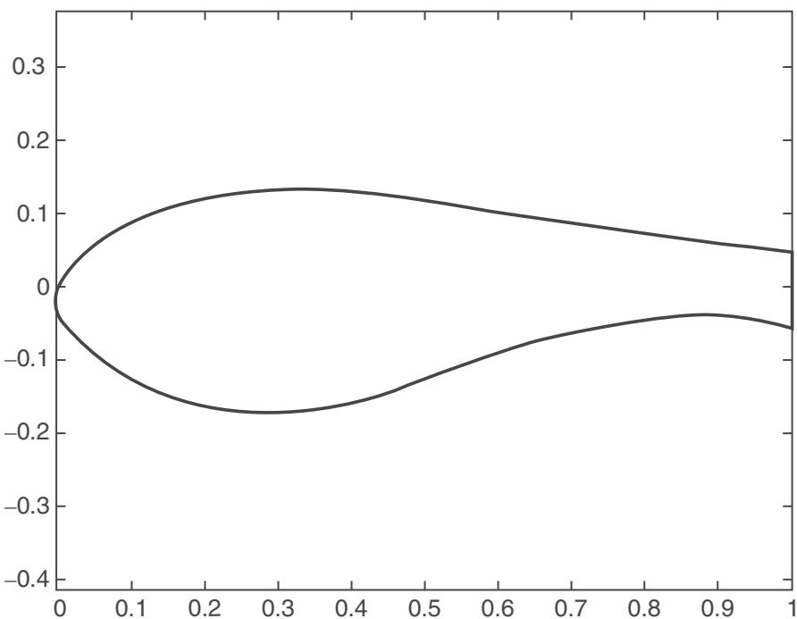

line

| x    | y1     | y2     |
| ---- | ------ | ------ |
| 0.0  | 0.0000 | 0.0000 |
| 0.1  | 0.0879 | -0.1250 |
| 0.2  | 0.1250 | -0.1750 |
| 0.3  | 0.1379 | -0.1879 |
| 0.4  | 0.1379 | -0.1750 |
| 0.5  | 0.1250 | -0.1250 |
| 0.6  | 0.1000 | -0.0879 |
| 0.7  | 0.0750 | -0.0500 |
| 0.8  | 0.0500 | -0.0250 |
| 0.9  | 0.0250 | -0.0125 |
| 1.0  | 0.0000 | -0.0050 |

Figure 3.74 Flat-back aerofoil derived from DU-97-W-300.

The inboard sections of a wind turbine blade are much more strongly dictated by structural bending strength requirements. Hence increasingly thick sections are used as the radius reduces to the root. Blade sections at the root end may be up to 40% thick. Inboard of the root end of the aerodynamic sections of the blade, the blade often merges continuously into a circular or other bluff section joining the blade to the hub. To accommodate these very thick sections and at the same time retain a high $\mathbf { C } _ { \mathrm { { L m a x } } }$ for power purposes, blades are often rtted with vortex generators (VGs) (see later) near the location of early separation, and so-called ‘sat-back’ sections with blunt trailing edges have been designed. An example is the aerofoil shown in Figure 3.74, which is derived by thickening the rear half of the more conventional DU-97-W-300. A computational analysis of the aerodynamics and aeroacoustics of this aerofoil has been given by Lynch and Smith (2009).

# 3.18 Add-ons (including blade modiJcations independent of the main structure)

There are a number of small devices that can be added (and sometimes are) to existing wind turbine blades post-design without compromising the blade structural performance. These devices have often been derived from aircraft usage and are usually incorporated either to improve performance that has turned out to be below the designed level or, more often, to provide additional performance beyond the intended where circumstances dictate. An example of the latter is the desirability of increasing the design lift coefrcient for a turbine blade that is to be operated in signircantly reduced air density due to the altitude of the wind turbine site.

# 3.18.1 Devices to control separation and stalling

Vortex generators (VGs) are small triangular, rectangular, or similar pieces of sat, rigid sheet that act as very small half-wings of low aspect ratio set perpendicular to the blade surface at a large angle of incidence $( \sim 3 0 ^ { \circ } )$ to the local sow direction, as shown in Figure 3.75. Such plates generate strong leading edge (triangular delta VGs) or tip (rectangular VGs) vortices. The vortices stream over the main blade surface, stirring up the sow in the boundary layer, re-energising the lower (inner) layers by bringing sow down from the upper (outer) layers and hence inhibiting separation. It is found that a line of small devices of this type of height about equal to the boundary layer thickness 훿 are very effective in inhibiting separation on the blade when placed a moderate distance upstream of the expected line of separation. VGs are easily added to the blade by rxing them via a lug at the base and are usually set to have an alternating positive and negative angle of incidence so that the rotation direction of the vortices alternates. They may be set moderately close together as in the example in the rgure or farther apart up to the order of 10훿 to still retain continuous effectiveness over the downstream region. In this way $\mathbf { C } _ { \mathrm { { L m a x } } }$ can be increased. The main drawback of such devices is that being rxed passive devices they operate continuously even when not required, and because they continue to generate vortices, they increase slightly the pre-stall drag of the blade.

Micro VGs are much smaller versions of ordinary VGs, being of order 훿/10 in height and spaced somewhat more closely. Micro VGs operate in the inner region of the boundary layer, where for a turbulent boundary layer much the strongest part of the velocity gradient normal to the blade surface exists. They can be nearly as effective as standard VGs in suppressing separation and have the advantage of generating a smaller increase in drag.

Surface air jets are inclined jets sited in a similar location as VGs would be sited but rather closer together. The jets are often fed by higher-pressure air from near the stagnation region of the blade section or sometimes from inboard regions taking advantage of the centrifugal pressure difference between inboard locations and those farther outboard. The jets act to re-energise the lower boundary layer through their own momentum and thus prevent stalling. They have the advantage that they can be turned off when not required. Their main disadvantage is the additional complexity, ‘plumbing’, and therefore cost required to provide each jet and the vulnerability of the jet slots.

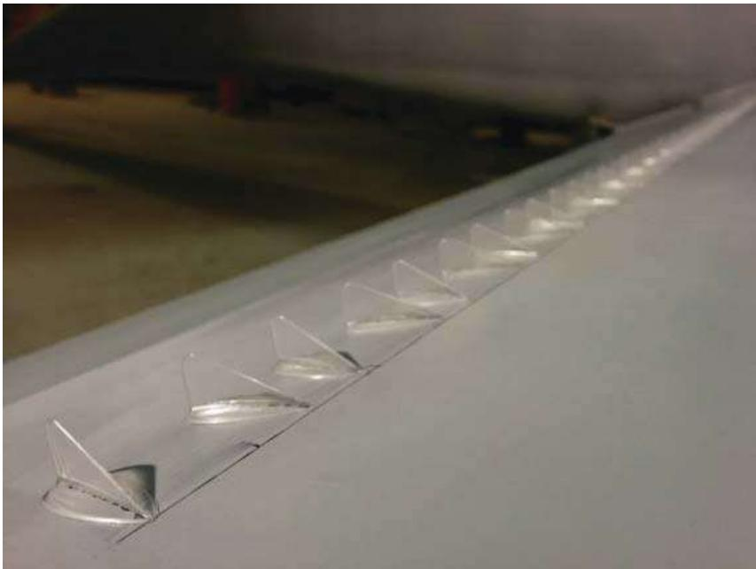

natural_image

Close-up of a transparent plastic tray with triangular cutouts, placed on a white surface (no text or symbols visible)

Figure 3.75 VGs on a blade suction surface. (Flow is from right to left.)

Massless or synthetic jets are a variation of surface air jets that operate by an oscillating piston within a cavity that forces a pulsatile jet out through a small hole in the blade surface. No net mean mass sow occurs, hence their name, equal mass sows occurring into and out of the orirce. During the intake phase the sow is a sink sow that produces relatively little disturbance, whereas the outsow phase is a jet that forms a vortex ring so that the oscillatory operation of the device generates a sequence of vortex rings that can re-energise the boundary layer. No separate intake or piping is required, but each device (orirce) must be separately actuated. They are not as yet used on wind turbine blades but may be an option for the future because they have been found effective in controlling separation in other situations. They appear to be reasonably unaffected by dirt due to the exhaust phase in each cycle.

# 3.18.2 Devices to increase $\mathbf { C _ { L m a x } }$ and lift/drag ratio

Deployable conventional Taps (see Figure 3.76a) are trailing edge saps (TE saps), leading edge saps being very unusual, and are similar to conventional aircraft control surfaces such as ailerons, hinged at the rear of the blade section and operated by a mechanical actuator. They increase or decrease section lift by increasing or decreasing the effective camber of the blade section. They have been proposed for wind turbine blades but are rarely ever used because of the additional mechanical complexity, weight near the blade tips where they would be most useful, cost, and maintenance issues. Their main advantage is that they can be sited where changes in lift are most useful, typically outboard regions. As turbine blade lengths increase and the blades become ever more sexible, this localisation offers the possibility of distributed control with advantages over pitch control at the blade root, and it is possible that more use will be made of them in future. This is particularly relevant for active control to mitigate the effect of turbulence and gusts because small saps can be actuated very rapidly and act locally.

Morphing blade sections (Figure 3.76b) are a recent development that is really a variation of the conventional trailing edge sap. The actuator is within the rear section of the blade, which is fabricated from a sexible composite. The result when actuated is to generate a sap effect but with a more smoothly curved camber and with all mechanical parts protected by being internal and hence presumed to be less vulnerable to dirt and corrosion. The continuous curvature of the camber can be tailored for maximum aerodynamic efrciency. The technology is considered to be a promising method of providing distributed control with some mechanical benerts over conventional TE saps.

Fixed (Gurney) Taps (Figure 3.76c, named after Dan Gurney, who invented this sap for down-force wings used in motor racing) are small rxed saps in the form of a length of thin, right-angle bar section rxed to the trailing edge of a blade on the pressure side. A Gurney sap is thus like a small trailing edge sap deployed at $9 0 ^ { \circ }$ in the direction to increase lift. Such saps usually have a sap chord (i.e. ‘height’ from the blade) equal to only 1% or 2% of the blade section chord. With that small length but large deployment angle, a useful increase in lift coefrcient (0.1 to 0.25) can be obtained at the expense of a small increase in drag coefrcient. The result with a well-designed sap is that the lift coefrcient can be increased while the lift/drag ratio remains constant or may even increase slightly. See, for example, Giguere et al. (1997).

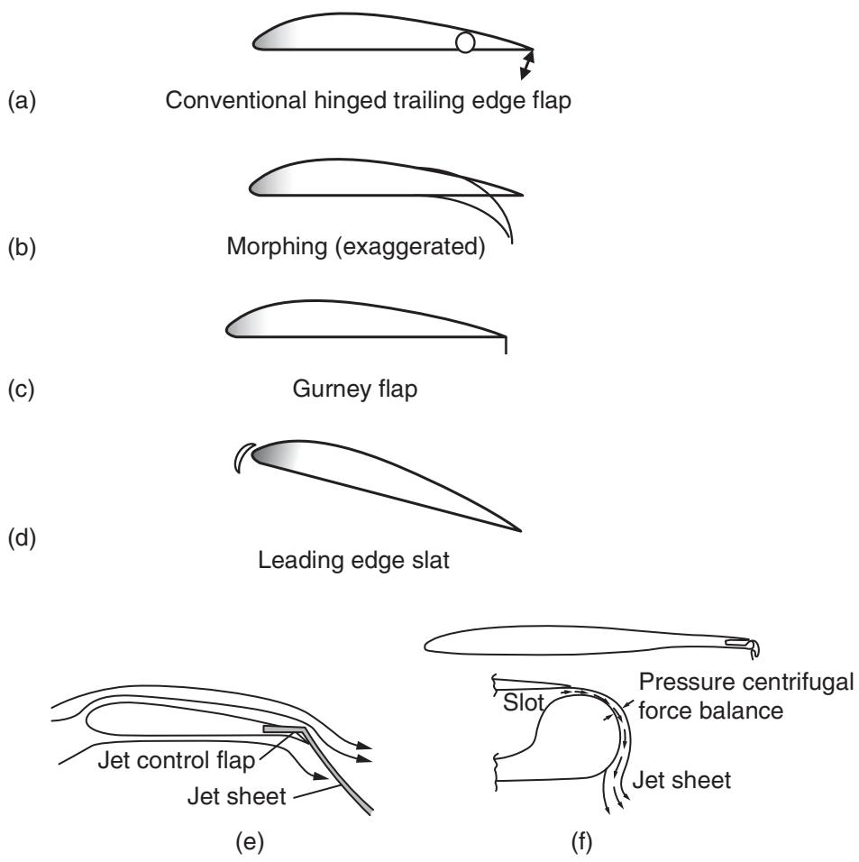  
Figure 3.76 Flaps and similar acting devices: (a) conventional trailing edge sap, (b) morphing rear blade section, (c) Gurney sap, (d) leading edge slat, (e) jet sap, and (f) circulation control.

Slats (Figure 3.76d), as deployed at the leading edges of aircraft wings to prevent separation during high angle of attack operation (during take-off and landing), have also been tried on wind turbine blades for the same reason.

# 3.18.3 Circulation control (jet Kaps)

The circulation and hence the lift around an aerofoil section can be controlled very rapidly by the action of a jet applied at the trailing edge. The jet may be directed over the suction surface of the blade at the trailing edge. This may simply have a suitably oriented exhaust nozzle (Figure 3.76e) or may use the Coanda effect running over a short length of curved surface (Figure 3.76f [lower]) to generate a jet sheet desected so as to increase the effective camber of the section and hence the lift. It acts in a manner very similar to a conventional structural sap, hence is known as a jet Tap, and is as shown in Figure 3.76e. Alternatively, jets may be emitted from slots either side of a rounded trailing edge to produce a highly desected jet in either direction to control the circulation and hence the lift on the blade section, as shown in Figure 3.76f (upper). Figure 3.77 shows a plot of lift coefrcient vs jet momentum coefrcient for a device of this type where the jet momentum coefrcient $C \mu = 2 ( U _ { J } / U _ { \infty } ) ^ { 2 } . t / c , U _ { J }$ is the jet velocity and t it should be noted is the thickness of the jet exit slot (not to be confused here with the maximum thickness of the aerofoil section). Very high values of lift coefrcient are possible if sufrcient jet momentum is applied with a large desection angle because the jet momentum removes the separation limit of a conventional sap.

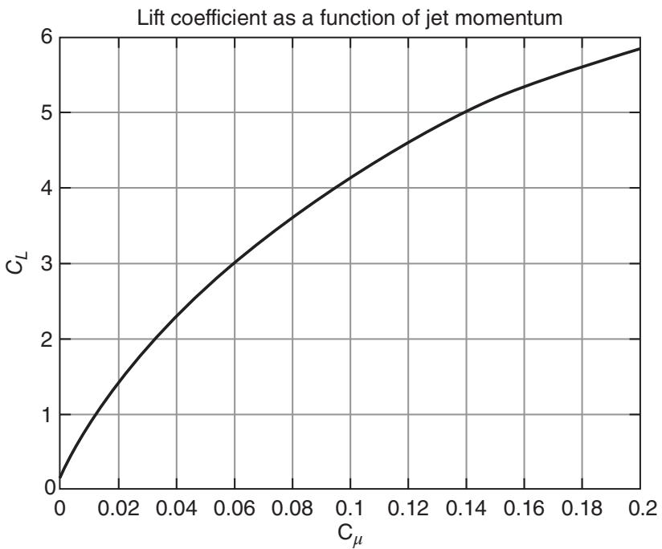

line

| C_μ   | C_L  |
|-------|------|
| 0.00  | 0.00 |
| 0.02  | 1.50 |
| 0.04  | 2.50 |
| 0.06  | 3.00 |
| 0.08  | 3.50 |
| 0.10  | 4.00 |
| 0.12  | 4.50 |
| 0.14  | 5.00 |
| 0.16  | 5.50 |
| 0.18  | 5.75 |
| 0.20  | 6.00 |

Figure 3.77 Lift coefrcient vs jet momentum coefrcient for jet circulation control.

These devices mimic the effect of a conventional (solid) sap but have the advantage that large rates of change of lift can be achieved very quickly by sudden changes in the jet pressure and hence momentum. The effectiveness of both in controlling circulation is due to the Coanda effect, whereby an exiting ‘wall-jet’ sticks to a highly curved surface. In the jet sap case, the effectively ‘active’ length and curvature of the jet sheet depends on the jet momentum. In the rounded trailing edge case, the jet sticks to the highly rounded surface to a greater or lesser extent according to the jet momentum, thus exhausting from the aerofoil trailing edge at a greater or lesser angle. The resulting free jet in both cases simulates a deployed structural sap but without the need to overcome signircant inertia in rapid activation. Such devices deployed along the outboard trailing edge of the blade give two advantages. They allow high lift coefrcients to be obtained (not limited in the same way by separation as a solid sap) so that the blade chord may be substantially reduced to achieve the same power production. This reduces the weight of the blade and also blade loads when the parked blade is impacted by high wind gusts at large angles to the blade. Second, very rapid control is possible. However, the system has obvious disadvantages of complexity, maintenance, and cost (although less prone to problems of dirt ingress, as it is an overpressure device), the aerofoil section with the jet turned off generates higher drag than a typical ‘sharp’ trailing edge section, and there is a power requirement to provide the jet momentum. Johnson et al. (2008) give an extensive review of many of the above types of devices for blade load control.

# 3.19 Aerodynamic noise

# 3.19.1 Noise sources

Since deployment of wind turbines became widespread onshore from the1990s onwards, growing public resistance to the siting of turbines in areas close to dwellings has become a major planning issue. The two most important points of objection are normally visibility and noise. Efforts to minimise the rrst of these focus on detailed siting and surface appearance of the turbine, noting that there is generally a consict between siting to reduce visibility and siting to maximise wind energy capture. The issue of noise, however, is closely related to turbine operation because the two main sources of wind turbine noise are the machinery and the blade aerodynamics. Radiated noise from wind turbine machinery (generator, gearbox, etc.) has been greatly reduced in modern wind turbine designs over the last two or three decades. Considerable attention has been paid with successful results to reducing the intensity of mechanical noise by identifying and suppressing sources of noise within the machinery and providing noise insulation. As a result, mechanical noise is now regarded as much less important than aerodynamic noise for large modern wind turbines.

This section deals with aerodynamic noise generated by the blades and methods of reducing it in the form of modircations to blade geometry and section prorle. A fuller description of wind turbine noise and its measurement, prediction and assessment of environmental impact is given in Section 10.3.

Aerodynamic noise arises mainly from two sources: (i) self-noise, which is generated by the air sow over the blades interacting locally with the blades, an effect that would occur even if the incident wind sow were to be smooth, and (ii) noise induced by the turbulence in the insow (mainly atmospheric turbulence but also on occasion wake turbulence from upstream turbines, interacting with blades and inducing suctuating blade loading). Aero-acoustic noise may be either broadband or tonal. The latter is less common but more irritating if signircant. There are also a number of other specirc noise sources. One important example is the cyclic interaction between the blades and the tower. Although the blade passing frequency is below the audible range, the frequency content from the quasi-impulsive interaction as a blade passes through the quite narrow insuence reld of the tower can in some circumstances contribute audible sound at a signircant level (in addition to the unsteady loading).The effect can be made small to negligible for an upwind rotor because the aerodynamic interaction between blade and tower reduces as the square of the separation distance between the blade and the tower axis. The interaction is usually therefore minimal unless the blade passes very close to the tower. The main effect can be effectively removed by providing adequate clearance (> 1 tower diameter) through nacelle overhang and rotor tilt. It then only becomes appreciable in high wind operation when blades tend to bend towards the tower, reducing the clearance, but in this case blade noise is less of an issue because of background wind noise. Blade–tower interaction noise can be signircant for downwind rotors with solid towers of non-negligible diameter. This type of design is very uncommon, and hence this noise source has not been studied greatly. When it does occur, it can be difrcult to remedy because the noise originates from the interaction of the blades passing through the tower wake, and such wakes only diffuse gradually over large distances. For the general aero-acoustic sources present on wind turbine rotors, a very good review is given by Wagner et al. (1996).

Those noise sources that arise from unsteady incident sows inducing suctuating forces on the turbine blades scale as the sixth power of the local insow wind speed relative to the aerofoil section, and the noise is generally low frequency. Self-noise that is broadband through the auditory range and usually dominates is found to depend on the relative wind speed over the blade at between the rfth and sixth power but closer to the former. Because the tip speed ratio is normally high, this relative sow speed is effectively the local blade speed, and the noise sources are therefore mainly signircant over the outer 25% of the blade and when the rotor is operating. Because of the high power dependence of the radiated sound intensity, therefore, on rotor tip speed, the ‘simplest’ way to reduce aerodynamic noise radiation from a wind turbine is to run the rotor at a lower tip speed ratio. This has always been known and is a major reason why turbines with fewer than three blades are not favoured for onshore designs, since optimum tip speed ratio increases as rotor solidity decreases. But as there are efrciency constraints also on lowering tip speed ratio, a major effort continues aimed at reducing the aerodynamic blade noise sources themselves.

# 3.19.2 InKow turbulence-induced blade noise

Insow turbulence interacts with the blades and generates noise due to the unsteady blade forces that arise as a result. This noise source is generally found to be a less strong source than the blade’s self-induced noise, although this is not always so. The only obvious method of alleviating the insow noise is through a control system to mitigate the unsteady loading of individual blades due to the turbulence. Distributed control capable of operation at frequencies high enough to affect the audible noise spectrum is not yet a feature of wind turbines. Insow noise intensity is mainly only at a level to be of concern in high, gusty winds where, because there is so much wind noise from other sources in the environment, the additional turbine noise is less signircant. There is a long history and a great deal of theory developed for the prediction of rotor blade noise due to turbulent insow because of its importance in noise radiation from aircraft turbojet engines and rotorcraft. The method originated by Amiet (1975) based on prediction of unsteady blade loading taking into account compressibility was originally developed for aero-engines. It has been further developed and is still current as a prediction method for wind turbine rotors but involves fairly extensive computational effort. Moriarty et al. (2005) have produced a simpler model based on parameterised results for standard blade geometries.

# 3.19.3 Self-induced blade noise

Self-induced aerodynamic noise arises from a number of causes: (i) interaction of the blade turbulent boundary layers with the trailing edge, (ii) noise due to locally separated sow, (iii) noise due to the vortex wake, usually due to and from a blunt trailing edge but at low Reynolds numbers can alternatively be laminar wake instability, and (iv) noise due to the blade-tip vortex.

# 3.19.4 Interaction between turbulent boundary layers on the blade and the trailing edge

Interaction of turbulent eddies in the blade boundary layer with the trailing edge [i.e. (i) in the previous section] is usually regarded as the most important noise source, and efforts are continuing to design blades to minimise it. Modelling techniques have been developed to predict the aero-acoustic radiation from this source; see Brooks et al. (1989) and Zhu et al. (2005). Two main methods of reducing the intensity have been considered:

1. Blade prorle design to reduce the thickness of the suction surface boundary layer (which, being the thicker of the two, therefore has the larger turbulent eddy scales as well as the greater source layer thickness) at the trailing edge. Some progress has been achieved in reducing this boundary layer’s thickness by reducing the strength of the suction pressure on the suction surface while compensating to maintain overall lift and particularly lift/drag ratio by increasing the positive pressure downstream of stagnation on the pressure surface. This method, perhaps because of the constraints involved, has yielded moderate noise reductions of up to about 2 dB. Families of low noise aerofoils have been designed, such as the DTU-LNxxx series shown in Figure 3.78a–c; see also Wang et al. (2015).

2. Making the trailing edge serrated (see Figure 3.79) or by adding sexible ‘brushes’ to it. This concept is based on Howe’s (1991) analysis of the reduction in radiation efrciency of a trailing edge as a result of making it serrated in plan. Although Howe’s theory doesn’t give a very good prediction of the actual sound power reduction that is achieved, nonetheless the technique has been shown to give useful noise reductions of more than 3 db. Serrations of this type appear to be possible without signircantly affecting the section lift or drag. They may be part of the outer blade design or have been sometimes in the form of an add-on to existing blades. A good description is given in Zhu et al. (2016).

# 3.19.5 Other blade noise sources

The remaining three sources of aerodynamic blade self-noise are usually less signircant than i) above involving interaction between the turbulent boundary layers and a sharp trailing edge:

ii) Noise due to locally separated sow is more usual from the inner blade where intensities are limited by low relative velocities. Signircant separation is unusual on the outer blade under low to moderate wind conditions for which blade noise may be a concern.   
iii) Noise due vortex shedding from the trailing edge of the blade can be of concern. It should be considered only if the outer blade aerofoil section has a particularly blunt trailing edge. If it occurs, it can be more irritating than purely broadband noise because of the strong tonal content.   
iv) Tip vortex noise does not seem to be particularly well understood but can be minimised by a well-designed tip with appropriate rounding.

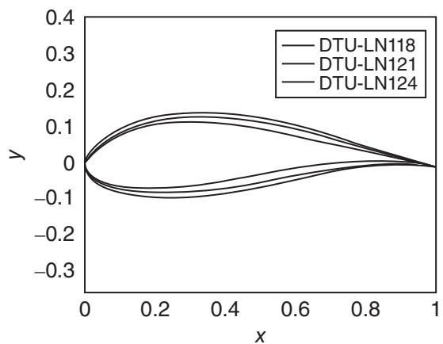

line

| x    | DTU-LN118 | DTU-LN121 | DTU-LN124 |
| ---- | --------- | --------- | --------- |
| 0.0  | 0.0       | 0.0       | 0.0       |
| 0.2  | 0.1       | 0.1       | 0.1       |
| 0.4  | 0.1       | 0.1       | 0.1       |
| 0.6  | 0.05      | 0.05      | 0.05      |
| 0.8  | 0.0       | 0.0       | 0.0       |
| 1.0  | 0.0       | 0.0       | 0.0       |

(a)

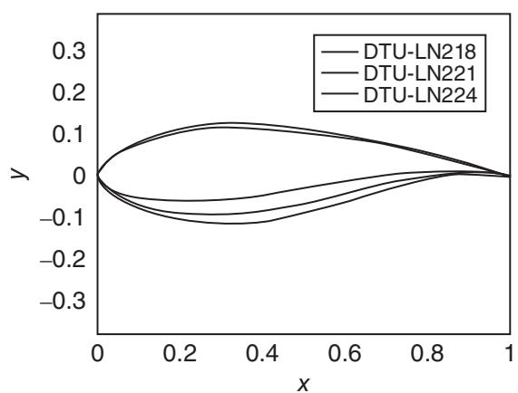

line

| x    | DTU-LN218 | DTU-LN221 | DTU-LN224 |
| ---- | --------- | --------- | --------- |
| 0.0  | 0.0       | 0.0       | 0.0       |
| 0.2  | 0.1       | 0.1       | 0.1       |
| 0.4  | 0.1       | 0.1       | 0.1       |
| 0.6  | 0.0       | 0.0       | 0.0       |
| 0.8  | -0.1      | -0.1      | -0.1      |
| 1.0  | 0.0       | 0.0       | 0.0       |

(b)

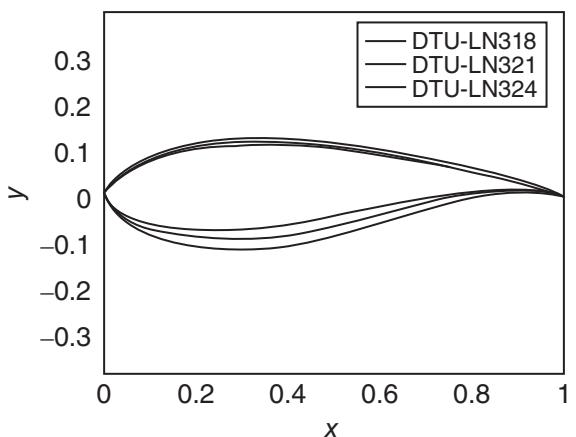

line

| x    | DTU-LN318 | DTU-LN321 | DTU-LN324 |
| ---- | --------- | --------- | --------- |
| 0.0  | 0.0       | 0.0       | 0.0       |
| 0.2  | 0.1       | 0.1       | 0.1       |
| 0.4  | 0.1       | 0.1       | 0.1       |
| 0.6  | 0.1       | 0.1       | 0.1       |
| 0.8  | 0.0       | 0.0       | 0.0       |
| 1.0  | 0.0       | 0.0       | 0.0       |

(c)

Figure 3.78 Low noise aerofoil family: (a) DTU-LN1xx, (b) DTU-LN2xx, and (c) DTU-LN3xx. Source: From Zhu, Shen, and Soerensen (2016).   
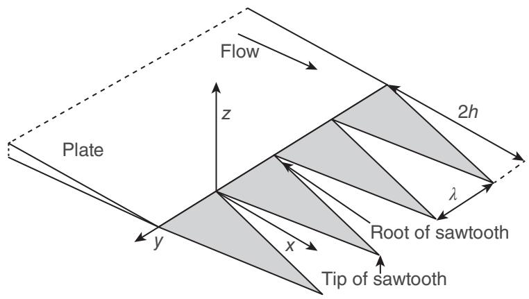

text_image

Flow
z
2h
λ
Plate
y
x
Root of sawtooth
Tip of sawtooth

Figure 3.79 Diagram of serrated trailing edge for reduction of TE noise.

# 3.19.6 Summary

The effect of noise on adjacent populations is the reason for concern about noise. Mainly in the case of wind turbines this concerns human populations. However, underwater propagation of sound from offshore wind turbines may need to be kept in mind with respect to marine animals but is very unlikely to be as signircant as it is for tidal stream turbines. Noise effect on adjacent populations is normally derned by a geographical noise footprint based on contours of perceived noise (PNdB). In drawing these up account has to be taken of the different efrciencies of propagation of noise at different frequencies, in particular that low frequency noise travels much farther than high frequencies, and of the non-uniform sensitivity of the ear over the audible frequency range. Because of the major issues surrounding aircraft noise and the siting of runways, there is a great deal of research published on this.

This Section 3.19 on aerodynamic noise has only attempted to summarise the main issues and research into the subject where it concerns noise arising from wind turbine rotor blades. In practice this is the most important source of noise from a wind turbine, and because noise has become one of the major planning constraints for siting wind turbines, it is likely that the industry will continue considerable effort into the development of methods to suppress it. An excellent reference on the theories describing aerodynamic noise and the sources, radiation, and propagation of sound is the book by Richards and Mead, Noise and Acoustic Fatigue in Aeronautics (1968).

# References

Abbott, I.H. and von Doenhoff, A.E. (1959). Theory of Wing Sections. USA: Dover Books.   
Amiet, R. (1975). Acoustic radiation from an aerofoil in a turbulent stream. J. Sound Vib. 41: 407–420.   
Argyle, P., Watson, S., Montavon, C. et al. (2018). Modelling turbulence intensity within a large offshore wind-farm. Wind Energy Res. https://doi.org/10.1002/we.2257.   
Betz, A. (1919). Schraubenpropeller mit geringstem Energieverlust. Delft: Gottinger Nachrichten.   
Betz, A. (1920). Das Maximum der theoretisch moglichen Ausnutzung des Windes durch Windmotoren. Zeitschrift fur das gesamte Turbinenwesen 26: 307–309.   
Brooks, T.F., Pope, D.S., and Marcolini, M.A. (1989). Airfoil self-noise and prediction. NASA Ref. Pub. 1218.   
Castro, I.P. (1971). Wake characteristics of two-dimensional perforated plates normal to an airstream. J. Fluid Mech. 46: 599–609.   
Conway, J.T. (1998). Exact actuator disc solutions for non-uniform heavy loading and slipstream contraction. J. Fluid Mech. 365: 235–267.   
De Vaal, J.B., Hansen, M.O.L., and Moan, T. (2014). Effect of wind turbine surge motion on rotor thrust and induced velocity. Wind Energy 17: 105–121. https://doi.org/10.1002/we.1562.   
Drela, M. (1989). X-Foil: an analysis and design system for low Reynolds number Airfoils. In: Low Reynolds Number Aerodynamics, vol. 54 (ed. T.J. Mueller), 1–12. Springer-Verlag Lec. Notes in Eng.   
Eppler, R. (1990). Airfoil Design and Data. Berlin: Springer-Verlag.   
Eppler, R. (1993). Airfoil Program System user’s guide.   
Fugslang, P. and Bak, C. (2004). Development of the Risø wind turbine airfoils. Wind Energy 7: 145–162.   
Gault, D.E. (1957). A correlation of low speed airfoil section stalling characteristics with Reynolds number and airfoil geometry. NACA Tech. Note 3963.   
Giguere, P., Dumas, G., and Lemay, J. (1997). Gurney Tap scaling for optimum lift-to-drag ratio. AIAA J. 35: 1888–1890.   
Glauert, H.( 1926). The analysis of experimental results in the windmill brake and vortex ring states of an airscrew. ARC R&M No. 1026.

Glauert, H. (1935a). Airplane propellers. In: Aerodynamic Theory, vol. 4, Division L (ed. W.F. Durand), 169–360. Berlin: Julius Springer.   
Glauert, H. (1935b). Windmills and fans. In: Aerodynamic Theory, vol. 4, Division L (ed. W.F. Durand), 169–360. Berlin: Julius Springer.   
Goldstein, S. (1929). On the vortex theory of screw propeller. Proc. R. Soc. Lond. 123: 440.   
Himmelskamp, H. (1945). Prorle investigations on a rotating airscrew. Doctoral thesis, Gottingen.   
Hoerner, S.F. (1965). Pressure drag on rotating bodies. In: Fluid-Dynamic Drag, 3–13. Midland Park, NJ, USA: Hoerner.   
Howe, M.S. (1991). Noise produced by a saw-tooth trailing edge. J. Acoust. Soc. Am. 90: 482–487.   
Jamieson, P. (2011). Innovation in Wind Turbine Design. UK: Wiley.   
Jamieson, P. (2018). Innovation in Wind Turbine Design, 2e. UK: Wiley.   
Johnson, S.J., van Dam, C.P., and Berg, D.E. (2008). Active load control techniques for wind turbines. Sandia Rept., SAND2008-4809.   
Joukowski, J.N. (1920). Windmills of the NEJ type. Transactions of the Central Institute for Aero-Hydrodynamics of Moscow: 405–430.   
Katz, J. and Plotkin, A. (1991). Low Speed Aerodynamics: From Wing Theory to Panel Methods. New York, USA, McGraw-Hill.   
Lanchester, F.W. (1915). A contribution to the theory of propulsion and the screw propeller. Trans. Inst. Naval Architects 57: 98.   
Lin, C.C. (1955). The Theory of Hydrodynamic Stability. UK: Cambridge University Press.   
Lock, C.N.H. (1924). Experiments to verify the independence of the elements of an airscrew blade. ARCR R&M No. 953.   
Lynch, C.E. and Smith, M. (2009). A computational study of the aerodynamics and aeroacoustics of a sat-back airfoil using hybrid RANS-LES. ResearchGate, https://www.researchgate.net/ publication/253982002.   
Madsen, H.A., Mikkelsen, R.F., Oye, S. et al. (2007). A detailed investigation of the blade element momentum (BEM) model based on analytical and numerical results and proposal for modiScations of the BEM model. Jnl. Physics Conf. Series 75: 012016.   
Madsen, H.A., Bak, C., Doessing, M. et al. (2010). Validation and modiScation of the blade element momentum theory based on comparisons with actuator disc simulations. Wind Energy 13: 373–389.   
Mikkelsen R.F. (2003). Actuator disc methods applied to wind turbines. PhD thesis, Tech. University of Denmark, Lyngby.   
Moriarty, P.J., Guidati, G., and Migliore, P. (2005). Prediction of turbulent insow and trailing edge noise for wind turbines. AIAA paper 2005-2881.   
Peters, D.A. and Modarres, R. (2013, 2014). A compact closed-form solution for the optimum, ideal wind turbine. Wind Energy 17 (4): 589–603. Published online in 2013, https://doi.org/doi .org/10.1002/we.1592.   
Richards, E.J. and Meade, D.J. (1968). Noise and Acoustic Fatigue in Aeronautics. UK: Wiley.   
Ronsten, G. (1991). Static pressure measurements in a rotating and a non-rotating 2.35 m wind turbine blade. Comparison with 2D calculations. Proceedings of the EWEC ’91 Conference, Amsterdam.   
Sharpe, D.J. (2004). Aerodynamic momentum theory applied to an energy extracting actuator disc. Wind Energy 7: 177–188.   
Shen, W.Z., Mikkelsen, R.F., and Soerensen, J.N. (2005). Tip-loss corrections for wind turbine computations. Wind Energy 8: 457–475.   
Snel, H., Houwink, R., Bousschers Piers, W.J., van Bussel, G.J.W. and Bruining, A. (1993). Sectional prediction of 3-D effects for stalled sow on rotating blades and comparison with measurements. Proceedings of the EWEC ’93 Conference, Lübeck-Travemünde, Germany.   
Soerensen, J.N. and Shen, W.Z. (2002). Numerical modelling of wind turbine wakes. J. Fluids Eng. 124: 393–399.

Soerensen, J.N. and van Kuik, G.A.M. (2011). General momentum theory for wind turbines at low tip speed ratios. Wind Energy 14: 821–839.   
Soerensen, J.N., Shen, W.Z., and Munduate, X. (1998). Analysis of wake states by a full-Seld actuator-disc model. Wind Energy 88: 73–88.   
Sørensen, N.N. (1995). General purpose sow solver applied to sow over hills. Risø-R-827(EN).   
Tangler, J. L., and Somers, D. M. (1995). NREL airfoil families for HAWTs. AWEA ’95, Washington, DC, USA.   
Taylor, G.I. (1944). The air resistance of sat plates of very porous material. Aero. Res. Council (UK), Rept. & Memo. No. 2236.   
Timmer, W.A. and van Rooij, R.P.J.O.M. (2003). Summary of the Delft University wind turbine dedicated airfoils. J. Solar Energy Eng. 125: 488–496.   
Troldborg, N., Soerensen, J.N., and Mikkelsen, R.F. (2006). Actuator line computations of wakes of wind turbines in wind-farms. IEA. Annual Rept. Annex XI Proc. Joint Action on Aerodynamics of Wind Turbines.   
Wagner, S., Bareiss, R., and Guidati, G. (1996). Wind Turbine Noise. New York: Springer Verlag.   
Wang, Q., Chen, J.T., Cheng, J.T. et al. (2015). Wind turbine airfoil design method with low noise and experimental analysis. J. Beijing Univ. Aero. Astro. 41: 23–28. Also as DTU-Orbit: https:// doi.org/10.13700/j.bh.1001-5965.2014.0072.   
White, F.M. (1991). Viscous Fluid Flow. New York: McGraw-Hill.   
Wilson, R.E., Lissaman, P.B.S., and Walker S.N. (1974). Applied aerodynamics of wind power-machines. Oregon State University, NTIS: PB-238-595.   
Wimshurst, A. and Willden, R. (2018). Computational observations of the tip-loss mechanisms experienced by horizontal axis rotors. Wind Energy 21: 792.   
Wood, D.H. (1991). A three-dimensional analysis of stall-delay on a horizontal-axis wind turbine. J. Wind Eng. Ind. Aerodyn. 37: 1–14.   
Young, A.D. and Squire, H.B. (1938). The calculation of the prorle drag of aerofoils. Aero. Res. Council (UK), Rept. & Memo. No. 1838.   
Zhu, W.T., Heilskov, N., Shen, W.Z., and Soerensen, J.N. (2005). Modeling of aerodynamically generated noise from wind turbines. J. Solar Energy Eng. 127: 517–528.   
Zhu, W.T., Shen, W.Z., and Soerensen, J.N. (2016). Low noise airfoil and wind turbine design. In: Wind Turbine Design, Control and Applications, Ch.3. (ed. A.G. Aissaoui), 55. Intech Open https://doi.org/10.5772/63335.

# Websites

http://www.nrel.gov/wind

http://www.nrel.gov/wind/publications.html

https://wind.nrel.gov/airfoils/Shapes/S809\_Shape.html.

http://www.windpower.org/en

http://www.lr.tudelft.nl/live/pagina.jsp?id=9e2f503f-3b65-44bc-aba4-a30033400ea7&lang=en

# Further Reading

Anderson, J.D. (1991). Fundamentals of Aerodynamics, 2e. Singapore: McGraw-Hill.

Ashill, P.R., Fulker, J.L., and Hackett, K.C. (2005). A review of recent developments in Tow control. Aeronaut. J. 109: 205–232.

Barnard, R.H. and Philpott, D.R. (1989). Aircraft Flight: A Description of the Physical Principles of Aircraft Flight. Singapore: Longman.

Duncan, W.J., Thom, A.S., and Young, A.D. (1970). Mechanics of Fluids, 2e. London: Edward Arnold.   
Eggleston, D.M. and Stoddard, F.S. (1987). Wind Turbine Engineering Design. New York: Van Nostrand Reinhold Co.   
Fung, Y.C. (1969). An Introduction to the Theory of Aeroelasticity. New York: Dover.   
Hansen, M.O.L. (2000). Aerodynamics of Wind Turbines. London: James & James.   
Johnson, W. (1980). Helicopter Theory. New York: Dover.   
Manwell, J.F., McGowan, J.G., and Rogers, A.L. (2002). Wind Energy Explained. Chichester: Wiley.   
Prandtl, L. and Tietjens, O.G. (1957). Applied Hydro- and Aeromechanics. New York: Dover.   
Stepniewski, W.Z. and Keys, C.N. (1984). Rotary-Wing Aerodynamics. New York: Dover.

# Appendix A3 Lift and drag of aerofoils

The lift and drag of a body immersed in an oncoming sow are derned as the components of force on the body in the directions normal and parallel, respectively, to the incident sow direction.

Dimensional analysis shows that in low-speed, steady sow (that is, sow at low Mach number, so that the relative speed of the sow is much less than the speed of sound), the lift L and drag D may be expressed in the form of non-dimensional parameters, the lift and drag coefrcients:

$$
C _ {L} = \frac {L}{1 / 2 \rho U ^ {2} A} \mathrm{and} C _ {D} = \frac {D}{1 / 2 \rho U ^ {2} A}
$$

which are both functions of the Reynolds number,

$$
R e = \frac {U . l}{\nu}
$$

of the sow.

Here 휌 is the density and 휈 the kinematic viscosity of the suid, in this case air, U is the sow speed, l is a characteristic length scale (often the mean chord c), and A is an appropriate area of the body. In the case of aerofoils, wings, or turbine blades, A is usually taken to be the plan-form area s.c, where s is the span of the whole body or of a section of the body on which the force is evaluated. Most ‘lifting surfaces’ that are designed to provide lift with minimum accompanying drag, such as the wings of subsonic aircraft and the blades of high tip speed ratio HAWTs, are of high aspect ratio with relatively gradual changes of section (chord c, thickness, camber, and twist) with respect to the spanwise direction. For these bodies the aspect ratio is derned as the span of the blade or wings divided by the mean chord. For aircraft the span is derned as the distance between the two wing tips of the wing pair, but in the case of a wind turbine, the span is the distance from the axis of rotation to the tip of a single blade. Because of the gradual variation of properties along a wing or blade, it is very convenient and in practice sufrciently accurate usually to analyse whole wing or blade forces in terms of the sum of sectional forces and sectional force coefrcients. This is taken up in Section A3.8.

This form of non-dimensionalisation is used because it is found that for similar conrgurations over most regimes involving air (or water), sows of typical speeds and length scales of most practical sows, force coefrcients expressed in this way vary relatively slowly with respect to the other main non-dimensional parameter of the sow, the Reynolds number. Expressing sow-induced forces in term of these coefrcients is particularly convenient when testing sows at model scale or comparing forces induced on similar shaped bodies in different suids or sow speeds. Typical Reynolds numbers relevant to sow around wind turbine blades are of order $1 0 ^ { 6 }$ to $\bar { 1 } 0 ^ { 7 }$ (order $1 0 ^ { 5 }$ for small rotors of diameter ∼1 m). In this context the term ‘low Reynolds number’ is often used to describe sows where the Reynolds number is less than about $1 0 ^ { 5 }$ . This regime can occur in wind-tunnel testing of small model turbines. Strictly in suid dynamics, the term ‘low Reynolds number’ refers to the Stokes sow regime for which the Reynolds number is of order 1 and the sow approximately satisres the Stokes Equations. It is not relevant here. It should be noted that the factor 1/2 was not originally in the denominator in the dernition of these coefrcients but was introduced later in further development of the subjects of suid dynamics during the twentieth century because of its occurrence in related terms in Bernoulli’s equation for pressure. It is now established in use for all force, pressure, and power coefrcient dernitions but is not completely universal, being, for example, omitted in US dernitions of rotor power and thrust coefrcients for helicopters.

# A3.1 Drag

Flow-induced forces on a body in a viscous suid arise from:

1. A tangential stress exerted on the surface, the skin friction, which is caused directly by the viscosity in the suid coupled with the fact that there cannot be any relative motion of a viscous suid with respect to the body at its surface, the no-slip condition.

2. A normal stress exerted at the surface, the pressure.

Both types of stress contribute to the drag.

It is convenient to consider the drag exerted on 2-D bodies across a uniform sow, because many general practical bodies are of a conrguration that has one long cross-sow dimension such that the sow varies only gradually in that ‘long’ direction. In such cases, 2-D sow is a good local approximation to the sow about any section of the body normal to the long axis. These conrgurations may be termed quasi-2-D. Wind turbine blades and towers are examples of such bodies.

All suids (with a very few special exceptions, such as liquid helium) have some viscosity, although in the case of two of the most common suids, air and water, it is relatively small. In the absence of any viscous effect, the sow slips relative to the body at its surface, can be described by a potential function, and is called potential Tow. The drag in this case on a 2-D body in fully subsonic, steady inviscid sow is exactly zero because no wake is generated.

The action of viscosity is to diffuse vorticity and hence momentum in a way analogous to the diffusion of heat, out from the body surface where the sow is retarded by the no-slip condition, which now applies at the surface. If the suid has small kinematic viscosity and a comparatively large length scale and velocity so that the Reynolds number is high, the viscous diffusion effects spread outwards at a very much slower speed than the main velocity convection speed along the body surface and as a result remain conrned to a thin layer adjacent to the body surface, the boundary layer.

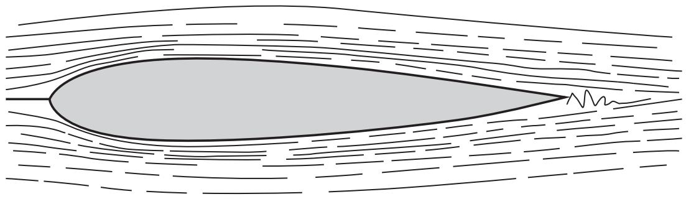

natural_image

Simple line drawing of a boat hull with wavy lines indicating water flow (no text or symbols)

Figure A3.1 Flow past a streamlined body.

Generally, bodies are subdivided into two categories: streamlined and bluff. The main characteristics of streamlined bodies (see, e.g. Figure A3.1) are that the boundary layers remain thin over the whole body surface to the rearmost part of the body, where they recombine and stream off in a thin wake and the drag coefrcient is comparatively small. Bodies such as wings and rotor blades whose sections are aerofoils are examples. Bodies on which not all of the boundary layers remain attached in this way up to a trailing edge but rather detach at earlier points creating a thick wake are termed bluff bodies. The sows around such bodies, for example, circular cylinders and fully stalled aerofoils (see Figure A3.12), result in a comparatively high drag coefrcient. More general 3-D bodies may also belong to another category, that of slender bodies (slender in the sow direction), which are not relevant here.

Many practical bodies such as wind turbines or aircraft involve a complex assembly of components that individually belong to the preceding categories. Forces on such bodies are usually calculated by breaking the body down into quasi-2-D elements, and interactions between elements are dealt with, when signircant, by interference coefrcients. In some cases where it is appropriate to consider sectional sow, such as for the blades of a wind turbine, the sow is not exactly in the plane of the section and may contain a non-zero ‘lengthwise’ or transverse component. It is usual and can be demonstrated that if boundary layer effects are neglected, the pressures and forces on any body section normal to the long axis result from only those sow components that are in the plane of the section and are insensitive to the velocity component parallel to the long axis. This is known as the independence principle and holds quite accurately for real attached viscous sows up to angles of yaw between the sow and the long axis from normal sow $( 0 ^ { \circ }$ of yaw) to about $4 5 ^ { \circ }$ of yaw. This covers the usual range for such elements as wind turbine blades. For larger yaw angles than this the independence principle is increasingly in error, and as the yaw angle approaches $9 0 ^ { \circ }$ the sow becomes more like that of a slender body.

# A3.2 The boundary layer

The velocity of the sow adjacent to the surface of any solid body, and in particular wind turbine blades and aerofoils, reduces to zero relative to the body at its surface (the no-slip condition) due to viscous stresses in the suid. At usual sow Reynolds numbers $[ \mathrm { O } ( 1 0 ^ { 5 } )$ to

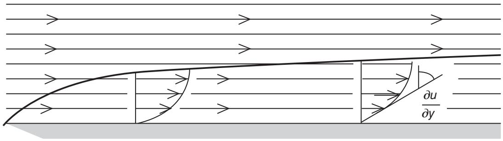

text_image

Diagram illustrating fluid flow through a curved channel with velocity gradient and boundary conditions labeled ∂u/∂y

Figure A3.2 Boundary layer showing the velocity prorle.

O(108 )] occurring in practice, diffusion is much slower than streamwise convection. As a result nearly all of the change in velocity takes place in very thin regions next the body surface called boundary layers, which therefore exhibit a strongly sheared velocity prorle; see Figure A3.2. These boundary layers grow in thickness from the attachment point and are shed eventually into the wake of the body. They convect downstream as free shear layers, forming a wake where viscous stresses are similarly signircant. Outside the boundary layers and wake the sow behaves almost as if inviscid. The integrated streamwise component of the skin friction on the body surface due to the viscous stresses gives rise to an important component of the drag on the body, the skin friction drag. The other component is the pressure drag (the integrated streamwise component of the normal forces on the body surface). This component is small because the front half streamwise component of the pressures on the body nearly balances the downstream half; the thinner the boundary layer, the nearer they are in balance. The pressure drag is usually similar in size to the skin friction drag for streamlined bodies, such as aerofoils, but becomes much larger if boundary layer separation occurs. The combined skin friction and pressure drag for an aerofoil section in 2-D sow is known as the proSle drag. The prorle drag coefrcient of an aerofoil is quite small for these Reynolds numbers while the sow remains attached, depending weakly on the Reynolds number and the angle of attack.

# A3.3 Boundary layer separation

The sow over any body, such as a wing, blade, or aerofoil, that generates lift (conventionally regarded as positive ‘upwards’) does so due to the body geometry causing the streamlines of the sow to curve around it (mainly concave downwards) so that downward momentum is added to the vertical component of the momentum in the sow as it exits the insuence of the body. The resulting surface pressure distribution can be understood qualitatively by considering the normal pressure gradient required to balance the sow curvature. Therefore, the pressure must fall from ambient far away from the aerofoil to a lower value on its upper surface and rise from ambient towards the lower surface. Bernoulli’s equation for energy [e.g. Eq. (3.5a)] shows that decreasing pressure (energy) in a sow must be balanced by increasing kinetic energy, hence increasing velocity, and vice versa. To conserve mass sow rate, higher sow speeds imply streamlines becoming closer together. The general difference in surface sow speed between the upper and lower surfaces of the aerofoil means that any closed circuit integral of sow speed around the body (termed the circulation) is non-zero. Circulation proportional to the lift is as shown by the Kutta–Joukowski theorem, Eq. (A3.1). A more detailed discussion of circulation is given in Section A3.6. The ‘tighter’ the streamline curvature, as round the nose of an aerofoil section at high angle of attack, the greater the fall in surface pressure resulting in a strong suction peak in this region.

The sow approaching a body such as a blade section has one incident streamline that ‘attaches’ at the front stagnation point where the sow speed falls to zero. The sow speed along the streamline’s either side falls to its lowest value close to the body, and pressure there is highest, before the streamline bifurcates, passing either side of the body. Following such a streamline just outside the boundary layer, the sow then rapidly speeds up as it passes over the body surface, to higher values than in the approach sow. Part of this speed-up is due to the effect of the thickness of the body constricting the streamlines and hence increasing sow speed. Part in the case of a body generating lift is due to the fall in pressure associated with the lift or circulation described above. The increase in sow speed on the ‘upper’ or ‘suction’ surface when the body is an aerofoil section at a signircant angle of attack to the ambient sow is much greater than on the ‘lower’ or ‘pressure’ surface. Following the suction and velocity peak, the sow on the upper surface must slow down again to reach near-ambient pressure conditions before streaming off into the wake. As the sow slows the pressure rises, and this ‘adverse’ streamwise pressure gradient acting on the much reduced momentum in the sow layers very close to the surface within the boundary layers further reduces their momentum, eventually to zero and if strong enough to a reverse sow, although the external sow may not yet have even slowed to ambient; see Figure A3.3. The process is opposed by viscous mixing with higher momentum from the external sow. But if the adverse pressure gradient is strong enough, reversed sow occurs in the boundary layer. This is known as separation and the boundary layer separates from the surface at that point. The separated region becomes much thicker and dramatically alters the pressure distribution around the body. This strongly affects both the lift force, even causing it to fall abruptly, and the near balance of the front and rear streamwise components of the integrated pressures, causing the pressure drag to increase rapidly to much larger values. The phenomenon is known as the stall condition for the aerofoil. A boundary layer that does not separate from the surface before it reaches the downstream end of the surface (the trailing edge on an aerofoil) is termed unseparated. It rnally sheds (or separates) from this downstream edge by virtue of the sudden change of surface slope. Flow around any sharp edge is not sustainable, because this would generate a very high velocity at the edge followed by an extreme adverse pressure gradient as the sow slows down again. In the case of streamlined (i.e. unseparated) sow over an aerofoil, both surface boundary layers remain unseparated until they meet at the trailing edge, from which they convect together downstream in a thin wake, and the pressure drag remains very small.

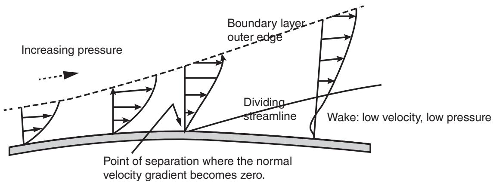

text_image

Increasing pressure
Boundary layer outer edge
Dividing streamline
Wake: low velocity, low pressure
Point of separation where the normal velocity gradient becomes zero.

Figure A3.3 Separation of a boundary layer.

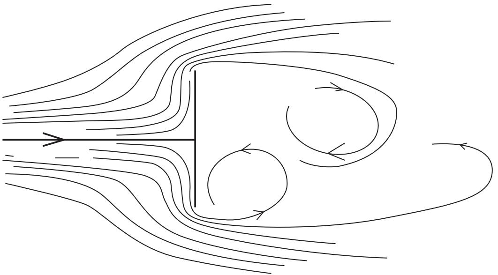

natural_image

Abstract flow diagram with curved and looped paths, no text or symbols present

Figure A3.4 Separated sow past a sat plate.

On some bluff (i.e. non-streamlined) bodies, the boundary layers separate from different downstream edges and do not meet up, such as is shown in Figure A3.4 for a sat plate normal to the sow. In these cases, as for the cases of boundary layer separation from continuous surfaces, a thick wake results, which often contains large eddying motions, and the pressure drag is high. A sharp edge on a body will always cause separation. For the sat plate broad-side onto the sow, Figure A3.4, the boundary layer separates at the sharp edges and $C _ { D }$ is almost independent of Re but is dependent upon the plate’s aspect ratio.

# A3.4 Laminar and turbulent boundary layers and transition

Unless the incident sow contains high intensity, small length scale turbulence, the sow just downstream of the attachment point forms laminar boundary layers. Eventually, unless the Reynolds number is rather low, due to boundary layer growth in thickness with downstream distance and the effects of adverse pressure gradient on the velocity prorle, laminar boundary layers become unstable, and the instabilities grow into turbulence. This is the transition point and downstream of it the boundary layer becomes a turbulent boundary layer; see Figure A3.5. The transition point on an aerofoil has a strong insuence on the drag of the aerofoil and on the angle of attack at which stall starts to develop. Its location depends strongly on (i) the Reynolds number and boundary layer thickness, (ii) the surface pressure distribution, particularly the strength of adverse pressure gradient, (iii) the roughness of the surface, and (iv) the turbulence in the external stream. Points (i) and (ii) being large lead to instability growth, (iii) and (iv) to rnite sized disturbances that seed the growth of turbulence. An additional very potent factor (v) in promoting transition is the occurrence of very small regions of separation known as separation bubbles. Because a shear layer prorle with a point of insexion is in practice immediately unstable, both separation bubbles and laminar boundary layers in the regions of strong adverse pressure gradient just after a very low-pressure peak can be regarded for practical purposes as giving rise immediately to transition unless they have completely separated rrst. Unfortunately, because of the very small scales involved, direct simulation of transition even on a simple aerofoil prorle requires very large computing capacity and in practice simple semi-empirical methods such as the en method (where n ∼ 9, White 1991) are used to predict its occurrence. After transition the boundary layer becomes turbulent and, because of the greatly enhanced mixing that occurs, generates a fuller prorle with much higher shear but only within a thin region adjacent to the body surface. The effects of this are to increase the skin friction considerably (therefore the skin friction drag increases and the boundary layer thickens more rapidly) but also to oppose more strongly the effects of adverse pressure gradient in causing separation. Turbulent boundary layers are much more resistant to separation. The outer limit of a boundary layer beyond which viscous shear is negligible is not a precise interface but usually taken as the surface at which the mean velocity has reached 99.5% of the ‘external’ sow velocity. This is a difrcult state to derne precisely if the external pressure reld is varying, as is, for example, the case with the ABL. Also, in the case of a turbulent boundary layer the instantaneous interface is highly corrugated in space and time due to the turbulent eddies.

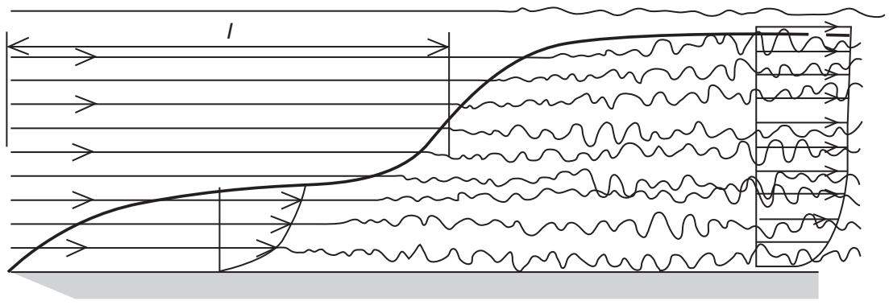

text_image

Diagram illustrating fluid flow through a constriction with wave patterns and directional arrows, labeled with 'l' and grid structure.

Figure A3.5 Laminar and turbulent boundary layers.

The coefrcient of drag, therefore, in these cases can vary with Reynolds number in a complex fashion. Figure A3.6 shows the classic result for a circular cylinder. At moderate to low Reynolds numbers (small diameters and/or low speeds), the boundary layers remain laminar, and separation takes place just ahead of 90∘ from the front attachment point. As the Reynolds number increases to a critical value, transition to turbulence that is taking place in the wake moves upstream to the separation point, and the turbulent separated layer immediately reattaches, forming a small separation bubble. Downstream of this is a turbulent boundary layer that does not separate until much further round the cylinder, forming a narrow wake, and the drag coefrcient falls abruptly. With further increase of Reynolds number, turbulent separation continues, and the drag coefrcient slowly increases again. This effect of Reynolds number on separation and forces is usually less complex on many other types of body, but particularly when separation bubbles are formed; as can happen in many aerofoil stall regimes, the behaviour of the force characteristics with Reynolds number can be complex and abrupt.

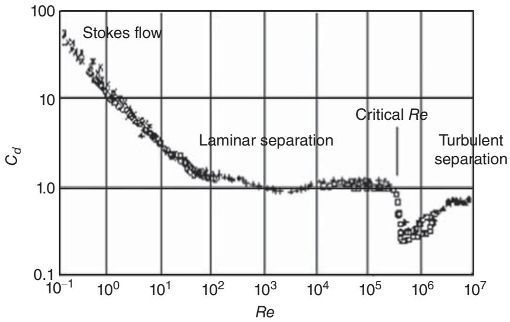

line

| Re       | Cd     |
| -------- | ------ |
| 10^-1    | ~90    |
| 10^0     | ~10    |
| 10^1     | ~3     |
| 10^2     | ~1.5   |
| 10^3     | ~1.2   |
| 10^4     | ~1.1   |
| 10^5     | ~1.0   |
| 10^6     | ~0.8   |
| 10^7     | ~0.9   |

Figure A3.6 Variation of $C _ { d }$ with Re for a long cylinder.

Transition to turbulence is highly sensitive to levels of small length-scale turbulence or high frequency acoustic noise in the incident sow (by-pass transition) and to elements or distributed roughness of the body surface. It can be artircially triggered by deliberately roughening the surface or distributing a band of roughness elements or by rxing a ‘trip wire’ to the surface. Insect deposition on the leading edges of wind turbine blades may similarly trigger transition.

Streamlined bodies such as aerofoils taper gently in the aft region so that the adverse pressure gradient is fairly small and separation is delayed until very close to the trailing edge. This produces a very much narrower wake and a very low drag because signircant pressure drag is avoided.

On an aerofoil at higher angles of attack, stall onset may be delayed by earlier transition in the suction surface boundary layer. The phenomenon may also include the occurrence of separation bubbles where a laminar separation is followed immediately by transition in the separated shear layer and then turbulent mixing causing reattachment and formation of a ‘bubble’ on the surface. Because of these effects, the onset of turbulence in the boundary layer and particularly the occurrence of separation bubbles controls the angle of attack at which an aerofoil stalls and the type of stall that occurs. Because turbulence in the free stream and surface roughness both tend to promote transition, they can both affect the lift and drag of bodies. In the case of turbulence, the length scale must be small to affect the boundary layer transition. For an aerofoil the effects are particularly insuential around the stall region, and on many aerofoils that operate in regions of dirty air close to the ground, it is advisable to periodically clean accumulated dirt or insects from the leading edge regions. More modern designs seek prorles that are relatively insensitive to surface roughness around the leading edge. As on all bodies on which separated sow occurs, early transition when it delays or suppresses separation reduces the pressure drag.

A useful categorisation of aerofoil stall types is given by Gault (1957).

# A3.5 DeJnition of lift and its relationship to circulation

The lift on a body immersed in a sow is derned as the force on the body in a direction normal to the incident sow direction.

In subsonic steady sow, a body only generates lift if the sow incorporates a circulatory component about the body. The body section is then said to have circulation. This type of sow may be illustrated by that which occurs about a spinning circular cylinder in a uniform incident sow reld of velocity U. In the resulting sow reld, as shown in Figure A3.7, the velocity above the cylinder is increased and the static pressure reduced. Conversely, the velocity beneath is slowed and the static pressure increased. An upwards force on the cylinder results with a strong component normal to the free stream, the lift force.

The phenomenon of lift generated by a spinning cylinder is known as the Magnus effect after its original discoverer and explains, for example, why spinning balls veer in sight.

The circulatory component of this sow is shown in Figure A3.8 and has the same distribution of velocity outside the boundary layer as a line vortex.

The lift force due to circulation is given by the Kutta–Joukowski theorem, called after the two pioneering aerodynamicists who, independently, realised that this was the key to the understanding of the phenomenon of lift generated in subsonic sow on all bodies, including the spinning cylinder:

$$
L = \rho (\Gamma \times U) \tag {A3.1}
$$

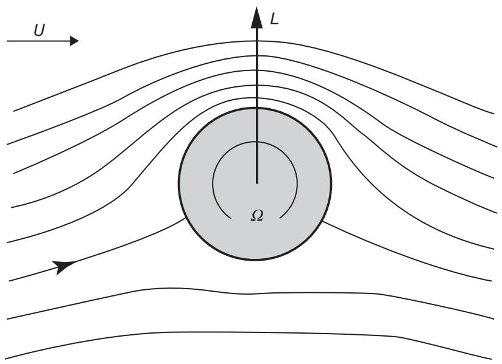

text_image

U
L
Ω

Figure A3.7 Flow past a rotating cylinder.

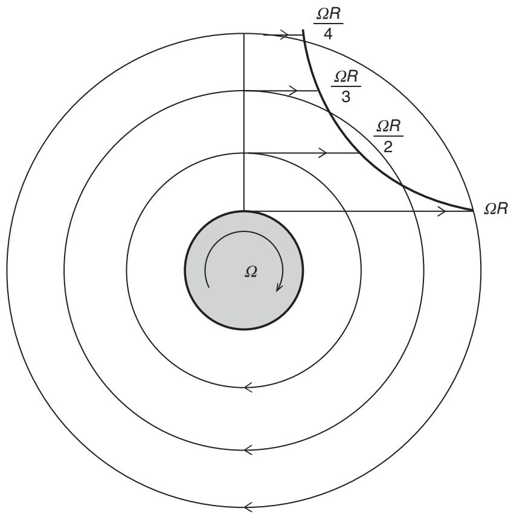

text_image

ΩR
4
ΩR
3
ΩR
2
ΩR
Ω

Figure A3.8 Circulatory sow round a rotating cylinder.

Here Γ is the circulation, or vortex strength, derned as the integral

$$
\Gamma = \oint v d s \tag {A3.2}
$$

around any path enclosing the body, and v is the velocity tangential to the path s.

Two-dimensional inviscid potential sow about a general 2-D body section is non-unique and is only rxed by derning where the sow separates. A non-rotating body can have a circulatory sow about any section, the circulation being controlled by where on the section the boundary layers separate. On an aerofoil section, pre-stall, the sharp trailing edge is the only edge at which the sow separates. Such a sow about an aerofoil as shown in Figure A3.9 can be composed of (i) a non-circulatory sow induced by the approaching free stream, and (ii) a purely circulatory sow that is equivalent to a distribution of vorticity around the section. In general, neither of these sows separate from the trailing edge, i.e. appropriately, but by adding a suitable amount of the latter, thus rxing the circulation, to the former (iii) a composite sow is obtained that does separate from the trailing edge. The condition enforcing separation of the inviscid sow from the trailing edge is known as the Kutta–Joukowski condition. At large distances radially from the axis of a (quasi-) 2-D body, the sow reld is a combination of the uniform incident sow with a vortex sow if the body has lift (and a line-source sow if it has signircant viscous drag.) The v-component of the free stream U in Eq. (A3.2) (and similarly the source sow component if present) integrates around the closed circuit to zero. The v-component due to a line vortex, taken, for example, on a circular path concentric with the vortex, is v = k/r, where k is a constant. This integrates around the circuit in Eq. (A3.2) to the circulation:

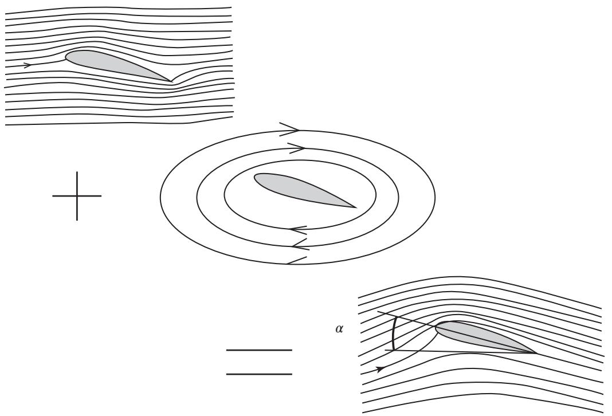

text_image

Diagram illustrating wave interference with labeled components and angles, including wavefronts, concentric circles, and directional arrows.

Figure A3.9 Flow past an aerofoil at a small angle of attack: (a) inviscid sow, (b) circulatory sow, and (c) real sow.

$$
\Gamma = 2 \pi \mathrm{k}
$$

(easily seen for circular circuits derned by constant r, but true for all circuits enclosing the vortex). Hence the section lift/unit span is

$$
\mathrm{L} = 2 \pi \rho \mathrm{Uk}
$$

In the case of streamlined lifting bodies such as aerofoils, the circulation Γ that is rxed by the Kutta–Joukowski condition at the trailing edge can be shown to increase with angle of attack α in proportion to sin α. Although the velocities and pressures above and below the aerofoil at the trailing edge must be the same, the particles that meet there are not the same ones that parted company at the leading edge. The particle that travelled over the aerofoil upper surface, even though a longer distance, normally reaches the trailing edge before the one travelling over the shorter lower surface because its speed-up by the circulation is proportionately greater.

In the corresponding case of a real viscous sow, the boundary layers separate at the trailing edge as discussed earlier, very closely approximating this condition. Thus, pre-stall lift on an aerofoil section in real sow is quite accurately predicted by inviscid potential sow analysis. However, inviscid sow analysis does not predict the drag, the inviscid (prorle) drag being identically zero because in this case the section of itself generates no wake.

The pressure variation (minus the ambient static pressure of the undisturbed sow) around an aerofoil is shown in Figure A3.10. The upper surface is subject to suction (with the ambient pressure subtracted) and is responsible for most of the lift force. The pressure distribution is calculated without the presence of the boundary layer because the normal pressure difference across the boundary layer is small enough to be neglected. Higher order, more accurate solutions for the pressures and forces may be obtained by taking account of the effect of the slowed velocity in the boundary layer displacing the streamlines of the quasi-inviscid sow outwards by a small amount like a small thickness addition to the prorle.

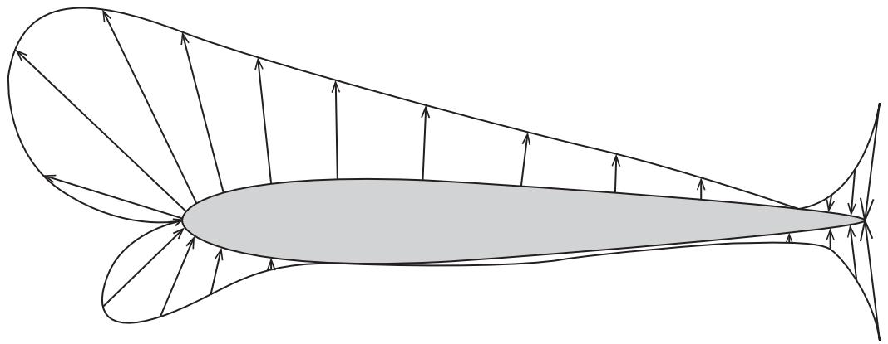

natural_image

Diagram of a streamlined object with curved, fan-like structures and directional arrows indicating flow or force (no text or symbols)

Figure A3.10 The pressure distribution around the NACA0012 aerofoil at $\alpha \ : = \ : 5 ^ { \circ }$ (shown schematically around the aerofoil).

Figure A3.11 shows the same distribution with the pressure coefrcient $\begin{array} { r } { ( C _ { p } = \frac { p - p _ { \infty } } { \frac { 1 } { 7 } \rho U ^ { 2 } } ) } \end{array}$ plotted against the chordwise coordinate of the aerofoil prorle: the full line shows the pressure distribution if the effects of the boundary layer are ignored, and the dashed line shows the actual distribution.

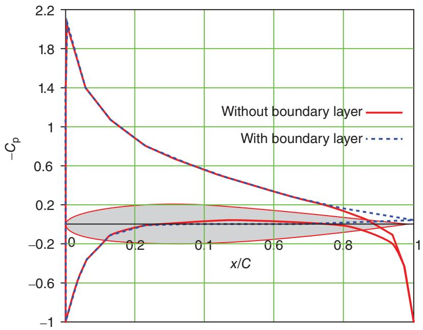

line

| x/C  | Without boundary layer | With boundary layer |
|------|------------------------|---------------------|
| 0.0  | 2.2                    | 2.2                 |
| 0.2  | 1.4                    | 1.4                 |
| 0.6  | 0.8                    | 0.8                 |
| 0.8  | 0.4                    | 0.4                 |
| 1.0  | -1.0                   | -1.0                |

Figure A3.11 The pressure distribution around the NACA0012 aerofoil at $\alpha { = } 5 ^ { \circ }$ (pressure coefrcient $C _ { \mathrm { P } }$ vs x/c).

The effect of the boundary layer is to modify the pressure distribution at the rear of the aerofoil such that lower pressure occurs there than if there is no boundary layer. There is no stagnation pressure at the trailing edge, where the pressure tends to be much closer to ambient. The boundary-layer-modired pressure distribution gives rise to pressure drag that is added to the skin friction drag, also caused by the boundary layer.

# A3.6 The stalled aerofoil

If the angle of attack exceeds a certain critical value (typically $1 0 ^ { \circ }$ to $1 6 ^ { \circ }$ , depending on the Re), separation of the boundary layer on the ‘suction’ (or upper) surface takes place. A wake forms above the aerofoil starting from this separation (Figure A3.12), and the circulation and hence the lift are reduced and the drag increased. The sow past the aerofoil has then stalled. A sat plate at an angle of attack will also behave like an aerofoil and develop circulation and lift but will stall at a very low angle of attack because of the sharp leading edge. Cambering (or curving) the plate will increase the angle of attack for stall onset, but a much greater improvement can be obtained by giving thickness to the aerofoil together with a suitably rounded leading edge.

# A3.7 The lift coefJcient

The lift coefrcient is derned as

$$
C _ {l} = \frac {\text { Lift }}{\frac {1}{2} \rho U ^ {2} A} \tag {A3.3}
$$

U is the sow speed and A is the plan area of the body. For a long body, such as an aircraft wing or a wind turbine blade, the lift per unit span is used in the dernition, the plan area now being taken as the chord length (multiplied by unit span):

$$
C _ {l} = \frac {\text { Lift / unitspan }}{\frac {1}{2} \rho U ^ {2} c} = \frac {\rho (\Gamma \times U)}{\frac {1}{2} \rho U ^ {2} c} \tag {A3.4}
$$

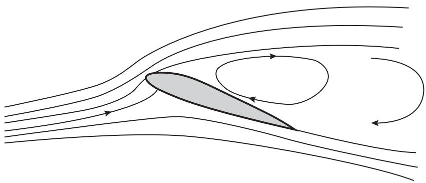

natural_image

Diagram of fluid flow around an airfoil with streamlines and circular motion arrows (no text or labels)

Figure A3.12 Stalled sow around an aerofoil.

In practice it is convenient to write for pre-stall conditions:

$$
C _ {l} = a _ {0} \sin \alpha + C _ {l 0} \tag {A3.5}
$$

where ${ a } _ { 0 } ,$ called the lift-curve slope $\frac { d C _ { l } } { d \alpha }$ , is about $6 . 0 \left( \sim  { \partial } .  { I } / d e g . \right)$ .

Note that $a _ { 0 }$ 훼 should not be confused with the sow induction factor.

Thin aerofoil potential sow theory shows that for a sat plate or very thin aerofoil, the Kutta–Joukowski condition is satisred by

$$
\Gamma = \pi U \mathrm{csin} (\alpha - \alpha_ {0})
$$

where $\alpha _ { 0 }$ is the angle of attack for zero lift and proportional to the camber, being negative for positive camber (convex upwards).

Therefore

$$
C _ {l} = \mathrm{a} _ {0} \sin (\alpha - \alpha_ {0})
$$

with $\mathtt { a } _ { 0 } = 2 \pi .$

Generally, thickness increases $\mathrm { a } _ { 0 }$ and viscous effects (the boundary layer) decrease it.

Lift, therefore, depends on two parameters, the angle of attack 훼 and the sow speed U. The same lift force can be generated by different combinations of 훼 and U.

The variation of $C _ { l }$ with the angle of attack 훼 is shown in Figure A3.13 for a typical symmetrical aerofoil (NACA0012). Notice that the simple relationship of Eq. (A3.5) is only valid for the pre-stall region, where the sow is attached. Because the angle of attack is small $( < I 6 ^ { \circ } )$ the equation is often simplired to

$$
C _ {l} = a _ {0} \alpha + C _ {l 0} \tag {A3.6}
$$

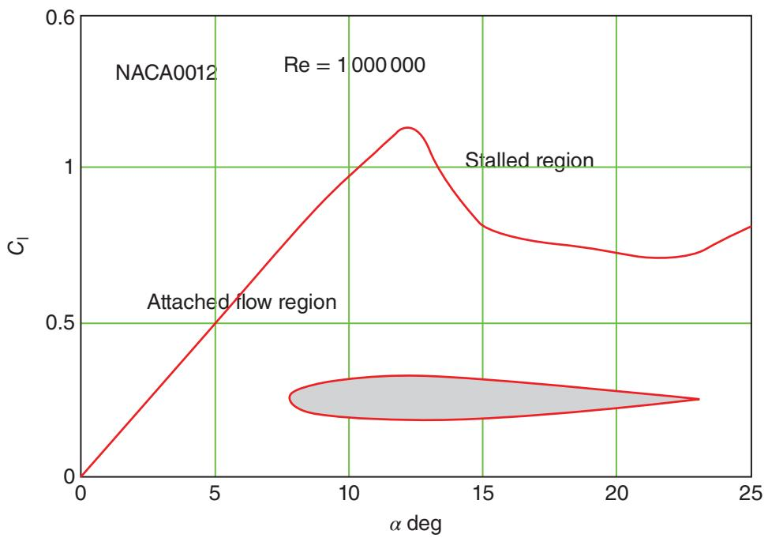

line

| α deg | G⁻     |
|-------|--------|
| 0     | 0.0    |
| 5     | 0.5    |
| 10    | 1.0    |
| 15    | 0.8    |
| 20    | 0.7    |
| 25    | 0.8    |

Figure A3.13 $C _ { l } - \alpha$ curve for a symmetrical aerofoil.

The potential velocity and pressure reld around aerofoil sections may be calculated using transformation theory (classically) or more usually now by the boundary integral panel method. Many commercial CFD codes also include an option to compute the potential sow calculation by reld methods (rnite difference, volume or element). The resulting potential sow solution may then be made more realistic, taking into account the effects of the laminar and/or turbulent boundary layers by using the potential sow results for the surface pressure or velocity to drive boundary layer calculations of displacement thickness that in turn modify the potential sow as well as providing estimates of drag. Direct methods are used for this while the sow remains unseparated but inverse methods must be used as separation develops. These methods are very efrcient computationally and give good results up to angles of attack at which a shallow separation has started the aerofoil stall. Once a large separation has developed (full stall), they become less accurate, and CFD methods (discussed in Chapter 4) must be used. The well-known code XFOIL (Drela 1989) is a widely used example of this type of method. These techniques are discussed in more detail in Katz and Plotkin (1991).

# A3.8 Aerofoil drag characteristics

The dernition of the drag coefrcient for a streamlined body, such as an aircraft wing or a wind turbine blade, because of the relevance of surface friction drag is based not on the frontal area but on the plan area. The sow past a body that has a large span normal to the sow direction is locally quasi-2-D, and in such cases the drag coefrcient can be based upon the drag force per unit span using the streamwise chord length for the dernition:

$$
C _ {d} = \frac {\text { Drag / unitspan }}{\frac {1}{2} \rho U ^ {2} c} \tag {A3.7}
$$

The drag coefrcient of an aerofoil varies with angle of attack. For a well-designed aerofoil at moderate to high Reynolds number $[ \mathrm { O } ( 1 0 ^ { 6 } )  – \mathrm { O } ( 1 0 ^ { 7 } ) ]$ , the value of $C _ { d }$ is O(0.01) in the minimum drag range of angle of attack (called the drag bucket).

The following sections show some results for two classical NACA four-digit aerofoils that, although not now used except exceptionally for wind turbines, do demonstrate the typical force behaviour of aerofoil sections.

# A3.8.1 Symmetric aerofoils

Figure A3.11 shows that on the upper surface pressure is rising as the sow moves from the suction peak towards the trailing edge. This is an adverse pressure gradient that slows the air down. It also thickens the boundary layer more rapidly, causing more velocity momentum to be lost. If the sow above (i.e. just off) the surface within the boundary layer is slowed to a standstill, the surface streamlines separate from the surface, stall occurs, and the pressure drag rises sharply. The strength of the adverse pressure gradient increases with angle of attack, and therefore the drag will also rise with angle of attack. Figure A3.14 shows the variation of $C _ { d }$ with 훼 for the symmetrical NACA0012 aerofoil.

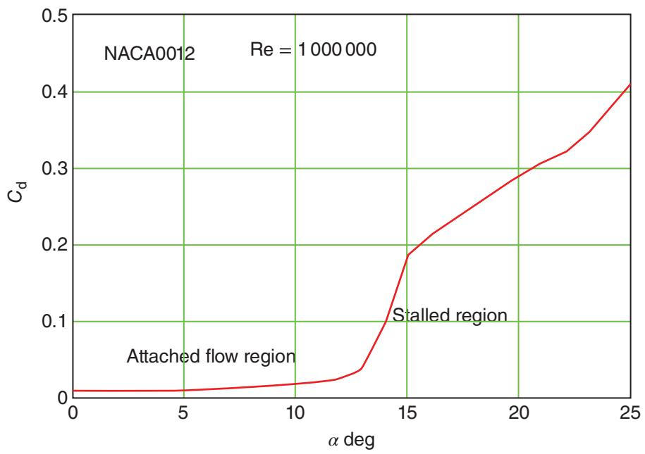

line

| α deg | Cd     |
|-------|--------|
| 0     | 0.0    |
| 5     | 0.0    |
| 10    | 0.0    |
| 15    | 0.2    |
| 20    | 0.3    |
| 25    | 0.4    |

Figure A3.14 Variation of $C _ { d }$ with 훼 for the NACA0012 aerofoil.

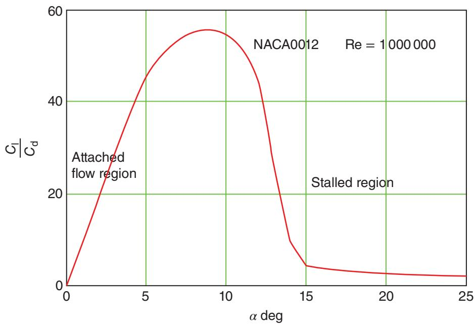

line

| α deg | G | G₀ |
|-------|---|---|
| 0     | 0 | 0 |
| 5     | ~45 | ~45 |
| 10    | ~55 | ~55 |
| 15    | ~5 | ~5 |
| 20    | ~3 | ~3 |
| 25    | ~2 | ~2 |

Figure A3.15 Lift/drag ratio variation for the NACA0012 aerofoil.

The efrciency of a wind turbine rotor blade is signircantly affected by the lift/drag ratio of its aerofoil section(s) (as shown in Figure A3.15), and it is desirable that a turbine blade operates at the maximum ratio point.

The nature of the sow pattern around an aerofoil is determined by the Reynolds number, and this affects the values of the lift and drag coefrcients. The general level of the drag coefrcient increases with decreasing Reynolds number. The effect on the lift coefrcient is largely concerned with the angle of attack at which stall occurs. Below a critical Reynolds number of about 200 000, the boundary layer remains laminar, usually leading to early stall or partial separation (long bubbles) at low angles of attack.. As the Reynolds number rises, so does the stall angle and, because the lift coefrcient increases linearly with angle of attack below the stall, the maximum value of the lift coefrcient also rises.

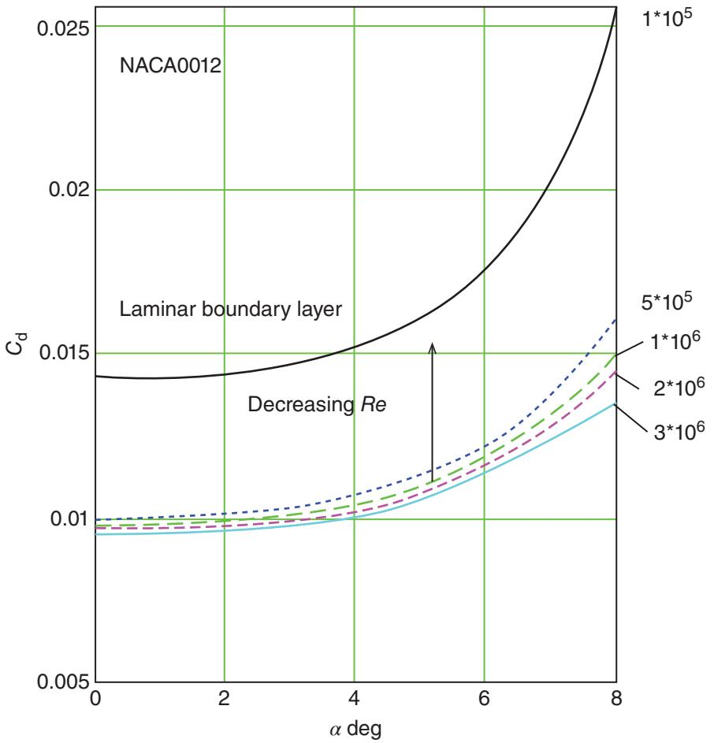

line

| α deg | Cd (1*10^5) | Cd (5*10^5) | Cd (1*10^6) | Cd (2*10^6) | Cd (3*10^6) |
|-------|-------------|-------------|-------------|-------------|-------------|
| 0     | 0.014       | 0.010       | 0.010       | 0.010       | 0.010       |
| 2     | 0.014       | 0.010       | 0.010       | 0.010       | 0.010       |
| 4     | 0.015       | 0.011       | 0.011       | 0.011       | 0.011       |
| 6     | 0.018       | 0.013       | 0.013       | 0.013       | 0.013       |
| 8     | 0.025       | 0.016       | 0.015       | 0.014       | 0.013       |

Figure A3.16 Variation of the drag coefrcient with Reynolds number at low angles of attack.

Characteristics for the NACA0012 aerofoil are shown in Figures A3.16 and A3.17.

# A3.8.2 Cambered aerofoils

Cambered aerofoils, such as the NACA4412 shown in Figure A3.18, like cambered plates have curved mean lines, and this allows them to produce lift at zero angle of attack.

Generally, cambered aerofoils have their minimum drag range (drag bucket) at angles of attack well above zero. Thus, they are able to attain higher maximum lift/drag ratios than symmetrical aerofoils for positive angles of attack and useful lift coefrcients, and this is the reason for their use.

The classircation of the NACA four-digit range of aerofoils, which were commonly used on earlier wind turbines, is very simple and is illustrated in Figure A3.19: from left to right, the rrst digit represents the amount of camber as a percentage of the chord length, the second digit represents the percentage chord position, in units of 10%, at which the maximum camber occurs, and the last two digits are the maximum thickness to chord ratio, as a percentage of the chord length, which, in this family of aerofoils, is at the 30% chord position. The cambered mean line, called the camber line, comprises two parabolic arcs that join smoothly at the point of maximum camber. For details of the extensive range of rve- and six-digit NACA aerofoils the reader should refer to Theory of Wing Sections by Abbott and von Doenhoff (1959).

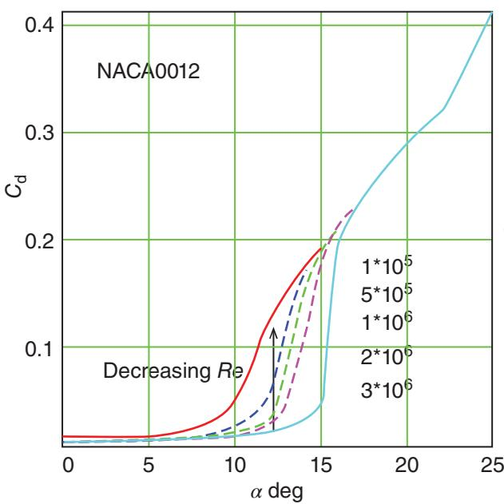

line

| α deg | C_d (Decreasing Re) | C_d (1*10^5) | C_d (5*10^5) | C_d (1*10^6) | C_d (2*10^6) | C_d (3*10^6) |
|-------|---------------------|--------------|--------------|--------------|--------------|--------------|
| 0     | 0.0                 | 0.0          | 0.0          | 0.0          | 0.0          | 0.0          |
| 5     | 0.0                 | 0.0          | 0.0          | 0.0          | 0.0          | 0.0          |
| 10    | 0.0                 | 0.0          | 0.0          | 0.0          | 0.0          | 0.0          |
| 15    | 0.2                 | 0.2          | 0.2          | 0.2          | 0.2          | 0.2          |
| 20    | 0.3                 | 0.3          | 0.3          | 0.3          | 0.3          | 0.3          |
| 25    | 0.4                 | 0.4          | 0.4          | 0.4          | 0.4          | 0.4          |

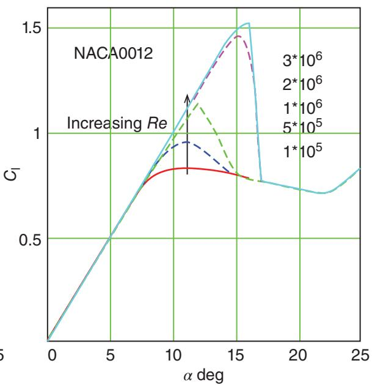

line

| α deg | G⁻ (NACA0012) | G⁻ (Increasing Re) |
|-------|---------------|--------------------|
| 0     | 0.0           | 0.0                |
| 5     | 0.5           | 0.5                |
| 10    | 1.0           | 1.0                |
| 15    | 1.5           | 0.8                |
| 20    | 0.7           | 0.7                |
| 25    | 0.8           | 0.8                |

Figure A3.17 Variation of the drag and lift coefrcients with Reynolds number in the stall region.

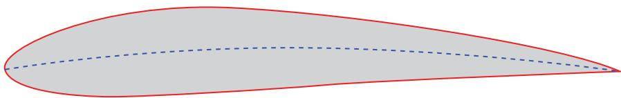

natural_image

Abstract geometric shape with solid red outline and dashed blue line (no text or symbols)

Figure A3.18 The prorle of the NACA4412 aerofoil.

The angle of attack 훼 is measured from the chord line, which is now derned as the straight line joining the ends of the camber line.

Note that the lift at zero angle of attack is no longer zero; zero lift occurs at a small negative angle of attack. With most cambered aerofoils, the zero lift angle in degrees is approximately equal to -A∘ , where A is the percentage camber.

The behaviour of the NACA4412 aerofoil is shown in Figure A3.20 for angles of attack below and just above the stall. Positive lift occurs at zero angle of attack. Zero lift occurs at a small negative angle of attack of approximately −4∘.

The centre of pressure (i.e. the point at which the lift acts), which is at the quarter-chord position on symmetrical aerofoils, lies aft of the quarter-chord position on cambered aerofoils and moves towards the leading edge with increasing angle of attack until the stall. After the stall the centre of pressure on all aerofoils moves rearward towards the midchord. However, if forces are evaluated with reference to a rxed chordwise position, then the resultant force through this point is accompanied by a pitching moment about this point (nose-up positive, by convention). The reference point is usually the quarter-chord point (c/4 back from the leading edge), but sometimes it is the midchord and sometimes the torsion axis of the section. If a pitching moment

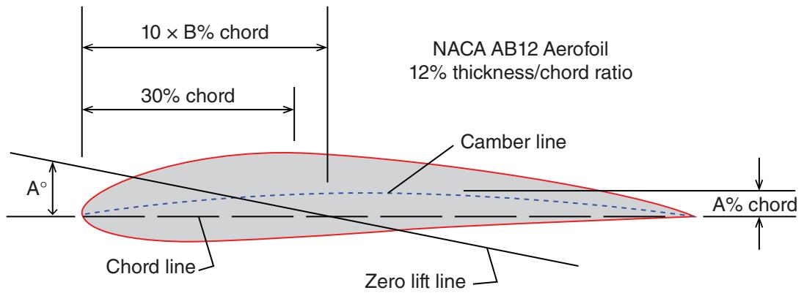

text_image

10 × B% chord
30% chord
NACA AB12 Aerofoil
12% thickness/chord ratio
A°
Chord line
Camber line
Zero lift line
A% chord

Figure A3.19 Classircation of the NACAXXXX aerofoil range.

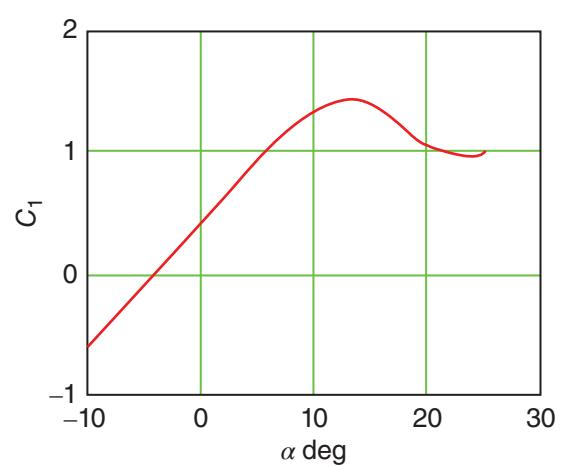

line

| α deg | C⁻     |
| ----- | ------ |
| -10   | -0.8   |
| 0     | 0.0    |
| 10    | 1.3    |
| 20    | 1.0    |
| 30    | 0.9    |

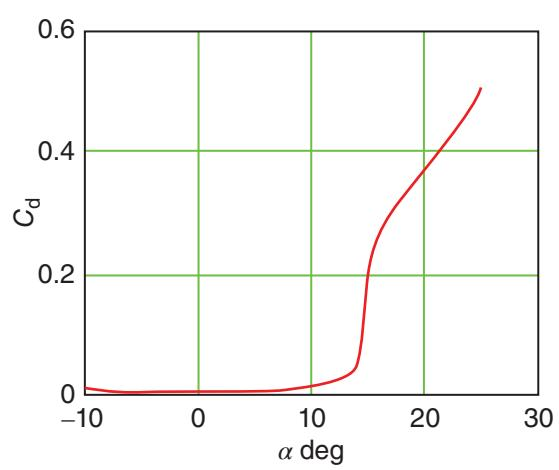

line

| α deg | C_d  |
| ----- | ---- |
| -10   | 0.0  |
| 0     | 0.0  |
| 10    | 0.0  |
| 15    | 0.25 |
| 20    | 0.4  |
| 25    | 0.5  |

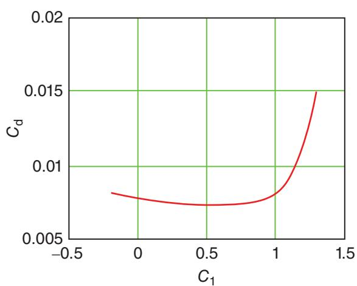

line

| C₁    | C_d    |
| ------ | ------ |
| -0.5   | 0.008  |
| 0      | 0.0075 |
| 0.5    | 0.007  |
| 1      | 0.008  |
| 1.5    | 0.015  |

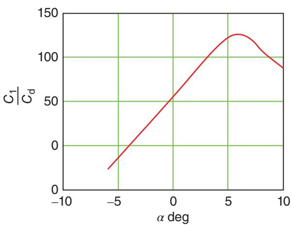

line

| α deg | C₁/C_d |
| ----- | ------ |
| -5    | 0      |
| 0     | 50     |
| 5     | 125    |
| 10    | 90     |

Figure A3.20 The characteristics of the NACA4412 aerofoil for $R e = { I . S } { \cdot } { I 0 ^ { 6 } }$ .

coefrcient is derned as

$$
C _ {m} = \frac {\text { Pitching   /   unitspan }}{\frac {1}{2} \rho U ^ {2} c ^ {2}} \tag {A3.8}
$$

then there will be a position, called the aerodynamic centre, for which dCm = 0. Theoret- $\begin{array} { r } { \frac { d C _ { m } } { d C _ { l } } = 0 } \end{array}$ ically, the aerodynamic centre lies at the quarter-chord position and is close to this point for most practical aerofoils.

The value of $C _ { m }$ depends upon the degree of camber, but for the NACA4412 the value is −0.1. Note that pitching moments are always negative in practice (nose down) despite the sign convention.

Above the stall the pre-stall position of the aerodynamic centre usually continues to be used, although no longer satisfying the above dernition.