# Further aerodynamic topics for wind turbines

# 4.1 Introduction

Chapter 3 deals with the aerodynamic behaviour of wind turbines in steady wind conditions and with the rotor aligned with the wind direction but, of course, in reality wind turbine rotors operate imperfectly aligned with the wind direction, usually having nose-up tilt for tower clearance and some yaw because the rotor does not follow the wind direction instantaneously as it veers. Chapter 4 deals with rotor–wind misalignment and also with unsteady aerodynamics of the rotor resulting from this misalignment and from other effects that cause rapid changes in the sow conditions. Included in this is the phenomenon of dynamic stall of the blades. The rnal section of Chapter 4 introduces computational suid dynamics (CFD) as a predictive tool for wind turbine aerodynamics.

# 4.2 The aerodynamics of turbines in steady yaw

The rotor axis of a wind turbine rotor is usually not aligned with the wind, as shown in Figure 4.1, because the wind is continuously changing direction. To follow the veering of the wind without imposing excessive accelerations, the yaw control system has a relatively long time constant so that the rotor direction typically lags the wind direction by a few degrees. The yawed rotor is less efrcient than the non-yawed rotor and is subject to increased unsteady loading, so it is vital to assess the effects of yaw for purposes of energy production and loads estimation.

In the yawed condition, even in a steady wind, the angle of attack on each blade is continuously changing as it rotates, and so the loads on the rotor blades are suctuating, causing fatigue damage.

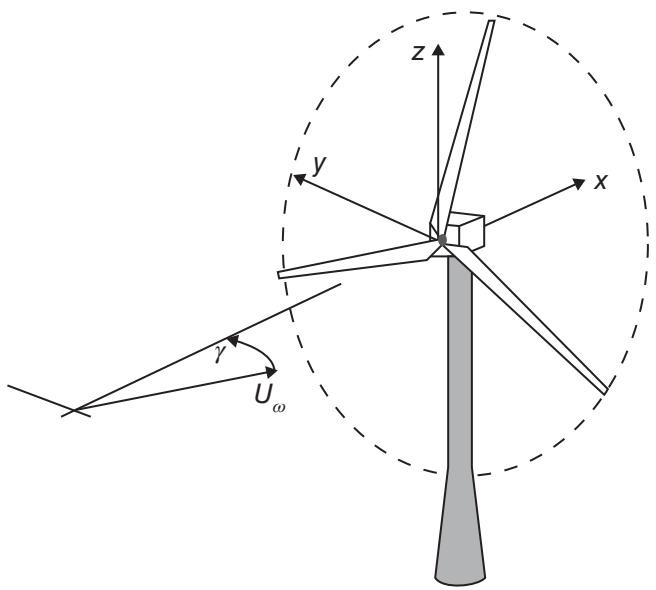

text_image

z
y
x
γ
Uω

Figure 4.1 A wind turbine yawed to the wind direction.

The changes in angle of attack mean that the blade forces cause not only a thrust in the axial direction but also moments about the yaw (z) axis and the tilt axis.

Even if the rotor is operating with a uniform induced velocity over the rotor disc when aligned with a steady wind, once the rotor is mis-aligned the induced velocity varies both azimuthally and radially, which makes its determination much more difrcult.

# 4.2.1 Momentum theory for a turbine rotor in steady yaw

The application of the momentum theory to an actuator disc representing a yawed rotor is somewhat problematical. The momentum theory is only capable of determining an average induced velocity for the whole rotor disc because it is based on a momentum balance between the rotor and the far wake, which can only be satisred in an average sense, but in the yawed case the blade circulation is also continuously changing with azimuth position. If it is assumed that the force on the rotor disc, which is a pressure force and so normal to the disc, is responsible for the rate of change of momentum of the sow, then the average induced velocity must also be in a direction at right angles to the disc plane, i.e. in the axial direction. The wake is therefore desected to one side because a component of the induced velocity is at right angles to the wind direction. As in the non-yawed case, ignoring effects of wake expansion, the average induced velocity at the disc is half that in the wake.

Let the rotor axis be held at an angle of yaw 훾 to the steady wind direction (Figure 4.2). Then, assuming that the rate of change of momentum in the axial direction is equal to the mass sow rate through the rotor disc times the change in velocity normal to the plane of the rotor,

$$
T = \rho A _ {D} U _ {\infty} (\cos \gamma - a) 2 a U _ {\infty} \tag {4.1}
$$

Therefore, the thrust coefrcient is

$$
C _ {T} = 4 a (\cos \gamma - a) \tag {4.2}
$$

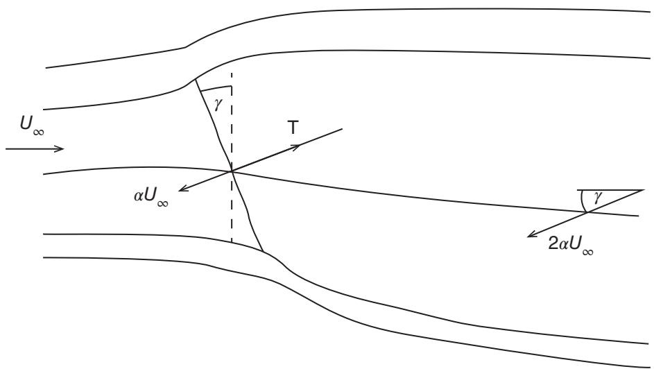

text_image

U∞
γ
T
αU∞
γ
2αU∞

Figure 4.2 Desected wake of a yawed turbine and induced velocities.

and the power developed is $T \ U _ { \infty } ( \cos \gamma - a )$ :

$$
C _ {P} = 4 a (\cos \gamma - a) ^ {2} \tag {4.3}
$$

To rnd the maximum value of $C _ { P } ,$ , differentiate Eq. (4.3) with respect to a and set equal to zero, whence

$$
a = \frac {\cos \gamma}{3} \text { and } C _ {P \max} = \frac {1 6}{2 7} \cos^ {3} \gamma \tag {4.4}
$$

This $\cos ^ { 3 } \gamma$ rule is commonly adopted for power assessment in yawed sow. Figure 4.3 shows decrease in power as the yaw angle increases.

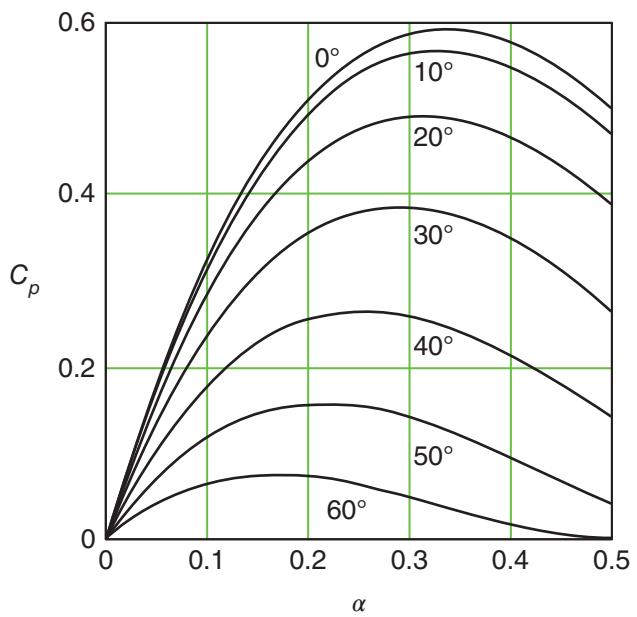

line

| α    | 0°    | 10°   | 20°   | 30°   | 40°   | 50°   | 60°   |
|------|-------|-------|-------|-------|-------|-------|-------|
| 0.0  | 0.000 | 0.000 | 0.000 | 0.000 | 0.000 | 0.000 | 0.000 |
| 0.1  | 0.350 | 0.380 | 0.420 | 0.450 | 0.480 | 0.520 | 0.550 |
| 0.2  | 0.550 | 0.580 | 0.620 | 0.650 | 0.680 | 0.720 | 0.750 |
| 0.3  | 0.620 | 0.650 | 0.680 | 0.720 | 0.750 | 0.780 | 0.820 |
| 0.4  | 0.580 | 0.620 | 0.650 | 0.680 | 0.720 | 0.750 | 0.780 |
| 0.5  | 0.520 | 0.580 | 0.620 | 0.650 | 0.680 | 0.720 | 0.750 |

Figure 4.3 Power coefrcient variation with yaw angle and axial sow factor.

A question remains: is it legitimate to apply the momentum theory in the above manner to the yawed rotor? Transverse pressure gradients that cause the wake to skew sideways may well also contribute to the net force on the sow in the axial direction, insuencing the axial induced velocity. The above analysis might be satisfactory for determining the average axial induced velocity, but there is even less justircation to apply the momentum theory to each blade element position than there is in the non-yawed case. If a theory is going to be of any use in design it must be capable of determining the induced velocity at each blade element position to a satisfactory accuracy. The satisfactory calculation of blade forces is as important as the estimation of power.

# 4.2.2 Glauert’s momentum theory for the yawed rotor

Glauert (1926) was primarily interested in the autogyro, which is an aircraft with a freely windmilling rotor to provide lift and a conventional propeller to provide forward thrust. The lifting rotor has a rotational axis that inclines backwards from the vertical, and by virtue of the forward speed of the aircraft, air sows through the rotor disc, causing it to rotate and to provide an upward thrust. Thus, the autogyro rotor is just like a wind turbine rotor in yaw, when in forward sight. At high forward speeds, the yaw angle is large, but in a power-off vertical descent, the yaw angle is zero.

Glauert maintained that at high forward speed the rotor disc, which is operating at a high tip speed ratio, is like a wing of circular plan-form at a small angle of attack (large yaw angle), and so the thrust on the disc is the lift on the circular wing. Simple lifting line wing theory (see Prandtl and Tietjens 1957) gives the result that the down-wash at the wing (equivalent to the induced velocity at a rotor), caused by the trailing vortex system, is uniform over the wing span (transverse diameter of the disc) for an untwisted wing with an elliptical plan-form, and this would include the circular plan-form of the autogyro rotor.

The theory gives the uniform (average) induced velocity as

$$
u = \frac {2 L}{\pi (2 R) ^ {2} \rho V} \tag {4.5}
$$

where L is the lift and V is the forward speed of the aircraft.

The lift acts in a direction normal to the effective incident velocity W (see Figure 4.4) and so is not vertical but inclined backwards, the inclination being due to the inclination of the relative velocity W downwards by the wake-induced velocity u. The vertical component of the lift supports the weight of the aircraft, and the horizontal component generates induced drag. In horizontal sight the vertical component of the lift does no work, but the induced drag does do work.

The vector triangles of Figure 4.4 show that

$$
D / L = u / W \tag {4.6}
$$

The induced velocity $u _ { \mathrm { w } }$ in the far wake of the aircraft caused by the trailing vortices is greater than that at the rotor. A certain mass sow rate of air, $\rho V S _ { \mathrm { { i } } }$ , passing through the rotor system, where S is an area yet to be determined that is normal to the incident velocity V, undergoing a downward change in velocity of $u _ { w }$ in the far wake, may be considered as representative of the varying downsow induced on the whole airstream affected by the rotor. Noting that the lift vector L in Figure 4.4 is normal to the deTected velocity W and therefore inclined from the vertical by an angle $c o s ^ { - I } ( V / W )$ , equating the vertical force by the momentum theory to the rate of change of downward momentum, therefore,

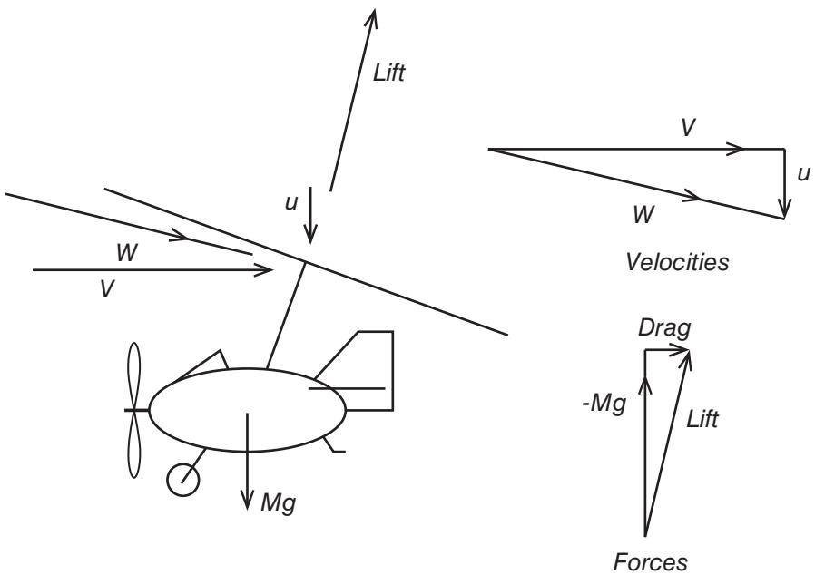

flowchart

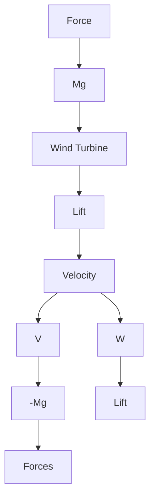
```mermaid
graph TD
    A["Force"] --> B["Mg"]
    B --> C["Wind Turbine"]
    C --> D["Lift"]
    D --> E["Velocity"]
    E --> F["V"]
    E --> G["W"]
    F --> H["-Mg"]
    G --> I["Lift"]
    H --> J["Forces"]
```

Figure 4.4 Velocities and lift and induced drag forces on an autogyro in fast forward sight.

$$
(V / W) L = \rho V S u _ {w} \tag {4.7}
$$

Using this representation, the rate of work done by the drag DV must be equal to the rate at which kinetic energy is created in the wake $\begin{array} { r } { \frac { 1 } { 2 } \rho { u _ { w } } ^ { 2 } V S } \end{array}$ , because the ambient static pressure in the wake of the aircraft is the same as the pressure ahead of the aircraft:

$$
D V = \frac {1}{2} \rho u _ {w} ^ {2} V S \tag {4.8}
$$

Combining Eqs. (4.6)–(4.8) gives

$$
D = \frac {L ^ {2}}{2 \rho V ^ {2} S} \tag {4.9}
$$

and shows that

$$
u _ {w} = 2 u \tag {4.10}
$$

Equation (4.10) is the same relationship as occurs for non-yawed rotors. Combining Eq. (4.5), the lifting line theory’s assessment of the induced velocity at the rotor, with Eq. (4.6) gives

$$
D = \frac {2 L ^ {2}}{\rho V ^ {2} \pi (2 R) ^ {2}} \tag {4.11}
$$

Comparing Eqs. (4.9) and (4.11) leads to an estimate of the effective area S:

$$
S = \pi R ^ {2} \tag {4.12}
$$

where S has the same area as the rotor disc but is normal to the sight direction.

Note that the above analysis has been simplired by assuming that the angle of attack is small. This model is very much simplired, not only assuming a small angle of attack but also ignoring other small effects such as that the trailing vortices from the rotor are insuenced by their own induced velocity and so trail downwards behind the rotor. The drag is termed induced drag as it comes about by the backward tilting of the lift force caused by the induced velocity and has nothing to do with viscosity; it is entirely a pressure drag. Because u is small, the angle between V and W is small, and Eq. (4.5) can therefore be modired to replace V by W, the resultant velocity at the disc, and the area S will be in a plane normal to W. Also, W has a direction that lies close to the plane of the rotor, and so the lift force L will be almost the same as the thrust force T, which is normal to the plane of the rotor. By the same argument, the induced velocity is almost normal to the plane of the rotor, and therefore from Eq. (4.5):

$$
u = \frac {2 T}{\pi \rho W (2 R) ^ {2}} \tag {4.13}
$$

It can be assumed that a wind turbine rotor at high angles of yaw behaves just like the autogyro rotor.

At zero yaw the thrust force on the wind turbine rotor disc, given by the momentum theory, is

$$
T = \pi R ^ {2} \frac {1}{2} \rho 4 u (U _ {\infty} - u) \tag {4.14}
$$

where wind speed $U _ { \infty }$ now replaces aircraft speed V, so the induced velocity is

$$
u = \frac {2 T}{\pi \rho (U _ {\infty} - u) (2 R) ^ {2}} \tag {4.15}
$$

The area S now coincides with the rotor disc area.

Putting $W = U _ { \infty } - u$ to represent the resultant velocity of the sow at the disc in Eq. (4.15) gives exactly the same equation as (4.13), which is for a large angle of yaw. On the basis of this argument, Glauert assumed that Eq. (4.13), which is the simple momentum theory, could be applied at all angles of yaw, taking the effective area S through which the mass sow rate is determined, always lying in a plane normal to the resultant velocity as $S = \pi R ^ { 2 }$ . This dernition of the area S is a crucially different assumption to that of the theory of Section 4.2.1 (which will now be referred to as the axial momentum theory) and allows for part of the thrust force to be attributable to an overall lift on the rotor disc.

Thus

$$
T = \rho \pi R ^ {2} 2 u W \tag {4.16}
$$

where

$$
W = \sqrt {U _ {\infty} ^ {2} \sin^ {2} \gamma + (U _ {\infty} \cos \gamma - u) ^ {2}} \tag {4.17}
$$

Thrust is equal to the mass sow rate times the change in velocity in the direction of the thrust. Both T and u are assumed to be normal to the plane of the disc.

The thrust coefrcient is then

$$
C _ {T} = 4 a \sqrt {1 - a (2 \cos \gamma - a)} \tag {4.18}
$$

The power developed is a scalar quantity and can be evaluated from the scalar product of the thrust force vector and the resultant velocity vector W at the disc. Hence, the power coefrcient is

$$
C _ {P} = 4 a (\cos \gamma - a) \sqrt {1 - a (2 \cos \gamma - a)} \tag {4.19}
$$

Equation (4.19) gives a slightly larger value of $C _ { \mathrm { P } }$ than Eq. (4.3). However, the formulation ignores the components of force and velocity in the plane of the disc, which are in opposite directions and hence imply that the true power is slightly less. It does include a contribution from the lift on the rotor disc acting as on a circular wing that does not extract power from the wind being normal to the modired wind direction W at the disc. Consequently, the axial momentum theory, Eq. (4.3), is more likely to estimate the power extraction correctly, whereas Eq. (4.18) is more likely to estimate the thrust correctly.

The induced velocity through the rotor disc is not uniform, due to the varying streamwise distance between front and back, and this was predicted by Glauert’s autogyro theory. The sow through the yawed rotor is depicted in Figure 4.5, and a simplircation of the contributions to the velocity normal to the plane of the rotor along the rotor diameter parallel to the sight direction is shown. The mean induced velocity through the rotor, as determined by Eq. (4.13), is shown as $u _ { 0 }$ , the normal component of the forward velocity of the aircraft is $U _ { \infty }$ cos $\gamma ,$ , also uniform over the disc, but, to account for the sow pattern shown, there needs to be a non-uniform component that decreases the normal induced velocity at the leading edge of the rotor disc and increases it at the rear. From symmetry, the induced velocity along the disc diameter normal to the sight direction (normal to the plane of the diagram) is uniform. The simplest form of the non-uniform component of induced velocity would be

$$
u _ {1} (r, \psi) = u _ {1} \frac {r}{R} \sin \psi \tag {4.20}
$$

where 휓 is the blade azimuth angle measured in the direction of rotation, $0 ^ { \circ }$ being when the blade is normal to the sight direction (or when the wind turbine blade is vertically upwards), and $u _ { 1 }$ is the amplitude of the non-uniform component, which is dependent on the yaw angle. There would, of course need to be induced velocities parallel to the plane of the rotor disc, but these are of secondary importance; the normal induced velocity has a much greater insuence on the blade angle of attack than the in-plane component and therefore a much greater insuence on blade element forces.

The value of $u _ { 1 }$ in Eq. (4.20) cannot be determined from momentum theory, but Glauert suggested that it would be of the same order of magnitude as $u _ { 0 }$ . The total induced velocity, normal to the rotor plane, may then be written as

$$
u = u _ {0} \left(1 + K \frac {r}{R} \sin \psi\right) \tag {4.21}
$$

The value of K must depend upon the yaw angle.

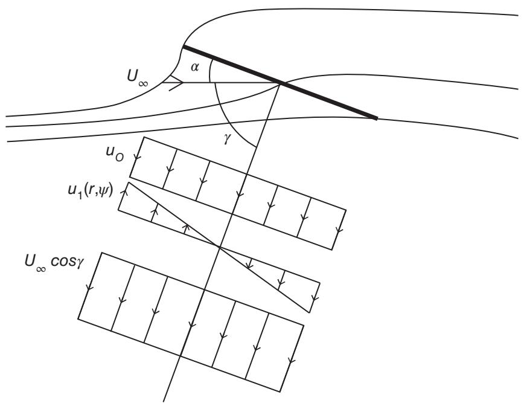

text_image

U∞
α
γ
uO
u1(r,ψ)
U∞ cosγ

Figure 4.5 Velocities normal to the yawed rotor.

# 4.2.3 Vortex cylinder model of the yawed actuator disc

The vortex theory for the non-yawed rotor given in Section 3.4 is demonstrated to be equivalent to the momentum theory in its main results but, in addition, was shown to give much more detail about the sow reld. As the momentum theories of Sections 4.2.1 and 4.2.2 yield very limited results, using the vortex approach for the yawed rotor may also prove to be useful, giving more sow structure detail than the momentum theory and, perhaps, a means of allying it with the blade element theory.

The wake of a yawed rotor is skewed to one side because the thrust T on the disc is normal to the disc plane and so has a component normal to the sow direction. The force on the sow therefore is in the opposite sense to T, causing the sow to decelerate upwind and also desect (i.e. accelerate) sideways. The centre line of the wake will be at an angle 휒 to the axis of rotation (axis normal to the disc plane), known as the wake skew angle. The skew angle will be greater than the yaw angle. The same basic theory as in Section 3.4 can be carried out for an actuator disc with a wake skewed to the rotor axis by an angle 휒. There is an important proviso, however, that to be consistent with the simple model in which all of the vorticity shed into the wake is in a sheet on its outer boundary and in a line along its axis, the bound circulation on the rotor disc must be assumed to be radially and azimuthally uniform. As will be demonstrated, the angle of attack of the blades is changing cyclically, and so it would be impossible for the uniform circulation condition ever to be valid. What must be assumed is that the variation of circulation around a mean value has but a small effect on the induced velocity, and the wake is therefore dominated by the vorticity shed from the blade tips by the mean value of circulation (see Figure 4.6).

The expansion of the wake again imposes a difrculty for analysis and so, as before, it will be ignored (Figure 4.7).

The analysis of the yawed rotor was rrst carried out for purposes of understanding a helicopter rotor in forward sight by Coleman et al. (1945), but it can readily be applied to a wind turbine rotor by reversing the signs of the circulation and the induced velocities. An inrnite number of blades is assumed as in the analysis of Section 3.4. The vorticity $g _ { \psi }$ in the $\psi$ direction where $\psi$ is the azimuthal angle remains parallel to the yawed disc, and assuming it to be uniform (not varying with the azimuth angle), using the Biot–Savart law, induces an average velocity at the disc of $a U _ { \infty }$ sec $\frac { \chi } { 2 }$ in a direction that bisects the skew angle, as shown in Figure 4.8. The average axial induced velocity, normal to the rotor plane, is $a U _ { \infty } .$ , as in the non-yawed case. In the fully developed wake, the induced velocity is twice that at the rotor disc.

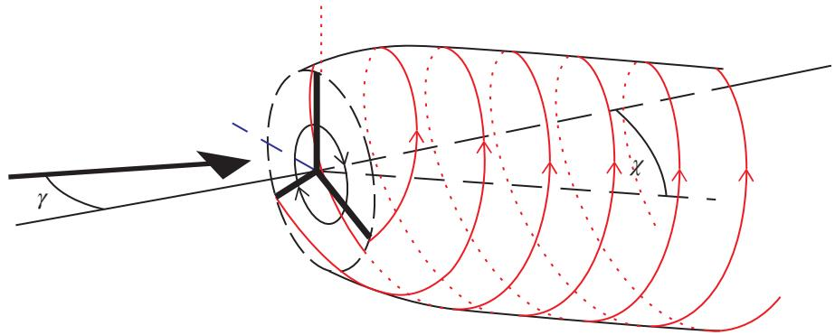

text_image

Diagram illustrating a 3D geometric or vector field with labeled axes (x, y, z) and directional arrows, likely from a mathematical or physics context.

Figure 4.6 The desected vortex wake of a yawed rotor showing the shed vortices of three blades.

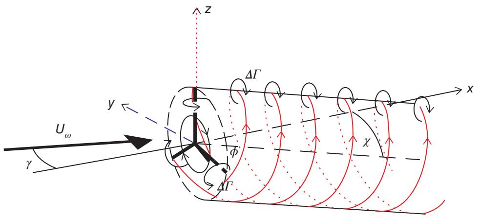

text_image

Uω
y
z
ΔΓ
x
φ
ΔΓ
γ
x

Figure 4.7 A yawed rotor wake without wake expansion.

Because the average induced velocity at the disc is not in the rotor’s axial direction, as is assumed for the momentum theory of Sections 4.2.1 and 4.2.2, the force T on the disc, which must be in the axial direction, cannot be solely responsible for the overall rate of change of momentum of the sow; there is a change of momentum in a direction normal to the rotor axis.

The velocity components normal and in-plane at the rotor disc derne the skew angle:

$$
\tan \chi = \frac {2 \tan \frac {\chi}{2}}{1 - \tan^ {2} \frac {\chi}{2}} = \frac {U _ {\infty} (\sin \gamma - a \cdot \tan \frac {\chi}{2})}{U _ {\infty} (\cos \gamma - a)} \tag {4.22}
$$

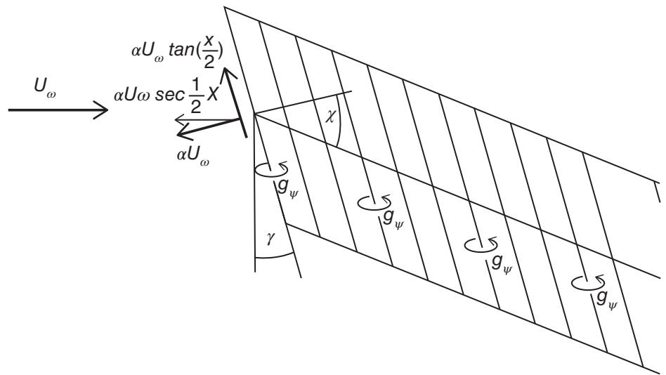

text_image

U_ω → αU_ω tan(χ/2)
αUω sec 1/2 X
αU_ω
g_ψ
γ
x
g_ψ
g_ψ
g_ψ

Figure 4.8 Plan view of yawed actuator disc and the skewed vortex cylinder wake.

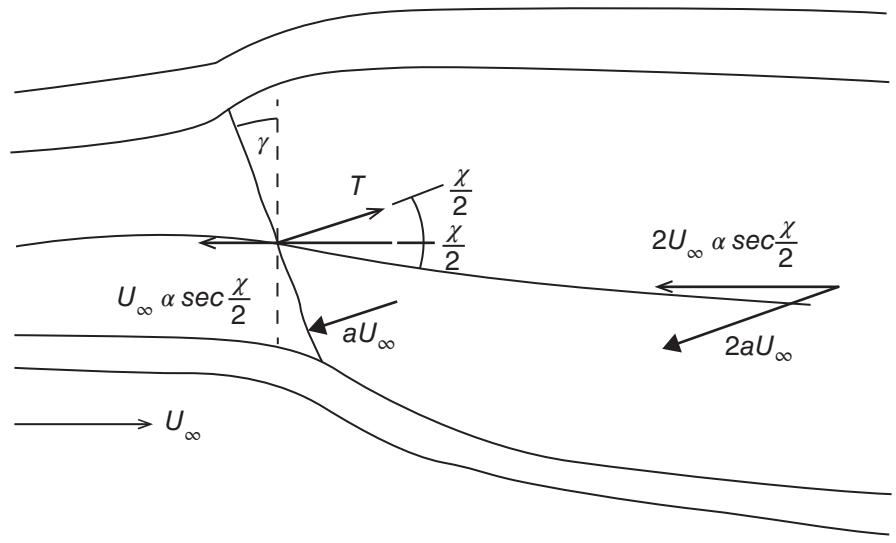

text_image

γ
T
χ/2
χ/2
U∞ α sec χ/2
aU∞
2U∞ α sec χ/2
2aU∞
U∞

Figure 4.9 Average induced velocities caused by a yawed actuator disc.

From which it can be shown that a close, approximate relationship between $\chi , \gamma$ , and a is

$$
\chi = (0. 6 a + 1) \gamma \tag {4.23}
$$

Using the velocities shown in Figure 4.9, a fresh analysis can be made of the sow. The average force on the disc can be determined by applying Bernoulli’s equation to both the upwind and downwind regions of the sow, subscript D denoting conditions at the disc:

Upwind

$$
p _ {\infty} + \frac {1}{2} \rho U _ {\infty} ^ {2} = p _ {D} ^ {+} + \frac {1}{2} \rho U _ {D} ^ {2}
$$

Downwind

$$
p _ {D} ^ {-} + \frac {1}{2} \rho U _ {D} ^ {2} = p _ {\infty} + \frac {1}{2} \rho U _ {\infty} ^ {2} \left[ (\cos \gamma - 2 a) ^ {2} + \left(\sin \gamma - 2 a \tan \frac {\chi}{2}\right) ^ {2} \right]
$$

where $U _ { D }$ is the resultant velocity at the disc.

Subtracting the two equations to obtain the pressure drop across the disc,

$$
p _ {D} ^ {+} - p _ {D} ^ {-} = \frac {1}{2} \rho U _ {\infty} ^ {2} 4 a \left(\cos \gamma + \tan \frac {\chi}{2} \sin \gamma - a \sec^ {2} \frac {\chi}{2}\right)
$$

The coefrcient of thrust on the disc is, therefore,

$$
C _ {T} = 4 a \left(\cos \gamma + \tan \frac {\chi}{2} \sin \gamma - a \sec^ {2} \frac {\chi}{2}\right) \tag {4.24}
$$

and the power coefrcient is

$$
C _ {P} = 4 a (\cos \gamma - a) \left(\cos \gamma + \tan \frac {\chi}{2} \sin \gamma - a \sec^ {2} \frac {\chi}{2}\right) \tag {4.25}
$$

In a similar manner to the Glauert theory, it is not clear how much of the thrust in Eq. (4.24) is capable of extracting energy from the sow, and so the expression for power in Eq. (4.25) will probably be an overestimate. A comparison of the maximum $C _ { P }$ values derived from the three theories, as a function of the yaw angle, is shown in Figure 4.10.

# 4.2.4 Flow expansion

The averaged induced velocity component parallel to the axis of the disc has value a $U _ { \infty }$ , as shown in Figure 4.9. The horizontal component of the induced velocity in the plane of the disc is also uniform over the area of the disc with a value a $U _ { \infty }$ tan $\frac { \chi } { 2 }$ .

In addition to the velocities induced by the cylindrical wake model of Figure 4.9, the expansion of the sow gives rise to velocities in the y and z directions (i.e. directions in a plane normal to the wake axis and therefore at the skew angle $\chi$ to the rotor plane; see Figure 4.11). When resolved into the rotor plane, a component of the sow expansion velocities will give rise to a non-uniform normal induced velocity of the type predicted by Glauert in Eq. (4.21). It should be noted that while wake-induced velocity u is conventionally positive when directed as usual upstream, the convention for perturbation velocities u, v, w as in the following analysis is to follow the sign convention of the incident velocity reld, and in particular axial perturbation velocities $u , u ^ { \prime \prime }$ , etc. are positive in the downstream direction.

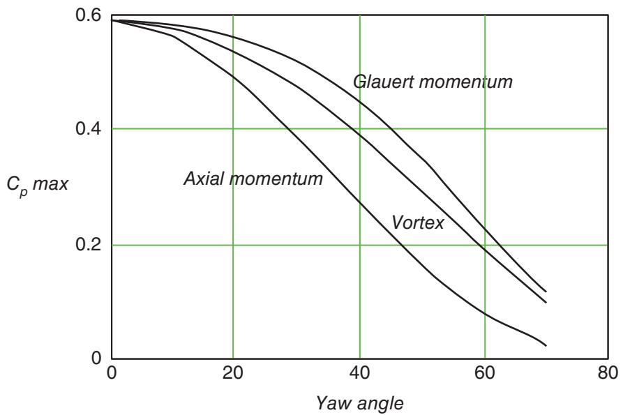

line

| Yaw angle | Glauert momentum | Axial momentum | Vortex |
| --------- | ---------------- | -------------- | ------ |
| 0         | 0.6              | 0.6            | 0.6    |
| 20        | ~0.55            | ~0.5           | ~0.45  |
| 40        | ~0.45            | ~0.35          | ~0.25  |
| 60        | ~0.3             | ~0.15          | ~0.1   |
| 70        | ~0.2             | ~0.1           | ~0.05  |

Figure 4.10 Maximum power coefrcient variation with yaw angle, comparison of momentum, and vortex theories.

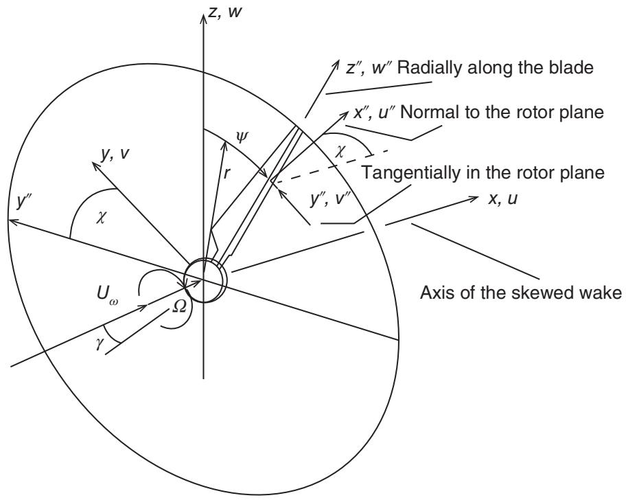

text_image

z, w
z", w" Radially along the blade
x", u" Normal to the rotor plane
x
Tangentially in the rotor plane
y", v"
x, u
y, v
ψ
r
Uω
Ω
γ
Axis of the skewed wake

Figure 4.11 Axis system for a yawed rotor.

At a point on the disc at radius r and azimuth angle 휓, derned in Figure 4.11, the induced sow expansion velocities are non-simple functions of r and $\psi .$ . Across the horizontal diameter, where $\psi = \pm 9 0 ^ { o }$ , Coleman et al. obtained an analytical solution for the sow expansion velocity in the y direction that involves complete elliptic integrals: the solution is not very practicable because numerical evaluation requires calculating the difference between two large numbers. Simplircation of the analytical solution leads to the following expression for the horizontal sow expansion velocity that removes the evaluation difrculty but is not in closed form:

$$
\begin{array}{l} v (\chi , \psi , \mu) \\ = \frac {- 2 a U _ {\infty} \mu \sin \psi}{\pi} \int_ {0} ^ {\frac {\pi}{2}} \frac {\sin^ {2} 2 \varepsilon}{\sqrt {(1 + \mu) ^ {2} - 4 \mu \sin^ {2} \varepsilon}} \frac {1}{(\mu + \cos 2 \varepsilon) ^ {2} \cos^ {2} \chi + \sin^ {2} 2 \varepsilon} d \varepsilon \tag {4.26} \\ \end{array}
$$

whe $\begin{array} { r } { \mu = \frac { r } { R } , \varepsilon } \end{array}$ is the integration variable for the dernite (elliptic) integral that arises, and $a U _ { \infty }$ is the average induced velocity as previously derned. An important feature of Eq. (4.26) is that the sow expansion velocity is proportional to the average axial sow induction factor and varies sinusoidally with azimuth angle 휓. Furthermore, if Eq. (4.26) is divided by $s e c ^ { 2 } { \frac { \chi } { 2 } }$ , the result is almost independent of the skew angle $\chi .$ . Let aU∞sec2 휒2 sin 휓 $\frac { v ( \chi , \psi , \mu } { a U _ { \infty } s e c ^ { 2 } { \frac { \chi } { \gamma } } }$ ) be derned as the sow expansion function $F ( \mu )$ , which is shown in Figure 4.12, clearly demonstrating how little $F ( \mu )$ changes over a range of skew angles from $0 ^ { \circ }$ to ${ { 6 0 } ^ { \circ } }$ .

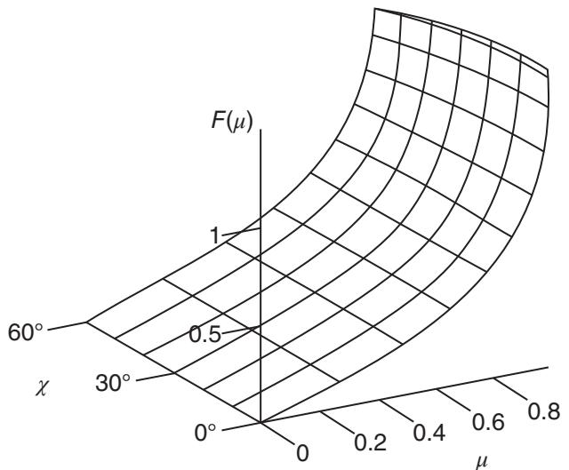

text_image

F(μ)
1
60°
0.5
30°
0°
0
0.2
0.4
0.6
0.8
μ
χ

Figure 4.12 Flow expansion function variation with radial position and skew angle.

At all skew angles, the value of the sow expansion function is inrnite at the edge of the rotor disc, indicating a singularity in the sow that, of course, does not occur in practice but is a result of assuming uniform blade circulation. Circulation must fall to zero at the disc edge in a smooth fashion.

No analytical expressions for the sow expansion velocity components for values of 휓 other than $\pm 9 0 ^ { \circ }$ were developed by Coleman et al., but numerical evaluations of the sow expansion velocities can be made using the Biot–Savart law.

The radial variation of the vertical sow expansion velocity across the vertical diameter of the rotor disc is much the same as $F ( \mu )$ for skew angles between $\pm 4 5 ^ { \circ }$ , but outside of this range the vertical velocity increases more sharply than the horizontal velocity at the disc edge. As will be shown, the vertical expansion velocity is of less importance than the horizontal velocity in determining the aerodynamic behaviour of the yawed rotor.

The variation of the horizontal and vertical sow expansion velocities along radial lines on the rotor disc surface at varying azimuth angles (a radius sweeping out the disc surface as it rotates about the yawed rotor axis) shows that some further simplircations can be made for small skew angles.

Figure 4.13 shows the variation of the sow expansion velocities across the rotor disc for a skew angle of $3 0 ^ { \circ }$ . It should be emphasised that the velocity components lie in planes that are normal to the skewed axis of the wake. Inspection of the variations leads to simple approximations for the two velocity components:

$$
v (\chi , \psi , \mu) = - a U _ {\infty} F (\mu) \sec^ {2} \frac {\chi}{2} \sin \psi \tag {4.27}
$$

$$
w (\chi , \psi , \mu) = a U _ {\infty} F (\mu) \sec^ {2} \frac {\chi}{2} \cos \psi \tag {4.28}
$$

where

$$
F (\mu) = \frac {2 \mu}{\pi} \int_ {0} ^ {\frac {\pi}{2}} \frac {\sin^ {2} 2 \varepsilon}{\sqrt {(1 + \mu) ^ {2} - 4 \mu \sin^ {2} \varepsilon}} \frac {\cos^ {2} \chi / _ {2}}{(\mu + \cos 2 \varepsilon) ^ {2} \cos^ {2} \chi + \sin^ {2} 2 \varepsilon} d \varepsilon \tag {4.29}
$$

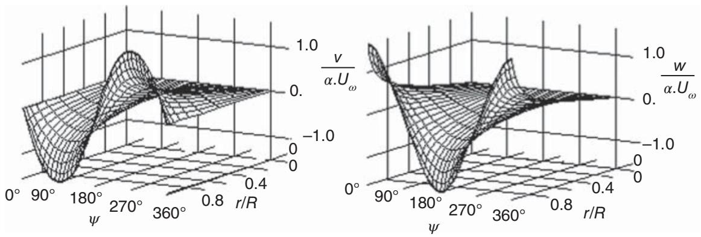  
Figure 4.13 Azimuthal and radial variation of horizontal (v) and vertical (w) velocities in the rotor plane for a skew angle of 30∘.

The drawback of Eqs. (4.27) and (4.28) is the singularity in the sow expansion function (4.29) at the outer edge of the disc. If the actuator disc is replaced with a rotor that has a small number of blades, then the sow expansion function changes very signircantly. Conducting a calculation using the Biot–Savart law for a non-yawed, single bladed rotor represented by a lifting line vortex of radially uniform strength, the sow expansion function can be determined numerically. It is found that the sow expansion velocity along the radial lifting line is a function of the helix (sow) angle of the discrete line vortex shed from the tip of the lifting line (blade). The vortex wake is assumed to be rigid in that the helix angle and the wake diameter are rxed everywhere at the values that pertain at the rotor. The solutions for a single blade rotor can be used to determine the sow relds for multi-blade rotors by a simple process of superposition. The resulting sow expansion functions $F ( \mu ) _ { N }$ for N blades are depicted in Figure 4.14 for one, two, and three blade rotors.

The radial variations in Figure 4.14 have been extended beyond the rotor radius to show the continuity that exists for the discrete blade situation as compared with the singularity that occurs for the actuator disc. There are two striking features of the sow expansion functions of Figure 4.14: the function is heavily modired by the value of the helix angle $\boldsymbol { \phi } _ { t , \mathbf { \lambda } }$ at which the tip vortex is shed from the blade tips, and the negative values (sow contraction) that can occur for the single blade rotor.

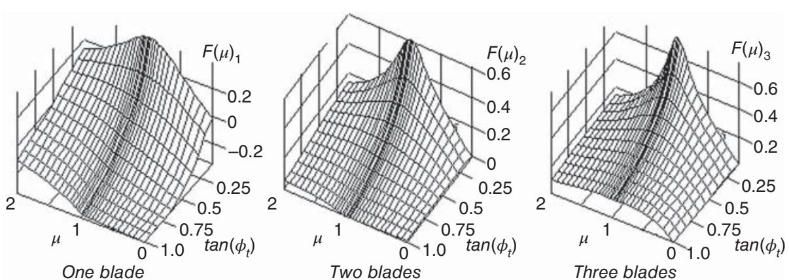  
Figure 4.14 Flow expansion functions for one, two and three blade rotors by lifting line theory.

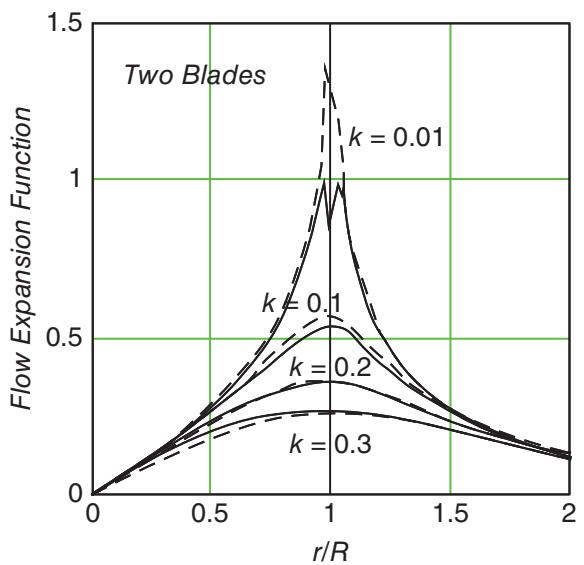

line

| r/R | k = 0.01 | k = 0.1 | k = 0.2 | k = 0.3 |
| --- | -------- | ------- | ------- | ------- |
| 0.0 | 0.0      | 0.0     | 0.0     | 0.0     |
| 0.5 | ~0.3     | ~0.2    | ~0.15   | ~0.1    |
| 1.0 | ~1.4     | ~0.6    | ~0.4    | ~0.25   |
| 1.5 | ~0.3     | ~0.2    | ~0.15   | ~0.1    |
| 2.0 | ~0.1     | ~0.1    | ~0.1    | ~0.1    |

Approximate   
Exact

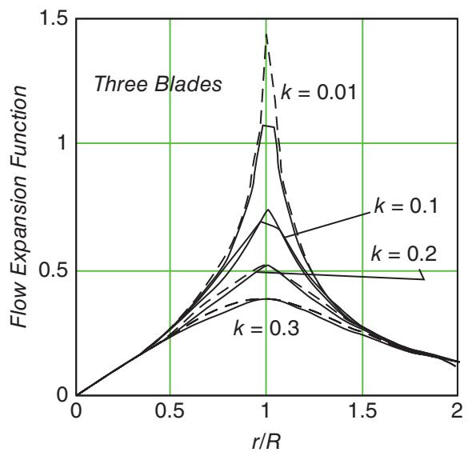

line

| r/R | k = 0.01 | k = 0.1 | k = 0.2 | k = 0.3 |
| --- | -------- | ------- | ------- | ------- |
| 0.0 | 0.0      | 0.0     | 0.0     | 0.0     |
| 0.5 | ~0.3     | ~0.2    | ~0.1    | ~0.1    |
| 1.0 | ~1.4     | ~0.7    | ~0.5    | ~0.4    |
| 1.5 | ~0.8     | ~0.4    | ~0.3    | ~0.2    |
| 2.0 | ~0.3     | ~0.2    | ~0.1    | ~0.1    |

Figure 4.15 Approximate sow expansion functions for two and three blade rotors $( k = \tan \phi _ { t } )$ .

An analytical expression that approximates the form of the diagrams shown in Figure 4.14 for two and three bladed rotors is (see Figure 4.15):

$$
F _ {a} (\mu , \phi_ {t}, N) = \frac {F (\mu)}{\sqrt {1 + 5 0 \frac {\tan^ {2} \phi_ {t}}{N ^ {2}} \left(\frac {1}{\tan \phi_ {t}} + 8\right) F (\mu) ^ {2} [ \mu (2 - \mu) F (\mu) ] ^ {0 . 0 5 \cot \phi_ {t}}}} \tag {4.30}
$$

where tan $\begin{array} { r } { \phi _ { t } = \frac { 1 - a } { \lambda ( 1 + a ^ { \prime } ) } } \end{array}$ is the tangent of the sow angle.

When transformed as components of velocity with respect to axes rotating about the rotor axis $( x ^ { \prime \prime } , y ^ { \prime \prime }$ , and $z ^ { \prime \prime }$ axes as shown in Figure 4.11), the sow expansion velocities of Eqs. (4.27) and (4.28) are resolved into the components that are normal and tangential to the blade element (see Figure 4.11).

The normal component is

$$
u ^ {\prime \prime} = - a U _ {\infty} \left(1 + 2 \sin \psi \tan \frac {\chi}{2} F (\mu)\right) \tag {4.31}
$$

and the tangential component is

$$
v ^ {\prime \prime} = a U _ {\infty} \cos \psi \tan \frac {\chi}{2} \left(1 + 2 \sin \psi \tan \frac {\chi}{2} F (\mu)\right) \tag {4.32}
$$

to which must be added the components of the wind velocity $U _ { \infty }$ :the normal component,

$$
U ^ {\prime \prime} = U _ {\infty} \cos \gamma \tag {4.33}
$$

and the tangential component,

$$
V ^ {\prime \prime} = - U _ {\infty} \cos \psi \sin \gamma \tag {4.34}
$$

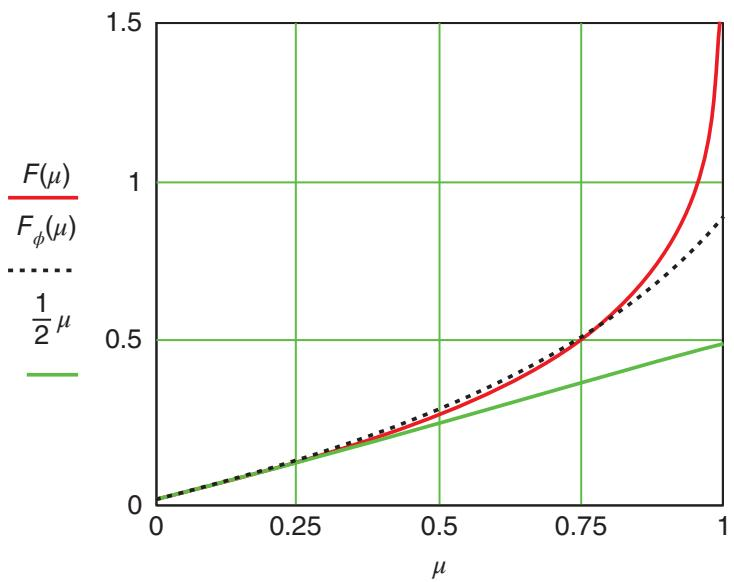

line

| μ    | F(μ) | F_φ(μ) | 1/2^μ |
|------|------|--------|-------|
| 0.00 | 0.00 | 0.00   | 0.00  |
| 0.25 | 0.10 | 0.10   | 0.10  |
| 0.50 | 0.30 | 0.30   | 0.25  |
| 0.75 | 0.50 | 0.50   | 0.35  |
| 1.00 | 1.50 | 0.90   | 0.50  |

Figure 4.16 Øye’s curve rt to Coleman’s sow expansion function.

Different implementations use slightly different replacements for the factor $2 F ( \mu )$ in the above equations depending on how $F ( \mu )$ is approximated [see, for example, Figure 4.16 and also Eq. (4.79)].

There is a radial (spanwise) velocity component, but this will not insuence the angle of attack so can be ignored.

Clearly, from Eq. (4.31), the Coleman theory determines the function $\operatorname { K } _ { C } ( \chi )$ , see Eq. (4.21), as being

$$
K _ {C} (\chi) = 2 \tan \frac {\chi}{2} \tag {4.35}
$$

taking $F ( \mu ) \approx \mu = r / R$ [but see also Eq. (4.36) and Figure 4.16, where another approximation, $F ( \mu ) \approx 0 . 5 \mu$ , which is convenient but less accurate in the outer region, is assumed].

In addition, there is the tangential velocity Ωr due to blade rotation and also the induced wake rotation, but the latter will be ignored initially.

The velocities of Eqs. (4.31)–(4.34) will produce a lower angle of attack when the azimuth angle 휓 is positive – see Figure 4.17 – than when it is negative, and so the angle of attack will vary cyclically. When 휓 is positive, the incident normal velocity $u ^ { \prime \prime }$ lies closer to the radial axis of the blade than when 휓 is negative. The difference in angle of attack can be attributed to sow expansion, as depicted in Figure 4.17.

The variation of the angle of attack makes the sow about a blade aerofoil unsteady, and so the lift will have a response of the kind discussed in Section 4.4. The blade circulation will therefore vary during the course of a revolution, which means that the vortex model is incomplete because it is derived from the assumption that the circulation is constant.

There is clearly additional spanwise vorticity in the wake being shed from the blades’ trailing edges as well as azimuthally varying strength in the helical vorticity. Both insuence the induced velocity and are not accounted for in the theory. The additional induced velocity would be cyclic so would probably not affect the average induced velocity normal to the rotor disc but would affect the amplitude and phasing of the angle of attack.

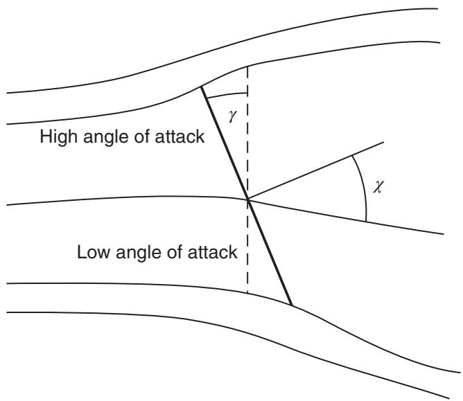

text_image

High angle of attack
γ
Low angle of attack
χ

Figure 4.17 Flow expansion causes a differential angle of attack.

Further numerical analysis of the Coleman vortex theory reveals that at skew angles greater than ±45∘ , higher harmonics than just the one per revolution term in Eq. (4.21) become signircant in the sow expansion induced velocities. Only odd harmonics are present, resecting the anti-symmetry about the yaw axis.

# 4.2.5 Related theories

A number of rernements to the Glauert and Coleman theories have been proposed by other researchers, mostly addressing helicopter aerodynamics, but some have been directed specircally at wind turbines. In particular, Øye (1992) undertook the same analysis as Coleman and proposed a simple curve rt to Eq. (4.29):

$$
F _ {\emptyset} (\mu) = \frac {1}{2} \left(\mu + 0. 4 \mu^ {3} + 0. 4 \mu^ {5}\right) \tag {4.36}
$$

Øye has clearly avoided the very large values that Eq. (4.29) produces close to the outer edge of the disc, and Eq. (4.35) is in general accordance with the sow expansion functions shown in Figure 4.14 for typical tip speed ratios.

Meijer Drees (1949) has extended the Coleman et al. vortex model to include a cosinusoidal time variation of blade circulation. The main result is a modircation to the function $\operatorname { K } _ { C } ( \chi )$ , but Meijer-Drees retained Glauert’s assumption of linear variation of normal induced velocity with radius:

$$
u ^ {\prime \prime} = - a U _ {\infty} \left[ 1 + \frac {4}{3} \mu \left(1 - 1. 8 \left(\frac {\sin \gamma}{\lambda}\right) ^ {2}\right) \sin \psi \tan \frac {\chi}{2} \right] \tag {4.37}
$$

(see Snel and Schepers 1995).

# 4.2.6 Wake rotation for a turbine rotor in steady yaw

Wake rotation is, of course, present in the wake sow but under yawed conditions cannot be related only to the torque. The vortex theory must include the root vortex, which will be convected and always lie along the wake axis. The rotation in the wake under yawed conditions will therefore be about the skewed wake axis, which is not the same as the axis of rotation of the rotor. The wake rotation velocity will lie in a plane normal to the skewed wake axis.

To determine the wake rotation velocity, the rate of change of angular momentum about the skewed wake axis will be equated to the moment about the axis produced by blade forces.

If the wake rotation velocity is described, as before, in terms of the angular velocity of the rotor, then

$$
v ^ {\prime \prime \prime} = \Omega r ^ {\prime \prime \prime} a ^ {\prime} h (\psi) \tag {4.38}
$$

where the triple prime denotes an axis system rotating about the wake axis, and $h ( \psi )$ is a function that determines the intensity of the root vortex’s insuence. In the non-yawed case, the root vortex induces a velocity at the rotor that is half of what it induces in the far wake at the same radial distance, and the same would apply to a disc normal to the skewed axis with a centre located at the same position as the actual rotor disc. The distance upstream or downstream of a point on the actual rotor disc from a plane through the centre of the disc normal to the wake axis determines the value of the root vortex insuence function $h ( \psi )$ . The value of $h ( \psi )$ will be equal to 1.0 at points on the vertical diameter and vary sinusoidally about this value around the azimuth with amplitude up to 1.0 for very large yaw angles.

From the Biot–Savart law, the velocity induced by a semi-inrnite line vortex of strength Γ lying along the x axis from zero to inrnity at a point with cylindrical coordinates $( x ^ { \prime \prime \prime } , \psi ^ { \prime \prime \prime } , r ^ { \prime \prime \prime } )$ is

$$
\vec {V} ^ {\prime \prime \prime} = \frac {\Gamma}{4 \pi r ^ {\prime \prime \prime}} \left[ 1 + \frac {0}{\sqrt {x ^ {\prime \prime \prime 2} + r ^ {\prime \prime \prime 2}}} \right] = \left[ \begin{array}{c} 0 \\ v ^ {\prime \prime \prime} \\ 0 \end{array} \right] \tag {4.39}
$$

The induced velocity when $x ^ { \prime \prime \prime } = \infty$ is twice that when $x ^ { \prime \prime \prime } = 0$ and is zero when $x ^ { \prime \prime \prime } = - \infty$ .

For a point on the rotor disc $( 0 , \psi , r )$ the corresponding coordinates $( x ^ { \prime \prime \prime } , \psi ^ { \prime \prime \prime } , r ^ { \prime \prime \prime } )$ in normal disc axes are

$$
x ^ {\prime \prime \prime} = - y ^ {\prime \prime} \sin \chi = r \sin \psi \sin \chi , r ^ {\prime \prime \prime} = r \sqrt {\cos^ {2} \psi + \cos^ {2} \chi \sin^ {2} \psi}
$$

and

$$
\cos \psi^ {\prime \prime \prime} = \frac {r}{r ^ {\prime \prime \prime}} \cos \psi , \sin \psi^ {\prime \prime \prime} = \frac {r}{r ^ {\prime \prime \prime}} \sin \psi \cos \chi (4. 4 0)
$$

Hence substituting

$$
4 \pi r ^ {\prime \prime \prime 2} \Omega a ^ {\prime}
$$

for the circulation [as in Eq. (3.33)], the induced velocity at the same point is

$$
v ^ {\prime \prime \prime} = \Omega r ^ {\prime \prime \prime} a ^ {\prime} \left[ 1 + \frac {x ^ {\prime \prime \prime}}{\sqrt {x ^ {\prime \prime \prime 2} + r ^ {\prime \prime \prime 2}}} \right] \tag {4.41}
$$

So, transforming the velocity of (4.39) to the rotating axes in the plane of the rotor disc:

$$
\overrightarrow {V} = \left[ \begin{array}{c c c} 1 & 0 & 0 \\ 0 & \cos \psi & \sin \psi \\ 0 & - \sin \psi & \cos \psi \end{array} \right] \left[ \begin{array}{c c c} \cos \chi & \sin \chi & 0 \\ - \sin \chi & \cos \chi & 0 \\ 0 & 0 & 1 \end{array} \right] \left[ \begin{array}{c c c} 1 & 0 & 0 \\ 0 & \cos \psi^ {\prime \prime \prime} & - \sin \psi^ {\prime \prime \prime} \\ 0 & \sin \psi^ {\prime \prime \prime} & \cos \psi^ {\prime \prime \prime} \end{array} \right] \left[ \begin{array}{c} 0 \\ v ^ {\prime \prime \prime} \\ 0 \end{array} \right] (4. 4 2)
$$

Substituting (4.40) and (4.41) into (4.42) gives

$$
\overrightarrow {V} ^ {\prime \prime} = \left[ \begin{array}{c} \cos \psi \sin \chi \\ \cos \psi \\ 0 \end{array} \right] \Omega r a ^ {\prime} (1 + \sin \psi \sin \chi) \tag {4.43}
$$

Thus, the wake rotation produces two velocity components, one in the rotor plane and one normal to the rotor plane; there is no radial component.

# 4.2.7 The blade element theory for a turbine rotor in steady yaw

There is doubt about the applicability of the blade element theory in the case of a yawed turbine because the sow, local to a blade element, is unsteady and because the theory representing the vortex half of the equation, which replaces the momentum theory, is incomplete in this respect. However, it is not clear how large or signircant the unsteady forces are. In a steady yawed condition, the sow velocities in a rxed earth frame at a rxed point on the rotor disc do not change with time, if an inrnity of blades is assumed, and so there is no effect to consider. However, the change of angle of attack with time at a point on the blade does mean that the two-dimensional (2-D) lift force should really be modired by an unsteady lift function similar to that determined by Theodorsen (1935) for the rectilinear wake of a sinusoidally pitching aerofoil.

Neglecting the effects of shed vorticity, the net velocities in the plane of a local blade element are shown in Figure 4.18. The radial (spanwise) velocity component is not shown in Figure 4.18, but it is neglected because it is not considered to have any insuence on the angle of attack and therefore on the lift force.

The sow angle $\phi$ is then determined by the components of velocity shown in Figure 4.18:

$$
\begin{array}{l} \mathrm{Tan} \phi = \mathrm{V} _ {\mathrm{x}} / \mathrm{V} _ {\mathrm{y}} \\ \mathrm{V} _ {\mathrm{x}} = U _ {\infty} (\cos \gamma - a (1 + F (\mu) K (\chi) \sin \psi)) + \Omega r a ^ {\prime} \cos \psi \sin \chi (1 + \sin \psi \sin \chi) \\ \mathrm {V_ {y}} = \Omega r (1 + a ^ {\prime} \cos \chi (1 + \sin \psi \sin \chi)) \\ + U _ {\infty} \cos \psi \left(a. \tan \frac {\chi}{2} (1 + F (\mu) K (\chi) \sin \psi) - \sin \gamma\right) \tag {4.44} \\ \end{array}
$$

where $\begin{array} { r } { \mu = \frac { r } { R } } \end{array}$ is measured radially from the axis of rotor rotation.

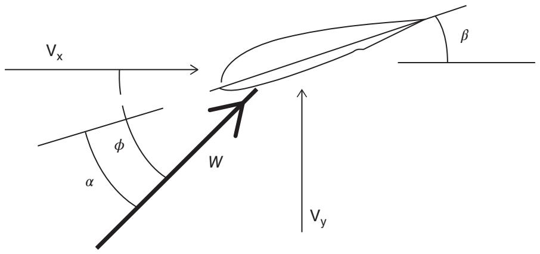

text_image

Vₓ
φ
α
W
Vᵧ
β

Figure 4.18 The velocity components in the plane of a blade cross-section.

The angle of attack 훼 is found from

$$
\alpha = \phi - \beta \tag {4.45}
$$

Lift and drag coefrcients taken from 2-D experimental data, just as for the non-yawed case, are determined from the angle of attack calculation for each blade element (each combination of $\mu$ and 휓).

# 4.2.8 The blade-element-momentum theory for a rotor in steady yaw

The forces on a blade element can be determined via Eqs. (4.44) and (4.45) for given values of the sow induction factors.

The thrust force will be calculated using Eq. (3.46) in Section 3.5.2, which is for a complete annular ring of radius r and radial thickness 훿r:

$$
\delta L c o s \phi + \delta D s i n \phi = \frac {1}{2} \rho W ^ {2} B c (C _ {l} c o s \phi + C _ {d} s i n \phi) \delta r
$$

For an elemental area of the annular ring swept out as the rotor turns through an angle 훿휓, the proportion of the force is

$$
\delta F _ {b} = \frac {1}{2} \rho W ^ {2} B c (C _ {l} c o s \phi + C _ {d} s i n \phi) \delta r \frac {\delta \psi}{2 \pi}
$$

Then putting $C _ { \mathrm { x } } = C _ { \mathrm { l } } { \mathrm { c o s } } \phi + C _ { \mathrm { d } } { \mathrm { s i n } } \phi { \mathrm { a n d } } \sigma _ { \mathrm { r } } = \mathrm { B c } / ( 2 \pi \mathrm { r } ) ;$ :

$$
\delta F _ {b} = \frac {1}{2} \rho W ^ {2} \sigma_ {r} C _ {x} r \delta r \delta \psi \tag {4.46}
$$

Using mean values of $C _ { l }$ and $C _ { d }$ here assumes quasi-steady behaviour and neglects unsteady effects due to the ever-changing blade circulation with azimuth angle, which will depend upon the level of the reduced frequency of the circulation suctuation.

Unsteady effects become signircant if the reduced frequency, k = πfc/W, is greater than about 0.05. Here f is the frequency (Hz) of the unsteady sow, which in this case is the rotation frequency, and W is the time-mean relative velocity at a blade section. This value can be easily exceeded as the blades rotate through the wind shear.

If it is chosen to ignore drag, or uses only that part of the drag attributable to pressure, then Eq. (4.46) should be modired accordingly.

The rate of change of momentum will use either Eq. (4.18), Glauert’s theory, or Eq. (4.24), the vortex cylinder theory; in both equations, the sow induction factor a should be replaced by af to account for Prandtl tip-loss.

For Glauert’s theory,

$$
\delta F _ {m} = \frac {1}{2} \rho U _ {\infty} ^ {2} 4 a f \sqrt {1 - a f (2 \cos \gamma - a f)} r \delta \psi \delta r \tag {4.47}
$$

Or, for the vortex theory,

$$
\delta F _ {m} = \frac {1}{2} \rho U _ {\infty} ^ {2} 4 a f \left(\cos \gamma + \tan \frac {\chi}{2} \sin \gamma - a f \sec^ {2} \frac {\chi}{2}\right) r \delta \psi \delta r (4. 4 8)
$$

The algebraic complexity of estimating the wake rotation velocities is great, and even then suctuation of bound circulation is ignored. The drop in pressure caused by wake rotation, however, is shown to be small in the non-yawed case, except where the speed ratio is small, and so it is assumed that it can safely be ignored in the yawed case.

The moment of the blade element force about the wake axis is

$$
\delta M _ {b} = \frac {1}{2} \rho W ^ {2} B c (C _ {y} c o s \chi - C _ {x} c o s \psi s i n \chi) r \delta r \frac {\delta \psi}{2 \pi} (4. 4 9)
$$

where

$$
C _ {y} = C _ {l} \sin \phi - C _ {d} \cos \phi
$$

therefore,

$$
\delta M _ {b} = \frac {1}{2} \rho W ^ {2} \sigma_ {r} (C _ {y} \cos \chi - C _ {x} \cos \psi \sin \chi) r ^ {2} \delta r \delta \psi \tag {4.50}
$$

The rate of change of angular momentum is the mass sow rate through an elemental area of the disc times the tangential velocity times radius.

$$
\delta M _ {m} = \rho U _ {\infty} (\cos \gamma - a f) r \delta \psi \delta r 2 a ^ {\prime} f \Omega r ^ {\prime \prime \prime 2} (4. 5 1)
$$

where

$$
r ^ {\prime \prime \prime 2} = r ^ {2} (\cos^ {2} \psi + \cos^ {2} \chi \sin^ {2} \psi)
$$

therefore,

$$
\delta M _ {m} = \frac {1}{2} \rho U _ {\infty} ^ {2} \lambda \mu 4 a ^ {\prime} f (\cos \gamma - a f) (\cos^ {2} \psi + \cos^ {2} \chi \sin^ {2} \psi) r ^ {2} \delta r \delta \psi (4. 5 2)
$$

The momentum theory, as developed, applies only to the whole rotor disc where the sow induction factor a is the average value for the disc. However, it may be argued that it is better to apply the momentum equations to an annular ring, as in the non-yawed case, to determine a distribution of the sow induction factors varying with radius, resecting radial variation of circulation. Certainly, for the angular momentum case the tangential sow factor a ′ will vary little with azimuth position because it is generated by the root vortex and although, in fact, the axial sow factor a does vary with azimuth angle, it is consistent to use an annular average for this factor as well.

To rnd an average for an annular ring, the elemental values of force and moment must be integrated around the ring.

For the axial momentum case, taking the vortex method as an example,

$$
\int_ {0} ^ {2 \pi} \frac {1}{2} \rho U _ {\infty} ^ {2} 4 a f (\cos \gamma + \tan \frac {\chi}{2} \sin \gamma - a f \sec^ {2} \frac {\chi}{2}) \delta \psi r \delta r = \sigma_ {r} \int_ {0} ^ {2 \pi} \frac {1}{2} \rho W ^ {2} C _ {x} \delta \psi r \delta r \tag {4.53}
$$

Therefore,

$$
8 \pi a f \left(\cos \gamma + \tan \frac {\chi}{2} \sin \gamma - a f \sec^ {2} \frac {\chi}{2}\right) = \sigma_ {r} \int_ {0} ^ {2 \pi} \frac {W ^ {2}}{U _ {\infty} {} ^ {2}} C _ {x} d \psi \tag {4.54}
$$

The resultant velocity $W$ and the normal force coefrcient $C _ { x }$ are functions of $\psi .$

(Note that care is required solving Eq. (4.54) because iteration can result in complex roots for a.)

And for the angular momentum case

$$
\begin{array}{l} \int_ {0} ^ {2 \pi} \frac {1}{2} \rho U _ {\infty} ^ {2} \lambda \mu 4 a ^ {\prime} f (\cos \gamma - a f) (\cos^ {2} \psi + \cos^ {2} \chi \sin^ {2} \psi) r ^ {2} d \psi \delta r \\ = \int_ {0} ^ {2 \pi} \frac {1}{2} \rho W ^ {2} (C _ {y} \cos \chi - C _ {x} \sin \chi \cos \psi) r ^ {2} d \psi \delta r \tag {4.55} \\ \end{array}
$$

which reduces to

$$
4 a ^ {\prime} f (\cos \gamma - a f) \lambda \mu \pi (1 + \cos^ {2} \chi) = \sigma_ {r} \int_ {0} ^ {2 \pi} \frac {W ^ {2}}{U _ {\infty} {} ^ {2}} (C _ {y} \cos \chi - C _ {x} \sin \chi \cos \psi) d \psi \tag {4.56}
$$

The non-dimensionalised resultant velocity relative to a blade element is given by

$$
\begin{array}{l} \frac {W ^ {2}}{U _ {\infty} ^ {2}} = [ \cos \gamma - a + \lambda \mu a ^ {\prime} \sin \chi \cos \psi (1 + \sin \chi \sin \psi) ] ^ {2} \\ + \left[ \lambda \mu (1 + a ^ {\prime} \cos \chi (1 + \sin \chi \sin \psi)) + \cos \psi \left(a. \tan \frac {\chi}{2} - \sin \gamma\right) \right] ^ {2} (4. 5 7) \\ \end{array}
$$

Note that the sow expansion terms, those terms that involve $F ( \mu ) K ( \chi )$ in Figure 4.18, have been excluded from the velocity components in Eq. (4.57) because sow expansion is not represented in this wake model, and so there is no associated momentum change. The blade force, which arises from the sow expansion velocity, is balanced in the wake by pressure forces acting on the sides of the streamtubes, which have a streamwise component because the streamtubes are expanding.

Equations (4.51) and (4.56) can be solved by iteration, the integrals being determined numerically. Initial values are chosen for $a$ and $a ^ { \prime } { \mathrm { . } }$ , usually zero. For a given blade geometry, at each blade element position $\mu$ and at each blade azimuth position $\psi .$ , the sow angle $\phi$ is calculated from Eq. (4.44), which has been suitably modired to remove the sow expansion velocity, in accordance with Eq. (4.57). Then, knowing the blade pitch angle $\beta$ at the blade element, the local angle of attack can be found. Lift and drag coefrcients are obtained from tabulated aerofoil data. Once an annular ring (constant $\mu )$ has been completed, the integrals are calculated. The new value of axial sow factor a is determined from Eq. (4.54), and then the tangential sow factor $a ^ { \prime }$ is found from Eq. (4.56).

Iteration proceeds for the same annular ring until a satisfactory convergence is achieved before moving to the next annular ring (value of $\mu )$ . As written, Eq. (4.54) is quadratic in a on the left hand side. The solution can lead to complex and therefore unrealistic roots. A more stable solution procedure can be set up by removing the quadratic term in a to the right hand side (either by dividing by the factor a or by subtracting it) and iterating the solution of the resulting linear equation. It should also be noted that much of the above algebra is often carried out more compactly by using matrix notation for the mappings.

Although the theory supports only the determination of azimuthally averaged values of the axial sow induced velocity, once the averaged tangential sow induction factors have been calculated, the elemental form of the momentum [Eq. (4.48)] and the blade element forces [Eq. (4.46)] can be employed to yield values of $a$ that vary with azimuth.

For the determination of blade forces, the sow expansion velocities must be included. The total velocity components, normal and tangential to a blade element, are then as shown in Figure 4.18, and the resultant velocity is

$$
\begin{array}{l} \frac {W ^ {2}}{U _ {\infty} ^ {2}} = [ \cos \gamma - a (1 + F (\mu) \mathrm{K} (\chi) \sin \psi) + \lambda \mu a ^ {\prime} \sin \chi \cos \psi (1 + \sin \chi \sin \psi) ] ^ {2} \\ + \left[ \lambda \mu (1 + a ^ {\prime} \cos \chi (1 + \sin \chi \sin \psi)) \right. \\ \left. + \cos \psi \left(a. \tan \frac {\chi}{2} (1 + F (\mu) \mathrm{K} (\chi) \sin \psi) - \sin \gamma\right) \right] ^ {2} \tag {4.58} \\ \end{array}
$$

# 4.2.9 Calculated values of induced velocity

The measurement of the induced velocities of a wind turbine rotor in yaw has been undertaken at Delft University of Technology (Snel and Schepers 1995). The tests were carried out using a small wind tunnel model so that a steady yaw could be maintained in a steady wind with no tower shadow and no wind shear. The rotor had two blades of 1.2 m diameter that were twisted but had a uniform chord length of 80 mm. The blade root was at a radius of 180 mm, and the blade twist was $9 ^ { \circ }$ at the root varying linearly with radius to $4 ^ { \circ }$ at 540 mm radius and remaining at $4 ^ { \circ }$ from there to the tip. The blade aerofoil prorle was NACA0012. The rotor speed was kept constant at 720 rev/min and the wind speed was held constant at 6.0 m/s. Tests were carried out at $1 0 ^ { \circ }$ , 20∘, and $3 0 ^ { \circ }$ of yaw angle.

Calculated induced velocities using the vortex momentum equation for the Delft turbine are shown in Figure 4.19: these are the average values for each annulus obtained using Eqs. (4.54) and (4.56).

The component velocities at each blade element, as derned in Figure 4.18, are shown in Figure 4.20. Because of the rotational speed of the blades, the tangential velocity is much greater than the normal velocity, but it is the latter that most insuences the variation in angle of attack at the important, outboard sections of the blades, shown in Figure 4.21.

At the inboard sections of the blades, it is the variation in tangential velocity that mostly insuences the angle of attack variation, and this is largely as a result of the changing geometry with azimuth angle rather than the effect of induced velocity.

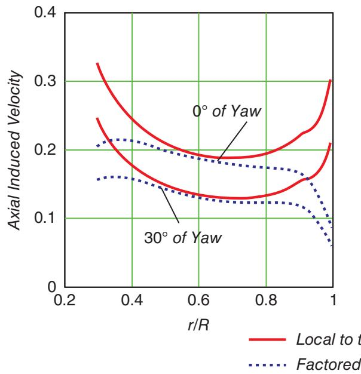

line

| r/R | Local to t | Factored |
| --- | --- | --- |
| 0.2 | 0.33 | 0.21 |
| 0.4 | 0.25 | 0.22 |
| 0.6 | 0.19 | 0.18 |
| 0.8 | 0.19 | 0.17 |
| 1.0 | 0.30 | 0.07 |

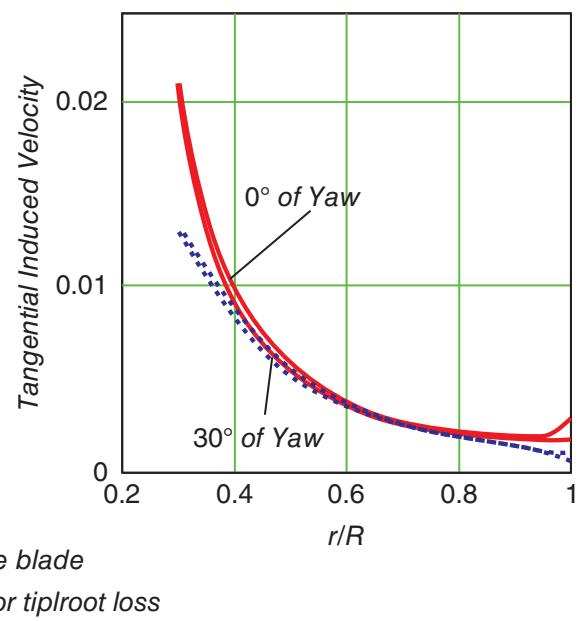

line

| r/R | 0° of Yaw | 30° of Yaw |
| --- | --- | --- |
| 0.2 | 0.021 | - |
| 0.4 | 0.010 | 0.009 |
| 0.6 | 0.005 | 0.004 |
| 0.8 | 0.003 | 0.002 |
| 1.0 | 0.002 | 0.001 |

Figure 4.19 Azimuthally averaged induced velocity factors for the Delft turbine.

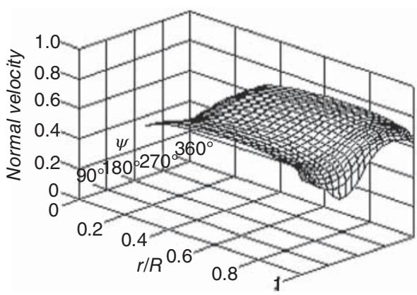

surface_3d

| r/R   | Normal velocity | ψ     |
|-------|-----------------|-------|
| 0.2   | 0.0             | 90°   |
| 0.4   | 0.2             | 80°   |
| 0.6   | 0.4             | 270°  |
| 0.8   | 0.6             | 360°  |
| 1.0   | 0.8             |       |

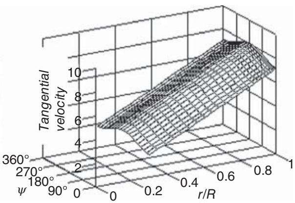

surface_3d

| r/R | ψ (°) | Tangential velocity |
| --- | --- | --- |
| 0.0 | 360 | 10 |
| 0.2 | 270 | 8 |
| 0.4 | 180 | 6 |
| 0.6 | 90 | 4 |
| 0.8 | 180 | 2 |
| 1.0 | 360 | 0 |

Figure 4.20 Component velocities, normalised with wind speed, at $3 0 ^ { \circ }$ of yaw.

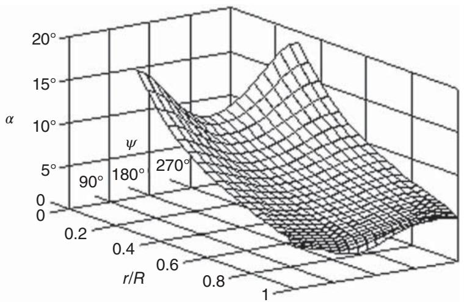

line

| r/R | α    | ψ     |
|-----|------|-------|
| 0.2 | 0    | -     |
| 0.4 | 5    | -     |
| 0.6 | 10   | -     |
| 0.8 | 15   | -     |
| 1   | 20   | -     |

Figure 4.21 Angle of attack variation at $3 0 ^ { \circ }$ of yaw.

# 4.2.10 Blade forces for a rotor in steady yaw

Once the sow induction factors have been determined, blade forces can then be calculated. Although the sow expansion velocity is excluded from the determination of the sow induction factors, on the grounds that the consequent blade forces do not cause any change in the momentum of the sow, it must be included when the blade forces are calculated. The sow expansion velocity should be dependent on an overall average value of the axial sow induction factor, but it is more convenient to use the annular average value as determined by Eqs. (4.54) and (4.56).

The sow angle and the angle of attack need to be determined anew at each blade element position $\mu$ and at each blade azimuth position 휓 because the sow expansion velocity must now be included, so Eq. (4.44) is used in its unmodired form. Drag must also be included in the determination of forces even if it was not in the calculation of the induced velocities.

The blade force per unit span normal to the plane of rotation is

$$
\frac {d F _ {x}}{d r} = \frac {1}{2} \rho W ^ {2} c C _ {x} \tag {4.59}
$$

which will vary with the azimuth position of the blade. The total force normal to the rotor plane can be obtained by integrating Eq. (4.59) along the blade length for each of the blades, taking account of their azimuthal separation, and summing the results. The total normal force will also vary with rotor azimuth.

Similarly, the tangential blade force per unit span is

$$
\frac {d F _ {y}}{d r} = \frac {1}{2} \rho W ^ {2} c C _ {y} \tag {4.60}
$$

and the blade torque contribution about the axis of rotation is

$$
\frac {d Q}{d r} = \frac {1}{2} \rho W ^ {2} c r C _ {y} \tag {4.61}
$$

The total torque is found by integrating along each blade and summing over all the blades, just as for the normal force. Again, the torque on the rotor will vary with azimuth position, so to rnd the average torque will require a further integration with respect to azimuth.

# 4.2.11 Yawing and tilting moments in steady yaw

The asymmetry of the sow through a yawed rotor, caused by the sow expansion, means that a blade sweeping upwind has a higher angle of attack than when it is sweeping downwind, as shown in Figure 4.17. The blade lift upwind will therefore be greater than the lift downwind, and a similar differential applies to the forces normal to the rotor plane. It can be seen, therefore, that there is a net moment about the yaw (vertical axis) in a direction that will tend to restore the rotor axis to a position aligned with the wind direction. The yawing moment is obtained from the normal force of Eq. (4.59):

$$
\frac {d M _ {z}}{d r} = \frac {1}{2} \rho W ^ {2} c r C _ {x} \sin \psi \tag {4.62}
$$

which will also vary with the azimuth position of the blade. The total single-blade yawing moment at each azimuth position is obtained by integrating Eq. (4.62) along the length of the blade. Summing the moments for all blades, suitably separated in phase, will result in the yawing moment on the rotor.

A similar calculation can be made for the tilting moment, the moment about the horizontal diametral axis (y axis) of the rotor:

$$
\frac {d M _ {y}}{d r} = \frac {1}{2} \rho W ^ {2} c r C _ {x} \cos \psi \tag {4.63}
$$

The existence of yawing and tilting moments predicted by the blade element theory is inconsistent with the momentum and the vortex cylindrical wake theories because they assume steady conditions in the wake. In principle, the momentum and vortex theories predict velocities from which it is only possible to deduce an azimuthally uniform pressure distribution.

Measured results of rotor yaw moment for the Delft turbine are shown in Figure 4.22, and the corresponding calculated yawing moments are shown in Figure 4.23.

The measured yawing moments were derived from strain gauge readings of the sapwise bending strain at a radial position close to the root of the blade at 129 mm radius. Flapwise (or satwise) bending causes displacements normal to the rotor plane. The calculated yawing moments are determined at the same radial position on the blade and are, therefore, not quite equal to the true yawing moments about the actual yaw axis.

The comparison between the measured and calculated yaw moments is quite good, taking into account the limitations of the theory. At $3 0 ^ { \circ }$ of yaw, the calculated values underestimate the measurements signircantly, whereas at the two lower angles the correspondence is much closer.

It should be noted that the mean yawing moment is not zero and that the sign of the moment, being negative, means that it endeavours to restore the rotor axis to alignment with the wind direction.

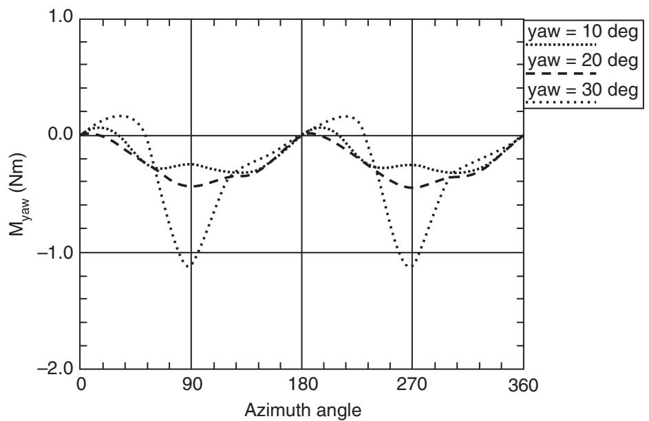

line

| Azimuth angle | yaw = 10 deg | yaw = 20 deg | yaw = 30 deg |
| ------------- | ------------ | ------------ | ------------ |
| 0             | 0.0          | 0.0          | 0.0          |
| 90            | -1.0         | -0.5         | -1.0         |
| 180           | 0.0          | 0.0          | 0.0          |
| 270           | -1.0         | -0.5         | -1.0         |
| 360           | 0.0          | 0.0          | 0.0          |

Figure 4.22 Measured yaw moments on the Delft turbine.

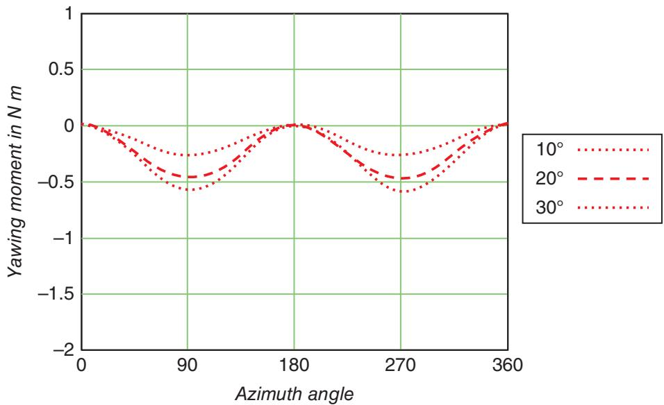

line

| Azimuth angle | 10°   | 20°   | 30°   |
| ------------- | ----- | ----- | ----- |
| 0             | 0.0   | 0.0   | 0.0   |
| 90            | -0.5  | -0.4  | -0.6  |
| 180           | 0.0   | 0.0   | 0.0   |
| 270           | -0.5  | -0.4  | -0.6  |
| 360           | 0.0   | 0.0   | 0.0   |

Figure 4.23 Calculated yaw moments on the Delft turbine.

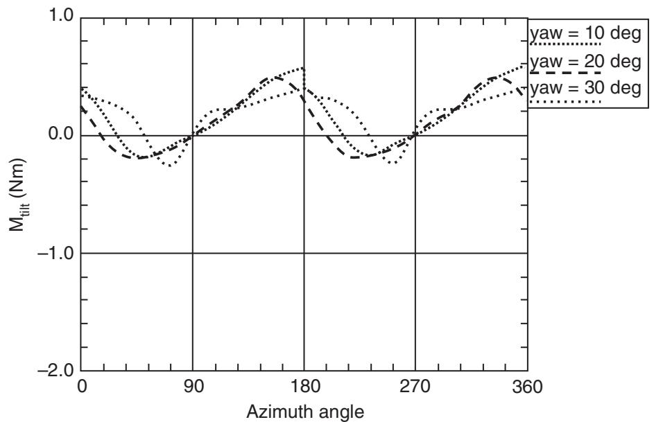

line

| Azimuth angle | yaw = 10 deg | yaw = 20 deg | yaw = 30 deg |
| ------------- | ------------ | ------------ | ------------ |
| 0             | 0.5          | 0.4          | 0.3          |
| 90            | -0.2         | -0.3         | -0.4         |
| 180           | 0.6          | 0.5          | 0.4          |
| 270           | -0.1         | -0.2         | -0.3         |
| 360           | 0.7          | 0.6          | 0.5          |

Figure 4.24 Measured tilt moments on the Delft turbine.

The yawing moment comparison is a test of the usefulness of the theory developed in this section, and it would seem that for general engineering purposes it passes the test.

The measured tilting moments (Figure 4.24) appear to be of about the same amplitude for all three yaw angles, whereas the calculated moments (Figure 4.25) increase with yaw angle.

For 30∘ of yaw, the magnitudes of the measured and calculated tilting moments are comparable. The measured mean tilting moment is quite dernitely non-zero and positive, but the calculated mean moment is much smaller although still positive. A positive tilt rotation would displace the upper part of the rotor disc in the downwind direction. In theory, the small mean tilting moment is caused by the wake rotation velocities.

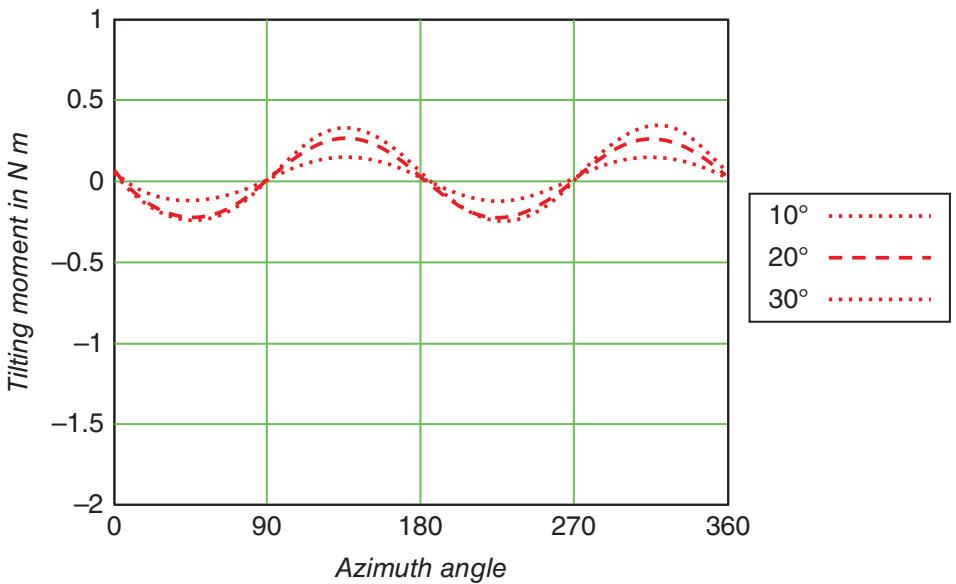

line

| Azimuth angle | 10°     | 20°     | 30°     |
| ------------- | ------- | ------- | ------- |
| 0             | 0.0000  | 0.0000  | 0.0000  |
| 90            | -0.2500 | -0.2500 | -0.2500 |
| 180           | 0.2500  | 0.2500  | 0.2500  |
| 270           | -0.2500 | -0.2500 | -0.2500 |
| 360           | 0.2500  | 0.2500  | 0.2500  |

Figure 4.25 Calculated tilt moments on the Delft turbine.

Results obtained from CFD provide a much more accurate prediction of the aerodynamics of a wind turbine in yaw. However, the heavy computational resource (time and memory) requirements usually associated with CFD solutions precludes their routine use in favour of the simple theory outlined in these pages.

# 4.3 Circular wing theory applied to a rotor in yaw

# 4.3.1 Introduction

An aerodynamic model that is applied to the performance of helicopters in forward sight, which is to represent the rotor as a circular wing at low angle of attack, can also be applied to wind turbine rotors that are lightly loaded. This method of analysis represents the sow reld in terms of a series of solutions of Laplace’s equation for potential in ellipsoidal coordinates (which are the ‘natural’ coordinates for this geometry). It gives a mathematically correct solution, provided potential theory applies (high Reynolds number sow) and the perturbation of the incident sow is small, and it is able to give more details of the sow reld and load distribution than Glauert’s semi-empirical method. The method solves for the perturbation pressures, equivalent to acceleration potential, allowing more general distributions of pressure drop across the actuator disc than the uniform pressure distribution of the momentum theory. The model has been expounded by Kinner (1937), inspired by Prandtl, who has developed expressions for the pressure reld in the vicinity of an actuator disc, treating it as a circular wing. As for the non-yawed actuator disc, the circular wing model strictly assumes an inrnity of very slender blades while retaining rnite and small solidity.

Kinner’s theory is for inviscid sow and derived from the Euler equations. The perturbation velocities u, v, and w due to the rotor in the x, y, and z directions are assumed to be much smaller than the free-stream velocity $\mathrm { { U } } _ { \infty }$ (which is a constant). Substituting into the Euler equations and linearising leads to x, y, and z direction momentum equations:

$$
\rho U _ {\infty} \frac {\partial u}{\partial x} = - \frac {\partial p}{\partial x} \tag {4.64a}
$$

$$
\rho U _ {\infty} \frac {\partial v}{\partial x} = - \frac {\partial p}{\partial y} \tag {4.64b}
$$

$$
\rho U _ {\infty} \frac {\partial w}{\partial x} = - \frac {\partial p}{\partial z} \tag {4.64c}
$$

Combining these with the incompressible mass sow continuity equation leads to Laplace’s equation:

$$
\frac {\partial^ {2} p}{\partial x ^ {2}} + \frac {\partial^ {2} p}{\partial y ^ {2}} + \frac {\partial^ {2} p}{\partial z ^ {2}} = 0 \tag {4.65}
$$

Given the boundary conditions at the actuator disc, Eq. (4.65) can be solved for the pressure reld and, in particular, the pressure distribution at the disc. The pressure is continuous everywhere except across the disc surfaces, where there is the usual pressure discontinuity, or pressure drop, in the wind turbine case.

In Coleman’s analysis, the pressure drop distribution across the disc is uniform (it is only as a result of combining the theory with the blade element theory that a non-uniform pressure distribution can be achieved) but falls to zero, abruptly, at the disc edge. Kinner assumes that the pressure drop is zero at the disc edge and changes in a continuous manner as radius decreases.

The linearised Euler Eqs. (4.64a)–(4.64c) allow the perturbation pressure to be regarded as an (acceleration) potential reld from which the velocity reld can be obtained by integration. Commencing upstream where the known free-stream conditions apply, the velocity components can be determined by progressive integration towards the disc.

The pressure discontinuity across the rotor disc is as shown in Figure 3.2. As in the case of the unyawed actuator disc, half the pressure difference across the disc is accounted for by the rise in pressure just upstream and the other half by an equal rise in pressure just downstream, back to ambient in the far wake The pressure gradient, however, normal to the rotor disc, is continuous across the disc.

# 4.3.2 The general pressure distribution theory of Kinner

Kinner’s (1937) solution is mathematically complex, derived in terms of Legendre polynomials $\mathrm { { P _ { n } } ^ { \ m } , Q _ { n } ^ { \ m } }$ in an ellipsoidal coordinate system $( \nu , \eta , \psi )$ , where 휓 is azimuth angle, transformed from the Cartesian coordinates $( x ^ { \prime \prime } , y ^ { \prime } , z )$ , which are centred in the rotor plane; see Figure 4.11:

$$
\frac {x ^ {\prime \prime}}{R} = \nu \eta , \frac {y ^ {\prime}}{R} = \sqrt {1 - \nu^ {2}} \sqrt {1 + \eta^ {2}} \sin \psi \text {   and   } \frac {z}{R} = \sqrt {1 - \nu^ {2}} \sqrt {1 + \eta^ {2}} \cos \psi \tag {4.66}
$$

On the surface of the rotor disc $\eta \ : = \ : 0$ and $\textstyle { \frac { r } { R } } = \mu = { \sqrt { 1 - \nu ^ { 2 } } }$ or, conversely, $\nu = \sqrt { 1 - \mu ^ { 2 } }$ .

The complete solution for the pressure reld $\mathfrak { p } ( \nu , \eta , \Psi )$ surrounding the rotor disc takes the form of a double series: $\sum \sum { P _ { n } ^ { m } ( \nu ) Q _ { n } ^ { m } ( i \eta ) }$ .{sin(m휓), cos(m휓)}in Legendre polynomials of the rrst and second kind $\mathrm { P } _ { \mathrm { n } } ^ { \mathrm { ~ m } } ( \nu )$ and $\mathrm { Q } _ { \mathrm { n } } ^ { \mathrm { ~ m } } ( \mathrm { i } \mathfrak { n } )$ multiplying terms in cos(m휓) and sin(m휓). This solution is anti-symmetric with respect to η, taking alternate signs across the rotor disc $\eta = + / - 0$ . The resulting discontinuity that gives rise to the pressure drop across the disc may be written in the form

$$
\Delta p (\nu , \psi) = \sum_ {m = 0} ^ {M} \sum_ {n = m} ^ {N} P _ {n} ^ {m} (\nu) Q _ {n} ^ {m} (0) (C _ {n} ^ {m} \cos m \psi + D _ {n} ^ {m} \sin m \psi) \tag {4.67}
$$

where the strictly inrnite series are truncated at suitably large positive integer values M and N, only those terms for which m+n is odd provide a pressure discontinuity and hence non-zero loading on the disc, and ${ \mathrm { C } } _ { \mathrm { n } } ^ { \mathrm { ~ m ~ } }$ and $\mathrm { D } _ { \mathrm { n } } ^ { \mathrm { ~ m ~ } }$ are arbitrary constants that can be related to the forces on the disc.

# 4.3.3 The axisymmetric loading distributions

For the wind turbine rotor disc, the simplest situation is for $m = 0$ , which means that the pressure distribution is axisymmetric. The permitted values of n must then be odd. A pressure drop (loading) distribution obtained from a combination of the rrst two of these solutions satisfying the conditions of zero loading at the axis (assumed blade root) and blade tip is

$$
\Delta p _ {1 - 2} (\mu) = \frac {1 5}{4} C _ {T} \mu^ {2} \sqrt {1 - \mu^ {2}} \tag {4.68}
$$

which is shown in Figure 4.26. The loading distribution $\Delta p _ { 1 - 2 }$ given in Eq. (4.68) is formed from the rrst two solutions $\Delta p _ { 1 }$ minus $\Delta p _ { 2 }$ so that $\Delta p _ { 1 - 2 }$ satisres the necessary condition at the axis that $\Delta p ( \mu { = } 0 ) = 0 . \ \Delta p _ { 1 } , \Delta p _ { 2 }$ , and $\Delta p _ { 1 - 2 }$ are shown in Figure 4.26. Note that these loading distributions are normalised by the free-stream dynamic pressure, $0 . 5 \rho \mathrm { U } _ { \infty } ^ { 2 }$ .

As most modern wind turbines are designed to achieve as uniform a pressure distribution as practicable, to maximise efrciency, the solution requires modircation. A uniform disc loading distribution can be formed by summing many terms in the solution series but, because the pressure discontinuity must still go to zero at the disc edge, a very large number are in practice required to represent the inrnite gradient there. Tip-loss effects that require a more gradual approach to zero loading at both blade tip and root mitigate this, and for most of the blade span the pressure should be uniform. It should be pointed out that the blade loading for uniform disc loading does increase linearly with radius.

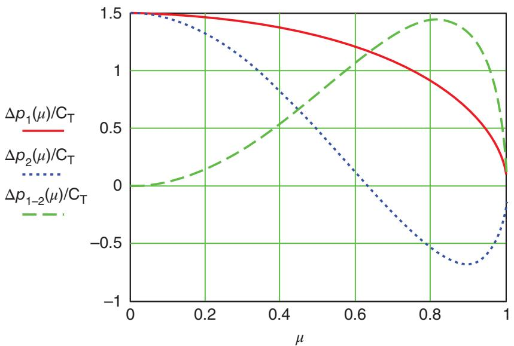

line

| μ    | Δp₁(μ)/Cₜ | Δp₂(μ)/Cₜ | Δp₁₋₂(μ)/Cₜ |
| ---- | --------- | --------- | ----------- |
| 0.0  | 1.5       | 1.5       | 0.0         |
| 0.2  | 1.4       | 1.3       | 0.1         |
| 0.4  | 1.2       | 0.8       | 0.5         |
| 0.6  | 0.9       | 0.3       | 1.0         |
| 0.8  | 0.5       | -0.5      | 1.4         |
| 1.0  | 0.0       | -0.7      | 0.0         |

Figure 4.26 Radial loading distributions of the rrst two solutions and their combination to satisfy the requirements at the rotor axis.

The induced velocity reld caused by the axisymmetric loading distribution has to be obtained from the pressure reld by integrating Eqs. (4.64a)–(4.64c) commencing far upstream where free-stream conditions are assumed to apply. The upstream conditions also depend upon the angle of yaw of the disc. The integration continues until a point on the disc is reached where the induced velocity is to be determined.

The particular induced velocity component that is most important for determining the angle of attack on a blade element is normal to the rotor disc, i.e. the axial induced velocity. Mangler and Squire (1950) calculated the axial induced velocity distribution as a function of yaw angle by expressing the velocity as a Fourier series of the azimuth angle 휓:

$$
\frac {u}{U _ {\infty}} = C _ {T} \left(\frac {A _ {0} (\mu , \gamma)}{2} + \sum_ {k = 1} ^ {\infty} A _ {k} (\mu , \gamma) \sin k \psi\right) \tag {4.69}
$$

For the loading distribution of Eq. (4.68), the Fourier coefrcients in Eq. (4.69) are

$$
A _ {0} (\mu , \gamma) = - \frac {1 5}{8} \mu^ {2} \sqrt {1 - \mu^ {2}} \tag {4.70}
$$

$$
A _ {1} (\mu , \gamma) = - \frac {1 5 \pi}{2 5 6} \mu (9 \mu^ {2} - 4) \tan \frac {\gamma}{2} \tag {4.71}
$$

$$
A _ {3} (\mu , \gamma) = - \frac {4 5 \pi}{2 5 6} \mu^ {3} \tan^ {3} \frac {\gamma}{2} \tag {4.72}
$$

Higher order odd terms are zero while even terms have the general form

$$
A _ {k} = - (- 1) ^ {\frac {k - 2}{2}} \frac {3}{4} \left[ \frac {k + \nu}{k ^ {2} - 1} \left(\frac {9 \nu^ {2} + k ^ {2} - 6}{k ^ {2} - 9}\right) + \frac {3 \nu}{k ^ {2} - 9} \right] \left(\frac {1 - \nu}{1 + \nu}\right) ^ {\frac {k}{2}} \tan^ {\frac {k}{2}} \frac {\gamma}{2} \tag {4.73}
$$

where $\nu ^ { 2 } = 1 - \mu ^ { 2 }$ , and k is an even integer greater than zero.

The average value of the axial induced velocity is independent of yaw angle and is given by

$$
a _ {0} = \frac {u _ {0}}{U _ {\infty}} = \frac {1}{4} C _ {T} \tag {4.74}
$$

where $u _ { 0 }$ is the average axial induced velocity.

Thus, the average value of the axial sow induced velocity is related to the thrust coefrcient by

$$
C _ {T} = 4 a _ {0} \tag {4.75}
$$

compared with the momentum theory, in which $C _ { T } = 4 a _ { 0 } ( 1 - a _ { 0 } )$ , or compared with any of the expressions developed for yawed conditions, Eqs. (4.2), (4.18), and (4.24).

This circular wing theory is linearized with respect to the induced velocities, and hence Eq. (4.75) is only valid if the induced velocity is small compared with the sow velocity so that $a _ { 0 }$ and $\mathrm { C _ { T } }$ are small and terms in ${ { a } _ { 0 } } ^ { 2 }$ and higher powers are ignored.

For non-zero yaw, the once per revolution term in Eq. (4.69) will cause an angle of attack variation and, hence, a lift variation that will cause a yawing moment on the disc.

However, an axisymmetric pressure distribution, such as (4.68), cannot cause a yawing moment. The situation is much the same as for the vortex theory of Coleman et al. (1945).

Pitt and Peters (1981) use or, rather, impose Glauert’s assumption [Eq. (4.21)] for the variation of the axial induced sow factor:

$$
a = a _ {0} + a _ {s} \mu \sin \psi \tag {4.76}
$$

The value of $a _ { s }$ is obtained by equating the rrst moment about the yaw axis of Eq. (4.76) with the rrst moment of (4.69) using the Mangler and Squire velocity distributions of Eqs. (4.70)–(4.73):

$$
\begin{array}{l} \int_ {0} ^ {2 \pi} \int_ {0} ^ {1} \mu \sin \psi (a _ {0} + a _ {s} \mu \sin \psi) \mu d \mu d \psi \\ = - \int_ {0} ^ {2 \pi} \int_ {0} ^ {1} C _ {T} \mu \sin \psi \left(\frac {A _ {0} (\mu , \gamma)}{2} + \sum_ {k = 1} ^ {\infty} A _ {k} (\mu , \gamma) \sin k \psi\right) \mu d \mu d \psi \tag {4.77} \\ \end{array}
$$

All terms, apart from that containing $A _ { I }$ , vanish on integration, giving

$$
a _ {s} = \frac {1 5 \pi}{1 2 8} C _ {T} \tan \frac {\gamma}{2} \tag {4.78}
$$

Hence, using Eq. (4.75), the axial induced velocity becomes

$$
a = a _ {0} \left(1 + \frac {1 5 \pi}{3 2} \mu t a n \frac {\gamma}{2} \sin \psi\right) \tag {4.79}
$$

which, apart from the use of the yaw angle instead of the wake skew angle, has the same form as Eqs. (4.21) and (4.31), and so there is some consistency in the various methods for dealing with yawed sow.

# 4.3.4 The anti-symmetric loading distribution

As determined in Section 4.2.11, there is a moment about the vertical diameter of a yawed wind turbine rotor disc, the restoring yaw moment. An axisymmetric pressure distribution, however, is not capable of producing a yaw moment, so more terms from the series solution of Eq. (4.67) need to be included.

The only terms in Eq. (4.67) that will yield a yawing moment are those for which $m = 1$ and for which $D _ { n } ^ { 1 } \neq 0$ . Terms for which m = 1 and $C _ { n } ^ { 1 } \neq 0$ will cause a tilting moment. Recalling that $m + n$ must be odd to achieve a pressure discontinuity across the disc, the values of n that may be combined with m = 1 must be even.

Because of the nature of the Legendre polynomials, only one term in the series of Eq. (4.67) will produce a net thrust, and only one term will produce a yawing moment, which is a rrst moment. Similarly, only one term will produce a second moment, and so on.

The unique term in (4.67) that yields a yawing moment is that for which $m = 1 , n = 2$ , and $C _ { n } ^ { 1 } \neq 0$ , therefore,

$$
P _ {2} ^ {1} (\nu) = 3 \nu \sqrt {1 - \nu^ {2}} = 3 \mu \sqrt {1 - \mu^ {2}} \tag {4.80}
$$

and

$$
Q _ {2} ^ {1} (\eta) = 3 i \eta \sqrt {1 + \eta^ {2}} \tan^ {- 1} \frac {1}{\eta} - 3 i \sqrt {1 + \eta^ {2}} + \frac {i}{\sqrt {1 + \eta^ {2}}}, \tag {4.81}
$$

so

$$
Q _ {2} ^ {1} (0) = - 2 i \tag {4.82}
$$

A zero pressure gradient at the rotor axis is not appropriate in this case because the pressure distribution is anti-symmetric about the yaw axis, therefore,

$$
\Delta p (\mu , \psi) = P _ {2} ^ {1} (\mu) Q _ {2} ^ {1} (0) D _ {2} ^ {1} \sin \psi = - 6 i D _ {2} ^ {1} \mu \sqrt {1 - \mu^ {2}} \sin \psi \tag {4.83}
$$

This loading distribution is shown in Figure 4.27.

The yawing moment coefrcient is derned by

$$
C _ {m z} = \frac {M _ {z}}{\frac {1}{2} \rho . U _ {\infty} ^ {2} \pi . R ^ {3}} \tag {4.84}
$$

As before, if the loading in Eq. (4.83) is non-dimensionalised by the free-stream dynamic pressure $\frac { 1 } { 2 } \rho . U _ { \infty } ^ { 2 }$ , then

$$
\begin{array}{l} C _ {m z} = \frac {1}{\pi} \int_ {0} ^ {2 \pi} \int_ {0} ^ {1} \mu \sin \psi . \Delta p (\mu , \psi) \mu . d \mu d \psi \\ = - \frac {1}{\pi} 6 i D _ {2} ^ {1} \int_ {0} ^ {1} \mu^ {3} \sqrt {1 - \mu^ {2}} d \mu \int_ {0} ^ {2 \pi} \sin^ {2} \psi . d \psi \tag {4.85} \\ \end{array}
$$

which gives

$$
i D _ {2} ^ {1} = - \frac {5}{4}. C _ {m z} \tag {4.86}
$$

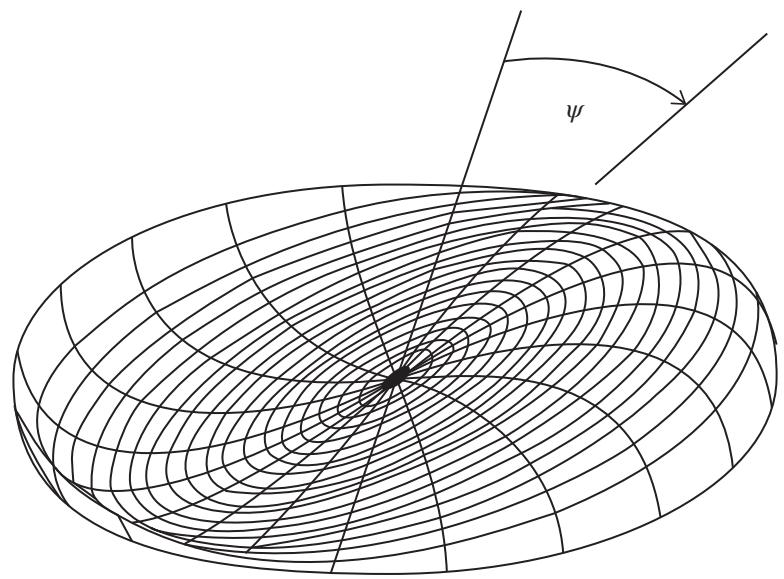

text_image

ψ

Figure 4.27 The form of the loading distribution that yields a yawing moment.

To establish a relationship between the yawing moment coefrcient and the axial velocity induced by the pressure reld corresponding to the loading distribution of Eq. (4.83), the velocity distribution has to be obtained by integrating Eqs. (4.64a)–(4.64c). Unfortunately, no analytical solution has been determined for the anti-symmetric case, as Mangler and Squire have done for the symmetric case. Numerical values of induced velocities need to be calculated from Eqs. (4.64a)–(4.64c) using the coefrcients given by Eqs. (4.80) and (4.82).

Pitt and Peters (1981) have determined the axial velocity distribution for values of the yaw angle from $0 ^ { \circ }$ to $9 0 ^ { \circ }$ : the yaw angle determines the far upstream conditions where the integration commences. The velocity distribution found corresponds to that of Eq. (4.69) for the axisymmetric case. Pitt and Peters again impose the form of Eq. (4.76) and determine the average value of the axial induced velocity $a _ { 0 }$ and the value of $a _ { s }$ , using the same method of Eq. (4.77): in both cases, of course, numerical integration is necessary.

The values of $a _ { 0 }$ are not zero, as might have been expected from the anti-symmetric loading distribution, and have the same factor as in the result for $a _ { s }$ in Eq. (4.78) found for the axisymmetric loading distribution, but now multiplying the yaw moment coefrcient. The variation of the two coefrcients $a _ { 0 }$ and $a _ { s }$ with yaw angle $\gamma$ is determined numerically, but, using the Mangler and Squire analytical forms for guidance, analytical variations can be inferred. Pitt and Peters found that the linearised axial induced velocity distribution is

$$
a _ {0} = - \frac {1 5}{1 2 8} \pi \tan \frac {\gamma}{2} C _ {m z} \tag {4.87}
$$

and

$$
a _ {s} = - \left(1 - \tan^ {2} \frac {\gamma}{2}\right) C _ {m z} \tag {4.88}
$$

Pitt and Peters also include a cosine term with induction coefrcient $\pmb { a } _ { c }$ in the linearised axial induced sow factor representation of Eq. (4.76) that will only arise if $C _ { 2 } ^ { 1 } \neq 0 ;$ :

$$
a = a _ {0} + a _ {s} \mu \sin \psi + a _ {c} \mu \cos \psi \tag {4.89}
$$

in which case there is an additional contribution to the pressure drop given by

$$
\Delta p (\mu , \psi) = P _ {2} ^ {1} (\mu) Q _ {2} ^ {1} (0) C _ {2} ^ {1} \cos \psi = - 6 i C _ {2} ^ {1} \mu \sqrt {1 - \mu^ {2}} \cos \psi \tag {4.90}
$$

The tilting moment coefrcient is given by

$$
\begin{array}{l} C _ {m y} = \frac {1}{\pi} \int_ {0} ^ {2 \pi} \int_ {0} ^ {1} \mu \cos \psi \Delta p (\mu , \psi) \mu . d \mu . d \psi \\ = - \frac {1}{\pi} 6 i C _ {2} ^ {1} \int_ {0} ^ {1} \mu^ {3} \sqrt {1 - \mu^ {2}} d \mu \int_ {0} ^ {2 \pi} \cos^ {2} \psi . d \psi \tag {4.91} \\ \end{array}
$$

Therefore,

$$
i C _ {2} ^ {1} = - \frac {5}{4} C _ {m y} \tag {4.92}
$$

The axial induced velocity distribution resulting from the pressure reld corresponding to the loading distribution of Eq. (4.90) is calculated by numerical integration of Eqs. (4.64a)–(4.64c) and is then matched with the linear velocity distribution of Eq. (4.89) using again the same method for Eq. (4.77):

$$
\begin{array}{l} \int_ {0} ^ {2 \pi} \int_ {0} ^ {1} \mu \cos \psi (a _ {0} + a _ {c} \mu \cos \psi) 2 \pi \mu d \mu d \psi \\ = \int_ {0} ^ {2 \pi} \int_ {0} ^ {1} \mu \cos \psi C _ {T} \left(\frac {1}{2} A _ {0} (\mu , \gamma) + \sum_ {k = 1} ^ {\infty} A _ {k} (\mu , \gamma) \cos k \psi\right) \mu d \mu d \psi \tag {4.93} \\ \end{array}
$$

the functions $A _ { n } ( \mu , \gamma )$ being then determined numerically.

Again, using the Mangler and Squire results as guidance, an expression for $a _ { c }$ is found:

$$
a _ {c} = - \sec^ {2} \frac {\gamma}{2}. C _ {m y} \tag {4.94}
$$

# 4.3.5 The Pitt and Peters model

Pitt and Peters (1981) have developed the linear theory that relates the axial induced sow factors to the thrust and moment coefrcients given in Eqs. (4.75), (4.78), (4.87), (4.88), (4.89), and (4.94) expressed in matrix form:

$$
\left[ \begin{array}{c} a _ {0} \\ a _ {c} \\ a _ {s} \end{array} \right] = \left[ \begin{array}{c c c} \frac {1}{4} & 0 & - \frac {1 5}{1 2 8} \pi \tan \frac {\chi}{2} \\ 0 & - \sec^ {2} \frac {\chi}{2} & 0 \\ \frac {1 5}{1 2 8} \pi \tan \frac {\chi}{2} & 0 & - \left(1 - \tan^ {2} \frac {\chi}{2}\right) \end{array} \right] \left[ \begin{array}{c} C _ {T} \\ C _ {m y} \\ C _ {m z} \end{array} \right] \tag {4.95}
$$

$$
(a) = [ L ] (C) \tag {4.96}
$$

The solution procedure is to assume initial values for the vector (a) from which the values of the vector (C) can be calculated from blade element theory. New values of (a) are then found from Eq. (4.94), and an iteration proceeds.

For the wind turbine the value of $a _ { 0 }$ may not be small compared with 1, and so the above procedure will converge on values of $a _ { 0 }$ that are too small compared with what the momentum theory would deliver.

To produce more realistic results, that is, results in line with Glauert’s momentum theory, the expression for $C _ { T }$ may be taken as

$$
C _ {T} = 4 a \sqrt {1 - a (2 \cos \gamma - a)} = 4 a A _ {G} (a) \tag {4.97}
$$

or, from the Coleman theory,

$$
C _ {T} = 4 a \left(\cos \gamma + \tan \frac {\chi}{2} \sin \gamma - a \sec^ {2} \frac {\chi}{2}\right) = 4 a A _ {C} (a) \tag {4.98}
$$

The matrix [L] then becomes

$$
[ L ] = \left[ \begin{array}{c c c} \frac {1}{4 A (a _ {0})} & 0 & - \frac {1 5}{1 2 8} \pi \tan \frac {\chi}{2} \\ 0 & - \sec^ {2} \frac {\chi}{2} & 0 \\ \frac {1 5}{1 2 8 A (a _ {0})} \pi \tan \frac {\chi}{2} & 0 & - \left(1 - \tan^ {2} \frac {\chi}{2}\right) \end{array} \right] \tag {4.99}
$$

where $A ( a _ { 0 } )$ is chosen according to which momentum theory is to be used. Note that it is usual, as in the above, for the wake skew angle to be used in matrix [L] instead of the yaw angle. This does give a sinusoidal yawing moment on a three bladed rotor because the lift force depends non-linearly on the sinusoidal axial induction factor.

The Pitt and Peters method does not include any determination of induced velocities in the plane of the rotor disc, and as a consequence it is not possible to account for wake rotation. From Eqs. (4.64a)–(4.64c) the tangential (azimuthal) velocity is proportional to 휕p/휕휓, and the form of the Kinner solution, therefore, does not give any contribution that has non-zero average over $0 < \Psi < 2 \pi$ . The momentum theory of Section 3.3 can, but it predicts an inrnite pressure at the axis of rotation because of wake rotation, as also does any model involving a rnite strength shed vortex along the axis from the blade root. In practice, of course, the bound vorticity (circulation) must decrease to zero at a rnite rate at the blade root (axis) as well as at the tip, and the singularity does not occur.

With or without wake rotation, a sow angle 휙 can be determined from which a torque can be found. The normal force due to the lift on an element of the rotor disc is equal to 훿L cos 휙, and the tangential force is 훿L sin 휙.

# 4.3.6 The general acceleration potential method

Peters with a number of associates has developed the theory further, and a reading of references Pitt and Peters (1981), Goankar and Peters (1988), and HaQuang and Peters (1988) is recommended.

The acceleration potential method has been developed specircally for wind turbines by van Bussell (1995), where a much more comprehensive account of the theory is given.

The coefrcients for the terms in the Kinner pressure distribution can be determined from the incident normal velocity reld at the rotor disc from a sufrcient number of points over the disc, matching the forces with blade element theory.

# 4.3.7 Comparison of methods

A project to compare existing methods of predicting yaw behaviour, among other aspects of the aerodynamic behaviour of wind turbines, is reported in Snel and Schepers (1995). Figure 4.28 shows results obtained by various methods for predicting the yawing moment of the 2 MW, three blade turbine at Tjæreborg in Denmark at a yaw angle of $3 2 ^ { \circ }$ and a wind speed of 8.5 m/s.

Most of the theoretical predictions in Figure 4.28 have the correct or nearly correct phasing and approximately the correct mean yawing moment, but the amplitude of the predicted cyclic variation in the yawing moment varies considerably between methods, generally being under-predictions. In this comparison, the second method bears the closest comparison with the measured data.

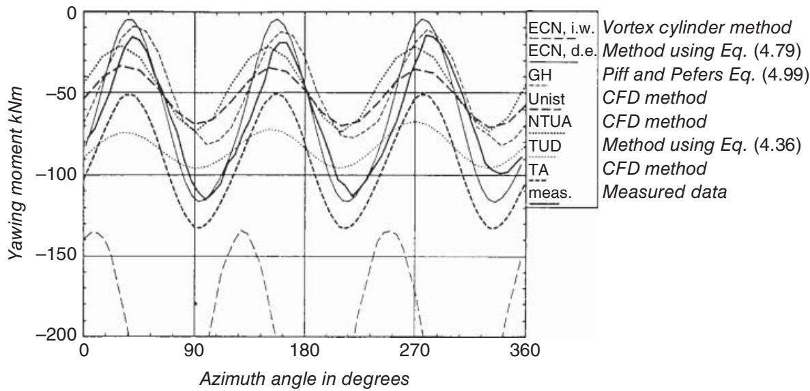  
Figure 4.28 Yawing moment on the Tjæreborg turbine at 32∘ yaw and 8.5 m/s.

# 4.4 Unsteady Kow

# 4.4.1 Introduction

The momentum theories (actuator disc and blade-element/momentum) are fundamentally steady sow theories because of the requirement to consider the far downstream wake conditions in calculating force on the rotor. This approach ignores the time over which the wake takes to develop to a steady state after changes in conditions (e.g. the incident wind speed or the blade pitch angle) have occurred at some given time at the rotor. Natural winds are almost never steady in either strength or direction, and so it is seldom that the conditions for the momentum theory apply. It takes a rnite time for the wind to travel from far upwind of a rotor to far downwind, and if in that time wind conditions change, the new equilibrium state if ever achieved lags the change.

In addition to changes in incident wind speed, many other phenomena give rise to time-dependent conditions at the rotor: cyclic changes in incident wind speed experienced by the blades as they rotate through the mean shear in the wind, due to yaw error of the rotor and due to blade interaction with the sow around the tower; sudden control operations such as changes in blade pitch or rotor speed; and multi-frequency blade vibrations due to the structural dynamics of the system.

Several approximate solutions offer themselves for the determination of the dynamic sow conditions at the rotor disc. It could be assumed that the induced velocity remains rxed at the level determined by the averaged wind speed over a specired period of time that may be quite short. The wake remains frozen while the unsteady component of the wind passes through the rotor disc unattenuated by the action of the rotor. The unsteady forces that would impose zero mean force on the rotor would be determined by the blade element theory. Alternatively, the induced velocity through the rotor disc could be determined from the instantaneous wind velocity as if the sow reld was steady and the wake adjusted instantaneously, equilibrium in the wake being maintained at all times. However, in reality the wake takes a rnite time (typically a few rotor cycles) to equilibriate, and the resulting lag in wake effect at the rotor is known as dynamic inTow. It is responsible for considerable over- or under-shoots in blade loading when the blade pitch changes suddenly and to a lesser extent when the incident velocity changes.

The acceleration potential method is one method of analysing unsteady sows, which by making assumptions about the wake avoids explicit reference to it. It allows the sow conditions at the rotor disc to be determined from the upwind sow reld, which is much simpler to determine than that of the wake.

In steady sow conditions, the velocity at a rxed point in the far upwind sow reld is constant, btakes place $\begin{array} { r } { ( { \mathrm { e . g . ~ } } \sim u \frac { \partial u } { \partial x } } \end{array}$ the rotor acceleration of the sow experienced by a suid particle    in the x direction); there is no rate of change with time of the velocity at any rxed point in space (thus, for example, $\begin{array} { r } { \frac { \partial u } { \partial t } = 0 ) } \end{array}$ . In unsteady sow, conditions at a rxed point do change with time, and the total acceleration in the x direction is then $\begin{array} { r } { \frac { \partial u } { \partial t } + u \frac { \partial \hat { u _ { } } } { \partial x } } \end{array}$ . The additional acceleration causes an additional inertia effect in the 휕t 휕x sow, the reaction to which changes the force on the rotor disc. The additional force is often termed the added mass force because for a body accelerating in a steady suid, the additional force appears as an additional apparent mass of suid $m _ { a }$ attached to the body.

# 4.4.2 The acceleration potential method to analyse unsteady Kow

By assuming that the velocities induced by the action of the rotor are small compared with the incident sow, the inviscid Euler equations describing the sow reld may be linearized and taken with the condition for continuity of the sow,

$$
\frac {\partial u}{\partial x} + \frac {\partial v}{\partial y} + \frac {\partial w}{\partial z} = 0 \tag {4.100}
$$

to show that the perturbation pressure reld due to the rotor satisres Laplace’s equation

$$
\frac {\partial^ {2} p}{\partial x ^ {2}} + \frac {\partial^ {2} p}{\partial y ^ {2}} + \frac {\partial^ {2} p}{\partial z ^ {2}} = 0 \tag {4.101}
$$

Because the perturbation pressure p satisres

$$
\frac {\nabla p}{\rho} = - \frac {\partial u}{\partial t} - U _ {\infty} \nabla u \tag {4.102}
$$

it is often called an acceleration potential.

By transforming the problem of unsteady sow past an actuator disc into ellipsoidal coordinates (ν, η, ψ) and as in Section 4.3.2 deriving a series solution in terms of Legendre polynomials, a result can be obtained from the Kinner pressure distributions, which combines all unsteady wake effects with the inertia as added mass.

The analysis gives the added mass for the actuator disc to be

$$
m _ {a} = \frac {1 2 8}{7 5} \rho R ^ {3} \tag {4.103}
$$

This may be compared with the value of $\mathrm { m _ { a } } = ( 8 / 3 ) \mathrm { \rho R } ^ { 3 }$ for a solid disc given by, e.g. Tuckerman (1925). Although Pitt and Peters (1981) determine the value 128/75, in subsequent papers by Peters and other workers the value 8/3 is recommended and has come to be generally accepted. The resulting time constant for the dynamic insow decay rate associated (Leishman 2002) with an added mass of $( 8 / 3 ) \mathrm { \ p R } ^ { 3 }$ is approximately 0.086R/(σ $\mathrm { U } _ { \infty } )$ , where σ is the rotor solidity, which is typically about 1.5 rotor revolutions and approximately correct.

# 4.4.3 Unsteady yawing and tilting moments

For unsteady sow in yaw, the normal unsteady acceleration potential distribution on the disc is required to have the same form of linear variation as the velocity, given in Eq. (4.89) in terms of sow factors:

$$
\frac {\partial a}{\partial \tau} = \frac {\partial a _ {0}}{\partial \tau} + \frac {\partial a _ {s}}{\partial \tau} \mu \sin \psi + \frac {\partial a _ {c}}{\partial \tau} \mu \cos \psi \tag {4.104}
$$

where rotor non-dimensional time $\tau = \mathrm { U } _ { \infty } \mathrm { t } / \mathrm { R }$ .

The condition that causes a yawing moment arises from the anti-symmetric loading distribution of Section 4.3.4 and can be obtained from Eqs. (4.80)–(4.83). The pressure reld surrounding the rotor disc corresponding to this loading distribution (see Section 4.3.2) is

$$
p (\nu , \eta , \psi) = - \frac {3}{2} D _ {2} ^ {1} \nu \sqrt {1 - \nu^ {2}} \left(3 i \eta \sqrt {1 + \eta^ {2}} \tan^ {- 1} \frac {1}{\eta} - 3 i \sqrt {1 + \eta^ {2}} + \frac {i}{\sqrt {1 + \eta^ {2}}}\right) \sin \psi \tag {4.105}
$$

which, on the disc, produces the loading shown in Figure 4.27. The coefrcient $D _ { 2 } ^ { 1 }$ is related to the yawing moment coefrcient in Eq. (4.85); see Eq. (4.86):

$$
i D _ {2} ^ {1} = - \frac {5}{4} C _ {m z}
$$

Therefore,

$$
p (\nu , \eta , \psi) = \frac {1 5}{8} \pi . C _ {m z} \nu \sqrt {1 - \nu^ {2}} \left(3 \eta \sqrt {1 + \eta^ {2}} \tan^ {- 1} \frac {1}{\eta} - 3 \sqrt {1 + \eta^ {2}} + \frac {1}{\sqrt {1 + \eta^ {2}}}\right) \sin \psi \tag {4.106}
$$

As before, the pressure $\mathfrak { p } ( \nu , \ \mathfrak { n } , \ \Psi )$ in Eq. (4.106) is non-dimensionalised by the free-stream dynamic pressure ${ \textstyle \frac { 1 } { 7 } } \rho . U _ { \infty } ^ { 2 }$ .

Using the linearised relationship between perturbation velocity and pressure [Eq. (4.102)] and relating $x ^ { \prime \prime }$ to ν and η to differentiate Eq. (4.106) with respect to $\mathrm { \mathbf { X } } ^ { \prime \prime }$ , we get at the rotor disc, where $\mathfrak { n } = 0$ ,

$$
\frac {\partial u _ {s}}{\partial t} = \frac {4 5}{3 2} \pi \frac {U _ {\infty} ^ {2}}{R} C _ {m z D} \mu \sin \psi \tag {4.107}
$$

In terms of non-dimensional time and velocity

$$
\frac {\partial a _ {s}}{\partial \tau} = \frac {4 5}{3 2} \pi C _ {m z D} \mu \sin \psi \tag {4.108}
$$

Similarly, if there is a tilting moment then the corresponding acceleration is

$$
\frac {\partial a _ {c}}{\partial \tau} = \frac {4 5}{3 2} \pi C _ {m y D} \mu \cos \psi \tag {4.109}
$$

The subscript D in the above equations denotes inertia force contributions due to sow acceleration $\partial U _ { \infty } / \partial t$ , which would be added mass in the case of $C _ { \mathrm { T } }$ .

The radial variation is linear, and so no linearisation adjustment is necessary as there is in the case of the velocity distribution. Again, the acceleration potential is independent of yaw angle. The mean acceleration potential is zero, and so there is no coupling between the cases.

The relationship between acceleration potential sow factors and force coefrcients is, therefore,

$$
\left[ \begin{array}{c c c} \frac {1 6}{3 \pi} & 0 & 0 \\ 0 & \frac {3 2}{4 5 \pi} & 0 \\ 0 & 0 & \frac {3 2}{4 5 \pi} \end{array} \right] \left[ \begin{array}{l} \frac {\partial a _ {0}}{\partial \tau} \\ \frac {\partial a _ {c}}{\partial \tau} \\ \frac {\partial a _ {s}}{\partial \tau} \end{array} \right] = \left[ \begin{array}{l} C _ {T} \\ C _ {m y} \\ C _ {m z} \end{array} \right] _ {D} \tag {4.110}
$$

or

$$
[ M ] \left\{\frac {\partial a}{\partial \tau} \right\} = \{C \} _ {D} \tag {4.111}
$$

The complete equation of motion combines Eq. (4.111) and the steady yaw Eqs. (4.95) and (4.96). The combination is achieved by adding the corresponding force coefrcients, and the combined equation must be inverted:

$$
[ M ] \left\{\frac {\partial a}{\partial \tau} \right\} + [ L ] ^ {- 1} \{a \} = \{C \} _ {D} + \{C \} _ {S} \tag {4.112}
$$

The right hand side of Eq. (4.112) can also be determined from blade element theory and will be a time-dependent function of the insow factor. The blade forces will vary in a manner determined by the time-varying velocity of the oncoming wind and consequent dynamic structural desections of the necessarily elastic rotor. Equation (4.112) applies to the whole rotor disc, and the blade element forces need to be integrated along the blade lengths.

Numerical solutions to Eq. (4.112) require a procedure for dealing with rrst order differential equations, and the increased accuracy of the fourth order Runge–Kutta method is recommended. Starting with a steady state solution, the progress in time of the induced velocity as an unsteady sow passes through the rotor can be tracked. Non-dimensionalisation with respect to mean wind speed is possible, but it is common to work directly in terms of induced velocity rather than sow factors.

Equation (4.112) really applies to the whole rotor, and the only spatial variation of the induced velocity and acceleration potential that is permitted is as derned in Eq. (4.89) and from (4.104). However, an alternative approach considering radial variation has been adopted by several workers, see, for example, Snel and Schepers (1995), where the induced velocities are determined for separate annular rings, as described in Section 4.2.7. The added mass term for an annular ring can be taken as a proportion of the whole added mass according to the appropriate acceleration potential distribution.

Figure 4.29 shows measured and calculated sapwise (out of the rotor plane) blade root bending moments for the Tjæreborg turbine caused by a pitch change from 0.070∘ to $3 . 7 1 6 ^ { \circ }$ with the reversed change 30 seconds later. The turbine was not in yaw, and the wind speed was 8.7 m/s. The calculated results were made according to the equilibrium wake method and with a differential equation method similar to that of Eq. (4.112).

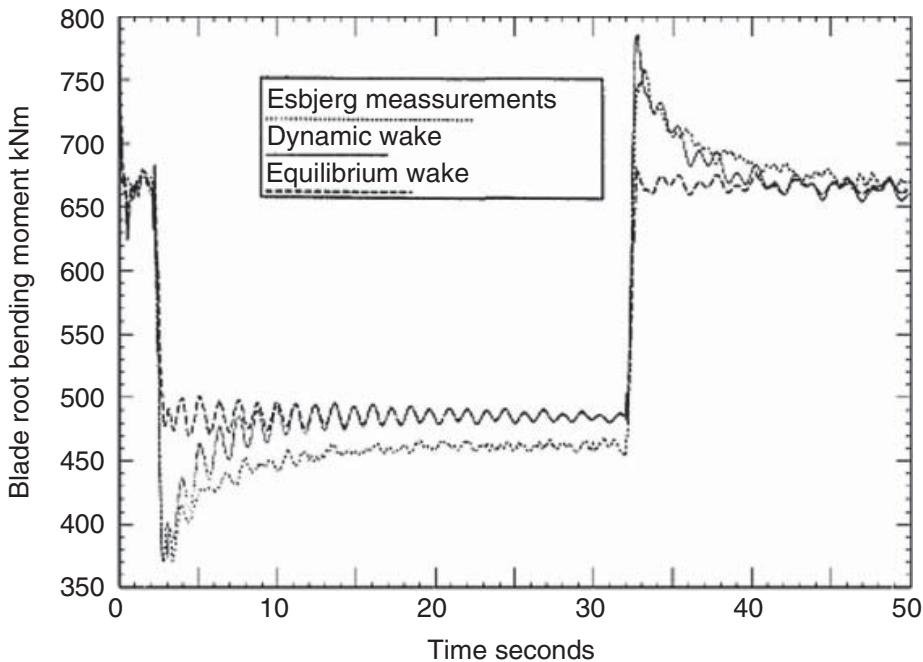

line

| Time seconds | Esbjerg measurements | Dynamic wake | Equilibrium wake |
| ------------ | --------------------- | ------------ | ---------------- |
| 0            | 680                   | 670          | 660              |
| 5            | 480                   | 490          | 470              |
| 10           | 490                   | 480          | 460              |
| 15           | 480                   | 470          | 450              |
| 20           | 490                   | 480          | 460              |
| 25           | 480                   | 470          | 450              |
| 30           | 490                   | 480          | 460              |
| 35           | 780                   | 770          | 760              |
| 40           | 680                   | 670          | 660              |
| 45           | 670                   | 660          | 650              |
| 50           | 660                   | 650          | 640              |

Figure 4.29 Measured and calculated blade root bending moment responses to blade pitch angle changes on the Tjæreborg turbine. Source: From Lindenburg (1996).

The comparison with the measured results clearly shows that the dynamic analysis predicts the initial overshoot in bending moment, whereas the equilibrium wake method does not. Neither theory predicts very accurately the steady state bending moment achieved between the pitch changes. Figure 4.29 is taken from Lindenburg (1996), describing the PHATAS III aero-elastic code developed at ECN in the Netherlands. The Tjæreborg turbine is sited near Esbjerg in Denmark, details of which can be obtained from Snel and Schepers (1995).

The solution procedure requires the time-varying blade element force to determine the right hand side of Eq. (4.112), but calculating the lift and drag forces on a blade element in unsteady sow conditions is not a straightforward process. The lift force on a blade element is dependent upon the circulation, which is changing. The changing circulation causes spanwise (radial) vorticity to be shed into the blade wake. The velocity reld that is induced by this modires the angle of attack, which in turn determines the circulation. Therefore, in a continuously changing situation the lift is not in phase with the original angle of attack given by the incident sow and does not have a magnitude that can be determined using static, 2-D aerofoil lift versus angle of attack data.

The overshoot in blade forces after a sudden change in blade pitch angle is due to the lag in build-up of a new wake and hence of the changed asymptotic wake induction factor. This dynamic inTow resulting from a sudden pitch change is a strong effect. A similar but weaker effect (see, e.g. McNae 2014) occurs as a result of sudden changes in incident wind speed. Several simpler approximate methods have been developed to predict this effect without the need for extensive analysis and computation. An example is the method of Øye (1992), which solves a linked pair of rrst order differential equations for the induction factor development over time.

# 4.5 Unsteady aerofoil aerodynamics

# 4.5.1 Introduction

Section 4.5 focuses on unsteady effects on a blade section, which are the most important when the frequency is high, in which case the spanwise shed vorticity is dominant and the sow can be considered locally to be effectively 2-D. Three-dimensional (3-D) effects including changes to streamwise vorticity (e.g. the helical wake vortices) are smaller and usually not considered.

As already discussed, when a rotor blade section encounters changing sow conditions, inertial effects occur associated with the temporal accelerations in the sow reld as well as effects of the changing vorticity shed into the wake due to the changes in circulation occurring on the blades. This shed vorticity is normal to the section and aligned with the spanwise direction. A complete solution for a rotor blade or blades needs to be done in three dimensions and time, which usually requires a very intensive level of computation, discussed later. However, the concept of blade element analysis incorporated into annular momentum balances for the steady component of the sow is possibly more appropriate for unsteady sow, and local unsteady aerofoil analysis may be applied at the section level.

When the oncoming sow relative to the aerofoil section is unsteady, the angle of attack is continuously changing, and so the lift also is changing with time. This may be dealt with quasi-steadily by assuming that the instantaneous angle of attack corresponds to the same lift coefrcient as if that angle of attack were steady, determined by the instantaneous oncoming sow velocity and the velocity of the blade’s motion. Thin aerofoil theory (see, e.g. Anderson 1991) shows that using a single point to determine the blade circulation from the effective angle of attack due to relative velocity normal to the blade (e.g. blade pitching or sapping) is optimum when at 3/4 of the chord length from the leading edge.

The velocities that determine the effective quasi-steady angle of attack for a rotor blade element are shown in Figure 4.30; the dot represents differentiation with respect to time t.

The sow velocity W(t), which includes the rotational speed of the blade element, varies in magnitude and direction $\alpha _ { w } ( t )$ with the unsteady wind. $W ( t )$ also includes the induced velocities caused by the rotor disc as might be determined by Eq. (4.112). The elastic desection velocities (subscript e) caused by blade vibration also insuence the

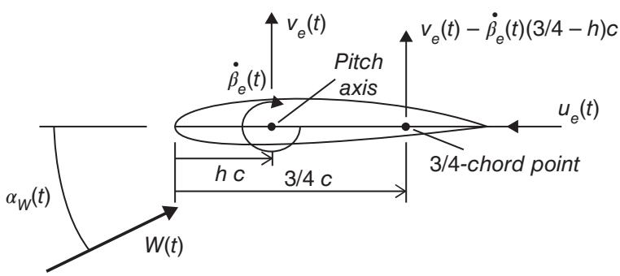

text_image

v_e(t)
β̇_e(t)
Pitch
axis
v_e(t) - β̇_e(t)(3/4 - h)c
u_e(t)
h c 3/4 c
3/4-chord point
α_W(t)
W(t)

Figure 4.30 Unsteady sow and structural velocities adjacent to a rotor blade.

quasi-steady angle of attack, which is

$$
\alpha (t) = \alpha_ {w} (t) - \left(v _ {e} (t) - \frac {\partial \beta_ {e}}{\partial t} \left(\frac {3}{4} - h\right) c\right) \frac {1}{W (t)} \tag {4.113}
$$

The structural velocity caused by chordwise (edgewise) desections of the blade will also insuence the angle of attack but by a very small amount. The non-dimensional parameter h dernes the position of the pitching axis (sexural axis, shear centre position) of the blade element.

Assuming the structural desection velocities to be small, the lift force is then

$$
L _ {c} (t) = L _ {c 0} + \frac {1}{2} \rho W (t) ^ {2} c \frac {d C _ {l}}{d \alpha} \sin \alpha (t) \tag {4.114}
$$

The lift-curve slope dCl $\frac { d C _ { l } } { d \alpha }$ is assumed here to be the same as for the static case.

훼 This quasi-steady approach is satisfactory provided the characteristic timescale of the changes $\tau > > \mathrm { c } / \mathrm { W } _ { \mathrm { r e l } }$ , where $\mathrm { W } _ { \mathrm { r e l } }$ is the local incident sow velocity relative to the aerofoil section.

# 4.5.2 Aerodynamic forces caused by aerofoil acceleration

If an aerofoil is moving with changing velocity there are, in addition to the circulatory forces, the added mass forces on the aerofoil caused by the inertia of the surrounding air that is accelerated as the aerofoil accelerates. The added mass $\mathrm { { m _ { a } } }$ per unit span of blade can be shown to be equivalent to the mass of a circular cylinder of air of diameter equal to the aerofoil chord, so $\begin{array} { r } { \mathbf { m } _ { \mathrm { a } } = \frac { \pi c ^ { 2 } } { 4 } \rho } \end{array}$ 휋c2 . There are two components to the added mass force; see Fung (1969):

1) A lift force with the centre of pressure at the mid-chord point with value equal to the added mass times the normal acceleration of the mid-chord point:

$$
L _ {m 1} (t) = - \frac {1}{4} \pi c ^ {2} \rho \left(\frac {\partial v _ {e}}{\partial t} - c \left(\frac {1}{2} - h\right) \frac {\partial^ {2} \beta_ {e}}{\partial t ^ {2}}\right) \tag {4.115}
$$

2) A lift force with the centre of pressure at the 3/4-chord point, of the nature of a rotational inertia force, with value equal to the added mass times $\begin{array} { r } { W ( t ) \frac { \partial \beta _ { e } } { \partial t } } \end{array}$ :

$$
L _ {m 2} (t) = - \frac {1}{4} \pi c ^ {2} \rho W (t) \frac {\partial \beta_ {e}}{\partial t} \tag {4.116}
$$

There is also a nose-down pitching moment equal to an added moment of inertia $\textstyle \mathrm { I _ { a } } = { \frac { \pi } { 1 2 8 } } c ^ { 4 } \rho$ times the pitching acceleration $\frac { \partial ^ { 2 } \beta _ { e } } { \partial t ^ { 2 } }$ :

$$
M _ {m} = \frac {\pi}{1 2 8} c ^ {4} \rho \frac {\partial^ {2} \beta_ {e}}{\partial t ^ {2}} \tag {4.117}
$$

(Note that $\mathrm { I _ { a } }$ is equivalent to the inertia of a cylinder of diameter $c / \sqrt { 2 }$ and only a quarter of the moment of inertia per unit length of the added mass cylinder of air of diameter c.)

Inertia forces arise similarly on a body in an incident sow that is varying in time, such as due to turbulent gusts in the wind. In this case, there is an additional (Archimedes type of buoyancy) force arising from the pressure gradients in the suid associated with the incident sow accelerations acting on the volume of the body. These can be important when the suid has an appreciable density, such as water, but are not usually so for air or where the section is thin, such as an aerofoil, and they are then normally ignored.

In addition to inertia forces, the spanwise vorticity shed into the wake as a result of changing circulation induces signircant velocities that add to those in Figure 4.30.

# 4.5.3 The effect of the shed vortex wake on an aerofoil in unsteady Kow

If the effective angle of attack of the sow relative to an aerofoil changes, the strength of the circulation also changes, but more slowly than steady sow theory would predict lagging the change in angle of attack. It is useful rrst to determine how the lift on an aerofoil actually develops with time after an impulsive change of angle of attack occurs, including the effect of the wake in the analysis. For example, if a sudden increase of 훼 causes a build-up of circulation around the aerofoil, then due to Kelvin’s theorem of conservation of circulation in the whole sow, this change must be matched by vorticity of equal and opposite circulation being shed into the wake.

The bound circulation on an aerofoil is the sum of the circulation of the vortex sheet distributed around the surface of the aerofoil (or along the chord in the thin aerofoil approximation). For simplicity, it is often represented by a concentrated vortex 훤 at the aerodynamic centre (1/4-chord point). In steady sow conditions, the boundary condition that no sow penetrates the aerofoil surface anywhere can be replaced approximately by the simplired single-point condition discussed in Section 4.5.1 that the velocity induced by the vortex 훤 , normal to the chord line, at the 3/4-chord point is exactly equal and opposite to the component of the sow velocity normal to the chord line. This approximation gives the correct result for cases of simple camber or sapping or pitching motion. Hence the 3/4-chord point is used generally as the control point for this simplired model of the sow, which assumes that the aerofoil can be represented by conditions applied at its chord line, the thin aerofoil representation.

In unsteady sow conditions, the presence of a shed vortex wake means that the velocity (often referred to as downwash) induced at the 3/4-chord point is caused jointly by the bound vortex and the wake vorticity; see Figure 4.31. But to continue satisfying the no penetrating sow boundary condition, the bound circulation vortex Γ must adjust so that the downwash that it and the wake vortices induce is still equal and opposite to the upwash component of the incident sow velocity normal to the chord line.

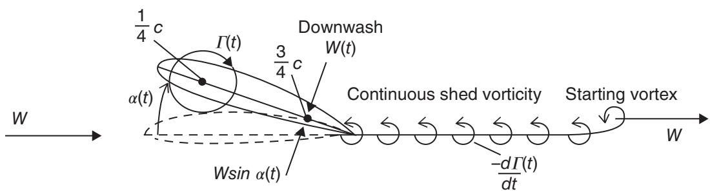

text_image

W
1/4 c
Γ(t)
3/4 c
Downwash
W(t)
α(t)
Continuous shed vorticity
Starting vortex
Wsin α(t)
-dΓ(t)/dt

Figure 4.31 Wake development after an impulsive change of angle of attack.

After an impulsive change of angle of attack, there is a sudden change in this upwash component (W sin 훼), against which the aerofoil induces a downwash. These changes of the sow around the aerofoil cause both the growth of circulatory lift and added mass force on the aerofoil. The rapidly increasing circulation must be matched by equal and opposite strength vorticity being shed into the wake, which rolls up into a ‘starting vortex’ and convects downstream. In the linearised analysis the wake vorticity is approximated by a growing length of planar sheet aligned with the free-stream direction. The insuence of the starting vortex on the downwash gets gradually weaker as the starting vortex moves away, and the bound vortex thus increases in strength with time to maintain the total downwash continuing to match the upwash. The increasing strength of the bound vortex means that, to conserve the overall angular momentum of the sow (an alternative statement of Kelvin’s theorem), continuous vorticity of the opposite sense must be shed into the wake, which in turn contributes to the downwash.

This process continues, setting up a decreasingly positive rate of change of bound circulation and accompanying shedding of vorticity into the wake as the steady condition appropriate to the new angle of attack is asymptotically approached. In reality, the shed vortex wake sheet, strongest at the starting vortex, tends to roll up about that vortex and deviate somewhat from a plane shape, as shown in Figure 4.31 (see also Graham 1983).

However, for thin aerofoil sections and small angles of attack, an analytical solution to the problem can be obtained following the thin aerofoil approximations. The bound vorticity is assumed distributed over the aerofoil chord line, and a plane wake is assumed to develop convecting at the free-stream speed. The solution rrst obtained by Wagner (1925) is complex and expressed in terms of Bessel functions, but several approximations exist for the Wagner indicial function (i.e. response to a step change), the most used being the one given by Jones (1945):

$$
\frac {L _ {c} (\tau)}{\frac {1}{2} \rho W ^ {2} c \frac {d C _ {l}}{d \alpha} \sin \alpha} = \Phi (\tau) = 1 - 0. 1 6 5 e ^ {- 0. 0 4 5 5 \tau} - 0. 3 3 5 e ^ {- 0. 3 0 \tau} \tag {4.118}
$$

where 휏 = 2Wt/c is the non-dimensional time for the aerofoil (as distinct from the non-dimensional time for the whole rotor in Section 4.4.3) based upon the half-chord length $\frac { c } { 2 }$ of the aerofoil. $\frac { d C _ { l } } { d \alpha }$ is the slope of the static lift versus angle of attack characteristic of the aerofoil. This non-dimensional time 휏 can also be regarded as the number of half-chord lengths travelled downstream by the starting vortex after a time t has elapsed since the impulsive change of angle of attack. Equation (4.118) describes the indicial function shown in Figure 4.32.

Figure 4.32 shows the progression of the growth of the lift as time proceeds from the original impulsive change of angle of attack when the combination of circulatory and non-circulatory lift immediately takes half the rnal value. The steady state, full circulatory lift is achieved asymptotically.

In the situation where the angle of attack is continuously changing, which is the case, for example, for a vibrating wind turbine blade, the circulation never reaches an equilibrium state and the added mass lift never dies away. Thin aerofoil theory being a linear theory, the continuous variation in angle of attack may be built up from a sequence of impulsive steps, each of which generates a small increment in lift following the Wagner function.

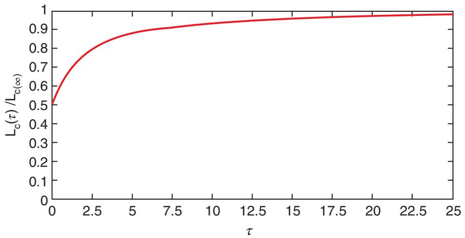

line

| τ   | L_c(τ)/L_c(∞) |
| --- | ------------- |
| 0   | 0.5           |
| 2.5 | 0.7           |
| 5   | 0.85          |
| 7.5 | 0.9           |
| 10  | 0.92          |
| 12.5| 0.93          |
| 15  | 0.94          |
| 17.5| 0.95          |
| 20  | 0.96          |
| 22.5| 0.97          |
| 25  | 0.98          |

Figure 4.32 Lift development after an impulsive change of angle of attack.

Similarly, if the blade is subject to an impulsive change in the incident wind so that the blade section ‘cuts through’ the non-uniform wind prorle, a lift response similar to the Wagner response to impulsive change in angle of attack takes place. This problem was rrst solved by Kussner (1936), and response to continuous changes in incident velocity may similarly be built up from a sequence of impulsive increments using the Kussner function.

However, an alternative to the impulsive response method for continuous changes (of body motion or incident velocity) is to calculate them as a sum of sinusoidal time variations (a Fourier decomposition). These may also be analysed from rrst principles by considering continuous response of the body to a sinusoidal input. The method follows the theories developed by Theodorsen (1935) and Sears (1941). In practice, this analysis based on response to sinusoidal inputs is the better where it is desired to evaluate spectral and stochastic responses, and the use of inpulse responses is the better for evaluating response to arbitrary deterministic inputs such as deterministic gusts or control actions.

The impulsive response technique can be expressed by a convolution integral as follows.

Assume that the sow has been in progress for a long time, $t _ { o } ,$ , and let t be any time prior to $t _ { o } ,$ , the lift at time t is then given by

$$
L _ {c} (\tau) = L _ {c} (0) + \frac {1}{2} \rho \frac {d C _ {l}}{d \alpha} c \int_ {0} ^ {\tau} W (\tau^ {\prime}) \Phi (\tau - \tau^ {\prime}) \frac {d w (\tau^ {\prime})}{d \tau^ {\prime}} d \tau^ {\prime} \tag {4.119}
$$

where $\begin{array} { r } { \delta w = \frac { d w ( \tau ^ { \prime } ) } { d \tau ^ { \prime } } \delta \tau ^ { \prime } } \end{array}$ d휏′ is the change in velocity normal to the aerofoil chord determined by the change in $W ( \tau ^ { \prime } )$ and the changes in blade motion during the time interval.

Where varying velocity causes problems with non-dimensionalising time in the above equation, it can often be more convenient to use actual time in the numerical integration.

Theodorsen (1935) rrst solved Eq. (4.119) for the case of an aerofoil oscillating sinusoidally in pitch and heave (sapping motion) at rxed frequency 휔 and immersed in a steady oncoming wind U. Because the relationship for small amplitudes is linear, the unsteady lift on the aerofoil is also sinusoidal but not in phase with the angle of attack variation, and the amplitude of the lift variation related to the amplitude of the angle of attack may be quite different from the static aerofoil characteristics, depending on the size of the reduced frequency parameter $\begin{array} { r } { k = \frac { \omega c } { 2 U } } \end{array}$ 휔c , where 휔t = k휏. $\omega t = k \tau$

Theodorsen’s solution shows that the circulatory lift on the aerofoil equals the quasi-steady lift of Eq. (4.116) multiplied by Theodorsen’s function C(k) that has both real and imaginary parts that determine the phase relationship between the lift and the effective angle of attack. This includes the added mass contribution to the lift, given by Eqs. (4.115) and (4.116):

$$
\begin{array}{l} C (k) = \frac {1}{1 + A (k)} = \frac {1}{1 + \left(\frac {Y _ {0} (k) + i J _ {0} (k)}{J _ {1} (k) - i Y _ {1} (k)}\right)} \\ = \mathrm{H} _ {1} ^ {(2)} (\mathrm{k}) / \left\{\mathrm{H} _ {1} ^ {(2)} (\mathrm{k}) + \mathrm{iH} _ {0} ^ {(2)} (\mathrm{k}) \right\} \tag {4.120} \\ \end{array}
$$

where $J _ { n } ( k )$ and $Y _ { n } ( k )$ are Bessel functions of order n of the rrst and second kind. $H _ { \mathrm { n } } ^ { ( 2 ) } ( k )$ is the Hankel function $J _ { \mathrm { n } } ( k ) - i Y _ { \mathrm { n } } ( k )$ .

The Bessel functions are the solutions to a second order ordinary differential equation called Bessel’s equation:

$$
k ^ {2} \frac {d ^ {2} y}{d k ^ {2}} + k \frac {d y}{d k} + (k ^ {2} - n ^ {2}) = 0 \tag {4.121}
$$

Unlike the Legendre polynomials, the Bessel functions cannot be expressed in closed form but only as inrnite series. However, they are readily available for use in computations in a number of sources (e.g. MATLAB).

Theodorsen’s function is often divided into two functions, one describing the real part and the other the imaginary part:

$$
\mathrm{C} (\mathrm{k}) = \mathrm{F} (\mathrm{k}) + \mathrm{iG} (\mathrm{k}) \tag {4.122}
$$

From Jones’s approximation to the Wagner function, Eq. (4.123), an approximation to Theodorsen’s function is obtained:

$$
C (k) = 1 - \frac {0 . 1 6 5}{1 - i \frac {0 . 0 4 5 5}{k}} - \frac {0 . 3 5 5}{1 - i \frac {0 . 3 0}{k}} = F (k) + i G (k) \tag {4.123}
$$

The exact and approximated parts of C(k) are shown in Figure 4.33a and b.

The real part of C(k) gives the lift that is in phase with the angle of attack derned in Eq. (4.122), and the imaginary part gives the lift that is $9 0 ^ { \circ }$ out of phase with the angle of attack (or velocity of motion) and in phase with its time derivative (or motion acceleration).

If instead of aerofoil motion the section moves through a sinusoidal change in velocity (for example, frequency component of insow turbulence), the corresponding function is that given by Sears’s (1941) analysis. In practice, because of the scale of atmospheric boundary layer (ABL) gusts to the blade chord lengths, this function, which takes account of spatial convection across the blade as well as temporal variation, is much less usually evaluated for wind turbine rotors, and the Theodorsen function is regarded as sufrciently accurate.

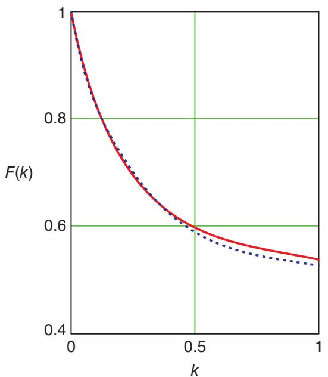

line

| k    | F(k) - Red Line | F(k) - Blue Dashed Line |
| ---- | --------------- | ----------------------- |
| 0.0  | 1.0             | 1.0                     |
| 0.2  | ~0.8            | ~0.8                    |
| 0.4  | ~0.65           | ~0.65                   |
| 0.5  | ~0.6            | ~0.6                    |
| 0.7  | ~0.55           | ~0.55                   |
| 1.0  | ~0.5            | ~0.5                    |

(a)

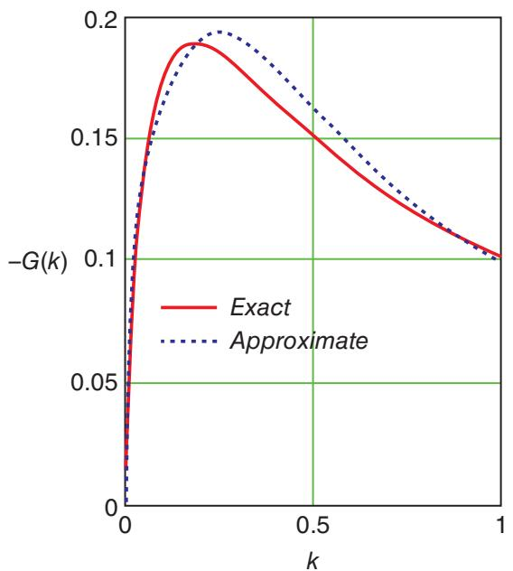

line

| k    | Exact  | Approximate |
| ---- | ------ | ----------- |
| 0.0  | 0.0000 | 0.0000      |
| 0.1  | 0.1850 | 0.1900      |
| 0.2  | 0.1900 | 0.1950      |
| 0.3  | 0.1850 | 0.1900      |
| 0.4  | 0.1750 | 0.1800      |
| 0.5  | 0.1600 | 0.1650      |
| 0.6  | 0.1450 | 0.1550      |
| 0.7  | 0.1300 | 0.1400      |
| 0.8  | 0.1150 | 0.1250      |
| 0.9  | 0.1050 | 0.1100      |
| 1.0  | 0.1000 | 0.1050      |

Figure 4.33 The (a) real and (b) imaginary parts of Theodorsen’s function.

The limitation of the Theodorsen and Sears functions for rotor blade application is that they are derived on the basis that the shed vortex wake streams away from the blade in a straight line, whereas a rotor blade wake is helical and the blades are insuenced by a stack of segments of wakes including those of other blades. Loewy (1957) developed an improved theory for a rotor blade that accounts for the repeated wake in a similar manner to Prandtl (see Section 3.9.3) but still limited by the assumption that the wakes are plane. As Theodorsen had done, Loewy used 2-D, thin aerofoil theory and produced a modircation to Theodorsen’s function. In Eq. (4.120), the Bessel function of the rrst kind $J _ { n } ( k )$ is multiplied by $( 1 + W ( k ) )$ , where $W ( k )$ is called the Loewy wake-spacing function:

$$
W (k) = \frac {1}{e ^ {\left(2 \frac {d}{c} k + i 2 \pi\right)} - 1} \tag {4.124}
$$

d is the wake spacing derned in Eq. (3.81) and c is the chord of the aerofoil.

Miller (1964) arrived at a very similar result to Loewy by using a discrete vortex wake model.

Loewy’s and Miller’s theories apply only to the non-yawed rotor, but Peters, Boyd, and He (1989) have developed a more extensive theory based upon the method of acceleration potential. A sufrcient number of Kinner pressure distributions are required to model both the radial and azimuthal pressure distribution on a helicopter rotor such that the pressure spikes of individual blades are represented. The theory obviates the use of blade element theory and includes automatically unsteady effects and tip-losses. Modelling of the blade geometry by this method does present some problems, however. Suzuki and Hansen (1999) have applied the theory of Peters, Boyd, and He to wind turbine rotors and make comparisons with the blade-element/momentum theory. Van Bussel’s (1995) theory is very similar to that of Peters, Boyd, and He but is specirc for application to wind turbines.

# 4.6 Dynamic stall

# 4.6.1 Introduction

In higher wind speeds, because of unsteadiness in the ambient sow, or because of the changing angle of attack that occurs with a yawed rotor, the sow about a blade may go into and out of stall. In such circumstances the input to the stalling process is dynamic, and experience shows that it is signircantly different to so-called ‘static stall’. Actually, the very process of stalling is always dynamic.

In the case of static, leading edge stall, an increase in angle of attack beyond the stall angle, initially gives rise to an adverse pressure gradient just behind the leading edge on the suction surface of the aerofoil sufrcient to cause separation. The separation is not completed over this surface instantaneously. The separated sow forms a vortex that moves towards the trailing edge. While the vortex is still above the aerofoil, the sow on the suction surface upstream of the vortex is separated, but downstream the sow remains attached. Viscosity, instability, and turbulence cause the vortex to dissipate rapidly, and, although the low pressure in the vicinity of the vortex maintains lift on the aerofoil, when the vortex reaches the trailing edge and leaves the aerofoil the stall is complete and the circulation falls. The process is transient. The pressure distribution on the aerofoil changes dramatically because there is a rearward movement of the centre of pressure causing a rise in the nose-down pitching moment and a rise in pressure drag.

If the angle of attack is changing continuously as the static stall angle is reached, during the rnite time for the separated vortex to progress towards the trailing edge, the angle of attack still increasing causes a further increase in lift and increase in the strength of the vortex. Lift can therefore rise to values well above the static stall level. Once the vortex has passed the trailing edge, the lift falls suddenly, even though the angle of attack may still be increasing. Once the sow is fully stalled, if the angle of attack now decreases, the lift remains low and fairly constant until re-attachment of the sow occurs. Re-attachment does not take place until the angle of attack is signircantly lower than the static stall level. The whole cycle, shown in Figure 4.34, is known as dynamic stall.

Dynamic stall will occur on a wind turbine when the rotor is yawed and at a low tip speed ratio (high wind speed), when the rotor encounters a gust, and on emerging from tower shadow. The loads experienced by a blade during dynamic stall can be large and can cause signircant fatigue damage.

# 4.6.2 Dynamic stall models

A number of dynamic stall models have been put forward and used over the years: the Boeing model (simplest and considers time lags only; Tarzanin 1972), Johnson (1969), Gormont (1973), Beddoes (1975), Gangwani (1982), and the ONERA, Petot (1989) are among the best known. Leishman and Beddoes (1989) developed later a model specifically for rotorcraft that improved on the original Beddoes (1975) theory. It is now the preferred method for wind turbines as well as helicopter rotors. A study of the dynamic stall behaviour of a National Renewable Energy Laboratory (NREL) wind turbine aerofoil is given by Gupta and Leishman (2006). A report from the Risø National Laboratory in Denmark by Hansen, Gaunaa, and Madsen (2004) also discusses the application for wind turbines.

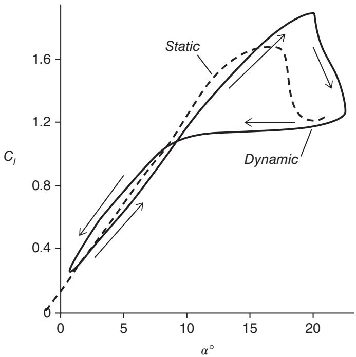

line

| α° | Static | Dynamic |
| --- | --- | --- |
| 0 | 0.3 | 0.3 |
| 5 | 0.8 | 0.8 |
| 10 | 1.2 | 1.2 |
| 15 | 1.6 | 1.4 |
| 20 | 1.6 | 1.2 |

Figure 4.34 Typical dynamic stall behaviour.

# The Leishman–Beddoes model

The Leishman–Beddoes (1989) model will be described in some detail. It is built up from a number of components (analytical, unsteady attached sow theory, and separated sow theory).

Consider a blade section undergoing time-varying angle of attack (α(t), usually oscillatory, $= \mathsf { \alpha } \mathsf { \alpha } \mathsf { q } \mathsf { e } ^ { \mathrm { i } \omega \mathsf { t } } )$ due to heave motion or interaction with a gust. The force coefrcients $\mathrm { C } _ { \mathrm { N } }$ (normal force), $\mathrm { C _ { M } }$ (moment), and $\mathbf { C } _ { \mathrm { c T } }$ (chordwise thrust) are considered to be functions of α and dα/dt only. These coefrcients are made up of a non-circulatory (impulsive) part (I), a circulatory part that is subject to reduction due to separation (S), and a vortex force increment (V). Thus:

$$
\mathrm {C_ {N} = C_ {N} ^ {I} + C_ {N} ^ {S} + C_ {N} ^ {V}}
$$

$$
\mathrm {C_ {M} = C_ {M} ^ {I} + C_ {M} ^ {S} + C_ {M} ^ {V}}
$$

$$
\mathrm{C} _ {\mathrm{cT}} = \mathrm{C} _ {\mathrm{cT}} ^ {\mathrm{S}} \tag {4.125}
$$

Changes with time are modelled as a series of small steps, the impulsive part of the force being taken directly from the Wagner or Kussner attached sow theories for the appropriate impulsive motion (see Section 4.5.3). The circulatory force coefrcients depend on the classical Kirschoff formulae (Thwaites 1987) for steady separated sow forces. These must be modired for the lags that occur in the development of the separation position and for the reduction in the lift curve slope due to attached sow unsteady effects.

The Kirchhoff formulae give values of the force coefrcients $C ^ { \mathrm { { S } } }$ in terms of the separation position on the suction surface. Beddoes proposed formulae for this:

$$
\mathrm{f} (\alpha , \alpha_ {1}) = \mathrm{x} _ {\mathrm{s}} / \mathrm{c} = 1. 0 - 0. 3 \exp \{(\alpha - \alpha_ {1}) / 0. 0 5 \} \text {if} 0 \leq \alpha \leq \alpha_ {1}
$$

and

$$
= 0. 0 4 + 0. 6 6 \exp \{(\alpha_ {1} - \alpha) / 0. 0 5 \} \text {   if   } \alpha > \alpha_ {1} \tag {4.126}
$$

where $\alpha _ { 1 }$ is the static stall angle;

$$
C _ {N} ^ {S} = 0. 5 \pi \alpha \Phi (\tau) \{1 + \sqrt {f _ {1}} \} ^ {2} \tag {4.127}
$$

$$
\mathrm{C} _ {\mathrm{M}} ^ {\mathrm{S}} = 0. 5 \pi \alpha \Phi (\tau) [ - 0. 1 3 5 (1 - \mathrm{f} _ {0}) + 0. 0 4 \sin (\pi \mathrm{f} _ {0} ^ {2}) ] (1 + \sqrt {\mathrm{f} _ {0}}) ^ {2} \tag {4.128}
$$

$$
\mathrm{C} _ {\mathrm{cT}} ^ {\mathrm{S}} = 0. 5 \eta \sqrt {\mathrm{f} _ {1}}. (\mathrm{C} _ {\mathrm{N}} ^ {\mathrm{S}}) ^ {2} / \pi \tag {4.129}
$$

where η is a reduction factor $\sim 0 . 9 5$ .

Φ(τ) is the lift function from the relevant unsteady thin aerofoil theory (e.g. Wagner’s theory, Section 4.5). τ is the dimensionless time, 2Wt/c, which is non-dimensionalised by the mean incident velocity W at the blade section and the semi-chord c/2. All of the time constants in the following analysis are similarly non-dimensional. f is the value of the separation point ratio $\mathrm { x } _ { \mathrm { s } } / \mathrm { c } ,$ and $\mathrm { f } _ { 0 } , \mathrm { f } _ { 1 }$ , and $\mathrm { f } _ { 2 }$ are dimensionless functions of time, described below, which modify the attached sow forces for the effects of separation.

During a rapid increase of incidence a delay occurs in the movement of the separation point that is strongly affected by the growth of the leading edge pressure peak. This can be characterised by a normal force coefrcient $\mathrm { C } _ { \mathrm { ~ N ~ } } ^ { * }$ that satisres the lag equation:

$$
\mathrm{dC} _ {\mathrm{N}} ^ {*} / \mathrm{d} \tau = (\mathrm{C} _ {\mathrm{N}} ^ {\mathrm{S}} - \mathrm{C} _ {\mathrm{N}} ^ {*}) / \mathrm{T} _ {\mathrm{P}} \tag {4.130}
$$

where the time constant $\mathrm { T _ { P } }$ is taken to have a value of 1.7. An equivalent angle of incidence for computing the separation position is then written as $\mathbf { \bar { C } } _ { \mathrm { ~ N ~ } } ^ { * } / ( \mathrm { d C } _ { \mathrm { ~ N ~ } } ^ { \mathrm { S } } / \mathrm { d } \alpha ) \approx$ $0 . 5 { \mathrm { C } } _ { \mathrm { ~ N } } ^ { \ast } / \pi .$ .

The separation position $\mathrm { f } _ { 1 }$ itself satisres a lag equation with time constant $\operatorname { T } _ { \mathrm { f } } \colon$

$$
\mathrm{df} _ {1} / \mathrm{d} \tau = \left\{\mathrm{f} (0. 5 \mathrm{C} _ {\mathrm{N}} ^ {*} / \pi , \alpha_ {1}) - \mathrm{f} _ {1} \right\} / \mathrm{T} _ {\mathrm{f}} \tag {4.131}
$$

However, the pitching moment is found to require a different dynamic separation point given by $\mathrm { f } _ { 0 } = \operatorname* { m a x } \{ \mathrm { f } _ { 1 } , \mathrm { f } _ { 2 } \}$ , where $\mathrm { f } _ { 2 }$ satisres another lag equation with time constant $\mathrm { T } _ { \mathrm { f 0 } } \mathrm { : }$ :

$$
\mathrm{df} _ {2} / \mathrm{d} \tau = \left\{\mathrm{f} (\alpha , \alpha_ {1}) - \mathrm{f} _ {2} \right\} / (0. 5 \mathrm{T} _ {\mathrm{f} 0}) \tag {4.132}
$$

Leishman and Beddoes state that the accurate prediction of the onset of leading edge separation is very important. This is assumed to occur when a critical leading edge (negative) pressure peak and hence adverse gradient are reached. These in turn are related to the normal force so that separation occurs when ${ \bf C } _ { \mathrm { N } } \geq { \bf C } _ { \mathrm { N 1 } } ( \approx 1 . 5 5$ for a NACA0012 aerofoil at high Reynolds number). Vortex shedding is taken to occur at $\tau = \tau _ { 1 }$ when $\mathrm { C } _ { \mathrm { N } }$ reaches the critical value $\mathrm { C } _ { \mathrm { N 1 } }$ . The vortex force increment is then evaluated by considering the growth and convection of the resulting shed vortex (see Figure 4.35) from the time $\tau _ { 1 }$ when it is shed to the time $\tau _ { 1 } + \mathrm { T _ { v l } }$ when it reaches the trailing edge. $\tau _ { \mathrm { v } }$ is the ‘vortex time’ variable, $= \tau - \tau _ { 1 }$ .

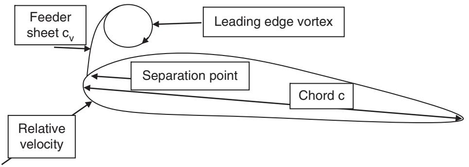

flowchart

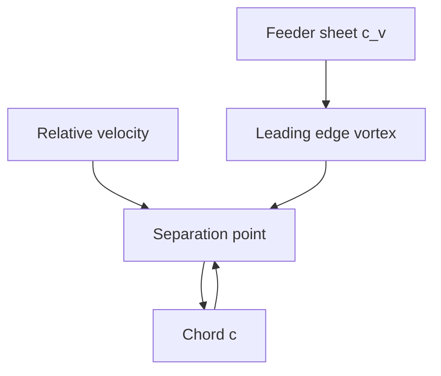
```mermaid
graph TD
    A["Feeder sheet c_v"] --> B["Leading edge vortex"]
    C["Relative velocity"] --> D["Separation point"]
    D --> E["Chord c"]
    B --> D
    E --> D
```

Figure 4.35 Growing leading edge vortex and idealised feeding sheet.

A lag equation with time constant $\mathrm { T _ { v } }$ , where $\mathrm { T _ { v } }$ and $\mathrm { T _ { v l } }$ are given below, is used for $\mathrm { C } _ { \mathrm { N } }$ :

$$
\mathrm{dC} _ {\mathrm{N}} ^ {\mathrm{v}} / \mathrm{d} \tau = \mathrm{dc} _ {\mathrm{v}} / \mathrm{d} \tau - \mathrm{C} _ {\mathrm{N}} ^ {\mathrm{v}} / \mathrm{T} _ {\mathrm{v}} \text {   if   } \mathrm{dc} _ {\mathrm{v}} / \mathrm{d} \tau > 0 \text {   and   } 0 <   \tau <   2 \mathrm{T} _ {\mathrm{vl}} \tag {4.133}
$$

$\mathrm { d } \mathrm { C ^ { v } } _ { \mathrm { N } } / \mathrm { d } \tau = - \mathrm { C ^ { v } } _ { \mathrm { N } } / \mathrm { T _ { v } } \mathrm { o t h e r w i s e } ;$

$$
\mathrm{C} _ {\mathrm{M}} ^ {\mathrm{v}} = - 0. 2 5 \{1 - \cos (\pi t / \mathrm{T} _ {\mathrm{vl}}) \} \mathrm{C} _ {\mathrm{N}} ^ {\mathrm{v}} \text {if} \mathrm{t} \leq 2 \mathrm{T} _ {\mathrm{vl}}, \text {and} = 0 \text {if} \mathrm{t} > 2 \mathrm{T} _ {\mathrm{vl}} \tag {4.134}
$$

$\mathrm { c } _ { \mathrm { v } }$ represents the contribution to the vortex force of the vortex sheet that feeds the growing vortex (considered to be the ‘inner spiral’) joining it to the shedding point at the leading edge, as shown in Figure 4.35:

$$
\mathrm {c_ {v}} = 2 \pi \alpha \Phi (\tau) - \mathrm {C^ {S} _ {N}} = 2 \pi \alpha \Phi (\tau) \{1 - 0. 2 5 (1 + \sqrt {\mathrm {f_ {1}}}) ^ {2} \} \tag {4.135}
$$

and its derivative is:

$$
\mathrm{dc} _ {\mathrm{v}} / \mathrm{d} \tau = (\pi / 2) \left\{- \Phi (\tau). (\mathrm{df} _ {1} / \mathrm{d} \tau) (1 + 1 / \sqrt {\mathrm{f} _ {1}}) + (\mathrm{d} (\alpha \Phi (\tau)) / \mathrm{d} \tau) (4 - (1 + \sqrt {\mathrm{f} _ {1}}) ^ {2} \right\} \tag {4.136}
$$

To model the different lags in movement of the separation point when incidence α is increasing or decreasing (values given here are for a NACA0012 aerofoil),

$$
\alpha_ {1} = \alpha_ {1 0} = 0. 2 7 \mathrm{for} \alpha \mathrm{increasingand} \alpha_ {1} = \alpha_ {1 0} - 0. 0 3 7 (1 - f _ {1}) ^ {1 / 4} \mathrm{for} \alpha \mathrm{decreasing}.
$$

The timescales $\mathrm { T _ { f } }$ and $\mathrm { T _ { v } }$ are given by the following relationships to the empirical (non-dimensional) times $\mathrm { { T } _ { f 0 } , \mathrm { { T } _ { v 0 } } }$ , and $\mathrm { T _ { v l } } ,$ , where suggested values for these are 3.0, 4.0, and 6.0, respectively (S114 aerofoil, Sheng et al. 2010):

<table><tr><td rowspan="3">For α increasing:</td><td> $T_{f} = T_{f0},$ </td><td> $T_{v} = T_{v0}$ </td><td> $0 \leq \tau \leq T_{vl}$ </td></tr><tr><td> $T_{f} = \frac{1}{3}T_{f0},$ </td><td> $T_{v} = 0.25T_{v0}$ </td><td> $T_{vl} < \tau \leq 2T_{vl}$ </td></tr><tr><td> $T_{f} = 4T_{f0},$ </td><td> $T_{v} = 0.90T_{v0}$ </td><td> $2T_{vl} < \tau \leq 4T_{vl}$ </td></tr><tr><td rowspan="3">For α decreasing:</td><td> $T_{f} = \frac{1}{2}T_{f0},$ </td><td> $T_{v} = 0.50T_{v0}$ </td><td> $0 \leq \tau \leq T_{vl}$ </td></tr><tr><td> $T_{f} = \frac{1}{2}T_{f0},$ </td><td> $T_{v} = 0.50T_{v0}$ </td><td> $T_{vl} < \tau \leq 2T_{vl}$ </td></tr><tr><td> $T_{f} = 4T_{f0},$ </td><td> $T_{v} = 0.90T_{v0}$ </td><td> $2T_{vl} < \tau \leq 4T_{vl}$ </td></tr></table>

After the sow reattaches and $\mathrm { C } _ { \mathrm { N } } < \mathrm { C } _ { \mathrm { N 1 } }$ again, $\mathrm { { T _ { v } } = \mathrm { { T _ { v 0 } } } }$

Some methods include the effect of the feeding sheet during periods when the incidence is decreasing, but Bjorck et al. (1999), who has implemented the model for wind turbine dynamic stall, has stated that it should only apply when α and the vortex are increasing.

These three component parts of the dynamic stall forces are then substituted into Eq. (4.125) to give the total force coefrcients $\mathrm { C } _ { \mathrm { N } } , \mathrm { C } _ { \mathrm { M } }$ , and $\mathbf { C } _ { \mathrm { c T } }$ . The calculation procedure is in principle iterative because the calculation of the separation position [Eqs. (4.126) and (4.131)] and the onset of separation at the leading edge $( \tau _ { 1 } )$ require computation of the components of $\mathrm { C } _ { \mathrm { N } }$ at that time. Because stall proceeds sequentially, it is generally possible to incorporate this into the timestepping solution procedure by computing the value of $\mathrm { C } _ { \mathrm { N } }$ at an interim step without further iteration.

The following summarises a calculation procedure for the normal force due to aerofoil heave motion.

A series of non-dimensional timesteps $\tau _ { 0 } , \tau _ { 1 } = \tau _ { 0 } { + } \Delta \tau$ , etc. are set up to cover the motion in question from $\tau _ { 0 }$ to $\tau _ { \mathrm { N } }$ .

Then for τ = τ1, τ2, … $\tau = \tau _ { 1 } , \tau _ { 2 }$

1) Evaluate and store the effective angle of attack $\alpha ( \tau ) = \mathrm { w } ( \tau ) / \mathrm { U } _ { \infty }$ from the assumed known aerofoil heave motion w(τ).   
2) Compute the normal force L(τ) by numerical integration of the convolution product in Eq. (4.119) of the Wagner function $\Phi ( \tau )$ and dw/dτ at each timestep for the whole sequence of times from $\tau _ { 0 }$ to the current time τ. In this example, $\mathrm { \mathbf { W } = U _ { \infty } }$ assumed constant. (For small angles of attack lift and normal force are assumed to be equal.)   
3) Compute the impulsive (added mass) force coefrcient $\mathrm { C _ { N } } ^ { \mathrm { I } } ( \tau ) = ( \pi \mathrm { d w } / \mathrm { d } \tau ) / \mathrm { U } _ { \infty }$   
4) Tabulate $\mathrm { T _ { f } }$ and Tv according to the range of $\boldsymbol { \tau }$ in the table for both α increasing and decreasing, given values of non-dimensional time constants $\mathrm { { T } _ { f 0 } , \mathrm { { T } _ { v 0 } } }$ , and $\mathrm { T _ { f l } }$ .   
5) Evaluate f(τ) given the values of α and $\alpha _ { 1 }$ and hence with time constants $\mathrm { T } _ { \mathrm { f 0 } } , \mathrm { T } _ { \mathrm { f } } ,$ , and $\mathrm { T _ { v } }$ numerically integrate Eqs. (4.130)–(4.132) for $\mathrm { C _ { N } } ^ { * } , \mathrm { C _ { N } } ^ { \mathrm { S } } , \mathrm { f _ { l } }$ , and $\mathrm { f } _ { 2 }$ . using a predictor-corrector or other multi-step method in which intermediate values of the above variables are used in the integration over each timestep.   
6) Compute $ { \mathrm { C } } _ { \mathrm { N } } ( \tau ) =  { \mathrm { C } } _ { \mathrm { N } } ^ { \phantom { } \mathrm { I } } ( \tau ) +  { \mathrm { C } } _ { \mathrm { N } } ^ { \phantom { } \mathrm { S } } ( \tau )$ , and when $\mathrm { C } _ { \mathrm { N } }$ reaches the critical value $\mathrm { C } _ { \mathrm { N 1 } }$ at which shedding of a growing vortex starts at the leading edge, set $\tau _ { 1 } = \tau$ and derne $\tau _ { \mathrm { v } } = \tau - \tau _ { \mathrm { l } }$ for subsequent times.   
7) Evaluate ${ \mathrm { C } } _ { \mathrm { N } } { } ^ { \mathrm { V } } ( \tau )$ by timestepping integration of Eq. (4.133) with Eq. (4.136), again using a multi-step method and the time constant $\mathrm { T _ { v } }$ from the stored table according to the value of $\tau _ { \mathrm { v } }$ .   
8) Compute $\begin{array} { r } {  { \boldsymbol \mathrm { C } } _ { \mathrm { N } } ( \tau ) =  { \boldsymbol \mathrm { C } } _ { \mathrm { N } } ^ { \phantom { } \mathrm { I } } ( \tau ) +  { \boldsymbol \mathrm { C } } _ { \mathrm { N } } ^ { \phantom { } \mathrm { S } } ( \tau ) +  { \boldsymbol \mathrm { C } } _ { \mathrm { N } } ^ { \phantom { } \mathrm { V } } ( \tau ) . } \end{array}$

The above equations are for an aerofoil undergoing changes of incidence through heave motion. If pitching is involved there are some additional dα/dt terms, but the procedure is exactly the same. If the dynamic stalling is caused by a blade interacting with a gust or convecting sow disturbance, the Wagner function $\Phi ( \tau )$ is replaced by the Kussner function $\Psi ( \tau )$ , but otherwise the process is the same. The timestepping procedure using indicial functions is the more usual treatment rather than the alternative procedure of assuming sinusoidal motion throughout using the Theodorsen or Sears functions for the underlying attached sow, particularly because that requires an assumption of quasi-linearity. The empirical coefrcients in the procedure are dependent on the aerofoil section and were originally derived as functions of the Mach number. They are given here for incompressible (i.e. low Mach number) sow and for a NACA0012 aerofoil. There are also a number of variants of the method.

Results computed with this model are compared in Figure 4.36 with test data and a CFD simulation of moderate dynamic stall for an aerofoil undergoing oscillatory incidence variation:

$$
\alpha = \alpha_ {0} + \alpha^ {\prime} \sin (0. 1 \tau) \tag {4.137}
$$

The expressions in Eqs. (4.127)–(4.129) assume that the idealised steady sow lift (or for moderately small angles the normal force) coefrcient of 2πα applies. To take account of the effects of Reynolds number and thickness on the force coefrcient, 2π is often replaced by $\mathrm { a } _ { 0 }$ , the actual, experimentally, or numerically determined steady lift curve slope.

# The ONERA model

In the ONERA model (Petot 1989), the lift and moment generated during the dynamic stall are calculated as a combination of a linear (unsteady) attached sow result and a non-linear increment resulting from the development of the stall. The model is based on a quite large number of empirical coefrcients that have been obtained by parameter identircation from experimental measurements on oscillating aerofoils.

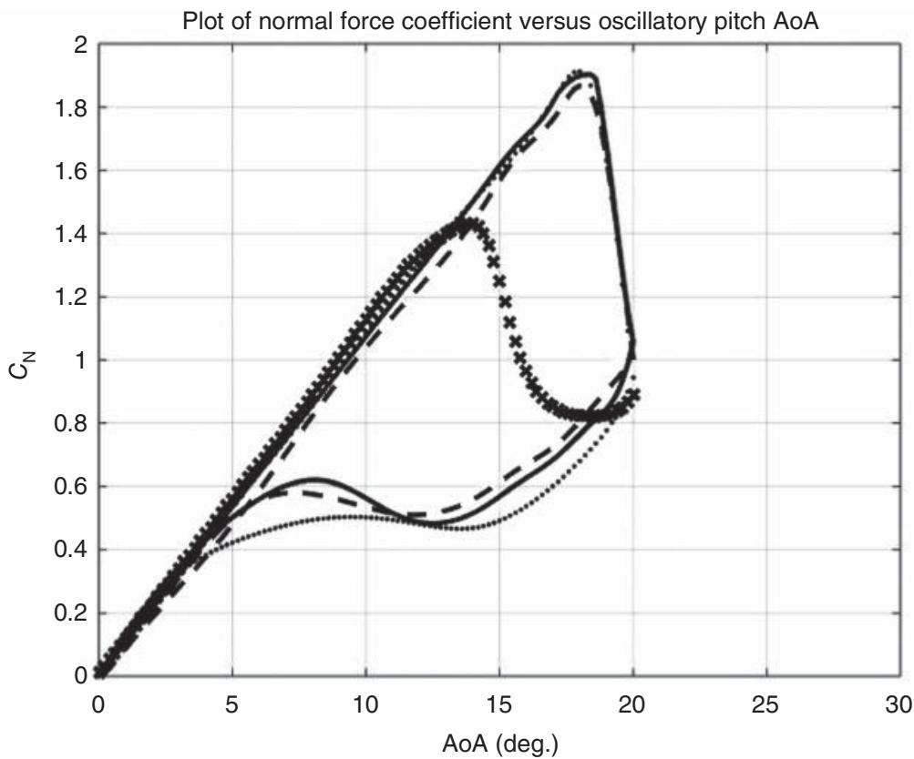

line

| AoA (deg.) | Normal Force Coefficient (Gz) |
| ---------- | ----------------------------- |
| 0          | 0.0                           |
| 5          | 0.6                           |
| 10         | 1.0                           |
| 15         | 1.4                           |
| 20         | 0.9                           |

Figure 4.36 Normal force coefrcients for a NACA0012 aerofoil in cyclic pitch through the stall regime. x, static data; … , measured; - - -, CFD; - Leishman–Beddoes model.

# The Gangwani model

The Gangwani model (Gangwani 1982) is based on a time-domain representation of the linear unsteady attached sow using an approximation to the Wagner function. The non-linear separated sow part is based on empirical equations incorporating time lags in the apparent angle of attack. These equations require a large number of coefrcients that have mostly been obtained from experimental measurements on oscillating aerofoils.

The three dynamic stall models discussed have some similarities. However, the Leishman–Beddoes model (1989) has probably achieved the widest usage.

# 4.7 Computational Kuid dynamics

# 4.7.1 Introduction

The methods for analysing the sow through a wind turbine in various conditions developed in Chapters 3 and 4 are all simplircations necessary to facilitate the calculations; to obtain accurate solutions to the sow conditions, a much more complex method is required. CFD is a very large and highly developed subject with extensive references available. Only a very limited overview is given here for low Mach number sow applications.

The analysis of the sow approaching a turbine rotor that is not stalled can be undertaken, with little loss of accuracy provided predictions of viscous drag effects are not important, by using the equations of inviscid sow known as the Euler (momentum) equations, developed in the eighteenth century. These are, for vector velocity U:

$$
\frac {\partial \boldsymbol {U}}{\partial t} + \boldsymbol {U}. \nabla \boldsymbol {U} = - \frac {1}{\rho} \nabla p \tag {4.138}
$$

The Euler equations, together with the continuity equation, can form the basis of a numerical procedure to obtain a solution to the sow conditions. However, during the course of the sow through the rotor and in the wake, the Euler equations may no longer be adequate because they cannot deal with boundary-layer sow close to a blade surface or with separated sow conditions and the wake. In the nineteenth century, the fully viscous sow equations of Navier and Stokes were developed and are used today to predict both laminar and turbulent sows. The additional terms in the Navier–Stokes momentum equations, shown below, introduce the effect of a constant kinematic viscosity 휈1 derived from Newton’s theory of viscous sow:

$$
\frac {\partial \boldsymbol {U}}{\partial t} + \boldsymbol {U}. \nabla \boldsymbol {U} = - \frac {1}{\rho} \nabla p + \nu \nabla^ {2} \boldsymbol {U} \tag {4.139}
$$

Equation (4.139) is known as the velocity-pressure or primitive variable formulation of the Navier–Stokes equations.

CFD is essentially a numerical solution of these equations. For the analysis of a wind turbine rotor, the sow volume insuenced by it is divided into a 3-D mesh (or a 2-D mesh in the case of sectional analysis, such as of a blade). At the rotor surfaces the mesh needs to be very rne to model attached sow boundary layers, whereas in the wake a coarser mesh will sufrce. Especial care needs to be taken in regions of high shear such as the wake boundary and close to the vicinity of shed vortices. The number of unknowns (degrees of freedom) to be solved in most 3-D problems is very large, and, because the solution process is iterative, the solution times are of long duration. The wind turbine rotor introduces a further complication because the rotor and other parts of the wind turbine together with the incident wind reld are in relative rotation to each other. Much of the skill and effort required to carry out an analysis is invested in the mesh generation, including the need for moving boundaries. A principal advantage of the full CFD method for wind turbine blades is that no experimentally based aerofoil data is required because the method calculates the sow conditions surrounding a blade surface.

Because of computational cost, CFD methods are still used more for research but are also used by wind turbine designers for specirc validations of analyses, which themselves are based on simpler, faster methods such as blade-element-momentum.

# 4.7.2 Inviscid computational methods

In the case of sow analysis of rotor blades, which in practice is one of the most important areas of wind turbine aerodynamics, some aspects of the sow reld may be treated adequately by solutions of the inviscid (i.e. Euler) equations. This is particularly true for sows in which there is little or no separation over the blades, where pressure dominated forces need to be predicted and where values of viscous drag are either not required or are more conveniently obtained empirically. The advantage of restricting solutions to the Euler equations is that these equations can be solved much more quickly than the Navier–Stokes equations. Examples where computational efrciency is particularly important are the prediction of unsteady sows such as those associated with structural vibration, sutter and effects of incident gusts and turbulence, wake interactions and unsteady effects of yaw, incident shear, and sudden changes of blade pitch. In many of these sows, large numbers of frequency cases or long time histories must be computed to provide converged statistical quantities such as spectra, for example, and fast methods of solution for each case are necessary.

The Euler equations are widely used for solving general 2-D and 3-D compressible sows (i.e. where the Mach number of the sow is not very small), particularly due to the information that can be gained on sows with shock waves. These sows are not relevant to sow around wind turbine rotors for which the incident blade Mach number rarely exceeds 0.3. If the velocities are considerably smaller than the speed of sound, as is the case for wind turbines, and provided the frequencies that are important are not very high, the density ρ may be considered to be constant, and the sow is referred to as incompressible. Field methods (as distinct from body surface panel methods considered below) in which the whole of the relevant sow reld is discretised on a grid have been used to compute inviscid rotor sows. There is often an option in commercial Navier–Stokes codes to run them as inviscid sow solvers of the Euler equations. Alternatively, the Euler and incompressible mass sow continuity equations may be converted to a streamfunction(휓) – vorticity(휔) formulation and solved on a grid over the sow reld for axisymmetric sows such as for an actuator disc (see, for example, Soerensen et al. 1998) or for 2-D planar (sectional) sows. Such grid based methods of solving the Euler equations follow many numerical procedures similar to those described below for the Navier–Stokes equations, but because of the absence of the large gradients associated with viscous and turbulent stresses in the boundary layers, they are able to achieve comparable accuracy on much larger grid mesh cells. Hence, they require much shorter computation times to achieve comparable accuracy because of the fewer degrees of freedom in the solution.

In addition to the grid methods of solution involving meshing the whole sow reld around the body, there exist a class of methods known as boundary-integral or panel methods, which may be used when the equations governing the velocity reld can be made linear and reduce the dimension of the problem by one. Thus 3-D reld problems become solutions to be computed over 2-D surfaces, and similarly 2-D sectional reld solutions reduce to line integrals around the section perimeter. In the general case the surfaces of the body and any thin wakes are meshed (divided into discrete panels) that provide a sum of fundamental solutions. These are known as singularity solutions because of their property of being unit sow relds localised to a singular point where the solution takes an inrnite value. This reduction of dimension of the problem allows faster solutions to be computed but depends on the inviscid equations for the velocity being expressible in linear form. In that case, a linear combination of the fundamental panel based singularity solutions makes up the whole sow, the coefrcients being derned by the boundary conditions.

Flows can be treated as inviscid if all vorticity (which will be represented here by the vector symbol 흎 and is the cross-product derivative of the velocity reld, 훁 × U) mainly originates on the body surfaces), remaining conrned to thin sheets on these surfaces and within their wake, with effectively zero vorticity outside these sheets where the sow is termed irrotational sow.

This condition:

$$
\boldsymbol {\omega} = \nabla \times \boldsymbol {U} = 0 \tag {4.140}
$$

allows the velocity to be written as the gradient of a scalar velocity-potential 휙:

$$
\boldsymbol {U} = \nabla \phi \tag {4.141}
$$

which combined with the equation for conservation of mass:

$$
\nabla (\rho \boldsymbol {U}) = 0 \tag {4.142}
$$

leads to a second order partial differential equation for the potential 휙.

In that case, the equation for the potential 휙 becomes Laplace’s equation:

$$
\nabla^ {2} \phi = 0 \tag {4.143}
$$

Because this equation is linear, panel methods that construct the solution from a sum of fundamental solutions of the equation may be used, requiring a linear sum with unknown coefrcients to satisfy the boundary condition of zero sow through the body surfaces. Many panel methods have been developed, the earliest and one of the most widely used for closed body cases where wake effects are less important being the source panel method.

One of the panel methods most applicable to wind turbine rotor sows is the vortex method. In this method the panels that may be on the body surface (or on the mean single camber surface applying a further level of approximation for thin blade sections) are composed, most often, of a network or lattice of vortex lines lying along the edges of the panels. Where a thin wake is present the vortex panels are spread over the mean wake surface being freely convected with it. Because this convection process is non-linear due to the velocity reld induced by the wake elements themselves contributing to their movement, it is frequently assumed that the wake-induced convection can be linearised, simplired by assuming that the wake travels with the undisturbed air sow. This vortex panel method, known as the vortex lattice method (VLM; see Figure 4.37), is exactly equivalent to the constant dipole panel method, which consists of a uniform source density and a uniform sink density of equal and opposite strength spread uniformly over either surface of the panel sheet. There is an extension of the method for unsteady sow: the unsteady vortex lattice method (UVLM). Boundary conditions have to be satisred on the body surface or, in the case of the thin aerofoil approximations, on the mean or camber surface. The most usual boundary condition is that there is zero normal velocity relative to the body at its surface. However, in the case of a thick body with closed surface, an internal zero tangential velocity boundary condition evaluated on the inside of the surface may be used instead and can give superior accuracy.

The UVLM can be used very efrciently to give satisfactorily accurate predictions of steady or unsteady sow over aerofoils, wind turbine blades, and complete rotors provided there is no large-scale separation of the sow (stalling) leading to thick regions containing vorticity, and skin friction drag is dealt with separately. Low Speed Aerodynamics by Katz and Plotkin (1991) gives a very detailed discussion of the method.

At the lowest level of representation, the panels covering the aerofoil or rotor blade can be reduced to a single panel chordwise with a suitable number of divisions spanwise. In this case the strength of each chordwise panel is equal to the circulation about the blade at that section, the vortex line at the front of the panel is aligned with the quarter chord of the section, and the boundary condition is evaluated at the three-quarter chord (see earlier discussion in Section 4.5.1). The panel is completed by a vortex line downstream of the trailing edge of the blade section. This arrangement satisres the Kutta–Joukowski trailing edge condition and provides at each timestep the vortex just shed into the wake from the blade trailing edge. Thereafter, in accordance with vorticity transport, the vortex is convected downstream with the local sow velocity evaluated at its position. This representation is the basis of actuator line theory (see Mikkelsen 2003).

Panel methods, because they are lower order of accuracy and omit viscous effects, are usually regarded as distinct from and often not categorised as CFD. If information is required regarding viscous effects such as evaluation of blade drag force, the inviscid panel pressure solution may be supplemented by boundary-layer calculations on the blade surfaces ‘driven’ by the inviscid pressure distribution. This is formally an inner-outer approximation procedure to provide a viscous-inviscid solution that not only enables a rrst order calculation of skin friction and drag to be computed but also provides through the boundary-layer displacement thickness (in effect an outward displacement of the body surface due to the retarded velocity in its growing boundary layer) a correction to the pressure distribution and lift force for viscous effects. The procedure is strictly only applicable where the viscous layers remain thin, and hence the boundary layers remain attached or have at most moderate separation, in which case the procedure involves an inverse calculation. Some widely used panel based methods use this procedure (see, e.g. XFOIL, Drela 1989).

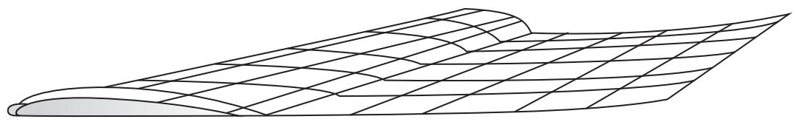

natural_image

Pure geometric grid pattern with curved edges and no text or symbols

Figure 4.37 Sketch of vortex lattice panels on a blade surface and wake.

# 4.7.3 RANS and URANS CFD methods

Numerical methods of solving the full viscous sow equations, the Navier–Stokes equations, are referred to as direct Navier–Stokes (DNS) methods to indicate that there is no modelling of turbulence involved. All scales down to the smallest are resolved on the grid and solved directly. This requires extremely large computing resources even for sows well below practical scales. Up to the present time, DNS solutions have only been obtained for unsteady, 3-D sows up to Reynolds numbers Re of the order of $1 0 ^ { 4 }$ and simple geometries.

Turbulence is normally present in sows at practical scales, and the size of the smallest eddies of the turbulence relative to the local sow length scale being of order $( \mathrm { R e } ^ { - 3 / 4 } )$ （20号 require meshes with the order of $( \mathrm { R e } ^ { 9 / 4 } )$ cells. Typically, at least four unknowns need to be resolved at each node point and at every timestep, presenting a presently infeasible size of problem.

Therefore, it is usual to model the turbulence in the Navier–Stokes equations for most practical sows. In addition, where turbulence is modelled, there is a need to consider the transition process from laminar (‘smooth’ turbulence-free sow) to turbulent sow and provide a method of predicting where it occurs.

The simplest level of modelling turbulence solves the time-averaged Navier–Stokes equations.

The vector velocity reld is written as:

$$
\boldsymbol {U} (t) = \overline {{\boldsymbol {U}}} + \boldsymbol {u} ^ {\prime}
$$

where $\overline { { U } }$ is the time mean velocity, u ′ is a turbulent suctuation with $\overline { { { \pmb u } ^ { \prime } } } = 0$ , and (overbar ) indicates a mean value. Inserting this into the Navier–Stokes equations [see Eq. (4.139)] and taking the time mean (indicated by an overbar throughout) gives:

$$
\overline {{U}} \nabla \overline {{U}} + \overline {{u ^ {\prime} \nabla u ^ {\prime}}} = - \nabla \frac {\bar {p}}{\rho} + v \nabla^ {2} \overline {{U}} \tag {4.144}
$$

These are the Reynolds averaged Navier–Stokes (RANS) equations. $\overline { { { \pmb u } ^ { \prime } { \pmb \nabla } { \pmb u } ^ { \prime } } }$ is the resulting Reynolds stress term, which is the effective stress due to the turbulence in the sow acting on the mean velocity reld and typically much larger than the viscous stress term $\nu ^ { \nabla ^ { 2 } \overline { { U } } }$ . As a result, the latter may often be treated as negligible when Reynolds stress is present in the RANS equations, except in certain regions such as the sub-layer of a turbulent boundary layer.

The simplest and earliest methods modelled the Reynolds stress with an eddy viscosity $\nu _ { \mathrm { e } }$ (see, e.g. Anderson 1991) analogous to the molecular viscosity but derned by the local sow conditions. Many turbulence models of this type were developed requiring minimal computation, the earliest and simplest being the Prandtl mixing length model.

By the 1960s, more advanced methods were developed that solved additional equations derived from the Navier–Stokes equations for convection of the turbulence energy $\mathrm { k } = \mathrm { 1 } / _ { 2 } \overline { { u _ { j } ^ { \prime } u _ { j } ^ { \prime } } }$ or the Reynolds stresses $\overline { { u _ { j } ^ { \prime } u _ { k } ^ { \prime } } }$ . Here the subscript indices j and k may take any value 1–3 for the three directions, and a repeated index implies summation over all three. In these equations some terms can be evaluated exactly, but others (for example, turbulence diffusion and dissipation) must be modelled using empirical equations or formulae (such as the algebraic stress models; see, e.g. Speziale 1991). It has also been common practice to replace the inner region of turbulent boundary layers by the analytically derived ‘log law’ or wall layer to avoid having to use very small grid cells in this region adjacent to the body surface. This replacement, often an option, is quite accurate for attached turbulent boundary layers but not so in more general situations, such as beneath a separation region.

The best known of the turbulence modelling methods is the k-ε method, where ε is the turbulence dissipation. Many other variants are now widely used, the k-ω (ω = ε/k) and shear stress transport (SST) methods being other versions with improved properties. The reader is advised to consult the many papers and books (see, e.g. Menter et al. 2003) that describe these methods. Many well-used RANS codes, particularly commercial codes, allow the turbulence model to be selected from a suite of models provided in the code. A reason for this is that not only do models vary in computational cost but, being models, they are found to be more or less appropriate for different sows and different regions of sow. The empirical coefrcients and dependencies used in these methods have often been developed from experimental data measured in thin shear-layer turbulence (turbulent boundary layers, jets, and wakes) and can be found to be less successful in modelling regions of large-scale separation.

As mentioned above, prediction of the onset of turbulence (transition) is required because, of themselves, these methods being time-averaged cannot predict instability onset but can predict where the modelled turbulence becomes self-sustaining. Two methods of predicting transition and developing a turbulent sow are commonly used. The rrst is the ‘en ’ method (n ∼ 9; see, e.g. White 1991), which predicts the exponential growth of transition from inrnitesimal disturbances in the sow. The second is the method of seeding the sow with low level turbulence at the inlet boundary. This latter is easily done, and turbulence grows in the sow from where turbulence production (equal to the product of the turbulence energy or stress terms with the mean sow gradients) begins to exceed the dissipation. This method should be regarded as a model of bypass transition in which a signircant level of external sow turbulence of the right scale drives transition in the boundary layers. Bypass transition is common in turbomachinery but not for wind turbine rotor blades because the incoming turbulence length scales in the ABL are relatively very large.

At high angles of attack as stall is approached, the presence and type of separation bubbles that cause transition are frequently crucial in derning where and how separation takes place on aerofoil sections and in derning the type of blade stall that occurs. Empirical correlations such as provided by Gault (1957) provide useful information, since, because of the very small size of separation bubbles, reliable resolution of the transition process within the separated shear layer of a bubble is extremely difrcult.

More recently the RANS method has been expanded to unsteady sows. This is justirable in the context of Reynolds averaging provided the characteristic timescale of the main sow reld is much longer than the timescale of the turbulence so that the small timescale turbulence can be Reynolds averaged (∼), while the time-dependent main sow reld UD is resolved to give the unsteady Reynolds averaged Navier–Stokes (URANS) equations:

$$
\frac {\partial \widetilde {U}}{\partial t} + \widetilde {U} \nabla \widetilde {U} + \widetilde {u ^ {\prime} \nabla u ^ {\prime}} = - \widetilde {\nabla p / \rho} + \nu \nabla^ {2} \widetilde {U} \tag {4.145}
$$

The URANS method is suitable for modelling, for example, the turbulent boundary layers on an aerofoil or wind turbine blade undergoing typical unsteady motions due to cyclic variations or structural dynamic response but less good for modelling large-scale time-dependent separations such as occur during dynamic stall. Experience with URANS indicates some improvements over steady RANS in representing large-scale separation regions but generally still poor accuracy in many cases.

# 4.7.4 LES and DES methods

The rapid development of computing capability and the disappointing predictions of RANS and URANS particularly for separated sows has led to the development of the large eddy simulation (LES) technique. This follows a turbulence averaging philosophy somewhat similar to URANS in that the sow is segregated into a part in which the suctuations in the sow having larger spatial and timescales are resolved on the grid and a part containing the smaller eddy scales that are modelled. Strict applications of the method assume that the modelled scales are restricted to the isotropic eddies at the high frequency end of the turbulence spectra. This puts great constraints on the size of the grid to be able to resolve all eddy scales that are larger. Therefore, in practice this constraint is often relaxed somewhat. The small turbulent eddies are modelled by a sub-grid eddy viscosity. Theoretical work has developed and improved the methods of computing the sub-grid eddy viscosity to deal accurately with an increasing range of sows (Germano et al. 1991). The main constraint on the LES method is the computation costs because of the requirement for extremely small grid cells. A more economic version has been developed, termed detached eddy simulation (DES), in which the LES method is conrned to regions were the sow is separated. This limits the LES to a few separated and wake regions of the whole sow reld in which the scale of turbulence is somewhat larger than in the attached boundary layers. URANS is used everywhere else in the sow (such as attached turbulent boundary layers, which would otherwise require extremely small grid sizes for LES but where URANS performs well). The combination method is rapidly becoming the dominant method of providing accurate sow simulations, including those involved in wind turbine and wind farm studies. However, these methods are still too expensive for routine industrial use and should be regarded as providing the basis for validation of the more approximate methods widely used in the industry. Secondly, they can now often provide a better insight into physical mechanisms occurring in those sows, which are difrcult to get from physical experiments. Wind tunnel experiments being far from representative in Reynolds number and constrained by blockage and full-scale experiments being restricted by measurement and controllability issues are limited in this respect.

# 4.7.5 Numerical techniques for CFD

Having dealt with panel methods for inviscid sows in Section 4.7.2, this section focuses on reld methods of solution in which the discretized equations are solved on a mesh of nodes or cells that entirely covers the sow domain of interest out to boundaries where disturbances from ambient conditions may be considered negligible or able to be specired simply.

# Inviscid @ow

The time-dependent Navier–Stokes equations for momentum and continuity for low speed, constant density sows in three dimensions require a discrete timestepped solution of four variables, three velocities, and pressure. The pressure can be eliminated by taking the curl $( \nabla \times \ldots )$ of the equations to give the vorticity transport equation:

$$
\frac {\partial \boldsymbol {\omega}}{\partial t} + \mathbf {U} \nabla \boldsymbol {\omega} = \boldsymbol {\omega} \nabla U + \nu \nabla^ {2} \boldsymbol {\omega} \tag {4.146}
$$

where $\pmb { \omega } = \nabla \times \pmb { U }$ is the vorticity.

This equation shows that provided the sow through the blades of a rotor remains ‘attached’ or ‘unseparated’ until it separates from the trailing edge of the blades and diffusion remains small (true for high Reynolds numbers), the vorticity that is created by the no-slip condition on the blade surfaces remains within very thin layers on the blades and within thin sheets in the wake. Because to rrst order pressure forces are continuous across thin sheets of vorticity, this result is the basis of the applicability of the Euler equations to provide reasonably accurate predictions of the pressure relds and therefore the dominant forces on rotors. Farther downstream the vortex sheets rapidly become unstable, breaking down into large volumes of turbulent wake, but while these may affect other downstream wind turbines, they have little effect on the rotor generating the wake.

In 2-D sows the vorticity only has one non-zero component, which is in the direction normal to the sow plane and is therefore effectively a scalar. The two components of velocity may be expressed as the derivatives of a scalar streamfunction 휓:

$$
\frac {\partial \psi}{\partial y} = - U, \frac {\partial \psi}{\partial x} = V \tag {4.147}
$$

Substituting this dernition of 휓, which identically satisres the (constant density) mass sow conservation Eq. (4.142), shows that 휓 satisres the Poisson equation:

$$
\frac {\partial^ {2} \psi}{\partial x ^ {2}} + \frac {\partial^ {2} \psi}{\partial y ^ {2}} = - \omega \tag {4.148}
$$

Similarly, substituting the dernition of 휓 into the vorticity transport equation leads to 휓-휔 equations that are known as the derived variables formulation. For 2-D planar or axisymmetric sow, they only involve the two scalar variables 휓 and 휔 and therefore have a signircant computational advantage over the velocity-pressure formulation, which involves three. Because the 휓-휔 formulation has intrinsically satisred mass conservation, it avoids the difrculties with the pressure terms in incompressible Tow, which cannot be calculated directly from mass conservation.

In 3-D sows the advantage of fewer variables is lost because the 흍-흎 formulation requires the solution of six variables, three components of 흍 (which is now a vector) and three of vorticity. This is two more in total than the primitive variable formulation [Eq. (4.139)]. The function 흍 is derned by:

$$
U = \nabla \times \psi \text {   with   } \nabla \psi = 0 \tag {4.149}
$$

It no longer has the properties of a streamfunction and is often referred to as a vector potential. In addition, the boundary conditions at a body surface become more difrcult to apply. For all the above reasons, the 흍-흎 formulation is rarely used in 3-D sows, and nearly all CFD methods are based on the velocity-pressure formulation. A variation of the above method expresses the velocity reld as the curl of the function 휓 together with the gradient of a potential $\varphi ,$ , which is used to satisfy the boundary conditions. Another related method is the velocity-vorticity formulation, which dispenses with 휓 and solves a Poisson equation for each velocity component. These methods may be used for both inviscid sow by omiting the viscous diffusion term $\nu \nabla ^ { 2 } \omega$ and the no-slip boundary condition, or for viscous sow by retaining them. They are more usually used for inviscid rather than viscous sows and are described in more detail in references such as Aziz and Hellums (1967), Morino (1993), and Gatski et al. (1982).

# Viscous @ow (primitive variable methods)

In practice primitive variable methods are by far the most common method of numerically solving the Navier–Stokes equations for 3-D sows. A number of these methods are available mainly involving different ways of dealing with the difrculties associated with the pressure term. In the Navier–Stokes equations for compressible sow, information and errors propagate from the boundary conditions numerically through the solution grid over the sow domain. Pressure signals propagate up- and downstream at the speed of sound and vortical disturbances at the sow speed. If the sow is at low Mach number and therefore nearly incompressible, the speed of sound relative to the sow velocity tends to inrnity and is therefore much greater than the vortical disturbance speed. These speeds, which are, respectively, the speeds at which pressure changes and vorticity changes travel through the sow, are now orders of magnitude different, and the equations become very ‘stiff’ and prone to solution instability and errors. A further complication is that because the pressure only occurs in the equations as a gradient driving the velocity reld, collocation of all variables on grid nodes can lead to a ‘checkerboard’ instability. For steady sow problems, solution convergence is more efrciently carried out by iteration of the steady sow equations than by analysis over long time periods using the unsteady sow equations because techniques exist to speed up the convergence. However, most problems in wind energy requiring CFD methods to be used involve inherently unsteady sow, and convergence issues only relate to sub-step iteration needed within each timestep to deal with the pressure. The following is no more than a brief summary of techniques, and those interested can obtain much more detailed information from the many books on CFD (e.g. Ferziger and Peric 1997) and CFD code manuals. Many codes now offer a choice of methods because apart from the issue of how turbulence is simulated or modelled, all publicly available codes should be relied on to converge accurately given sufrcient numerical resolution, but different approaches are often found to be more computationally efrcient for different problems.

1. Treatment as a compressible Tow: In compressible sow the local pressure is linked to the density, which is specired in turn by solving the compressible form of the mass conservation equation, and no special procedures are needed to deal with the pressure and mass conservation. However, wind turbine rotor sows, while being technically compressible sows, are at very low Mach number. They may be solved using the numerical methods for compressible sow, but because the sow is nearly incompressible, the ratio of the propagation speeds of pressure and vortical disturbances as discussed above is extremely large, requiring very small and inefrcient timesteps for a stable solution. Some efrciency may be regained by timestepping the equations in a pseudo-time within each real-time step. This is a form of preconditioning of the solution matrix, which can be used for both steady and unsteady sows.

2. Method of artiScial compressibility: A variation on the above procedure, originally due to Chorin (1967), is to set up an artircial relationship between pressure and mass sow divergence, keeping the density constant, typically

$$
\frac {1}{\beta} \frac {\partial p}{\partial \tau} + \nabla . \boldsymbol {U} = 0 \tag {4.150}
$$

where the coefrcient β is chosen to be of order $( \rho \pmb { U } ^ { 2 } )$ to make the equations less stiff, and τ is an artircial time.

For steady sow problems the equations are timestepped in pseudo-time τ to a steady solution, at which point the artircial time derivative of pressure in Eq. (4.150) becomes zero and the solution satisres the true incompressibility mass conservation law. In unsteady sow the equation is timestepped in the pseudo-time τ within each real timestep to achieve convergence before proceeding to the next timestep. Using pseudo-time τ allows the artircial compressibility equations to be solved more quickly to the incompressible sow solution, and the equations are much less stiff. Jameson (see, e.g. Farmer et al. 1993) has developed applications of the method to unsteady sows.

The above two methods are sometimes described as ‘coupled methods’ but are much less commonly used for wind turbine rotor aerodynamics than the following ‘pressure correction’ methods, which retain the exact incompressible mass conservation equation and split the timestep using an estimated pressure reld followed by a correction.

3. Iterative pressure correction methods: These methods retain the incompressible mass conservation equation exactly and follow an iterative procedure to continuously correct the pressure gradient term in the Navier–Stokes momentum equations within each timestep. Of these the SIMPLE (Semi-Implicit Method for Pressure Linked Equations) family of methods are very widely used and form the basis of many commercial and other CFD codes.

The pressure reld p must be consistent with the velocity reld being advanced over a timestep to a new value u that satisres mass sow conservation. It is therefore written in the form

$$
p = p ^ {*} + \alpha . p ^ {\prime} \tag {4.151}
$$

and the velocity reld similarly

$$
\boldsymbol {U} = \boldsymbol {U} ^ {*} + \boldsymbol {u} ^ {\prime} \tag {4.152}
$$

where $\boldsymbol { \mathrm { p } } ^ { * }$ and $U ^ { * }$ are (initial) estimated values in the current timestep for the pressure and velocity relds, $\mathsf { p } ^ { \prime }$ and $\pmb { u } ^ { \prime }$ are the corrections required to satisfy a divergence-free sow, and α is a relaxation parameter $( 0 < \alpha < 1 )$ to provide stability in the iteration.

The estimate $U ^ { * }$ of the velocity reld is found from the momentum equations using the pressure $\boldsymbol { \mathrm { p } } ^ { * }$ , estimated from its previous value. This is computed using a staggered grid to avoid the checkerboard instability mentioned earlier.

A simplired approximation of the momentum equations omitting the quadratic term gives a relationship between velocity correction $\pmb { u } ^ { \prime }$ and pressure correction $\mathsf { p ^ { \prime } } \mathrm { : }$ :

$$
\frac {\partial \boldsymbol {u} ^ {\prime}}{\partial t} = - \frac {1}{\rho} \nabla p ^ {\prime} \tag {4.153}
$$

Because the rnal velocity u in the timestep after applying the correction $\mathrm { u } ^ { \prime }$ must satisfy the mass sow conservation Eq. (4.142), substituting Eq. (4.143) into Eq. (4.142) leads to a Poisson equation for the pressure correction:

$$
\nabla^ {2} p ^ {\prime} = \frac {\rho}{\Delta \tau} \nabla u ^ {*} \tag {4.154}
$$

In this equation $\Delta \tau$ is a sub-timestep for the iteration that takes place within the real timestep $\Delta { \sf t }$ .

The correction value $\mathsf { p } ^ { \prime }$ is then substituted into (4.151) to update $\boldsymbol { \mathrm { p } } ^ { * }$ and into (4.153) to update $\mathrm { u } ^ { * }$ and the procedure iterated within the timestep until convergence is obtained.

Several versions of the SIMPLE method have been developed subsequently to offer greater speed and accuracy. Most codes supply information regarding these, but see also books on CFD (e.g. Ferziger and Peric 1997).

4. Splitting methods: These methods are sometimes known as projection methods. They split the timestep following a similar approach with rrst a predictor step to compute an intermediate velocity reld. This velocity reld has not been forced to satisfy incompressible mass sow conservation, and therefore the predictor step is followed by a corrector step in which the pressure reld, computed from a Poisson equation whose source term is formed from the mass conservation error at the predictor stage, is used to correct the velocity reld. The procedure sets up these two sub-steps in such a way that at least second order accuracy is maintained.

Thus, writing the NS momentum equations as:

$$
\frac {\partial \boldsymbol {U}}{\partial t} = f (\boldsymbol {U}) - \frac {1}{\rho} \nabla p \text {   where   } f (\boldsymbol {U}) = \nu \nabla^ {2} \boldsymbol {U} - \boldsymbol {U} \nabla \boldsymbol {U} \tag {4.155}
$$

Predictor step:

$$
\boldsymbol {U} ^ {*} - \boldsymbol {U} ^ {(n)} = \frac {\Delta t}{2} \left\{f (\boldsymbol {U} ^ {*}) + f (\boldsymbol {U} ^ {(n)}) \right\} - \frac {\Delta t}{2 \rho} \boldsymbol {\nabla} p ^ {(n)} \tag {4.156}
$$

Corrector step:

$$
\boldsymbol {U} ^ {(n + 1)} - \boldsymbol {U} ^ {*} = - \frac {\Delta t}{2 \rho} \boldsymbol {\nabla} p ^ {(n + 1)} \tag {4.157}
$$

where (n + 1) and (n) superscripts indicate time level.

Requiring the velocity U(n+1) to satisfy incompressible mass sow conservation leads similarly to a Poisson equation for p(n+1):

$$
\nabla^ {2} p ^ {(n + 1)} = \frac {2 \rho}{\Delta t} \nabla \boldsymbol {U} ^ {*} \tag {4.158}
$$

After solving Eq. (4.158) for p(n+1), Eq. (4.157) is used to provide the velocity reld U(n+1) for the next timestep.

Again, many versions of this two-sub-step approach have been developed. They are probably used more widely in codes for research work than in codes for industrial design.

# 4.7.6 Discrete methods of approximating the terms in the Navier–Stokes equations over the Kow Jeld

There are three main alternative techniques available to convert the Navier–Stokes equations into discrete form so that they may be solved from a set of linear equations in the sow variables over the sow domain.

# The Anite difference method (FDM)

This method approximates the derivatives of the velocity and pressure variables as rnite differences of selected orders of accuracy over a regular, usually Cartesian, or regular cylindrical grid. Such a grid may have graded cell sizes but normally cannot rt the complex surface of a practical body, such as an aerofoil, rotor blade, entire rotor, or entire wind turbine.

Two main techniques are available to deal with this problem:

1) The immersed boundary technique, which interpolates the body surface within the regular grid.   
2) The use of grid transformation so that the grid rts the body surface locally but the Navier–Stokes equations must be transformed. This method can be quite algebraically complicated but is better able to achieve accuracy close to the body surface.

# Finite volume method (FVM)

This method converts the sow equations into statements of conservation of volume sow and momentum suxes through the boundaries of every cell in the grid. The cells are most commonly irregular hexahedra that can be constructed to rt general body surfaces and vary in size as required by sow gradient conditions. To retain accuracy cell size variation should be gradual and cell shapes should be designed to keep cell boundaries reasonably close to orthogonal. This method is probably the most favoured because it is fairly easy to set up and guarantees that the conservation quantities remain conserved exactly.

# Finite element method (FEM)

This method forms integral expressions of the equations, evaluated by suitable interpolation of the variables over the elements that form the grid. The method is not as widely used in suid mechanics as the FVM but does have the advantages that it is much more tolerant of very irregular or distorted cell shapes and error norms can be evaluated. As with FVM the grid of cells is constructed to rt the body surface(s).

Some of the most commonly used CFD codes, all FVM except Nektar, which is a Spectral Element (high order FEM) code, are Open Foam (open source code), Nektar (open source code), SIMPLE (commercial code), CFX (commercial code), and Star-CCM (commercial code).

# 4.7.7 Grid construction

In practice the most labour-intensive part of carrying out a CFD investigation of a sow about a complex body such as a rotor or wind turbine is the construction of a suitable grid. A number of well-established computer programs are available to do this, and CFD codes are often associated with particular grid generators (e.g. Gambit). Where the body is complex, grids may be constructed in separate blocks that are patched together with an appropriate level of interpolation at the interfaces. Where one part of a body rotates relative to another part, normally required for a full wind turbine rotor and tower simulation, sliding interfaces between blocks are used. Particular attention must be given to the order of interpolation of the variables across the interface to get the desired accuracy.

The most important part of a grid is usually the region next to the body surface where the sow gradients will be highest. Further from the surface a gradual increase in cell size is usual for reasons of computational efrciency, but care is needed in arranging this to preserve adequate smoothness. In rnite volume (and where used rnite difference) methods highly skewed grid cells far from orthogonal should be avoided as far as possible, but this constraint is less important for rnite element methods. Usually grids are constructed to be boundary conforming, that is, every body boundary is identical with a surface in the grid and is a union of cell boundaries. However, recently immersed boundary techniques have become popular because of the greater ease of mesh construction. This is particularly the case for sows with moving boundaries for which conforming mesh approaches require continuous remeshing where immersed boundary methods do not. In this system the grid does not conform to the boundaries but cuts through them. The drawbacks and dangers are the need to preserve conservation quantities within the sow reld in the cut cells and to provide adequate resolution efrciently in all regions of high gradients.

Body conforming grids may have some regularity in their construction using analytic (algebraic) methods and parameterized coordinate surfaces or have a random structure. Of the latter, there are three main construction techniques, point methods where individual nodes are placed satisfying, for example, the Delaunay criterion, which prevents very ‘thin’ mesh elements occurring with small interior angles in triangular (2-D) or tetrahedral (3-D) meshes; advancing front techniques, again subject to controlling criteria; or recursive decomposition from initially large blocks particularly useful for complex multi-component bodies. Additionally, for bodies involving relative motion, particularly rotation as in the case of a wind turbine, it is usual to have relative motion of mesh blocks that are patched together at the sliding interface where careful interpolation is required to preserve the order of accuracy. Once a grid is constructed, small changes of geometry or sow conditions are easily and simply accommodated so that extensive investigations only incur one heavy overhead of the initial grid construction.

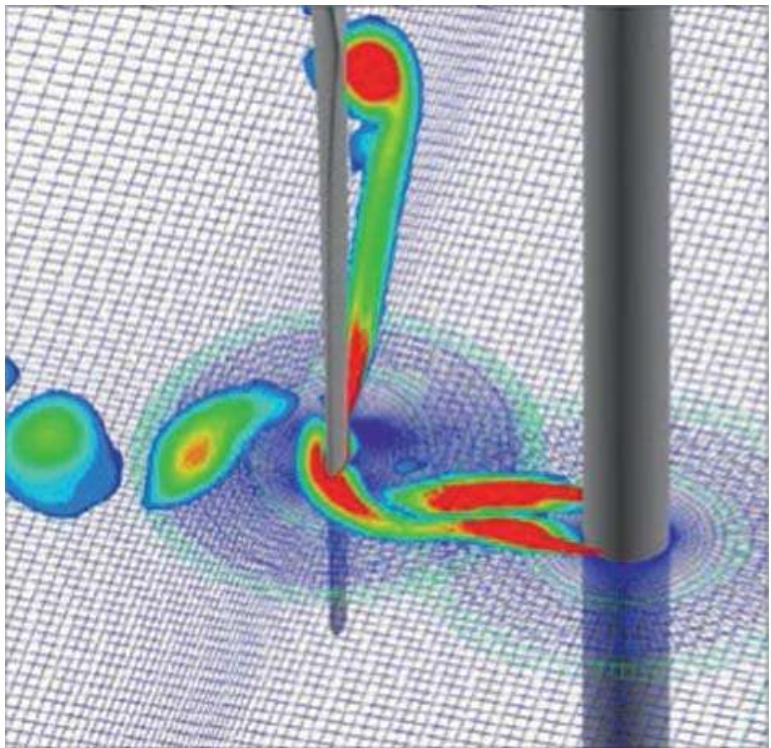

natural_image

Thermal or pressure distribution visualization with color-coded regions and two vertical cylindrical structures (no text or symbols)

Figure 4.38 Vorticity downstream of a rotor–blade–tower interaction.

Figure 4.38 shows part of a CFD (EllipSys3D) simulation of a rotor sow reld with overlaid grid blocks to handle relative movement (Zahle et al. 2007).

# 4.7.8 Full Kow Jeld simulation including ABL and wind turbines

# Incident @ow Aeld (ABL)

As in wind-tunnel testing, most CFD sow simulations model the inlet sow, which is incident on the body being studied as a uniform inlet sow. But increasingly, wind turbine sow studies are examining the effects on rotor forces of the turbulence and vertical shear present in the natural wind, i.e. the ABL. Effects of shear can be studied in isolation by providing a suitable prorle of horizontal velocity on the inlet boundary with open or closed surface boundary conditions on all other boundaries of the computational domain. Standard prorles of velocity may be used to represent the ABL:

1. Power law prorles:

$$
\frac {U}{U _ {\text { ref }}} = \left(\frac {z}{z _ {\text { ref }}}\right) ^ {a} \tag {4.159}
$$

where α is an exponent (typically 1/7 or 0.14) chosen to represent the ground plane condition. z is height above the local datum, and $z _ { \mathrm { r e f } }$ is the standard value of z at which the reference wind speed $U _ { \mathrm { r e f } }$ is measured,

2. Logarithmic prorles:

$$
\mathrm{U} / \mathrm{u} _ {*} = (1 / \mathrm{K}) \log (\mathrm{z} / \mathrm{z} _ {0}) + \mathrm{B} \tag {4.160}
$$

where $z _ { 0 }$ is the ground roughness length scale; $u _ { \mathrm { * } } = U _ { \mathrm { r e f } } \sqrt { ( \mathbf { C } _ { \mathrm { f } } / 2 ) ; \mathbf { C } _ { \mathrm { f } } }$ is the ground friction coefrcient; K, von Karman’s constant $= 0 . 4 1$ ; and B, a function of atmospheric stability and of $z _ { 0 }$ and z (weakly) if prorles above 200 m are to be represented accurately. Typically B has a value around 8.5. These prorles are shown compared with ABL measurements in Deaves and Harris (1978). See also the discussion in Section 2.6.2.

Such prorles are appropriate when simulating the cyclic response of a turbine due to the effects of vertical shear. However, it should be noted that a prorle imposed at the upstream inlet plane in a computational simulation will tend to develop gradually with distance downstream of the inlet away from the original specircation unless stresses and mean velocity prorle are correctly balanced. To avoid any problems in such cases, the inlet boundary should not be too far upstream of the simulated rotor but just far enough to avoid its upstream insuence.

When turbulence is to be included in the insow, for example, to simulate buffet response, it is possible to represent the turbulence so that it conforms statistically (spectra etc.) with the turbulence occurring in the ABL and allow this turbulence to convect in a ‘frozen’ state with uniform velocity past the rotor or turbine. A widely used method of simulating such turbulence in the time domain uses appropriately rltered random noise, such as the generator developed by Veers (1988). Both turbulence in the time dimension only and turbulence varying over two spatial dimensions and time with correct cross-spectral properties are possible using the Veers 3-D wind simulation method (Veers 1988). Three-dimensional simulation is becoming increasingly important as rotors (∼150 m+) increase in diameter to become of similar size to the transverse length scales in ABL turbulence. Then reduced correlation across the turbine disc becomes signircant. This method of turbulence simulation is more appropriate for sows local to the rotor where the aim is to predict unsteady buffet forces on the blades.

For simulation of turbulence over longer sow distances, the better methods now combine both turbulence and shear and seek to establish a balanced boundary layer in which the feedback loop between mean velocity gradient and turbulence shear stress production is closed and in balance. This is done by repetitively computing the simulated ABL through the empty domain feeding the output at the downstream end back into the upstream inlet and continuing until statistical convergence shows that the mean and turbulent sows are ‘balanced’. Such a simulated ABL may then be used for computations of rotor/turbine/ABL sow reld simulations to be undertaken. These full time-domain solutions can only be realistically undertaken using LES methods and hence are very costly. This method of repeatedly computing the ABL until statistical convergence has also been used with RANS codes to provide a balanced ABL simulation, but because the approach in this case is limited to statistical means, it is not able to drive time-dependent buffet studies without further empiricism to provide time-domain sequences.

It should be noted that placing the rotor in a derned insow reld also has effects that distort this reld, and simulations should ideally treat the whole sow reld as a composite process.

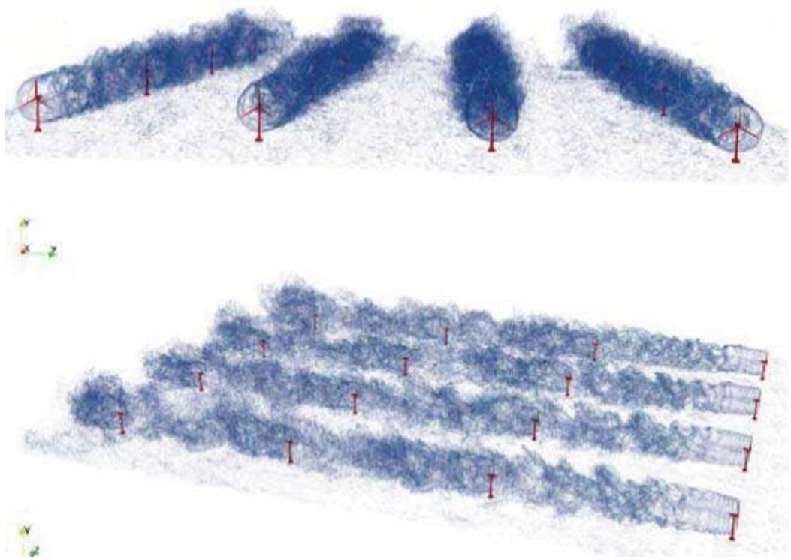

natural_image

Two 3D surface plots showing wind farm structures with red arrows indicating direction, no text or symbols present.

Figure 4.39 Volume rendering of computed turbulent wakes of $\mathrm { ~ a ~ } 4 \times 4$ array of wind turbine rotors (upper looking downwind, lower with sow right to left.).

# Large-scale wind farm simulations

One of the main applications of CFD in wind energy in 2020 is the large-scale simulation of the sow of a turbulent ABL through arrays of wind turbine rotors representing a wind farm. The detailed siting of large numbers of turbines in a farm can have signircant insuence on the total energy that can be captured and on the level of adverse effects due to wake interactions. Such computations are very computer intensive, and therefore the rotors themselves are usually represented at the simple actuator disc or actuator line level, whereas LES is used for the turbulent wind farm sow reld (Martinez-Tossas et al. 2018). Figure 4.39 (Deskos et al. 2019) shows an example of a sow reld calculated in this way for a 4 × 4 array of turbines.

# References

Anderson, J.D. (1991). Fundamentals of Aerodynamics. New York: McGraw-Hill.   
Aziz, K. and Hellums, J.D. (1967). Numerical solutions of the three-dimensional equations of motion for laminar natural convection. Phys. Fluids 10: 314.   
Beddoes, T.S. (1975). A synthesis of unsteady aerodynamic effects including stall hysteresis. Proceedings of 1st European Rotorcraft Forum, Southampton.   
Bjorck, A., Mert, M. and Madsen, H.A. (1999). Optimal parameters for the FFA-Beddoes dynamic stall model. Proceedings of the EWEC, Nice, France, p. 125.   
Chorin, A.J. (1967). A numerical method for solving incompressible sow problems. J. Comput. Phys. 2: 12–26.

Coleman, R.P., Feingold, A.M., and Stempin, C.W.(1945). Evaluation of the induced velocity reld of an idealised helicopter rotor. NACA ARR No. L5E10.   
Deaves, D.M. and Harris, R.I. (1978). A mathematical model of the structure of strong winds. Construction Industry Research and Information Association report No. 76.   
Deskos, G., Laizet, S., and Piggott, M. (2019). Turbulence resolving simulations of wind turbine wakes. Renewable Energy 134: 989–1002.   
Drela, M. (1989). XFOIL: An analysis and design system for low Reynolds number airfoils. In: Low Reynolds Number Aerodynamics, 1–12. Springer.   
Farmer, J.J., Martinelli, L. and Jameson, A. (1993). A fast multi-grid method for solving incompressible hydrodynamic problems with free surfaces. AIAA 93-0767, 31st AIAA Aerospace Sciences Meeting, Reno, Nevada, USA.   
Ferziger, J.H. and Peric, M. (1997). Computational Methods for Fluid Dynamics. Springer.   
Fung, Y.C. (1969). An Introduction to the Theory of Aeroelasticity. New York: Dover.   
Gangwani, S.T. (1982). Prediction of dynamic stall and unsteady airloads for rotor blades. J. Am. Helicopter Soc. 27: 57–64.   
Gatski, T., Grosch, C., and Rose, M. (1982). A numerical study of the two-dimensional Navier–Stokes equations in vorticity-velocity variables. J. Comput. Phys. 48: 1–22.   
Gault, D.E. (1957). A correlation of low speed airfoil section stalling characteristics with Reynolds number and airfoil geometry. NACA. Tech. Note 3963.   
Germano, M., Piomelli, U., Moin, P., and Cabot, W.H. (1991). A dynamic sub-grid scale eddy viscosity model. Phys. Fluids A 3: 1760–1765.   
Glauert, H. (1926).A general theory of the autogyro. ARCR R&M No. 1111.   
Goankar, G.H. and Peters, D.A. (1988). Review of dynamic insow modelling for rotorcraft sight dynamics. Vertica 2 (3): 213–242.   
Gormont, R.E. (1973). A mathematical model of unsteady aerodynamics and radial sow for application to helicopter rotors. USAAMRDL technical report.   
Graham, J.M.R. (1983). The lift on an aerofoil in starting sow. J. Fluid Mech. 133: 413–425.   
Gupta, S. and Leishman, J.G. (2006). Dynamic stall modelling of the S809 aerofoil and comparison with experiments. Wind Energy 9: 521–547.   
Hansen M. H., Gaunaa, M. and Madsen, H.A. (2004). A Beddoes-Leishman type dynamic stall model in state-space and indicial formulation. Risø-R-1354(EN).   
HaQuang, N., Peters, D.A. (1988). Dynamic insow for practical applications. Technical note. J. Am. Helicopter Soc.   
Johnson, W. (1969). The effect of dynamic stall on the response and airloading of helicopter rotor blades. J. Am. Helicopter Soc. 14: 68.   
Jones, W.P. (1945).Aerodynamic forces on wings in non-uniform motion. ARC R&M 2117.   
Katz, J. and Plotkin, A. (1991). Low Speed Aerodynamics: From Wing Theory to Panel Methods. New York: McGraw-Hill.   
Kinner, W. (1937). The principle of the potential theory applied to the circular wing (trans. M. Flint, R.T.P.). Translation No 2345. Ing. Arch. VIII: 47–80.   
Kussner, H.G. (1936). Zusammenfassender Bericht uber den instationaren Auftrieb von Flugeln. Luftfahrtforschung 13: 410–424.   
Leishman, J.G. (2002). Challenges in modelling the unsteady aerodynamics of wind turbines. AIAA-2002-0037, 21st ASME Wind Energy Symposium, Reno, Nevada, USA.   
Leishman, J.G. and Beddoes, T.S. (1989). A semi–empirical model for dynamic stall. J. Am. Helicopter Soc. 34 (3): 3–17.   
Lindenburg, C. (1996). Results of the PHATAS-III development. IEA 28th Meeting of Experts, Lyngby, Denmark.   
Loewy, R.G. (1957). A two-dimensional approach to the unsteady aerodynamics of rotary wings. J. Aeronaut. Sci. 24 (2): 81.

McNae, D.M. (2014). Unsteady hydrodynamics of tidal stream turbines. PhD thesis, Imperial College London.   
Mangler, K.W., Squire, H.B. (1950). The induced velocity reld of a rotor. ARCR R&M No. 2642.   
Martinez-Tossas, L.A., Churchreld, M.J., Yilmaz, A.E. et al. (2018). Comparison of four large eddy simulation research codes and effect of model coefrcient and insow turbulence in actuator-line based wind turbine modelling. J. Renewable Sustainable Energy 10: 033301.   
Meijer Drees, J. (1949). A theory of airsow through rotors and its application to some helicopter problems. J. Helicopter Assoc. Great Britain 3 (2): 79–104.   
Menter, F.R., Kuntz, M., and Langtry, R. (2003). Ten years of industrial experience with the SST turbulence model. Turbulence Heat Mass Trans. 4: 625–632.   
Mikkelsen, R.F. (2003). Actuator disc methods applied to wind turbines. PhD thesis, Tech. Uni. Dk., Lyngby.   
Miller, R.H. (1964). Rotor blade harmonic air loading. AIAA J. 2 (7): 1254.   
Morino, L. (1993). Boundary integral equations in aerodynamics. Appl. Mech. Rev. 46: 445–486.   
Øye, S.(1992). Induced velocities for rotors in yaw. Proceedings of the Sixth IEA Symposium on the Aerodynamics of Wind Turbines, ECN, Petten.   
Peters, D.A., Boyd, D.D., and He, C.J. (1989). Finite state induced sow model for rotors in hover and forward sight. J. Am. Helicopter Soc. 34 (4): 5–17.   
Petot, D. (1989). Modelisation de decrochage dynamique. La Recherche aérospatiale 5: 60.   
Pitt, D.M. and Peters, D.A. (1981). Theoretical prediction of dynamic insow derivatives. Vertica 5: 21–34.   
Prandtl, L. and Tietjens, O.G. (1957). Applied Hydro- and Aeromechanics. New York: Dover.   
Sears, W.R. (1941). Some aspects of non-stationary airfoil theory and its practical applications. J. Aerosp. Sci. 8: 104–108.   
Sheng, W., Galbraith, R.A.M., and Coton, F.N. (2010). Applications of low speed dynamic stall model to the NREL airfoils. J. Sol. Energy Eng. 132 (1): 1–8.   
Snel, H. and Schepers, J.G. (1995). Joint investigation of dynamic insow effects and implementation of an engineering method. ECN Report: ECN-C-94-107.   
Soerensen, J.N., Shen, W.Z., and Munduate, X. (1998). Analysis of wake states by a full reld actuator disc model. Wind Energy 88: 73–88.   
Speziale, C.G. (1991). Analytical models for the development of Reynolds stress closures in turbulence. Ann. Rev. Fluid Mech. 23: 107.   
Suzuki, A and Hansen, A.C. (1999).Generalized dynamic wake model for Yawdyn. AIAA-99-0041, AIAA Wind Symposium, Reno, Nevada, USA.   
Tarzanin, F.J. (1972). Prediction of control loads due to blade stall. J. Am. Helicopter Soc. 1: 33.   
Theodorsen, T. (1935). General theory of aerodynamic instability and the mechanism of sutter. NACA Report 496.   
Thwaites, B. (1987). Incompressible Aerodynamics. New York, NY: Dover.   
Tuckerman, L.B. (1925). Inertia factors of ellipsoids for use in airship design. NACA Report Number 210.   
Van Bussel, G.J.W. (1995). The aerodynamics of horizontal axis wind turbine rotors explored with asymptotic expansion methods. Doctoral thesis, Delft University of Technology.   
Veers, P.S. (1988). Three-dimensional wind simulation. Sandia Report SAND88-0152.UC-261.   
Wagner, H. (1925). Über die Entstehung des dynamischen Auftriebes von Tragsügel. Z. Angew. Math. Mech. 5 (1): 17.   
White, F.M. (1991). Viscous Fluid Flow. New York: McGraw-Hill.   
Zahle, F., Soerensen, N.N., Johansen, J. and Graham, J.M.R. (2007). Wind turbine rotor-tower interaction using an incompressible overset grid method. AIAA-2007-0425, 42nd AIAA Aerospace Sciences meeting, Reston, Virginia, USA.

# Further Reading

Bertagnolio, F., Sørensen, N.N. and Johansen, J. (2006). Prorle catalogue for airfoil sections based on 3D computations. Risø-R-1581(EN).   
Himmelskamp, H. (1945). Prorle investigations on a rotating airscrew. Doctoral thesis, Gottingen.   
Johnson, W. (1980). Helicopter Theory. New York: Dover.   
Leishman, G.J. (2000). Principles of Helicopter Aerodynamics, 390–392. Cambridge: Cambridge University Press.   
Sørensen, N.N. (2002). 3D background aerodynamics using CFD. Risø-R-1376(EN).   
Stepniewski, W.Z. and Keys, C.N. (1984). Rotary-Wing Aerodynamics. New York: Dover.