# Conceptual design of horizontal axis wind turbines

# 6.1 Introduction

Within the general category of horizontal axis wind turbines for grid applications, there exists a great variety of possible machine conrgurations, power control strategies, and braking systems. This chapter looks at the different areas where design choices have to be made and considers the advantages and disadvantages of the more conventional options in each case. Inevitably, there are situations in which decisions in one area can impact those in another, and some of these are noted.

Alongside these discrete design choices, there are several fundamental design parameters, such as rotor diameter, machine rating, and rotational speed, which also have to be established at the start of the design process. Continuous variables such as these lend themselves to mathematical optimisation, as described in the opening sections of the chapter.

An illuminating overview of the evolution of turbine design, including the power control strategies and drive train conrgurations adopted by particular manufacturers, is provided in Wind Energy – The Facts (EWEA 2009) published by the European Wind Energy Association (EWEA).

# 6.2 Rotor diameter

The issue of what size of turbine produces energy at minimum cost has been rercely debated for a long time. Protagonists of large machines cite economies of scale and the increase in wind speed with height in their favour. On the other hand, the economics of large machines suffer as a result of the ‘square-cube law’, whereby energy capture increases as the square of the diameter, whereas rotor mass (and therefore cost) increases as the cube.

In reality, both arguments are correct, and there is a trade-off between economies of scale and a variant of the ‘square-cube law’ that takes into account the wind shear effect. This trade-off can be examined with the help of simple cost modelling, which is considered next. However, it should be recognised that, in the case of blades at least, the ‘square-cube’ law has, to a signircant extent, been circumvented up till the time of writing by the introduction of improved materials and increased structural efrciency as diameters have increased.

# 6.2.1 Cost modelling

The sensitivity of the cost of energy to changes in the values of parameters governing turbine design can be examined with the aid of a model of the way component costs vary in response. The normal procedure is to start with a baseline design, for which the costs of the various components are known. In a rigorous analysis, the chosen parameter is then assigned a different value and a fresh design developed, leading to revised component weights, based on which new component costs can be assigned.

In general, the cost of a component will not simply increase pro rata with its mass but will contain elements that increase more slowly. Examples are the tower surface protective coating and tower longitudinal welds (assuming the number required is constant), the costs of which increase approximately as the square of the tower height, if all dimensions are proportional to this height. If the design parameter variation considered is only about ±50%, it is usually sufrciently accurate to represent the relationship between component cost and mass as a linear one with a rxed component, as follows:

$$
C (x) = C _ {B} \left(\mu \frac {m (x)}{m _ {B}} + (1 - \mu)\right) \tag {6.1}
$$

where C(x) and m(x) are the cost and mass of the component, respectively, when the design parameter takes the value x, and $C _ { \mathrm { B } }$ and $m _ { \mathrm { B } }$ are the baseline values. 휇 is the proportion of the cost that varies with mass, which will obviously differ for different baseline machine sizes and for different components.

The choice of the value of 휇 inevitably requires considerable expertise as regards the way manufacturing costs vary with scale, which may be limited in the case of products at the early stage of development. In view of this, the effort of developing fresh designs for different design parameter values may well not be justired, so resort is often made to scaling ratios based on similarity relationships. This approach is adopted in the investigation of optimum machine size that follows.

# 6.2.2 SimpliJed cost model for machine size optimisation: an illustration

The baseline machine design is taken as a 60 m diameter, 1.5 MW turbine, with the costs of the various components taken from the Risø publication ‘Cost Optimisation of Wind Turbines for Large-Scale Offshore Wind Farms’, by Fuglsang and Thomsen (1998). These are given in Table 6.1 as a percentage of the total.

Table 6.1 Component costs expressed as a percentage of total machine cost for a 1.5 MW, 60 m diameter, rxed-speed, stall-regulated wind turbine on land 

<table><tr><td>Component</td><td>Cost as a percentage of total</td><td>Component</td><td>Cost as a percentage of total</td></tr><tr><td>Blades</td><td>18.3%</td><td>Controller</td><td>4.2%</td></tr><tr><td>Hub</td><td>2.5%</td><td>Tower</td><td>17.5%</td></tr><tr><td>Main shaft</td><td>4.2%</td><td>Brake system</td><td>1.7%</td></tr><tr><td>Gearbox</td><td>12.5%</td><td>Foundation</td><td>4.2%</td></tr><tr><td>Generator</td><td>7.5%</td><td>Assembly</td><td>2.1%</td></tr><tr><td>Nacelle</td><td>10.8%</td><td>Transport</td><td>2.0%</td></tr><tr><td>Yaw system</td><td>4.2%</td><td>Grid connection</td><td>8.3%</td></tr><tr><td></td><td></td><td>Total</td><td>100%</td></tr></table>

Source: From Risø-R-1000, Fuglsang and Thomsen (1998).

Machine designs for other diameters are obtained by scaling all dimensions of all components in the same proportion, except in the case of the gearbox, generator, grid connection, and controller. Rotational speed is kept inversely proportional to rotor diameter to maintain constant tip speed and hence constant tip speed ratio at a given wind speed. As a result, the maximum rotor aerodynamic thrust increases with the square of rotor diameter, and the peak aerodynamic bending moment in each structural element, which is assumed to govern its design, increases with rotor diameter cubed. Given the assumption that all cross-sectional dimensions increase in proportion to rotor diameter, the bending section moduli increase as diameter cubed, so each critical stress remains invariant with diameter.

Maintenance of constant tip speed also means that all machine designs reach rated power at the same wind speed, so that rated power is proportional to diameter squared. However, the low-speed shaft torque increases as diameter cubed, which is the basis for assuming the gearbox mass increases as the cube of rotor diameter, even though the gearbox ratio changes.

In the following illustration a blanket value of $\mu$ of 0.9 for all components is adopted for simplicity. Accordingly, the cost of all components apart from generator, controller, and the grid connection, for a machine of diameter D, is given by

$$
C _ {1} (D) = 0. 8 C _ {T} (6 0) \left(0. 9 \left(\frac {D}{6 0}\right) ^ {3} + 0. 1\right) \tag {6.2}
$$

where $C _ { \mathrm { T } } ( 6 0 )$ is the total cost of the 60 m diameter baseline machine.

The rating of the generator and the grid connection is proportional only to the diameter squared. It is assumed that Eq. (6.1) applies to the cost of these components, but with mass replaced by rating. Thus the cost of the generator and grid connection are given by

$$
C _ {2} (D) = 0. 1 5 8 C _ {T} (6 0) \left(0. 9 \left(\frac {D}{6 0}\right) ^ {2} + 0. 1\right) \tag {6.3}
$$

The controller cost is assumed to be rxed, regardless of turbine size. Hence the resulting turbine cost as a function of diameter is

$$
\begin{array}{l} C _ {T} (D) = C _ {T} (6 0) \left(0. 8 \left\{0. 9 \left(\frac {D}{6 0}\right) ^ {3} + 0. 1 \right\} + 0. 1 5 8 \left\{0. 9 \left(\frac {D}{6 0}\right) ^ {2} + 0. 1 \right\} + 0. 0 4 2\right) \\ = C _ {T} (6 0) \left(0. 7 2 \left(\frac {D}{6 0}\right) ^ {3} + 0. 1 4 2 2 \left(\frac {D}{6 0}\right) ^ {2} + 0. 1 3 7 8\right) \tag {6.4} \\ \end{array}
$$

As the tower height, along with all other dimensions, is assumed to increase in proportion to rotor diameter, the annual mean wind speed (amws) at hub height will increase with rotor diameter because of wind shear. This has a signircant effect on energy yield, as the energy yield per unit of swept area is found to vary as the amws raised to the power of 1.9 for perturbations about the amws central value of $8 \mathrm { m } \mathrm { s } ^ { - 1 }$ taken in this example. The cost of energy (excluding operation and maintenance costs) can then be calculated in €/kWh/annum by dividing the turbine cost by the annual energy yield. The variation of energy cost with diameter, calculated according to the assumptions described above, is plotted in Figure 6.1 for two levels of wind shear corresponding to roughness lengths, $z _ { 0 } ,$ of 0.001 m and 0.05 m, the hub-height wind speed being scaled according to the relation $\overline { { U } } ( z ) \propto \ln ( z / z _ { 0 } )$ (see Section 2.6.2). Also included is a plot for the case of zero wind shear.

It is apparent that the level of wind shear has a noticeable effect on the optimum machine diameter, which varies from 44 m for zero wind shear to 52 m for the wind shear corresponding to a surface roughness length of 0.05 m, which is applicable to farmland with boundary hedges and occasional buildings. Strictly, the impact of the increased annual mean wind speed with hub height on the fatigue design of the rotor and other components should also be taken into account, which would reduce the optimum machine size slightly.

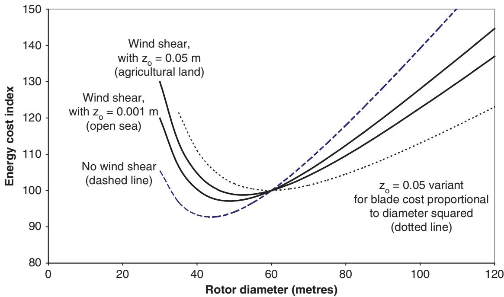

line

| Rotor diameter (metres) | Wind shear, with z₀ = 0.05 m (agricultural land) | Wind shear, with z₀ = 0.001 m (open sea) | No wind shear (dashed line) |
| ----------------------- | -------------------------------------------------- | ---------------------------------------- | --------------------------- |
| 30                      | 130                                                | 120                                      | 105                         |
| 60                      | 100                                                | 100                                      | 100                         |
| 120                     | 145                                                | 135                                      | 125                         |

Figure 6.1 Variation of optimum turbine size with wind shear based on simplired cost model (assuming hub height equal to diameter)

It should be emphasised that the optimum sizes derived above depend critically on the value of 휇 adopted. For example, if $\mu$ were taken as 0.8 instead of 0.9, the optimum diameter would increase to 64 m for the wind shear corresponding to a surface roughness length of 0.05 m, although the minimum cost of energy would alter by only 0.9%. The correct approach would be to allocate different values of $\mu$ to different components, as is done in Fuglsang and Thomsen (1998). Ideally, these would be based on cost data on components of the same design but different sizes.

The cost model outlined and illustrated above provides a straightforward means of investigating scale effects on machine economics for a chosen machine design. In practice, the use of different materials or different machine conrgurations may prove more economic at different machine sizes and will yield a series of alternative cost versus diameter curves.

An example of the impact technological developments can have on simple scaling rules is provided by the trajectory of specirc blade mass – derned as blade mass divided by turbine diameter cubed – as longer blade designs have evolved over time. Figure 6.2a shows a plot of specirc blade mass against diameter for blades manufactured by LM Glasrber that were available in 2004.

It is seen that the specirc blade mass is approximately inversely proportional to diameter – i.e. the blade mass has increased with diameter squared rather than with diameter cubed. The decline in specirc blade mass is partly due to a lower practical limit on skin thicknesses, which made the smaller blades heavier than they would otherwise need to be, and partly due to technological improvements in the manufacture of glass rbre reinforced plastic (GFRP) blades, which have permitted increased rbre volume fractions and hence higher strengths.

The blade cost scaling rule adopted in the cost model obviously has a decisive effect on the optimum rotor diameter, which (for the case of wind shear corresponding to a surface roughness of 0.05 m) increases from 52 to 59 m when the blade cost is scaled as the square of diameter, as indicated by the dotted line in Figure 6.1. This does not take into account the knock-on savings in the costs of other components due to the reduction in rotor mass.

In recent years, data on the weights of blades in production has become increasingly scarce, but the few rgures available suggest that the trend in Figure 6.2a may be continuing as turbine diameters increase. See Figure 6.2b, which also includes the specirc blade masses of the National Renewable Energy Laboratory (NREL) 5 MW and DTU 10 MW reference blade designs (Jonkman et al. [2009] and Bak et al. [2013]).

# 6.2.3 The NREL cost model

Research at NREL, reported in ‘Wind Turbine Design Cost and Scaling Model’ (Fingersh et al. [2006]), has resulted in a useful set of mass and cost scaling rules for several wind turbine conrgurations, which serve as benchmarks against which innovations in the design of individual components can be judged. It is intended that the scaling rules are updated over time as additional data becomes available.

The baseline turbine design is a 70 m diameter, 1.5 MW variable-speed pitch-regulated machine, rtted with a three stage planetary gearbox. Many of the scaling rules are similar to those set out in the preceding section, with the main differences being as follows:

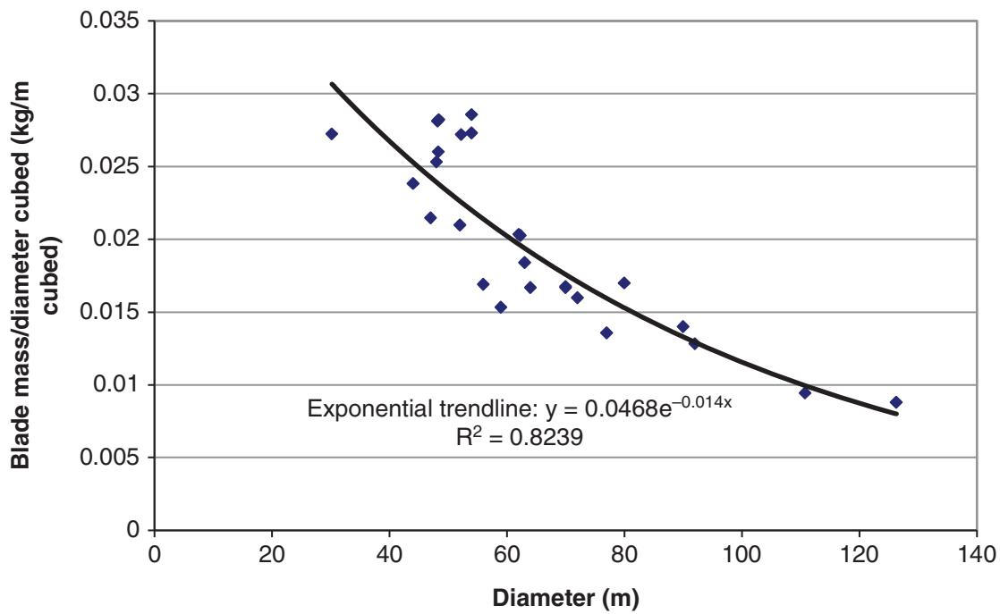

scatter

| Diameter (m) | Blade mass/diameter cubed (kg/m cubed) |
| ------------ | -------------------------------------- |
| 30           | 0.027                                  |
| 45           | 0.024                                  |
| 50           | 0.028                                  |
| 55           | 0.026                                  |
| 60           | 0.021                                  |
| 65           | 0.018                                  |
| 70           | 0.016                                  |
| 75           | 0.014                                  |
| 80           | 0.017                                  |
| 90           | 0.013                                  |
| 110          | 0.009                                  |
| 125          | 0.008                                  |

(a)

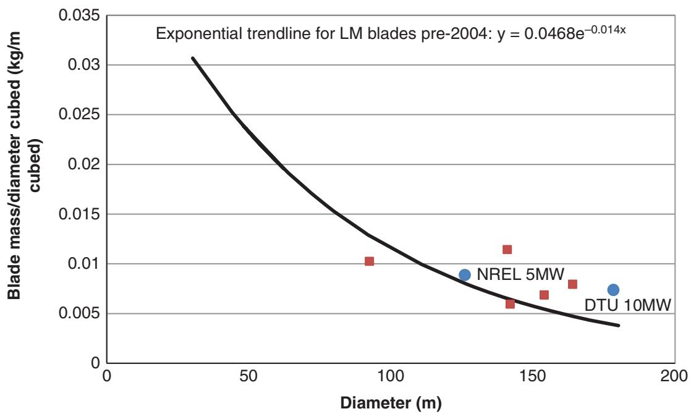

line

| Diameter (m) | Blade mass/diameter cubed (kg/m cubed) |
| ------------ | -------------------------------------- |
| 90           | 0.01                                   |
| 130          | 0.009                                  |
| 140          | 0.011                                  |
| 145          | 0.006                                  |
| 155          | 0.007                                  |
| 165          | 0.008                                  |
| 175          | 0.007                                  |

(b)   
Figure 6.2 (a) Variation of specirc blade mass with diameter for LM blades available in 2004. (b) Variation of specirc blade mass with diameter for large turbines, based on limited published data available in 2019

• Blade cost split into material and labour costs of similar magnitudes, with the former scaling as diameter cubed $( D ^ { 3 } )$ and the latter scaling as $D ^ { 2 . 5 }$ .   
• Gearbox and main bearings costs scaled as $D ^ { 2 . 5 }$ rather than $D ^ { 3 }$   
• Nacelle cost scaled as $D ^ { 1 . 9 5 }$ rather than $D ^ { 3 }$ .

• Foundation cost scaled as $D ^ { 1 . 2 }$ rather than $D ^ { 3 }$ .   
• An element of transport cost increasing as the fourth power of diameter.

Some of the cost formulae include a rxed element, which can be negative.

The cost of the pitch mechanism and bearings is assumed to be proportional to $D ^ { 2 . 6 6 }$ , and the cost of the variable-speed electronics is taken to be proportional to machine rating.

Table 6.2 presents the component costs of the baseline turbine in 2005 dollars and the respective percentages of the total. Also shown are the corresponding percentages for the 60 m diameter 1.5 MW machine of the preceding section, where applicable. Caution should be exercised in making comparisons, however, as component dernitions may vary.

Figure 6.3 presents the variation of the cost of energy capital component with turbine diameter, based on the NREL cost model for the machine described previously. The annual mean wind speed at 50 m height is taken as $7 . 2 5 \mathrm { m } / \mathrm { s } ,$ and wind speed is assumed to vary with hub height according to the power law $\overline { { U } } ( z ) = \overline { { U } } ( 5 0 ) . ( z / 5 0 ) ^ { 0 . 1 4 }$ . Hub height is taken as equal to turbine diameter as before, and the rated wind speed in all cases is 11.55 m/s. Turbine life is taken as 20 years, and a discount rate of 10% is used.

It is seen that the model indicates that the optimum turbine diameter is just over 70 m – rather greater than that given by the cost model in the preceding section. This is to be expected in view of the reduced diameter exponents of the scaling rules for some components.

# 6.2.4 The INNWIND.EU cost model

A comprehensive cost model in the form of a spreadsheet was developed as part of the INNWIND project - Innovative Wind Conversion Systems (10–20 MW) for Offshore Applications – (INNWIND [2016]). This updated and expanded the NREL cost model, adding alternative options for the costing of blades, drive trains, towers, and offshore foundations.

# 6.2.5 Machine size growth

During the 1980s and 1990s, the size of the largest turbines in commercial production doubled about every 7 years. More recently, the driver to increased diameters has undoubtedly been the extension of wind farm development offshore, where substantial rxed elements of support structure and undersea cable installation costs favour the deployment of much larger machines than on land. Nevertheless, Wind Energy – The Facts (EWEA 2009) pointed out that the diameter of the largest commercially available wind turbine plateaued at about 125 m between 2004 and 2008 – a striking pause in the rapid growth in machine size hitherto. Turbine size growth has subsequently resumed, however, with the result that in 2019 about 40 different turbines were being marketed with diameters in excess of 130 m, although some differed only in power rating. Offshore, Siemens has been deploying 154 m diameter turbines since 2015, and Vestas has been deploying 164 m diameter turbines since 2017. Moreover, General Electric built a 220 m diameter prototype in 2019 – the 12 MW Haliade-X.

The increasing popularity of turbines over 100 m in diameter for sites on land begs the question of why sizes larger than the apparent optimum are being chosen. Part of the answer may lie in imperfections of the cost models. However, a signircant factor encouraging the selection of larger turbines is undoubtedly that their use enables better exploitation of sites of limited area. For example, the total rated capacity that can be installed on a narrow ridge increases roughly linearly with turbine diameter, assuming (as is normally the case) that the minimum spacing permitted by the manufacturer is specired in terms of a rxed number of turbine diameters. Given that some site development costs, such as permitting and grid connection, do not vary signircantly with wind farm rated capacity, there is always an incentive to maximise the installed capacity.

Table 6.2 Component costs and percentages for NREL 1.5 MW 70 m diameter baseline machine 

<table><tr><td>Component</td><td>Component costs for 1.5 MW, 70 m diameter NREL baseline turbine (with 70 m hub height) $1000 (2005)</td><td>Percentage component costs for NREL baseline turbine</td><td>Percentage component costs for Risø-R-1000 1.5 MW, 60 m diameter turbine</td></tr><tr><td>Blades</td><td>151</td><td>11.4%</td><td>18.3%</td></tr><tr><td>Hub and nose cone</td><td>47</td><td>3.6%</td><td>2.9%</td></tr><tr><td>Pitch bearings and mechanism, including hydraulics</td><td>56</td><td>4.3%</td><td>N/A</td></tr><tr><td>Low-speed shaft and main bearings</td><td>33</td><td>2.5%</td><td>4.2%</td></tr><tr><td>Gearbox</td><td>152</td><td>11.6%</td><td>12.9%</td></tr><tr><td>Generator</td><td>98</td><td>7.4%</td><td>7.5%</td></tr><tr><td>Variable-speed electronics</td><td>119</td><td>9.0%</td><td>N/A</td></tr><tr><td>Nacelle main frame and cover</td><td>117</td><td>8.9%</td><td>10.8%</td></tr><tr><td>Yaw drive and bearing</td><td>20</td><td>1.5%</td><td>4.2%</td></tr><tr><td>Control system</td><td>35</td><td>2.7%</td><td>4.2%</td></tr><tr><td>Tower</td><td>158</td><td>12.0%</td><td>17.5%</td></tr><tr><td>Brake and high-speed coupling</td><td>3</td><td>0.2%</td><td>1.7%</td></tr><tr><td>Foundation</td><td>47</td><td>3.6%</td><td>4.2%</td></tr><tr><td>Assembly and installation</td><td>42</td><td>3.2%</td><td>2.1%</td></tr><tr><td>Transportation</td><td>51</td><td>3.9%</td><td>2.0%</td></tr><tr><td>Internal electrical connections</td><td>60</td><td>4.6%</td><td rowspan="2">8.3%</td></tr><tr><td>Electrical connection to substation</td><td>127</td><td>9.6%</td></tr><tr><td></td><td>1317</td><td>100%</td><td>100%</td></tr></table>

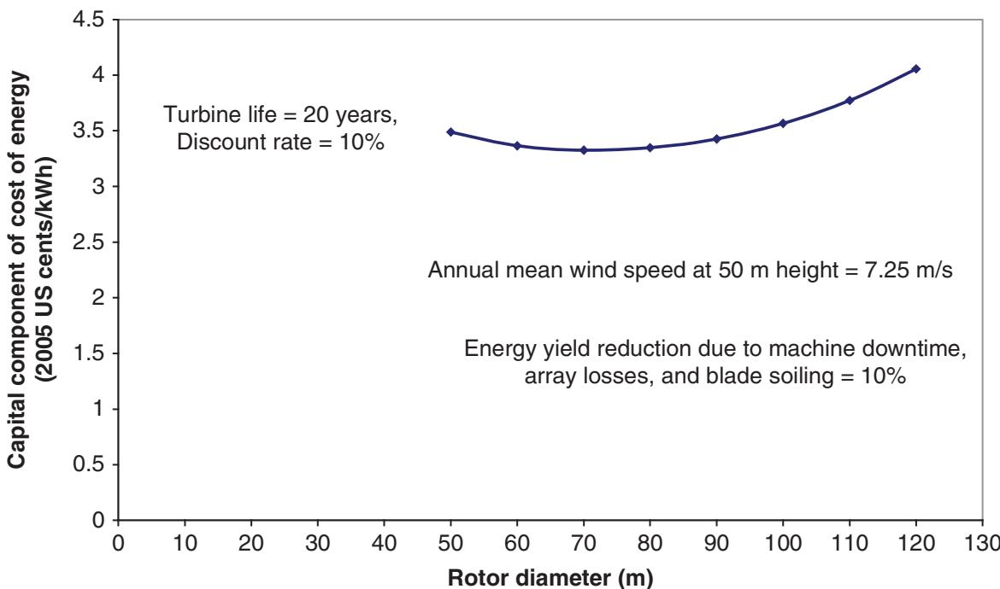

line

| Rotor diameter (m) | Capital component of cost of energy (2005 US cents/kWh) |
| ------------------ | ------------------------------------------------------ |
| 50                 | 3.5                                                    |
| 60                 | 3.4                                                    |
| 70                 | 3.3                                                    |
| 80                 | 3.3                                                    |
| 90                 | 3.4                                                    |
| 100                | 3.6                                                    |
| 110                | 3.8                                                    |
| 120                | 4.1                                                    |

Figure 6.3 Variation of cost of energy with turbine diameter for NREL baseline machine – capital cost component only

# 6.2.6 Gravity limitations

The simplired cost model described above was based on the assumption that blade design is governed solely by aerodynamic loads. However, as diameters increase, it is inevitable that edgewise moments due to blade self-weight will become increasingly important. For a family of blade designs derived from a baseline design by simply scaling the diameter and all other dimensions by the same amount, the blade root gravity moment will increase as the fourth power of diameter while the section modulus only increases by the third power. Although there will initially be some scope for catering for the increased gravity moment by redeployment of material closer to the leading and trailing edges, a limit on the practicable diameter for any particular blade material must eventually be reached.

# 6.2.7 Variable diameter rotors

The reduction of turbine diameter as wind speed increases offers the possibility of increased energy capture at low winds without the penalty of increased loads at high winds. The diameter reduction can be achieved either by reducing the cone angle if the blades are hinged at the root or by retracting a sliding blade tip section, which would necessarily have to be of uniform cross-section, on a rigid hub rotor. Jamieson (2018) describes these concepts in more detail and work carried out to evaluate them.

# 6.3 Machine rating

The machine rating determines the wind speed (known as rated wind speed) at which rated power is reached. If the rating is too high for a given rotor diameter, the rated power will only be reached rarely, so the cost of the drive train and generator will not be justired by the energy yield. However, if the rating is reduced below the optimum, then the cost of the rotor and its supporting structure will be excessive in relation to energy yield.

The investigation of the optimum relationship between rotor diameter and rated power can be carried out with the help of the cost modelling technique described in the previous section.

# 6.3.1 SimpliJed cost model for optimising machine rating in relation to diameter

The way in which the design of the various wind turbine components is insuenced by changes in the rated speed is critically dependent on the nature of any accompanying changes in rotational speed. However, in view of the fact that the maximum rotational speed of land based machines is generally restricted to limit noise emission (see Section 6.4), it is assumed here that the maximum tip speed is limited to 80 m/s, regardless of the rated wind speed.

The simplired cost model is applied to a pitch-regulated, variable-speed machine, as these are now the turbine of choice. It is assumed that the machine is designed for optimum performance at a tip speed ratio of 8 and that it operates at this tip speed ratio up to a wind speed of 10 m/s, with the nominal tip speed remaining at 80 m/s at higher wind speeds.

Assuming that the blade plan-form and twist distribution are rxed, the annual energy yield can be calculated for a number of rated wind speeds, for a given annual mean wind speed and Weibull shape factor. The aim of the optimisation is to obtain the minimum cost of energy, which requires knowledge of how the costs of the various turbine components would be affected by the rating change. Although in theory this could only be rigorously derived by carrying out a series of detailed turbine designs, in practice it is possible to obtain a useful indication of cost trends by identifying the parameters driving the design of each component category and investigating their dependence on the rated wind speed. If the cost split between various components is known for a baseline machine, these cost trends can then be applied to it to determine the optimum rating. In this case the cost shares given in Table 6.2 for the 70 m diameter, 1.5 MW NREL machine are used.

The manner in which the design of each of the major components is insuenced by rated wind speed is set out as follows:

1. Blade weight: The following assumptions are made:

• The blade plan-form is constant.   
• The blade design is governed by out-of-plane bending moments in fatigue.   
• The out-of-plane bending moment suctuations are proportional to the product of the wind speed suctuation and the rotational speed [see Eq. (5.25) in Section 5.7.5].

• The rotational speed is a function of prevailing wind speed but is independent of rated wind speed assuming the latter is 10 m/s or above.   
• The blade skin thickness is independent of rated wind speed.   
Hence, the blade skin thickness and therefore the blade weight are unaffected by changes in the rated wind speed.

2. Hub and pitch system weights: It is assumed that each is proportional to the blade out-of-plane bending moments in fatigue – i.e. independent of rated wind speed.   
3. Low-speed shaft weight: This is assumed to be governed by the shaft bending moment due to the cantilevered rotor and hub weights, which are unaffected by changes in rated wind speed.   
4. Gearbox and brake: Gearbox and brake design are governed by the rated torque, P/훺. The maximum rotational speed is rxed, so the rated torque varies as the power rating. The weights of the gearbox and brake are therefore taken to be proportional to the rated power.   
5. Generator and variable-speed electronics: The design of the generator and the variable-speed electronics are governed by rated power, and the weight is assumed to be proportional to rated power in each case.   
6. Nacelle structure, yaw system, tower, and foundation: The design of these is governed principally by either extreme or suctuating loads on the rotor, both of which are assumed to be independent of rated wind speed. The weights are therefore taken to be unaffected by rated wind speed.   
7. Grid connection: The weight of cables, switchgear, and transformers are assumed to be proportional to rated power.   
8. Controller, assembly, and transport: The costs of these items are taken as independent of rated speed.

The various components just listed are classired into two categories in Table 6.3, according to whether their weights are rxed or vary with the rated power. Also tabulated are the component costs as a percentage of the total for the baseline machine, together with the sum for each category.

Accordingly, the following expression is obtained for machine cost as a function of the ratio of the rated power to that of the baseline machine, $P _ { \mathrm { R } } / P _ { \mathrm { R B } }$ :

$$
C _ {T} = C _ {T B} (0. 5 7 6 + 0. 4 2 4 (P _ {R} / P _ {R B})) \tag {6.5}
$$

The capital component of the cost of energy is obtained by dividing the machine cost from Eq. (6.5) by the discounted lifetime annual energy yield, which is calculated for each rated wind speed by combining the corresponding power curve with the Weibull distribution of wind speeds. This exercise has been carried out using the 70 m diameter, 1.5 MW pitch-regulated, variable-speed NREL machine as baseline, assuming an annual mean wind speed of 7.5 m/s and taking the rated wind speed of the baseline machine as 11.55 m/s. The results are presented in Figure 6.4, which indicates that the optimum machine rating is very close to the 1.5 MW baseline. The variation in cost of energy with

Table 6.3 Percentage contribution of different components to machine cost for the 70 m diameter, 1.5 MW NREL baseline machine, classired according to whether their cost varies with rated power or not 

<table><tr><td colspan="2">Components for which the weight/cost is independent of rated wind speed</td><td colspan="2">Components for which the weight varies as rated power</td></tr><tr><td>Component</td><td>Cost</td><td>Component</td><td>Cost</td></tr><tr><td>Blades</td><td>11.4%</td><td>Gearbox</td><td>11.6%</td></tr><tr><td>Hub and spinner</td><td>3.6%</td><td>Generator</td><td>7.4%</td></tr><tr><td>Pitch bearings and mechanism</td><td>4.3%</td><td>Variable-speed electronics</td><td>9%</td></tr><tr><td>Low-speed shaft and bearings</td><td>2.5%</td><td>Brake and high-speed coupling</td><td>0.2%</td></tr><tr><td>Nacelle</td><td>8.9%</td><td>Internal cables and grid connection</td><td>14.2%</td></tr><tr><td>Yaw drive and bearing</td><td>1.5%</td><td></td><td></td></tr><tr><td>Control system</td><td>2.7%</td><td></td><td></td></tr><tr><td>Tower</td><td>12%</td><td></td><td></td></tr><tr><td>Foundation</td><td>3.6%</td><td></td><td></td></tr><tr><td>Assembly</td><td>3.2%</td><td></td><td></td></tr><tr><td>Transport</td><td>3.9%</td><td></td><td></td></tr><tr><td>Total</td><td>57.6%</td><td>Total</td><td>42.4%</td></tr></table>

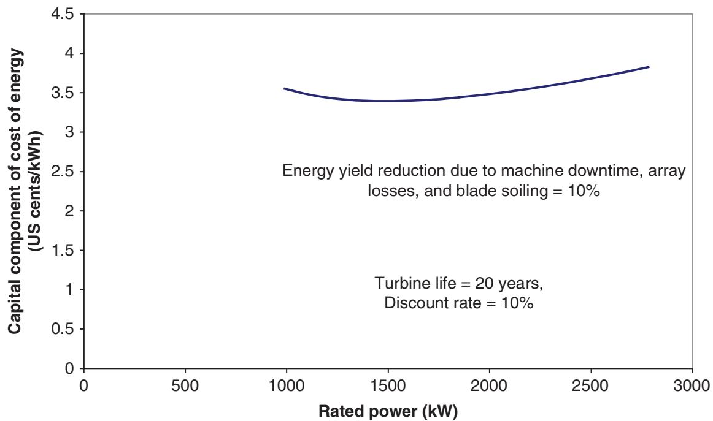

line

| Rated power (kW) | Capital component of cost of energy (US cents/kWh) |
| ---------------- | -------------------------------------------------- |
| 1000             | 3.5                                                |
| 1500             | 3.4                                                |
| 2000             | 3.5                                                |
| 2500             | 3.7                                                |
| 2800             | 3.8                                                |

Figure 6.4 Variation in cost of energy with rated power for a 70 m diameter, pitch-regulated variable-speed machine for an annual mean wind speed of $7 . 5 \mathrm { m } \mathrm { s } ^ { - 1 }$ based on simplired cost model

rated power on either side of the optimum is very small, with the maximum increase in the cost of energy over the range 1100–2000 kW being only 3%.

# 6.3.2 Relationship between optimum rated wind speed and annual mean

The optimum power rating is, of course, heavily dependent on the annual mean wind speed, $\mathrm { U _ { a v e } }$ . The optimum rated wind speed, $\mathrm { { U } } _ { \mathrm { { R o } } }$ for the above 70 m diameter pitch-regulated machine is given for a range of annual mean wind speeds in Table 6.4. The ratio $\mathrm { U } _ { \mathrm { R o } } / \mathrm { U } _ { \mathrm { a v e } }$ is in the range 1.6–1.4, decreasing with increasing wind speed.

A similar exercise can be carried out to determine the optimum rated power of a stall-regulated machine and would yield similar results. However, because stall-regulated machines reach rated power at a substantially higher wind speed than pitch-regulated machines of the same rating, the $\mathrm { U } _ { \mathrm { R o } } / \mathrm { U } _ { \mathrm { a v e } }$ ratio for stall-regulated machines is typically about 2.

# 6.3.3 SpeciJc power of production machines

It is instructive to investigate the relationship between rated power and swept area for production machines, and these quantities are plotted against each other in Figure 6.5 for 79 machines in production in 2008. Although different machines will have been designed for different annual mean wind speeds, the degree of scatter is not large, and a clear trend is apparent, with the line of best rt being close to a straight line passing through the origin. The mean specirc power, derned as rated power divided by swept area, is 380 W per square metre for the 79 machines - close to the optimum value in Table 6.4 for an annual wind speed of 7.5 m/s.

When a similar exercise is carried out for turbines in production in 2019, the picture is rather different – see Figure 6.6. This covers 100 turbines produced by six of the largest wind turbine manufacturers and includes a few large turbine designs that have been announced but not yet manufactured. It is seen that the mean value of the power to swept area ratio has much reduced – from 380 to 297 W/sqm, indicating that more designs are being tailored to low wind sites. As a result, there is an increased spread of

Table 6.4 Variation of optimum rated wind speed with annual mean for 70 m diameter pitch-regulated machines 

<table><tr><td>Annual mean wind speed,  $U_{\text{ave}}$  (m/s)</td><td>Optimum rated wind speed,  $U_{\text{Ro}}$  (m/s)</td><td>Ratio  $U_{\text{Ro}}/U_{\text{ave}}$ </td><td>Optimum rated power (kW)</td><td>Specific power, defined as rated power per unit swept area (W/sqm)</td><td>Cost index, with cost of energy for amws of 7.5 m/s taken as 100</td></tr><tr><td>7</td><td>11.1</td><td>1.59</td><td>1340</td><td>349</td><td>113</td></tr><tr><td>7.5</td><td>11.5</td><td>1.54</td><td>1495</td><td>388</td><td>100</td></tr><tr><td>8</td><td>11.9</td><td>1.49</td><td>1635</td><td>425</td><td>90</td></tr><tr><td>8.5</td><td>12.3</td><td>1.445</td><td>1770</td><td>460</td><td>81</td></tr><tr><td>9</td><td>12.65</td><td>1.405</td><td>1905</td><td>495</td><td>75</td></tr></table>

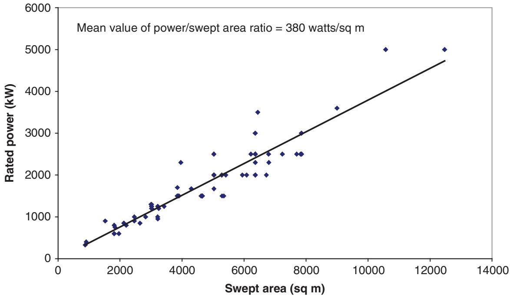

scatter

| Swept area (sq m) | Rated power (kW) |
| ----------------- | ---------------- |
| 1000              | 300              |
| 2000              | 600              |
| 3000              | 1200             |
| 4000              | 1700             |
| 5000              | 2000             |
| 6000              | 2500             |
| 7000              | 2400             |
| 8000              | 3000             |
| 9000              | 3600             |
| 10500             | 5000             |
| 12500             | 5000             |

Figure 6.5 Rated power vs swept area for turbines in production in 2008

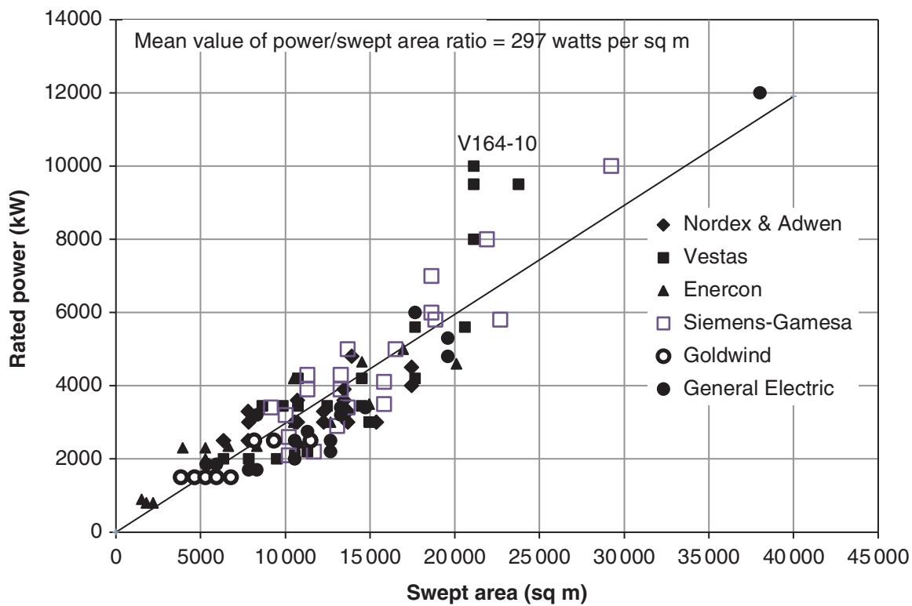

scatter

| Company           | Swept area (sq m) | Rated power (kW) |
| ----------------- | ----------------- | ---------------- |
| Nordex & Adwen    | ~15000            | ~3500            |
| Vestas            | ~20000            | ~5500            |
| Enercon           | ~10000            | ~2500            |
| Siemens-Gamesa    | ~25000            | ~8000            |
| Goldwind          | ~15000            | ~4000            |
| General Electric  | ~38000            | ~12000           |

Figure 6.6 Rated power vs swept area for turbines in or close to production in 2019

power ratings for a given turbine diameter, resecting the availability of turbines to suit a wide range of wind speeds. However, the largest turbines, which are deployed at higher wind speed sites offshore, generally exhibit signircantly higher power to swept area ratios, with the Vestas V164 10 MW machine having the highest ratio of 473 W/sqm.

# 6.4 Rotational speed

The aim of the wind turbine designer is the production of energy at minimum cost, subject to constraints imposed by environmental impact considerations. However, blade designs optimised for a number of different rotational speeds but the same rated power produce substantially the same energy yield, so the choice of rotational speed is based on machine cost rather than energy yield.

One of the key cost drivers is the rotor torque at rated power, as this is the main determinant of the drive train cost. For a given tip radius and machine rating, the rotor torque is inversely proportional to rotational speed, which argues for the adoption of a high rotational speed. However, increasing the rotational speed has adverse effects on the rotor design, which are explored in the following sections.

# 6.4.1 Ideal relationship between rotational speed and solidity

Equation (3.72) in Section 3.8.2 gives the chord distribution of a blade optimised to give maximum power at a particular tip speed ratio in terms of the lift coefrcient, ignoring drag and tip-loss:

$$
\sigma_ {r} \lambda \mu C _ {l} = \frac {8 / 9}{\sqrt {\left(1 - \frac {1}{3}\right) ^ {2} + \lambda^ {2} \mu^ {2} \left[ 1 + \frac {2}{9 \lambda^ {2} \mu^ {2}} \right] ^ {2}}}
$$

where 휆 is the tip speed ratio, $\sigma _ { r }$ is the solidity, and $\mu = r / R$ . Over the outboard half of the blade, which produces the bulk of the power, the local speed ratio, $\lambda \mu .$ , will normally be large enough to enable the denominator to be approximated as $\lambda \mu$ , giving

$$
\sigma_ {r} \lambda \mu C _ {l} = \frac {B c (\mu)}{2 \pi R} \lambda C _ {l} = \frac {8}{9 \lambda \mu} \tag {6.6}
$$

where B is the number of blades. After rearrangement, this gives

$$
c (\mu) \left(\frac {\Omega R}{U _ {\infty}}\right) ^ {2} = \frac {1 6 \pi R}{9 C _ {l} B}. \frac {1}{\mu} \tag {6.7}
$$

Hence it can be seen that, for a family of designs optimised for different rotational speeds at the same wind speed, the blade chord at a particular radius is inversely proportional to the square of the rotational speed, assuming that B and R are rxed and the lift coefrcient is maintained at a constant value by altering the local blade pitch to maintain a constant angle of attack.

Note that Eq. (6.7) does not apply if energy yield is optimised over the full range of operating wind speeds for a rxed-speed pitch-regulated machine. In this case, it has been demonstrated that the blade chord at a particular radius is approximately inversely proportional to rotational speed rather than to the square of it (Jamieson and Brown (1992)).

# 6.4.2 InKuence of rotational speed on blade weight

The effect of rotational speed on blade weight can be explored with reference to the family of blade designs just described. As in Section 6.3.1, it is assumed that the blade design is governed by out-of-plane bending moments in fatigue and that the moment suctuations are proportional to the product of the wind speed suctuation, the rotational speed, and the chord scaling factor, based on Eq. (5.26):

$$
\sigma_ {M} = \int_ {0} ^ {R} \sigma_ {L} r d r = \frac {1}{2} \rho \Omega \frac {d C _ {L}}{d \alpha} \sigma_ {u} \int_ {0} ^ {R} c (r). r ^ {2} d r
$$

By Eq. (6.7) the chord scaling factor is inversely proportional to the square of the rotational speed, so the moment suctuations simply vary inversely as the rotational speed.

If the thickness to chord ratios at each radius are assumed to be unaffected by the chord scaling, the blade section modulus for out-of-plane bending at a given radius is proportional to the product of the blade shell skin thickness, 푤(r), and the square of the local chord. Thus,

$$
Z (r) \propto w (r). (c (r)) ^ {2} \propto w (r) / \Omega^ {4} \tag {6.8}
$$

To maintain the fatigue stress ranges at the same level, we require the blade section modulus, Z(r), to vary as the moment suctuations, which, as shown above, vary inversely as rotational speed. Thus,

$$
Z (r) \propto 1 / \Omega \quad s o \quad w (r) / \Omega^ {4} \propto 1 / \Omega \quad a n d \quad w (r) \propto \Omega^ {3} \tag {6.9}
$$

Blade weight is proportional to the skin thickness times chord and thus varies as rotational speed:

$$
m (r) \propto w (r). c (r) \propto \Omega^ {3} / \Omega^ {2} \propto \Omega
$$

# 6.4.3 High-speed rotors

On the basis of the assumptions of Section 6.4.2 (which will by no means always apply), blade weight increases in proportion to rotational speed. However, as shown in Section 6.4.2, the blade out-of-plane fatigue loads, which may govern the design of the nacelle structure and tower, vary inversely as the rotational speed. It is therefore likely that, as rotational speed is increased, there will be a trade-off between reducing costs of the drive train, nacelle structure, and tower on the one hand and increasing rotor cost on the other, which will determine the optimum value.

As explained in Section 6.4.5, the scope for increasing the tip speeds of onshore machines is severely limited. However, there has been considerable interest in the development of high-speed designs for use offshore, because of the potential drive train cost savings. Jamieson (2009) investigated a substantial increase in tip speed to 120 m/s and proposed a downwind conrguration to avoid the risk of tower strike by the resulting sexible, low solidity blades.

More recently, NREL investigated the benerts of increasing the maximum tip speed of its 126 m diameter 5 MW variable-speed reference wind turbine from 80 m/s to 100 m/s (Dykes et al. [2014]), considering both upwind and downwind designs. They found that a 9% increase in blade weight was required for the upwind 100 m/s tip speed design to satisfy the limitations on tip desection. The increased blade costs largely cancelled out the signircant drive train savings, so the overall reduction in the cost of energy was relatively small at 1.5%. However, in the case of the downwind design, without the same constraints on tip desection, the blade weight reduces by 9%, resulting in a 5.5% reduction in the cost of energy, before allowance for the energy loss due to the reduced swept area associated with the large tip desection.

Task 2.1 of the INNWIND project was devoted to aerodynamic concepts for high-speed, low solidity offshore rotors. This included investigation of the performance of the thicker aerofoils required to maintain structural strength in the face of reduced chords (INNWIND [2015a]) and consideration of the adverse effects of air compressibility at higher tip speeds (INNWIND [2013]).

# 6.4.4 Low induction rotors

Low induction rotors are a subset of the high-speed rotors considered above that are designed to operate at a reduced axial induction factor. Typically, the assumption is made that designing a rotor to operate at the maximum coefrcient of performance, corresponding to an induction factor of $a = 1 / 3$ , will result in the most economic overall design. However, when an increase in tip speed is permissible, there is scope to increase power output at a given wind speed by operating at a lower induction factor and increasing the diameter, without changing the steady state out-of-plane bending moment at the root. It is then found that, although the percentage increase in energy yield is less than the percentage increase in blade cost, it exceeds the percentage increase in the cost of the wind turbine as a whole.

Consider a baseline turbine of radius $R _ { 0 } { \mathrm { : } }$ , operating at an induction factor of 1/3 and a low induction turbine of radius R operating at an induction factor a. If drag and tip-loss are ignored, the coefrcient of performance is given by $C _ { p } = 4 a ( 1 - a ) ^ { 2 } \left[ \mathrm { E q } . \left( 3 . 1 2 \right) \right]$ , and it can be shown that the out-of-plane bending moment at the root is

$$
M _ {0} = \frac {1}{2} \rho V ^ {2} \pi R ^ {3} \frac {8}{9} a (1 - a) \tag {6.10}
$$

which can be written $\begin{array} { r } { M _ { 0 } = \frac { 1 } { 7 } \rho V ^ { 2 } \pi R ^ { 3 } . C _ { M 0 } } \end{array}$ . The variation of these quantities with the induction factor is plotted in Figure 6.7, and it can be shown that $C _ { M 0 }$ reduces more rapidly than $C _ { p }$ as the induction factor is reduced below 1/3, so that increasing the diameter can yield increased power without increasing the root bending moment. The turbine radius that maintains the same root bending moment is also plotted in Figure 6.7 as $R / R _ { 0 }$ , together with the normalised power output, which reaches a maximum at an induction factor of 0.2.

When drag and tip-loss are included, it is found that a maximum increase in power output of 8.7% is obtained at an induction ratio of 0.187 with an increase in radius of 13.6% (INNWIND [2013]). The baseline machine has a tip speed ratio of 8.85, which yields the maximum coefrcient of performance for the chosen lift/drag ratio of 100, so the tip speed ratio of the low induction variant is 10. Given that the steady state out-of-plane bending moments in the extended blade remain the same as a function of normalised radius, $\mu \ ( = r / R )$ , as for the baseline blade, it is assumed that the blade strength will remain adequate if the original chord and section moduli distribution are retained as a function of $\mu .$ . The cost of the blade can then be treated as proportional to its length.

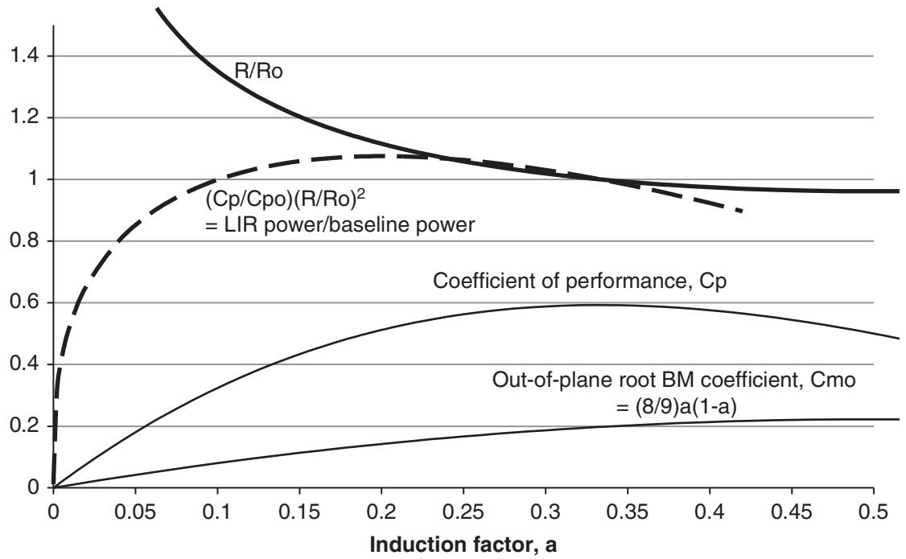

line

| Induction factor, a | R/Ro   | (Cp/Cpo)(R/Ro)² = LIR power/baseline power | Coefficient of performance, Cp | Out-of-plane root BM coefficient, Cmo = (8/9)a(1-a) |
| ------------------- | ------ | ------------------------------------------ | ------------------------------- | ---------------------------------------------------- |
| 0.0                 | 1.5    | 0.4                                        | 0.0                             | 0.0                                                  |
| 0.1                 | 1.3    | 0.9                                        | 0.2                             | 0.1                                                  |
| 0.2                 | 1.1    | 1.0                                        | 0.4                             | 0.15                                                 |
| 0.3                 | 1.0    | 1.0                                        | 0.6                             | 0.2                                                  |
| 0.4                 | 0.95   | 0.95                                       | 0.55                            | 0.22                                                 |
| 0.5                 | 0.95   | 0.9                                        | 0.5                             | 0.23                                                 |

Figure 6.7 Variation of coefrcient of performance, root bending moment coefrcient, turbine radius to maintain constant out-of-plane root bending moment, and low induction rotor power ratio with axial induction factor

The INNWIND cost model (see Section 6.2.4) indicates that the blade cost amounts to about 6% of the total installed cost of a 10 MW offshore turbine, so a 13.6% increase in blade cost would result in a 0.8% increase in total installed cost. Assuming the turbine rating remains 10 MW, the 8.7% increase in power below rated would increase the capacity factor by 4%, so the overall reduction in the cost of energy would be 3.2%.

To achieve the required reduced induction factor, the lift coefrcient, $C _ { l } ,$ , has to be signircantly reduced by increasing the blade twist.

# 6.4.5 Noise constraint on rotational speed

The aerodynamic noise generated by a wind turbine is approximately proportional to the rfth power of the tip speed. It is therefore highly desirable to restrict the rotational speed of onshore turbines, especially when the wind speed – and therefore ambient noise levels - are low. Consequently, manufacturers of turbines to be deployed at normal sites on land generally limit the tip speed of rxed-speed machines to about 65 m/s.

In the case of variable-speed machines, the maximum tip speed is usually signircantly higher –typically in the range of 70–85 m/s, but of course these tip speeds are only reached at higher wind speeds, when ambient noise levels are higher also.

Offshore machines are not subject to the noise constraints on maximum tip speeds that apply on land, so machines designed primarily for offshore siting typically have somewhat higher tip speeds.

# 6.4.6 Visual considerations

There is a consensus that turbines are more disturbing to look at the faster they rotate.

# 6.5 Number of blades

# 6.5.1 Overview

European windmills traditionally had four sails, perhaps because pre-industrial techniques for attaching the sail stocks to the shaft lent themselves to a cruciform arrangement in which the stocks for opposite sails formed a continuous wooden beam. By contrast, the vast majority of horizontal axis wind turbines manufactured today have either two or three blades, although at least one manufacturer used to specialise in one bladed machines. As the latter are now only of theoretical or historical interest, consideration of them will be restricted to Section 6.5.8, and the rest of Section 6.5 will concentrate on two and three bladed machines.

In comparing the relative merits of machines with differing numbers of blades, the following factors need to be considered:

• Performance.   
• Loads.   
• Cost of rotor.   
• Impact on drive train cost.   
• Noise emission,   
• Visual appearance.

Some of these factors are strongly insuenced by rotational speed and rotor solidity, and the ideal relationship between these parameters and the number of blades is considered in the next section. Tip loss and drag both diminish performance and these effects are compared for different numbers of blades in Section 6.5.3. Section 6.5.4 investigates alternative two bladed derivatives of a realistic three bladed variable-speed baseline design and compares their relative energy yields and notional costs. Section 6.5.5 reviews the differences in loading imposed by two and three bladed rotors on the supporting structure, and Section 6.5.6 considers the constraint on rotational speed imposed by noise emission. Visual appearance is considered briesy in Section 6.5.7.

# 6.5.2 Ideal relationship between number of blades, rotational speed, and solidity

In the absence of drag and tip-loss, the relationship between the chord distribution optimised for a particular wind speed, the rotational speed, and the number of blades can be deduced from Eq. (6.6) rearranged as follows:

$$
B c (\mu) \left(\frac {\Omega R}{U _ {\infty}}\right) ^ {2} = \frac {1 6 \pi R}{9 C _ {l}}. \frac {1}{\mu}
$$

Thus, if the number of blades is reduced from three to two, optimised operation at the selected wind speed can be maintained by either increasing the chord by 50% or increasing the rotational speed by 22.5% (assuming that the lift coefrcient is maintained at a constant value by altering the local blade pitch to maintain a constant angle of attack). In either case, the coefrcient of performance would remain at the Betz limit because of the assumed absence of tip-loss and drag.

# 6.5.3 Effect of number of blades on optimum $C _ { P }$ in the presence of tip-loss and drag

The reduction in performance due to tip-loss increases as the number of blades is reduced and cannot be fully compensated by increasing rotational speed because of the increased drag that results. Except at very low tip speeds, the coefrcient of performance is given reasonably accurately by Eq. (6.11),

$$
C _ {P} = \int_ {0} ^ {1} \frac {8 a (1 - a)}{1 + \frac {a ^ {\prime}}{f}} \left(1 - \frac {a}{f} - \frac {\lambda \mu \left(1 + \frac {a ^ {\prime}}{f}\right)}{k}\right) \mu d \mu \tag {6.11}
$$

which can be derived by substituting the chord, $c ( r )$ , obtained from the solidity, $\sigma _ { r } ,$ given by Eq. (3.54c) into the expression for elemental torque in Eq. (3.49) and writing $r / R = \mu$ . k is the lift to drag ratio at the operating point and is assumed constant with radius for simplicity. The optimised induction factor, $^ { a , }$ and the tip-loss factor, $f ,$ are 1/3 and unity, respectively, in the inboard region but vary with radius towards the tip, as described in

Section 3.9.3. The rotational induction factor, $a ^ { \prime }$ , is taken as $a ^ { \prime } = \frac { a \left( 1 - \frac { a } { f } \right) } { \lambda ^ { 2 } \mu ^ { 2 } } \left( \mathrm { E q . } \left[ 3 . 8 9 \right] \right)$ Both a and $a ^ { \prime }$ are azimuthally averaged values.

Equation (6.11) can be used to compute the $C _ { P }$ value at a range of tip speed ratios, enabling the maximum $C _ { P }$ value to be determined together with the tip speed ratio at which it occurs. Plots of these parameters against lift/drag ratio, $k ,$ , are presented for different numbers of blades in Figure 6.8. The benert of increasing the Lift/Drag ratio is clearly shown, as is the diminishing benert of adding each extra blade.

The dotted line in Figure 6.8 shows the variation of maximum $C _ { P }$ and corresponding tip speed ratio with lift/drag ratio for the case of a three bladed rotor, under the assumption that the tip-loss factor is applied to the rates of change of linear and angular momentum rather than to the induction factors in the expressions for these quantities (see Section 3.9.5). This results in the altered expression for $C _ { P }$ given by Eq. (6.12):

$$
C _ {P} = \int_ {0} ^ {1} \frac {8 a \left(1 - \frac {a}{f}\right)}{1 + \frac {a ^ {\prime}}{f}} \left(1 - \frac {a}{f} - \frac {\lambda \mu \left(1 + \frac {a ^ {\prime}}{f}\right)}{k}\right) \mu d \mu \tag {6.12}
$$

It is apparent that this alternative application of the tip-loss factor results in predicted optimum $C _ { P }$ values that are approximately 2% smaller.

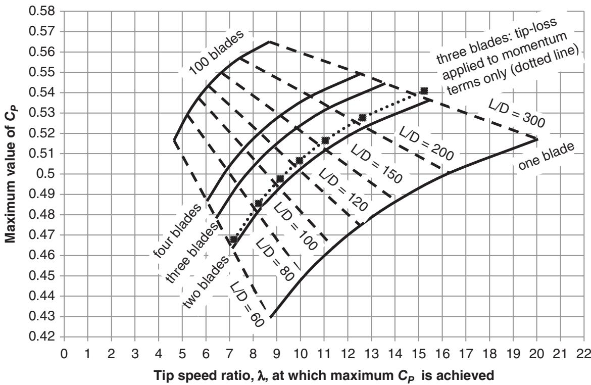

line

| Tip speed ratio, λ | Maximum value of Cp (100 blades) | Maximum value of Cp (one blade) |
| ------------------ | -------------------------------- | ------------------------------- |
| 5                  | 0.52                             | 0.43                            |
| 7                  | 0.56                             | 0.47                            |
| 9                  | 0.57                             | 0.49                            |
| 11                 | 0.55                             | 0.51                            |
| 13                 | 0.54                             | 0.53                            |
| 15                 | 0.54                             | 0.54                            |
| 17                 | 0.53                             | 0.53                            |
| 19                 | 0.52                             | 0.52                            |
| 20                 | 0.52                             | 0.52                            |

Figure 6.8 Variation of maximum $C _ { P }$ and corresponding tip speed ratio with lift/drag ratio k for different numbers of blades

# 6.5.4 Some performance and cost comparisons

Clear-cut cost comparisons between two and three bladed machines are notoriously difrcult because of the impossibility of establishing equivalent designs. Conceptually, the simplest option is to increase the chord by 50% at all radii and leave everything else – including rotational speed – unchanged. In the absence of tip-loss, the induction factors, and hence the annual energy yield, remain the same, but when tip-loss is included, the annual energy yield of a stall-regulated machine drops by about 2.5%. However, retention of the same rotor solidity largely negates one of the main benerts of reducing the number of blades, namely reduction in rotor cost, and so this option will not be pursued further. Instead it is proposed to take a realistic blade design for a three bladed machine and look at the performance and cost implications of using the same blade on a two bladed machine rotating at different speeds.

Performance comparisons are affected both by the power rating in relation to swept area (Section 6.3) and by the aerofoil data used. In this case a 70 m diameter, 1.5 MW, pitch-regulated variable-speed three bladed turbine operating at a tip speed ratio of 8 for wind speeds below 10 m/s and constant tip speed above is adopted as the baseline machine. The maximum rotational speed is thus 80/35 = 2.29 rad/sec or 21.8 rpm. The blade plan-form and thickness distribution are scaled down from those for the SC40 blade given in Figure 5.4a. Empirical three-dimensional aerofoil data for an LM 19.0 blade is used (see Figure 5.9), with maximum lift coefrcient increasing from blade tip to blade root, as this results in more accurate power curve predictions. The data is taken from the Risø publication ‘Prediction of Dynamic Loads and Induced Vibrations in Stall’ by Petersen et al. (1998). The blade twist distribution is set to give maximum energy yield at a site where the annual mean wind speed is 7.5 m/s, resulting in an annual energy yield at 100% availability of 4937 MWh. The performance curve for the baseline turbine is shown in Figure 6.9.

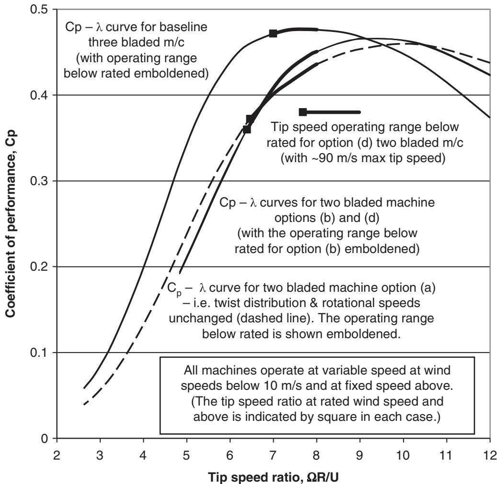

line

| Tip speed ratio, ΩR/U | Coefficient of performance, Cp (Baseline Three Bladed m/c, with operating range below rated emboldened) | Tip speed operating range below rated for Option (d) Two bladed m/c, with ~90 m/s max tip speed | Cp - λ curves for two bladed machine options (b) and (d) (with the operating range below rated for option (b) emboldened) | Cp - λ curve for two bladed machine option (a) - i.e. twist distribution & rotational speeds unchanged (dashed line). The operating range below rated is shown emboldened. |
| --------------------- | ---------------------------------------------------------------------------------- | ---------------------------------------------------------------------------------- | ---------------------------------------------------------------------------------- | ---------------------------------------------------------------------------------- |
| 2                     | 0.05                                                                             | 0.05                                                                             | 0.05                                                                             | 0.05                                                                             |
| 3                     | 0.15                                                                             | 0.15                                                                             | 0.15                                                                             | 0.15                                                                             |
| 4                     | 0.25                                                                             | 0.25                                                                             | 0.25                                                                             | 0.25                                                                             |
| 5                     | 0.35                                                                             | 0.35                                                                             | 0.35                                                                             | 0.35                                                                             |
| 6                     | 0.45                                                                             | 0.45                                                                             | 0.45                                                                             | 0.45                                                                             |
| 7                     | 0.48                                                                             | 0.48                                                                             | 0.48                                                                             | 0.48                                                                             |
| 8                     | 0.47                                                                             | 0.47                                                                             | 0.47                                                                             | 0.47                                                                             |
| 9                     | 0.45                                                                             | 0.45                                                                             | 0.45                                                                             | 0.45                                                                             |
| 10                    | 0.42                                                                             | 0.42                                                                             | 0.42                                                                             | 0.42                                                                             |
| 11                    | 0.38                                                                             | 0.38                                                                             | 0.38                                                                             | 0.38                                                                             |
| 12                    | 0.35                                                                             | 0.35                                                                             | 0.35                                                                             | 0.35                                                                             |

Figure 6.9 Comparison of $C _ { \mathrm { P } } - \lambda$ curves for three bladed baseline machine and two bladed options (a), (b), and (d)

Four options for a corresponding 70 m diameter pitch-regulated, variable-speed, two bladed design at a site with the same annual mean wind speed are examined and the notional energy costs compared with that for the baseline three bladed machine. The costs of the two bladed design options in relation to the baseline three bladed machine are considered with reference to changes in the weights of the components, using the cost shares for the NREL baseline machine given in Table 6.2.

Blade design is assumed to be governed by out-of-plane fatigue bending moments, with the moment suctuations increasing in proportion to rotational speed [see Eq. (5.25) in Section 5.7.5]. Accordingly, the blade weight is assumed to increase linearly with rotational speed, but the total blade weight for the two bladed machine at the baseline rotational speed is, of course, reduced by 1/3. The weights of the hub, pitch system, shaft, and yaw system are also assumed to increase with rotational speed, but no account is taken of the increased loads on these components for a rxed hub, two bladed machine.

It is assumed initially that the design of the nacelle structure is fatigue driven and governed by the suctuating moment on the nacelle due to differential blade out-of-plane root bending moment, which increases with rotational speed. Tower design is also assumed to be governed by fatigue in the rrst instance, so tower weight is similarly taken as proportional to rotational speed. The cyclic thrust loads on the rotor due to turbulence are virtually the same for two and three bladed machines rotating at the same speed if the blade plan-forms are the same, so the tower cost element at the baseline rotational speed is left unchanged.

The costs of the gearbox and brake are taken to be proportional to the rated torque, $P _ { \mathrm { R } } / \varOmega$ , while those of the generator, the variable-speed electronics, and the cables and equipment forming the grid connection are taken as proportional to rated power, $P _ { \mathrm R }$ .

The various components are classired into different categories according to the way in which their costs vary with rotational speed and rated power in Table 6.5. Also tabulated are the two bladed baseline machine component costs as a percentage of the total for the baseline three bladed machine, together with the sum for each category. The total cost of the baseline two bladed machine is 3.8% less than the cost of the baseline three bladed machine due to the reduction in the number of blades.

The following expression is obtained for machine cost as a function of rotational speed and rated power:

$$
C _ {T} = C _ {T B} \left(0. 1 3 4 + 0. 4 0 4 7 \left\{\Omega / \Omega_ {B} \right\} + 0. 1 1 8 \left\{\Omega_ {B} / \Omega \right\} \left(P _ {R} / P _ {R B}\right) + 0. 3 0 5 \left(P _ {R} / P _ {R B}\right)\right) \tag {6.13}
$$

Here, $P _ { R B }$ and $\varOmega _ { B }$ are the baseline values of rated power and maximum nominal rotational speed, 1500 kW and 21.8 rpm, respectively, and $C _ { T B }$ is the cost of the baseline three bladed machine. The four design options can now be examined:

(a) Plan-form, twist, and rotational speed unchanged from baseline: The reduction in the number of blades necessitates an increase in the rated wind speed from 11.4 to 12.4 m/s to maintain the same power rating. At the tip speed ratio of 8, which applies at wind speeds less than 10 m/s, the coefrcient of performance is reduced by 8.4%, but the overall energy yield reduction is less at 6.3%. The corresponding $C _ { \mathsf { P } } - \lambda$ curve is shown over the full range of tip speed ratios by the dashed line on Figure 6.9, with the much more limited operating range below rated shown emboldened, and it is evident that the optimum tip speed ratio has increased from about 7.7 for the baseline three bladed machine to about 10. Clearly the limit on the upper tip speed of 80 m/s imposes a signircant penalty on performance.

Combination of the reduced energy yield with the machine capital cost saving of 3.8% due to the elimination of one blade results in an increased cost of energy of 2.6%.

(b) As option (a), but twist distribution re-optimised: Re-optimisation of the twist distribution reduces the energy yield penalty compared with the baseline three bladed machine from 6.3% to 4.6%. As a result, the increase in the cost of energy is reduced to 0.8%. The corresponding $C _ { \mathrm { P } } - \lambda$ curve is shown over the full range of tip speed ratios in Figure 6.9, with the much more limited operating range below rated shown emboldened. The rated wind speed is increased slightly to 12.5 m/s.

(c) Tip speed ratio schedule scaled in conjunction with twist distribution optimisation to obtain minimum cost of energy based on machine cost function of Eq. (6.13) (with tower and nacelle cost increasing with maximum rotational speed): The tip speed at each wind speed can be scaled up by the same ratio so as to produce maximum energy yield, with simultaneous re-optimisation of the twist distribution. This enables the energy yield penalty compared with the baseline three bladed machine to be reduced to only 1.3%, for a tip speed scaling factor of 1.21. However, application of Eq. (6.13) results in a capital cost increase of 2.5% relative to the baseline machine, resulting in a cost of energy increase – again relative to the baseline machine – of 3.8%.

Minimisation of the cost of energy, on the other hand, leads to a much lower tip speed scaling factor of 1.035 and a rated wind speed of 12.15 m/s. The energy yield penalty and capital cost reduction relative to the baseline machine are now 3.3% and 2.8%, respectively, resulting in an increase in the cost of energy of only 0.5%.

(d) Tip speed ratio schedule scaled in conjunction with twist distribution optimisation to obtain minimum cost of energy based on machine cost function of Eq. (6.13) modi-Sed so that tower and nacelle cost are Sxed: It is apparent that, with the weight of nacelle and tower assumed to increase in proportion to rotational speed, the two bladed variant (c) considered above results in a small increase in the cost of energy relative to the three bladed machine. However, if the weight of the nacelle structure is driven by the size of the enclosure required to accommodate the gearbox, generator, and other equipment, rather than by fatigue loading, it will be constant for machines of rxed rating. If it is also assumed that the tower design is governed by extreme loads rather than fatigue loads, the expression for machine cost as a function of rotational speed and rated power becomes

Table 6.5 Contribution of different components to the cost of a two bladed machine (expressed as percentages of three bladed baseline machine cost) and classired according to the relationship assumed between the component cost and rotational speed/rated torque/rated power 

<table><tr><td colspan="2">Components for which the weight/cost is independent of rated power or rotational speed</td><td colspan="2">Components for which the weight/cost varies as rotational speed, Ω</td><td colspan="2">Components for which the weight/cost varies as rated torque, PR/Ω</td><td colspan="2">Components for which the weight/cost varies as rated power, PR</td></tr><tr><td>Component</td><td>Cost</td><td>Component</td><td>Cost</td><td>Component</td><td>Cost</td><td>Component</td><td>Cost</td></tr><tr><td>Foundation</td><td>3.6%</td><td>Blades</td><td>7.7%</td><td>Gearbox</td><td>11.6%</td><td>Generator</td><td>7.4%</td></tr><tr><td>Controller</td><td>2.7%</td><td>Hub</td><td>3.6%</td><td>Brake system</td><td>0.2%</td><td>Variable-speed electronics</td><td>9.0%</td></tr><tr><td>Assembly</td><td>3.2%</td><td>Pitch system</td><td>4.3%</td><td></td><td></td><td>Grid connection</td><td>14.1%</td></tr><tr><td>Transport</td><td>3.9%</td><td>Low-speed shaft and bearings</td><td>2.5%</td><td></td><td></td><td></td><td></td></tr><tr><td></td><td></td><td>Nacelle</td><td>8.9%</td><td></td><td></td><td></td><td></td></tr><tr><td></td><td></td><td>Yaw system</td><td>1.5%</td><td></td><td></td><td></td><td></td></tr><tr><td></td><td></td><td>Tower</td><td>12.0%</td><td></td><td></td><td></td><td></td></tr><tr><td>Total</td><td>13.4%</td><td>Total</td><td>40.5%</td><td>Total</td><td>11.8%</td><td>Total</td><td>30.5%</td></tr></table>

$$
C _ {T} = C _ {T B} \left(0. 3 4 3 + 0. 1 9 5 7 \left\{\Omega / \Omega_ {B} \right\} + 0. 1 1 8 \left\{\Omega_ {B} / \Omega \right\} \left(P _ {R} / P _ {R B}\right) + 0. 3 0 5 \left(P _ {R} / P _ {R B}\right)\right) \tag {6.14}
$$

The tip speed scaling factor resulting in the minimum cost of energy then increases to 1.12, the rated wind speed reduces to 11.7 m/s, and the cost of energy reduces to 1.1% below that of the baseline machine. As shown in Figure 6.9, the corresponding $C _ { P } - \lambda$ curve over the full range of tip speed ratios is almost identical to that for option (b), but the tip speed ratio operating range differs.

The above results are summarised in Table 6.6. The results shown in Table 6.6 indicate that two bladed, rigid hub machines have the potential to yield marginal cost benerts vis-à-vis three bladed machines, if nacelle and tower design are not impacted by increases in rotational speed. However, the results should be treated with caution, because no account has been taken of increased component costs due to the increased loadings on the hub, low-speed shaft, yaw drive, and nacelle inherent in a rigid hub two bladed turbine. (Loads on rigid hub two bladed machines are compared with those on three bladed machines in more detail in the next section.)

The loadings on the nacelle of a two bladed machine can be reduced signircantly by the introduction of a teeter hinge between the rotor and the low-speed shaft, with consequent potential cost benerts. The hinge eliminates the transfer of out-of-plane aerodynamic moments from the rotor to the low-speed shaft, resulting in large reductions in the operational loadings on the shaft, nacelle, and yaw drive. The dependence of these loads on rotational speed is also largely removed, with the result that the optimum rotational speed for a two bladed machine in energy cost terms is increased, approaching the value giving maximum energy yield.

Although teetering provides scope for signircant cost savings on the shaft, nacelle, and yaw drive (which account for nearly 20% of the baseline machine cost), these savings are offset by the additional costs associated with the teeter hinge and teeter restraint system.

# 6.5.5 Effect of number of blades on loads

Moment loadings on the low-speed shaft and nacelle structure from three bladed and rigid hub two bladed machines were examined in Sections 5.10 and 5.11, and are compared in Table 6.7 for machines of the same diameter and rotational speed. The stochastic loading comparison is based on a turbulence length scale to rotor diameter ratio of 1.84.

It is seen that loadings from a rigid hub two bladed rotor are signircantly larger than from a three bladed rotor. However, in most two bladed machine designs, the rotor is allowed to teeter instead of being rigidly mounted, with the result that aerodynamic moments on the shaft and nacelle structure quoted in Table 6.7 are eliminated and the blade out-of-plane root bending moments reduced. The benerts and drawbacks of teetering the rotor are examined in Section 6.6.

Table 6.6 Comparison of two bladed design variants on a 70 m diameter, 1.5 MW three bladed variable-speed, pitch-regulated baseline machine, using blades of same plan-form and thickness/chord ratio distribution 

<table><tr><td>Two bladed 70 m diameter, 1.5 MW, machine design options</td><td>Maximum nominal speed and tip speed</td><td>Annual energy yield (MWh)</td><td>Reduction in annual energy yield cf. baseline m/c</td><td>Reduction in overall machine cost cf. three bladed baseline</td><td>Increase/ reduction in cost of energy</td></tr><tr><td>a) Same blade and tip speed schedule</td><td>21.8 rpm 80 m/s</td><td>4625</td><td>6.3%</td><td>3.8%</td><td>+2.6%</td></tr><tr><td>b) As above, but with optimisation of blade twist distribution</td><td>21.8 rpm 80 m/s</td><td>4709</td><td>4.6%</td><td>3.8%</td><td>+0.8%</td></tr><tr><td>c) Tip speeds and twist distribution varied to give minimum C of E as per Eq. (6.13)</td><td>22.6 rpm 83 m/s</td><td>4775</td><td>3.3%</td><td>2.8%</td><td>+0.5%</td></tr><tr><td>d) Tip speeds and twist distribution varied to give minimum C of E assuming nacelle and tower costs fixed - i.e. using Eq. (6.14)</td><td>24.5 rpm 90 m/s</td><td>4857</td><td>1.6%</td><td>2.7%</td><td>-1.1%</td></tr></table>

The rotor thrust variations at blade passing frequency due to stochastic loading, which are a dominant factor in tower fatigue design, are very similar for two and three bladed machines rotating at the same speed. However, two bladed machines usually rotate faster than three bladed machines of the same diameter, so the cyclic rotor thrust variations are higher.

# 6.5.6 Noise constraint on rotational speed

As noted in Section 6.5.4, there may be signircant cost benerts to be gained from a two bladed design with increased rotational speeds, because, in addition to the blade saving, the cost of the whole of the drive train is reduced because of the reduced torque. However, as noted in Section 6.4.5, it is normal to restrict the tip speeds of rxed-speed and variable-speed machines to about 65 or 85 m/s respectively, to limit aerodynamic noise emission. At 80 m/s, the tip speed of the baseline machine discussed in Section 6.5.4 is within this limit, but the tip speed of option (d) of 90 m/s would be less likely to be acceptable, except at remote sites or offshore. This subject is considered further in Section 6.9.

Table 6.7 Comparison of loads on shaft and nacelle for three bladed and rigid hub two bladed machines (훹 is blade azimuth) 

<table><tr><td rowspan="2">Location of moment loading</td><td colspan="2">Deterministic loading arising from wind shear and/or yaw misalignment, in terms of blade root out-of-plane bending moment amplitude,  $M_{\text{o}}$ </td><td rowspan="2">Stochastic loading% increase for rigid hub two bladed machine compared with three bladed m/c</td></tr><tr><td>Three bladed machine</td><td>Rigid hub two bladed machine</td></tr><tr><td>Shaft bending moment amplitude</td><td> $1.5 M_{\text{o}}$ </td><td> $2 M_{\text{o}}$ </td><td>22%</td></tr><tr><td>Nacelle nodding moment</td><td> $1.5 M_{\text{o}}$ </td><td> $M_{\text{o}}(1 + \cos 2\psi)$ </td><td>22%</td></tr><tr><td>Nacelle yaw moment</td><td>Zero</td><td> $M_{\text{o}} \sin 2\psi$ </td><td>22%</td></tr></table>

# 6.5.7 Visual appearance

Although the assessment of visual appearance is essentially subjective, there is an emerging consensus that three bladed machines are more restful to look at than two bladed ones. One possible reason for this is that the apparent ‘bulk’ of a three bladed machine changes only slightly over time, whereas a two bladed machine appears to contract down to a one-dimensional line element, when the rotor is vertical, twice per revolution. A secondary factor is that two bladed machines generally rotate faster, which an observer can also rnd more disturbing.

# 6.5.8 Single bladed turbines

Apart from the saving in rotor cost itself, the single bladed turbine concept is an attractive one because of the reduction in drive train cost realisable through increased rotational speed (Section 6.5.2). An obvious disadvantage is the increased noise emission resulting from the faster rotation, but this would not be an issue offshore. Another consideration is the reduced yield due to increased tip-loss. For example, a single bladed version of the 70 m diameter, 1.5 MW pitch-regulated, variable-speed three bladed baseline design considered in Section 6.5.4, with the rotational speed at each wind speed scaled up by $\sqrt { 3 }$ in accordance with Eq. (6.7) and with the twist distribution re-optimised to give maximum energy yield, will produce an annual energy output 5.5% less than the baseline machine.

The single blade must be counterweighted to eliminate torque suctuations and any whirling tendency due to centrifugal loads. Furthermore, as a rigid hub would expose the nacelle to very large nodding and yawing moments in comparison with two or three bladed machines, it is customary to mount the rotor on a teeter hinge, so that the unbalanced aerodynamic out-of-plane moment can be resisted by a centrifugal couple, thereby reducing the hub moment. However, the teeter motion of the blade is signircantly greater than that of a two bladed machine, so it is normal to mount the rotor downwind. Morgan (1994) reports that particular difrculties have been encountered in predicting teeter excursions after grid loss and emergency stops, leading to excessive risk of teeter stop impacts.

# 6.6 Teetering

# 6.6.1 Load relief beneJts

Two bladed rotors are often mounted on a teeter hinge – with hinge axis perpendicular to the shaft axis but not necessarily perpendicular to the longitudinal axis of the blades – to prevent differential blade root out-of-plane bending moments arising during operation. Instead, differential aerodynamic loads on the two blades result in rotor angular acceleration about the teeter axis, with large teeter excursions being prevented by the restoring moment generated by centrifugal forces, as described in Section 5.8.8. However, when the machine is shut down, the centrifugal restoring moment is absent, so differential blade loading will cause the rotor to teeter until it reaches the teeter end stops, which need to be suitably buffered. Consequently, the teeter hinge is unlikely to provide any amelioration of extreme blade root out-of-plane moments when the machine is shut down.

The load relief afforded by the teeter hinge benerts the main structural elements in the load path to the ground in varying degrees, as outlined below:

1) Blade: The main benert is the elimination of the cyclic variations in out-of-plane bending moment due to yaw (Figure 5.10), shaft tilt, wind shear (Figure 5.11), and tower shadow (Figure 5.14). By contrast, there is only a small reduction in blade root out-of-plane bending moment due to stochastic loadings – see the example in Section 5.8.8, where an 11% reduction is quoted. Thus, teetering results in a large overall reduction in out-of-plane fatigue loading, although the signircance of this will be tempered by the insuence of the unaltered edgewise gravity moment.

2) Low-speed shaft: Low-speed shaft design is governed by fatigue loading, which is normally dominated by the cyclic gravity moment due to the cantilevered rotor mass. On a rigid hub machine, the shaft moment damage equivalent load or DEL (derned in Section 5.12.6) due to deterministic and stochastic rotor out-of-plane loadings combined can be of similar magnitude, so the insertion of a teeter hinge can produce a substantial reduction in overall shaft moment DEL. It should be noted, however, that the cyclic shaft moment due to wind shear relieves that due to gravity on a rigid hub machine, so teetering is not benercial in respect of this load component.

A rough estimate of the overall shaft moment DEL on a rigid hub machine, excluding yaw error and tower shadow effects, can be obtained by taking the square root of the sum of the squares of the shaft moment DEL due to stochastic loads and that due to the combined cyclic loads due to gravity, wind shear, and shaft tilt.

3) Nacelle structure: The provision of a teeter hinge should eliminate nodding and yawing moments on the nacelle completely during operation, leaving only rotor torque, thrust, and in-plane loadings. This will benert the fatigue design of the nacelle structure considerably, but not the extreme load design, for the reasons already explained.   
4) Yaw bearing and yaw drive: Rigid hub machines experience severe yaw moments due to both deterministic and stochastic loads, which were underestimated on many early designs. The introduction of a teeter hinge dramatically reduces yaw moments during operation by eliminating rotor out-of-plane moments on the hub, but yaw moments due to in-plane loads on the rotor still remain.

The relative magnitude of the yaw moments due to in-plane as opposed to out-of-plane loads on a rigid hub rotor can be appreciated by comparing the effect of wind speed suctuation, u, on the in-plane and out-of-plane loads on a blade element. Assuming that the blade is not stalled and that 휙 is small, the in-plane load per unit length is, from Eq. (5.131a), given approximately by

$$
- F _ {Y} = \left(\frac {1}{2} \rho \Omega \frac {d C _ {l}}{d \alpha}\right) c (r). r. u \left[ \frac {C _ {l}}{d C _ {l} / d \alpha} + \sin \phi \right] \tag {6.15}
$$

whereas the out-of-plane load per unit length is, from Eq. (5.25), approximately

$$
F _ {X} = \left(\frac {1}{2} \rho \Omega \frac {d C _ {l}}{d \alpha}\right) c (r). r. u \tag {6.16}
$$

Derning the distance between the hub centre and the tower centreline as $e ,$ it is seen that the yaw moment due to the in-plane rotor load per unit length at radius r is $\frac { e } { r } \left[ \frac { C _ { l } } { d C _ { l } / d \alpha } + \sin \Phi \right]$ times the maximum yaw moment due to out-of-plane load. As e is typically about 1/10 of the tip radius, it is seen that the yaw moments due to in-plane loads are at least an order of magnitude smaller than those due to out-of-plane moments, so that the introduction of the teeter hinge results in a very signircant reduction.

5) Tower: The fatigue loadings due to the $M _ { \mathrm { Y } }$ moment and $M _ { Z }$ torque will clearly be signircantly reduced at the top of the tower if the rotor is teetered, but the effect will be negligible towards the base where thrust loads dominate the moments.

# 6.6.2 Limitation of large excursions

Some limitation on teeter excursions has to be provided, if only to prevent collision between the blade and the tower. If the teeter hinge is located close to the axis of the blades, with the low-speed shaft passing through an aperture in the wall of the hub shell (see Figure 6.10), then the maximum teeter excursion is governed by the size of the aperture.

The teeter response to deterministic and stochastic loads is considered in Section 5.8.8. Although it is evident that a permitted teeter angle range of the order of $\pm 5 ^ { \circ }$ will accommodate the vast majority of teeter excursions during normal operation, it is usually impracticable to accommodate the largest that can occur. Hence, to minimise the occurrence of metal-to-metal impacts on the teeter end stops, buffers incorporating spring and/or damping elements normally have to be rtted. These also perform an important role in limiting the much larger teeter excursions that would otherwise arise during start-up and shut-down, when the centrifugal restoring moment is reduced.

# 6.6.3 Pitch-teeter coupling

As described in Section 5.8.8, the magnitude of teeter excursions can be reduced by coupling blade pitch to teeter angle to generate an aerodynamic restoring moment proportional to the teeter angle. This can be done simply by setting the teeter hinge at an angle, known as the Delta 3 angle, perpendicular to the rotor axis. Alternatively, on pitch-controlled machines, pitch-teeter coupling can be introduced by actuating the blade pitch by the fore–aft motion of a rod passing through a hollow low-speed shaft. See Figure 6.10.

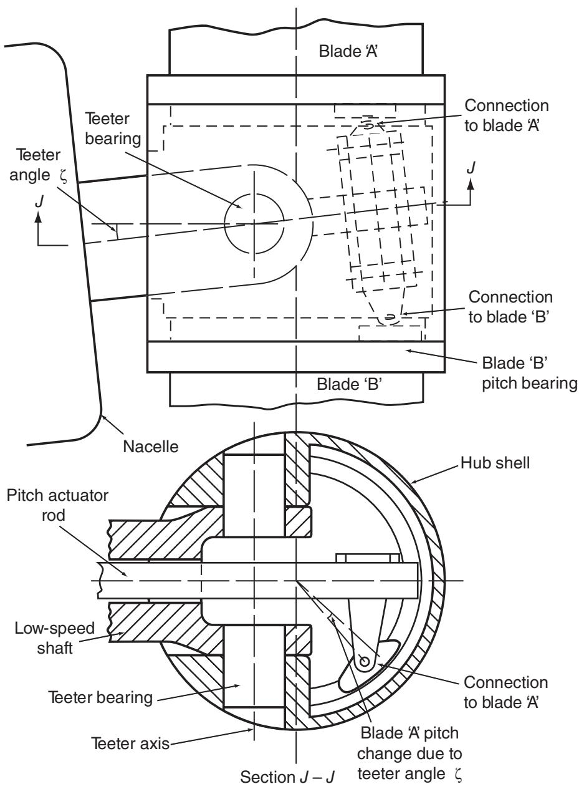

text_image

Blade 'A'
Teeter bearing
Teeter angle ζ
J
Nacelle
Pitch actuator rod
Low-speed shaft
Teeter bearing
Teeter axis
Section J - J
Connection to blade 'A'
Connection to blade 'B'
Blade 'B' pitch bearing
Hub shell
Connection to blade 'A'
Blade 'A' pitch change due to teeter angle ζ

Figure 6.10 Pitch-teeter coupling

# 6.6.4 Teeter stability on stall-regulated machines

At rrst sight, it might be thought that the teeter motion of a stalled rotor would be unstable because of negative damping resulting from the negative slope of the $\mathrm { C } _ { 1 } - \alpha$ curve post-stall. However, two-dimensional aerodynamic theory is a poor predictor of post-stall behaviour, and it has proved possible to design teetered rotors that are stable in practice, such as the Gamma 60 (Falchetta et al. [1996]) and Nordic 1000 (Engstrom et al. [1997]). The concept is explored in detail in investigations by Armstrong and Hancock (1991) and Rawlinson-Smith (1994).

# 6.7 Power control

# 6.7.1 Passive stall control

The simplest form of power control is passive stall control, which makes use of the post-stall reduction in lift coefrcient and associated increase in drag coefrcient to place a ceiling on output power as wind speed increases, without the need for any changes in blade geometry. The rxed blade pitch is chosen so that the turbine reaches its maximum or rated power at the desired wind speed.

Stall-regulated machines suffer from the disadvantage of uncertainties in aerodynamic behaviour post-stall that can result in inaccurate prediction of power levels and blade loadings at rated wind speed and above. These aspects are considered in greater detail in Sections 3.13.3 and 3.15. See also Section 8.2.2.

# 6.7.2 Active pitch control

Active pitch control achieves power limitation above rated wind speed by rotating all or part of each blade about its axis in the direction that reduces the angle of attack and hence the lift coefrcient – a process known as blade feathering. The main benerts of active pitch control are increased energy capture, the aerodynamic braking facility it provides, and the reduced extreme loads on the turbine when shut down. See also Sections 3.14 and 8.2.1.

The pitch change system has to act rapidly – i.e. to give pitch change rates of $5 ^ { \circ }$ per second or better –to limit power excursions due to gusts enveloping the whole rotor to an acceptable value. However, it is not normally found practicable to smooth the cyclic power suctuations at blade passing frequency due to blades successively slicing through a localised gust (Section 5.7.5), with the result that large power swings of up to about 100% can sometimes occur in the case of rxed-speed machines.

The extra energy obtainable with pitch control is not all that large. A pitch-regulated machine with the same power rating as a stall-regulated machine, utilising the same blades and rotating at the same speed, will operate at a larger pitch angle below rated wind speed than the stall-regulated machine to reduce the angle of attack and hence increase the power output at wind speeds approaching rated. For example, if the 1500 kW, 70 m diameter, three bladed variable-speed baseline machine described in Section 6.5.4 were operated at a rxed speed of 17.1 rpm (corresponding to a tip speed of 62.8 m/s), a pitch-regulated version would produce about 2.7% more energy than a stall-regulated version for a 7.5 m/s annual mean wind speed, assuming optimisation of the blade twist distribution in each case. The power curves of the two rxed-speed machines are compared in Figure 6.11. Also shown is the power curve for the variable-speed pitch-regulated machine described in Section 6.5.4. This would produce 5% more energy than the rxed-speed, pitch-regulated machine. Note that the knees in the power curves of the pitch-regulated machines at rated speed will be more rounded in practice because the pitch control will not keep pace with the higher frequency components of turbulence.

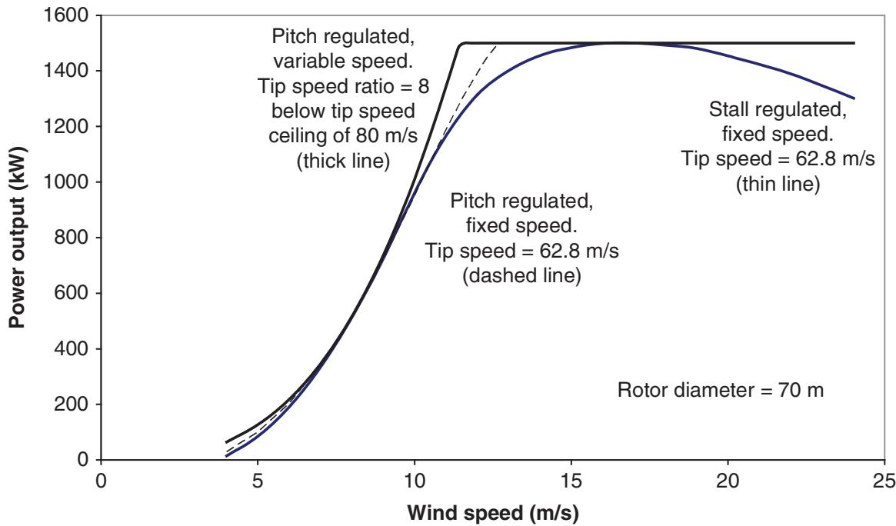

line

| Wind speed (m/s) | Power output (kW) |
| ---------------- | ----------------- |
| 4                | ~50               |
| 5                | ~150              |
| 10               | ~900              |
| 15               | ~1500             |
| 20               | ~1450             |
| 25               | ~1300             |

Figure 6.11 Comparison of power curves for (i) stall-regulated, rxed-speed; (ii) pitch-regulated, rxed-speed; and (iii) pitch-regulated, variable-speed 1.5 MW rated machines

Figure 6.12 shows a family of power curves for a range of positive pitch angles for the 1500 kW, 70 m diameter pitch-controlled machine rotating at 17.1 rpm. The intersections of these curves with the 1500 kW ordinate derne the relationship between steady wind speed and pitch angle required for power control (Figure 6.13). It is readily apparent from the power curve gradients at the intersection points that rapid changes of wind speed will result in large power swings when the mean wind speed is high.

The range of blade pitch angles required for power control is typically from 0∘ (often referred to as Sne pitch), at which the tip chord is in the plane of rotation or very close to it, and about 35∘ . However, for effective aerodynamic braking, the blades have to be pitched to 90∘ or full feather, when the tip chord is parallel to the rotor shaft with the leading edge into the wind.

A variety of pitch actuation systems have been adopted (see also Section 8.5). They are divided between those in which each blade has its own actuator and those in which a single actuator pitches all the blades. The former arrangement has the advantage that it provides two or three independent aerodynamic braking systems to control overspeed, and the disadvantage that it requires very precise control of pitch on each blade to avoid unacceptable pitch angle differences during normal operation. An advantage of the latter arrangement is that the pitch actuator – e.g. a hydraulic cylinder – can be located in the nacelle, producing fore–aft motion of the pitch linkages in the hub by means of a rod passing down the middle of a hollow low-speed shaft (see Figure 6.14). Alternatively, the axial position of the rod can be controlled by means of a ball-screw and ball-nut arrangement, in which the ball-nut is driven by a servomotor. Normally the ball-nut is driven at the same speed as the rotor, but when a change of pitch is required, the ball-nut rotational speed is altered temporarily. This system is arranged to be fail-safe, so that should the servomotor or its control system fail, the servomotor is braked automatically, and the ball-nut drives the blade pitch to feather.

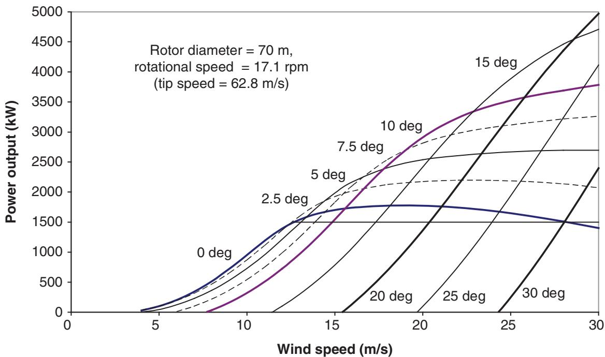

line

| Wind speed (m/s) | 0 deg | 2.5 deg | 5 deg | 7.5 deg | 10 deg | 15 deg | 20 deg | 25 deg | 30 deg |
| ---------------- | ----- | ------- | ----- | ------- | ------ | ------ | ------ | ------ | ------ |
| 0                | 0     | 0       | 0     | 0       | 0      | 0      | 0      | 0      | 0      |
| 5                | ~100  | ~200    | ~400  | ~600    | ~800   | ~1000  | ~1200  | ~1400  | ~1600  |
| 10               | ~500  | ~1000   | ~1500 | ~2000   | ~2500  | ~3000  | ~3500  | ~4000  | ~4500  |
| 15               | ~1000 | ~1500   | ~2000 | ~2500   | ~3000  | ~3500  | ~4000  | ~4500  | ~5000  |
| 20               | ~1500 | ~1750   | ~2250 | ~3000   | ~3500  | ~4000  | ~4500  | ~5000  | ~5500  |
| 25               | ~1750 | ~1750   | ~2500 | ~3250   | ~3750  | ~4250  | ~4750  | ~5250  | ~5750  |
| 30               | ~1750 | ~1750   | ~2750 | ~3500   | ~4250  | ~4750  | ~5250  | ~5750  | ~6250  |

Figure 6.12 Power curves for different positive pitch angles: 70 m diameter three bladed rotor rotating at 17.1 rpm

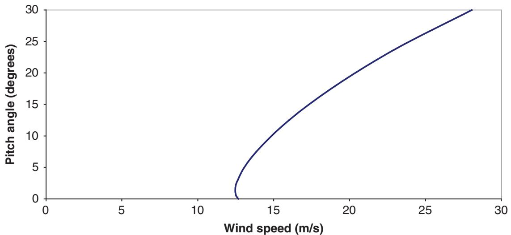

line

| Wind speed (m/s) | Pitch angle (degrees) |
| ---------------- | --------------------- |
| 12               | 0                     |
| 15               | 10                    |
| 20               | 20                    |
| 25               | 25                    |
| 28               | 30                    |

Figure 6.13 Schedule of pitch angles vs wind speed for limiting the power output of the machine featured in Figure 6.12 to 1.5 MW

Where hydraulic cylinders are used to pitch blades individually, they are mounted within the hub, and each piston rod is usually connected directly to an attachment on the blade bearing (see Figure 6.15). The attachment point follows a circular path as the blade pitches, so the cylinder has to be allowed to pivot. The alternative solution of employing an electric motor to drive a pinion engaging with teeth on the inside of the blade bearing consequently appears rather neater (see Figure 6.16). Both systems require a hollow shaft to accommodate either hydraulic hoses or power cables for pitch actuation together with signal cables for pitch angle sensing. In addition, appropriate slip rings are required at the rear end of the shaft.

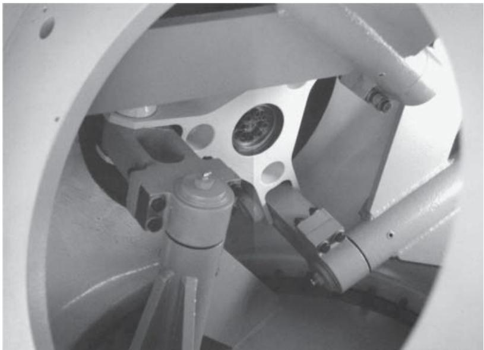

natural_image

Close-up of a mechanical assembly with visible gears and shafts (no text or symbols)

Figure 6.14 Pitch linkage system used in conjunction with a single hydraulic actuator located in the nacelle. (The central triangular ‘spider’ is connected to the actuator by a rod passing through the hollow low-speed shaft. Links from the spider drive the blade pitch via braced arms cantilevering into the hub from each blade. Each arm is parallel to its blade axis but eccentric to it.)

Methods of providing back-up power supplies to ensure blade feathering in the event of grid loss are considered in Section 8.5.

Although full-span pitch control is the option favoured by the overwhelming majority of manufacturers, power control can still be fully effective even if only the outer 15% of the blade is pitched. The principal benerts are that the duty of the pitch actuators is signircantly reduced and that the inboard portion of the blade remains in stall, signircantly reducing the blade load suctuations. However, there are several disadvantages as follows:

• The introduction of extra weight near the tip.   
• The difrculty of physically accommodating the actuator within the blade prorle.   
• The high bending moments to be carried by the tip blade shaft.   
• The need to design the equipment for the high centrifugal loadings found at large radii.   
• The difrculty of access for maintenance.

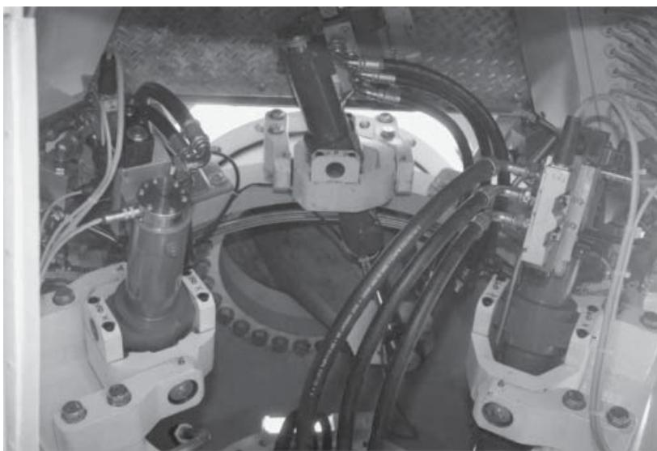

natural_image

Interior view of a mechanical assembly with visible hoses, springs, and components (no text or symbols)

Figure 6.15 Blade pitching system using separate hydraulic actuators for each blade. (Each actuator cylinder is supported on a gimbal-type mounting bolted to the hub, and its piston applies a pitching torque to the blade via a cantilevered conical tube eccentric to the blade axis. The blade is attached to the outer ring of the pitch bearings.)

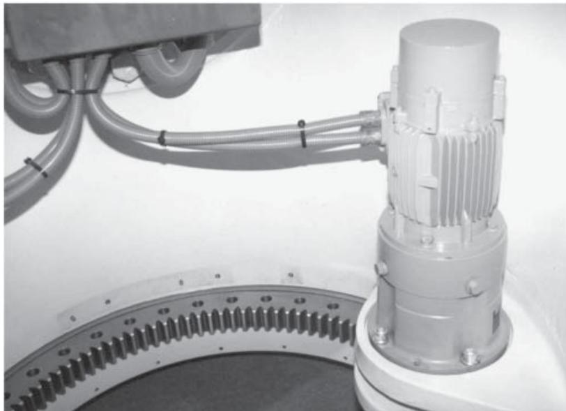

natural_image

Close-up of a mechanical assembly with a metallic motor and coiled tubing (no visible text or symbols)

Figure 6.16 Blade pitching system using a separate electric motor for each blade. (A pinion, driven by the motor via a planetary gearbox, engages with gear teeth on the inside of the inner ring of the pitch bearing, to which the blade is bolted. The blade is not attached to the bearing in this photograph, so the rxing holes are visible.)

It should be apparent from the above brief survey of pitch actuation systems that the design of the hardware required for pitch regulation is a signircant task. Moreover, as regards the controller, pitch regulation introduces the need for fast response closed-loop control, which is not required for the supervisory functions on a stall-regulated machine. Thus, the benerts of pitch control have to be weighed carefully against all the additional costs involved, including the cost of maintenance.

Another factor that needs to be considered is fatigue loading. This increases signircantly on full-span pitch-regulated machines, because the rate of change of lift coefrcient with angle of attack remains at about 2π (see Section A3.7 in Appendix A3) instead of reducing to zero as the blade goes into stall, with the result that rapid changes in wind speed above rated will cause bigger thrust load changes.

Pitch system controller design is considered in detail in Chapter 8.

# 6.7.3 Passive pitch control

An attractive alternative to active control of blade pitch to limit power is to design the blade and/or its hub mounting to twist under the action of loads on the blades, to achieve the desired pitch changes at higher wind speeds. Unfortunately, although the principle is easy to state, it is difrcult to achieve it in practice, because the required variation in blade twist with wind speed generally does not match the corresponding variation of blade twist with blade load. However, passive blade pitching can play a useful role in load alleviation. One means of achieving limited passive blade pitching for this purpose is by orientating the rbres of the composite blade shell at angle to the blade axis, resulting in ‘bend-twist coupling’, as described in Section 7.1.20.

Corbet & Morgan (1991) give a survey of how different types of blade loads might be utilised for passive pitch control purposes. Harnessing the centrifugal load is obviously promising in the case of variable-speed machines, and this has been demonstrated using a screw cylinder and pre-loaded spring to passively control each tip blade, within the Dutch FLEXHAT programme. When the centrifugal load on the tip exceeds the pre-load, the tip blade is driven outwards against the spring and pitches (see Figure 6.17 for illustration of the concept).

Joose & Kraan (1997) have proposed replacing this mechanism by a maintenance-free ‘Tentortube’, which would twist under tension loading. This tube would be carbon-rbre reinforced with all of the rbres set at an angle to the axis, so that centrifugal loading induced twist. It would be placed inside a hollow steel tip shaft, which would carry the aerodynamic loading on the tip blade.

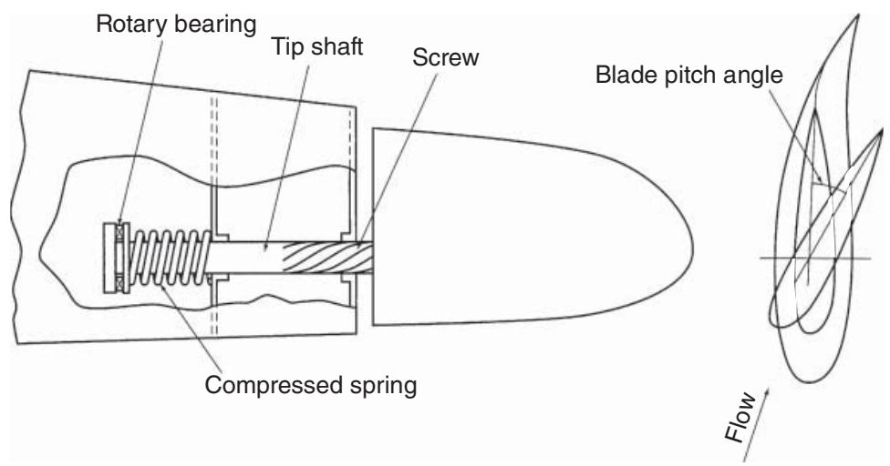

text_image

Rotary bearing
Tip shaft
Screw
Compressed spring
Blade pitch angle
Flow

Figure 6.17 Passive control of tip blade, using screw on tip shaft and spring

# 6.7.4 Active stall control

Active stall control achieves power limitation above rated wind speed by pitching the blades initially into stall – i.e. in the opposite direction to that employed for active pitch control – and is thus sometimes known as negative pitch control. At higher wind speeds, however, it is usually necessary to pitch the blades back towards feather to maintain power output at rated.

A signircant advantage of active stall control is that the blade remains essentially stalled above the rated wind speed, so that gust slicing (see Section 5.7.5) results in much smaller cyclic suctuations in blade loads and power output. It is found that only small changes of pitch angle are required to maintain the power output at rated, so pitch rates do not need to be as large as for positive pitch control. Moreover, full aerodynamic braking requires pitch angles of only about –20∘ , so the travel of the pitch mechanism is very much reduced compared with positive pitch control.

Figure 6.18 shows a schedule of pitch angle against wind speed for active stall control. The active stall control schedule is derived from the intersection of the family of power curves for different negative pitch angles for the 70 m diameter machine considered above with the 1500 kW ordinate in Figure 6.19. Note that the rotational speed has been increased by 10% so that the machine operates further away from stall below rated wind speed – otherwise the range of negative pitch angles utilised would be very small.

The principal disadvantage of active stall control is the difrculty in predicting aerodynamic behaviour accurately in stalled sow conditions. Active stall control is considered further in Section 8.2.1.

# 6.7.5 Yaw control

As most horizontal axis wind turbines employ a yaw drive mechanism to keep the turbine headed into the wind, the use of the same mechanism to yaw the turbine out of wind to limit power output is obviously an attractive one. However, there are two factors that militate against the rapid response of such a system to limit power – rrstly, the large moment of inertia of the nacelle and rotor about the yaw axis, and secondly, the cosine relationship between the component of wind speed perpendicular to the rotor disc and the yaw angle. The latter factor means that, at small initial yaw angles, yaw changes of, say, $1 0 ^ { \circ }$ only bring about reductions in power of a few percent, whereas blade pitch changes of this magnitude can easily halve the power output. Thus, active yaw control is only practicable for variable-speed machines where the extra energy of a wind gust can be stored as rotor kinetic energy until the yaw drive has made the necessary yaw correction. This design philosophy has been exploited successfully in Italy on the 60 m diameter Gamma 60 prototype, which had an impressive maximum yaw rate of $8 ^ { \circ }$ per second (Coiante et al. [1989]).

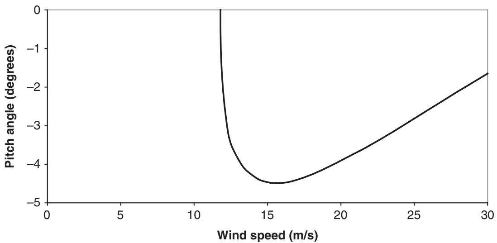

line

| Wind speed (m/s) | Pitch angle (degrees) |
| ---------------- | --------------------- |
| 12               | 0                     |
| 15               | -4.5                  |
| 30               | -1.5                  |

Figure 6.18 Schedule of pitch angles required to limit 70 m diameter turbine output to 1.5 MW at different wind speeds using active stall control

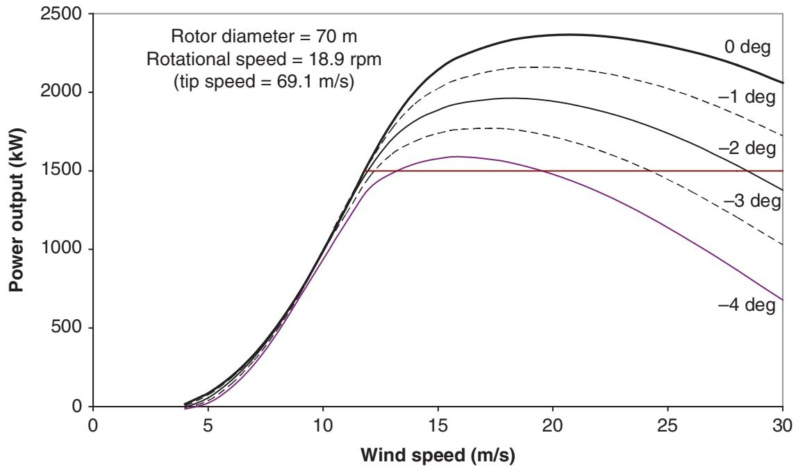

line

| Wind speed (m/s) | 0 deg | -1 deg | -2 deg | -3 deg | -4 deg |
| ---------------- | ----- | ------ | ------ | ------ | ------ |
| 0                | 0     | 0      | 0      | 0      | 0      |
| 5                | ~100  | ~100   | ~100   | ~100   | ~100   |
| 10               | ~1500 | ~1500  | ~1500  | ~1500  | ~1500  |
| 15               | ~2200 | ~2000  | ~1800  | ~1700  | ~1550  |
| 20               | ~2300 | ~2100  | ~1900  | ~1600  | ~1450  |
| 25               | ~2200 | ~1900  | ~1700  | ~1400  | ~1100  |
| 30               | ~2100 | ~1700  | ~1500  | ~1100  | ~650   |

Figure 6.19 Power curves for different negative pitch angles: 70 m diameter three bladed rotor rotating at 18.9 rpm

# 6.8 Braking systems

# 6.8.1 Independent braking systems: requirements of standards

The Germanischer Lloyd (GL) rules require that a wind turbine shall have two independent braking systems. However, IEC 61400-1 does not explicitly require the provision of two braking systems, but it does require the protection system to remain effective even after the failure of any non-safe-life protection system component.

IEC 61400-1 and the GL rules require that at least one of the braking systems should act on the rotor or low-speed shaft.

Normal practice is to provide both aerodynamic and mechanical braking. However, if independent aerodynamic braking systems are provided on each blade, and each has the capacity to decelerate the rotor after the worst-case grid loss, then the mechanical brake will not normally be designed to do this as well. The function of the mechanical brake in this case is solely to bring the rotor to rest – i.e. to park it – as aerodynamic braking is unable do this.

# 6.8.2 Aerodynamic brake options

Active pitch control: Blade pitching to feather (i.e. to align the blade chord with the wind direction) provides a highly effective means of aerodynamic braking. Blade pitch rates of 10∘ per second are generally found adequate, and this is of the same order as the pitch rate required for power control. The utilisation of the blade pitch system for start-up and power control means that it is regularly exercised with the result that the existence of a dormant fault is highly unlikely.

In machines relying solely on blade pitching for emergency braking, independent actuation of each blade is required, together with fail-safe operation should power or hydraulic supplies passing through a hollow low-speed shaft from the nacelle be interrupted. In the case of hydraulic actuators, oil at pressure is commonly stored in accumulators in the hub for this purpose.

Pitching blade tips: Blade tips that pitch to feather have become the standard form of aerodynamic braking for stall-regulated turbines. Typically, the tip blade is mounted on a tip shaft, as illustrated in Figure 6.17, and held in against centrifugal force during normal operation by a hydraulic cylinder. On release of the hydraulic pressure (which is triggered by the control system or directly by an overspeed sensor), the tip blade sies outwards under the action of centrifugal force, pitching to feather simultaneously on the shaft screw. The length of the tip blade is commonly some 15% of the tip radius.

The ability of the control system to trigger blade tip activation is of crucial importance. On a number of early machine designs, the blade tips were centrifugally activated only, so there could be long periods without overspeed events when they did not operate. As a result, there was a risk of seizure when operation was eventually required. With the now commonplace arrangement enabling the control system to activate the tip as well, the system can be routinely tested automatically. The penalty is that the low-speed shaft needs to be hollow to accommodate the feed to the hydraulic cylinder.

Spoilers: Spoilers are hinged saps that conform to the aerofoil prorle when retracted and stick out at right angles to it when deployed. However, although such devices have been used in the past, they have to be of considerable length to decelerate the rotor adequately (Jamieson and Agius 1990). Moreover, unless the design allows for their operation to be regularly tested, there is a risk that they will fail to deploy when actually needed.

Other devices: Various other devices have been suggested, such as

• Ailerons.   
• The sliding leading edge device or SLEDGE, in which a length of leading edge at the tip slides radially outwards.   
• The sying leading edge device or FLEDGE, in which the whole leading edge together with an adjacent section of the camber face is pitched towards feather.

Jamieson and Agius (1990) and Armstrong and Hancock (1991) give useful surveys of these and other aerodynamic braking devices and note that the SLEDGE device, which utilises only 2% or 3% of the blade area, is highly effective aerodynamically. Derrick (1992) examines the capabilities of the SLEDGE and FLEDGE devices for both braking and power control in more detail. Despite their promise, these devices have not yet found commercial application.

# 6.8.3 Mechanical brake options

As noted in Section 6.8.1, the duty of the mechanical brake need only be that of a parking brake on machines where the aerodynamic brakes can be actuated independently. However, on pitch-regulated machines where blade position is controlled by a single actuator, full independent braking capability has to be provided by the mechanical brake. It is worth noting that several manufacturers of stall-regulated machines rtted with independent tip brakes ensure that the mechanical brake can stop the rotor unassisted. This may be to satisfy requirements in certain countries that two independent braking systems of a different type are provided.

A wind turbine brake typically consists of a steel brake disc acted on by one or more brake callipers. The disc can be mounted on either the rotor shaft (known as the low-speed shaft) or on the shaft between the gearbox and the generator (known as the high-speed shaft). The latter option is much the more common because the braking torque is reduced in inverse proportion to the shaft speeds, but it carries with it the signircant disadvantage that the braking torques are experienced by the gear train. This can increase the gearbox torque rating required by as much as ∼50%, depending on the frequency of brake application – see Section 7.4.5. Another consideration is that the material quality of brake discs mounted on the high-speed shaft is more critical, because of the magnitude of the centrifugal stresses developed.

The brake callipers are almost always arranged so that the brakes are spring applied and hydraulically retracted – i.e. fail-safe.

Aerodynamic braking is much more benign than mechanical braking as far as loading of the blade structure and drive train is concerned, so it is always used in preference for normal shut-downs.

# 6.8.4 Parking versus idling

Although a mechanical parking brake is essential for bringing the rotor to rest for maintenance purposes, many manufacturers allow their machines to idle in low winds, and some do so during high wind shut-downs. The idling strategy has two clear advantages – it reduces the frequency of imposition of braking loads on the gear train and gives the impression to members of the public that the turbine is operating even when it is not generating. On the other hand, gearbox and bearing lubrication must be maintained throughout.

# 6.9 Fixed-speed, two-speed, variable-slip, and variable-speed operation

Wind turbine rotors work at their maximum power coefrcient (Cp) at only one particular tip speed ratio (see Figure 3.15), and turbines that use a single-speed induction generator rotate at an almost rxed speed. Hence, below rated wind speed, rxed-speed turbines operate at less than their maximum potential output power except at the wind speed corresponding to this tip speed ratio. Continually varying the rotational speed so that the turbine runs at optimum tip speed ratio over a range of wind speeds below rated increases energy capture.

A slightly reduced improvement can be obtained by running the turbine at two rxed speeds so that the tip speed ratio is closer to the optimum more often than with a single rxed speed. The aerodynamic noise generated by a wind turbine blade is proportional to the rfth or sixth power of the tip speed. Both variable-speed and two-speed operation reduce the rotational speed of the rotor in low winds, thus limiting aerodynamic noise when it might otherwise be objectionable because of low levels of background noise.

Continuous variable-speed operation leads to a reduction in turbine mechanical loads as the control system can be arranged to allow small variations in the rotor speed in response to wind gusts and cyclic torque variations (e.g. those caused by tower shadow). Large wind farms are required by the electricity Transmission System Operators to comply within the Grid Code regulations (see Section 11.5) that specify the electrical performance required to ensure that wind farms support the electrical power system. These requirements are difrcult to meet with rxed- or two-speed induction generators.

For all these reasons, all modern large wind turbines operate at variable speed, using power electronic converters to connect the varying frequency output of the generator to the constant frequency of the power network (Hau 2013; EWEA 2009; Blaabjerg and Ma 2013). In the past, rxed-speed and two-speed turbines of ratings up to 1.5 MW were common commercially, but these types of generator are now conrned to smaller turbines.

# 6.9.1 Fixed-speed operation

The design of wind turbines that was common up to around the mid-1990s (known as the Danish concept) had a stall-regulated rotor, a three stage gearbox, and a simple squirrel cage induction machine operating at 750, 1000, or 1500 rpm, on a 50 Hz electricity system. The generator had a slip at full output of up to 2–3%, and this provided damping in the drive train. Braking against loss of connection to the grid was either by mechanical brakes on both the high- and low-speed shafts or by a single shaft brake and rotating blade tips.

# 6.9.2 Two-speed operation

Two-speed operation can be implemented using two simple induction generators that are designed for different rotational speeds. In low wind speeds, a lower power and slower electrical generator is operated over a range of low wind speeds. When the wind speed rises and the power limit of this generator is reached, the smaller generator is disconnected and a full power, higher-speed generator is connected. Similarly, when the wind speed drops, the full power generator is disconnected and the smaller generator used. A hysteresis control system, measuring power, is used to restrict the number of switching operations (Figure 6.20).

Either generators with different numbers of magnetic poles (giving different speeds of rotation) are connected to a single output shaft of the gearbox or generators with the same number of poles are connected to separate output shafts rotating at differing speeds. The power rating of the smaller generator for low-speed operation is typically 1/3 of the turbine rotor rating. The development of induction generators with two sets of stator windings in the same frame allows the number of poles to be varied within a single generator by connecting the windings together in different conrgurations. Generators of this type are available that can be switched between four and six pole operation, giving a speed ratio of 1.5 (1500 and 1000 rpm). With correct selection of the gearbox, this ratio produces an increase in energy capture of around 2–3% over a turbine operating at a single rxed speed. Two-speed operation can also be worthwhile because of the lower aerodynamic noise at low wind speeds.

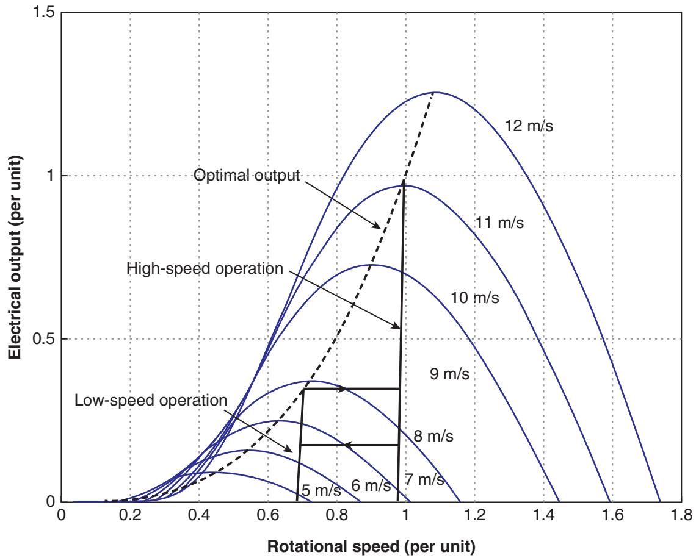

line

| Rotational speed (per unit) | Low-speed operation (m/s) | High-speed operation (m/s) | Optimal output (m/s) |
| --------------------------- | -------------------------- | -------------------------- | -------------------- |
| 0.7                         | 0.3                        | 0.4                        | 0.9                  |
| 1.0                         | 0.3                        | 0.4                        | 1.0                  |
| 1.1                         | 0.3                        | 0.4                        | 1.2                  |
| 1.2                         | 0.3                        | 0.4                        | 1.1                  |
| 1.3                         | 0.3                        | 0.4                        | 0.9                  |
| 1.4                         | 0.3                        | 0.4                        | 0.7                  |
| 1.5                         | 0.3                        | 0.4                        | 0.5                  |
| 1.6                         | 0.3                        | 0.4                        | 0.3                  |
| 1.7                         | 0.3                        | 0.4                        | 0.1                  |
| 1.8                         | 0.3                        | 0.4                        | 0.0                  |

Figure 6.20 Locus of operation of a two-speed wind turbine

Some disadvantages of two-speed compared to single-speed operation are because of the

• Additional generator cost.   
• Extra switchgear required, which is subjected to frequent operation.   
• Turbine speed, which must be controlled during each speed change.   
• Energy that is lost while the generator is disconnected during each speed change.

# 6.9.3 Variable-slip operation (see also Section 8.3.8)

Variable slip represents a compromise between rxed- and variable-speed operation. The generator is a wound rotor induction machine with a variable resistor that is controlled in series with the rotor circuit by a high frequency semiconductor switch. Below rated power or torque, the external resistor is short-circuited and the generator acts as a conventional rxed-speed induction machine. Above rated power, control of the resistance allows the generator torque to be varied and the generator speed to increase so the behaviour of the turbine is then similar to a variable-speed system. A maximum speed increase of about 10% above nominal rotational speed is typical.

This arrangement is simpler and cheaper than a full variable-speed system and gives some of the advantages, in particular the control of torque in the drive train and the smoothing of aerodynamic torque variations at above rated power. Below rated wind speed, it does not offer increased aerodynamic efrciency although it does not then suffer from switching losses in the power electronics. It does not provide control of the power factor of the electrical output. Electrical sicker in the network is reduced above rated wind speed as the output power is smoothed.

The entire power circuit can be mounted on the generator shaft including the additional resistor(s) and power electronic switch or connected via slip rings. Mounting the resistor on the generator shaft avoids the use of slip rings carrying the rotor current. The signal controlling the power electronic switch is transmitted to the rotating shaft using a non-contact optical device. However, an advantage of mounting the resistors outside the generator and connected via slip rings is that it is then easier to dissipate the heat that is generated above rated wind speed. This heat may be a limiting factor with large generators that have the rotor resistors mounted on the rotor shaft.

# 6.9.4 Variable-speed operation

Variable-speed operation of the aerodynamic rotor can be achieved by interposing a frequency converter carrying all of the output power of the turbine between the generator and network. All of the power is converted to direct current, and so the rxed relationship that would otherwise exist between the speed of rotation of the generator and the network frequency is broken. The generator may be synchronous or induction type. As well as allowing the rotor speed to vary and so maximise energy capture, the generator air-gap torque may be controlled and so transient mechanical loads reduced. An alternative way to vary the rotor speed is to use a wound rotor induction generator as with variable slip but replace the external resistors in the rotor circuit with a power electronic frequency converter. Only a fraction of the wind turbine output power passes through the rotor circuit.

Variable-speed operation has a number of advantages:

• Below rated wind speed, the rotor torque and hence speed can be made to vary to maintain peak aerodynamic efrciency.   
• The reduced rotor speed in low winds results in a signircant reduction in aerodynamically generated acoustic noise. Noise is especially important in low winds, where ambient wind noise is less effective at masking the turbine noise.

• The rotor can act as a sywheel, smoothing out aerodynamic torque suctuations before they enter the drive train. This is particularly important for torque suctuations at the blade passing frequency.   
• Direct control of the air-gap torque allows gearbox torque variations above the mean rated level to be kept small.   
Both active and reactive power exported to the network can be controlled, so that either any particular power factor can be maintained or the terminal voltage controlled. For large wind farms, it is much easier to meet the Grid Code requirements with variable-speed wind turbines than with rxed-speed, induction generator turbines.   
• Variable-speed turbines will also give better power (network voltage) quality due to the smoother output power they develop. The use of power electronic converters to connect the generator gradually to the network on start-up minimises electrical transients on connection.

In practice, losses in the frequency converters may amount to several percent of their rated power, counteracting the increased aerodynamic efrciency below rated wind speed. However, the possible load reductions and the requirements of the Grid Codes mean that all MW-scale turbines now operate at variable speed. Variations in aerodynamic torque at blade passing frequency are particularly signircant for larger turbines because of the size of the rotor compared to the lateral and vertical length scales of turbulence. The turbine control system is tuned to allow the aerodynamic power variations to be absorbed as slight changes in rotational speed, i.e. as variations in kinetic energy stored in the rotor.

There is a signircant cost associated with the variable-speed equipment, which must be weighed against the advantages. Other drawbacks include increased complexity and the generation of electrical noise and harmonics by the inverters. Modern pulse width modulated (PWM) inverters operate at high switching frequency (up to 10 kHz) using silicon insulated gate bipolar transistors (IGBTs). A high switching frequency reduces the lower order harmonics (e.g. rfth, seventh, 11th, 13th, etc.) compared to the earlier, naturally commutated converters that used thyristors, but with silicon power electronic switches there is a trade-off between reduced harmonics and increased electrical losses. The emerging semiconductor materials of silicon carbide and gallium nitride allow switching frequencies of up to 100 kHz with limited losses, but these switches are expensive at present; their use may increase in the future. At high switching frequencies, electrical noise can be a problem for control signals within the turbine if insufrcient care is taken with grounding and shielding of instrumentation and control cables. Fibre optic transmission is increasingly being used for monitoring and communications links, and currents in adjacent cables do not affect these circuits.

There are two principal methods of achieving variable-speed operation. In broad range or full power conversion (FPC) variable-speed operation, the generator stator is connected to the network via a fully rated ac–dc–ac frequency converter. Narrow range variable-speed operation uses a doubly fed induction generator (DFIG) with both the generator stator and rotor connected to the network. The stator is connected directly and the rotor through slip rings, and a smaller frequency converter is used (Anaya-Lara et al. 2009).

Broad range variable speed allows the generator and rotor speed to vary from close to zero to the full rated speed, but all the power output passes through the frequency converter. Either a synchronous or induction generator can be used. Narrow range variable speed uses a smaller, and hence cheaper, frequency converter. Only a fraction of the power passes through it, but the speed can only vary by, typically, ±30–40% either side of synchronous speed.1 In practice, this is enough to achieve almost all of the advantages of variable-speed operation. A disadvantage is the need to use a wound rotor induction machine with a small air-gap, and the maintenance requirements of the slip rings.

In both broad and narrow speed range wind turbines, the frequency conversion is made by two back-to-back voltage source converters that are connected through a direct current link. These converters rectify the power into the dc link and then invert it to network frequency or supply the generator. This rectircation into direct current and inversion isolates the network frequency from either the generator speed in the case of broad range or the rotor frequency in the case of a DFIG wind turbine. In both systems, control is by measuring the generator rotational speed and applying the torque required to keep the aerodynamic rotor at optimum tip speed ratio over a wide a range of wind speeds.

Figure 6.21 shows the control of a variable-speed wind turbine. The rotor speed is measured and, once cut-in speed is reached, a controlled torque is applied to the generator by the variable-speed converter. The rotor speed is controlled by the restraining torque of the generator to stay close to the optimum curve (O-A). At maximum rotational speed, this speed is maintained by increasing the restraining torque applied to the generator by the converter (A-B) until the blades are pitched to control incoming wind power and torque (B-C).

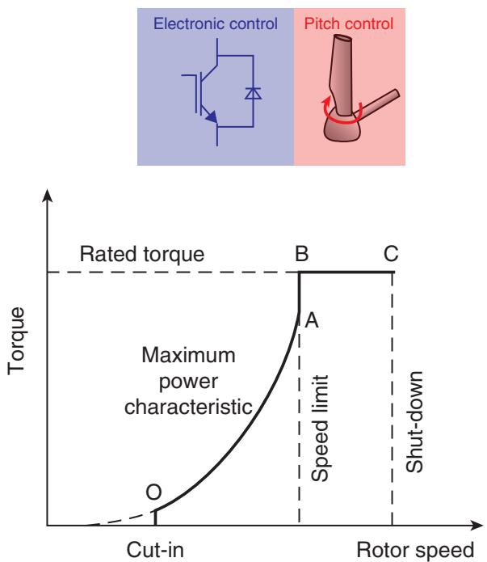

line

| Component         | Start of Cut-in | End of Rotor Speed |
| ----------------- | --------------- | ------------------ |
| Electronic control| High            | Medium             |
| Pitch control     | Low             | High               |

Figure 6.21 Control objective of a variable-speed wind turbine (see also Chapter 8, Figure 8.3)

# 6.9.5 Generator system architectures

Figures 6.22a–e show the architectures of the commonly used wind turbine generator systems.

• Figure 6.22a shows a rxed-speed (squirrel cage) induction generator with shunt capacitors to improve the output power factor. These capacitors may be switched to provide more reactive power as the generated power increases.   
• In Figure 6.22b, the rotor circuit has controllable resistors to give variable-speed operation. Power factor correction capacitors are connected to the stator of the wound rotor induction machine.   
• In Figure 6.22c, the controllable rotor resistors are replaced by back-to-back voltage source converters (using IGBTs) to connect the rotor to the network. This gives variable-speed operation over a restricted speed range above and below synchronous speed depending on the direction of power sow in the rotor circuit. Although there are switching losses in the converters, this arrangement avoids energy being dissipated in an external rotor resistance. Control of the generator speed and power factor is by the rotor side converter while the grid side converter maintains the dc link voltage. The crowbar circuit is to protect the generator side converter when faults occur on the ac network and to assist in ensuring continuous operation of the wind turbine during these faults.   
• All of the power from the generator (that may be synchronous or induction type) is rectired to dc in the arrangement of Figure 6.22d. Again, control of the generator torque (and hence speed) and excitation is by the machine side converter while the grid side converter maintains the dc link voltage. The network side converter can be used to control the network voltage or reactive power sow into the network.   
• An alternative arrangement is shown in Figure 6.22e with the network side converter controlling the output power of the generator (and hence the wind turbine speed) while the machine side converter is a simple diode rectirer followed by a dc to dc voltage converter. With this arrangement, the generator must be of the synchronous type, either wound rotor or permanent magnet, but the diode rectirer has lower losses than a controllable IGBT converter.

The relative popularity of the different architectures is described by Serrano-González and Lacal-Arántegui (2016).

# 6.9.6 Low-speed direct drive generators

Over the last 15 years, there has been considerable development of low-speed generators that are designed to be driven directly by wind turbine rotors without a speed-increasing gearbox. A number of manufacturers offer wind turbines with direct drive generators. The obvious advantages are the elimination of the gearbox with its associated energy losses, weight, noise, and maintenance requirements.

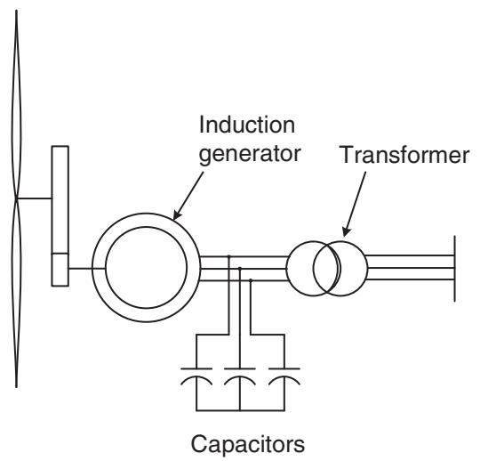

text_image

Induction
generator
Transformer
Capacitors

(a)

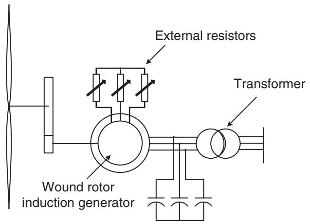

text_image

External resistors
Transformer
Wound rotor
induction generator

(b)

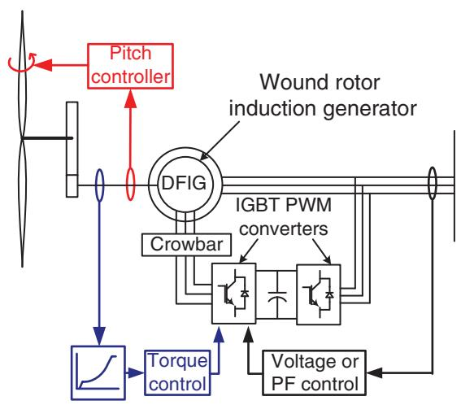

flowchart

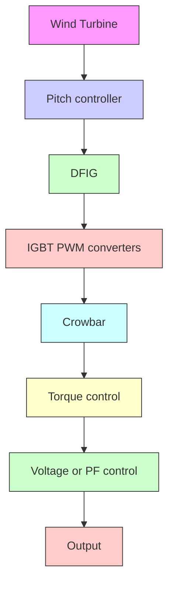
```mermaid
graph TD
    A["Wind Turbine"] --> B["Pitch controller"]
    B --> C["DFIG"]
    C --> D["IGBT PWM converters"]
    D --> E["Crowbar"]
    E --> F["Torque control"]
    F --> G["Voltage or PF control"]
    G --> H["Output"]
    style A fill:#f9f,stroke:#333
    style B fill:#ccf,stroke:#333
    style C fill:#cfc,stroke:#333
    style D fill:#fcc,stroke:#333
    style E fill:#cff,stroke:#333
    style F fill:#ffc,stroke:#333
    style G fill:#cfc,stroke:#333
    style H fill:#fcc,stroke:#333
```

(c)   
Figure 6.22 Wind turbine architectures. (a) Fixed-speed induction generator, Type 1 (IEC 61400-27-1 [2015]). (b) Variable-speed generator, Type 2. (c) Doubly fed induction generator, Type 3. (d) Full power converter wind turbine, Type 4. (e) Full power converter wind turbine (diode rectirer) (Anaya-Lara et al. 2009)

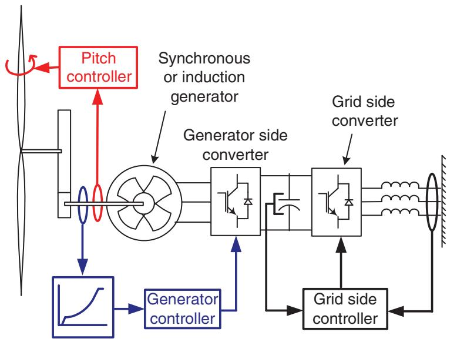

flowchart

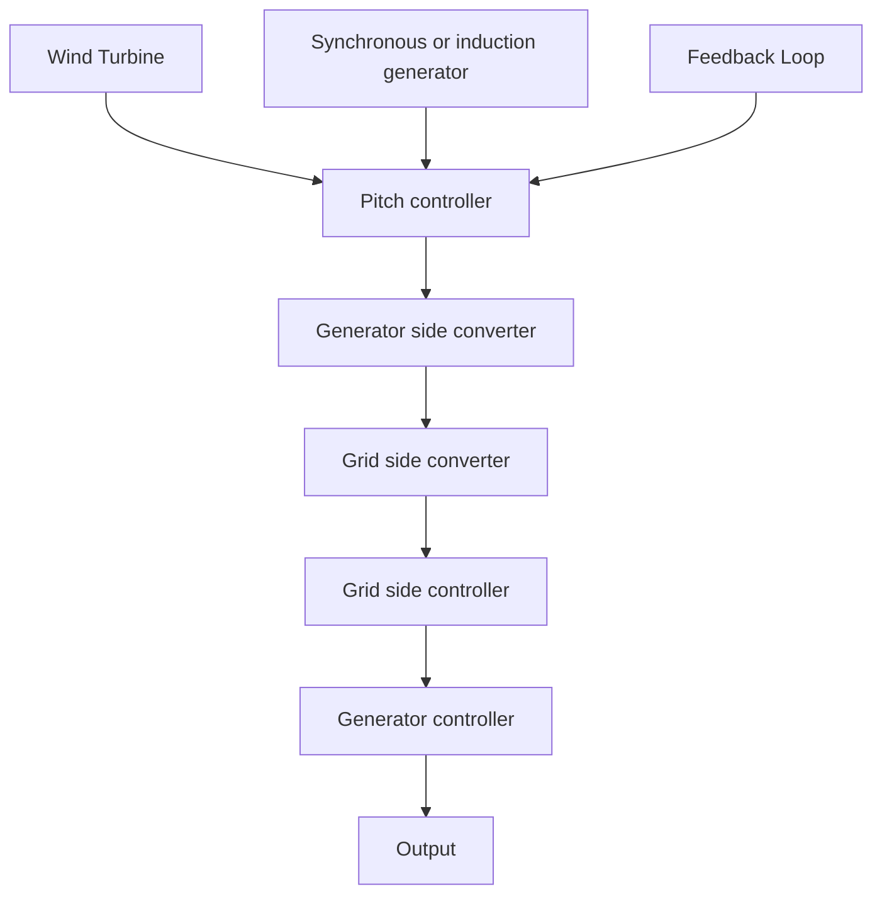
```mermaid
graph TD
    A["Wind Turbine"] --> B["Pitch controller"]
    B --> C["Generator side converter"]
    C --> D["Grid side converter"]
    D --> E["Grid side controller"]
    E --> F["Generator controller"]
    F --> G["Output"]
    H["Synchronous or induction generator"] --> B
    I["Feedback Loop"] --> B
```

(d)

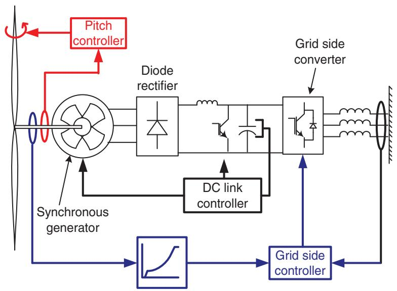

flowchart

```mermaid
graph TD
    A["Wind Turbine"] --> B["Pitch controller"]
    B --> C["Diode rectifier"]
    C --> D["Grid side converter"]
    D --> E["Grid side controller"]
    E --> F["DC link controller"]
    F --> G["Synchronous generator"]
    G --> H["Diode rectifier"]
    H --> I["Grid side converter"]
    I --> J["DC link controller"]
    J --> K["Grid side controller"]
    K --> L["DC link controller"]
    L --> M["Synchronous generator"]
    M --> N["Diode rectifier"]
    N --> O["Grid side converter"]
    O --> P["DC link controller"]
    P --> Q["Synchronous generator"]
    Q --> R["Diode rectifier"]
    R --> S["Grid side converter"]
    S --> T["DC link controller"]
    T --> U["Synchronous generator"]
    U --> V["Diode rectifier"]
    V --> W["Grid side converter"]
    W --> X["DC link controller"]
    X --> Y["Synchronous generator"]
    Y --> Z["Diode rectifier"]
    Z --> AA["Grid side converter"]
    AA --> AB["Synchronous generator"]
```

(e)   
Figure 6.22 (Continued)

The power output of a cylindrical electrical machine may be generally described by (Mueller and Polinder 2013)

$$
P = \omega 2 \pi R ^ {2} L F _ {d}
$$

where

휔 is the rotational speed of the rotor (rad/s)

R is the air-gap radius (m)

L is the axial length (m)

$F _ { d }$ is the air-gap shear strength (kNm/m2)

$F _ { d }$ is determined by the electromagnetic design and typically has a maximum of 30–60 kNm/m2

It may be seen that if the rotational speed is reduced, then it is necessary either to lengthen the generator in proportion or to increase the diameter. It is cheaper and lighter to increase the diameter because this raises the power by the square rather than linearly. Thus, direct drive generators for wind turbines have large diameters, and hence weights, but with limited length.

Induction generators require a small radial distance between the surface of the rotor and the stator (known as the air-gap). This is necessary to ensure that an adequate magnetic sux links the rotor because all of the excitation is provided from the stator. It is difrcult to manufacture large diameter electrical machines with small air-gaps for mechanical and thermal reasons. In contrast, synchronous generators have excitation systems on the rotor and so can operate with larger air-gaps. Hence direct drive wind turbines all use synchronous generators (either with permanent magnet excitation or are electrically excited with a wound rotor and electromagnets providing the magnetic reld). The use of a synchronous generator leads to the requirement for fully rated frequency conversion equipment to de-couple the generator speed from the network frequency through two fully rated power converters.

The stator of a synchronous generator has a distributed winding located in slots in a laminated iron core. This creates a rotating reld from the three phase supply onto which the rotor reld locks. An electrically excited synchronous machine uses a direct current circuit on its rotor to create the magnetic reld that is rxed to the rotor and rotates with it. The direct current may be supplied either through slip rings and brushes or by a small rotating transformer and rectirer in a brushless excitation system, but this arrangement is less common in wind turbines. The power dissipated in the reld circuit creates some electrical losses, but the advantage is that the reld current can be varied as the rotational speed changes, and hence the output voltage and power factor of the generator can be controlled. Electrically excited synchronous generators are well established for direct drive wind turbines and are used up to the highest ratings.

As an alternative to electrical excitation, rare-earth permanent magnets, typically neodymium iron boron (NdFeB), are used to create the rotor reld. This eliminates the electrical losses in the reld circuit and the consequent generation of heat. Several manufacturers offer wind turbines up to the highest ratings using such permanent magnet generators. If permanent magnets are used, then there is no control over the excitation of the synchronous machine, and the generator output voltage will vary with rotational speed. Then it may be necessary to use an additional power electronic converter to control the voltage of the dc link voltage of the frequency converter (see Figure 6.22e). The manufacture of very large, permanent magnet generators can be difrcult because the forces developed by the magnets during assembly can be very great.

There are two basic architectures of permanent magnet generators, radial and axial sux. A rgure discussed later (Figure 6.34) shows a radial sux generator with the rotor located inside the stator. A similar layout can be used for permanent magnet or electrically excited generators. Inverting the design and locating a rotating permanent magnet rotor outside the stator can reduce the overall diameter of the generator, as the magnets themselves can be made quite thin.

Table 6.8 Main parameters of a 3 MW, 15 rpm radial sux generator design 

<table><tr><td>Stator radius</td><td>2.5 m</td></tr><tr><td>Stator length</td><td>1.2 m</td></tr><tr><td>Air-gap</td><td>5 mm</td></tr><tr><td>No. of pole pairs</td><td>82</td></tr><tr><td>Weight of active material (copper, iron, and permanent magnet)</td><td>24 t</td></tr><tr><td>Losses at full output</td><td>130 kW</td></tr></table>

An example design of the active elements of a radial sux permanent magnet generator suitable for a 3 MW wind turbine is given in Polinder et al. (2006) and is detailed in Table 6.8.

An alternative, if less common, architecture is to arrange the air-gap sux to be parallel to the axis of the rotor. A single air-gap creates very large axial forces, and so it is common to use two air-gaps to balance these forces. In addition to these two basic approaches, a number of innovative designs of permanent magnet generators for wind turbines have been proposed but have yet to achieve commercial breakthrough.

# 6.9.7 Hybrid gearboxes, medium-speed generators

Several manufacturers have developed designs of hybrid drive trains based on a two stage gearbox and a medium-speed electrical generator with a nominal rotational speed of around 500 rpm. The generator and gearbox are then of similar size, and so this hybrid arrangement leads to a more balanced and compact nacelle. The medium-speed synchronous generators use permanent magnet excitation with full power frequency converters.

In some designs, a gearbox with multiple output shafts splits the power equally, and several identical smaller generators and power converters are used. The smaller individual generators and power converters are then easier to handle and can be cheaper.

# 6.9.8 Evolution of generator systems

Figure 6.23 shows the evolution of wind turbine generator systems. Early wind turbines used rxed-speed induction generators (FSIGs). These operated at almost constant speed (with slip less than 2–3%) using either stall regulation of the aerodynamic rotor or pitch regulation of the blades. The arrangement was applied to wind turbines as large as 1.5 MW, but above this rating there are increasing difrculties in controlling drive train oscillations and limiting mechanical loads. In addition, FSIG wind turbines have difrculties meeting the requirements of the Transmission Grid Codes that are applied to large wind farms.

From around the year 2000, DFIGs became increasingly common in large wind turbines with the benerts of limited variable-speed operation but at the reduced cost of controlling only a fraction of the output power. However, slip rings are required on the generator rotor, and the air-gap of a wound rotor induction generator must be kept small.

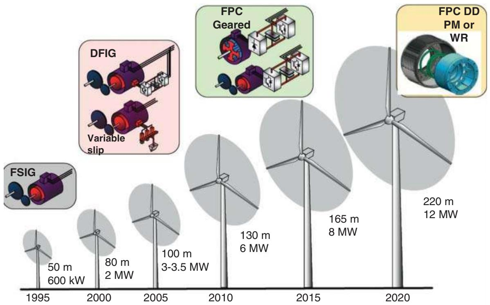

other

| Year | Technology | Capacity (MW) | Start Time (m) |
|------|------------|---------------|----------------|
| 1995 | FSIG       | 50            | 600            |
| 2000 | DFIG       | 80            | 2              |
| 2005 | FPC Geared | 100           | 3-3.5          |
| 2010 | FPC Geared | 130           | 6              |
| 2015 | FPC Geared | 165           | 8              |
| 2020 | FPC DD PM or WR | 220         | 12             |

Figure 6.23 Evolution of commercially available wind turbine generator systems. FSIG: Fixed-speed induction generator; DFIG: doubly fed induction generator; FPC: full power conversion; DD: direct drive; PM: permanent magnet; WR: wound rotor

At the same time as the DFIG architecture was being implemented widely, FPC was being used with generators either driven through a gearbox or driven directly by the aerodynamic rotor. Both electrically excited wound rotor and permanent magnet low-speed, large diameter synchronous generators have been used for direct drive applications. At present, there remains limited consensus on the architecture of future electrical generator systems for very large wind turbines.

# 6.10 Other drive trains and generators

Section 6.9 described the generation systems that are, or have been, widely used commercially. However, a very large number of other concepts and approaches to drive trains and power conversion have been investigated and prototypes constructed, but they are not commercially signircant at present.

# 6.10.1 Directly connected, Jxed-speed generators

Large hydro, fossil rred, or nuclear power stations use synchronous generators connected directly to the power system, and the design and operation of all large power systems is based on the performance of synchronous generators. Induction generators are much less useful than synchronous generators for large-scale power generation and are rarely used at sizes greater than 10 MW. Hence, in the early development of wind turbines, considerable efforts were made by engineers to use the familiar synchronous generators in wind turbines.

The disadvantages of directly connected induction generators are the following:

• The damping action in the rotor results in higher energy losses than with a synchronous generator. It is then necessary to arrange for the removal of the heat dissipated in the rotor.   
• All the reactive power necessary to energise the magnetic circuits must be supplied from the network (or by local capacitors). If local capacitors are used, there is the danger of self-excitation.   
• There is no direct control over the terminal voltage or reactive power sow.   
• Induction generators do not produce sustained fault current for three phase faults on the network.   
• They suffer from problems of voltage instability. This was not an important issue with a limited capacity of wind generation, but with large wind farms on weak networks, it can limit the size of the wind farm that can be connected.

Synchronous and induction generators have similar windings on their stators that, when connected to the three phase mains voltage, produce a rxed-speed, rotating magnetic reld. However, the rotors of the two machines are quite different (Hindmarsh 1984; McPherson 1990). A synchronous machine has magnets (either permanent or electromagnets) mounted on its rotor, and the rotor magnetic reld locks into the constant-speed, rotating reld produced by the stator. The rotor turns at the same speed as the stator magnetic reld, and the drive train is stifsy coupled to the constant frequency of the electrical network, although it leads the stator reld by an angle depending on the torque. This is in contrast to the rotor of a simple induction generator that has a squirrel cage winding into which currents are induced when the rotor rotates slightly faster than the stator reld. An induction generator can only develop torque at a rotational speed slightly greater than that of the stator reld, and the drive train is more loosely coupled to the frequency of the electrical network.

Considering a reference frame rotating at grid frequency and to a rrst approximation, the behaviour of a synchronous machine connected directly to an electricity network may be considered to be analogous to a torsional spring. The torque is proportional to the angle between the rotor and the stator reld. This angle is known as the load or power angle. In contrast, an induction generator can be thought of as a torsional damper where the torque is proportional to the difference in speed between the rotor and the stator reld (the slip speed). This is illustrated in simple schematic form in Figure 6.24.

It may be seen that if the simple model of a rxed-speed wind turbine equipped with a synchronous generator is excited by the cyclic torque from the wind turbine rotor, there is no damping in the drive train to control the torsional oscillations. It is a simple two spring, two mass system. The main cyclic torque of the wind turbine rotor will be at blade passing frequency, and it is an unfortunate coincidence that this often matches quite closely the natural frequency of oscillation of a synchronous generator connected to an electrical network. Early attempts to operate wind turbines with directly connected synchronous generators failed due to unacceptable drive train oscillations. Synchronous generators can be rtted with additional cage damper windings, but due to space limitations, it is not practical to provide the degree of damping required for the large cyclic torque oscillations of wind turbine rotors.

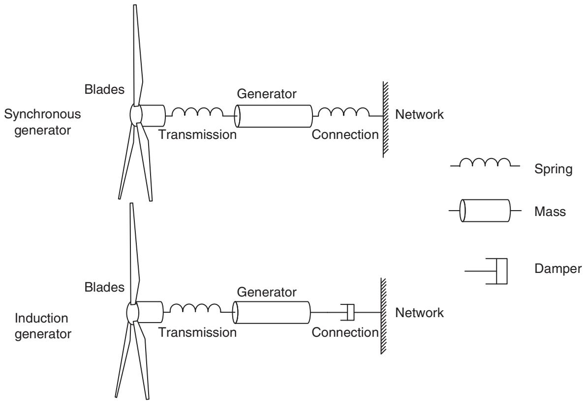

text_image

Blades
Synchronous
generator
Generator
Transmission
Connection
Network
Spring
Mass
Damper
Blades
Induction
generator
Generator
Transmission
Connection
Network

Figure 6.24 Mechanical analogues of directly connected generators

An induction generator connected to the network can be represented by a torsional damper, and this performance was exploited in the simple architecture of a stall-regulated rotor, gearbox, and directly connected induction generator (the Danish concept) that was used for some years. FSIGs of up to 1.5 MW were widely used in these turbines until the 1990s (Anderson 2020). The generators typically had slips of 1–2%, exceptionally up to 3%. At higher power ratings, second order electromagnetic effects reduce the damping energy that can be extracted, and the wind turbine architecture becomes ineffective (Saad-Saoud and Jenkins 1999).

Attempts have also been made to use variable pitch wind turbine rotors to drive FSIGs directly. However, it was found to be difrcult to control the drive train torque effectively, and transient overpowers of up to twice the continuous rating were common. This was due to a combination of the resonant behaviour of the drive train, the speed of response of the blade pitch control, and the absence of the drive damping of stall regulation.

From the mid-1990s, directly connected generators were gradually superseded by power electronic variable-speed systems that remove the direct link between the generator and network. In a variable-speed operation, the generator is not connected directly to the network but is de-coupled by the frequency converter. The generator side voltage source inverter presents an actively controlled voltage to the electrical machine, and the simple analogues of Figure 6.24 do not apply.

# 6.10.2 Innovations to allow the use of directly connected generators

There have been a number of attempts to provide additional torque limiting, torsional damping, torsional compliance, and wide range variable-speed operation through innovations in mechanical drive trains to allow wind turbines with either synchronous or low slip induction generators to be connected directly to the network. These approaches have now largely been superseded by the use of power electronic frequency conversion, but similar arrangements continue to be proposed from time to time.

A suid coupling has an impeller and a turbine runner in a constant volume of suid. The impeller drives the turbine through the speed difference (slip) between them. The slip (and energy lost as heat) is typically 2–6% at full power output. The coupling provides torsional damping and has similar performance to that of a high slip induction generator. Historically, the Smith–Putnam and Mod-0A turbines both used a suid coupling to drive a synchronous generator, whereas Westinghouse and Howden used suid couplings in their early commercial medium sized turbines (Spera 1994; Hau 2013).

A sexible (quill) low-speed shaft was used to drive a rxed-speed synchronous generator in the Mod-2 turbines. Such shafts provide torsional compliance, but the only damping is from the shaft material itself. It is interesting to note that the next turbine to be developed in this series (the Mod-5) used variable speed using power electronics (Spera 1994).

Several early prototypes rxed the gearbox to the nacelle frame using springs and dampers. This arrangement allows controlled angular rotation of the gearbox and provides torsional compliance and damping. It enabled the use of synchronous generator on the 250 kW MS-1 (Law et al. 1984) and the 4 MW WTS-4 prototypes (Hau 2013).

The LS-1 prototype had a 3 MW directly connected synchronous generator and a variable-speed differential mechanical gearbox to give a ±5% speed variation. The sun wheel of the planetary gearbox was controlled by a four quadrant 300 kW power electronic electrical drive to vary the speed of rotation of the aerodynamic rotor and limit torque transients (Law et al. 1984). Some years later, this concept was developed further by replacing the electrical variable-speed drive by a hydraulic system controlling the gearbox sun wheel. Depending on the control of the hydraulic system, variable-speed operation as well as torsional damping and compliance can be provided without power electronics. Turbines using these types of controlled differential gearbox and a synchronous generator were offered commercially by several manufactures (Pengfei and Wang 2011). A differential gearbox with four quadrant control of the sun wheel can be thought of as the mechanical analogue of a power electronic DFIG.

High-pressure suid systems have a very high energy density, both with respect to volume and weight, and can conveniently store energy. They can be used to provide drive train compliance and damping and also longer-term energy storage in pressurised energy accumulators. This concept is described in the comprehensive review of future emerging technologies in the wind power sector by Watson et al. (2019). The early Schacle–Bendix prototype used a hydraulic transmission to drive a synchronous generator, and several studies examined the use of high-pressure hydraulics for wind turbine transmission. The studies concluded that at that time, this approach suffered from limited availability of components at the ratings needed, relatively poor efrciency, low reliability, and limited life (Jamieson 2018).

# 6.10.3 Generator and drive train innovations

A large number of other innovations have been investigated or demonstrated to various levels of technology readiness but have yet to achieve commercial breakthrough. Examples include those discussed in the following sections.

# Superconducting generators

Many large offshore wind turbines use direct drive, permanent magnet synchronous generators to eliminate the gearbox and so that the generator rotor can be a simple robust construction suitable for the demanding offshore environment. However, the sux density that can be developed in the air-gap of a permanent magnet synchronous generator is limited, and so a large diameter, heavy, and expensive generator is needed to develop the torque required. In the past, there has also been concern over the availability and price of the rare-earth permanent magnetics; up to 800–1000 kg of permanent magnet material is required for each MW of installed wind power capacity. Superconducting generators offer the possibility of a more compact and lower weight high torque drive train, but questions of their cost and reliability has impeded their use in commercial turbines (Moore 2018).

Superconductors allow very high magnetic relds to be created by thin wires or tapes with little electrical loss and are typically used in the dc rotor circuit of generators to increase the sux density in the air-gap and increase the peak torque by a factor of two or three over a permanent magnet generator. Figure 6.25 is a cross-section of a generator with a superconducting rotor. Design studies of such machines have suggested that the superconductors could have a current density of 300 A/mm2 in an applied reld of 4 tesla and develop an air-gap sux density of 2.5 tesla (Abrahamsen et al. 2012). In the arrangement shown, the rotor is superconducting and the stator is conventional, although some designs have proposed superconducting windings on both stator and rotor.

Table 6.9 shows the two types of superconductor that are likely to be suitable for use in wind turbine generators. Both can sustain an applied sux density of 3 tesla and maximum current density of around 100 A/mm2 while maintaining their superconducting properties. These materials have been the subject of a number of studies (INNWIND 2018; Jensen et al. 2012). The medium temperature $\mathrm { M g B } _ { 2 }$ is generally considered to be cheaper than a high temperature superconductor but is more difrcult to manufacture and use in a generator.

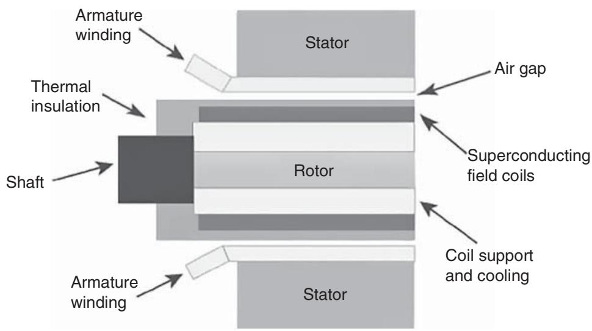

text_image

Armature winding
Thermal insulation
Shaft
Stator
Air gap
Rotor
Superconducting field coils
Coil support and cooling
Armature winding

Figure 6.25 Superconducting rotor synchronous generator

Table 6.9 Superconducting materials suitable for wind turbine generators 

<table><tr><td>Type of superconductor</td><td>Material</td><td>Critical temperature K</td><td>Practical operating temperature K</td><td>Comparative price of material</td></tr><tr><td>Medium temperature</td><td> $MgB_{2}$ , magnesium diboride</td><td>39</td><td>20</td><td>1–4</td></tr><tr><td>High temperature</td><td>RBCO, rare-earth barium copper oxide tape</td><td>90–110</td><td>20–50</td><td>20–30</td></tr></table>

The EcoSwing Project (Winkler 2019) has demonstrated a 4 m diameter, direct drive superconducting generator in a 128 m diameter, 15 rpm wind turbine. The modired turbine and generator ran successfully for 630 hours and reached a maximum output of 3 MW. The rotor magnets were made from a composite tape with a ceramic superconducting layer of gadolinium–barium–copper oxide (GdBaCuO) on a steel ribbon. Cryogenic coolers were used to cool the superconductor to 33 K.

# Magnetic gearboxes

The availability of high strength NdFeB permanent magnets has allowed the development of magnetic gearboxes (Attallah and Howe 2001; Wang and Gerber 2014; Jamieson 2018). These convert the low-speed, high torque rotation of the aerodynamic rotor of a large wind turbine to a higher-speed, lower torque rotation more suitable for electricity generation without any direct physical contact as occurs in a conventional gearbox. The torque is transmitted by the magnetic relds of the permanent magnets, which are modired by an intermediate ferromagnetic element (Figure 6.26). Radial sux designs appear to be promising and a competitive technology to superconducting generators (INNWIND 2018).

If two concentric sets of permanent magnets with different numbers of pole pairs are separated by an intermediate rotor of pole pieces of soft ferromagnetic material, then torque can be transferred provided the number of pole pairs of the permanent magnets and the number of pole pieces of the soft magnetic material are related by

$$
p _ {i} + p _ {o} = n _ {m}
$$

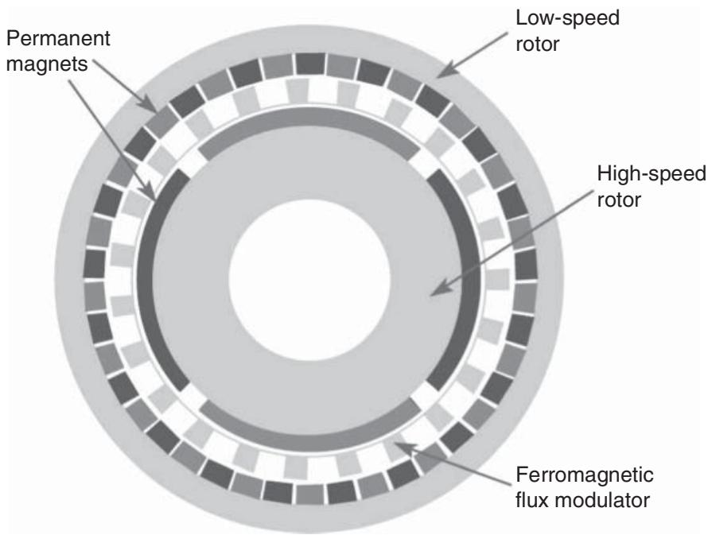

text_image

Permanent magnets
Low-speed rotor
High-speed rotor
Ferromagnetic flux modulator

Figure 6.26 Radial sux magnetic gearbox

where

$p _ { i }$ is the number of pole pairs of permanent magnetic material on the inner shaft

$p _ { o }$ is the number of pole pairs of pemanent magnetic material on the outer shaft

$n _ { m }$ is the number of pole pieces of ferromagnetic material, and the speed of rotation of the rotors is given by

$$
\omega_ {i} p _ {i} + \omega_ {o} p _ {o} = \omega_ {m} n _ {m}
$$

where

$\omega _ { i }$ is the rotational speed of the inner shaft

$\omega _ { o }$ is the rotational speed of the outer shaft

$\omega _ { m }$ is the rotational speed of the ferromagnetic rotor.

If the intermediate ferromagnetic rotor is held rxed, then the gear ratio (high speed/low speed) is

$$
G = - \frac {p _ {o}}{p _ {i}}
$$

If the outer set of permanent magnets is held rxed, then the gear ratio becomes

$$
G = \frac {n _ {m}}{p _ {i}} = 1 + \frac {p _ {o}}{p _ {i}}
$$

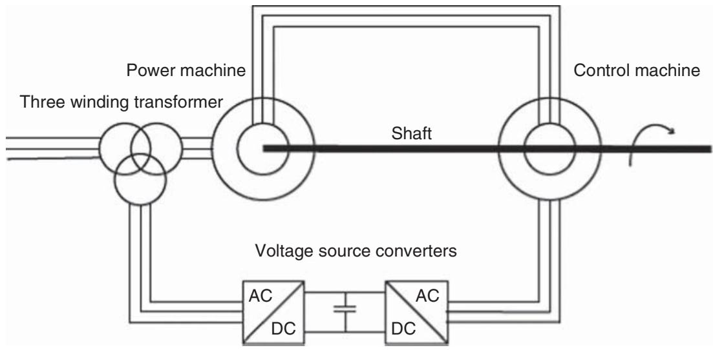

flowchart

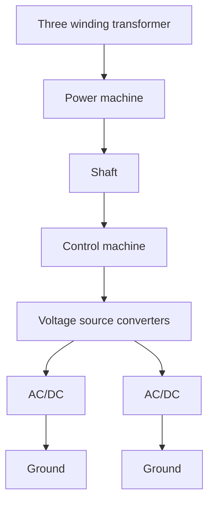
```mermaid
graph TD
    A["Three winding transformer"] --> B["Power machine"]
    B --> C["Shaft"]
    C --> D["Control machine"]
    D --> E["Voltage source converters"]
    E --> F["AC/DC"]
    E --> G["AC/DC"]
    F --> H["Ground"]
    G --> I["Ground"]
```

Figure 6.27 Principle of a cascaded brushless doubly fed induction generator

This concept has been developed into the ‘pseudo direct drive’ permanent magnet generator by integrating the magnetic gearbox with a permanent electrical generator. This leads to a reduction in the use of permanent magnetic material (Attallah et al. 2008).

# Brushless doubly fed induction generators

A DFIG uses a wound rotor induction machine that has slip rings to transfer power from a voltage source converter onto the rotor. If two wound rotor induction machines are connected in cascade, there is no need for slip rings. The generators are mounted on the same shaft so that power can be transferred between the rotors by a direct connection that rotates with the shaft. The stator of the lower rated control machine is supplied through a back-to-back voltage source converter while the stator of the power machine is connected to the network. This principle is shown in Figure 6.27 and formed the basis of the development of the modern brushless doubly fed induction machine.

Rather than two separate machines, the modern brushless doubly fed induction machine has two separate stator windings on the same core and a nested rotor. This magnetically coupled concept has received considerable academic attention, but its construction is complex, the machine is expected to be larger and more expensive than a DFIG with slip rings, and the control is expected to be more difrcult. In spite of a number of claimed advantages over a DFIG, such as elimination of the slip rings and improved fault ride through, this technology has not yet been used commercially in wind turbines (EWEA 2009; Strous et al. 2017).

# Direct current power collection

The established architectures of variable-speed turbines (Figure 6.22c–e) all use a back-to-back frequency converters, and each wind turbine produces alternating current at a constant frequency of 50 or 60 Hz. This constant output frequency allows the use of conventional electrical plant for the wind farm power collection circuits, including transformers and switchgear, but a large number of power electronic converters are required.

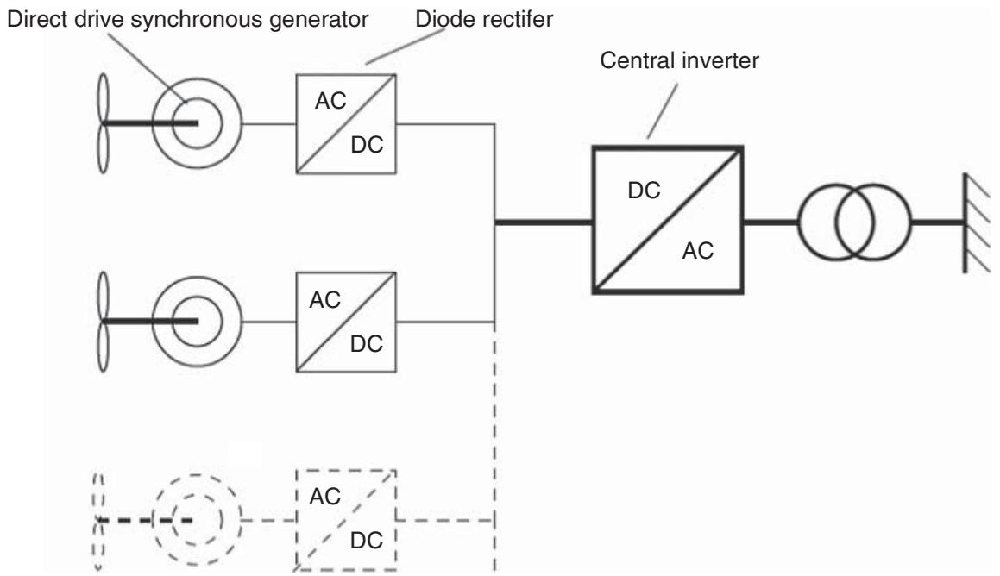

flowchart

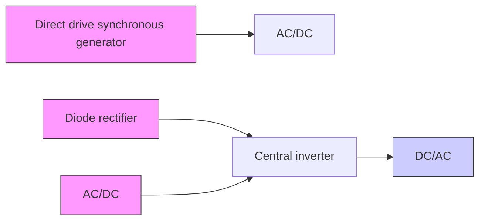
```mermaid
graph LR
    A["Direct drive synchronous generator"] --> B["AC/DC"]
    C["Diode rectifier"] --> D["Central inverter"]
    E["AC/DC"] --> D
    D --> F["DC/AC"]
    style A fill:#f9f,stroke:#333
    style C fill:#f9f,stroke:#333
    style E fill:#f9f,stroke:#333
    style F fill:#ccf,stroke:#333
```

Figure 6.28 Parallel connection of direct current wind turbine generators

The use of direct current in the wind farm power collection and a smaller number of larger dc/ac inverters was demonstrated in Holland in the 1980s. ABB took the concept further with its Windformer design (Dahlgren et al. 2000). This proposed the use of a direct drive synchronous generator with a radial sux permanent magnet rotor and novel high voltage cable windings on the stator. The variable frequency alternating current output of each generator (at a voltage of more than 20 kV) would be rectired to direct current by a simple diode rectirer within the turbine. The direct current output of several wind turbines would be connected in parallel and their output inverted by a central inverter (see Figure 6.28). It was intended that this innovative design would be demonstrated on a 3 MW prototype, but the project was discontinued before the wind turbine was constructed. Gjerde et al. (2014) used simulation and a laboratory-scale prototype to investigate a modular direct drive generator and series connected power converter arrangement to allow connection to the wind farm power collector circuits without a transformer.

A number of studies have investigated the connection of the dc output of wind turbines in series. Series connection can potentially reduce the length of array cabling needed but requires an additional dc/dc converter at each turbine to control the rotor torque (Veilleux and Lehn 2014). This converter must withstand the voltage of the string of turbines. To date, no modern wind farm has used a direct current power collection circuit.

# 6.11 Drive train mounting arrangement options

# 6.11.1 Low-speed shaft mounting

The functions of the low-speed shaft are the transmission of drive torque from the rotor hub to the gearbox and the transfer of all other rotor loadings to the nacelle structure.

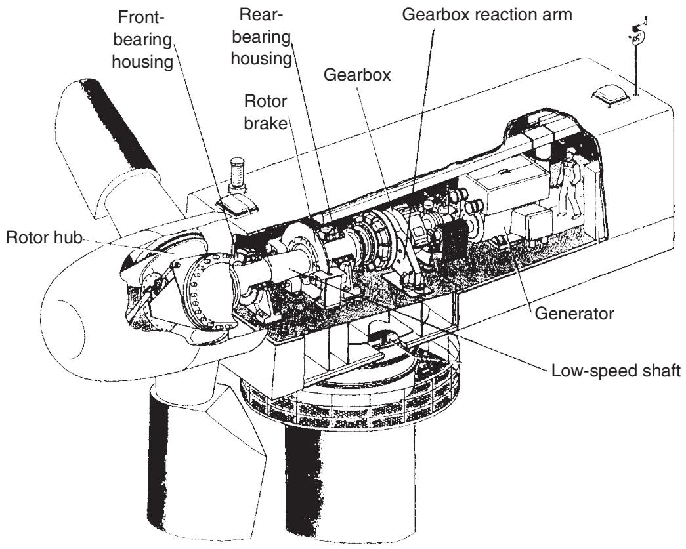

text_image

Front-
bearing
housing
Rear-
bearing
housing
Rotor
brake
Gearbox
Gearbox reaction arm
Rotor hub
Generator
Low-speed shaft

Figure 6.29 View of nacelle showing traditional drive shaft arrangement

Traditionally, the mounting of the low-speed shaft on fore and aft bearings has allowed these two functions to be catered for separately: the gearbox is hung on the rear end of the shaft projecting beyond the rear bearing, and the drive torque is resisted by a torque arm. The front bearing is positioned as close as possible to the shaft/hub sange connection to minimise the gravity moment due to the cantilevered rotor mass, which usually governs shaft fatigue design. The spacing between the two bearings will normally be greater than that between front bearing and rotor hub to moderate the bearing loads due to shaft moment. See Figure 6.29 for an illustration of a typical arrangement.

The opposite approach is to make the gearbox an integral part of the load path between the low-speed shaft and tower top, i.e. an ‘integrated gearbox’. The fore and aft low-speed shaft bearings are absorbed within the gearbox, which moves to the front of the nacelle to minimise the rotor cantilever distance, and the gearbox casing then transmits the loads to the nacelle bedplate (Figure 6.35). Clearly, this approach requires a much more robust gearbox casing, which must not merely resist the rotor loads but do so without desecting sufrciently to impair its functioning. Moreover, its fore–aft length has to be increased to moderate the bearing loads due to shaft moment. The benerts lie in the reduced extent of the bedplate and the elimination of separate bearings requiring separate provision for lubrication, but a signircant disadvantage is that gearbox replacement requires the removal of the rotor.

A conrguration that is becoming increasingly popular is one intermediate between the two extremes just described, in which only the rear low-speed shaft bearing is absorbed into the gearbox. The gearbox is usually set well back from the front bearing to reduce the rear bearing loads and is rigidly rxed to supporting pedestals positioned on either side of the nacelle. Typical arrangements are shown in Figure 6.30, which shows a cross-section through the nacelle of the Nordex N-60 turbine, and in Figure 6.31. Note that the shaft tapers down in diameter towards the rear resecting the reducing bending moment. The advantage of this arrangement is that the gearbox casing is not called upon to carry any moments due to cantilevered rotor mass or rotor out-of-plane loadings.

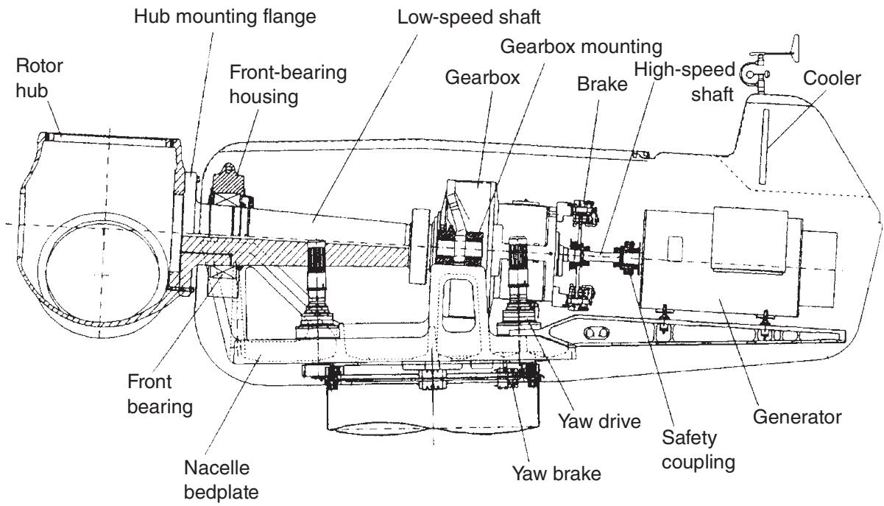

text_image

Rotor hub
Hub mounting flange
Front-bearing housing
Nacelle bedplate
Front bearing
Yaw drive
Yaw brake
Gearbox mounting
Gearbox
Brake
High-speed shaft
Cooler
Generator
Safety coupling

Figure 6.30 Nacelle arrangement for the Nordex N60 turbine. Source: Reproduced by permission of Nordex

Figures 6.32 and 6.33 are aerial views of the nacelle of a NEG Micon 1.5 MW machine with a similar drive train arrangement, after installation of the low-speed shaft.

In the case of wind turbines with direct drive generators, the low-speed shaft arrangement is dramatically different. The low-speed shaft, which now connects the rotor hub to the rotor of the generator, is hollow, so that it can be mounted on a concentric rxed shaft cantilevered out from the nacelle bedplate. See Figure 6.34.

# 6.11.2 High-speed shaft and generator mounting

The generator is normally mounted to the rear of the gearbox on an extension of the nacelle bedplate, and the connecting drive shaft – the ‘high-speed shaft’ – is rtted with sexible couplings at each end, to cater for small misalignments between the generator and gearbox.

The generator axis is normally offset from the low-speed shaft axis. This is because, except in the case of machines rtted with a mechanical brake acting on the rotor, access is required to the rear end of the low-speed shaft for hydraulic pipes, electrical cables, or an actuator rod passing through the shaft, which is made hollow for blade pitch control or the activation of tip brakes. Usually the generator is either offset to one side of the nacelle, which introduces asymmetry into the nacelle bedplate, or it is offset vertically upwards, which requires a vertical step in the bedplate.

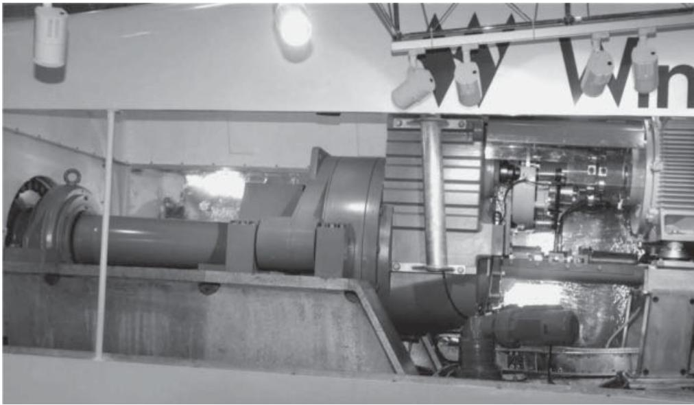

natural_image

Interior view of an industrial machine with large cylindrical components and overhead lighting (no visible text or symbols)

Figure 6.31 Drive train side view. From left to right the components visible through the cut-out in the nacelle wall are (1) low-speed shaft front bearing, (2) low-speed shaft, (3) gearbox mountings, (4) gearbox, (5) high-speed shaft with brake, (6) generator. The fabricated bedplate is also visible

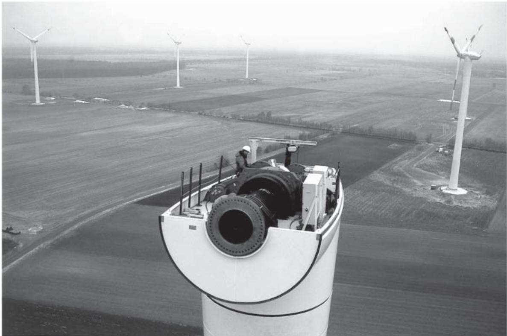

natural_image

Aerial view of a wind turbine installation in an open field with multiple turbines in the background (no visible text or symbols)

Figure 6.32 Turbine assembly in the air (1): View of nacelle of 1.5 MW NEG Micon turbine after installation of low-speed shaft (front) and gearbox. The ring of bolt holes in the low-speed shaft for hub mounting is clearly visible. Source: Reproduced by permission of NEG Micon

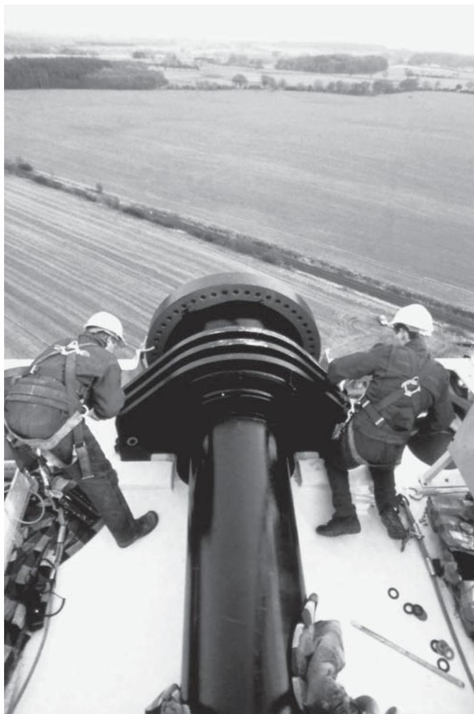

natural_image

Two workers in safety gear performing maintenance on a large industrial pipe segment over farmland (no visible text or symbols)

Figure 6.33 Turbine assembly in the air (2): View of low-speed shaft and front bearing after installation on 1.5 MW NEG Micon turbine. Source: Reproduced by permission of NEG Micon

A much more compact arrangement can be obtained by bolting the generator rigidly onto the rear of the gearbox via an adaptor tube (see Figure 6.35). The surfaces of the mating interfaces have to be carefully machined to ensure shaft alignment, and suitable access has to be provided to the coupling between the generator and gearbox output shafts. Despite the neatness of this layout, it has only been adopted by one or two manufacturers.

One consequence of locating the generator in the nacelle is that power cables running down the tower are required to twist as the nacelle yaws. On some large machines, the problems associated with the twisting of heavy cables have been avoided by mounting the generator vertically in the top of the tower and driving the high-speed shaft via a bevel gear. An alternative solution to the problem of heavy twisting cables, however, is to leave the generator in the nacelle and to transform to a higher voltage there as well.

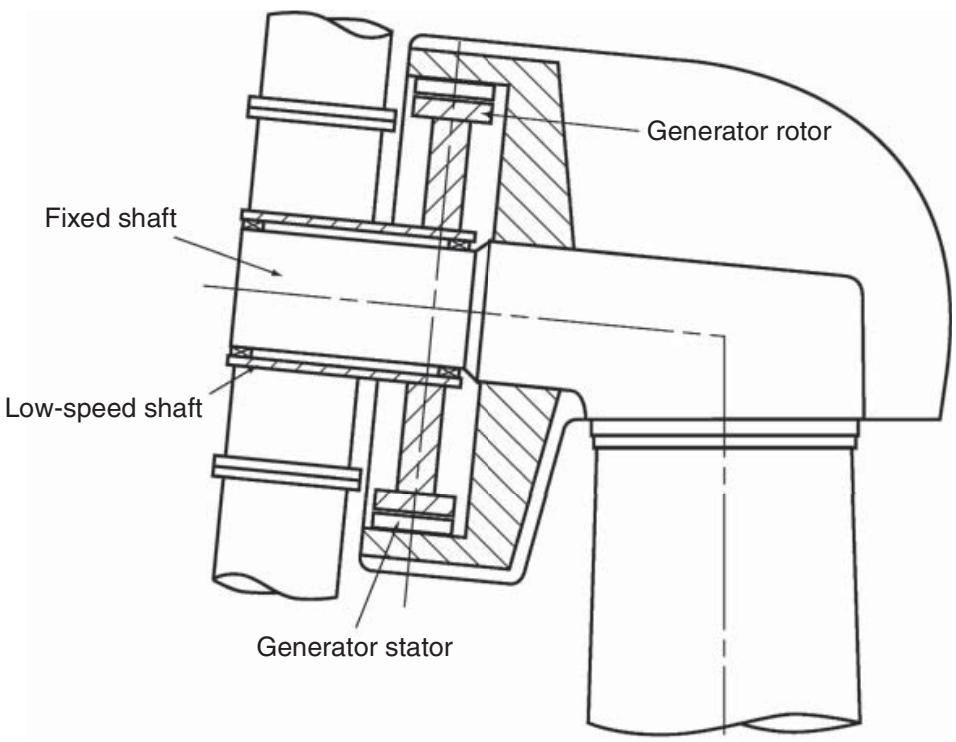

text_image

Generator rotor
Fixed shaft
Low-speed shaft
Generator stator

Figure 6.34 Direct drive generator arrangement

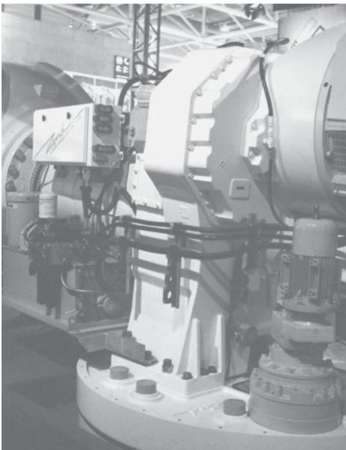

natural_image

Industrial machinery setup with large cylindrical components and control panels (no visible text or symbols)

Figure 6.35 Integrated gearbox on the Zond Z-750 turbine. (The gearbox is mounted on a circular nacelle bedplate, with the hub to the left and generator at rear. An electrically driven yaw drive can be seen beneath the generator.)

# 6.12 Drive train compliance

The rotational dynamics of the drive train can have a major effect on loading. The effect is very different in rxed- and variable-speed turbines, but in each case the consequence of ignoring drive train dynamics at the design stage can be very severe.

In the variable-speed case, the dynamics may be quite simple: the drive train may be modelled as a rotor and a generator inertia, separated by a torsional spring. Typically, the natural frequency of this resonant system is quite high, of the order of 3–4 Hz. However, this mode is subject to very little damping, especially above rated where the generator torque is held constant. (Below rated the torque will be varied as a function of rotational speed, thus providing a small amount of damping.) There is very little aerodynamic damping from the rotor, and this mode of vibration can potentially generate very large gearbox torque oscillations. Chapter 8 explains how the control system can be used to damp this mode by appropriate control of the generator torque, but it is important to ensure that the resonant frequency does not coincide with a signircant forcing frequency such as 6P, which can make it very difrcult to achieve sufrcient damping through the control system.

In the rxed-speed case, the directly coupled induction generator provides a lot of damping because the air-gap torque increases steeply with generator speed. The smaller the slip, the greater this damping. This might be expected to be benercial, but in practice the reverse is likely to be true. Consider the drive train as a two degree of freedom system, with four elements in series: the rotor inertia, the shaft torsional spring, the generator inertia, and rnally the damper representing the slip curve, connected to ground (the constant frequency grid). If the damping is very large, the generator can almost be considered to be locked (i.e. rotating at nearly constant speed), and the dynamics are dominated by the degree of freedom represented by the rotor inertia and the torsional spring, which has very little damping, as in the variable-speed case. With higher generator slip, the lower generator damping allows more movement of the generator inertia, causing more coupling between the two degrees of freedom. This gives a system in which there are two coupled torsional modes, each involving some movement of both rotor and generator inertias and involving both the spring and the damper. Effectively, the generator damping now affects both modes signircantly: instead of a very lightly damped spring mode and a very heavily damped damper mode, we now have two modes with intermediate damping, so the peak dynamic magnircation is much lower. Thus 0.5% rated generator slip can give a peak dynamic magnircation of perhaps 2 to 5 at the resonant frequency, whereas with 2% slip the peak magnircation may be no more than 1 to 1.5. The position of the peak with respect to blade passing frequency is critical – if the blade passing frequency is close to the peak, very large gearbox torque and electrical power oscillations will occur at this frequency, and it is very difrcult to reduce these signircantly using pitch control. Ideally the blade passing frequency should be well above the resonant frequency so that the dynamic amplircation will be less than one, but it is not uncommon for power and torque oscillations at the blade passing frequency to be as large as ±50–100% of rated in high winds.

The use of a high slip generator greatly improves the situation, but there are two main drawbacks: Firstly, each 1% of slip corresponds to 1% of extra losses, which signircantly reduces the energy yield below rated wind speed. Secondly, these extra losses equate with heat dissipation in the generator, making it more difrcult to keep the generator cool, especially in large machines.

An alternative to high generator slip that has occasionally been used is a suid coupling between the gearbox and the generator. This is also a device that generates a torque proportional to slip speed, and it suffers from the same drawbacks as a high slip generator.

Another technique that has sometimes been used is to reduce the resonant frequency by introducing additional torsional sexibility into the drive train. This can be done by means of a quill shaft, a sexible low-speed coupling, or sexible mounts for the gearbox or even for the whole bedplate. The frequency reduction is, however, accompanied by a further loss of damping, and it may therefore be necessary to incorporate additional mechanical damping with the torsional sexibility, which is not always easy to engineer. Torsional sexibility in the high-speed shaft is not usually practical because of the large angular movement required to achieve the necessary sexibility – half a revolution may be necessary, compared to just one or two degrees at the low-speed shaft. An interesting variant (Leithead and Rogers 1995) is to mount the generator on sexible mounts. This system can be tuned to absorb energy at the blade passing frequency through an additional mode of vibration of the generator casing against its mountings. This mode also affects the generator slip speed (the difference between rotor and casing speeds) and is therefore damped by the slip curve. Nevertheless, generator casing displacements would still need to be of the order of 10–15∘ , which is still not easy to engineer.

# 6.13 Rotor position with respect to tower

# 6.13.1 Upwind conJguration

The upwind conrguration is the one most commonly chosen. The principal advantage is that the tower shadow effect is much less for the same blade–tower spacing, reducing both dynamic loads on the blade and rhythmic noise effects. Set against this is the need to take great care to avoid the risk of blade–tower strikes with upwind machines, requiring accurate prediction of blade desections under turbulent wind loading.

There are several ways of increasing the clearance between the undesected blade and the tower. These include increasing the shaft tilt, inclining the blades forward (‘rotor coning’), applying pre-bend to the outer portion of the blades, and increasing rotor overhang. However, it is desirable to keep the rotor overhang small to minimise low-speed shaft and nacelle bedplate bending moments, so the low-speed shaft is normally tilted upwards by $5 ^ { \circ }$ or $6 ^ { \circ }$ to provide the necessary blade–tower clearance, with rotor coning and/or pre-bend sometimes applied as well.

Inevitably the tilting of the rotor plane results in a small reduction in power output. According to the axial momentum theory for a yawed turbine (Section 4.2.1), the coefrcient of performance is reduced by the factor $c o s ^ { 3 } \theta$ , leading to a 1.1% reduction in power output for a $5 ^ { \circ }$ shaft tilt if the air sow is horizontal. However, the vortex cylinder theory (Section 4.2.3) predicts a smaller reduction of 0.6% for this case.

# 6.13.2 Downwind conJguration

The wake velocity dercit behind a wind turbine tower is much greater than that in front of it, to the extent that Powles (1983) has reported a turbulent region with essentially no forward velocity extending up to four tower diameters downstream of an octagonal tower. Beyond this distance, recovery is relatively rapid, with the dercit reduced to about 25% at seven tower diameters downstream.

In addition to the mean wind speed velocity dercit behind the tower, vortex shedding results in additional wind speed suctuations over and above those already present due to turbulence. The two effects combine to present a harsh environment to the blades immediately behind the tower. The blades are subjected to a large negative impulsive load each time they pass the tower, which contributes signircantly to blade fatigue damage, and the audible tower ‘thump’ that results is liable to be unwelcome. Designers usually mitigate both effects by positioning the rotor plane well clear of the tower, but this inevitably increases nacelle costs somewhat.

An important benert of the downwind conrguration is that it allows the use of very sexible blades without the risk of tower strike during normal operation, Such blades benert by being less severely unloaded by the tower shadow, because wind loading desects them farther from the tower in the rrst place. However, care must be taken to avoid the risk of tower strike during emergency braking, when the blades pitch rapidly to feather.

# 6.14 Tower stiffness

A key consideration in wind turbine design is the avoidance of resonant tower oscillations excited by rotor thrust suctuations at rotational or blade passing frequency. The damping ratio may be only 2–3% for tower fore–aft oscillations and an order of magnitude less for side-to-side motion, so unacceptably large stresses and desections could develop if the blade passing frequency or rotational frequency coincided with tower natural frequency. This section begins by looking at the relative magnitudes of some of the excitations.

# 6.14.1 Stochastic thrust loading at blade passing frequency

Whereas the deterministic variations in blade loading due to wind shear, yaw, etc. largely cancel out when the loadings on three blades are added together, the stochastic loadings due to turbulence do not, resulting in a signircant rotor thrust load component at blade passing frequency. The magnitude of this quantity can be estimated fairly easily by assuming a linear relationship between suctuations in the incident wind speed and the resultant load suctuations according to Eq. (5.25).

For the example three bladed machine considered in Section 5.12.4, the total variance of rotor thrust is only about 20% less than it would be if the wind speed variations across the rotor were fully correlated. Thus, from Eq. (5.129):

$$
\sigma_ {T} = \left(\frac {1}{2} \rho \Omega \frac {d C _ {l}}{d \alpha}\right) \sigma_ {u} \oint c r d r (0. 8) \tag {6.17}
$$

where the integral sign ∮ signires that the integration is carried out over the whole rotor. Using the expression for the power spectrum of rotor thrust in Eq. (5.130), it can be shown that the variance of the thrust suctuations within ±10% of blade passing frequency is about 1.4% of the total for the case considered. Although this is a small proportion (as can be seen from inspection of Figure 5.40), the standard deviation of thrust suctuations in this frequency range is a much higher proportion of $\sigma _ { T }$ , i.e. $\sqrt { 0 . 0 1 4 } \cong 1 2 \%$ .

Denoting the standard deviation of thrust suctuations within $\pm 1 0 \%$ of blade passing frequency as $\sigma _ { T . 3 p } .$ , we have

$$
\sigma_ {T. 3 p} \cong 0. 1 \left(\frac {1}{2} \rho \Omega \frac {d C _ {l}}{d \alpha}\right) \sigma_ {u} \oint c r d r \tag {6.18}
$$

How does this compare with the maximum steady operational thrust load? Considering a pitch-regulated machine operating at rated wind speed, the rotor thrust is approximately

$$
T = \frac {1}{2} \rho \Omega^ {2} \oint C _ {l} (r). c r ^ {2} d r
$$

and its maximum steady value can be estimated by setting $C _ { l } ( r )$ equal to 1.5, giving

$$
T _ {M a x} = \frac {1}{2} \rho \Omega^ {2} 1. 5 \oint c r ^ {2} d r \tag {6.19}
$$

Hence the ratio of thrust suctuations within $\pm 1 0 \%$ of blade passing frequency to the maximum steady thrust is

$$
\frac {\sigma_ {T . 3 p}}{T _ {M a x}} \cong \frac {0 . 1 \left(\frac {1}{2} \rho \Omega \frac {d C _ {l}}{d \alpha}\right) \sigma_ {u} \oint c r d r}{\frac {1}{2} \rho \Omega^ {2} 1 . 5 \oint c r ^ {2} d r} = \frac {0 . 1 \left(\frac {d C _ {l}}{d \alpha}\right) \sigma_ {u}}{1 . 5 \Omega} \frac {\oint c r d r}{\oint c r ^ {2} d r} \tag {6.20}
$$

Setting $\frac { d C _ { l } } { d \alpha }$ equal to $2 \pi ,$ and noting that $\frac { \oint c r ^ { 2 } d r } { \oint c r d r }$ is approximately equal to 0.6R, one obtains

$$
\frac {\sigma_ {T . 3 p}}{T _ {M a x}} \cong \frac {0 . 1 (2 \pi) \sigma_ {u}}{1 . 5 \Omega (0 . 6 R)} \cong 0. 7 \frac {\sigma_ {u}}{\Omega R} \tag {6.21}
$$

If the standard deviation of turbulence, $\sigma _ { \mathrm { u } }$ , is 1.8 m/s and the tip speed is 65 m/s, the moment ratio approximates to 0.02.

Noting that the damage equivalent fatigue stress range for a material with an S-N curve log-log plot inverse slope of m = 4 is 3.36 times the standard deviation of stress for a narrow banded process [see Eq. (12.71) in Chapter 12], it is seen that, in relation to the design of the tower against fatigue, the DEL range of the thrust suctuations close to blade passing frequency is about 6.5% of the maximum thrust in the case considered.

# 6.14.2 Tower top moment Kuctuations due to blade pitch errors

Unintended differences between the pitches of the three blades will cause a permanent difference in the blade root moments $M _ { Y 1 } , M _ { Y 2 }$ , and $M _ { Y 3 }$ (see Figure 5.36), which will translate into a rotating moment applied to the nacelle. This in turn will impose a sinusoidal $M _ { Y }$ moment on the tower top at the rotational frequency.

Consider a turbine with blade pitch errors of $\Delta \theta , - \Delta \theta$ and zero on blades 1, 2, and 3. The angle of attack is reduced by $\Delta \theta$ on blade 1, changing the blade root moment by

$$
\Delta M _ {Y 1} = \frac {1}{2} \rho \Omega^ {2} \frac {d C _ {l}}{d \alpha} \{- \Delta \theta \} \int_ {0} ^ {R} c r ^ {3} d r \tag {6.22}
$$

The suctuating tower top moment reaches its maximum and minimum when blades 1 and 2 are at $3 0 ^ { \circ }$ to the vertical and its amplitude is

$$
\Delta M _ {Y} = \frac {1}{2} \rho \Omega^ {2}. 2 \pi \{\Delta \theta \} \int_ {0} ^ {R} c r ^ {3} d r (2 \cos 3 0 ^ {\circ}) \tag {6.23}
$$

It is instructive to compare this moment with the average value in the tower due to the maximum steady thrust. At a depth of R below the hub, the moment ratio is

$$
\frac {\Delta M _ {Y}}{T _ {M a x} R} = \frac {\frac {1}{2} \rho \Omega^ {2} . 2 \pi \{\Delta \theta \} \int_ {0} ^ {R} c r ^ {3} d r (\sqrt {3})}{\frac {1}{2} \rho \Omega^ {2} 1 . 5 \oint c r ^ {2} d r R} \cong \frac {2 \pi \{\Delta \theta \} 0 . 7 (\sqrt {3})}{1 . 5 (3)} \cong 1. 7 \{\Delta \theta \} \tag {6.24}
$$

as $\frac { \int _ { 0 } ^ { R } c r ^ { 3 } d r } { \oint c r ^ { 2 } d r }$ is approximately equal to 0.7R/3.

The moment ratio equates to 0.9% if the default blade pitch error of $0 . 3 ^ { \circ }$ specired in the 2003 edition of the GL ‘Guideline for the Certircation of Wind Turbines’ (Germanischer Lloyd 2003) is used. Thus the moment range at rotational frequency due to this blade pitch error is about 1.8% of that due to rated thrust at a depth R below the hub – i.e. signircantly less than the damage equivalent moment range at this location due to stochastic thrust loading at blade passing frequency of about 6.5%.

# 6.14.3 Tower top moment Kuctuations due to rotor mass imbalance

Unintended differences between the masses of the three blades will result in a sinusoidal gravitational moment about the low-speed shaft axis, which will be transmitted to the tower. While IEC 61400-1 edition 3 and the 2003 edition of the GL ‘Guideline for the Certircation of Wind Turbines’ stipulate that the rotor mass imbalance taken into account should be based on the manufacturer’s specircation, the 1999 edition of the latter specired a rotor mass eccentricity of 0.005R in the case of a ‘balanced’ rotor, which will be considered here.

In the case of an 80 m diameter turbine, the blade mass is typically about 7.5 t, so, taking the hub mass equal to that of three blades, the total rotor mass comes to 45 t. With an eccentricity of $0 . 0 0 5 \times 4 0 = 0 . 2 \mathrm { m }$ , the tower top side-to-side moment range comes to about 180 kNm.

As before, it is instructive to compare this moment with the average value in the tower due to the maximum steady thrust. Taking the latter as 250 kN (Figure 5.39), the moment in the tower at a depth of R below the hub is 10 000 kNm. Hence the tower moment range at rotational frequency due to rotor mass imbalance is about 1.8% of that due to rated thrust at a depth R below the hub.

Based on the above, it would appear that the impact of mass imbalance is much the same as that of blade pitch error for the mass eccentricity and pitch error considered. However, when dynamic magnircation is taken into account, the effects of mass imbalance are potentially much more damaging, because the damping ratio for side-to-side tower oscillations may be an order of magnitude less than for fore–aft oscillations. This is because aerodynamic damping makes a negligible contribution to the damping of side-to-side motion.

# 6.14.4 Tower stiffness categories

Wind turbine towers are customarily categorised according to the relationship between the tower natural frequency and the exciting frequencies. Towers with a natural frequency greater than the blade passing frequency are said to be stiff, while those with a natural frequency lying between rotational frequency and blade passing frequency are said to be soft. If the natural frequency is less than rotational frequency, the tower is described as soft-soft.

If the tower is designed to meet strength requirements and no more, its frequency category is primarily determined by the ratio of tower height to turbine diameter, with the higher ratios producing the softer towers. The principal benerts of stiff towers are modest – they allow the turbine to run up to speed without passing through resonance and tend to radiate less sound. However, because stiff towers usually require the provision of extra material not otherwise required for strength, soft towers are generally preferred.

# 6.15 Multiple rotor structures

As noted in Section 6.2.2, technological improvements in blade manufacture and design have allowed the adverse effects of the square-cube law (whereby energy capture increases with the square of diameter and component weights increase as the cube) to be largely circumvented as diameters have increased. Given that large diameter machines permit the more effective exploitation of onshore sites of limited area (Section 6.2.5), signircant cost savings ought to be realisable without loss of energy capture if a large diameter turbine is replaced by a closely spaced array of much smaller diameter turbines that provide the same swept area in total and are all mounted on the same structure. This proposition will be examined in this section.

The key to the multiple rotor concept is the design of an efrcient structure to support the rotor array. This is assumed to consist of a planar structure that yaws to face the wind, mounted on a yaw bearing at the top of a conventional tower.

Consider 19 rotors, each 28.9 m in diameter and rated at 263 kW, arranged in a hexagonal array at 30 m spacing. These would have the same swept area as the NREL 5 MW reference turbine (Jonkman et al. [2009]), so the hexagonal array could be supported on the same yaw bearing and tower. It is assumed that the maximum combined steady thrust for the 19 rotors is the same as for the NREL reference turbine – i.e. about 800 kN (although in practice the thrust would be higher, as would be the energy capture, because of the close rotor spacing – see Section 6.15.6).

# 6.15.1 Space frame support structure

A lattice space frame would be an obvious candidate structure to support the array, which could be centrally mounted on a yaw bearing at the top of a tubular tower. It could take the form of two vertical planar parallel lattices about 26 m apart and connected by ‘web’ members, with 19 nodes in the front lattice each supporting a rotor, Chord members would be aligned at $0 , + 6 0$ , and $- 6 0 ^ { \circ }$ to the horizontal. See Figure 6.36.

However, buckling considerations would seriously limit permissible stresses with a 30 m node spacing, so it would be desirable to reduce both the chord member spacing and the separation distance between the two planar lattices. If the lattice node spacings and web member lengths are both reduced to 10 m, then nearly all members can be 168 mm dia × 5 mm × 20.14 kg/m thick circular hollow sections, although stresses still have to be limited to about 45 MPa under the maximum thrust loading to provide adequate resistance to buckling. This compares with a tower base stress of about 74 MPa at the base of the NREL 5 MW turbine due to the maximum steady thrust loading. Unfortunately, lighter members cannot be used for the more lightly loaded peripheral members, as 5 mm is the minimum wall thickness for 168 mm dia circular hollow sections.

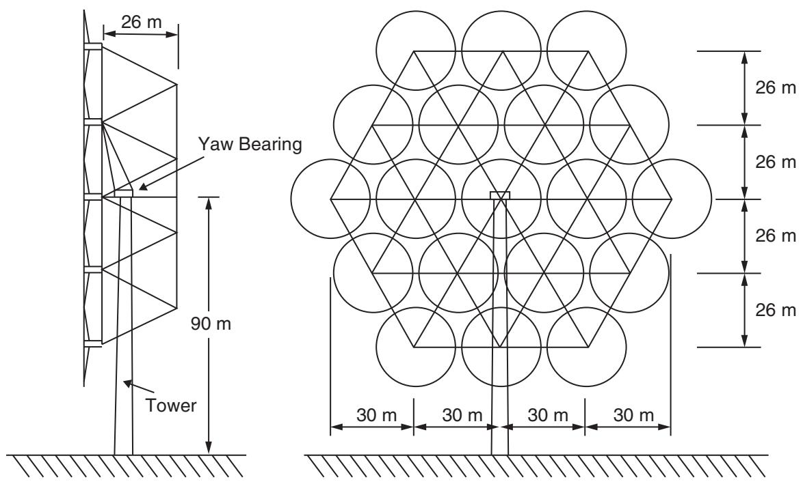

text_image

26 m
Yaw Bearing
90 m
Tower
30 m 30 m 30 m 30 m
26 m
26 m
26 m
26 m

Figure 6.36 Nineteen rotors spaced at 30 m mounted on a space frame structure

The weight of a 120 m diameter × 8.66 m thick space frame consisting of 168 mm dia × 5 mm thick circular hollow sections at a 10 m pitch in each direction is approximately 3600(π/10)(3 × 4)20.14 kg or 273 t. This does not seem excessive, as it is less than the weight of the tower that would support it – i.e. 347 t, based on the weight of the tower required to support the 126 m diameter NREL 5 MW turbine (Jonkman et al. [2009]). However, there are several serious objections to the concept:

• The complexity of the structure would result in a signircantly higher fabrication cost per tonne.   
• The space frame would be far too large to be transported to site in one piece, so extensive site welding would be required.   
• The space frame would be awkward to erect.   
• The space frame would not provide personnel access to the individual turbines, and any access provided would be exposed to the weather.

# 6.15.2 Tubular cantilever arm support structure

Given the disadvantages of the space frame listed previously, it is worth exploring a simpler support structure for the rotor array, even at the cost of reduced structural efrciency. One candidate is a series of horizontal tubular arms mounted on a central tubular stem, the lower half of which would necessarily surround the top portion of the rxed tower, with the yaw bearing forming the interface between them. The cantilever arms would act in sexure to resist both gravity and aerodynamic thrust loadings and could taper down in both diameter and thickness towards the free ends.

An outline design of such a structure to support 19 28.9 m diameter rotors has been carried out on the assumption that the stress due to the maximum steady thrust loading should nowhere exceed 74 MPa, the corresponding value obtaining at the base of the NREL 5 MW turbine – see Figure 6.37. This should ensure that the fatigue stresses are satisfactory. Based on the mass formulae in the NREL cost model, the weight of a 28.9 m turbine is similar in magnitude to the maximum thrust loading, but the fatigue element of the latter means that it drives the design. Assuming that the tubulars have a D/t ratio of 100 to avoid a signircant strength reduction due to buckling, it is found that the longest arm is required to have a diameter of 1.95 m at its inner end and that the combined weight of all 10 arms and the integral stem is 292 t.

# 6.15.3 Vestas four-rotor array

Vestas have constructed a multi-rotor concept demonstrator utilising four reconditioned 29 m diameter 225 kW machines built prior to 1997. These are mounted at two levels on arms extending either side of a central tower. The arms are tilted up at an angle of about 17∘ and are effectively inclined struts with the free ends restrained by horizontal ties attached to a central, yawing chassis. This is a structurally more efrcient arrangement than the cantilever arms acting in sexure considered in Section 6.15.2.

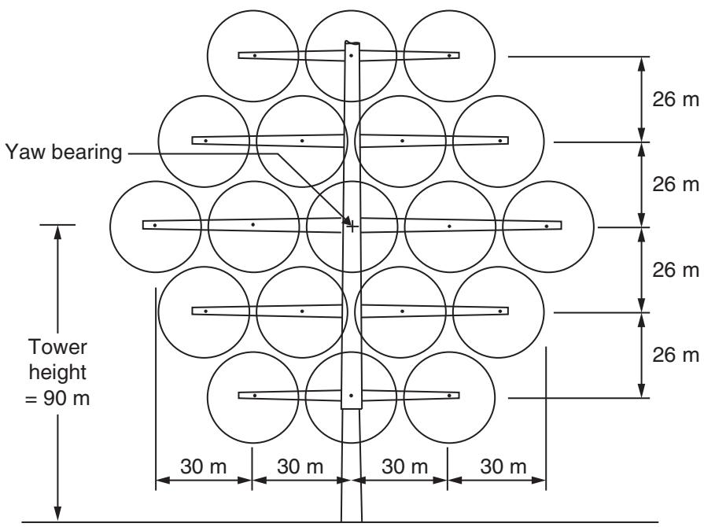

text_image

Yaw bearing
Tower height
= 90 m
26 m
26 m
26 m
26 m
30 m 30 m 30 m 30 m

Figure 6.37 Nineteen rotors spaced at 30 m mounted on a tubular ‘tree’ structure

The four-rotor demonstrator, which was completed in 2016, is heavily instrumented to permit the dynamics of the structure to be investigated, including in the event of one of the rotors tripping out.

# 6.15.4 Cost comparison based on fundamental scaling rules

The costs of a 126 m diameter turbine and a 19 rotor installation providing the same swept area can be compared according to various cost models. In the rrst instance, it is assumed that the masses of all components apart from the generator, variable-speed electronics, electrical connections, and control system scale as the cube of diameter and that component costs are proportional to mass. The control system cost is assumed invariant with diameter, and the costs of the other three components are assumed to scale as machine rating – i.e. as the square of diameter. The base costs are those for the 70 m diameter NREL turbine given in Table 6.2, resulting in the scaled costs shown in Table 6.10. Note that the costs of the yaw drive and tower for the 19 rotor installation are assumed to be the same as for the 126 m diameter turbine, and foundation, assembly and installation, transportation, and grid connection costs are excluded from consideration. It is seen that there is a cost saving of 29%.

# 6.15.5 Cost comparison based on NREL scaling indices

According to the NREL cost model (Section 6.2.3), some key cost elements, such as the blade manufacture labour cost, main bearing costs, and gearbox cost, vary as the diameter raised to the power of 2.5 instead of the cube, while others, such as the nacelle, brake, and hydraulics cost only vary as the square. The base costs of the 70 m diameter

Table 6.10 Cost comparison between a 126 m diameter turbine and an array of 19 turbines having the same total swept area, using fundamental mass scaling rules and assuming component cost to be proportional to mass 

<table><tr><td>Diameter, D (m)</td><td>70</td><td>126</td><td>28.906</td><td>28.906</td><td>% saving</td></tr><tr><td>Number of rotors</td><td>1</td><td>1</td><td>1</td><td>19</td><td></td></tr><tr><td>Component costs varying as D cubed ($k)</td><td>561</td><td>3269</td><td>39.5</td><td>750</td><td></td></tr><tr><td>Component costs varying as D squared ($k)</td><td>276</td><td>894</td><td>47.1</td><td>894</td><td></td></tr><tr><td>Control system cost ($k)</td><td>35</td><td>35</td><td>35</td><td>665</td><td></td></tr><tr><td>Yaw drive cost ($k)</td><td>20</td><td>116</td><td></td><td>116</td><td></td></tr><tr><td>Tower cost (Sk)</td><td>113</td><td>656</td><td></td><td>656</td><td></td></tr><tr><td>Array support structure cost ($k)</td><td>0</td><td>0</td><td></td><td>439</td><td></td></tr><tr><td>Sum ($k)</td><td>1004</td><td>4971</td><td></td><td>3521</td><td>29.2</td></tr></table>

Table 6.11 Cost comparison between a 126 m diameter turbine and an array of 19 turbines having the same total swept area, using the cost scaling indices in the NREL cost model 

<table><tr><td>Diameter (m)</td><td colspan="3">70</td><td>126</td><td>28.906</td><td>28.906</td></tr><tr><td rowspan="2">No. of rotors</td><td colspan="3">1</td><td>1</td><td>1</td><td>19</td></tr><tr><td>Costs $k</td><td>%</td><td>Power law scaling indices</td><td></td><td>Costs $k</td><td></td></tr><tr><td>Blades - materials</td><td>68</td><td>6.8</td><td>3</td><td>396</td><td>5</td><td>91</td></tr><tr><td>Blades - labour</td><td>84</td><td>8.3</td><td>2.5</td><td>363</td><td>9</td><td>174</td></tr><tr><td>Hub and nose cone</td><td>47</td><td>4.7</td><td>2.92</td><td>262</td><td>4</td><td>68</td></tr><tr><td>Pitch mechanism</td><td>38</td><td>3.8</td><td>2.66</td><td>184</td><td>4</td><td>70</td></tr><tr><td>Low-speed shaft</td><td>21</td><td>2.1</td><td>2.89</td><td>116</td><td>2</td><td>31</td></tr><tr><td>Main bearings</td><td>12</td><td>1.2</td><td>2.5</td><td>52</td><td>1</td><td>25</td></tr><tr><td>Gearbox</td><td>153</td><td>15.2</td><td>2.5</td><td>663</td><td>17</td><td>318</td></tr><tr><td>Generator</td><td>98</td><td>9.7</td><td>2</td><td>316</td><td>17</td><td>316</td></tr><tr><td>Variable-speed electronics</td><td>119</td><td>11.8</td><td>2</td><td>384</td><td>20</td><td>384</td></tr><tr><td>Nacelle frame and cover</td><td>117</td><td>11.6</td><td>1.95</td><td>367</td><td>21</td><td>396</td></tr><tr><td>Electrical connections</td><td>60</td><td>6</td><td>2</td><td>194</td><td>10</td><td>194</td></tr><tr><td>Hydraulics</td><td>18</td><td>1.8</td><td>2</td><td>58</td><td>3</td><td>58</td></tr><tr><td>Control system</td><td>35</td><td>3.5</td><td>0</td><td>35</td><td>35</td><td>665</td></tr><tr><td>Brake and high-speed coupling</td><td>3</td><td>0.3</td><td>2</td><td>10</td><td>1</td><td>10</td></tr><tr><td>Tower</td><td>113</td><td>11.2</td><td>3</td><td>656</td><td>0</td><td>656</td></tr><tr><td>Yaw drive</td><td>20</td><td>2</td><td>2.96</td><td>114</td><td>0</td><td>114</td></tr><tr><td>Array support structure</td><td></td><td></td><td></td><td></td><td></td><td>438</td></tr><tr><td>Totals</td><td>1004</td><td>100</td><td></td><td>4171</td><td>0</td><td>4007</td></tr></table>

NREL turbine given in Table 6.2 have been scaled using the NREL cost model power law indices in Table 6.11. (This omits the effect of any rxed cost elements because these are considered liable to cause misleading results at the small diameter of 28.9 m.)

It is seen that the effect of using the lower scaling power law indices is to reduce the cost saving predicted for the multiple rotor array to only 4%.

# 6.15.6 Discussion

It is clear from the range of results from the two capital cost comparisons above that the benert of multiple rotor arrays is uncertain. To provide greater certainty, the way forward would necessarily involve the design and construction of a small diameter turbine that takes advantage of all technological advances in blade manufacture and drive systems since turbines of this size were deployed in large numbers.

The cost of maintenance also needs to be considered. Set against the potential benert of being able to swap out a whole turbine if required is the likely increase in the time required for the routine maintenance of many small machines as opposed to one large one. Provision of safe access routes to all of the nacelles will also carry an extra cost.

The feasibility of the multi-rotor concept was investigated in greater detail as part of the INNWIND project (INNWIND [2015b]). This extended to loading, energy capture, yaw bearing conrguration and operation and maintenance as well as the supporting structure. A key rnding was that closely spaced rotors (at 1.025D or 1.05D) would achieve 8% greater energy capture at the cost of an 8% increase in thrust. It was also concluded that individual small rotors would be better at tracking short-term wind speed changes due to turbulence, yielding a further gain in energy capture of a few percent.

Jamieson (2018) provides a useful overview of multi-rotor concepts and their benerts.

# 6.16 Augmented Kow

The performance of a wind turbine can be enhanced by placing it inside a duct (or ‘diffuser’) shaped in such a way as to augment the air velocity within it. Although it is sometimes claimed that rotor coefrcient of performance can be increased by the cube of the speed-up factor, the pressure drop across the rotor is unchanged when it operates at optimum $C _ { P } ,$ , so the increase in $C _ { P }$ is simply proportional to the speed-up factor.

Jamieson (2018) has developed the theory of augmented sow and diffuser loading and describes some of the designs that have been developed – e.g. the 5 kW wind lens ducted turbine (Ohya and Karasudani [2010]), which has been upscaled to 100 kW. Inevitably the success of the concept in the future depends on whether the cost of the diffuser and its support structure can be reduced below the value of the extra energy captured.

# 6.17 Personnel safety and access issues

An integral part of wind turbine design is the inclusion of the necessary safety equipment for operation and maintenance staff. Minimum requirements include the following:

• Provision of ‘emergency stop’ push buttons located at key locations in the tower, nacelle, and hub to enable personnel to stop the turbine and its systems operating in the event of an emergency.   
• Provision of a ‘remote/local’ switch placed at the bottom of each tower. This enables a technician to take full control of the turbine when entering to carry out maintenance by changing the switch to the ‘local’ position. This eliminates the risk of a third party trying to command the turbine to restart remotely.   
• Provision of a fall-arrest system on the tower ladder(s). This consists of a fall arrester that slides on either a steel cable running the full length of the ladder in the middle or on a rigid rail bolted to the ladder in sections. In normal use the fall arrester is pulled up or lowered down by the anchor line attached to the climber. The tension in this anchor line releases a clamp, which locks onto the cable or rail again in the event of a fall.

• Provision of intermediate landings or smaller rest platforms in the tower to allow personnel to rest while climbing.   
• An alternative means of egress from the nacelle, for use in case of rre in the tower. This can take the form of an inertia reel device, enabling personnel to lower themselves through a hatch in the nacelle soor.   
• Locking devices for immobilising the rotor and the yawing mechanism. Rotor brakes and yaw brakes are not considered sufrcient, because of the risk of accidental release and the occasional need to deactivate them for maintenance purposes. Ideally, the rotor locking device should act on the low-speed shaft, so that its effectiveness is not dependent on the integrity of the gearbox. However, it is usually physically easier to engage a rotor lock acting on the high-speed shaft. Typically, the device consists of a pin mounted in a rxed housing, which can be engaged in a hole in a shaft-mounted disc.   
• Guards to shield any rotating parts within the nacelle.   
• Suitable rxtures for the attachment of safety harnesses for personnel working outside the nacelle.

Careful attention needs to be paid to the route between the tower top and nacelle to avoid hazards arising from sudden yawing movements. Some modern turbines have safety systems in place that only allow access to the nacelle in the event that the turbine has been shut down.

The designer needs to assess the requirement for all-weather access to the nacelle at an early stage. Lattice towers afford no protection from the weather when climbing, so the number of days on which access for maintenance is possible will be restricted. Similar restrictions will arise if the nacelle cover has to be opened to the elements to provide space for personnel to enter. Consideration also needs to be given to the means of raising and lowering tools and spares. If the interior of the tower is interrupted by intermediate platforms, these operations have to be performed outside, with consequent weather limitations. Many wind turbines are equipped with lifting hoists and/or cranes for this purpose.

With the increase of turbine diameters and, consequently, of tower heights, unassisted climbing of towers is becoming a physically demanding activity. Accordingly, EN 50308:2004, Wind Turbines – Protective Measures – Requirements for Design, Operation, and Maintenance, stipulates lifts as the preferred method of turbine access as opposed to ladders. However, the reduced diameter at the top of tapering towers usually means it is impracticable for a lift to extend right to the top of the tower, and, in any case, a signircant number of ladder climbs are still required during lift installation and maintenance. In larger turbines, generally over 60 m hub height, the provision of lifts is a legislative requirement in some countries with a ladder only used in the event of an emergency.

An alternative approach to reducing the physical demands on maintenance personnel is the use of a climb assist device, whereby a cable attached to a powered hoist bears a signircant proportion of the climber’s bodyweight during ascent.

A TUV/NEL report (2007) provides a useful review of turbine access options.

Standard rules for electrical safety apply to all electrical equipment. However, particular care must be taken with the routing of electrical cables between tower and nacelle to avoid potential damage due to charng when they twist. If the power transformer is located in the tower base or nacelle instead of in a separate enclosure at ground level, it should be partitioned off to minimise the rre risk to personnel.

# References

Abrahamsen, A.B., Magnusson, N., Jensen, B.B., and Rund, M. (2012). Large superconducting wind turbine generators. Energy Procedia. 24: 60–67.   
Anaya-Lara, O., Jenkins, N., Ekanayake, J. et al. (2009). Wind Energy Generation, Modelling and Control. Chichester: Wiley.   
Anderson, C. (2020). Wind Turbines: Theory and Practice. Cambridge University Press.   
Armstrong, J.R.C. and Hancock, M. (1991). Feasibility study of teetered, stall-regulated rotors. ETSU Report No. WN 6022.   
Attallah, K. and Howe, D. (2001). A novel high performance magnetic gear. IEEE Trans. Magn. 37 (4): 2844–2847;   
Attallah, K., Rens, J., Mezani, S., and Howe, D. (2008). A novel pseudo direct-drive brushless permanent magnet machine. IEEE Trans. Magn. 44 (11): 2195–2198.   
Bak, C., Zahle F, Bitsche R, et al (2013). Description of the DTU 10 MW reference wind turbine. DTU Wind Energy Report I-0092.   
Blaabjerg, F. and Ma, K. (2013). Future of power electronics for wind turbine systems. IEEE J. Em. Sel. Top. P. 1 (3): 139–152.   
Coiante, D. et al. (1989). Gamma 60 1.5 MW wind turbine generator. In: Proceedings of the European Wind Energy Conference, Glasgow, 1027–1032.   
Corbet, D.C. and Morgan, C.A. (1991). Passive control of horizontal axis wind turbines. In: Proc. 13th BWEA Annual Conference, 131–136. Swansea: Mechanical Engineering Publications.   
Dahlgren, M., Frank, H., Leujon, M. et al. (2000). Windformer: Wind power goes large scale. ABB Review 3: 31–37.   
Derrick, A. (1992). Aerodynamic characteristics of novel tip brakes and control devices for HAWTs. In: Proc. 14th BWEA Annual Conference, 73–78. Nottingham: Mechanical Engineering Publications.   
Dykes, K et al (2014). Effect of tip-speed constraints on the optimized design of a wind turbine. NREL Technical Report NREL/TP-5000-61726.   
EN 50308:2004 (2004). Wind turbines – Protective measures – Requirements for design, operation, and maintenance. Brussels: CENELEC.   
Engstrom et al (1997). Evaluation of the Nordic 1000 prototype. Proceedings of the European Wind Energy Conference, Dublin, pp. 213–216.   
European Wind Energy Association (2009). Wind Energy – The Facts. London: Earthscan.   
Falchetta et al (1996). Structural behaviour of the Gamma 60 prototype. Proceedings of the European Union Wind Energy Conference, Göteborg, pp. 269–271.   
Fingersh, L., Hand, M., and Laxson, A. (2006). Wind turbine design cost and scaling model. NREL Technical Report NREL/TP-500-40566.   
Fuglsang P and Thomsen K (1998). Cost optimisation of wind turbines for large-scale offshore wind farms. Risø National Laboratory Report No. R-1000.   
Germanischer Lloyd. (2003). Rules and guidelines: IV – Industrial services: Part 1 – Guideline for the certiScation of wind turbines.   
Gjerde, S., Ljøkelsøy, K., Nilsen, R., and Undeland, T. (2014). A modular series connected converter structure suitable for a high-voltage direct current transformerless offshore wind turbine. Wind Eng. 17: 1855–1874.   
Hau, E. (2013). Wind Turbines: Fundamentals, Technologies, Application, Economics, 3e. Heidelberg: Springer.

Hindmarsh, J. (1984). Electrical Machines and Their Applications. London: Butterworth Heinemann.   
IEC EN 61400-27-1 (2015). Wind turbines: Part 27-1: Electrical simulation models. Geneva, Switzerland: International Electrotechnical Commission.   
INNWIND (2013). New aerodynamics rotor concepts specircally for very large offshore wind turbines. Deliverable 2.11 by Chaviaropoulos, T. et al. www.innwind.eu.   
INNWIND (2015a). New airfoils for high rotational speed wind turbines. Deliverable 2.12 by Boorsma, K. et al.   
INNWIND (2015b). Innovative turbine concepts –Multi-rotor system. Deliverable 2.33 by Jamieson, P. et al. www.innwind.eu.   
INNWIND (2016). Costs-models-v1-02-1 Mar 2016-10MW-RWT.xls. www.innwind.eu.   
INNWIND (2018). Innwind EU Project. Deliverable 3.44. http://www.innwind.eu/publications (accessed 26 March 2020).   
Jamieson, P. (2009). Light-weight, high-speed rotors for offshore. Proceedings of the European Offshore Wind Conference, Stockholm, pp. 1026 – 1036.   
Jamieson, P. (2018). Innovation in Wind Turbine Design 2nd Edition. Chichester: Wiley.   
Jamieson, P. and Agius (1990). A comparison of aerodynamic devices for control and overspeed protection of HAWTs. In: Proc. 12th BWEA Annual Conference, 205–213. Norwich: Mechanical Engineering Publications.   
Jamieson, P. and Brown, C.J. (1992). The optimisation of stall regulated rotor design. In: Proc. ${ \mathbf { } } { I } { \mathbf { } } { \mathbf { } } { \mathbf { } } { I } { \mathbf { } } $ BWEA Annual Conference, 79–84. Nottingham: Mechanical Engineering Publications.   
Jensen, B.B., Mijatovic, N., and Abrahamsen, A.B. (2012). Development of superconducting wind turbine generators. Proceedings of the EWEA 2012. https://backend.orbit.dtu.dk/ws/portalrles/ portal/7894274/Development\_of\_Superconducting\_Wind\_Turbine\_Generators.pdf (accessed 10 April 2020).   
Jonkman, J., Butterreld, S., Musial, W., and Scott, G. (2009). Dernition of a 5-MW reference wind turbine for offshore system development. NREL Technical Report NREL/TP-500-38060.   
Joose, P.A. and Kraan, I. (1997). Development of a tentortube for blade tip mechanisms. European Wind Energy Conference, Dublin, pp. 638–641.   
Law, H., Doubt, H.A., and Cooper, B.J. (1984). Power control systems for the Orkney wind turbine generators. GEC Engineering, No 2.   
Leithead, W.E. and Rogers, M.C. (1995). Improving damping by a simple modircation to the drive train. In: Proc. 17th BWEA Annual Conference. Warwick: Mechanical Engineering Publications.   
McPherson, G. (1990). An Introduction to Electrical Machines and Transformers, 2e. New York: Wiley.   
Moore, S.K. (2018). The troubled quest for the superconducting wind turbine. IEEE Spectrum, 26 July 2018. https://spectrum.ieee.org/green-tech/wind/the-troubled-quest-for-thesuperconducting-wind-turbine (accessed 27 March 2020).   
Morgan, C. (1994), The prospects for single-bladed horizontal axis wind turbines. ETSU Report No. W/45/00232/REP.   
Mueller, M. and Polinder, H. (eds.) (2013). Electrical Drives for Direct Drive Renewable Energy Generators. Cambridge: Wooodhead Publishing Ltd.   
Ohya, Y. and Karasudani, T. (2010). A shrouded wind turbine generating high output power with wind-lens technology. Energies 2010 (3): 634–649. https://doi.org/10.3390/en3040634.   
Pengfei, L. and Wang, W. (2011). Principle, structure and application of advanced hydrodynamic converted variable speed planetary gear (Vorecon and Windrive) for industrial drive and wind power transmission. Proceedings of 2011 International Conference on Fluid Power and Mechatronics, Beijing, pp. 839–843.   
Petersen, J.T., Madsen, H.A., Bkörk, A., Enevoldsen, P., Øye, S., Ganander, H., and Winkelaar, D. (1998). Prediction of dynamic loads and induced vibrations in stall. Risø National Laboratory Report No. R-1045.

Polinder, H., van der Piji, F.F.A., de Vilder, G.J., and Tavner, P. (2006). Comparison of direct drive and geared generator concepts for wind turbines. IEEE Trans. Energy Convers. 21: 725–733.   
Powles, S.J.R. (1983). The effects of tower shadow on the dynamics of horizontal axis wind turbines. Wind Eng. 7 (1): 26–42.   
Rawlinson-Smith RI (1994). Investigation of the teeter stability of stalled rotors. ETSU Report No. W.43/00256/REP.   
Saad-Saoud, Z. and Jenkins, N. (1999). Models for predicting sicker induced by large wind turbines. IEEE Trans. Energy Convers. 14 (3): 743–748.   
Serrano-González, J. and Lacal-Arántegui, R. (2016). Technological evolution of onshore wind turbines - a market-based analysis. Wind Eng. 19: 2171–2187.   
Spera, D.A. (1994). Wind Turbine Technology. New York: ASME Press.   
Strous, T.D., Polinder, H., and Ferreira, J.A. (2017). Brushless doubly-fed induction machines for wind turbines: Developments and research challenges. IET Electr. Power Appl. 11 (6): 991–1000.   
TUV NEL Ltd (East Kilbride) and Risktec (2007). Safe wind turbine access: A decision making framework. Report No. 2007/219.   
Veilleux, E. and Lehn, P.W. (2014). Interconnection of direct-drive wind turbines using a series-connected DC grid. IEEE Trans. Sustain. Energy (5, 1): 139–147.   
Wang, R. and Gerber, S. (2014). Magnetically geared wind generator technologies: opportunities and challenges. Appl. Eng. 136: 817–826.   
Watson, S., Moro, A., Reis, V. et al. (2019). Future emerging technologies in the wind power sector: a European perspective. Renew. Sust. Eng. Rev. 113: 109270.   
Winkler, T. (2019). The EcoSwing Project. https://iopscience.iop.org/article/10.1088/1757-899X/ 502/1/012004 (accessed 26 March 2020).