# Component design

# 7.1 Blades

# 7.1.1 Introduction

A successful blade design must satisfy a wide range of objectives, some of which are in consict. These objectives can be summarised as follows:

1. Maximise annual energy yield for the specired wind speed distribution.   
2. Limit maximum power output (in the case of stall-regulated machines).   
3. Resist extreme and fatigue loads.   
4. Restrict tip desections to avoid blade/tower collisions (in the case of upwind machines).   
5. Avoid resonances.   
6. Minimise weight and cost.

The design process can be divided into two stages: the aerodynamic design, in which objectives 1 and 2 are satisred, and the structural design. The aerodynamic design addresses the selection of the optimum geometry of the blade external surface – normally simply referred to as the blade geometry – which is derned by the aerofoil family and the chord, twist, and thickness distributions. The structural design consists of blade material selection and the determination of a structural cross-section or spar within the external envelope that meets objectives 4–6. Inevitably, there is interaction between the two stages, as the blade thickness needs to be large enough to accommodate a spar that is structurally efrcient in resisting sapwise bending.

The focus of Section 7.1 is on blade structural design. After a brief consideration of the aerodynamic design in Section 7.1.2, practical constraints on the optimum design are noted in Section 7.1.3 and the key structural design criteria summarised in Section 7.1.4. Section 7.1.5 surveys different blade structure options, and an overview of the properties of some potential blade materials is given in Section 7.1.6. The static and fatigue properties of glass rbre reinforced plastic (GFRP), which is now used in the overwhelming majority of blades, are described in more detail in Sections 7.1.7 and 7.1.8, while the properties of carbon rbre and laminated wood are surveyed in Sections 7.1.9 and 7.1.10. Section 7.1.11 provides an introduction to the different categories of material safety factors that are applied in blade design.

Blade shell assembly is inevitably a complex procedure, so manufacturing methods are discussed in Section 7.1.12.

Governing load cases are considered in Sections 7.1.13 with reference to both stalland pitch-regulated machines, and the steps involved in the design of a large blade against fatigue loading are illustrated by means of an example in Section 7.1.14. Section 7.1.15 explores blade susceptibility to vibrations in stall.

Rotor thrust loading puts the suction side of the blade spar into compression, resulting in potential buckling, so design against buckling is considered in Section 7.1.16.

Sections 7.1.17–7.1.19 describe blade root rxings, blade testing, and the phenomenon of leading edge erosion, respectively, while the rnal section (7.1.20) investigates the potential of blade twist coupling to alleviate blade loadings.

# 7.1.2 Aerodynamic design

The aerodynamic design encompasses the selection of aerofoil family and optimisation of the chord and twist distributions. The variation of thickness to chord ratio along the blade also has to be considered, but this ratio is usually set at the minimum value permitted by structural design considerations, as this minimises drag losses.

An indication of the complexity of blade geometry is provided by Figure 7.1, which shows the blade outline at a series of cross-sections along the blade length for a particular design. The progressive reduction in twist from a maximum at the cross-section with maximum chord to close to zero at the tip is clearly visible.

A survey of aerofoil families designed for wind turbine use is given in Section 3.17.

The process for optimising the blade design of machines operating at a rxed tip speed ratio is described in Section 3.7.2, where analytical expressions for the blade geometry parameter,

$$
\sigma_ {r} \lambda \mu C _ {l} = \frac {B c (\mu)}{2 \pi R} \lambda C _ {l}
$$

and the local insow angle, ϕ, are derived as a function of the local tip speed ratio, $\lambda \mu = \lambda r / R$ [Eqs. (3.72) and (3.74)]. If $\lambda \mu > > 1$ , the expressions can be approximated by

$$
\sigma_ {r} \lambda \mu C _ {l} = \frac {B c (\mu)}{2 \pi R} \lambda C _ {l} = \frac {8}{9 \lambda \mu} \text { and } \phi = \frac {2}{3 \lambda \mu} \tag {7.1}
$$

If it is decided to maintain the angle of attack, 훼, and hence the lift coefrcient, $C _ { 1 } ,$ , constant along the blade, then these relations translate to

$$
c (\mu) = \frac {1 6 \pi R}{9 C _ {l} B \lambda^ {2}}. \frac {1}{\mu} \text { and } \beta = \frac {2}{3 \lambda \mu} - \alpha \tag {7.2}
$$

so that both the chord and twist, 훽, are inversely proportional to radius.

In the case of machines operating at constant rotational speed, and hence at varying tip speed ratio, no parallel analytical solution for the optimum blade geometry exists.

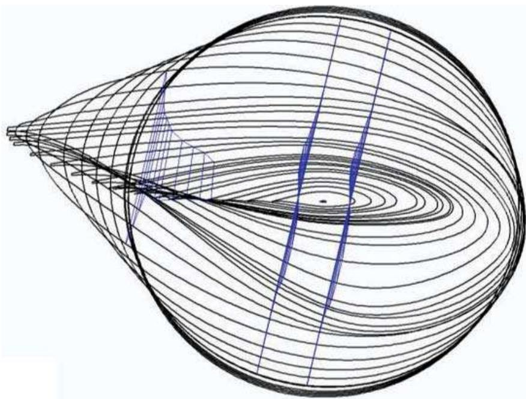

natural_image

3D wireframe surface plot showing concentric curved lines and a central axis, no text or symbols present

Figure 7.1 Blade cross-sectional outlines at stations along the length of a 100 m blade. Also shown are the positions of the two main shear webs and the additional trailing edge shear web at each station. Source: Reproduced from Sandia report ‘The SNL 100-01 Blade: Carbon Design Studies for the Sandia 100-Metre Blade’ (Grifrth 2013)

Instead, resort must be made to numerical methods based on blade-element/momentum theory – for example, using Eqs. (3.54c) and (3.55a) in Section 3.9.6.

For pitch-regulated machines, the annual energy capture attributed to the annular ring swept out by each blade element is determined for the chosen wind speed distribution and the variation of energy capture with blade chord and twist at each ‘blade station’ computed. In this way, the values of blade chord and twist at each ‘blade station’ yielding maximum energy capture are identired.

For stall-regulated machines, the method is similar, but the total annual energy capture has to be maximised within the constraint of limiting the maximum total power output to the machine rating. The results of such an investigation are reported in ‘A Design Study of a 1 MW Stall-Regulated Rotor’ by Fuglsang and Madsen (1995).

# 7.1.3 Practical modiJcations to optimum aerodynamic design

The result of the optimisation described in the previous section is typically a blade geometry in which both blade chord and blade twist vary approximately inversely with radius, as illustrated in Figure 3.19. However, because the inboard section of the blade makes only a small contribution to total power output (Figure 3.30), the aerofoil section is generally not continued inboard of about 15% radius in practice, and the chord at this radius is substantially reduced, to perhaps half the theoretical optimum. It is then often found expedient to taper the chord uniformly over the active length of the blade, with the tip chord and chord taper set so that the chord distribution approximates closely to the optimum over the outboard half of the blade (Figure 3.20).

The blade root area is normally circular in cross-section to match up with the pitch bearing in the case of pitchable blades or to allow pitch angle adjustment at the bolted sange (to compensate for non-standard air density) in the case of stall-regulated blades. The transition from the root section to the aerofoil section outboard of 15% radius should be a smooth one for structural reasons, with the result that the latter section will have a high thickness to chord ratio of up to about 50%.

Contrary to the general rule, one manufacturer, Enercon, has found it worthwhile to extend the aerofoil over the inboard section of the blade all of the way to the fairing enclosing the rotor hub on some of its designs.

# 7.1.4 Structural design criteria

The blade structure must be able to

• Resist extreme loads – i.e. satisfy the ultimate limit state (ULS).   
• Resist fatigue loads.   
• Limit desections to maintain adequate tip clearance.   
• Avoid aeroelastic instability.

• Achieve blade natural frequencies that are not susceptible to excitation at the blade passing frequency or its harmonics.

Blade structures are typically thin-walled shells, so buckling is a possibility under compression and must be allowed for in the investigation of the ULS.

In the case of unconed, straight blades, it is sometimes necessary to add material to increase blade stiffness to meet the tip clearance requirement. However, this can be avoided by coning the rotor and/or introducing forward pre-bend of the blade to increase the clearance.

# 7.1.5 Form of blade structure

A hollow shell corresponding to the blade envelope derned by the aerofoil section clearly provides a simple, efrcient structure to resist sexural and torsional loads, and some blade manufacturers have adopted this form of construction (see Figure 7.2).

However, there is greater benert in concentrating skin material in the forward half of the blade, where the blade thickness is a maximum, so that it acts more efrciently in resisting out-of-plane bending moments (see Figures 7.3 and 7.4). The weakened areas of the shell towards the trailing edge are then typically stiffened by means of sandwich construction utilising a PVC foam rlling.

The hollow shell structure derned by the aerofoil section is not very efrcient at resisting out-of-plane shear loads, so these are catered for by the inclusion of one or more shear webs oriented perpendicular to the blade chord.

An increasingly common form of construction is the use of longitudinal sange elements known as spar caps in conjunction with shear webs to form one or two I-beams. A typical arrangement with two I-beams is shown in Figure 7.5. The spar caps conform to the local aerodynamic prorle, and the perimeter of the aerofoil section is completed by foam or balsa sandwich panels.

The efrciency of the cross-section in resisting sapwise bending moments can be improved by replacing the separate spar caps attached to each shear web by a single spar cap spanning between them, as this increases the lever arm – see Figure 7.6. However,

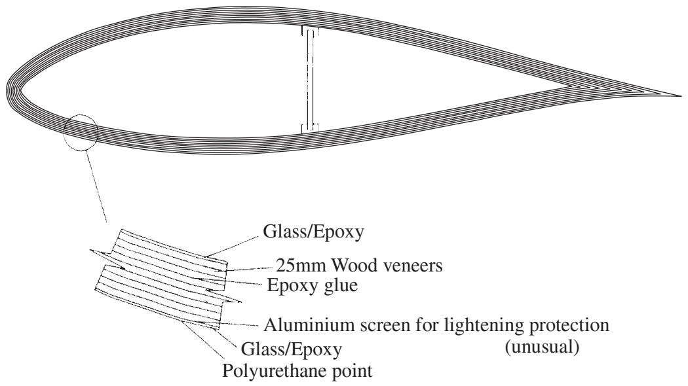

text_image

Glass/Epoxy
25mm Wood veneers
Epoxy glue
Aluminium screen for lightening protection
(unusual)
Glass/Epoxy
Polyurethane point

Figure 7.2 Wood-epoxy blade construction utilising full blade shell. Source: Reproduced from Corbet (1991) by permission of the RTI Renewable Energy R&D Programme

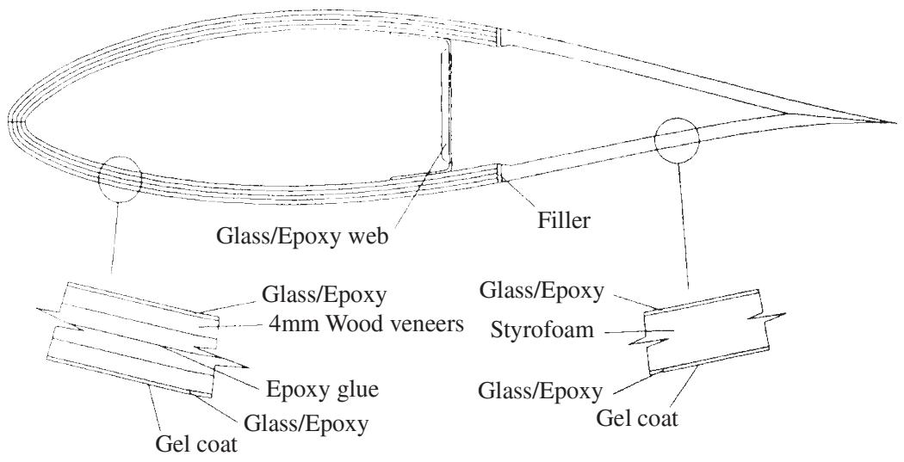

text_image

Glass/Epoxy web
Filler
Glass/Epoxy
4mm Wood veneers
Epoxy glue
Glass/Epoxy
Gel coat
Glass/Epoxy
Styrofoam
Glass/Epoxy
Gel coat

Figure 7.3 Wood-epoxy blade construction utilising forward half of blade shell. Source: Reproduced from Corbet (1991) by permission of the RTI Renewable Energy R&D Programme

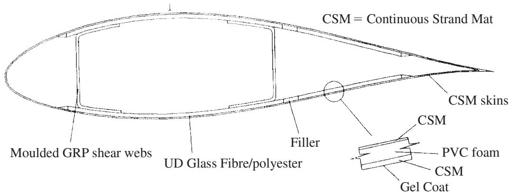

text_image

CSM = Continuous Strand Mat
CSM skins
CSM
CSM
PVC foam
CSM
Gel Coat
Moulded GRP shear webs
UD Glass Fibre/polyester
Filler

Figure 7.4 Glass rbre blade construction using blade skins in forward portion of blade cross-section and linking shear webs. Source: Reproduced from Corbet (1991) by permission of the RTI Renewable Energy R&D Programme

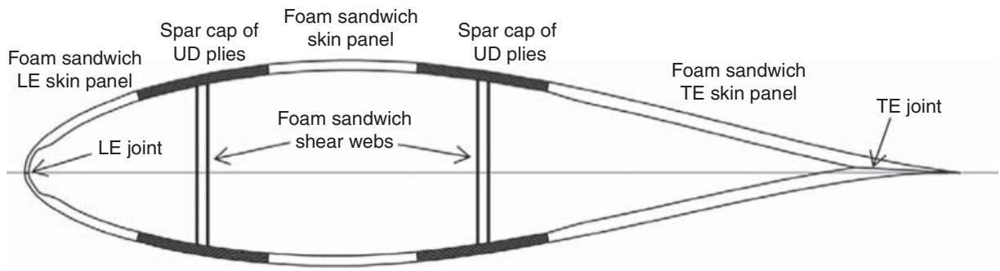

text_image

Foam sandwich
LE skin panel
Spar cap of
UD plies
Foam sandwich
skin panel
Spar cap of
UD plies
LE joint
Foam sandwich
shear webs
Foam sandwich
TE skin panel
TE joint

Figure 7.5 Glass rbre blade construction with twin I-beams, each formed of spar caps and a linking shear web. The remainder of the aerofoil perimeter is formed of foam sandwich panels

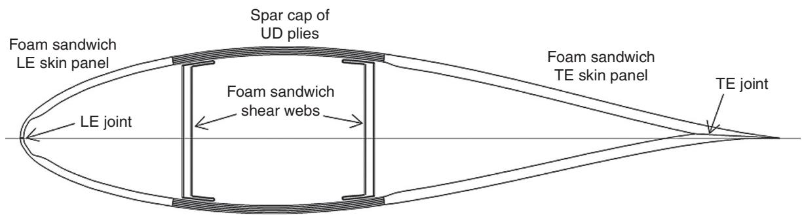

text_image

Foam sandwich
LE skin panel
Spar cap of
UD plies
LE joint
Foam sandwich
shear webs
Foam sandwich
TE skin panel
TE joint

Figure 7.6 Glass rbre blade construction with box section spar consisting of spar caps and linking shear webs. Note that the shear webs are shown with integral sanges, enabling the width of the bonded joint to the spar caps to be signircantly increased. The remainder of the aerofoil perimeter is formed of foam sandwich panels

this is at the expense of reducing the ability to resist edgewise moments, assuming no change in the total cross-sectional area of spar cap. The spar caps typically consist of mainly unidirectional (UD) plies of constant width, but taper down in thickness with increasing radius.

The shear webs will normally be of sandwich construction, with biaxial plies, in which the rbres are aligned at $+ 4 5 / - 4 5 ^ { \circ }$ to the blade radius, forming the outer skins.

The sandwich panels between the spar caps and the leading and trailing edges contribute to both sapwise and edgewise bending resistance as well as the transmission of edgewise shear, so their outer skins comprise both UD and biaxial plies. The thickness of these panels is driven by resistance to buckling. Additional material is sometimes added at the trailing edge to increase the resistance of the cross-section to edgewise bending.

Although the outboard portion of the blade beyond the maximum chord position is characterised by progressive reductions in chord and thickness roughly corresponding to the reduction in bending moments, the reduction in chord between the maximum chord position and the hub does not match the rapid increase in edgewise moment there, requiring a disproportionate increase in material at the leading and trailing edges towards the root. Thus, while spar caps perform a key role in resisting sapwise bending moments outboard of the maximum chord position, they are not required at the blade root, because the best structural cross-section to resist out-of-plane and in-plane root bending moments of similar magnitude is a cylindrical shell of uniform thickness. Thus the inboard portion of the blade is characterised by a gradual transition from the uniform cylindrical shell at the root to the more complicated cross-section of spar caps, sandwich panels, and shear webs at the maximum chord position.

# 7.1.6 Blade materials and properties

The ideal material for blade construction will combine the necessary structural properties – namely, high strength to weight ratio, fatigue life, and stiffness – with low cost and the ability to be formed into the desired aerofoil shape.

Table 7.1 lists the structural properties of the materials in general use for blade manufacture and those of some other candidate materials. In the case of composites, there is a great variation in properties depending on the rbre volume fraction and the rbres and matrices used, so the values quoted are simply representative examples. For comparative purposes, values are also presented for

• Compressive strength to weight ratio.   
• Fatigue strength as a percentage of compressive strength.   
• Stiffness to weight ratio

It is evident that glass rbre composites (i.e. GFRP) have a substantial higher compressive strength to weight ratio compared with wood and metals. However, this apparent advantage is not as decisive as it appears, for two reasons. First of all, the rbres of some of the plies making up the laminated blade shell have to be aligned off-axis (typically at $\pm 4 5 ^ { \circ } )$ to resist shear loads, giving reduced strengths in the axial direction. Secondly, the relatively low Young’s modulus of these composites means that blade tip desection or resistance to buckling of the thin skins governs the design rather than simple compression yielding. Design against buckling is considered in Section 7.1.16.

Carbon rbre composites (i.e. carbon rbre reinforced polymer [CFRP]) offer signircant benerts in terms of reduced tip desections, as industrial grade carbon rbres have a Young’s modulus about three times that of E-glass.

It should be noted that the low strength of wood laminate compared with other materials renders it unsuitable for blades with slender chords operating at high tip speed, where the sapwise bending moments during operation are inevitably high in relation to blade thickness. For example, Jamieson and Brown (1992) have shown that, in the case of a family of stall-regulated machines, the blade stress is highly sensitive to rotational speed, increasing as the fourth power, if the skin thickness to chord ratio is maintained constant. Although stresses can be reduced by increasing the skin thickness, this represents a less and less efrcient use of the additional material beyond a skin thickness to chord ratio of 3–4%, especially in the outboard part of the blade, where the blade thickness to chord ratio is low.

Fatigue performance is conveniently measured by mean fatigue strength at 107 cycles, as a percentage of ultimate compressive strength (UCS). Clearly, GFRP, CFRP and khaya/epoxy perform best with a value of about 30%. The low value for welded steel (10%), combined with steel’s low strength to weight ratio, renders it uncompetitive for large diameter machines where gravity fatigue loading becomes important, although it was chosen for some of the early prototype megawatt-scale machines when the fatigue properties of composite materials were less well understood.

The stiffness per unit weight ratio determines blade natural frequency. CFRP has a ratio three or four times larger than those of all of the other materials, which are in a relatively small range (18–27 GPa).

From the above brief survey, it is apparent that the material with the best all-round structural properties is CFRP. However, it has not found common use, because it is an order of magnitude more costly than other materials. Instead, the most popular materials are glass/polyester and glass/epoxy. Wood/epoxy has also been found satisfactory, but its use is limited by the shortage of wood of consistent quality.

Table 7.1 Structural properties of materials for wind turbine blades 

<table><tr><td rowspan="2">Material (NB: UD denotes unidirectional fibres - i.e., all fibres running longitudinally)</td><td>Ultimate tensile strength (UTS) (MPa)</td><td>Ultimate compressive strength (UCS) (MPa)</td><td rowspan="2">Specific gravity (s.g.)</td><td rowspan="2">Compressive strength to weight ratio UCS/s.g. (MPa)</td><td rowspan="2">Mean fatigue strength at  $10^7$  cycles for reverse loading (amplitude) (MPa)</td><td rowspan="2">Mean fatigue strength as percentage of UCS</td><td rowspan="2">Young's modulus, E (GPa)</td><td rowspan="2">Stiffness to weight ratio E/s.g. (GPa)</td></tr><tr><td colspan="2">(mean for composites, minimum for metals)</td></tr><tr><td>1. Glass/polyester UD composite with 50% fibre volume fraction</td><td>860–900 [1][2]</td><td>360–720 [2][1]</td><td>1.85 [2]</td><td>195–390</td><td>140 [3]</td><td>19–39%</td><td>38 [2]</td><td>20.5</td></tr><tr><td>2. Glass/epoxy laminate from PPG-Devold L1200/G50-E07 fabric with 92% UD fibres and 59% fibre volume fraction. Vacuum infused. Values derived from data in [14] unless noted otherwise.</td><td>1025 MPa (standard deviation = ~90 MPa)</td><td>575 MPa (standard deviation = ~15 MPa)</td><td>2.00 (based on typical s.g. values of 2.55 for fibres and 1.2 for resin)</td><td>290</td><td>180</td><td>31%</td><td>44</td><td>22</td></tr><tr><td>3. Carbon fibre/epoxy Hexply 8552 laminate made from Hexcel AS4 carbon fibre with 60% fibre volume fraction and UD lay-up [15][4]</td><td>2205</td><td>1530</td><td>1.55</td><td>985</td><td>480 [5]</td><td>32% [5]</td><td>141</td><td>91</td></tr><tr><td>4. Carbon fibre/glass fibre/epoxy hybrid P2B laminate with 55% fibre volume fraction and [±45/04] lay-up; 85% (by volume) carbon fibre (Newport NCT-307-D1-34-600 pre-preg) in 0 deg direction &amp; 15% (by volume) glass fibre in ±45 deg directions [4][14]</td><td>1550</td><td>1050</td><td>1.57</td><td>670</td><td>560 [16]</td><td>54%</td><td>100</td><td>64</td></tr><tr><td>5. Khaya ivorensis/epoxy laminate</td><td>82 [6]</td><td>50 [6]</td><td>0.55</td><td>90</td><td>15 [7]</td><td>30%</td><td>10 [8]</td><td>18</td></tr><tr><td>6. Birch/epoxy laminate</td><td>117 [9]</td><td>81 [10]</td><td>0.67</td><td>121</td><td>16.5 [7]</td><td>20%</td><td>15 [10]</td><td>22.5</td></tr><tr><td>7. High yield steel (Grade S 355 – formerly Fe 510)</td><td>510</td><td>510</td><td>7.85</td><td>65</td><td>50 [11]</td><td>10%</td><td>210</td><td>27</td></tr><tr><td>8. Weldable aluminium alloy AA6082 (formerly) H30</td><td>295 [12]</td><td>295 [12]</td><td>2.71</td><td>109</td><td>17 [13]</td><td>6%</td><td>69 [12]</td><td>25.5</td></tr></table>

(Continued)

Table 7.1 (continued) 

<table><tr><td>Sources:</td></tr><tr><td>[1] Mayer (1996) Table 2.4.</td></tr><tr><td>[2] Barbero (2018) Table 1.2.</td></tr><tr><td>[3] Mayer (1996) Figure 14.4 – DNVR curve.</td></tr><tr><td>[4] Carbon fibres exhibit a wide range of properties; figures given here are for particular example materials only.</td></tr><tr><td>[5] Based on S-N curve index of m = 14 and an N = 1 amplitude equal to the UCS.</td></tr><tr><td>[6] Bonfield and Ansell (1991). Moisture content = 10%.</td></tr><tr><td>[7] Based on S-N curve index of m = 13.4 for scarf-jointed wood laminates, taken from Hancock and Bond (1995).</td></tr><tr><td>[8] Bonfield et al. (1992).</td></tr><tr><td>[9] Mayer (1996) Table 7.3.</td></tr><tr><td>[10] Hancock (personal communication). Moisture content = 10%.</td></tr><tr><td>[11] Mean value for butt-welded joints with weld profile ground smooth (Class C), taken from BS 5400, Steel Concrete and Composite Bridges – Part 10: Code of Practice for Fatigue (1980).</td></tr><tr><td>[12] CP 118:1969, The Structural Use of Aluminium.</td></tr><tr><td>[13] Mean value estimated from mean minus two standard deviations value for ground butt-welded joint with shallow thickness transition, Detail Cat 221, in IIW, Fatigue Design of Welded Joints and Components (Woodhead, 1996).</td></tr><tr><td>[14] Montana State University, SNL/MSU/DOE Composite Materials Fatigue Database: Mechanical Properties of Composite Materials for Wind Turbine Blades, Version 25.0 (2016).</td></tr><tr><td>[15] HexTow AS4 product datasheet, downloaded from www.hexcel.com 11 October 2018.</td></tr><tr><td>[16] Based on R = -1 S-N curve reported in Montana State University paper ‘Comparison of Tensile Fatigue Resistance and Constant Life Diagrams for Several Potential Wind Turbine Blade Laminates’ (Samborsky et al. 2007).</td></tr></table>

Steel is the cheapest material in the raw state and can be formed into tapering, curved panels following the aerofoil prorle, except in the sharply curved region near the leading edge. However, it is much harder to introduce a twist into such panels, and this consideration, together with the poor fatigue properties, means that steel is rarely used. By contrast, glass and CFRPs lend themselves to lay-up in half moulds prorled to give the correct aerofoil shape, plan-form, and twist. Laminated wood composite blades are built up in a similar way, but the veneer thickness has to be restricted to enable the veneers to sex to the required curvature during lay-up.

In the following paragraphs, the properties of the materials in most common use for blade manufacture are considered in more detail.

# 7.1.7 Static properties of glass/polyester and glass/epoxy composites

The tensile properties of glass/polyester and glass/epoxy plies with the same rbre volume fraction and lay-up are generally similar – i.e. the insuence of the matrix is slight. However, the matrix properties are more important in compression, as rbre buckling is resisted by the matrix in shear.

The plate elements making up the GFRP blade structure are normally laminates consisting of several plies, with rbres orientated appropriately to resist the design loads. Within a ply (typically 0.5–1.0 mm in thickness), the rbres may be arranged in a variety of different ways. In the simplest case, rbres, in the form of strand, or collections of strands known as rovings, are all be laid in the same direction to form a uniaxial ply – also termed UD (short for unidirectional). Alternatively, the rbres may run in two, three, or even four different directions in a wide variety of woven or non-woven fabrics, to form a biaxial, triaxial, or quadriaxial ply, respectively. Normally the two directions of a biaxial ply are at right angles.

# Glass Abre properties

Glass rbres with differing chemical compositions have been developed for a variety of purposes, and they have been given letter designations resecting their special properties. The glass most commonly used in blade construction is E-glass, which has good structural properties in relation to its cost. The E designation resects another property, its low electrical resistance. R-glass (R for reinforcement) and H-glass with hollow rbres both have superior strength and modulus of elasticity, and their use is increasing, despite their greater cost. Typical chemical compositions and mechanical properties of these glasses are given in Table 7.2, based on information from a number of manufacturers. As shown, the mechanical properties of a particular glass type can vary. This is the result of differing chemical compositions and manufacturing processes. Note that the strengths of resin impregnated strands are up to 50% less that the strengths of virgin rlaments.

The strengths of the individual rbres of a particular E-glass are widely dispersed about the mean and are better represented by a Weibull distribution than by a normal distribution. The Weibull shape factor can vary from 3 (wide dispersion) to 7 (narrow dispersion).

Table 7.2 Compositions and properties of E-glass, R-glass, and H-glass 

<table><tr><td colspan="2">Glass type</td><td rowspan="2">E-glass</td><td rowspan="2">R-glass</td><td rowspan="2">H-glass</td></tr><tr><td>Composition</td><td>Units</td></tr><tr><td>Silicate SiO2</td><td>%</td><td>53–57</td><td>55–60</td><td>As E-glass</td></tr><tr><td>Aluminate Al2O3</td><td>%</td><td>12–16</td><td>23–28</td><td></td></tr><tr><td>Borate B2O3</td><td>%</td><td>5–10</td><td>&lt; 0.5</td><td></td></tr><tr><td>Calcium oxide CaO</td><td>%</td><td>16–25</td><td>8–15</td><td></td></tr><tr><td>Magnesium oxide MgO</td><td>%</td><td>0–5</td><td>4–7</td><td></td></tr><tr><td colspan="5">Property</td></tr><tr><td>Specific gravity</td><td></td><td>2.54–2.60</td><td>2.54</td><td>2.61</td></tr><tr><td>Young’s modulus at 23 deg. C</td><td>GPa</td><td>72–80</td><td>86</td><td>87.5</td></tr><tr><td>Elongation at filament break</td><td>%</td><td>4.5–5</td><td>4.8</td><td>4.9</td></tr><tr><td>Mean tensile strength at 23 deg. C – virgin filament</td><td>MPa</td><td>3100–3850</td><td>4125–4450</td><td>4130</td></tr><tr><td>Tensile strength at 23 deg. C – impregnated strand as a percentage of virgin filament strength</td><td>%</td><td>50–70</td><td>70–80</td><td>60–70</td></tr></table>

Table 7.3 Typical matrix properties 

<table><tr><td>Matrix</td><td>Polyester and vinyl ester</td><td>Epoxy</td></tr><tr><td>Specific gravity</td><td>1.1</td><td>1.15–1.3</td></tr><tr><td>Tensile modulus (GPa)</td><td>3.4</td><td>3–5</td></tr><tr><td>Poisson&#x27;s ratio</td><td>0.38</td><td>0.34–0.38</td></tr><tr><td>Tensile strength (MPa)</td><td>50–80</td><td>60–100</td></tr></table>

Source: Taken from Barbero (2018).

# Matrix properties

Typical matrix properties are given in Table 7.3. Polyester used to be the resin of choice, partly because of its low cost, but now epoxy resin is generally preferred because of its slightly better mechanical properties and signircantly reduced shrinkage during curing.

# Uniaxial plies

In general, the testing of multiple samples is required to determine the mechanical properties of individual laminates. However, at the design stage, it is useful to be able to estimate ply properties from the rbre and matrix properties using simple rules, although they are not always very accurate. Thus, for a ply reinforced by UD rbres, the longitudinal stiffness modulus, $E _ { 1 }$ , can be derived accurately from the rule of mixtures formula:

$$
E _ {1} = E _ {f} V _ {f} + E _ {m} \left(1 - V _ {f}\right) \tag {7.3}
$$

where $E _ { \mathrm { f } }$ is the rbre modulus, $E _ { \mathrm { m } }$ is the matrix modulus, and $V _ { \mathrm { f } }$ is the rbre volume fraction. However, the inverse form of this formula – e.g.

$$
\frac {1}{E _ {2}} = \frac {(1 - V _ {f})}{E _ {m}} + \frac {V _ {f}}{E _ {f}} \tag {7.4}
$$

signircantly underestimates the transverse modulus, $E _ { 2 }$ , and the in-plane shear modulus, $G _ { 1 2 }$ . More accurate formulae based on more sophisticated models are given in Barbero (2018). In particular, the Halpin–Tsai semi-empirical formula:

$$
E _ {2} = E _ {m} \left[ \frac {1 + 2 \eta V _ {f}}{1 - \eta V _ {f}} \right] \text { where } \eta = \frac {(E _ {f} / E _ {m}) - 1}{(E _ {f} / E _ {m}) + 2} \tag {7.5}
$$

and the cylindrical assemblage model formula:

$$
G _ {1 2} = G _ {m} \left[ \frac {(1 + V _ {f}) + (1 - V _ {f}) G _ {m} / G _ {f}}{(1 - V _ {f}) + (1 + V _ {f}) G _ {m} / G _ {f}} \right] \tag {7.6}
$$

provide more accurate estimates of transverse modulus and in-plane shear modulus, respectively.

The longitudinal tensile strength of a ply reinforced by UD rbres, $\sigma _ { \mathrm { l t } }$ , can be estimated from

$$
\sigma_ {1 t} = \sigma_ {f u} \left[ V _ {f} + \frac {E _ {m}}{E _ {f}} (1 - V _ {f}) \right] \tag {7.7a}
$$

where $\sigma _ { \mathrm { f u } }$ is the ultimate tensile strength (UTS) of the rbres. However, as noted previously, the tensile strengths of pristine glass rlaments cannot be realised in a composite, so $\sigma _ { \mathrm { f u } }$ can only be obtained by back-calculation using Eq. (7.7a) from test results on samples of composite manufactured in a similar way. These indicate rbre strength reductions of up to 50%, so a value of $\sigma _ { \mathrm { f u } }$ of 1750 MPa can be used in Eq. (7.7a) in the rrst instance.

It is clear from Eq. (7.7a) that the longitudinal strength of a UD ply increases linearly with rbre volume fraction. However, it is found that the failure strain exhibits much less dependence on volume fraction, so it is a useful proxy for ply strength, which is related to failure strain, $\varepsilon _ { \mathrm { l t } } .$ , by

$$
\sigma_ {1 t} = \varepsilon_ {1 t} [ E _ {f} V _ {f} + E _ {m} (1 - V _ {f}) ] \tag {7.7b}
$$

For their design of a blade for a 10 MW turbine, the Danish Technical University (DTU), took a UD ply characteristic failure strain value of 2.1% (Bak et al. 2013), which compares with the 2.44% value adopted by Sandia National Laboratories for their 100 m blade design (Grifrth and Ashwill 2011). Both values are roughly in line with the mean failure strains in the range 2.7–3.0% reported for a series of static tests on four different UD composites in the US Department of Energy (DOE)/Montana State University (MSU) Composite Materials Fatigue Database published by MSU in 2010.

As noted earlier, the glass rbre strengths are widely dispersed, with the result that, as the tensile loading on a specimen is increased, more and more rbres fail. Eventually the load increment due to a small strain increase is balanced by the loss of load due to rbre failures, and the ultimate strength of the specimen is reached. This behaviour is illustrated in Figure 7.7, where the strength distribution of individual rbres and the mean rbre stress are plotted out against strain assuming a Weibull distribution of rbre strength of the form

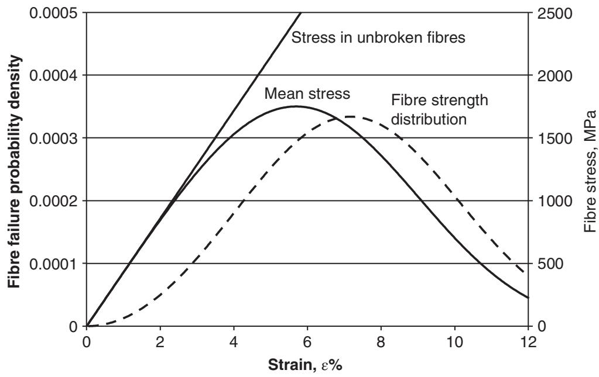

line

| Strain, ε% | Fibre failure probability density | Fibre stress, MPa |
| ---------- | ---------------------------------- | ----------------- |
| 0          | 0.0000                             | 0                 |
| 2          | 0.0002                             | 500               |
| 4          | 0.0003                             | 1000              |
| 6          | 0.00035                            | 1500              |
| 8          | 0.0003                             | 1200              |
| 10         | 0.0002                             | 800               |
| 12         | 0.0001                             | 400               |

Figure 7.7 Failure strain distribution of individual rbres compared with plot of mean rbre stress against strain

$$
F (\sigma) = 1 - \exp \left[ - \left(\frac {\sigma}{\beta}\right) ^ {m} \right] \tag {7.8}
$$

where $\beta$ is the scale factor and m is the shape factor, taken as 3.

The proportion of unbroken rbres attaining the stress $\sigma$ is 푒푥푝 $\begin{array} { r } { \left[ - \Big ( \frac { \sigma } { \beta } \Big ) ^ { m } \right] } \end{array}$ , so the average stress in all rbres is given by

$$
\sigma_ {e f f} = \sigma e x p \left[ - \left(\frac {\sigma}{\beta}\right) ^ {m} \right] \tag {7.9}
$$

This reaches a maximum at $\begin{array} { r } { \sigma = \frac { \beta } { m ^ { \frac { 1 } { m } } } } \end{array}$ 1 of 휎eff .푚푎푥 $\begin{array} { r } { \sigma _ { e f f . m a x } = \frac { \beta } { ( e . m ) ^ { \frac { 1 } { m } } } \cdot } \end{array}$ i.e. 0.4968훽 for $m = 3$ . In Figure 7.7, $\sigma _ { e f f . m a x }$ is taken as 1750 MPa, giving a scale factor $\beta$ of 3522 MPa and a UTS of 1000 MPa (assuming a $7 5 \mathrm { G P a }$ rbre modulus and 0.55 rbre volume fraction). The stress in the unbroken rbres at specimen failure, $\begin{array} { r } { \sigma = \frac { \beta } { \underline { { \mathrm { ~ 1 ~ } } } } } \end{array}$ , is 2442 MPa. Note that the mean strength of individual rbres, $\beta \Gamma ( 1 + 1 / m )$ m m , is 3145 MPa, well above the average stress in the rbres at the failure of the composite.

The longitudinal compressive strength of a ply reinforced by UD rbres is always signircantly less than the tensile strength because of microbuckling of the rbres, which is governed by the shear strength of the matrix and the degree of rbre misalignment – see Barbero (1998). Typically, the longitudinal compressive strength is between 50% and 70% of the tensile strength. DTU assumed a characteristic compressive failure strain of 1.5% for their 10 MW turbine blade design (Bak et al. 2013).

# Biaxial plies

Biaxial plies are formed by impregnating fabrics with rbres in two directions normally at right angles. In wind turbine blades, biaxial plies are used with the rbres aligned at $\pm 4 5 ^ { \circ }$ to the blade axis to resist shear loading. As the compression stress in one set of rbres is equal to the tensile stress in the other set, the shear strength is governed by the rbre compression strength.

The ply compression resistance in the $+ 4 5 ^ { \circ }$ direction is made up of the longitudinal resistance of the $+ 4 5 ^ { \circ }$ rbres and associate matrix, $\sigma _ { \mathrm { f c u } } . ( V _ { \mathrm { f } } + [ 1 ~ - ~ V _ { \mathrm { f } } ] E _ { \mathrm { m } } / E _ { \mathrm { f } } ) / 2$ , and the transverse resistance of the $- 4 5 ^ { \circ }$ rbres and associate matrix, $\sigma _ { \mathrm { f c u } } . ( E _ { 2 } / E _ { \mathrm { f } } ) / 2$ , assuming that they are subject to the same strain $\sigma _ { \mathrm { f c u } } / E _ { \mathrm { f } } - \mathrm { i } . \mathsf { e . } \ \sigma _ { \mathrm { f c u } } . ( V _ { \mathrm { f } } + ( 1 - V _ { \mathrm { f } } ) E _ { \mathrm { m } } / E _ { \mathrm { f } } + ( E _ { 2 } / E _ { \mathrm { f } } ) ) / 2$ in total. Hence, assuming equal and opposite stresses act in the $- 4 5 ^ { \circ }$ direction, it is easy to show that the ply shear resistance is given by

$$
\tau_ {u} = \sigma_ {f c u} \left(V _ {f} + (1 - V _ {f}) \frac {E _ {m}}{E _ {f}} + \frac {E _ {2}}{E _ {f}}\right) \tag {7.10}
$$

# Triaxial laminate

The inner and outer skins of the sandwich panels forming the blade shell are often triaxial laminates designed to resist both in-plane shear and axial loading due to blade sexure. Accordingly, they are constructed of a mixture of +45/−45 biaxial plies and uniaxial (0∘) plies.

Clearly the biaxial plies can make a useful contribution to the axial strength, and this can be estimated by multiplying the modulus of the biaxial plies in axial direction, referred to here as $E _ { 4 5 }$ , by the axial strain in the UD plies. To derive the required modulus, we consider the two stress distributions in the biaxial plies shown in Figure 7.8, which together are equivalent to the axial stress, 휎.

The rrst stress distribution is one of uniform tension in all directions, resulting in uniform strain in all directions. The stiffness of the laminate under this loading can be derived as follows. First consider a UD ply subject to longitudinal and transverse stresses $\sigma _ { 1 }$ and $\sigma _ { 2 }$ . The resulting strains are given by the equations $\begin{array} { r } { \varepsilon _ { 1 } = \frac { \sigma _ { 1 } } { E _ { 1 } } - \nu _ { 2 1 } \frac { \sigma _ { 2 } } { E _ { 2 } } } \end{array}$ 휎1E − 휈21 휎2E and 휀2 = −휈12 휎1E $\begin{array} { r } { \varepsilon _ { 2 } = - \nu _ { 1 2 } \frac { \sigma _ { 1 } } { E _ { 1 } } + \frac { \sigma _ { 2 } } { E _ { 2 } } } \end{array}$ which can be solved to give the stresses in terms of strains as follows:

$$
\sigma_ {1} = \frac {E _ {1}}{\Delta} (\varepsilon_ {1} + \nu_ {2 1} \varepsilon_ {2}) \text {   and   } \sigma_ {2} = \frac {E _ {2}}{\Delta} (\varepsilon_ {2} + \nu_ {1 2} \varepsilon_ {1}) \text {   where   } \Delta = 1 - \nu_ {1 2} \nu_ {2 1} \tag {7.11}
$$

Noting that $E _ { 1 } \nu _ { 2 1 } = E _ { 2 } \nu _ { 1 2 }$ by the reciprocal theorem, we obtain

$$
\sigma_ {1} = \frac {1}{\Delta} (\varepsilon_ {1} E _ {1} + \nu_ {1 2} \varepsilon_ {2} E _ {2}) \tag {7.12}
$$

Now consider a $0 / 9 0 ^ { \circ }$ biaxial laminate subjected to a uniform strain, 휀, in both directions. The stress in both the $0 ^ { \circ }$ and $9 0 ^ { \circ }$ directions will be the average of the expressions $\sigma _ { 1 }$ and $\sigma _ { 2 }$ above with 휀 substituted for $\varepsilon _ { 1 }$ and $\varepsilon _ { 2 } - \mathrm { i } . \mathrm { e } .$ .

$$
\sigma = \varepsilon \left(\frac {E _ {1} + E _ {2}}{2 \Delta} + \frac {\nu_ {1 2} E _ {2}}{\Delta}\right) \tag {7.13}
$$

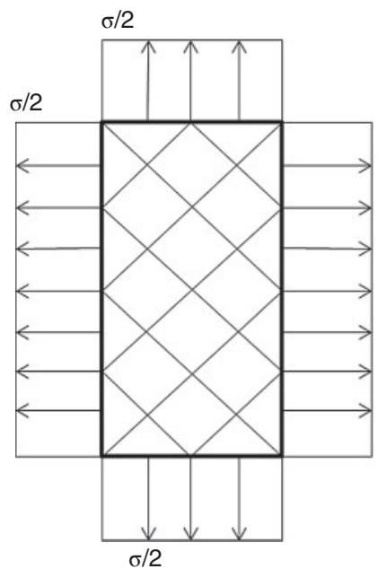

text_image

σ/2
σ/2
σ/2

Uniform tension in all directions

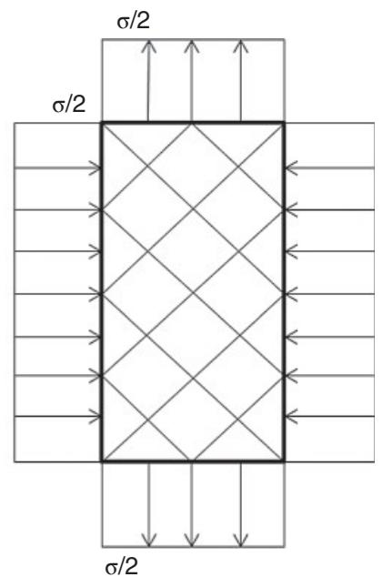

text_image

σ/2
σ/2
σ/2

Uniform tension in axial direction and uniform compression of same magnitude in transverse direction   
Figure 7.8 Two stress distributions on $\mathrm { a } + 4 5 / - 4 5 ^ { \circ }$ laminate, which, when combined, result in axial tensile stress of 휎

Hence the laminate stiffness under uniform loading in both directions is

$$
\overline {{E}} = \left(\frac {E _ {1} + E _ {2}}{2 \Delta} + \frac {\nu_ {1 2} E _ {2}}{\Delta}\right) \tag {7.14}
$$

The second stress distribution in the $+ 4 5 / - 4 5 ^ { \circ }$ laminate consists of uniform tension, 휎/2 in the axial direction and uniform compression of the same magnitude in the transverse direction, which is equivalent to a pure shear $\tau = \sigma / 2$ with respect to the $+ 4 5 / - 4 5 ^ { \circ }$ rbre directions. This results in a shear strain of $\sigma / ( 2 G _ { 1 2 } )$ , where $G _ { 1 2 }$ is the shear modulus of both the +45 and $- 4 5 ^ { \circ }$ plies. The corresponding axial strain is $\sigma / ( 4 G _ { 1 2 } )$ .

The total strain in the axial direction resulting from the combination of the stress distributions in Figure 7.8 is:

$$
\frac {\sigma}{2 \bar {E}} + \frac {\sigma}{4 G _ {1 2}} = \frac {\sigma}{2} / \left(\frac {E _ {1} + E _ {2}}{2 \Delta} + \frac {\nu_ {1 2} E _ {2}}{\Delta}\right) + \frac {\sigma}{4 G _ {1 2}} = \sigma \left(\frac {\Delta}{E _ {1} + E _ {2} + 2 \nu_ {1 2} E _ {2}} + \frac {1}{4 G _ {1 2}}\right) \tag {7.15}
$$

Hence the axial stiffness of the $+ 4 5 / - 4 5 ^ { \circ }$ laminate, denoted $E _ { 4 5 } ,$ , is $\begin{array} { r } { 1 / \left( \frac { \Delta } { E _ { 1 } + E _ { 2 } + 2 \nu _ { 1 2 } E _ { 2 } } + \frac { 1 } { 4 G _ { 1 2 } } \right) } \end{array}$ It is largely governed by the ply shear modulus $G _ { 1 2 } . \mathrm { ~ A ~ }$ 4G12 calculation of +45/−45 laminate axial stiffness is set out in the example below. The result is about 1/3 the longitudinal stiffness of a UD ply, so the contribution of the biaxial plies to the axial stiffness of a triaxial laminate is clearly a useful one.

Example 7.1 Calculate the axial stiffness of $\dot { \bf a } + 4 5 / - 4 5 ^ { \circ }$ laminate. Assume $E _ { \mathrm { f } } = 7 5 \mathrm { { G P a } }$ , $E _ { \mathrm { m } } = 4 \mathrm { G P a } , \nu _ { \mathrm { f } } = 0 . 3 8 , \nu _ { \mathrm { m } } = 0 . 2 2$ with a rbre volume fraction of 0.55.

First of all, the stiffness properties of a uniaxial ply are calculated, as follows:

$E _ { 1 } = 4 3 . 0 5 \mathrm { G P a }$ from Eq. (7.3), $E _ { 2 } = 1 4 . 6 6 \mathrm { G P a }$ from $\mathrm { E q . } ( 7 . 5 ) , \nu _ { 1 2 } = 0 . 2 9 2$ from the rule of mixtures, $G _ { 1 2 } = 4 . 3 5 3 \mathrm { G P a }$ from Eq. (7.6), and $\varDelta = 0 . 9 7 0 9 6$ from Eq. (7.11).

The biaxial laminate stiffness under uniform loading in both directions, ${ \overline { { E } } } ,$ is given by Eq. (7.14) as $[ ( 4 3 . 0 5 + 1 4 . 6 6 ) / 2 + 0 . 2 9 2 ( 1 4 . 6 6 ) ] / 0 . 9 7 0 9 6 = 3 4 . 1 3 \mathrm { G P a }$ .

The axial stiffness of the $+ 4 5 / - 4 5 ^ { \circ }$ laminate, $E _ { 4 5 }$ , is given by

$$
\frac {1}{E _ {4 5}} = \frac {1}{2 \overline {{E}}} + \frac {1}{4 G _ {1 2}} = \frac {1}{2 (3 4 . 1 3)} + \frac {1}{4 (4 . 3 5 3)} = 0. 0 1 4 6 5 + 0. 0 5 7 4 3 = 0. 0 7 2 0 8 \mathrm{GPa} ^ {- 1}
$$

resulting in $E _ { 4 5 } = 1 3 . 8 7 \mathrm { G P a }$ .

# 7.1.8 Fatigue properties of glass/polyester and glass/epoxy composites

Composites are manufactured from a wide variety of rovings and fabrics utilising different matrices and manufacturing processes. This fact, combined with the inherent variability in the raw materials, lay-up, resin application, and curing, means that the characterisation of composite fatigue properties is a challenging undertaking, requiring extensive programmes of testing. This section can only provide a brief introduction to a complicated subject. For an in-depth survey, the reader is referred to Nijssen (2007).

# S-N curves

S-N curves are normally derived by rtting a curve to a lifetime vs stress plot of constant amplitude fatigue test results. When expressed in terms of stress, the fatigue properties of composite laminates extend over a wide range, depending on rbre volume fraction and the number of plies with rbres in the longitudinal direction. However, data from constant stress amplitude fatigue test results becomes much more intelligible if stress ranges are converted into initial strain ranges, allowing the fatigue properties of composites with different lay-ups to be compared. (The Young’s modulus of a composite reduces over time during a fatigue test – hence the need to specify that the strain range is measured at the start of the test.)

The fatigue behaviour of composites depends on both the stress range and the mean stress level, which can both be described in terms of the maximum stress, $\sigma _ { \mathrm { m a x } } ,$ , and the ratio of minimum to maximum stress, R. It is convenient initially to consider fatigue behaviour under reverse loading, i.e. with $R = - 1$ , for which the mean stress is zero, and then relate behaviour at other R ratios to it.

It should be noted that there is no agreed convention governing which stress or strain parameter should be used for S-N curves for composites. The amplitude or maximum value of stress or strain are both regularly used.

The constant amplitude fatigue behaviour of glass rbre composites can best be characterised either by a power law relationship between the number of cycles and the stress or strain amplitude, viz.:

$$
\varepsilon = \varepsilon_ {0} N ^ {- 1 / m} \text {   or   } N = K \varepsilon^ {- m} \text {   where   } K = (\varepsilon_ {0}) ^ {m} \text {   or   } \log N = \log K - m \log \varepsilon \tag {7.16}
$$

or by a linear relationship between the logarithm of the number of cycles and the stress or strain amplitude, viz.:

$$
\log N = a - b \log \varepsilon \tag {7.17}
$$

but the rrst relation is the one in most common use.

Echtermeyer et al. (1996) carried out a regression analysis on a total of 111 constant amplitude, reverse loading fatigue test results for 10 different laminates tested at DnV, assuming that they all conformed to the same ε-N curve, and obtained values for $\varepsilon _ { \boldsymbol { 0 } } .$ , log K, and m of 2.84%, 3.552, and 7.838, respectively, with a standard deviation of log N of 0.437. The DnV regression line is compared with another derived from 19 tests on a $0 ^ { \circ } / + 4 5 ^ { \circ } , - 4 5 ^ { \circ }$ laminate at ECN, giving $\varepsilon _ { 0 } = 2 . 3 4 \%$ , log $K = 3 . 7 7 5$ , and $m = 1 0 . 2 0 4$ , in Figure 7.9. The researchers did not constrain the regression lines to pass through the strain value at either UTS or UCS at log $N = 0$ (ca 2.4% and $2 . 0 \% ) \div$ : had they done so, the DnV line would have had a shallower slope – i.e. a larger value of m. After comparison with regressions on other fatigue test datasets, they concluded that the DnV line provided a reasonable basis for initial design.

There is no clear consensus as to whether S-N or ε-N regression lines should be constrained to pass through the static test values at $N = 1$ . Although the static test can be considered as a single fatigue cycle, the static test strain rate usually differs from that of the fatigue tests, and the maximum tensile load is signircantly affected by the static test rate. Another consideration is that the constraint usually results in a slightly worse rt to the fatigue test data, with negative implications for the accuracy of the extrapolation of the S-N curve beyond $1 0 ^ { 6 }$ cycles, the usual upper limit of testing.

Nevertheless, there is some agreement in relation to the S-N curve slope for reverse loading that can be adopted in the absence of testing. The 2010 edition of the Germanischer Lloyd (GL) Guideline for the CertiScation of Wind Turbines suggests that, if the rbre volume fraction lies between 30% and 55%, the index m can be taken as 9 or 10 for composites with polyester and epoxy matrices, respectively, with the N = 1 strain, $\varepsilon _ { \boldsymbol { 0 } } ,$ taken as the ultimate tensile strain divided by a partial material safety factor. Similar guidance in relation to the index m is provided in the draft IEC CD 61400-5 (2016) standard for the design of wind turbine rotor blades, and m values of 9–10 are quoted for GFRP in the DNVGL standard Rotor Blades for Wind Turbines (2015).

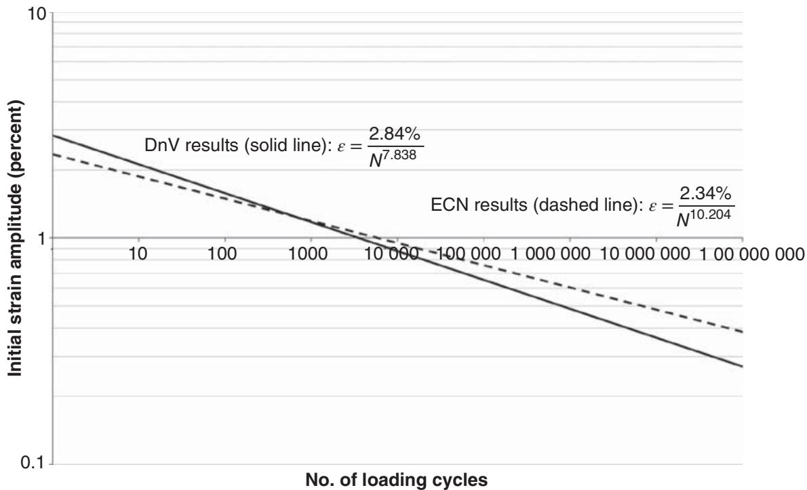

line

| No. of loading cycles | DnV results (solid line) | ECN results (dashed line) |
| --------------------- | ------------------------ | ------------------------- |
| 10                    | 2.84%                    | 2.34%                     |
| 100                   | 2.84%                    | 2.34%                     |
| 1000                  | 2.84%                    | 2.34%                     |
| 10000                 | 2.84%                    | 2.34%                     |
| 100000                | 2.84%                    | 2.34%                     |
| 1000000               | 2.84%                    | 2.34%                     |
| 10000000              | 2.84%                    | 2.34%                     |

Figure 7.9 Strain-life regression lines rtted to results of constant amplitude, reverse loading fatigue tests on GFRP composites

No evidence has been found for the existence of a fatigue limit in the case of GFRP (Nijssen 2007).

# In@uences of Abre content, matrix, and fabric

The fatigue of blade materials has been the subject of in-depth research by the Composite Material Technologies Research Group at MSU, which publishes a comprehensive database of test results and regular research reviews. Some interesting rndings are reported here.

The increased rbre volume fractions made possible by improvements in manufacturing techniques has not been entirely benercial as far as high cycle fatigue performance is concerned. A useful measure of this performance is the $1 0 ^ { 6 }$ cycle fatigue strain, derned as the initial maximum strain corresponding to the stress range that can be endured for one million tensile loading cycles. Table 7.4 compares values at low and high rbre volume content for three different resins reported by Samborsky et al. (2010). It is shown that the million cycle fatigue strains for the three resins at low rbre volume fraction are in a narrow range of 1.1–1.2% but drop signircantly at high rbre volume fraction. The reduction is highest (−62%) for the polyester matrix and lowest (−36%) for the epoxy matrix.

The S-N curve inverse slopes of 9 and 10 for polyester and epoxy matrices, respectively, referred to above imply that the $1 0 ^ { 6 }$ cycle fatigue loading performance of a polyester laminate is about 15% inferior to that of an epoxy laminate under reverse loading, but the divergences in Table 7.4, albeit under tensile loading, suggest that a single inverse slope value is unlikely to be appropriate for all rbre volume fractions.

The fatigue performances of polyester and epoxy resin laminates with high rbre volume fraction (43–55%) and different fabric structures are compared in Table 7.5, based on Samborsky et al. (2012). For the UD laminate with polyester matrix, the million cycle fatigue strain is close to half that of the UD laminate with epoxy matrix, and the difference is only slightly less marked in the case of the multidirectional (MD) laminate.

The glass rbre reinforcement of UD laminates often consists of a fabric of $0 ^ { \circ }$ rbres stitched to a backing of transverse rbres and/or random matting, with the proportion of $0 ^ { \circ }$ rbres typically being in excess of 90%. It has been found that transverse strands and stitching impact negatively on the fatigue performance when compared with aligned strand laminates, with the million cycle tensile strain dropping by approaching 60% when the matrix is polyester or vinyl ester compared with 27% when the matrix is epoxy (Samborsky et al. 2012). Values of the million cycle fatigue strain are compared in Table 7.6. The rbre volume fractions were 64–68% for the aligned strand laminates and 54–58% for the fabric laminates.

Table 7.4 Comparison of $1 0 ^ { 6 }$ cycle maximum tensile strains in laminates with high and low rbre volume fraction and different resins under $R = 0 . 1$ fatigue loading 

<table><tr><td rowspan="2">Fibre volume fraction</td><td colspan="3">Maximum initial tensile strain for  $10^6$  cycles of tensile fatigue loading</td></tr><tr><td>Epoxy matrix</td><td>Vinyl ester matrix</td><td>Polyester matrix</td></tr><tr><td>35–37%</td><td>1.20%</td><td>1.11%</td><td>1.16%</td></tr><tr><td>50–60%</td><td>0.77%</td><td>0.52%</td><td>0.44%</td></tr></table>

Table 7.5 Comparison of $1 0 ^ { 6 }$ cycle maximum tensile strains in laminates with epoxy and polyester matrices under $R = 0 . 1$ fatigue loading 

<table><tr><td rowspan="2">Laminate type</td><td colspan="2">Maximum initial tensile strain for  $10^6$  cycles of tensile fatigue loading ( $R = 0.1$ )</td></tr><tr><td>Epoxy matrix</td><td>Polyester matrix</td></tr><tr><td>UD</td><td>0.81%</td><td>0.41%</td></tr><tr><td>MD containing UD</td><td>0.85%</td><td>0.48%</td></tr><tr><td>Biaxial (+45/–45° strands plus mat and/or strand backing)</td><td>0.56%</td><td>0.43%</td></tr></table>

Table 7.6 Comparison of $1 0 ^ { 6 }$ cycle maximum tensile strains in aligned strand and stitched fabric laminates for different matrices under $R = 0 . 1$ fatigue loading 

<table><tr><td rowspan="2">Laminate type</td><td colspan="3">Maximum initial tensile strain for  $10^6$  cycles of tensile fatigue loading</td></tr><tr><td>Epoxy matrix</td><td>Vinyl ester matrix</td><td>Polyester matrix</td></tr><tr><td>Aligned strand</td><td>1.20%</td><td>1.23%</td><td>0.93%</td></tr><tr><td>Stitched fabric with 92%/4%/4% split between 0° and 90° fibres and matting</td><td>0.88%</td><td>0.53%</td><td>0.39%</td></tr><tr><td>Percentage reduction in  $10^6$ cycle maximum tensile strain for stitched fabric</td><td>-27%</td><td>-57%</td><td>-58%</td></tr></table>

# Constant life diagrams

Constant amplitude tests at other R ratios generally show reducing fatigue lives as the mean stress increases above zero – whether in tension or in compression. It is customary to represent the results on a constant life diagram (or CLD), in which the stress (or strain) range to failure is plotted against mean stress (or strain) for different fatigue lives. Regression analyses can be carried out on families of test results at different R ratios to give a series of $\sigma { - } N$ or ε-N relations in the form of Eq. (7.16), which can be used to plot the CLD, in which the results of each regression analysis are plotted out along a radial straight line corresponding to the appropriate R-value.

Figure 7.10 shows an example CLD constructed from a set of power law S-N curves rtted to MSU fatigue data for an MD laminate designated DD16 (Samborsky et al. 2007). The laminate was fabricated from E-glass non-woven fabric in a polyester matrix using vacuum assisted resin transfer moulding (VARTM – see Section 7.12). The lay-up was $[ 9 0 / 0 / \pm 4 5 ] _ { \mathrm { S } }$ with 53% of rbres in the axial (0∘ ) direction, and the rbre volume fraction was relatively low at 36%. Note that the fatigue performance when the mean stress is tensile is inferior to that when the mean stress is compressive for an R ratio of −0.5/−2.

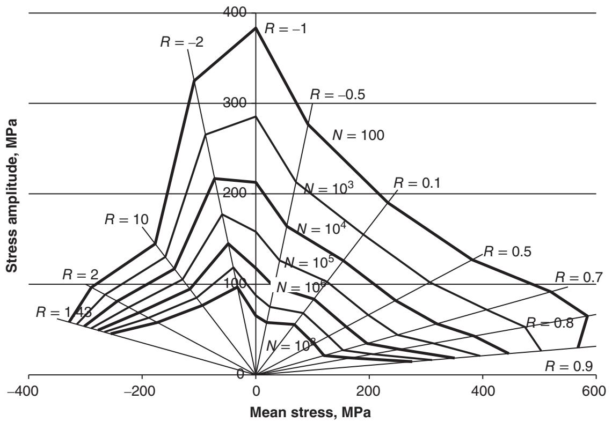  
Figure 7.10 CLD in terms of stress for DD16 MD laminate with 36% rbre volume fraction, based on tests at MSU

Clearly a signircant number of fatigue tests need to be run to characterise the S-N curve at each R ratio, so it is undesirable to investigate fatigue behaviour at more R ratios than necessary. Sutherland and Mandell (2004) computed the damages arising from the action of three different representative blade fatigue load spectra on the DD16 laminate, utilising the CLD reproduced in Figure 7.10, and investigated how the calculated damages changed as the number of R ratios used to produce the CLD was reduced.

One of the fatigue load spectra applied was that for a three bladed upwind turbine, and in this case more than 70% of the damage under edgewise bending occurred for $R = - 0 . 5$ , no doubt resecting a tensile mean stress due to centrifugal loading. In the case of sapwise bending, the damage was slightly more dispersed, with more than 70% of the damage split between $R = 0 . 1$ and $R = 0 . 5$ on the tension bending side of the blade and almost 90% of the damage split between $R = - 1$ and $R = - 0 . 5$ on the compression side. As a result of this concentration of damage, it was found that a CLD constructed from tests at only rve R ratios $( - 2 , - 1 , - 0 . 5 , 0 . 1$ , and 0.7) resulted in a maximum error in lifetime prediction of only 8%, which was deemed to be acceptable. However, the draft IEC CD 61400-5 (2016) standard only requires testing at three representative R-values to satisfy its requirements for ‘full fatigue characterisation’.

The DD16 laminate was an early glass/polyester laminate, which had a rbre volume fraction much lower than is usual in wind turbine blade laminates today. More recent work at MSU (Samborsky et al. 2007) has established the CLD of glass/epoxy triaxial laminate QQ1 with a rbre volume fraction of 53%, which is more representative of current practice, and this is presented in terms of strain in Figure 7.11. The diagram has been derived from the best rt power law S-N curves by dividing the stresses by the laminate longitudinal modulus of 33 GPa. The lay-up was $[ \pm 4 5 / 0 _ { 2 } ] _ { \mathrm { S } }$ , with 64% of rbres in the axial (0∘ ) direction.

It is evident that the performance of laminate QQ1 is signircantly worse in tension at high cycles, both when compared with laminate DD16 and with itself in compression. This was reported to be a common feature of many earlier infused laminates with a high rbre volume fraction.

The fatigue performance of a similar triaxial glass/epoxy laminate, MD2, was investigated as part of the OPTIMAT project, which was a relatively large rotor blade materials research project partially funded by the European Union and completed in 2006. The MD2 rbre volume fraction was similar to that of QQ1 at 54%, and the lay-up was $( [ \pm 4 5 / 0 ] _ { 4 } ; \pm 4 5 )$ , with 55% of rbres in the axial (0∘ ) direction. Figure 7.12 shows the CLD for laminate MD2 in terms of strain derived from the best rt power law S-N curves reported in Krause and Kensche (2006) by dividing the stresses by a representative longitudinal modulus of 27.5 GPa. Also shown for comparison is the CLD for laminate QQ1 (dashed line), and it is apparent that, while a disparity between tensile and compressive fatigue performance remains for laminate MD2, it is less marked than for laminate QQ1.

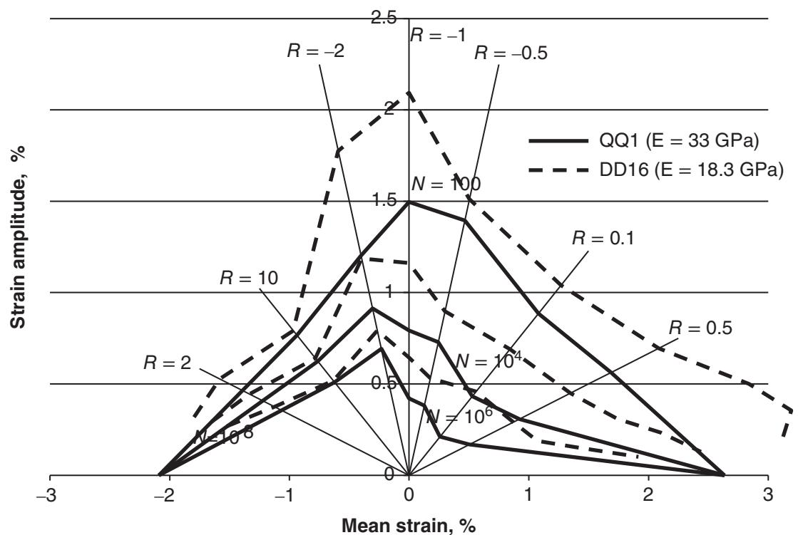

line

| Mean strain, % | Strain amplitude, % (QQ1) | Strain amplitude, % (DD16) |
| -------------- | -------------------------- | --------------------------- |
| -2             | 0                          | 0                           |
| -1             | ~0.5                       | ~1.0                        |
| 0              | 1.5                        | 2.0                         |
| 1              | ~0.5                       | ~1.0                        |
| 2              | 0                          | ~0.5                        |
| 3              | 0                          | ~0                          |

Figure 7.11 CLD in terms of strain for QQ1 triaxial laminate with 53% rbre volume fraction. The CLD for laminate DD16 is also shown (with dashed lines) for comparison, derived from Figure 7.10 using the laminate longitudinal modulus of 18.3 GPa

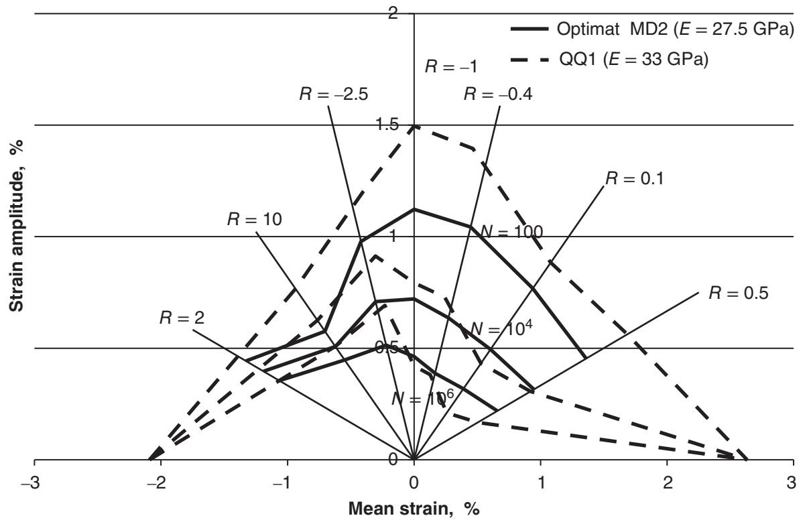

line

| Mean strain, % | Strain amplitude, % (Optimat MD2) | Strain amplitude, % (QQ1) |
| -------------- | ---------------------------------- | ------------------------- |
| -2             | ~0                                 | ~0                        |
| -1             | ~0.5                               | ~1.5                      |
| 0              | ~1.5                               | ~1.0                      |
| 1              | ~1.0                               | ~0.5                      |
| 2              | ~0                                 | ~0                        |
| 3              | ~0                                 | ~0                        |

Figure 7.12 CLD in terms of strain for Optimat MD2 triaxial laminate with 64% rbre volume fraction. The CLD for laminate QQ1 is also shown (with dashed lines) for comparison

# Linear Goodman diagram

In the preliminary stages of design, it is often convenient to use a much simpler, linear version of the CLD known as the Goodman diagram. This is based on the S-N curve for simple reverse fatigue loading (i.e. for R = −1) and assumes that the permitted strain amplitude reduces linearly with increasing mean strain for a given fatigue life, reaching zero at a mean strain corresponding to either the ultimate tensile or compressive strength. Such a linear CLD is shown in Figure 7.13 in terms of characteristic strains, based on an inverse slope of the R = −1 S-N curve of 10. The characteristic strain amplitude for N = 1 of 1.92% is estimated from the corresponding ECN regression line mean strain amplitude of 2.34% (Figure 7.9) by subtracting two standard deviations, assuming a coefrcient of variation (COV) of 9%.

Note that an inherent feature of a linear CLD is that the S-N curves for R-values other than −1 do not plot as straight lines on a log-log plot.

In a linear CLD used for design, the characteristic strains $\varepsilon _ { \mathrm { 0 k } } , ~ \varepsilon _ { \mathrm { t k } }$ , and $\varepsilon _ { \mathrm { c k } }$ in Figure 7.13 are replaced by design values. Thus the design strain amplitude when the mean stress is compressive becomes

$$
\varepsilon_ {d} (\overline {{\sigma}}, N) = \varepsilon_ {0 d} N ^ {- \frac {1}{m}} \left(1 - \frac {\overline {{\sigma}}}{\sigma_ {c d}}\right) \tag {7.18}
$$

where 휀0d $\begin{array} { r } { \varepsilon _ { 0 d } = \frac { \varepsilon _ { 0 k } } { \gamma _ { m f } } , \sigma _ { c d } = \frac { \sigma _ { c k } } { \gamma _ { m u } } , \varepsilon _ { 0 } } \end{array}$ , 휎cd = is the value of 휀 given by the ε-N curve when log N is zero, 훾mf 훾mu $\overline { { \sigma } }$ is the mean stress for the loading cycles under consideration, and $\sigma _ { \mathrm { c d } }$ is the design ultimate compressive stress. $\gamma _ { \mathrm { m f } }$ is the partial safety factor for fatigue strength, $\gamma _ { \mathrm { m u } }$ is the partial safety factor for ultimate strength, and the sufrxes d and k signify design and characteristic values, respectively.

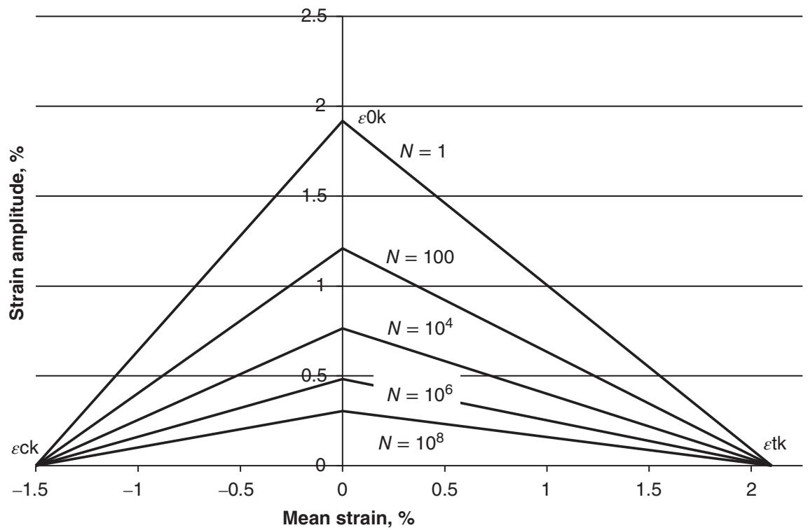

radar

| Mean strain, % | Strain amplitude, % (ε0k) | Strain amplitude, % (εck) |
| -------------- | -------------------------- | -------------------------- |
| -1.5           | 2.0                        | 0.0                        |
| 0              | 2.0                        | 0.5                        |
| 2              | 0.0                        | 0.0                        |

Figure 7.13 Linear CLD in terms of characteristic strains

In the simplired approach for taking account of mean stresses in the DNVGL standard Rotor Blades for Wind Turbines DNVGL-ST-0376 (2015), the CLD is similar to Figure 7.13 but is symmetrical about a strain level midway between the ultimate tensile and compressive strains, with $\varepsilon _ { 0 }$ set equal to the mean of the absolute ultimate tensile and compressive strains. An example CLD is illustrated in Figure 7.14 for $m = 1 0$ , but with the materials safety factors omitted.

Thus the number of cycles permitted for a strain range of $0 . 4 5 / \gamma _ { \mathrm { m f } } \%$ and a mean strain of $0 . 3 / \mathrm { Y _ { m u } } \%$ would be $1 0 ^ { 6 }$ .

# Miner’s damage sum

Equation (7.18), together with its equivalent for mean tensile loading, can be used to calculate the permissible number of load cycles, $N _ { \mathrm { i } } ,$ , for each stress or strain range in the fatigue loading spectrum for the point in the blade cross-section under examination. Theserange, $n _ { \mathrm { i } }$ e then combined with the pre , to yield Miner’s damage sum, $\sum _ { i } { \frac { n _ { i } } { N _ { i } } }$ number of cycles for each stress or strain  , which is normally required to be less than unity.

# Load sequence effects

There is inevitably a degree of uncertainty as regards the accuracy of Miner’s rule in predicting the fatigue damage due to variable amplitude loading from constant amplitude test data, as it is unable to take into account the fatigue loading sequence. To investigate this, fatigue test programmes have been carried out using the WISPER (Wind SPEctrum Reference) and WISPERX variable amplitude fatigue load spectra, which have been devised to be representative of those experienced by wind turbine blades. (WISPERX is a modircation of WISPER in which the large number of small cycles, accounting for approximately 90% of the total, are omitted to reduce test durations.) For each test specimen, the WISPER (or WISPERX) load sequence is scaled to give a chosen maximum stress level and applied repeatedly until the specimen fails.

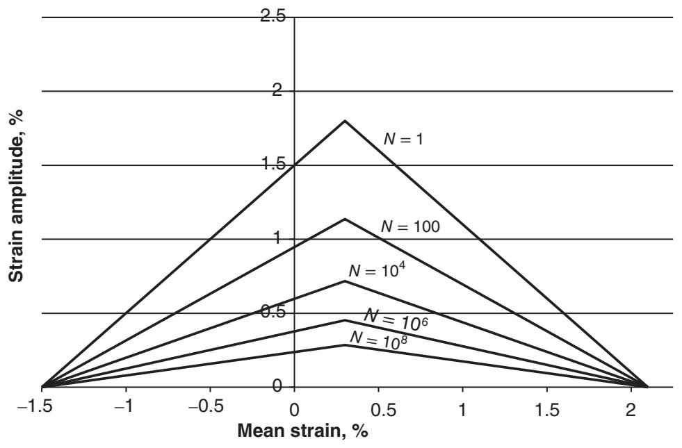

line

| Mean strain, % | N = 1 | N = 100 | N = 10^4 | N = 10^6 | N = 10^8 |
| -------------- | ----- | ------- | -------- | -------- | -------- |
| -1.5           | 0.0   | 0.0     | 0.0      | 0.0      | 0.0      |
| -1.0           | 1.5   | 1.2     | 0.8      | 0.6      | 0.4      |
| -0.5           | 2.0   | 1.8     | 1.2      | 0.9      | 0.6      |
| 0.0            | 2.5   | 2.2     | 1.6      | 1.3      | 0.9      |
| 0.5            | 2.0   | 1.8     | 1.4      | 1.1      | 0.8      |
| 1.0            | 1.5   | 1.4     | 1.2      | 0.9      | 0.7      |
| 1.5            | 1.0   | 1.0     | 1.0      | 0.8      | 0.6      |
| 2.0            | 0.0   | 0.0     | 0.0      | 0.0      | 0.0      |

Figure 7.14 Modired linear CLD in terms of characteristic strains, based on the DNVGL simplired approach

Van Delft et al. (1996) analysed the results of a series of tests carried out at ECN and Delft Technical University on a $0 ^ { \circ } , + / { - 4 5 ^ { \circ } }$ laminate and found that, for a maximum stress of about 150 MPa, the actual fatigue lives of specimens subjected to repetitions of the WISPER or WISPERX load sequences were about 100 times less than predicted for these sequences on the basis of constant amplitude, reverse loading test data, and Miner’s rule, with the effect of mean stress allowed for using the linear relation described above. The R = −1 test data led to an S-N curve given by $N = ( \sigma / \sigma _ { \mathrm { { t u } } } ) ^ { - 1 0 }$ , where 휎 is the amplitude of the stress cycles and $\sigma _ { \mathrm { t u } }$ is the UTS, so the number of cycles to failure for constant amplitude loading at other R-values was taken as $N = \left( \frac { \sigma } { \sigma _ { t u } ( 1 - \overline { { \sigma } } / \sigma _ { t u } ) } \right)$ −10 for a tensile mean and $N = \left( \frac { \sigma } { \sigma _ { t u } ( 1 - \overline { { \sigma } } / \sigma _ { c u } ) } \right) ^ { . }$ −10 for a compressive mean in calculating the Miner’s damage sum. The difference in fatigue lives at the stated maximum stress level quoted above translates to an approximate ratio of 1:1.5 between actual and predicted maximum stress levels of the WISPER sequence to cause failure over the design fatigue life, which would clearly use up a substantial proportion of the safety factors used in design. However, other investigators working with different laminates have found reasonable agreement between measured and predicted fatigue lives under WISPER loading (see chapter entitled ‘Insuence of Spectral Loading’ in Mayer 1996).

Further testing of specimens using repetitions of WISPER and WISPERX load sequences scaled to varying maximum stresses was carried out as part of the OPTIMAT project and the results compared with predictions based on Miner’s damage summations, using both linear and multiple R-value CLDs (Nijssen 2005). The life predictions based on the linear CLDs were found to be between 10 and 100 times greater than the measured lives, with the DNVGL variant being slightly less conservative than the standard one. However, the predictions based on a CLD plotted from S-N curves at six different R-values were much more accurate.

The OPTIMAT project also developed a new reference fatigue load spectrum for test purposes that was designed to be more representative of the sapwise bending loading cycles experienced by pitch-regulated blades on megawatt or multi-megawatt turbines (Bulder 2005).

# Strength degradation models

In strength degradation models, the residual static strength of the composite is taken to reduce monotonically as fatigue loading is applied, with failure occurring when the maximum stress of a fatigue loading cycle exceeds it.

In one of the simpler models, the reduction in static strength under constant amplitude loading is proportional to the number of loading cycles raised a certain power:

$$
S _ {r} = S _ {0} - (S _ {0} - S _ {\max}) \left(\frac {n}{N}\right) ^ {C} \tag {7.19}
$$

where $S _ { r }$ is the residual static strength, $S _ { 0 }$ is the initial strength, $S _ { m a x }$ is the maximum fatigue stress, and C is the strength degradation parameter. The reduction in residual strength during constant amplitude fatigue loading is illustrated in Figure 7.15 for three different strength degradation parameters.

Static testing of specimens subjected to varying proportions of expected fatigue life was carried out to characterise strength degradation as part of the OPTIMAT project (Nijssen 2007). This work demonstrated that when a tensile loading component was present, the tensile strength degradation was approximately linear, with C close to unity. In the case of compression loading, however, very little strength degradation was observed before failure, corresponding to a high value of C.

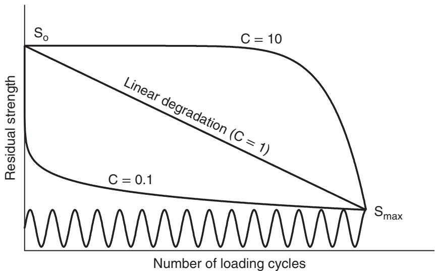

line

| Number of loading cycles | Residual strength (C = 10) | Residual strength (C = 1) | Residual strength (C = 0.1) |
| ------------------------ | -------------------------- | ------------------------- | --------------------------- |
| S₀                       | C = 10                     | C = 1                     | C = 0.1                     |
| S_max                    | C = 10                     | C = 1                     | C = 0.1                     |

Figure 7.15 Reduction of residual strength with number of constant amplitude loading cycles for different strength degradation parameters

The OPTIMAT project went on to investigate the effect of load sequence in a series of tests in which a block of high amplitude fatigue cycles was followed by a block of low amplitude fatigue cycles (high–low loading) and vice-versa. In each case, the rrst block used up half of the nominal fatigue life. Figures 7.16 and 7.17 compare the theoretical residual strength prorles for high–low and low–high loading, respectively, for load levels predicted to result in failure after $1 0 ^ { 4 }$ and $1 0 ^ { 6 }$ cycles. Based on an assumed linear strength degradation, the rgures demonstrate that the Miner’s sum at failure is much higher for high–low loading than for the reverse. The OPTIMAT two-block tests fell into a similar pattern for $R = 0 . 1$ and $R = - 1$ loading.

The OPTIMAT project also compared life predictions for repeated WISPER fatigue loading sequences made using the strength degradation model with those based on the Miner’s damage sum, utilising the full CLD in each case, but found that there was hardly any difference between them (Nijssen 2005).

This led to the conclusion that there is no benert from the use of the signircantly more computationally intensive strength degradation model.

# Fatigue at structural details

Besides the uniform thickness laminates considered previously, a wind turbine blade contains steps in laminate thickness (‘ply drops’) and a variety of joints (e.g. spar to web, spar to sandwich panel, and sandwich panel to sandwich panel at the trailing edge) involving adhesives, which require separate fatigue testing.

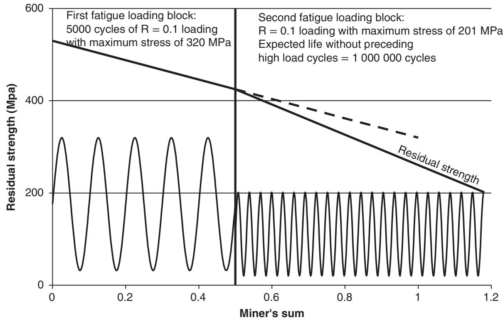

line

| Miner's sum | Residual strength (Mpa) |
| ----------- | ------------------------ |
| 0.0         | 500                      |
| 0.2         | ~300                     |
| 0.4         | ~300                     |
| 0.6         | ~200                     |
| 0.8         | ~200                     |
| 1.0         | ~200                     |
| 1.2         | ~200                     |

Figure 7.16 Two-block high–low $R = 0 . 1$ fatigue loading, with half the predicted number of cycles to failure in the rrst block

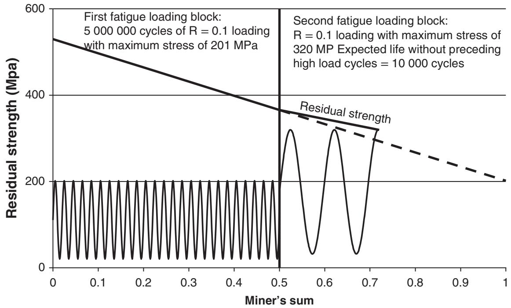

line

| Miner's sum | Residual strength (Mpa) |
| ----------- | ------------------------ |
| 0.0         | 500                      |
| 0.1         | 450                      |
| 0.2         | 400                      |
| 0.3         | 350                      |
| 0.4         | 300                      |
| 0.5         | 250                      |
| 0.6         | 200                      |
| 0.7         | 150                      |
| 0.8         | 100                      |
| 0.9         | 50                       |
| 1.0         | 0                        |

Figure 7.17 Two-block low–high R = 0.1 fatigue loading, with half the predicted number of cycles to failure in the rrst block

# 7.1.9 Carbon Jbre composites

# Carbon Abre properties

Carbon rbres can be separated into two main types, PAN and pitch, according to the raw material used for their manufacture – i.e. polyacrylonitrile and petroleum pitch, respectively. The properties of each type can vary considerably, depending on the manufacturing process, but PAN rbres, which are preferred for wind turbine blades, are generally of higher strength and lower modulus than pitch rbres.

The modulus of elasticity of PAN carbon rbres ranges from 200 to 500 GPa, but cost increases steeply with modulus, so wind turbine blades normally utilise rbres with a modulus at the lower end of this range. Example properties of two such rbres are given in Table 7.7.

Table 7.7 Properties of two PAN carbon rbres used in composites for wind turbine blades 

<table><tr><td>Name of manufacturer and carbon fibre designation</td><td>Zoltek PX35</td><td>Hexcel AS4/12k</td></tr><tr><td>Tensile modulus (GPa)</td><td>242</td><td>231</td></tr><tr><td>Tensile strength (GPa)</td><td>4.137</td><td>4.413</td></tr><tr><td>Elongation %</td><td>1.7</td><td>1.7</td></tr><tr><td>Density (gm/cm3)</td><td>1.81</td><td>1.79</td></tr><tr><td>Fibre diameter (microns)</td><td>7.2</td><td>7.1</td></tr><tr><td>No. of filaments in tow</td><td>50 000</td><td>12 000</td></tr><tr><td>% carbon</td><td>95</td><td>94</td></tr></table>

# Carbon Abre composite properties

Static properties of two example CFRPs are given in Table 7.1.

CFRPs are subject to a signircantly smaller reduction in fatigue strength with increasing number of loading cycles compared with glass rbre composites, with the draft IEC CD 61400-5 (2016) recommending the use of an S-N curve inverse slope of 14 for CFRP as opposed to 10 for glass/epoxy laminates in the absence of fatigue testing. In practice, S-N curve slopes much less than 1/14 have been obtained from test results, with a maximum slope of 1/25 being reported from tests at a variety of R-values on the P2B hybrid laminate detailed in Table 7.1. These low S-N curve slopes are resected in the CLD for the P2B hybrid laminate – see Figure 7.18.

# Pultrusion

Pultruded plates are increasingly being used in spar caps in place of pre-pregs, as they offer signircant benerts in terms of product uniformity, rbre straightness, and low void content. After passing through a resin bath, carbon rbre tows are pulled through a heated die where the resin undergoes polymerisation. The pultruded plates are typically a few millimetres thick and are stacked together in the mould to form the spar cap. One of the key advantages of pultrusion is the rbre straightness inherent in the process, which results in increased strength in compression.

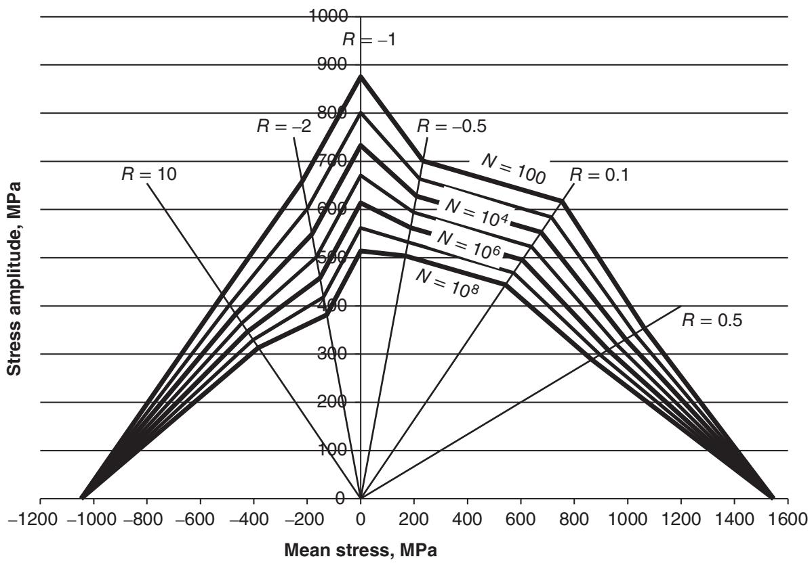

line

| Mean stress, MPa | Stress amplitude, MPa (R = -1) | Stress amplitude, MPa (R = -2) | Stress amplitude, MPa (R = -0.5) | Stress amplitude, MPa (N = 100) | Stress amplitude, MPa (N = 10^4) | Stress amplitude, MPa (N = 10^6) | Stress amplitude, MPa (N = 10^8) |
| ---------------- | ------------------------------ | ------------------------------ | ------------------------------- | ------------------------------- | ------------------------------- | ------------------------------- | ------------------------------- |
| 0                | 900                            | 800                            | 700                             | 600                             | 500                             | 400                             | 300                             |
| 200              | 800                            | 700                            | 600                             | 500                             | 400                             | 300                             | 200                             |
| 400              | 700                            | 600                            | 500                             | 400                             | 300                             | 200                             | 100                             |
| 600              | 600                            | 500                            | 400                             | 300                             | 200                             | 100                             | 50                              |
| 800              | 500                            | 400                            | 300                             | 200                             | 100                             | 50                              | 25                              |
| 1000             | 400                            | 300                            | 200                             | 100                             | 50                              | 25                              | 10                              |
| 1200             | 300                            | 200                            | 100                             | 50                              | 25                              | 10                              | 5                               |
| 1400             | 200                            | 100                            | 50                              | 25                              | 10                              | 5                               | 2                               |
| 1600             | 100                            | 50                             | 25                              | 10                              | 5                               | 2                               | 1                               |

Figure 7.18 CLD for P2B hybrid laminate with 55% rbre volume fraction and $\left[ \pm 4 5 / 0 _ { 4 } \right]$ lay-up; 85% (by volume) carbon rbre (Newport NCT-307-D1-34-600 pre-preg) in 0 deg. direction and 15% (by volume) glass rbre in ±45 deg. directions based on tests at MSU (Samborsky et al. 2007)

# BeneAts versus cost

A rough like for like comparison of GFRP and CFRP UD laminate mechanical properties can be carried out by comparing those of the PPG-Devold glass-epoxy laminate (material 2 in Table 7.1) with those of the hybrid P2B carbon rbre laminate (material 4 in Table 7.1) scaled by the product of the rbre volume fraction ratio (59/55) and the UD % ratio (92/85) – see Table 7.8.

The table indicates that the benert of increased static strength afforded by carbon rbre is less than the increase in stiffness, but that the increase in fatigue strength is signircantly greater.

An indication of the potential blade weight savings achievable with carbon rbre is given in the Sandia report on the SNL100-01 blade (Grifrth 2013). This investigated the replacement of the glass rbre spar caps on the SNL 100-00 all-glass 100 m long blade (Grifrth and Ashwill 2011) by narrower carbon rbre ones sized to maintain approximately the same sapwise stiffness. It was concluded that the spar cap cross-sectional area could be reduced by 63%, resulting in a 36% weight reduction (from 115.7 t to 74 t).

Table 7.8 Comparison between GFRP UD laminate mechanical properties and CFRP ones scaled to the same rbre volume fraction and percentage of UD rbres 

<table><tr><td>Material</td><td>Fibre volume fraction  $V_f$ </td><td>% of UD fibres</td><td>Density (gm/cm3)</td><td>Modulus E GPa</td><td>UTS MPa</td><td>UCS MPa</td><td>10^7 cycle fatigue strength (amplitude)</td></tr><tr><td>PPG-Devold glass/epoxy laminate (material 2 in Table 7.1)</td><td>59%</td><td>92%</td><td>2</td><td>44</td><td>1025</td><td>575</td><td>180</td></tr><tr><td>P2B carbon fibre/glass fibre/epoxy hybrid laminate (material 4 in Table 7.1)</td><td>55%</td><td>85%</td><td>1.57</td><td>100</td><td>1550</td><td>1050</td><td>560</td></tr><tr><td>Scaled P2B properties - i.e. multiplied by (59/55)(92/85)</td><td></td><td></td><td></td><td>116</td><td>1800</td><td>1220</td><td>650</td></tr><tr><td>Ratios of scaled P2B CFRP mechanical properties to GFRP values</td><td></td><td></td><td></td><td>2.64</td><td>1.76</td><td>2.12</td><td>3.61</td></tr></table>

Materials and manufacturing costs of the SNL 100 m blades were investigated in Grifrth and Johanns (2013) using the Sandia Blade Manufacturing Cost Tool (Johanns and Grifrth 2013). Based on the glass rbre and epoxy resin costs of \$2.97/kg and \$4.65/kg quoted in the Cost Tool and assuming densities of 2.55 and 1.15 g/cc, respectively, the materials cost per unit volume of a UD GFRP laminate with 55% rbre volume fraction comes to \$6570/cum. Similarly, based on a carbon rbre cost of \$26.4/kg and a density of 1.8 g/cc, the materials cost per unit volume of a UD CFRP laminate with the same rbre volume fraction comes to \$28 500/cum – about 4.3 times as much as for the GFRP. Thus, if the blade design is governed by tip desection so that the CFRP spar cap cross-sectional area can be made 1/3 that of the GFRP spar cap, there will still be a spar cap cost increase of more than 40%. This may, however, be justired by material savings in the hub, pitch mechanism, low-speed shaft, and nacelle bedplate made possible by the reduced gravity loading from the rotor. In the case of the SNL 100 m blades, it was estimated that, while the replacement of the GFRP spar caps by CFRP increased the total materials cost of the blade by 15% (from \$459k to \$530k, based on the respective bills of materials and the Cost Tool materials costs/kg), the installed capital cost of the whole wind turbine reduced by 0.8% (Grifrth and Johanns 2013).

It is estimated that, globally, about 25% of wind turbine blades are now manufactured with carbon rbre spar caps (Legault 2018).

# 7.1.10 Properties of wood laminates

Although laminated wood/epoxy is classed as a composite, it is markedly different in form from GFRP. Individual plies are made up of large sheets of wood veneer (plate 2) instead of a multiplicity of rbres laid up in a matrix, and the epoxy behaves as an adhesive rather than a matrix, bonding the sheets together at the longitudinal and transverse joints and bonding each ply to its neighbour. Thus the rbre volume fraction is close to 100%, and the anisotropic properties of the wood laminate derive principally from the anisotropic properties of the wood itself.

# Static properties

Wood strength properties are much greater in the direction parallel to the grain, so all of the veneers are orientated with the grain parallel to the blade axis to resist blade bending loads efrciently. However, the veneers cannot be produced in lengths much greater than 2.5 m, so transverse joints have to be included, which introduces lines of weakness not normally found in GFRP blades. The effect is minimised by staggering the joints and by using scarf joints in preference to butt joints.

The epoxy adhesive has a secondary function of sealing the veneers against moisture ingress; additional moisture protection is provided by a layer of glass/epoxy on both the external and internal surfaces. It is important to maintain moisture content at a low level, because veneer strength decreases about 6% for every 1% rise in moisture content.

A comparison of some of the properties of wood laminates used, or considered for use, in wind turbine blades is given in Table 7.9. Khaya ivorensis, an African mahogany, and Douglas rr used to be the main species used for blade manufacture in the UK and US, respectively, but environmental pressures have led to the phasing out of Khaya in favour of European species such as poplar and birch.

Table 7.9 Properties of unjointed wood/epoxy laminates 

<table><tr><td>Species</td><td>Specific gravity</td><td>Mean tensile strength along the grain, MPa</td><td>Mean compression strength along the grain, MPa</td><td>Young&#x27;s modulus along the grain, GPa</td><td>Shear strength, MPa</td></tr><tr><td>Khaya ivorensis</td><td>0.55</td><td>82</td><td>50</td><td>10</td><td>9.5</td></tr><tr><td>Poplar</td><td>0.45</td><td>63</td><td>52</td><td>10</td><td>9</td></tr><tr><td>Baltic pine</td><td>0.55</td><td>105</td><td>40</td><td>16</td><td></td></tr><tr><td>Birch</td><td>0.67</td><td>117</td><td>81</td><td>15</td><td>16</td></tr><tr><td>Beech</td><td>0.72</td><td>103</td><td>69</td><td>10</td><td>16</td></tr><tr><td>Douglas fir</td><td>0.58</td><td>100</td><td>61</td><td>15</td><td>12</td></tr></table>

The table gives tensile strengths of unjointed specimens. Bonreld et al. (1992) report the results of tests on jointed specimens, which showed a signircant reduction in tensile strength to 50 MPa for butt jointed Khaya. Scarf jointed Khaya specimens, with a 1:6 length to thickness ratio, performed much better, achieving a tensile strength of 75 MPa. In all cases the joints in the different veneers making up the laminate were staggered.

An important consideration for design is the variability of strength properties, particularly as wood is an inherently variable material. Strength tends to increase with density, and density varies according to the growing conditions of the tree and the part of the tree from which the wood is taken. Such variability can be reduced by careful grading and the rejection of damaged veneers before laminating. Bonreld and Ansell (1991) report compression tests on 32 carefully selected Khaya samples that yielded the compression strength of 50 MPa given in the table with a standard deviation of only 3 MPa. It should be noted that the lack of annual growth rings in equatorially grown wood may reduce the degree of scatter.

Wood strengths perpendicular to the grain are typically much less than those along the grain – for example, the compressive strength of transversely loaded Khaya is only 12.6 MPa.

# Fatigue properties

The fatigue properties of wood laminates have been the subject of a sustained programme of work at Bath University, starting with Khaya and then extending to other species (Bonreld et al. 1992). A useful summary of this work appears in Bond and Ansell (1998). The general conclusion is that wood performs very well in fatigue with a shallow S-N curve slope, and that fatigue strengths at high cycles do not vary greatly between species.

If the S-N curve for constant amplitude, reverse loading (R = −1) fatigue is normalised with respect to the UCS, $\sigma _ { \mathrm { c u } } \mathrm { ~ - ~ } \mathrm { i . e }$ . $\sigma = \sigma _ { c u } N ^ { - \frac { 1 } { m } }$ , then the results of tests on unjointed Khaya indicate a value of the index m of about 20. However, the value of m reduces to about 16 for scarf jointed khaya, poplar, and beech and to about 13 for butt jointed specimens. Hancock and Bond (1995) have proposed the use of an index of 13.4 for design purposes for scarf jointed wood laminates in general.

# 7.1.11 Material safety factors

Limit state design requires that the characteristic strength of a material be divided by a partial safety factor for material strength. In the case of GFRP, this factor needs to take account of degradation of the material over time as well as the material’s inherent variability.

In both the DNVGL standard Rotor Blades for Wind Turbines DNVGL-ST-0376 (2015) and the draft IEC CD 61400-5 (2016) standard, the partial safety factor for material strength is expressed as the product of a series of component factors designed to account for different areas of uncertainty, as follows:

$$
\gamma_ {m} = \gamma_ {m 0}. \gamma_ {m c}. \gamma_ {m 1}. \gamma_ {m 2}. \gamma_ {m 3}. \gamma_ {m 4}. \gamma_ {m 5} \tag {7.20}
$$

$\Upsilon _ { \mathrm { m 0 } }$ is the ‘base material factor’ and is always 1.2. $\Upsilon _ { \mathrm { m c } }$ is a ‘factor for the criticality of the failure mode’ that features in the DNVGL standard only and takes the value 1.08. Values of the components of the partial safety factor for material strength in the two standards are given for the ultimate strength and fatigue limit states in Table 7.10. Somewhat surprisingly, the last component, $\Upsilon _ { \mathrm { m } 5 }$ , relates to the potential inaccuracy of the loads rather than material strength uncertainty. The standards also give values of $\Upsilon _ { \mathrm { m } 1 } - \Upsilon _ { \mathrm { m } 5 }$ to be used for the investigation of inter-rbre failure, sandwich core failure, sandwich skin buckling, global panel buckling, and bonded joint failure.

# 7.1.12 Manufacture of composite blades

The vast majority of blades are manufactured in moulds in two halves, which are afterwards glued together. As blades become longer, however, some manufacturers are exploring segmental construction involving one or more transverse joints. An alternative approach is to construct the blade spar by rlament winding onto a mandrel and build out the rest of the aerofoil section subsequently. This rest of this section describes the different approaches to blade construction in more detail.

# Mould lay-up

The half shells forming the pressure and suction faces of a blade are typically manufactured separately and then glued together, with the shear webs placed between them. Separate moulds conforming to the geometry of the pressure and suction faces are constructed, and the rbre reinforcement, in the form of fabric or rovings, is laid in each mould in combination with sheets of foam or balsa for the sandwich panel cores. It is normally necessary to make longitudinal incisions in the core sheets so that they can be deformed to follow the curvature of the aerofoil section. The positioning of the glass rbre fabrics in the moulds does not lend itself to automation because of complex geometries, so hand lay-up is the norm.

A blade surface coating – often utilising the same material as the blade structure matrix – is frequently applied to the inside of the moulds before rbre reinforcement lay-up. Alternatively, a different coating material can be applied to the completed blade as a paint or spray. The surface coating is often referred to as gel-coat, irrespective of the material used or the method of application.

Table 7.10 Partial material factors for composite blades 

<table><tr><td colspan="3">Structural element</td><td colspan="2">Laminate ultimate strength</td><td colspan="2">Laminate fatigue strength</td></tr><tr><td colspan="3">Code</td><td rowspan="2">IEC 61400-5 (draft)</td><td rowspan="2">DNVGL-ST-0376</td><td rowspan="2">IEC 61400-5 (draft)</td><td rowspan="2">DNVGL-ST-0376</td></tr><tr><td>Symbol</td><td>Type of effects covered</td><td>Design basis</td></tr><tr><td> $Y_{m0}$ </td><td>‘Base’ material factor</td><td>Applies always</td><td>1.2</td><td>1.2</td><td>1.2</td><td>1.2</td></tr><tr><td> $Y_{mc}$ </td><td>Criticality of failure mode</td><td>DNVGL-ST-0376 only. Applies always</td><td>N/A</td><td>1.08</td><td>N/A</td><td>1.08</td></tr><tr><td rowspan="2"> $Y_{ml}$ </td><td rowspan="2">Environmental degradation (non-reversible)</td><td>Properties based on room temp, dry mechanical props</td><td>1.2</td><td>1.2/1.3 Epoxy/polyester</td><td>1.1</td><td>1.1/1.2 Epoxy/polyester</td></tr><tr><td>Properties account for degradation</td><td>1.0</td><td></td><td>1.0</td><td></td></tr><tr><td rowspan="2"> $Y_{m2}$ </td><td rowspan="2">Temperature effects (reversible)</td><td>Properties based on room temp.</td><td>1.1</td><td>1.1</td><td>1.0</td><td>1.0</td></tr><tr><td>Properties tested over operational temp range</td><td>1.0</td><td></td><td>1.0</td><td></td></tr><tr><td rowspan="3"> $Y_{m3}$ </td><td rowspan="3">Manufacturing effects</td><td>Nominal design props</td><td>1.3</td><td>1.3</td><td>1.3</td><td>1.3</td></tr><tr><td>Properties allowing for manufacturing tolerances</td><td>1.1</td><td>1.1</td><td>1.1</td><td>1.1</td></tr><tr><td>Properties based on validated effect of manufacturing tolerances</td><td>1.0</td><td>1.0</td><td>1.0</td><td>1.0</td></tr><tr><td rowspan="2"> $Y_{m4}$ (A)</td><td rowspan="2">Calculation accuracy and validation</td><td>Strain calculation not verified</td><td>1.2</td><td>1.0</td><td>1.2</td><td>1.0</td></tr><tr><td>Strain calculation correlated to full blade test</td><td>1.0</td><td></td><td>1.0</td><td></td></tr></table>

(Continued)

Table 7.10 (continued) 

<table><tr><td colspan="3">Structural element</td><td colspan="2">Laminate ultimate strength</td><td colspan="2">Laminate fatigue strength</td></tr><tr><td rowspan="3"> $Y_{m4}$ (B)</td><td rowspan="3">Calculation accuracy and validation: fatigue model</td><td>Static strength and assumed Wohler slope in conjunction with linear Goodman diagram</td><td>N/A</td><td>N/A</td><td>1.2</td><td>1.25</td></tr><tr><td>Static strength and measured Wohler slope in conjunction with linear Goodman diagram</td><td>N/A</td><td>N/A</td><td>1.1</td><td>-</td></tr><tr><td>Full fatigue characterisation</td><td>N/A</td><td>N/A</td><td>1.0</td><td>1.0</td></tr><tr><td rowspan="3"> $Y_{m5}$ (A)</td><td rowspan="3">Resolution of load direction</td><td>Loads in two orthogonal directions</td><td>1.2</td><td>1.2</td><td>1.2</td><td>1.2</td></tr><tr><td>Loads in directions spaced at 30°</td><td>1.0</td><td>1.0</td><td>1.05</td><td>1.0</td></tr><tr><td>Strain spectrum evaluated from exact strain history (from time series)</td><td>N/A</td><td>N/A</td><td>1.0</td><td>-</td></tr><tr><td rowspan="2"> $Y_{m5}$ (B)</td><td rowspan="2">Resolution of fatigue load spectrum</td><td>Use of equivalent moments</td><td>N/A</td><td>N/A</td><td>1.1</td><td>1.3</td></tr><tr><td>Use of full fatigue load description – e.g. Markov matrix, time series</td><td>N/A</td><td>N/A</td><td>1.0</td><td>1.0</td></tr><tr><td colspan="3">Minimum combined materials factor</td><td>1.2</td><td>1.711</td><td>1.2</td><td>1.426</td></tr><tr><td colspan="3">Maximum combined materials factor</td><td>2.965</td><td>2.891</td><td>3.262</td><td>3.94</td></tr><tr><td colspan="3">Maximum combined materials factor with accurate loads and S-N curve (assuming epoxy matrix for DNVGL-ST-0376)</td><td>1.2 × 1.2 × 1.1 × 1.3 × 1.2 = 2.471</td><td>1.2 × 1.08 × 1.2 × 1.1 × 1.3 = 2.224</td><td>1.2 × 1.1 × 1.3 × 1.2 = 2.059</td><td>1.2 × 1.08 × 1.1 × 1.3 = 1.853</td></tr></table>

# Resin application

Fabric lay-up is followed by resin application and curing. The resin can be applied by hand using brush or roller, resulting in rbre volume contents of typically 30–40%, but use of ‘vacuum bagging’, in which trapped air and excess volatile compounds, such as residual solvent, are extracted, consolidates the composite and allows a volume fraction of 50% or more to be achieved.

# Vacuum resin infusion

Vacuum resin infusion, or VARTM, uses atmospheric pressure to drive the resin into rbre reinforcement and is now increasingly preferred, as it has the advantage of enabling a higher rbre volume fraction of 55–60% to be achieved, resulting in increased stiffness and strength. Other important benerts are a reduction in the wastage of resin and a better working environment, because of reduced exposure to resin fumes.

As usual, it is essential that the resin has impregnated the reinforcement in all parts of the blade before it has begun to harden. Accordingly, it is normal to insert a layer of a suitable sow medium between the glass layers to facilitate the sow of resin from the entry points. Several different sow media are available, ranging from a matting of randomly oriented entangled nylon rlaments to dual-purpose sandwich core foam material, which incorporates grooves and perforations to allow the resin to sow along the laminate.

The preparations for vacuum resin infusion can be broken down into the following stages:

1. Lay-up of the rbre reinforcement fabrics and rovings within the mould, together with foam or balsa sheets for the sandwich panels and sheets of the sow medium.   
2. Positioning of resin delivery tubes within the mould. These can have permeable walls to allow delivery of resin along their length.   
3. Enclosure of the mould and contents inside a plastic vacuum bag.   
4. Connection of the vacuum pump to the bag and proving of the vacuum. Much attention must be given to this as even the smallest leak can be very damaging.   
5. Catalysis of the resin.

# Pre-pregs

Pre-pregs are UD rbre reinforcements or woven fabrics that have been pre-impregnated with either a thermoset or thermoplastic resin. Their use allows the resin content to be controlled accurately and results in better mechanical properties per unit weight.

The thermoset resin partially cures on application, leaving the pre-preg pliable, but the product has to be stored in refrigerated conditions until use. After lay-up in a mould, curing is completed at temperatures in the range 70∘–120∘ C, with close control of temperatures during heating, soaking, and cool down. Pressure also needs to be applied to remove entrapped air – this is done by vacuum bagging or in an autoclave.

If a thermoplastic resin is used, the pre-pregs do not need to be stored in a refrigerator but instead need to be heated to permit lay-up as they are rigid at room temperature. Thermoplastic pre-pregs offer benerts in terms of shorter mould cycle times and recyclability, but despite signircant R&D effort, have yet to be taken up by manufacturers, probably because of the high processing temperatures, which are in the range $1 6 0 ^ { \circ } { - } 2 5 0 ^ { \circ } \mathrm { ~ C ~ }$ .

# Assembly of half shells

Following curing of the two half shells, one of them must be turned upside down to offer it up to the other. This can most conveniently be accomplished if the two moulds are supported side by side in a single frame and the two halves hinged along the longitudinal axis midway between them.

Before the two half shells are assembled, the shear web(s) must be glued in position on one of the halves. Depending on the size of the blade, access to the glued joint between the shear webs and the second half shell for inspection purposes after assembly may be limited or impossible, so a thick adhesive paste is applied to the exposed upper edge (or sange) of the shear web(s) to take up the inevitable variations in the expected gap and ensure a sound joint. At the leading edge, the joint between the two half shells is often made with a lap joint.

# Segmental construction

The difrculties inherent in transporting long blades along sinuous roads has meant that the largest turbine size considered for onshore sites has, until recently, normally been in the range 2–3 MW. However, some manufacturers are now circumventing these difrculties by constructing blades in two or more sections and assembling them on site. For example, the blades of the Gamesa G128 4.5 MW turbine consist of a 30.5 m inboard section and a 32 m outboard section, allowing each to be transported to site on a standard 90 ft (27.4 m) satbed trailer (Gardiner 2013) before they are bolted together. Each blade section is connected to metallic adaptors at the joint centre by rows of bolts oriented parallel to the blade axis and lying just within each face. Metallic inserts transfer the bolt loads into the blade laminate via a double-lap shear joint.

Enercon have also adopted segmented blade construction with a bolted tranverse joint for their larger blades (Windblatt 2013).

Metallic blade joints inevitably add signircant localised masses, reducing the blade’s natural frequency. In the case of the Gamesa G128, it is reported that the estimated 10% increase in cost is more than offset by transport savings. However, Blade Dynamics have demonstrated that the need for bolted joints can be avoided in segmented blades, using bonding to join the blade sections instead.

# Filament winding

If the load-bearing structure is limited to a compact closed hollow section spar, consisting of two shear webs and the skin sections between them, then it lends itself to rlament winding, a semi-automated process in which a continuous reinforcement is wound onto a rotating mandrel. The reinforcement is fed through a resin bath and then through a delivery eye that moves to and fro along the mandrel, with the relative speeds of the delivery eye and of the rotation of the mandrel controlling the rnal rbre orientation. Unfortunately, a drawback inherent in the process is that the rlament cannot be laid in the axial direction along which the bending stresses act.

Enercon have adopted rlament winding for the manufacture of the inner sections of the blades for their 115, 126, and 141 m diameter turbines (Windblatt 2013, 2016). The inner sections transition from a cylindrical cross-section at the root to oval at the outer end. On the 115 m diameter turbine the inner section is about 12 m long and on the larger turbines longer, identical inner sections are used on both blades.

# 7.1.13 Blade loading overview

This section explores the variation of extreme and fatigue loading with wind speed and yaw angle, utilising the theory of Section 4.2 and focussing on sapwise bending close to the blade root by way of example. The turbine considered is an 80 m diameter machine, with SC40 blades, as described in Figure 5.4a.

# Extreme loading during operation: stall-regulated machines

The stall-regulated machine considered operates at a single rotational speed of 15 rpm and generates 2.0 MW at a rated speed of 16 m/s.

The blade loadings on the outer half of the blade are calculated using empirical three-dimensional (3-D) aerodynamic data taken from Petersen et al. (1998), with extrapolation of the lift and drag coefrcient curves beyond $3 0 ^ { \circ }$ angle of attack (the upper limit of the data). The 3-D data displays a gentler stall than typical two-dimensional data, so there is no signircant reduction in blade out-of-plane bending moment as the blade goes into stall. The blade loadings on the inner half of the blade are calculated using corrected 3-D data developed for the DTU 10 MW reference wind turbine (Bak et al. 2013) for t/c ratios of 24.1, 30.1, 36, 48, and 60%, accessed from the data repository. These utilise values of lift and drag coefrcients for sat plates at large angles of attack. Above about 20 m/s, the out-of-plane bending moment begins to increase progressively once again as drag begins to become signircant. The predicted variation of blade 0 m radius out-of-plane bending moment (i.e. the bending moment at the hub centre) with wind speed is plotted out for a zero shear exponent, zero shaft tilt, and a range of yaw angles on Figure 7.19, with the yaw direction derned as positive when the lateral component of air sow with respect to the rotor disc is in the same direction as the blade movement at zero azimuth (i.e. at 12 o’clock). For negative yaw, the effect of the increase in relative velocity outweighs that of the reduction of angle of attack at wind speeds beyond stall, so the bending moment at $0 ^ { \circ }$ azimuth is increased. If wind shear were included, maximum moments would occur at negative yaw angles and $0 ^ { \circ }$ azimuth rather than at positive yaw angles and $1 8 0 ^ { \circ }$ azimuth, because wind shear augments the wind speed in the former case. The effect of wind shear on blade root out-of-plane bending moment at $0 ^ { \circ }$ azimuth for zero yaw is shown by the dashed line.

The plots of the extreme out-of-plane bending moment in Figure 7.19 are conservative on three counts, because no allowance is made for the following:

• Lack of correlation of the wind over the blade length.   
• Limitation on maximum wind speed seen during operation by high wind cut-out.   
• Limitation on maximum yaw angle by yaw control.

The alleviation of extreme loadings by high wind cut-out and yaw control depends on the averaging times applied to the wind speed and direction signals by the control system.

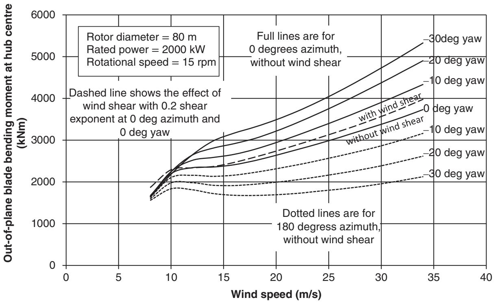

line

| Wind speed (m/s) | -30 deg yaw (solid) | -30 deg yaw (dashed) | -20 deg yaw (solid) | -20 deg yaw (dashed) | -10 deg yaw (solid) | -10 deg yaw (dashed) | -10 deg yaw (solid) | -10 deg yaw (dashed) | -30 deg yaw (solid) | -30 deg yaw (dashed) |
| ---------------- | ------------------- | -------------------- | ------------------- | -------------------- | ------------------- | -------------------- | ------------------- | -------------------- | ------------------- | -------------------- |
| 8                | ~1700               | ~1600                | ~1750               | ~1650                | ~1800               | ~1700                | ~1850               | ~1750                | ~1900               | ~1800                |
| 10               | ~2200               | ~2100                | ~2300               | ~2200                | ~2400               | ~2300                | ~2500               | ~2400                | ~2600               | ~2500                |
| 15               | ~3000               | ~2800                | ~3200               | ~3000                | ~3400               | ~3200                | ~3600               | ~3400                | ~3800               | ~3600                |
| 25               | ~4500               | ~4200                | ~4800               | ~4500                | ~5200               | ~5000                | ~5600               | ~5400                | ~6000               | ~5800                |
| 35               | ~5500               | ~5200                | ~6200               | ~6000                | ~7200               | ~7000                | ~7600               | ~7400                | ~8800               | ~8600                |
| 45               | ~6500               | ~6200                | ~7400               | ~7200                | ~8400               | ~8200                | ~8800               | ~8600                | ~11200              | ~11000               |

Figure 7.19 Variation of blade root out-of-plane bending moment with wind speed at various yaw angles for an example 80 m diameter stall-regulated turbine

# Extreme loading during operation: pitch-regulated machines

The characterisation of extreme operational loadings on pitch-regulated machines is inevitably more complicated than for stall-regulated machines, although at the same time it should be more accurate because of the avoidance of uncertainties associated with stall. It is instructive to focus comparisons on the blade bending moment about the weak axis at the root once again. This time it is referred to as the Tapwise bending moment rather than the out-of-plane (of rotation) moment because of blade pitching.

Figure 7.20 presents the variation of 0 m radius sapwise bending moment (i.e. the bending moment at the hub centre) with short-term mean wind speed at several yaw angles for a 1700 kW, 80 m diameter pitch-regulated machine rotating at 15 rpm. The rated speed is 11.2 m/s, and other parameters, including the zero wind shear exponent, are the same as in the stall-regulated example above. The blade loadings are calculated using the same aerodynamic data as for the stall-regulated machine but with extrapolation of the Petersen et al. (1998) lift and drag coefrcient curves to negative angle of attack. The rgure only shows the bending moments resulting from slow variations in wind speed – i.e. those that can be followed by the pitch control system – so moments arising from faster wind speed suctuations must be added to obtain the total.

The curves are very different in shape from those obtained for the stall-regulated machine. The 0 m radius sapwise bending moment reaches a peak at rated wind speed, and then drops off sharply, for all yaw angles. At high wind speeds, increasingly large negative bending moments are developed at 180∘ azimuth for positive yaw angles and at 0 ∘ azimuth for negative yaw angles, which can be comparable in magnitude to the peak positive moment at rated speed. Note that the bending moment reduces with increasingly negative yaw angle at zero azimuth, instead of increasing as it does for stall-regulated operation. This is because blade pitching renders angle of attack, which starts to become negative under these conditions, more critical than relative velocity.

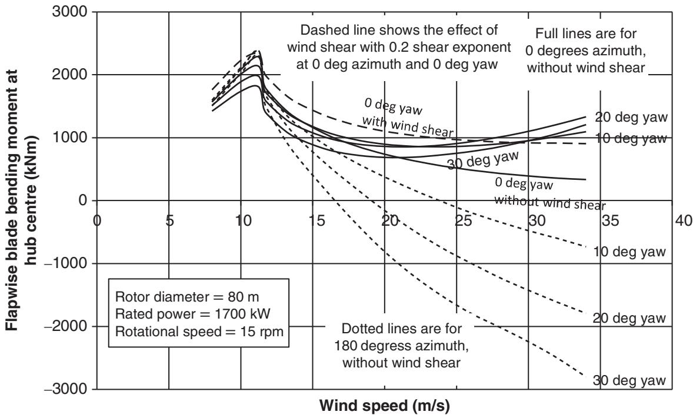

line

| Wind speed (m/s) | Flapwise blade bending moment at hub centre (kNm) for 0 deg yaw (washed line) | Flapwise blade bending moment at hub centre (kNm) for 10 deg yaw (solid line) | Flapwise blade bending moment at hub centre (kNm) for 20 deg yaw (dashed line) | Flapwise blade bending moment at hub centre (kNm) for 30 deg yaw (dotted lines) |
| ---------------- | ------------------------------------------------------------------ | ------------------------------------------------------------------- | -------------------------------------------------------------------- | --------------------------------------------------------------------- |
| 10               | ~2300                                                              | ~2200                                                               | ~2100                                                                | ~2000                                                               |
| 15               | ~1000                                                              | ~900                                                                | ~800                                                                 | ~700                                                                |
| 20               | ~600                                                               | ~500                                                                | ~400                                                                 | ~300                                                                |
| 25               | ~400                                                               | ~300                                                                | ~200                                                                 | ~100                                                                |
| 30               | ~300                                                               | ~200                                                                | ~100                                                                 | ~-100                                                               |
| 35               | ~250                                                               | ~150                                                                | ~50                                                                  | ~-250                                                               |
| 40               | ~200                                                               | ~100                                                                | ~25                                                                  | ~-300                                                               |

Figure 7.20 Variation of blade root sapwise bending moment with wind speed at various yaw angles for an example 80 m diameter pitch-regulated turbine

To the extent that the pitch control system can keep pace with the wind speed transients, the curves in Figure 7.20 can be used to provide an approximate indication of the extreme bending moments arising from some of the IEC 61400-1 deterministic load cases. It is seen that the extreme moments are only about 1/2 of the maximum value for the stall-regulated machine.

The spectrum of the longitudinal wind speed suctuations will contain signircant energy at frequencies above the level at which the pitch control system can respond, and these have to be considered in the analysis of the ‘normal turbulence model’ load case. Figure 7.21 illustrates the perturbations in the 0 m radius sapwise bending moment at 0 ∘ and 180∘ degrees azimuth for the above machine, as a result of such high frequency wind speed suctuations with respect to sharp rises and falls in wind speed with respect to steady wind speeds of 14 and 20 m/s for $\mathrm { a } + 2 0 ^ { \circ }$ yaw angle.

Over the machine lifetime, the maximum increase in wind speed above rated that does not produce a blade pitch response can be estimated using

$$
\begin{array}{l} u _ {\mathrm{max}} = \sigma_ {u} \sqrt {\frac {\int_ {\Omega / 2} ^ {\infty} S _ {u} (n)}{\int_ {0} ^ {\infty} S _ {u} (n)}} \left[ \sqrt {2 \ln (\Omega T)} + \frac {\gamma}{\sqrt {2 \ln (\Omega T)}} \right] \\ = \left(\sigma_ {u}\right) _ {n > \Omega / 2} \left[ \sqrt {2 \ln (\Omega T)} + \frac {0 . 5 7 7 2}{\sqrt {2 \ln (\Omega T)}} \right] \tag {7.21} \\ \end{array}
$$

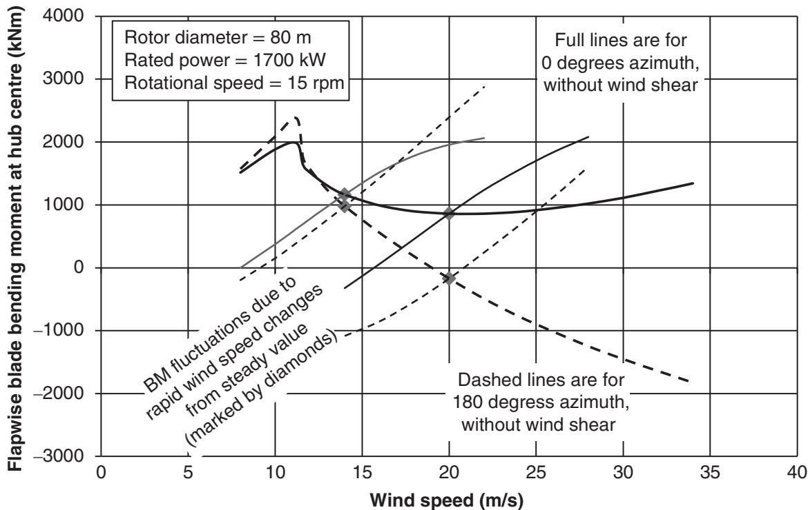

line

| Wind speed (m/s) | Flapwise blade bending moment at hub centre (kNm) |
| ---------------- | ----------------------------------------------- |
| 10               | ~2000                                           |
| 15               | ~1000                                           |
| 20               | ~900                                            |
| 25               | ~1000                                           |
| 30               | ~1200                                           |
| 35               | ~1300                                           |

Figure 7.21 Effect of rapid wind speed suctuations on 0 m radius sapwise bending moment for the example 80 m dia pitch-regulated machine for $\mathrm { a } + 2 0 ^ { \circ }$ yaw angle

where $( \sigma _ { u } ) _ { n > \Omega / 2 }$ is the standard deviation of wind speed suctuations above the pitch response cut-off frequency (assumed to be half the rotational frequency) and T is the total period of operation in the wind speed band centred on the rated speed. For the IEC 61400-1 edition 4 normal turbulence model, the turbulence is given by

$$
\sigma_ {u} = I _ {r e f} (0. 7 5 \overline {{{U}}} + 5. 6) \tag {7.22}
$$

For an integral length scale of 147 m, the standard deviation of wind speed suctuations above half rotational frequency seen by a point on a rotating blade at 28 m – i.e. at 70% of the 40 m tip radius, is 61% of the standard deviation of all wind speed suctuations. Hence, for an 11 m/s rated wind speed, with $I _ { r e f } = 0 . 1 6$ for a Class A site, $\sigma _ { \mathrm { u } } = 2 . 2 2 \mathrm { m } / \mathrm { s }$ and $( \sigma _ { u } ) _ { n > \Omega / 2 } = 2 . 2 \times 0 . 6 1 = 1 . 3 5 \mathrm { m / s }$ . Taking a wind speed band of $2 \mathrm { m } / \mathrm { s } ,$ the expression in square brackets (i.e. the peak factor) comes to 5.9, so that the lifetime extreme value of the wind speed increase without pitch response is about 8 m/s. If the wind speed suctuations over the blade are treated as perfectly correlated, this results in a maximum increment of 0 m radius sapwise bending moment of 1900 kNm, based on the BM increment applicable for a steady wind of 14 m/s (see Figure 7.21). When this is added to the maximum steady wind sapwise moment of about 2400 kNm, an extreme sapwise root bending moment ignoring wind shear of about 4300 kNm is obtained. Thus, the extreme sapwise bending moment during operation occurs at winds around rated rather than around the upper cut-out speed – a phenomenon that is a normal feature of pitch-regulated machines. Also, the extreme sapwise bending moment is slightly less than for the stall-regulated machine with the same diameter considered above.

# Fatigue loading

The importance of fatigue loading relative to extreme loading is very much a function of material properties. As the vast majority of blades are manufactured from composite materials with similar fatigue properties, discussion in this sub-section will be based on these.

As set out in Sections 7.1.8–7.1.10, composite materials are characterised by a very shallow S-N curve – i.e. the reciprocal index m in the relation $\overline { { \sigma } } \propto \overline { { N } } ^ { - 1 / m }$ for constant amplitude, reversed loading (R = −1) is typically 10 or more. As a result, fatigue damage can be dominated by the small number of high range stress cycles associated with unusual wind conditions, rather than by the routine medium range cycles.

The other signircant property of composite materials is the increase in fatigue damage with mean stress level, which is usually accounted for by scaling up the stress amplitude entered in the R = −1 S-N curve formulation by the factor $\frac { 1 } { ( 1 \_ { - } \overline { { \sigma } } / \sigma _ { d } ) }$ where (1 − 휎∕휎d) $\sigma _ { \mathrm { d } }$ is the design strength in compression for a compression mean or in tension for a tension mean. This increases the relative importance of stress cycles with a high mean.

# Behaviour of stall-regulated machines in fatigue

For stall-regulated machines, the highest out-of-plane bending moment ranges and means normally occur at high wind speeds and yaw angles. This is illustrated in Figure 7.19, which shows the variation in this moment with wind speed and yaw angle at 0% radius for an 80 m diameter machine, based on the 3-D data referred to above. Note that above rated wind speed, the bending moment plots level off, so that a given departure of the lateral wind component from the zero mean, sustained over half a revolution, results in a larger bending moment suctuation than a change in the longitudinal component of twice this magnitude. For example, if the mean wind speed is 20 m/s, a lateral component of 4 m/s (corresponding to a yaw angle of 11.3∘) causes a bending moment variation of 700 KNm when the blade rotates from $0 ^ { \circ }$ to 180∘ azimuth, compared to a variation of 500 KNm as a result of a +/− 4 m/s suctuation in longitudinal wind speed.

Similar comments apply to vertical wind speed suctuations, but here there is a built-in initial tilt angle between the air sow and the shaft axis because of shaft angle tilt and updraft. Thus, bending moment plots derived from 3-D wind simulations above rated are dominated by suctuations at rotational frequency that bloom and decay as the angle between the air sow and the shaft axis rises and falls. Superimposed on these are lower frequency suctuations caused by changes in the longitudinal wind speed.

Clearly high wind/high yaw cycles will be a major source of fatigue damage, although the contribution of cycles at wind speeds below stall may also be important, because of the more rapid variation of moment with wind speed there, and the much increased number of cycles.

Thomsen (1998) has investigated for blade root out-of-plane bending on a 1.5 MW, 64 m diameter 3 bladed machine, taking a constant turbulence intensity of 15% and a S-N curve index of 12. The results, including allowance for mean stress, are plotted in Figure 7.22 (dotted), and indicate that the damage is concentrated at wind speeds of 20 m/s and above. The rgure also shows the effect of adopting a steeper S-N curve (with m = 10) and the IEC Class A turbulence distribution (with increasing intensities as mean wind speed decreases). In each case, the relative damage contribution at high wind speeds is reduced, but the switch to the IEC turbulence distribution causes the more signircant change.

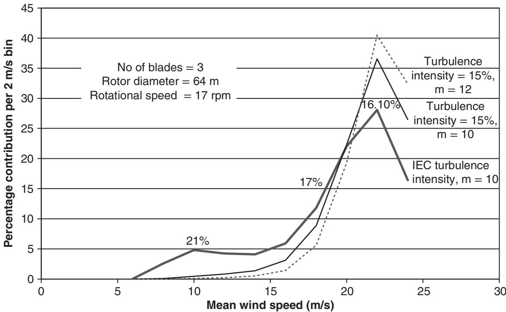

line

| Mean wind speed (m/s) | Percentage contribution per 2 m/s bin |
| --------------------- | -------------------------------------- |
| 10                    | 21%                                    |
| 22                    | 16.10%                                 |

Figure 7.22 Relative contribution to lifetime fatigue damage for different wind speeds for a 1.5 MW stall-regulated machine, including effect of mean load, after Thomsen (1998)

# Behaviour of pitch-regulated machines in fatigue

For pitch-regulated machines, the highest out-of-plane bending moment ranges occur at high wind speeds and yaw angles, but the largest mean values occur around rated wind speed. Moreover, blade pitching results in a rapid fall-off in bending moment with short-term mean wind speed just above rated. This behaviour is illustrated in Figure 7.21, which shows the variation in out-of-plane moment with short-term mean wind speed for 20∘ yaw angle at 0 m radius for an 80 m diameter machine. It transpires that the combination of the steep bending moment/short-term wind speed characteristic, high mean bending moment and large number of loading cycles just above rated wind speed results in more fatigue damage at this wind speed than at higher wind speeds, where the increasing bending moment suctuations due to yaw offset are mitigated by reducing mean loads and numbers of cycles.

The nature of the bending moment suctuations at a mean wind speed just above rated is shown on Figure 7.23, which is a time history obtained from a 3-D wind speed simulation, for a 2000 kW pitch-regulated machine rotating at 21 rpm in a mean wind speed of 14 m/s. The increased rotational speed results in steeper bending moment/short-term mean wind speed characteristics than those presented in Figure 7.21. The effect of wind shear is included (based on a 60 m hub height), but the effects of yaw angle and shaft tilt are omitted for simplicity as these are smaller. Figure 7.23 also shows the breakdown of the 0 m radius bending moment between the bending moment resulting from wind shear and gradual wind speed changes (to which blade pitching responds) and the additional bending moment suctuations due to gust slicing. As with the case of a stall-regulated machine operating at high wind speed discussed above, there are considerable bending moment suctuations at the rotational speed, but this time they are largely due to spatial variations in longitudinal wind speed across the disc (i.e. ‘gust slicing’) and wind shear rather than due to yaw or tilt offset. In addition, there are large low frequency bending moment suctuations as a result of short-term mean wind speed changes – indeed, inspection of the bending moment and short-term mean wind speed plots reveals an inverse relationship between the two.

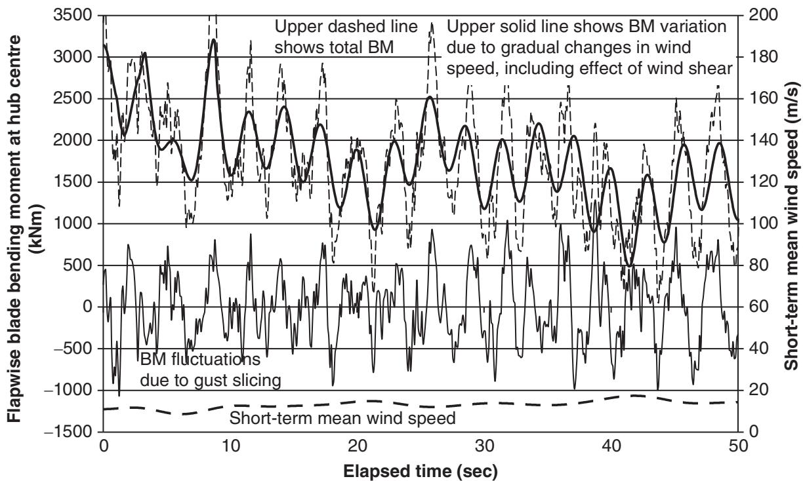

line

| Elapsed time (sec) | Flapwise blade bending moment at hub centre (kNm) | Short-term mean wind speed (m/s) |
| ------------------ | ----------------------------------------------- | -------------------------------- |
| 0                  | ~3100                                           | ~180                             |
| 5                  | ~2000                                           | ~140                             |
| 10                 | ~3200                                           | ~160                             |
| 15                 | ~2400                                           | ~120                             |
| 20                 | ~1900                                           | ~100                             |
| 25                 | ~2500                                           | ~160                             |
| 30                 | ~2100                                           | ~140                             |
| 35                 | ~2200                                           | ~120                             |
| 40                 | ~1600                                           | ~100                             |
| 45                 | ~2400                                           | ~160                             |
| 50                 | ~1900                                           | ~140                             |

Figure 7.23 Time history of sapwise BM at 0 m radius, with breakdown between bending moments due to gradual wind speed changes (to which blade pitching responds) about a 14 m/s mean and additional suctuations due to gust slicing – for an 80 m dia, 2000 kW pitch-regulated m/c rotating at 21 rpm, based on 3-D wind simulation

# Factors affecting fatigue criticality

The relative criticality of fatigue and extreme loading is determined by the material properties and safety factors adopted, as well as by the loadings themselves. As an aid to comparison, the fatigue loading can be described in terms of the notional one cycle equivalent load, $\sigma _ { \mathrm { e q ( n = 1 ) } }$ , which is derned as the stress range of the single reverse loading cycle that would cause the same total fatigue damage as the actual fatigue loading on the basis of the design S-N curve, including the effects of mean stress. Then fatigue is critical if

$$
\frac {\sigma_ {e q (n = 1)}}{2 \sigma_ {0 d}} > \gamma_ {L} \frac {\sigma_ {e x t}}{\sigma_ {c d}} \tag {7.23}
$$

where $\sigma _ { \mathrm { 0 d } }$ is the stress amplitude given by the reverse loading fatigue design curve at $N = 1 , \sigma _ { \mathrm { e x t } }$ is the stress resulting from the extreme loading case, $\gamma _ { \mathrm { { L } } }$ is the load factor and $\sigma _ { \mathrm { c d } }$ is the design compression stress (which is assumed not to be governed by buckling considerations). The condition may be rewritten in terms of characteristic stress values as follows:

$$
\frac {\sigma_ {e q (n = 1)}}{\sigma_ {e x t}} > 2 \gamma_ {L} \frac {\gamma_ {m u}}{\gamma_ {m f}} \frac {\sigma_ {0 k}}{\sigma_ {c k}} \tag {7.24}
$$

or as 휎eq(n=1) > 2.7 훾mu 휎0k with 훾 set to 1.35. $\begin{array} { r } { \frac { \sigma _ { e q ( n = 1 ) } } { \sigma _ { e x t } } > 2 . 7 \frac { \gamma _ { m u } } { \gamma _ { m f } } \frac { \sigma _ { 0 k } } { \sigma _ { c k } } } \end{array}$ $\gamma _ { \mathrm { { L } } }$ 휎ext

As is apparent from the survey of GFRP S-N curves in Section 7.1.8, the value of $\sigma _ { 0 \mathrm { k } } / \sigma _ { \mathrm { c k } }$ can vary between about 1.0 and 1.4. As is indicated in Table 7.10, the overall partial safety factor for materials to be used in fatigue design depends on the accuracy of both the fatigue model and the fatigue loading description. Accordingly, the ratio of the materials partial safety factor for ultimate loads to that for fatigue loads varies from 0.91 (IEC 61400-5) or 0.74 (DNVGL-ST-0376) to 1.2, with the larger ratio applying when specirc material S-N curves for a range of different R ratios are used in combination with a Markov matrix load description. Thus in principal the parameter 2훾L 훾 $2 \gamma _ { L } \frac { \gamma _ { m u } } { \gamma _ { m f } } \frac { \sigma _ { 0 k } } { \sigma _ { c k } }$ 훾mf 휎ck governing fatigue criticality can take a wide range of values of between about 2.0 and 4.5.

The other important material property governing the criticality of fatigue loading is, of course, the slope index of the log – log S-N curve, m, which affects the value of the notional one cycle equivalent load, $\sigma _ { \mathrm { e q ( n = 1 ) } }$ . With the high values applicable to wood laminates, fatigue is much less likely to govern.

# Other sources of variability

There are a number of other sources of variability in fatigue damage calculations, apart from uncertainty about the material properties themselves, some of which are detailed below.

1. Three alternative stochastic turbulence models are in common use – those due to von Karman, Kaimal, and Mann. The von Karman model is isotropic, whereas in the Kaimal model, which is more realistic in this respect, the standard deviations of lateral and vertical turbulences are 80% and 50% of the longitudinal turbulence, respectively. The Mann model is closer to the Kaimal model with corresponding ratios of 0.7 and 0.5. In the case of stall-regulated machines, where wind misalignment at high wind speeds is often the main source of fatigue damage, the choice of turbulence model could clearly have a decisive effect.   
2. When the fatigue assessment is based on simulations of limited duration (typically 300–600 seconds), the damage is often dominated by a few extreme cycles, which are subject to signircant statistical variation from one simulation to another. Accordingly, several simulations at a given mean wind speed are necessary to obtain an accurate result. See ‘The Statistical Variation of Wind Turbine Fatigue Loads’ by Thomsen (1998).   
3. In allowing for the reduction in fatigue strength due to mean stress (e.g. according to Eq. (7.18)), the mean stress can either be calculated over each stress range obtained by rainsow cycle counting or over the length of the simulation.

# Fatigue due to gravity loading

In-plane fatigue loads arise from gravity loading and suctuations in the in-plane aerodynamic loadings, but gravity loadings dominate for machines large enough to be grid connected.

Over most of the blade length, the chord dimension is much larger than the blade thickness, so the section modulus for edgewise bending will generally exceed that for sapwise bending. However, for blades attached to the hub or pitch bearing by a circular ring of bolts, which is the normal arrangement, the blade structure adjacent to the root is a cylindrical shell, which will have the same section modulus about both axes if the wall thickness is uniform. As a consequence, the blade root is the rrst area that should be checked for in-plane fatigue loading.

# Tip de@ection

Under extreme operating conditions, tip desections of up to about 20% of blade radius can occur, so care is needed to avoid the risk of blade/tower collisions in the case of upwind machines. DNVGL-ST-0376 (2015) specires that the maximum tip desection under the extreme unfactored operational loading is not to exceed 70% of the clearance without blade desection, which implies a safety factor of 1.43. IEC 61400-5, however, requires that there should be no blade/tower contact when the extreme loads are multiplied by the partial safety factor for loads and by the partial safety factor for the elastic properties of the blade material – i.e. by 1.35 × 1.1 = 1.485 for normal load cases. Relaxations in these requirements are permitted where supported by test measurements.

It is instructive to compare the tip desections for similar blades designed in different materials. If the skin thickness distributions are chosen so that the design compression strength of each material is fully mobilised under the extreme load case, then the tip desection will be proportional to the design compression strength to Young’s Modulus ratio, $\sigma _ { \mathrm { c d } } / \mathrm { E }$ , of the blade material. These ratios are compared for different materials in Table 7.11.

It is clear from the table that a GFRP blade will be more sexible than blades in the other materials, provided that the spar is stocky enough for buckling not to govern the design. In the case of thin walled cross-sections, however, such as that in Figure 7.4, the GFRP compressive design stress has to be reduced signircantly to guard against buckling, with the result that blade sexibility is reduced.

# 7.1.14 SimpliJed fatigue design example

Rigorous calculation of wind turbine blade fatigue damage requires numerous simulations of blade loading in the time domain for each wind speed, followed by post processing of the results to determine the fatigue stress spectra seen by different parts of the blade cross-section at each blade station. As number crunching on such a large scale does not necessarily facilitate the understanding of the main factors driving fatigue, this section presents simplired fatigue calculations for an example blade design – designated FC40 – on an 80 m diameter pitch-regulated variable-speed machine, in order to shed light on them.

After describing the blade geometry and structure, the following paragraphs outline the derivation of the stochastic and deterministic blade bending moments and the combination of the resultant stresses at critical points on the cross-section.

Table 7.11 Design strength to stiffness ratios for different wind turbine blade materials 

<table><tr><td>Material</td><td>Ultimate compression strength,  $\sigma_{cu}$  MPa</td><td>Partial safety factor for material strength,  $\gamma_{mu}$ </td><td>Compression design strength,  $\sigma_{cd}$  MPa</td><td>Young&#x27;s modulus, E GPa</td><td>Strength to stiffness ratio,  $(\sigma_{cd}/E) \times 10^{3}$ </td></tr><tr><td>Glass/epoxy laminate from PPG-Devold L1200/G50-E07 fabric with 92% UD fibres and 59% fibre volume fraction. Vacuum infused</td><td>575</td><td>2.47</td><td>233 (ignoring buckling)</td><td>44</td><td>5.3</td></tr><tr><td>Carbon fibre/epoxy Hexply 8552 laminate plymade from Hexcel AS4 carbon fibre with 60% fibre volume fraction and UD lay-up</td><td>1530</td><td>2.47</td><td>619</td><td>141</td><td>4.4</td></tr><tr><td>Khaya/epoxy laminate</td><td>50</td><td>1.5</td><td>33</td><td>10</td><td>3.3</td></tr><tr><td>Birch/epoxy laminate</td><td>81</td><td>1.5</td><td>54</td><td>15</td><td>3.6</td></tr><tr><td></td><td>Yield strength,  $\sigma_y$ </td><td> $\gamma_{my}$ </td><td></td><td></td><td></td></tr><tr><td>High yield steel (grade Fe 510)</td><td>355</td><td>1.1</td><td>323</td><td>210</td><td>1.54</td></tr><tr><td>Weldable aluminium alloy AA6082</td><td>240</td><td>1.1</td><td>218</td><td>69</td><td>3.2</td></tr></table>

# Blade geometry

The FC40 blade plan-form is illustrated in Figure 7.24, while the FC40 blade twist and thickness/chord ratio distributions are shown in Figure 7.25.

# Blade structure description

A box spar consisting of two spar caps linked by two shear webs constitutes the main load-bearing structure. The spar caps are a constant width of 50 cm from the root to 25 m radius, but then taper down to 27.5 cm width at the tip to maintain adequate resistance to buckling. The spar is supplemented by the $0 ^ { \circ }$ plies in the $0 ^ { \circ } / \pm 4 5 ^ { \circ }$ triaxial laminate that

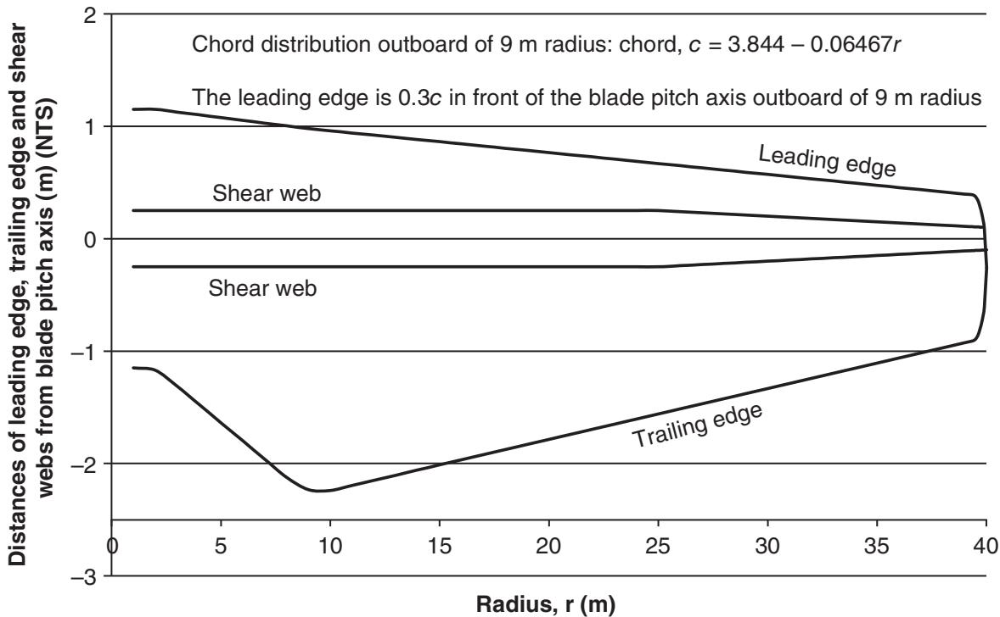

line

| Radius, r (m) | Leading edge (NTS) | Shear web (NTS) | Shear web (NTS) | Trailing edge (NTS) |
| ------------- | ------------------ | --------------- | --------------- | ------------------- |
| 0             | 1.2                | 0.3             | -0.5            | -1.2                |
| 10            | 1.0                | 0.3             | -0.5            | -2.2                |
| 25            | 0.8                | 0.3             | -0.5            | -1.5                |
| 40            | 0.5                | 0.3             | -0.5            | -1.0                |

Figure 7.24 FC40 blade plan-form

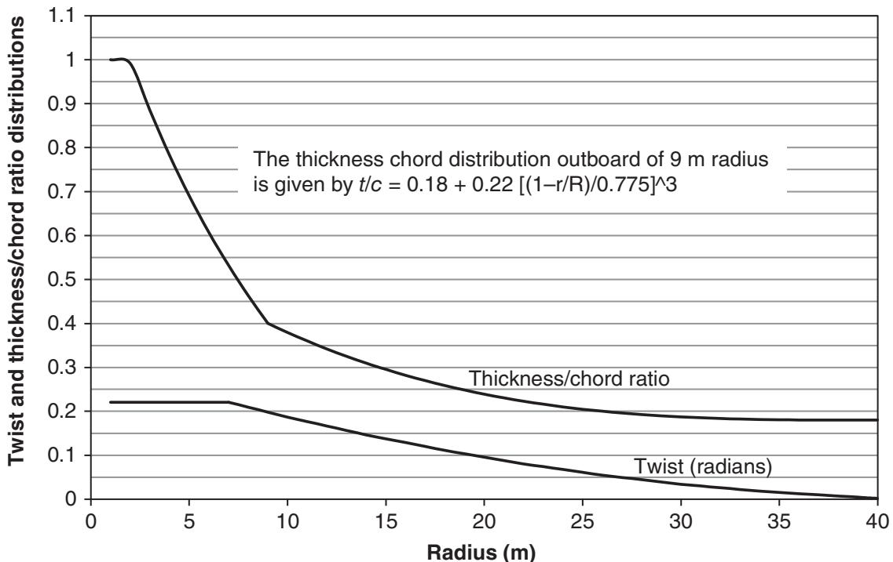

line

| Radius (m) | Thickness/chord ratio | Twist (radians) |
| ---------- | --------------------- | --------------- |
| 0          | 1.0                   | 0.22            |
| 5          | 0.7                   | 0.22            |
| 10         | 0.4                   | 0.18            |
| 15         | 0.3                   | 0.12            |
| 20         | 0.25                  | 0.08            |
| 25         | 0.2                   | 0.05            |
| 30         | 0.18                  | 0.03            |
| 35         | 0.17                  | 0.01            |
| 40         | 0.17                  | 0.0             |

Figure 7.25 FC40 blade twist and thickness/chord ratio distributions

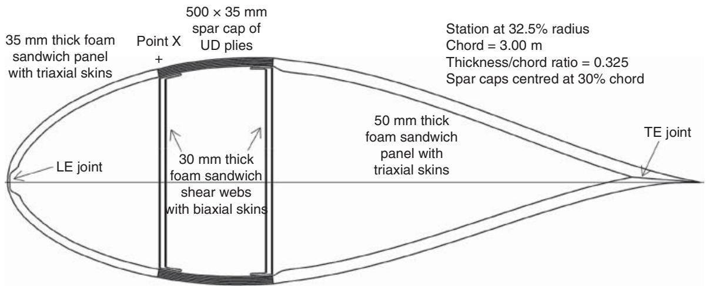

text_image

35 mm thick foam sandwich panel with triaxial skins
Point X +
500 × 35 mm spar cap of UD plies
30 mm thick foam sandwich shear webs with biaxial skins
LE joint
50 mm thick foam sandwich panel with triaxial skins
Station at 32.5% radius
Chord = 3.00 m
Thickness/chord ratio = 0.325
Spar caps centred at 30% chord
TE joint

Figure 7.26 Cross-section of blade at 32.5% radius

forms the skins of the foam sandwich panels over the rest of the perimeter. The general arrangement is illustrated with respect to the cross-section at 32.5% radius in Figure 7.26.

Outboard of the maximum chord section at 9 m radius, the thicknesses of both the foam sandwich and its inner and outer skins taper down in proportion to the chord dimension, c, with the sandwich thickness set at c/60 to the rear of the spar and the skin thickness set at c/1560. The spar cap thickness prorle outboard of 9 m radius is chosen so that the fatigue damage at the critical point on the cross-section at each blade station is less than unity.

Inboard of 9 m radius, the blade cross-section transitions gradually to a circular cross-section at the root. The thickness of the spar caps is assumed to taper linearly down to zero at the root, with the thickness of inner and outer skins progressively increasing to provide the requisite fatigue strength.

# Operating regime

The torque vs rotational speed schedule is set so that the turbine operates at a tip speed ratio of 8 up to a wind speed of 11 m/s and a rotational speed of 21 rpm (2.2 rad/s) and at constant rotational speed thereafter. The rated power of 2000 kW is reached at 11.32 m/s, beyond which pitch control is activated to limit rotational speed excursions above 21 rpm.

# Deterministic loading

Wind shear, tower shadow, yaw and shaft tilt all contribute to cyclic fatigue loading, principally in the sapwise direction. Wind shear and tower shadow bending moment ranges are additive, but those due to yaw can be in-phase or out-of-phase depending on yaw direction, so overall they make only a small net contribution to damage. Accordingly, stress ranges due to yaw are omitted from the fatigue analysis presented here in the interests of simplicity. The cyclic loading due to shaft tilt is 90∘ out-of-phase with that due to wind shear and tower shadow and is much smaller in magnitude, so its impact is negligible, allowing its contribution to be omitted also.

The out-of-plane and in-plane bending moment ranges due to wind shear and tower shadow are resolved about the blade principal axes and divided by the appropriate section moduli to obtain the stress ranges at two critical locations. In view of the uncertainty regarding the position of the critical location for fatigue on the curved spar caps, stress ranges are conservatively calculated at the point X shown on Figure 7.26. This is at the same distance from the major and minor axes as the respective extreme rbres of the suction side spar cap. Stress ranges are also calculated at the trailing edge.

The gravity stress ranges at each of the critical locations are calculated in the same way, but as they are 90∘ out of phase with the wind shear plus tower shadow stress ranges, the combined stress range is calculated as the square root of the sum of the squares.

# Stochastic loading

As described in Section 5.7.5, the gust slicing effect means that the power spectrum of the wind speed suctuations incident on a point on the rotating blade differs signircantly from the power spectrum of the wind speed suctuations at a rxed point, with a marked concentration of energy at rotational frequency and to a lesser extent at its harmonics. However, at very low frequency the effect on the power spectrum is small – see Figure 5.19.

The trough in the rotationally sampled power spectrum between very low frequency and rotational frequency opens the way to the separate treatment of fatigue arising from stochastic loading concentrated at the two frequencies. The standard deviation of the blade bending moment suctuations at rotational frequency and above at radius $r _ { l } , \sigma _ { M L }$ , is given by

$$
\sigma_ {M L} ^ {2} = \left(\frac {1}{2} \rho \Omega \frac {d C _ {L}}{d \alpha}\right) ^ {2} \sum_ {j = l} ^ {m} \sum_ {k = l} ^ {m} \left[ \int_ {\Omega / 2} ^ {\infty} S _ {u} ^ {o} (r _ {j}, r _ {k}, n) d n \right] c (r _ {j}) c (r _ {k}) r _ {j} r _ {k} (r _ {j} - r _ {l}) (r _ {k} - r _ {l}) (\Delta r) ^ {2} \tag {7.25}
$$

The combination of the stochastic bending moments at rotational frequency with the deterministic ones is considered in the next sub-section. The stochastic loads are considered to act at right angles to the untwisted chord for simplicity, as this is only expected to have a marginal effect on bending stresses.

The load ranges at very low frequency are additive to the stochastic and deterministic load ranges at rotational frequency and will be discussed later.

# Combination of deterministic and stochastic stresses

For stationary conditions, the deterministic stress peaks occur at the same azimuth for each blade, but the stochastic stress peaks will occur at any azimuth with the same probability, so the damages resulting from the combined deterministic and stochastic stress ranges need to be calculated over the full $0 { - } 3 6 0 ^ { \circ }$ range of relative phase angles and summed. The stochastic stress ranges are concentrated at the rotational frequency with lesser peaks at the harmonics so, for simplicity, they are treated as narrow banded at the rotational frequency, with the stress ranges, $\Delta \sigma _ { \mathrm { S } }$ distributed according to the Rayleigh distribution:

$$
P \left(\Delta \sigma_ {S}\right) = 1 - e x p \left[ - \frac {1}{8} \left(\frac {\Delta \sigma_ {S}}{\sigma_ {\sigma_ {S}}}\right) ^ {2} \right] \tag {7.26}
$$

where $\sigma _ { \sigma _ { S } }$ is the standard deviation of the stochastic stress. Each individual stochastic stress range can be combined with the deterministic stress range using the

cosine formula:

$$
\Delta \sigma (\varphi_ {j}) = \sqrt {\Delta \sigma_ {S} ^ {2} + \Delta \sigma_ {D} ^ {2} + 2 \Delta \sigma_ {S} \Delta \sigma_ {D} c o s \varphi_ {j}} (7. 2 7)
$$

where $\varphi _ { j }$ is the phase angle between the occurrences of the deterministic and stochastic peak loadings on the blade.

Assuming the permitted number of cycles, N, at stress range, $\Delta \sigma ,$ , is $[ 2 \sigma _ { 0 d } / \Delta \sigma ] ^ { m }$ , the damage arising over a time period, T, from rotational cycles with a phase angle of $\varphi _ { \mathrm { j } }$ between the stochastic and deterministic stress cycles is given by

$$
\frac {n}{N} = \frac {\Delta \varphi}{2 \pi} \sum_ {\Delta \sigma_ {S}} \frac {\Omega T \Delta P (\Delta \sigma_ {S})}{[ 2 \sigma_ {0 d} / \Delta \sigma ] ^ {m}} = \frac {\Delta \varphi}{2 \pi} \frac {\Omega T}{[ 2 \sigma_ {o d} ] ^ {m}} \sum_ {\Delta \sigma_ {S}} \Delta P (\Delta \sigma_ {S}) [ \Delta \sigma_ {S} ^ {2} + \Delta \sigma_ {D} ^ {2} + 2 \Delta \sigma_ {S} \Delta \sigma_ {D} c o s \varphi_ {j} ] ^ {\frac {m}{2}} \tag {7.28}
$$

assuming a phase angle bin width of $\Delta \varphi$ . The total damage is obtained by summing the above expression over all phase angles, and it can be shown that the same damage would be produced if all of the cycles had an equal range of

$$
\Delta \sigma_ {e f f} = \left[ \sum_ {j} \left\{\frac {\Delta \varphi}{2 \pi} \sum_ {\Delta \sigma_ {S}} \Delta P (\Delta \sigma_ {S}) [ \Delta \sigma_ {S} ^ {2} + \Delta \sigma_ {D} ^ {2} + 2 \Delta \sigma_ {S} \Delta \sigma_ {D} c o s \varphi_ {j} ] ^ {\frac {m}{2}} \right\} \right] ^ {\frac {1}{m}} \tag {7.29}
$$

# Very low frequency cycles

The mean frequency of the very low frequency blade bending moment suctuations is a function of the power spectrum of the longitudinal component of turbulence and approximates to 0.015 Hz for a mean wind speed of 13 m/s, resulting in about nine loading cycles over a 10 minute period, the usual length specired for time domain simulations. These very low frequency cycles will cause relatively large fatigue stress cycles because the stress range at rotational frequency has to be added to each of them.

The standard deviation of the very low frequency wind speed suctuations incident on a point on a rotating blade is smaller than the equivalent for a rxed point. In the case of a point at 28 m radius (i.e. at 70% radius for a 80 m diameter turbine), the former is about 80% of the latter, assuming that the turbulence length scales of the longitudinal wind speed suctuations in the transverse and vertical directions are both 147 m.

The blades will pitch in response to the low frequency wind speed suctuations, so blade bending moments will drop off rapidly as the wind speed rises above rated speed. It is convenient to estimate the ranges of the bending moment suctuations by multiplying the standard deviation of the wind speed suctuations by the local slope of the moment/wind speed characteristic for the radius concerned, allowing for the bending moment ceiling at rated wind speed, and applying a set of peak factors based on the Rayleigh distribution of peaks. Then the likely moment range for the jth largest cycle is given by:

$$
\Delta M = 0. 8 \sigma_ {u} \frac {d M}{d U} 2 k _ {j} \tag {7.30}
$$

where $k _ { j }$ is the amplitude of the peak with a $( j - 0 . 5 ) / 9$ probability of being exceeded.

# Spar cap thickness proAle

The spar cap thickness prorle designed to resist the fatigue loading is shown in Figure 7.27. This is based on the IEC 61400-5 partial materials factor in fatigue of 2.06 that would apply if an accurate fatigue model and accurate loads had been employed. The utilisation ratio on this artircial basis is between 0.97 and unity between the root and 21 m radius. It is found that the design is governed by fatigue stresses calculated at the point X in Figure 7.26 rather than those at the trailing edge, indicating that there would be scope for some material saving if the proportion in the spar caps were increased.

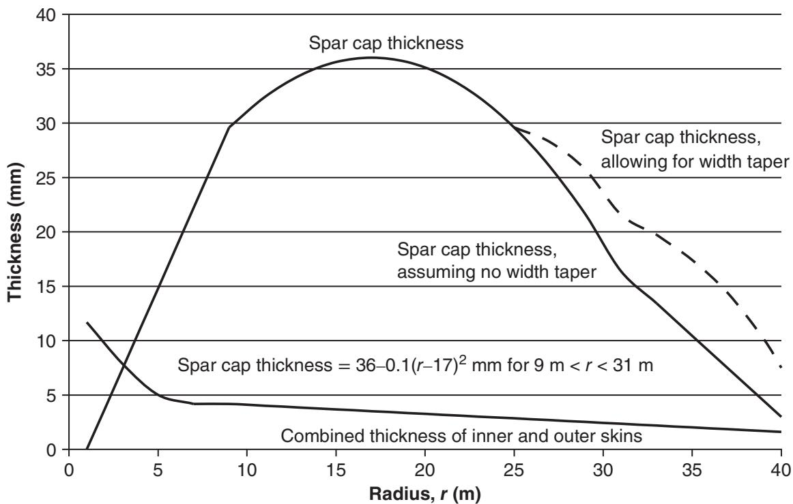

line

| Radius, r (m) | Spar cap thickness (mm) | Combined thickness of inner and outer skins (mm) |
| ------------- | ---------------------- | ----------------------------------------------- |
| 0             | 0                      | 12                                              |
| 5             | 15                     | 5                                               |
| 10            | 30                     | 4                                               |
| 15            | 36                     | 3.5                                             |
| 20            | 35                     | 3                                               |
| 25            | 30                     | 2.5                                             |
| 30            | 20                     | 2                                               |
| 35            | 10                     | 1.5                                             |
| 40            | 5                      | 1                                               |

Figure 7.27 Spar cap thickness prorle and combined thickness of inner and outer skins

Note that the width of the spar cap is gradually reduced beyond 25 m radius to resist buckling, resulting in increased thicknesses as shown by the dashed line. The variation with radius of the combined thickness of the inner and outer skins of the foam sandwich panels forming the aerodynamic section is also shown.

# Variation of fatigue stresses and damage with wind speed

Figure 7.28 shows how the fatigue stress ranges vary with wind speed at 17 m radius, considering wind speeds at 2 m/s intervals. The gravity stress range increases above rated wind speed, because blade pitching leads to an increasing component of the gravity moment about the sapwise axis. The DEL stress range due to stochastic loading at rotational frequency and above is proportional to the product of rotational speed and the standard deviation of the turbulent wind speed suctuations, so it increases rapidly up to rated speed but less rapidly thereafter, as the rotational speed has reached its ceiling. When the effect of the low frequency stochastic load cycles is included (with the rotational frequency DEL stress range added to each), the DEL stochastic stress range increases signircantly. This is a consequence of the low slope of the S-N curve with m = 10, which results in a relatively small number of large loading cycles having a signircant effect.

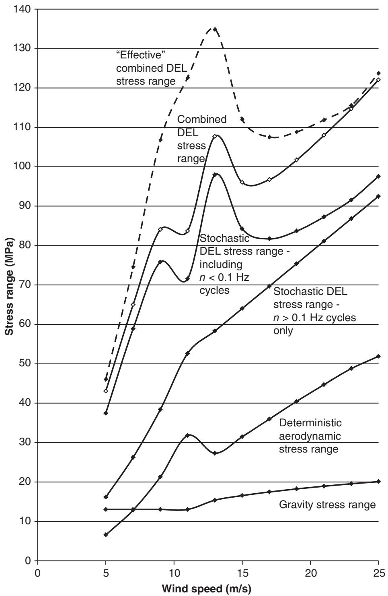

line

| Wind speed (m/s) | "Effective" combined DEL stress range | Combined DEL stress range | Stochastic DEL stress range - including n < 0.1 Hz cycles | Stochastic DEL stress range - n > 0.1 Hz cycles only | Deterministic aerodynamic stress range | Gravity stress range |
| ---------------- | -------------------------------------- | ------------------------- | -------------------------------------------------------- | -------------------------------------------------- | -------------------------------------- | ------------------- |
| 5                | 45                                     | 43                        | 37                                                     | 16                                                 | 13                                     | 6                   |
| 7                | 60                                     | 58                        | 48                                                     | 26                                                 | 13                                     | 12                  |
| 9                | 75                                     | 74                        | 65                                                     | 38                                                 | 13                                     | 21                  |
| 11               | 85                                     | 83                        | 71                                                     | 52                                                 | 13                                     | 32                  |
| 13               | 108                                    | 107                       | 98                                                     | 64                                                 | 27                                   | 31                  |
| 15               | 95                                     | 94                        | 84                                                     | 70                                                 | 31                                   | 36                  |
| 17               | 100                                    | 99                        | 82                                                     | 76                                                 | 36                                   | 40                  |
| 19               | 108                                    | 107                       | 84                                                     | 82                                                 | 40                                   | 44                  |
| 21               | 115                                    | 113                       | 88                                                     | 88                                                 | 45                                   | 48                  |
| 23               | 120                                    | 120                       | 92                                                     | 94                                                 | 49                                   | 50                  |
| 25               | 125                                    | 123                       | 97                                                     | 98                                                 | 52                                   | 52                  |

Figure 7.28 Variation of fatigue stresses at 17 m radius with wind speed for point X. (Here the DEL stress ranges are the constant amplitude ranges giving the same damage for the same number of loading cycles.)

Note that the stress range at 11 m/s is less than at either 9 or 13 m/s, because the bending moment due to slow wind speed changes reaches a ceiling at the rated wind speed of 11.32 m/s, so bending moment suctuations are curtailed. At high wind speeds, blade bending moments are less affected by slow wind speed changes, so these have less effect on the DEL stochastic stress range.

When the stochastic stress ranges are combined with the deterministic ones, the latter have a relatively small impact at low wind speeds, but a greater impact at high wind speeds. The ‘effective’ combined DEL stress shown by the dashed line is derived from the combined DEL stress by dividing it by $\mu ,$ which is a measure of the reduction of the permitted stress range due to a rnite mean stress, assuming a linear Goodman Diagram – see Eq. (7.18). $\mu$ is derned as

$$
\mu = 1 - \frac {\overline {{\sigma}}}{\sigma_ {c d}} \tag {7.31}
$$

and reaches a minimum at rated speed when mean stress is at a maximum. Consequently in Figure 7.28 the ‘effective’ combined DEL stress range exhibits the biggest increase relative to the combined DEL stress range at a wind speed of 11 m/s.

Figure 7.29 shows how the fatigue damage varies with wind speed at 17 m radius, again considering wind speeds at 2 m/s intervals. The ‘effective’ combined stress range and the proportion of time the turbine operates in each 2 m/s wind speed bin are shown for comparison. It is seen that nearly all of the damage is accumulated in the 11 and 13 m/s wind speed bins – i.e. around rated wind speed.

# Fatigue criticality at root

It is found that fatigue is dominated by out-of-plane loading at the root as well as elsewhere for this diameter, with the critical bending axis only rotated about $5 ^ { \circ }$ from the plane of rotation. The ‘effective’ combined DEL stress about the critical bending axis at the root comes to 118 MPa compared with an extreme rbre stress range due to gravity loading of only 44 MPa.

The extreme factored BM results in an extreme rbre stress of 222 MPa, so the expression $\sigma _ { e q ( n = 1 ) } / \sigma _ { e x t }$ comes to $1 1 8 \times { ( 1 . 8 \times 1 0 ^ { 8 } ) ^ { 0 . 1 } } / { 2 2 2 } = 1 1 8 \times 6 . 6 9 / 2 2 2 = 7 9 0 / 2 2 2 = 3 . 5 \dot { 6 }$ . As set out in the preceding section, fatigue is critical if 휎eq(n=1) $\frac { \sigma _ { e q ( n = 1 ) } } { \sigma _ { e x t } } > 2 \gamma _ { L } \frac { \gamma _ { m u } } { \gamma _ { m f } } \frac { \sigma _ { 0 k } } { \sigma _ { c k } }$ > 2훾L u 휎0k . If the partial 휎ext 훾mf 휎ck

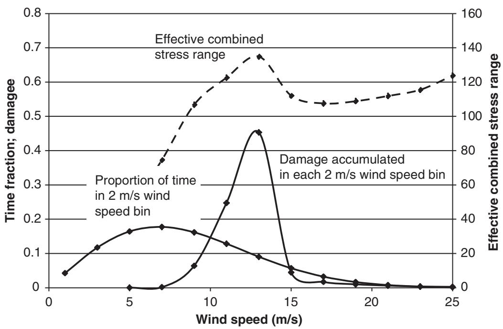

line

| Wind speed (m/s) | Time fraction; damage | Effective combined stress range |
| ---------------- | ---------------------- | -------------------------------- |
| 0                | 0.05                   | 0                                |
| 5                | 0.16                   | 0                                |
| 10               | 0.12                   | 80                               |
| 15               | 0.05                   | 120                              |
| 20               | 0.01                   | 120                              |
| 25               | 0.00                   | 120                              |

Figure 7.29 Variation of fatigue damage with wind speed at 17 m radius

materials safety factors in fatigue and at ultimate are based on the hypotheses of accurately described loads and an accurate fatigue model, the ratio $\Upsilon _ { \mathrm { m u } } / \Upsilon _ { \mathrm { m f } }$ would be 1.2. Hence, if the ratio $\sigma _ { 0 \mathrm { k } } / \sigma _ { \mathrm { c k } }$ was at the upper end of the range (1.4), the threshold $2 \gamma _ { L } \frac { \gamma _ { m u } } { \gamma _ { m f } } \frac { \sigma _ { 0 k } } { \sigma _ { c k } }$ would be 2(1.35)1.2(1.4) = 4.54, so the inequality would not be satisred and fatigue would not be critical at the root.

# Tip clearance

The 175–185∘ azimuth tip desection under the extreme turbulence load case (IEC 61400-1 DLC 1.3), which is often the governing load case, is approximately 6.5 m, including the load factor of 1.35. Assuming a shaft tilt of 5∘ , a hub overhang of 3.2 m and a tower diameter of 3.4 m, the nominal clearance would be $4 0 \mathrm { s i n } 5 ^ { \circ } + 3 . 2 \mathrm { - } 1 . 7 = 3 . 5 + 1 . 5 = 5 . 0 \mathrm { m }$ , which is clearly inadequate. The potential clash could be avoided by increasing the spar cap thickness to provide increased stiffness, which would mean that the design was stiffness governed rather than fatigue governed. However, a more economical alternatively would be to alter the rotor conrguration to increase the nominal clearance. This could take the form of rotor coning, in which all of the blades are tilted forward by the same amount, or blade prebend, in which the blade has a permanent forward curvature, or a combination of the two.

# Scaling the fatigue design to 160 m diameter

It is relatively straightforward to scale the FC40 blade design up to a larger diameter. If the blade chord and thickness distributions are scaled up by the diameter ratio and the rotational speed divided by the diameter ratio, then aerodynamic loads increase as the square of diameter and the corresponding moments increase as the cube of diameter, ignoring the changes to wind shear effects. If the spar cap width and thickness and the inner and outer skin thicknesses are all increased in proportion to diameter, then the section moduli used in the calculation of bending stresses increase as the cube of diameter, paralleling the aerodynamic moments, with the result that the aerodynamic stresses are unchanged.

By contrast, the gravity loads increase as the cube of diameter, so the gravity moments increase as the fourth power. The effect of a diameter increase on the fatigue stress ranges due to gravity and aerodynamic loads combined can be modelled by keeping the diameter and, initially, all other dimensions the same in the calculations, but at the same time multiplying the densities used to calculate the gravity stress ranges by the diameter ratio. If this approach is adopted to adapt the FC40 blade design for 160 m diameter, it is found that fatigue at the trailing edge becomes critical instead of that at the spar caps, so that the thickness of the inner and outer skins has to be increased. A 30% increase in skin thickness reduces the trailing edge damage to an acceptable value everywhere apart from in the immediate vicinity of the maximum chord position at 22.5% radius, where a 1% overstress is registered. The increase in skin thickness results in a 7.5% increase in blade mass over and above the eightfold increase if all dimensions are simply doubled.

# 7.1.15 Blade resonance

One of the most important objectives of blade design is the avoidance of resonant oscillations, which, in a mild form, exacerbate fatigue damage and in an extreme form can lead to rapid failure. The excitation of blade resonance can be minimised by maximising the damping and ensuring that the blade sapwise and edgewise natural frequencies are well separated from the exciting frequencies – i.e. the rotational frequency and its harmonics, particularly the blade passing frequency – and from the frequencies of other vibration modes with which there is an identirable risk of coupled oscillations.

# Vibrations in stall

On stall-regulated machines, the lift curve slope, $d C _ { l } / d \alpha$ , goes negative when a section of the blade goes into stall, resulting in local negative aerodynamic damping of blade motion in the lift direction. If the overall aerodynamic damping for a particular mode shape is negative, and exceeds the modal structural damping in magnitude, then divergent oscillations can develop from any initial disturbance, regardless of the relationship between the mode natural frequency and exciting frequencies. The rrst mode in each direction is most susceptible to such behaviour because the structural damping increases with frequency while the aerodynamic damping diminishes. If conditions favouring rrst mode oscillations are to be avoided, the factors affecting the aerodynamic damping of both edgewise and sapwise oscillations need to be understood, so these are explored below.

Consider a turbine operating in steady conditions in a perpendicular air sow. If a blade cross-section at radius r experiences out-of-plane and in-plane perturbations with velocities ẋ in the downwind direction and ẏ in the direction opposite to that of blade rotation (assumed clockwise), then the relative velocity triangle is as in Figure 7.30a. The lift and drag forces per unit length on a blade element, L and D, can be resolved into out-of-plane and in-plane forces $F _ { X }$ and $F _ { Y }$ (see Figure 7.30b), leading to

$$
F _ {Y} = \frac {1}{2} \rho W ^ {2} (- C _ {l} \sin \varphi + C _ {d} \cos \varphi) c
$$

$$
F _ {X} = \frac {1}{2} \rho W ^ {2} (C _ {l} c o s \varphi + C _ {d} s i n \varphi) c
$$

Ignoring the small rotational induction factor, which is very small, these may be rewritten as

$$
F _ {Y} = W [ - C _ {l} (U _ {\infty} (1 - a) - \dot {x}) + C _ {d} (\Omega r - \dot {y}) ] \frac {1}{2} \rho c \tag {7.32}
$$

$$
F _ {X} = W [ C _ {l} (\Omega r - \dot {y}) + C _ {d} (U _ {\infty} (1 - a) - \dot {x}) ] \frac {1}{2} \rho c \tag {7.33}
$$

Here $U _ { \infty } \mathrm { i s }$ the free stream wind speed and $U _ { \infty } ( 1 - a )$ the reduced wind speed at the rotor plane as usual. The damping coefrcients per unit length for vibrations in the in-plane and out-of-plane directions are then given by

$$
\widehat {c} _ {Y} (r) = - \frac {\partial F _ {Y}}{\partial \dot {y}} \tag {7.34a}
$$

$$
\widehat {c} _ {X} (r) = - \frac {\partial F _ {X}}{\partial \dot {x}} \tag {7.34b}
$$

Analagous ‘cross’ coefrcients relating the in-plane force to the out-of-plane velocity and vice versa can also be derned as

$$
\widehat {c} _ {Y X} (r) = - \frac {\partial F _ {Y}}{\partial \dot {x}} \tag {7.35a}
$$

$$
\widehat {c} _ {X Y} (r) = - \frac {\partial F _ {X}}{\partial \dot {y}} \tag {7.35b}
$$

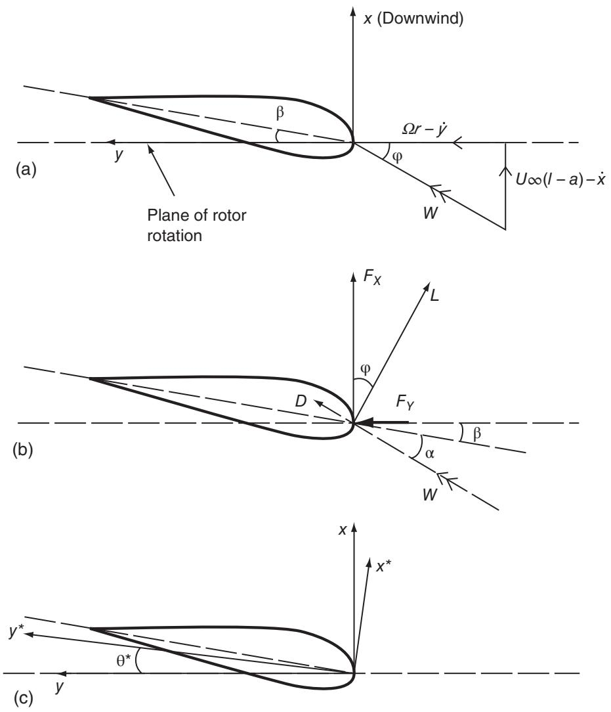  
Figure 7.30 (a) Velocity diagram for vibrating blade (looking towards hub). (b) Out-of-plane and in-plane components of lift and drag forces. (c) Directions of vibrations ${ \mathrm { ~ X } } ^ { * }$ and ${ \mathrm { y } } ^ { * }$

Substituting V for $U _ { \infty } ( 1 - a )$ for brevity, the in-plane damping coefrcient is derived as follows:

$$
\widehat {c} _ {Y} (r) = - \frac {\partial F _ {Y}}{\partial \dot {y}} = - \frac {1}{2} \rho c \left\{\frac {\partial W}{\partial \dot {y}} \left[ - C _ {l} V + C _ {d} \Omega r \right] + W \left[ - \frac {\partial C _ {l}}{\partial \dot {y}} V + \frac {\partial C _ {d}}{\partial \dot {y}} \Omega r - C _ {d} \right] \right\} \tag {7.36}
$$

Noting that $\frac { \partial W } { \partial \dot { y } } = - \frac { \Omega r } { W }$ and $\frac { \partial C _ { l } } { \partial \dot { y } } = \frac { \partial C _ { l } } { \partial \alpha } \frac { \partial \alpha } { \partial \dot { y } } = \frac { \partial C _ { l } } { \partial \alpha } \frac { \partial \varphi } { \partial \dot { y } } = \frac { \partial C _ { l } } { \partial \alpha } \frac { V } { W ^ { 2 } }$ , this equation becomes

$$
\widehat {c} _ {Y} (r) = \frac {1}{2} \rho c \frac {\Omega r}{W} \left\{- V C _ {l} + \frac {V ^ {2}}{\Omega r} \frac {\partial C _ {l}}{\partial \alpha} + \frac {2 \Omega^ {2} r ^ {2} + V ^ {2}}{\Omega r} C _ {d} - V \frac {\partial C _ {d}}{\partial \alpha} \right\} \tag {7.37}
$$

The ‘cross’ coefrcients and the out-of-plane damping coefrcient and are derived by a similar procedure:

$$
\widehat {c} _ {Y X} (r) = \frac {1}{2} \rho c \frac {\Omega r}{W} \left\{- \frac {\Omega^ {2} r ^ {2} + 2 V ^ {2}}{\Omega r} C _ {l} - V \frac {\partial C _ {l}}{\partial \alpha} + V C _ {d} + \Omega r \frac {\partial C _ {d}}{\partial \alpha} \right\} \tag {7.38}
$$

$$
\widehat {c} _ {X Y} (r) = \frac {1}{2} \rho c \frac {\Omega r}{W} \left\{+ \frac {2 \Omega^ {2} r ^ {2} + V ^ {2}}{\Omega r} C _ {l} - V \frac {\partial C _ {l}}{\partial \alpha} + V C _ {d} - \frac {V ^ {2}}{\Omega r} \frac {\partial C _ {d}}{\partial \alpha} \right\} \tag {7.39}
$$

$$
\widehat {c} _ {X} (r) = \frac {1}{2} \rho c \frac {\Omega r}{W} \left\{+ V C _ {l} + \Omega r \frac {\partial C _ {l}}{\partial \alpha} + \frac {\Omega^ {2} r ^ {2} + 2 V ^ {2}}{\Omega r} C _ {d} + V \frac {\partial C _ {d}}{\partial \alpha} \right\} \tag {7.40}
$$

It is apparent from inspection of the expressions for the two damping coefrcients, $\widehat { c } _ { Y }$ and $\widehat { c } _ { X }$ , that the choice of an aerofoil with a gentler stall – i.e. with a smaller lift curve slope after stall onset – will increase the damping coefrcient in both cases. Note that the modal damping coefrcient is dominated by the damping per unit length over the outboard part of the blade, so it is important to select an aerofoil with a gentle stall in this area only.

The choice of aerofoil also affects performance, so there is merit in expressing the damping coefrcients in terms of the power output to investigate possible trade-offs between them. It transpires that the damping and ‘cross’ coefrcients per unit length can be formulated quite simply in terms of the power output per unit length of blade, $P ^ { \prime } ( r , V ) = \Omega r ( - F _ { Y } )$ , and the blade thrust per unit length, $F _ { X } ,$ , as follows:

$$
\widehat {c} _ {Y} = - \frac {2}{\Omega^ {2} r ^ {2}} P ^ {\prime} + \frac {V}{\Omega^ {2} r ^ {2}} \frac {\partial P ^ {\prime}}{\partial V} = \frac {1}{\Omega^ {2} r ^ {2}} \left(- 2 P ^ {\prime} + V \frac {\partial P ^ {\prime}}{\partial V}\right) \tag {7.41}
$$

$$
\widehat {c} _ {X Y} = - \frac {\partial F _ {Y}}{\partial \dot {x}} = \frac {\partial F _ {Y}}{\partial V} = \frac {1}{\Omega r} \frac {\partial}{\partial V} (\Omega r F _ {Y}) = - \frac {1}{\Omega r} \frac {\partial P ^ {\prime}}{\partial V} \tag {7.42}
$$

$$
\widehat {c} _ {X Y} = \frac {1}{\Omega r} \left(2 F _ {X} - V \frac {\partial F _ {X}}{\partial V}\right) \tag {7.43}
$$

$$
\widehat {c} _ {X} = - \frac {\partial F _ {X}}{\partial \dot {x}} = \frac {\partial F _ {X}}{\partial V} \tag {7.44}
$$

Equations (7.41) and $( 7 . 4 3 )$ are derived from the equations $\Omega r \widehat { c } _ { Y } + V \widehat { c } _ { Y X } = 2 F _ { Y } =$ $- 2 P ^ { \prime } / \Omega r$ and $\Omega r \widehat { c } _ { X Y } + V \widehat { c } _ { X } = 2 F _ { X }$ which may be verired using Eqs. $( 7 . 3 7 ) { - } ( 7 . 4 0 )$ .

From Eq. (7.41), it is clear that the damping coefrcient in the in-plane direction ${ \textstyle \widehat { \mathcal { C } } } _ { Y }$ , will always be negative unless $\frac { \partial P ^ { \prime } } { \partial V }$ exceeds $2 \frac { P ^ { \prime } } { V }$ , and that a negative power curve slope should be avoided if the size of the negative damping is to be kept small.

# Effect of blade twist

In the discussion so far, damping of vibrations in the out-of-plane and in-plane directions only has been considered. In practice, blade twist will result in the sapwise and edgewise vibrations taking place in directions rotated from the out-of-plane and in-plane directions in the same sense as the blade twist, but by a lesser amount (see Section 5.8.1). If we derne $x ^ { * }$ and $y ^ { * }$ axes in the directions of the sapwise and edgewise displacements, each making an angle of $\boldsymbol { \theta } ^ { * }$ to the x and y axes, respectively, as shown in Figure 7.30c, then the edgewise damping coefrcient per unit length is given by

$$
\widehat {c} _ {Y *} = \widehat {c} _ {Y} \cos^ {2} \theta^ {*} - \left(\widehat {c} _ {Y X} + \widehat {c} _ {X Y}\right) \sin \theta^ {*} \cos \theta^ {*} + \widehat {c} _ {X} \sin^ {2} \theta^ {*} \tag {7.45}
$$

Substitution of Eqs. (7.41)–(7.44) in Eq. (7.45) yields

$$
\begin{array}{l} \widehat {c} _ {Y ^ {*}} = \cos^ {2} \theta^ {*} \left[ \frac {1}{\Omega^ {2} r ^ {2}} \left(- 2 P ^ {\prime} + V \frac {\partial P ^ {\prime}}{\partial V}\right) \right] + \cos \theta^ {*} \sin \theta^ {*} \left[ \frac {1}{\Omega r} \left(- \frac {\partial P ^ {\prime}}{\partial V} + 2 F _ {X} - V \frac {\partial F _ {X}}{\partial V}\right) \right] \\ + \sin^ {2} \theta^ {*} \left(\frac {\partial F _ {X}}{\partial V}\right) \tag {7.46} \\ \end{array}
$$

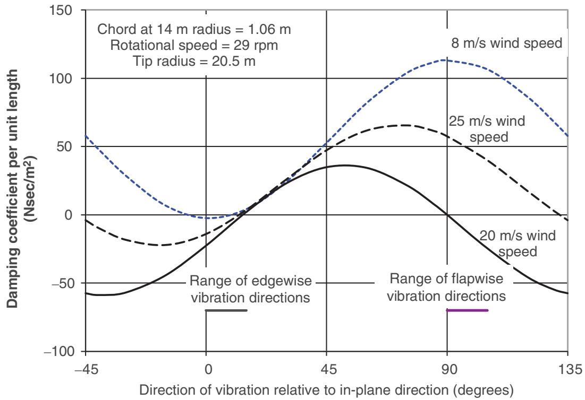

line

| Direction of vibration relative to in-plane direction (degrees) | Damping coefficient per unit length (Nsec/m²) for 20 m/s wind speed | Damping coefficient per unit length (Nsec/m²) for 25 m/s wind speed | Damping coefficient per unit length (Nsec/m²) for 8 m/s wind speed |
| --- | --- | --- | --- |
| -45 | -60 | 0 | 60 |
| 0 | -70 | -20 | 0 |
| 45 | 35 | 50 | 50 |
| 90 | 0 | 60 | 110 |
| 135 | -60 | 0 | 60 |

Figure 7.31 Variation in damping coefrcient at 14 m radius with vibration direction for example aerofoil

This expression also gives the sapwise damping coefrcient per unit length if $\boldsymbol { \theta } ^ { * }$ is replaced by ${ \boldsymbol { \theta } } ^ { * } + 9 0 ^ { o }$ throughout.

The variation of the damping coefrcient ${ \widehat { c } } _ { Y ^ { * } }$ per unit length at 14 m radius with vibration direction, $\boldsymbol { \theta } ^ { * }$ , at three different wind speeds is illustrated in Figure 7.31 for a specimen aerofoil section on a 20.5 m tip radius blade rotating at 29 rpm. The data is taken from Petersen et al. (1998), and does not include allowance for the axial induction factor. It can be seen that negative damping is worst at 20 m/s, and that negative edgewise damping is ameliorated by increasing $\boldsymbol { \dot { \theta } } ^ { * }$ at the expense of increasing negative sapwise damping.

Although a plot of the local damping coefrcient at ca 70% radius can provide a useful indication of trends, the best guide to the likelihood of divergent oscillations is provided by the modal damping coefrcient for the mode under consideration. This is obtained by multiplying the right hand side of Eq. (7.46) by the square of the local modal amplitude and integrating over the length of the blade.

If comparison of the rrst mode edgewise and sapwise modal damping coefrcients shows there is a benert to be gained from altering the direction of vibration, small changes can be made by redistributing material within the blade cross-section. Alternatively the blade pitch could be altered in conjunction with a compensatory change in aerofoil camber so that the aerodynamic properties for any given insow angle are unchanged.

The prediction of edgewise vibrations in stall is examined in detail by Petersen et al. (1998), whose work provides the basis of the introductory survey given here. They concluded that the fundamental cause of edgewise blade oscillations that had been observed on some stall-regulated machines of 40 m diameter and over was negative aerodynamic damping, but found that the use of dynamic stall models improved the level of agreement with measurements.

# Coupling of edgewise blade mode and rotor whirl modes

A further important rnding was that, on one machine subject to stall-induced vibrations that was investigated in detail, there was coupling between the blade rrst edgewise mode and one of the second rotor whirl modes. The rotor whirl modes arise from the combination of simultaneous nodding and yawing oscillations of the rotor shaft, which occur at the same frequency during operation due to gyroscopic effects. As a result, the rotor hub traces out a circular or elliptical path, running either in the same direction as rotor rotation or in reverse, which explains the existence of two rrst and second modes.

The explanation for the coupling was as follows. When a pair of blades vibrate in the edgewise direction in anti-phase, they impart a sinusoidally varying in-plane force to the rotor hub even though their edgewise root bending moments cancel out. The direction of this oscillating force rotates with the rotor, so it has horizontal and vertical components of the form sin $( \omega _ { 1 } t + \eta )$ .sin훺t and sin $( \omega _ { 1 } t + \eta )$ .cos훺t, where $\omega _ { 1 }$ is the frequency of the blade rrst edgewise mod, and 훺 is the speed of rotor rotation. With respect to stationary axes the in-plane loads on the hub therefore act at two frequencies – namely, $\omega _ { 1 } + \varOmega$ and $\omega _ { 1 } - \Omega$ . In the case of the machine investigated by Petersen et al., the upper frequency of $2 . 9 + 0 . 5 = 3 $ .4 Hz coincided with the backward second rotor whirl mode, allowing interaction between this mode and the blade rrst edgewise mode.

Simulations were carried out on an aeroelastic model of the turbine at various wind speeds and satisfactory agreement obtained between simulated and measured behaviour. In particular, the simulation at 23.2 m/s predicted the build-up of large blade root edgewise moment oscillations at the rrst mode frequency, as observed on the real machine at this wind speed. Signircantly, when the latter simulation was repeated with the rotor shaft stiffness increased sufrciently to increase the backward second rotor whirl mode frequency to 3.6 Hz, the predicted blade root edgewise moment oscillations were negligible by comparison.

# Mechanical damping

An alternative strategy for preventing damaging edgewise vibrations is the incorporation of a tuned mass damper inside the blade towards the tip. The performance of such a damper on a 22 m tip radius blade is reported by Anderson et al. (1998). It was found that the rtting of a damper tuned to the rrst mode edgewise frequency, and weighing only 0.4% of the total blade weight, effectively suppressed the edgewise vibrations that had previously been observed during high wind speed operation.

# 7.1.16 Design against buckling

Thrust loading on the wind turbine rotor during operation subjects the blade shell and spar cap on the suction face of the blade to suctuating axial compression loading. Moreover, axial compression will be generated in either face by wind loads during standstill. Figures 7.32 and 7.33 illustrate the buckling mode shapes for the suction face trailing panel and suction side spar cap of the DTU 10 MW reference wind turbine design.

This section explores how the spar cap and sandwich panels forming the blade shell may be designed against buckling.

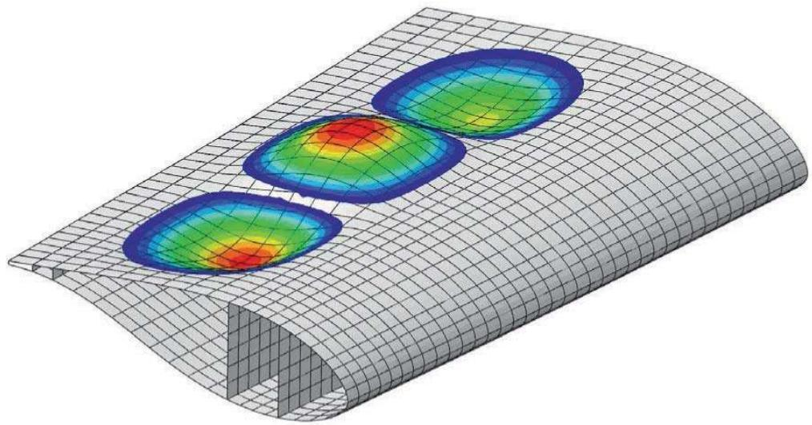

natural_image

3D mesh model of a curved surface with three localized oval-shaped contours, colored by intensity (no text or symbols)

Figure 7.32 Typical buckling mode shape of DTU 10 MW reference turbine suction face trailing sandwich panel. Taken from DTU Wind Energy Report I-0092, ‘Description of the DTU 10 MW Reference Wind Turbine’ (Bak et al. 2013), and reproduced with the permission of the publisher, Danish Technical University

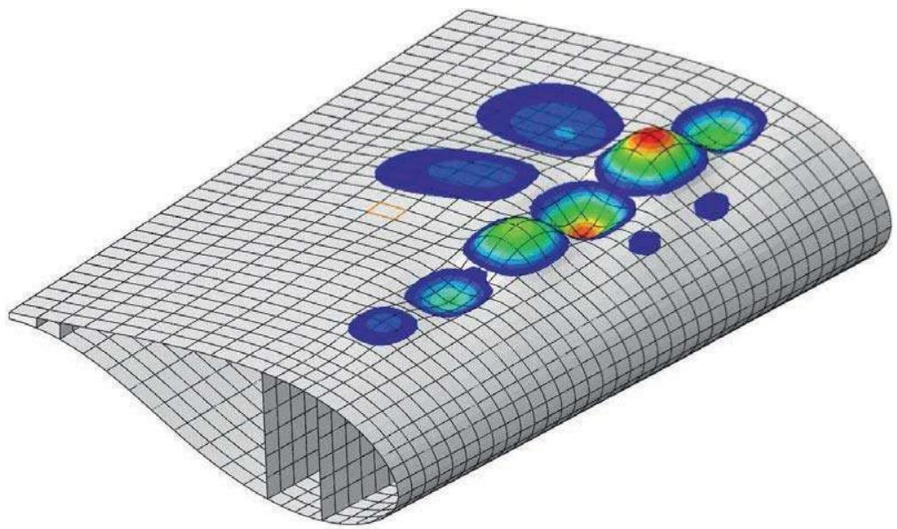

natural_image

3D simulation of a curved surface with heat map overlays, showing localized hotspots (no text or symbols)

Figure 7.33 Typical buckling mode shape of DTU 10 MW reference turbine suction side spar cap. Taken from DTU Wind Energy Report I-0092, ‘Description of the DTU 10 MW Reference Wind Turbine’ (Bak et al. 2013), and reproduced with the permission of the publisher, Danish Technical University

# Critical buckling stress

The stress at which a slender plate element without imperfections buckles under compression loading is known as the critical buckling stress. The derivation of the critical buckling stresses for thin walled curved panels bounded by stiffeners, which typically form the blade load-bearing structure, is relatively straightforward when the panel material is isotropic and solutions are provided in Timoshenko and Gere (1961). These do not apply to composite materials such as the GFRP and wood laminates commonly used in blade manufacture, however, as these are anisotropic, but solutions can be derived using the energy method, as outlined below.

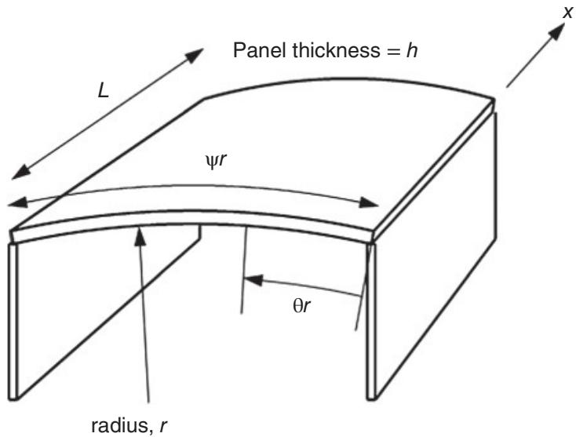

text_image

Panel thickness = h
L
ψr
θr
radius, r
x

Figure 7.34 Curved panel spanning between shear webs

Consider a long cylindrical panel of length L, radius r and thickness h, supported along two generators and subtending an angle 휓 at the cylinder axis (Figure 7.34), which is axially loaded in compression. If it desects to form n half waves around the circumference between supports and m half waves along its length, then its out-of-plane desection can be written as

$$
w = C \sin \frac {n \pi \theta}{\psi} \sin \frac {m \pi x}{L} \tag {7.47}
$$

where 휃 and x are the coordinates of the desected point with respect to one of the long edges and one end, respectively. In the absence of in-plane direct strains in the plate, this out-of-plane desected prorle will result in circumferential desections:

$$
v _ {0} = \frac {C \psi}{n \pi} \cos \frac {n \pi \theta}{\psi} \sin \frac {m \pi x}{L} \tag {7.48}
$$

These desections will result in in-plane shear stresses, which reach a maximum at the corners of each rectangular buckled panel. In practice, additional in-plane desections occur to moderate these shear stresses, as follows:

$$
u = A \sin {\frac {n \pi \theta}{\psi}} \cos {\frac {m \pi x}{L}} \text { in   the   axial   direction }
$$

$$
v = B \cos \frac {n \pi \theta}{\psi} \sin \frac {m \pi x}{L} \text {   in   the   circumferential   direction } \tag {7.49}
$$

The in-plane strain energy is calculated as

$$
U _ {2} = \frac {1}{2} h \iint (\sigma_ {1} \varepsilon_ {1} + \sigma_ {2} \varepsilon_ {2} + \tau \gamma) r d \theta d x \tag {7.50}
$$

with the sufrxes 1 and 2 denoting the axial and circumferential directions, respectively, so that

$$
\varepsilon_ {1} = \frac {\partial u}{\partial x}, \quad \varepsilon_ {2} = \frac {\partial v}{r \partial \theta}, \quad \gamma = \frac {\partial u}{r \partial \theta} + \frac {\partial (v _ {0} + v)}{\partial x} \tag {7.51}
$$

Substituting $\sigma _ { 1 } = E _ { x } ( \varepsilon _ { 1 } + \upsilon _ { \nu } \varepsilon _ { 2 } ) / ( 1 - \upsilon _ { x } \upsilon _ { \nu } ) , \sigma _ { 2 } = E _ { \nu } ( \varepsilon _ { 2 } + \upsilon _ { x } \varepsilon _ { 1 } ) / ( 1 - \upsilon _ { x } \upsilon _ { \nu } )$ and $\boldsymbol { \tau } = \mathbf { G } _ { \mathrm { x y } } \gamma$ , where $E _ { x } , E _ { \nu } ,$ , and $G _ { x \nu }$ are the longitudinal, transverse, and shear moduli of the laminate, respectively (obtained by averaging the corresponding moduli of the individual plies), and $\upsilon _ { \mathrm { x } }$ and $\upsilon _ { \mathrm { y } }$ are the effective Poisson’s ratios, the in-plane strain energy becomes

$$
U _ {2} = \frac {h}{2 (1 - v _ {x} v _ {y})} \iint [ E _ {x} \varepsilon_ {1} ^ {2} + E _ {y} \varepsilon_ {2} ^ {2} + 2 E _ {x} v _ {y} \varepsilon_ {1} \varepsilon_ {2} + (1 - v _ {x} v _ {y}) \gamma^ {2} G _ {x y} ] r d \theta d x \tag {7.52}
$$

Substituting the expressions for $\varepsilon _ { 1 } , \varepsilon _ { 2 }$ , and 훾 from Eq. (7.51) and integrating over the width of the panel, $\psi r ,$ and the length of one half wave, L/m, we obtain

$$
U _ {2} = \frac {E _ {x} h}{1 - v _ {x} v _ {y}} \psi r \frac {L}{m} \left(\frac {m \pi}{L}\right) ^ {2} \frac {C ^ {2}}{8} \left[ \begin{array}{l} \alpha^ {2} + \beta^ {2} \frac {E _ {y}}{E _ {x}} \left(\frac {n}{\lambda}\right) ^ {2} + 2 v _ {y} \alpha \beta \left(\frac {n}{\lambda}\right) \\ + (1 - v _ {x} v _ {y}) \frac {G _ {x y}}{E _ {x}} \left\{\alpha \left(\frac {n}{\lambda}\right) + \beta + \frac {\psi}{n \pi} \right\} ^ {2} \end{array} \right] \tag {7.53}
$$

where $\lambda = { \frac { m \psi r } { I . } }$ and the ratios $\alpha = A / C$ and $\beta = B / C$ are yet to be determined.

The expression for the strain energy of curvature is derived as follows. Replacing the angular coordinate 휃 by the linear coordinate $y \left( = r \theta \right)$ , the bending energy absorbed in an area dx.dy is

$$
d U _ {b} = - \frac {1}{2} \left(M _ {x} \frac {\partial^ {2} w}{\partial x ^ {2}} + M _ {y} \frac {\partial^ {2} w}{\partial y ^ {2}}\right) d x. d y
$$

where Mx = −Dx 휕2푤휕x2 $\begin{array} { r } { M _ { x } = - D _ { x } \frac { \partial ^ { 2 } w } { \partial x ^ { 2 } } - D _ { x y } \frac { \partial ^ { 2 } w } { \partial y ^ { 2 } } } \end{array}$ − Dxy 휕2푤휕y2 and $\begin{array} { r } { M _ { y } = - D _ { y } \frac { \partial ^ { 2 } w } { \partial \nu ^ { 2 } } - D _ { x y } \frac { \partial ^ { 2 } w } { \partial x ^ { 2 } } } \end{array}$ − Dxy 휕2푤휕x2 for a specially orthotropic laminate – i.e. one in which the reinforcement in each layer is either oriented at $0 ^ { \circ }$ or $9 0 ^ { \circ }$ , or is bidirectional with the same amount of rbres at $+ \theta ^ { \mathrm { o } }$ and $- \theta ^ { \mathrm { o } } . D _ { x }$ and $D _ { y }$ are the sexural rigidities of the laminate when sat, for bending about the y axis and x axis, respectively, and $D _ { x \nu }$ is the ‘cross-sexural rigidity’ – i.e. the moment per unit width about one axis generated by unit curvature about the other. Hence

$$
d U _ {b} = \frac {1}{2} \left(D _ {x} \left(\frac {\partial^ {2} w}{\partial x ^ {2}}\right) ^ {2} + 2 D _ {x y} \frac {\partial^ {2} w}{\partial x ^ {2}} \frac {\partial^ {2} w}{\partial y ^ {2}} + D _ {y} \left(\frac {\partial^ {2} w}{\partial y ^ {2}}\right) ^ {2}\right) d x d y \tag {7.54}
$$

The twisting energy absorbed in an area dx dy is

$$
d U _ {t} = \frac {1}{2} (M _ {x y} + M _ {y x}) \frac {\partial^ {2} w}{\partial x \partial y} d x d y
$$

where $\begin{array} { r } { M _ { x y } = 2 \left\lceil \int _ { - h / 2 } ^ { h / 2 } G _ { x y } ( z ) . z ^ { 2 } d z \right\rceil \frac { \partial ^ { 2 } w } { \partial x \partial y } } \end{array}$ , in which z is the distance measured from the mid-plane of the laminate, $G _ { x y } ( z )$ is the in-plane shear modulus at that distance and h is the laminate thickness. Denoting the torsional rigidity, $\begin{array} { r } { \left[ \int _ { - h / 2 } ^ { h / 2 } G _ { x y } ( z ) . z ^ { 2 } d z \right] } \end{array}$ , by $D _ { T }$ , then

$$
d U _ {t} = \frac {1}{2}. 4 D _ {T} \left(\frac {\partial^ {2} w}{\partial x \partial y}\right) ^ {2} d x d y \tag {7.55}
$$

The total strain energy of curvature over the width of the panel and the length of one half wave is found by substituting the out-of-plane desection given by Eq. (7.47) in Eqs. (7.54) and (7.55) and integrating over this area, which gives

$$
U _ {1} = U _ {b} + U _ {t} = \frac {C ^ {2}}{8} \frac {\psi r L}{m} D _ {x} \left(\frac {m \pi}{L}\right) ^ {4} \left[ 1 + \left(\frac {n}{\lambda}\right) ^ {4} \frac {D _ {y}}{D _ {x}} + \left(\frac {n}{\lambda}\right) ^ {2} \left\{2 \frac {D _ {x y}}{D _ {x}} + 4 \frac {D _ {T}}{D _ {x}} \right\} \right] \tag {7.56}
$$

The energy absorbed by the panel during buckling as a result of in-plane strains and out-of-plane curvature is equal to the work done by the critical axial load as the panel shortens. The shortening of the panel over one half wave length is given by

$$
\int_ {o} ^ {L / m} \frac {1}{2} \left(\frac {\partial w}{\partial x}\right) ^ {2} d x = \frac {\pi^ {2}}{4} C ^ {2} \frac {m}{L} \sin^ {2} \frac {n \pi \theta}{\psi} \tag {7.57}
$$

so the work done by the axial force of $\mathbf { N } _ { \mathrm { x } }$ per unit width over the panel width is

$$
T _ {1} = \frac {\pi^ {2}}{8} C ^ {2} \frac {m}{L} \psi r N _ {x} \tag {7.58}
$$

The equality $\mathrm { T } _ { 1 } = \mathrm { U } _ { 1 } + \mathrm { U } _ { 2 }$ yields the critical value of the axial force as follows:

$$
\begin{array}{l} (N _ {x}) _ {c r} = D _ {x} \left(\frac {m \pi}{L}\right) ^ {2} \left[ 1 + \left(\frac {n}{\lambda}\right) ^ {4} \frac {D _ {y}}{D _ {x}} + \left(\frac {n}{\lambda}\right) ^ {2} \left\{2 \frac {D _ {x y}}{D _ {x}} + 4 \frac {D _ {T}}{D _ {x}} \right\} \right] \\ + \frac {E _ {x} h}{1 - v _ {x} v _ {y}} \left[ \alpha^ {2} + \beta^ {2} \frac {E _ {y}}{E _ {x}} \left(\frac {n}{\lambda}\right) ^ {2} + 2 \alpha \beta v _ {y} \frac {n}{\lambda} + (1 - v _ {x} v _ {y}) \frac {G _ {x y}}{E _ {x}} \left\{\alpha \frac {n}{\lambda} + \beta + \frac {\psi}{n \pi} \right\} ^ {2} \right] \tag {7.59} \\ \end{array}
$$

Noting that $\frac { m \pi } { L } = \frac { m \psi r } { n L } \frac { n \pi } { \psi r } = \frac { \lambda } { n } \frac { n \pi } { \psi r }$ , this equation becomes

$$
\begin{array}{l} (\sigma_ {x}) _ {c r} = \frac {D _ {x}}{h} \left(\frac {\lambda}{n} \frac {n \pi}{\psi r}\right) ^ {2} \left[ 1 + \left(\frac {n}{\lambda}\right) ^ {4} \frac {D _ {y}}{D _ {x}} + \left(\frac {n}{\lambda}\right) ^ {2} \left\{2 \frac {D _ {x y}}{D _ {x}} + 4 \frac {D _ {T}}{D _ {x}} \right\} \right] \\ + \frac {E _ {x}}{1 - v _ {x} v _ {y}} \left[ \alpha^ {2} + \beta^ {2} \frac {E _ {y}}{E _ {x}} \left(\frac {n}{\lambda}\right) ^ {2} + 2 \alpha \beta v _ {y} \frac {n}{\lambda} + (1 - v _ {x} v _ {y}) \frac {G _ {x y}}{E _ {x}} \left\{\alpha \frac {n}{\lambda} + \beta + \frac {\psi}{n \pi} \right\} ^ {2} \right] \tag {7.60} \\ \end{array}
$$

The right hand side of Eq. (7.60) contains four unknowns, the number of transverse half waves, n, the ratio of longitudinal to transverse half wave length, n/휆, and the factors 훼 and 훽. Assuming that there is only one transverse half wave, as is normally the case, the expression is minimised with respect to 훼, and 훽 for each value of n/휆, and then with respect to n/휆 to obtain the critical stress.

The results of this exercise are illustrated for curved UD laminate panels of varying widths in Figure 7.35. The radius of curvature, r, of 2000 mm and thickness, h, of 30 mm are kept constant and chosen to be representative of the values likely to obtain on the suction face near mid-span on a blade with 40 m tip radius. The rbres of all of the laminate plies are orientated axially, and the longitudinal and tranverse moduli are taken as 43.0 GPa and14.7 GPa, respectively, based on a rbre modulus of 75 GPa and a rbre volume fraction of 0.55. The other laminate properties required for evaluation of the critical stress are detailed on the rgure.

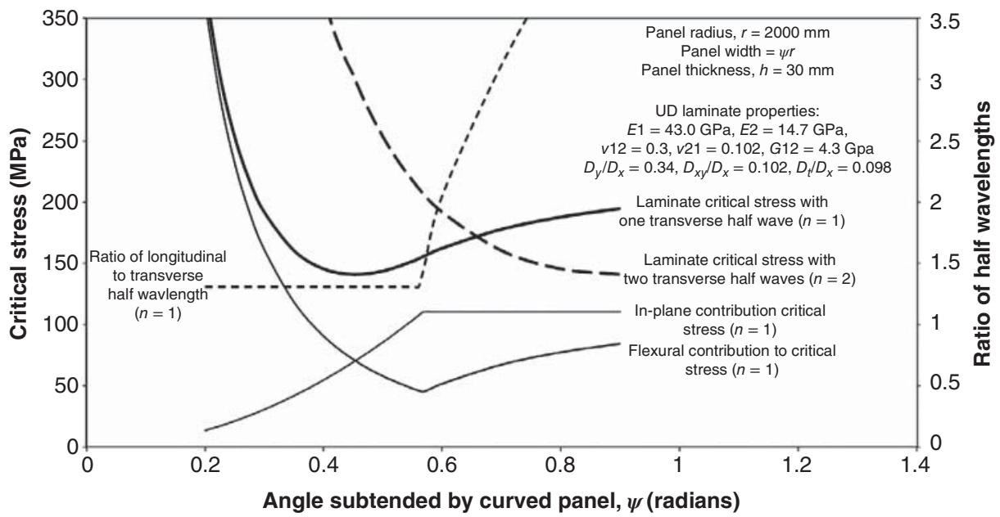

line

| Angle subtended by curved panel, ψ (radians) | Critical stress (MPa) - Panel radius, r = 2000 mm | Critical stress (MPa) - Panel width = ψr, Panel thickness, h = 30 mm | Ratio of longitudinal to transverse half wavelength (n = 1) | Ratio of longitudinal to transverse half wavelength (n = 2) | Ratio of longitudinal to transverse half wavelength (n = 1) | In-plane contribution critical stress (n = 1) | Flexural contribution to critical stress (n = 1) |
| --------------------------------------------- | -------------------------------------------------- | ------------------------------------------------------------------- | ------------------------------------------------------ | ------------------------------------------------------ | ----------------------------------------------------- | ------------------------------------------ | ---------------------------------------------- |
| 0.2                                           | ~350                                               | ~3.5                                                                | ~120                                                   | ~140                                                   | ~120                                                | ~10                                        | ~10                                            |
| 0.4                                           | ~250                                               | ~2.5                                                                | ~80                                                    | ~100                                                   | ~80                                                 | ~60                                        | ~60                                            |
| 0.6                                           | ~150                                               | ~1.5                                                                | ~40                                                    | ~60                                                    | ~40                                                 | ~110                                       | ~110                                           |
| 0.8                                           | ~180                                               | ~1.8                                                                | ~70                                                    | ~90                                                    | ~70                                                 | ~80                                        | ~80                                            |
| 1.0                                           | ~200                                               | ~2.0                                                                | ~80                                                    | ~100                                                   | ~80                                                 | ~90                                        | ~90                                            |
| 1.2                                           | ~220                                               | ~2.2                                                                | ~90                                                    | ~110                                                   | ~90                                                 | ~100                                       | ~100                                           |
| 1.4                                           | ~240                                               | ~2.4                                                                | ~100                                                   | ~120                                                   | ~100                                                | ~110                                       | ~110                                           |

Figure 7.35 Variation of axial critical buckling stress with panel width for a 2000 mm radius × 30 mm thick curved anisotropic panel of UD laminate

The heavy curve in Figure 7.35 shows the variation in axial critical stress with panel width (in terms of subtended angle) when the buckled shape has only a single half wave in the transverse direction and the rne lines below show the separate in-plane and sexural contributions. The minimum stress of 141 MPa occurs when the angle subtended by the panel is about $2 5 ^ { \circ }$ , but there is only a gradual increase in critical stress as the angle increases above this. When the subtended angle exceeds about $3 7 ^ { \circ }$ , buckling with two half waves in the transverse direction takes over as the critical mode – see dashed line.

The ratio of the longitudinal half wave length to the transverse half wave length is constant and equal to the quartic root of the ratio $D _ { x } / D _ { y } - \mathrm { i } . \mathrm { e } . \ 1 . 3 0 9$ for an angle subtended by the panel of less than $3 2 ^ { \circ }$ or 0.56 rad. The maximum additional in-plane desections are a relatively small constant proportion of the maximum circumferential desection due to the out of plane desection, $C \psi / \pi$ , with $\alpha / ( \psi / \pi ) = - 0 . 0 8 5$ and $\beta / ( \psi / \pi ) = - 0 . 1 1 1$ for $\psi < 0 . 5 6$ rad.

Figure 7.36 shows how the critical buckling stress increases with panel curvature for a panel of rxed width. As noted above, a radius of curvature of 2000 mm is representative of the values likely to obtain on the suction face near mid-span on a blade with 40 m tip radius. Thus, for a 500 mm wide curved spar cap subtending an angle of 0.25 rad (about $1 4 ^ { \circ } )$ , the effect of the curvature is to increase the critical buckling stress from 232 to 253 MPa in this example, which corresponds to an increase of about 9% in comparison with an equivalent sat plate.

# Allowance for imperfections

In practice, there will be small out-of-plane deviations from the theoretical panel shape due to manufacturing tolerances, with the result that compression loading will generate additional bending stresses. In the worst case, the prorle of the deviation will correspond to the buckling mode shape, and the compression load will magnify the deviation by the factor $1 / ( 1 - P / P _ { c r i t } )$ , where P is the load applied to the panel and $P _ { c r i t }$ is its critical buckling load. The Germanischer Lloyd Guideline for the CertiScation of Wind Turbines (2010) specires that a maximum out-of-plane deviation of 1/400 of the buckling wavelength – i.e. the distance between adjacent nodes of the buckling mode shape – should be allowed for unless a smaller value can be justired by measurements. The design is deemed to be satisfactory if the total compression stress (axial plus bending) is less than the permitted value. Alternatively, the effect of imperfections may be allowed for by the application of an appropriate additional partial safety factor.

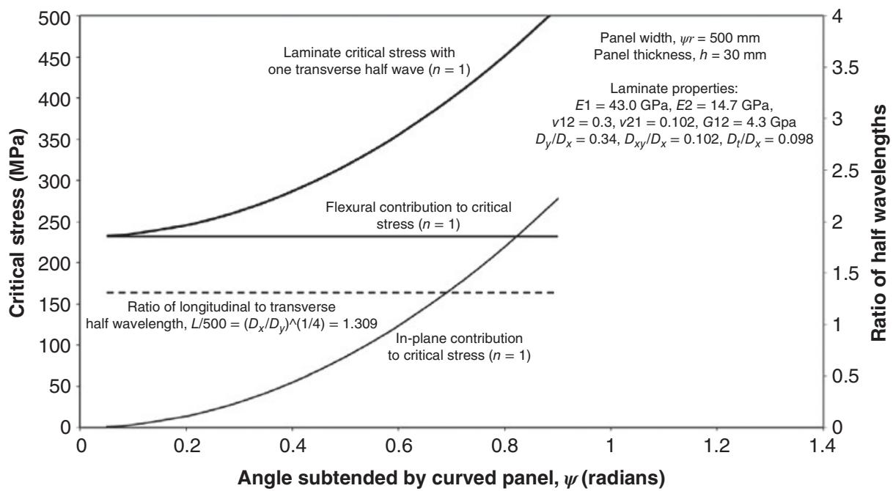

line

| Angle subtended by curved panel, ψ (radians) | Laminate critical stress with one transverse half wave (n = 1) | Flexural contribution to critical stress (n = 1) | In-plane contribution to critical stress (n = 1) |
| --------------------------------------------- | --------------------------------------------------------------- | -------------------------------------------------- | ------------------------------------------------- |
| 0.0                                           | 240                                                             | 240                                                | 0                                                 |
| 0.2                                           | 260                                                             | 240                                                | 20                                                |
| 0.4                                           | 300                                                             | 240                                                | 50                                                |
| 0.6                                           | 350                                                             | 240                                                | 100                                               |
| 0.8                                           | 400                                                             | 240                                                | 150                                               |
| 1.0                                           | 450                                                             | 240                                                | 200                                               |
| 1.2                                           | 500                                                             | 240                                                | 250                                               |
| 1.4                                           | -                                                               | -                                                  | -                                                 |

Figure 7.36 Variation of axial critical buckling stress with curvature for 500 mm wide × 30 mm thick curved anisotropic panel

# 7.1.17 Blade root Jxings

The rxing of the blade root to the hub is one of the most critical areas of blade design, because the order of magnitude difference between the relative stiffnesses of the steel hub and the blade material – usually GFRP or wood – militates against a smooth load transfer. The connection is usually made by steel bolts, which can either be embedded in the blade material in the axial direction or aligned radially to pass through the blade skin, but in either case stress concentrations are inevitable.

Figure 7.37 illustrates four different types of blade root rxings in section. The blade structure is usually a cylindrical shell at the root, in which case the stud or bolt rxings are arranged in a circle.

Figure 7.37a shows the carrot connector, which is the standard rxing for laminated wood blades. The connector consists of a tapered portion carbon-epoxy grouted into a stepped hole drilled into the end of the blade, together with a projecting threaded stud for attachment to the hub or pitch bearing. Connectors are either machined from high strength steel or cast from spheroidal graphite iron (SGI). They are normally pre-loaded to reduce fatigue loading. A similar connector, in which the embedded portion is cylindrical rather than tapered, is in common use on GFRP blades. The surface of the cylinder is often ribbed externally to improve anchorage within the surrounding GFRP.

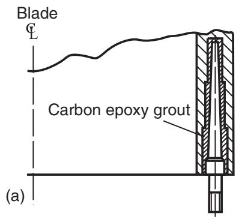

text_image

Blade
C
Carbon epoxy grout
(a)

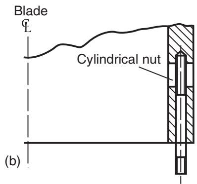

text_image

Blade
C
Cylindrical nut
(b)

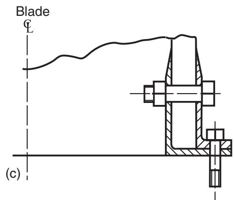

text_image

Blade
C
(c)

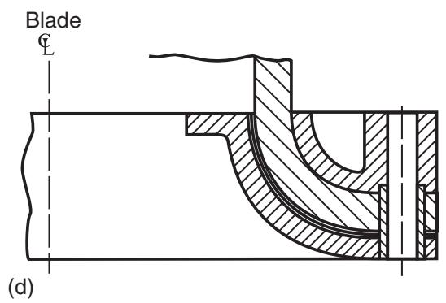

text_image

Blade
Φ
(d)

Figure 7.37 (a) Carrot connector, (b) T-bolt connector, (c) pin-hole sange, and (d) trumpet sange

Figures 7.37b–d show three further rxing arrangements used on GFRP blades. The T-bolt connector, shown in Figure 7.37b, consists of a steel stud inserted into a longitudinal hole in the blade skin, which engages with a cylindrical nut held in a transverse hole. The stud is pre-loaded to reduce fatigue loading.

The ‘pin-hole sange’ arrangement in Figure 7.37c uses the same method of load transfer between the GFRP and the steel – i.e. bearing on a transverse bolt – but the interface does not lend itself to pre-loading. Moreover, the bolts attaching the sange to the hub are eccentric to the blade shell, so the sange has to resist the resultant bending moment as well.

In the trumpet sange detailed in Figure 7.37d, the blade root is splayed out in the form of a trumpet mouth and clamped between inner and outer sanges by the ring of bolts that attach the sange to the hub. These bolts also pass through the GFRP skin to provide positive anchorage. Again, the sange has to resist bending moments arising from the eccentricity of the rxing bolts to the blade shell where it emerges from the sange. The pin-hole and trumpet sange arrangements are rarely used for larger blades.

The stress distributions calculated for blade root rxings are subject to signircant levels of uncertainty, so it is normal to conduct both static and fatigue tests on them to verify the suitability of the design. Static pull-out failures of carrot connectors occur as a result of shearing of the GFRP or wood surrounding the grout, but fatigue failures can also occur in the connector itself or the grout. However, SGI studs subjected to R = 0.1 fatigue loading at over 60% of the UTS have survived for approximately $1 0 ^ { 6 }$ cycles.

Mayer (1996) records the results of fatigue tests on the other blade root rxings featured in Figure 7.37, but in no case did failure occur as a result of fatigue of the GFRP in the region of the root rxing. In the case of the T-bolt rxing arrangement, failure occurred in the studs rather than in the GRP. The pin-hole sange specimens developed fatigue cracks in the GFRP in areas remote from the root rxings and the trumpet sange specimens developed cracks in the sanges themselves.

# 7.1.18 Blade testing

Although sophisticated analytical tools are available to underpin the development of a blade design, certain blade features are difrcult to model accurately. These include:

• Adhesive joints between webs and spar caps, some of which are assembled ‘blind’.   
• Adhesive joints at leading edge and trailing edge, also assembled ‘blind’.   
• Ply drops.   
• Manufacturing defects.   
• Manufacturing tolerances.

In view of this, recourse is usually made to full-scale blade testing, in order to determine blade strength more accurately, together with the testing of individual structural details such as joints. This in turn facilitates more economical design, as it enables a reduced partial safety factor for material strength to be used $( \Upsilon _ { \mathrm { m } 4 }$ (A) in Table 7.10). Technical requirements for blade testing are set out in IEC 61400-23: 2014 and DNVGL-ST-0376 (2015).

There are three types of full-scale blade tests – modal, static and fatigue. In each case, the blade is attached to a rigid structure at its root, with its axis horizontal for loadings sideways or tilted upwards for loading vertically downwards. In modal testing, a number of modes – e.g. the rrst and second sapwise, rrst and second edgewise and torsional – are separately manually excited and the frequencies measured and compared with predicted values.

# Static testing

Four separate static tests are normally carried out, with the loads applied in the two sapwise and edgewise directions in turn. Loading in one sapwise and one edgewise direction is generally not considered sufrcient, because of the differing buckling behaviour in each case. Loads are introduced at several radii to approximate reasonably closely to the design load prorle and increased in stages until a loading 10% above the design loading is reached. The maximum desection will be very large – up to around 30% of blade length for a GFRP blade. The blade will have been strain gauged at regular intervals along its length on both the suction and pressure sides and the leading and trailing edges, enabling strain readings to be recorded at each loading stage, together with desection measurements. Following completion of the load test, the blade is thoroughly inspected for any signs of damage.

# Fatigue testing

Fatigue tests have to be designed so that the fatigue critical areas of the blade are subjected to load cycles that will cause at least the target fatigue damage, derned as the calculated lifetime fatigue damage due to the lifetime fatigue loads multiplied by a specired factor. Although it is simpler to run separate, sequential tests for fatigue loading in the sapwise and edgewise directions, it is difrcult to apply the target fatigue damage to points remote from both principal axes without overloading points close to these axes. This drawback can be ameliorated by applying loading cycles about both axes simultaneously in a single test (‘biaxial’ or ‘multi-axial’ testing) – see IEC 61400-23 Annex D.

Fatigue loads are normally applied by exciting the blade at its resonant frequency, either by means of a ground-mounted hydraulic actuator or an oscillating mass device rxed to the blade. It may be necessary to add weights to the blade to reduce the natural frequency so that the hydraulic pump can supply suid fast enough. Given the low natural frequencies of large blades (ca 0.6 Hz sapwise for an 80 m blade), it is normal to increase the magnitude of the loading cycles to reduce the number required and hence the duration of the test. A target cycle count of a million cycles is often adopted. Fatigue loading may be either constant amplitude or variable amplitude, but in the latter case it may not be practicable to scale up the magnitude of the larger cycles because of non-linear behaviour at higher loading. The mean loading should be close to that occurring under the operating conditions resulting in maximum fatigue damage.

DNVGL-ST-0376 (2015) specires that the target fatigue loading should be obtained by multiplying the lifetime design equivalent load for the requisite number of test cycles by three factors, $\Upsilon _ { \mathrm { n f } } , \Upsilon _ { \mathrm { s f } } ,$ and $\Upsilon _ { \mathrm { e f } } ,$ where $\Upsilon _ { \mathrm { n f } } = 1 . 1 5 , \Upsilon _ { \mathrm { s f } } = 1 . 1$ and takes account of blade to blade variation and $\Upsilon _ { \mathrm { e f } }$ takes account of the possible error in adopting a reduced number of cycles and is taken as 1.05 when the number of test cycles is about a million. Thus the overall factor is about 1.33. Individual factors with the same values are specired in IEC 61400-23, the rrst one being termed the partial factor for consequences of failure.

Biaxial testing can be carried out in two different ways. In one, the blade is forced to oscillate at the same frequency in the sapwise and edgewise directions – e.g. by hydraulic actuators. The relative phase angle between the oscillations can be set at $9 0 ^ { \circ }$ , mirroring the phase difference between sapwise and edgewise deterministic loads in operation. Alternatively the blade can be excited in the sapwise and edgewise directions at the respective resonant frequencies, with the result that the phase angle between the sapwise and edgewise load peaks is constantly changing. This test method requires a complex control system to continuously maintain the desired load amplitudes, as there is a degree of interaction between the sapwise and edgewise oscillations (Snowberg et al. 2014).

The blade should be inspected for signs of damage at frequent intervals during fatigue testing, as well as at the end. Acoustic emissions may be recorded during the test to provide warning of any incipient laminate failure.

# 7.1.19 Leading edge erosion

The principal causes of leading edge erosion are impact by raindrops, hailstones and airborne solids, such as sand, with the severity of the problem varying considerably from place to place because of climatic variation. A valuable overview of the incidence of leading edge erosion is provided by Keegan et al. (2013). The rate of erosion is critically dependent on tip speed.

The roughening of the smooth aerofoil arising from leading edge erosion results in reduced lift and increased drag, leading to reduced energy generation. In extreme cases, erosion may cause loss of structural strength. Much effort has therefore been directed at identifying suitable leading edge protection to reduce energy loss and the need for in-situ blade repairs.

# Energy loss

Measured data on power curve degradation due to roughening of the blade surface is scarce. A Sandia Laboratories Report analysed data from four years of operation of a pitch-regulated, megawatt-scale turbine (Ehrmann et al. 2017). In this case the source of roughness was general soiling of the blade during the dry months when the rain was not cleaning the blades, so the data was averaged separately over the wet and dry months, with mean rainfall of 1.7 in and 0.1 in, respectively. It was found that the power output in the dry months was reduced by an average of 4% for wind speeds between 50% and 90% of rated.

Ehmann et al. went on to investigate the effect of artircial surface roughening on aerofoil properties measured in a wind tunnel. Vinyl decals were afrxed to the leading edge, with roughness simulated by large numbers of randomly positioned raised discs approximately 3 mm in diameter. In a series of six experiments carried out with 0.14 mm tall discs and areal densities of 0%, 3%, 6%, 9%, 12%, and 15%, there was a clear trend of reducing lift curve slope and reducing maximum lift as disc density increased, reaching 7.3% reduction for 15% density. Drag also increased, leading to a maximum drop of the lift to drag ratio of 40%. The predicted loss in annual energy production for the NREL 5 MW turbine at a site with an 8.5 m/s mean wind speed was 2.3% for the higher disc densities. The NREL 5 MW turbine is pitch regulated, so losses due to blade roughness only occur below the rated speed of 11.4 m/s.

The gain in turbine annual energy production resulting from the repair of moderately eroded blades has been measured at an offshore site under the auspices of the UK Offshore Renewable Energy (ORE) Catapult, taking advantage of light detection and ranging (LiDAR) technology to measure incident wind speeds over the rotor swept area. This established that a gain in energy production of 1.5–2% was possible as a result of the repairs (ORE Catapult 2016).

# Rain drop impact

A coarse estimate of the maximum pressure exerted on a rigid plate during initial raindrop impact is provided by the water hammer equation, $p = \rho W V _ { s }$ , where W is the velocity of the raindrop relative to the blade and $V _ { \mathrm { s } }$ is the speed of sound in water (about 1500 m/s). Raindrop terminal velocities can reach 9 m/s for large droplets, so, for a 90 m/s tip speed, the relative velocity can reach around 100 m/s at 270∘ azimuth, giving a pressure estimate of 150 MPa. This reduces by about one third if allowance is made for the elasticity of the wind turbine blade matrix. Keegan et al. (2012) carried out numerical modelling of a 3 mm diameter rain drop impact on a wind turbine blade, treating it as an epoxy resin plate. For a 100 m/s impact velocity, the maximum von Mises stress was calculated at about 90 MPa, which exceeds the tensile strength of many epoxies.

Although the use of advanced computer software enables impact stresses to be estimated, the prediction of damage development is far more challenging, so experimental testing is required for the evaluation of different surface rnishes. Typically, the test specimen is mounted at the end of an arm that is rotated at a speed of about 150 m/s in a chamber with water drops falling at a rate of about 30 mm/hr. Testing is usually in accordance with ASTM G73-10 (2017). Erosion, which begins at the outer tip of the specimen, can then be tracked through the duration of the test, as it advances towards the root.

Eisenberg et al. (2016) developed a model of leading edge erosion due to rainfall based on the work of Springer (1976). This identired an incubation period in which fatigue damage takes place with no visible effect, followed by a period of steady weight loss as erosion proceeds. The duration of the incubation period is determined by the rainfall intensity and the number of raindrop impacts per unit area needed to initiate erosion, the latter being inversely proportional to the raindrop impact velocity raised to a power of 5.7. The model was found to be able to predict with reasonable accuracy the incubation periods for blades in the reld on the basis of whirling arm rain erosion tests for the same material. The subsequent rate of erosion was predicted to be inversely proportional to the raindrop impact velocity raised to a power of 6.7.

# Protection against erosion

Leading edge protection has normally been provided by polyurethane adhesive tape or polyurethane paint. The former is typically made of transparent, abrasion-resistant and UV-resistant polyurethane elastomer and should last for 20 years at blade tip speeds of 70 m/s (Offshore Wind Industry 2015), but might last only a year of two at the tip speeds of 90 m/s, which are the norm offshore. Polyurethane paint can provide three times the life of tape, potentially enabling the leading edge of an offshore blade to outlast the blade’s rve year guarantee period but little more.

Other types of leading edge protection that have been developed or are in the process of development include the following:

• The afrxing of tough, semi-sexible thermoplastic shields pre-formed to the leading edge prorle (www.armouredge.com).   
• The afrxing of a metallic shield of nickel cobalt alloy. This is pre-formed to the leading edge prorle by means of electrodeposition onto a mandrel in a chemical bath (Windtech International 2019).

# 7.1.20 Bend-twist coupling

The main function of blade pitching is to limit the power output to rated, but an important secondary benert is the reduction of the magnitude of blade sapwise bending moment suctuations due to suctuations caused by low frequency turbulent variations. In principle, pitching can be used to reduce bending moment suctuations due to rapid wind speed changes through blade independent pitch control, but the scope for this is limited by the blade pitching rates that are practically possible.

# Off-axis Abres

An alternative approach to reducing loads at rotational frequency is passive pitching, in which increased loading on the blade in the downwind direction causes it to twist to feather to reduce the angle of attack. This can be achieved by orientating the rbres in the spar caps at an angle to the axis of the blade, so that blade bending induces blade twisting at the same time – a behaviour known as bend-twist coupling. Note that the rbres in each spar cap are aligned parallel to one another and run from the leading edge outboard to the trailing edge inboard to reduce the angle of attack under increased thrust loading. See illustration in Figure 7.38. (It can be noted in passing that off-axis rbre orientation in the opposite direction has been considered on stall-regulated machines. For example, Lobitz et al. [1996] investigated the extent to which bend-twist coupling could increase the power output at moderate wind speeds relative to the rated power.)

The bending and torsional rotations per unit length, 휃̇ and 휑̇ , respectively, are described by the following equations:

$$
\dot {\theta} = \frac {M}{\langle E _ {x} I \rangle} + \lambda T; \dot {\varphi} = \frac {T}{\langle G J \rangle} + \lambda M \tag {7.61}
$$

where the  brackets indicate that the bending and torsional stiffnesses within the brackets apply when the blade is free to twist or sex, respectively. The moment M is derned as positive when it causes the blade to desect downwind and the torque T is derned as positive when it acts in the anti-clockwise direction. The quantity 휆 is a measure of the bend-twist coupling and equates to the torsional rotation per unit length due to a unit moment and to the sexural rotation per unit length due to a unit torque.

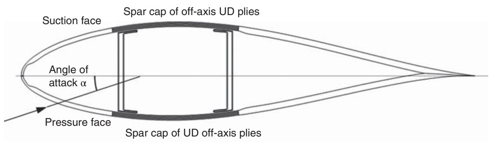

text_image

Suction face
Spar cap of off-axis UD plies
Angle of attack α
Pressure face
Spar cap of UD off-axis plies

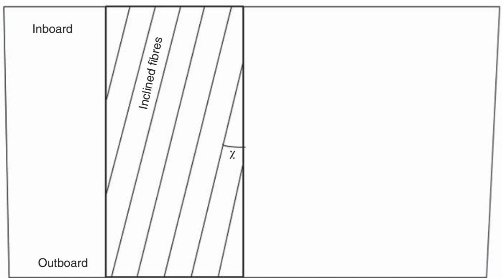

text_image

Inboard
Inclined fibres
χ
Outboard

Figure 7.38 Blade cross-section (looking towards hub) and plan view on blade element suction face showing inclination of spar cap UD rbres designed to reduce angle of attack when sapwise blade loading increases

# Ratio of twisting and bending rotations under the action of applied moment

It is relatively straightforward to estimate the degree of coupling if some simplifying assumptions are made. A blade spar consisting of two spar caps linked together by two shear webs, as illustrated in Figure 7.38, can be treated as a rectangular tube and initially considered on its own. The in-plane shortening and accompanying shear distortion of a length of suction face spar cap when the blade is subject to thrust loading are shown in Figure 7.39.

It can be shown (Barbero (2018)) that the longitudinal strain, $\varepsilon _ { \mathrm { x } } ,$ , due to the longitudinal stress, $\sigma _ { \mathrm { x } }$ , is given by

$$
\varepsilon_ {x} = \overline {{S}} _ {1 1} \sigma_ {x} = \left(\frac {\cos^ {4} \chi}{E _ {1}} + \left(\frac {1}{G _ {1 2}} - 2 \frac {\nu_ {1 2}}{E _ {1}}\right) \cos^ {2} \chi \sin^ {2} \chi + \frac {\sin^ {4} \chi}{E _ {2}}\right) \sigma_ {x} \tag {7.62}
$$

and that the shear strain, $Y _ { x y } ,$ is

$$
\begin{array}{l} \gamma_ {x y} = \overline {{S}} _ {1 6} \sigma_ {x} = \left[ \left(\frac {2}{E _ {1}} (1 + \nu_ {1 2}) - \frac {1}{G _ {1 2}}\right) c o s ^ {3} \chi s i n \chi \right. \\ \left. - \left(\frac {2}{E _ {2}} \left(1 + \nu_ {1 2} \frac {E _ {2}}{E _ {1}}\right) - \frac {1}{G _ {1 2}}\right) \sin^ {3} \chi \cos \chi \right] \sigma_ {x} \tag {7.63} \\ \end{array}
$$

where $\chi$ is the inclination of the rbres to the blade axis, $E _ { 1 }$ and $E _ { 2 }$ are the elastic moduli of the laminate parallel and perpendicular to the rbres, respectively, $G _ { 1 2 }$ is the shear modulus with respect to these directions, and $- \nu _ { 1 2 }$ is the ratio of the transverse strain to longitudinal strain when the laminate is loaded parallel to the rbres.

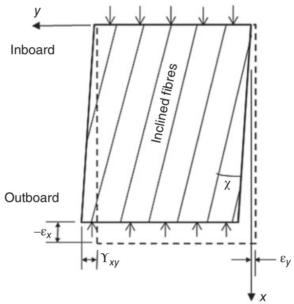

text_image

y
Inboard
Inclined fibres
Outboard
-εₓ
Yₓᵧ
εᵧ
x
χ

Figure 7.39 In-plane contraction and shear distortion of section of suction face spar cap resulting from application of a longitudinal compression stress

It is assumed that the shear strain occurring in each spar cap is accommodated by twisting of the rectangular tube accompanied by warping of the cross-section, so that no shear stresses are generated. In these circumstances it can be shown that the twist per unit length of the tube is

$$
\dot {\varphi} = \frac {\gamma_ {x y}}{d} = \frac {\overline {{S}} _ {1 6} \sigma_ {x}}{d} = - \frac {\overline {{S}} _ {1 6} M}{2 I} = \lambda \mathrm{M} \tag {7.64}
$$

where positive twist is taken to be in the anti-clockwise direction looking towards the hub, and d and I are the depth of the rectangular tube and its second moment of area, respectively. $\overline { { S } } _ { 1 6 }$ and $\sigma _ { x }$ are both negative, so the twist per unit length is positive – i.e. it reduces the angle of attack. It is seen that the torsional rotation per unit length accompanying a unit moment, 휆, is $- \overline { { S } } _ { 1 6 } / 2 I$ . Also the bending rotation per unit length is

$$
\dot {\theta} = \frac {1}{R} = \frac {M}{E _ {x} ^ {*} I} = - \frac {\sigma_ {x}}{E _ {x} ^ {*} d / 2} = - \frac {\sigma_ {x} \overline {{S}} _ {1 1}}{d / 2} = - \frac {\varepsilon_ {x}}{d / 2} \tag {7.65}
$$

where the asterisk in $E _ { x } ^ { * }$ signires that it applies when the tube is not restrained against twisting – i.e. $E _ { x } ^ { * } = 1 / \overline { { S } } _ { 1 1 }$ . Thus when the rectangular tube is subject to loading in sexure, the ratio between the twisting and bending rotations per unit length is $\frac { \dot { \varphi } } { \dot { \theta } } = - \frac { 1 } { 2 } \frac { \dot { S } _ { 1 6 } } { \overline { { S } } _ { 1 1 } }$ 1 S16 2 S

In the case of a blade consisting of a box spar and a structural aerodynamic shell, the twisting is moderated by the torsional stiffness of the aerodynamic shell, so that

$$
\frac {\dot {\varphi}}{\dot {\theta}} = - \frac {1}{2} \frac {\overline {{S}} _ {1 6}}{\overline {{S}} _ {1 1}} \frac {G _ {B} ^ {*} J _ {B}}{G _ {B} ^ {*} J _ {B} + G _ {S} J _ {S}} = - \frac {1}{2} \frac {\overline {{S}} _ {1 6}}{\overline {{S}} _ {1 1}} \beta \tag {7.66}
$$

where $G _ { B } ^ { * } J _ { B }$ and $G _ { S } J _ { S }$ are the torsional stiffnesses of the box spar and the aerodynamic shell, respectively. The asterisk in $G _ { B } ^ { * } J _ { B }$ signires that the stiffness applies when the tube is not restrained against bending. The ratio of negative shear strain to bending stress, $- Y _ { x \nu } / \sigma _ { x } = - \overline { { S } } _ { 1 6 }$ is plotted out against rbre inclination, $\chi ,$ , in Figure 7.40 for a 55% rbre volume fraction laminate with rbre and matrix moduli of 75 and 4 GPa, respectively. Also shown are the spar cap longitudinal modulus, $E _ { x } ^ { * } = 1 / \overline { { S } } _ { 1 1 }$ , and the ratio of twist angle to sexural rotation for a case in which the spar torsional stiffness is 50% of the total torsional stiffness – i.e. for $\beta = 0 . 5$ . This applies at about 60% radius for the FC40 blade design described in Section 7.1.14. It is seen that the ratio of shear strain to bending stress reaches a maximum at a rbre inclination of about $2 5 ^ { \circ }$ , but that the ratio of twist angle to sexural rotation reaches a maximum at a rather lower rbre inclination of about $1 5 ^ { \circ }$ , because of the pronounced reduction in the spar cap longitudinal modulus as rbre inclination increases.

# Coupling coefAcient

Lobitz et al. (2001) introduce a coupling coefrcient, 훼, as a measure of the degree of bend-twist coupling. This is derned as $\alpha = \frac { K } { \sqrt { [ E _ { x } I ] [ G J ] } }$ , where K is the bending moment divided by twist per unit length in the absence of bending desection (or the torque divided by bending rotation per unit length in the absence of torsional rotation), and the stiffnesses $[ E _ { x } I ]$ and [GJ] are those that apply when the length of blade is restrained against torsion and sexure, respectively. If, as before, $\langle E _ { x } I \rangle$ and GJ denote the stiffnesses that apply when the length of blade is not restrained against torsion and sexure, respectively, then it can be shown that

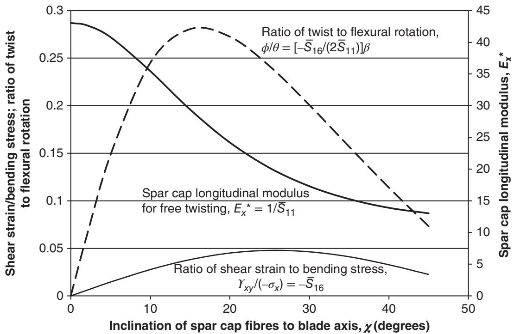

line

| Inclination of spar cap fibres to blade axis, χ (degrees) | Shear strain/bending stress; ratio of twist to flexural rotation | Ratio of twist to flexural rotation, φ/θ = [−S̄₁₆/(2S̄₁₁)]β | Spar cap longitudinal modulus for free twisting, Eₓ* = 1/S̄₁₁ | Ratio of shear strain to bending stress, Yₓᵧ/(-σₓ) = −S̄₁₆ |
| --- | --- | --- | --- | --- |
| 0 | 0.29 | 0 | 0 | 0 |
| 10 | 0.24 | 38 | 0.05 | 5 |
| 20 | 0.18 | 35 | 0.05 | 7 |
| 30 | 0.12 | 28 | 0.04 | 6 |
| 40 | 0.09 | 18 | 0.03 | 4 |
| 50 | 0.08 | 12 | 0.02 | 3 |

Figure 7.40 Variation with rbre inclination of $Y _ { x y } / \sigma _ { x } = \overline { { S } } _ { 1 6 } ,$ , spar cap longitudinal modulus and ratio of twist to sexural rotation with $\beta \overset { \cdot } { = } 0 . 5$

$$
K = \frac {\lambda \langle G J \rangle \left\langle E _ {x} I \right\rangle}{1 - \lambda^ {2} \langle G J \rangle \left\langle E _ {x} I \right\rangle}, \left[ E _ {x} I \right] = \frac {\left\langle E _ {x} I \right\rangle}{\left(1 - \lambda^ {2} \langle G J \rangle \left\langle E _ {x} I \right\rangle\right)} \text {and} [ G J ] = \frac {\left\langle G J \right\rangle}{\left(1 - \lambda^ {2} \langle G J \rangle \left\langle E _ {x} I \right\rangle\right)} \tag {7.67}
$$

and it follows that $\alpha = \lambda \sqrt { \langle G J \rangle \langle E _ { x } I \rangle }$ . The coupling coefrcient, 훼, is plotted against spar cap rbre inclination for the FC40 blade design at 62.5% and 32.5% radii in Figure 7.41. In each case the coupling coefrcient reaches a maximum for a rbre inclination of about $2 5 ^ { \circ }$ , but its magnitude at 32.5% radius (0.11) is about half that at 62.5% radius (0.22), largely because the adoption of a constant spar cap width inboard of 62.5% radius results in a reduced spar torsional stiffness at 32.5% radius as a proportion of the total.

Fedorov (2012) investigated the bend-twist coupling resulting from the inclination of spar cap rbres on a representative GFRP commercial wind turbine blade design using FE analysis and reported a maximum coupling coefrcient of about 0.2 at $2 5 ^ { \circ }$ rbre inclination. However, when the glass rbres in the spar cap were replaced by carbon rbres, the maximum coupling coefrcient rose to 0.4.

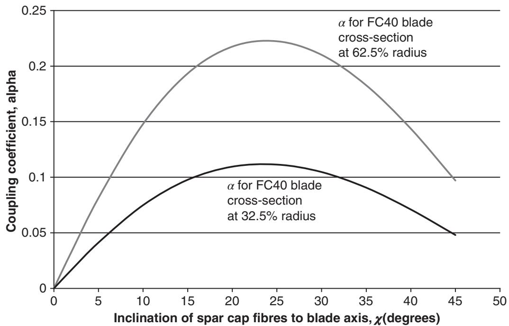

line

| Inclination of spar cap fibres to blade axis, χ(degrees) | Coupling coefficient, alpha (α for FC40 blade cross-section) | Coupling coefficient, alpha (α for FC40 blade cross-section) |
| ------------------------------------------------------ | ---------------------------------------------------------- | ----------------------------------------------------------- |
| 0                                                      | 0.0                                                        | 0.0                                                         |
| 5                                                      | ~0.1                                                       | ~0.08                                                       |
| 10                                                     | ~0.18                                                      | ~0.12                                                       |
| 15                                                     | ~0.21                                                      | ~0.15                                                       |
| 20                                                     | ~0.22                                                      | ~0.17                                                       |
| 25                                                     | ~0.22                                                      | ~0.18                                                       |
| 30                                                     | ~0.21                                                      | ~0.17                                                       |
| 35                                                     | ~0.19                                                      | ~0.15                                                       |
| 40                                                     | ~0.16                                                      | ~0.12                                                       |
| 45                                                     | ~0.1                                                       | ~0.08                                                       |

Figure 7.41 Variation of coupling coefrcients at 62.5% and 32.5% radius for blade FC40 (see Section 7.1.14) with spar cap rbre inclination

# Bending moment reduction

The reduction in suctuating moment resulting from bend twist coupling can be estimated using the following procedure:

1. Choose the rbre inclination, $\chi ,$ to be investigated.   
2. Select a trial value for the bending moment reduction factor, 휂.   
3. Calculate the sexural rotation per unit length at each blade station due to the reduced moment distribution.   
4. Calculate the ratio between the twisting and bending rotations per unit length, ${ \dot { \varphi } } / { \dot { \theta } } .$ , at each blade station.   
5. Calculate the imposed twist per unit length at each blade station by multiplying the sexural rotation per unit length by $\dot { \varphi } / \dot { \theta }$ .   
6. Integrate over the length of the blade to obtain the imposed twist, $\Delta \varphi _ { : }$ , at each station.   
7. Calculate the resulting reduction in load on each blade element according to the formula:

$$
\Delta L = \frac {1}{2} \rho W ^ {2} \Delta C _ {L} c \Delta r = \frac {1}{2} \rho (\Omega r) ^ {2} 2 \pi (- \Delta \varphi) c \Delta r
$$

8. Derive distributions of shear and bending moment reductions.

9. Subtract the bending moment reduction from the original applied moment at each blade station to obtain improved estimate of reduced bending moments.

10. Repeat steps 3–9 using improved estimate of reduced bending moments as input. A further iteration may be needed if the initial estimate of 휂 was poor.

The bending moment reduction factor has been estimated for the spar cap rbre inclinations of 5, 10, and $1 5 ^ { \circ }$ for the case of the FC40 blade, using the method above. Reduction factors of 0.87, 0.81, and 0.78 were obtained, indicating diminishing returns with increasing rbre inclination.

# Blade pitch correction

Given that a steady blade twist of about 1–2∘ will be induced at rated wind speed by the bend twist coupling resulting from a $5 ^ { \circ }$ spar cap rbre inclination, a correction to the initial blade twist distribution is desirable so that the optimum twist distribution is attained at or close to rated wind speed. Small pitch adjustments are then required at lower wind speeds to maximise energy yield below rated power.

# Tower clearance

As blade design is often governed by the need to maintain adequate tower clearance, the effect of the reduced blade stiffness due to spar cap rbre inclination needs to be considered alongside that of the reduced loading. At 180∘ azimuth the bending moment suctuation due to wind shear subtracts from that due to gust loading, so the extreme bending moment at $1 8 0 ^ { \circ }$ azimuth is likely to be only about 50% greater than the average moment over a full revolution. On this assumption, the above reduction factors become 0.957, 0.937, and 0.927 respectively in relation to the total bending moment for the three rbre inclinations. Figure 7.42 shows how the bending moment suctuation at blade passing frequency, the extreme bending moment at $1 8 \bar { 0 } ^ { \circ }$ azimuth, the spar cap stiffness and the tip desection at $1 8 0 ^ { \circ }$ azimuth vary with spar cap rbre inclination, each parameter being normalised by its value when the rbre inclination is zero. It can be seen that the penalty of increased tip desection starts to become signircant at rbre inclination angles above 5∘.

Several investigations of the benerts of bend-twist coupling were carried out as part of the EU INNWIND project (INNWIND 2015). For example, researchers at Polimi (Polytechnico Milano) investigated the use of off-axis rbres in the spar caps of the DTU 10 MW turbine and concluded that this would result in a reduction in the cost of energy of close to 1% for rbre inclinations of 3, 4, and 5∘ , reducing to 0.9% and 0.75% for rbre inclinations of 6 and $7 ^ { \circ }$ respectively. The sapwise fatigue damage equivalent load at the blade root was found to reduce by about 3.5% for a rbre inclination of $5 ^ { \circ }$ . Researchers at DTU carried out a similar exercise with the spar cap rbres inclined at $8 ^ { \circ }$ and concluded that the sapwise blade root fatigue damage equivalent load would reduce by 7.5%.

# Swept-back blades

An alternative method of introducing bend-twist coupling is to change the geometry of the blade towards the tip, so that the blade centre-line is curved backwards in relation to the direction of blade rotation. This results in a lift loading on the outboard part of the blade that is offset with respect to the inboard part and generates a torque that twists the blade towards feather. The swept-back blade has the advantage that there is no loss of blade bending stiffness to erode tower clearance, but it comes at the cost of increased blade torsional loadings.

Scott et al. (2017) investigate using a combination of material bend-twist coupling (using rbre alignment) and geometric bend-twist coupling. An aeroelastically tailored blade design is proposed in which both of these features are varied along the blade, to try to achieve reduced sapwise fatigue and extreme operational gust loading, reduced pitch rate, and some increase in energy capture, although blade root torsional moments might increase. However, these increases can be partially offset by employing a second order sweep curve that passes ahead of the pitch axis at around mid-span and then rearwards of the pitch axis at the tip. See Figure 7.43.

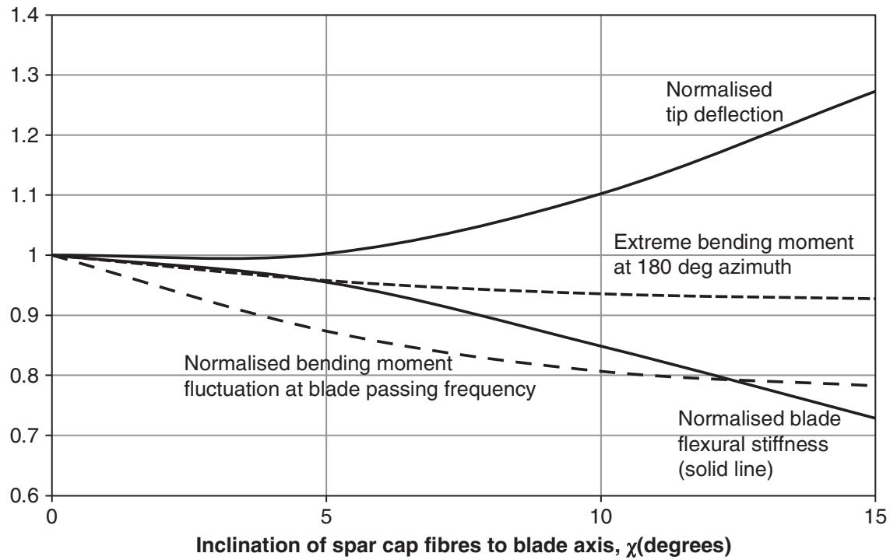

line

| Inclination of spar cap fibres to blade axis, χ(degrees) | Normalised tip deflection | Extreme bending moment at 180 deg azimuth | Normalised bending moment fluctuation at blade passing frequency | Normalised blade flexural stiffness (solid line) |
| --- | --- | --- | --- | --- |
| 0 | 1.0 | 1.0 | 1.0 | 1.0 |
| 5 | ~1.02 | ~0.95 | ~0.95 | ~0.95 |
| 10 | ~1.1 | ~0.93 | ~0.82 | ~0.82 |
| 15 | ~1.28 | ~0.93 | ~0.73 | ~0.73 |

Figure 7.42 Variation of bending moment suctuations at blade passing frequency, extreme bending moment at $1 8 0 ^ { \circ }$ azimuth, blade sexural stiffness and tip desection at $1 8 0 ^ { \circ }$ azimuth with spar cap rbre inclination. In each case the values are normalised by the value at zero rbre inclination

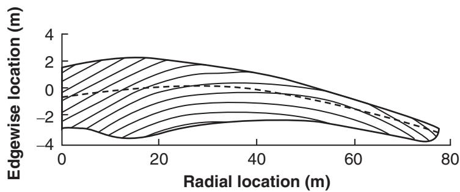

line

| Radial location (m) | Edgewise location (m) |
| ------------------- | --------------------- |
| 0                   | -3.0                  |
| 10                  | -2.5                  |
| 20                  | -2.0                  |
| 30                  | -1.5                  |
| 40                  | -1.0                  |
| 50                  | -0.5                  |
| 60                  | 0.0                   |
| 70                  | 0.5                   |
| 80                  | 1.0                   |

Figure 7.43 Proposed use of fore and aft blade sweep in combination with off-axis rbres to provide bend-twist coupling. Source: Reproduced with permission from Scott et al. (2017), ‘Effects of Aeroelastic Tailoring on Performance Characteristics of Wind Turbine Systems’, Renewable Energy, 114(B), 887–903

The effect of sweeping back the DTU 10 MW blade tip by 2 m starting at 80% radius was investigated as part of the INNWIND project and found to yield a 3% reduction in sapwise fatigue damage equivalent load at the blade root.

# Commercial application

Bend-twist coupling has been commercially applied in the case of the Siemens 53 m blade.

# 7.2 Pitch bearings

On pitch-regulated machines a bearing similar to a crane slewing ring is interposed between each blade and the hub to allow the blade to be rotated or ‘pitched’ about its axis. A typical arrangement is as shown in Figure 7.44, in which the inner and outer rings of the bearing are bolted to the blade and hub, respectively.

The different types of bearings available can be classired according to the rolling elements used and their arrangement, in order of increasing moment capacity, as follows:

1. Single-row roller bearings, with alternate rollers inclined at $+ 4 5 ^ { \circ }$ and $- 4 5 ^ { \circ }$ to the plane of the bearing.   
2. Single-row ball bearings.   
3. Double-row ball bearings.   
4. Three-row roller bearings.

These are shown in cross-section in Figure 7.45. The single-row ball bearing slewing rings are normally designed to transmit axial loads in both directions and are therefore known as four-point contact bearings. Low contact stresses are achieved by making the radii on each side of the grooves only slightly larger than that of the balls.

At low wind speeds, the cyclic in-plane bending moment at the blade root due to gravity is of similar magnitude to the out-of-plane moment due to blade thrust, so bearing loads will alternate in direction over portions of the bearing circumference. Accordingly, it is desirable to avoid the risk of play by pre-loading the bearing. This can be achieved relatively easily on bearings in which one of the rings is split on a plane normal to the axis, such as types 3 and 4, but is more difrcult when both rings are solid. In this case it is necessary to force the rolling elements into the races one by one during manufacture.

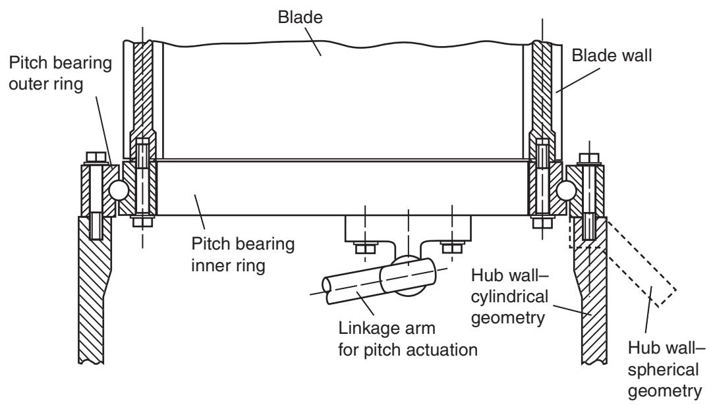

text_image

Pitch bearing
outer ring
Blade
Pitch bearing
inner ring
Linkage arm
for pitch actuation
Blade wall
Hub wall-
cylindrical
geometry
Hub wall-
spherical
geometry

Figure 7.44 Typical pitch bearing arrangment

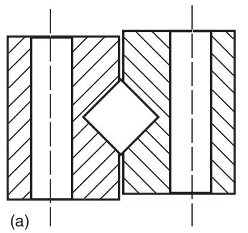

natural_image

Pure mechanical cross-section diagram without any text, numbers, or symbols

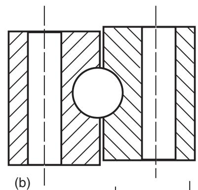

natural_image

Cross-sectional diagram of a mechanical assembly with hatched sections and a central circular hole (no text or symbols)

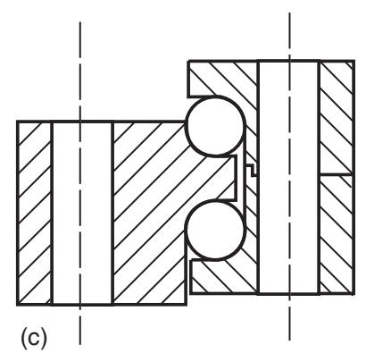

natural_image

Technical drawing of a mechanical assembly with cross-hatched sections and circular features (no text or symbols)

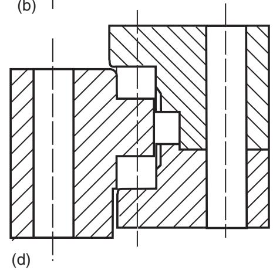

text_image

(b)
(d)

Figure 7.45 (a) Single-row crossed roller bearings, (b) single-row ball bearings, (c) double-row ball bearings, and (d) three-row roller bearings

The bearing selected for a particular application needs to have sufrcient moment capacity to both resist the extreme blade root bending moments and provide adequate fatigue life. Manufacturers catalogues typically specify both the extreme moment capacity and the steady moment loading that will give a life of, say, 30 000 bearing revolutions, so the wind turbine designer’s chief task is to convert the anticipated pitch bearing duty into the equivalent constant loading at the appropriate number of revolutions. If the rolling elements are ball bearings, the bearing life is inversely proportional to the cube of the bearing loading, so the equivalent loading at N revolutions of the pitch bearing can be calculated according to the formula:

$$
M _ {e q t} = \left[ \frac {\sum_ {i} n _ {i} M _ {i} ^ {3}}{N} \right] ^ {1 / 3} \tag {7.68}
$$

where $n _ { \mathrm { i } }$ is the total pitch bearing movement anticipated over the design life at moment loading $M _ { \mathrm { i } }$ , expressed as a number of revolutions. In the case of roller bearings, the index of the S-N curve is 10/3 instead of 3, so the above formula should be modired accordingly. As the blade root out-of-plane moment drops as the wind speed increases above rated, the fatigue damage will be concentrated at wind speeds near rated.

The total pitch bearing movement over a period of operation at a particular wind speed is a function of the turbulence intensity and the pitch control algorithm, and is best predicted by means of a wind simulation. The mean blade pitching rate during operation above rated wind speed is found to be of the order of $1 ^ { \circ } / \mathrm { s } ,$ , assuming the pitch system only responds to wind speed suctuations at a frequency less than the speed of rotation. On turbines with individual pitch control, however, additional pitching takes place at rotational frequency to reduce the cyclic variation in blade out-of-plane moment (Section 8.3.9), and it is estimated that lifetime pitch travel may increase by a factor of 3 as a result (Section 8.3.13). This has led some manufacturers to switch from four-point contact bearings to three-row roller bearings to meet the extended duty.

The uncertainties inherent in predicting pitch bearing life can be reduced by testing, e.g. with a steady lateral load applied at the end of a root spar. Normal pitch behaviour is simulated by cycling the pitch over a range of about 5∘ about a mean that is slowly varied over the full range of normal pitch activity. A test to simulate 20 years of turbine operation can last 6 months.

The performance of slewing ring bearings such as those employed as pitch bearings is critically dependent on the extent of bearing distortion under load, so manufacturers normally specify a maximum axial desection and tilt of the bolted contact surfaces. For example, the limiting values given by Rothe-Erde for a single-row ball bearing slewing ring with a 1000 mm track diameter were 0.6 mm and $0 . 1 7 ^ { \circ }$ respectively. Local tilting of the bearing rings could clearly be minimised if the blade wall, bearing track and hub wall were all positioned in the same plane. However, this would necessitate the provision of sanges, so the simpler arrangement shown in Figure 7.44, in which the rxing bolts are inserted centrally into the blade and hub walls, is generally preferred. The designer must then ensure that the blade and hub structures are of sufrcient stiffness to limit the bearing distortion due to the eccentric loading to acceptable values.

It is standard practice to pre-load the bearing rxing bolts to minimise bolt fatigue loading. Grade 10.9 bolts are commonly used so that the pre-load can be maximised.

# 7.3 Rotor hub

The relatively complex three dimensional geometry of rotor hubs favours the use of casting in their manufacture, with spheroidal graphite iron (SGI) being the material generally chosen.

Two distinct shapes of hub for three bladed machines can be identired: tri-cylindrical or spherical. The former consists of three cylindrical shells concentric with the blade axes, which sare into each other where they meet, while the latter consists simply of a spherical shell with cut-outs at the three blade mounting positions. Diagrams of both types are shown in Figure 7.46, while an actual spherical hub is illustrated in Figure 7.47. The structural action of the hub in resisting three loadings is discussed in the following paragraphs:

1. Symmetric rotor thrust loading: The blade root bending moments due to symmetric rotor thrust loading put the front of the hub in bi-axial tension near the rotor axis and the rear in bi-axial compression, while the thrust itself generates out-of-plane bending stresses in the hub shell adjacent to the low-speed shaft sange connection. The load paths are easy to visualise in this case.

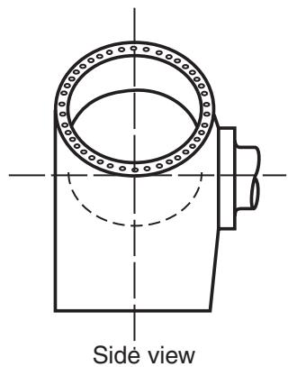

natural_image

Technical line drawing of a mechanical component with side view indicators (no text or symbols)

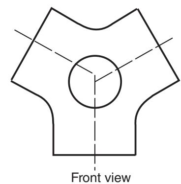

text_image

Front view

(a)

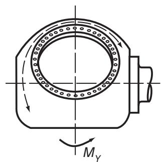

text_image

M_y

(b)   
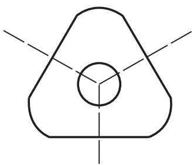

natural_image

Pure geometric diagram of a triangle with internal circles and dashed lines, no text or symbols present

Figure 7.46 (a) Tri-cylindrical hub, and (b) spherical hub

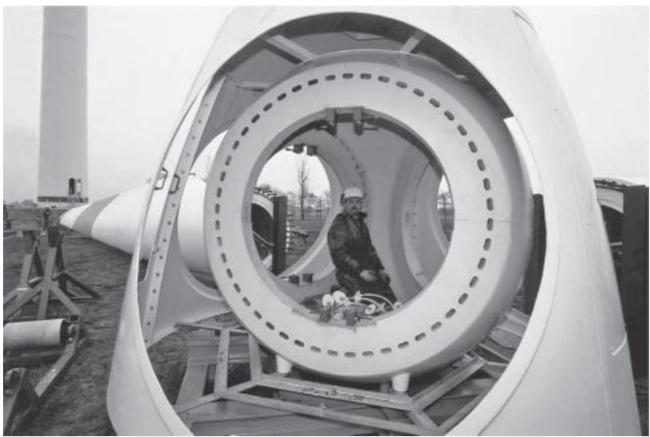

natural_image

Worker inspecting large cylindrical wind turbine components on a construction site (no visible text or symbols)

Figure 7.47 Rotor hub. View of spherical-shaped rotor hub for the 1.5 MW NEG Micon turbine awaiting installation. The hub and spinner are temporarily oriented with the rotor shaft axis vertical. The turbine is stall-regulated, so slotted blade rxing holes are provided to allow for the rne adjustment of blade pitch to suit the site. Reproduced with permission of NEG Micon

2. Thrust loading on a single blade: This generates out-of-plane bending stresses in the hub shell at the rear, and in-plane tensile stresses around a curved load path between the upwind side of the blade bearing and the portion of the low-speed shaft sange connection remote from the blade (see dashed line in Figure 7.46b). The resultant lateral loads will result in out-of-plane bending.

3. Blade gravity moments: On the tri-cylindrical hub, equal and opposite blade gravity moments are communicated via the cylindrical shells to areas near the rotor axis at front and rear where they cancel each other out. It is less straightforward to visualise the corresponding load paths on the spherical hub, as out-of-plane bending is likely to be mobilised.

The complexity of the stress states arising from the latter two types of loading renders rnite element (FE) analysis of rotor hubs more or less mandatory. At the most, six load cases need to be analysed, corresponding to the separate application of moments about the three axes and forces along the three axes at a single hub/blade interface. Then the distribution of hub stresses due to combinations of loadings on different blades can be obtained by superposition. Similarly the suctuation of hub stresses over time can be derived by inputting the time histories of the blade loads obtained from a wind simulation.

The critical stresses for hub design are the in-plane stresses at the inner or outer surface, where they reach a maximum because of shell bending. For any one location on the hub, these are derned by three quantities at each surface – the in-plane direct stresses in two directions at right angles and the in-plane shear stress. In general, these stresses will not vary in-phase with each other over time, so the principal stress directions will change, complicating the fatigue assessment.

There is, as yet, no generally recognised procedure for calculating the fatigue damage accumulation due to multi-axial stress suctuations, although the following methods have been used, despite their acknowledged imperfections. They all cater for one or more series of repeated stress cycles rather than the random stress suctuations resulting from turbulent loading.

1. Maximum shear method: Here the fatigue evaluation is based on the maximum shear stress ranges, calculated from either the $( \sigma _ { 1 } - \sigma _ { 2 } ) / 2 , \sigma _ { 1 } / 2 \mathrm { o r } \sigma _ { 2 } / 2$ time histories. The effect of mean stress is allowed for using the Goodman relationship:

$$
\frac {\tau_ {a}}{S _ {S N}} + \frac {\tau_ {m}}{S _ {S u}} = \frac {1}{\gamma} \tag {7.69}
$$

where

$\tau _ { a }$ is the alternating shear stress

$\tau _ { m }$ is the mean shear stress

$S _ { S N }$ is the alternating shear stress for N loading cycles from the material S-N curve

$S _ { S u }$ is the ultimate shear strength

훾 is the safety factor

Having used Eq. (7.69) to determine $S _ { S N }$ , the permitted number of cycles for this loading range can be derived from the S-N curve, enabling the corresponding fatigue damage to be calculated.

2. ASME boiler and pressure vessel code method: This is similar to the maximum shear method, but the shear stress ranges are based on notional principal stresses calculated from the changes in the values of $\sigma _ { \mathrm { x } } , \sigma _ { \mathrm { y } } , \sigma _ { \mathrm { z } } , \tau _ { \mathrm { x y } } , \tau _ { \mathrm { y z } }$ a nd $\tau _ { \mathrm { z x } }$ from datum values occurring at one of the extremes of the stress cycle. Mean stress effects are not included.   
3. Distortion energy method: In this method, the fatigue evaluation is based on the suctuations of the effective or von Mises stress. In the case of the hub shell, the stress perpendicular to the hub surface (and hence the third principal stress) is zero, so the effective stress is given by

$$
\sigma^ {\prime} = \sqrt {\frac {(\sigma_ {1} - \sigma_ {2}) ^ {2} + \sigma_ {1} ^ {2} + \sigma_ {2} ^ {2}}{2}} \tag {7.70}
$$

As the effective stress is based on the distortion energy, it is a scalar quantity, so it needs to be assigned a sign corresponding to that of the dominant principal stress. The effect of mean stress is allowed for in the same way as for the maximum shear method, except that the stresses in Eq. (7.69) are now direct stresses instead of shear stresses.

S-N curves for SGI are given in Hück (1983).

# 7.4 Gearbox

# 7.4.1 Introduction

The function of the gearbox is to step up the speed of rotor rotation to a value suitable for the generator, which, in the case of induction generators for rxed-speed machines or two-speed machines operating at the higher speed, is usually 1500 rpm plus the requisite slip. For machines of this type rated between 300 kW and 5 MW, with upper rotational speeds between 48 and 12 rpm, overall gear ratios of between about 1:31 and 1:125 are therefore required, with similar ratios usually applying in the case of variable speed machines. Normally these large step-ups are achieved by three separate stages with ratios of between 1:3 and 1:5 each.

The design of industrial rxed ratio gearboxes is a large subject in itself and well beyond the scope of the present work. However, it is important to recognise that the use of such gearboxes in wind turbines is a special application, because of the unusual environment and load characteristics, and the sections that follow focus on these aspects. Sections 7.4.2–7.4.6 consider variable loading, including drive train dynamics and the impact of emergency braking loads, and examine how gear fatigue design is adapted to take account of it. The relative benerts of parallel and epicyclic shaft arrangements are discussed in Section 7.4.7, while subsequent sections deal with noise reduction measures and lubrication and cooling.

A useful reference is the American Gear Manufacturers Association (AGMA) information sheet entitled Recommended Practices for Design and SpeciScation of Gearboxes for Wind Turbine Generator Systems published in 1996 in conjunction with the American Wind Energy Association, which covers the special requirements of wind turbine gearboxes in some detail. This has since been expanded into the standard Design and

SpeciScation of Gearboxes for Wind Turbines (ANSI/AGMA/AWEA 6006-A03 2003). More recently, the IEC has published its own standard, IEC 61400-4:2012, Wind Turbines – Part 4: Design Requirements for Wind Turbine Gearboxes. This references ISO 6336, Calculation of Load Capacity of Spur and Helical Gears, which is in six parts and was re-issued in 2019.

# 7.4.2 Variable loads during operation

The torque level in a wind turbine gearbox will vary between zero and rated torque according to the wind speed, with excursions above rated on rxed-speed pitch-regulated machines due to slow pitch response. The short-term torque suctuations will be subject to dynamic magnircation to the extent that they excite drive train resonances (see Section 7.4.3). In addition, there will be occasional much larger torques of short duration due to braking events, unless the brake is rtted to the low-speed shaft. Figure 7.48 shows example load-duration curves (excluding dynamic effects and braking) for two 500 kW, two bladed rxed-speed machines – one stall and the other pitch regulated. The curve for the former is calculated by simply combining the power curve with the distribution of instantaneous wind speeds, which is obtained by superposing the turbulent variations about each mean wind speed on the Weibull distribution of hourly means. Excursions above rated power are not included.

In the case of a pitch-regulated machine, the pitch control system is not normally designed to respond to wind speed suctuations at blade passing frequency or above, as this would impose excessive loads on the control mechanism. Thus there is no attenuation of the signircant power suctuations that occur at blade passing frequency due to turbulence, which are illustrated for the example two bladed, 500 kW machine operating in a 20 m/s mean wind with 16.5% turbulence intensity in Figure 7.49.

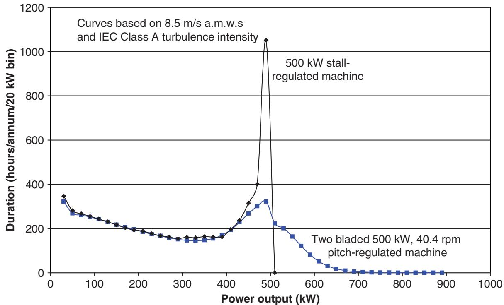

line

| Power output (kW) | Duration (hours/annum/20 kW bin) |
| ----------------- | -------------------------------- |
| 0                 | 350                              |
| 50                | 300                              |
| 100               | 250                              |
| 150               | 220                              |
| 200               | 200                              |
| 250               | 180                              |
| 300               | 160                              |
| 350               | 150                              |
| 400               | 170                              |
| 450               | 250                              |
| 500               | 1050                             |
| 550               | 220                              |
| 600               | 150                              |
| 650               | 80                               |
| 700               | 40                               |
| 750               | 20                               |
| 800               | 10                               |
| 850               | 5                                |
| 900               | 2                                |

Figure 7.48 Load duration curves for 500 kW, two bladed pitch-regulated and 500 kW, stall-regulated rxed-speed machines

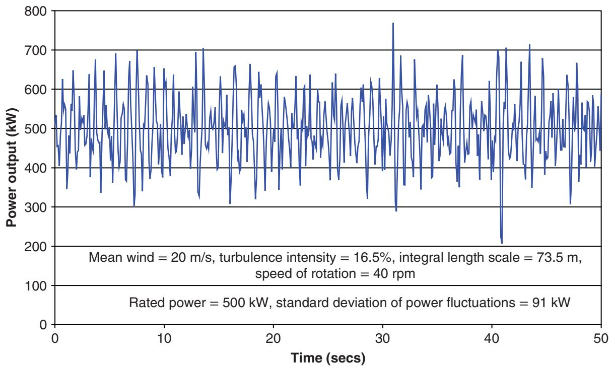

line

| Time (secs) | Power output (kW) |
|-------------|-------------------|
| 0           | ~500              |
| 5           | ~600              |
| 10          | ~500              |
| 15          | ~600              |
| 20          | ~500              |
| 25          | ~600              |
| 30          | ~500              |
| 35          | ~600              |
| 40          | ~500              |
| 45          | ~600              |
| 50          | ~500              |

Figure 7.49 Simulated power output for two bladed, 40 m dia pitch-regulated m/c operating in above rated wind speed

The load duration curve for a rxed-speed pitch-regulated machine can be derived approximately from the distribution of instantaneous wind speeds below rated wind speed, and the distribution of short-term mean wind speeds (i.e. those to which the pitch system can respond) above. The former can be combined with the power curve to give the power distribution due to instantaneous winds below rated directly, while the winds above rated are assumed to produce Gaussian spreads of power outputs about the rated value, with the standard deviation depending on the short-term mean wind. The standard deviation of power suctuations when the pitch control system is operational can be related to that portion of the wind suctuations above the pitch control system cut-off frequency as follows:

$$
\sigma_ {P} ^ {2} = \frac {1}{B ^ {2}} \sum_ {j} \sum_ {k} \left[ \int_ {\Omega} ^ {\infty} S _ {u} ^ {o} (r _ {j}, r _ {k}, n) d n \right] \left(\frac {d p}{d u}\right) _ {j} \left(\frac {d p}{d u}\right) _ {k} \tag {7.71}
$$

where $S _ { u } ^ { o } ( r _ { i } , r _ { k } , n )$ is the rotationally sampled cross-spectrum of the wind speed suctuations at a pair of points, j and k, on the rotor (see Section 5.7.5), and $\left( \frac { d \bar { p } } { d u } \right) _ { j }$ is the rate of change with wind speed of the power generated by the blade elements at $r _ { \mathrm { j } }$ on all B blades if the pitch does not change. The summations are carried out over the whole rotor, and give $\begin{array} { r } { \sigma _ { P } = 0 . 2 1 3 \left( \frac { d P } { d u } \right) \sigma _ { u } = 9 1 } \end{array}$ kW for the example two bladed machine operating at 40.4 rpm in a 20 m/s mean wind with 16.5% turbulence intensity. Here $\frac { d P } { d u }$ is the rate of change of turbine power with wind if the pitch does not change. The standard deviation of the power suctuations for a three bladed machine of similar size would be about one third less.

# 7.4.3 Drive train dynamics

All wind turbines experience aerodynamic torque suctuations at blade passing frequency and multiples thereof because of the ‘gust slicing’ phenomenon, and these suctuations will inevitably interact with the dynamics of the drive train, modifying the torques transmitted. In the case of a rxed-speed wind turbine with an induction generator, the resulting drive train torque suctuations can be assessed by dynamic analysis of a drive train model consisting of the following elements connected in series:

• A body with rotational inertia and damping (representing the turbine rotor).   
• A torsional spring (representing the gearbox).   
• A body with rotational inertia (representing the generator rotor).   
• A torsional damper (modelling the resistance produced by slip on an induction generator).   
• A body of inrnite rotational inertia rotating at constant speed (the mechanical equivalent of the electrical grid).

The inertias, spring stiffness, and damping must all be referred to the same shaft.

# 7.4.4 Braking loads

Most turbines have the mechanical brake located on the high-speed shaft, with the result that braking loads are transmitted through the gearbox. If, as is sometimes the case, the mechanical brake is one of the two independent braking systems required, then it must be capable of decelerating the rotor to a standstill from an overspeed – e.g. after a grid loss. This typically requires a torque of about three times rated torque.

The mechanical brake is only required to act alone during emergency shut-downs, which are comparatively rare. During normal shut-downs, the rotor is decelerated to a much lower speed by aerodynamic braking, so the duration of mechanical braking is much less, but the braking torque is the same, unless there is provision for two different braking torque levels.

Figure 7.50 is a typical record of low-speed shaft torque during a normal shut-down, in which the mechanical brake is applied as soon as the generator has been taken off-line. It is apparent that the braking torque is far from constant, taking a couple of seconds to reach its rrst maximum and then falling off slightly before reaching a higher maximum just before the high-speed shaft stops. Following this, there are signircant torque oscillations due to the release of wind-up in the drive train. These result in torque reversals accompanied by tooth impacts and take some time to decay.

Although braking loads are infrequent and of short duration, their magnitude means that they can have a decisive effect on fatigue damage. The AGMA/AWEA document recommends that the time histories of braking and other transient events are simulated with the aid of a dynamic model of the drive train for input into both the gear extreme load design calculations and the fatigue load spectrum.

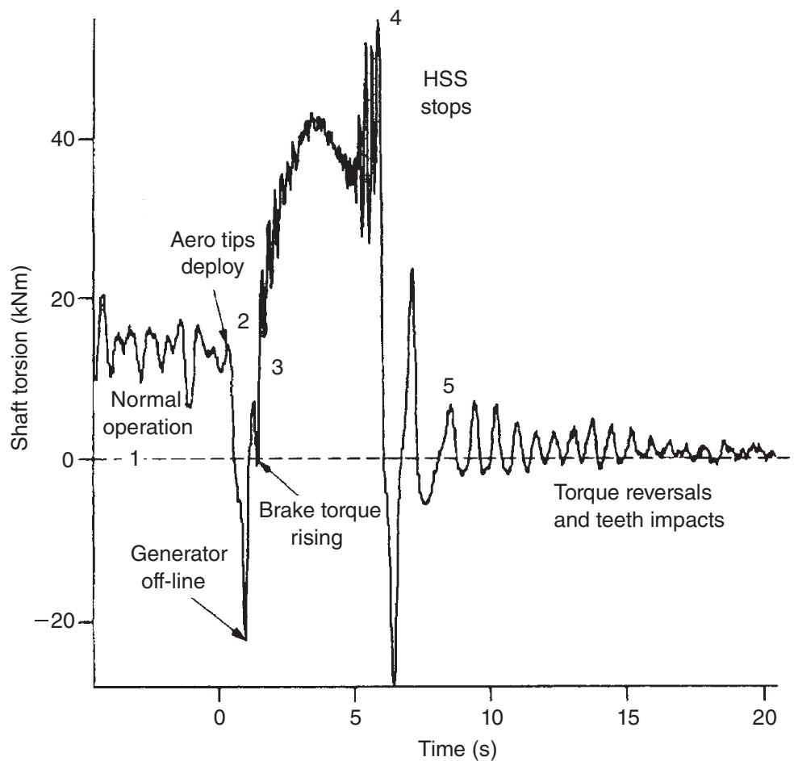

line

| Time (s) | Shaft torsion (kNm) |
| -------- | ------------------- |
| 0        | -20                 |
| 1        | 0                   |
| 2        | 20                  |
| 3        | 40                  |
| 4        | 50                  |
| 5        | 40                  |
| 6        | -20                 |
| 7        | 20                  |
| 8        | 0                   |
| 9        | 0                   |
| 10       | 0                   |
| 15       | 0                   |
| 20       | 0                   |

Figure 7.50 Low-speed shaft torque during braking at normal shut-down. Extracted from AGMA/AWEA 921-A97, Recommended Practices for Design and SpeciScation of Gearboxes for Wind-Turbine Generator Systems, with permission of the publisher, the American Gear Manufacturers Association, 1500 King Street, Suite 201, Alexandria, Virginia 22 314, USA (AGMA/AWEA 921-A97 1996)

# 7.4.5 Effect of variable loading on fatigue design of gear teeth

Gear teeth must be designed in fatigue to achieve both acceptable contact stresses on the sanks and acceptable bending stresses at the roots. In non-wind-turbine applications, gearboxes typically operate at rated torque throughout their lives, so the gear strengths are traditionally modired by ‘life factors’ that are derived from the material S-N curves on the basis of the predicted number of tooth load cycles for the gear in question. The British code for determining permissible gear contact stresses, BS 436: Part 3: 1986 (since replaced by BS ISO 6336, Calculation of Load Capacity of Spur and Helical Gears) (2006), recognises an endurance limit for both contact stress and bending stress, so that the life factors are unity when the number of tooth load cycles exceeds $1 { \overset { \vartriangle } { 0 } } ^ { 9 }$ and $3 \times 1 0 ^ { 6 }$ respectively, but increase for lesser numbers of cycles.

The Hertzian compression stress between a pair of spur gear teeth in contact at the pitch point (i.e. at the point on the line joining the gear centres) is given by

$$
\sigma_ {C} = \sqrt {\frac {F _ {t}}{b d _ {1}} \frac {E}{\pi (1 - v ^ {2})} \frac {u + 1}{u} \frac {1}{\sin \alpha \cos \alpha}} \tag {7.72}
$$

where

$F _ { \mathrm { t } }$ is the force between the gear teeth at right angles to the line joining the gear centres

b is the gear face width

$d _ { 1 }$ is the pinion pitch diameter

u is the gear ratio (greater than unity)

훼 is the pressure angle – i.e. the angle at which the force acts between the gears – usually $2 0 ^ { \circ } - 2 5 ^ { \circ }$

Note that the contact stress increases only as the square root of the force between the teeth because the area in contact increases with the force as well.

The maximum bending stress at the tooth root is given by

$$
\sigma_ {B} = \frac {F _ {t} h}{\frac {1}{6} b t ^ {2}} K _ {S} \tag {7.73}
$$

where

h is the maximum height of single tooth contact above the critical root section

t is the tooth thickness at the critical root section

$K _ { \mathrm { S } }$ is a factor to allow for stress concentration at the root

For gearing operating at rated torque only, the designer needs to show that the resultant bending stress multiplied by an appropriate safety factor is less than the endurance limit multiplied by the life factor, $Y _ { N }$ , and a number of stress modifying factors, as follows:

$$
\sigma_ {B}. \gamma \leq \sigma_ {B \lim}. Y _ {N}. Y _ {R}. Y _ {X} \dots \dots \tag {7.74}
$$

A similar calculation is required in relation to the contact stress.

Given the predicted turbine load spectrum (Section 7.4.2), which should include dynamic effects (see Section 7.4.3), it is then necessary to establish the required design torque at the endurance limit. Normally this is done by invoking Miner’s rule and determining the inrnite life torque for which the design torque spectrum yields unity fatigue damage in conjunction with the prescribed S-N curve. $Y _ { N }$ in Eq. (7.74) can then be set to unity, as the life factor has been accounted for in the derivation of the required inrnite life torque.

Figure 7.51 shows specimen torque–endurance curves laid down by BS 436 (British Standards Institution 1986) for case hardened gears for tooth bending and tooth contact stress (with no pitting allowed) plotted in terms of the torque at the endurance limit. Hence in each case the design inrnite life torque, $T _ { \infty }$ , is calculated according to

$$
T _ {\infty} = \left[ \sum_ {i} \left(\frac {N _ {i}}{N _ {\infty}} T _ {i} ^ {m}\right) \right] ^ {1 / m} \tag {7.75}
$$

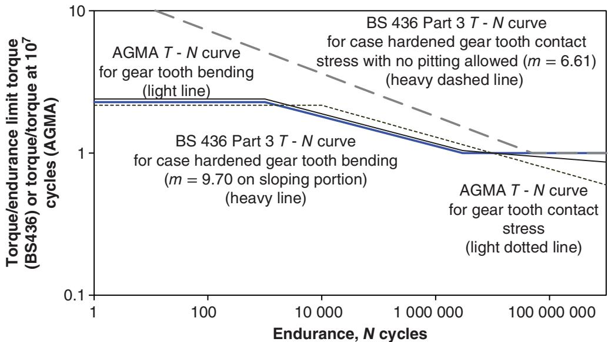

line

| Endurance, N cycles | Torque/endurance limit torque (BS436) or torque/torque at 10^7 cycles (AGMA) |
| ------------------- | ---------------------------------------------------------------------- |
| 1                   | ~2.5                                                                 |
| 100                 | ~2.5                                                                 |
| 10000               | ~1.5                                                                 |
| 1000000             | ~1.0                                                                 |

Figure 7.51 Specimen torque–endurance curves for gear tooth design

where $N _ { i }$ is the number of cycles at torque level $T _ { i } ,$ , and torques less than $T _ { \infty }$ are omitted from the summation. The number of cycles at the lower knee of the torque–endurance curve, $N _ { \infty }$ , is always $3 \times 1 0 ^ { 6 }$ cycles for tooth bending but is generally higher for contact stress, varying according to the material. Note that the slope index, m, of the torque–endurance curve for contact stress is half that of the contact stress – endurance curve because contact stress only increases as the square root of torque [Eq. (7.72)].

Leaving braking loads out of consideration to begin with, the design inrnite life torque will be equal to the rated torque if there are no power suctuations above rated, because the number of gear tooth loading cycles at rated torque will be well above $N _ { \infty }$ . For example, in the case of the 500 kW stall-regulated machine featured in Figure 7.48, the teeth on the critical pinion driven by the 30 rpm low-speed shaft will experience $3 \times 3 0 \times 6 0 \times 1 0 5 0 \times 2 0 = 1 . 1 3 \times 1 0 ^ { 8 }$ load cycles at rated torque over 20 years, assuming a rrst stage gear ratio of 3. However, for the 500 kW, two bladed pitch-regulated machine, the power suctuations above rated detailed in the Figure 7.48 load duration curve result in a design inrnite life torque for the rrst stage pinion tooth bending stress of 1.36 times the rated torque, with most of the damage coming from torques just above this value. (The rrst stage gear ratio is assumed to be three as before and the turbine rotational speed is taken as 40.4 rpm.) The design inrnite life torque for tooth contact stress is only 1.17 × rated torque – signircantly less than for bending, as expected from comparison of the BS 436 Part 3 torque–endurance curves in Figure 7.51.

Figure 7.51 also shows specimen torque–endurance curves derived from S-N curves in the ANSI/AGMA standard 2001-C95, Fundamental Rating Factors and Calculation Methods for Involute Spur and Helical Gear Teeth (ANSI/AGMA 2001-C95 1995), plotted in terms of the torque at $1 0 ^ { 7 }$ cycles. The torque–endurance curve for tooth bending stress, which is based on a middle of the range Brinell Hardness value of 250 HB, closely parallels the selected BS 436 Part 3 curve, except that the curve continues with a very shallow slope beyond $3 \times 1 0 ^ { 6 }$ cycles instead of displaying an endurance limit. The design torques at $\bar { 1 } 0 ^ { 7 }$ cycles for tooth bending for the example 500 kW machines featured in

Figure 7.48 are similar to the design inrnite life torques obtained using the BS 436 Part 3 torque–endurance curves.

The ANSI/AGMA 2001-C95 (1995) torque–endurance curves for tooth contact stress are signircantly more conservative than the selected BS 436 Part 3 curve. This is particularly so in the case of the ANSI/AGMA curve selected, which is the one recommended for wind turbine applications, in view of the elimination of the lower knee. The absence of the lower knee increases the design torque at $1 0 ^ { 7 }$ cycles for tooth contact to 1.4 times the rated torque for the stall-regulated machine, but the rgure for the pitch-regulated machine is only about 10% higher.

From the above discussion, the general conclusion can be drawn that tooth bending fatigue usually governs the increased gearbox rating required to take care of load excursions above rated.

The effect of braking loads on the design inrnite life torque according to BS 436 Part 3 can be illustrated with respect to the example machines discussed in Section 7.4.2. Although the mechanical brake must be capable of decelerating an overspeeding rotor unassisted, a shut-down under these conditions will be a very rare event. Accordingly, the typical emergency shut-down considered for fatigue design purposes is deceleration from normal rotational speed under the action of mechanical and aerodynamic braking combined, with an assumed stopping time of 3 seconds. An emergency shut-down frequency of 20 per annum is assumed. Normal shut-downs are assumed to occur on average twice a day, with a stopping time of 1.5 seconds, because of the reduced rotational speed at which mechanical braking is initiated for parking. In each case the braking torque is assumed to remain constant at three times rated torque throughout the brake application for simplicity. Based on these assumptions, the percentage increases in design inrnite life torque for gear tooth bending in fatigue, due to the inclusion of braking loads in the load spectrum, are shown in Table 7.12 for emergency braking alone on the one hand and normal plus emergency shut-downs on the other.

Also shown in the table are the percentage increases in the ANSI/AGMA design torque for gear tooth bending at $1 0 ^ { 7 }$ cycles due to the inclusion of braking loads. It is seen that the inclusion of emergency braking loads alone makes very little difference to design torques in the case of the pitch-regulated machine, but is signircant in the case of the stall-regulated machine. The addition of braking loads at normal shut-downs incurs a much greater penalty in both cases because of the large number of stops involved, indicating that provision for brake application at reduced torque on these occasions would probably be worthwhile. Note that the larger percentage increases in design torques due to braking indicated by BS 436 Part 3 are a consequence of the assumption that there is an endurance limit.

# 7.4.6 Effect of variable loading on fatigue design of bearings and shafts

Bearing lives are approximately inversely proportional to the cube of the bearing loading. Applying Miner’s rule, the equivalent steady bearing loading over the gearbox design life can thus be calculated from the load duration spectrum according to the formula

$$
F _ {e q t} = \left[ \frac {\sum_ {i} N _ {i} F _ {i} ^ {3}}{\sum_ {i} N _ {i}} \right] ^ {1 / 3} \tag {7.76}
$$

Table 7.12 Illustrative increases in design torques for gear tooth bending due to inclusion of braking loads in fatigue load spectrum, according to BS 436 and AGMA rules 

<table><tr><td rowspan="2"></td><td colspan="2">500 kW stall-regulated machine</td><td colspan="2">500 kW two bladed pitch-regulated machine</td></tr><tr><td>Percentage increase in BS 436 design infinite life torque for tooth bending</td><td>Percentage increase in ANSI/AGMA 250 HB design torque at  $10^7$ cycles for tooth bending</td><td>Percentage increase in BS 436 design infinite life torque for tooth bending</td><td>Percentage increase in ANSI/AGMA 250 HB design torque at  $10^7$ cycles for tooth bending</td></tr><tr><td>Emergency braking at 3 × FLT</td><td>30%</td><td>16%</td><td>4%</td><td>3%</td></tr><tr><td>Emergency plus normal braking, each at 3 × FLT</td><td>65%</td><td>47%</td><td>25%</td><td>21%</td></tr></table>

where $N _ { i }$ is the number of revolutions at bearing load level $F _ { i } .$ . Gravity often dominates the loading on the low-speed shaft bearings, but on the other shafts the bearing loads result from drive torque only, so the bearing load duration spectrum can be scaled directly from the torque duration spectrum. Note that the S-N curve for bearings is much steeper than those for gear tooth design, so that occasional large braking loads will be of less signircance.

The nature of the fatigue loading of intermediate shafts is essentially different from that of gear teeth, as the former is governed by the torque Tuctuations as opposed to the absolute torque magnitude. Consequently the fatigue load spectrum for shaft design should be derived from rainsow cycle counts on simulated torque time histories rather than on the load duration curve used for gear tooth design.

# 7.4.7 Gear arrangements

Parallel axis gears may be arranged in one of two ways in each gear stage. The simplest arrangement within a stage consists of two external gears meshing with each other and is commonly referred to as ‘parallel shaft’. The alternative ‘epicyclic’ arrangement consists of a ring of planet gears mounted on a planet carrier and meshing with a sun gear on the inside and an annulus gear on the outside. The sun and planets are external gears and the annulus is an internal gear as its teeth are on the inside. Usually either the annulus or planet carrier are held rxed, but the gear ratio is larger if the annulus is rxed.

The epicyclic arrangement allows the load to be shared out between the planets, reducing the load at any one gear interface. Consequently the gears and gearbox can be made smaller and lighter, at the cost of increased complexity. The scope for material savings are greatest in the input stages of the gear train, so it is common to use the epicyclic arrangement for the rrst two stages and the parallel shaft arrangement for the output stage. A further advantage of epicyclic gearboxes is greater efrciency as a result of the reduced sliding that takes place between the annulus and planet teeth.

The derivation of the optimum gear ratio in a series of parallel shaft stages is fairly straightforward and is described below. Eq. (7.73) for tooth bending stress can be modired as follows:

$$
\sigma_ {B} = \frac {F _ {t} h}{\frac {1}{6} b t ^ {2}} K _ {S} = F _ {t} \frac {6 (h / m)}{b m (t / m) ^ {2}}. K _ {S} = F _ {t} \frac {6 z _ {1} (h / m)}{b d _ {1} (t / m) ^ {2}}. K _ {S} \tag {7.73a}
$$

where m is the module, derned as $d _ { 1 } / z _ { 1 }$ for spur gears and $z _ { 1 }$ is the number of pinion teeth. If the ratios h/m and t/m are treated as constants, then the bending stress is proportional to the number of teeth for a given size of gear. Hence the design of the gears is governed by contact stress because, in principle, the bending stress can always be reduced by reducing the number of pinion teeth. Thus, based on Eq. (7.72), the permitted tangential force, $F _ { t } ,$ , is proportional to $b d _ { 1 } u / ( u + 1 )$ so that the permitted low-speed shaft torque, $T _ { L S S } { = } F _ { t } d _ { 2 } / 2$ is given by

$$
T _ {L S S} \propto d _ {2} b d _ {1} u / (u + 1) = b d _ {2} ^ {2} / (u + 1) \tag {7.77}
$$

Hence the volumes of the low-speed shaft gear wheel and the meshing pinion can be expressed as $V _ { 2 } = k T _ { L S S } ( u + 1 )$ , where k is a constant, and, $V _ { 1 } = V _ { 2 } / u ^ { 2 }$ respectively. These can be used to derive an expression for the volume of gears in a drive train with an inrnite number of stages each with the same ratio. It is found that the total gear volume is a minimum for a gear stage ratio of 2.9, but increases by only 10% when the ratio drops to 2.1 or rises to 4.3.

The gear teeth of parallel shaft gear stages are only loaded in one direction, so the permitted alternating bending stress amplitude in fatigue, $\sigma _ { \mathrm { a l t } } ,$ is modired to account for the non-zero mean value in accordance with the Goodman relation:

$$
\frac {\sigma_ {a l t}}{\sigma_ {\lim}} = 1 - \frac {\overline {{\sigma}}}{\sigma_ {u l t}} \tag {7.78}
$$

where $\sigma _ { \mathrm { l i m } }$ is the permitted alternating bending stress amplitude with zero mean, $\overline { { \sigma } }$ is the mean bending stress and $\sigma _ { \mathrm { u l t } }$ is the UTS. Setting ${ \overline { { \sigma } } } = \sigma _ { \mathrm { a l t } }$ results in:

$$
\sigma_ {a l t} = \frac {\sigma_ {\lim} \sigma_ {u l t}}{(\sigma_ {u l t} + \sigma_ {\lim})} \tag {7.79}
$$

If the $\sigma _ { \mathrm { l i m } } / \sigma _ { \mathrm { u l t } }$ ratio is 0.2, then $\sigma _ { \mathrm { a l t } } = 0 . 8 3 3 \sigma _ { \mathrm { l i m } }$ and the permitted peak bending stress at the endurance limit is $1 . 6 6 7 \sigma _ { \mathrm { l i m } }$ . In epicyclic gearboxes, by contrast, the gear teeth on the planets wheels are loaded in both directions, so the permitted peak bending stress at the endurance limit is only $\sigma _ { \mathrm { l i m } }$ . As the number of teeth on the smallest gear cannot be reduced indernitely, this means that tooth bending is more likely to govern in the case of epicyclic gearing.

The minimum total gear volume for an inrnite series of epicyclic gear stages with rxed annuli is obtained for a gear stage ratio of two, which implies that the radius of the sun gear is the same as that of the annulus gear and that there are an inrnite number of planets! This is not realistic, and the annulus radius is in practice typically double the sun radius, giving a gear ratio of three. It is instructive to compare the volume of gears for epicyclic and parallel gear stages with this ratio, assuming that tooth bending stress governs in each case.

For the parallel stage, it can be shown using Eq. (7.73a) that the volume of the pinion is

$$
\frac {\pi}{4} b d _ {1} ^ {2} = k _ {B} F _ {t} d _ {1} z _ {1} / \sigma_ {B} = k _ {B} \frac {F _ {t} d _ {2} z _ {1}}{2 \sigma_ {a l t} u} = k _ {B} \frac {2 T _ {L S S} z _ {1}}{1 . 6 6 7 \sigma_ {\lim} u} \tag {7.80}
$$

where $k _ { B }$ is a constant. This gives a volume for gear wheel and pinion of $1 . 2 k _ { B } T _ { L S S ^ { z } 1 } ( 1 + 1 / u ^ { 2 } ) u / \sigma _ { \operatorname * { l i m } } = 4 k _ { B } \mathrm { T } _ { L S S ^ { z } 1 } / \sigma _ { \operatorname * { l i m } }$ for $u = 3$ .

For the epicyclic stage, the volume of the planet, which is assumed to have the same number of teeth as the pinion of the parallel stage – i.e. the minimum permissible – is

$$
\frac {\pi}{4} b d _ {P l} ^ {2} = k _ {B} F _ {t} d _ {P L} z _ {1} / \sigma_ {\mathrm{lim}} \tag {7.81}
$$

If the low-speed shaft drives the planet carrier and the N planets are spaced at 1.15 diameters, then the low-speed shaft torque is

$T _ { L S S } = F _ { t } N ( r _ { A } + r _ { S } )$ where $N = \frac { \pi ( r _ { A } + r _ { S } ) } { 1 . 1 5 ( r _ { A } - r _ { S } ) } , r _ { A }$ 휋(rA + rS ) 1.15(r − r ) , rA is the annulus radius and rS is the $r _ { S }$ sun radius.

Hence, putting a = rA/rS, the volume of a planet is kBTLSS $a = { r _ { A } } / { r _ { S } }$ $k _ { B } T _ { L S S } \frac { 1 . 1 5 ( a - 1 ) } { \pi ( a + 1 ) ^ { 2 } r _ { S } } \frac { d _ { P L } z _ { 1 } } { \sigma _ { \mathrm { l i m } } }$ and the 휋(a + 1)2rS 휎lim volume of the sun is $4 / ( a - 1 ) ^ { 2 }$ times as big. The total volume of planets and sun becomes

$$
V = k _ {B} T _ {L S S} \frac {1}{a + 1} \frac {d _ {P L} z _ {1}}{r _ {S} \sigma_ {\lim}} \left(1 + \frac {4}{(a - 1) ^ {2} N}\right) \tag {7.82}
$$

Substituting a = 2, we obtain

$$
N = \frac {3 \pi}{1 . 1 5} = 8. 1 9 5
$$

which is rounded down to 8, giving

$$
V = k _ {B} T _ {L S S} \frac {z _ {1}}{3 \sigma_ {\mathrm{lim}}} \left(1 + \frac {4}{8}\right) = 0. 5 k _ {B} T _ {L S S} z _ {1} / \sigma_ {\mathrm{lim}}
$$

Hence the volume of the sun and planets of the epicyclic stage is only one eighth of the volume of the gearwheel and pinion of the equivalent parallel stage, assuming the designs are governed by gear tooth bending stress. If contact stress were to govern, the relative volume of the epicyclic stage would be even less.

The dramatic materials savings obtainable with epicyclic gearboxes depend on equal sharing of loads between the planets. Although this is theoretically achievable through accuracy of manufacture, it is in practice desirable to introduce some sexibility in the planet mountings to take up any planet position errors – for example by supporting the planets on slender pins cantilevered out from the planet carrier. Note that the fatigue design of such pins is, like the design of intermediate shafts, governed by torque Tuctuations rather than by torque absolute magnitude.

# 7.4.8 Gearbox noise

The main source of gearbox noise arises from the meshing of individual teeth. Loaded teeth desect slightly, so that if no tooth prorle correction is made, unloaded teeth are misaligned when they come into contact, resulting in a series of impacts at the meshing frequency. It is therefore standard practice to adjust the tooth prorle – usually by removing material from the tip area of both gears, referred to as ‘tip relief’ – to bring the unloaded teeth back into alignment at the rated gear loading. In the case of wind turbines, the gear loading is variable, so it is necessary to select the load level at which the tip relief provides the correct compensation. If the tip relief load level is too high, there will be excessive loss of tooth contact near the tips at low powers, while if it set too low the noise level at rated power will be too high. However, if gearbox noise is expected to be more intrusive at low wind speeds, when it is less likely to be masked by aerodynamic noise, then a low compensation load level should be selected.

Helical gears are usually quieter than spur gears (with teeth parallel to the gear axis) because the width of the tooth comes into mesh over a rnite time interval rather than all at once. Moreover, the peak tooth desections of helical gears are less than those of spur gears because there are always at least two teeth in contact rather than one, and because the varying bending moment across the tooth width means that the less heavily loaded portions of the tooth can provide restraint to the part that is most heavily loaded. As a result, the tooth misalignments due to insufrcient/excessive tip relief at a particular load level will be reduced.

Epicyclic gears are normally quieter than parallel shaft gears because the reduced gear size results in lower pitch line velocities. However, this benert is lost if spur gears are used rather than helical gears, in order to avoid problems with planet alignment. One way of maintaining the alignment of helical planet gears is to provide thrust collars on the sun and annulus.

As the annulus of an epicyclic gear stage is often rxed, it would be convenient to integrate it with the gearbox casing. However, this would enable annulus gear meshing noise to be radiated directly from the casing, so it is preferable to make the annulus a separate element, supported on resilient mountings. Similarly, resilient gearbox mountings should be used to attenuate the transmission of gearbox noise to the nacelle structure and tower.

The noise produced by gear tooth meshing can reach the environment outside the wind turbine by a variety of routes, as follows:

• Through the shaft directly to the blades, which may radiate efrciently.   
• Through the resilient mounts of the gearbox to the support structure and thereby to the tower, which can radiate efrciently under some circumstances.   
• Through the resilient mounts of the gearbox to the support structure and thereby to the nacelle structure, which can also radiate.   
• Through the casing wall to the nacelle air and then via air intake and exhaust ducts.   
• Through the casing wall to the nacelle air and then via the nacelle structure.

All of these paths are modally dense, and it is virtually impossible to design out a selected frequency. If noise is a problem then the options are to reduce the source sound level, perhaps by improving the tip relief as described above, or to modify the major path to reduce transmission. Identircation of the major path is not straightforward, but one way of doing so is to use Statistical Energy Analysis (SEA), which combines a theoretical model with extensive reld measurements. The path may not be simple, as non-linearity in the system can make one path the predominant one at low wind speeds and another path critical at higher wind speeds. Treatment of a radiating path can involve damping treatment such as shear layer damping or even just sand or bitumen layers added to the tower wall, for instance. In some cases the treatment can have more than one effect. When blades are the major source of radiation and damping material is added inside the blades then this material can act as a stiffening material as well as a damping mechanism. Sometimes it is useful to add tuned absorbers to parts of the structure to damp out one particular frequency. An alternative use of such tuned absorbers is to design them to raise the impedance at the tuned frequency so that the offending vibration does not pass that point on the structure.

# 7.4.9 Integrated gearboxes

As noted in Section 6.11.1, the cases of integrated gearboxes must be very robust to transmit the rotor loads to the nacelle structure without experiencing desections that would impair the proper functioning of the gears. In view of the complex shape of the casing, stress distributions due to each load vector usually have to be determined using FE analysis – these can then be superposed in line with the different extreme load combinations. The fatigue analysis will require the superposition of stress histories resulting from simultaneous time histories of rotor thrust, yaw moment and tilt moment derived from simulations at different wind speeds.

# 7.4.10 Lubrication and cooling

The function of the lubrication system is to maintain an oil rlm on gear teeth and the rolling elements of bearings, in order to minimise surface pitting and wear (abrasion, adhesion, and scufrng). Varying levels of the elastohydrodynamic lubrication provided by the oil rlm can be identired, depending on oil rlm thickness. These range from full hydrodynamic lubrication, which exists when the metal surfaces are separated by a relatively thick oil rlm, to boundary lubrication when the asperities of the metal surfaces may be separated by lubricant rlms only a few molecular dimensions in thickness. Scufrng, which is a severe form of adhesive wear involving localised welding and particle transfer from one gear to the other, can occur under boundary lubrication conditions, which are promoted by high loading and low pitch line velocity and oil viscosity.

Two alternative methods of lubrication are available – splash lubrication and pressure fed. In the former, the low-speed gear dips into an oil bath and the oil thrown up against the inside of the casing is channelled down to the bearings. In the latter, oil is circulated by a shaft driven pump, rltered and delivered under pressure to the gears and bearings. The advantage of splash lubrication is its simplicity and hence reliability, but pressure fed lubrication is usually preferred for the following reasons:

• Oil can be positively directed to the locations where it is required by jets.   
• Wear particles are removed by rltration.   
• The churning of oil in the bath, which can result in a net efrciency loss, is avoided.   
• The oil circulation system enables heat to be removed much more effectively from the gearbox by passing the oil through a cooler mounted outside the nacelle.   
• It allows for intermittent lubrication when the machine is shut down if a standby electric pump is incorporated.

With a pressure fed system, it is normal practice to rt temperature and pressure switches downstream of the rlter to trip the machine for excessive temperature or insufrcient pressure.

Guidance on the selection of lubricant, which has to take into account the ambient temperatures at the site in question, is given in the AGMA/AWEA document. Sump heaters may be needed to enable oil to be circulated when the turbine starts up at low temperatures.

# 7.4.11 Gearbox efJciency

Gearbox efrciency can vary between about 95% and 98%, depending on the relative number of epicyclic and parallel shaft stages and on the type of lubrication.

# 7.5 Generator

# 7.5.1 Fixed-speed induction generators

The induction generators commonly used in rxed-speed wind turbines are very similar to conventional industrial induction motors. In principle the only differences between an induction machine operating as a generator and as a motor are the direction of power sow in the connecting wires, whether torque is applied to or taken from the shaft and if the rotor speed is slightly above or below synchronous speed. The size of the market for induction motors is very large, and so, in many cases, an induction generator design will be based on the same stator and rotor laminations as a range of induction motors to take advantage of high manufacturing volumes. Some detailed design modircations, e.g., changes in rotor bar material, may be made by the machine manufacturers to resect the different operating regime of wind turbine generator, particularly the need for high efrciency at part load, but the principles of operation are those of conventional induction machines. The synchronous speed, which is determined by the number of magnetic poles chosen in the design and the network frequency, will be 1500 rpm (four pole), 1000 rpm (six pole), or 750 rpm (eight pole) for connection to a 50 Hz network. The physical protection of the generator windings is arranged to avoid the ingress of moisture, i.e. a totally enclosed design, and in some wind turbines liquid cooling is used to reduce air-borne noise. A high slip (in some cases up to 2–3% at rated output power) is often requested by the wind turbine designer as this increases torsional compliance and damping in the wind turbine drive train and helps limit torsional oscillations in the drive train induced by the periodic torque variations of the aerodynamic rotor. However, this is at the expense of electrical losses in the rotor and the consequent generation of heat; a 2% slip generator creates electrical losses of 2% of its rating at full output.

Figure 7.52 shows the conventional equivalent circuit of an induction machine that may be used to analyse its steady state behaviour (Anaya-Lara et al. 2009; Hindmarsh 1984; McPherson 1990). The slip (s) is the difference between the angular speed of the stator reld and rotor:

$$
s = \frac {\omega_ {s} - \omega_ {r}}{\omega_ {s}}
$$

For motor operation, the rotor runs slightly slower than the stator reld and the slip is positive. For generator operation the rotor runs slightly faster than the stator reld and the slip is negative.

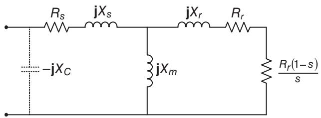

text_image

Rs jXs jXr Rr
-jXC jXm Rr(1-s)/s

Figure 7.52 Steady state equivalent circuit of an induction machine with power factor correction capacitors. $R _ { S } ,$ , stator resistance; $X _ { S } ,$ , stator reactance; $R _ { r } ,$ , rotor resistance; $X _ { r } ,$ rotor reactance; $X _ { m } ,$ magnetising reactance; $X _ { C } ,$ power factor correction reactance. j is the imaginary operator

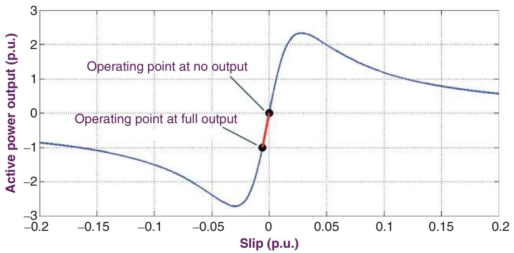

line

| Slip (p.u.) | Active power output (p.u.) |
| ----------- | -------------------------- |
| 0.00        | 0.0                        |
| 0.00        | -1.0                       |

Figure 7.53 Variation of active power with slip for an induction machine showing operation as a generator

Figure 7.53 shows how the active power varies with slip for a 1 MW induction machine. A convention has been chosen with the current sowing into the induction machine as positive and so the normal operating region for a generator is between 0 and − 1 MW (marked as −1 p.u. in the rgure). In this example, at 1 MW generation the slip is around −1% (−0.01 per unit) with the rotor rotating faster than the synchronous speed of the stator reld. It may be seen that the maximum power that can be generated before the peak of the curve is reached is around 2.6 MW. If the generator is connected to a distribution network with a low short-circuit level (and hence a high source impedance) the maximum power that may be exported before the peak of the curve is reached, is reduced

By combining Figure 7.53 and the variation of the reactive power drawn by the generator with slip, the conventional circle diagram representation of an induction machine shown in Figure 7.54 may be derived. Again, the normal generating region is shown. At 1 MW output the generator draws some 500 kVar. It may be shown that the reactive power requirement increases very rapidly if the output power rises above its rated value of 1 p.u.

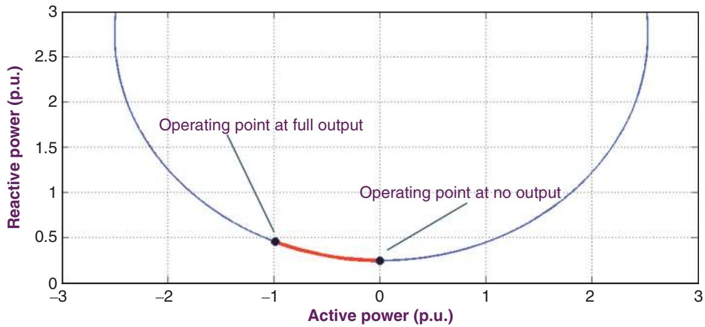

line

| Active power (p.u.) | Reactive power (p.u.) |
| ------------------- | --------------------- |
| -1.0                | 0.4                   |
| 0.0                 | 0.2                   |

Figure 7.54 Circle diagram of 1 MW induction machine

Fixed power factor correction capacitors $( X _ { C } )$ are used to reduce the requirement for reactive power from the network and so translate the circle diagram along the y axis towards the origin (but not all of the way, otherwise there is a danger of self-excitation). The equations used to describe the steady state performance of induction generators are given in any standard textbook (e.g. Hindmarsh 1984; McPherson 1990). Dynamic analysis is more complex but is dealt with by Krause (1986).

When they are rrst connected to the network, induction generators draw a large current transient due partly to the need to sux the magnetic circuits and partly because the slip tends to be high and so the term $\frac { R _ { r } ( 1 - s ) } { s }$ s in the equivalent circuit shown in Figure 7.52 becomes small. Thyristor soft-starts shown in Figure 7.55 are commonly used to limit the connection current. Their mode of operation is initially for the thyristors to be rred late in the voltage cycle and then the rring angle advanced (over several seconds) until the entire voltage wave is applied to the generator (Anaya-Lara et al. 2009). Thus the network voltage is applied gradually to the generator. Generally the soft-start units are only used for a few seconds before the by-pass contactor is closed and the induction generator connected directly to the network.

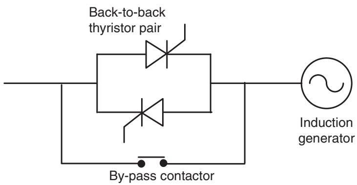

text_image

Back-to-back
thyristor pair
By-pass contactor
Induction
generator

Figure 7.55 Soft-start unit for an induction generator (one phase only shown)

# 7.5.2 Variable-slip induction generators

Variable-slip operation is achieved by introducing an external resistance into the rotor circuit, as shown in Figure 7.56. Note that in this rgure the resistors $R _ { r }$ and $R _ { r } \frac { ( 1 - s ) } { s }$ in Figure 7.52 are combined into $\frac { R _ { r } } { \nsim }$

The external resistance $( R _ { e x t } ) ^ { }$ is controlled by a power electronic switch. Below rated torque the switch short-circuits the external resistor to give no effect on the generator. Above rated torque, pulse width modulation (PWM) control is used to introduce the external resistance progressively into the rotor circuit. The alteration of the torque-slip curve is shown in Figure 7.57. As more external resistance is added, the slope of the torque slip curve is reduced, for example, to O-B. Below rated power, operation along O-A is just like that of a rxed-speed generator, but above rated the external resistor is varied continuously to maintain constant reaction torque, resulting in variable-speed operation along A-B. Operation at point B, −2.8% slip (1542 rpm for a four pole, 50 Hz generator) would result in losses of approximately 28 kW in a 1 MW generator. Increasing the rotor resistance $\mathrm { R } _ { \mathrm { r } }$ still further makes the machines lose its stability as the pull-out peak torque reduces with the external resistance.

As with a rxed-speed induction generator, power factor correction capacitors are used to reduce the reactive power drawn from the network.

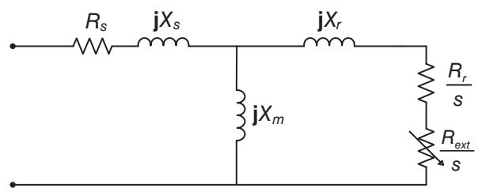

text_image

Rs jXs jXr
jXm
Rr/s
Rext/S

Figure 7.56 Steady state equivalent circuit of variable-slip induction generator showing addition of external resistor $\mathrm { R } _ { \mathrm { e x } }$

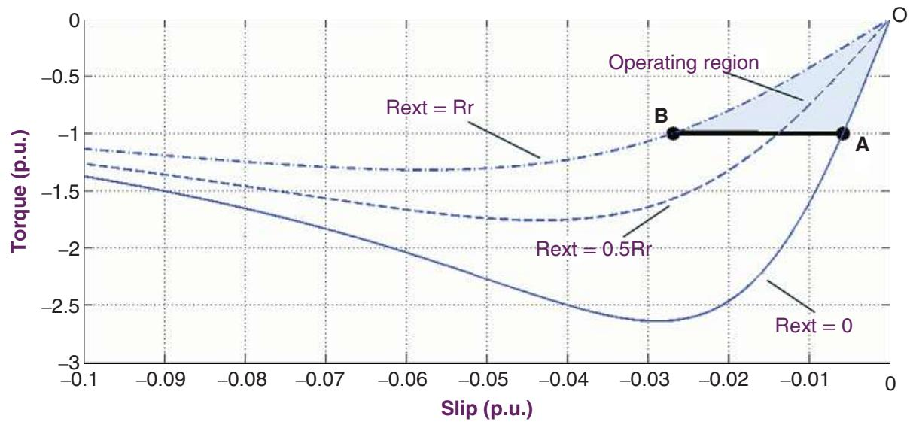

line

| Slip (p.u.) | Torque (p.u.) for Rext = 0 | Torque (p.u.) for Rext = 0.5Rr | Torque (p.u.) for Rext = Rr |
| ----------- | -------------------------- | ------------------------------ | --------------------------- |
| -0.1        | -1.5                       | -1.2                           | -1.1                        |
| -0.09       | -1.6                       | -1.3                           | -1.2                        |
| -0.08       | -1.7                       | -1.4                           | -1.3                        |
| -0.07       | -1.8                       | -1.5                           | -1.4                        |
| -0.06       | -1.9                       | -1.6                           | -1.5                        |
| -0.05       | -2.0                       | -1.7                           | -1.6                        |
| -0.04       | -2.1                       | -1.8                           | -1.7                        |
| -0.03       | -2.2                       | -1.9                           | -1.8                        |
| -0.02       | -2.3                       | -2.0                           | -1.9                        |
| -0.01       | -2.4                       | -2.1                           | -2.0                        |
| 0           | 0                          | 0                              | 0                           |

Figure 7.57 Effect of external resistance on the torque slip curve of an induction generator

# 7.5.3 Variable-speed operation

There are two main approaches to electrical variable-speed operation. Either all of the output power of the wind turbine is passed through two back-to-back frequency converters to give a wide range of variable-speed operation (full power conversion [FPC]), or a restricted speed range is achieved by converting only that fraction of the output power sowing in the rotor of a wound rotor induction machine (doubly fed induction generator [DFIG]).

In both cases, a Graetz bridge voltage source converter as shown in Figure 7.58 is used to create an ac voltage of any frequency and magnitude from a dc source. Insulated gate bipolar transistors (IGBTs) are used as the switching devices; they operate typically at between 2 and 8 kHz with PWM, to produce a close approximation to a sine wave voltage. Common techniques used to synthesise the sine wave voltage include carrier modulated (sine-triangular) PWM, hysteresis control and space vector modulation. All of these modulation techniques produce quite similar results but space vector control is easier to implement in a digital control system. With more rapid switching the voltage waveform approximates closely to a sine wave but at the expense of increased switching losses. The generator side converter rectires all of the power to dc, which is then inverted by the network side converter. Operation of this type of voltage source converter is described in Mohan et al. (1995) and Anaya-Lara et al. (2009).

Figure 7.59 shows how the IGBTs are switched to produce an approximation to a sine wave. Comparing the triangular carrier wave with the modulation signal produces variable width pulses from a dc source that have a fundamental component equal to the modulation signal. Figure 7.59a shows the control of the network side converter with a modulation signal of 50 Hz that is locked to the mains. The generator side converter produces a varying frequency to control the speed of the generator. The output of a pulse width modulated voltage source converter before and after rltering is as shown in Figure 7.59b. Within their operating limits, the voltage source converters can create a voltage of any frequency, phase or magnitude. They can be used to interface to the 50 or 60 Hz power system or to the variable-speed generator. In the DFIG they are used to apply a voltage to the wound rotor induction machine at its slip frequency. The operation of a voltage source converter at fundamental frequency can be represented as shown in Figure 7.60.

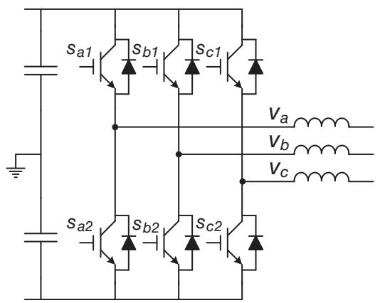

text_image

Sa1
Sb1
Sc1
Va
Vb
Vc
Sa2
Sb2
Sc2

Figure 7.58 Voltage source converter

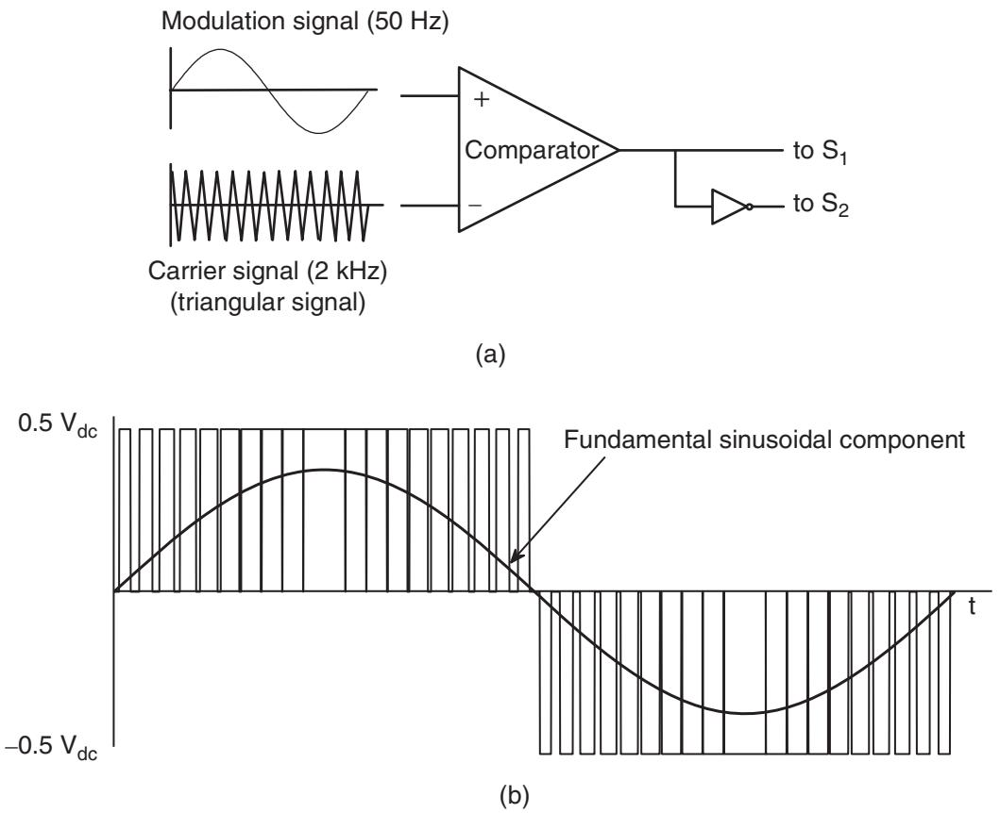

Figure 7.59 (a) Sine-triangular modulation circuit, and (b) PWM output of sinetriangular modulation   
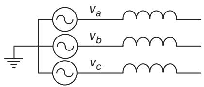

text_image

Vₐ
Vₑ
Vₒ

Figure 7.60 Ideal voltage sources representation of a voltage source converter

Even though the representation shown in Figure 7.60 is correct for the fundamental voltage (50 or 60 Hz), the voltage source converter operating under PWM switching pattern shown in Figure 7.59b produces harmonics. Figure 7.61 shows the harmonic voltages of a PWM converter. The rapid switching of PWM gives a large reduction in low order harmonics but the voltage will have signircant harmonic components around the switching frequency and multiples of the switching frequency.

# 7.5.4 Variable-speed operation using a DFIG

In a variable-slip generator, a speed increase of the wound rotor induction generator, is achieved by adding resistance into the rotor circuit using an external resistor. The power consumed in the external resistor is directly proportional to slip speed. Thus a 10% speed increase leads to losses in the external resistor of approximately 10% of the generator stator output power.

These additional losses do not compromise energy production because they occur only above rated, where surplus wind energy is being discarded anyway. However this high level of losses is undesirable in large wind turbines because of the cooling required to dispose of the resulting heat. Hence a development of the variable-slip system has been to replace the external controlled resistance with a pair of back-to-back voltage source converters; see Figure 6.22c. These apply a variable voltage (and hence inject current) at the rotor slip frequency and so allow operation above and below the synchronous speed of the stator reld. The synchronous speed of the stator reld is determined by the network frequency and number of poles of the stator winding (e.g. 1500 rpm for a four pole winding on a 50 Hz system) and with ±30% speed variation around this will require the power rating of rotor circuit converters to be approximately 30% of rated power.

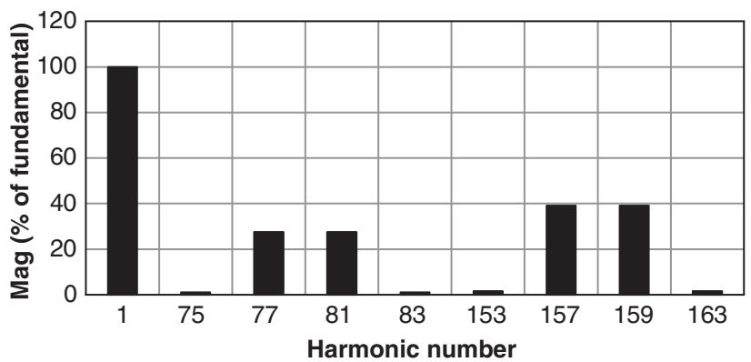

bar

| Harmonic number | Mag (% of fundamental) |
| :--- | :--- |
| 1 | 100 |
| 75 | 2 |
| 77 | 28 |
| 81 | 28 |
| 83 | 2 |
| 153 | 2 |
| 157 | 40 |
| 159 | 40 |
| 163 | 2 |

Figure 7.61 Typical harmonic spectrum of three phase voltage of a PWM inverter. Carrier frequency 3950 Hz (79th harmonic) and amplitude modulation 0.8 (after Mohan et al. 1995)

The steady state equivalent circuit of the DFIG is shown in Figure 7.62. The external resistor of the variable-slip generator is replaced by a voltage source. This applies a voltage to the slip rings of the wound rotor at slip frequency. The equivalent circuit has the rotor circuit referred to the stator and so the injected rotor voltage is divided by slip in the equivalent circuit.

The effect of injecting a voltage into the rotor is shown in Figure 7.63. The applied rotor voltages are quite small because, as shown in the equivalent circuit, the rotor voltage is divided by the slip. The extent of the speed range that is possible depends on the equivalent circuit parameters of the induction machine as well as the power rating of the converters.

Thus with rated applied torque (−1 per unit), the speed may be varied between point A and B by adjusting the voltage injected into the rotor circuit. Point B gives super-synchronous operation with power sowing out of the generator rotor. Point

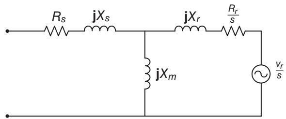

text_image

Rs jXs jXr Rr
jXm vR/s

Figure 7.62 Steady state equivalent circuit of the DFIG. $\mathrm { V _ { r } }$ is the injected rotor voltage

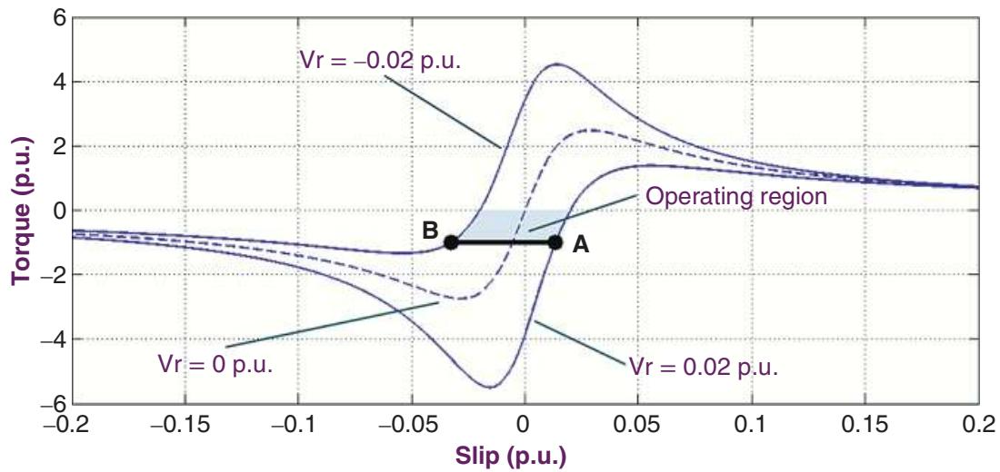

line

| Slip (p.u.) | Torque (p.u.) |
|-------------|---------------|
| -0.2        | ~0            |
| -0.15       | ~-1           |
| -0.1        | ~-2           |
| -0.05       | ~-3           |
| 0           | ~-5           |
| 0.05        | ~-2           |
| 0.1         | ~1            |
| 0.15        | ~1            |
| 0.2         | ~1            |

Figure 7.63 Steady state torque slip curves of a DFIG

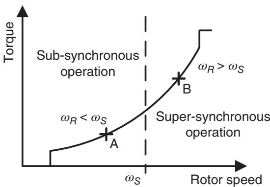

line

| Point | Rotor speed | Torque |
|-------|-------------|--------|
| A     | ω_S         | Low    |
| B     | ω_R > ω_S   | High   |

Figure 7.64 Torque speed curve of a DFIG

A gives sub-synchronous operation with power sowing into the generator rotor. The operating characteristic of the generator is shown in Figure 7.64.

The direction of real power sows in the rotor circuit of a DFIG may be understood from a simple analysis of the speed and torque of the generator. If the stator and rotor generator losses are neglected, the power transferred across the air gap of the generator $( P _ { a i r g a p } )$ is the same as the power in the stator. This is the mechanical input power $( P _ { m e c h } )$ minus the power sowing in the rotor circuit $( P _ { r o t o r } )$ , and so:

$$
P _ {a i r g a p} = P _ {s t a t o r} = P _ {m e c h} - P _ {r o t o r}
$$

$$
T \omega_ {s} = T \omega_ {r} - P _ {r o t o r}
$$

$$
P _ {r o t o r} = - T (\omega_ {s} - \omega_ {r})
$$

$$
= - T s \omega_ {s} = - s P _ {a i r g a p}
$$

$$
= - s P _ {s t a t o r}
$$

where

T: torque on generator shaft,

$\omega _ { s } \mathrm { : }$ synchronous speed,

$\omega _ { r } \mathrm { : }$ rotor speed,

s: slip

Thus, the direction of power sows into or out of the rotor changes with the sign of the slip. For a negative slip (super-synchronous operation) power sows out of the generator rotor while for positive slip (sub-synchronous operation) power sows into the generator rotor.

Figure 7.65 shows the direction of the power sows in the rotor circuit of a DFIG.

The doubly fed concept was used in some early large prototype wind turbines, e.g. the 3 MW Growian constructed in Germany in the early 1980s and the Boeing Mod 5b in the USA at around the same time. At that time, cyclo-converters were used to change the frequency of the rotor circuit but modern practice is to use two back-to-back voltage source converters in the rotor circuit.

Control techniques to operate a DFIG vary but one approach is to use vector control (Pena et al. 1996; Muller et al. 2002). In this technique, the three phase voltages and

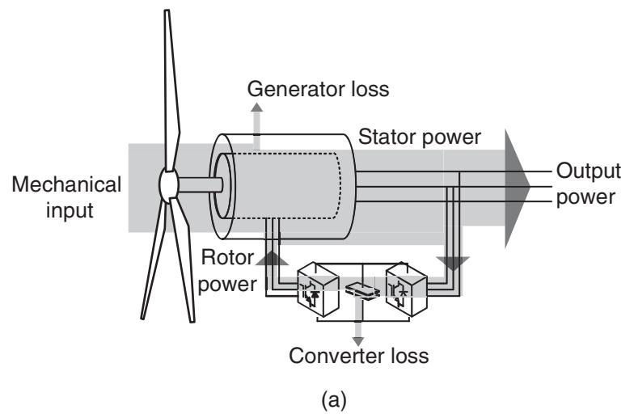

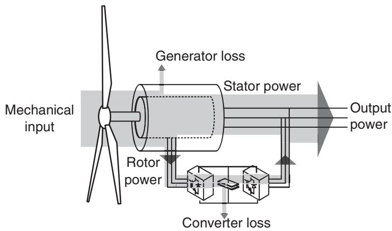

flowchart

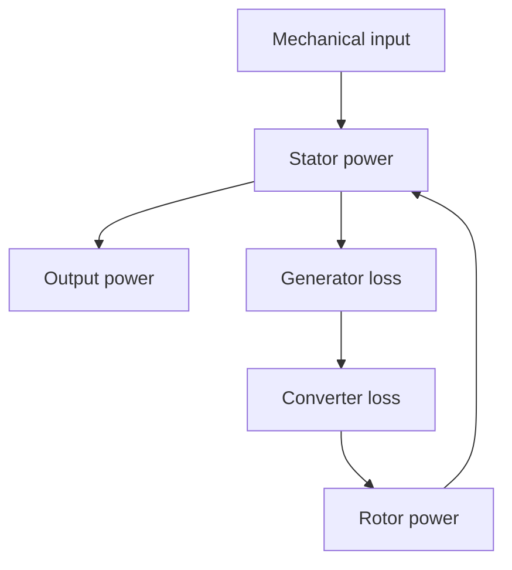
```mermaid
graph TD
    A["Mechanical input"] --> B["Stator power"]
    B --> C["Output power"]
    B --> D["Generator loss"]
    D --> E["Converter loss"]
    E --> F["Rotor power"]
    F --> B
```

(b)   
Figure 7.65 Power sows in a DFIG. (a) Sub-synchronous operation. (b) Supersynchronous operation

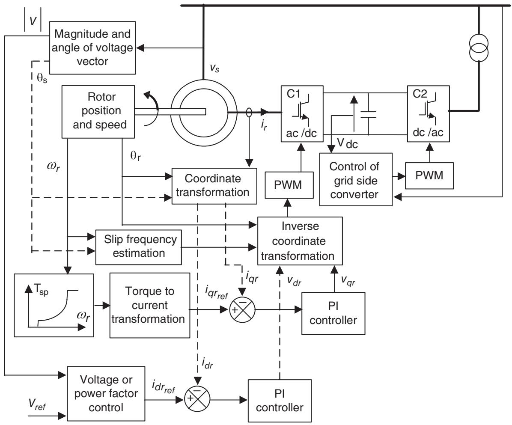

flowchart

```mermaid
graph TD
    A["Magnitude and angle of voltage vector"] --> B["Rotor position and speed"]
    B --> C["Coordinate transformation"]
    C --> D["PWM"]
    D --> E["Control of grid side converter"]
    E --> F["PWM"]
    F --> G["Inverse coordinate transformation"]
    G --> H["PI controller"]
    H --> I["+"]
    I --> J["+dr"]
    J --> K["Voltage or power factor control"]
    K --> L["i_dref_ref"]
    L --> M["+"]
    M --> N["PI controller"]
    N --> O["v_qr_ref"]
    O --> P["Tsp"]
    P --> Q["ωr"]
    Q --> R["Slip frequency estimation"]
    R --> S["Coordinate transformation"]
    S --> T["i_r"]
    T --> U["C1 ac /dc"]
    U --> V["V dc"]
    V --> W["C2 dc /ac"]
    W --> X["PWM"]
    X --> Y["Control of grid side converter"]
    Y --> Z["V_dc"]
    Z --> AA["C1 ac /dc"]
    AA --> AB["i_r"]
    AB --> AC["Coordinate transformation"]
    AC --> AD["+"]
    AD --> AE["v_dr"]
    AE --> AF["PI controller"]
    AF --> AG["v_qr_ref"]
    AG --> AH["+dr"]
    AH --> AI["+"]
    AI --> AJ["Voltage or power factor control"]
    AJ --> AK["i_dref_ref"]
    AK --> AL["+"]
    AL --> AM["PI controller"]
```

Figure 7.66 Schematic of a DFIG wind turbine typical control system

currents are transformed into two orthogonal vectors called direct (d) and quadrature (q) components. The PWM of each converter is driven by d and q components of the two controllers. The machine side converter is controlled to adjust torque of the generator and power factor/voltage independently. The network side converter maintains the voltage of the dc link. A simplired diagram of the control scheme used for the DFIG wind turbine is shown in Figure 7.66 (Ekanayake et al. 2003).

# 7.5.5 Variable-speed operation using a full power converter

Figure 7.67 shows the power sows in an FPC, variable-speed generation system. All of the power from the generator is rectired to dc and then inverted to the network voltage. This arrangement can be used with a range of generators. Induction generators with a gearbox mechanical transmission may be used in a conrguration that is the inverse of the variable-speed drives used for large mechanical loads, e.g. pumps and fans. Electrically excited or permanent magnet synchronous generators may be used, either with a highor medium-speed generator coupled to the aerodynamic rotor through a gearbox, or with a slow-speed multi-pole direct drive generator, which avoids the need for a gearbox.

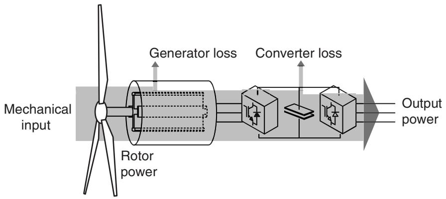

flowchart

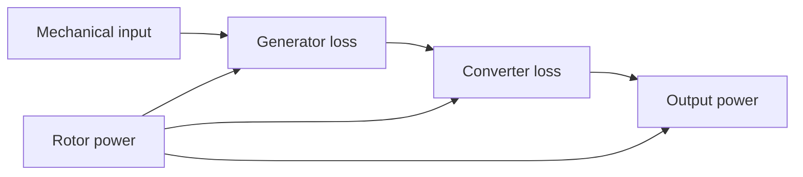
```mermaid
graph LR
    A["Mechanical input"] --> B["Generator loss"]
    B --> C["Converter loss"]
    C --> D["Output power"]
    E["Rotor power"] --> B
    E --> C
    E --> D
```

Figure 7.67 Power sows in a full power converter

Early broad range variable-speed wind turbines used a diode rectirer bridge in the generator converter and a naturally commutated thyristor current source converter on the network side (Freris 1990). However, naturally commutated thyristor converters always consume reactive power and generate considerable levels of characteristic low order harmonic currents. On weak distribution systems it is difrcult to provide suitable rltering and power factor correction for this type of equipment.

Hence modern practice is to use two voltage source converters (Heier 2014) in a manner similar to the arrangement of the rotor circuit of the DFIG, although all of the equipment must be rated at the full power of the wind turbine. The generator converter rectires all of the power to dc, which is then inverted back to ac by the network converter.

Control strategies vary but one approach is to use the two degrees of freedom of the generator converter output (magnitude and angle of the output voltage, or direct and quadrature axis voltages) to control the torque and excitation of the generator. Vector control as shown in Figure 7.66 is used to control the torque to a set-point obtained from the optimal wind turbine speed characteristic (Figure 6.21) while the reactive power sow is used to supply excitation to the generator. The network converter then maintains the dc link voltage and exchanges reactive power with the network. This arrangement is shown in Figure 6.22d.

An alternative approach is to control the generator converter to maintain the dc link voltage at a constant value and then use the network converter to control the active power sowing out of the system and hence the torque on the generator (Anaya-Lara et al. 2009). The network side converter is arranged to operate at any power factor within the rating of the equipment.

The voltage source converters employed in both DFIG and FPC systems need a method to obtain the angle of the network voltages $( \theta _ { s } ,$ , shown in Figure 7.66) and it is usual to use a phase-locked loop (PLL). Different rltering techniques may be employed to rlter out distorted grid voltages before they enter the PLL. Although it is quite straightforward to implement, a simple PLL can have a poor performance with rapidly changing harmonics and/or unbalanced voltage conditions on the grid. A number of network operators have expressed concern over the transient stability of variable-speed wind turbines with control systems based on PLLs.

# 7.6 Mechanical brake

# 7.6.1 Brake duty

As indicated in Section 6.8.3, a mechanical brake can be called on to fulrl a variety of roles, according to the braking philosophy adopted for the machine in question. The minimum requirement is for the mechanical brake to act as a parking brake, so that the machine can be stopped for maintenance purposes. The brake may also be used to bring the rotor to a standstill during high wind shut-downs, and during low-speed shut-downs as well in some cases. Aerodynamic braking is used to decelerate the rotor initially, so the mechanical brake torque can be quite low. However, IEC 61400-1:2019 requires that the mechanical brake be capable of bringing the rotor to a complete stop in a wind speed 5 m/s greater than the manufacturer’s maximum wind speed for maintenance or repair.

If the mechanical brake is required to arrest the rotor in the event of a complete failure of the aerodynamic braking system, then there are two deployment options to consider. Either the mechanical brake can be actuated when an overspeed resulting from the failure of the aerodynamic system is detected, or actuated simultaneously with the aerodynamic brake as part of the standard emergency shut-down procedure. The advantage of the former strategy is that the mechanical brake will rarely, if ever, have to be deployed in this way, so that some pad or even disc damage can be tolerated when deployment actually occurs. In addition, fatigue loading of the gearbox will be reduced if the brake is mounted on the high-speed shaft. However, if the mechanical brake is actuated before signircant overspeed has developed, then the aerodynamic torque to be overcome by the mechanical brake in the event of aerodynamic braking failure will be less.

The most severe emergency braking case will arise following a grid loss during generation in winds above rated. In the case of pitch-regulated machines, the maximum overspeed will occur after grid loss at rated wind speed because the rate of change of aerodynamic torque with rotational speed decreases and soon becomes negative at higher wind speeds. Conversely, if the pitch mechanism should jam, the braking duty becomes more severe at wind speeds at or above cut-out, because much higher aerodynamic torques are developed as the rotor slows down and the angle of attack increases. For stall-regulated machines the critical wind speed is generally at an intermediate value between rated and cut-out.

# 7.6.2 Factors governing brake design

The braking torque provided by callipers gripping a disc brake (Figure 7.68) is simply the product of twice the calliper force, the coefrcient of friction (typically 0.4), the number of callipers and the effective pad radius. Callipers providing clamping forces of up to 500 KN are available. However the brake design is also limited by

• Centrifugal stresses in the disc.   
• Pad rubbing speed.   
• Power dissipation per unit area of pad.   
• Disc temperature rise.

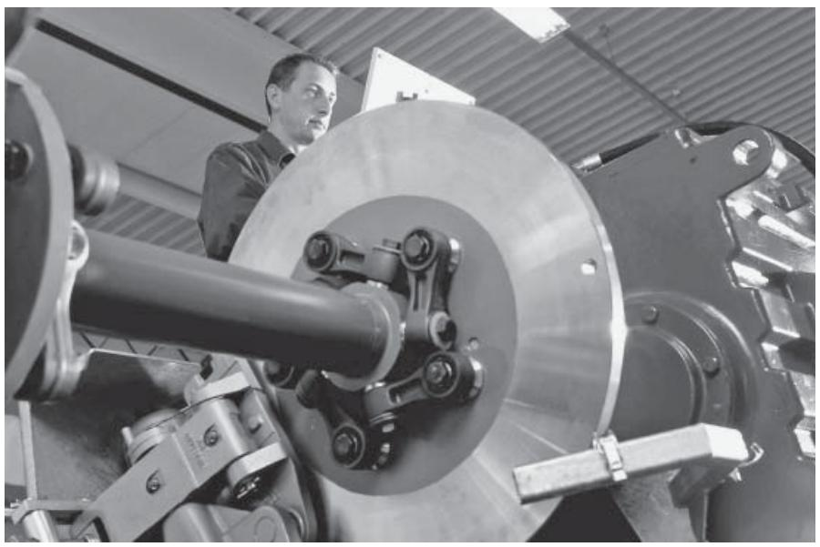

natural_image

Industrial worker operating machinery in a factory setting (no visible text or symbols)

Figure 7.68 High-speed shaft brake disc and calliper (reproduced by permission of NEG Micon)

The nature of these constraints is described below.

The critical stress generated by centrifugal stresses is in the tangential direction at the inner radius of the brake disc, but it is governed principally by the disc rim speed according to the following formula:

$$
\sigma_ {\theta} (a) = \frac {3 + \nu}{4} \rho \omega^ {2} b ^ {2} \left(1 + \frac {1 - \nu}{3 + \nu} \frac {a ^ {2}}{b ^ {2}}\right) \tag {7.83}
$$

where a and b are the inner and outer disc radii, respectively, and 휔 is the disc rotational speed. One brake manufacturer, Twisex, quotes a maximum safe disc rim speeds of around 90 m/s for their discs manufactured in spheroidal graphite cast iron.

Brake pads are generally made from sintered metal or a cheaper, resin based material. The former can accept rubbing speeds of up to $1 0 0 \mathrm { m } / \mathrm { s } ,$ but some manufacturers quote permitted rubbing speeds for the latter of only about 30 m/s. However, Wilson (1990) reports satisfactory performance of resin based pads at a rubbing speed of up to 105 m/s if the power dissipation rate per unit area, Q, is kept low enough. The criterion, ascribed to Ferodo, is that $Q = \mu P V { \leq } 1 1 . 6 \mathrm { M W } / \mathrm { m } ^ { 2 }$ , where 휇 is the coefrcient of friction, P is the brake pad pressure in K $\mathrm { \Delta N } / \mathrm { m } ^ { 2 }$ , and V is the rubbing speed in m/s. This requires the pad pressure to be reduced to $2 7 5 \mathrm { K N } / \mathrm { m } ^ { 2 }$ , assuming a friction coefrcient of 0.4.

During braking the kinetic energy of the rotor and drive train together with the additional energy fed in by the aerodynamic torque are dissipated in the brake disc and pads as heat, resulting in rapid initial temperature rise near the surface of the brake disc. The rate of energy dissipation is equal to the product of the braking torque and the disc rotational speed, so in the latter stages of braking the rate of energy dissipation cannot sustain the high surface temperatures and they begin to fall again.

The coefrcient of friction for pads of resin based materials is sensibly constant at a level of about 0.4 at temperatures up to $2 5 0 ^ { \circ } \mathrm { ~ C } ,$ , but begins to drop thereafter, reaching 0.25 at $4 0 0 ^ { \circ } \mathrm { C } .$ Although in theory the brake can be designed to reach the latter temperature, in practice the varying torque complicates the calculations and leaves little margin of error against a runaway loss of brake torque. Accordingly, $3 0 0 ^ { \circ } \mathrm { C }$ is often taken as the upper temperature limit for resin based pads.

Sintered metal pads have a constant coefrcient of friction of about 0.4 up to a temperature of at least $4 0 0 ^ { \circ } \mathrm { ~ C ~ }$ , but manufacturers indicate that the material can perform satisfactorily at temperatures up to $6 0 0 ^ { \circ } \mathrm { C }$ on a routine basis, or up to $8 5 0 ^ { \circ }$ intermittently. Wilson (1990) reports a reduced friction coefrcient of 0.33 at ${ 7 5 0 ^ { \circ } } \ C .$ . Such temperatures cannot be realised in practice because the temperature of the disc itself is limited to $6 0 0 ^ { \circ } \mathrm { C }$ in the case of spheroidal graphite cast iron or to a much smaller value in the case of steel (Wilson 1990).

Clearly the use of the more expensive sintered brake pads allows the brake disc to absorb much more energy. However, the sintered metal is a much more effective conductor of heat than resin based material, so it is often necessary to incorporate heat insulation into the calliper design to prevent overheating of the oil in the hydraulic cylinder.

A method of calculating brake disc temperature rise is given in the next section.

# 7.6.3 Calculation of brake disc temperature rise

The build-up in temperature across the width of a brake disc over the duration of the stop can be calculated quite easily if a number of assumptions are made. Firstly the heat generated is assumed to be fed into the disc at a uniform intensity over the areas swept out by the brake pads as the disc rotates. This is a reasonable approximation for a high-speed shaft-mounted brake and for a low-speed shaft-mounted brake with several callipers until rotation has almost ceased, but the energy input by this stage is much lower. Within the disc heat sow is assumed to be perpendicular to the disc faces only – i.e. radial sows are ignored.

Consider a brake disc slice at a distance x from the nearest braking surface, of thickness $\Delta x$ and cross-sectional area A. The rate of heat sow away from the nearest braking surface entering the slice is ${ \dot { Q } } = - k A { \frac { d \theta } { d x } }$ (where 휃 is the temperature and k the thermal conductivity) and the rate of heat sow leaving it on the far side is $\dot { Q } + \frac { d \dot { Q } } { d x } \Delta x$ . The temperature rise of an element of thickness $\Delta x$ over a time interval $\Delta t$ is given by

$$
\Delta \theta . A. \Delta x \rho C _ {p} = \Delta Q = - \frac {d \dot {Q}}{d x} \Delta x \Delta t = k A \frac {d ^ {2} \theta}{d x ^ {2}} \Delta x \Delta t
$$

where $\rho$ is the density and $C _ { p }$ is the specirc heat, so that

$$
\frac {d \theta}{d t} = \frac {k}{\rho C _ {p}} \frac {d ^ {2} \theta}{d x ^ {2}} \tag {7.84}
$$

Adopting an FE approach, Eq. (7.84) can be written as

$$
\theta (x, t + \Delta t) = \theta (x, t) + \frac {k}{\rho C _ {p}} \frac {\Delta t}{(\Delta x) ^ {2}} [ \theta (x + \Delta x, t) + \theta (x - \Delta x, t) - 2 \theta (x, t) ] \tag {7.85}
$$

Substituting values of $k = 3 6 \mathrm { W / m } \mathrm { p e r } ^ { \circ } \mathrm { K } , C _ { p } = 5 0 2 \mathrm { J / k g } \mathrm { p e r } ^ { \circ } \mathrm { K }$ and $\rho = 7 0 8 5 \mathrm { k g } / \mathrm { m } ^ { 3 }$ for Grade 450 spheroidal graphite cast iron yields a value for the thermal diffusivity $\alpha = k / ( \rho C _ { p } )$ of $\mathrm { i } . 0 1 \times 1 0 ^ { - 5 } \mathrm { m } ^ { \hat { 2 } } / \mathrm { s }$ . If the time increment, $\Delta t ,$ is selected at 0.025 seconds and the element thickness is taken as 1.005 mm, then Eq. (7.85) simplires to

$$
\theta (x, t + \Delta t) = \theta (x, t) + 0. 2 5 [ \theta (x + \Delta x, t) + \theta (x - \Delta x, t) - 2 \theta (x, t) ] \tag {7.86}
$$

This equation can be used to calculate the temperature distribution across the brake disc, starting with a uniform distribution and imposing suitable increments at the braking surfaces at the boundaries. The behaviour at the boundaries is simpler to follow through if they are treated as planes of symmetry like the disc mid-plane, with imagined discs sanking the real one. The temperature increment at the boundary at each timestep, which is added to that calculated from Eq. (7.86), is given by

$$
\Delta \theta_ {0} = \frac {2 T \omega (t) \Delta t}{\rho C _ {p} S \Delta x} \tag {7.87}
$$

where T is the braking torque per disc face (assumed constant), 휔(t) is the disc rotational speed at time t, and S is the area swept out by the brake pad (or pads) on one side of the disc. For a disc diameter D and pad width w, S is $\pi ( D - w ) w$ . The factor 2 is required because heat is assumed to sow into the imagined disc as well as into the real one. Hence the initial temperature build-up can be calculated as illustrated in Table 7.13, taking an arbitrary value of $\Delta \theta _ { 0 }$ of $4 0 ^ { \circ } \mathrm { ~ C ~ }$ . (The gradual reduction in $\Delta \theta _ { 0 }$ over time due to deceleration is ignored here for simplicity.)

The brake disc surface temperature rise is found to be a minimum when the ratio of the braking torque to the maximum aerodynamic torque is about 1.6. As the ratio is reduced below this value, the extended stopping time results in more energy being abstracted from the wind, so temperatures begin to rise rapidly. However, the maximum brake temperature is relatively insensitive to increases in the ratio above 1.6. The variation in maximum brake disc surface temperature with braking torque is illustrated for the emergency braking of a stall-regulated machine following an overspeed in Figure 7.69, where the continuous line gives the surface temperature rise calculated by the FE method outlined above. It transpires that the maximum temperature rise can be estimated quite accurately by the following empirical formula:

Table 7.13 Illustrative example of calculation of brake disc temperature rise using an FE model 

<table><tr><td rowspan="2">Timestep</td><td rowspan="2">Time (sec)</td><td>Element</td><td>0</td><td>1</td><td>2</td><td>3</td><td>4</td><td>5</td></tr><tr><td>Distance from braking surface (mm)</td><td>0</td><td>1.0</td><td>2.0</td><td>3.0</td><td>4.0</td><td>5.0</td></tr><tr><td rowspan="3">1</td><td rowspan="2"></td><td>Initial temperature</td><td>0</td><td>0</td><td>0</td><td>0</td><td>0</td><td>0</td></tr><tr><td>Boundary temperature increment</td><td>40</td><td></td><td></td><td></td><td></td><td></td></tr><tr><td rowspan="3">0.025</td><td>Temperature at end of timestep</td><td>20</td><td>10</td><td>0</td><td>0</td><td>0</td><td>0</td></tr><tr><td rowspan="3">2</td><td>Boundary temperature increment</td><td>40</td><td></td><td></td><td></td><td></td><td></td></tr><tr><td>Sum</td><td>60</td><td>10</td><td>0</td><td>0</td><td>0</td><td>0</td></tr><tr><td rowspan="3">0.05</td><td>Temperature at end of timestep</td><td>35</td><td>20</td><td>2.5</td><td>0</td><td>0</td><td>0</td></tr><tr><td rowspan="3">3</td><td>Boundary temperature increment</td><td>40</td><td></td><td></td><td></td><td></td><td></td></tr><tr><td>Sum</td><td>75</td><td>20</td><td>2.5</td><td>0</td><td>0</td><td>0</td></tr><tr><td rowspan="3">0.075</td><td>Temperature at end of timestep</td><td>47.5</td><td>29.4</td><td>6.3</td><td>0.6</td><td>0</td><td>0</td></tr><tr><td rowspan="3">4</td><td>Boundary temperature increment</td><td>40</td><td></td><td></td><td></td><td></td><td></td></tr><tr><td>Sum</td><td>87.5</td><td>29.4</td><td>6.3</td><td>0.6</td><td>0</td><td>0</td></tr><tr><td>0.1</td><td>Temperature at end of timestep</td><td>58.5</td><td>38.2</td><td>10.6</td><td>1.9</td><td>0.1</td><td>0</td></tr></table>

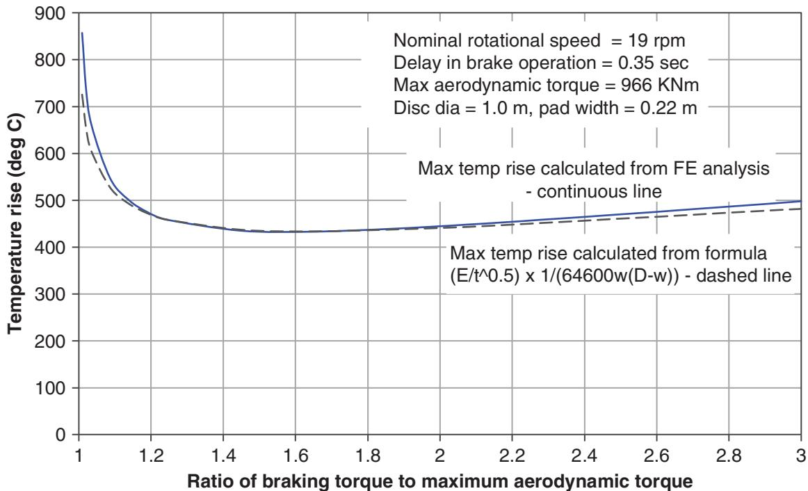

line

| Ratio of braking torque to maximum aerodynamic torque | Temperature rise (deg C) |
| ---------------------------------------------------- | ------------------------- |
| 1.0                                                  | 850                       |
| 1.2                                                  | 500                       |
| 1.4                                                  | 450                       |
| 1.6                                                  | 430                       |
| 1.8                                                  | 430                       |
| 2.0                                                  | 440                       |
| 2.2                                                  | 450                       |
| 2.4                                                  | 460                       |
| 2.6                                                  | 470                       |
| 2.8                                                  | 480                       |
| 3.0                                                  | 500                       |

Figure 7.69 Brake disc surface maximum temperature rise for emergency braking of 60 m dia, 1.3 MW stall-regulated turbine from 10% overspeed in 20 m/s wind with high-speed shaft brake acting alone

$$
\theta_ {\max} - \theta_ {0} = \frac {E}{\sqrt {t}} \frac {1}{6 4 6 0 0 w (D - w)} = \frac {E}{\sqrt {t}} \frac {\pi}{6 4 6 0 0 S} \tag {7.88}
$$

where E is the total energy dissipated in Joules, t is the duration of the stop in seconds, and S is the area of the disc surfaces swept by the brake pads. The temperature derived using this formula is plotted as a dotted line in Figure 7.69 for comparison.

# 7.6.4 High-speed shaft brake design

A key parameter to be chosen in brake design is the design braking torque. The coefrcient of friction can vary substantially above and below the design value due to such factors as bedding in of the brake pads and contamination, so the design braking torque calculated on the nominal friction value must be increased by a suitable materials factor. The 1993 edition of the GL guidelines (Germanischer Lloyd 1993) specired a materials factor of 1.2 for the coefrcient of friction, and added in another factor of 1.1 for possible loss of calliper spring force. If these factors are adopted, the minimum design braking moment is 1.78 times the maximum aerodynamic torque, after including the aerodynamic load factor of 1.35. A small additional margin of, say, 5% should be added to ensure that the rotor is still brought to rest without a very large temperature rise should the 1.78 safety factor be completely eroded.

The procedure to be followed for the design of a brake on the high-speed shaft can conveniently be illustrated by the following example.

Example 7.2 Design a high-speed shaft brake for a 60 m diameter, 1.3 MW stallregulated machine capable of shutting the machine down in a 20 m/s wind from a 10% overspeed occurring after a grid loss, with or without assistance from the aerodynamic braking system. The nominal low-speed shaft and high-speed shaft rotational speeds are 19 rpm and 1500 rpm, respectively, ignoring generator slip. Assume that the brake application delay time is 0.35 sec, and that the inertia of the turbine rotor, drive train, brake disc and generator rotor – all referred to the low-speed shaft – totals $2 8 7 3 \mathrm { T m } ^ { 2 }$ .

1. Derivation of the brake design torque: The peak aerodynamic torque occurs when the maximum rotational speed is reached just prior to brake application. The rrst step is to determine the relationship between rotational speed and aerodynamic torque for the stated wind speed of 20 m/s. From this the acceleration of the rotor and build-up of aerodynamic torque during the 0.35 seconds of delay before the brake comes on can be determined. The speed increase in this case is 1 rpm, giving a maximum rotor speed of $1 9 \times 1 . 1 + 1 = 2 1 . 9$ rpm and peak aerodynamic torque of 966 KNm. Hence the brake design torque is $9 6 6 \times 1 . 7 8 \times 1 . 0 5 = 1 8 0 0 \mathrm { K N }$ m referred to the low-speed shaft, or $1 8 0 0 \times 1 9 / 1 5 0 0 = 2 2 . 8$ KNm at the brake.   
2. Brake disc diameter selection: The maximum rotor speed corresponds to a high-speed shaft speed of $2 1 . 9 \times ( 1 5 0 0 / 1 9 ) = 1 7 2 9 \mathrm { r p m } = 1 8 1$ rad/sec, so the maximum permissible brake disc radius as regards centrifugal stresses is about $9 0 / 1 8 1 = 0 . 4 9 7$ m. It is advisable to choose the largest permitted size to minimise temperature rise, so 1.0 m diameter is selected in this case. The pad rubbing speed will be quite acceptable if sintered pads are used.   
3. Selection of number and size of brake pads: The total brake pad area is governed by the need to keep the maximum power dissipation per unit pad area below $1 \dot { 1 } . 6  { \mathrm { M W } /  { \mathrm { m } } ^ { 2 } }$ . The power dissipation is equal to the product of the braking torque and the rotational speed, so it is at a maximum at the onset of braking – i.e. $2 2 . 8 \times 1 8 1 = 4 1 2 8 \mathrm { k W } ,$ , giving a required total area of the brake pads of $4 1 2 8 / 1 1 6 0 0 = 0 . 3 5 6 \mathrm { m } ^ { 2 }$ . This area can be provided by four callipers rtted with $0 . 2 2 \times 0 . 2 2$ m pads, giving $0 . 3 8 7 \mathrm { m } ^ { 2 }$ in all.   
4. Maximum brake disc temperature check: The variation in disc surface temperature over the duration of the stop can be calculated using the FE method outlined in the preceding section. The resulting variation in this case is plotted in Figure 7.70. The surface temperature reaches a maximum of $4 4 0 ^ { \circ } \mathrm { C } ,$ just after halfway through the stop, which lasts 4.7 seconds from the time the brake comes on. This temperature is well below the limit for sintered pads.   
5. Calliper force: The braking friction force required is 58.5 KN, calculated from the torque divided by the effective pad radius of 0.39 m. Hence the required calliper force is $5 8 . 5 / ( 8 \times 0 . 4 ) = 1 7 . 3 \mathrm { K N } ,$ , which is rather low for a calliper sized for a $0 . 2 2 \times 0 . 2 2$ m brake pad.

The design process outlined above results in an excessive number of lightly loaded callipers, because of the limitation on power dissipation per unit area. If the relative infrequency of emergency braking events allowed this limitation to be relaxed, then a more economic solution would result.

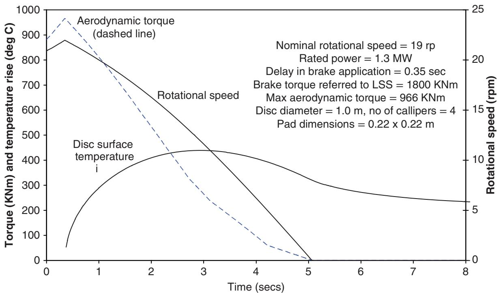

line

| Time (secs) | Torque (KNm) | Rotational Speed (rpm) |
|-------------|--------------|------------------------|
| 0           | 850          | 25                     |
| 1           | 880          | 20                     |
| 2           | 750          | 15                     |
| 3           | 600          | 10                     |
| 4           | 400          | 5                      |
| 5           | 0            | 0                      |
| 6           | ~250         | ~5                     |
| 7           | ~220         | ~3                     |
| 8           | ~200         | ~2                     |

Figure 7.70 Emergency braking of stall-regulated 60 m dia turbine from 10% overspeed in 20 m/s wind with high-speed shaft mechanical brake acting alone

# 7.6.5 Two-level braking

During normal as opposed to emergency shut-downs, the rotor is decelerated to a much lower speed by aerodynamic braking before the brake is applied, so the brake torque required is much reduced. In view of the benert of reduced loads on the braking system, and on the gearbox in particular, some manufacturers arrange for a reduced braking torque for normal shut-downs. This is achieved on the usual ‘spring applied, hydraulically released’ brake callipers by allowing oil to discharge from the hydraulic cylinder via a pressure relief valve when the brake is applied, so that the hydraulic pressure drops to a reduced level. After the rotor has come to rest, the remaining hydraulic pressure can be released, so that the brake torque rises to the full level.

# 7.6.6 Low-speed shaft brake design

The procedure for designing a low-speed shaft disc brake is much simpler than that for the high-speed shaft brake, because the limits on disc rim speed, pad rubbing speed, power dissipation per unit area and temperature rise do not insuence the design, which is solely torque driven. The large braking torque required means that a brake placed on the low-speed shaft will be much bulkier than one with the same duty placed on the low-speed shaft. For example, the design low-speed shaft braking torque of 1800 KNm from the example above would require a 1.8 m diameter disc rtted with seven callipers.

A study by Corbet et al. (1993), which investigated a range of machine diameters, concluded that the brake cost would double or treble if the brake were placed on the low-speed shaft rather than on the high-speed shaft. However, when the extra gearbox costs associated with a high-speed brake were taken into account, the cost advantage of the high-speed shaft brake disappeared.

In the case of direct drive turbines, the mechanical brake has to act on the low speed shaft, as no high-speed shaft is available.

# 7.7 Nacelle bedplate

The functions of the nacelle bedplate are to transfer the rotor loadings to the yaw bearing and to provide mountings for the gearbox and generator. Normally it is a separate entity, although in machines with an integrated gearbox, the gearbox casing and the nacelle bedplate can be a single unit. The bedplate can either be a welded fabrication consisting of longitudinal and transverse beam members or a casting sculpted to rt the desired load paths more precisely. One fairly common arrangement is a casting in the form of an inverted frustum that supports the low-speed shaft main bearing at the front and the port and starboard gearbox supports towards the rear, with the generator mounted on a fabricated platform projecting to the rear and attached to the main casting by bolts.

Although conventional methods of analysis can be used to design the bed plate for extreme loads, the complicated shape renders an FE analysis essential for calculating the stress concentration effects needed for fatigue design. Fatigue analysis is complicated by the need to take into account up to six rotor load components. However, given stress distributions for each load component obtained by separate FE analyses, the stress time history at any point can be obtained by combining appropriately scaled load component time histories previously obtained from a load case simulation.

# 7.8 Yaw drive

The yaw drive is the name given to the mechanism used to rotate the nacelle with respect to the tower on its slewing bearing, in order to keep the turbine facing into the wind and to unwind the power and other cables when they become excessively twisted. It usually consists of a number of electric or hydraulic motors mounted on the nacelle, each of which drives a pinion mounted on a vertical shaft via a reducing gearbox. The pinion engages with gear teeth on the rxed slewing ring bolted to the tower, as shown in Figure 7.71. These gear teeth can either be on the inside or the outside of the tower, depending on the bearing arrangement, but they are generally located on the outside on smaller machines so that the gear does not present a safety hazard in the restricted space available for personnel access.

On large wind turbines it is often expedient to rt numerous small yaw motors rather than a few large ones and, in the case of the Siemens-Gamesa SWT-7.0-154 turbine, there are 16. These are each rated at 40 Nm and drive through a 960:1 gearbox (IECRE 2019), producing a total nominal torque of 615 kNm.

The yaw moments on rigid hub machines arise from differential loading on the blades, which may be broken down into deterministic and stochastic components. On a three bladed machine, the dominant deterministic yaw loading is at 3P, but it is generated by 2P blade loading, as is demonstrated below. The blade out-of-plane root bending moments can be described in terms of harmonics of the rotational frequency, Ω, as follows:

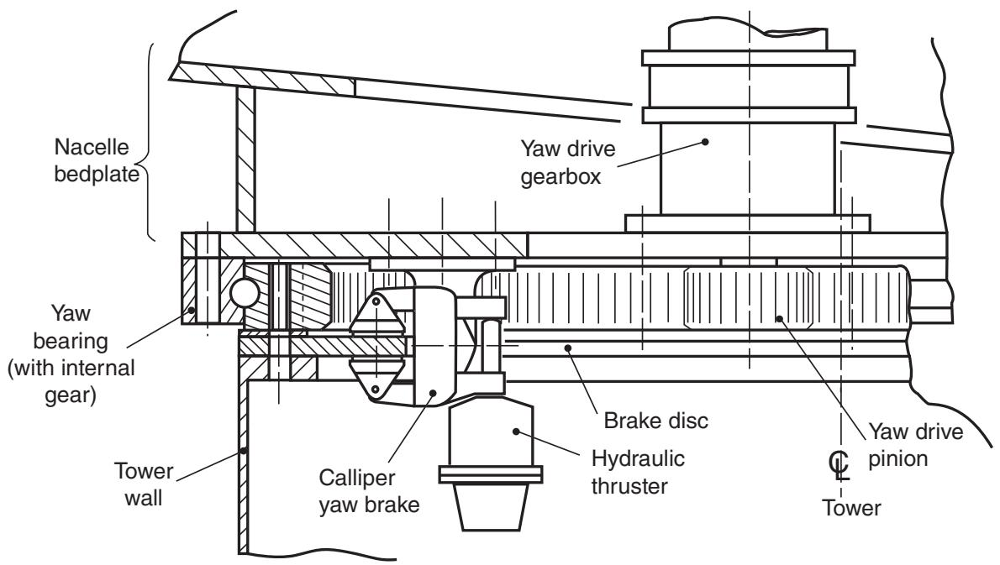

text_image

Nacelle bedplate
Yaw bearing (with internal gear)
Tower wall
Calliper yaw brake
Yaw drive gearbox
Brake disc
Hydraulic thruster
Yaw drive pinion
Tower

Figure 7.71 Typical arrangement of yaw bearing, yaw drive, and yaw brake

$$
M _ {Y j} = \sum_ {n} a _ {n} \sin \left(n \left\{\omega t + \frac {2 \pi (j - 1)}{3} \right\} + \phi_ {n}\right) \tag {7.89}
$$

Hence the yaw moment from all three blades is given by

$$
\begin{array}{l} M _ {Z T} = \sin \omega t \sum_ {n} a _ {n} \sin (n \omega t + \phi_ {n}) + \sin \left(\omega t + \frac {2 \pi}{3}\right) \sum_ {n} a _ {n} \sin \left(n \left\{\omega t + \frac {2 \pi}{3} \right\} + \varphi_ {n}\right) \\ + \sin \left(\omega t - \frac {2 \pi}{3}\right) \sum_ {n} a _ {n} \sin \left(n \left\{\omega t - \frac {2 \pi}{3} \right\} + \phi_ {n}\right) \tag {7.90} \\ \end{array}
$$

i.e.

$$
M _ {Z T} = \sum_ {n} a _ {n} \left[ \sin \omega t \sin (n \omega t + \phi_ {n}) \left\{1 - \cos \frac {2 \pi n}{3} \right\} + \sqrt {3} \cos \omega t \cos (n \omega t + \phi_ {n}) \sin \frac {2 \pi n}{3} \right] \tag {7.91}
$$

For the rrst four harmonics, this gives

$$
M _ {Z T} = 1. 5 \{a _ {1} \cos \phi_ {1} - a _ {2} \cos (3 \omega t + \phi_ {2}) + a _ {4} \cos (3 \omega t + \phi_ {4} \} \tag {7.92}
$$

Thus it is seen that the blade out-of-plane bending harmonics at 2P and 4P produce yaw moment at 3P, while those at 1P and 3P produce steady and zero yaw moments, respectively.

As turbine size increases, the turbine diameter becomes larger in relation to gust dimensions, and the scope for differential loading on the blades due to turbulence increases. The expression for the standard deviation of the stochastic yawing moment on a three bladed machine is the same as that for the shaft moment standard deviation – see Eq. (5.119a).

Anderson et al. (1993) investigated yaw moments on two sizes of Howden three bladed turbines (33 m dia 330 kW and 55 m dia 1 MW) and concluded that the major source of cyclic yaw loading is stochastic at 3P. Yaw error, however, was not found to make a signircant contribution. Given that yaw error results in a blade out-of-plane load suctuation at rotational frequency, this result is in accordance with Eq. (7.92).

Several different strategies have been evolved for dealing with the large cyclic yaw moments that arise on rigid hub machines due to turbulence, as follows.

1. Fixed yaw: A yaw brake is provided in the form of one or more callipers acting on an annular brake disc and is designed to prevent unwanted yaw motion under all circumstances. See Figure 7.71. This can require 6 callipers on a 60 m diameter machine. During yawing, the yaw motors drive against the brake callipers, which are partly released, so that the motion is smooth.

2. Friction damped yaw: Yaw motion is damped by friction in one of three different ways. In the rrst, the nacelle is supported on friction pads resting on a horizontal annular surface on the top of the tower. The yaw drive has to work against the friction pads, which also allow slippage under extreme yaw loads. This system was employed on the 500 kW Vestas V39 and the 3 MW WEG LS1.

In the second, the nacelle is mounted on a conventional rolling element slewing bearing, and the friction is provided by a permanently applied brake, using the same conrguration as for rxed yaw. Optionally, the pressure on the brake pads can be increased when the machine is shut down for high winds.

In the third, the nacelle is supported on a three-row roller type slewing bearing (see Figure 7.45d), but with the rollers replaced by pads of elastomer composite to generate friction.

3. Soft yaw: This is hydraulically damped rxed yaw. The oil lines to each side of the hydraulic yaw motor are each connected to an accumulator via a choke valve, allowing limited damped motion to and fro to alleviate sudden yaw loads. This system is used on the 300 kW WEG MS3, which has a two bladed, teetered rotor, but experiences signircant yaw loads when teeter impacts occur.

4. Damped free yaw: A hydraulic yaw motor is used as before, but the oil lines to each side of the motor are connected together in a loop via a check valve, rather than being connected to a hydraulic power pack. This arrangement prevents sudden yaw movements in response to gusts, but depends on yaw stability over the full range of wind speeds. Unfortunately, yaw stability in high winds is rare.

5. Controlled free yaw: This is the same as damped free yaw, except that provision is made for yaw corrections when necessary. This strategy was adopted successfully on several Windmaster machines, including the two bladed, rxed hub 750 kW machine.

Friction damped yaw is the strategy most commonly adopted.

# 7.9 Tower

# 7.9.1 Introduction

Wind turbine towers are normally of tubular or lattice steel construction, but steel is sometimes replaced by pre-cast concrete in the lower part of higher towers. There have been instances of in-situ construction of concrete towers for prototype wind turbines, but this is not generally viable because of the higher costs associated with work on site.

Sections 7.9.3 and 7.9.4 consider the design of tubular and lattice towers, respectively, while Section 7.9.5 describes Enercon’s hybrid tower. Minimisation of turbine excitation of tower natural frequency is a key design objective, so this is discussed rrst.

# 7.9.2 Constraints on Jrst mode natural frequency

As noted in Section 6.14, it is important to avoid the excitation of resonant tower oscillations by rotor thrust suctuations at blade passing frequency or, to a lesser extent, at rotational frequency. Dynamic magnircation impacts directly on fatigue loads, so the further the rrst mode tower natural frequency is from the exciting frequencies, the better.

In the case of machines operating at one of two rxed speeds, the latitude available for the selection of the tower natural frequency is more restricted. Figure 7.72 shows the variation of dynamic magnircation factor with tower natural frequency for excitation at upper and lower blade passing and rotational frequencies for a three bladed machine with a 3:2 ratio between the upper and lower speeds. The curves are plotted for a damping ratio of zero, but the difference if the curves were plotted for a realistic damping ratio of about 5% would be small. The rgure also shows the tower natural frequency bands available if the dynamic magnircation ratio were to be limited to 4 for all four sources of excitation. It is apparent that the minimum dynamic magnircation ratio obtainable with a tower natural frequency between the upper rotational frequency and lower blade passing frequency is 1.65, for a tower natural frequency of 0.79 times the lower blade passing frequency.

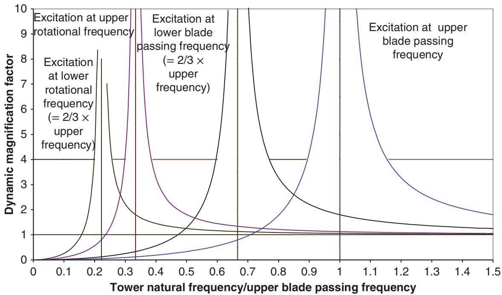

line

| Tower natural frequency/upper blade passing frequency | Dynamic magnification factor (Excitation at upper rotational frequency) | Dynamic magnification factor (Excitation at lower rotational frequency (= 2/3 × upper frequency)) | Dynamic magnification factor (Excitation at lower blade passing frequency (= 2/3 × upper frequency)) | Dynamic magnification factor (Excitation at upper blade passing frequency) |
| ------------------------------------------------------ | ------------------------------------------------------------------ | ---------------------------------------------------------------------------------- | ---------------------------------------------------------------------------------- | ------------------------------------------------------------------ |
| 0.0                                                    | 0.0                                                                | 0.0                                                                              | 0.0                                                                              | 0.0                                                                |
| 0.1                                                    | ~0.5                                                               | ~0.1                                                                             | ~0.1                                                                             | ~0.1                                                               |
| 0.2                                                    | ~2.0                                                               | ~0.5                                                                             | ~0.5                                                                             | ~0.5                                                               |
| 0.3                                                    | ~4.0                                                               | ~1.0                                                                             | ~1.0                                                                             | ~1.0                                                               |
| 0.4                                                    | ~6.0                                                               | ~1.5                                                                             | ~1.5                                                                             | ~1.5                                                               |
| 0.5                                                    | ~8.0                                                               | ~2.0                                                                             | ~2.0                                                                             | ~2.0                                                               |
| 0.6                                                    | ~9.0                                                               | ~2.5                                                                             | ~2.5                                                                             | ~2.5                                                               |
| 0.7                                                    | ~10.0                                                              | ~3.0                                                                             | ~3.0                                                                             | ~3.0                                                               |
| 0.8                                                    | ~9.0                                                               | ~3.5                                                                             | ~3.5                                                                             | ~3.5                                                               |
| 0.9                                                    | ~7.0                                                               | ~4.0                                                                             | ~4.0                                                                             | ~4.0                                                               |
| 1.0                                                    | ~5.0                                                               | ~4.5                                                                             | ~4.5                                                                             | ~4.5                                                               |
| 1.1                                                    | ~3.0                                                               | ~5.0                                                                             | ~5.0                                                                             | ~5.0                                                               |
| 1.2                                                    | ~1.5                                                               | ~5.5                                                                             | ~5.5                                                                             | ~5.5                                                               |
| 1.3                                                    | ~0.5                                                               | ~6.0                                                                             | ~6.0                                                                             | ~6.0                                                               |
| 1.4                                                    | ~0.2                                                               | ~6.5                                                                             | ~6.5                                                                             | ~6.5                                                               |
| 1.5                                                    | ~0.1                                                               | ~7.0                                                                             | ~7.0                                                                             | ~7.0                                                               |

Figure 7.72 Variation of dynamic magnircation factors with tower natural frequency for a two-speed, three bladed m/c

Although the same minimum dynamic magnircation ratio would also apply to a variable-speed machine with a 3:2 ratio between the upper and lower rotational speeds, this ratio is above 2:1 for most variable-speed machines, resulting in a much higher minimum dynamic magnircation. In these circumstances, the controller may have to impose an exclusion zone preventing operation in a critical rotational speed band – see Section 8.3.4.

Once a satisfactory tower design – in terms of strength and natural frequency – has been evolved for a given turbine, it is a straightforward matter to scale up the machine to larger rotor sizes, provided all of the tower dimensions are scaled similarly, the hub height wind speed is unchanged, and the tip speed is maintained constant. It can be shown that in these circumstances the tower natural frequency varies inversely with rotor diameter, as does the rotational speed of the rotor, so that the dynamic magnircation factors are unchanged. Similarly, tower stresses due to extreme wind loading are the same as before.

The situation is less straightforward if the tower height is to be varied for a particular turbine. Assuming, as before, that the extreme hub height wind speed remains the same, and that the wind loading on the tower is negligible compared with the wind loading on the rotor, then the tower base overturning moment is simply proportional to hub height, H. Constant stresses can be maintained at the tower base by scaling all cross-section dimensions up in proportion to the cube root of the hub height. If the same scaling is maintained all of the way up the tower, then the tower natural frequency will vary as $\sqrt { I _ { B } / H ^ { 3 } } = \sqrt { H ^ { 4 / 3 } / H ^ { 3 } } = 1 / \bar { H } ^ { 5 / 6 }$ , neglecting tower mass, where $I _ { \mathrm { B } }$ is the second moment of area of the tower base cross-section. Thus, doubling the tower height would result in a 44% reduction in natural frequency. Alternatively, if the tower base overturning moment were assumed to vary as $\mathrm { H } ^ { 1 . 5 }$ to allow for the effect of wind shear on hub height wind speed and the contribution of wind loading on the tower, then constant tower base stresses could be maintained by scaling the cross-section dimensions up by $\sqrt { H }$ . On this basis, tower natural frequency would vary as $1 / { \sqrt { H } }$ .

The practical consequences of ‘tuning’ the tower natural frequency are discussed with respect to tubular towers in the next section.

# 7.9.3 Steel tubular towers

In the absence of buckling, a waisted conical shell, with a semi angle of $4 5 ^ { \circ }$ below the critical zone for tip clearance, would be the most efrcient structure for transferring a horizontal rotor thrust acting in any direction to ground level. However, apart from the practicalities of transport and erection, instability of thin walled shells in compression precludes such a design solution, and the steel tubular towers in common use have a very modest taper. It can be noted in passing that the manufacture of gently tapering towers has only been made possible by the development of increasingly sophisticated rolling techniques, and that early tubular towers were constructed from a series of cylindrical tubes of decreasing diameter with short ‘adaptor’ sections welded between them.

A tapered tower is generally fabricated from a series of pairs of plates rolled into half frusta and joined by two vertical welds. The height of each frustum so formed is limited to two or three metres by the capacity of the rolling equipment. Care has to be taken in the execution of the horizontal welds to minimise local distortion, which weakens the tower under compression loading.

Assuming that a tower design with a uniform taper is to be adopted, the key design parameters to establish are the diameter and wall thickness at the tower base. The tower top diameter, however, is governed by the size of the yaw bearing.

The main considerations determining the tower dimensions at the base are buckling of the shell wall in compression, strength under fatigue loading and stiffness requirements for ‘tuning’ the natural frequency. These are dealt with in separate sub-sections below.

As machines get larger, another important consideration is the maximum tower base diameter that can be accommodated on the highway when tower sections are transported overland. In the sat terrain of North Germany and Denmark, this limit is generally 4.0–4.2 m, but elsewhere it will often be less.

# Design against buckling

Given perfect geometry, the strength of a cylindrical steel tube in axial compression is the lesser of the yield strength and the elastic critical buckling stress, given by

$$
\sigma_ {c r} = 0. 6 0 5 E t / r \tag {7.93}
$$

where r is the cylinder radius and t is the wall thickness. Yield strength governs for r/t less than $0 . 6 0 5 E / f _ { \nu }$ , which equates to 506 for mild steel, with $f _ { \nu } = 2 4 5 \mathrm { M P a }$ . However, the presence of imperfections, particularly those introduced by welding, means that the tower wall compression resistance is signircantly reduced, even at the relatively low tower wall radius to thickness ratios normally adopted. There is quite a wide disparity between the provisions of different national codes, with some making an explicit link between compression resistance and tolerances on imperfections and others not.

The provisions of EN 1993-1-6:2007, Eurocode 3: Design of Steel Structures – Part 1.6: Strength and Stability of Shell Structures, will be described here.

The rrst step is to decide the fabrication tolerance quality class, based on the imperfection tolerances that can be realistically achieved in the production facility.

The limits on the out-of-plane deviations, w, of the cylinder, or ‘dimples’, measured with either

(i) a rod of length $L = 4 \sqrt { r t }$ placed vertically, away from welds; or   
(ii) a circular template of the same length placed horizontally, away from welds; or   
(iii) a rod of length L = 25t placed vertically across horizontal welds

as a percentage of the requisite gauge lengths are given for different fabrication tolerance quality classes in Table 7.14, which also gives corresponding values of the fabrication quality parameter, Q.

Having determined the appropriate fabrication quality parameter, the meridional elastic imperfection reduction factor, $\alpha _ { x } .$ , and the plastic limit relative slenderness, $\lambda _ { p } ,$ can be determined according to

$$
\alpha_ {x} = \frac {0 . 6 2}{1 + 1 . 9 1 \left(\frac {1}{Q} \sqrt {\frac {r}{t}}\right) ^ {1 . 4 4}} \tag {7.94}
$$

Table 7.14 Recommended dimple tolerance and corresponding value of the fabrication quality parameter for different fabrication tolerance quality classes 

<table><tr><td>Fabrication tolerance quality class</td><td>Description</td><td>Recommended limit on percentage deviation</td><td>Fabrication quality parameter, Q</td></tr><tr><td>Class A</td><td>Excellent</td><td>0.6%</td><td>40</td></tr><tr><td>Class B</td><td>High</td><td>1.0%</td><td>25</td></tr><tr><td>Class C</td><td>Normal</td><td>1.6%</td><td>16</td></tr></table>

and

$$
\lambda_ {p} = \sqrt {\frac {\alpha_ {x}}{0 . 4}} \tag {7.95}
$$

The buckling strength reduction factor, 휒, is then given by

$$
\chi = 1 - 0. 6 \left(\frac {\lambda - \lambda_ {0}}{\lambda_ {p} - \lambda_ {0}}\right) \tag {7.96}
$$

where 휆 is the relative shell slenderness, $\sqrt { f _ { y } / \sigma _ { c r } } , \sigma _ { \mathrm { c r } }$ is the elastic critical meridional buckling stress and $\lambda _ { 0 }$ is the squash limit relative slenderness. Both the latter parameters depend on the proportion, 휀, the axial stress forms of the total, as follows:

$$
\sigma_ {c r} = 0. 6 0 5 E \frac {t}{r} (1 - 0. 4 \varepsilon) \tag {7.97}
$$

and

$$
\lambda_ {0} = 0. 3 - 0. 1 \varepsilon \tag {7.98}
$$

As wind turbine tower stresses are dominated by bending stress, 휀 is small and can be ignored for preliminary design. Figure 7.73 shows how the buckling strength reduction factor varies with the shell radius to thickness ratio for the different fabrication tolerance quality classes under the assumption that axial stress is negligible. Note that the plot shows the buckling strength reduction factor divided by the partial safety factor for materials strength of 1.1 specired in IEC 61400-1:2019 for global buckling of curved shells assessed according to EN 1993-1-6:2007 (reduced from the 1.2 value specired in previous editions). Also plotted (as a dashed line) is the corresponding curve specired in the GL rules (2005) for a 1% limit on dimple depth. In this case the buckling strength reduction factor is divided by partial safety factor for materials strength given by the GL rules/DIN (which varies with relative shell slenderness, 휆), allowing the comparison of the design strengths obtained by the two methods.

The effect of the choice of tower base diameter on total tower weight is best illustrated by reference to a concrete example. Consider the design of a 50 m hub height tower in mild steel for a 60 m diameter, 3 bladed, stall-regulated turbine at a site with a 60 m/s extreme wind speed. The tower base wall thickness required to resist the overturning moment produced by this wind speed has been calculated for a range of tower base diameters with the aid of Eq. (7.96) and plotted on Figure 7.74. Corresponding tower weights have also been plotted, based on a tower top diameter and wall thickness of 2.25 m and 11 mm, respectively, and assuming an idealised linear wall thickness variation between tower top and tower base. It can be seen that the tower weight reaches a minimum value at about

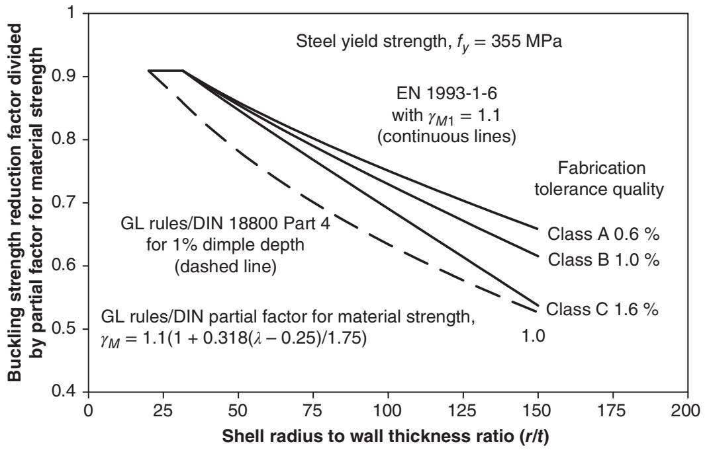

line

| Shell radius to wall thickness ratio (r/t) | Buckling strength reduction factor divided by partial factor for material strength (EN 1993-1-6 with γM1 = 1.1, continuous lines) | Fabrication tolerance quality (Class A 0.6 %) | Fabrication tolerance quality (Class B 1.0 %) | Fabrication tolerance quality (Class C 1.6 %) |
| ------------------------------------------ | ---------------------------------------------------------------------------------- | --------------------------------------------- | --------------------------------------------- | --------------------------------------------- |
| 25                                         | 0.9                                                                              | ~0.92                                                                 | ~0.92                                                                 | ~0.92                                                                 |
| 50                                         | ~0.85                                                                            | ~0.85                                                                 | ~0.85                                                                 | ~0.85                                                                 |
| 75                                         | ~0.8                                                                             | ~0.8                                                                 | ~0.8                                                                 | ~0.8                                                                 |
| 100                                        | ~0.75                                                                            | ~0.75                                                                 | ~0.75                                                                 | ~0.75                                                                 |
| 125                                        | ~0.7                                                                             | ~0.7                                                                 | ~0.7                                                                 | ~0.7                                                                 |
| 150                                        | ~0.65                                                                            | ~0.65                                                                 | ~0.65                                                                 | ~0.65                                                                 |
| 175                                        | ~0.6                                                                             | ~0.6                                                                 | ~0.6                                                                 | ~0.6                                                                 |
| 200                                        | ~0.55                                                                            | ~0.55                                                                 | ~0.55                                                                 | ~0.55                                                                 |

Figure 7.73 Variation of buckling strength reduction factor, divided by partial safety factor for material strength, with shell radius to thickness ratio, for zero axial stress

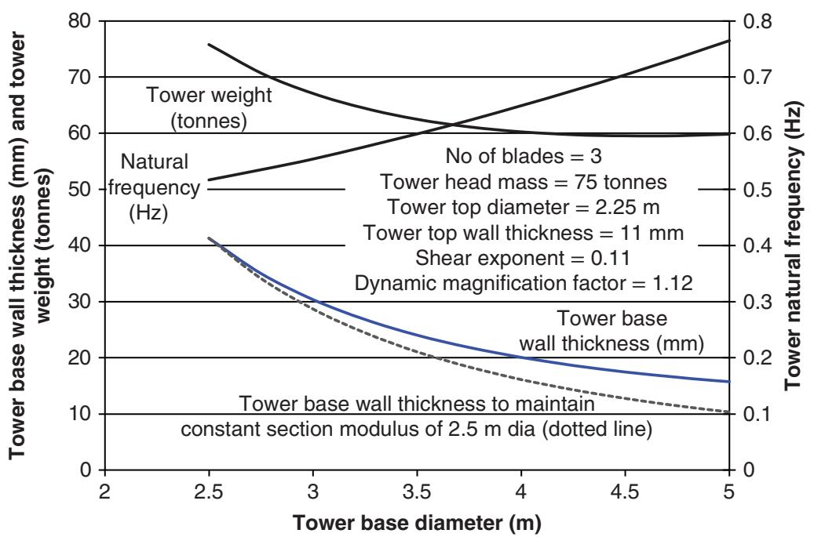

line

| Tower base diameter (m) | Tower wall thickness (mm) | Tower weight (tonnes) |
| ----------------------- | ------------------------- | --------------------- |
| 2.5                     | 40                        | 75                    |
| 3.0                     | 30                        | 65                    |
| 3.5                     | 20                        | 60                    |
| 4.0                     | 15                        | 60                    |
| 4.5                     | 10                        | 60                    |
| 5.0                     | 5                         | 75                    |

Figure 7.74 Variation in tower base wall thickness with diameter required for support of 60 m dia stall-regulated wind turbine at 50 m hub height in 60 m/s extreme wind speed

4.5 m diameter, indicating that beyond this point the reduction in cross-sectional area for constant section modulus is offset by the effects of the reducing buckling strength and the increasing wind loading on the tower itself. The weight penalty resulting from restricting the tower base diameter to 4.0 m for transport purposes would, in this case, be negligible.

# Fatigue design

Clear rules for the fatigue design of steel welded structures are given in EN 1993-1-9:2005, Eurocode 3: Design of Steel Structures – Part 1.9: Fatigue, where a family of S-N curves is derned for different weld details. On a log–log plot these curves in fact consist of two straight lines, with slopes of 1/5 and 1/3 for numbers of cycles above and below $5 \times 1 0 ^ { 6 }$ respectively. In addition, there is a cut-off limit at $N = 1 0 ^ { 8 }$ cycles, so that stress cycles with a stress range smaller than that derned at $1 0 ^ { 8 }$ cycles are deemed not to cause any fatigue damage at all.

Excluding the tower doorway (which is considered later) the critical weld details on a steel tubular tower are likely to be at welded attachments for intermediate platform and cable support members and the horizontal welds to the tower base sange and intermediate bolted sanges. Assuming a full penetration butt weld is provided (see upper joint in Figure 7.76), the detail category number for the horizontal welds is 71 (where the number 71 indicates the stress range applicable at $2 \times 1 0 ^ { 6 }$ cycles in MPa). The detail category number for longitudinal welded attachments reduces as the length of the attachment increases, but if the attachment length can be restricted to 80 mm, the detail category number of 71 applies here as well. The S-N curve for this detail category is shown in Figure 7.75.

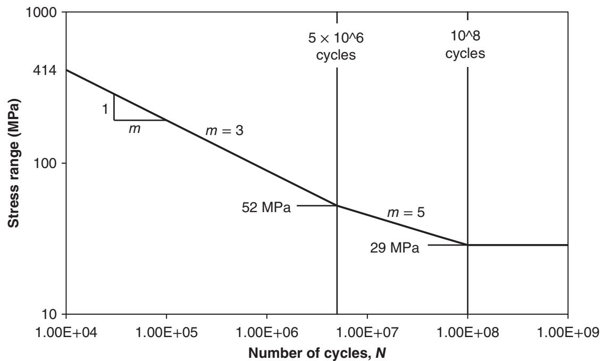

line

| Number of cycles, N | Stress range (MPa) |
| ------------------- | ------------------ |
| 100000              | 414                |
| 1000000             | 100                |
| 10000000            | 52                 |
| 100000000           | 29                 |

Figure 7.75 EN 1993-1-9:2005 fatigue strength curve for detail category 71 (butt-welded T joint)

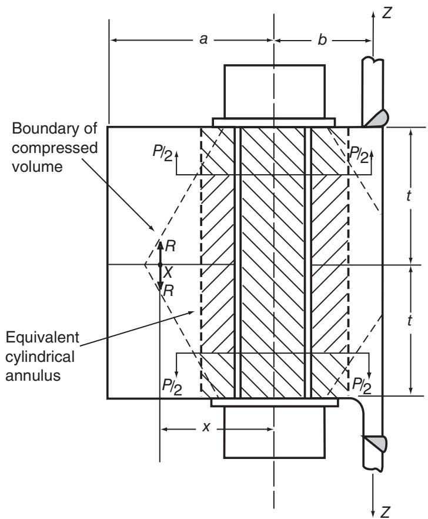

text_image

Boundary of
compressed
volume
P/2
R
X
R
Equivalent
cylindrical
annulus
P/2
x
P/2
t
Z
a
b
Z

Figure 7.76 Bolted sange joint

Where tower design is governed by fatigue, tower weight can be reduced by selecting weld details corresponding to higher detail categories. This has led to the introduction of ‘weld-neck’ sanges, where the ‘neck’ constitutes a short section of the tower wall (see lower joint in Figure 7.76), so that the weld is a standard transverse butt weld (detail category 90) rather than a tee-butt weld (detail category 71). Similarly, the length of welded attachments can be reduced to 50 mm, to raise the detail category to 80.

EN 1993-1-9:2005 recommends different partial safety factors for fatigue strength, $\gamma _ { M f } ,$ according to the consequences of failure and the assessment method. If load redistribution can occur in the event of fatigue damage, then the component concerned can be assessed by the ‘damage tolerant method’, with $\gamma _ { M f }$ taken as 1.0 and 1.15, for low and high consequence of failure, respectively. However, if local formation of cracks in a structural element could rapidly lead to its failure, assessment should be by the ‘safe-life method’, with increased values of $\gamma _ { M f }$ of 1.15 and 1.35. In a welded tubular structure, there is no barrier to the propagation of a fatigue crack that has reached a critical length, so the designer must decide whether an inspection regime can be designed to detect incipient cracks before they become critical. Otherwise the tower needs to be assessed by the ‘safe-life’ method.

IEC 61400-1 adopts a similar approach, but some of the partial safety factors for fatigue strength are less conservative. The derivation of fatigue load spectra and the combination of stress ranges due to $M _ { X }$ and $M _ { Y }$ load spectra are discussed in Section 5.12.6.

# Relative criticality of extreme and fatigue loads

The relative criticality of buckling failure (under extreme loads) and fatigue loads depends on a variety of factors. However, fatigue is more likely to be critical on pitchregulated machines than on stall-regulated ones, because of the increased rotor thrust suctuations above rated and the reduced extreme loading at standstill. Fatigue is also more likely to be critical at low wind speed sites, because the percentage reduction in extreme loads is less than the percentage reduction in fatigue equivalent load.

# Tuning of tower natural frequency

Considerable scope exists, at least in theory, for adjusting the tower natural frequency to a suitable value by varying the base diameter, while maintaining the necessary strength against extreme and fatigue loading. The effect on natural frequency of varying tower base diameter by a factor of 2, for a case where extreme loading governs, is illustrated for a 60 m dia stall-regulated machine at 50 m hub height in Figure 7.74. The frequency increases from 0.517 Hz for a 2.5 m base diameter to 0.765 Hz for a 5.0 m diameter. Now the rotational speed of a 60 m dia turbine to yield a 60 m/s tip speed is about 19 rpm. If we assume that the machine is two speed, with a lower rotational speed of 19 × 2/3 = 12.67 rpm, then the lower blade passing frequency will be 0.633 Hz – right in the middle of the available tower natural frequency range. Adopting a + 15% / -15% frequency exclusion zone, the tower natural frequency is required to be less than 0.538 Hz or more than 0.728 Hz. However, a frequency of 0.728 Hz would require a diameter of about 4.7 m (without making the tower wall thicker than necessary for the strength requirement), which is likely to be ruled out by transport considerations. Thus the only strength limited design option is one with a base diameter of 2.75 m, with a weight penalty of about 10 t compared with the 60 t optimum design, giving a natural frequency of about 0.535 Hz. Alternatively, a 4 m base diameter could be chosen and the wall thickness increased by 37% to 27.5 mm to give a frequency of about 0.728 Hz. However, the weight penalty in this case is over 15 t.

The above case study illustrates the fact that it is not always economic to satisfy the natural frequency requirements for a particular combination of turbine and hub height. In these circumstances it may well be preferable to change the hub height. For example, a hub height of 55 m would work much better for the case described, with a tower base diameter of 3.5 m yielding a natural frequency of 0.535 Hz and a tower weight of 74 Tonnes.

# Joints between tower sections

Towers are normally fabricated in several sections for transport reasons, so joints are required. Welding on site is an expensive operation, so bolted joints are almost always used, although sleeved joints, in which each tapered tower section is threaded over the one beneath and forced into place by jacking, have been used successfully.

# Bolted @ange joints

The most widely used bolted arrangement is the internal sanged joint as illustrated in Figure 7.76. The sanges are butt welded to the ends of the mating sections, with the sange outer edge sush with the tower wall. Alternatively, the sange may be formed with a stub section of tower wall already attached. Such sanges, which are termed weld neck Tanges, provide a smoother transition from wall to sange (as illustrated in the lower half of Figure 7.76) and result in a higher butt weld detail category.

After assembly, each bolt is torqued or tensioned to induce a pre-load between the sanges to minimise in-service bolt fatigue stresses. The bolt should be initially sized to resist the prying force induced by the extreme tower wall tensile stresses – taking the fulcrum adjacent to the sange inner edge – and then checked for fatigue.

The fatigue calculation for the bolts in a sanged joint depends on the relationship between the bolt load and tower wall stress, which only remains linear while contact is maintained over the full sange width. The Verein Deutscher Ingenieure (VDI) guideline for The Systematic Calculation of High Duty Bolted Joints, VDI 2230 (1986), gives a method for calculating the bolt load increment as a proportion of the load increment in the ‘tributary’ width of tower wall under these conditions. The axial loading on the sanged joint and the effect of the moment due to the eccentricity of loading are considered separately. The axial load is assumed to be shared between the bolt and the pre-loaded sanges in proportion to the stiffnesses of the load paths, which, in the case of the sanges, is based on a reduced cross-sectional area related to the volume compressed by the pre-load according to

$$
A _ {e r s} = \frac {\pi}{4} (d _ {w} ^ {2} - d _ {h} ^ {2}) + \frac {\pi}{8} d _ {w} (D _ {A} - d _ {w}) [ (k + 1) ^ {2} - 1 ] \text {   where   } k = \sqrt [ 3 ]{\frac {l _ {k} d _ {w}}{D _ {A} ^ {2}}} \tag {7.99}
$$

and

$d _ { \mathrm { w } }$ is the washer face diameter on the bolt head and nut

$d _ { \mathrm { h } }$ is the bolt hole diameter

$l _ { \mathrm { k } }$ is the clamping length between bolt head and nut

$D _ { \mathrm { A } }$ is twice the distance from the bolt centreline to the nearest sange edge, or the bolt spacing, whichever is the less

The guideline recognises that the effective plane of introduction of the external load will not necessarily be immediately under the bolt head or nut, but may lie nearer the sange mid-plane, giving the load paths distinguished by different cross-hatching in Figure 7.76. Stresses due to the eccentricity of the tower wall load to the sange contact area are dealt with by ordinary bending theory applied to the whole contact area.

The VDI 2230 method outlined above no longer applies once a gap has opened up between the sanges at the outer edge. For larger suctuations in the externally applied load, Z, the fulcrum model can be used, although it is inevitably conservative at low loads. The axial load, P, applied to the bolt/sange combination is calculated on the basis that a fulcrum exists at X, a distance x from the bolt, so that $P = Z ( 1 + b / x )$ , and the load share between the bolt and the compressed volume of sange is calculated according to the relative stiffnesses as before.

In Figure 7.77, the two linear relationships between bolt load increment and externally applied load are compared with experimental results for a particular test specimen with a single sange bolt. The bolt pre-load is $F _ { 0 }$ . It is assumed that the planes of introduction of the load on the bolt/sange combination are immediately under the bolt head and nut in each case. Line OA shows the VDI 2230 model, with the point A representing the limit of its validity. Line OB shows the fulcrum model, with B representing the point at which the pre-load between the sanges at the position of the bolts disappears. Thereafter, the bolt load varies as $Z ( 1 + b / x ) - { \mathrm { i } } . \mathbf { e } .$ . along line BC for $x / a = 0 . 7$ . It may be noted from Figure 7.77 that a value of x/a of 0.8 results in better agreement with the test results at high loads, but these are not of interest for design purposes.

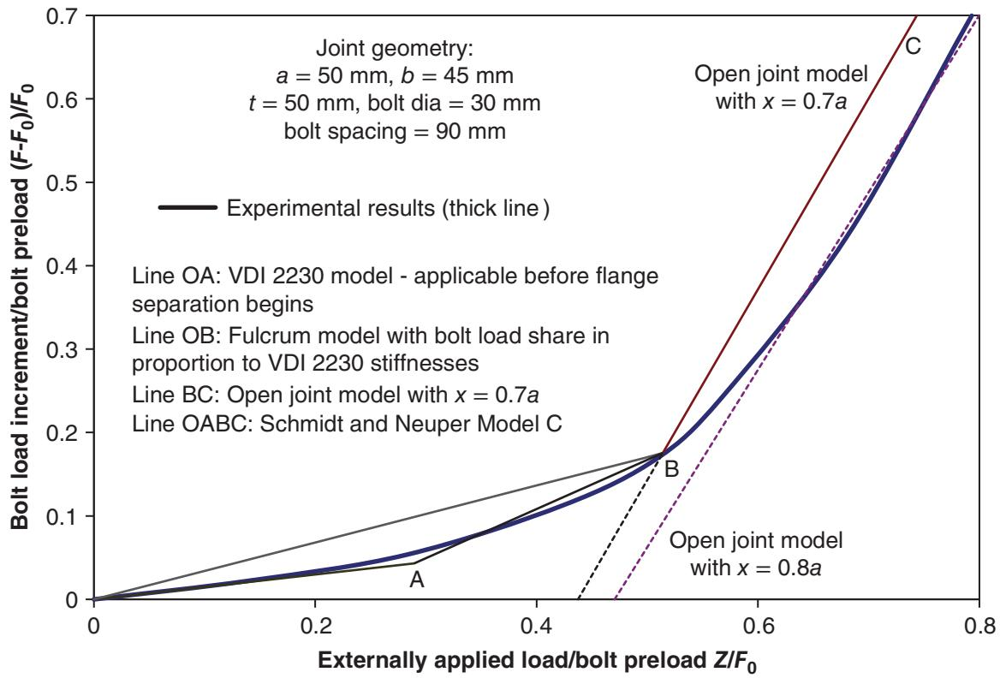

line

| Line | Description                                      | X Value | Y Value |
|------|--------------------------------------------------|---------|---------|
| OA   | VDI 2230 model - applicable before flange separation begins | 0.5     | 0.18    |
| OB   | Fulcrum model with bolt load share in proportion to VDI 2230 stiffnesses | 0.5     | 0.18    |
| BC   | Open joint model with x = 0.7a                        | 0.5     | 0.18    |
| OABC | Schmidt and Neuper Model C                          | 0.5     | 0.18    |
| C    | Open joint model with x = 0.7a                         | 0.8     | 0.7     |

Figure 7.77 Flange joint bolt load variation with externally applied load, Z, and bolt pre-load, $F _ { 0 }$ –experimental results and engineering models compared

Schmidt and Neuper (1997) have proposed a more sophisticated model identired as Model C, which combines aspects of the two models already described and gives a bolt load characteristic consisting of the three straight lines OA, AB, and BC (see Figure 7.77). Clearly this agrees much better with the experimental results, but it adds to the complexity of the fatigue load calculation.

Uniformity of bolt loading around the tower clearly depends on the accuracy of the mating sange surfaces. Schmidt et al. (1999) have investigated the effects of various imperfections using an FE model and made tentative suggestions regarding permitted tolerance levels.

# Bolted lap joints

The structurally most effective joint is made with friction grip bolted splice plates oriented vertically and sandwiching the walls of the abutting tower sections between them. Provided the grip force is adequate, the joint will not slip even under the extreme load, with the result that the bolts are not subject to fatigue loads. Apart from the effect of splice plates on the external appearance, the main drawback is the practical difrculty of joint assembly, because this form of bolting requires the provision of some form of personnel access to the outside of the tower.

As hub heights have increased, manufacturers have sought to avoid the constraint on tower diameter imposed by transport requirements by introducing vertical joints, so that the lower sections of tower can be split into narrower segments. In view of the low stresses in the horizontal direction, this can usually be accomplished by a simple lap joint.

Lagerwey is one among several manufacturers utilising modular towers. Their 166 m high tower for the 4.0–4.5 MW L136 turbine utilises 12 m long pre-bent steel sheets with pre-drilled bolt holes along the four edges. At site the sheets are bolted together into full-circle assemblies using tension controlled high strength friction grip bolts (TCB 2020). Each assembly is then craned into position and secured to the one below by a horizontal bolted joint with six rows of bolts.

# Tower tie-down

The tower is normally rtted with a base sange, which can either be attached to the foundation by screwed rods cast into the concrete or bolted to an embedded tower stub.

If screwed rods are employed, they are normally anchored by a steel annular plate at their base, and their capacity to resist overturning moment is determined by the pull-out resistance of the semi-circle of rods on the upwind side. As this is governed by the concrete shear strength, the rods have to be anchored quite deep into the concrete, so that their length is typically similar to the tower base radius.

The gap between the tower base sange and the concrete foundation is grouted and the tie-down rods are then stressed to induce a pre-load between the base sange and the concrete. This considerably reduces the stress ranges in the tie-down rods themselves due to turbine loading that would otherwise result in unacceptable fatigue damage. The share of tower wall uplift loads taken by the rods can be based on an estimate of the relative stiffnesses of the rod and the loaded volume of the concrete, assuming a dispersion angle of about 30∘ in the radial direction. The screwed rods should be sheathed, so that the pre-tension is applied over the full length.

# Tower doorways

A doorway is required for access at or near the tower base, and additional doorways are sometimes required for a transformer in the tower base or for maintenance access to the blade tip mechanism. Often they have vertical sides with semi-circular ends at top and bottom. Vertical stiffeners have to be provided as standard down each side to compensate for the missing section of wall and to resist compression buckling, but attention has to be paid to the weld detail at the stiffener ends, where stress concentration due to the opening is likely to be an additional factor.

The weld detail at the stiffener end can be eliminated by reinforcing the inside edge of the doorway with a continuous sange all of the way round. The detail category of the sange to tower wall butt weld under transverse loading is then 71, but there is no stress concentration factor to contend with at the top and bottom of the doorway. The stress concentration factor at the side of the doorway can be reduced further by making it elliptical.

# 7.9.4 Steel lattice towers

Steel lattice towers are usually assembled from angle sections, with bolting used for attaching the bracing members to the legs and splicing the leg sections together. Typically, the towers are square in plan with four legs, facilitating the attachment of the bracing members.

One of the advantages of lattice towers is that material savings can be obtained by splaying the legs widely apart at the base, without jeopardising stability or posing transport problems. The latitude for doing this higher up is limited by tip clearance considerations, so waisted tower designs are common. A more elegant tower design results if the legs are rolled to a gentle concave curve, however.

The load capacity of compression members reduces as the slenderness ratio, derned as ‘effective length’ divided by radius of gyration, increases. The effective length equates to the spacing of intersections, unless reduced by moment restraint provided by other members at intersections, so it is desirable to restrict leg intersection spacing. On truss towers, this can result in an excessive number of web members near the tower base, where the legs are widely spaced.

The loads in the legs (or ‘chords’) result from the tower bending moments, while the loads in the bracing (or ‘web’) members result from a combination of tower shear and torsional loads. In each case member buckling under extreme loads has to be considered, and fatigue loading at the joints. Two devices are sometimes employed to improve member stability – the web members are arranged as pairs of intersecting diagonals rather than adopting a single triangulated system, so that the tension diagonal can stabilise the compression diagonal at each intersection, and the web/chord intersection points on either side of each chord member are staggered vertically to reduce the spacing of chord supports restraining sexure about the minor axis. Note that care with detailing is needed at the waist, if present, to ensure adequate lateral restraint for the chords at the change of direction.

To avoid the inefrcient use of web members near the base of truss towers, some designers have adopted bracing systems akin to those used on electricity pylons, where multiple sub-bracings are introduced to reduce the effective lengths of both leg and web members.

The development of very high lattice towers has been limited to some extent by the size of angle available for the legs, which are the most heavily loaded members. Although it is possible to construct a leg member from multiple smaller angles battened together, the increased complexity is unwelcome. However, the largest angle sections available have grown over time, from $2 5 0 \times 2 5 0 \times 2 8$ in 2006 to $3 0 0 \times 3 0 0 \times 3 5$ in 2014, according to ArcelorMittal (2014). They compare the three $2 5 0 \times 2 5 0 \times 2 8$ angles required to make up each leg of a 160 m tall wind turbine tower constructed in 2006 that could be replaced by two $3 0 0 \times 3 0 0 \times 3 5$ angles today. The tower is at Laasow, Brandenburg, Germany, and supports a 2.5 MW 90 m diameter Fuhrländer turbine.

Fatigue loading of bolts is avoided by the use of friction grip bolts. Accordingly, galvanising is normally used for corrosion protection rather than painting, in order to achieve an adequate coefrcient of friction.

The main advantage of lattice towers is the reduction in material costs through both the larger footprint and the use of ‘off-the-shelf’ rolled sections, instead of the more costly fabrications required for tubular towers. Set against this is the cost of the considerable extra activity needed on site for assembly. ArcelorMittal (2014) cite a cost comparison by P E Concepts, Germany that indicated that lattice towers are cheaper than tubular towers at hub heights above 100 m when site assembly and erection costs and the cost of the foundation and lift are all included. For a hub height of 120 m, the cost of the lattice tower was estimated at EUR 6000 per metre height, compared with EUR 8000 per metre height for the tubular tower.

A signircant disadvantage of lattice towers is that the normal access route to the nacelle has traditionally been by a ladder fully exposed to the elements, requiring exceptional levels of rtness of the maintenance personnel. However, in 2014, GE launched a rve legged 139 m lattice tower enclosed in a fabric to protect it from the elements (Green Tech Media 2014) and equipped with a lift.

# 7.9.5 Hybrid towers

Hybrid towers consisting of steel upper sections supported on pre-cast concrete lower sections are often preferred when large hub heights are involved. Enercon offer a range of such towers, extending to hub heights of up to 159 m. They utilise different combinations of standard conical and cylindrical pre-cast concrete sections, with the lower sections split into two vertically to facilitate transport. Once the individual concrete segments have been installed, they are tensioned together using vertical pre-stressing tendons. Pre-casting means that manufacture can be carried out to high standards in factory conditions and enable site work to be minimised.

# 7.10 Foundations

The design of wind turbine foundations is largely driven by the tower base overturning moment under extreme wind conditions. A variety of slab, multi-pile, and monopile solutions have been adopted for tubular towers, and these are discussed in turn below.

# 7.10.1 Slab foundations

Slab foundations are chosen when competent material exists within a few metres of the surface. The overturning moment is resisted by an eccentric reaction to the weight of the turbine, tower, foundation and overburden (allowing for buoyancy, if the water table can rise above the base of the slab). The eccentricity of the reaction, and hence the magnitude of the restoring moment, is limited by the load carrying capacity of the sub-strata, which determines the width of the area at the edge of the slab required to carry the gravity loads. Brinch Hansen (1970) provides straightforward rules for calculating the slab bearing capacity under these conditions, based on the simplifying assumption of uniform loading over the loaded area.

The reduction in foundation bearing under the action of extreme overturning moments inevitably results in the opening of a small gap at the windward side of the foundation, which sucks in any water that is present. If this process is repeated too many times, there is a risk of erosion of soil under the foundation, so it is normal to place limits on the amount of gapping that can occur. For example, DNVGL-ST-0126 (2016) requires that positive bearing stress is maintained over the whole width of the foundation for 99% of turbine lifetime. This corresponds to an overturning moment of WB/6 for a square slab, where W is the gravity load and B is the slab width.

Care is needed in the determination of the water table level, as a signircantly larger slab is needed if it can be submerged. On gently sloping ground it is often advantageous to instal a French drain around the base of the foundation to ensure the water table cannot rise.

Four alternative slab foundation arrangements are shown in Figure 7.78. Figure 7.78a shows a slab of uniform thickness, with its upper surface just above ground level, which is chosen when bedrock is near the ground surface. The main reinforcement consists of top and bottom mats to resist slab bending and the slab is made thick enough for shear reinforcement not to be required. The second variant shown in Figure 7.78b is a slab surmounted by a pedestal. This is used when the bedrock is at a greater depth than the slab thickness required to resist the slab bending moments and shear loads. The gravity load on the substrata is increased by virtue of the overburden, so the overall slab plan dimensions can be reduced somewhat.

The third variant, shown in Figure 7.78c is similar to the second but embodies two possible modircations that can be applied independently – replacement of the pedestal by a stub tower embedded in the slab and introduction of a tapering slab depth. The stub tower has to be perforated near the top of the slab to allow radial top face reinforcement to pass through it, and reinforcement to resist punching shear loads from the tower stub bottom sange must be incorporated. Tapering the slab depth has the merit of saving material, but is slightly more difrcult to execute.

Poor detailing has led to cracks opening up between the embedded tower stub and the surrounding concrete on some foundations and Elforsk (2012) provides a survey of these and other construction defects in ‘Cracks in Onshore Wind Power Foundations – Causes and Consequences’.

Rock anchors eliminate the need to add weight to a gravity foundation for counterbalance purposes, and thus enable the foundation size to be signircantly reduced, provided bearing capacities are sufrciently high. See Figure 7.78d. Specialist contractors are needed for rock anchor installation, so they only rnd occasional use.

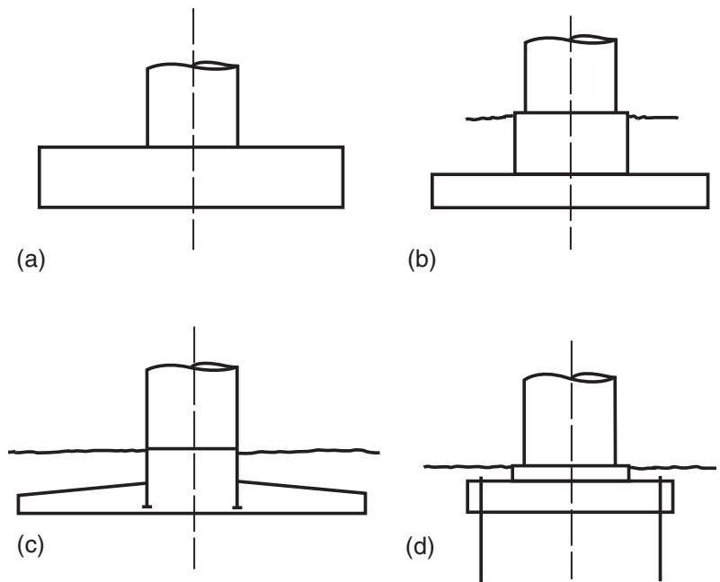  
Figure 7.78 (a) Plain slab, (b) slab and pedestal, (c) stub tower embedded in tapered slab, and (d) slab held down by rock anchors

The ideal shape of gravity foundation in plan is a circle, but in view of the complications of providing circular formwork, an octagonal shape is often chosen instead. Sometimes slabs are square in plan to simplify the shuttering and reinforcement further.

# 7.10.2 Multi-pile foundations

In weaker ground, a piled foundation often makes more efrcient use of materials than a slab. Figure 7.79a illustrates a foundation consisting of a pile cap resting on eight cylindrical piles arranged in a circle. Overturning is resisted by both pile vertical and lateral loads, the latter being generated by moments applied to the head of each pile. Consequently the reinforcement must be arranged to provide full moment continuity between the piles and the pile cap. Holes for the piles can be auger drilled and the piles cast in situ after the positioning of the reinforcement cage.

# 7.10.3 Concrete monopile foundations

A concrete monopile foundation consists of a single large diameter concrete cylinder, which resists overturning by mobilising soil lateral loads alone. See Figure 7.79b. These lateral loads can be calculated conservatively for sand by using either simple Rankine theory for passive pressures on retaining walls, which ignores soil/wall friction, or Coulomb theory, which includes it. However, in the case of a monopile, friction on the sides of the soil wedge notionally displaced when the pile begins to tilt provides further resistance, and this is accounted for in the solution due to Brinch Hansen (1961).

This type of foundation is an attractive option when the water table is low and the soil properties enable a deep hole to be excavated from above without the sides caving in. However, while simple, the concept is relatively expensive in terms of materials.

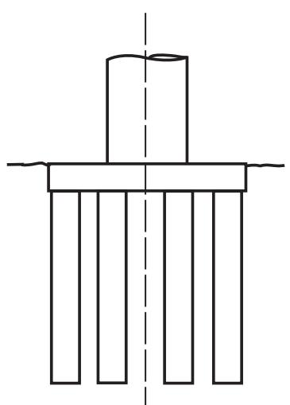

natural_image

Pure technical diagram of a mechanical assembly with no text, numbers, or symbols

(a)

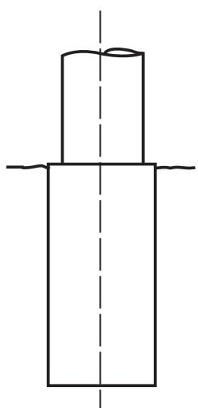

natural_image

Pure technical line drawing of a mechanical part with no text or symbols

(b)

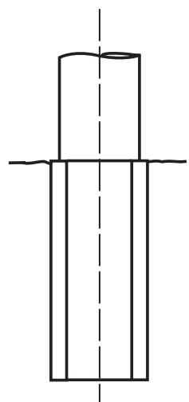

natural_image

Pure technical drawing of a mechanical part with no text or symbols

(c)   
Figure 7.79 (a) Pile group and cap, (b) solid monopile, and (c) hollow monopile

The hollow cylinder variant illustrated in Figure 7.79c uses materials much less extravagantly by replacing the concrete in the body of the cylinder, which has no structural role to play, with rll. Durability is improved by vertical prestressing, which can be integrated with tower hold-down by the use of the same rods for each.

# 7.10.4 Foundations for steel lattice towers

The legs of steel lattice towers are relatively widely spaced, and lend themselves to separate foundations. Bored cast in-situ piles are commonly used – see Figure 7.80. The mechanism for resisting overturning is simply uplift and downthrust on the piles, but the piles must also be designed for the bending moments induced by the horizontal shear load. Pile uplift is resisted by friction on the surface of the piles, which depends on both the soil/pile friction angle and the lateral soil pressure. Considerable uncertainty surrounds the magnitude of these quantities, so Eurocode 7 recommends the use of pile testing to establish pile capacity.

The angle sections forming the base of the tower legs are cast in place when the concrete for the piles is poured. A framework is assembled in advance, incorporating the leg base sections, so that the legs can be set at the correct spacing and inclination before concreting.

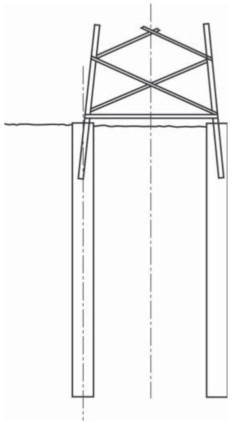

natural_image

Technical line drawing of a structural support frame with diagonal bracing (no text or symbols)

Figure 7.80 Piled foundation for steel lattice tower

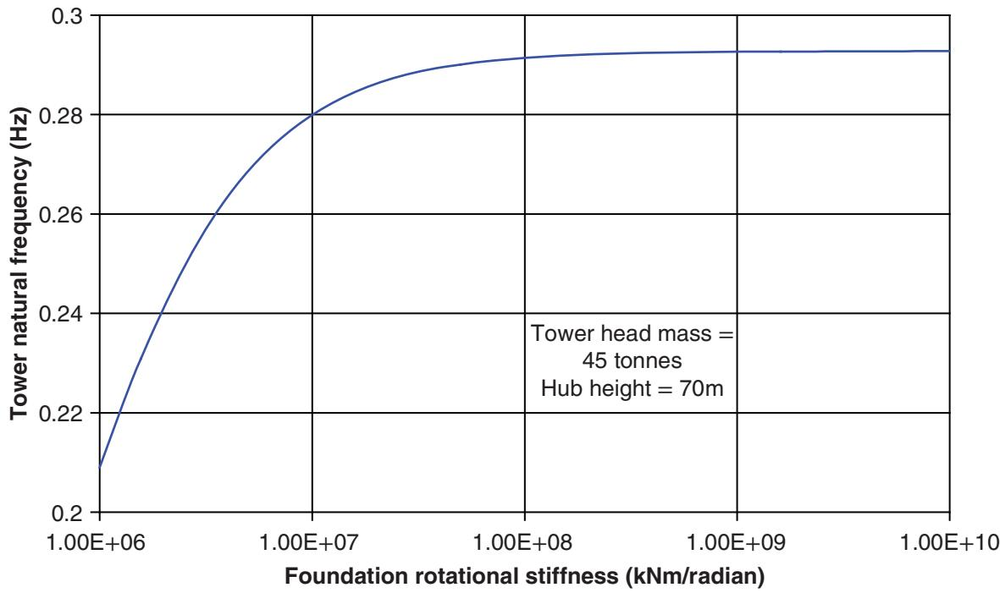

line

| Foundation rotational stiffness (kNm/radian) | Tower natural frequency (Hz) |
| ------------------------------------------- | ---------------------------- |
| 1.00E+06                                    | 0.21                         |
| 1.00E+07                                    | 0.28                         |
| 1.00E+08                                    | 0.29                         |
| 1.00E+09                                    | 0.29                         |
| 1.00E+10                                    | 0.29                         |

Figure 7.81 Example of variation of tower natural frequency with foundation rotational stiffness

# 7.10.5 Foundation rotational stiffness

The assessment of foundation rotational stiffness is an important part of the design process because of the effect it has on tower natural frequency, and hence on fatigue loading. Figure 7.81 illustrates the effect of varying the foundation rotational stiffness for a tower supporting a 45 t turbine at 70 m hub height. Manufacturers normally specify a minimum foundation rotational stiffness to ensure that the tower natural frequency is high enough for the fatigue loadings on which the tower design is based to be valid. It is then the task of the foundation designer to ensure that the foundation footprint (or depth, in the case of a monopile foundation) is sufrciently large to achieve this rotational stiffness.

A closed form solution exists for the rotational stiffness, $K _ { \theta }$ of a rigid disc resting on an elastic half space, as follows:

$$
K _ {\theta} = \frac {8 G R ^ {3}}{3 (1 - \nu)} \tag {7.100}
$$

where G is the shear modulus of the soil, R is the disc radius and 휈 is Poisson’s ratio. The Det Norske Veritas/Risø Guidelines for Design of Wind Turbines (2002) give modired versions of this formula that account for foundation embedment and soil layers with different shear moduli.

Tower base rotation will be increased by sexibility of the foundation itself and this may need to be accounted for as well.

# References

AGMA/AWEA 921-A97 (1996). Recommended practices for design and speciScation of gearboxes for wind turbine generator systems. American Gear Manufacturers Association/American Wind Energy Association.

Anaya-Lara, O. et al. (2009). Wind Energy Generation, Modelling and Control. Chichester, UK: Wiley.   
Anderson CG et al (1993). Yaw system loads of HAWTS. ETSU Report No W/42/00195/REP.   
Anderson, C.G., Heerkes, H., and Yemm, R. (1998). Prevention of edgewise vibration on large stall regulated blades. Proc. BWEA Conf. 1998: 95–102.   
ANSI/AGMA 2001-C95 (1995). Fundamental rating factors and calculation methods for involute spur and helical gear teeth. American National Standards Institute/American Gear Manufacturers Association.   
ANSI/AGMA/AWEA 6006-A03 (2003). Design and speciScation of gearboxes for wind turbines. American National Standards Institute/American Gear Manufacturers Association/American Wind Energy Association.   
ArcelorMittal (2014). Lattice towers for wind energy and power line pylons. http://www .iposteelnetwork.org/images/meetings/GeneralManager/2014-zuerich/GA-lgc-lattice-towerfor-windmills-pylons.pdf (accessed 6 February 2020).   
Bak, C., Zahle, F., and Bitsche, R. et al (2013). Description of the DTU 10 MW reference wind turbine. DTU Wind Energy Report I-0092.   
Barbero, E.J. (1998). Prediction of compression strength of unidirectional polymer matrix composites. J. Compos. Mater. 32 (5): 483–502.   
Barbero, E.J. (2018). Introduction to Composite Materials Design, 3e. CRC Press.   
Bonreld, P.W. and Ansell, M.,.P. (1991). Fatigue properties of wood in tension, compression and shear. J. Mat. Sci. 26: 4765–4773.   
Bond, I.P. and Ansell, M.P. (1998). Fatigue properties of jointed wood composites’, Part I: ‘Statistical analysis, fatigue master curves and constant life diagrams’, Part II: ‘Life prediction analysis for variable amplitude loading. J. Mater. Sci. 33: 2751, 4121–2762, 4129.   
Bonreld PW, Bond IP, Hacker CL, and Ansell MP (1992). Fatigue testing of wood composites for aerogenerator blades. Part VII. Alternative wood species and joints. Proceedings of the BWEA Conference, 243–249.   
Brinch Hansen J (1961). The ultimate resistance of rigid piles against transverse forces. Danish Geotechnical Institute Report No. 12.   
Brinch Hansen J (1970). A revised and extended formula for bearing capacity. Danish Geotechnical Institute Bulletin No 28.   
British Standards Institution (1986). BS 436: Spur and helical gears – Part 3: Method for calculation of contact and root bending stress limitations for metallic involute gears.   
British Standards Institution (2006). BS ISO 6336: Calculation of load capacity of spar and helical gears.   
Bulder, B. (2005) NEW WISPER – creating a new standard load sequence from modern wind turbine data. Optimat Blades OB\_TG1\_R020.   
Corbet, D.C. (1991). Investigation of materials and manufacturing methods for wind turbine blades. ETSU W/44/00261. Harwell, UK: Energy Technology Support Unit.   
Corbet DC, Brown C, and Jamieson P (1993). The selection and cost of brakes for horizontal axis stall regulated wind turbines. ETSU WN 6065.   
Det Norske Veritas/Risø National Laboratory (2002). Guidelines for Design of Wind Turbines. DNV/Risø.   
DNVGL-ST-0126 (2016). Standard for support structures for wind turbines.   
DNVGL-ST-0376 (2015). Rotor blades for wind turbines.   
DOE/MSU 2010. DOE/MSU composite materials fatigue database. Montana State University.   
Echtermeyer, A.T., Hayman, E., and Ronold, K.O. (1996). Comparison of fatigue curves for glass composite laminates. In: Design of Composite Structures Against Fatigue (ed. R.M. Mayer). Mechanical Engineering Publications.   
Ehrmann, R.S., Wilcox, B., and White, E.B. (2017). Effect of surface roughness on wind turbine performance. Sandia Report SAND2017–10669.

Eisenberg, D., Laustsen, S. and Stege, J. (2016). Leading edge protection lifetime prediction model creation and validation. https://windeurope.org/summit2016/conference/allposters/PO078g.pdf (accessed 31 January 2019).   
Ekanayake, J.B., Holdsworth, L., and Jenkins, N. (2003). Control of DFIG wind turbines. Power Eng. J. 17 (1): 28–32.   
Elforsk (2012). Cracks in onshore wind power foundations – causes and consequences. Elforsk rapport 11: 56.   
EN 1993-1-9:2005 (2005), Eurocode 3: Design of steel structures – Part 1.9: Fatigue. Brussels: European Committee for Standardization.   
EN 1993-1-6:2007 (2007). Eurocode 3: Design of steel structures – Part 1.6: Strength and stability of shell structures. Brussels: European Committee for Standardization.   
Fedorov, V. (2012). Bend-twist coupling effects in wind turbine blades. PhD thesis. DTU Wind Energy.   
Freris, L. (ed.) (1990). Wind Energy Conversion Systems. Prentice Hall.   
Fuglsang PL and Madsen HA (1995). A design study of a 1 MW stall regulated rotor. Risø R-799.   
Gardiner (2013). Modular design eases big wind blade build. Composites World, July 2013. https:// www.compositesworld.com/articles.   
Germanischer Lloyd (1993). Rules and regulations IV – Non-marine technology: Part 1 – Wind energy: Regulation for the certiScation of wind energy conversion systems.   
Germanischer Lloyd (2010). Rules and guidelines IV – Industrial services: Part 1 – Guideline for the certiScation of wind turbines.   
Green Tech Media (2014). Is GE’s space frame tower the future of wind power? https://www .greentechmedia.com/articles/read.   
Grifrth, D.T. (2013). The SNL 100–01 blade: carbon design studies for the Sandia 100-metre blade. Sandia Report SAND2013–1178.   
Grifrth, D.T. and Ashwill, T.D. (2011). The Sandia 100-metre all-glass baseline wind turbine blade: SNL 100–00. Sandia Report SAND2011–3779.   
Grifrth, D.T. and Johanns, W. (2013). Large blade manufacturing costs studies using the Sandia blade manufacturing cost tool and Sandia 100 m blades. Sandia Report SAND2013–2734.   
Hancock M and Bond IP (1995). The new generation of wood composite wind turbine rotor blades – design and verircation. Proceedings of the BWEA Conference, pp. 47–52.   
Heier, S. (2014). Grid Integration of Wind Energy Conversion Systems, 3e. Chichester, UK: Wiley.   
Hindmarsh, J. (1984). Electrical Machines and Their Applications. UK: Butterworth Heinemann.   
Hück (1983). Calculation of S/N curves for steel, cast steel and cast iron – synthetic S/N curves. Verein Deutsher Eisenhüttenleute Report No. ABF 11.   
IEC 61400-1 (2019). Wind energy generation systems – Part 1: Design requirements (edition 4). Geneva, Switzerland: International Electrotechnical Commission.   
IEC 61400-4 (2012). Wind turbines – Part 4: Design requirements for wind turbine gearboxes. Geneva, Switzerland: International Electrotechnical Commission.   
IEC 61400-23 (2014). Wind turbines – Part 23: Full-scale structural testing of rotor blades. Geneva, Switzerland: International Electrotechnical Commission.   
IEC CD 61400-5 (2016). Wind energy generation systems – Part 5: Wind turbine rotor blades, draft. Geneva, Switzerland: International Electrotechnical Commission.   
IECRE (2019). Wind turbine type certircate, IECRE.WE.TC.19.0025-R0. https://www.iecre.org/ certircates/windnergy.   
INNWIND (2015). New lightweight structural blade designs and blade designs with build-in structural couplings. Deliverable 1.22.   
ISO 6336 (2019). Calculation of load capacity of spur and helical gears: Parts 1–6.   
Jamieson P and Brown CJ (1992). The optimisation of stall regulated rotor design. Proceedings of the BWEA Conference, pp. 79–84.

Johanns, W. and Grifrth, D.T. (2013). User manual for Sandia blade manufacturing cost tool: Version 1.0. Sandia Report SAND2013–2733.   
Keegan, M.H., Nash, D.H, and Stack, M.M. (2012). Modelling rain drop impact of offshore wind turbine blades. Proceedings of the ASME TURBO EXPO, Copenhagen.   
Keegan, M.H., Nash, D.H., and Stack, M.M. (2013). On Erosion Issues Associated with the Leading Edge of Wind Turbine Blades. Glasgow, UK: University of Strathclyde.   
Krause, O. and Kensche, C. (2006). Summary fatigue test report. Optimat Blades OB\_TG\_R026.   
Krause, P.C. (1986). Analysis of Electric Machinery. New York, USA: McGraw Hill.   
Legault, M. (2018). Wind blade spar caps: pultruded to perfection? Composites World, 27 March 2018.   
Lobitz, D.W., Veers, P.S., Eisler, G.R., et al (2001). The use of twist-coupled blades to enhance the performance of horizontal axis wind turbines. Sandia Report SAND2001-1303.   
Lobitz, D.W., Veers, P.S., and Migliore, P.G. (1996). Enhanced performance of HAWTs using adaptive blades. Wind Energy 96: 41–45.   
Mayer, R.M. (1996). Design of Composite Structures Against Fatigue. Mechanical Engineering Publications.   
McPherson, G. (1990). An Introduction to Electrical Machines and Transformers, 2e. New York, USA: Wiley.   
Mohan, N., Undeland, T.M., and Robbins, W.P. (1995). Power Electronics: Converters, Applications. and Design, 3e. New York, USA: Wiley.   
Muller, S., Deicke, M., and De Doncker, R. (2002). Doubly fed induction generator systems for wind turbines. IEEE Ind. Appl. Mag. 8 (3): 26–33.   
Nijssen, R.P.L. (2005). (NEW) WISPER(X) load spectra test results and analysis. Optimat Blades OB\_TG\_R024.   
Nijssen, R.P.L. (2007). Fatigue life prediction and strength degradation of wind turbine rotor blade composites. Sandia Report SAND2006-7810P.   
Offshore Wind Industry (2015) Protection for the leading edge. http://www.offshorewindindustry .com/news/protection-leading-edge (accessed 31 January 2019).   
ORE Catapult (2016) Catapult delivers rrst blade leading edge erosion measurement campaign. https://ore.catapult.org.uk/press-releases/catapult-delivers-rrst-blade-leading-edge-erosionmeasurement-campaign (accessed 31 January 2019).   
Pena, R., Clare, J.C., and Asher, G.M. (1996). Doubly fed induction generator using back–back PWM converters and its application to variable speed wind energy generators. IEE Proc. Elec. Power Appli. 143: 231–241.   
Petersen JT, Madsen HA, Björck A, Enevoldsen P, Øye S, Ganander H, and Winkelaar D (1998), Prediction of dynamic loads and induced vibrations in stall. Risø R-1045.   
Samborsky, D.D., Agastra, P., and Mandell, J.F. (2010). Fatigue trends for wind blade infusion resins and fabrics. AIAA-2010-2820.   
Samborsky, D.D., Mandell, J.F., and Miller, D. (2012). The SNL/MSU/DOE fatigue of composite materials database: recent trends. AIAA-2012-1573.   
Samborsky, D.D., Wilson, T.J., and Mandell, J.F. (2007). Comparison of tensile fatigue resistance and constant life diagrams for several potential wind turbine blade laminates. AIAA: 2007–67056.   
Schmidt, H. and Neuper, M. (1997). ‘Zum elastostatischen Tragverhalten exzentrisch gezogener L-Stöße mit vorgespannten Scrauben’ (‘on the elastostatic behaviour of an eccentrically tensioned L-joint with prestressed bolts’). Stahlbau 66: 163–168.   
Schmidt H, Winterstetter TA, and Kramer M (1999). Non-linear elastic behaviour of imperfect, eccentrically tensioned L-sange ring joints with prestressed bolts as basis for fatigue design. Proceedings of the European Conference on Computational Mechanics.   
Scott et al. (2017). Effects of aeroelastic tailoring on performance characteristics of wind turbine systems. Renew. Energy 114 (B): 887–903.

Snowberg, S., Dana, S., and Hughes, S. et al (2014). Implementation of a biaxial resonant fatigue test method on a large wind turbine blade. NREL/TP-5000-61127, National Renewable Energy Laboratory.   
Springer, G.S. (1976). Erosion by Liquid Impact. Washington D.C: Scripta Publishing Co.   
Sutherland, H. and J. Mandell (2004). Updated Goodman diagrams for rberglass composite materials using the DOE/MSU fatigue database Proceedings of AWEA Global Windpower.   
TCB (2020). Lagerwey modular steel tower. https://www.tcbolts.com/en/projects/wind-energy/ 108-lagerwey-modular-steel-tower.   
Thomsen K (1998). The statistical variation of wind turbine fatigue loads. Risø R-1063.   
Timoshenko, S.P. and Gere, J.M. (1961). Theory of Elastic Stability, 2e. Mc Graw-Hill.   
Van Delft DRV, de Winkel GD, and Joose PA (1996). Fatigue behaviour of rbreglass wind turbine blade material under variable amplitude loading. Proceedings of the EUWEC, Göteborg.   
Verein Deutscher Ingenieure (1986/1988). VDI 2230 Part 1: Systematic Calculation of High Duty Bolted Joints – Joints with One Cylindrical Bolt.   
Wilson R A (1990). Implementation and optimisation of mechanical brakes and safety systems. Proceedings of a DEn/BWEA Workshop on ‘Mechanical Systems for Wind Turbines’.   
Windblatt (2013). Wrapped instead of glued. March 2013.   
Windblatt (2016) Series production of EP4 components launched. April 2016.   
Windtech International (2019). Research project brings aerospace blade protection to wind turbine industry. https://www.windtech-international.com/product-news/research-project-bringsaerospace-blade-protection-to-wind-turbine-industry (accessed 31 January 2019).