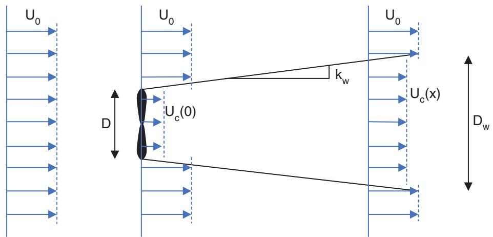
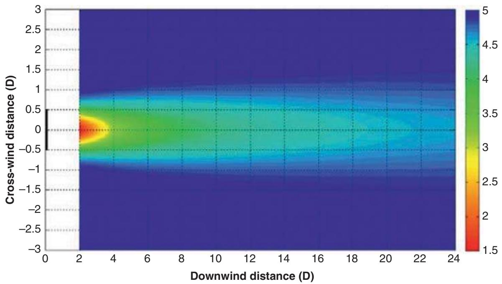
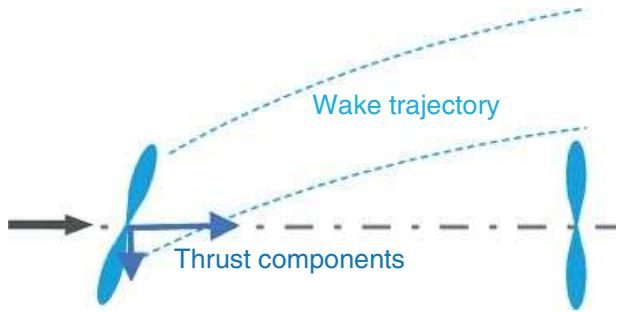

# Wake effects and wind farm control

# 9.1 Introduction

As it extracts energy from the wind, a turbine leaves behind it a wake characterised by reduced wind speeds and increased levels of turbulence. Another turbine operating in this wake, or deep inside a wind farm where the effects of a number of wakes may be felt simultaneously, will therefore produce less energy and suffer greater structural loading than a turbine operating in the free stream. In a large wind farm, depending on the layout and the wind regime, 10–20% of energy production can easily be lost due to wake effects, and fatigue loads can increase substantially (see Chapter 12). These wake effects have to be taken into account when planning wind farm layouts, along with many other factors, for example,

• Topography (onshore), and its effect on wind speeds across the site.   
• Variations in ground or seabed conditions for positioning the foundations.   
• Cost of roadways (or turbine access offshore), grid connection, and other infrastructure.   
• Cost of electrical interconnections, and energy losses in cables, etc.   
• Site boundaries, and constraints due to land use, human activity, wildlife, etc.

The wake losses depend very much on inter-turbine spacings, and they vary with wind speed (through its effect on turbine thrust), wind direction (which determines which wakes affect which turbines), and turbulence intensity (which affects the rate of wake dissipation) as well as atmospheric stability. When the wind is blowing along a closely spaced row of turbines, the energy losses from the row could be very high, so the layout design should try to ensure, taking account of the long-term wind speed and direction distribution for the site, that any large losses will occur infrequently.

The International Electrotechnical Commission (IEC) 61400 standard (IEC 61400-1 2019) includes guidelines for assessing the increased turbulence inside wind farms and ensuring that design load limits will not be breached. This may result in the need for stronger, more expensive turbines or support structures to achieve a given lifetime. Maintenance costs may also be increased because of higher turbulence within the wind farm.

Because of the importance of wake effects in reducing energy production and increasing loads, there has been much interest in recent years in the concept of minimising wake effects through a form of wind farm control also known as active wake control or wind farm Tow control. Instead of allowing each turbine to behave as designed, to achieve the best combination of energy production and loading for itself (sometimes known as selSsh or greedy control), the concept is that the wind farm controller commands changes to the operation of individual turbines to achieve the optimum performance for the wind farm as a whole. This will mean that in any particular wind condition, the performance of some turbines will be sacrirced to improve the performance of others, such that the overall performance of the wind farm is optimised. This kind of wind farm control has been discussed for at least 25 years (Spruce 1993), but the recent focus on optimisation of wind farm management has started to arouse serious commercial interest in such techniques.

This chapter describes wake characteristics and how they can be modelled, and Section 9.3 goes on to explain different possible approaches to active wake control that are now beginning to be evaluated in commercial wind farms.

Finally, Section 9.4 briesy covers some other aspects of wind farm control, particularly in relation to the grid.

# 9.2 Wake characteristics

An operating wind turbine extracts energy from the wind sow, and also has a blocking effect on the sow. The wind exerts a thrust force on the turbine rotor, which can be equated to a reduction in the momentum sux. This means that the wind speed behind the rotor is reduced compared to the free-stream velocity (e.g. Vermeulen 1980) in a way that depends on the turbine thrust coefrcient: the momentum extracted from the sow must equate to the total thrust force on the turbine. The physical mechanism by which the wake forms is very complex. Immediately around the blades, the aerofoil lift that is responsible for the rotor torque results in vorticity being shed into the sow. Tip vortices leave each rotating blade tip, forming vortex spirals that advect downstream. These vortices disturb one another, eventually breaking down into smaller eddies that result in a general increase in the turbulence of the sow. By the end of the near-wake region, about two diameters downstream, the effect of individual blades can no longer be clearly distinguished, and the wake has become approximately axisymmetric, with a velocity dercit that is largest at the centre, decaying towards the edges with a Gaussian-like prorle, while the turbulence intensity is signircantly higher than ambient.

From this point, the wake advects further downstream in a self-similar way: the shape of the velocity dercit prorle is preserved, but it becomes wider and shallower: the velocity gradients at the sides of the wake result in entrainment of momentum from the surrounding sow, causing the wake to widen while maintaining the same overall momentum dercit. The entrainment increases with turbulence intensity, so in higher ambient turbulence the wake spreads faster.

The wake velocity dercit means that a downstream turbine operating in the wake will effectively experience a lower wind speed, causing a reduction of power output, and a higher level of turbulence, causing higher mechanical loads. There may also be an increase in asymmetrical loads and suctuating blade loads due to velocity gradients across a downstream turbine rotor when it is partially immersed in a wake whose centreline passes some distance from the rotor centre.

The wake behind a turbine cannot simply be represented by a static velocity dercit reld extending downstream in the prevailing wind direction. Firstly, the wake centreline may be displaced laterally by any yaw misalignment of the turbine, and vertically because of rotor tilt and wind shear. Secondly, there is the phenomenon of wake meandering: low-frequency variations in lateral and vertical components of turbulence can be considered to push the wake centreline around, so that the wake immersion of a downstream turbine varies, along with the effect on power production and loads.

# 9.2.1 Modelling wake effects

A wind farm is a highly complex physical system. Detailed modelling of the system is required to understand the complex atmospheric and wake sows and the resulting behaviour of turbines in sufrcient detail to allow accurate estimation of wake losses and realistic practical design of active wake controllers for wind farms. High-rdelity sow models based on computational suid dynamics (CFD) can capture most of the relevant detail by solving the Navier–Stokes equation with suitable turbulence modelling, but they may require large computational resources. At the other end of the scale, semi-empirical engineering models requiring minimal computational power are essential tools for designing and testing wind farm controllers, although some of them may require tuning for different conditions.

# 9.2.2 Wake turbulence in the IEC standard

Deep inside a wind farm, the reduction in wind speed and the increase in turbulence intensity are the result of the superposition of wakes from many upwind turbines. Frandsen and Thøgersen (1999) and Frandsen (2007) propose a model based on the geostrophic drag law that takes into account the additional ‘surface roughness’ caused by the turbines themselves. This leads to a formula for added turbulence above hub height:

$$
I _ {+ +} = \frac {0 . 3 6}{1 + 0 . 2 \sqrt {s _ {1} s / C _ {T}}} \tag {9.1}
$$

where $s _ { 1 }$ and s are the inter-turbine spacings, normalised by rotor diameter, within a row and between rows, and $C _ { T }$ is the turbine thrust coefrcient. Because this does not apply below hub height, the average added turbulence intensity $I _ { + }$ is then calculated as

$$
I _ {+} = \frac {1}{2} (I _ {0} + \sqrt {I _ {0} ^ {2} + I _ {+ +} ^ {2}}) \tag {9.2}
$$

This general model appears to give conservative results, which may be appropriate in a design standard, but it does not account for the detailed effect of individual wakes on individual turbines, and is therefore unsuitable for evaluating detailed wind farm wake effects, including the effects of wind farm control. As from edition 4 of the standard, a more detailed Gaussian wake meandering model is provided as an option. Section 9.2.4 provides details of this and other similar models.

# 9.2.3 CFD models

To model a system as complex as a wind farm, where multiple rotating turbines interact with an already highly complex atmospheric boundary layer, direct numerical solution of the Navier–Stokes equations is quite impractical, and simplircations are required. It is simply not practical to model the entire range of physical phenomena from large-scale atmospheric sows through the aerodynamics of turbine blades and down to the rnal decay of turbulent eddies into heat at the microscopic scale. The most sophisticated CFD models currently used in this area are large eddy simulations (LES), which solve the sow dynamics of the larger eddies while using simplifying approximations at the smaller scales. An example is the SOWFA code (Churchreld et al. 2012), which couples a LES sow model with embedded turbine models, allowing very detailed time-domain simulations of a complete wind farm to be carried out. However, a short simulation of a sizeable wind farm could require weeks of simulation time on a very powerful supercomputer. Rather than modelling the detailed sow around the turbine’s aerofoils, a faster ‘actuator line’ approach is used where the lift and drag curves of the aerofoils are used to calculate ‘body forces’ which act mutually between the air sow and the turbine blade in the vicinity of a line representing the position of the blade as it rotates. Further simplifying the turbine to an actuator disk model, where the individual blades are not resolved, reduces the computational requirement even more, while still allowing many useful effects to be examined. It is possible to use an actuator disk with a non-uniform force distribution, for example if the rotor is yawed or the sow through it is non-uniform, and the ‘body forces’ can include both in-plane and out of plane forces, so the in-plane forces corresponding to rotor torque will impart a swirl to the sow.

Such an actuator disk model can also be used for the next level of approximation, the Reynolds-averaged Navier–Stokes (RANS) models, which do not track the evolution of individual eddies in the sow, but model only their averaged effect. Such models are fast enough to be used quite widely for steady-state calculations of wind farm performance, for example. Although much faster than LES, RANS models of sufrcient accuracy still need to be run on a large cluster.

Detailed consideration of CFD models is beyond the scope of this book, but a general description and some further comments on the application of CFD models to wind turbine and wind farm sows are given in Section 4.7. The following sections describe some of the simplired engineering models that are essential for many practical applications – for example, if many repeat simulations are needed for tuning and evaluation of wind farm controllers.

# 9.2.4 SimpliJed or ‘engineering’ wake models

Owing to the huge computational resources required for CFD modelling, and especially for high-rdelity LES, the use of simplired wake models, sometimes referred to as ‘engineering’ models, remains widespread. Some of these originally date back to the 1980s or earlier, but continual improvements are still being made. There is a spectrum of models from the purely empirical through to more physical models, including various simplircations of the Navier–Stokes equations.

Engineering wake models generally represent a single wake as a region of reduced wind speed and increased turbulence that is assumed to be embedded within the ambient sow, which is assumed to be otherwise unchanged by the presence of the turbines. They also require rules derning how to combine the wakes from more than one turbine, to give an effect representative of the multiple-wake situations occurring within a wind farm.

The wakes are typically derned as a static region behind the turbine, to which dynamic effects can be added when required, for example to represent wake meandering, where the wake is pushed around by low-frequency variations in the wind reld, and the advection downstream of any changes in wake properties.

The following paragraphs explain how some of the common engineering models deal with each of these specirc aspects.

# Velocity deAcit

The simplest model for the wake velocity dercit is the PARK or Jensen model (Katic et al. 1986). An area of uniform velocity dercit is derned immediately behind the rotor, with the same diameter as the rotor, such that the loss of momentum equals the turbine thrust; the radius of this dercit region then increases linearly with distance downstream, at a rate determined by an empirical ‘wake expansion factor’ $k _ { w }$ . The wake diameter at downstream distance x is $D _ { w } = D + 2 k _ { w } x$ (where D is the turbine diameter) while the fractional velocity dercit 훿 decreases so as to conserve the momentum in the sow, according to

$$
\delta = 1 - U _ {c} / U _ {0} = (1 - \sqrt {1 - C _ {T}}) (D / D _ {w}) ^ {2} \tag {9.3}
$$

where $C _ { T }$ is the turbine thrust coefrcient (see Figure 9.1). The velocity immediately behind the rotor is $U _ { c } ,$ and $U _ { 0 }$ is the free-stream velocity.

The Jensen model has been used quite widely for overall wake losses when the detailed nature of the wakes is not considered important, and works quite well as long as the wake expansion factor is selected by rtting to appropriate data.

For applications such as active wake control or understanding the loads of waked turbines, a model is required that provides a more realistic and detailed description of the wake geometry. It is important to distinguish between the near-wake region where the tip vortices are interacting and breaking down and the sow is developing, and the far wake where the rotor detail can no longer be distinguished. Various modircations to the Jensen model have been proposed. For example, Gebraad (2014) uses a wake with three concentric regions, each with its own uniform velocity dercit, all of which change in diameter linearly with downstream distance: a near-wake core region that decreases in diameter until it disappears, a far-wake region that grows linearly from zero, and an intermediate mixing region. The expansion factors are empirically rtted, and the dercits change to conserve the total momentum. Such a model is implemented in the open-source FLORIS code (NREL 2019). This code also includes a more sophisticated model (Bastankah and Porté-Agel 2016) in which, like the earlier Ainslie (1988) model, the wake dercit prorle in the far wake is assumed to reach a Gaussian prorle that develops further downstream in self-similar fashion, growing weaker and broader as it decays. Figure 9.2 illustrates a typical velocity prorle calculated using the Ainslie model.

text_image

U₀
U₀
U₀
k_w
U_c(x)
D
U_c(0)
D_w

Figure 9.1 Diagram of the Jensen velocity dercit model.

The Ainslie model is based on a thin shear layer approximation of the RANS equation with the assumption of an axisymmetric wake:

$$
U \frac {\partial U}{\partial x} + V \frac {\partial U}{\partial r} = - \frac {1}{r} \frac {\partial (r \overline {{u v}})}{\partial r} \tag {9.4}
$$

It uses an eddy viscosity model to relate the shear stress uv to the velocity gradient in the wake:

$$
\overline {{u v}} = - \varepsilon \frac {\partial U}{\partial r} \tag {9.5}
$$

where ε is known as the eddy viscosity, giving

$$
U \frac {\partial U}{\partial x} + V \frac {\partial U}{\partial r} = \frac {\varepsilon}{r} \left(\frac {\partial U}{\partial r} + r \frac {\partial^ {2} U}{\partial r ^ {2}}\right) (9. 6)
$$

  
Figure 9.2 Typical Gaussian wake velocity prorle from the Ainslie model.

The eddy viscosity is considered to have two contributions: one that is the product of a characteristic length scale and velocity scale, and one attributable to the ambient momentum diffusivity. Ainslie uses the wake width b as the length scale and the difference between the ambient and the wake centreline wind speeds as the velocity scale, and an ambient diffusivity term $K _ { M }$ :

$$
\varepsilon = F [ k _ {1} b (U _ {0} - U _ {c}) + K _ {M} ] \tag {9.7}
$$

where $k _ { 1 }$ is a dimensionless constant. A value of 0.015 was originally suggested by Ainslie based on wind tunnel data, but other values have also been suggested. The factor F is 1 in the far wake but is assumed to be smaller in the near wake before the wake turbulence has built up. The ambient term depends on the friction velocity u and the height above ground, z:

$$
K _ {M} = \kappa u _ {*} z / \varphi \tag {9.8}
$$

where 휅 is the von Karman constant (0.4) and $\varphi = 1$ for neutral atmospheric stability. In these conditions, a logarithmic shear prorle $U _ { 0 } = ( u _ { * } / \kappa ) \ln ( H / z _ { 0 } )$ applies, giving

$$
\varepsilon = F [ k _ {1} b (U _ {0} - U _ {c}) + \kappa^ {2} H U _ {0} / \ln (H / z _ {0}) ] \tag {9.9}
$$

where H is the hub height. Using $\sigma _ { u } \approx 2$ .5u\* from Section 2.6.3, and noting that $\kappa \approx 1 / 2 . 5$ , we get a turbulence intensity of $I _ { 0 } = \sigma _ { u } / U _ { 0 } \approx 1 / \ln ( z / z _ { 0 } )$ , which makes $K _ { M }$ proportional to the turbulence intensity:

$$
\varepsilon = F [ k _ {1} b (U _ {0} - U _ {c}) + \kappa^ {2} H U _ {0} I _ {0} ] \tag {9.10}
$$

Note that a dimensionless form of the eddy viscosity is often used, in which ε is normalised by dividing by the rotor diameter D and the wind speed $U _ { 0 }$ :

$$
\overline {{\varepsilon}} = F [ k _ {1} (b / D) \delta + \kappa^ {2} (H / D) I _ {0} ] \tag {9.11}
$$

where 훿 is the fractional centreline velocity dercit.

Such a dernition of eddy viscosity has been used for many years in the WindFarmer code (DNVGL 2014) and other implementations of the Ainslie model, sometimes with the further approximation of $H \approx D$ , although this can lead to inconsistencies (Gunn 2019).

In recent years, the importance of considering atmospheric stability has been increasingly recognised. Ruisi and Bossanyi (2019) proposed a stability-dependent model that has been found to rt experimental data well. The term 휑 in Eq. (9.8) above, which is 1 for neutral atmospheric stability, is replaced by the following expressions dependent on the Obukhov length L, from Högström (1988):

$$
\varphi = 1 (\mathrm{neutralcase})
$$

$$
\varphi = 1 + 5 H / L (\text { stable   case }, L > 0)
$$

$$
\varphi = (1 - 1 9. 3 H / L) ^ {- 0. 2 5} (\text { unstable   case }, L <   0) \tag {9.12}
$$

Furthermore, the shear prorle becomes $U _ { 0 } = ( u _ { * } / \kappa ) \ln ( H / z _ { 0 } + \psi )$ where the additional stability correction term $\psi$ is also a function of L. According to Dyer (1974) and Högström (1988),

$$
\psi = 0 (\text { neutral   case })
$$

$$
\psi = - 5 H / L (\text { stable   case }, L > 0)
$$

$$
\psi = \ln \left[ \frac {(1 + x ^ {2}) (1 + x) ^ {2}}{8} \right] - 2 a r c t a n (x) + \pi / 2 (\text { unstable   case }, L <   0) \tag {9.13}
$$

where $x = \left( 1 - \textstyle { \frac { 1 9 . 3 H } { L } } \right) ^ { 1 / 4 }$ L . The normalised eddy viscosity can then be written as

$$
\overline {{\varepsilon}} = F \left[ k _ {1} \left(\frac {b}{D}\right) \delta + \frac {\kappa^ {2} H U _ {0}}{\varphi \ln (H / z _ {0} + \psi)} \right] \tag {9.14}
$$

although the effect of $\psi$ is typically small.

Once the wake core and tip vortices have decayed, i.e. in the far wake region, the velocity prorle in the wake can be assumed to have a Gaussian shape, according to

$$
U = U _ {0} - \Delta U = U _ {0} \left(1 - \delta e ^ {- 3. 5 6 \left(\frac {r}{b}\right) ^ {2}}\right) \tag {9.15}
$$

where $U _ { 0 }$ is the ambient wind speed and 훿 the fractional centreline velocity dercit. This equation serves as a dernition of the wake width b which has been used above in derning the eddy viscosity. The velocity prorle then decays in self-similar fashion, i.e. maintaining its Gaussian shape but with the centreline dercit $\delta$ decreasing as the width b increases, so as to conserve momentum in the sow. Integrating the change in momentum sux per unit area $\rho U \Delta U$ over the area from $r = 0$ to inrnity and azimuth angles from $0 ^ { \circ }$ to $3 6 0 ^ { \circ }$ , where $\rho$ is the air density, we get the total change in momentum of the sow. Equating this to the rotor thrust $\begin{array} { r } { { \frac { 1 } { 2 } } \rho A \dot { U } _ { 0 } ^ { 2 } { C _ { T } } } \end{array}$ allows the Gaussian width parameter $b$ to be calculated as a function of $\delta \colon$

$$
b = D \sqrt {\frac {3 . 5 6 C _ {T}}{8 \delta (1 - 0 . 5 \delta)}} \tag {9.16}
$$

where D is the rotor diameter, and $C _ { T }$ is constant because it represents the rotor thrust coefrcient at the time this part of the wake was generated. Because momentum must be conserved, this equation must hold for all distances further downstream. All that remains is to calculate how $\delta$ changes with downstream distance.

As a starting point, a widely used empirical expression proposed by Ainslie (1988) gives the centreline velocity dercit two diameters downstream:

$$
\delta_ {(x = 2 D)} = C _ {T} - 0. 0 5 - (1 6 C _ {T} - 0. 5) I _ {0} / 1 0 \tag {9.17}
$$

The wake expansion further downstream is found by solving Eq. (9.4) using the eddy viscosity as derned above. Anderson (2009) derives a useful method for this. Given Eqs. (9.15, 9.16), only the development of the centreline velocity dercit is needed. The continuity equation

$$
\frac {\partial U}{\partial x} = - \frac {1}{r} \left(r \frac {\partial V}{\partial r} + V\right) = - \frac {\partial V}{\partial r} - \frac {V}{r} \tag {9.18}
$$

is valid for incompressible sow, and approaching the centreline, $\begin{array} { r } { \frac { \partial V } { \partial r }  0 } \end{array}$ by symmetry, so $\begin{array} { r } { V = - r \frac { \partial U } { \partial x } } \end{array}$ . Putting this into Eq. (9.4), then on the centreline where r and $\frac { \partial U } { \partial r }$ are both zero, we obtain for the centreline velocity $U _ { c } { \mathrm { : } }$ :

$$
\frac {\partial U _ {c}}{\partial x} = \frac {\varepsilon}{U _ {c}} \left(\frac {1}{r} \frac {\partial U _ {c}}{\partial r} + \frac {\partial^ {2} U _ {c}}{\partial r ^ {2}}\right) \tag {9.19}
$$

The derivatives on the right hand side are obtained from the Gaussian shape in Eq. (9.15). In non-dimensional form (normalising by $U _ { 0 }$ and $D )$ , substituting these into the equation and looking only at the centreline, where $r = 0$ and the exponential is 1, we see that the normalised centreline velocity $u _ { c } = U _ { c } / U _ { 0 } = 1 - \delta$ is derned by the following differential equation:

$$
\frac {d u _ {c}}{d x ^ {\prime}} = 1 6 \overline {{\varepsilon}} \frac {(u _ {c} ^ {3} - u _ {c} ^ {2} - u _ {c} + 1)}{u _ {c} C _ {T}} \tag {9.20}
$$

which can easily be solved numerically to give $u _ { c }$ and hence 훿 for any downstream distance $x = D x ^ { \prime }$ . Equation (9.16) can then be used to obtain the Gaussian width parameter b at that point, and the wake velocity dercit is then fully derned.

Other Gaussian wake models have also been proposed, in which Eqs. (9.15, 9.16) remain true, but the downwind development of the centreline dercit is derned differently. The model of Bastankah and Porté-Agel (2016) for example uses a linear growth in the wake width with downstream position, beyond a near wake length $x _ { 0 }$ (see below). Ishihara and Qian (2018) develops this further by parameterising the wake growth rate as a function of thrust coefrcient and turbulence. These models are sexible in that they have empirical parameters that can be adjusted to rt measured data. The more parameters can be adjusted, the better the model can be made to rt the data, but it is not clear that there is a universally applicable parameter set.

# Wake turbulence

In addition to the ambient turbulence and the shear-generated turbulence caused by the velocity gradient between the wake centreline and the ambient sow, the turbine itself generates additional turbulence directly, as a result of the tip vortices shed by the blades and the general disturbance to the sow caused by the blades, nacelle and tower. This ‘mechanical’ component of turbulence is of relatively high frequency, and decays relatively quickly: large eddies give rise to smaller ones, and so the turbulent energy moves to higher and higher frequencies until it is eventually dissipated as heat. A model from Bossanyi (1983) predicts a faster rate of decay in low winds and in high ambient turbulence intensities.

While the velocity dercit in a single wake can be reasonably well predicted as above, theoretical models for the turbulence level in the wake are less well developed. Wake turbulence is important, as it affects both the loads experienced by wake-affected turbines and the development of their own wakes, which is important in multiple-wake situations within wind farms.

Quarton and Ainslie (1989) examined a number of different sets of wake turbulence measurements, both in wind tunnels using small wind turbine models or gauze simulators, and behind full-size turbines in the free stream. An empirical formula for added turbulence $I _ { + }$ at a downstream distance x from the turbine was found to give a good rt to the various measurements:

$$
I _ {+} = 0. 0 4 8 C _ {T} ^ {0. 7} (1 0 0 I _ {0}) ^ {0. 6 8} (x / x _ {n}) ^ {- 0. 5 7} \tag {9.21}
$$

where $C _ { T }$ is the turbine thrust coefrcient, $I _ { 0 }$ the ambient turbulence intensity, and $x _ { n }$ the length of the near wake region. On the basis of further work, an improved expression was subsequently proposed by Hassan (1992):

$$
I _ {+} = 0. 0 5 7 C _ {T} ^ {0. 7} (1 0 0 I _ {0}) ^ {0. 6 8} (x / x _ {n}) ^ {- 0. 9 6} \tag {9.22}
$$

The added turbulence is derned as the square root of the additional wind speed variance normalised by the mean wind speed, i.e. $I _ { + } = \sqrt { I _ { w a k e } ^ { 2 } - I _ { 0 } ^ { 2 } }$ − I20 , where $I _ { w a k e }$ is the total wake turbulence intensity at any given downstream distance.

The length of the near wake region, $x _ { n } .$ , is calculated according to Vermeulen (1980) in terms of the rotor radius R and the thrust coefrcient $C _ { T }$ as

$$
x _ {n} = \frac {n R \sqrt {(m + 1) / 2}}{d r / d x} \tag {9.23}
$$

where

$$
m = 1 / \sqrt {1 - C _ {T}} \tag {9.24}
$$

with $C _ { T }$ limited to a maximum of 0.96,

$$
n = \frac {\sqrt {0 . 2 1 4 + 0 . 1 4 4 m} (1 - \sqrt {0 . 1 3 4 + 0 . 1 2 4 m})}{(1 - \sqrt {0 . 2 1 4 + 0 . 1 4 4 m}) \sqrt {0 . 1 3 4 + 0 . 1 2 4 m}} \tag {9.25}
$$

and dr/dx is the wake growth rate, with three components:

$$
d r / d x = \sqrt {\left(\frac {d r}{d x}\right) _ {\alpha} ^ {2} + \left(\frac {d r}{d x}\right) _ {m} ^ {2} + \left(\frac {d r}{d x}\right) _ {\lambda} ^ {2}} \tag {9.26}
$$

where

$\begin{array} { r } { \left( \frac { d r } { d x } \right) _ { \alpha } = 2 . 5 I _ { 0 } + 0 . 0 0 5 } \end{array}$ is the growth rate contribution due to ambient turbulence,

$\begin{array} { r } { \left( \frac { d r } { d x } \right) _ { m } = \frac { ( 1 - m ) \sqrt { 1 . 4 9 + m } } { 9 . 7 6 ( 1 + m ) } } \end{array}$ is the contribution due to shear-generated turbulence, and

$\begin{array} { r } { \left( \frac { d r } { d x } \right) _ { \lambda } = 0 . 0 1 2 B \lambda } \end{array}$ is the contribution due to mechanical turbulence, where B is the 휆 number of blades and 휆 is the tip speed ratio.

An alternative model, which generally gives similar results, is proposed by Crespo and Hernandez (1996):

$$
I _ {+} = 0. 7 3 a ^ {0. 8 3 2 5} I _ {0} ^ {0. 0 3 2 5} (x / D) ^ {- 0. 3 2} \tag {9.27}
$$

for $x / D \ge 3$ , or 0.724a for $x / D < 3$ , where a is the induction factor, which is related to the thrust coefrcient by

$$
a = 0. 5 \left(1 - \sqrt {1 - C _ {T}}\right) \tag {9.28}
$$

These empirical models for added turbulence are not useful in the near wake region. Equations (9.21, 9.22) are assumed to apply for $x / x _ { n } > 1 . 5$ , and Eq. (9.28) for $x / D \ge 3$ , and the value is assumed to stay constant for smaller downstream distances.

Although these models provide a way to derne a turbulence intensity in the wake region, this gives a rather simplistic view of what is actually a complex and inhomogeneous sow phenomenon. It assumes that the added turbulence can be modelled simply as an increase in the ambient turbulence intensity, which implicitly assumes that the length scales in the ambient turbulence are maintained, whereas in practice the added turbulence is likely to be generated with much shorter length scales. Also it does not say anything about the spatial distribution of the added turbulence. Usually a ‘top hat’ distribution is assumed, i.e. the added turbulence is found only in a cylindrical region behind the turbine, although this is clearly artircial. In WindFarmer, the radius of the cylinder is taken as $b ,$ , whereas Bastankah effectively assumes 0.75b. For a partially wake-immersed turbine, the turbulence distribution is averaged over the rotor area of the downstream turbine. For greater physical realism, Ishihara proposes a double-Gaussian function for the added turbulence distribution in the wake cross-section, with a peak value at the radius of each rotor tip, with the Gaussian half-width the same as for the velocity dercit.

The wake turbulence is important because it affects the loading of downstream turbines. Usually, the loading is simply characterised as a function of the total turbulence intensity, assuming the same loading as if the ambient turbulence intensity were increased to that value. However, this ignores various effects: the length scales may be shorter than for ambient turbulence, its characteristics may vary over the rotor, and the passage of blades through the non-uniform velocity reld also contributes to the loading.

The wake turbulence is also important because it may affect the wake growth and dissipation. In the Ainslie model, the eddy viscosity is a function of turbulence, and the WindFarmer implementation, for example, assumes that the wake turbulence contributes to this, changing the wake development for waked turbines. In contrast, the Floris implementation of the Bastankah model assumes a linear growth rate that depends only on the ambient turbulence and is therefore no different for the wakes of turbines that are themselves wake affected.

# Wake de@ection due to yaw

It has been well established that when a turbine is not aligned with the wind direction, its wake is desected to one side. The desected wake follows a curved trajectory, with the desection angle decreasing with downstream distance. This effect can be exploited for wake steering applications (see Section 9.3). The reason is that the thrust force remains approximately normal to the rotor, and therefore has a component perpendicular to the wind direction. Therefore, the wake motion must have a component perpendicular to the sow to conserve momentum. Jimenez (2010), by applying mass and momentum conservation to a suitable control volume, develops an expression for the angle 훼 between the sow direction in the wake and the ambient sow direction, as a function of the lateral component of the thrust force $f _ { z }$ and the cross-sectional area $A _ { w }$ of the wake, assuming a uniform (Jensen) velocity dercit:

$$
\alpha = - f _ {z} / \left(\rho A _ {w} U _ {0} ^ {2}\right) \tag {9.29}
$$

where $\rho$ is the air density. Jimenez refers to 훼 as the skew angle, but here we call it the deTection angle, to distinguish it from the skew angle $\chi$ in Chapter 4, which is the angle between the wake centerline and the rotor axis. Equation (9.29) assumes that the velocity dercit is small, and also that 훼 is small, and it shows that the desection angle decreases as the wake expands downstream. The lateral force, of course, depends on the thrust coefrcient $C _ { T }$ and the yaw misalignment of the rotor, 훾, but when the turbine is yawed, it is important to be clear about the dernition of $C _ { T }$ . In general, $\begin{array} { r } { F = { \frac { 1 } { \gamma } \rho A C _ { T } } \dot { V ^ { 2 } } } \end{array}$ but for yawed rotors, $F$ might be the actual thrust force $F _ { \bot }$ , usually assumed exactly perpendicular to the rotor, or the force component in the wind direction, $F _ { \bot }$ cos $\gamma ;$ likewise V might be the actual wind speed $U _ { 0 }$ , or the component perpendicular to the rotor, $U _ { 0 }$ cos $\gamma$ . This gives four possible dernitions for $C _ { T } ,$ and different authors use different dernitions, sometimes implicitly. In Jimenez, F and V are both taken perpendicular to the rotor, so ${ C _ { T } } ^ { ( J ) } = 2 { F _ { \perp } } \big / \overset { \circ } { \rho } A ( { U _ { 0 } } \cos \gamma ) ^ { 2 }$ and the lateral force component is

$$
f _ {z} = - \frac {1}{2} \rho A C _ {T} ^ {(J)} (U _ {0} \cos \gamma) ^ {2} \sin \gamma \tag {9.30}
$$

The wake desection angle can then be expressed as

$$
\alpha = \frac {C _ {T} ^ {(J)} A}{2 A _ {w}} \cos^ {2} \gamma \sin \gamma \tag {9.31}
$$

Using the linear wake growth rate $k _ { w }$ as in Figure 9.1, Gebraad derives the lateral centreline displacement by integrating the tangent of the desection angle. Using a second order Taylor approximation, the resulting wake centreline displacement $y _ { \gamma }$ is given by

$$
\frac {y _ {\gamma}}{D} = \frac {\alpha_ {0}}{3 0 k _ {w}} \left(\frac {[ 1 5 \zeta^ {4} + \alpha_ {0} {} ^ {2} ]}{\zeta^ {5}} - [ 1 5 + \alpha_ {0} {} ^ {2} ]\right) \tag {9.32}
$$

wheresion is $\begin{array} { r } { \alpha _ { 0 } = \frac { C _ { T } ^ { ( J ) } } { 2 } \cos ^ { 2 } \gamma } \end{array}$ CT (J) sin 훾 andd for other $\zeta = 1 + 2 k _ { w } x / D$ for downwind distance x. This exprwake dercit models, by interpreting $k _ { w }$ simply as a tuning parameter that can be rtted to measured data.

Note that if this is done, it is especially important to consider which dernition of $C _ { T }$ should be used for the wake dercit model when used in the yawed condition. When using the Ainslie model, for instance, it is reasonable to assume that the wake dercit is calculated using the momentum balance in the along-wind direction, meaning that in the dernition of thrust coefrcient, $\begin{array} { r } { F = { \frac { 1 } { \gamma } \rho A C _ { T } V ^ { 2 } } } \end{array}$ , the force F and velocity V should both be measured in the along-wind direction – the use of the model for yawed rotors was not considered – so CT(A) = $\begin{array} { r } { C _ { T } ^ { \mathrm { \Delta } ( A ) } = \frac { 2 F _ { \perp } \cos \gamma } { \rho A { U _ { 0 } } ^ { 2 } } = C _ { T } ^ { \mathrm { \Delta } ( J ) } { \cos } ^ { 3 } \gamma } \end{array}$ 2F⟂ cos 훾 2 = CT (J)cos3 훾 should be used for calculating the velocity dercit with the Ainslie model.

The thrust coefrcient dernition adopted by Bastankah is different again, using the actual thrust force and the actual wind speed: $\begin{array} { r } { \dot { C _ { T } } ^ { ( B ) } = \frac { 2 F _ { \perp } } { \rho A { U _ { 0 } } ^ { 2 } } } \end{array}$ 휌AU02 . Based on results from CFD calculations and wind tunnel tests, their paper deals explicitly with the wake of a yawed rotor, by assuming that a pair of counter-rotating vortices is created one above the other. The Gaussian wake dercit prorle is modelled as elliptical, with the width parameter b [see Eq. (9.16)] in the vertical direction given by

$$
b _ {v} = D \sqrt {7 . 1 2} \sigma_ {v} = D \sqrt {\frac {7 . 1 2 (1 + \sqrt {1 - C _ {T} ^ {(B)} \cos \gamma})}{8 (1 + \sqrt {1 - C _ {T} ^ {(B)}})}} \tag {9.33}
$$

while in the horizontal direction it is reduced to $b _ { h } = b _ { v } \cos \gamma$ , or $b _ { h } = D \sqrt { 7 . 1 2 } \sigma _ { h }$ where $\sigma _ { h } = \sigma _ { v }$ cos 훾. The initial wake desection angle is given by

$$
\alpha_ {0} = \frac {0 . 3 \gamma}{\cos \gamma} (1 - \sqrt {1 - C _ {T} ^ {(B)} \cos \gamma}) \tag {9.34}
$$

and this is assumed to be constant over the near wake length $x _ { 0 }$ , so the lateral wake desection a distance x downstream is $y _ { \gamma } = \alpha _ { 0 } x$ for $x \leq x _ { 0 }$ , where

$$
x _ {0} = \frac {D \cos \gamma (1 + \sqrt {1 - C _ {T} ^ {(B)}})}{\sqrt {2} (2 . 3 2 I _ {0} + 0 . 1 5 4 (1 - \sqrt {1 - C _ {T} ^ {(B)}}))} \tag {9.35}
$$

Further downstream $( x > x _ { 0 } )$ , the lateral desection is

$$
y _ {\gamma} = \alpha_ {0} x _ {0} + L _ {y} \ln \left(\frac {\left(1 . 6 + \sqrt {C _ {T} ^ {(B)}}\right) \left(1 . 6 S _ {y} - \sqrt {C _ {T} ^ {(B)}}\right)}{\left(1 . 6 - \sqrt {C _ {T} ^ {(B)}}\right) \left(1 . 6 S _ {y} + \sqrt {C _ {T} ^ {(B)}}\right)}\right) \tag {9.36}
$$

where $S _ { y } = \sqrt { 8 \sigma _ { h } \sigma _ { v } / \cos \gamma }$ and $L _ { y } = \alpha _ { 0 } D \sqrt { \cos \gamma / { C _ { T } } ^ { ( B ) } } \left( 2 . 9 + 1 . 3 \sqrt { 1 - { C _ { T } } ^ { ( B ) } } - { C _ { T } } ^ { ( B ) } \right) /$ $( 1 4 . 7 k _ { w } )$ , where $k _ { w }$ is the linear wake growth rate.

A further effect of the vortex pair is to further increase the wake centreline desection at hub height, making the wake dercit kidney-shaped rather than elliptical, an effect that has been observed in full-scale measurements by Fleming et al. (2018) using a rear-facing nacelle-mounted light detection and ranging (LiDAR). Fleming shows that on reaching a downstream turbine, the vortices cause the wake of that second turbine to desect even if it does not have a yaw misalignment of its own. This effect, called secondary wake steering, could result in additional benerts from wake steering control. Altun (2019) and King et al. (2020) propose different ways to model this effect.

# Wake superposition

Within a wind farm, a turbine may be subject to the wakes of several upstream turbines at the same time. If an engineering approach to wake modelling is used, a wake superposition model is needed to calculate the combined effect of several wakes on a downstream turbine. Several possible models are available in the literature:

Dominant wake model If a downstream wind turbine is subject to several wakes, only the wake with the greatest effect at the downstream turbine is considered (usually the nearest upstream turbine), and other wakes are ignored. The ‘greatest effect’ can be interpreted in different ways: usually the fractional velocity dercit integrated over the rotor area is used to choose the dominant wake, but the model can also be applied at each point in the rotor area, and the resulting dercit then integrated over the rotor area. The difference between these two approaches is likely to be small. Wake turbulence can be treated in the same way, with the highest wake turbulence (either rotor-integrated or point-by-point) being used. Usually the same wake will be dominant in terms of both dercit and added turbulence, but it is possible that the dominant wake for velocity dercit is not the same wake as the dominant wake for added turbulence. Wind farm measurements indicate that dominant wake superposition works well for directly aligned turbine rows, but empirical ‘large wind farm’ corrections may be needed to achieve more general applicability.

Sum of deJcits/momentum conservation Early models simply added together the fractional velocity dercits from all of the wakes at the downstream turbine position (again, either rotor-integrated or point-by-point approaches are possible). Some adjustment had to be made to prevent the sum of fractional dercits exceeding 1. Later authors, e.g. Bastankah, prefer to add together the absolute velocity dercits, i.e. the reduction in wind speed compared to the unwaked case: this is more consistent with the principle of momentum conservation. Even this can be applied in different ways: the absolute dercit for each wake can be measured relative to the free-stream wind speed, or relative to the incident wind speed at the turbine generating that wake (this is different because that turbine might itself be waked). The latter approach can be considered more consistent with the principle of momentum conservation, as well as being more physical in the sense that a waked turbine only experiences its own incident wind speed and does not ‘know’ what the free-stream wind speed is.

Product of deJcits To get around the problem of the sum of dercits exceeding 1, some authors proposed multiplying together the fractional dercits. While this makes some intuitive sense, it does not have an obvious physical meaning.

Root-sum-square/energy conservation Based on the principle of conservation of kinetic energy, some authors propose summing the kinetic energy dercits expressed in terms of velocity squared. Katic et al propose summing the squares of velocity dercits: $\begin{array} { r } { ( U _ { 0 } - U ) ^ { 2 } = \dot { \sum } ( U _ { 0 } - U _ { i } ) ^ { 2 } } \end{array}$ where the summation is over all wakes i. Gunn points out that for conservation of kinetic energy, we actually need to use $\begin{array} { r } { U _ { 0 } ^ { 2 } - U ^ { 2 } = \dot { \sum ( } U _ { 0 } ^ { 2 } - U _ { i } ^ { 2 } ) } \end{array}$ . As for momentum conservation, it may be more correct to use the turbine incident wind speed for $U _ { 0 }$ rather than the free-stream wind speed. It can also be argued that it is more correct to conserve momentum rather than kinetic energy, because the latter model does not account for the change in turbulent kinetic energy that also occurs.

Other models Based on CFD simulations, Gunn et al. (2016) concluded that the dominant wake model for velocity dercit works well when the turbines are directly aligned, when a linear combination method greatly overestimates the dercit, but when the wake is off-centre, the linear combination model works better. Subsequently, Gunn (2019) proposes to use a root-sum-square model (though it could also be a linear combination model), coupled with a streamtube expansion model that modires the wake when the turbines are closely aligned. The idea is that the diverging streamlines of the sow around the downstream turbine also cause the impinging wake to expand in a similar way. The combined model has a strong physical rationale and gives good results whether or not the turbines are aligned, possibly avoiding the need for the more empirical ‘large wind farm’ corrections. The wake expansion e for a directly aligned turbine can be calculated by momentum conservation from the downwind turbine’s induction factor (Eq. (9.28) above) as

$$
e = D \sqrt {1 - a} \left(\frac {1}{\sqrt {1 - 2 a}} - 1\right) \tag {9.37}
$$

The width of the impinging wake is increased by this amount, and the velocity dercit is reduced correspondingly by momentum conservation according to Eq. (9.16). For misaligned turbines, Gunn proposes an approximation where the wake expansion e decreases as a Gaussian function (with empirically rtted parameters) of the distance from the rotor centre to the wake centreline.

Turbulence superposition A similar range of superposition models for added turbulence could be envisaged, and the choice can in principle be made independently of the velocity dercit superposition model, but this is an aspect that requires further development and experimental validation.

# Wake meandering and advection

The engineering wake models described above generate a steady-state waked wind reld behind one or a number of turbines. In reality, the wind sow is constantly varying, and the waked wind reld will therefore also change with time. For example, low-frequency variations in the lateral and vertical components of wind speed can be considered to push the wakes around as if they are embedded in the underlying sowreld, a process known as wake meandering. Larsen et al. (2008) modelled this using a cascade of ‘instantaneous’ wake dercits being transported downstream at the longitudinal mean wind speed and pushed laterally and vertically according to low-pass rltered turbulent velocity components, where the low-pass rltering removes turbulent variations of wavelength shorter than two turbine diameters. Comparison to wind farm measurements in Larsen et al. (2013) indicate that this is a realistic approach. Such a model is also proposed in the recent editions of the IEC 61400 standard (IEC 61400-1 2019).

Ainslie (1988) proposes a meandering correction whereby the time-averaged wake width is increased by an amount depending on the standard deviation of the wind direction. In the LongSim model (Bossanyi 2018), this correction is applied in reverse, so that wake parameters tuned to 10 minute measurement data that includes the effect of meandering are adjusted to give a narrower, deeper instantaneous wake dercit suitable for dynamic time-domain simulations.

To use these wake models for time-domain simulations where the turbine thrust, yaw angle, etc. may be varying, the properties of the wake generated by the turbine will also change with time. Any change in the wake properties will advect downstream from the turbine. It is unlikely that the advection will occur at the mean wind speed, because the wind speed behind the turbine is reduced by the wake dercit itself. There is little information available in the literature to quantify this effect; de Mare (2015) reviews some results, suggesting that the advection speed may be around 80% of the free wind speed, but that it also depends on turbulence and downstream distance. Also, by analogy with wake meandering, low frequency longitudinal turbulent variations can be expected to play a part.

# 9.2.5 Wind farm models

As mentioned above, CFD (both LES and RANS) models can be used to simulate the behaviour of an entire wind farm including atmospheric and wake sows. Some, by coupling to multiple instances of an aeroelastic turbine model, can simultaneously model the sows and the detailed structural and control dynamics of the turbines. Such ‘high-rdelity’ models are computationally very expensive to run, so faster models incorporating the engineering wake models described above have been developed, which are much more practical to use for designing and testing wind farm controllers. Generally, the wakes are simply embedded in the underlying ambient sow reld, which is assumed to be otherwise unchanged by the presence of the turbines. While the representation of the sow may be greatly simplired, it is adequate for many applications, and in some cases the turbine may still be modelled to a high level of rdelity. It is clearly important to choose an appropriate model based on the accuracy to which different features need to be represented, which is very dependent on the specirc application.

An early engineering wind farm model, SimWindFarm (Grunnet et al. 2010) was developed as part of the Aeolus research project. The wind reld consists of time series generated at each turbine location according to the spectra and spatial correlations of the IEC standard, with constant mean wind speed and direction, into which Jensen wake effects (Figure 9.1) are embedded. The turbine is represented by a simplired aeroelastic model with aerodynamic lookup tables, and some drive train and tower structural degrees of freedom so that fatigue loads can be represented to some extent. The LongSim model (Bossanyi 2018) is similar in its basic concept, but with a number of extensions. The mean wind speed and direction may vary according to measured site conditions, so the model can test the ability of a controller to track realistically changing conditions, and a range of different wake models and features is available, such as those described above. The turbine controller, including supervisory control, is modelled in detail, and the model has also been linked to a grid simulator (Bossanyi et al. 2020) to allow tuning and evaluation of controller features to provide grid ancillary services such as fast frequency regulation. Turbine loads are estimated from a database of pre-calculated results from the Bladed aeroelastic code.

Other models attempt an intermediate level of rdelity on the sow reld using different levels of simplircation of the Navier–Stokes equations. As an example, the eddy viscosity formulation as used in the Ainslie wake model can be extended to cover the whole wind farm. Some examples of intermediate-rdelity models include FarmFlow, Fast.Farm, and WFSim, all of which, as well as SimWindFarm and LongSim mentioned above, are described in Bossanyi et al. (2018).

This report also includes the high-rdelity model SOWFA, mentioned above, which uses LES for the sow simulation and can include full structural and controller dynamics and resolve the motion of individual turbine blades, which allows turbine loads to be computed. Other high-rdelity models include PALM and Ellipsis3D – see Andersen (2015).

# 9.3 Active wake control methods

Active wake control means optimising the control set-points of each turbine to achieve optimum overall performance of the wind farm. The optimum may involve energy, loading, and other considerations, as explained in Section 9.3.2.

# 9.3.1 Wake control options

The principal types of active wake control are described in the following sections.

# Conventional sector management

A simple approach, which has been used for many years on some wind farms where wake effects are sometimes problematic, is to switch off some turbines when they are heavily wake affected (for example, every other turbine along a closely spaced row) to prevent excessive fatigue loading or vibration. Clearly this results in a signircant loss of energy production, and is unlikely to be an optimal solution.

An understanding of the wake interactions can be used to pre-determine the best combination of turbines to switch off in any given wind condition. However, reducing power on some turbines is likely to be a better solution than shutting them down.

# Axial induction control

By changing the operation of an upstream turbine to reduce its thrust force, the wake effect is reduced. A turbine downstream will see increased power production, but this must be balanced against the reduced power production at the upstream turbine. Whether the total power is increased or reduced depends on the details of the situation. The downstream turbine will see reduced turbulence, so most fatigue loads are likely to decrease, although some may increase due to the increased wind speed. With many turbines interacting in this way, the determination of the optimal thrust for each turbine is far from trivial.

There are different ways in which the turbine controller can be made to reduce rotor thrust. The most straightforward way is to increase the pitch angle, while maintaining the same rotor speed. Some change in rotor speed may be desirable though, to minimise the power loss for any given thrust reduction – see Section 9.4.1.

# Wake steering control

Any yaw misalignment of the turbine results in a lateral force on the turbine, which by conservation of momentum implies that the wake must move sideways – see Section 9.2.4. This gives rise to the concept of wake steering control, whereby the yaw misalignment of each turbine is adjusted to move its wake away from downstream turbines, as shown schematically in Figure 9.3. The upstream turbine experiences lower power and some higher fatigue loads due to asymmetrical sow across the rotor (unless mitigated by individual pitch control; see Section 8.3.9), as well as some reduced loads due to lower thrust, while the downstream turbine may see an increase in power and possibly reduced loads. As for induction control, optimisation of yaw offsets across a wind farm is clearly not trivial. Whether a particular turbine is yawed or is wake-affected changes with wind direction, so the lifetime effect on loads depends on the long-term frequency distribution of wind conditions.

text_image

Wake trajectory
Thrust components

Figure 9.3 Wake steering control by yawing (schematic).

# Combining axial induction and wake steering control

In general, it would be desirable to combine induction control and wake steering, by optimising the thrust and yaw set-points simultaneously to achieve an overall optimum (Bossanyi 2018). The optimisation process automatically determines which set-points to change on each turbine.

# Other possibilities

Apart from axial induction control and wake steering, some other control concepts have been suggested, but these are very speculative at this stage. An interesting contender is to dynamically vary the turbine thrust to cause enhanced wake dissipation. While this must add to fatigue loading, the frequency at which the thrust should be varied is actually rather low (Munters and Meyers 2018), so an overall benert may be possible. Another possibility is to use individual pitch control to disturb the wake and increase wake dissipation (Frederik et al. 2020), causing increased variations in asymmetric loads but not in overall thrust.

# 9.3.2 Control objectives

The ultimate aim of wind farm wake control is to improve the economics of a wind power plant. This is conventionally measured in terms of the levelised cost of energy (LCoE), essentially the sum of all capital, operating, and end-of-life costs (discounted to a rxed point in time) divided by the lifetime energy production – see Appendix A12. Wind farm control may affect the LCoE in several ways:

• Higher energy capture.   
• Management of fatigue loading.

• Better management of grid ancillary services provision.

This section expands on these three objectives. In principle, the objectives can be combined by including appropriate variables (power, fatigue loads, etc.) with suitable weightings (e.g. resecting the economic importance of each term) into a merit function, and the control design is then carried out with the aim of optimising this merit function. Control design methods are outlined in Section 9.3.3.

# Higher energy capture

This is often seen as the primary objective of wind farm control, as it is easily quantired, given the electricity price, and feeds through directly to cost-effectiveness: in principle, each 1% increase in energy production reduces the LCoE by 1%. However, it may be hard to achieve, because the control action on any one turbine reduces its power output, so the overall power output can only increase if the power losses on some turbines are outweighed by gains on others. This is a subtle trade-off, depending on inter-turbine spacing and detailed wake behaviour, which can change with meteorological conditions: not just wind speed and direction but also atmospheric stability through its insuence on turbulence, wind shear, veer, and boundary layer height. Conrdence in the predicted changes in energy capture therefore depends critically on the accuracy of the models used.

# Management of fatigue loading

Signircant additional fatigue loading is caused by high levels of wake turbulence and the wind gradients resulting from partial wake immersion. The extra loading may affect many components, including blades, hub, bearings, transmission system, yaw system, and tower. Induction control potentially leads to lower loads on all turbines, even though the reduction in turbulence and the increased wind speed may have opposing effects on wake-affected turbines. With wake steering control, load reductions on wake-affected turbines must be traded against increased asymmetrical loads on the yawed turbines, although there is the possibility to mitigate this using individual pitch control. Overall loading reductions may be quite signircant, although a full understanding of loading on waked turbines within a wind farm requires detailed modelling.

However, the economic value of load reductions is harder to assess than changes in energy production. Some benerts may be realised in the pre-construction phase through changes in plant design, while others accrue post-construction.

Pre-construction beneSts: Once there is sufrcient conrdence in the load reductions achievable with wind farm control, changes to the plant at the design stage could lead to a reduction in LCoE. If the load reduction is signircant, then it may be possible to choose cheaper turbines, towers, or foundations, perhaps designed for a lower turbulence class, at least for some locations in the wind farm. Alternatively, the benert could be taken by reducing the turbine spacing, allowing more turbines in a given area or reducing cabling/roadway costs.

Post-construction beneSts: If the additional loading can be mitigated, this may lead to an improvement in reliability, resulting in reduced energy losses from downtime and/or a reduction in operation and maintenance costs. Reduced fatigue loading may also allow lifetime extension, so energy can be generated over a longer period.

# Better management of grid ancillary services provision

Where the provision of certain grid ancillary services involves any modircation to the active power output from the wind farm, the ability to control wake interactions may lead to improvements in the way these services are provided. For example, if a certain reduction in total power output is demanded, simply reducing power levels at all of the turbines by the required percentage will not have the desired effect, because wake effects will decrease and wind speeds will increase, leading to less power reduction than requested. This can be corrected by feedback control, so that turbine power levels continue to be reduced until the desired total output is achieved. However, this may not be the optimal strategy in terms of turbine loads – it may be better to reduce power more at some turbines than at others, in such a way as to minimise fatigue loads generally, or at the most highly loaded turbines.

# 9.3.3 Control design methods for active wake control

Some different concepts for designing active wake controllers are outlined here, although only the rrst of these has so far been implemented at full scale on a wind farm. Such implementations are still at an experimental stage, and some examples are given in Section 9.3.4. These methods apply equally to induction control and wake steering.

# Quasi-static open-loop or feedforward control

This is a relatively straightforward concept in which a database of optimal set-points for all of the turbines (for induction control, wake steering, or both together) is precalculated for a matrix of different wind conditions by optimising for each wind condition against a chosen merit function. Then during operation, given the wind condition at any time, the set-points for each turbine are obtained by interpolation from this set-point database. As a minimum, the wind condition should be derned in terms of wind speed, wind direction and turbulence intensity, although atmospheric stability may also be included. These wind conditions may be derived from measurements at a met mast if there is one on site. Generally, low-pass rltering should be applied so that the wind condition can be considered representative of the wind farm as a whole. Alternatively, it may be better to use SCADA data from the turbines (or at least those that are currently unwaked) to derne or estimate the current wind condition. Many wind turbine controllers already include an estimation of rotor-average wind speed (without relying on nacelle-mounted anemometry), and direction can be obtained using the nacelle position measurement, as long as it is suitably accurate and well calibrated, and adjusted for any yaw misalignment using a rltered wind vane signal. A wind condition for the whole farm can then be estimated by combining measurement from all of the turbines.

This sort of control scheme is also referred to as an ‘advanced sector management’ strategy. If the optimisation of set-points can be carried out in real time, i.e. sufrciently rapidly compared to the rate at which wind conditions change (probably a few minutes or less), then it may not be necessary to pre-calculate optimal set-points for a wide range of conditions.

Because the set-points are calculated for a set of steady wind conditions, this form of control is called quasi-static, although any practical implementation is dynamic in the sense that it has to follow changing wind conditions. For wake steering, it is also important to consider that the optimal yaw set-point changes sign as the wind direction moves from one side to the other of the line joining adjacent turbines. This may require some form of hysteresis to decide when to sip to the other side. Sometimes yaw misalignments are restricted to one direction only, that in which some of the asymmetric loads are reduced rather than increased, but this must sacrirce some of the possible energy benert.

Because wind conditions can never be known precisely and are never actually uniform across the whole farm, it is useful to account for the uncertainty in wind conditions when designing the set-point schedule to use. An assumed uncertainty can be built into the optimisation process: for each wind condition, the optimum is calculated assuming a distribution of wind conditions around that central point, for example a multivariate Gaussian distribution with appropriate standard deviations for wind speed, direction, etc., although this makes the optimisation process much more time-consuming. As a pragmatic alternative, the set-point tables calculated for individual wind conditions can be ‘smeared’ by applying the Gaussian distributions post-hoc; although the theoretical justircation is less rigorous, the result is very similar, and the smearing can then be adjusted dynamically according to the measurement uncertainties. Kern et al. (2019) describes how both approaches were used in the design of controllers used for reld tests on a full-scale wind farm.

Such quasi-static control schemes might be expected to work reasonably well as long as the wind conditions vary relatively slowly in time, and are fairly homogenous over the wind farm area. Indeed, this may be the case for most of the time. However, to work satisfactorily, they are very reliant on the accuracy of the wake models on which they are based. For this reason, there is much ongoing research on more advanced dynamic closed-loop feedback control schemes.

# Dynamic closed-loop feedback control

A dynamic closed-loop feedback controller attempts to use detailed measurements across the wind farm to keep track of the wakes and wind sows in real time, and use this information to make rapid adjustments to individual turbine set-points. If adequate measurement feedback is available, such a control scheme can compensate for inaccurate models, and have the potential to be much more reactive to rapid changes in conditions. Model based predictive control schemes have been proposed to continually re-calculate the control actions that will maximise the merit function over a short future time horizon, e.g. Vali (2019), although one problem here is the long wake propagation delay between a control action at one turbine and detection of its effect at the next downstream turbine. Measurements for feedback could include anything from turbine power and load measurements to LiDAR scans of the wind reld to detect wake positions directly. High-dernition measurement feedback gives the potential for much more dynamic response that should be less sensitive to inaccuracies in the underlying models.

Such control schemes are still at the research stage, and for a realistic practical application it is not yet clear how suitable different types of measurements might be for informing the required state estimation algorithms. Doekemeijer et al. (2018) present simulation results in which the states of a medium-rdelity wake sow model are estimated using the measured power at the turbines. Bertelè et al. (2019) use measurements of asymmetric rotor loads to detect the presence of a wake impinging on the turbine, and this information could be used to update modelled wake states. Raach (2019) simulates wake steering control where the wake trajectories are measured using scanning LiDAR.

# Machine learning

Machine learning is a very generic term, and there may be scope for using it in a variety of ways as part of wind farm control. At one extreme, a pure ‘black box’ approach would dispense with any attempt to model the complex underlying physics and attempt to ‘learn’ by experimenting with set-point changes to converge on a control scheme that provides a measurable benert. At the other extreme, it could be used to enhance or adjust some of the more uncertain parameters in an underlying physics based model. This may be a more realistic target, possibly requiring much less training data before it starts to become useful.

# 9.3.4 Field testing for active wake control

The accuracy of models used to design and test active wake control is critically important; the results are often very sensitive to the details of the wake characteristics, which themselves vary signircantly with different atmospheric conditions. To some extent, wind tunnel tests and high-rdelity LES models help to build more conrdence in some aspects, but the remaining uncertainties are signircant and can only be resolved by extensive and carefully designed reld tests on full-scale wind farms. Only a small number of experimental tests have been conducted to date. In Kern et al. (2019), model validations against LES models, wind tunnel tests and full-scale reld tests are described.

These tests must be carefully designed so that rather small increases in energy production can be identired in the presence of much noise, particularly in the sense of wind conditions varying signircantly in both space and time, in ways that it is impractical to measure precisely. As for single turbine control, toggle tests are vital for this: the control action is switched on and off at regular intervals, long enough for wake changes to propagate through the farm, but short enough that the wind conditions are likely to be comparable during adjacent on and off periods. This toggling should then be maintained for long enough to get a statistically meaning number of points in a suitably large range of wind condition bins (wind speed, direction, turbulence, stability, etc.). For some wind farms offshore or in simple homogeneous terrain, it may be possible to identify two very similar groups of turbines that can be assumed to see similar conditions, e.g. two adjacent straight parallel rows, in which case alternate toggling for each group can be used: one group is ‘off’ when the other is ‘on’, and the groups are switched at regular intervals. To gain enough data for a statistically meaningful result, such tests will probably have to continue for at least a few months. The data will inevitably be polluted by a host of real-world effects, which must be dealt with very carefully to guard against introducing any unintended biases.

Results from some of the more recent full-scale tests are starting to provide some convincing evidence for the viability of active wake control. Positive results with wake steering using three turbines on an onshore wind farm are presented by Fleming et al. (2020), while van der Hoek et al. (2019) report on a successful test of axial induction control on three rows of rve to six turbines in an onshore wind farm. Kern et al. (2019) describe full-scale reld tests on an onshore wind farm of 1.5 MW turbines: a wake steering controller was implemented on groups of three turbines, with results reported by Doekemeijer et al. (2020), and an axial induction control on a staggered row of nine turbines, with results reported by Bossanyi and Ruisi (2020).

# 9.4 Wind farm control and the grid system

At a simplistic level, wind power might be thought of as an uncontrollable resource because wind turbines can only produce as much power as is available to them from the wind at any given time. In reality, however, there is much scope to optimise the use of wind plant by means of appropriate control. For example, appropriate control can reduce wake losses and increase energy capture, as well as mitigating the additional turbine loads caused by wake effects.

Now or in the future, a wind farm controller might be required to perform some or all of the following tasks:

1. Curtailment: reducing the output of the wind farm at times when the grid cannot accept all of the power, or of individual turbines to meet local environmental constraints such as noise.   
2. Delta control: reducing the output by a given amount, to provide a reserve margin of power in case the grid suddenly requires it.   
3. Fast frequency response (FFR): transiently adjusting the power output in response to variations in the grid frequency, to help stabilise the frequency.   
4. Regulation of voltage and reactive power sow at the point of connection to the grid.   
5. Grid forming and black start capabilities, to ensure that a grid with a large proportion of wind power would be capable of restarting after a system collapse.   
6. Active wake control: modifying individual turbine control actions to manipulate wake interactions to optimise the performance of the wind farm as a whole.

Voltage and reactive power regulation involves controlling the turbine power converters and any STATCOMs (static var compensators), typically on millisecond timescales. This is largely independent of the other control actions, which are only concerned with the active power sow, as long as total current limits are not reached, as these depend on both active and reactive power. FFR has to act in timescales of around 0.1–10 seconds, while the other tasks act on timescales of seconds to minutes. The exception is the black start/grid forming capability, where the wind farm itself has to derne the frequency, voltage and power sow as it starts up in isolation from the external grid – this is a new control mode, which is likely to become a requirement on systems with very high wind penetration.

The remainder of this section deals briesy with active power control features 1, 2, and 3 above. Active wake control (6) has already been covered in Section 9.3.

# 9.4.1 Curtailment and delta control

The output of wind farms may be curtailed for different reasons:

• The grid is unable to accept more than a certain level of power at a particular time, so any power exceeding a certain level has to be discarded.   
• The grid cannot accept more than a certain rate of increase of power from a wind farm, so any power exceeding a certain ramp rate has to be discarded.   
• The grid requires the wind farm to maintain a margin of power that can be called upon at short notice if required by the grid. ‘Delta control’ maintains power at a

variable level that remains below the potential amount of power available in the current wind conditions by a given margin.

• Environmental constraints: the output of one or more turbines has to be curtailed in certain wind conditions to limit noise or prevent shadow sicker at certain locations.   
• Wake effects: for some wind directions, wake turbulence in rows of closely spaced turbines may lead to high fatigue loading at some wind speeds unless some of the turbines are stopped or their output curtailed.   
• Other operational reasons: turbines may sometimes run at reduced output as a result of faults that may cause excess loading and that are awaiting maintenance action.

In most of these cases, the simplest way to curtail a turbine is to shut it down. This is often done, but often a better strategy is to reduce its power enough to achieve the desired effect. This avoids delays associated with restarting and fatigue associated with stop/start cycles, and can maintain higher wind farm output when the curtailment is not needed simply to reduce the power.

To reduce output without shutting down the turbine, the pitch angle has to be increased. Above rated, this is easily achieved by reducing the maximum power set-point; the pitch controller continues to regulate to the speed set-point and will automatically increase the pitch angle as needed. This can also happen below rated, although the speed set-point may reduce as the controller follows its torque-speed curve.

For delta control, the controller needs to have a wind speed estimate, so that it can calculate how much power it would have been producing, and subtract the delta to give a new power set-point. As an alternative to simply reducing the maximum power set-point, the current power demand can be set either directly or by changing the torque-speed curve that the controller is following in the variable-speed region. At the same time, the rne pitch limit is increased to maintain the desired rotor speed, which may be the same or different from the speed that would have been followed at that wind speed.

What to do with the rotor speed depends on the reason for the curtailment. For axial induction control of wake interactions (see Section 9.3), the aim is to reduce the rotor thrust while maintaining as much power as possible. This can be done by increasing the rne pitch and changing the torque-speed curve to maintain the optimum power coefrcient for that pitch angle. This can be done as follows, using the $C _ { P }$ and $C _ { T }$ surfaces (as a function of tip speed ratio and pitch): for each rne pitch increment, calculate the tip speed ratio that maximises the power coefrcient, and use Eq. (8.4) in Chapter 8 to calculate the optimal torque-speed curve, and at the same time calculate the reduction in $C _ { P }$ and the corresponding thrust coefrcient $C _ { T }$ . This can be used to construct a look-up table, from which the desired rne pitch and torque-speed characteristic can be found for the desired $C _ { T }$ or the desired reduction in $C _ { P }$ (for delta control, this is calculated from the power delta and the estimated wind speed). If the aim is to reduce environmental noise, a similar strategy is likely to be suitable, as tip speed probably needs to be reduced as far as possible; similarly for reducing power export to the grid, as this strategy is likely to reduce loads.

However, if FFR is used in combination with delta control, it may be benercial to allow the rotor speed to increase, to maximise the available rotor kinetic energy – see the next section.

There is increasing interest in hybrid power plants, where a wind farm may be combined with some form of energy storage, either electrical or by converting to gas. In this case, of course, curtailment would if possible be achieved by diverting the power into the storage medium while maintaining maximum available output from the wind turbines.

# 9.4.2 Fast frequency response

With a high penetration of renewables including variable-speed wind turbines, the increasing proportion of non-synchronous generation feeding into the grid through inverters, as opposed to conventional directly connected synchronous generators, causes grid system operators to worry about reduced system inertia and its effect on grid frequency stability. However, wind turbine controllers can easily be modired to provide FFR, so that the turbine can reduce as well as transiently increase its power production in response to measured grid frequency. This has the potential to mitigate this problem, and allow signircantly greater penetration of wind energy on the system.

Changing the turbine power output by an amount proportional to the measured rate of change of frequency gives synthetic or emulated inertia, which is similar to true inertia except for the control loop delays, including the time required to measure the frequency (including rltering), and the actuation time for changing the power converter output. This is typically a fraction of a second, so this sort of response can help mitigate the sudden drop in frequency caused by, for example, the sudden tripping out of a major generator station or transmission line: the frequency nadir is typically reached in a few seconds, which is long enough for the synthetic inertia to have its effect. Alternatively, or in addition, the controller can demand a rxed power boost for a few seconds, which will also help to minimise the frequency dip. Below rated, the rotor will have slowed down to provide the extra power, so at some point it will have to recover, when the turbine will produce less power than it would have done. It is helpful if the controller can delay this recovery until the frequency has recovered a little (Bossanyi 2015), otherwise a second frequency dip might occur.

Synthetic inertia will also result in a continuous reduction in the normal frequency variations over time. Because the response is determined by the controller, other options are also possible, such as a droop response where the additional power is proportional to the frequency deviation, perhaps with a dead-band. Combining synthetic inertia and droop results in something like a PI controller. However, the integral term resulting from droop must not be allowed to persist indernitely or the turbine will slow down too much.

Of course, if the turbine is running with delta control, then a more sustained power increase from FFR is possible, because the turbine has more power available in reserve.

A transient increase above rated power may be possible, depending on the current limit of the power converter, as long as it is not allowed to overheat.

# References

Ainslie, J.F. (1988). Calculating the sowreld in the wake of wind turbines. J. Wind Eng. Ind. Aerodyn. 27: 213–224.   
S B Altun (2019). Improving wake steering engineering models with wake desection coupling effects. Wind Energy Science Conference, Cork.   
Andersen, S.J., Witha, B., Breton, S.-P. et al. (2015). Quantifying variability of large eddy simulations of very large wind farms. J. Phys.: Conf. Ser. 625: 012027.

M Anderson (2009). Simplired solution to the eddy-viscosity wake model. RES technical report 01327 000202.   
Bastankah, M. and Porté-Agel, F. (2016). Experimental and theoretical study of wind turbine wakes in yawed conditions. J. Fluid Mech. 806: 506–541.   
Bertelè, M., Bottasso, C.L., and Cacciola, S. (2019). Brief communication: wind insow observation from load harmonics – wind tunnel validation of the rotationally symmetric formulation. Wind Energy Sci. 4: 89–97. https://doi.org/10.5194/wes-4-89-2019.   
E A Bossanyi (1983). Windmill wake turbulence decay – a preliminary theoretical model. SERI/TR-635-1280, Solar Energy Research Institute, Golden, Colorado.   
E A Bossanyi (2015). Generic grid frequency response capability for wind power plant. Proceedings of the European Wind Energy Association Conference, Paris.   
Bossanyi, E. (2018). Combining induction control and wake steering for wind farm energy and fatigue loads optimisation. J. Phys.: Conf. Ser. 1037: 032011.   
Bossanyi, E.A. and Ruisi, R. (2020). Axial induction controller reld test at Sedini wind farm. Wind Energ. Sci. Discuss. https://doi.org/10.5194/wes-2020-88.   
Bossanyi, E., Potenza, G., Calabretta, F., Bot, E., Kanev, S., Elorza, I., Campagnolo, F., Fortes-Plaza, A., Schreiber, J., Doekemeijer, B., Eguinoa-Erdozain, I., Gomez-Iradi, S., Astrain-Juangarcia, D., Cantero-Nouqueret, E., Irigoyen-Martinez, U., Fernandes-Correia, P., Benito, P., Kern, S., Kim, Y., Raach, S., Knudsen, T., and Schito, P. (2018). Description of the reference and the control-oriented wind farm models. CL-Windcon Deliverable D1.2, https://ec.europa .eu/research/participants/documents/downloadPublic?documentIds=080166e5ba664d11& appId=PPGMS.   
Bossanyi, E., D’Arco, S., Lu, L., Madariaga, A., de Boer, W., and Schoot, W. (2020). Control algorithms for primary frequency and voltage support. TotalControl Deliverable no. D4.1, https://cordis.europa.eu/project/id/727680/results.   
M J Churchreld, S Lee, and PJ Moriarty et al. (2012). A large-eddy simulation of wind-plant aerodynamics. Proceedings of the 50th AIAA Aerospace Sciences Meeting.   
Crespo, A. and Hernandez, J. (1996). Turbulence characteristics in wind-turbine wakes. J. Wind Eng. Ind. Aerodyn. 61 (1): 71–85.   
DNVGL (2014). WindFarmer theory manual version 5.3.   
Doekemeijer, B.M., Boersma, S., Pao, L.Y. et al. (2018). Online model calibration for a simplired LES model in pursuit of real-time closed-loop wind farm control. Wind Energy Sci. 3: 749–765. https://www.wind-energ-sci.net/3/749/2018.   
Doekemeijer, B.M., Kern, S., Maturu, S. et al. (2020). Field experiment for open-loop yaw-based wake steering at a commercial onshore wind farm in Italy. Wind Energ. Sci. Discuss. https://doi .org/10.5194/wes-2020-80.   
Dyer, A.J. (1974). A review of sux-prorle relationships. Boundary Layer Meteorol. 7 (3): 363.   
Fleming, P., Annoni, J., Martínez-Tossas, L.A. et al. (2018). Investigation into the shape of a wake of a yawed full-scale turbine. J. Phys.: Conf. Ser. 1037: 032010. http://stacks.iop.org/1742-6596/ 1037/i=3/a=032010.   
Fleming, P., King, J., Simley, E. et al. (2020). Continued results from a reld campaign of wake steering applied at a commercial wind farm: part 2. Wind Energy Sci. https://doi.org/10.5194/ wes-2019-104.   
S Frandsen (2007). Turbulence and turbulence-generated structural loading in wind turbine clusters. Risø R-1188.   
Frandsen, S. and Thøgersen, M. (1999). Integrated fatigue loading for wind turbines in wind farms by combining ambient turbulence and wakes. Wind Eng. 23 (6): 327–339.   
Frederik, J., Doekemeijer, B., Mulders, S., and van Wingerden, J.-W. (2020). On wind farm wake mixing strategies using dynamic individual pitch control. J. Phys.: Conf. Ser. 1618: 022050. https://iopscience.iop.org/article/10.1088/1742-6596/1618/2/022050/pdf.   
P M O Gebraad (2014). Data-driven wind plant control. PhD thesis, Delft University of Technology.

J Grunnet, M Soltani, T Knudsen, M Kragelund, and T Bak (2010). Aeolus toolbox for dynamic wind farm model, simulation and control. Proceedings of the European Wind Energy Conference, Warsaw.   
Gunn, K. (2019). Improvements to the eddy viscosity wind turbine wake model. J. Phys.: Conf. Ser. 1222: 012003.   
Gunn, K., Stock-Williams, C., Burke, M. et al. (2016). Limitations to the validity of single wake superposition in wind farm yield assessment. J. Phys.: Conf. Ser. 749: 012003.   
U Hassan (1992). A wind tunnel investigation of the wake structure within small wind turbine farms. E/5A/CON/5113/1890, UK Department of Energy, ETSU.   
van der Hoek, D., Kanev, S., Allin, J. et al. (2019). Effects of axial induction control on wind farm energy production – a reld test. Renewable Energy 140: 994–1003.   
Högström, U. (1988). Non-dimensional wind and temperature prorles in the atmospheric surface layer: a re-evaluation. Boundary Layer Meteorol. 42 (1–2): 55–78.   
IEC 61400-1 (2019). Wind energy systems – Part 1: Design requirements. Geneva, Switzerland: International Electrotechnical Commission.   
Ishihara, T. and Qian, G.W. (2018). A new Gaussian-based analytical wake model for wind turbines considering ambient turbulence intensities and thrust coefrcient effects. J. Wind Eng. Ind. Aerodyn. 177: 275–292.   
Jimenez, A., Crespo, A., and Migoya, E. (2010). Application of a LES technique to characterize the wake desection of a wind turbine in yaw. Wind Energy 13: 559–572.   
I Katic, J Højstrup, and N O Jensen (1986). A simple model for cluster efrciency. Proceedings of the European Wind Energy Association Conference and Exhibition, Rome, pp. 407-410.   
Kern, S., Doekemeijer, B., van Wingerden, J.-W., Gomez-Iradi, S., Neumann, T., Wilts, F., Astrain, D., Aparicio, M., Fernandez, L., Campagnolo, F., Wang, C., Schreiber, J., Andueza, I., Bot, E., Kanev, S., Bossanyi, E., and Ruisi, R. (2019). Final validation report. CL-Windcon Deliverable D3.7, https://ec.europa.eu/research/participants/documents/downloadPublic?documentIds= 080166e5c8dba6cd&appId=PPGMS, 2019.   
King, J., Fleming, P., King, R. et al. (2020). Controls-oriented model to capture secondary effects of wake steering. Wind Energy Sci. https://doi.org/10.5194/wes-2020-3.   
Larsen, G.C., Madsen, H.A., Thomsen, K., and Larsen, T.J. (2008). Wake meandering: a pragmatic approach. Wind Energy 11 (4): 377–395.   
Larsen, T.J., Madsen, H.A., Larsen, G.C., and Hansen, K.S. (2013). Validation of the dynamic wake meander model for loads and power production in the Egmond aan Zee wind farm. Wind Energy 16 (4): 605–624. https://doi.org/10.1002/we.1563.   
M de Mare (2015). Wake dynamics in offshore wind farms. PhD thesis, DTU Wind Energy PhD-0048 (EN).   
Munters, M. and Meyers, J. (2018). Towards practical dynamic induction control of windfarms: analysis of optimally controlled wind farm boundary layers and sinusoidal induction control of rrst-row turbines. Wind Energy Sci. 3 (1): 409–425.   
NREL (2019). FLORIS, v. 1.1.4, https://github.com/NREL/soris.   
D C Quarton and J F Ainslie (1989). Turbulence in wind turbine wakes. Proceedings of the European Wind Energy Conference ’89, BWEA/EWEA.   
S Raach (2019). Lidar-assisted wake redirection control. PhD thesis, University of Stuttgart.   
Ruisi, R. and Bossanyi, E. (2019). Engineering models for turbine wake velocity dercit and wake desection: a new proposed approach for onshore and offshore applications. J. Phys.: Conf. Ser. 1222: 012004.   
C J Spruce (1993). Simulation and control of windfarms. PhD thesis, University of Oxford.   
M Vali (2019). Model predictive control framework for power maximisation and active power control with load equalisation of wind farms. PhD thesis, Oldenburg University.   
P E J Vermeulen (1980). An experimental analysis of wind turbine wakes. Proceedings of the 3rd International Symposium on Wind Energy Systems, Copenhagen.