# 风力机叶片 Structure Design 结构设计

for Wind Turbine Blades

王同光 李慧 陈程 叶婷婷 著

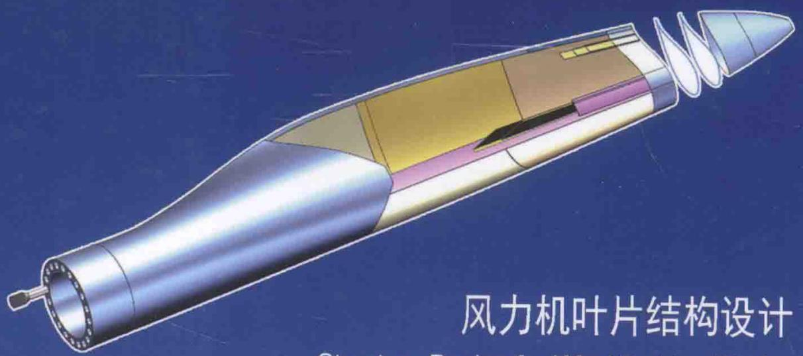

text_image

风力机叶片结构设计

# 风力机叶片结构设计

# Structure Design for Wind Turbine Blades

www.sciencep.com

text_image

ISBN 978-7-03-046216-9
9 787030 462169 >

南京分社

电话：025-86300543

E-mail: nanjing@mail.sciencep.com

博客：http://blog.sina.com.cn/sciencepressnj

上架建议：新能源/风能

定价：139.00元

# 风力机叶片结构设计

王同光 李慧 陈程 叶婷婷 著

# 内容简介

本书总结了作者关于风力机叶片结构设计方面的经验，系统地阐述了复合材料型风力机叶片结构应用的设计方法和技术方案，包括风力机叶片复合材料应用、构件、设计、方法、基础校核及高级校核；重点介绍了风力机叶片结构设计校核的方方面面，涉及基础理论、设计方法、结构校核、全尺寸测试；并结合风力机国际标准和规范给出大量设计实例。

本书可供从事风力机叶片设计和仿真的专业技术人员使用，也可作为高等院校风电专业的本科生和研究生的参考教材。

# 图书在版编目(CIP)数据

风力机叶片结构设计/王同光等著.—北京：科学出版社,2015.11

ISBN 978-7-03-046216-9

I. ①风… II. ①王… III. ①风力发电机 - 叶片 - 结构设计 IV. ①TM315

中国版本图书馆 CIP 数据核字(2015) 第 262200 号

责任编辑：惠雪 曾佳佳 / 责任校对：胡小洁

责任印制：赵博/封面设计：许瑞

科学出版社 出版

北京东黄城根北街16号

邮政编码：100717

http://www.sciencep.com

北京盛源印刷有限公司 印刷

科学出版社发行 各地新华书店经销

\*

2015年11月第一版 开本:720×1000 1/16

2015年11月第一次印刷 印张:24 1/4

字数: 489 000

定价: 139.00 元

(如有印装质量问题, 我社负责调换)

# 前言

由于石化能源危机和全球气候变化日趋严重, 发展可再生能源已成为当今世界的迫切问题之一。在诸多可再生能源中, 风能已成为最具代表性和商业化前景的清洁能源之一, 受到世界各国的重视。我国风电产业发展快速, 累计风电装机容量已多年位居世界第一, 风电机组的国产化率也不断提高。但是, 从根本上来说, 我国风电技术自主创新能力薄弱, 实践经验积累不足。因而, 自主设计开发对我国风电产业的可持续发展是非常重要的。叶片是风力机中最基础和最关键的部件, 叶片结构可靠性是保证叶片安全运行的基本条件。本书以实用为准则, 致力于阐述风力机叶片结构设计的方方面面, 涉及基础理论、设计方法、校核、测试等叶片设计产业链的各个环节, 并给出满足国际标准和规范的大量设计实例。可供从事风力机叶片设计和仿真等方面工作的专业技术人员使用, 也可作为高等院校相关专业的本科生和研究生的参考教材。

风力机叶片, 到底是怎样的一种结构件?

是玻纤 + 树脂 + 芯材 + 结构胶形成的复合材料件？

是主梁 + 腹板 + 蒙皮 + 叶根组成的结构构件？

是梁单元 + 壳单元 + 体单元 + 点质量耦合的有限元薄壁组件？

• • • • • •

风力机叶片就是一种复杂的结构形式, 更是以上元件的综合, 如果一定要给叶片一个术语, 那应该叫做复合材料薄壁杆件结构。

针对复杂的风力机叶片结构, 我们应该进行哪些工作呢?

是玻纤 + 树脂 + 芯材 + 结构胶这些复合材料件的选型吗？

是主梁 + 腹板 + 蒙皮 + 叶根这些结构构件的结构设计吗？

是梁单元 + 壳单元 + 体单元 + 点质量这些有限元单元的分析方法吗？

是复合材料薄壁杆件结构的强度+刚度+振动+屈曲+疲劳的校核与分析吗？

• • • • •

风力机叶片结构应涵盖复合材料、构件、设计、校核甚至包括抗冲击、断裂力学这些高级校核，用全方位的视角，细致地雕琢叶片的每一部件、每一剖面、每一构件、每一层铺层、每一层纤维与树脂，甚至可以研究到纤维微观方面的问题。

本书共分五篇，二十一章。第一篇为第1\~3章，为叶片结构设计基础，介绍了结构工程师所需要的一些叶片结构背景知识，以便于灵活学习及应用理论基础，叶片设计基本准则作为结构设计的基石，复合材料基础作为结构设计的储备，结构设计基础是集成多方面设计约束的必要理论依据；第二篇为第4、5章，为叶片结构设计，详细介绍了叶片结构件和功能件的构型设计和详细尺寸设计，部分主要结构件还涉及一定的工艺设计，本章节涉及的叶片结构件基本涵盖了主流叶片结构形式的所有结构部件，力求全面阐述叶片结构件设计的诸多技术点；第三篇为第6\~10章，为叶片结构设计方法，包括叶片结构校核综述及方法，结合风力机叶片的国际标准阐述叶片结构校核的要求与设计准则，对应于工字梁、薄壁杆件理论和有限元理论，分别介绍一维、二维和三维叶片结构分析方法；第四篇为第11\~15章，为叶片结构构件设计，介绍叶片结构的基本校核内容及叶片中的复合材料构件的细节分析内容，主要包括层合板结构、夹芯结构、胶接连接和螺栓连接四种结构构件的分析方法；第五篇为第16\~20章，为叶片结构设计专题，介绍叶片校核的高级专题部分，包括疲劳分析、抗冲击分析、断裂力学的层间分析与可靠性分析，同时，在本篇最后简述了叶片全尺寸测试的基本内容。在全书最后一章介绍了本书中未涵盖的内容，意在抛砖引玉，简明引出未来叶片的发展趋势。

本书是南京航空航天大学风力机设计团队和无锡风电设计研究院有限公司设计团队在风力机叶片结构设计方面通力合作的成果和工作总结。撰写过程中得到了郭大宏的大力支持与帮助，同时要特别感谢南京航空航天大学张震宇、王珑、钟伟的指导，以及无锡风电设计研究院的俞志强、李丹、梁庆新、倪士刚、郑海燕的支持，尤其要感谢赵新华对本书提出诸多宝贵意见。在他们的通力协助下，本书才能与各位读者见面。本书中引用较多叶片生产的照片，源于无锡乘风科技有限公司的支持，在此表示感谢。

作者对全书的编写作了非常大的努力，力求为国内风电事业添砖加瓦，本书经过再三校对，但由于作者能力和水平有限，纰漏之处在所难免，盼各界人士赐予指正，再版时加以修正。

作者

2015年6月

# 目录

# 绪论……1

# 第一篇 叶片结构设计基础

# 第 1 章 基本准则 …… 7

1.1 设计协调 7  
1.2 设计基础 9  
1.3 结构设计 …… 10  
1.4 结构重量与成本控制 …… 11

# 第 2 章 复合材料基础……13

2.1 叶片复合材料结构件 16  
2.2 叶片结构材料 19  
2.3 增强纤维 19   
2.4 树脂……21   
2.5 其他结构材料 22  
2.6 选材途径....22   
2.7 复合材料力学测试 23  
2.8 叶片复合材料工艺性 27

# 第 3 章 结构设计基础……31

3.1 设计基准 …… 31  
3.2 构型设计 42  
3.3 结构设计流程 44

# 第二篇 叶片结构设计

# 第 4 章 结构件设计 …… 49

4.1 主梁设计 50  
4.2 腹板设计及缘条胶接 …… 61  
4.3 蒙皮设计....72  
4.4 夹芯结构设计 73  
4.5 前缘梁设计及前缘胶接 78

4.6 尾缘梁设计及尾缘胶接 80  
4.7 叶根加强层设计....90  
4.8 叶根连接设计 92  
4.9 优化设计讨论 …… 104

# 第 5 章 功能件设计 …… 106

5.1 叶尖设计....106  
5.2 防雷设计....106  
5.3 胶衣及喷漆 109   
5.4 运输加强层设计....109  
5.5 叶根盖板设计 …… 110  
5.6 配重腔设计 …… 110  
5.7 挡雨环设计 …… 111  
5.8 双腹板 PE 管设计 …… 111  
5.9 其他设计 …… 111

# 第三篇 叶片结构设计方法

# 第 6 章 结构校核准则 …… 115

6.1 结构校核总则 …… 115  
6.2 叶片结构校核方法 …… 116  
6.3 叶片结构校核概述 …… 116  
6.4 强度分析……118  
6.5 稳定性分析 …… 118  
6.6 变形分析 …… 121  
6.7 动力学特性分析 …… 121  
6.8 胶接分析 …… 122  
6.9 层间分析 …… 122  
6.10 疲劳分析……122  
6.11 高级分析....123

# 第 7 章 一维方法 …… 124

7.1 工字梁理论 …… 124  
7.2 叶片剖面模型简化 …… 126  
7.3 叶片剖面强度计算 …… 128  
7.4 叶片剖面强度分析 …… 130  
7.5 叶片弯曲变形计算 …… 131

7.6 叶片剖面挠度分析 …… 132  
7.7 一维方法误差分析 …… 133  
7.8 一维方法应用拓展 …… 135

# 第 8 章 二维方法 …… 137

8.1 叶片强度计算 …… 138  
8.2 叶片固有频率与特征模态计算 …… 151  
8.3 等效疲劳载荷法计算疲劳损伤 …… 153  
8.4 二维工程算法 …… 154  
8.5 二维等截面有限元方法 …… 155

# 第 9 章 三维方法 …… 159

9.1 风力机叶片有限元分析 …… 159  
9.2 叶片有限元建模……160   
9.3 叶片有限元模型局部细化 …… 168  
9.4 叶片有限元边界与加载 …… 170

# 第 10 章 其他方法 …… 185

10.1 叶片建模流程....185   
10.2 叶片数据库 …… 186

# 第四篇 叶片结构构件设计

# 第 11 章 基本校核分析 …… 189

11.1 叶片基本校核....189  
11.2 结构校核安全系数 …… 190  
11.3 强度校核....193   
11.4 刚度校核……198   
11.5 振动特性分析……200  
11.6 叶片整体屈曲 207

# 第 12 章 层合板分析 …… 208

12.1 层合板理论 …… 208  
12.2 层合板设计 215  
12.3 层合平板的屈曲 217  
12.4 纤维失效分析 226  
12.5 树脂失效分析....228  
12.6 层合板在叶片上的应用 231

# 第 13 章 夹芯结构分析 …… 233

13.1 夹芯结构基础……233  
13.2 夹芯结构设计 …… 234  
13.3 夹芯结构分析 …… 235  
13.4 夹芯结构分析方法 …… 237  
13.5 夹芯结构在叶片上的应用 …… 249  
13.6 腹板屈曲分析 …… 249  
13.7 叶片局部屈曲分析 …… 253   
13.8 叶片截面屈曲分析 …… 254

# 第 14 章 胶接连接分析 …… 255

14.1 胶接理论....255   
14.2 胶接连接设计 …… 257   
14.3 胶接工程算法……262  
14.4 胶接连接分析 …… 266  
14.5 胶接连接在叶片上的应用 268

# 第 15 章 螺栓连接分析 …… 271

15.1 叶根预埋工艺的结构校核 …… 271  
15.2 后打孔叶根工艺的结构校核 …… 287

# 第五篇 叶片结构设计专题

# 第 16 章 疲劳分析 …… 293

16.1 理论基础……293   
16.2 复合材料疲劳……298  
16.3 叶片疲劳校核流程 …… 301  
16.4 疲劳载荷……302   
16.5 疲劳校核危险点选取 303   
16.6 叶片疲劳校核方法 304  
16.7 叶片疲劳损伤判断 …… 309

# 第 17 章 叶片抗冲击分析 …… 311

17.1 冲击损伤分析技术 …… 311  
17.2 显示时间积分方法 …… 314  
17.3 材料本构关系……315  
17.4 叶片抗冲击校核 316   
17.5 叶片抗冲击试验 318

# 第 18 章 断裂力学与层间分析 …… 319

18.1 复合材料的断裂分析……319  
18.2 断裂力学中的主要参数 …… 319  
18.3 断裂力学计算方法 …… 320  
18.4 哑节点断裂单元 328  
18.5 复合材料层间应力 …… 334  
18.6 叶片的层间失效与断裂破坏 338

# 第 19 章 可靠性分析 …… 340

19.1 复合材料损伤容限 …… 340  
19.2 可靠性....342

# 第 20 章 叶片全尺寸测试 …… 346

20.1 概述 346  
20.2 材料测试与构件测试……346  
20.3 叶片全尺寸测试简介 348  
20.4 叶片数据与试验件要求 …… 349  
20.5 试验台 350  
20.6 设计载荷与测试载荷 353  
20.7 失效模式 354  
20.8 质量与动态特性测试……354   
20.9 静强度测试 355  
20.10 疲劳测试 358   
20.11 破坏性测试 358

# 第 21 章 总结与展望 …… 359

21.1 设计与流程 359  
21.2 校核与经验 360  
21.3 设计和校核之外的眼界 …… 361  
21.4 对未来的展望……362  
21.5 回到原点 —— 复合材料薄壁杆件结构力学 …… 364

# 参考文献……366

# 附录 A 坐标系 368

# 附录 B WB45.3 叶片 371

# 名词索引 372

# 绪论

叶片是风力发电机组中最基础和最关键的部件，叶片设计中要进行空气动力学计算和结构力学计算等。为了最大限度地利用风能，叶片外形根据空气动力学原理设计而成，为了满足叶片质量轻、刚度大、强度高和耐疲劳等特性，叶片主体部分由复合材料制作而成。

从结构的角度看, 风力机叶片结构分析的关键是 “复合材料薄壁杆件结构力学” 这 12 个字。

力学, 是分析外部作用 (载荷和位移) 与内部响应 (应力和应变等) 之间关系的一种分析方法, 这也是叶片结构分析的依据。从静力学的角度看, 叶片的结构通过合理的简化, 经过气动和气弹的仿真, 可以得到结构所需承担的外部载荷, 将该外部载荷加到叶片结构上, 分析各个细部的内部应变, 确定未超出许用值。从动力学角度, 以上气动和气弹仿真与结构分析过程应该有更深入的流固耦合分析, 以目前计算机的计算能力, 大多数气动和气弹模型中仅将叶片作为欧拉梁单元简化进行分析, 而很少让整个结构的细节模型参与到流固耦合的分析中, 由此方法产生的误差, 目前在工程上是可行的, 也是主流的方法。

结构力学, 是一种层层分解的系统化、结构化的力学分析方法。通过工程方法层层细分的分析, 或通过有限元方法的分析, 亦或通过解析的方法对可解析描述的形状和奇点附近的结构进行分析, 都是一种由全局逐步细化的结构化分析方法, 对叶片的结构从宏观到微观有一个逐层深入的体现。

杆件, 是某一方向的特征尺度远大于另两个方向特征尺度的结构。因为大型的风力机叶片长度为几十米, 而宽度 (最大弦长) 通常为几米, 其展弦比在 10 以上, 所以可以用杆件的研究方法来研究。杆件的研究中有很多独特的方法, 也有很多便于分析的简化, 特别是采用梁理论进行简化。如采用欧拉梁理论, 利用平面变形假设, 将杆件所承担的弯曲与拉压效应和其所承担的剪切与扭转效应进行解耦, 将复杂的三维结构求解问题简化为若干个二维等截面结构的求解问题, 大大简化了每一个子问题的复杂度, 然后再将各个二维求解的结果通过梁理论在三维内进行整合, 又获得一个全局的效果。或者说, 在对杆件理论理解深刻并简化得当的情况下, 可以在全局上将 3D 结构解耦为 1D 梁和若干个 2D 等截面或近似等截面梁。在本书中, 第 7 章的一维方法与第 8 章的二维方法就是对以上杆件理论应用在风力机叶片领域之后最直接的一个解耦。

薄壁, 是壁厚方向特征尺度远小于其他方向特征尺度的结构。叶片壳体的厚度为几毫米到 $100 \mathrm{~mm}$ (主要是叶根部位) 不等, 而叶片的弦长通常在 $1 \mathrm{~m}$ 以上 (叶尖除外), 所以径向特征尺度与壁厚特征尺度之比远大于 10, 通常大于 30, 所以可以用薄壁的研究方法来研究。由于是薄壁, 对正应力的计算, 可以将各种刚度特征线性叠加, 在几何分析时也有很多忽略小量的简化分析方法, 从而大大简化计算; 对于剪应力的计算, 也可以采用薄壁杆件通常使用的剪力流方法来进行研究和分析, 将一个二维的平面问题简化为剪力流沿一维曲线的运动, 即一维的微分方程, 能够快速地进行分析。

在腹板的支撑作用下，整个叶片的大部分区域的截面形式是一种多闭室薄壁杆件。目前，风力机叶片通常采用三闭室薄壁形式，即两腹板的结构形式；在小型的风力机叶片中也有两闭室（单腹板）或者单闭室（无腹板）的形式，而更大型的风力机也会考虑采用截面内四闭室（三腹板）等多闭室结构形式。这种多闭室的结构在杆件结构分析中，也有很多成熟的分析方法。本书第9章主要介绍的是薄壁杆件的结构力学相关内容。

通过以上薄壁 + 杆件，叶片上的三维空间的偏微分方程的求解，已经简化为沿叶片展向若干个独立截面下，若干个一维曲线上物理特性的常微分方程，且方程的自由度较低。自由度的大大降低，提供给工程师一种快速的进行工程计算的可能性。早期的叶片设计，主要是通过手算完成；后来，针对该方法开发了计算机程序；即便在有限元软件已经高度发展的今天，以上薄壁方法仍然作为工程人员经验的重要来源之一，可以避免有限元软件只见云图、不见原理的不足。

需要注意的是，在叶片的某些部位，以上薄壁杆件的前提条件并不成立，或者说存在例外而造成引入的误差会比较大，如对于杆件而言刚度突变或几何不连续的部位附近，如对于薄壁而言厚度突变的部位，如对于多闭室而言尾缘部位的连接方式等，这些特征的存在对直接分析整个结构提出了要求。对于这些部位，有限元分析方法仍然是最快速的分析方法，本书第10章描述了整体建模分析的方法。

复合材料, 存在比强度高、比模量高、可设计性强、热稳定性好、高温性能好等优点, 但同时存在材料各向异性、材料分散度高、成本昂贵、韧性较差等缺点 [1]。整个叶片结构本身为纤维增强复合材料, 几乎所有承力构件形式基本都是复合材料结构件, 其中叶片承力梁主梁、前缘梁、尾缘梁和无夹芯的蒙皮部位均可作为复合材料层合板; 叶片壳体芯材段及整个腹板结构可作为夹芯结构; 叶片合模中的前缘、尾缘和腹板缘条黏接可作为胶接结构; 叶根通过螺栓与变桨轴承、轮毂连接到一起可作为螺栓连接件。以上层合板结构、夹芯结构、胶接结构和螺栓连接结构四种结构, 就是常见的复合材料结构件。对此四种结构的深入研究, 可以建立起复合材料力学与风力机叶片结构之间的关系。

复合材料的微观特性方面，研究增强相与基体之间的物理、力学、化学关系，

属于复合材料力学范畴，本书不做进一步的探讨。

综上所述，“复合材料、薄壁杆件、结构力学”12个字是风力机叶片结构分析的关键，如图0-1所示，其中复合材料是材料特性，薄壁杆件是结构形式，结构力学是研究方法，只有充分理解以上理论的精髓，并将理论与实践结合，才能对叶片的结构获得既深入又细致的理解。

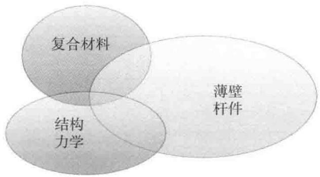

text_image

复合材料
结构力学
薄壁杆件

图 0-1 复合材料薄壁杆件

本书基于五大学科基础，采取五种分类原则，逐节逐层介绍叶片结构设计与分析的方方面面。详见表 0-1。

表 0-1 本书章节划分

<table><tr><td>学科基础</td><td>分类</td><td>章节</td></tr><tr><td>复合材料件</td><td>四大构件</td><td>2 复合材料基础12 层合板分析13 夹芯结构分析14 胶接连接分析15 螺栓连接分析</td></tr><tr><td>薄壁杆件</td><td>四种方法</td><td>7 一维杆件方法8 二维薄壁方法9 三维有限元方法10 其他方法</td></tr><tr><td>结构</td><td>两类部件</td><td>1 基本准则3 结构设计基础4 结构件设计5 功能件设计</td></tr><tr><td>力学</td><td>N种分析</td><td>6 结构校核准则11 基本校核分析16 疲劳分析17 叶片抗冲击分析18 断裂力学与层间分析19 可靠性分析</td></tr><tr><td>测试</td><td>全尺寸测试</td><td>20 叶片全尺寸测试</td></tr></table>

# 第一篇

# 叶片结构设计基础

# 第1章 基本准则

# 1.1 设计协调

叶片的设计过程涉及气动、结构、工艺等多个学科方面的工作，为了得到性价比最优的叶片，通常会给这几项工作设定指标。一个良好的叶片设计能够体现所有设计因素之间的平衡，事实上某些单指标最优的要求是无法达到的，因此在叶片设计过程中，各部门各专业有必要针对叶片各方面的设计指标，进行协商与协调，给出一套折中的设计方案。设计部门或生产部门在叶片设计过程中，如果把自己的工作看得太重，忽略一些其他部门考虑的设计指标，设计出来的叶片有可能应用价值较小[2]。

气动工程师为了追求完美的流线型气动外形，以发电量最大作为单一的设计指标，将设计出见表 1-1 的叶片外形，叶片外形很薄且各截面造型很连续，但此时很难满足结构强度要求及制造要求。

表 1-1 气动工程师设计叶片

<table><tr><td>A-流线型外形</td></tr><tr><td></td></tr></table>

结构工程师为了追求高强度和高刚度的叶片结构布局，以承载能力作为单一的设计指标，将设计出结构工程师所追求的叶片，见表 1-2 的圆管式、椭圆式、桁架式、矩形箱式、工字梁式等，以结构受力特性为主导的最好的结构形式是桁架式。但无论哪种结构，其气动特性很差，难以满足发电量要求。

工艺工程师为了追求制造方便及生产成本低，以加工便捷作为单一的设计指标，将设计出等厚度平板、圆管 + 蒙皮等叶片形式，见表 1-3，但这种叶片的外形难以满足结构强度要求，且捕获风能效率低。

风力机发展的初始阶段，小型风力机有以上方式的组合，在结构不主导设计时，仅考虑一定气动扭角的薄片带来了加工上的便利，如 P1 即可形成片状的小型风力机叶片；考虑一定的结构特性，荷兰风车有采用 S2+ 帆布蒙皮即可形成桁架

结构形式的风力机叶片。

表 1-2 结构工程师设计叶片

<table><tr><td>S1-圆管结构</td><td>S2-桁架结构</td><td>S3-工字梁结构</td><td>S4-其他各种力学形式</td></tr><tr><td>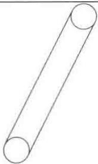</td><td>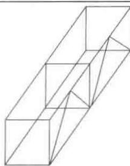</td><td>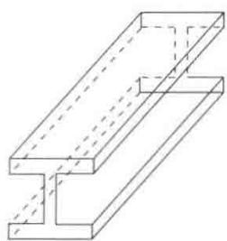</td><td>......</td></tr></table>

表 1-3 工艺工程师设计叶片

<table><tr><td>P1-平板形</td><td>P2-圆管+蒙皮</td></tr><tr><td>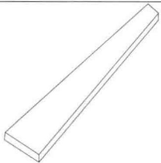</td><td>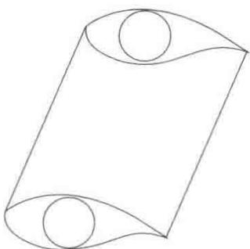</td></tr></table>

风力机起步的早期，叶片的形式多种多样，其材料有木、铁、铝、帆布、塑料等，结构形式有 O 形梁、D 形梁、方形梁、工字梁、实心式等多种 [3,4]。随着风力机的不断发展和成熟，特别是随着风力机的大型化，水平轴、升力型、上风向、三叶片、变桨距、变转速、兆瓦级的风力机已经成为世界风能利用的主要形式，叶片设计中必须综合考虑气动、结构、工艺等方面的可设计性与可实施性，于是，叶片形式逐渐固定下来，纤维增强复合材料、真空导注工艺、薄壁杆件结构的叶片已经成为最常见的一种结构形式。无特殊说明，本书中所述叶片均为以上构型的叶片。

目前，大型风力机叶片通常为复合材料薄壁杆件结构，进行叶片结构设计时应从多方面多学科角度综合考虑结构设计的要求和原则。图 1-1 显示风力机叶片结构与多学科密切相关，包括气动、载荷、机械、工艺、材料、检测、维护维修等产品全生命周期。

叶片结构在复合材料叶片开发中属于承上启下的关键技术环节，与气动、气弹、机械、工艺、材料和测试方面都有很密切的关联，如图 1-2 所示。

综上所述，综合考虑叶片设计多学科领域及叶片结构与其他学科的交集，以复合材料薄壁杆件结构形式为主，大型风力机叶片外形及结构剖面如图 1-3 所示。

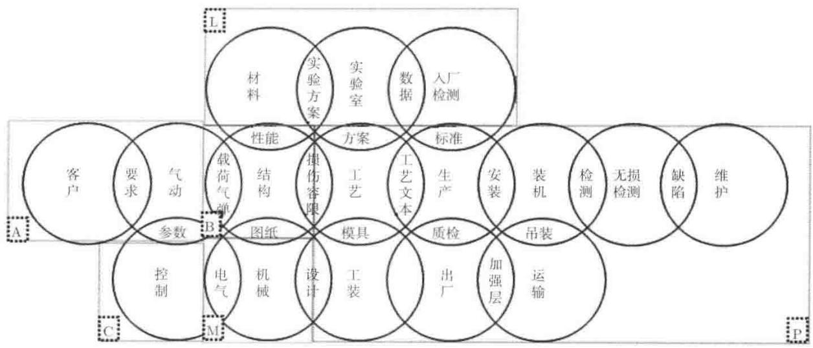

flowchart

```mermaid
graph TD
    A["客户"] --> B["设计"]
    A --> C["制造"]
    A --> D["制造"]
    B --> E["设备"]
    B --> F["材料"]
    B --> G["实验方案"]
    B --> H["实验室"]
    B --> I["数据"]
    B --> J["入厂检测"]
    C --> K["设备"]
    C --> L["材料"]
    C --> M["实验方案"]
    C --> N["实验室"]
    C --> O["数据"]
    C --> P["入厂检测"]
    D --> Q["设备"]
    D --> R["材料"]
    D --> S["实验方案"]
    D --> T["实验室"]
    D --> U["数据"]
    D --> V["入厂检测"]
    E --> W["设备"]
    E --> X["材料"]
    E --> Y["实验方案"]
    E --> Z["实验室"]
    E --> AA["数据"]
    E --> AB["入厂检测"]
    F --> AC["设备"]
    F --> AD["材料"]
    F --> AE["实验方案"]
    F --> AF["实验室"]
    F --> AG["数据"]
    F --> AH["入厂检测"]
    G --> AI["设备"]
    G --> AJ["材料"]
    G --> AK["实验方案"]
    G --> AL["实验室"]
    G --> AM["数据"]
    G --> AN["入厂检测"]
    H --> AO["设备"]
    H --> AP["材料"]
    H --> AQ["实验方案"]
    H --> AR["实验室"]
    H --> AS["数据"]
    H --> AT["入厂检测"]
    I --> AU["设备"]
    I --> AV["材料"]
    I --> AW["实验方案"]
    I --> AX["实验室"]
    I --> AY["数据"]
    I --> AZ["入厂检测"]
```

图 1-1 叶片设计多学科领域

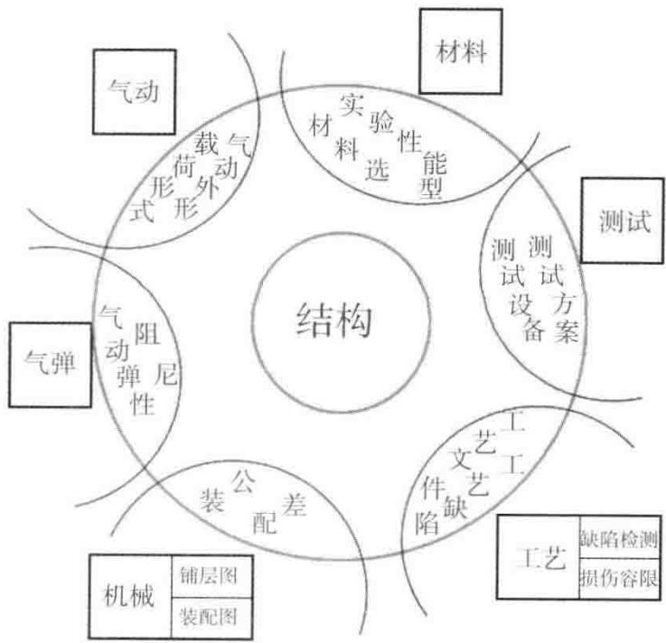

flowchart

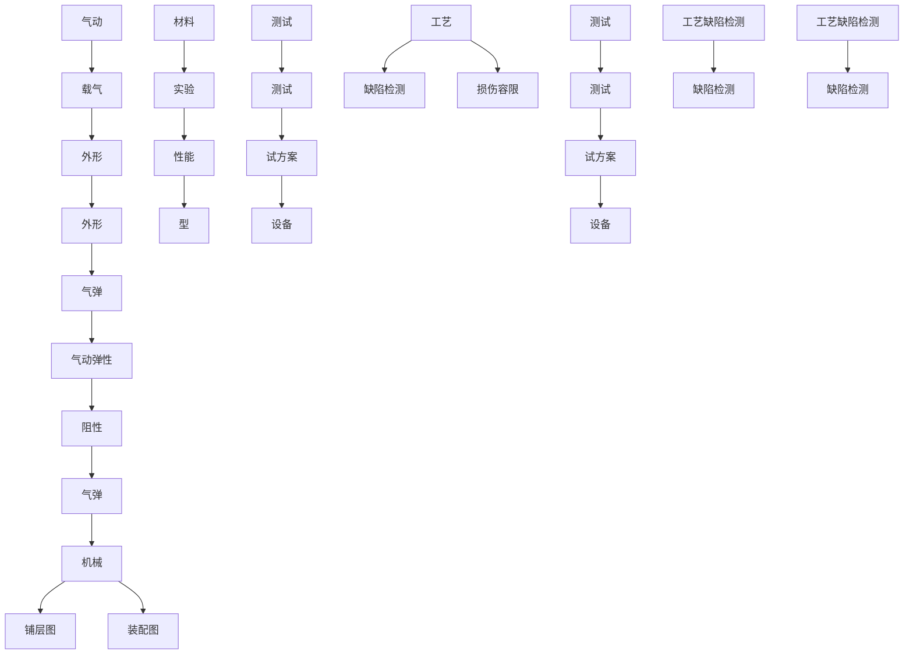
```mermaid
graph TD
    A["气动"] --> B["载气"]
    B --> C["外形"]
    C --> D["外形"]
    D --> E["气弹"]
    E --> F["气动弹性"]
    F --> G["阻性"]
    G --> H["气弹"]
    H --> I["机械"]
    I --> J["铺层图"]
    I --> K["装配图"]
    L["材料"] --> M["实验"]
    M --> N["性能"]
    N --> O["型"]
    P["测试"] --> Q["测试"]
    Q --> R["试方案"]
    R --> S["设备"]
    T["工艺"] --> U["缺陷检测"]
    T --> V["损伤容限"]
    W["测试"] --> X["测试"]
    X --> Y["试方案"]
    Y --> Z["设备"]
    AA["工艺缺陷检测"] --> AB["缺陷检测"]
    AC["工艺缺陷检测"] --> AD["缺陷检测"]
```

图 1-2 叶片结构与其他学科的相关性

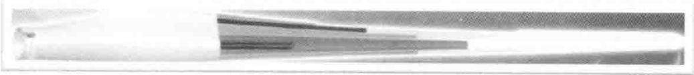

natural_image

Pure electrical circuit lines without any symbols

图 1-3 叶片形式

# 1.2 设计基础

作为结构设计人员，应考虑到设计学和工程学的基础以及它们之间的相互影响[2]。应充分了解专业的工程学科知识，以便评估一些因素（如载荷、材料、总重约束、维护维修、成本控制、试验方法等)对设计的影响，如图1-4所示。

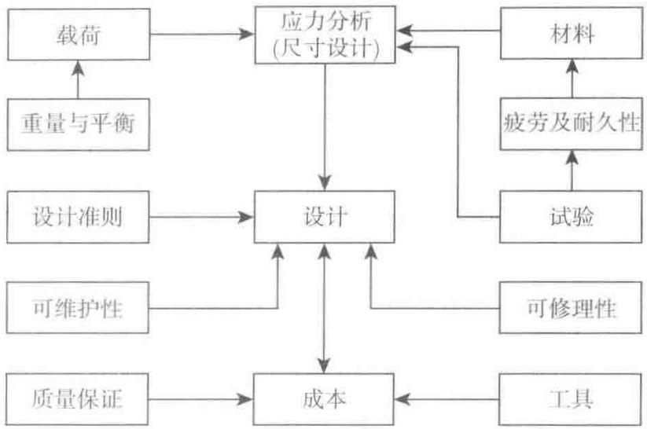

flowchart

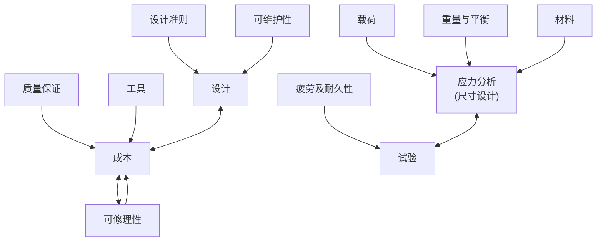
```mermaid
graph TD
    A["载荷"] --> B["应力分析\n(尺寸设计)"]
    C["重量与平衡"] --> B
    D["设计准则"] --> E["设计"]
    F["可维护性"] --> E
    G["质量保证"] --> H["成本"]
    I["材料"] --> B
    J["疲劳及耐久性"] --> K["试验"]
    L["可修理性"] --> H
    M["工具"] --> H
    B <--> K
    E <--> H
    H <--> L
```

图 1-4 结构设计人员的工作内容

# 1.3 结构设计

# 1. 结构件设计

叶片的结构件按照构件来分，一般包括层合板结构、夹芯结构、螺栓连接结构与胶接结构。各种结构件的结构形式要满足强度、刚度、损伤容限与维修性设计的基本要求。详见本书第4章。

# 2. 结构连接设计与分析

结构的连接设计与分析一般分为胶接连接设计和螺栓连接设计。叶片合模中，腹板、前缘和尾缘合模区域都为胶接连接，叶根与变桨轴承及轮毂之间为螺栓连接。详见本书第14章和第15章。

# 3. 结构细节设计

叶片细节设计密切相关于叶片工艺设计与工艺实施，完成叶片结构校核与分析后，结合工艺实现叶片细节设计。表 1-4 列出结构细节设计的关键点，通常表中内容都应在叶片图纸中标注出来 [5]。

# 4. 结构的整体化设计

结构的整体化设计是实现高效复合材料结构的重要途径。复合材料结构由于其制造工艺的特殊性，不同的结构组分既可直接通过纤维的连续铺放、编织或缠绕等结为一体；也可通过共固化或胶接共固化等途径，在复合材料结构的材料形成过程中结为一体；还可以通过二次胶接等连接方式构成。复合材料结构的这一特征被称为结构整体化。

表 1-4 结构设计细节

<table><tr><td>序号</td><td>考虑因素</td><td>内容</td></tr><tr><td>1</td><td>铺层</td><td>各铺层应该展开成平面或近似展开成平面,错层处理</td></tr><tr><td>2</td><td>表面及表面粗糙度</td><td>叶片外形表面粗糙度的气动性能影响</td></tr><tr><td>3</td><td>构件厚度偏差</td><td>厚度偏差应满足一定公差要求,误差累积</td></tr><tr><td>4</td><td>变厚区过渡</td><td>厚度变化应避免突变,宜采用渐变或台阶逐级过渡</td></tr><tr><td>5</td><td>拐角</td><td>拐角处应避免形成尖角,宜采用圆弧过渡</td></tr><tr><td>6</td><td>脱模斜度</td><td>对于有小闭角的结构,在不影响装配协调或与型面无关的情况下,应给出脱模斜度</td></tr><tr><td>7</td><td>可检性</td><td>对整体成型的结构,应留有无损检测开口,不能留有检测盲区</td></tr><tr><td>8</td><td>装配</td><td>对于因厚度偏差引起的装配偏差,应允许用复合材料补偿</td></tr><tr><td>9</td><td>共固化结构布置</td><td>管路设计</td></tr><tr><td>10</td><td>蜂窝夹芯结构边缘加强</td><td>加强铺层应均匀地加于面板铺层之间</td></tr><tr><td>11</td><td>薄弱环节的界面强化</td><td>在分层破坏的区域的某一层或若干层加胶黏剂等</td></tr><tr><td>12</td><td>黏接面表面粗糙度</td><td>用于黏接面表面处理,提高表面胶接特性</td></tr></table>

# 1.4 结构重量与成本控制

叶片的重量控制由铺层材料与复合材料性能、结构形式与结构设计、工艺设计与实施共同主导。

对于叶片结构设计来说，决定结构尺寸的结构设计与应力分析中必须要考虑重量问题。结构设计的目标就是提供一种结构来保证风力机叶片运行过程中最有效地实现其功能，也就是在叶片运行全寿命周期内所需要付出的代价最小。这种全寿命周期是指从最初设计开始到运行满20年的全过程。

众所周知，在飞机行业应严格控制飞机总重，其重量影响的因素比较广，特别是直接影响载重和燃油；而作为“低速重载”的风力机叶片，与飞机不同，叶片更关注自身的成本及由叶片总重直接影响的风力发电机组成本[2]。

叶片重量的控制有两个目的，一是叶片自身的疲劳来源于自身重量，所以叶片重量减少，可以使得叶片的载荷进一步减小，进而继续优化叶片重量；另一方面，叶片的重量增大所导致的风轮重量增加是变桨轴承、变桨系统、轮毂、主轴、主轴承齿轮箱、底架等零部件的疲劳载荷的来源，叶片的重量的优化，有利于这些零部件的优化设计。从这个角度讲，叶片每减重1kg，可带来的整机成本下降要远大于叶片减重的成本，所以现代风力机，特别是大型化的风力机，为减重叶片而不惜采用碳纤维等高性能的昂贵材料。

叶片成本的约束较广，简单说来，叶片成本以直接材料成本 + 间接材料成本+ 人工成本 + 管理成本 + 维护成本等部分构成，为方便起见，在设计期，对成本采用直接材料成本 × 固定费率 + 固定费用的方式进行计算；对于生产规划阶段，对成本的计算应考虑生产规模（产能或产量）、模具等特种工装数量、运输三个主要要素。而如果要想更细致的分析，则需要考虑工人的熟练程度和当地工资水平、季节和仓储、装机地点与运输成本、风场环境与维护成本、运行环境及维护费用等综合因素，将叶片整体视为一套产业链体系，分为叶片研发、设计、工艺、培训、采购、生产、物流、质检、经销、销售、工程、服务和维护维修等多方面的工作，在不同的环节侧重点不同，但是整个叶片产业链系统中应以追求成本最低为原则，控制好叶片产业链的方方面面，合理控制叶片成本。

# 第2章 复合材料基础

从广义上讲, 复合材料是由两种或两种以上不同化学物质的组分组合而成的材料。但在现代材料学中, 复合材料专指由两种或两种以上不同相态的组分所组成的材料 [6]。其特点是材料、结构和外形三者同时形成。该类材料不仅性能优于组成中的任意一个单独的材料, 而且还具有组分单独不具有的独特性能。纤维与树脂组成的纤维复合材料, 具有较高的方向性性能, 它的各种性能, 特别是强度性能随方向的不同而不同。

表 2-1 复合材料的分类

<table><tr><td rowspan="6">复合材料</td><td colspan="4">功能复合材料</td></tr><tr><td rowspan="5">结构复合材料</td><td>颗粒复合材料</td><td colspan="2">非金属-非金属非金属-金属金属-非金属</td></tr><tr><td>层合复合材料</td><td colspan="2">双金属片涂覆金属夹层玻璃......</td></tr><tr><td rowspan="3">纤维增强复合材料</td><td>纤维种类</td><td>玻璃纤维硼纤维碳纤维碳化硅纤维氧化铝纤维芳纶纤维玄武岩纤维超高分子量聚乙烯纤维......</td></tr><tr><td>基体材料</td><td>树脂基体陶瓷基体碳基体......</td></tr><tr><td>纤维形状</td><td>连续纤维短切纤维空心玻璃纤维玻璃粉及磨细纤维......</td></tr></table>

复合材料从应用性质上可以分为功能复合材料和结构复合材料。其中，结构复合材料根据增强材料的几何形状，分为三大类：颗粒复合材料、层合复合材料和纤维增强复合材料[1]。纤维增强复合材料又可以根据其纤维种类、基体材料和纤维性状进一步进行细分。复合材料的具体分类见表2-1。

关于复合材料的研究建议参见相关书籍，本书不再赘述。

目前风力机叶片行业主要应用复合材料，所采用纤维增强材料主要是由基体材料和增强材料两种组分组成的结构复合材料，如图 2-1 所示。

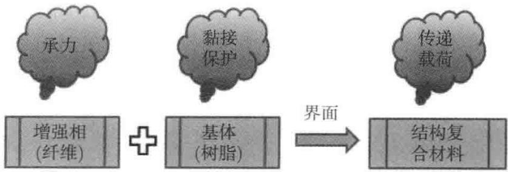

flowchart

```mermaid
graph LR
    A["承力"] --> B["增强相 (纤维)"]
    C["黏接保护"] --> D["基体 (树脂)"]
    E["传递载荷"] --> F["结构复合材料"]
    B + D --> G["界面"]
    F --> G
```

图 2-1 结构复合材料

叶片设计中用到的复合材料主要有：纤维增强体，树脂基体，结构芯材（包括Balsa木和PVC等），结构胶黏剂，表面漆与胶衣等。

本章以 WB45.3-2.0MW 的叶片为例 (WB45.3 叶片参数详见附录 B)，叶片总重约 9t，其中 95% 以上的重量为不同组分的复合材料。可见，复合材料在风力机叶片中占有举足轻重的地位。

# 1. WB45.3 各部件的材料

叶片各部件的主要铺层材料包括单向布、多轴布（三轴布、双轴布）、胶黏剂、芯材（PVC、Balsa木）和金属件，如图2-2与表2-2所示。

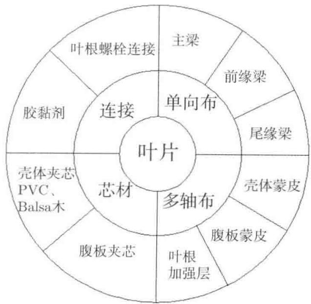

flowchart

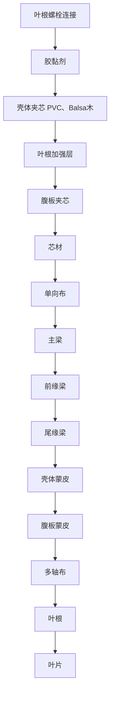
```mermaid
graph TD
    A["叶根螺栓连接"] --> B["胶黏剂"]
    B --> C["壳体夹芯 PVC、Balsa木"]
    C --> D["叶根加强层"]
    D --> E["腹板夹芯"]
    E --> F["芯材"]
    F --> G["单向布"]
    G --> H["主梁"]
    H --> I["前缘梁"]
    I --> J["尾缘梁"]
    J --> K["壳体蒙皮"]
    K --> L["腹板蒙皮"]
    L --> M["多轴布"]
    M --> N["叶根"]
    N --> O["叶片"]
```

图2-2 叶片各部件材料划分

叶片各部件属于不同的结构形式，各主要部件的主体材料见表 2-2。

表 2-2 某款叶片主要部件材料形式

<table><tr><td>部件</td><td>材料形式</td></tr><tr><td>主梁</td><td>单向布</td></tr><tr><td>壳体蒙皮</td><td>多轴布(三轴布、双轴布)</td></tr><tr><td>腹板蒙皮</td><td>多轴布(三轴布、双轴布)</td></tr><tr><td>芯材</td><td>PVC、Balsa木</td></tr><tr><td>前缘梁</td><td>单向布</td></tr><tr><td>尾缘梁</td><td>单向布</td></tr><tr><td>胶接连接</td><td>结构胶黏剂(环氧、聚酯等)</td></tr><tr><td>叶根加强层</td><td>三轴布</td></tr><tr><td>其他</td><td>金属件</td></tr></table>

# 2. WB45.3 各部件的表面积占比

WB45.3 叶片总表面积约 $210.6 \, m^{2}$ ，叶片整体结构形式的主要构件为：前缘梁、前缘芯材 (Balsa 木、PVC)、主梁、尾缘芯材 (Balsa 木、PVC)、尾缘梁和其他构件。

从图 2-3 可以看出，叶片表面积占比中，芯材占了绝大部分的分量，包括 PVC 和 Balsa 木在内的前缘芯材和尾缘芯材占叶片总表面积的 67%，即叶片总表面积的 2/3 都是芯材。且由于叶片壳体与腹板组成的多闭室结构，尾缘空腔很大，尾缘芯材占叶片总表面积的 44%。而包括主梁、尾缘梁和前缘梁的梁结构件则占叶片总表面积的 22%。

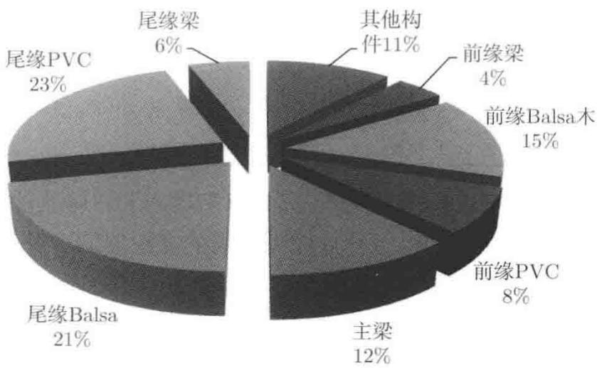

pie

| 类别 | 占比 (%) |
| :--- | :--- |
| 尾缘PVC | 23 |
| 尾缘Balsa | 21 |
| 主梁 | 12 |
| 前缘PVC | 8 |
| 前缘Balsa木 | 15 |
| 其他构件 | 11 |
| 尾缘梁 | 6 |
| 前缘梁 | 4 |

图 2-3 某款叶片主要部件占表面积比

# 3. WB45.3 各材料占重量百分比

综合以上，WB45.3 各部件的表面积占比及 WB45.3 各部件的材料，其 2.0MW 叶片的各材料占重量百分比如图 2-4 和表 2-3 所示。

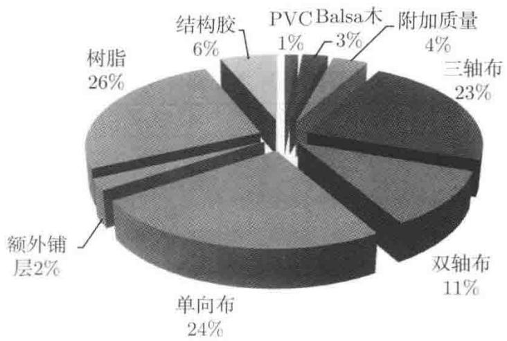

pie

| 类别 | 占比 (%) |
| :--- | :--- |
| 树脂 | 26 |
| 额外铺层 | 2 |
| 单向布 | 24 |
| 双轴布 | 11 |
| 三轴布 | 23 |
| 附加质量 | 4 |
| PVC Balsa木 | 3 |
| 结构胶 | 6 |

图 2-4 WB45.3 叶片 BOM

表 2-3 WB45.3 叶片材料占重量百分比

<table><tr><td colspan="2">材料明细</td><td colspan="2">占重量比例/%</td></tr><tr><td>三轴布</td><td></td><td>23</td><td></td></tr><tr><td>双轴布</td><td></td><td>11</td><td></td></tr><tr><td rowspan="2">单轴布</td><td>主梁单向带</td><td>21</td><td rowspan="2">24</td></tr><tr><td>尾缘梁单向带</td><td>3</td></tr><tr><td>额外铺层</td><td></td><td>2</td><td></td></tr><tr><td rowspan="2">树脂</td><td>灌输</td><td>24</td><td rowspan="2">26</td></tr><tr><td>手糊</td><td>2</td></tr><tr><td>结构胶</td><td></td><td>6</td><td></td></tr><tr><td>PVC</td><td></td><td>1</td><td></td></tr><tr><td>Balsa 木</td><td></td><td>3</td><td></td></tr><tr><td rowspan="5">附加质量</td><td>填充和胶衣</td><td>1.3</td><td></td></tr><tr><td>接闪系统</td><td>0.3</td><td></td></tr><tr><td>配重腔</td><td>0.2</td><td>4</td></tr><tr><td>盖板</td><td>0.3</td><td></td></tr><tr><td>T-螺栓</td><td>1.9</td><td></td></tr></table>

从图 2-4 和表 2-3 可以看出，包括三轴布、双轴布和单轴布的玻纤织物占叶片总重的绝大部分，占重量比为 58%。叶片成型所需的灌输树脂占叶片重量比的 23%，而用于合模黏接的手糊树脂占叶片重量比的 2%。叶片芯材 (PVC、Balsa 木) 虽然占叶片总表面积比的绝大部分，但占总重量比的比重很小，仅 4%。用于叶片整体合模的结构胶黏剂，涂抹于腹板缘条、前缘合模区和尾缘合模区，占总重量比的 6%。

# 2.1 叶片复合材料结构件

叶片复合材料主要应用玻璃纤维与树脂基体，局部加强区域可采用碳纤维与树脂基体。同时，连续纤维与短纤维都以不同的形式应用于叶片结构中，如图 2-5所示。目前大型风力机叶片大多采用玻璃纤维增强环氧树脂复合材料 (GFRP) $^{[7]}$ ，其叶片有以下特点：

(1) 根据风力机叶片的受力特点设计强度与刚度。风力机叶片主要是纵向受力，即气动弯矩和离心力，气动弯矩载荷比离心力大得多，而由于剪切与扭转产生的剪切应力不大，利用纤维受力为主的受力理论，可把主要纤维方向安排在叶片的纵向，这样就可减轻叶片的重量。  
(2) 翼型容易成型，并达到最大气动效率。为了达到最佳气动效果，叶片具有复杂的气动外形。在风轮的不同半径处，叶片的弦长、厚度、扭角和翼型都是不同的，如用金属制造十分困难。GFRP 叶片可实现批量生产。  
(3) 叶片使用 20 年, 要经受多次疲劳交变, 因此材料的疲劳性能要好。GFRP 疲劳强度较高, 缺口敏感性低, 内阻尼大, 抗震性能较好, 是制作叶片的理想材料。  
(4) GFRP 耐腐蚀性好。风力机安装在户外，近年来又大力发展离岸风电场，风力机安装在海上，风力机组及叶片要受到各种气候环境的影响，它应具有耐酸、碱、水汽的性能。

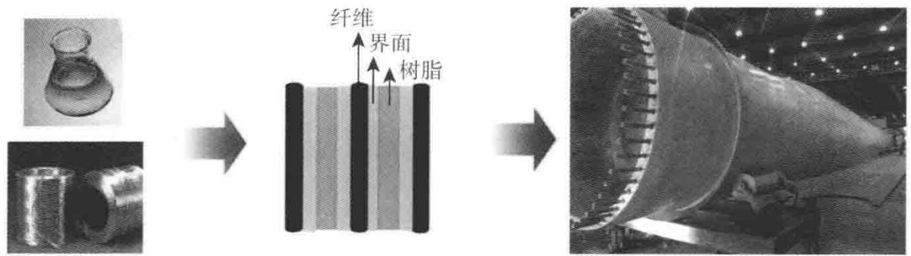

text_image

纤维
界面
树脂

图 2-5 叶片复合材料应用

叶片的构造较复杂，由叶片外壳、主梁、夹层结构、前缘和尾缘加强层等构件组成，模型建立较困难。有限元强大的建模和结构分析功能适于叶片的应力、变形、频率、屈曲、疲劳等分析。大型风力机叶片采用腹板支撑主梁结构，叶片前缘和尾缘区域有夹芯结构，在气动载荷作用下叶片局部受压区域发生局部屈曲破坏。叶片尾缘夹芯区域较宽，易发生失稳，因此芯层和面层的厚度可采用复合材料夹层结构稳定理论进行计算。

复合材料叶片结构形式如图 2-6 所示，根据风力机叶片的受力特性，一般情况下叶片蒙皮和腹板蒙皮采用双轴布或三轴布铺层，主梁和尾缘梁等梁结构采用单向玻纤布的铺层，叶片外壳和腹板夹芯结构采用芯材，如 Balsa 木、PVC 泡沫、PMI 泡沫、PU 硬质泡沫等。叶片整体采用合模黏接，前缘、尾缘和腹板缘条段采用胶接连接。同时，叶片整体需要与变桨轴承、轮毂连接，叶片叶根段采用螺栓连接。

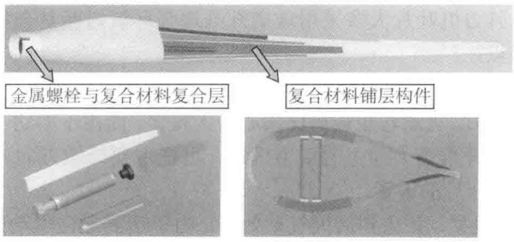

text_image

金属螺栓与复合材料复合层
复合材料铺层构件

图 2-6 复合材料叶片构件

叶片结构主要以四大结构件的形式体现于叶片剖面中，如图 2-7 所示，包括层合板结构、夹芯结构和胶接连接结构，而螺栓连接结构用于叶根与轴承连接，未体现于叶片剖面结构形式中。本书将在第 12\~15 章节中深入展开介绍这四种结构件。本书中未选用特殊结构剖面形式，如尾缘三腹板和钝尾缘，三腹板结构一般用于大叶片的最大弦长局部，为了提高局部的抗屈曲特性，防止大叶片的尾缘无支撑空腔过大而发生局部屈曲；同时，钝尾缘需综合考虑气动、结构、工艺的设计特点，一般出现在大叶片的叶根至展向最大弦长段。叶片铺面的结构形式与区域划分的示意图详见图 2-8 及表 2-4。

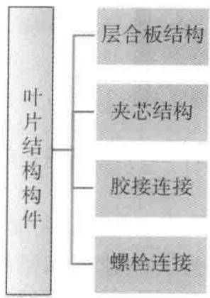

flowchart

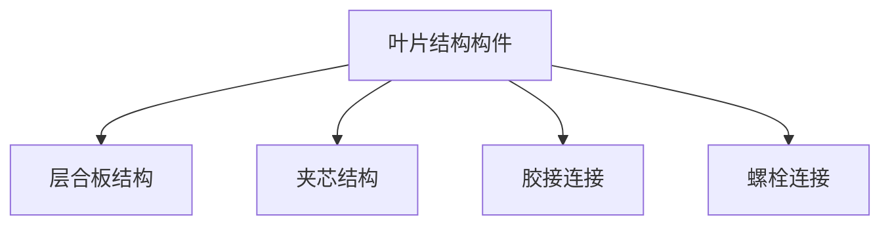
```mermaid
graph TD
    A["叶片结构构件"] --> B["层合板结构"]
    A --> C["夹芯结构"]
    A --> D["胶接连接"]
    A --> E["螺栓连接"]
```

图 2-7 叶片结构构件  
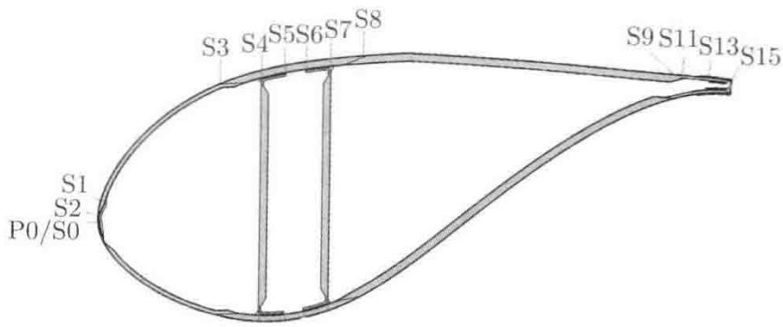

text_image

S3 S4 S5 S6 S7 S8
S9 S11 S13 S15
S1
S2
P0/S0

图 2-8 叶片结构剖面形式

表 2-4 叶片结构构件 (S 面为例)

<table><tr><td>叶片构件</td><td>起点</td><td>终点</td><td>部件</td></tr><tr><td rowspan="4">层合板结构</td><td>S0</td><td>S1</td><td>前缘梁</td></tr><tr><td>S3</td><td>S8</td><td>主梁</td></tr><tr><td>S9</td><td>S13</td><td>尾缘梁</td></tr><tr><td>S2</td><td>S3</td><td>S 面前缘夹芯</td></tr><tr><td rowspan="3">夹芯结构</td><td>S8</td><td>S9</td><td>S 面尾缘夹芯</td></tr><tr><td>S4</td><td>P面</td><td>前缘腹板</td></tr><tr><td>S7</td><td>P面</td><td>尾缘腹板</td></tr><tr><td rowspan="4">胶接连接</td><td>S0</td><td>S1</td><td>合模前缘胶接</td></tr><tr><td>S13</td><td>S15</td><td>合模尾缘胶接</td></tr><tr><td>S4</td><td>S5</td><td>腹板缘条与壳体胶接</td></tr><tr><td>S6</td><td>S7</td><td></td></tr></table>

# 2.2 叶片结构材料

叶片一般采用 E-Glass + 环氧树脂，价格低廉，性能较好；而大型叶片可采用碳纤维与玻纤混杂或碳纤维 + 环氧树脂，成本较高，性能优良，提高叶片刚度的同时可控制叶片总重。

一般情况下，60m 左右长度的叶片是单纯使用玻璃纤维增强体叶片长度的临界尺度，大于此尺度的叶片可使用碳纤维增强，当叶片的尺寸大到一定程度时，由于使用碳纤维增强，玻纤和树脂的用量可以减少，其综合成本可以做到不高于玻纤复合材料。大丝束碳纤维的研发生产进一步促进了碳纤维的应用。

# 2.3 增强纤维

现阶段，市场上的叶片采用的纤维增强体多为玻璃纤维中的 E-Glass，未来发展方向为采用重量轻、高比模量、高比强度的纤维增强体，如 S-Glass、碳纤维、超高分子量聚乙烯纤维等。

# 1. E-Glass

无碱玻璃纤维 E-Glass 是一种铝硼硅酸盐成分，其比强度高、耐疲劳性好、介电性能优异，在 $600^{\circ}$ F ( $320^{\circ}$ C) 时可保持 50% 的拉伸强度，耐化学、耐腐蚀以及耐环境的性能好。E-Glass 已经广泛应用于风力机叶片中。

# 2. S-Glass

与 E-Glass 相比，S-Glass 的压缩强度提高了 25%，拉伸强度提高了 40%，模量提高了 20%，而密度降低了 4% $^{[8]}$ 。S-Glass 比 E-Glass 具有更强的耐强酸性，但其成本相对也更高。应用于叶片中，在同等强度下可以减轻叶片的重量。

尽管目前 S-Glass 的价格高于 E-Glass，在风力机市场良好的发展前景下，S-Glass 的供应量随着叶片产量的增加会逐步增加。

# 3. 碳纤维

碳纤维具有较高的比强度和比刚度，耐腐蚀，耐疲劳，耐冲击，能够满足风力机叶片的刚度、强度和疲劳方面的性能。但是由于碳纤维制成的复合材料容易导电、修补难度大、工艺较难等一些约束条件，大量使用碳纤维生产的风力机叶片，短期内不会出现。

# 4. 天然纤维复合材料叶片

传统的小型风力机叶片采用木质材料；大型风力机中英国怀特岛的 Vestas 叶片厂生产轻质、绿色环保的木质叶片有千套以上兆瓦级机组近 20 年的运行经验。

竹材是中国的优势资源，产量丰富，其性能高于木材，绿色环保，可再生性能好，资源丰富，是一种环保创新型材料，目前中国已有几家企业尝试将竹材应用于大型风力机叶片中，但距离大规模应用尚有一定距离。并且，亚麻纤维、玄武岩纤维等天然纤维，更能适合于环保绿色能源主题的风力机叶片中。

# 5. 超高分子量聚乙烯纤维

超高分子量聚乙烯纤维 (UHMW-PE) 也称为伸直链聚乙烯纤维 (ECPE)、高强高模聚乙烯纤维，原材料是超高分子量线型聚乙烯，UHMW-PE 纤维具有超高的强度和模量，它是继芳纶问世后又一类具有高度取向拉直链结构的纤维[6]。

UHMW-PE 纤维的制备采用的原料是相对分子质量在 100 万以上的超高分子量的聚乙烯, 工业化产品多采用相对分子质量为 300 万左右聚乙烯树脂, 约为普通聚乙烯纤维所用树脂相对分子质量的 $10 \sim 60$ 倍, 因此称超高分子量聚乙烯。由于相对分子质量很高, 在没有溶剂存在的条件下, 即使温度升到聚乙烯熔点以上几十度仍然没有流动性, 熔融黏度极大, 成纤十分困难, 因此, UHMW-PE 纤维采用溶剂溶解的凝胶纺丝方法, 实现了超强高模纤维的工业制备。

UHMW-PE 纤维的强度很高，轴向拉伸强度达 3.4GPa，断裂伸长为 3%\~5%。同时，UHMW-PE 纤维的密度很小，只为 0.97g/cm³，是典型的亮结晶聚乙烯树脂的密度数值，大约为芳纶纤维的 2/3 和高模碳纤维的 1/2。

UHMW-PE 纤维，其优异的性能完全能够满足风力机叶片的设计要求，但由于成本、工艺等研发工作，在风力机叶片上面的应用还需一段较长的时间。

# 2.4 树脂

目前叶片主要选用热固性树脂，包括环氧树脂、不饱和聚酯树脂和环氧乙烯基树脂。叶片树脂体系用于叶片基本复合层，例如叶片壳体的玻纤结构层、腹板的玻纤结构层等，树脂必须和玻纤浸润性良好，其次树脂浇铸体必须按照标准达到材料特性的认证要求。

# 1. 环氧树脂体系

以环氧树脂为基体的玻纤复合材料，具有良好的力学性能和机械性能，化学性能稳定，介电性能好，并且加工固化方便，固化时收缩率低[6]。

# 2. 不饱和聚酯树脂体系

以不饱和聚酯为基体的玻纤复合材料，具有轻质高强、良好的耐腐蚀性、优良的介电性能、加工性能优异、无需加热固化等优点，玻璃钢的机械强度比纤维增强体和树脂浇铸体都有着明显的提高。

# 3. 环氧乙烯基树脂体系

目前，部分企业正在采用环氧乙烯基树脂来代替环氧树脂作为风力机叶片复合材料的基体材料。环氧乙烯基树脂与环氧树脂的机械力学性能、抗疲劳、刚度等各项性能指标接近，在与纤维增强等材料经合理匹配后的复合材料性能指标并不低于环氧体系的复合材料，可满足设计要求。从成本上来看，环氧乙烯基树脂的成本较之环氧树脂低 $20\%$ 左右，并且在叶片后固化过程中，无需加热，节约了能耗。

以上三种树脂是属于热固性树脂，热固性树脂制成的玻纤复合材料不溶不熔，不可回收，将成为一个严重污染源（15～20年后，中国将出现玻纤复合材料叶片报废与回收高峰期），玻纤复合材料回收处理方法有待进一步研究。

# 4. 热塑性树脂和生物基树脂

热塑性树脂和生物基树脂将是风力机叶片树脂基体的研究发展方向，这两种树脂做成的复合材料可回收再利用或者降解，减少对环境的污染。

热塑性树脂具有受热软化、受冷硬化的性能，溶解于芳香类、脂肪类、酯类及酮类等溶剂，使得叶片可以回收利用；热塑性树脂优点是加工成型简单，具有较高的机械性能，能满足叶片成型要求；但是热塑性树脂的耐热性和刚性较差，增加了叶片设计难度。

叶片常用的树脂基体的优缺点见表 2-5。

表 2-5 树脂基体优缺点对比

<table><tr><td>树脂基体</td><td>性能优点</td><td>性能缺点</td></tr><tr><td>不饱和聚酯树脂</td><td>工艺性好、价格低、综合性能优良</td><td>固化收缩率大、污染大、性能偏低</td></tr><tr><td>环氧乙烯基树脂</td><td>优异的耐腐蚀性,性能高于普通聚酯</td><td>价格略高于不饱和聚酯树脂、固化收缩率大、污染大</td></tr><tr><td>环氧树脂</td><td>性能优异、工艺性好、固化收缩率低</td><td>价格高、固化温度高</td></tr><tr><td>热塑性树脂</td><td>可回收、韧性高</td><td>价格高、工艺性差</td></tr></table>

# 2.5 其他结构材料

风力机叶片用夹芯材料以闭孔泡沫材料为主，主要有 PVC 泡沫、PMI 泡沫、PU 硬质泡沫等。此外，还有 Balsa 木。夹芯材料的选取和受力，需特别注意蒙皮与芯材脱胶问题。叶片常用夹芯材料的优缺点见表 2-6。

表 2-6 夹芯材料的优缺点对比

<table><tr><td>夹芯芯材</td><td>性能优点</td><td>性能缺点</td></tr><tr><td>Balsa 木</td><td>抗压抗剪强度高,比强度高,抗化学腐蚀,天然的可再生资源</td><td>性能不均匀,易霉变,易吸水</td></tr><tr><td>PVC 泡沫</td><td>性能稳定,综合性能优异,比强度低于轻木</td><td>热稳定性差,高温易碳化</td></tr><tr><td>PU 硬质泡沫</td><td>价格低,成型加工简单,性能一般</td><td>—</td></tr><tr><td>PMI 泡沫</td><td>性能高,耐热温度高,价格高</td><td>易吸水</td></tr></table>

结构胶黏剂用以黏接风机叶片上下壳体和主支架，叶片由玻璃纤维/树脂复合层压制成。结构胶黏剂必须有抗海水腐蚀，抗液压油、机油和油脂的特性。

环氧树脂胶黏剂（简称环氧胶黏剂或环氧胶），主要由环氧树脂和固化剂两大部分组成，环氧胶黏剂的胶接过程是一个复杂的物理和化学过程，包括浸润、黏附、固化等步骤，最后生成三维交联结构的固化物，把被黏物结合成一个整体。胶接性能（强度、耐热性、耐腐蚀性、抗渗性等）不仅取决于胶黏剂的结构和性能以及被黏物表面的结构和胶接特性，而且和接头设计、胶黏剂的制备工艺和储存以及胶接工艺等密切相关，同时还受周围环境（应力、温度、湿度、介质等）的制约。

乙烯基酯胶黏剂适用于不饱和树脂和乙烯基树脂，黏接后，使黏接槽具有很高的强度和韧性。为了确保树脂保持最大的稳定性和最好的性能，应该将其储存在密闭容器中，储存温度低于 $24^{\circ}C/75^{\circ}F$ ，并且远离热源和阳光照射。为了保证其固化性和工艺性良好，使用之前应该加热到 $18^{\circ}C/65^{\circ}F$ 以上。

# 2.6 选材途径

复合材料数据库中材料来源一般可以通过材料认证机构的测试、公司内部测试、行业内权威的材料测试项目发布数据（如 Optimat）、复合材料供应商等。针对不同来源的复合材料性能数据，材料数据库中数据的可靠性等级不同。在进行叶片结构选材中，应优先选择成熟度高的材料，如需要新材料的研发，应确保研发及试验流程清晰正确。选材途径可如图 2-9 所示。

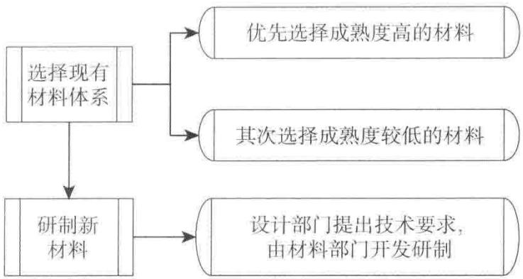

flowchart

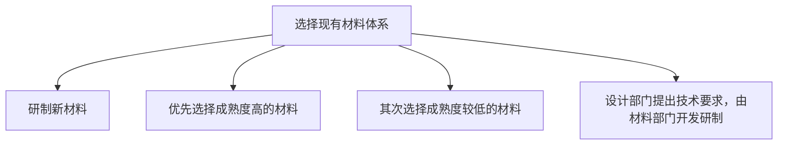
```mermaid
graph TD
    A["选择现有材料体系"] --> B["研制新材料"]
    A --> C["优先选择成熟度高的材料"]
    A --> D["其次选择成熟度较低的材料"]
    A --> E["设计部门提出技术要求，由材料部门开发研制"]
```

图2-9 选材途径

# 2.7 复合材料力学测试

# 2.7.1 复合材料测试技术

结构中的材料主要承受以下四种载荷：拉伸、压缩、剪切和弯曲。对于叶片复合材料结构件，通常采用积木式试验流程，如图 2-10 所示。

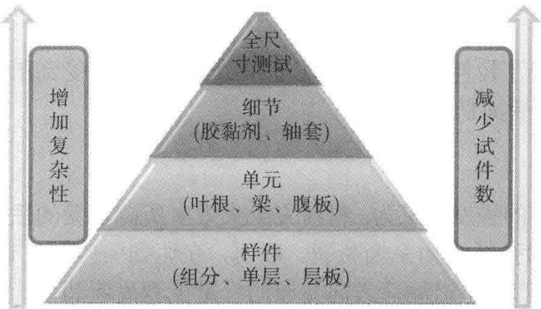

flowchart

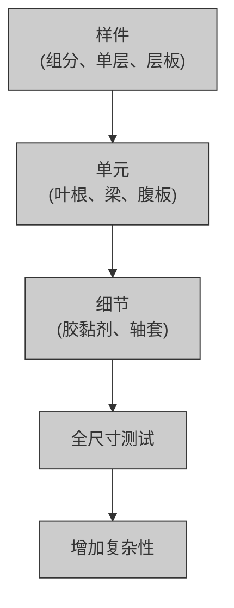
```mermaid
graph TD
    A["样件\n(组分、单层、层板)"] --> B["单元\n(叶根、梁、腹板)"]
    B --> C["细节\n(胶黏剂、轴套)"]
    C --> D["全尺寸测试"]
    D --> E["增加复杂性"]
    style A fill:#ccc,stroke:#333
    style B fill:#ccc,stroke:#333
    style C fill:#ccc,stroke:#333
    style D fill:#ccc,stroke:#333
    style E fill:#ccc,stroke:#333
```

图2-10 积木式试验流程

# 1. 拉伸

施加在复合材料上的拉伸载荷，复合材料在拉伸作用下的变形基本取决于增强纤维的拉伸强度和模量，这些性能远高于树脂体系本身的性能。图 2-11 给出材料拉伸和压缩的示意图。

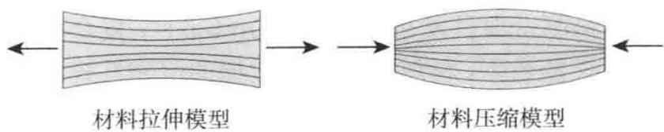

text_image

材料拉伸模型
材料压缩模型

图 2-11 材料拉伸和压缩模型

# 2. 压缩

复合材料承受压缩载荷时的状况，树脂在复合材料中的作用是保证纤维垂直排列并且防止纤维弯曲，纤维和树脂黏接以及树脂的模量对压缩强度有至关重要的影响。

# 3. 剪切

复合材料承受剪切载荷时的状况，剪切载荷会让纤维层间发生滑动，此时树脂在复合材料内传递载荷，因此树脂为主要影响因素。树脂具有良好的机械性能并且与增强纤维有良好的结合，才能保证复合材料具有较高的剪切性能。多层复合材料的这一性能常用层间剪切强度进行表征。图 2-12 给出材料剪切和弯曲的示意图。

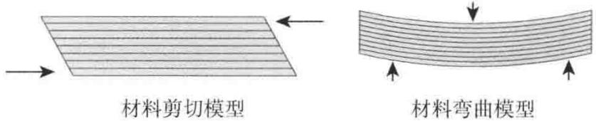

text_image

材料剪切模型
材料弯曲模型

图 2-12 材料剪切和弯曲模型

# 4. 弯曲

弯曲载荷结合了拉伸、压缩和剪切等作用力。上表面受到压缩，下表面受到拉伸，中间部分则承受剪切作用。

# 5. 应力与应变

多层复合材料的强度定义为: 材料完全失效时所能承受的载荷。这里的完全失效指的是树脂和增强纤维均完全断裂。然而, 在达到失效强度前的某一应力水平下, 树脂将开始从那些不沿载荷方向分布的纤维上剥离断裂, 裂纹进而扩展至全部树脂基体, 即所谓的 “横向裂纹”。虽然在此应力水平下材料不会完全失效, 但断裂已经发生; 设计时需要注意: 如果希望延长结构寿命, 在正常运行载荷下多层复合材料的应力不能超过此应力水平。通常树脂的化学性能和它与纤维表面胶黏剂的相容性决定了纤维/树脂的结合强度。环氧树脂具有优异的黏接性能, 这已得到大家的认可, 这种性能有助于多层复合材料获得更高的微裂纹应变。树脂的韧性比较难以测定, 但可以用最终失效应变进行表征。图 2-13 和图 2-14 分别给出了典型层合板及典型树脂的应变-应力曲线。

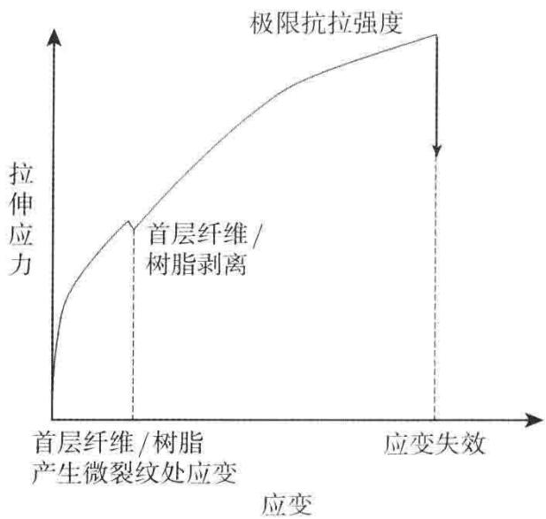

line

| 应变 | 拉伸应力 |
| ---- | -------- |
| 首层纤维 / 树脂产生微裂纹处应变 | 首层纤维 / 树脂剥离 |
| 应变失效 | 极限抗拉强度 |

图 2-13 典型层合板的应变-应力曲线

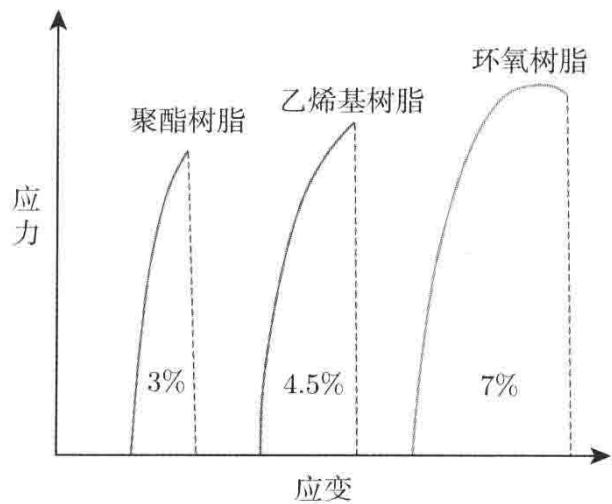

line

| 材料       | 应变   | 应力   |
| ---------- | ------ | ------ |
| 聚酯树脂   | 3%     | 3%     |
| 乙烯基树脂 | 4.5%   | 4.5%   |
| 环氧树脂   | 7%     | 7%     |

图 2-14 典型树脂的应变-应力曲线

需要注意的是，当复合材料承受拉伸载荷时，为了提高结构件的整体力学性能，树脂的变形量至少与纤维相当。图 2-15 给出了各种纤维自身的失效应变，从中可以看出，S-玻璃纤维的断裂伸长率为 5.3%，因此需要与断裂伸长率接近的树脂搭配才能获得最高的拉伸性能。

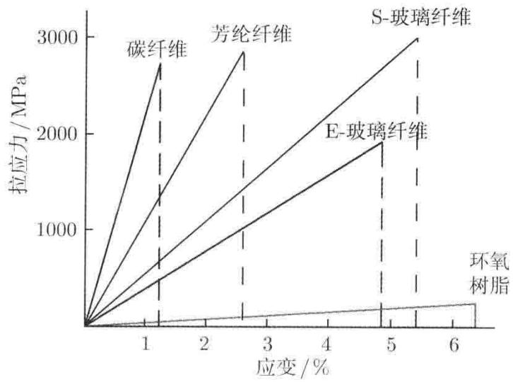

line

| 应变 / % | 碳纤维 (拉应力/MPa) | 芳纶纤维 (拉应力/MPa) | S-玻璃纤维 (拉应力/MPa) | E-玻璃纤维 (拉应力/MPa) | 环氧树脂 (拉应力/MPa) |
| -------- | ------------------- | --------------------- | ---------------------- | ---------------------- | --------------------- |
| 1        | 2800                | 2700                  | 1300                   | 600                    | 100                   |
| 5        | -                   | -                     | 2900                   | 1900                   | -                     |
| 6        | -                   | -                     | -                      | -                      | -                     |

图 2-15 典型纤维的失效应变

# 6. 材料抗疲劳性能测试

与大多数金属材料相比，复合材料表现出了更优异的抗疲劳性能。考虑到疲劳失效是微量损伤的不断累积，任何复合材料的疲劳行为都受到以下因素的影响：树脂韧性，抗微裂纹能力，孔隙率和制造过程中引入的其他缺陷。

由于高低温疲劳特性受环境等因素影响较大，疲劳测试不稳定。因此合理、高效地完成抗疲劳性能的测试是比较困难的。

# 2.7.2 复合材料测试流程

复合材料力学测试应按照一套标准的流程，包括试件准备、测试与数据后处理等过程[9]。

(1) 范围：简要介绍复合材料力学测试的基本假设和测试方法。  
(2) 参考标准: 复合材料力学测试相关的参考标准, 一般为 ISO 国际标准。  
(3) 测试准则：复合材料力学测试的基本要求。  
(4) 术语：复合材料力学测试相关的术语定义，包括模量、强度、坐标轴等。  
(5) 设备: 复合材料力学测试的仪器与设备, 包括基本设备、速度测试仪、加载设备、应变测试和测微仪等。  
(6) 试件尺寸: 复合材料力学测试的试件尺寸包括试件宽度、长度和厚度, 以及试件的铺层形式、倒角和斜角位与尺寸。同时, 试件尺寸还需要确定夹具的尺寸和位置。  
(7) 试件个数: 复合材料力学测试的最少试件个数, 为了保证测试结果的可靠性和置信度, 需要确定测试需要的最少试件个数。  
(8) 测试条件：测试标准下的材料测试条件。  
(9) 测试步骤: 图 2-16 给出复合材料的测试步骤。

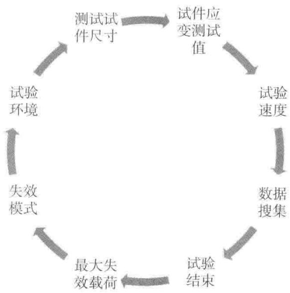

flowchart

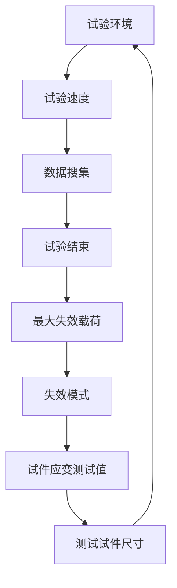
```mermaid
graph TD
    A["试验环境"] --> B["试验速度"]
    B --> C["数据搜集"]
    C --> D["试验结束"]
    D --> E["最大失效载荷"]
    E --> F["失效模式"]
    F --> G["试件应变测试值"]
    G --> H["测试试件尺寸"]
    H --> A
```

图2-16 测试步骤

纤维增强复合材料的力学理论和设计计算必须以充分准确的性能数据为前提，而复合材料的性能与其组成材料、纤维和基体的力学性能密切相关。

复合材料力学性能的试验测定，包括纤维力学性能测定、基体性能测定和单层板力学性能测定。单层板的力学性能包括拉伸试验、压缩试验、面内剪切试验、层间剪切试验、弯曲试验及诸如冲击韧性测试等其他试验。复合材料试验必须基于测试标准，复合材料的力学性能测试标准简介见表2-7。

表 2-7 复合材料力学测试

<table><tr><td>力学性能</td><td>测试标准</td><td>标准明细</td></tr><tr><td rowspan="2">拉伸性能</td><td>GB/T 1447—2005</td><td>纤维增强塑料拉伸性能试验方法</td></tr><tr><td>ISO 527—4—1997</td><td>塑料拉伸性能的测定第4部分:各向同性及各向异性纤维增强塑料复合材料的试验条件</td></tr><tr><td rowspan="2">压缩性能</td><td>GB/T 1448—2005</td><td>纤维增强塑料压缩性能试验方法</td></tr><tr><td>ISO 14126—1999</td><td>纤维增强塑料复合材料平面方向压缩性的测试</td></tr><tr><td>弯曲性能</td><td>ISO 178—2010</td><td>塑料弯曲性能测定</td></tr><tr><td>剪切性能</td><td>ISO 14129—1997</td><td>纤维增强塑料复合材料用 $\pm 45^{\circ}$ 张力试验法测定剪应力/应变</td></tr><tr><td rowspan="2">层间剪切</td><td>GB/T 1450.1—2005</td><td>纤维增强塑料层间剪切强度试验方法</td></tr><tr><td>ISO 14130—1997</td><td>纤维增强塑料复合材料用短梁法测定表面层间剪切强度</td></tr><tr><td>胶黏剂拉伸剪切(刚性-刚性)</td><td>GB/T 7124—2008</td><td>胶黏剂拉伸剪切强度的测试(刚性材料对刚性材料)</td></tr><tr><td>树脂拉伸</td><td>GB/T 2568—1995</td><td>树脂浇铸体拉伸性能试验方法</td></tr><tr><td>冲压式层间剪切</td><td>GB/T 1450.2—2005</td><td>纤维增强塑料冲压式层间剪切强度试验方法</td></tr><tr><td>冲击韧性测试</td><td>GB/T 1451—2005</td><td>纤维增强塑料简支梁式冲击韧性试验方法</td></tr></table>

# 2.8 叶片复合材料工艺性

复合材料叶片的工艺设计与生产对叶片性能和质量起关键作用，叶片生产过程中有一系列关键工序直接影响复合材料叶片性能的好坏。图 2-17 显示复合材料的关键工序包括材料试件试验、设计与分析、工艺制造、构件验证和全尺寸试验。

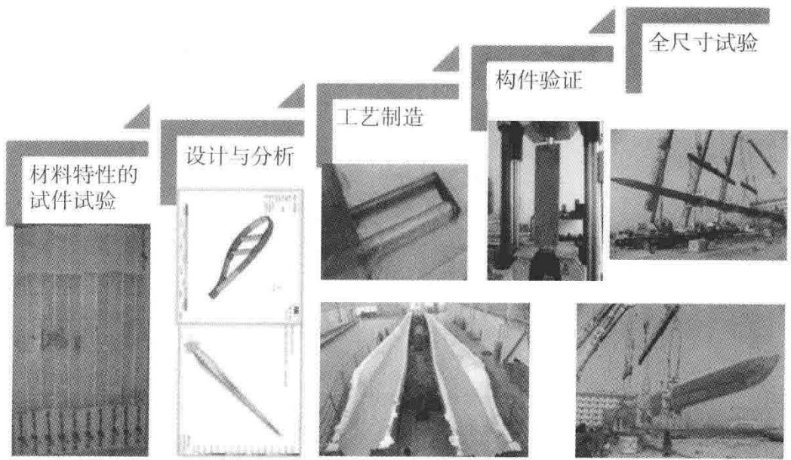

flowchart

```mermaid
graph LR
    A["材料特性的试件试验"] --> B["设计与分析"]
    B --> C["工艺制造"]
    C --> D["构件验证"]
    D --> E["全尺寸试验"]
```

图 2-17 复合材料叶片验证流程

表 2-8 给出叶片生产规程的关键点，指导叶片生产。

表 2-8 叶片生产规程的关键点 [10]

<table><tr><td>物理特性</td><td>关键点</td><td>过程控制/质量控制的意义</td><td>注意</td></tr><tr><td>表面喷漆的附着力</td><td>叶片表面准备</td><td>附着力测试适用于质量控制</td><td></td></tr><tr><td>树脂或者胶黏剂中的气泡</td><td>强度</td><td>湿法中的滚压固定;树脂灌输前检查模具的外壳;树脂和结构胶在混胶过程中不能有空气进入;使用可以脱气的夹芯材料</td><td>要允许夹芯在加热的时候可以放出气体</td></tr><tr><td>金属轴套的不良黏接</td><td>黏接强度</td><td>在黏接前用溶剂清理轴套;金属件涂漆</td><td></td></tr><tr><td>叶片根部静矩平衡的装备</td><td>风轮不平衡会引起振动和疲劳</td><td>在较轻的两支叶片上增加重量</td><td></td></tr><tr><td>材料冷凝</td><td>强度</td><td>如果车间的温度高于储存设备里面的温度可以避免冷凝;在合适的时候将材料带到车间去适应车间的温度进行使用</td><td>一个合适的运输工具是必须的,储存设备要与厂房分开</td></tr><tr><td>夹芯的正确铺设</td><td>层合板起皱和屈曲强度</td><td>颜色代号和外观检查</td><td>班组长或者质检部的人员要进行铺层的外观检测</td></tr><tr><td rowspan="3">树脂和结构胶的固化</td><td rowspan="3">强度叶片的永久变形收缩</td><td>控制使用期限和过程时间</td><td>由于在固化过程中树脂的放热影响,薄的和厚的层合板可能在固化时间上不一样</td></tr><tr><td>在过程中用温度仪或者温度传感器周期性地记录温度</td><td>如果将叶片过早地从模具中脱模,叶片会发生永久性变形</td></tr><tr><td>后固化过程中要进行巴氏硬度的检测;时间或硬度要求,确定离开模具后的固化条件;应指出是加热固化还是常温后固化;固化样件测试,如破坏</td><td></td></tr><tr><td rowspan="2">胶衣、树脂结构胶的老化</td><td rowspan="2">强度</td><td>设备中的温度、灰尘和阳光的控制</td><td>合理的储藏温度要与供应商明细表上的数据一致,这对预浸材料来说很重要</td></tr><tr><td>测量和控制温度和湿度数据</td><td>超标的灰尘可以避免通过将材料一直储存在相关的容器中,或者不用的时候封装起来</td></tr><tr><td>胶衣、树脂结构胶的老化</td><td>强度</td><td>材料的有效期限要很清楚地标示出来</td><td>未使用过的材料不要返回到器皿屋,除非有明确的流程来控制</td></tr><tr><td>层合板表面的干纤维</td><td>表面抛光</td><td>过程控制和铺层过程中的细节作业指导书</td><td>手糊聚酯 FRP 的通用性</td></tr><tr><td rowspan="3">增强纤维的粉尘和湿度</td><td rowspan="3">强度</td><td>仓库中储存的增强纤维的粉尘和湿度的控制测量和控制温度和湿度的值</td><td>纤维要很好的储存,要在温度高于车间温度 2°C的情况下储存</td></tr><tr><td>模具的温度测量</td><td>模具中日常温度的变化要在±3°C内</td></tr><tr><td>环境的温度和湿度测量</td><td>车间的湿度要低于80%</td></tr><tr><td>叶根平面度</td><td>对叶根连接螺栓的疲劳有冲击</td><td>叶根的磨损</td><td></td></tr><tr><td>胶黏剂裂纹</td><td>黏接强度</td><td>胶黏剂和部件连接的胶量控制叶片结构胶后固化的热变形检查</td><td></td></tr><tr><td>胶衣鼓包</td><td>噪声和空气动力学特性</td><td>控制树脂的混合比例</td><td>树脂的不完全聚合反应会引起胶衣的鼓包,主要是因为催化剂太少或者固化剂的不正确混合</td></tr><tr><td>胶衣厚度</td><td>耐腐蚀性和强度</td><td>碾压过程的厚度特殊梳理控制</td><td>胶衣的厚度一定要在0.3~0.6mm</td></tr><tr><td>层合板的黏接</td><td>黏接强度</td><td>胶衣在覆盖层合板前的过程时间控制使用一层薄的增强纤维脱胶的敲击测试</td><td>表层胶衣应用12h内,湿的层合板要应用到模具上</td></tr><tr><td>不牢固的黏接</td><td>噪声</td><td></td><td></td></tr><tr><td>胶黏剂和树脂的混合</td><td>黏接强度</td><td>使用标准的自动混胶机对胶黏剂树脂和树脂固化剂定义的混胶的比例</td><td>固化强度对环氧树脂的混合比要比对聚酯的混合比敏感</td></tr><tr><td>叶片表面的小针孔</td><td>噪声和空气动力学特性</td><td>固化中的真空压力的控制</td><td>用底漆或者填充剂来填满小孔表面设计完毕胶衣可以被使用</td></tr><tr><td>合模后叶片的吸力面和压力面的错位</td><td>空气动力学</td><td>合模原理防止这个缺陷</td><td>模具的定位系统</td></tr><tr><td>层合板的维修</td><td>强度</td><td>尾缘处逐渐变薄的维修</td><td></td></tr><tr><td>对湿度敏感的材料的密封</td><td>由于湿度、菌类和腐蚀引起的材料老化</td><td>密封和喷漆</td><td>木制品表面,机械切边层合板的边缘,接闪器附近的夹芯材料可能比较危险表面密封,需要胶衣增强纤维</td></tr><tr><td>黏接的表面处理</td><td>黏接强度</td><td>纤维剥落的磨损胶接零部件的正常充分的固化</td><td>打磨表面是必要的,以防层压过程被中断</td></tr><tr><td>摆振角度是叶根端面和叶根中心与叶片质心连线之间的夹角</td><td>叶片设置,改变风轮不平衡</td><td></td><td></td></tr><tr><td>挥舞角度是叶根端面和叶根中心与叶尖中心连线的夹角</td><td>对于风力机来说,如果叶尖与塔架的距离比较危险,精确的公差还是需要的</td><td></td><td></td></tr><tr><td>胶接的厚度</td><td>黏接强度</td><td>应用结构胶前的胶黏剂厚度的测量应用厚度控制添加剂</td><td>胶厚可以通过黏接膜来控制</td></tr><tr><td>叶片外部的尾缘厚度</td><td>噪声</td><td>后续层合板,胶接和胶衣的修补引起的磨损</td><td>磨损能破坏叶片</td></tr><tr><td>结构胶过多</td><td>叶片总重</td><td>叶片最终重量的测量</td><td></td></tr><tr><td>叶片扭角</td><td>风轮的空气动力学</td><td>每套风轮叶片要用同一个模具制造</td><td></td></tr><tr><td rowspan="2">层合板的褶皱</td><td rowspan="2">层合板强度</td><td>铺设过程中的铺层展宽用夹子固定铺层</td><td>当模具表面不平整时,展向宽度会不随形的</td></tr><tr><td></td><td>班组长或者质检部人员要进行铺层的外观检测</td></tr><tr><td>材料的错误组合</td><td>强度</td><td>生产过程需要的材料要被内部存档和控制所需材料的用量和条件,应与制造过程中对比验证</td><td>如果生产过程中材料不足,则会发生材料组合不受控制</td></tr></table>

# 第3章 结构设计基础

叶片的外形、载荷、材料、设计准则及与轮毂轴承的接口，都是制约叶片结构设计及构型选型的主要因素，同时，由于叶片结构设计需考虑工艺的可操作性和便捷性，还受到工艺设计的影响。

# 3.1 设计基准

叶片的结构设计，主要是构件设计与构型设计，包括主梁、尾缘梁、腹板等主要结构件设计及运输加强层、配重腔等功能件设计。风力机叶片通常采用升力型翼型形状和流线型气动外形布局，在其复杂的运行环境中，风力机叶片的载荷工况纷繁复杂。根据风力机叶片特殊的受力特性，结构设计人员需要设计出既满足叶片强度、刚度等力学特性要求，又方便工艺操作与生产制造的叶片。图 3-1 表明叶片结构设计应考虑翼型形状、载荷特性、受力形式与构型设计四个设计基准。

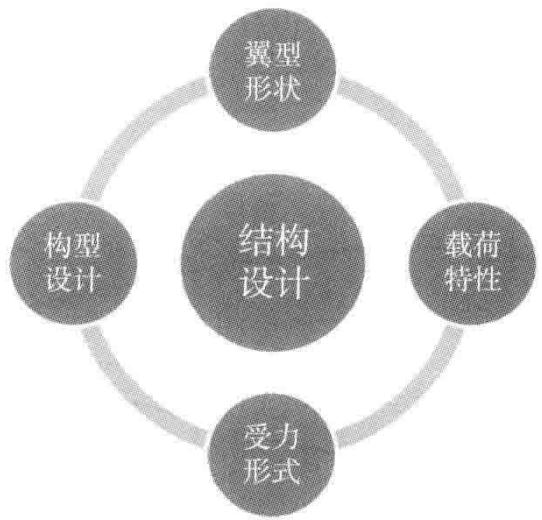

flowchart

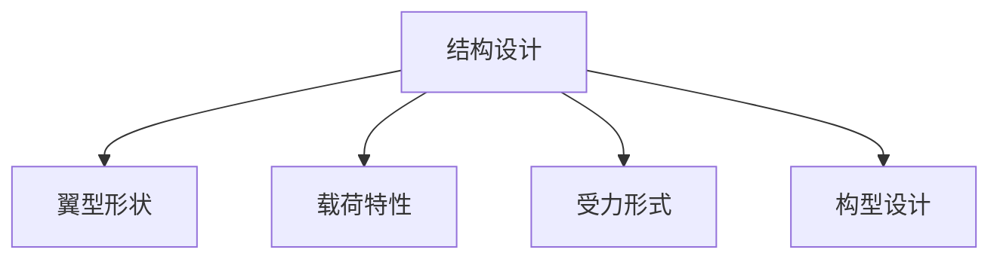
```mermaid
graph TD
    A["结构设计"] --> B["翼型形状"]
    A --> C["载荷特性"]
    A --> D["受力形式"]
    A --> E["构型设计"]
```

图 3-1 叶片结构设计

根据风力机叶片的翼型形状、载荷特性和受力形式，对叶片的主要承力构件及其他功能件进行构型设计，充分考虑其尺寸和公差要求。

# 3.1.1 翼型形状

风力机叶片的气动外形主要决定于翼型形状，翼型厚度沿叶片展向由叶根至叶尖，由厚变薄，由圆形截面平顺过渡为流线型的翼型形状，形成一套翼型族，如图 3-2 所示。

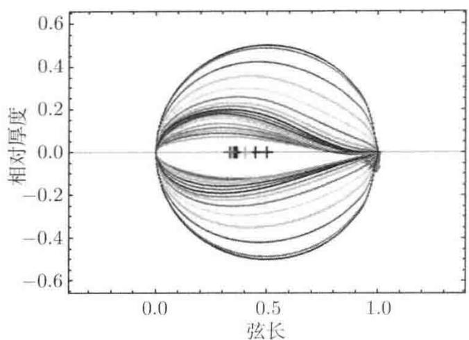

other

| 弦长 | 相对厚度 |
|------|----------|
| 0.0  | 0.0      |
| 0.5  | 0.0      |
| 1.0  | 0.0      |

(a) 叶片外形分布

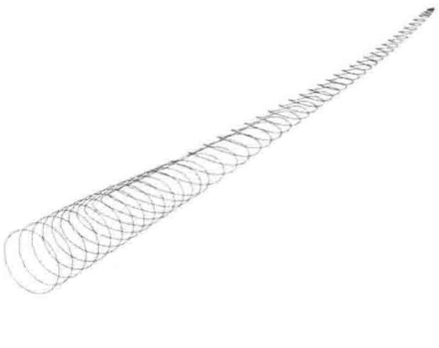

natural_image

Pure geometric spiral line drawing without any text, numbers, or symbols

(b) 翼型三维布局   
图 3-2 叶片翼型族

考虑到翼型对粗糙度的敏感性、叶片尾缘处能够有良好的结构特性以及叶片的气动性能等方面，在翼型设计过程中，对翼型上表面厚度、前缘半径、尾缘区域的厚度等都进行了限制。翼型气动性能的要求，使得叶片结构设计与工艺设计过程中必须考虑铺层的可随形性，以保证叶片的气动外形的准确。

翼型形状有其自身的特殊性，翼型坐标系下翼型弦向 $X_{A}$ 的长度远大于翼型的高度 $Y_{A}$ ，同时叶片的弦向和厚度方向的受载形式不同，如图 3-3 所示，故叶片截面翼型的弦向和厚度方向的结构铺层设计要求不同。

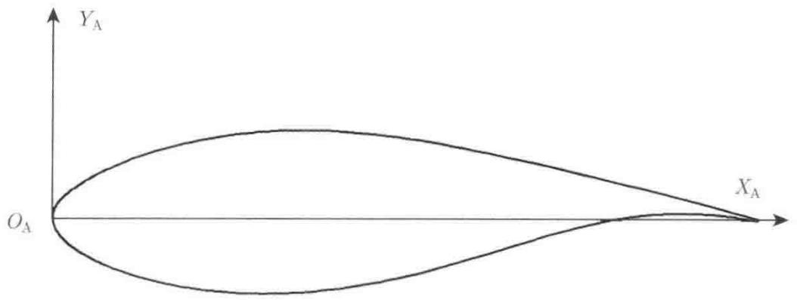

text_image

Y_A
O_A
X_A

图3-3 翼型坐标系

叶片迎风面与背风面沿叶片弦向是不对称的，同时叶片在运行过程中，绝大多数载荷工况下叶片的迎风面受拉，背风面受压。结合玻纤-环氧等复合材料的受力特性，即材料纤维方向的压缩性能一般略低于拉伸性能。因此，叶片的结构铺层设计在叶片的迎风面与背风面不一定是对称的，要综合考虑叶片截面形状、材料属性和受力特性来确定叶片结构的复合材料铺层设计。

# 3.1.2 载荷特性

载荷是叶片结构设计的依据，载荷的分析计算是风力机各部件设计过程中的关键和基础性工作之一。载荷分析的目的是通过合理的评估和计算方法，提供相对完整、准确的设计载荷数据。载荷分析不准确，可能会导致结构强度设计问题，而过于保守的载荷分析，往往会使风力机的总体设计成本大幅度增加[10]。

# 1. 载荷类型

极端载荷作用于风力机主要表现为风载，风力机由很多细长单元组成，如叶片和塔架，会产生惯性载荷。同时，运行中的离心力、科里奥利力和陀螺力产生的载荷都应考虑。风力机载荷分类有：

(1) 叶片空气动力载荷;   
(2) 风轮叶片重力载荷;   
(3) 由于旋转产生的离心力和科里奥利力；

(4) 偏航陀螺载荷；

(5) 塔架和机舱气动阻力；

(6) 塔架和机舱的重力载荷。

风轮叶片的重力载荷产生叶片摆振方向的弯曲力矩。对于变桨控制风力机，重力载荷同样会产生挥舞方向的弯曲力矩。由于叶片旋转，叶片重力载荷效应周期性改变弯曲力矩。风轮直径越大，重力载荷效应越强[11]，其载荷作用类型见表3-1。

表 3-1 载荷作用类型

<table><tr><td></td><td>静态载荷</td><td colspan="3">循环载荷</td><td colspan="3">冲击载荷和随机载荷</td></tr><tr><td>气动载荷</td><td>平均风速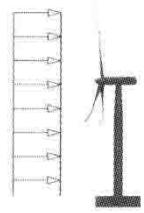</td><td>气动不平衡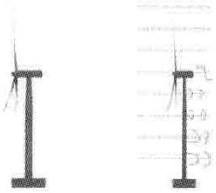</td><td>塔坝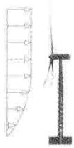</td><td>平均风剪切</td><td>斜风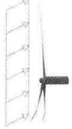</td><td>阵风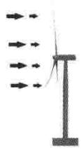</td><td>湍流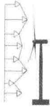</td></tr><tr><td>惯性载荷</td><td>离心力/重力</td><td>叶片重力</td><td>质量不平衡</td><td>停机</td><td colspan="3">陀螺力</td></tr></table>

# 1) 空气动力载荷

空气动力载荷是指由于空气的流动及其与风力机组动静部件相互作用所产生的载荷。此类载荷是风力机组的主要外部载荷之一，取决于作用于风轮的风况条件、风力发电机组气动特性、结构特性和运行条件等因素。

风速 $V_{0}$ 垂直于风轮旋转平面，即来流风速。当风流穿过风轮平面，由于轴线干扰，风速由 $V_{0}$ 衰减为 $\alpha V_{0}$ 。距叶根为 r，沿风轮轴线的叶片元素，在风轮旋转角速度 $\omega$ 下的风轮平面内的运动速度为 $\omega r$ 。当风穿过风轮平面且与风轮运动相互作用，引入切向流风速 $\alpha^{\prime}\omega r$ ，风轮叶片相关于来流风速参见图 3-4。

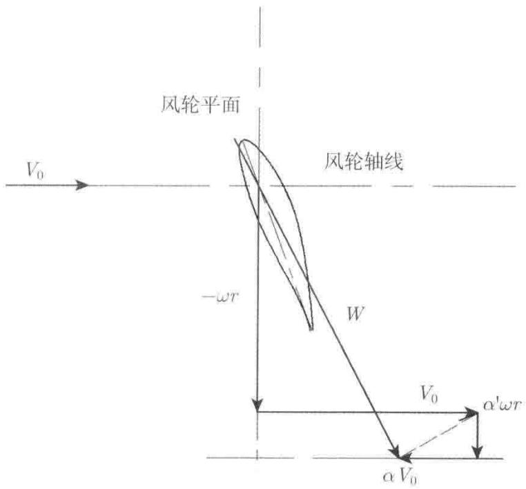

text_image

风轮平面
风轮轴线
-V₀
-W
-V₀
α'ωr
αV₀

图 3-4 叶片剖面的速度图

根据合速度 W，这种相关风速的结果产生叶片的空气动力，如升力：

$$
F _ {\mathrm{L}} = \frac {1}{2} C _ {\mathrm{L}} \rho c W ^ {2} \tag {3-1}
$$

及阻力：

$$
F _ {\mathrm{D}} = \frac {1}{2} C _ {\mathrm{D}} \rho c W ^ {2} \tag {3-2}
$$

其中， $C_{L}$ 和 $C_{D}$ 为升力和阻力系数； $\rho$ 为空气密度；c 为叶片剖面弦长。

# 2) 惯性和重力载荷

惯性和重力载荷是指由重力、振动、旋转以及地震等引起的静态和动态载荷。风轮惯性和重力载荷都是依于质量的载荷。横截面离心力 $F_{c}$ 依于风轮角速度、半径和叶片单元的质量。叶根处的离心力：

$$
F _ {\mathrm{c}} = \sum_ {i = 1} ^ {n} m _ {i} r _ {i} \omega^ {2} \tag {3-3}
$$

其中， $m_{i}$ 为第 i 个叶片单元的质量； $\omega$ 为风轮角速度； $r_{i}$ 为第 i 个叶片单元的半

径；叶片离散为 n 个单元。重力简化为

$$
F _ {g} = \sum_ {i = 1} ^ {n} m _ {i} g \text {或} F _ {g} = m _ {\mathrm{blade}} g \tag {3-4}
$$

其中， $g$ 为重力加速度； $m_{i}$ 为第 $i$ 段叶片单元质量； $m_{\mathrm{blade}}$ 为叶片总质量。

风轮陀螺载荷依于风轮的弹性支撑。特别地，当风机在运行中偏航时将产生陀螺载荷。任何结构弹性下都会发生，且将引起风轮旋转平面的沿垂直轴的偏航力矩 $M_{K}$ 和沿水平轴的倾斜力矩 $M_{G}$ 。

三叶片风轮由陀螺载荷效应引起的偏航力矩为 0，即 $M_{K}=0$ ；但产生非零常值的倾斜力矩 $M_{G}$ ，且 $M_{G}=3M_{0}/2$ ，则

$$
M _ {0} = 2 \omega_ {\mathrm{K}} \omega \sum_ {i = 1} ^ {n} m _ {i} r _ {i} ^ {2} \tag {3-5}
$$

其中， $\omega$ 为风轮角速度； $\omega_{\mathrm{K}}$ 为偏航角速度。

二叶片风轮，陀螺载荷效应将导致周期偏航力矩和周期倾斜力矩。

$$
M _ {\mathrm{K}} = 2 M _ {0} \cos \omega t \sin \omega t \tag {3-6}
$$

$$
M _ {\mathrm{G}} = 2 M _ {0} \cos^ {2} \omega t \tag {3-7}
$$

很多时候，忽略陀螺效应，因为偏航系统的角速度非常小。然而，弹性风轮-轴承支撑会引起很大的陀螺力（风轮旋转），对于兆瓦级风机不能忽略陀螺力。

# 3) 功能载荷

当风机遭受瞬态运行条件下，如刹车和偏航，或联网电机，将产生功能载荷。许多重要的功能载荷可分类如下：

(1) 机械刹车载荷和气动刹车载荷；  
(2) 传递系统的瞬态载荷，由电机产生；  
(3) 偏航载荷；  
(4) 叶片变桨或气动刹车产生的载荷。

# 4) 其他载荷

其他载荷或效应，如以下因素诱导产生：塔影、塔架脱涡、阻尼、挥舞和摆振不稳定的振动，或由于负空气阻力导致振型激荡。

若风机结构安装在海上，同时要考虑海上环境下的载荷，如波浪载荷、涌流载荷、冰载。

# 2. 载荷计算

风力机载荷计算一般通过气弹计算方法完成，风机气弹分析即解决运动方程。通常，这种方法应用几何非线性有限单元法或修正模型分析法。总之，应包括复杂力学结构，同时能建立在确定和随机力作用下的模型。运动方程为

$$
M \ddot {x} + C \dot {x} + K x = F \tag {3-8}
$$

其中，M 为质量矩阵；C 为阻尼矩阵；K 为刚度矩阵；F 为矢量外力，随时间变化；x 为偏移和旋转的矢量未知数。

图 3-5 表明应用有限元模型表征风力机结构，气弹模型的载荷计算用于设计风力机结构组件，多数组件同时承受极限载荷和疲劳载荷。

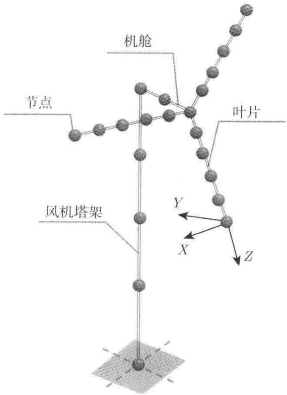

text_image

机舱
节点
叶片
风机塔架
Y
X
Z

图 3-5 有限元模型表征风力机结构

# 1) 气动模型

气动涉及空气运动和由物体相对于空气运动的作用力，气动理论可用于定量预测空气流过风轮产生的力，翼型气动力和合力分布如图 3-6 所示。失速控制型风力机，在高风速运行时会发生大范围的流动分离。当叶片失速时，采用失速控制策略，通过衰减升力控制风力机的输出功率，从而限制功率产出和载荷。由于变量较多，全三维流动作用于风轮，是极复杂与不稳定的气流，包括风速、风剪切、大气湍流、偏航角、选择速度、风轮直径、风轮叶片全局设计（扭角、锥化、厚度分布）、翼型特性（厚度、弯度、表面平顺、前缘厚度、粗糙敏感、钝/尖尾缘）。

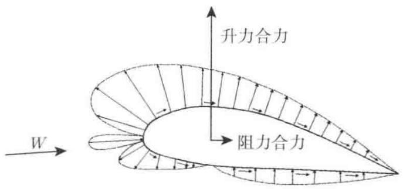

text_image

升力合力
阻力合力
W

图 3-6 翼型气动力和合力分布

目前，叶片载荷中主要应用叶素动量理论计算气动力，通过动量平衡计算叶素外力。

首先考虑二维剖面流动模型，二维流动视为平面，其面外速度为 0。为了得到二维流动面，从叶片整体中提取有限长度微段。对于真实叶片形式，其形状、扭转和剖面随其跨距变化。叶片由轮毂处算起，至叶尖结束。然而，对于细长型叶片，沿展向的速度相比沿气流方向的速度分量小。合力 F 由压力和摩擦力积分得到，合力 F 的分量 $F_{L}$ 垂直于来流速度 W，分量 $F_{D}$ 平行于该方向。其中， $F_{L}$ 为升力， $F_{D}$ 为阻力， $F_{L}$ 和 $F_{D}$ 都依于来流角度 $\alpha$ 。

失速是一种非线性现象，导致附面流的急剧损失，而达到有限入流角 $\alpha_{stall}$ 下的翼型升力。失速角 $\alpha_{stall}$ 有时是任意的。

图 3-7 中图示 2D 流动剖面的升力和阻力，其升力系数 $C_{L}$ 和阻力系数 $C_{D}$ :

$$
C _ {\mathrm{L}} = \frac {F _ {\mathrm{L}}}{\frac {1}{2} \rho W ^ {2} c} \tag {3-9}
$$

$$
C _ {\mathrm{D}} = \frac {F _ {\mathrm{D}}}{\frac {1}{2} \rho W ^ {2} c}
$$

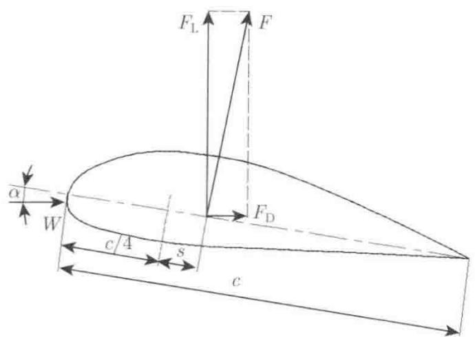

text_image

F_L
F
α
W
c/4
s
c
F_D

图 3-7 2D 流动剖面的升力和阻力

$C_{L}$ 和 $C_{D}$ 是入流角 $\alpha$ 、翼型形状、雷诺数 Re 的函数。其中， $Re = cW/\nu$ ， $\nu$ 为运动黏度。随着 $\alpha$ 升到失速角 $\alpha_{stall}$ ， $C_{L}$ 线性增加；再增大 $\alpha$ ， $C_{L}$ 达到最大值；随着 $\alpha$ 继续增大， $C_{L}$ 开始衰减。对于小 $\alpha$ 下， $C_{D}$ 基本为常值，但在失速后快速增大。失速现象密切相关于翼型上表面的边界层分离，剖面失速依于剖面几何，将剖面结合尖状前缘，如前缘局部高曲率，相比较原翼型，易于发生突然的失速，这也是边界层分离形式不同的结果。

图 3-8 是 $C_{L}$ 和 $C_{D}$ 相关于 $\alpha$ 的例子。在失速前，通过二维流动状态计算，CFD 考虑三维效应修正，计算失速区域的 $C_{L}/C_{D}$ ，而在失速后，测试方法用于得到 $C_{L}$ 、 $C_{D}$ 。另外，Viterna 和 Corrigan 的方法用于预测，此方法假设风轮的扭角为 0，当假设不满足时应修正。通过这种方法，在入流角 $\alpha = 90^{\circ}$ 时，最大阻力系数为

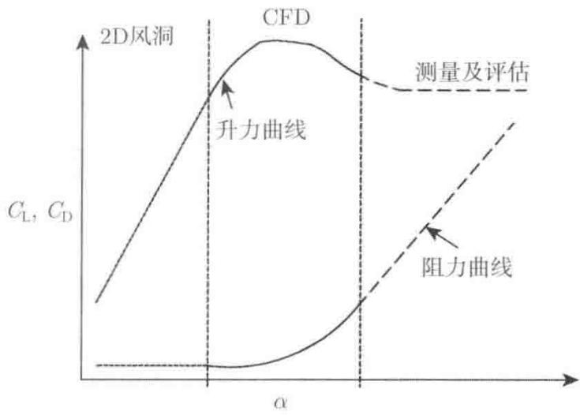

line

| α    | 2D风洞 (CL, CD) | 测量及评估 (CL, CD) |
|------|------------------|---------------------|
| 0    | Low              | Low                 |
| >0   | Peak             | High                |

图 3-8 翼型升力和阻力曲线

$$
C _ {\mathrm{D,max}} = 1. 1 1 + 0. 0 1 8 \mathrm{AR} \tag {3-10}
$$

AR 为方向比，AR 定义为叶片长度/弦长。失速后的阻力系数：

$$
C _ {\mathrm{D}} = B _ {1} \sin^ {2} \alpha + B _ {2} \cos \alpha , \quad 1 5 ^ {\circ} \leqslant \alpha \leqslant 9 0 ^ {\circ} \tag {3-11}
$$

其中， $B_{1}=C_{D,\max}$ ; $B_{2}=(1/\cos\alpha_{s})(C_{Ds}-C_{D,\max}\sin^{2}\alpha_{s})$ ; $\alpha_{s}$ 为开始失速的入流角（通常为 $15^{\circ}$ ); $C_{Ds}$ 为开始失速的阻力系数。升力系数为

$$
C _ {\mathrm{L}} = A _ {1} \sin^ {2} \alpha + A _ {2} (\cos^ {2} \alpha / \sin \alpha), \quad 1 5 ^ {\circ} \leqslant \alpha \leqslant 9 0 ^ {\circ} \tag {3-12}
$$

其中， $A_{1}=B_{1}/2$ ; $A_{2}=(C_{\mathrm{Ls}}-C_{\mathrm{D,max}}\sin\alpha_{\mathrm{s}}\cos\alpha_{\mathrm{s}})(\sin\alpha_{\mathrm{s}}/\cos^{2}\alpha_{\mathrm{s}})$ ; $C_{Ls}$ 为开始失速时的升力系数。

数学方式描述，风轮视为圆盘，通过降低风速来吸收能量，图 3-9 给出风速和圆盘压力条件。

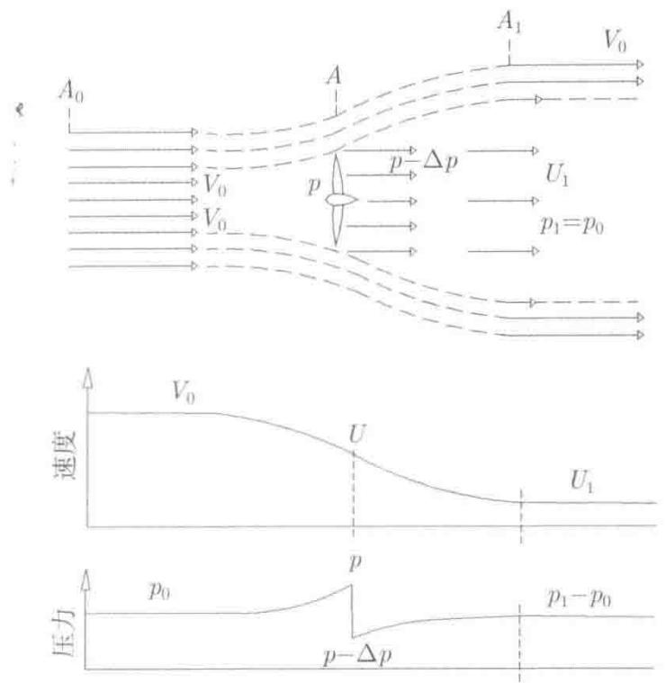

text_image

A₀
V₀
V₀
p
Δp
U₁
p₁=p₀
A
V₀
U
U₁
速度
V₀
压力
p₀
p
p-Δp
p₁-p₀

图 3-9 风力机风速和空气压力影响

# 2) 结构模型

叶片结构近似梁模型，可应用梁理论。考虑叶片剖面，弹性轴垂直于剖面且与剖面相交于一点，该点的法向力不会产生弯曲。考虑剪切中心，即面内作用力不会使剖面旋转。面内的两个主惯性轴相互垂直，主惯性轴为任何弯曲力矩作用在任意轴上，只会发生绕该轴的弯曲，如图3-10所示。参考 $X'$ 轴和主轴X的夹角 $\alpha$ 为

$$
\alpha = \frac {1}{2} \arctan \frac {2 [ E D _ {X ^ {\prime} Y ^ {\prime}} ]}{[ E I _ {Y ^ {\prime}} ] - [ E I _ {X ^ {\prime}} ]} \tag {3-13}
$$

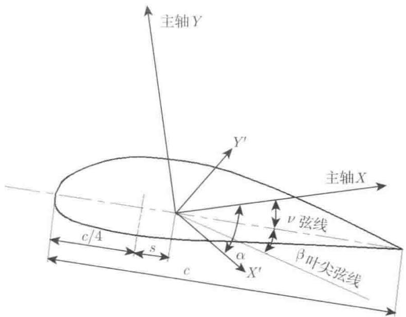

text_image

主轴Y
Y'
主轴X
c/4 s
c
α X'
β叶尖弦线
ν弦线

图 3-10 叶片主轴、弦长、叶尖剖面弦长和角度

其中， $[ED_{X^{\prime}Y^{\prime}}]=\int_{A}EX^{\prime}Y^{\prime}dA$ 为惯性力矩偏差； $[EI_{X^{\prime}}]=\int_{A}EX^{\prime2}dA$ 和 $[EI_{Y^{\prime}}]=\int_{A}EY^{\prime2}dA$ 为参考轴 $X^{\prime}$ 和 $Y^{\prime}$ 的弯曲刚度；主轴的弯曲刚度为

$$
\left[ E I _ {X} \right] = \left[ E I _ {X ^ {\prime}} \right] - \left[ E D _ {X ^ {\prime} Y ^ {\prime}} \right] \tan \alpha \tag {3-14}
$$

$$
\left[ E I _ {Y} \right] = \left[ E I _ {Y ^ {\prime}} \right] - \left[ E D _ {X ^ {\prime} Y ^ {\prime}} \right] \tan \alpha
$$

结构模型的建模和分析，一定要注意振动现象，这可能由扭转、挥舞耦合的。低阶扭转、挥舞频率及高叶尖速比将引起振动，振动将引发叶片损坏。

# 3) 控制系统建模

控制系统保证风机运行参数在特定标准极限内，如控制风机载荷在极限载荷内。对于变桨控制风机，速度也是变化的，描述变桨风机的控制系统，其机械效应为

$$
P = \frac {1}{2} \rho A u ^ {3} C _ {P} (\beta , \lambda) \tag {3-15}
$$

其中， $\rho$ 为空气密度；A 为风轮面积；u 为风速； $C_{P}$ 为风轮效率，是桨距角 $\beta$ 和叶尖速比 $\lambda$ 的函数。 $\lambda = \omega_{R} R / u$ 。

# 3. 载荷分析

风力发电机组的最大极限状态是指可能损害结构或部件的极端载荷状况，相应的结构极限状态分析一般涉及以下几方面：

(1) 极限强度分析;   
(2) 疲劳失效分析;  
(3) 结构稳定性分析;  
(4) 刚度及临界挠度分析；  
(5) 动力学分析。

一般而言，风力发电机组的总体结构需满足极限载荷和循环疲劳载荷的强度，并满足一定的刚度要求。保证风力发电机组的安全是极限状态条件设计需要解决的主要问题，针对极限状态分析中的载荷波动、材料不确定性、分析方法不确定性以及结构部件重要性等因素的影响，需要考虑相应的设计方法问题，增加必要的设计冗余。

叶片结构强度设计应基于叶片极限包络载荷下的各工况的极限载荷，每一组极限载荷都是基于叶片截面挥舞摆振坐标系的三向力和三向力矩。除特殊极少数极限载荷工况外，绝大多数的极限载荷工况下的挥舞弯矩最大，因此叶片的结构铺层设计应有较大的构件承受挥舞弯矩的作用。风力机叶片的极限载荷坐标系为挥舞摆振坐标系，如图3-11所示，其力与力矩形式为：挥舞弯矩 $M_{f}$ 和摆振弯矩 $M_{e}$ ，挥舞力 $F_{f}$ 和摆振力 $F_{e}$ ，离心力 $F_{z}$ 和扭矩 $M_{z}$ 。

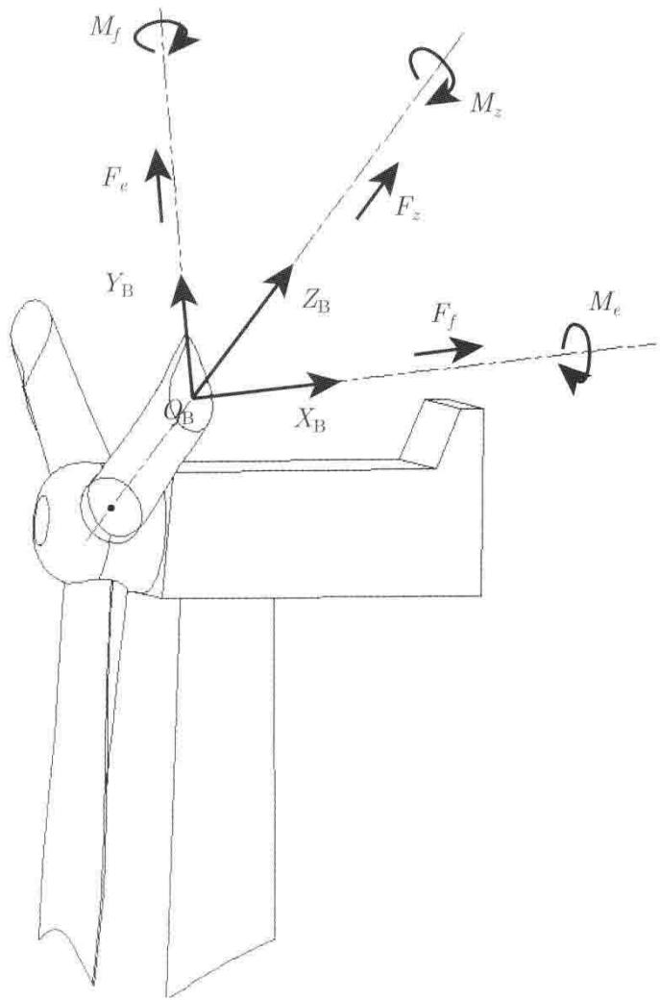

text_image

Mf
Fe
YB
QB
XB
ZB
Fz
Mz
Ff
Me

图 3-11 叶片截面挥舞摆振坐标系

疲劳载荷是周期载荷，会引起结构件材料的累积损伤，等效结构失效。失效体现初始裂纹和裂纹扩展，直至裂纹开始不稳定且迅速扩展。更多的关于风力机疲劳载荷及叶片疲劳分析详见本书第16章。

# 3.1.3 受力形式

风力机叶片应该确定合理的结构以防止在受载时失稳或局部变形，因此应该根据风力机的受力特性，选择合理的结构布局形式。图 3-12 显示叶片的受力形式，包括挥舞弯矩与剪力、摆振弯矩与剪力、扭矩和离心力的共同作用。

叶片最大的挥舞弯矩表现为挥舞摆振坐标系下正挥舞弯矩和负挥舞弯矩，主要作用于叶片截面厚度方向的最高段附近，在正挥舞弯矩作用下，叶片迎风面主梁受拉，背风面主梁受压。

叶片摆振方向的弯矩同样为挥舞摆振坐标系下正摆振力矩和负摆振力矩，主要作用于叶片前缘和尾缘段。同时由于叶片迎风面和背风面壳体采用胶接工艺黏接，因此叶片摆振方向除需要抵抗弯矩作用外，还需要保证胶层胶接特性，并且应

避免叶片振动引起气动弹性效应。

叶片挥舞方向和摆振方向的剪力作用于叶片壳体表面，通过壳体与壳体迎风面、背风面的支撑结构的胶接段传递给叶片支撑结构，即腹板。因此叶片腹板需承载叶片大部分的剪力，其他部分由叶片蒙皮承担且传递至叶根。

叶片作为旋转结构，叶根与轮毂通过螺栓连接，作用在叶片表面上的载荷通过叶片蒙皮、主梁、腹板等构件传递到叶根加强层，再通过叶根连接螺栓传到轮毂上，同时螺栓要承受叶片旋转引起的离心力，因此叶根的载荷最大。叶片上的载荷通过根端结构的剪切作用、挤压作用或玻璃钢与金属的胶接作用传递到轮毂上，而玻璃钢的这些强度均低于其拉弯强度，因而叶片的根端是危险的部位，设计时应予以特别重视。大型风力机玻璃钢叶片根端形式主要有：金属法兰、预埋金属杆、预埋螺栓套、T型螺栓等连接方式。为确保根端结构的安全可靠，需进行叶根螺栓与玻璃钢壳体结合强度的模拟试验。

叶片截面采用的是多闭室的结构，且叶片腹板与叶片壳体形成叶片多闭室剖面结构。多闭室剖面结构用于承担叶片剪力流和扭矩。

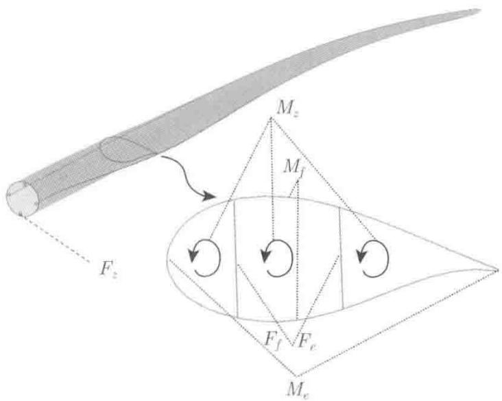

text_image

Fz
Mz
Mf
Ff
Fe
Me

图 3-12 叶片截面受力形式

# 3.2 构型设计

叶片剖面结构形式的设计是叶片结构设计的重要环节，它的好坏对叶片结构性能影响很大。风力机叶片结构形式复杂，叶片剖面基本上采用蒙皮、主梁与腹板的构造形式。主梁与腹板结构有箱型形式、双槽钢形式或D形等（详述于本书第5章），叶片结构剖面形式如图3-13所示。结合本书上一章节介绍的受力形式，叶片蒙皮的主要功能是提供叶片的气动外形，同时承担部分弯曲载荷和剪切载荷，因此叶片蒙皮可选用双向或三向玻纤织物。叶片主梁为主要承力结构，承载叶片的大部分弯曲载荷，叶片主梁的结构形式需要满足强度和刚度特性，因此主梁可选用单向玻纤织物。叶片主梁两侧到前缘梁和尾缘梁之间采用夹层结构，芯材材料可采用PVC泡沫或Balsa木，这些芯材有较高的剪切模量，组成的夹层结构有良好的刚度特性，以提高前缘和尾缘空腹结构的抗屈曲失稳能力。这种叶片的结构既可以满足叶片的受力特性，减轻叶片重量，又可以提高叶片的强度与刚度，避免叶片由弯曲产生的局部失稳。

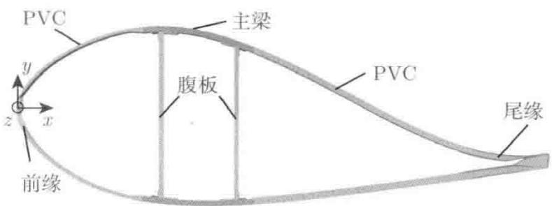

text_image

PVC
主梁
y
x
z
前缘
腹板
PVC
尾缘

图 3-13 叶片结构形式

叶片结构构型设计见表 3-2。

表 3-2 叶片结构构型设计

<table><tr><td>序号</td><td>构件</td><td>载荷</td><td>构型</td><td>组合</td><td>作用</td><td>选材</td><td>索引</td></tr><tr><td>1</td><td>主梁</td><td> $M_f$ </td><td>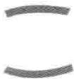</td><td>-</td><td>承受挥舞弯矩</td><td>单向织物层合板</td><td>本书4.1节</td></tr><tr><td>2</td><td>腹板</td><td> $F_{f}/F_{c}$ </td><td>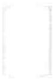</td><td>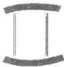</td><td>承受剪力</td><td>双轴织物夹层结构</td><td>本书4.2节</td></tr><tr><td>3</td><td>蒙皮</td><td> $F_{f}/F_{c}/M_{s}$ </td><td>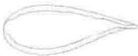</td><td>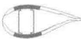</td><td>传递剪力/闭室抗扭/抗冲击</td><td>三轴织物双轴织物</td><td>本书4.3节</td></tr><tr><td>4</td><td>夹芯结构</td><td>-</td><td>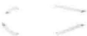</td><td>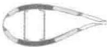</td><td>抗屈曲</td><td>硬质芯材软质芯材</td><td>本书4.4节</td></tr><tr><td>5</td><td>前缘梁</td><td> $M_e$ </td><td rowspan="2">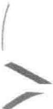</td><td rowspan="2">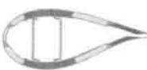</td><td rowspan="2">承受摆振弯矩;减小尾缘变形;避免胶接疲劳</td><td rowspan="2">单向织物层合板</td><td>本书4.5节</td></tr><tr><td>6</td><td>尾缘梁</td><td> $M_e$ </td><td>本书4.6节</td></tr><tr><td>7</td><td>胶接(腹板、前缘、尾缘)及叶片包边</td><td> $F_{f}/F_{e}$ </td><td></td><td>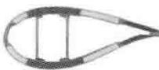</td><td>传递剪力</td><td>结构胶黏剂</td><td>本书4.2节 本书4.5节 本书4.6节</td></tr><tr><td>8</td><td>叶根加强层</td><td> $M_{f}/M_{e}/F_{z}$  $F_{f}/F_{e}/M_{z}$ 的组合</td><td colspan="2">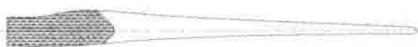</td><td>传递载荷/加强叶根</td><td>三轴织物</td><td>本书4.7节</td></tr><tr><td>9</td><td>叶根螺栓及叶根法兰</td><td> $M_{f}/M_{e}/F_{z}$  $F_{f}/F_{e}/M_{z}$ 的组合</td><td colspan="2">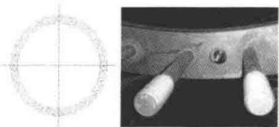</td><td>传递载荷/连接叶片与轮毂</td><td>金属</td><td>本书4.8节</td></tr><tr><td>10</td><td>尖角</td><td>-</td><td colspan="2">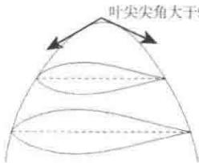</td><td>气动效应/减小噪声/涡尾迹</td><td>-</td><td>本书5.1节</td></tr><tr><td>11</td><td>接闪系统</td><td>-</td><td colspan="2">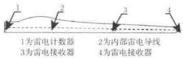</td><td>防雷击</td><td>金属</td><td>本书5.2节</td></tr><tr><td>12</td><td>胶衣及喷漆</td><td>-</td><td colspan="2">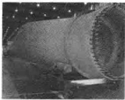</td><td>防腐蚀</td><td>如WU230/FU300</td><td>本书5.3节</td></tr><tr><td>13</td><td>其他件:运输加强层叶根盖板配重腔挡雨环双腹板PE管等</td><td>运输载荷维护</td><td colspan="2">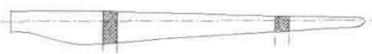</td><td>运输/维护/配重等</td><td>-</td><td>本书5.4~5.9节</td></tr></table>

# 3.3 结构设计流程

叶片结构设计流程基本分为概念设计、初步设计、详细设计，叶片结构设计中需根据不同的设计环节和设计要求，分清楚各设计阶段的主次与重点[5]，图3-14给出结构设计的基本流程，同时在表3-3中展开介绍设计流程中各设计阶段的重点。

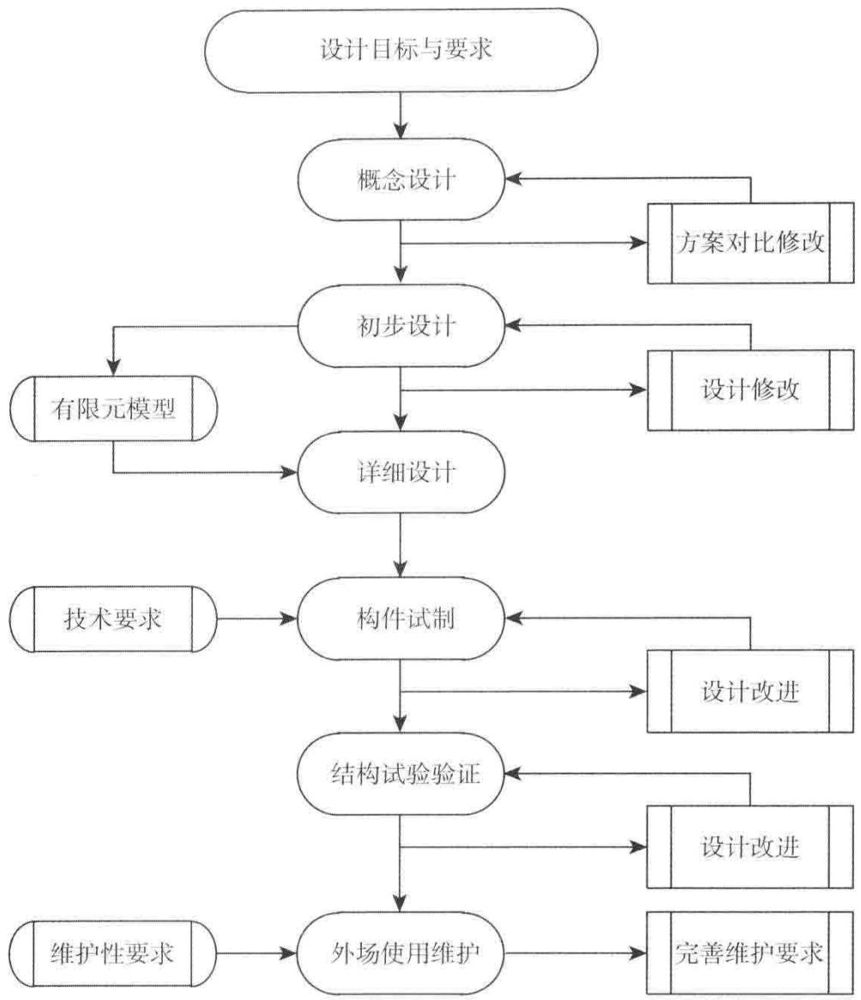

flowchart

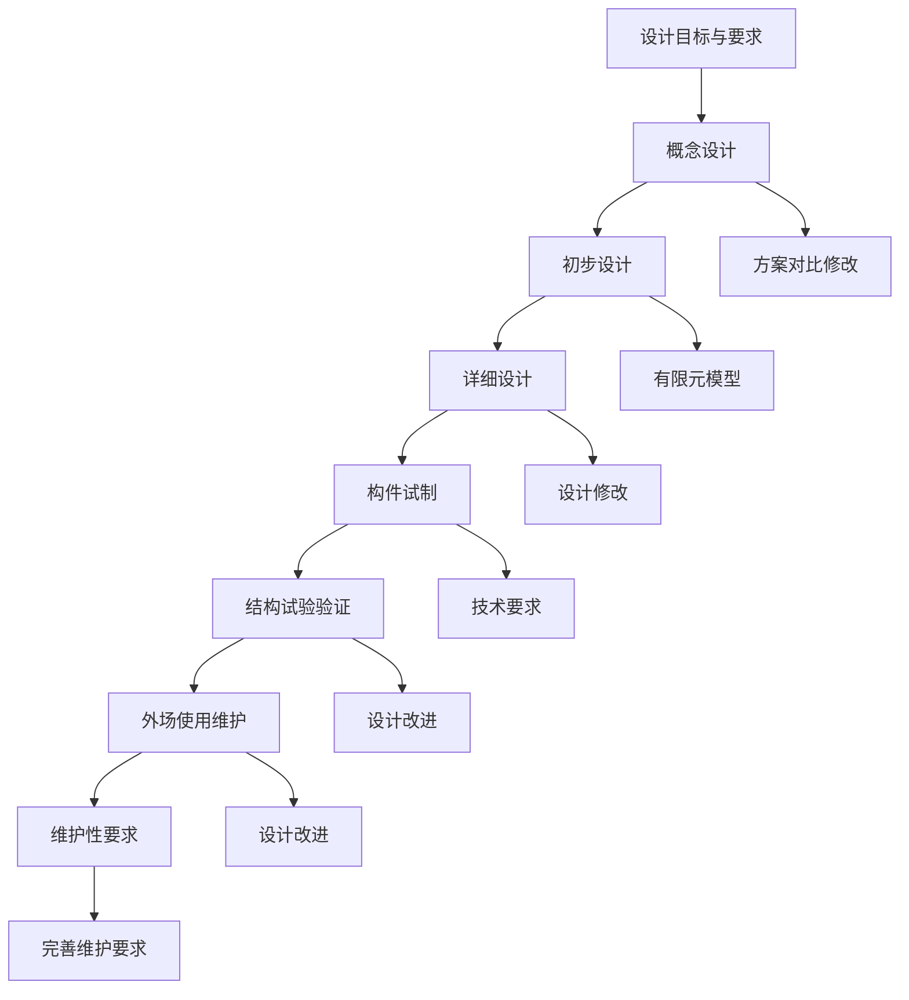
```mermaid
graph TD
    A["设计目标与要求"] --> B["概念设计"]
    B --> C["初步设计"]
    C --> D["详细设计"]
    D --> E["构件试制"]
    E --> F["结构试验验证"]
    F --> G["外场使用维护"]
    G --> H["维护性要求"]
    
    B --> I["方案对比修改"]
    C --> J["有限元模型"]
    D --> K["设计修改"]
    E --> L["技术要求"]
    F --> M["设计改进"]
    G --> N["设计改进"]
    H --> O["完善维护要求"]
```

图 3-14 结构设计流程

表 3-3 叶片结构设计流程的具体内容

<table><tr><td>设计流程</td><td>具体内容</td></tr><tr><td>概念设计</td><td>明确设计要求,包括叶片强度安全系数分布、叶尖挠度及叶片总重要求;明确结构设计选材及材料主方向的材料性能许用值;根据叶片气动外形与外部载荷,确定主梁、尾缘梁、蒙皮、叶根加强层、腹板等结构件的构型、尺寸、厚度分布及空间位置;粗略计算叶片结构的强度、挠度与总重,验证是否满足基本设计要求</td></tr><tr><td>初步设计</td><td>明确叶片复合材料的各向异性物理性能和力学性能,结合成型工艺、环境安全系数及工艺安全系数等确定材料安全系数,计算用于结构设计的材料许用值;确定叶根连接方式及连接工艺,如预埋螺栓或后打孔工艺;根据叶片包络载荷下的所有极限载荷,设计及校核叶片结构的铺层形式,满足强度、刚度、频率、疲劳、总重的要求,最终确定叶片所有结构件的构型及尺寸,以及各结构件之间的搭接及连接关系</td></tr><tr><td>初步设计</td><td>确定叶片功能件的尺寸、位置及重量,包括运输加强层、配重腔、叶根盖板、挡雨环等;预估叶片整体成本</td></tr><tr><td>详细设计</td><td>完成叶片局部或细节的结构分析,如尾缘、叶根、层间局部分析等;完成叶片整体的、全套的结构校核与分析报告;确定叶片全尺寸试验大纲,包括静载试验、固有频率试验和疲劳试验;若需要构件试验,如叶根连接螺栓试验或叶根灌输工艺试验,也需要准备再测试方案;完成叶片整体BOM统计,计算叶片总材料成本及制造成本,评估成本;完成叶片铺层图、零部件图及装配图;完成用于指导叶片生产的工艺文件及工装图纸;编制叶片技术规范及采购规范</td></tr></table>

# 第二篇

# 叶片结构设计

# 第 4 章 结构件设计

叶片结构设计中包括结构件设计与功能件设计，本章节主要介绍结构件的构型形式、尺寸设计，功能件的设计将在第6章中详细阐述，叶片结构设计如图4-1所示。

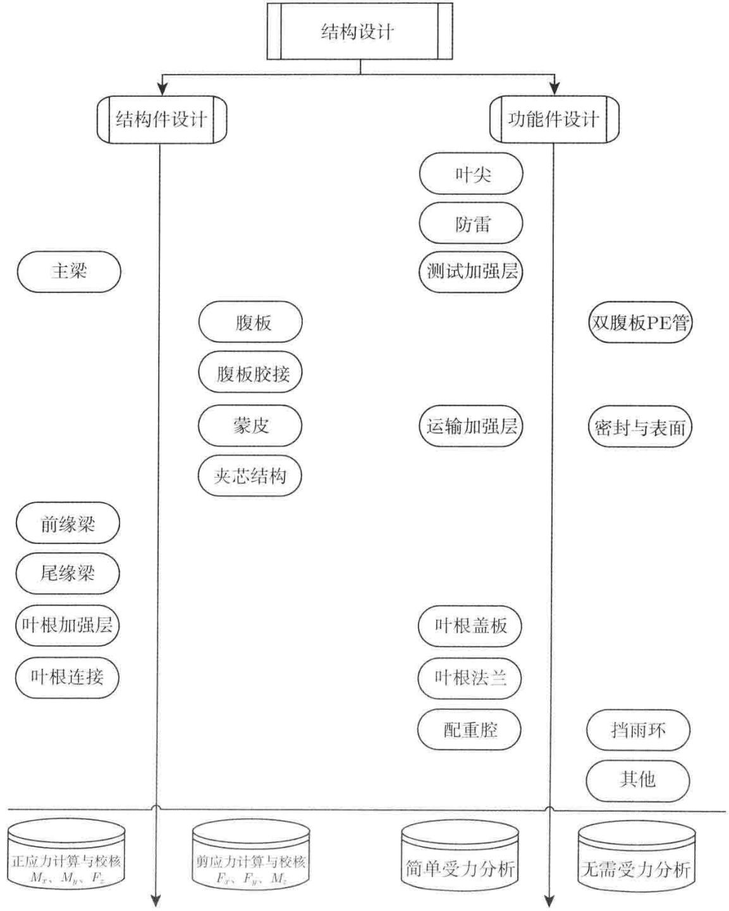

flowchart

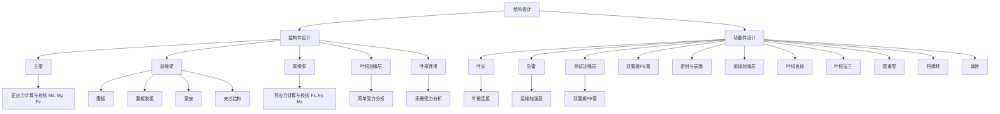
```mermaid
graph TD
    A["结构设计"] --> B["结构件设计"]
    A --> C["功能件设计"]
    B --> D["主梁"]
    B --> E["前缘梁"]
    B --> F["尾缘梁"]
    B --> G["叶根加强层"]
    B --> H["叶根连接"]
    C --> I["叶尖"]
    C --> J["防雷"]
    C --> K["测试加强层"]
    C --> L["双腹板PE管"]
    C --> M["密封与表面"]
    C --> N["运输加强层"]
    C --> O["叶根盖板"]
    C --> P["叶根法兰"]
    C --> Q["配重腔"]
    C --> R["挡雨环"]
    C --> S["其他"]
    D --> T["正应力计算与校核 Mx, My, Fz"]
    E --> U["腹板"]
    E --> V["腹板胶接"]
    E --> W["蒙皮"]
    E --> X["夹芯结构"]
    F --> Y["剪应力计算与校核 Fx, Fy, Mz"]
    G --> Z["简单受力分析"]
    H --> AA["无需受力分析"]
    I --> AB["叶根连接"]
    J --> AC["运输加强层"]
    K --> AD["双腹板PE管"]
```

图 4-1 叶片结构设计

本书中，第 4 章详细阐述结构件设计，第 5 章详细介绍功能件设计。

# 4.1 主梁设计

主梁是叶片结构的主要承力构件，其良好的强度和刚度特性是叶片结构设计的主要技术指标。主梁形式示意图如图 4-2 所示，根据本书第 2 章表 2-3 可知，主梁占叶片重量百分比为 21%，占叶片表面积比为 12%，因此叶片主梁从功能、占重比、占表面积比等方面都表现得很重要。叶片主梁要保证：

(1) 能够承受挥舞弯矩的作用，保证叶片主梁强度特性；  
(2) 保证挥舞方向的刚度特性，避免叶尖挠度过大而与塔架干涉；  
(3) 影响叶片一阶挥舞固有频率，避免与激振力共振。

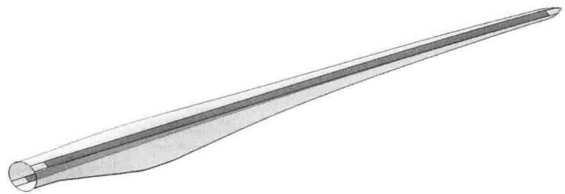

natural_image

3D rendering of a long, elongated object with a tapered end and internal structure (no text or symbols)

图 4-2 叶片主梁示意图

主梁尤为重要，而其设计难度又大，因此本书首先介绍叶片主梁的结构设计。主梁设计的重点及难度主要依于以下几方面：

(1) 主梁占重比和占表面积比较大, 主梁设计的难度主要来源于叶片坐标系中挥舞弯矩 $M_{f}$ 远大于摆振弯矩 $M_{e}$ , 但叶片剖面主梁段翼型厚度小于剖面弦长, 因此造成叶片剖面的主梁段厚度/弦长与 $M_{f} / M_{e}$ 的差别较大, 引入主梁刚度与载荷的反差, 成为设计主梁的主要瓶颈。

针对 WB45.3 叶片，在叶片展向最大弦长位置的叶片剖面载荷与外形分布见表 4-1。

表 4-1 某叶片剖面的载荷与外形对比

<table><tr><td colspan="4">叶片剖面参数</td><td colspan="5">外形比</td></tr><tr><td>挥舞弯矩 $M_{f,\max }$ /(kN·m)</td><td>摆振弯矩 $M_{e,\max }$ /(kN·m)</td><td>翼型厚度 $T_{h}$ /mm</td><td>剖面弦长 $C_{h}$ /mm</td><td> $M_{f}/M_{e}$ </td><td> $T_{h}/C_{h}$ </td><td> $M_{f}/T_{h}$ </td><td> $M_{e}/C_{h}$ </td><td> $\frac{M_{f}/T_{h}}{M_{e}/C_{h}}$ </td></tr><tr><td>4493</td><td>2705</td><td>1482</td><td>3570</td><td>1.661</td><td>0.415</td><td>3.032</td><td>0.758</td><td>4.00</td></tr></table>

叶片最大弦长剖面的最大挥舞弯矩是最大摆振弯矩的 1.661 倍，而剖面绝对厚度仅占弦长的 0.415。主梁设计中主要考虑挥舞弯矩的大小及主梁段的刚度，而叶片剖面的 $M_{f}/T_{h}$ 是 $M_{e}/C_{h}$ 的 4 倍，因此主梁的设计由于其主导刚度较小而作用载荷较大，增加了设计难度。

(2) 叶片外形通常由空气动力学追求高升阻比而采用比较薄的翼型, 风电行业叶片从叶中段至叶尖段, 翼型的相对厚度一般不会超过 $30\%$ , 即造成叶片主梁在比较小的空间内满足强度和刚度的要求。主梁段刚度与绝对厚度的四次方成正比, 强度与外载荷成正比、与绝对厚度的三次方成反比, 因此厚度对刚度和强度的影响甚大。  
(3) 基于以上两个原因, 综合考虑载荷安全系数与复合材料安全系数之后, 主梁设计时仍然需要预留较大的安全系数, 才能满足整体强度和刚度的要求。  
(4) 由于主梁预留一定的安全系数，主梁铺层过厚。考虑复合材料工艺设计中要求的单层布的裁剪与铺放，主梁通常采用等宽设计。这样就增加了设计的约束，结合复合材料单向布自身的铺放特点，因此主梁设计难度较大。

# 4.1.1 主梁构型类别

主梁俗称 Spar Cap，主梁应选用比强度高或者比刚度高的材料，如玻璃纤维、碳纤维（玻璃钢、碳环氧复合材料）或竹木复合材料等。各纤维增强体的力学性能见表 4-2，其对比如图 4-3 所示。需保证叶片满足整体的成本与总重的要求，叶片主梁构型为多层单向铺层叠加组成的层合板结构。早期的叶片和小型风力机叶片也有采用天然木材、工程塑料及铝、钢等材料的主梁。

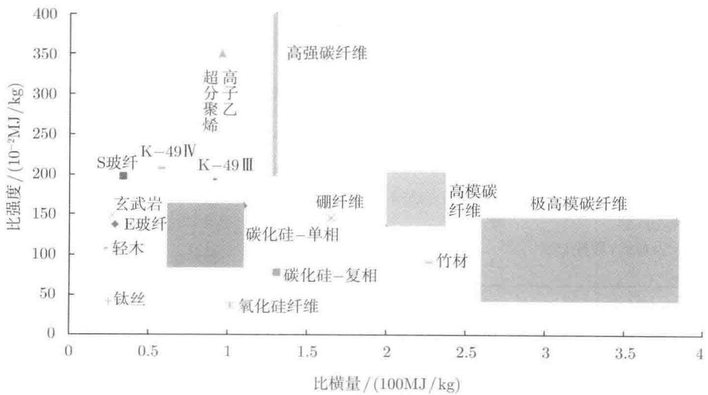

scatter

| Material           | 比横量/(100MJ/kg) | 比强度/(10⁻²MJ/kg) |
| ------------------ | ----------------- | ------------------ |
| 高强碳纤维         | ~1.2              | ~350               |
| 纳材               | ~2.8              | ~140               |
| 极高模碳纤维       | ~3.0              | ~140               |
| 砺纤维             | ~1.6              | ~150               |
| 碳化硅-单相        | ~1.4              | ~70                |
| 碳化硅-复相        | ~1.3              | ~60                |
| K-49Ⅲ             | ~1.0              | ~200               |
| K-49Ⅳ             | ~0.8              | ~200               |
| S玻纤             | ~0.4              | ~200               |
| 玄武岩             | ~0.3              | ~150               |
| E玻纤             | ~0.3              | ~140               |
| 轻木               | ~0.3              | ~100               |
| 钛丝               | ~0.3              | ~50                |

图 4-3 不同纤维增强体的比强度和比模量比较

表 4-2 纤维增强体的部分力学性能 [1]

<table><tr><td colspan="2">材料</td><td>直径/μm</td><td>相对密度</td><td>拉伸强度/10MPa</td><td>模量/105MPa</td><td>伸长率/%</td><td>比强度/10MPa</td><td>比模量/100GPa</td></tr><tr><td rowspan="3">玻璃纤维</td><td>E</td><td>10</td><td>2.55</td><td>350</td><td>0.74</td><td>4.8</td><td>137</td><td>0.29</td></tr><tr><td>S</td><td>10</td><td>2.49</td><td>490</td><td>0.84</td><td>5.7</td><td>197</td><td>0.34</td></tr><tr><td>M2</td><td></td><td>2.77</td><td>370</td><td>0.93</td><td></td><td>134</td><td>0.34</td></tr><tr><td rowspan="2">硼纤维</td><td></td><td>100</td><td>2.65</td><td>350</td><td>4.1</td><td>0.5~0.8</td><td>132</td><td>1.55</td></tr><tr><td></td><td>140</td><td>2.49</td><td>364</td><td></td><td></td><td>146</td><td>1.65</td></tr><tr><td rowspan="4">碳纤维</td><td>普通</td><td></td><td></td><td>250~300</td><td></td><td></td><td>143~171</td><td></td></tr><tr><td>高强</td><td>6</td><td>1.75</td><td>350~700</td><td>2.25~2.28</td><td></td><td>200~400</td><td>1.29~1.30</td></tr><tr><td>高模</td><td>6</td><td></td><td>240~350</td><td>3.5~5.8</td><td>1.5~2.4</td><td>137~200</td><td>2.0~2.34</td></tr><tr><td>极高模</td><td>6</td><td></td><td>75~250</td><td>4.6~6.7</td><td>0.5~0.7</td><td>43~143</td><td>2.63~3.83</td></tr><tr><td rowspan="2">芳纶纤维</td><td>K-49 III</td><td>10</td><td>1.47</td><td>283</td><td>1.34</td><td>2.5</td><td>193</td><td>0.91</td></tr><tr><td>K-49 IV</td><td></td><td></td><td>304</td><td>0.85</td><td>4</td><td>207</td><td>0.58</td></tr><tr><td rowspan="2">碳化硅纤维</td><td>复相</td><td>100</td><td>3.28</td><td>254</td><td>4.3</td><td></td><td>77.4</td><td>1.31</td></tr><tr><td>单相</td><td>8~12</td><td>2.8</td><td>250~450</td><td>1.8~3.0</td><td></td><td>89~161</td><td>0.64~1.1</td></tr><tr><td colspan="2">超高分子量聚乙烯</td><td></td><td>0.97</td><td>340</td><td>0.93</td><td>3.5~3.7</td><td>350.5</td><td>0.959</td></tr><tr><td colspan="2">玄武岩纤维</td><td></td><td>2.63</td><td>390</td><td>0.72</td><td>3.03</td><td>148.3</td><td>0.27</td></tr><tr><td colspan="2">氧化硅纤维</td><td></td><td>3.7</td><td>138~172</td><td>3.79</td><td></td><td>37~46</td><td>1.02</td></tr><tr><td colspan="2">钢丝</td><td></td><td>7.8</td><td>42</td><td>2.1</td><td></td><td>5.4</td><td>0.27</td></tr><tr><td colspan="2">铝丝</td><td></td><td>2.7</td><td>63</td><td>0.74</td><td></td><td>23</td><td>0.27</td></tr><tr><td colspan="2">钛丝</td><td></td><td>4.7</td><td>196</td><td>1.17</td><td></td><td>41.7</td><td>0.25</td></tr><tr><td colspan="2">轻木</td><td></td><td>0.155</td><td>14.1</td><td>0.352</td><td></td><td>107.14</td><td>0.22</td></tr><tr><td colspan="2">竹材</td><td></td><td>1.12</td><td>120</td><td>0.25</td><td></td><td>90.97</td><td>2.27</td></tr></table>

主梁按照不同的材料、成型工艺、错层方式等情况，有表 4-3 的分类方式。

表 4-3 主梁构型分类方式

<table><tr><td>分类方式</td><td>A</td><td>B</td><td>C</td><td>D</td></tr><tr><td>按材料分</td><td>玻璃纤维</td><td>碳纤维</td><td>竹层积材</td><td>其他</td></tr><tr><td>按成型工艺分</td><td>一体成型</td><td>主梁预制成型</td><td>主梁、叶片整体预制</td><td>其他</td></tr><tr><td>按错层分</td><td>等宽平行四边形</td><td>等宽矩形</td><td>梯形</td><td>其他</td></tr><tr><td>按主梁构成分</td><td>单工字梁</td><td>双工字梁</td><td></td><td></td></tr><tr><td>按主梁及前缘、腹板空腔形状分</td><td>D形梁</td><td>O形梁</td><td>箱形梁</td><td>其他</td></tr></table>

叶片主梁剖面示意图如图 4-4 所示。

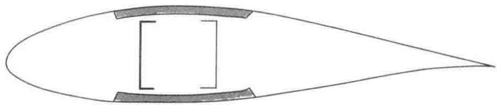

natural_image

Simple line drawing of a boat hull with a rectangular frame and curved hull (no text or symbols)

图4-4 叶片主梁图示

# 4.1.2 玻纤织物主梁

目前风力机行业内的绝大多数叶片都采用玻纤织物主梁的设计形式，玻纤织物主梁一般采用等宽不等厚的设计方式，以强度设计为基准进行叶片玻纤织物主梁设计。

叶片玻纤织物主梁铺设参考叶片上模与下模的中心线，主梁几何特性中应定义主梁铺层宽度，应用叶片结构设计理论确定满足约束叶片强度和刚度特性的主梁厚度。图4-5给出叶片剖面确定主梁铺层的几何尺寸，并在表4-4和表4-5中详述各参数的意义。

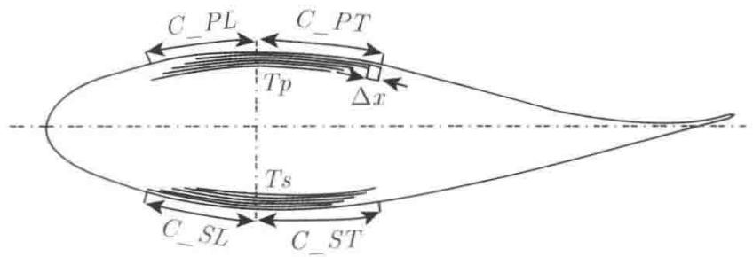

text_image

C_PL
C_PT
Tp
Δx
Ts
C_SL
C_ST

图 4-5 叶片截面主梁几何尺寸

叶片主梁铺层相对于叶片各截面弦向而言，每一层的铺设宽度相同，沿叶片中心线可以存在错层。叶片主梁段铺设宽度为考虑工艺错层的铺层后，沿中心线向前缘和尾缘铺设的幅宽。

表 4-4 主梁构型参数及含义

<table><tr><td>叶片展向/m</td><td>主梁铺层</td><td>主梁构型参数</td><td>含义</td></tr><tr><td rowspan="4">R</td><td rowspan="4">1~N</td><td>C_SL</td><td>吸力面主梁沿中心线向前缘铺设的宽度</td></tr><tr><td>C_ST</td><td>吸力面主梁沿中心线向尾缘铺设的宽度</td></tr><tr><td>C_PL</td><td>压力面主梁沿中心线向前缘铺设的宽度</td></tr><tr><td>C_PT</td><td>压力面主梁沿中心线向尾缘铺设的宽度</td></tr></table>

表 4-5 主梁铺层幅宽、厚度等参数及含义

<table><tr><td>叶片展向/m</td><td>主梁构型参数</td><td>含义</td></tr><tr><td rowspan="5">R</td><td>C_S</td><td>吸力面主梁铺设幅宽</td></tr><tr><td>C_P</td><td>压力面主梁铺设幅宽</td></tr><tr><td>Ts</td><td>吸力面主梁段铺设厚度最大值</td></tr><tr><td>Tp</td><td>压力面主梁段铺设厚度最大值</td></tr><tr><td>Δx</td><td>铺层错层宽度值</td></tr></table>

由于叶片展向位置不同，主梁的铺设厚度存在差别，根据叶片结构设计确定主梁铺设厚度。通过本书第7\~9章介绍的一维方法、二维方法和三维方法来校核叶片主梁的强度、刚度、疲劳等特性是否满足设计要求。

叶片主梁设计确定后，应明确叶片主梁的铺层分布形式，如图 4-6 所示，同时确定如表 4-6 所示的主梁安全系数表。叶片主梁的铺层厚度沿叶片展向分布如图 4-7 所示，叶根至叶中段主梁铺层最厚，越靠近尖端越薄。

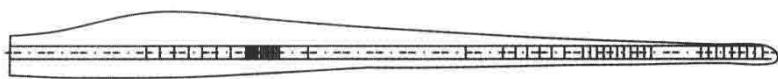

natural_image

Pure technical line drawing of a symmetrical mechanical or architectural component with no text, numbers, or symbols

图 4-6 叶片展向主梁分布

表 4-6 叶片主梁安全系数表

<table><tr><td>叶片展向/m</td><td>主梁铺设层数</td><td>主梁拉伸应力安全系数</td><td>主梁压缩应力安全系数</td></tr><tr><td>R</td><td>N</td><td>St</td><td>Sc</td></tr></table>

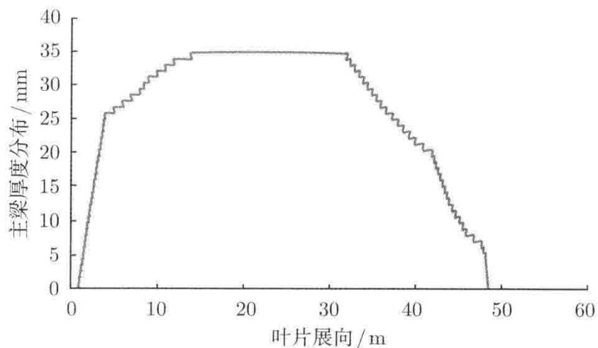

line

| 叶片展向 (m) | 主梁厚度分布 (mm) |
| ------------ | ------------------ |
| 0            | 0                  |
| 5            | 25                 |
| 10           | 30                 |
| 15           | 35                 |
| 20           | 35                 |
| 25           | 35                 |
| 30           | 35                 |
| 35           | 30                 |
| 40           | 20                 |
| 45           | 10                 |
| 50           | 0                  |
| 55           | 0                  |
| 60           | 0                  |

图 4-7 玻纤织物主梁沿叶片展向厚度分布

# 4.1.3 碳纤织物主梁

当叶片长度增加时, 重量的增加要快于能量的提取, 因为重量的增加和风叶长度的立方成正比, 而风机产生的电能和风叶长度的平方成正比。同时随着叶片长度的增加, 对增强材料的强度和刚度等性能提出了新的要求, 玻璃纤维在大型复合材料叶片制造中逐渐显现出性能方面的不足。为了保证在极端风载下叶尖不碰塔架, 叶片必须具有足够的刚度。减轻叶片的重量, 又要满足强度与刚度要求, 有效的办法是采用碳纤维增强。由于现有材料性能不能很好地满足大功率风力发电装置的需求, 并且玻璃纤维复合材料性能已经趋于极限, 因此在发展更大功率风力发电装置和更长叶片时, 采用性能更好的碳纤维复合材料已经成为发展趋势。根据国外有关资料显示, 当风力机超过 $5 \mathrm{MW}$ 、叶片长度超过 $60 \mathrm{~m}$ 时, 在叶片制造时采用碳纤维已成为必要的选择。事实上, 当叶片超过一定尺寸后, 由于材料用量、劳动力、运输和安装成本等相应下降, 碳纤维叶片反而比玻纤叶片成本更优[12]。

# 1. 碳纤维应用部位

碳纤维在风叶中的应用正在逐年增加。由于碳纤维比玻纤昂贵，采用百分之百的碳纤维制造叶片从成本上来说是不合算的。目前国外碳纤维主要是和玻纤混合使用，碳纤维只是用于一些关键的部位。碳纤维在叶片中应用的主要部位有：

(1) 主梁;  
(2) 前缘梁和尾缘梁;  
(3) 叶片的表面，采用具有高强度特性的碳纤维片材。

# 2. 碳纤维在风机叶片中应用的优势

# 1) 提高叶片刚度，减轻叶片重量

碳纤维的密度比玻璃纤维小约 30%，强度大约 40%，尤其是模量高 3\~8 倍。大型叶片采用碳纤维增强可充分发挥其高弹轻质的优点。某旋转直径为 120m 的风机的叶片，由于梁的质量（主梁、尾缘梁、前缘梁）占叶片总质量份额较大，梁结构采用碳纤维和采用全玻纤的相比，重量可减轻 40% 左右；碳纤维复合材料叶片刚度是玻璃纤维复合材料叶片的 2 倍。据分析，采用碳/玻混杂增强方案，叶片可减重 20%\~30%。

# 2) 提高叶片抗疲劳性能

风机总是处在条件恶劣的环境中，并且 24 小时处于工作状态。这就使材料易于受到损害。相关研究表明，碳纤维合成材料具有出众的抗疲劳特性，当与树脂材料混合时，则成为了风力机适应恶劣气候条件的最佳材料之一。

# 3) 使风机的输出功率更平滑更均衡，提高风能利用效率

使用碳纤维后，叶片重量的降低和刚度的增加改善了叶片的空气动力学性能，减少对塔和轮轴的负载，从而使风机的输出功率更平滑和更均衡，提高能量效率。同时，碳纤维叶片更薄，外形设计更有效，叶片更细长，也提高了能量的输出效率。

# 4) 在低速风力机叶片应用中存在优势

碳纤维的应用可以减少负载和增加叶片长度，从而制造适合于低风速地区的大直径风叶，使风能成本下降。

# 5) 利用导电性能避免雷击

利用碳纤维的导电性能, 通过特殊的结构设计, 可有效地避免雷击对叶片造成的损伤。

# 6) 降低风力机叶片的制造和运输成本

由于减少了材料的应用, 所以纤维和树脂的应用都减少了, 叶片变得轻巧, 制造和运输成本都会下降, 可缩小工厂的规模和运输设备。

# 7) 具有振动阻尼特性

碳纤维的振动阻尼特性可较有效地避免叶片自然频率与塔架频率间产生共振。

# 4.1.4 竹-木积材主梁

玻璃纤维难以降解，回收困难，而碳纤维价格高。木-环氧目前主要是用芬兰桦木 (Finnish Brich)，中国缺少实施条件，且该技术为 Vestas 专有。中国竹林面积庞大，竹材生长环境优良，且竹材是生长最快的植物之一，与木材相比具有更高的经济价值和环保价值。因此竹层积材在风力机叶片中有较高的应用价值和发展趋势。截至目前，全世界兆瓦级叶片有 2000 套由竹木制成。

竹材主梁一般分为竹层积材和单层竹篾铺层两种形式，竹层积材主梁一般选用等厚不等宽的设计，方便工艺以及采购的要求；而单层竹篾的铺层方式与玻纤织物主梁的设计形式相同。图 4-8 显示竹层积材的主梁形式，其比刚度较好，但比强度较玻纤/碳纤维的主梁低较多。竹层积材主梁的套料图设计非常重要，应注意主梁收边、叶根收边铺层、叶尖收尾铺层，如图 4-9 所示。

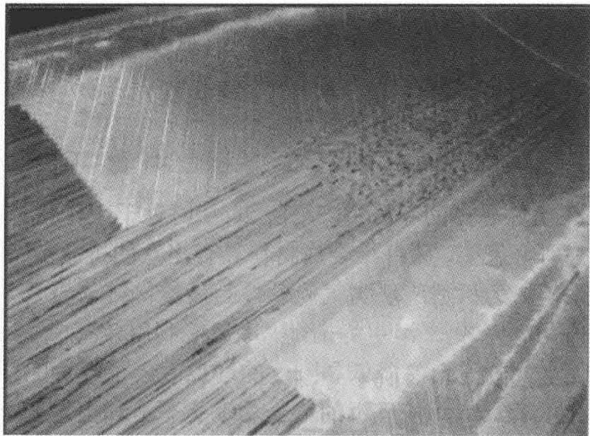

natural_image

Close-up of a textured surface with diagonal striations and a bright central feature (no text or symbols visible)

图4-8 竹层积材

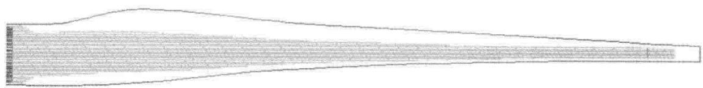

line

| Year | Value |
|------|-------|
| 2010 | 0.0   |
| 2011 | 0.5   |
| 2012 | 1.0   |
| 2013 | 1.5   |
| 2014 | 2.0   |
| 2015 | 2.5   |
| 2016 | 3.0   |
| 2017 | 3.5   |
| 2018 | 4.0   |
| 2019 | 4.5   |
| 2020 | 5.0   |
| 2021 | 5.5   |
| 2022 | 6.0   |
| 2023 | 6.5   |

图 4-9 叶片竹材主梁铺层

叶片竹-木主梁的铺设宽度由叶根至叶尖逐渐变小，如图 4-10 所示。

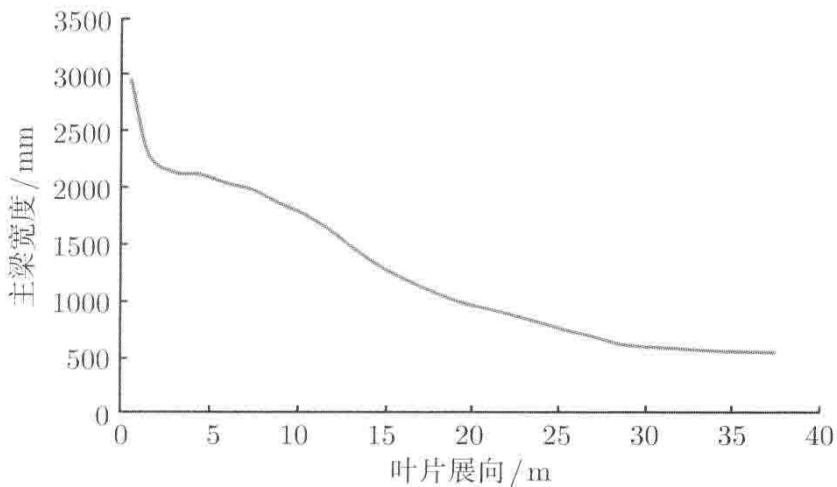

line

| 叶片展向 (m) | 主梁宽度 (mm) |
| ------------ | ------------- |
| 0            | 3000          |
| 5            | 2100          |
| 10           | 1800          |
| 15           | 1400          |
| 20           | 1000          |
| 25           | 800           |
| 30           | 600           |
| 35           | 550           |
| 40           | 500           |

图 4-10 竹-木主梁宽度沿叶片展向分布

竹-木积材主梁叶片有其自身的技术难点，这些技术难点没有攻破之前是不能大量应用于风力机叶片中的，尤其是大型叶片。

(1) 材料物理力学性能离散度很大;   
(2) 选材标准缺乏；  
(3) 竹-木使用工艺复杂。

竹-木积材的这些问题没有解决之前，竹木叶片的发展空间受限。解决这些问题需要从以下几个方面入手：

(1) 了解竹种、产地、竹龄、部位、厚度、宽度、含水率、热压温度、压力、组坯方式；  
(2) 胶黏剂种类, 改性处理;  
(3) 湿度、温度生产条件；  
(4) 仓储及运输;   
(5) 原竹、竹片、成材的物理力学实验；  
(6) 成材的疲劳性能试验。

# 4.1.5 混合材料主梁

如玻纤-碳纤混合、竹材-玻纤混合等，这种不同材料的混合主梁会产生附和应力、层间失效、工艺复杂等问题，需要一系列的材料和工艺试验来验证主梁的性能。

竹材主梁中需要在竹材表面增铺单向带的主梁铺层，如图 4-11 所示，并保证叶片主梁各截面单向带的宽度大于竹材主梁的宽度。此时，竹层积材与玻纤之间的层间黏接力、竹材与玻纤突变位置的应力集中、两种材料引入的工艺灌输等复杂性，是设计的难点与重点。

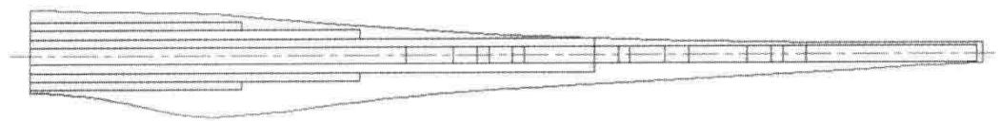

text_image

Anhangen an langening an angemirde den langener und Abgassier der langener und
Langungen und Anhangen und Buchung des Gesamt
Anhangen und Buchung des Gesamt
Anhangen und Buchung des Gesamt
Anhangen und Buchung des Gesamt
Anhangen und Buchung des Gesamt

图 4-11 叶片竹材表面单向布铺层

# 4.1.6 主梁结构设计

# 1. 确定主梁构型

确定主梁构型，即根据本章表 4-3 确定采用何种材料的主梁、成型工艺、错层等构型环节，目前通用的主梁构型为玻纤织物的预制主梁工艺。

# 2. 估算主梁尺寸

根据主梁的构型, 估算主梁沿着叶片展向和弦向的尺寸及厚度分布, 可以应用本书第 7 章的一维方法推算叶片各截面的尺寸, 包括主梁宽度和厚度。

# 3. 校核主梁强度

可以采用本书第 8 章和第 9 章中介绍的二维校核及三维校核方法，结合复合材料各向异性的理论，应用风力机行业的标准，采用 Tsai-Hill 失效准则，判定主梁的强度特性，评估主梁的设计结果。

# 4. 调整及优化主梁尺寸

根据主梁强度校核结果, 对强度较低的位置适当增加铺层, 对强度较高的位置减少铺层, 重新进行主梁的结构设计与结构校核, 直到满足设计要求的、重量最轻的主梁设计。

# 5. 评估主梁特性

此时，应结合强度、刚度、疲劳等结构方面，综合评价主梁的整体特性，判断刚度是否连续，是否满足疲劳安全系数的要求，挠度是否过大，存在打塔的危险。

叶片主梁的设计成果可包括 3D 示意图、3D FEM 分析云图、2D 铺层图及产品实体图，见表 4-7。

表 4-7 主梁设计成果

<table><tr><td>设计成果</td><td>图示</td></tr><tr><td>3D 示意图</td><td>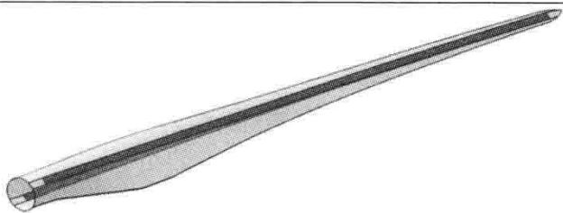</td></tr><tr><td>3D FEM分析云图</td><td>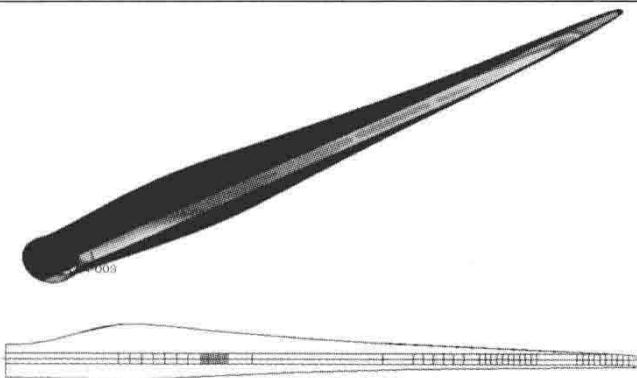</td></tr><tr><td>2D 图示</td><td></td></tr><tr><td>实体图</td><td>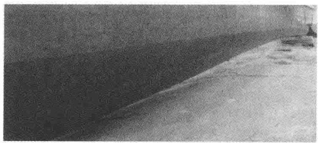</td></tr></table>

# 4.1.7 主梁工艺简述

风力机叶片主要应用预制主梁和一体成型两种。根据不同的环境和工艺条件、叶片材料特性和叶片量产需求，选择合适的主梁成型工艺。

# 1. 预制主梁工艺

预制主梁如图 4-12 所示，在做叶片整体灌输之前已完成叶片主梁的铺设、导注与成型，在叶片完成蒙皮与其他主材的铺设之后，将预制主梁按照正确的位置放入叶片整体中，通过二次灌输工艺完成叶片的整体成型。当叶片批量产的任务较重，预制主梁可显著提高生产时间成本，缩短叶片整体生产周期，提高生产效率。但是，预制主梁由于与叶片整体需要二次灌输固化成型，工艺缺陷诸如灌输不透、干纤维等时有发生，导致整个叶片质量下降，修补工作量较大，更严重的可能引起整个叶片的报废。

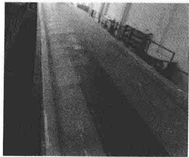

natural_image

Black-and-white photo of a road with vehicles and a bridge, no visible text or symbols

(a) 预制主梁

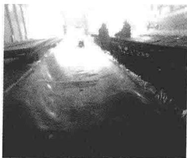

natural_image

Black and white photo of a narrow road with a bright light source, no visible text or symbols

(b) 主梁模具  
图 4-12 预制主梁及模具

# 2. 一体成型主梁工艺

一体成型主梁如图 4-13 所示，与叶片整体铺层同时铺设、导注和成型。保证叶片导注管铺设位置的合理性，严格树脂浇注速度控制及合理的工艺和环境条件，可避免一体成型主梁的工艺缺陷。但是当叶片批量产的任务量较重，一体成型主梁铺设时间较长，占用人工和模具成本较高，因此会造成叶片生产周期较长，降低生产效率。

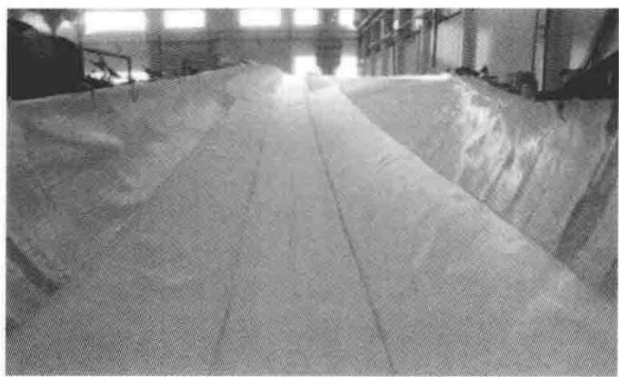

natural_image

Interior view of an industrial facility with large concrete slabs and a bright light source, no visible text or symbols.

图4-13 一体成型主梁

# 3. 叶片主梁工艺设计

叶片主梁工艺设计保证叶片工艺错层的合理性，同时通过叶片工艺铺层设计预估叶片成本。考虑如图 4-14 所示的 600mm 幅宽的主梁，其铺放第一层以叶片中心线为参考线，按照铺层设计向叶片前缘或尾缘铺设一定宽度，如图 4-15 所示，将一定幅宽的主梁织物向尾缘铺设宽度 340mm。第 2 层开始错位铺设，即在上一层的基础上向前缘错位一定距离，如 20mm。到第 3 层时玻纤布靠近铺设线，但不超出铺设线，整个主梁铺设宽度都在前缘铺设线和尾缘铺设线范围内。每一层的铺设都有详细的图示及说明，为避免铺设线的挪动导致铺设失误，所以检验即图示标注都是以前缘边距中心线的距离为准。

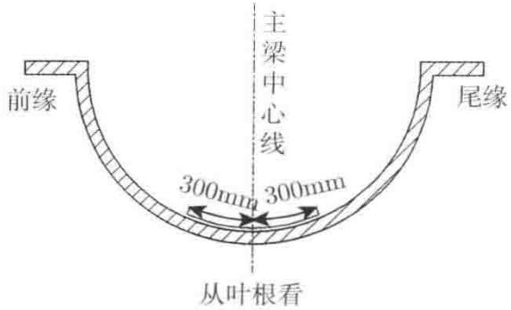

text_image

前缘
主梁中心线
300mm 300mm
尾缘
从叶根看

图 4-14 主梁铺设工艺

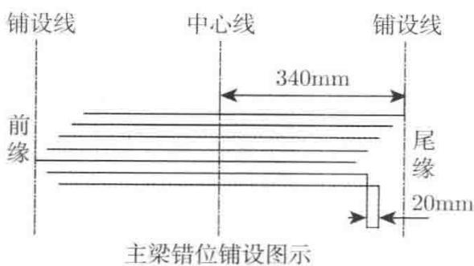

text_image

铺设线
中心线
铺设线
前缘
340mm
尾缘
20mm
主梁错位铺设图示

图 4-15 叶片主梁工艺错层

沿叶片展向，为了铺设方便，主梁铺设宽度距叶片中心线宽度可做到基本不变，如图 4-16 所示，其实际铺层如图 4-17 所示。

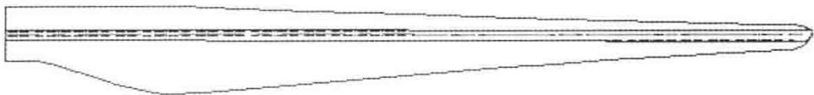

natural_image

Simple line drawing of a long elongated object with a curved base, resembling a stylized pen or tool (no text or symbols)

图 4-16 叶片展向主梁铺设

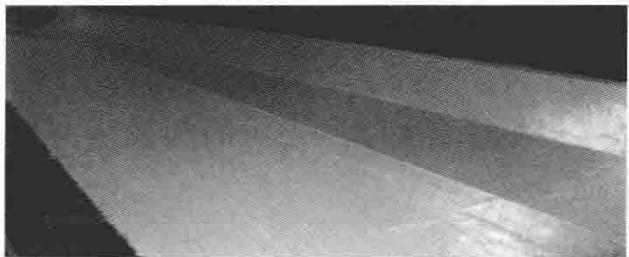

natural_image

Close-up of a textured surface with parallel grooves and ridges, no visible text or symbols

图 4-17 叶片主梁工艺铺层图

# 4.2 腹板设计及缘条胶接

叶片腹板支撑整个主梁结构，叶片蒙皮剪力通过腹板缘条与外壳黏接传递给腹板，腹板由叶尖向叶根传递剪力，同时由腹板与叶片外壳组成的多闭室承担扭矩的作用。因此，腹板在结构设计中很重要。叶片腹板结构为夹芯结构，屈曲分析在腹板分析中为主要分析内容。叶片双腹板如图 4-18 所示。

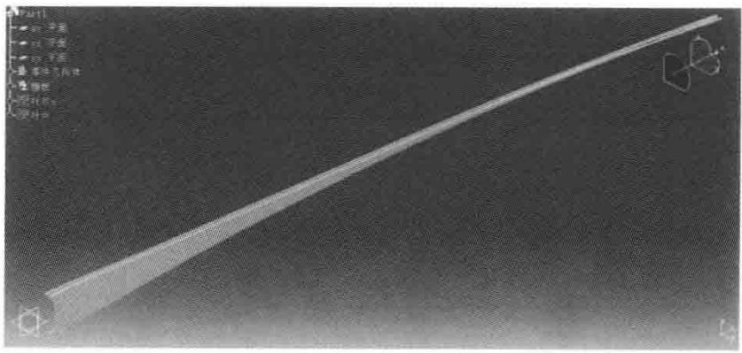

natural_image

3D rendered image of a long white diagonal line on a dark background, with no visible text or symbols.

图 4-18 叶片腹板示意图

# 4.2.1 腹板构型类别

腹板构型类别，包括腹板的形式、布局、加工工艺、根部形状等不同表征方面来确定腹板及缘条的构型。叶片的腹板与缘条支撑整个叶片主梁及外壳，如图 4-19 所示。

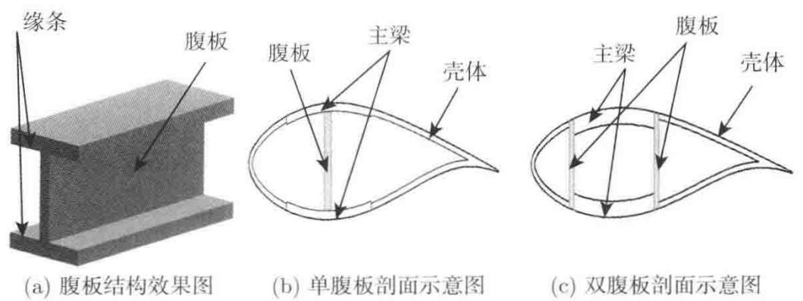  
图 4-19 腹板支撑主梁及外壳

腹板有多种构型形式。目前应用于风力机的腹板构型见表 4-8，腹板构型的图示见表 4-9。

表 4-8 腹板构型分类形式

<table><tr><td>分类方式</td><td>A</td><td>B</td><td>C</td><td>D</td></tr><tr><td>按腹板个数分</td><td>单腹板</td><td>双腹板</td><td>三腹板</td><td>其他</td></tr><tr><td>按腹板形状分</td><td>H形腹板</td><td>箱形腹板</td><td>几形腹板</td><td>其他</td></tr><tr><td>按加工工艺分</td><td>带缘条预制</td><td>腹板预制</td><td>腹板中段黏接</td><td>其他</td></tr><tr><td>按芯材材料分</td><td>PVC</td><td>Balsa木</td><td>PE</td><td>其他</td></tr><tr><td>按缘条柔性分</td><td>刚性缘条</td><td>柔性缘条</td><td></td><td>其他</td></tr><tr><td>按根部开口形状分</td><td>不开口</td><td>开弧形口</td><td>开梯形口</td><td>其他</td></tr><tr><td>按芯材与缘条位置分</td><td>顶头</td><td>楔形</td><td></td><td>其他</td></tr><tr><td>按根部翻边分</td><td>无翻边</td><td>有翻边</td><td></td><td>其他</td></tr></table>

表 4-9 腹板构型图示

<table><tr><td>分类</td><td>构型</td><td colspan="2">图示</td></tr><tr><td rowspan="3">腹板个数</td><td>A</td><td colspan="2">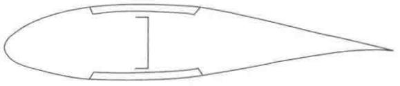</td></tr><tr><td>B</td><td colspan="2">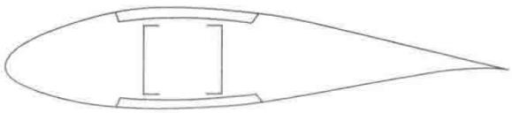</td></tr><tr><td>C</td><td colspan="2">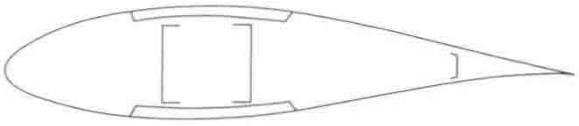</td></tr><tr><td>腹板形状</td><td>A</td><td colspan="2">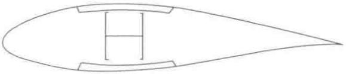</td></tr><tr><td>分类</td><td>构型</td><td colspan="2">图示</td></tr><tr><td rowspan="2">腹板形状</td><td>B</td><td colspan="2">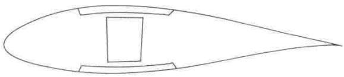</td></tr><tr><td>C</td><td colspan="2">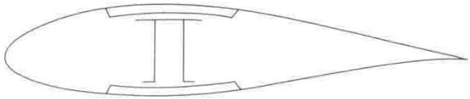</td></tr><tr><td rowspan="3">加工工艺</td><td></td><td>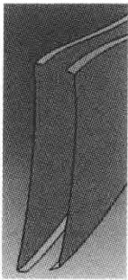</td><td>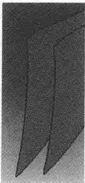</td></tr><tr><td>A</td><td>B</td><td></td></tr><tr><td>C</td><td>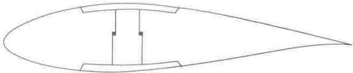</td><td></td></tr><tr><td rowspan="2">缘条柔性</td><td></td><td>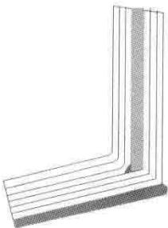</td><td>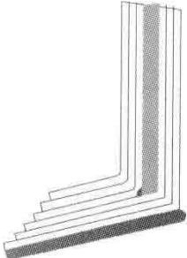</td></tr><tr><td>A</td><td>B</td><td></td></tr><tr><td rowspan="2">根部开口</td><td>A</td><td>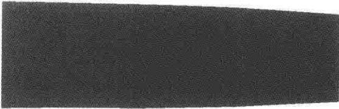</td><td></td></tr><tr><td>B</td><td>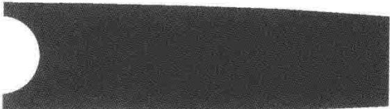</td><td></td></tr><tr><td>根部开口</td><td>C</td><td colspan="2">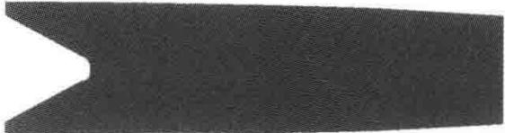</td></tr><tr><td rowspan="2">按芯材与缘条</td><td rowspan="2">A</td><td>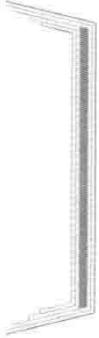</td><td>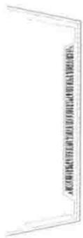</td></tr><tr><td>B</td><td></td></tr><tr><td rowspan="2">根部翻边</td><td rowspan="2">A</td><td>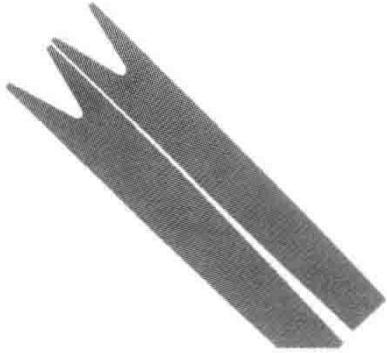</td><td>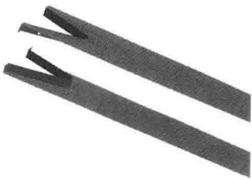</td></tr><tr><td>B</td><td></td></tr></table>

目前风电常规叶片的腹板基本以双腹板、预制腹板与缘条、PVC 芯材腹板及柔性缘条、开弧形口且带翻边的为主流，随着叶片越来越大，三腹板逐渐取代双腹板。

# 4.2.2 腹板布局形式

叶片腹板与主梁组成近似于工字梁模型的主承力结构件，腹板位于主梁之间。叶片展向和弦向合理的腹板位置布局直接影响叶片整体闭室传递剪力和抗扭转的能力及叶片整体抗屈曲的能力。叶片腹板的展向起点一般距离叶根截面 0.5\~2.5m，至叶尖保证叶片腹板的连续性。

# 1. 单腹板布局

单腹板一般沿叶片弦向位于叶片中心线附近。单腹板布局形式如图 4-20 所示。

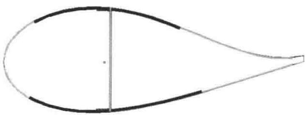

natural_image

Simple line drawing of a teardrop-shaped object with a central vertical line and curved segments (no text or symbols)

图 4-20 单腹板布局

# 2. 双腹板布局

在叶片弦向应该合理布置双腹板的尺寸参数，在叶片展向位置也应控制双腹板的起始位置。双腹板结构在靠近叶片叶尖段，只要能够满足叶片整体屈曲分析的要求，可以将叶尖段由双腹板改成单腹板，可以省材减重。双腹板布局形式如图4-21所示。

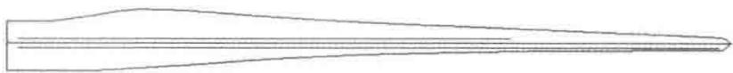

natural_image

Simple line drawing of a symmetrical object with horizontal lines, no text or symbols present

图 4-21 双腹板布局

# 3. 三腹板布局

随着叶片越来越大，叶片局部三腹板的构型设计已经显得更为重要。三腹板的设计可以有效避免最大弦长局部的尾缘夹芯发生局部屈曲破坏，同时可有效避免尾缘开裂的发生。三腹板在最大弦长附近的尾缘腹板应合理布局，不能非常靠近尾缘导致尾缘三角闭室过小，影响尾缘三角闭室的剪力流分布，导致尾缘段奇异点的剪力流不连续而引起载荷突变。三腹板布局形式如图 4-22 所示。

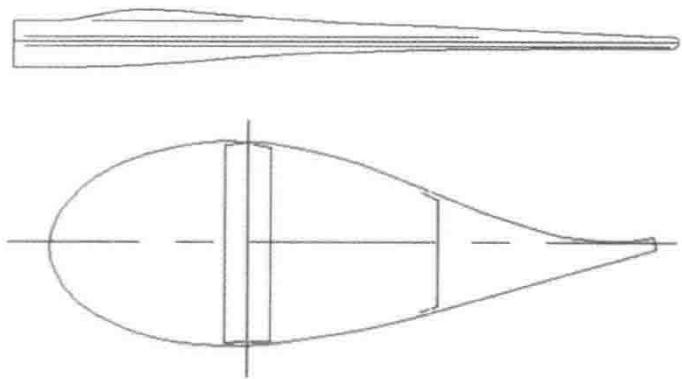

natural_image

Technical line drawing of a symmetrical mechanical component with top and side views (no text or symbols)

图 4-22 三腹板形式

# 4.2.3 腹板结构设计

# 1. 腹板尺寸设计

腹板尺寸包括腹板间距、腹板高度、缘条宽度、缘条与腹板角度等。不同的腹板构型对应的腹板约束尺寸不同。以双腹板为例，见表 4-10，说明腹板尺寸设计的参数。

表 4-10 双腹板尺寸参数表

<table><tr><td>双腹板构型</td><td>参数</td><td>说明</td></tr><tr><td rowspan="11">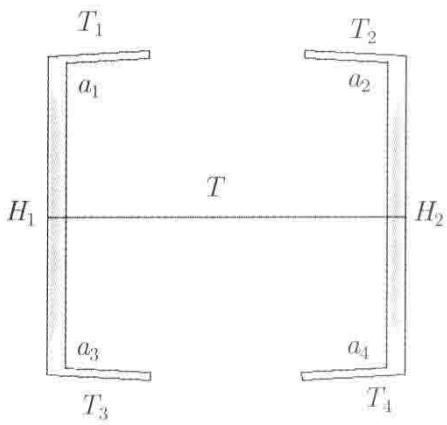</td><td> $T$ </td><td>双腹板间距</td></tr><tr><td> $T_1$ </td><td>确定前缘腹板与叶片下模黏接的缘条宽度</td></tr><tr><td> $T_2$ </td><td>确定尾缘腹板与叶片下模黏接的缘条宽度</td></tr><tr><td> $T_3$ </td><td>确定前缘腹板与叶片上模黏接的缘条宽度</td></tr><tr><td> $T_4$ </td><td>确定尾缘腹板与叶片上模黏接的缘条宽度</td></tr><tr><td> $a_1$ </td><td>前缘腹板缘条与下模黏接的仰角</td></tr><tr><td> $a_2$ </td><td>尾缘腹板缘条与下模黏接的仰角</td></tr><tr><td> $a_3$ </td><td>前缘腹板缘条与上模黏接的仰角</td></tr><tr><td> $a_4$ </td><td>尾缘腹板缘条与上模黏接的仰角</td></tr><tr><td> $H_1$ </td><td>前缘腹板高度</td></tr><tr><td> $H_2$ </td><td>尾缘腹板高度</td></tr></table>

叶片双腹板的腹板几何尺寸中，与叶片下模黏接的腹板缘条一般在未合模之前先将腹板定位于叶片下模，因此与叶片下模黏接的腹板缘条基本与腹板成 $90^{\circ}$ 夹角。而与叶片上模黏接的腹板缘条，需要在腹板合模时与叶片上模整体固化成型，在叶片合模中腹板缘条需要受到较大的压力，为了保证合模后与叶片上模黏接的腹板缘条与腹板垂直，在合模之前应使叶片上模黏接的腹板缘条与腹板的夹角大于 $90^{\circ}$ (如 $93^{\circ}$ )，如图4-23所示，合模后在合模压力的作用下，与叶片上模黏接的腹板缘条在合模后与腹板垂直。

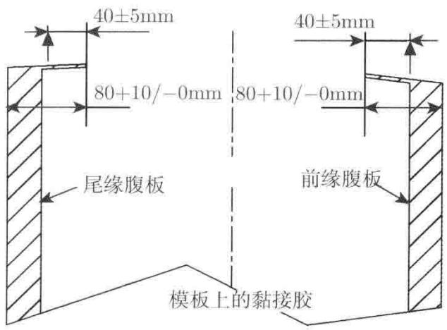

text_image

40±5mm
80+10/-0mm
80+10/-0mm
尾缘腹板
前缘腹板
模板上的黏接胶
40±5mm

图 4-23 腹板黏接

腹板缘条的黏接宽度决定于腹板缘条的宽度，前缘腹板与尾缘腹板分别与叶片上模和下模黏接的腹板缘条宽度近似相同。双腹板通常沿叶片中心线对称分布。

腹板高度的设计尤为重要。由于叶片的工艺基本是叶片上下模分别灌注成型，再通过胶接二次固化成为叶片整体，因此叶片与腹板是通过胶接后固化成型。这样就在叶片生产过程中，需要制作叶片模具和腹板模具。由于设计考虑不全面或环境、模具变形、尺寸公差控制不到位等因素，叶片与腹板安装不匹配的现象时常发生。如果腹板过高，则导致叶片整体合模干涉，叶片前尾缘存在空腔或胶接过厚，影响整体黏接性能；如果腹板过低，则叶片与腹板黏接不充分而导致叶片在运行过程中与腹板分离，进而发生叶片整体失稳。因此，腹板模具的设计与制造需要综合考虑叶片铺层厚度、公差、胶接厚度、工艺控制等方方面面的因素。

铺层设计中确定应铺设腹板位置的内缩厚度，通常情况下叶片上模和下模的内缩厚度不一样，通过叶片上模和下模的内缩厚度，根据叶片各截面的当地高度确定腹板的高度。

# 2. 腹板根部设计

腹板根部需要特殊设计，包括腹板根部的开口、根部铺层、根部翻边等，腹板的剪力从叶尖传递到叶根，再通过叶根腹板传递到叶根加强层至叶根螺栓传给轮毂。因此腹板根部的载荷很大，需要对腹板根部加强，包括铺层的合理优化与翻边，可提高腹板根部的抗屈曲能力；腹板根部还需要进行开口处理，起到剪力反传的作用，避免因腹板根部载荷过大且传载路径受阻而引起应力集中，导致腹板根部破坏。腹板根部开口如图 4-24 与图 4-25 所示。

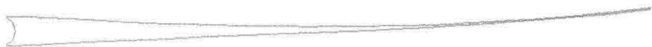

natural_image

Simple line drawing of a curved object resembling a tool or tool handle (no text or symbols)

图 4-24 腹板及腹板根部开口

# 1) 腹板根部开口

如前所述，梯形腹板在根部一定要进行开口处理，这样既可以减轻重量，又可以改善腹板剪应力的传递，不至于在腹板根部造成应力集中。

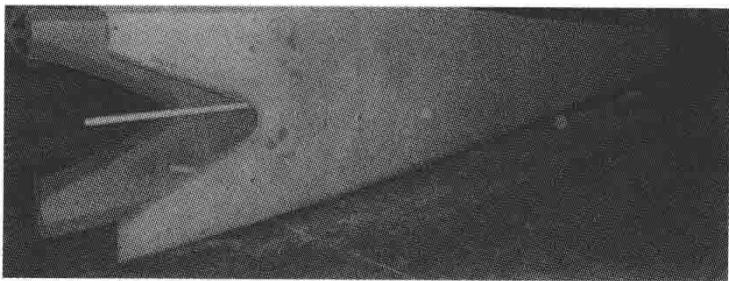

natural_image

Close-up of a textured surface with a thin rod and irregular topography (no visible text or symbols)

图 4-25 腹板根部开口示意图

腹板根部开口的尺寸和形状对剪力反传影响很大，一般情况下腹板根部开梯形口或弧形口，需要进行多种腹板根部开口的形状探索才能得到不同叶片设计下的最合适的腹板根部开口尺寸和形状，如图 4-26 所示。

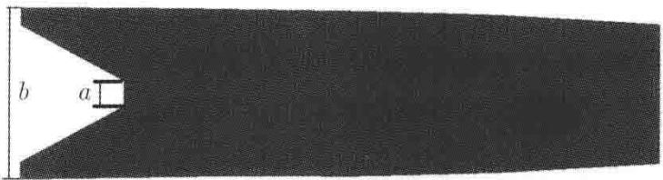

text_image

b
a

图 4-26 腹板梯形开口尺寸

腹板梯形开口短边长度为 a，腹板根部长度尺寸为 b，设开口比例 $x = a/b \times 100\%$ 。可令梯形的高度为定值，改变 x 值的大小，通过有限元仿真计算，仿真梯形开口大小对腹板稳定的影响。

腹板开的弧形口尺寸，影响腹板根部的应力集中和剪力反传。腹板根部开口的形式如图 4-27 所示。

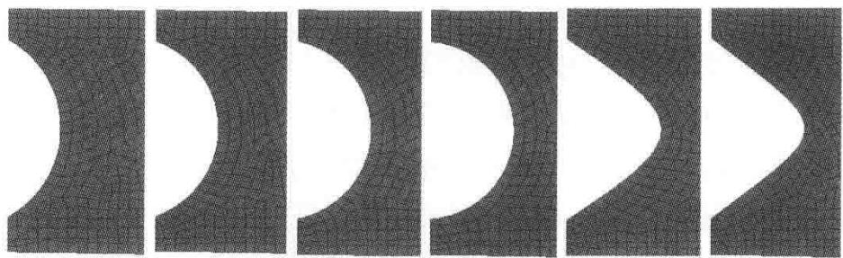

natural_image

Sequence of six abstract geometric patterns with curved and angular shapes, no text or symbols present

图 4-27 腹板根部弧形口

相同叶片模型和相同载荷形式下，腹板根部开口的形式可能不同，需要针对具体的问题定量定性分析每一种开口形式的结果，确定腹板根部的应力和屈曲因子，综合对比选择传力效果最佳的开口形式。

# 2) 腹板根部铺层

腹板根部铺层设计需要考虑工艺的可操作性，由于腹板为夹芯结构，根部夹芯芯材的厚度较厚，腹板根部的芯材需做倒角处理，同时应加强根部铺层，如图 4-28 所示。

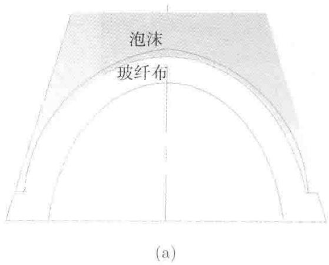

text_image

泡沫
玻纤布
(a)

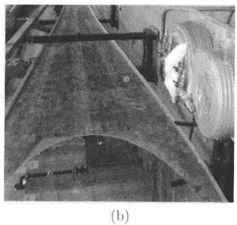

natural_image

Industrial facility interior with large cylindrical tank and pipe fittings (no visible text or symbols)

图 4-28 腹板根部铺层

# 3) 腹板叶根翻边

腹板根部除做开口处理, 实现剪力反传, 还应该做根部翻边, 增强腹板根部局部抗屈曲的能力。翻边可显著提高抗屈曲能力, 叶根腹板通常在合模之后增加手糊翻边来提高腹板局部的稳定性, 如图 4-29 所示。

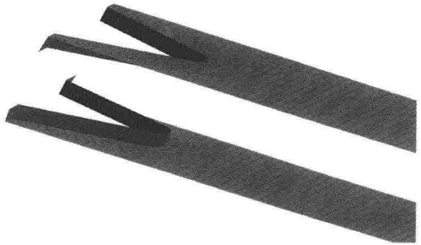

natural_image

Three dark, textured rectangular strips with no visible text or symbols

图 4-29 腹板根部翻边

腹板尖部一般不需要进行开口处理，因为腹板尖部的腹板高度较低，载荷较小，不会影响载荷的传力路径。

# 3. 腹板铺层设计

腹板是夹芯结构，腹板的铺层包括夹芯结构内外玻纤层厚度与芯材厚度，腹板结构通常为对称夹芯铺层，芯材通常为泡沫，且腹板为传剪构件，因此腹板玻纤织物铺层应选用双轴织物。腹板内外双轴向铺层在缘条处应错层处理，保证腹板整体与缘条有足够刚度的同时，有一定的柔度，图4-30显示腹板铺层的形式。

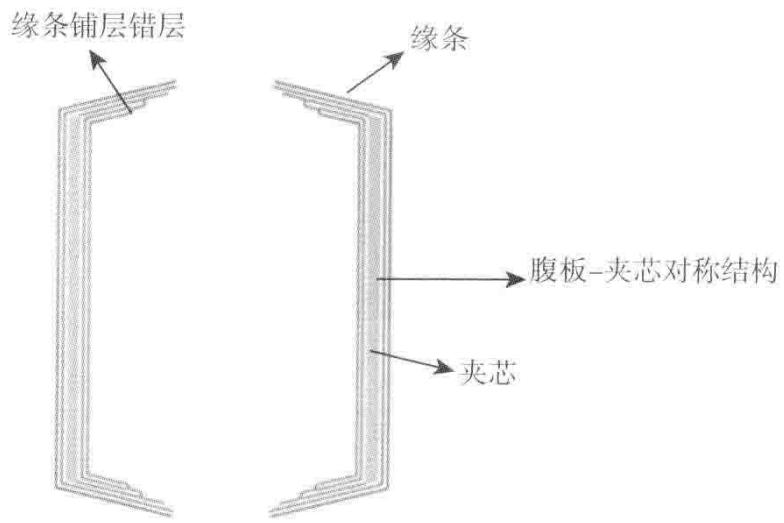

text_image

缘条铺层错层
缘条
腹板-夹芯对称结构
夹芯

图 4-30 腹板铺层设计

叶片腹板设计主要是叶片铺层设计与夹芯结构芯材厚度分布设计，夹芯结构设计应满足强度和抗屈曲特性。沿叶片展向，腹板双轴向铺层的层数逐渐增多，至叶中段铺层最厚，由叶中至叶尖段铺层逐渐减少，腹板夹芯的厚度沿叶片展向逐渐减少。对于双腹板结构，叶片展向前缘腹板与尾缘腹板受到的载荷不是完全一致的，存在偏差，因此双腹板的前缘腹板与尾缘腹板的铺层可能相同，应根据结构设计在满足强度和刚度、抗屈曲等特性的前提下，分别设计腹板的铺层。腹板铺层的厚度分布如图 4-31 和图 4-32 所示。

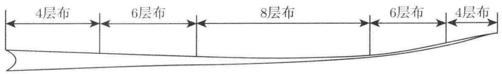

text_image

4层布
6层布
8层布
6层布
4层布

图 4-31 腹板铺层设计

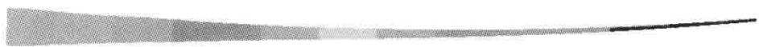

natural_image

Pure geometric shape with gradient shading, no text or symbols present

图 4-32 腹板铺层厚度分布

腹板的设计成果可包括 3D 示意图、3D FEM 分析云图、2D 铺层图及产品实体图，见表 4-11。

表 4-11 腹板设计成果

<table><tr><td>设计成果</td><td>图示</td></tr><tr><td>3D示意图</td><td>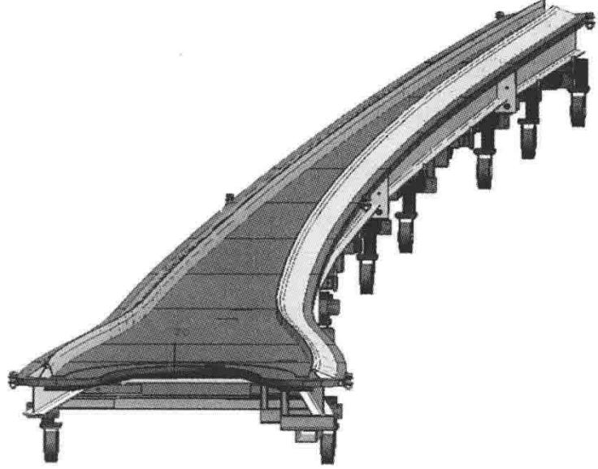</td></tr><tr><td>3D FEM分析云图</td><td>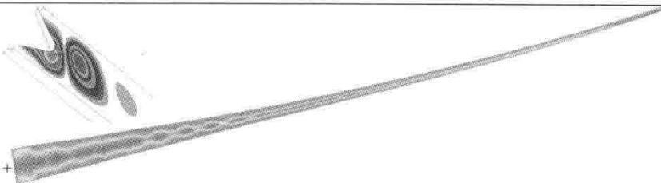</td></tr><tr><td>2D各截面形状示意图</td><td></td></tr><tr><td>实体图</td><td>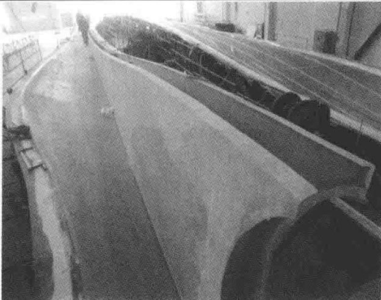</td></tr></table>

# 4.2.4 腹板工艺展望

根据腹板图纸制作腹板模具, 再生产腹板装配于叶片, 这种腹板制作方法受环境与工艺的影响比较大, 往往设计不可控, 导致制作出的腹板与叶片合模中时常引起过高或过低。而修改腹板模具的成本过高, 因此这种工艺设计只能靠每次修补腹板而装配叶片。

为避免这种情况，腹板的模具可以根据实际需要，制作无缘条的腹板模具，如图 4-33 所示。根据样片生产中确定的腹板高度，手糊缘条预制件。此时如果腹板高度过高，只需切割腹板高出的部分，在制作缘条与叶片上模黏接；如此时腹板高度过低，根据预合模的结果确定腹板相差的高度，手糊一段增高腹板得到适合高度的腹板。确定最合适的实际生产的腹板高度后，根据此时的腹板再次翻模得到腹板模具，此后根据已经校核过的腹板模具再制作符合叶片的腹板。这种腹板特殊工艺，虽然浪费一支腹板，但是可以根据生产确定腹板的实际高度，避免叶片批量生产中修补腹板而引入的时间成本和材料成本的浪费。

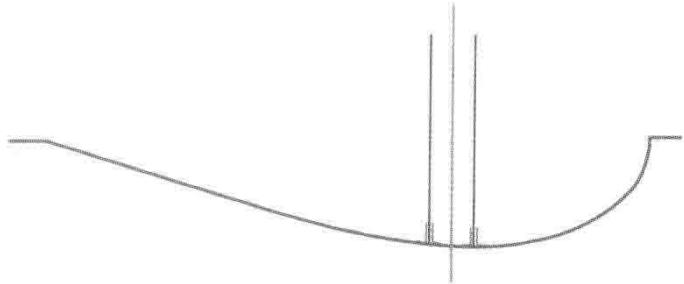

natural_image

Simple curved line drawing with two vertical lines and a small rectangular mark at the base (no text or symbols)

图 4-33 手糊预制件制作腹板缘条

同时，腹板可采用立体编织形式，在主梁上立体编织出能够定位腹板的小突条，可实现腹板与叶片之间的高效连接。

# 4.3 蒙皮设计

蒙皮主要承受叶片的剪力，还要承受冰雹、沙尘等冲击作用，蒙皮也要保证一定的铺层厚度。根据叶片蒙皮的受力特性，蒙皮可采用双轴布或三轴布，或者三轴布与双轴布结合的铺层形式。叶片蒙皮如图 4-34 所示。

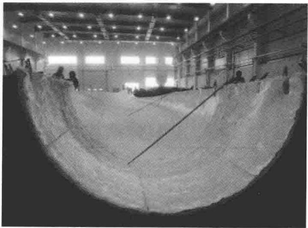

natural_image

Interior view of a large industrial facility with workers and structural beams (no visible text or symbols)

图 4-34 叶片蒙皮示意图

# 4.3.1 蒙皮构型设计

叶片蒙皮沿叶片上下模具满铺，如图 4-35 所示，确保叶片蒙皮与模具的贴合度，保证叶片整体的气动外形。

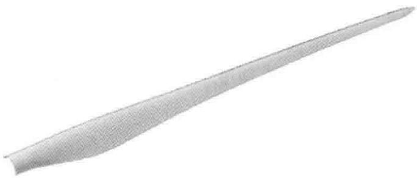

natural_image

Close-up of a metallic blade or wire with a textured tip, no visible text or symbols

图 4-35 蒙皮构型

叶片蒙皮一般选用三轴织物或双轴织物，叶片结构设计中将蒙皮满铺于叶片表面。叶片蒙皮铺层如图 4-36 所示。

图 4-36 蒙皮铺层

# 4.3.2 蒙皮工艺概述

叶片蒙皮要保证叶片气动外形，而叶片气动外形存在一定曲率，尤其在叶片最大弦长附近叶片曲率较大。叶片使用的玻纤织物的随型性不是非常优良，将幅宽很大的玻纤织物满铺于叶片模具表面，不能保证铺层与叶片模具的贴合度，会造成玻纤布褶皱以及叶片表面积胶等工艺缺陷，同时由于叶片各截面周长的不同，会造成铺层材料的浪费。因此在蒙皮铺设工艺设计中，如图 4-37 和图 4-38 所示，通常将满铺的蒙皮分为幅宽相等的 N 段玻纤织物，各段之间应满足复合材料工艺设计中双轴织物或三轴织物的弦向搭接尺寸。沿叶片蒙皮面，从叶根到叶尖彻底抚平蒙皮层，不允许有折痕和褶皱。

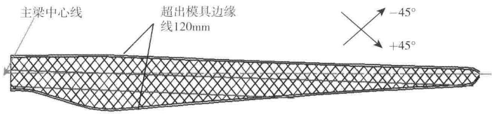

text_image

主梁中心线
超出模具边缘
线120mm
-45°
+45°

图 4-37 蒙皮工艺设计

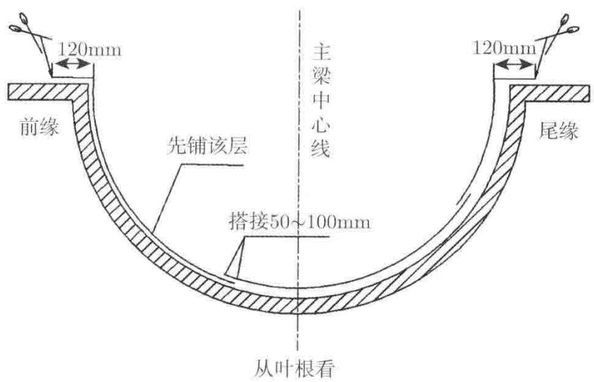

text_image

120mm
前缘
先铺该层
主梁中心线
搭接50~100mm
120mm
尾缘
从叶根看

图4-38 蒙皮搭接

# 4.4 夹芯结构设计

由于夹芯芯材重量轻, 具有比较大的弯曲刚度和强度, 夹芯结构在风力机叶片上广泛应用。叶片壳体局部与腹板结构都采用夹芯结构, 叶片和腹板的夹芯结构一般是变截面的, 且外形复杂, 材料厚度变化范围大, 因此夹芯结构的设计与分析在叶片结构设计中尤为重要。图 4-39 是叶片夹芯铺层的产品示意图。

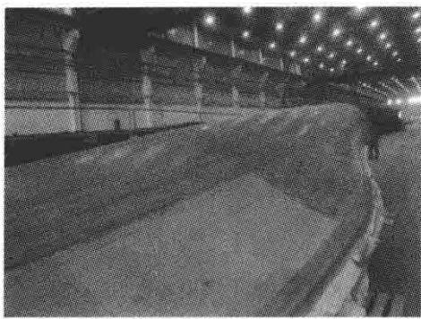

natural_image

Interior view of a tunnel with illuminated ceiling and overpass structure (no visible text or symbols)

图 4-39 叶片夹芯铺层

叶片芯材的出现是叶片结构追求轻量化的主要标志。

(1) 叶片结构铺层只有内外蒙皮的情况下，造成薄壁厚度不够，易被冲击损失及发生局部屈曲，因此应该加厚叶片薄壁段。  
(2) 加厚薄壁段在叶片的结构形式中不属于受载荷作用较大的部位, 因此应考虑叶片重量及成本, 选择轻质芯材加厚叶片薄壁, 如泡沫、Balsa木、蜂窝结构等。  
(3) 叶片蒙皮薄壁与芯材组成夹芯结构, 可提高叶片整体和局部的抗屈曲能力, 因此叶片芯材不仅有一定的厚度要求, 还应保证一定的剪切和压缩特性。  
(4) PVC 泡沫芯材、PE 芯材本身可简化为各向同性的材料，但有部分芯材在厚度方面的性能比较突出，如 Balsa 木这种芯材，在厚度方向的抗压缩性能和剪切性能明显高于其他方向，此时应该把 Balsa 木作为各向异性材料，才能正确应用芯材的特性分析叶片结构性能。  
(5) 目前应用于叶片结构中的芯材主要集中于泡沫和 Balsa 木这两种, 蜂窝结构应用得较少。由于蜂窝结构较好的结构特性, 并且借鉴蜂窝结构广泛应用于飞机结构中的案例, 因此在大叶片中采用蜂窝结构作为叶片芯材也是一种发展趋势。  
(6) 叶片夹芯结构及腹板夹芯中, 虽然采用加强筋和加强肋的还很少见, 但考虑到加强筋和加强肋在飞机机翼中应用甚广, 这不失为一种提高叶片抗屈曲能力的有效方式, 预计将来这将会成为叶片提高稳定性的主要途径。综上, 叶片芯材的发展经历了薄壁、减重、抗剪承载、各向异性等不同阶段, 如图 4-40 所示。

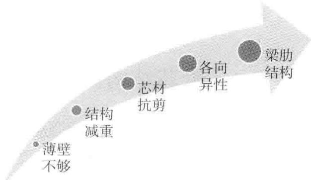

flowchart

```mermaid
graph LR
    A["薄壁不够"] --> B["结构减重"]
    B --> C["芯材抗剪"]
    C --> D["各向异性"]
    D --> E["梁肋结构"]
```

图 4-40 叶片夹芯结构发展历程

叶片中壳体和腹板中都存在夹芯结构，腹板夹芯结构已经在本书 4.2 节中介绍过，此处不再重复。一般情况下，叶片壳体段一共存在四处夹芯结构，如图 4-41 所示，分别为下模前缘夹芯段、下模尾缘夹芯段、上模前缘夹芯段和上模尾缘夹芯段。

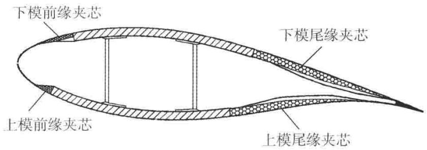

text_image

下模前缘夹芯
上模前缘夹芯
下模尾缘夹芯
上模尾缘夹芯

图 4-41 叶片壳体夹芯结构部位

# 4.4.1 芯材结构构型

夹芯结构是复合材料构件的一种，其构型形式基本为面板与芯材组成。按照芯材材料的剪切性能的不同可以分为硬夹芯和软夹芯，本书中将夹芯结构按照芯材材料来区分其构型，见表 4-12，详细的夹芯结构的理论与分析方法参见本书第 13 章。

表 4-12 夹芯结构构型表

<table><tr><td>分类方式</td><td>A</td><td>B</td><td>C</td><td>D</td></tr><tr><td>按芯材材料分</td><td>PVC 泡沫</td><td>Balsa 木</td><td>蜂窝</td><td>其他</td></tr></table>

# 4.4.2 芯材结构设计

叶片夹芯设计，包括芯材铺设设计、芯材套料图、芯材倒角的设计。芯材要保证一定的厚度，满足稳定性要求的同时，还需保证叶片弦向的铺层厚度不能有突变。

叶片壳体夹芯结构套料图，需要明确叶片展向的芯材厚度和面积分布。

# 1. 芯材铺设设计

叶片夹芯铺层设计中主要考虑夹芯结构的芯材厚度和芯材铺设范围，根据主梁和前尾缘梁的铺层形式确定芯材铺层的厚度和铺设范围，同时应确保夹芯结构能够满足叶片整体的强度和抗屈曲要求。在满足叶片整体结构性能的前提下，应尽可能通过合理的夹芯结构铺层设计优化叶片的总重。

叶片夹芯结构的芯材选材也很重要，芯材应有一定的剪切性能和抗压缩性能，且含胶后密度变化，确保叶片整体夹芯结构能满足结构和重量的要求。一般情况下，叶片芯材材料主要为 Balsa 木和 PVC，如图 4-42 所示，由于 Balsa 木的剪切模量和压缩特性显著高于泡沫材料，Balsa 木含胶后的密度相比泡沫高很多，考虑减重的要求，Balsa 木不能用于铺设整个叶片夹芯段，主要用于叶片根部至最大弦长附近夹芯段铺层。从叶片最大弦长至叶尖夹芯段的铺层都是泡沫，且腹板夹芯段的芯材材料一般也是泡沫。

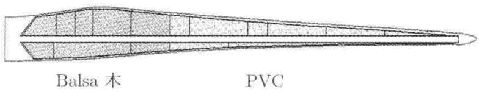

text_image

Balsa 木
PVC

图 4-42 叶片夹芯结构构型

叶片气动变桨轴和载荷作用中心相对靠近前缘，叶片结构设计的刚心和质量中心也靠近前缘。因此叶片尾缘夹芯的铺设幅宽大于前缘，故一般情况下尾缘的夹芯芯材厚度相比前缘厚。

# 2. 芯材倒角设计

由于叶片主梁和尾缘梁沿叶片展向和弦向的厚度和铺设范围不连续，因此叶片夹芯结构的芯材沿叶片展向和弦向存在厚度变化，并且弦向的厚度变化比展向突变严重很多，因此叶片壳体展向和弦向芯材存在倒角设计，如图 4-43 所示，以保证叶片铺层展向和弦向的铺层厚度不能有突变。

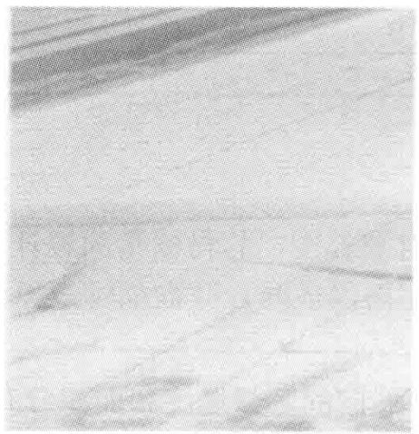

natural_image

Abstract grayscale texture with diagonal striations and a horizontal band (no text or symbols)

(a) PVC厚度变化

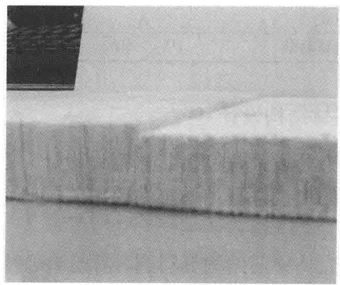

natural_image

Close-up of a textured surface with a dark rectangular object on the left (no visible text or symbols)

(b) Balsa木厚度变化  
图 4-43 夹芯芯材倒角

# 3. 芯材套料图

叶片夹芯芯材的套料图应确定叶片芯材的铺设范围和铺设面积，及叶片夹芯铺层的厚度和倒角的设计。合理的叶片套料图能显著提高叶片生产效率，叶片夹芯铺层套料图如图 4-44 所示。

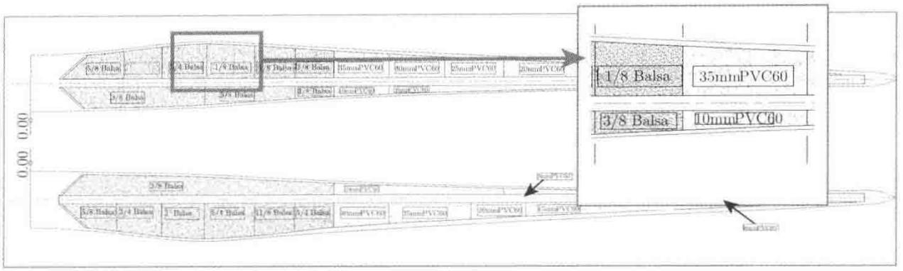

text_image

5/8 Balsa
3/8 Balsa
1/8 Balsa
8 Duplex
400000000000000000000000000000000000000000000000000000000000000000000000000000
5/8 Balsa
3/8 Balsa
8 Duplex
40000000000000000000000000000000000000000000
5/8 Balsa
3/8 Balsa
8 Duplex
40000000000000000000000000000000000
1/8 Balsa
3/8 Balsa
1/8 Balsa
8/4 Balsa
4.5mm PVC6d
4.5mm PVC6d
2.5mm PVC6d
2.5mm PVC6d
1/8 Balsa
35mm PVC6d
3/8 Balsa
1.5mm PVC6d
1.5mm PVC6d
1.5mm PVC6d
1.5mm PVC6d
1.5mm PVC6d
1.5mm PVC6d
1.5mm PVC6d
1.5mm PVC6d
1.5mm PVC6d
1.5mm PVC6d
1.5mm PVC6d
1.5mm PVC6d
1.5mm PVC6d
1.7mm PVC6d
1.7mm PVC6d
1.7mm PVC6d
1.7mm PVC6d
1.7mm PVC6d
1.7mm PVC6d
1.7mm PVC6d
1.7mm PVC6d
1.7mm PVC6d
1.7mm PVC6d
1.7mm PVC6d
1.7mm PVC6d
1.7mm PVC6e

图 4-44 叶片夹芯铺层位置

叶片夹芯结构的设计成果可包括 3D FEM 分析云图、2D 铺层图及产品实体图，见表 4-13。

表 4-13 夹芯结构结果图示

<table><tr><td>设计成果</td><td colspan="2">图示</td></tr><tr><td rowspan="2">3D FEM 分析云图</td><td colspan="2">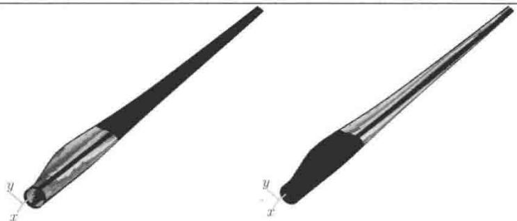</td></tr><tr><td>Balsa木</td><td>PVC泡沫</td></tr><tr><td>实体图</td><td colspan="2">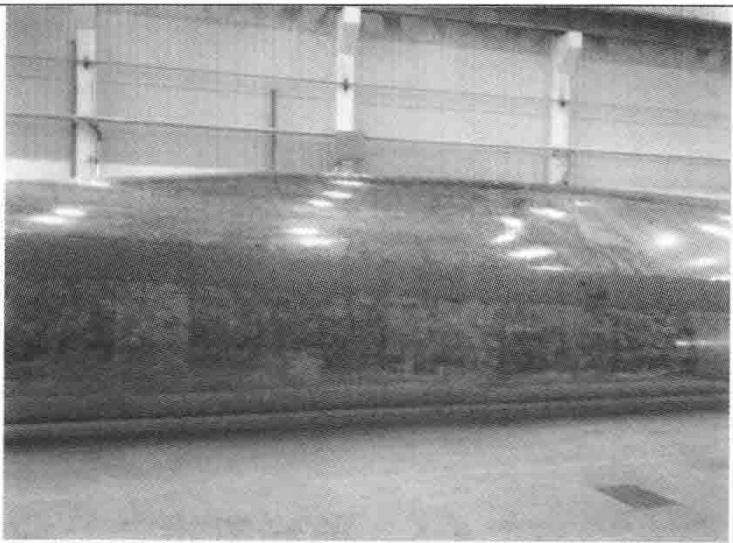</td></tr></table>

# 4.4.3 夹芯结构工艺概述

叶片夹芯芯材铺设应严格按照叶片套料图进行泡沫的剪裁和铺设。由于设计理想性和工艺操作中往往存在理论与实际的偏差，实际生产中叶片夹芯芯材套料图的剪裁不可能与设计完全一致，因此生产过程中芯材的铺设质量尤其重要。芯材铺设中应确定芯材之间的间隙，严格控制在质检要求的范围内（如 $\leqslant3mm$ ），否则会造成叶片夹芯段积胶过多而导致局部屈曲破坏。

如图 4-45 所示, 若在叶片芯材铺设过程中出现间隙过大, 需要切一块适当大小的泡沫 (适合缝隙) 并用它填充。

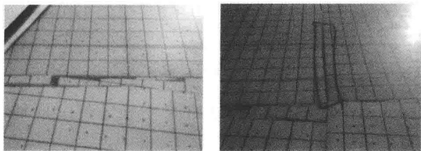

natural_image

Two grayscale photos showing a tiled floor with grid patterns and a rectangular cutout on the right (no text or symbols)

图4-45 芯材工艺铺设间隙

铺设的泡沫与底层玻纤布贴合，不能出现芯材与壳体不贴合或者拱起的现象，如图 4-46 所示。一旦出现较大空腔，将会在叶片灌输过程中局部积胶，显著降低叶片的局部强度，造成局部损坏。

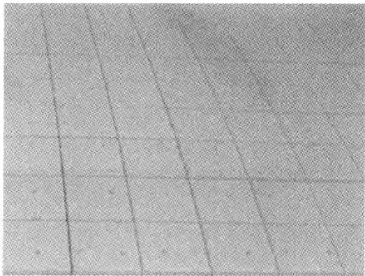

natural_image

Close-up of a textured surface with faint grid lines and no visible text or symbols

图 4-46 芯材与叶片壳体贴合度

泡沫铺设修补时，原则上切割过程不允许直接在模具里进行，必要时找一块隔板垫在下面进行切割，切割完成后必须清理，不得有碎片留在模具里，因为这些细小的泡沫琐屑对叶片铺层层间剪切的性能影响很大。

# 4.5 前缘梁设计及前缘胶接

叶片前缘梁承受摆振方向的弯矩作用，同时提供前缘合模的黏接特性。根据叶片前缘梁的受力特性，前缘梁的铺层采用单向带的形式。图 4-47 为叶片前缘梁的示意图。

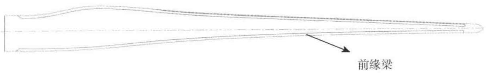

text_image

前缘梁

图 4-47 叶片前缘梁设计

# 4.5.1 前缘梁结构设计

叶片各截面前缘是产生气动升力的主要部位，前缘粗糙度和前缘光滑过渡是前缘气动设计的主要设计参数。而在结构设计中，前缘铺层设计尤为重要，增强前缘的刚度和强度，可提高叶片整体的摆振刚度、强度、抗冲击等特性。

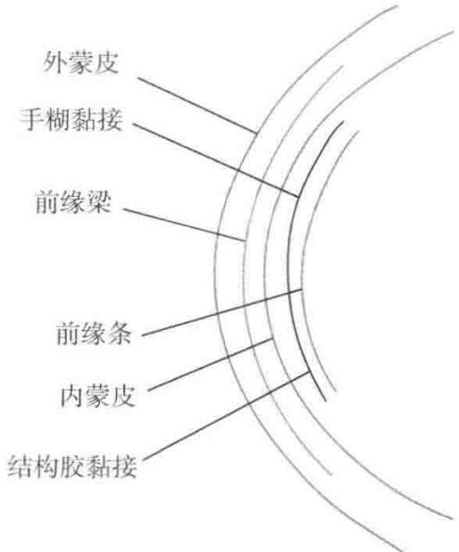

text_image

外蒙皮
手糊黏接
前缘梁
前缘条
内蒙皮
结构胶黏接

图 4-48 叶片前缘铺层设计

如图 4-48 所示，叶片前缘铺层包括外蒙皮、前缘梁、内蒙皮、胶接和前缘条。前缘梁铺层的明细见表 4-14。前缘梁的产品如图 4-49 所示。

表 4-14 叶片前缘铺层明细

<table><tr><td>铺层</td><td>细节</td><td>材料</td><td>说明</td></tr><tr><td>外蒙皮</td><td>叶片整体外壳</td><td>三轴向布双轴向布</td><td>—</td></tr><tr><td>前缘梁</td><td>前缘局部</td><td>单向布</td><td>增加摆振刚度,减小叶片整体摆振方向的变形,避免气动弹性稳定性效应</td></tr><tr><td>内蒙皮</td><td>叶片整体内壳</td><td>三轴向布双轴向布</td><td>—</td></tr><tr><td>胶接</td><td>吸力面(叶片下模)手糊黏接压力面(叶片上模)结构胶黏接</td><td>树脂基体结构胶黏剂</td><td>叶片上下模黏接成整体,保证胶接特性,避免前缘开裂</td></tr><tr><td>前缘条</td><td>前缘局部,与黏接范围相当</td><td>双轴向布</td><td>保证胶接性能</td></tr></table>

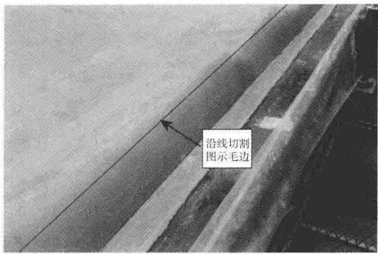

text_image

沿线切割
图示毛边

图 4-49 叶片前缘条示意图

叶片各截面的刚度中心，相对尾缘较远前缘较近，增加尾缘梁铺层对摆振方向的刚度作用相比增加前缘梁铺层大很多。

# 4.5.2 前缘胶接形式

叶片前缘胶接主要是通过前缘梁将叶片上模和下模以胶接工艺连接为叶片整体，若叶片整体不分上下模结构而是整体一体成型，则不需要前缘及尾缘胶接形式。

叶片前缘梁与叶片下模手糊黏接，同时通过前缘梁模具及辅助工装控制前缘梁的位置和尺寸等，如图 4-50 所示的胶接辅助模具，确保叶片合模间隙在公差范围内。叶片前缘胶接，将结构胶黏剂均匀地涂于与叶片上模合模黏接的前缘黏结处，并且胶接工艺应符合叶片前缘胶接的技术要求。

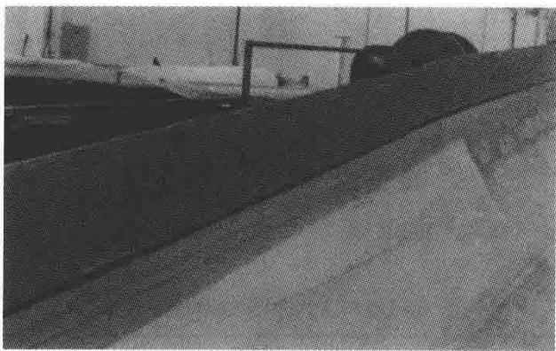

natural_image

Exterior view of a modern office building (no signage)

图4-50 前缘胶接辅助模具

# 4.6 尾缘梁设计及尾缘胶接

叶片尾缘梁承受摆振方向的弯矩作用，同时提供尾缘合模的黏接特性。根据叶片尾缘梁的受力特性，尾缘梁的铺层采用单向带的形式。图 4-51 所示为叶片尾缘梁示意图。

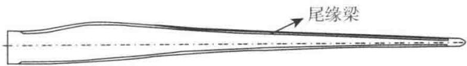

text_image

尾缘梁

图 4-51 叶片尾缘梁设计

叶片尾缘开裂占叶片破坏事故原因的比例很大，据不完全统计，叶片事故中， $40\%$ 的破坏形式是尾缘开裂。因此，提高尾缘胶接设计的能力和给出高质量的尾缘设计，是叶片设计的重中之重。

叶片尾缘设计与尾缘梁设计密不可分，尾缘梁设计主要是确定尾缘单向布的幅宽和沿展向的铺层厚度、位置分布及错层方式。尾缘设计则是在确定尾缘梁设计结果的前提下明确尾缘胶接形式与胶接设计。主导叶片尾缘设计的因素很多，包括气动设计、结构设计、模具设计与工艺设计等多方面。良好的尾缘设计形式，不仅可以保证叶片气动性能和结构刚度等特性，还能保证叶片生产过程中操作方便等。本章节为满足良好的尾缘形式，确定尾缘设计的综合目标如下：

(1) 尾缘厚度和夹角需满足气动性能;   
(2) 尾缘摆振刚度和合理的铺层，保证结构特性；  
(3) 避免尾缘变形量过大，引起气动弹性稳定性的问题；  
(4) 尾缘工艺的可操作性和方便性;  
(5) 尾缘生产中胶接厚度满足技术要求;  
(6) 尾缘结构形式的合理过渡。

# 4.6.1 尾缘梁构型设计

尾缘梁一般均采用单向布铺层，按照不同的成型工艺、错层及铺层材料可以区分其构型形式，见表 4-15。其尾缘梁构型的细节示意图见表 4-16。

表 4-15 尾缘梁构型类别

<table><tr><td>分类方式</td><td>A</td><td>B</td><td>C</td><td>D</td></tr><tr><td>按成型工艺分</td><td>一体成型</td><td>灌输成型</td><td></td><td>其他</td></tr><tr><td>按错层分</td><td>S形错层</td><td>单向错层</td><td></td><td>其他</td></tr><tr><td>按材料分</td><td>玻璃纤维</td><td>碳纤维</td><td></td><td>其他</td></tr></table>

表 4-16 尾缘梁构型图示

<table><tr><td>分类</td><td>构型</td><td colspan="2">图示</td></tr><tr><td></td><td>A</td><td colspan="2">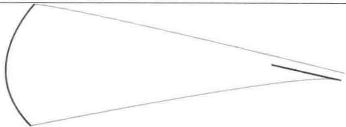</td></tr><tr><td>成型工艺</td><td></td><td colspan="2"></td></tr><tr><td>分类</td><td>构型</td><td colspan="2">图示</td></tr><tr><td rowspan="3"></td><td rowspan="3">B</td><td>下模/S面</td><td>上模/P面</td></tr><tr><td>尾缘</td><td>前缘前缘</td></tr><tr><td>叶根往叶尖看</td><td>叶根往叶尖看</td></tr><tr><td rowspan="3">尾缘梁形状</td><td rowspan="2">A</td><td rowspan="2">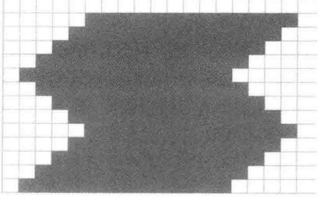</td><td rowspan="2">S形错层</td></tr><tr></tr><tr><td>B</td><td>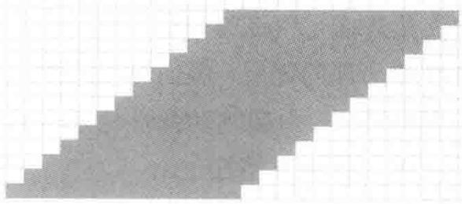</td><td>单向错层</td></tr></table>

目前风力机叶片主流是采用灌输成型工艺，而 S 形错层与单向错层应综合考虑尾缘厚度、尾缘梁设计与尾缘胶接设计等方面后合理选择，两种错层方式都得到普遍应用。

一些尾缘梁铺层幅宽的叶片设计中，采用不同的错层形式下，尾缘梁的厚度分布不同，因而尾缘设计及胶接设计都会采用不同的设计方式，如图 4-52 所示为 S 形错层的尾缘梁厚度分布。

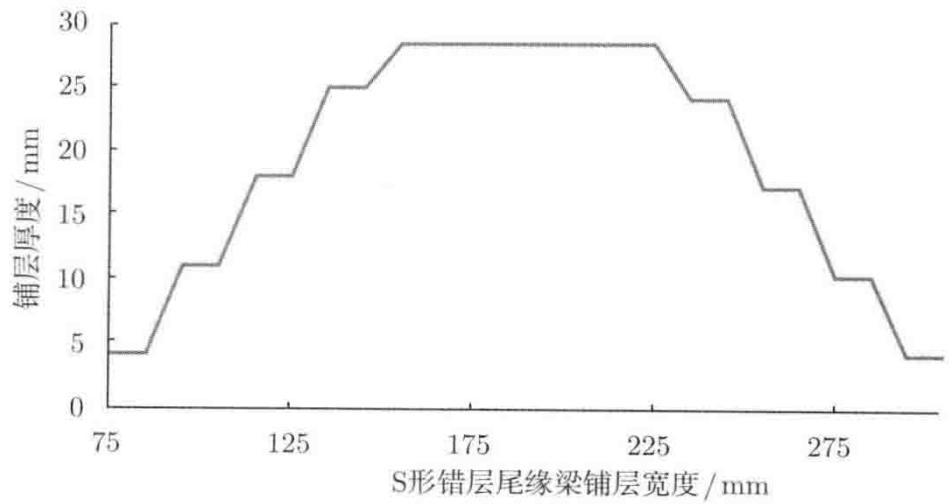

line

| S形错层尾缘梁铺层宽度/mm | 铺层厚度/mm |
| ------------------------ | ----------- |
| 75                       | 4           |
| 125                      | 18          |
| 175                      | 28          |
| 225                      | 28          |
| 275                      | 10          |
| >275                     | 4           |

图 4-52 S 形错层的尾缘梁厚度分布

尾缘梁铺层应基于叶片本身的铺层坐标系，叶片铺层坐标系是根据实际需要特别定义的一组坐标系。为了生产时能方便操作，分别定义了 S 面 (吸力面) 和 P 面 (压力面) 的前缘铺层坐标系、主梁中心坐标系和尾缘铺层坐标系，共 6 个坐标系。叶片尾缘梁的铺层基于 P 面的尾缘铺层坐标系如图 4-53 所示。

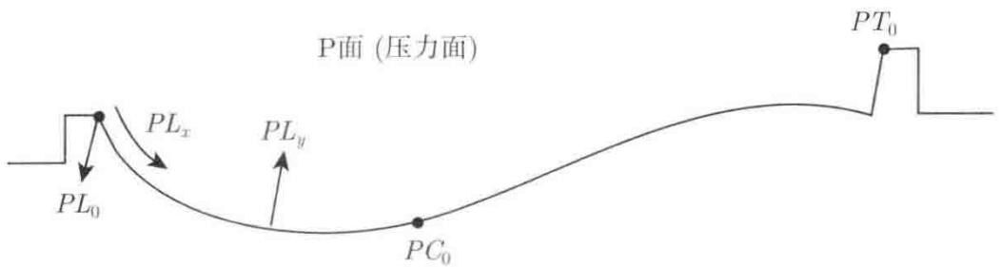

text_image

P面 (压力面)
PL₀
PLₓ
PLᵧ
PC₀
PT₀

图 4-53 合模前 P 面 (压力面) 铺层坐标系

表 4-17 给出叶片合模前坐标系定义表，以 P 面为例。

表 4-17 合模前 P 面（压力面）坐标系定义表

<table><tr><td colspan="2">坐标系名称</td><td>坐标系正方向定义</td></tr><tr><td>P面前缘铺层坐标系</td><td>PL</td><td> $PL_x$ 方向:由模具前缘点,沿P面模具,向尾缘铺为正; $PL_y$ 方向:沿模具表面的法线方向,指向模具内部为正; $PL_z$ 方向:平行于地面,由叶根指向叶尖;坐标原点 $PL_0$ :P面模具各截面的模具前缘点</td></tr><tr><td>P面主梁坐标系</td><td>PC</td><td> $PC_x$ 方向:由主梁中心点,沿P面模具,向尾缘铺为正; $PC_y$ 方向:沿模具表面的法线方向,指向模具内部为正; $PC_z$ 方向:平行于地面,由叶根指向叶尖;坐标原点 $PC_0$ :P面模具各截面主梁的中心点</td></tr><tr><td>P面尾缘铺层坐标系</td><td>PT</td><td> $PT_x$ 方向:由模具尾缘点,沿P面模具,向前缘铺为正; $PT_y$ 方向:沿模具表面的法线方向,指向模具内部为正; $PT_z$ 方向:平行于地面,由叶根指向叶尖;坐标原点 $PT_0$ :P面模具各截面的模具尾缘点</td></tr></table>

# 4.6.2 尾缘结构设计

尾缘结构设计应考虑气动、结构、工艺、制造等方方面面的因素，应结合造成叶片尾缘开裂的原因进行分析与设计，包括工艺问题、模具问题、结构问题和气动问题等多方面因素。图 4-54 简述叶片尾缘开裂的原因。

# 1. 尾缘胶接参数

尾缘胶接构型、特性与分区，应考虑如图 4-55 所示的基本三要素：尾缘厚度 t，尾缘角 $\theta$ ，尾缘局部空腔厚度 h。

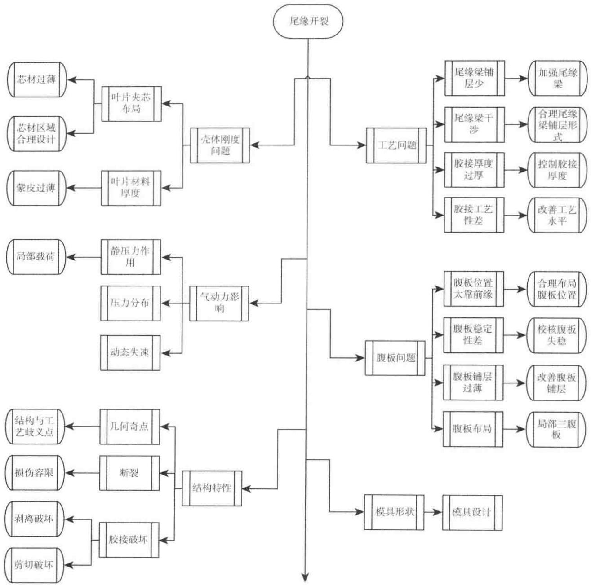

flowchart

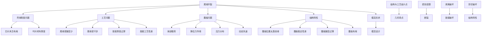
```mermaid
graph TD
    A["尾缘开裂"] --> B["壳体刚度问题"]
    A --> C["工艺问题"]
    A --> D["腹板问题"]
    A --> E["结构特性"]
    A --> F["模具形状"]
    
    B --> G["芯片夹芯布局"]
    B --> H["叶片材料厚度"]
    
    C --> I["尾缘梁铺层少"]
    C --> J["尾缘梁干涉"]
    C --> K["胶接厚度过厚"]
    C --> L["胶接工艺性差"]
    
    D --> M["局部载荷"]
    D --> N["静压力作用"]
    D --> O["压力分布"]
    D --> P["动态失速"]
    
    E --> Q["腹板位置太靠前缘"]
    E --> R["腹板稳定性差"]
    E --> S["腹板铺层过薄"]
    E --> T["腹板布局"]
    
    F --> U["模具设计"]
    
    V["结构与工艺歧义点"] --> W["几何奇点"]
    
    X["损伤容限"] --> Y["断裂"]
    
    Z["剥离破坏"] --> AA["胶接破坏"]
    
    AB["剪切破坏"] --> AC["结构特性"]
```

图4-54 尾缘开裂原因分析

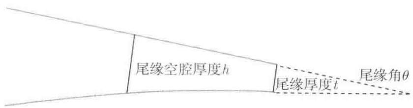

text_image

尾缘空腔厚度h
尾缘厚度t
尾缘角θ

图4-55 尾缘因素

# 2. 尾缘胶接构型

叶片展向尾缘厚度不同，且尾缘厚度变化较大。叶片尾缘厚度分布基于叶片上尾缘点和下尾缘点的尾缘铺层坐标系。根据不同的展向位置，确定不同的尾缘构型。

沿叶片展长方向，如图 4-56 所示，将叶片尾缘胶接设计分为：叶根外包边，叶根内包边，尾缘手糊包边，尾缘预制件，尾缘过渡胶接段，尾缘直接胶接段。叶片尾缘构型详见表 4-18。

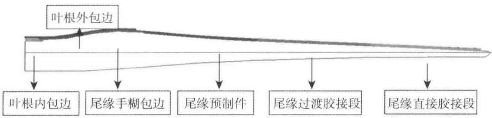

text_image

叶根外包边
叶根内包边
尾缘手糊包边
尾缘预制件
尾缘过渡胶接段
尾缘直接胶接段

图 4-56 尾缘展向构型区域划分

表 4-18 叶片展向尾缘构型细节

<table><tr><td>序号</td><td>构型类别</td><td>胶接面</td><td>手糊面</td><td>备注</td></tr><tr><td>A</td><td>直接胶接段</td><td>2</td><td>0</td><td>尾缘较薄区域</td></tr><tr><td>B</td><td>过渡胶接段</td><td>2</td><td>0</td><td>叶中至叶尖附近,设计尾缘泡沫和倒角</td></tr><tr><td>C</td><td>预制缘条</td><td>2</td><td>0</td><td>叶中尾缘较厚,根据尾缘缘条预制件形状预制缘条,控制胶接厚度</td></tr><tr><td>D</td><td>手糊包边</td><td>1</td><td>1</td><td>最大弦至叶中尾缘很厚,手糊缘条包边于叶片上模,包边与下模黏接</td></tr><tr><td>E</td><td>叶根内包边</td><td>0</td><td>2</td><td>叶根圆柱段附近,尾缘内包边增强,手糊工艺</td></tr><tr><td>F</td><td>叶根外包边</td><td>0</td><td>2</td><td>叶根至叶片最大弦附近,尾缘外包边增强,手糊工艺</td></tr><tr><td>G</td><td>一体成型尾缘预制缘条</td><td>-</td><td>-</td><td>一体成型工艺</td></tr><tr><td>H</td><td>整体一体成型</td><td>-</td><td>-</td><td>全叶片一体成型</td></tr></table>

# 1) 尾缘直接胶接段

靠近叶片叶尖位置，叶片尾缘厚度较小，满足直接黏接的要求。此时叶片尾缘处上下模内蒙皮都为胶接面，如图 4-57 所示。

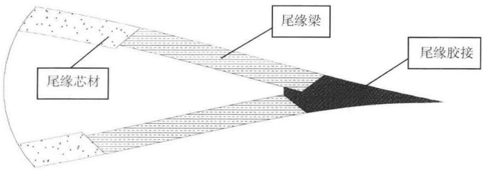

text_image

尾缘芯材
尾缘梁
尾缘胶接

图 4-57 尾缘直接胶接段构型

# 2) 尾缘过渡胶接段

叶中靠近叶尖附件，叶片尾缘厚度适中，可通过设计尾缘泡沫倒角或尾缘梁的布局后，采用直接黏接的形式。此时叶片尾缘上下模内蒙皮为胶接面，如图 4-58 所示。

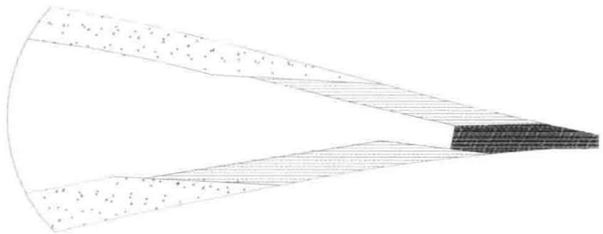

natural_image

Diagram of a geometric structure with shaded regions and scattered dots, no text or symbols present

图 4-58 尾缘过渡胶接段构型

# 3) 尾缘预制缘条

叶片最大弦长附近至叶中段，尾缘空腔厚度较厚，可在叶片设计阶段根据尾缘的厚度、铺层形式与胶接厚度，考虑一定的公差影响，确定尾缘预制件的形式。预制缘条分别与叶片上下模黏接，如图 4-59 所示。

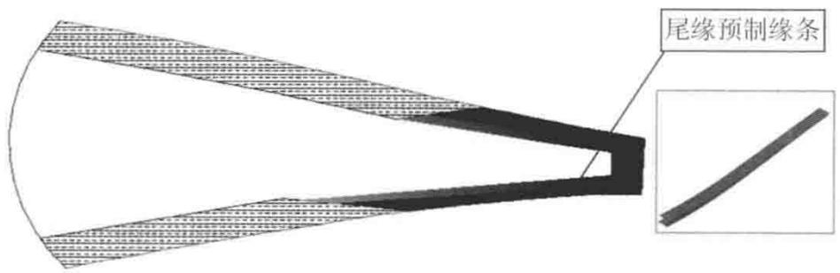

text_image

尾缘预制线条

图 4-59 尾缘预制缘条构型

# 4) 尾缘手糊包边

叶根附近至最大弦一段为叶片尾缘，厚度很厚，需要按照尾缘手糊包边模具手糊尾缘缘条，有效控制尾缘胶接段的胶层厚度。尾缘手糊包边与叶片下模手糊，与叶片上模胶接，如图 4-60 所示。

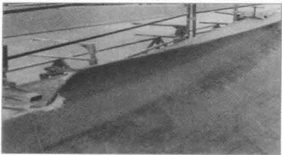

natural_image

Exterior view of a modern office building (no signage)

图 4-60 尾缘手糊包边构型

# 5) 叶根内包边

叶根圆柱段增加尾缘内包边提高尾缘黏接特性。叶片内包边在叶片上模与下模都是手糊工艺，如图 4-61 所示。

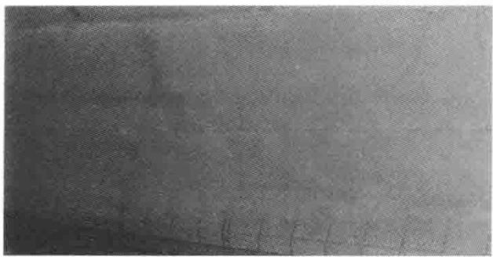

natural_image

Grayscale textured surface with no visible text, symbols, or identifiable objects

图 4-61 内包边示意图

# 6) 叶根外包边

叶根由圆柱段过渡到最大弦长附近，由于曲率变化较大，同时叶片尾缘段很厚，需要增加尾缘外包边提高尾缘黏接，防止尾缘开裂，如图 4-62 所示。

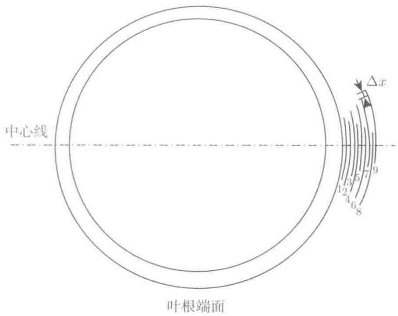

text_image

中心线
叶根端面
Δx

图 4-62 外包边示意图

# 3. 尾缘胶接区域划分

沿叶片展向，划分尾缘不同形式的影响指标为尾缘厚度和尾缘角。根据尾缘厚度和尾缘角的关系，确定尾缘划分区域，如图 4-63 所示。

以某款叶片为例，根据尾缘厚度与尾缘角的关系，划分叶片尾缘形式，选择叶片各段合适的尾缘构型，用于工艺设计与结构校核。叶片尾缘形式确认需将表 4-19 填完整，同时可确定全叶片的尾缘形式分布，如图 4-64 所示。

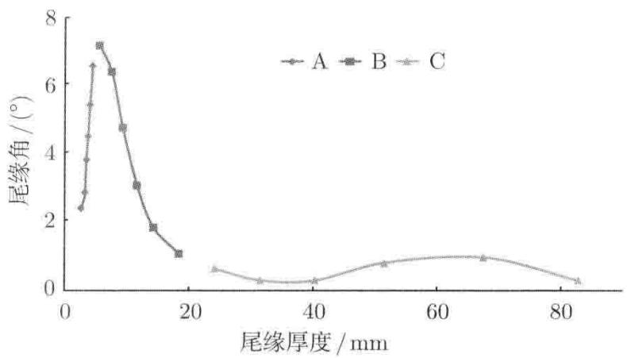

line

| 尾缘厚度 / mm | A    | B    | C    |
| -------------- | ---- | ---- | ---- |
| 0              | 2.3  | 2.4  | 2.5  |
| 5              | 6.5  | 7.2  | 6.8  |
| 10             | 4.8  | 6.5  | 5.5  |
| 15             | 3.0  | 4.8  | 3.5  |
| 20             | 1.8  | 3.0  | 2.0  |
| 25             | 1.0  | 1.8  | 0.8  |
| 30             | 0.5  | 1.0  | 0.5  |
| 35             | 0.3  | 0.5  | 0.3  |
| 40             | 0.2  | 0.3  | 0.2  |
| 45             | 0.3  | 0.5  | 0.3  |
| 50             | 0.5  | 0.7  | 0.5  |
| 55             | 0.7  | 0.9  | 0.7  |
| 60             | 0.9  | 1.0  | 0.9  |
| 65             | 1.0  | 1.1  | 1.0  |
| 70             | 0.9  | 1.0  | 0.9  |
| 75             | 0.7  | 0.8  | 0.7  |
| 80             | 0.5  | 0.6  | 0.5  |
| 85             | 0.3  | 0.4  | 0.3  |
| 90             | 0.2  | 0.3  | 0.2  |
| 95             | 0.1  | 0.2  | 0.1  |
| 100            | 0.05 | 0.15 | 0.05 |

图 4-63 尾缘厚度与尾缘角关系

表 4-19 叶片展向尾缘形式

<table><tr><td>叶片展向 R/m</td><td>尾缘厚度 t/mm</td><td>尾缘角 θ/(°)</td><td> $h_{100}^{*}/mm$ </td><td>A</td><td>B</td><td>C</td><td>D</td><td>E</td><td>设计选取</td></tr><tr><td>0</td><td></td><td></td><td></td><td></td><td></td><td></td><td></td><td>√</td><td>E</td></tr><tr><td>20</td><td></td><td></td><td></td><td></td><td>√</td><td></td><td></td><td></td><td>B</td></tr></table>

$^{*}h_{100}$ 为距离尾缘 100mm 处的尾缘空腔厚度

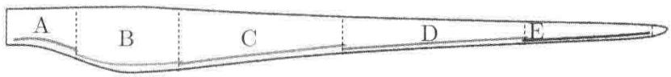

text_image

A B C D E

图 4-64 叶片展向尾缘形式

# 4. 尾缘结构设计总结

尾缘结构形式复杂，包括胶接连接与层合板结构，同时胶接与夹芯结构存在搭接段，因此尾缘是各种复杂结构形式的混合体。做好尾缘结构设计与分析，应从以下几个方面逐级分析。

(1) 尾缘胶接破坏形式: 结构胶比较薄的情况下, 尾缘胶接的破坏以剪切破坏为主; 当尾缘胶接较厚, 尾缘胶接的破坏形式以剥离破坏为主; 叶根外包边和内包边的尾缘形式, 是玻璃钢与玻璃钢之间的界面破坏为主; 根据叶片不同位置的不同胶接设计, 有限元校核中采用不同的结构形式和建模方法, 采用不同的分析方法 (如接触分析、VCCT 虚拟裂纹技术)。  
(2) 尾缘尺寸因素影响: 尾缘段曲率不连续, 存在拐点, 容易产生断裂和裂纹, 必要情况下还需要进行损伤容限的分析。  
(3) 尾缘几何奇点: 叶片尾缘铺层段的胶接终点处的几何奇点问题, 工艺与结构的共存复杂点。  
(4) 尾缘分析的载荷处理: 尾缘需要进行局部分析, 根据叶片整体分析中的尾缘局部载荷, 提取位移边界条件, 同时针对尾缘局部模型进行网格细化与拓扑优

化，进行子模型分析及超单元分析。

(5) 尾缘胶与铺层连接形式: 尾缘胶与铺层之间, 可通过 MPC 多点约束连接或接触非线性分析。

# 4.6.3 尾缘工艺概述

叶片尾缘工艺设计，通常为确定尾缘形式和尾缘铺层后，采用合理的尾缘工艺设计满足尾缘的总体需求。尾缘工艺设计的优良直接影响尾缘胶接性能，表 4-20 列举影响尾缘胶接厚度的因素。

表 4-20 尾缘工艺设计影响因素

<table><tr><td>序号</td><td>影响因素</td><td>备注</td></tr><tr><td>1</td><td>尾缘铺层层数</td><td>结构设计</td></tr><tr><td>2</td><td>尾缘铺层宽度</td><td>压力面和吸力面可不同</td></tr><tr><td>3</td><td>尾缘铺层,首层起始位置</td><td>压力面和吸力面一般不同</td></tr><tr><td>4</td><td>尾缘铺设方案</td><td>单向错层/S形铺设</td></tr><tr><td>5</td><td>尾缘夹芯倒角</td><td>倒角比例</td></tr><tr><td>6</td><td>尾缘处总体铺层形式</td><td>蒙皮、夹芯倒角、导流毡、尾缘梁等</td></tr><tr><td>7</td><td>尾缘空腔厚度</td><td>t和h</td></tr><tr><td>8</td><td>尾缘公差</td><td></td></tr><tr><td>9</td><td>尾缘厚度技术要求</td><td>胶厚要求</td></tr></table>

图 4-65 给出了不同的尾缘铺层形式，尾缘胶接厚度的分布不同。在满足尾缘胶接厚度技术要求的前提下，还需满足结构摆振刚度和尾缘强度特性。

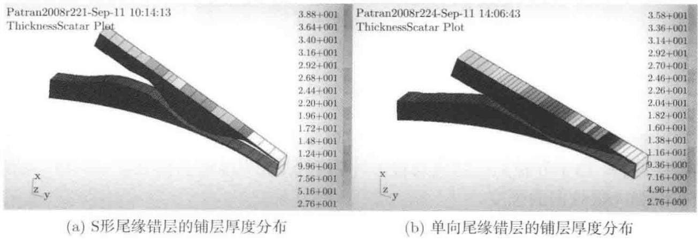  
图 4-65 不同工艺形式的尾缘铺层厚度

叶片尾缘梁铺设中应定义好尾缘沿展向的铺设范围及每层尾缘梁距尾缘点的距离，如图 4-66 所示。

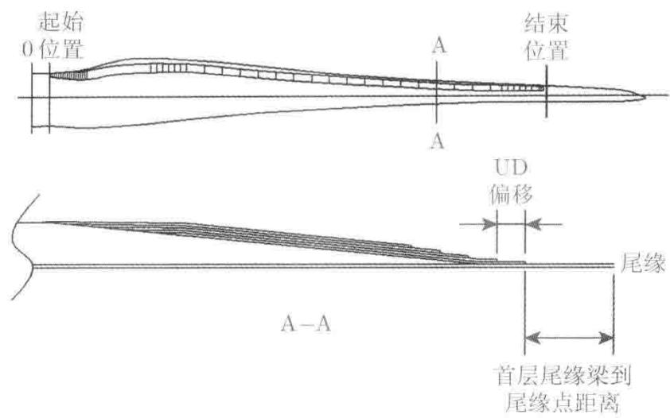

text_image

起始
0位置
A
结束
位置
A
UD
偏移
尾缘
A-A
首层尾缘梁到
尾缘点距离

图 4-66 尾缘梁铺设

# 4.7 叶根加强层设计

叶片承受的剪力、弯矩和扭矩都要由叶尖传递给叶根，再由叶根传递给轮毂。因此叶根承受较大的力，需要增铺叶根加强层。根据叶根的受力特性，叶根加强层应采用三轴织物的铺层形式。图 4-67 所示为叶根加强层示意图。

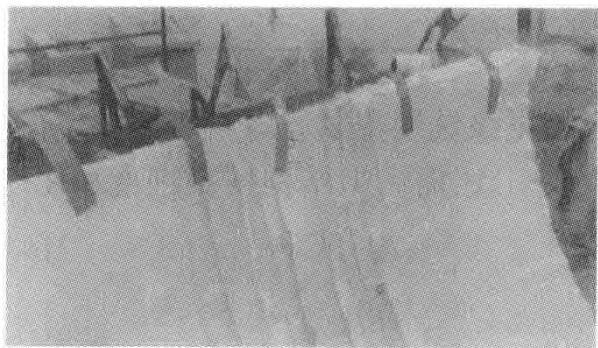

natural_image

Close-up of a textured surface with vertical dark bands and faint horizontal lines, no visible text or symbols.

图 4-67 叶根加强层示意图

叶根加强层的构型按照材料来分，可以分为三轴布叶根加强层和双轴布叶根加强层两种。由于叶根加强层铺层较多，厚度较厚，可能还会铺设含 $90^{\circ}$ 方向的多轴布增强叶根弦向的强度。

# 4.7.1 叶根加强层结构设计

叶根加强层沿叶片根部满铺，如图 4-68 所示，主要需要确定叶根加强层的展向铺设范围。为了节省材料，且减小叶根加强层铺层结束段与主梁相接段的刚度突变，叶根加强层在结束段应做一定的裁剪，如图 4-69 所示。

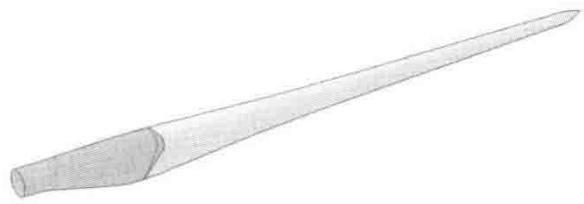

natural_image

Simple line drawing of a long, pointed tool with a textured handle (no text or symbols)

图 4-68 叶根加强层构型示意图

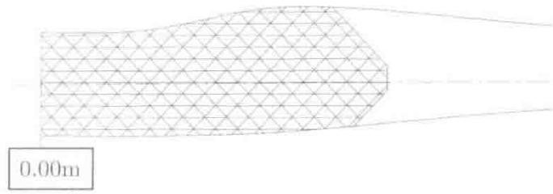

text_image

0.00m

图 4-69 叶根加强层铺层形式

叶根加强层在结束段裁剪应确定裁剪的几何参数，包括叶根加强层结束段的倒角和梁宽。如图 4-70 所示，一般情况下叶根加强层结束段的倒角为 $45^{\circ}$ ，梁宽与叶片主梁铺层的宽度基本相当。

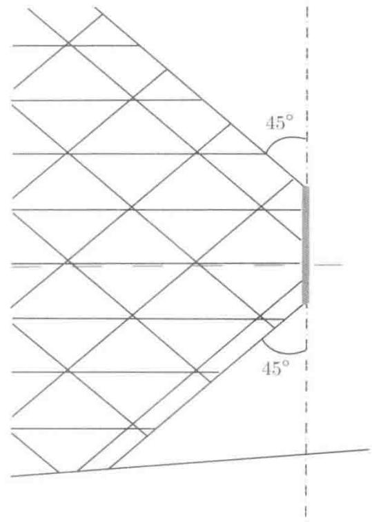

text_image

45°
45°

图 4-70 叶根加强层结束段倒角和梁宽

# 4.7.2 叶根加强层工艺概述

叶根加强层沿叶片叶根弦向满铺，同蒙皮铺层一样需要将满铺的叶根加强层沿弦向分成 N 段，每段的搭接宽度需要符合复合材料的工艺设计要求，如图 4-71 所示。叶根加强层沿叶片展向应定义各层的铺设范围和具体的倒角位置与倒角后的梁宽。

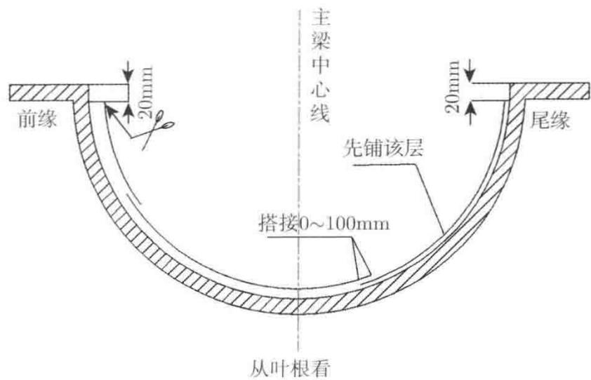

text_image

前缘
20mm
主梁中心线
先铺该层
搭接0~100mm
从叶根看
20mm
尾缘

图 4-71 叶根加强层铺层

叶根加强层的设计及工艺与叶根工艺关系较大。叶根为预埋工艺时，应保证叶根加强层与预埋螺栓套紧密贴合，避免叶根积胶造成叶根整体力学性能显著下降。在预埋叶根工艺中，定位叶根螺栓套时应通过叶根法兰辅助，此时叶根加强层与叶根法兰之间的间隙控制及叶根端面形式对叶根整体力学性能影响较大，此处详见本书第15章叶根预埋螺栓结构校核；若叶根为后打孔工艺，应在叶根圆柱段增加预制叶根箍，防止在后打孔时由于打孔冲击而损坏叶根。

# 4.8 叶根连接设计

叶片通过螺栓与变桨轴连接，再通过螺栓连接于变桨轴和轮毂之间。叶片叶根有两种方式，后打孔与预埋螺栓的设计。叶片后打孔设计，需要保证叶根的铺层厚度，保证后打孔工艺的铺层厚度要求，而叶片预埋螺栓的设计，需要满足叶片螺栓套的铺层设计以及叶根螺栓设计。

螺栓连接是复合材料主承力结构的主要连接形式。为满足结构完整性要求，除静强度和刚度外，螺栓连接还必须满足疲劳、损伤容限和功能要求。螺栓连接部位较大的应力集中使其成为主承力结构的重要疲劳薄弱环节之一。鉴于复合材料连接的寿命预估方法尚未成熟，目前工程上确定螺栓连接疲劳强度的主要手段是试验，尤其是在复杂环境条件下更需如此。

# 4.8.1 叶根螺栓连接形式

叶片叶根需要与变桨轴承通过螺栓连接，再通过变桨轴承与轮毂连接。由于叶根是螺栓连接形式，这涉及复合材料与金属的连接。图 4-72 为预埋叶根螺栓工艺，图 4-73 为后打孔螺栓工艺。

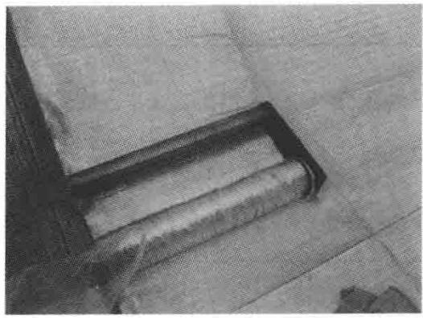

natural_image

Close-up of a rolled-up document or scroll with a dark rectangular frame, placed on a textured surface (no visible text or symbols)

图 4-72 预埋螺栓工艺

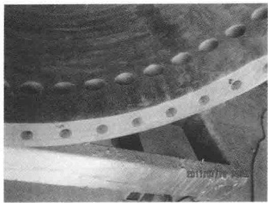

natural_image

Close-up of a curved metallic object with circular holes, possibly a mechanical or architectural component (no visible text or symbols)

图 4-73 后打孔螺栓工艺

目前国内市场上风力发电机叶片主要采用后打孔工艺，安装 T 型螺栓，以用于叶根和轮毂的连接。另外，也有部分企业采用预埋螺栓套工艺，现将两种工艺分别从工艺和结构角度进行对比，见表 4-21 和表 4-22。

表 4-21 预埋叶根和后打孔工艺对比

<table><tr><td>项目</td><td>叶根螺栓套预埋</td><td>叶根T型螺栓形式</td><td>对比结果</td></tr><tr><td>定位</td><td>螺栓套定位方便,通过叶根法兰准确定位</td><td>打孔定位复杂</td><td>预埋工艺定位方便且准确</td></tr><tr><td>铺层</td><td>叶根螺栓套铺层工艺较复杂</td><td>叶根铺层需要加厚,加强,增加导注难度</td><td>预埋工艺叶根灌输难度相对较低</td></tr><tr><td rowspan="2">物料</td><td>增加模具叶根法兰,无材料损耗</td><td>增加打孔设备,加工过程中有材料损耗</td><td>材料损耗低,工装成本低</td></tr><tr><td>螺栓套缠丝等工序准备时间约为2h</td><td>不占用模具时间</td><td></td></tr><tr><td rowspan="2">工时</td><td rowspan="2">螺栓套安装占用约1.5h的模具时间(叶根法兰密封性测试可在叶片铺设同步完成,不占用模具时间,预埋螺栓套与叶片同时固化成型)</td><td>叶片脱离模具,初步修补后,进行后打孔准备,定位,切割,打孔,工时较长</td><td rowspan="2">消耗工时少,叶片和叶根螺栓套一体成型</td></tr><tr><td>安装圆柱螺母,手糊等需要5~6h</td></tr><tr><td>螺栓数量</td><td>预埋工艺一体成型,可以使用更多数量的螺栓</td><td>后打孔会使叶根的结构强度减弱,约束了螺栓套的使用数量</td><td rowspan="2">预埋工艺可以安装更多的叶根螺栓,来传递叶根载荷若出现缺陷,两种工艺修复都较困难</td></tr><tr><td>风险</td><td>叶根螺栓浸润效果不良,出现干纤维</td><td>叶根定位不准,导致螺栓孔偏心</td></tr></table>

表 4-22 预埋叶根和后打孔结构对比

<table><tr><td>项目</td><td>叶根螺栓套预埋</td><td>叶根T型螺栓形式</td><td>对比结果</td></tr><tr><td>数量</td><td>数量多,预埋孔大则消耗复合材料多</td><td>数量少</td><td>预埋工艺不破坏现有结构</td></tr><tr><td>预紧力</td><td>不承担预紧力</td><td>预紧力较大,高强螺栓预紧力可能达到叶根外载的3~8倍</td><td>预埋工艺不承担预紧力</td></tr><tr><td>冲击</td><td>—</td><td>打孔时存在冲击性载荷</td><td>预埋工艺无冲击性载荷</td></tr><tr><td>承载</td><td>预埋螺栓数量多,平均分配到每颗螺栓的外载小</td><td>每颗螺栓分配到的载荷大</td><td>预埋工艺中,每颗螺栓分配到的载荷偏小</td></tr><tr><td>建模</td><td>金属件与复合材料件同时建模,接触模型</td><td>可分开建模,非线性计算</td><td>后打孔工艺结构建模简单</td></tr></table>

# 1. 叶根后打孔工艺

叶根需要有较厚的附加层，保证叶根厚度，如图 4-74 所示。

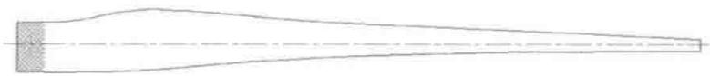

natural_image

Pure geometric line drawing of a symmetrical tapered shape with no text or symbols

图 4-74 叶根后打孔的附加层设计

后打孔工艺中，在实际生产中要保证两点：叶根端面平面度和螺栓孔的位置。

# 2. 叶根预埋螺栓形式

叶片预埋螺栓，需要保证螺栓套的铺层以及叶根螺栓设计。叶根预埋螺栓套铺层，需要保证工艺特性与结构特性。同时，叶根节圆直径与内径都要与轮毂连接相匹配。图 4-75 为叶根预埋螺栓套端面图。

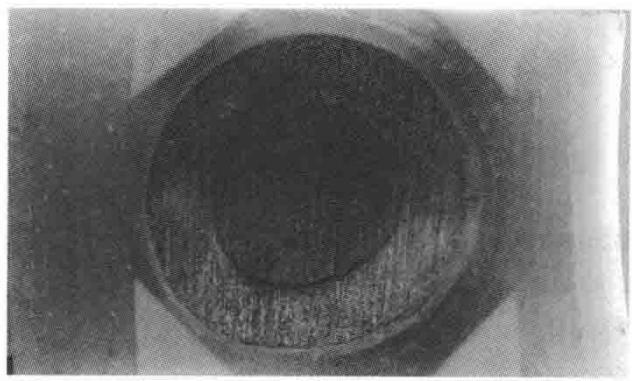

natural_image

Close-up of a circular mechanical component with textured surface (no visible text or symbols)

图 4-75 叶根预埋螺栓套

# 4.8.2 预埋螺栓构型设计

预埋螺栓构型设计从螺栓套螺纹、螺栓套端面形式、密封类型、螺栓形式、螺栓套与玻纤棒之间的配合、法兰构型设计等方面分别展开，详见表 4-23。

表 4-23 预埋螺栓构型类别

<table><tr><td colspan="2">构型类别</td><td>细节</td></tr><tr><td rowspan="2">螺栓套螺纹</td><td>外螺纹</td><td>详见表 4-24</td></tr><tr><td>内螺纹</td><td>详见表 4-25</td></tr><tr><td>螺栓套断面形式</td><td></td><td>详见表 4-26</td></tr><tr><td rowspan="3">密封</td><td>外密封</td><td>详见表 4-27</td></tr><tr><td>内密封</td><td>详见表 4-28</td></tr><tr><td>堵头密封</td><td>详见表 4-29</td></tr><tr><td>螺栓形式</td><td></td><td>详见表 4-30</td></tr><tr><td>螺栓套与玻纤棒的配合</td><td></td><td>详见表 4-31</td></tr><tr><td>法兰</td><td></td><td>详见表 4-32</td></tr></table>

# 1. 外螺纹

表 4-24 外螺纹构型

<table><tr><td></td><td>A</td><td>B</td><td>C</td></tr><tr><td>螺纹形式</td><td>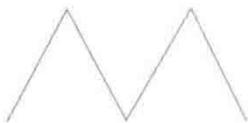</td><td>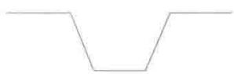</td><td>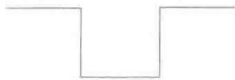</td></tr><tr><td>说明</td><td>牙底富树脂接触表面积小</td><td>避免富树脂接触表面积大</td><td>牙底富树脂</td></tr></table>

# 2. 内螺纹

表 4-25 内螺纹构型

<table><tr><td></td><td>A</td><td>B</td><td>C</td></tr><tr><td>螺纹形式</td><td>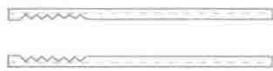</td><td>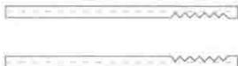</td><td>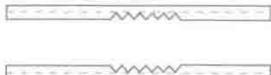</td></tr><tr><td>说明</td><td>易加工连接强度低可以设计为盲孔</td><td>易加工连接强度高若是通螺纹的,则密度复杂</td><td>加工难度相对大连接强度高密封简便</td></tr></table>

# 3. 螺栓套端面形式

表 4-26 螺栓套端面形式构型

<table><tr><td></td><td>A</td><td>B</td><td>C</td></tr><tr><td>螺栓套端面构型</td><td>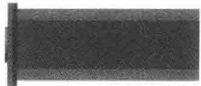</td><td>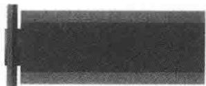</td><td>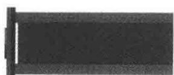</td></tr><tr><td>说明</td><td>端面与法兰平齐</td><td>螺栓套凸出</td><td>玻璃钢凸出</td></tr></table>

# 4. 外密封

表 4-27 外密封构型

<table><tr><td></td><td>A</td><td>B</td></tr><tr><td>密封形式</td><td>O型圈</td><td>密封胶条</td></tr><tr><td>优点</td><td>操作简便</td><td>灵活控制;端面要求相对较低</td></tr><tr><td>缺点</td><td>端面平面度0.2mm;配合间隙0.5mm</td><td>操作相对麻烦</td></tr></table>

# 5. 内密封

表 4-28 内密封构型

<table><tr><td></td><td>A</td><td>B</td></tr><tr><td>密封槽位置(O型圈)</td><td>法兰盘</td><td>螺栓端面</td></tr><tr><td>优点</td><td>固定密封槽,减少螺栓加工成本</td><td>可用于成型叶片法兰密封</td></tr><tr><td>缺点</td><td>—</td><td>每颗螺栓端面都需要加工</td></tr></table>

# 6. 堵头密封

表 4-29 堵头密封构型

<table><tr><td></td><td>A</td><td>B</td><td>C</td></tr><tr><td>密封形式</td><td>盲孔</td><td>平堵头</td><td>螺纹堵头</td></tr><tr><td>优点</td><td>不需要堵头</td><td>操作简便</td><td>连接紧固</td></tr><tr><td>缺点</td><td>内螺纹加工困难</td><td>配合关系不易控制</td><td>安装麻烦需增加密封圈</td></tr></table>

# 7. 螺栓形式

表 4-30 螺栓形式构型

<table><tr><td></td><td>A</td><td>B</td></tr><tr><td>螺纹形式</td><td>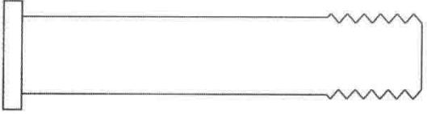</td><td>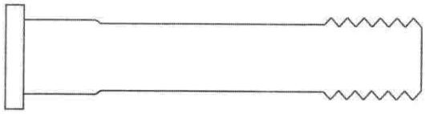</td></tr><tr><td>优点</td><td>安装简便</td><td>可能会减少加工费用</td></tr><tr><td>缺点</td><td>可能会增加加工费用</td><td>安装不易控制,不合适多次安装</td></tr><tr><td>说明</td><td>不适合多次重复安装</td><td>安装方便,易操作</td></tr></table>

# 8. 螺栓套与玻纤棒的配合

表 4-31 螺栓套与玻纤棒的配合

<table><tr><td></td><td>A</td><td>B</td><td>C</td></tr><tr><td rowspan="2">螺栓套与玻纤棒之间</td><td>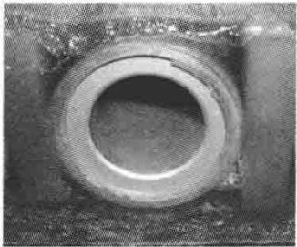</td><td>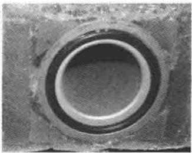</td><td>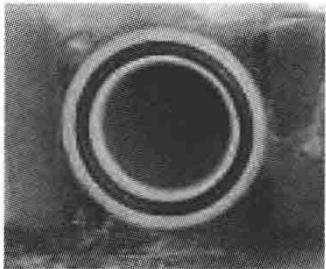</td></tr><tr><td>不填充任何材质</td><td>填充玻纤三角条</td><td>填充玻纤丝</td></tr><tr><td>优点</td><td>减少填充工序</td><td>剪切强度高,疲劳性能好;减少树脂含量;避免空腔</td><td>避免纯树脂</td></tr><tr><td>缺点</td><td>螺栓套周围纯树脂,剪切强度低;疲劳性能差;螺栓套区域容易出现空腔</td><td>增加一道填充工序</td><td>螺栓套周围富树脂,强度低,疲劳性能差;增加一道填充工序;螺栓套区域容易出现空腔以及干纤维丝</td></tr></table>

# 9. 法兰构型形式

表 4-32 法兰构型

<table><tr><td></td><td>A</td><td>B</td><td>C</td></tr><tr><td>法兰螺孔形式</td><td>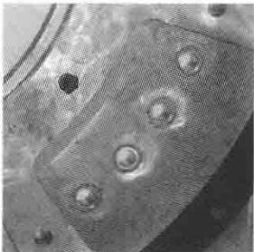</td><td>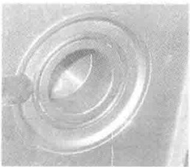</td><td>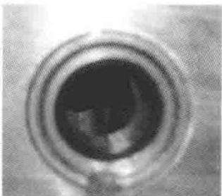</td></tr><tr><td></td><td>通孔</td><td>带镶套</td><td>带密封槽</td></tr><tr><td>优点</td><td>法兰加工简单</td><td>减少螺栓密封槽加工;刚度增加,不易损坏</td><td>减少螺栓密封槽加工</td></tr><tr><td>缺点</td><td>螺栓需加工密封槽</td><td>法兰加工成本增加</td><td>法兰加工多一道工序</td></tr></table>

# 4.8.3 预埋螺栓结构设计

预埋螺栓结构设计是通过确定预埋螺栓叶根连接的爆炸图，选择合适的螺栓套构型、法兰构型、角条构型及端面方案，确定各零部件的尺寸及装配方式与装配公差。

# 1. 基本信息

预埋螺栓套构型设计，基本输入信息诸如叶片功率、螺栓个数、螺栓型号、螺栓等级、节圆直径及叶根外径。

# 2. 总装图

叶根螺栓总体组装关系如图 4-76 所示，其尺寸设计的目的就是确定总装图中所有零部件的尺寸与装配公差关系。

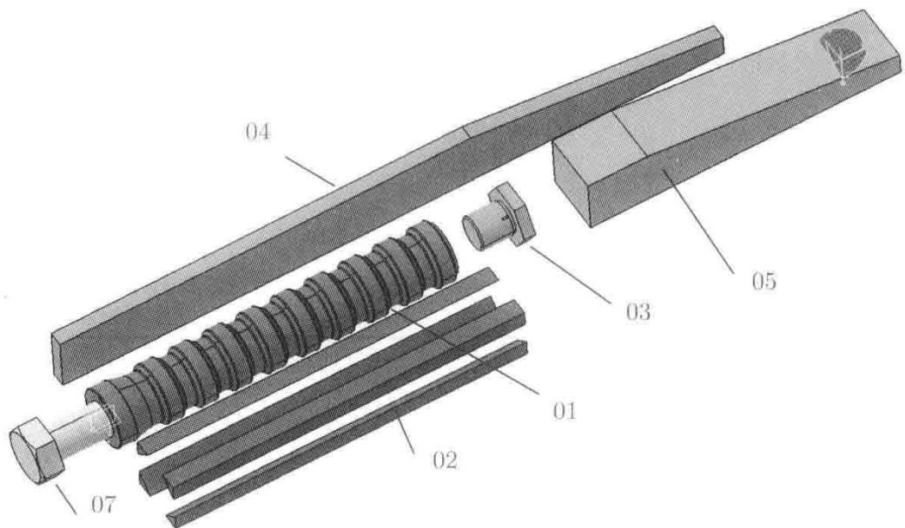

text_image

Technical diagram of a mechanical assembly with labeled parts 01 to 07

图 4-76 叶根预埋螺栓总装图

表 4-33 列举预埋叶根零部件的清单，不同的预埋叶根设计可能会略有不同。

表 4-33 叶根预埋螺栓零部件清单

<table><tr><td>序号</td><td>名称</td><td>材料</td><td>件数</td><td>备注</td></tr><tr><td>01</td><td>螺栓套</td><td>35CrMoA</td><td> $1 \times 64$ </td><td></td></tr><tr><td>02</td><td>三角条</td><td>玻璃钢</td><td> $4 \times 64$ </td><td></td></tr><tr><td>03</td><td>堵头</td><td>Q235</td><td> $1 \times 64$ </td><td>可以使用橡胶</td></tr><tr><td>04</td><td>楔形块 01</td><td>玻璃钢</td><td> $1 \times 64$ </td><td></td></tr><tr><td>05</td><td>楔形块 02</td><td>泡沫块</td><td> $1 \times 64$ </td><td>螺栓套高度过渡使用</td></tr><tr><td>06</td><td>模具叶根法兰</td><td>45</td><td>2</td><td></td></tr><tr><td>07</td><td>叶根螺栓</td><td>40Cr</td><td> $1 \times 64$ </td><td>10.9级-六角头螺栓-M36</td></tr><tr><td>08</td><td>双头螺柱</td><td>根据实际设计确定</td><td> $1 \times 64$ </td><td>10.9级-B级等长双头螺柱-M36</td></tr><tr><td>09</td><td>复合毡</td><td> $[0^{\circ}/90^{\circ}]$ 方格布</td><td></td><td></td></tr><tr><td>10</td><td>导流毡</td><td>Unifilo /CSM</td><td></td><td></td></tr><tr><td>11</td><td>玻纤纱</td><td>玻纤粗纱</td><td></td><td></td></tr></table>

# 3. 零部件尺寸

在本节中，将针对零件之间的具体装配关系，进行零部件的细节设计，确定零部件的尺寸和形状。

# 1) 螺栓套组装

叶根螺栓套在预埋工艺中，具体的连接形式如图 4-77 所示。确定预埋螺栓连接各零部件尺寸及组装后的公差。

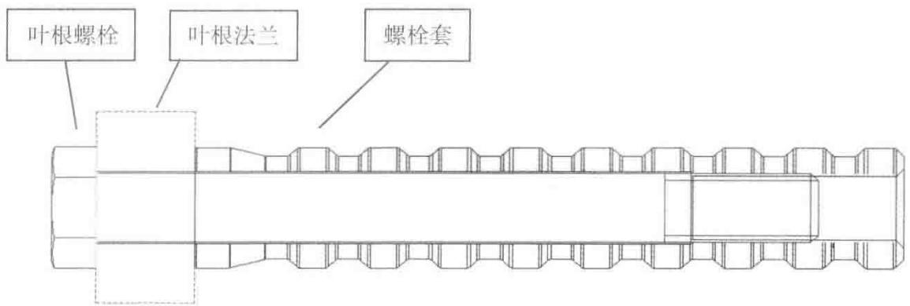

text_image

叶根螺栓
叶根法兰
螺栓套

图 4-77 螺栓套组装图

# 2) 螺栓套

螺栓套应确定长度、外径、无螺纹段内径和螺纹段内径、螺纹长度、螺栓套具体形式等细节。图 4-78 给出螺栓套的三维示意图。

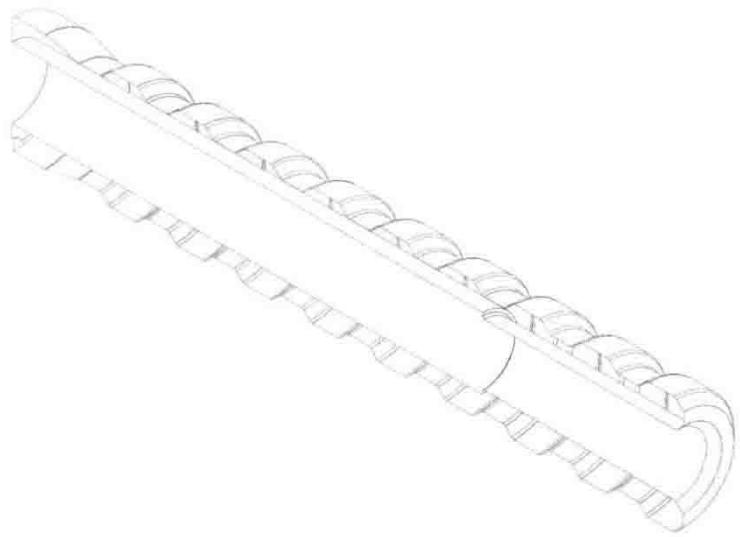

natural_image

Technical line drawing of a mechanical component with helical grooves and a curved end (no text or symbols)

图 4-78 螺栓套 3D 剖视图

# 3) 叶根螺栓

叶根预埋螺栓套工艺中，根据螺栓等级确定具体尺寸信息，叶根螺栓图示如图4-79所示。

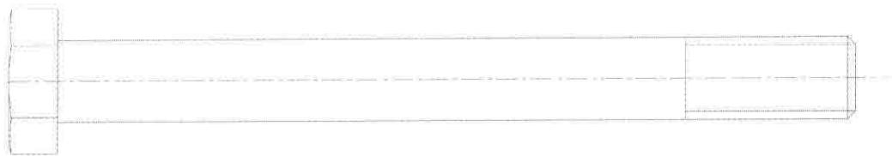

natural_image

Simple line drawing of a rectangular object with no text, numbers, or symbols

图 4-79 叶根螺栓图

# 4) 三角条

每根螺栓套配上 4 根三角条，确定三角条的长度和横截面宽度。叶片的三角条的材料一般为玻璃钢，图 4-80 为三角条示意图。

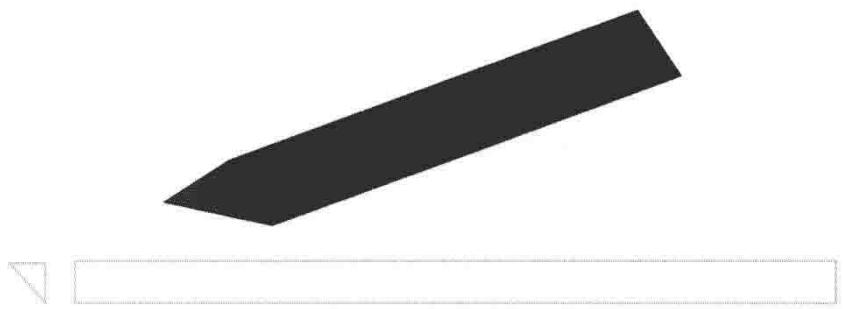

natural_image

Simple black arrow pointing diagonally upward to the right, with a white rectangular border on the bottom (no text or symbols)

图 4-80 三角条示意图

# 5) 楔形块 01

楔形块 01 放置于螺栓套之间，一端贴着叶根法兰端面，一端高度逐渐降低，过渡到叶根铺层。应确定具体形状尺寸，图 4-81 为楔形块 01 的示意图。

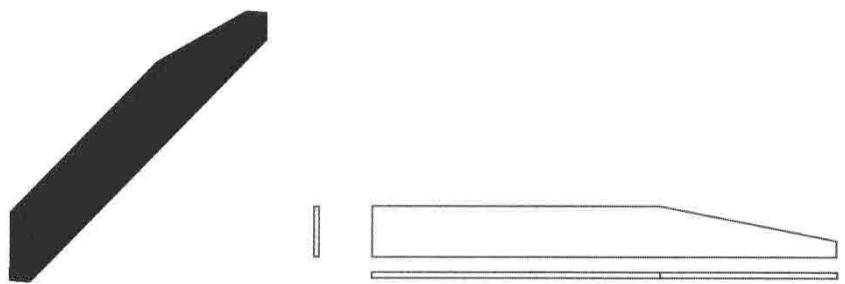

natural_image

Three abstract geometric shapes: a black rectangular prism, a simple gray trapezoidal prism, and a flat line (no text or symbols)

图 4-81 楔形块 01 示意图

# 6) 楔形块 02

楔形块 02 放置于螺栓套有堵头那一端，用于预埋螺栓套的高度向叶根加强层的平滑过渡。图 4-82 为楔形块 02 的示意图。

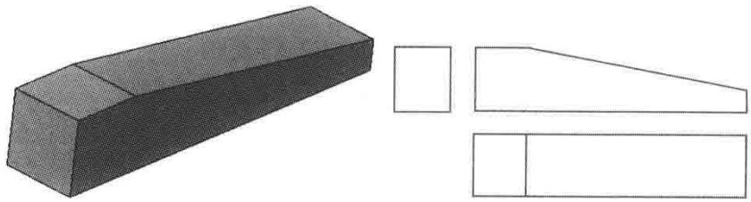

natural_image

3D geometric shapes including a rectangular prism, a trapezoid, and two empty rectangles (no text or symbols)

图 4-82 楔形块 02 示意图

# 4. 设计过程

# 1) 确定螺栓套位置

叶根节圆直径及螺栓尺寸和螺栓、螺栓套个数，叶根端面均匀分布螺栓套，如图 4-83 所示，确定螺栓套位置。

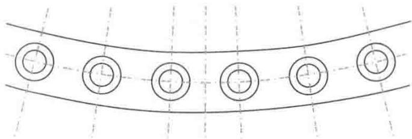

natural_image

Pure diagram of six circular components arranged in a row along a curved line, with dashed grid lines (no text or symbols)

图4-83 叶根螺栓套分布图

# 2) 螺栓套缠玻纤丝

在螺栓套凹槽上，均匀缠上玻纤丝。确定缠绕尺寸及缠丝后空隙余量。图 4-84 为螺栓套表面缠丝示意图。

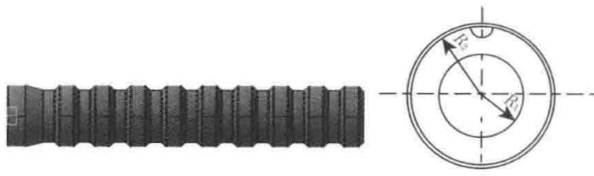

text_image

Technical diagram showing a threaded component with cross-sectional view and radius annotations

图 4-84 螺栓套缠玻纤丝图

# 3) 安装三角条

紧贴螺栓套下表面放置一组三角条，再用玻纤丝缠绕上。确定三角条与缠丝后螺栓套的装配紧凑度。图4-85为螺栓套安装三角条示意图，其中 $R_{1}$ 和 $R_{2}$ 分别为螺栓套内径及外径。

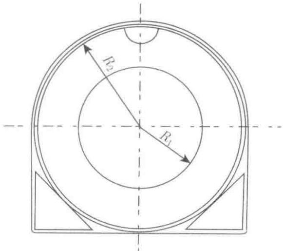

text_image

R₂
R₁

图 4-85 螺栓套安装三角条示意图

# 4) 螺栓套定位

螺栓套缠丝之后，定位于叶根法兰端面，如图 4-86 所示，此时叶根外侧的叶根加强层已经铺设完成。螺栓套上铺放 N 层复合毡和 N 层导流毡，同时计算两组螺栓套定位好之后的剩余间距，如图 4-87 所示。

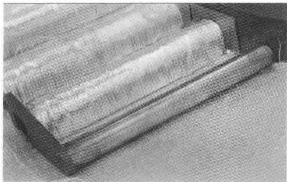

natural_image

Stacked sheets of paper or film with visible texture and shading, no text or symbols present

图 4-86 螺栓套缠丝定位图

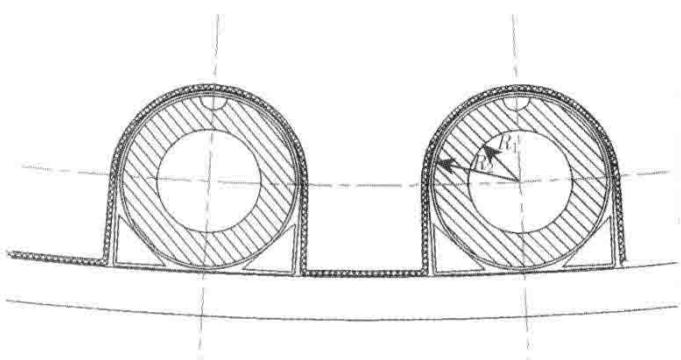

text_image

Technical diagram showing two circular components with hatched areas and an angle labeled l₁, likely illustrating a mechanical or structural design.

图 4-87 铺放复合毡和导流毡示意图

# 5) 安装楔形块

在两个螺栓套之间，嵌入已经确定好高度、底部宽度 $L_{2}$ 和顶部宽度 $L_{1}$ 的梯形楔形块。楔形块一般为多层单向布预制成型。图 4-88 为安装楔形块示意图，螺栓套与楔形块之间应用玻纤丝填充，缠丝厚度为 T。

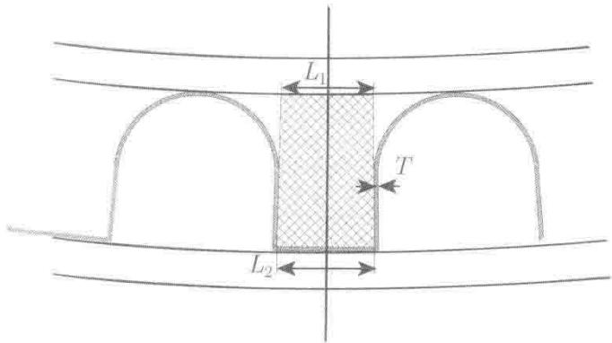

text_image

L₁
T
L₂

图 4-88 安装楔形块示意图

同时，在螺栓套顶部安装另外一组三角条，确定安装完三角条之后的螺栓套与楔形块整体的表面平整度，如图 4-89 所示。

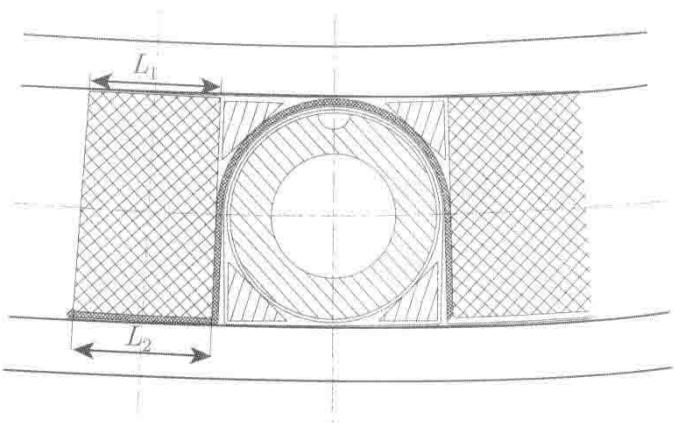

text_image

L₁
L₂

图 4-89 安装三角条示意图

在放置楔形块和三角条之后，用铁锤砸实后，开始铺放叶根加强层内部铺层。至此完成叶根预埋螺栓工艺的铺放，其端面效果如图 4-90 所示。

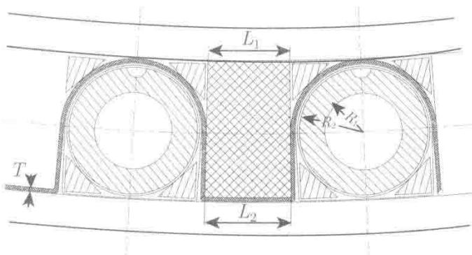

text_image

L₁
R₁
R₂
T
L₂

图 4-90 叶根预埋螺栓总装图示意图

# 5. 设计产品

图 4-91 为预埋螺栓的产品展示图，同时叶根预埋螺栓需要连接叶根法兰，叶根法兰与叶根预埋螺栓套连接的端面形式及结构校核参见本书第 15 章。

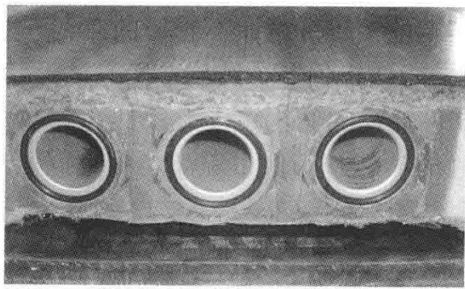

natural_image

Close-up of three circular mechanical components on a textured surface (no text or symbols visible)

图 4-91 预埋螺栓产品图

# 4.8.4 后打孔螺栓结构设计

图 4-92 为后打孔叶根螺栓工艺，主要确定叶根零刻度线的位置，确保叶根平面的垂直度。关于后打孔螺栓工艺的结构校核内容详见本书第 15 章。

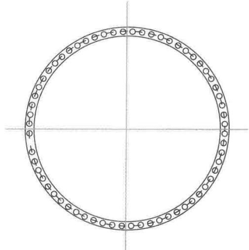

natural_image

Circular mechanical component with evenly spaced holes, no text or symbols present

(a) 叶根端面螺栓圆孔分布

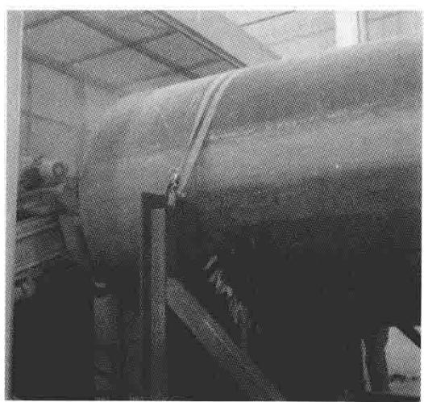

natural_image

Industrial scene showing large cylindrical machinery with a worker visible in the background (no text or symbols)

(b) 后打孔工艺示意图  
图 4-92 叶根后打孔工艺

# 4.8.5 叶根工艺试验概述

由于叶片叶根需要预埋螺栓或者采用后打孔工艺，叶根需要有较高的强度和刚度特性。所以，大型风力机叶片设计过程中，都会对叶根铺设较多的加强层，来提高叶片叶根的刚度和强度。较厚的叶根铺层，对叶片工艺水平要求很高，需要满足叶根灌输的工艺实验。

# 4.9 优化设计讨论

结构的主要功能是承受并传递载荷。对于结构设计来说，目标就是利用尽可能小的重量和最少的成本制造出这些结构。以一般的思维方式理解，优化结构就是设计出一种能最好地实现其功能，却将设计不想要的东西（重量、费用、维修、维护等）降至最低的结构。如果能够找到一个结构在所有的计算中能给出最优值，问题就得到了解决。然而，重量最轻的结构可能并不比重量稍重的结构成本低。此时，结构设计就必须根据叶片的功能和其他必须满足的判据做出决定[2]。

# 4.9.1 优化与非优化的影响

优化重量与非优化所导致的额外重量之间的区别。连接(胶接、金属连接)、翻边、不变的铺层厚度、疲劳、刚度、成本等代表非优化重量[2]。

# 4.9.2 结构指数

结构研究的根本目的就是获得能够满足设计要求的最优结构，这也是结构研究需要遵守的基本原则。同样地，通过利用以前设计并验证过的所有结构的成果，可以减少设计与分析的时间。

结构指数在设计工作中特别有用，因为它包含：①载荷的强度；②规定结构大小的尺寸。

结构指数能够给结构设计优化提供指导。一旦可以作为设计数据用的一系列结构指数被确定下来，结构设计就可合理选择合适的结构形式。如果由于某种原因不能采用优化结构时，结构指数可以体现出必须承受多大的重量代价。

在结构设计的工程实例方面，借助结构指数能够非常方便地完成结构优化设计，这是因为：①在确定何种结构和材料适合某一特定载荷方面，结构指数最为有用。②结构指数可以用作快速确定结构尺寸、选择最有效的材料和确认最轻的结构形式。

对于任意给定的结构指数值都有可能找到材料与横截面形状、不同材料受力特性与作用载荷的组合，进而给出重量最轻的结构。在选择材料的时候，除了比强度因素外，结构设计还受到许多其他因素的影响，诸如材料的价格、可获得性、设计的简易性、工艺的可操作性、腐蚀、可成形性和机械加工性等。因此，结构设计应根据复合材料的各向异性性能，确定材料坐标系下各方向的比强度，进而选择比较合适的材料，这样可以在叶片结构设计的材料选型、不同材料位置布局等方面加以综合考虑重量的约束，得到相对的最优解。

# 第5章 功能件设计

# 5.1 叶尖设计

由风力机叶片气动基本理论可知，叶尖处叶素受力对整个风力机性能影响较大，叶尖的外形对叶片的气动性能和噪声影响甚大。故叶片的气动外形设计中，叶尖的曲面造型就显得很重要，本书暂不涉及叶尖的设计。

# 5.2 防雷设计

风力发电机组可靠性中最关键的一个问题是雷电防护。随着风力机高度和发电功率的增加，雷击风力机的概率也会成正比增长。风力机中最危险的部位是风轮叶片，如图 5-1 所示。

现代风力机组面临着很多其他建筑物不曾遇到过的防雷问题，诸如：

(1) 风电机组是高度超过 $150 \, m$ 的高大建筑物。  
(2) 风力机对发电量的要求基本都设置在风力强大的地区，例如海岸、丘陵、山脊，而往往这些地区正是雷电多发区。由于风电机组的安装一般都处于该地区相对的制高点，并且远离其他高大物体，因此它更加容易吸引雷电。  
(3) 风电机组的许多暴露部件，如叶片和机舱盖往往由不能承受直击雷或传导直接雷电流的复合材料制成。  
(4) 叶片和机舱是可旋转部件 (不利导流)。  
(5) 雷电必须通过风力机的结构传导到大地，因此，实际上大部分雷电流将流经或靠近所有的风力机部件。  
(6) 风电场中的风电机组相互电连接装置往往位于接地条件不好的区域。

雷击造成叶片损坏的机理主要有两个方面：一是雷电释放巨大能量，使叶片结构温度急剧升高，分解气体高温膨胀，压力上升造成爆裂破坏；二是雷击造成的巨大声波，对叶片结构造成冲击破坏。叶片全绝缘不仅不会减少被雷击的风险，反而会增加损害的次数。因为多数情况下叶片被雷击的区域在叶片背风面（即吸力面），而由于雷电击中叶片的尖部，会在叶尖部位的内腔产生电弧，电弧能够将叶尖炸开。为避免雷电对叶片造成损害，需要通过导雷装置，快速将雷电通过连接在轮毂上的导线传递给大地。

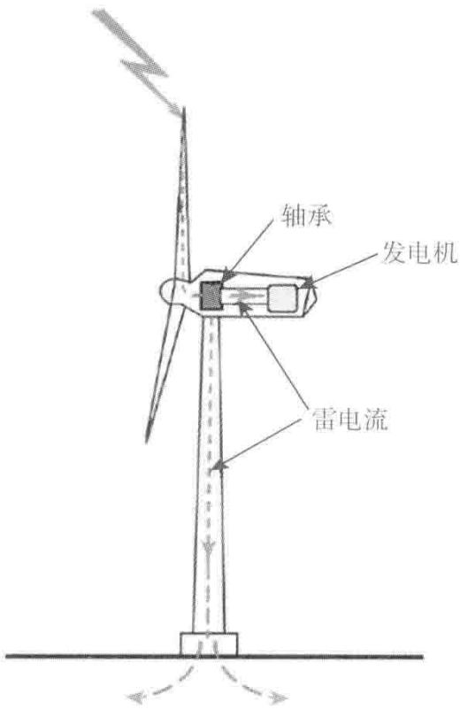

text_image

轴承
发电机
雷电流

图 5-1 风力机叶片雷击示意图

# 5.2.1 接闪器

根据风力机雷电保护相关标准，按照叶片功率和风场等级可确定叶片接闪器的大概安装位置，如 A 型叶片，此种叶片接闪器是位于距离叶尖约为十几厘米的位置 $^{[13]}$ 。

# 1. 接闪器的安装

如图 5-2 所示，在叶片模铸过程之中将接闪器预埋板灌注到叶片玻璃钢中，利用螺栓将接闪线连接到接闪器预埋板上。叶片模铸完成后，在接闪器预埋板上钻螺纹孔，将接闪器安装在螺纹孔中。

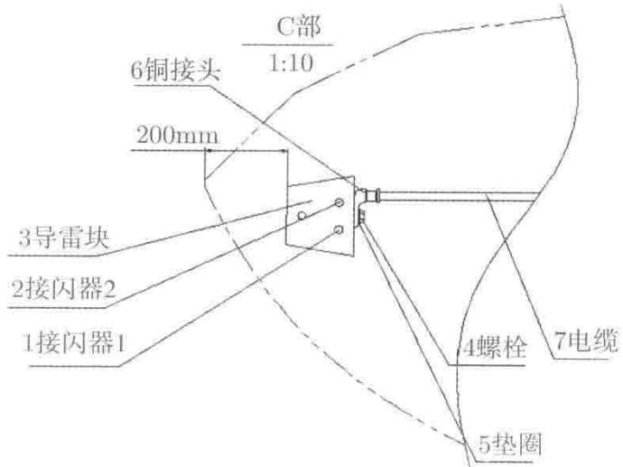

text_image

C部
1:10
6铜接头
200mm
3导雷块
2接闪器2
1接闪器1
4螺栓
7电缆
5垫圈

图 5-2 接闪器细节设计图

# 2. 接闪器的形状及尺寸

确定接闪器的形状、尺寸及位置，如图 5-3 所示。

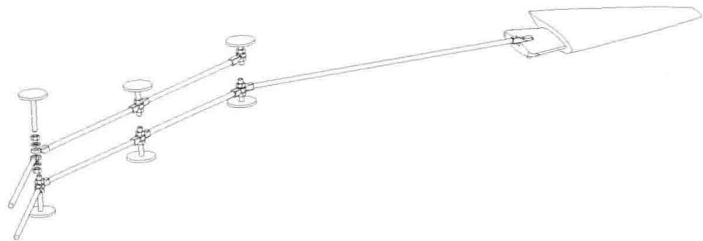

natural_image

Technical line drawing of a mechanical assembly with multiple rods and a tapered shaft (no text or symbols)

图 5-3 接闪器的形状及位置

# 3. 接闪器的材料

接闪器一般采用 HAL60-1-1 铝黄铜，该材料的特性是导电性能好、强度较高及耐腐蚀性好。

# 5.2.2 叶片防雷击试验

叶尖装有几个蝶形接闪器和棒形接闪器，而在叶片中部也装有几个蝶形接闪器，当接闪器与导流线（引下线）连接后接到高压冲击发生器上。通过叶片全尺寸大电流试验，确定叶片被施加正冲击电压和负冲击电压时的放电率，以改进叶片的接闪器设计。进行雷击试验的目的，就是为了验证雷电是否仅仅击中叶片设计规定的位置（接闪器）以控制雷电流。叶片雷击试验示意图如图5-4所示。

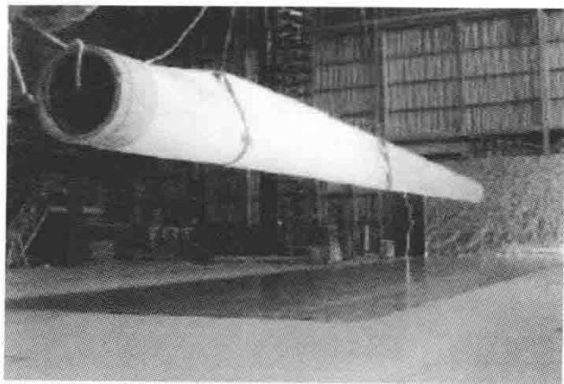

natural_image

Large cylindrical industrial pipe mounted on a support structure, with industrial equipment in the background (no visible text or symbols)

图 5-4 叶片雷击试验

风力机叶片受雷击破坏的现象时有发生，应加强对叶片抗雷能力的研究，改进叶片的抗雷能力。叶片接闪器的设计应严格按照 IEC 标准，确保整套防雷设计能够满足标准要求。在风力机机组防雷设计上，需综合全局考虑，在风轮系统良好导雷的同时，不能忽视大电流对机舱和塔架内置的电气、电子设备造成的强电磁场干扰。

# 5.3 胶衣及喷漆

胶衣作为叶片表面的保护层，可改善叶片的表面效果，保护叶片，防风沙冲击、防紫外线辐射老化、防火、防腐、防冰附着、防沙尘覆盖等作用。对胶衣本身而言，需有一定的厚度要求。

胶衣体系能对玻璃钢表面进行直接的保护，即使在风沙的冲击下，外层聚氨酯面漆破损，胶衣依然能够有效地抵御紫外线的照射，抵挡风沙对叶片表面的伤害。在同样的实验条件下检测表明，有胶衣的耐风沙能力是无胶衣体系的十倍以上，并且其他方面的性能都要优于无胶衣体系的数十倍以上。

中国的风场大多位于风沙冲击区域, 这个也就是为什么 Mankiewicz、Bergolin、Maga 等来到中国市场一直采用胶衣体系。而有些则既没有胶衣, 也没有 $100\%$ 的面漆, 只能适应欧洲的优良的大气环境, 在中国风场根本就不能抵抗风沙的冲击, 只能作为一种装饰, 在沙尘暴冲击区域基本没有实用价值。

# 5.4 运输加强层设计

叶片其他功能件设计包括叶片运输加强层、叶根盖板、叶片配重腔、挡雨环、双腹板连接 PE 管等。

叶片运输加强层在铺层设计过程中需要在叶片运输的支点位置铺设运输加强层，确保运输过程中叶片不会产生局部屈曲破坏。运输加强层一般为双轴布。运输加强层应根据叶片的质量分布与重心而确定，一般在叶片 1/3 展长和 2/3 展长处，如图 5-5 所示。

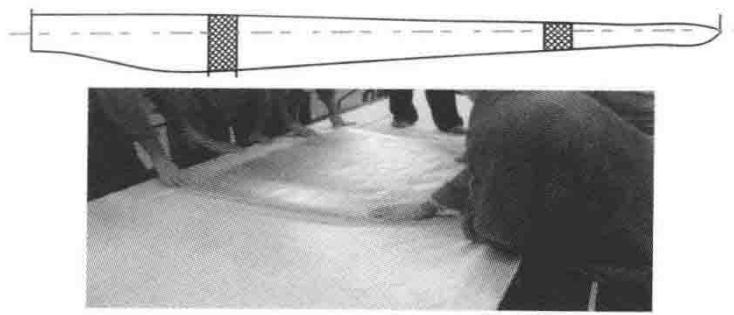

natural_image

Two-panel image showing a close-up of a mechanical component with cross-hatching and a person lying on the ground (no visible text or symbols)

图5-5 运输加强层

# 5.5 叶根盖板设计

叶根盖板设计主要位于叶片根部，叶根铺层在各方向的铺层厚度不严格相同，因此叶根盖板不是严格的圆形或椭圆形。但在制作过程中，考虑制作便捷性，通常将叶根盖板做成圆形。如图 5-6 所示，叶根盖板采用上下两段拼接的方式，沿叶根 R 位置处的前缘分模点和尾缘分模点的连线分成上下两段叶根盖板。叶根盖板铺层一般为夹芯结构，面板采用复合毡，芯材为泡沫。

叶根盖板主要应用于人作用在其表面进行维修或其他操作，同时可以防止转动过程中叶片中碎物脱落造成危险，应注意叶根盖板表面防滑。

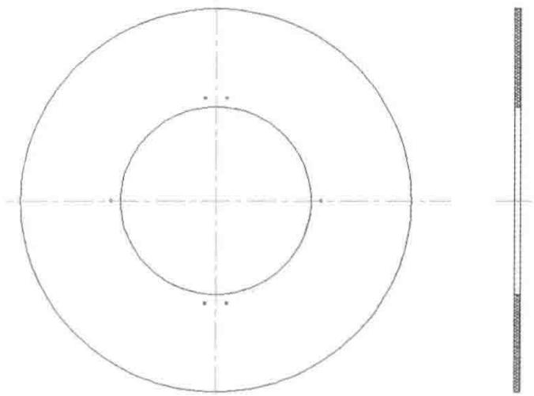

natural_image

Technical drawing of concentric circles with centerlines and a vertical scale bar (no text or symbols)

图 5-6 叶根盖板示意图

# 5.6 配重腔设计

叶片配重腔（也称配平仓）主要是在叶片设计与生产过程中预留可能需要配重的位置，配重后可保证风轮三叶片的质量矩和重量偏差符合公差要求。应当注意，配重过程中需记录配重重量和对应位置，如图 5-7 所示。

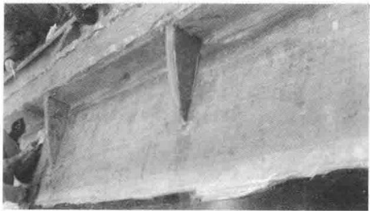

natural_image

Close-up of a textured surface with a triangular indentation and a small triangular feature (no visible text or symbols)

图 5-7 叶片配重腔

# 5.7 挡雨环设计

图 5-8 为叶片挡雨环，防止雨水浸入叶片内部，导致叶片内部材料受到雨水侵蚀，若在寒冷地区，积聚在叶片内部的水结成冰块，在叶片运转过程中脱落或冲撞叶片内部结构，容易造成叶片内部结构的冲击损伤。

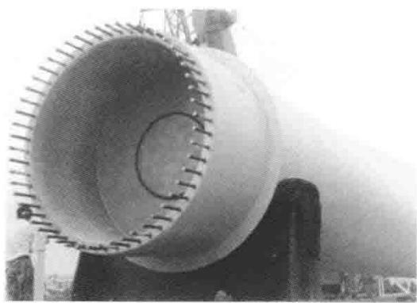

natural_image

Close-up of a large cylindrical industrial fan or turbine component with visible internal blades and mesh texture (no text or symbols)

图 5-8 叶片挡雨环

# 5.8 双腹板 PE 管设计

双腹板定位于叶片壳体主梁之间，沿中心线对称布局。腹板与叶片壳体之间除需要在缘条段黏接成一体之外，还可以在腹板展向不同位置增加 PE 管，如图 5-9 所示，起到固定双腹板的作用。同时，需要验算开孔对腹板结构的影响。

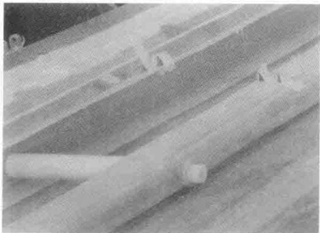

natural_image

Close-up of white cylindrical objects arranged on a wooden surface (no visible text or symbols)

图 5-9 双腹板连接 PE 管

# 5.9 其他设计

有的风力机叶片带有液压的叶尖刹车系统，或者更特殊的叶片结构形式采用分段拼接，对于特殊的叶片形式，暂不在本书介绍范围内。

# 第三篇

# 叶片结构设计方法

# 第6章 结构校核准则

风力机叶片结构应该满足一系列极限状态下的设计准则，需充分地验证叶片结构承载的能力，不能超过相关极限状态下材料抗力。风力机的相关标准规定了叶片结构校核中不同校核类型和校核方法的要素及要求。表 6-1 为风力机相关标准中规定的叶片结构校核内容。

表 6-1 风力机标准中规定的结构校核内容

<table><tr><td colspan="2">结构校核</td><td>GB/T 25383—2010GB/T 10194—1997GL 2010</td><td>DNV/Riso</td></tr><tr><td>总则</td><td></td><td>√</td><td>√</td></tr><tr><td rowspan="4">强度分析</td><td>纤维失效分析</td><td></td><td>√</td></tr><tr><td>纤维间失效分析</td><td></td><td>√</td></tr><tr><td>应变分析</td><td></td><td>√</td></tr><tr><td>极限强度</td><td>√</td><td></td></tr><tr><td>稳定性分析</td><td></td><td>√</td><td>√</td></tr><tr><td>变形分析</td><td></td><td>√</td><td>√</td></tr><tr><td>动力学特性分析</td><td></td><td>√</td><td>√</td></tr><tr><td>胶接分析</td><td></td><td>√</td><td>√</td></tr><tr><td>疲劳分析</td><td></td><td>√</td><td>√</td></tr></table>

# 6.1 结构校核总则

(1) 叶片的结构强度校核与分析应包括结构强度分析、变形分析、动力学特性分析与胶接强度分析 $^{[10]}$ 。  
(2) 叶片强度通常由静强度分析和疲劳分析（设计极限状态校核）来验证。  
(3) 叶片受压部件还应校核失稳 (分层、褶皱、翘曲等)。  
(4) 叶片的主要材料为纤维增强复合材料，叶片结构计算主要对纤维强度进行校核。  
(5) 强度分析还应在足够多的截面上进行, 被校核截面的数目取决于叶片类型和尺寸, 但至少应分析四个截面。在几何形状和材料不连续的位置处应分析附加的截面。  
(6) 用螺栓、胶接或其他连接技术在不同部件间构成的连接强度，应根据设计

载荷进行验证。

# 6.2 叶片结构校核方法

叶片结构校核可分为一维方法、二维方法和三维方法，见表 6-2。不同的校核方法的时间、精度和校核范围是不同的，在叶片设计与校核时，应根据不同阶段的校核需求采取不同的校核方法，高效地给出叶片结构校核的结果。

表 6-2 叶片结构校核方法

<table><tr><td></td><td>校核方法</td><td>理论</td><td>细节</td></tr><tr><td>1D</td><td>1D 工程算法</td><td>工字梁</td><td>正应力,挠度</td></tr><tr><td rowspan="3">2D</td><td>2D 工程算法</td><td>薄壁杆件结构力学</td><td>强度,挠度,振动</td></tr><tr><td>2D FEM 壳模型</td><td rowspan="2">等截面 FEM 法</td><td rowspan="2">等截面,圣维南原理,材料各向异性,泊松比效应</td></tr><tr><td>2D FEM 体模型</td></tr><tr><td rowspan="3">3D</td><td>3D FEM 壳模型</td><td rowspan="3">变截面 FEM 法</td><td>变截面,超单元</td></tr><tr><td>3D FEM 体模型</td><td>尾缘局部拓扑优化</td></tr><tr><td>混合模型</td><td>体单元与壳单元混合</td></tr><tr><td rowspan="3">试验</td><td>基于梁理论的试验方法</td><td>—</td><td>强度、挠度和扭角</td></tr><tr><td>基于壳理论的试验方法</td><td>—</td><td>表面应变片</td></tr><tr><td>基于体理论的试验方法</td><td>—</td><td>云图、预埋、强度和变形</td></tr><tr><td>一体化</td><td>PDM 方法</td><td>—</td><td>—</td></tr></table>

# 6.3 叶片结构校核概述

# 6.3.1 叶片拓扑图

叶片整体和局部的分析, 按照叶片结构校核总则和校核方法, 将叶片剖析成如图 6-1 所示的拓扑形式。

叶片拓扑图，按照叶片不同部位分为以下几个方面，详见表 6-3。

表 6-3 叶片拓扑图细节

<table><tr><td colspan="2">ID</td><td>拓扑细节</td></tr><tr><td colspan="2">0000</td><td>叶片整体分析</td></tr><tr><td colspan="2">1000</td><td>叶根设计与分析</td></tr><tr><td colspan="2">2000</td><td>叶片各截面分析</td></tr><tr><td colspan="2">3000</td><td>前缘设计与分析</td></tr><tr><td colspan="2">4000</td><td>腹板设计与分析</td></tr><tr><td colspan="2">5000</td><td>尾缘设计与分析</td></tr><tr><td colspan="2">6000</td><td>叶尖设计</td></tr><tr><td colspan="2">7000</td><td>运输加强层设计与校核</td></tr><tr><td colspan="2">ID</td><td>拓扑细节</td></tr><tr><td>8000</td><td></td><td>叶片构件设计与分析</td></tr><tr><td></td><td>8100</td><td>层合板结构</td></tr><tr><td></td><td>8200</td><td>夹芯结构</td></tr><tr><td></td><td>8300</td><td>胶接连接</td></tr><tr><td></td><td>8400</td><td>螺栓连接</td></tr><tr><td>9000</td><td></td><td>叶片零部件设计</td></tr></table>

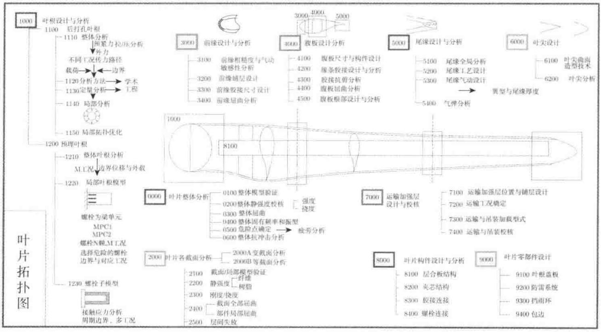

flowchart

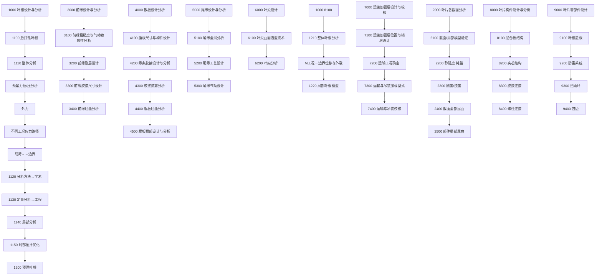
```mermaid
graph TD
    A["1000 叶根设计与分析"] --> B["1100 后打孔叶根"]
    B --> C["1110 整体分析"]
    C --> D["预紧力拉/压分析"]
    D --> E["外力"]
    E --> F["不同工况传力路径"]
    F --> G["载荷→←边界"]
    G --> H["1120 分析方法→学术"]
    H --> I["1130 定量分析→工程"]
    I --> J["1140 局部分析"]
    J --> K["1150 局部拓扑优化"]
    K --> L["1200 预理叶根"]
    
    M["3000 前缘设计与分析"] --> N["3100 前缘粗糙度与气动敏感性分析"]
    N --> O["3200 前缘刚层设计"]
    O --> P["3300 前缘胶接尺寸设计"]
    P --> Q["3400 前缘屈曲分析"]
    
    R["4000 散板设计分析"] --> S["4100 腹板尺寸与构件设计"]
    S --> T["4200 缘条胶接设计与分析"]
    T --> U["4300 胶接抗剪分析"]
    U --> V["4400 腹板屈曲分析"]
    V --> W["4500 腹板根部设计与分析"]
    
    X["5000 尾缘设计与分析"] --> Y["5100 尾缘全局分析"]
    Y --> Z["5200 尾缘工艺设计"]
    Z --> AA["5300 尾缘气动设计"]
    
    AB["6000 叶尖设计"] --> AC["6100 叶尖曲面造型技术"]
    AC --> AD["6200 叶尖分析"]
    
    AE["1000 8100"] --> AF["1210 整体叶根分析"]
    AF --> AG["M工况→边界位移与外载"]
    AG --> AH["1220 局部叶根模型"]
    
    AI["7000 运输加强层设计与校核"] --> AJ["7100 运输加强层位置与铺层设计"]
    AJ --> AK["7200 运输工况确定"]
    AK --> AL["7300 运输与吊装加载型式"]
    AL --> AM["7400 运输与吊装校核"]
    
    AN["2000 叶片各截面分析"] --> AO["2100 截面/局部模型验证"]
    AO --> AP["2200 静强度 树脂"]
    AP --> AQ["2300 刚度/挠度"]
    AQ --> AR["2400 截面全部屈曲"]
    AR --> AS["2500 部件局部屈曲"]
    
    AT["8000 叶片构件设计与分析"] --> AU["8100 层合板结构"]
    AU --> AV["8200 夹芯结构"]
    AV --> AW["8300 胶接连接"]
    AW --> AX["8400 螺栓连接"]
    
    AY["9000 叶片零部件设计"] --> AZ["9100 叶根盖板"]
    AZ --> BA["9200 防雷系统"]
    BA --> BB["9300 挡雨环"]
    BB --> BC["9400 包边"]
```

图 6-1 叶片拓扑图

# 6.3.2 叶片构件受力特性

叶片结构形式复杂，沿叶片展向可将其分为叶根加强段、叶中段和叶尖段；沿叶片弦向可将其分为前缘加强层、夹芯结构及芯材倒角、主梁、梁腹板、尾缘加强层、尾缘胶接层等，详见表 6-4。

表 6-4 构件受力特性

<table><tr><td>叶片剖面结构形式</td><td>常见英文术语</td><td>复合材料的应用</td><td>风力机叶片载荷</td><td>结构分析</td></tr><tr><td>主梁</td><td>Spar Cap</td><td>单向带层合板</td><td>主要承受挥舞弯矩的作用</td><td>强度分析刚度分析</td></tr><tr><td>叶片夹芯</td><td>PVC</td><td>夹芯结构</td><td>—</td><td>屈曲分析</td></tr><tr><td>前缘梁</td><td>Leading edge</td><td>层合板</td><td>主要承受摆振弯矩的作用</td><td>强度分析刚度分析</td></tr><tr><td>尾缘梁</td><td>Trailing edge</td><td>层合板</td><td>主要承受摆振弯矩的作用</td><td>强度分析刚度分析</td></tr><tr><td>腹板</td><td>Web</td><td>夹芯结构</td><td>传递剪力</td><td>屈曲分析强度分析</td></tr><tr><td>蒙皮+腹板</td><td>Shell+Web</td><td></td><td>多闭室承受扭矩作用且传递剪力</td><td>抗冲击分析屈曲分析</td></tr><tr><td>胶接</td><td>Bonding</td><td>胶接结构</td><td>胶层剪切</td><td>胶接分析尾缘开裂</td></tr><tr><td>叶根螺栓</td><td>Bolt</td><td>—</td><td>离心力预紧力弯矩和剪力共同作用</td><td>强度分析刚度分析</td></tr></table>

# 6.4 强度分析

叶片的静强度校核包括整体强度校核、刚度校核及挠度校核。整体强度校核中，应用不同的失效判断准则判定纤维失效和树脂失效，刚度校核中包括挥舞刚度、摆振刚度和扭转刚度，同时，需要计算叶片在极限载荷作用下的叶尖挠度。结合不同的风力机叶片相关标准，考虑载荷安全系数、材料安全系数的情况下，验证强度和挠度的冗余。

总体来说，叶片强度分析可以用应变验证，也可用应力验证。如用应力验证，还应分析最大载荷作用点的应变，证明没有超过破坏极限。在进行复合材料的强度分析时，需证明设计值不超过材料的许用值，这里需考虑进行强度分析时的材料局部安全系数。不同的设计标准，对应的材料局部安全系数也是不同的。标准之间不能混用，否则将导致错误的结果或不准确的统计。

对于叶片铺层中的单层，平行和垂直于纤维方向的许用失效应力和失效应变、剪切的许用失效应力和失效应变都是必须考虑的。

当叶片结构主要承力材料为单向纤维增强材料时，其强度可采用简化的应变分析。对于玻璃纤维增强材料，在设计载荷作用下沿纤维方向的应变值应满足[14]：

拉伸应变 $\varepsilon_{Rd,t} \leqslant 0.35\%$ (6-1)

压缩应变 $\varepsilon_{Rd,c} \leqslant |-0.25\%|$ (6-2)

# 6.5 稳定性分析

随着叶片越来越大，腹板-前缘和腹板-尾缘间将出现大面积不受支撑的面板，这对叶片的稳定性有较大影响，因此叶片的抗屈曲能力应单独计算，同时还需要考虑腹板的屈曲。

GL 2010 中规定屈曲分析的载荷安全系数为 1.35，如环氧叶片采用线性屈曲分析，则材料安全系数为 2.04；若环氧叶片采用非线性屈曲分析，则材料安全系数为 1.6335 $^{[14]}$ 。DNV 中规定分析类型的安全系数中，按照不同分析部分进行分类，如环氧层合板的材料局部安全系数为 1.652，同时要考虑 1.35 的载荷安全系数和 1.0 的失效局部安全系数 $^{[10]}$ 。

叶片越长，稳定性分析将取代强度分析的主导地位。对拉伸、压缩和剪切载荷作用下构件的稳定性，即抵抗翘曲和起皱的能力，应在作用载荷的设计值的基础上进行验证。

弹性屈曲现象通常表现为两类。

(1) 分歧屈曲: 增加外施载荷引起主要轴向或面内变形。在一种临界外施载荷 (弹性临界载荷) 下, 将发生一种新的面外弯曲变形, 这可能导致在不加大外施载荷下突然导致大变形 (不稳定的后屈曲现象, 易碎的破坏), 或很小或基本不增大载荷下增加到很大变形 (中立的后屈曲现象, 塑性破坏), 又或随着载荷的增加逐步稳定的变形变化 (稳定的后屈曲现象, 延性破坏)。  
(2) 极限点屈曲: 随着外施载荷的增加, 结构表现出逐渐减弱的刚度, 直到载荷和挠度的关系达到最大值 (弹性临界载荷), 此时变形增加到不可控制的形式 (易碎的破坏)。

弹性屈曲可能发生于三种不同水平。

(1) 全局水平，包括结构整体变形；  
(2) 结构组件的全局水平，只限于完整的单一结构件或单元；  
(3) 结构组件的局部水平，只限于结构件或单元具体的部分。如主梁边缘的局部屈曲、胶板与胶接之间。

叶片主要承载结构在承受极限设计载荷下不能发生屈曲。叶片次级部分的应变可受叶片主要承载结构的界面位移控制，且局部刚度影响应变。对于这种类型，如果可证明这些仅发生于罕有的场合，次级结构屈曲是可接受的。屈曲和疲劳的相互作用非常复杂，不能应用现存的计算方法预测，且需要单独考虑。如果屈曲将影响叶片的应变分布或极限载荷下的应变分布，可通常应用简化屈曲分析规则来确认平板和正交各向异性曲板的更高级分析。风力机叶片的屈曲，需考虑失效机理，评估全局和局部屈曲。屈曲与其他失效机理的相互作用，如分层和树脂破裂，同样需要认真考虑。

在屈曲分析时, 特别注意边界条件的定义。如果屈曲分析的应用载荷高于造成结构局部损伤的载荷, 则会引入结构的局部损伤, 如树脂破裂或分层。此时, 屈曲计算应当考虑局部损伤。对于结构或结构组件期许的分歧屈曲, 在执行复杂的非线性分析前, 分析取决于弹性临界载荷 (或弹性临界应力或应变)。分析的目的是建立在以下方面:

(1) 是否可接受只进行几何线性分析;  
(2) 是否结构屈曲明显地基于尺寸效应 (如果超出应用载荷, 或接近弹性临界载荷);  
(3) FEA 网格精度的需求可用于更复杂的屈曲分析。

当评估屈曲失效模式，设计准则通常应用于结构所有点的局部应力或应变水平。准则应根据实际情况应用于纤维失效、树脂破裂、分层、屈服和极限破坏等。此外，位移准则同时应用于全局和局部，确保无非常大的屈曲位移。为获得校核中的阻力值，应进行几何非线性分析，此时需考虑由于局部屈曲造成的力学特性衰减。

在使用非线性有限元法进行稳定性分析时，为了确定屈曲临界载荷，应使用线性有限元法进行附加验证，确认屈曲临界载荷必须大于载荷特征值。另外，必须能够证明在预变形出现屈曲后，邻近的结构构件和结构零件不会出现损伤（如在黏接接合部位）。

更复杂的屈曲分析，或整体屈曲分析应借助于有限元软件或等价的分析方法。仔细进行模型边界条件修正，几何瑕疵的影响应基于层合板成型方法和公差。首先，特征值屈曲分析应假定层合板的初始（无退化）弹性性能。其次，分析过程是迭代式的，在良好的网格质量下直至特征值和屈曲模式收敛。本步骤的目的是确认相应的屈曲模式形状，满足后续的网格密度需求。如果施加外载超过或非常接近计算的弹性临界载荷，则应在细节设计之前改进设计，提高稳定性性能。

叶片可采用局部二次稳定性分析方法: 完成结构总体应力分析 (一次分析) 后, 取出原结构中可能出现失稳的部位或区域, 建立局部有限元模型 (根据需要可以直接利用原有的网格, 也可进一步细化网格), 进行第二次稳定性分析的方法。局部模型的边界条件来自原结构模型应力分析的结果, 通常取切开部位边界上的位移和内力, 再加到二次分析的局部模型边界上, 作为原模型提供给局部模型的弹性支撑。然后, 对局部有限元模型进行稳定性分析, 即称为二次稳定性分析。但从非线性理论的观点来看, 是不可以采用局部二次稳定性分析方法。理由是在加载过程中, 局部模型的支承条件也在变化, 并且这是一个非线性的变化过程。由于后屈曲的存在, 从整体模型中取出的局部结构其边界条件的变化是非线性的, 整体和局部结构的力学量之间并非简单的线性关系, 而是相互耦合影响的非线性关系。实际上, 对于一个大型复杂结构, 结果中包含了各个点上可能出现的应力极值点和位移极值点, 它们既包含总体失稳, 也包含局部失稳的各种模态, 即使是一个奇异点的产生都会在众多的应力-应变曲线上有所反映, 因此很难判断哪些是主要的哪些是次要的, 真实的失稳部位在哪里, 对应什么样的失稳模态。

所以，尽管如今计算机的硬件条件及软件功能给结构分析提供了强有力的工具，但目前国内外还很少用大型整体结构作为非线性屈曲分析的计算模型，而一般采用的还是线弹性分析中的局部二次稳定性分析方法，即对叶片总体模型进行线性静力分析的基础上，取出所关心的局部结构及其边界条件，建立叶片局部模型，然后对局部模型进行非线性屈曲分析。

本书在第 13 章中详细介绍了夹芯结构的屈曲和叶片的屈曲分析。

# 6.6 变形分析

所有工况下都应计算极限叶尖挠度（由静态载荷、动态载荷和结构响应的相互作用引起）。叶尖挠度既可通过气弹程序自动计算，又可通过工程算法计算或有限元计算。无载条件下叶尖与塔架之间的距离为净空，净空计算基于一些危险参数组合而成，包括几何公差、特征刚度和叶片支撑。另外，阻尼的影响很重要，也需要考虑。长远地看，如果叶片支撑遭受蠕变、收缩、温度变形或时间衰减等，必须进行净空测试。

当计算净空时必须满足相应准则关于最小净空的要求。丹麦准则要求净空计算时，特征极端载荷考虑 1.3 的安全系数，此时计算的净空最小为 0，而荷兰准则要求特征极端载荷考虑 1.5 的安全系数。

GL 2010 中为了保证叶片与机组其他零部件间的最小间隙，对所有涉及工况下的叶片变形进行验证 [14]:

(1) 当采用静态方式进行叶片变形计算时, 叶片在所有进行工况下的最小间隙不小于叶片在自由状态下与机组其他零部件间隙的 $40 \%$ 。叶片在所有静止工况下的最小间隙应不小于叶片在自由状态下与机组其他零部件间隙的 $5 \%$ 。  
(2) 当采用动态或气弹的方式进行叶片变形计算时，叶片在所有进行工况下的最小间隙应不小于叶片在自由状态下与机组其他零部件间隙的 30%。

# 6.7 动力学特性分析

为了避免风力发电机组在运行过程中产生共振，应确定叶片在允许和静止时的一阶挥舞和摆振方向的固有频率，必要时还应考虑轮毂和变桨轴承的影响。叶片结构动力特性分析时应采用叶片材料测试模量的平均值。

当叶片长度大于 30m 时，应对叶片挥舞方向和摆振方向的二阶频率和一阶扭转频率进行分析。叶片运行时挥舞和摆振频率应避开机组激振频率的倍频（推荐考虑 1\~8P），不同的标准规定的避免共振的范围不同，如 GB/T 25383-2010 控制固有频率在倍频 ±5% 以外 [15]，而 DNV/Riso 推荐特征频率远离旋转频率的 ±12%[10]。

# 6.8 胶接分析

叶片胶接强度的分析中，应考虑胶接表面和缺陷处的应力集中。胶接设计应尽最大可能避免剥离力矩或力。GL 2010 中规定 [14]，对于胶接分析，双组分的热固性胶黏剂，剪切应力可采用 $7\mathrm{MPa}$ 作为特征值，结构中由于应力集中而增大的剪切应力可以使用该值的 $1.0 \sim 3.0$ 倍的数值计算。本书在第 14 章详细介绍胶接分析。

# 6.9 层间分析

叶片的层间失效分析主要用于分析梁结构层合板层间变形及胶接部位的胶层变形，可采用体单元或界面单元的方式分析，计算层间开口、滑动、撕裂等不同层间失效类型的特性，同时需要验证裂纹扩展。本书在第18章详细介绍层间分析及断裂力学计算方法。

# 6.10 疲劳分析

$$
\begin{array}{r l} & \text { 复合材料叶片疲劳校核的计算量很大, 危险点数目可通过如下方式计算: } \\ & \text { 总计算量 } = \text { 叶片截面数 } \times \text { 材料层数 } \times \text { 危险点数 } \times \text { 载荷工况数 } \times (6 0 0 \mathrm{s}) / (0. 0 5 \mathrm{s}) \end{array}
$$

在 DNV/Riso 中明确规定：叶片展向所有截面和每个位置的所有方向都需验证疲劳强度。基于此，叶片展向所有点的所有载荷分量都需给出，包括相位、频率信息。疲劳分析应基于所研究铺层特征值的 S-N 曲线，及按此 S-N 曲线建立的 Goodman 图。

叶片摆振弯矩的疲劳由重力载荷主导，某种程度上依于叶片总重和设计周期内实际叶片旋转数；挥舞弯矩的疲劳由叶片空气动力学响应的风载主导，启动/停止引起的瞬态载荷和偏航问题引起的载荷对疲劳损伤影响非常大，故在正常运行下应考虑这些载荷。

疲劳分析可以同时对单层薄板和层合板进行分析，在层合板分析时，疲劳数据需要采用具有多层厚度的层合板来保证层间的综合作用是考虑在内的。如果一个区域内，静态载荷和周期性载荷同时作用一段时间，那么组合效应需要考虑在内。作一个保守假设，即这些影响是可以叠加的。如果提供实验证明，其他载荷组合也可以使用。如果用于疲劳分析和测试的载荷均值相当于静态载荷，静态影响和周期性疲劳影响可以分别考虑。即使最大应力没有达到在静力实验中初始树脂破裂的水平，在周期性载荷下，树脂可能先发生破坏。树脂破裂效应应考虑于疲劳分析中。

实际周期载荷也可以引起材料的刚度特性变化，材料的弹性变化可以导致总体上的应变重新分配和超过最终位移的要求。如果应力的重新分配被认为是危险的，则需要对变化后的弹性性能进行静态校核。如果位移要求是保守的，则位移规范需要根据变化后的刚度特性重新校准。

对于给定的作用载荷，可用 Goodman 图确定容许循环次数 N，然后用于损伤累积计算。损伤 D 定义为现有载荷循环次数 $n_{i}$ 与容许循环次数 $N_{i}$ 之比的总和，D 值小于等于 1:

$$
D = \sum_ {i} \frac {n _ {i}}{N _ {i}} \leqslant 1 \tag {6-3}
$$

对于双组分的热固性胶黏剂，如果对于循环次数为 $10^{7}$ 由当量等幅变程谱得出的应力变程小于以下值时，应提供在具有连续的剪切应力曲线的连接处（例如大梁和壳体或上下壳体之间的连接）的疲劳验证。

$$
\tau_ {R d} = 1. 0 \mathrm{N} / \mathrm{mm} ^ {2} \tag {6-4}
$$

本书在第 16 章详细介绍了叶片疲劳分析。

# 6.11 高级分析

叶片还需要进行一些高级分析，如抗冲击分析、可靠性分析等，本书将在后续章节中展开介绍。

# 第7章 一维方法

一维方法, 是将叶片简化为单梁式工字形结构, 具有计算简单, 学习成本低, 可应用于叶片生产现场估算叶片强度和刚度等的便捷性优势, 并且该方法快速给出的初始结构设计, 对主要结构部位的应力水平进行数量级的评估具有较大的工程意义, 因而在多学科综合交叉的领域, 这种自由度较少的简化模型得到广泛的应用。

# 7.1 工字梁理论

工字梁结构受到横力弯曲，此时工字梁主梁横截面上不但有正应力还有切应力。由于切应力的存在，横截面不能再保持为平面。同时，横力弯曲下，往往也不能保证纵向纤维之间没有正应力。虽然横力弯曲与纯弯曲存在差异，但进一步分析表明，用纯弯曲计算横力弯曲时的正应力，并不会引起很大误差，能够满足工程问题所需要的精度。

横力弯曲时，弯矩随截面位置变化。一般情况下，最大正应力 $\sigma_{max}$ 发生于弯矩最大的截面上，且离中性轴最远处：

$$
\sigma_ {\max} = \frac {M _ {\max} x _ {\max}}{I _ {y}} \tag {7-1}
$$

正应力不仅与 $M$ 有关，而且与 $\frac{x}{I_y}$ 有关，亦即与截面的形状和尺寸有关。求出最大弯曲正应力后，弯曲的强度条件为[16]

$$
\sigma_ {\max} \leqslant [ \sigma ] \tag {7-2}
$$

一般在应用工字梁计算正应力的时候，由于腹板段的正应力很小且意义不大，只考虑工字梁缘条段的正应力。叶片主梁一般采用单向纤维织物，抗拉和抗压性能不同，则工字梁抗拉和抗压的最大应力都不应超过各自的许用应力。工字梁主梁的全部面积都在离中性轴最远处，每一点的正应力都比较大，所以主梁负担了剖面上的绝大部分弯矩，如图 7-1 所示。

首先讨论工字梁腹板上的切应力。腹板截面是一个狭长矩形，关于横截面上切应力的分布规律，作以下两个基本假设：

(1) 横截面上各点的切应力的方向都平行于剪力 F;  
(2) 切应力沿截面宽度均匀分布。

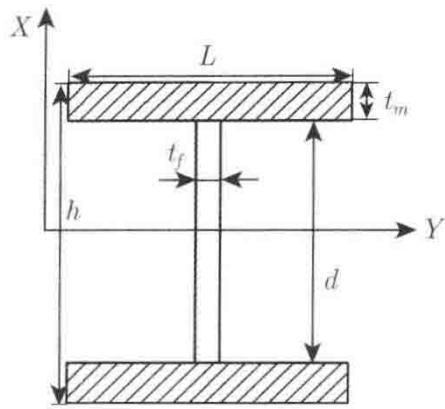

text_image

X
L
t_m
t_f
h
d
Y

(a) 工字梁尺寸形式

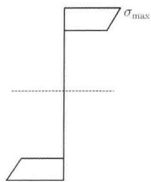

text_image

σ_max

(b) 主梁正应力分布  
图 7-1 工字梁缘条正应力分布

图 7-1 中，L 为等效模型中的蒙皮长度； $t_{m}$ 为蒙皮和主梁厚度； $t_{f}$ 为梁腹板的厚度；h 为工字梁模型的高度；d 为腹板的内高。

工字梁腹板段切应力计算公式为

$$
\tau = \frac {F _ {s} S _ {y} ^ {*}}{I _ {y} t _ {f}} \tag {7-3}
$$

若需要计算腹板上距中性轴为 x 处的切应力，则 $S_{y}^{*}$ 为

$$
S _ {y} ^ {*} = \frac {L}{8} (h ^ {2} - d ^ {2}) + \frac {t _ {f}}{2} \left(\frac {d ^ {2}}{4} - x ^ {2}\right) \tag {7-4}
$$

如图 7-2 所示，沿腹板高度，切应力也是按抛物线规律分布的。以 x = 0 和 $x = \pm \frac{d}{2}$ 分别代入式 (7-3) 和式 (7-4)，求出腹板上的最大和最小切应力分别是

$$
\tau_ {\max} = \frac {F _ {s}}{I _ {y} t _ {f}} \left[ \frac {L h ^ {2}}{8} - (L - b _ {0}) \frac {d ^ {2}}{8} \right] \tag {7-5}
$$

$$
\tau_ {\mathrm{min}} = \frac {F _ {s}}{I _ {y} t _ {f}} \left(\frac {L h ^ {2}}{8} - \frac {L d ^ {2}}{8}\right)
$$

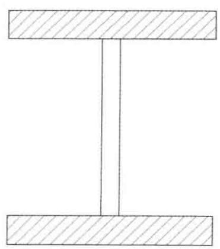

natural_image

Pure structural diagram of a T-shaped beam with hatched fill (no text or symbols)

(a) 工字梁图示

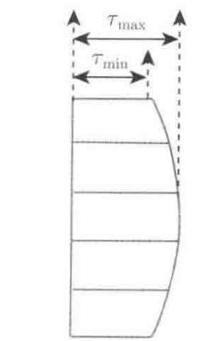

text_image

Tmax
Tmin

(b) 腹板剪应力分布  
图 7-2 腹板切应力分布

因为腹板的宽度远小于主梁的宽度 L，切应力最大值与最小值实际上相差不大，所以可以认为腹板上切应力大致是均匀分布的。按照图 7-2 中应力分布图的面积乘以腹板厚度，即可得到腹板上的总剪力 $F_{s1}$ 。计算结果表明， $F_{s1}$ 约等于 $(0.95 \sim 0.97)F_{s}$ 。由此可见，横截面上的剪力 $F_{s}$ 的绝大部分为腹板所负担。既然腹板几乎负担了截面上的全部剪力，而且腹板上的切应力又接近于均匀分布，这样，就可用腹板的截面面积除剪力表征胶板切应力

$$
\tau = \frac {F _ {s}}{t _ {f} d} \tag {7-6}
$$

在主梁上，也应有平行于 $F_{s}$ 的切应力分量，分布情况比较复杂，但数量很小，并无实际意义，所以通常并不进行计算。

# 7.2 叶片剖面模型简化

叶片属于自由曲面，截面形状相当复杂，与变形相关的惯性积、惯性矩等参数不能通过简单的代数运算获得，只有采用数值积分的方法精确计算。因此先对叶片外形和截面形状进行简化，建立宏观几何参数与叶片外形截面参数有关的简化模型，再在简化的模型上研究叶片弯曲变形。

依据横截面对展向的惯性矩相等，蒙皮厚度不变，主梁形状不变的前提等效为一对称物，其横截面如图 7-3 和图 7-4 所示。

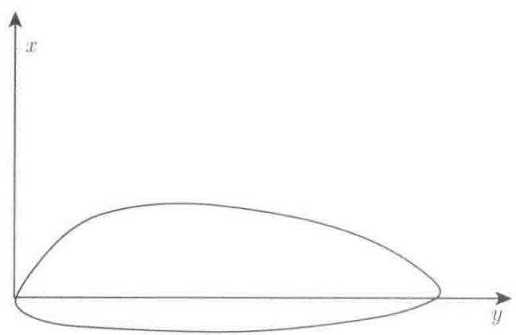

text_image

x
y

图 7-3 翼型截面的等效图

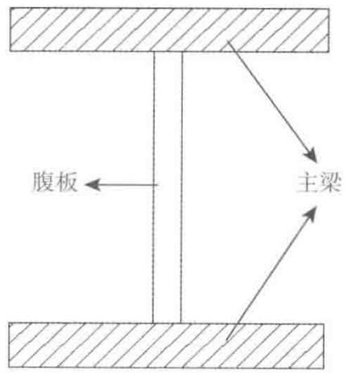

text_image

腹板
主梁

图 7-4 叶片主梁及腹板简化图

简化后的惯性矩计算公式如下：

$$
I _ {y y} = L \times t _ {m} \times \left(\frac {t _ {m}}{2} + \frac {d}{2}\right) ^ {2} \times 2 + \frac {t _ {f} d ^ {3}}{1 2} \approx \frac {1}{2} L t _ {m} d ^ {2} \tag {7-7}
$$

即工字梁主梁的惯性矩近似于主梁厚度、宽度和腹板内高成正比。

以 WB45.3 叶片为例，将展向不同位置的叶片剖面简化为主梁与腹板的工字梁结构。叶片采用预制主梁，宽度为 500mm。沿叶片展向，从叶根开始取 5 个叶片剖面，每个截面对应展向的不同位置，各剖面的主梁段曲率、腹板高度、主梁厚度都不同，如图 7-5 所示。

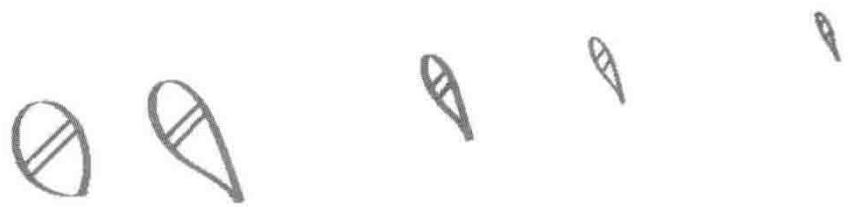

natural_image

Simple line drawings of five abstract shapes resembling leaf or seed pods (no text or symbols)

图 7-5 WB45.3 叶片展向 5 个剖面分布

WB45.3 叶片展向不同剖面位置的工字梁模型及工字梁宽度、厚度、高度见表 7-1。

表 7-1 WB45.3 叶片展向剖面简化为工字梁模型（工字梁为近似图示）

<table><tr><td>R</td><td>2D截面图</td><td colspan="2">工字梁/mm</td></tr><tr><td>6%</td><td>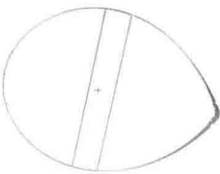</td><td>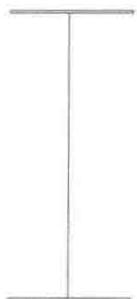</td><td>宽度L:500厚度tm:10高度h:1800</td></tr><tr><td>12%</td><td>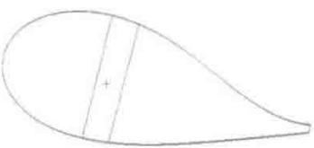</td><td>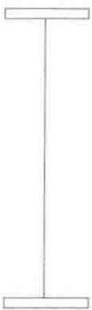</td><td>宽度L:500厚度tm:30高度h:3000</td></tr><tr><td>38%</td><td>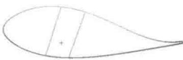</td><td>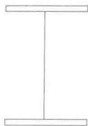</td><td>宽度L:500厚度tm:45高度h:800</td></tr><tr><td>56%</td><td>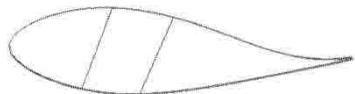</td><td>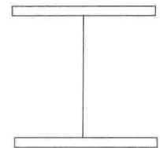</td><td>宽度L: 500厚度tm: 40高度h: 450</td></tr><tr><td>76%</td><td>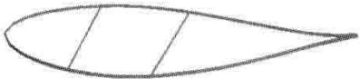</td><td>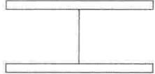</td><td>宽度L: 500厚度tm: 15高度h: 285</td></tr></table>

# 7.3 叶片剖面强度计算

风力机叶片要承受较大的载荷，为提高叶片的强度和刚度，防止局部失稳，叶片大多采用主梁加气动外壳的结构型式。主梁承担大部分的弯曲载荷，外壳是重要的受力元件，它在结构中除形成翼型，承受并传递扭矩外，还要承受一部分的弯矩。翼型形状的特殊性，在翼型坐标系下翼型弦向的长度远大于翼型的高度，加上叶片的挥舞方向受到的弯矩远大于摆振方向，使得叶片的主梁承担绝大部分的载荷，因此在对叶片做基本校核分析时，应对叶片主梁进行强度及刚度的校核与分析。

风力机叶片剖面，主梁型式如图 7-6 所示。

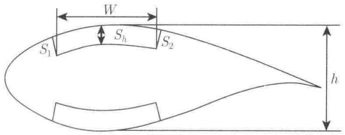

text_image

W
S₁ Sₕ S₂
h

图 7-6 叶片剖面简化成工字梁

根据工字梁理论，叶片剖面拉压弯矩的简化算法为

$$
M _ {y} = \sigma_ {\mathrm{b}} \times W \times S _ {h} \times h \times W \tag {7-8}
$$

其中， $S_{h}$ 为翼型主梁段的等效厚度；h 为翼型的绝对厚度；W 为等效模型折减系数。

$$
W = \frac {I _ {y y} (\text {弧形})}{I _ {y y} (\text {矩形})} \tag {7-9}
$$

可知， $W \leqslant 1$ 。

所以可得

$$
\sigma_ {\mathrm{b}} = \frac {M _ {y}}{W \times S _ {h} \times h \times W} \tag {7-10}
$$

通过计算得出叶片该截面处的 $\sigma_{b}$ ，与材料许用强度比较，可得出叶片该截面的拉压安全系数。W 的计算方法可用查表法得到。

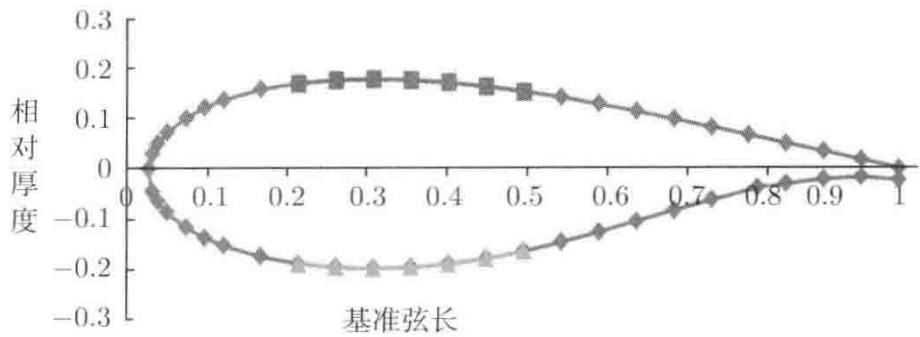

line

| 基准弦长 | 相对厚度 |
| -------- | -------- |
| 0.0      | 0.0      |
| 0.1      | 0.15     |
| 0.2      | 0.18     |
| 0.3      | 0.19     |
| 0.4      | 0.18     |
| 0.5      | 0.16     |
| 0.6      | 0.12     |
| 0.7      | 0.05     |
| 0.8      | -0.05    |
| 0.9      | -0.15    |
| 1.0      | -0.2     |

图 7-7 翼型截面取主梁位置

表 7-2 为根据翼型库，取弦长为 1 的标准翼型，翼型的变桨轴为 35% 弦长位置。按照如图 7-7 图示取主梁位置，根据弦长百分比由 20%\~50% 段确定为主梁铺设范围，主梁段厚度为 0.8mm。计算翼型库的翼型族的 W 值。

表 7-2 翼型族的 $W$ 值

<table><tr><td>NACA改型</td><td>弧线Iyy</td><td>直线Iyy</td><td>误差/%</td></tr><tr><td>NACA634_12</td><td> $1.72 \times 10^{-6}$ </td><td> $1.86 \times 10^{-6}$ </td><td>8.20</td></tr><tr><td>NACA634_16</td><td> $3.12 \times 10^{-6}$ </td><td> $3.37 \times 10^{-6}$ </td><td>8.08</td></tr><tr><td>NACA634_18</td><td> $3.98 \times 10^{-6}$ </td><td> $4.31 \times 10^{-6}$ </td><td>8.30</td></tr><tr><td>NACA634_21</td><td> $5.07 \times 10^{-6}$ </td><td> $5.50 \times 10^{-6}$ </td><td>8.50</td></tr><tr><td>NACA634_25</td><td> $6.85 \times 10^{-6}$ </td><td> $7.55 \times 10^{-6}$ </td><td>10.17</td></tr><tr><td>NACA634_30</td><td> $9.85 \times 10^{-6}$ </td><td> $1.09 \times 10^{-5}$ </td><td>10.79</td></tr><tr><td>NACA634_35</td><td> $1.35 \times 10^{-5}$ </td><td> $1.49 \times 10^{-5}$ </td><td>10.25</td></tr><tr><td>NACA634_40</td><td> $1.79 \times 10^{-5}$ </td><td> $1.96 \times 10^{-5}$ </td><td>9.17</td></tr></table>

以 NACA634\_21 为例，沿翼型的变桨轴分别向前缘与尾缘等距离扩大 W，计算 $x \sim W$ 的变化，x 为主梁铺设范围，计算结果见表 7-3。

表 7-3 NACA634\_21 的 $x \sim W$ 的变化

<table><tr><td>x/%</td><td>弧线 Iyy</td><td>直线 Iyy</td><td>误差/%</td></tr><tr><td>10</td><td> $1.80 \times 10^{-6}$ </td><td> $1.83 \times 10^{-6}$ </td><td>1.50</td></tr><tr><td>20</td><td> $3.52 \times 10^{-6}$ </td><td> $3.66 \times 10^{-6}$ </td><td>4.10</td></tr><tr><td>30</td><td> $5.07 \times 10^{-6}$ </td><td> $5.50 \times 10^{-6}$ </td><td>8.50</td></tr><tr><td>40</td><td> $6.41 \times 10^{-6}$ </td><td> $7.36 \times 10^{-6}$ </td><td>14.89</td></tr><tr><td>50</td><td> $7.48 \times 10^{-6}$ </td><td> $9.24 \times 10^{-6}$ </td><td>23.66</td></tr><tr><td>60</td><td> $8.24 \times 10^{-6}$ </td><td> $1.12 \times 10^{-5}$ </td><td>35.51</td></tr></table>

随着主梁宽度的增加，W 值的误差逐渐增大，如图 7-8 所示。

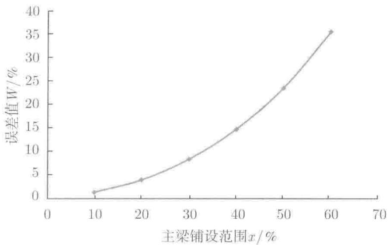

line

| 主梁铺设范围x/% | 误差值W/% |
| --------------- | --------- |
| 10              | 1.0       |
| 20              | 3.5       |
| 30              | 8.0       |
| 40              | 14.5      |
| 50              | 23.5      |
| 60              | 35.5      |

图 7-8 $x \sim W$ 变化曲线

# 7.4 叶片剖面强度分析

以 WB45.3 叶片为例，根据气动布局，确定弦长分布、扭角分布、绝对厚度分布，见表 7-4。结合复合材料单向布的拉伸及压缩许用应力和纤维方向的模量，在极限载荷作用下，应用一维方法设计叶片主梁厚度，计算叶片各剖面在各极限载荷作用下的强度安全系数和刚度分布。

表 7-4 某 2.0MW 叶片气动布局

<table><tr><td>叶片外形</td><td>气动布局</td><td>图示</td></tr><tr><td rowspan="3">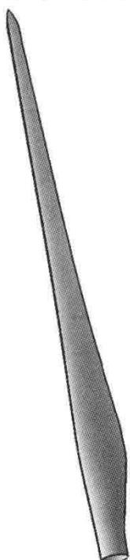</td><td>弦长分布</td><td></td></tr><tr><td>扭角分布</td><td>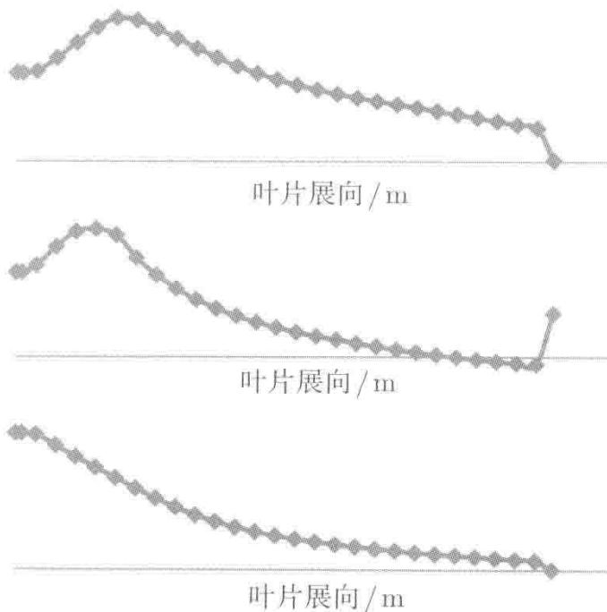</td></tr><tr><td>绝对厚度分布</td><td></td></tr></table>

叶片预制主梁采用等宽不等厚的设计，采用一维方法进行结构设计，认为叶片吸力面与压力面主梁铺层形式一致。在极限载荷作用下，按照一维方法计算叶片主梁的拉伸和压缩应力，与复合材料单向布的许用应力比较，确定主梁的拉伸和压缩强度安全系数，如图7-9所示。一般情况下，单向纤维的压缩性能低于拉伸性能，因此主梁的压缩安全系数低于拉伸安全系数。同时，根据叶片主梁厚度与工字梁模型高度，结合单向布纤维方向的模量 $E$ ，即可确定叶片沿展向的挥舞刚度 $EI$ ，如图7-10所示。

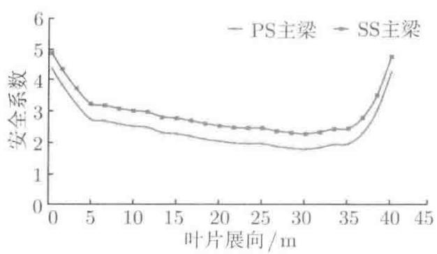

line

| 叶片展向/m | PS主梁 | SS主梁 |
| ---------- | ------ | ------ |
| 0          | 5.0    | 5.0    |
| 5          | 3.0    | 3.0    |
| 10         | 2.8    | 2.8    |
| 15         | 2.7    | 2.7    |
| 20         | 2.6    | 2.6    |
| 25         | 2.5    | 2.5    |
| 30         | 2.4    | 2.4    |
| 35         | 2.5    | 2.5    |
| 40         | 4.8    | 4.8    |

图 7-9 叶片主梁安全系数分布

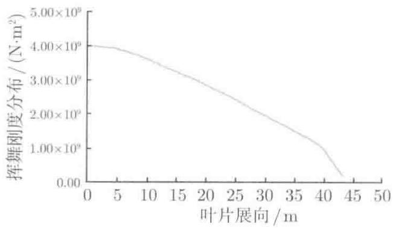

line

| 叶片展向 /m | 挥舞刚度分布 / (N·m²) |
| ----------- | ---------------------- |
| 0           | 4.00×10⁹               |
| 5           | 3.80×10⁹               |
| 10          | 3.50×10⁹               |
| 15          | 3.20×10⁹               |
| 20          | 2.80×10⁹               |
| 25          | 2.40×10⁹               |
| 30          | 2.00×10⁹               |
| 35          | 1.60×10⁹               |
| 40          | 1.20×10⁹               |
| 45          | 0.50×10⁹               |
| 50          | 0.00                   |

图 7-10 叶片主梁挥舞刚度分布

# 7.5 叶片弯曲变形计算

一般地，叶片在外载荷作用下，叶片产生弯曲和扭转变形。其中，剪力 $F_{x}$ 使梁腹板受剪，在弯矩 $M_{y}$ 作用下，叶片发生弯曲变形。根据叶片空气动力学分析可知，作用在叶片上的气动力包括两个部分：一部分是与气流速度有关的气体动力，另一部分是与叶片截面静压有关的气体静力。对于变截面梁，挠曲线近似微分方程为

$$
f ^ {\prime \prime} (z) = \frac {\mathrm{d} ^ {2} \omega}{\mathrm{d} x ^ {2}} = \frac {M (z)}{E I (z)} \tag {7-11}
$$

将挠曲线近似微分方程的两边乘以 dx，积分可得转角方程为

$$
\theta = f ^ {\prime} (z) = \frac {\mathrm{d} \omega}{\mathrm{d} x} = \int \frac {M (z)}{E I (z)} \mathrm{d} z + C _ {1} \tag {7-12}
$$

再乘以 dx，积分可得变截面梁的挠度曲线方程:

$$
\omega = f (z) = \int \int \left(\frac {M (z)}{E I (z)} \mathrm{d} z\right) \mathrm{d} z + C _ {1} z + C _ {2} \tag {7-13}
$$

其中， $C_{1}, C_{2}$ 为积分常数，通过边界条件可以确定。等截面梁的 EI 为常数，但是任一截面对中性轴的惯性矩 $I(z)$ 是个变量，弯矩 $M(z)$ 也是个变量，所以积分时要比等直梁复杂很多，故一维工程梁设计方法中将弯矩和惯性矩的计算模型做了简化，通过数值计算得出变截面梁的挠度。计算 $M = 2M_{y}$ 引起的弯曲变形，即挠度值。

简化过程如下，首先给出设计弯矩 $M = 2M_{y}$ 沿叶片展向的分布，相邻截面的两个弯矩值用一次函数方程描述：

$$
M (z) = k _ {1} z + b _ {1} \tag {7-14}
$$

其中， $k_{1}, b_{1}$ 为系数，z 为沿着叶片展向的坐标值。

同理，用一次函数描述叶片展向惯性矩 $I(z)$

$$
I (z) = k _ {2} z + b _ {2} \tag {7-15}
$$

其中， $k_{2}, b_{2}$ 为系数，z 为沿着叶片展向的坐标值。

由以上可得叶片各截面段的转角为

$$
\theta_ {i} = \int_ {z _ {1}} ^ {z _ {2}} \frac {M (z)}{E I (z)} \mathrm{d} z = \int_ {z _ {1}} ^ {z _ {2}} \frac {k _ {1} z + b _ {1}}{\left(k _ {2} z + b _ {2}\right) \times E} \mathrm{d} z \tag {7-16}
$$

可以近似为

$$
\theta_ {i} \approx (z _ {2} - z _ {1}) \frac {k _ {1} z _ {i} + b _ {1}}{E (k _ {2} z _ {i} + b _ {2})} \tag {7-17}
$$

其中， $z_{i} = \frac{z_{1} + z_{2}}{2}$ ， $E$ 为材料的弹性模量。

每段的挠度为 $w_{i}=(z_{i}-z_{i-1})\theta_{i}$ ，将各段挠度叠加得到整个叶片的挠度。

# 7.6 叶片剖面挠度分析

以本章节 7.4 的叶片为例，在确定了叶片挥舞刚度的情况下，叶片挥舞弯矩最大的一组极限载荷作用下，可初算出叶片的挠度分布，其挠度分布如图 7-11 所示。

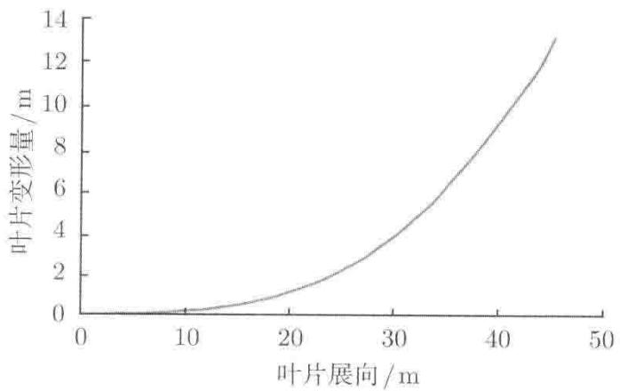

line

| 叶片展向 (m) | 叶片变形量 (m) |
| ------------ | -------------- |
| 0            | 0              |
| 10           | 0.5            |
| 20           | 1.5            |
| 30           | 4.0            |
| 40           | 8.0            |
| 50           | 13.0           |

图 7-11 叶片某载荷工况下挠度分布

# 7.7 一维方法误差分析

采用一维工字梁结构对叶片进行简化，存在以下基本假设：

(1) 叶片 3D 效应简化为 2D 效应，偏乐观。  
(2) 叶片工字梁结构相对于真实叶片模型, 去掉蒙皮、芯材、前缘梁、尾缘梁等结构件, 只考虑主梁和腹板。简化了叶片剖面的刚度, 减小了整体刚度特性, 整个载荷加载于主梁及腹板结构, 使主梁受载大于真实承载大小。  
(3) 双腹板结构简化为单腹板，影响整个闭室及腹板剪力流的分布。  
(4) 主梁与腹板组成的工字梁，在承受强度特性的时候，如弯矩作用，只考虑主梁受力忽略腹板受力。  
(5) 主梁结构不考虑工艺错层，简化梯形铺层形式为矩形，引入一定误差。  
(6) 工字梁结构上下对称, 惯性轴在中间, 而真实的叶片结构受压面和受拉面沿着惯性主轴不对称。  
(7) 叶片主梁结构为带有一定曲率的弧形梁, 而工字梁为矩形梁结构, 由弧形梁转为矩形梁会引入惯性矩的偏差。  
(8) 叶片剖面本身是多闭室结构, 简化为工字梁结构后, 从剪力流分布的角度无尾缘闭室、无前缘闭室。结合单腹板结构, 整个工字梁结构不能代表叶片剖面剪力流。  
(9) 工字梁结构中不考虑前缘、尾缘等结构件对扭转的影响。

(10) 工字梁基于平面假设，同时满足变形协调条件。

针对叶片剖面逐级简化为工字梁模型的过程，分成4个模型来分析，见表7-5。每种分析模型，在叶片剖面载荷、加载形式、材料属性等都不变更的情况下，四种模型的最外蒙皮层的应力云图见表7-6。

表 7-5 四种分析模型

<table><tr><td>模型</td><td>描述</td><td>图示</td></tr><tr><td>A</td><td>全模型</td><td>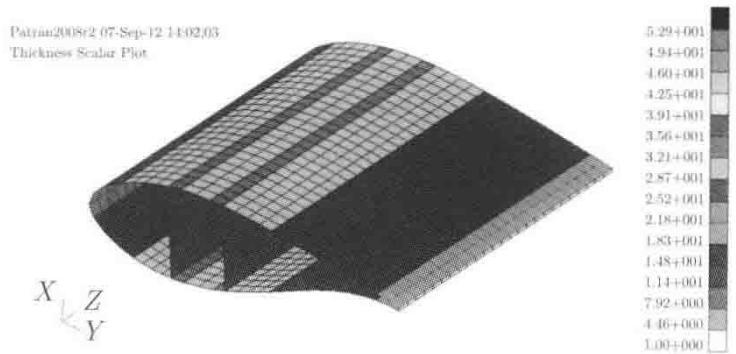</td></tr><tr><td>B</td><td>去掉尾缘梁、尾缘夹芯和尾缘闭口</td><td>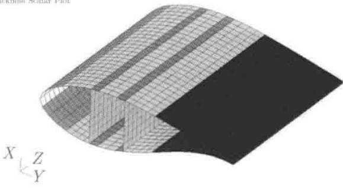</td></tr><tr><td>C</td><td>在B的基础上,去掉前缘夹芯和前缘胶接段</td><td>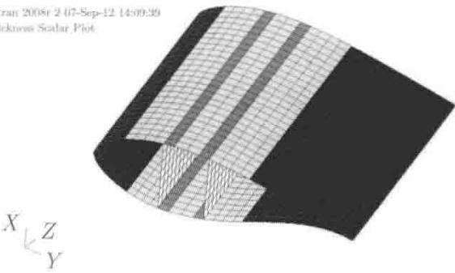</td></tr><tr><td>D</td><td>在C的基础上,双腹板变单腹板,变成只包含主梁、单腹板及单腹板胶接段的工字梁结构</td><td>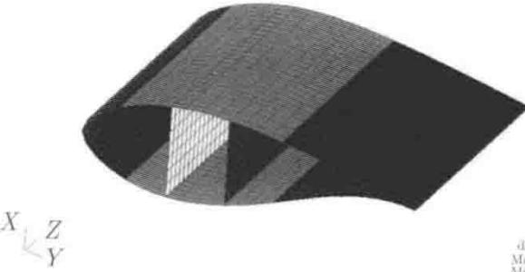</td></tr></table>

表 7-6 各模型计算云图

<table><tr><td>模型</td><td>计算云图</td><td>模型</td><td>计算云图</td></tr><tr><td>A</td><td>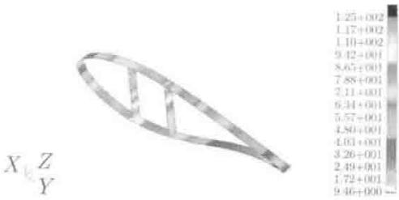</td><td>C</td><td>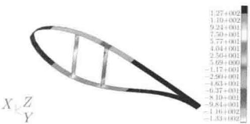</td></tr><tr><td>B</td><td>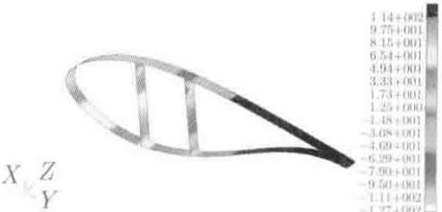</td><td>D</td><td>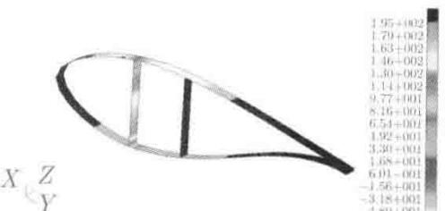</td></tr></table>

每种模型的计算，以主梁中心单元和腹板中段最外层的蒙皮单元作为分析对象，如图 7-12 所示，对比分析不同模型下正应力与剪应力的误差范围。

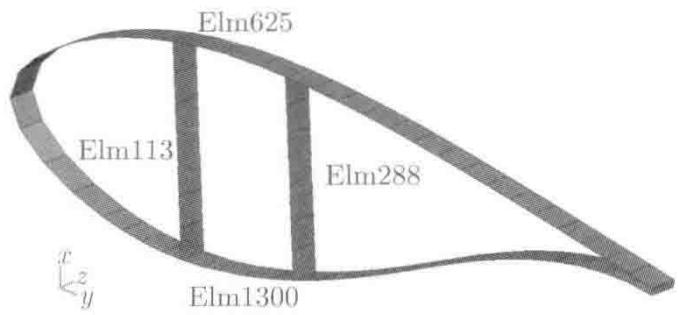

text_image

Elm625
Elm113
Elm288
Elm1300
x
y

图 7-12 叶片剖面分析单元编号

根据表 7-7 的纤维方向正应力的计算结果, 可以看出主梁段的正应力在各模型间变化很小。由于 B、C、D 模型相比 A 模型进行了一定程度的模型简化, 因此影响了叶片剖面的总体刚度, 引入正应力计算的偏差, 但这些偏差的影响很小, 因此将叶片剖面简化为工字梁模型进行正应力的计算与分析是可行的。

表 7-7 各模型计算云图结果汇总

<table><tr><td rowspan="2">单元编号</td><td rowspan="2">铺层</td><td colspan="4">纤维方向正应力对比</td><td colspan="4">面内剪切应力</td></tr><tr><td>A</td><td>B</td><td>C</td><td>D</td><td>A</td><td>B</td><td>C</td><td>D</td></tr><tr><td>1300</td><td>主梁 UD</td><td>1.00</td><td>1.01</td><td>1.02</td><td>1.02</td><td>—</td><td>—</td><td>—</td><td>—</td></tr><tr><td>625</td><td>主梁 UD</td><td>1.00</td><td>1.01</td><td>1.00</td><td>1.02</td><td>—</td><td>—</td><td>—</td><td>—</td></tr><tr><td>288</td><td>BX+45</td><td>—</td><td>—</td><td>—</td><td>—</td><td>1.00</td><td>2.08</td><td>2.11</td><td>—</td></tr><tr><td>113</td><td>BX+45</td><td>—</td><td>—</td><td>—</td><td>—</td><td>1.00</td><td>0.71</td><td>0.69</td><td>0.70</td></tr></table>

根据面内剪切应力的计算结果可以看出, 腹板段外蒙皮的面内剪切应力在 B、C、D 模型间变化较小, 而由 A 模型去掉尾缘闭室, 对整个剖面的剪力流影响很大, 改变了整个闭室结构的剪力流分布, 直接影响叶片剖面的剪应力。因此, 叶片剖面简化为工字梁模型后对整个剖面剪力流影响很大, 直接影响抗剪腹板的剪应力, 需要开发新的方法进行叶片剖面的剪应力计算。

一维方法可以快速地实现叶片主梁的强度验证，同时可以加深工程师对叶片弯矩作用下的正应力校核、刚度分析的理解，针对非叶片结构专业领域的工程师可实现快速入门。尤其在叶片生产现场，需要对叶片主梁进行变更及铺层调整情况下，快速地给出变更前后的强度对比，以便现场工程问题的解决。

# 7.8 一维方法应用拓展

# 1. 将叶片结构分析用于气弹分析

针对风力机初步设计阶段，可引入静气动弹性的影响，采用叶素-动量理论计算气动力, 叶片结构形式即为一维梁理论计算结构变形, 如图 7-13 所示, 建立风力机叶片静气动弹性耦合方程, 可分析弹性变形对叶片气动设计的影响, 以及载荷重新分布对叶片结构设计的影响 [17]。

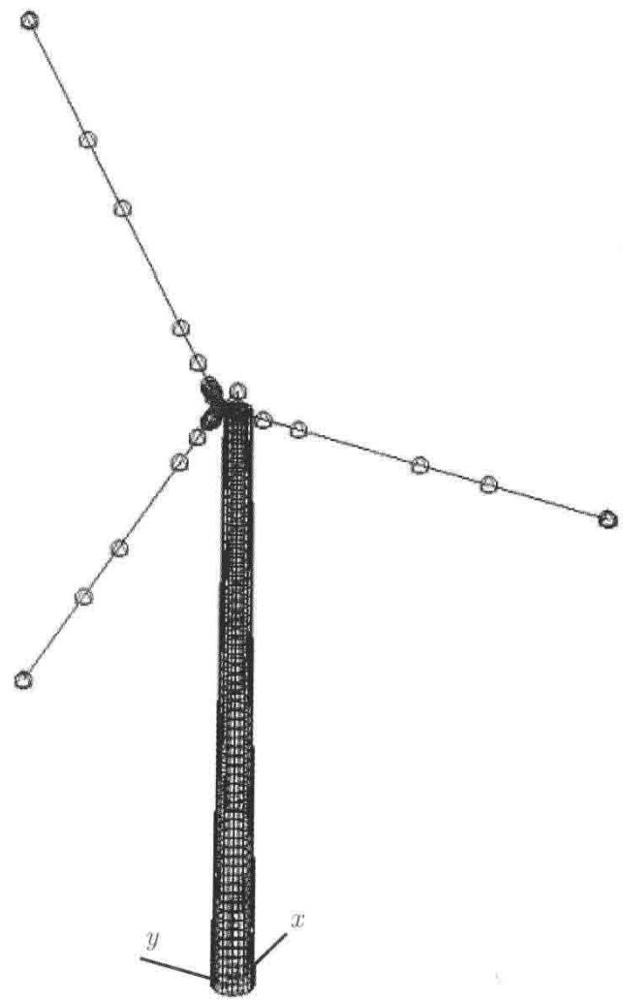

natural_image

Diagram of a vertical structure with labeled x and y axes, showing intersecting lines and circular nodes (no text or symbols beyond axis labels)

图 7-13 风力机叶片梁结构模型

# 2. 将叶片结构分析用于传动链动力学分析

在传动链动力学分析的过程中，常常需要对叶片进行建模以了解叶片对整个系统动力学的影响，叶片通常采用梁结构的方法，但在建模的过程中，需要特别注意叶片的扭心和弯心的问题。

# 第8章 二维方法

叶片二维结构校核方法，主要为薄壁翼型结构校核的工程方法和二维等截面有限元校核，其目的主要是快速给出满足技术要求的铺层形式。叶片二维结构校核的流程如图 8-1 所示。

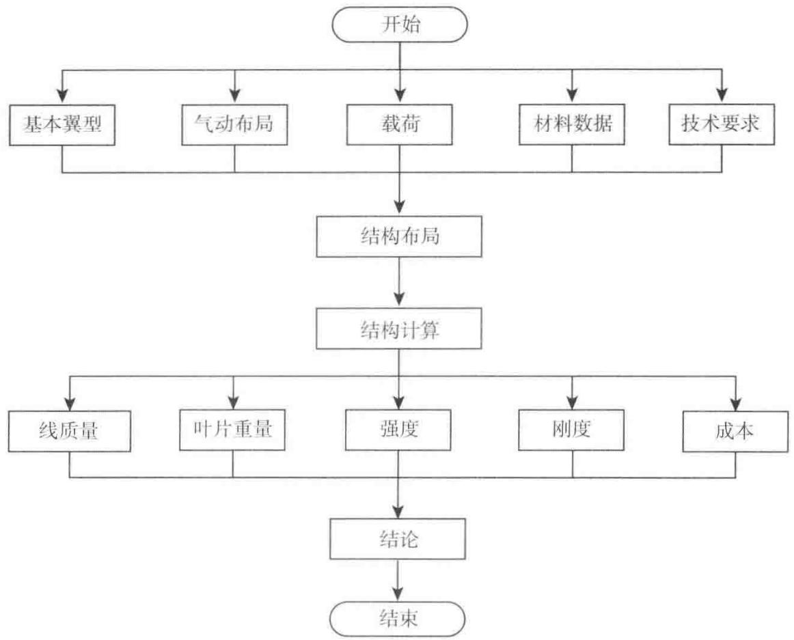

flowchart

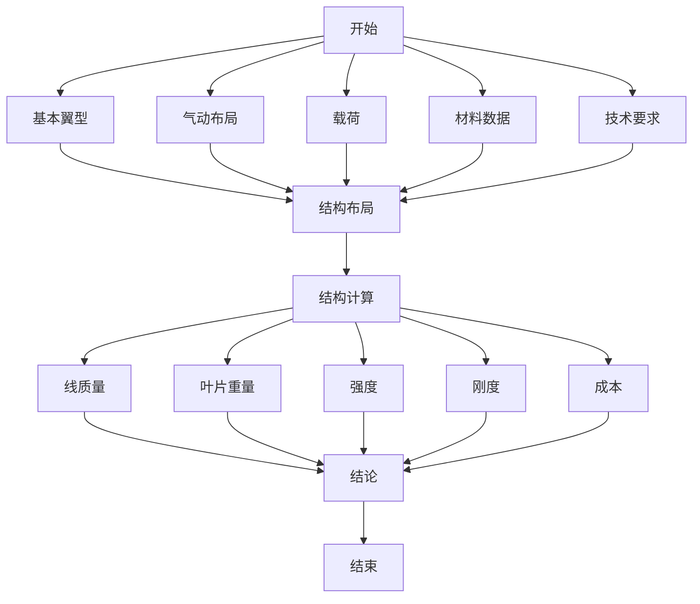
```mermaid
graph TD
    A["开始"] --> B["基本翼型"]
    A --> C["气动布局"]
    A --> D["载荷"]
    A --> E["材料数据"]
    A --> F["技术要求"]
    B --> G["结构布局"]
    C --> G
    D --> G
    E --> G
    F --> G
    G --> H["结构计算"]
    H --> I["线质量"]
    H --> J["叶片重量"]
    H --> K["强度"]
    H --> L["刚度"]
    H --> M["成本"]
    I --> N["结论"]
    J --> N
    K --> N
    L --> N
    M --> N
    N --> O["结束"]
```

图8-1 二维结构校核流程

风力机叶片的结构校核大多是在叶片气动设计和结构设计完成之后开始的，它的主要任务是根据叶片铺层设计结果，并结合载荷和材料特性校核叶片强度、刚度、重量和频率等，根据校核的结果判断是否满足叶片技术要求。如不满足，调整叶片铺层设计，直到最终得到符合结构设计要求的铺层形式。由于一维工程梁设计概念是按照经典理论进行计算，所做的简化过多，一定程度上影响叶片的设计质量。本章节主要介绍薄壁翼型的正应力计算原理和多闭室剖面剪力流的计算方法，并根据此方法编译出一套工程算法，实现快速进行叶片的二维结构校核。

# 8.1 叶片强度计算

# 8.1.1 薄壁翼型正应力计算

叶片是薄壁结构，蒙皮较厚，但长宽与铺层厚度的比值仍远大于10，故可采用薄壁杆件结构力学为结构设计理论基础。由于叶片各剖面的铺层相比于翼型厚度很薄，因此可以将叶片各剖面看做薄壁翼型，假设铺层中的正应力和剪应力沿其厚度均匀分布[18]。

# 1. 基本假设

(1) 矩形单元假设: 叶片各剖面为翼型截面, 翼型的样条曲线难以通过函数表达, 故无法通过积分算法得到叶片剖面的固有特性, 需应用划分单元的方法模拟函数积分算法。本工程算法采用矩形法划分单元, 增大了计算面积, 如图 8-2 所示, 减小叶片各剖面的最大应力, 使铺层设计偏于保守。

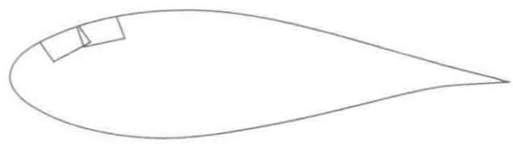

natural_image

Simple line drawing of a curved shape with a small rectangular cutout on top (no text or symbols)

图 8-2 矩形单元计算模型

(2) 剖面无畸变假设: 大型风力机叶片结构在受载荷作用发生变形时, 横剖面在自身平面上的投影保持不变, 但横剖面沿纵轴方向可以自由翘曲。为了保持横剖面的形状, 大型风力机叶片在沿叶片展长方向设有腹板加强梁, 而该假设在小变形情况下是符合实际情况的。  
(3) 材料各向同性假设: 复合材料已广泛应用于大型风力机叶片中, 但复合材料的各向异性特性和层合特性使得结构分析和强度计算复杂化。为简化计算, 该工程算法假定材料是各向同性的。  
(4) 线应变假设：假设叶片剖面上线应变符合平面分布规律，则可表示为

$$
\varepsilon = a x + b y + c \tag {8-1}
$$

其中，x, y 为叶片剖面上各点位置的坐标；a, b, c 为待定系数。

综上，综合考虑所有基本假设的影响，该工程算法中的简化模型与风力机叶片真实样片比较存在一定误差，但这可在应用工程算法设计风力机叶片铺层形式时通过模型安全系数对其进行有效的修正。

# 2. 薄壁杆件正应力计算

# 1) 叶片铺层矩形单元

翼型蒙皮的铺层计算，采用的矩形单元如图8-3所示。矩形单元的两个顶点为翼型的坐标点，其他两个顶点为计算铺层引入的单元的特征点。铺层2是在蒙皮铺层以下，矩形单元BAMN的特征点中的两个顶点 $(B,A)$ 同为蒙皮铺层的矩形单元ABCD的两个特征点 $(B,A)$ 。同理，铺层N的矩形单元如同铺层2矩形单元的方法一致。图中 $h_{1}$ 为蒙皮铺层的厚度； $h_{2}$ 为铺层2的铺层厚度。

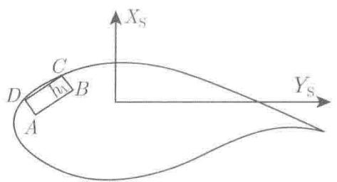

text_image

X_S
C
D
m
B
A
Y_S

(a) 蒙皮铺层单元示意图

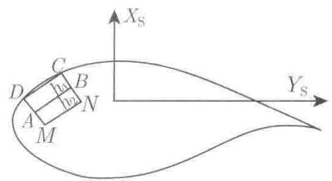

text_image

X_S
Y_S
C
D
B
A
M
N

(b) 铺层2单元示意图  
图 8-3 矩形法划分蒙皮单元

# 2) 矩形单元固有特性计算

由矩形法，如图 8-4 划分蒙皮单元，为方便矩形单元的计算，引入角 $\theta$ 。

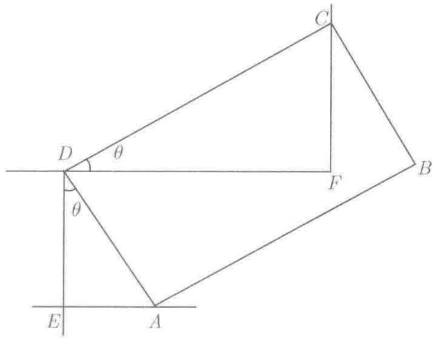

text_image

C
D
θ
F
B
θ
E
A

图 8-4 矩形单元示意图

矩形 ABCD 顶点坐标为 $D(X_{\mathrm{S}}[i], Y_{\mathrm{S}}[i])$ ， $C(X_{\mathrm{S}}[i+1], Y_{\mathrm{S}}[i+1])$ ， $A(X^{\prime}[i], Y^{\prime}[i])$ ， $B(X^{\prime}[i+1], Y^{\prime}[i+1])$ ，由已知的翼型坐标点 D、C 两点坐标，很容易求出 A、B 两点的坐标。计算矩形单元在翼型坐标系下的固有特性。

矩形单元的面积：

$$
A [ i ] = | \Delta | \times h _ {1} \tag {8-2}
$$

$|\Delta|$ 为矩形单元 DC(或 AB) 的边长。

一阶惯性矩：

$$
S _ {Y _ {\mathrm{S}}} [ i ] = A [ i ] \times \left(X _ {\mathrm{S}} [ i ] + X ^ {\prime} [ i + 1 ]\right) / 2 \tag {8-3}
$$

$$
S _ {X _ {\mathrm{S}}} [ i ] = A [ i ] \times \left(Y _ {\mathrm{S}} [ i ] + Y ^ {\prime} [ i + 1 ]\right) / 2
$$

二阶惯性矩：翼型坐标系 $O_{S}$ 相当于矩形单元在形心坐标系下先绕 OC 原点顺时针旋转 $\theta$ ，再平移后得到的。由转轴公式和移轴公式得

$$
I _ {X _ {\mathrm{S}} X _ {\mathrm{S}}} [ i ] = I _ {X _ {1}} + A [ i ] \left(\frac {Y _ {S} [ i ] + Y ^ {\prime} [ i + 1 ]}{2}\right) ^ {2} \tag {8-4}
$$

其中

$$
I _ {X _ {1}} = \frac {I _ {Y _ {\mathrm{C}}} + I _ {X _ {\mathrm{C}}}}{2} - \frac {I _ {Y _ {\mathrm{C}}} - I _ {X _ {\mathrm{C}}}}{2} \cos 2 (- \theta) + I _ {X _ {\mathrm{C}} Y _ {\mathrm{C}}} \sin 2 (- \theta)
$$

$$
I _ {Y _ {\mathrm{S}} Y _ {\mathrm{S}}} [ i ] = I _ {Y _ {1}} + A [ i ] \left(\frac {X _ {S} [ i ] + X ^ {\prime} [ i + 1 ]}{2}\right) ^ {2} \tag {8-5}
$$

其中

$$
I _ {Y _ {1}} = \frac {I _ {Y _ {\mathrm{C}}} + I _ {X _ {\mathrm{C}}}}{2} + \frac {I _ {Y _ {\mathrm{C}}} - I _ {X _ {\mathrm{C}}}}{2} \cos 2 (- \theta) - I _ {X _ {\mathrm{C}} Y _ {\mathrm{C}}} \sin 2 (- \theta)
$$

$I_{Y_{C}}, I_{X_{C}}, I_{X_{C}Y_{C}}$ 为矩形单元在形心坐标系下的固有特性。

二阶惯性积：

$$
\begin{array}{l} \begin{array}{r l} I _ {X _ {\mathrm{S}} Y _ {\mathrm{S}}} [ i ] & = \frac {I _ {Y _ {\mathrm{C}}} - I _ {X _ {\mathrm{C}}}}{2} \sin 2 (- \theta) + I _ {X _ {\mathrm{C}} Y _ {\mathrm{C}}} \cos 2 (- \theta) \\ & X _ {\mathrm{C}} [ i ] + X ^ {\prime} [ i + 1 ] Y _ {\mathrm{C}} [ i ] + Y ^ {\prime} [ i + 1 ] \end{array} \tag {8-6} \\ + \frac {X _ {S} [ i ] + X ^ {\prime} [ i + 1 ]}{2} \frac {Y _ {S} [ i ] + Y ^ {\prime} [ i + 1 ]}{2} A [ i ] \\ \end{array}
$$

# 3) 铺层固有特性

假设各铺层划分为 N 个矩形单元，每个矩形单元加权求和，计算出蒙皮铺层材料的固有特性。

蒙皮铺层面积：

$$
A = \sum_ {i = 1} ^ {N} A [ i ] \tag {8-7}
$$

蒙皮铺层惯性矩：

$$
S _ {Y _ {\mathrm{S}}} = \sum_ {i = 1} ^ {N} S _ {Y _ {\mathrm{S}}} [ i ], \quad S _ {X _ {\mathrm{S}}} = \sum_ {i = 1} ^ {N} S _ {X _ {\mathrm{S}}} [ i ] \tag {8-8}
$$

蒙皮铺层二阶惯性矩：

$$
I _ {X _ {\mathrm{S}} X _ {\mathrm{S}}} = \sum_ {i = 1} ^ {N} I _ {X _ {\mathrm{S}} X _ {\mathrm{S}}} [ i ], \quad I _ {Y _ {\mathrm{S}} Y _ {\mathrm{S}}} = \sum_ {i = 1} ^ {N} I _ {Y _ {\mathrm{S}} Y _ {\mathrm{S}}} [ i ] \tag {8-9}
$$

蒙皮铺层二阶惯性积：

$$
I _ {X _ {\mathrm{S}} Y _ {\mathrm{S}}} = \sum_ {i = 1} ^ {N} I _ {X _ {\mathrm{S}} Y _ {\mathrm{S}}} [ i ] \tag {8-10}
$$

# 4) 薄壁翼型的固有特性

叶片的每一个截面包含多个铺层，每个铺层对应的材料不同，铺层厚度是也不同的。要想得到每一个薄壁翼型固有特性，需对各个铺层材料加权求和。

薄壁翼型固有特性：

$$
E A = \sum \left(E _ {j} A _ {j}\right), \quad E S _ {X _ {\mathrm{S}}} = \sum \left(E _ {j} S _ {X _ {\mathrm{S}} j}\right), \quad E S _ {Y _ {\mathrm{S}}} = \sum \left(E _ {j} S _ {Y _ {\mathrm{S}} j}\right) \tag {8-11}
$$

其中， $j$ 为不同铺层的材料； $E_{j}$ 为 $j$ 材料的弹性模量。

薄壁翼型线质量：

$$
\rho A = \sum \left(\rho_ {j} A _ {j}\right) \tag {8-12}
$$

其中， $\rho_{j}$ 为 j 材料的密度。

薄壁翼型的刚度：

$$
E I _ {X _ {\mathrm{S}} X _ {\mathrm{S}}} = \sum \left(E _ {j} I _ {X _ {\mathrm{S}} X _ {\mathrm{S}} j}\right), \quad E I _ {Y _ {\mathrm{S}} Y _ {\mathrm{S}}} = \sum \left(E _ {j} I _ {Y _ {\mathrm{S}} Y _ {\mathrm{S}} j}\right), \quad E I _ {X _ {\mathrm{S}} Y _ {\mathrm{S}}} = \sum \left(E _ {j} I _ {X _ {\mathrm{S}} Y _ {\mathrm{S}} j}\right) \tag {8-13}
$$

薄壁翼型的重心：

$$
X _ {M} = \rho S _ {Y _ {\mathrm{S}}} / \rho A, \quad Y _ {M} = \rho S _ {X _ {\mathrm{S}}} / \rho A \tag {8-14}
$$

薄壁翼型的形心：

$$
X _ {C} = E S _ {Y _ {\mathrm{S}}} / E A, \quad Y _ {C} = E S _ {X _ {\mathrm{S}}} / E A \tag {8-15}
$$

薄壁翼型形心坐标系下的刚度：

$$
\begin{array}{l} E I _ {X _ {\mathrm{C}} X _ {\mathrm{C}}} = E I _ {X _ {\mathrm{S}} X _ {\mathrm{S}}} - E A \times Y _ {C} ^ {2}, \quad E I _ {Y _ {\mathrm{C}} Y _ {\mathrm{C}}} = E I _ {Y _ {\mathrm{S}} Y _ {\mathrm{S}}} - E A \times X _ {C} ^ {2}, \\ E I _ {X _ {\mathrm{C}} X _ {\mathrm{C}}} = E I _ {X _ {\mathrm{S}} X _ {\mathrm{S}}} - E A \times Y _ {C} Y _ {C}. \end{array} \tag {8-16}
$$

$$
E I _ {X _ {\mathrm{C}} Y _ {\mathrm{C}}} = E I _ {X _ {\mathrm{S}} Y _ {\mathrm{S}}} - E A \times X _ {C} Y _ {C}
$$

# 5) 薄壁翼型正应力计算方法

根据线应变平面分布规律的假设和叶片剖面无畸变的假设，风力机叶片剖面上任一点的正应力可以表示为

$$
\sigma_ {Z _ {\mathrm{S}}} = E \varepsilon_ {Z _ {\mathrm{S}}} = E \left(\varepsilon_ {0} + Y _ {S} \frac {1}{\rho_ {X _ {\mathrm{S}}}} - X _ {S} \frac {1}{\rho_ {Y _ {\mathrm{S}}}}\right) \tag {8-17}
$$

其中， $X_{S}$ 和 $Y_{S}$ 为叶片剖面各点坐标。E 为叶片剖面的弹性模量； $\varepsilon_{0}$ ， $\frac{1}{\rho_{X_{S}}}$ ， $\frac{1}{\rho_{Y_{S}}}$ 为待定系数，可由剖面上的静力平衡条件确定。

根据叶片剖面摆振力矩 $M_{X_{S}}$ 、挥舞力矩 $M_{Y_{S}}$ 和径向力 $F_{Z_{S}}$ 的合内力关系，沿整个剖面全部承受正应力的面积进行积分，得到 Z 方向的轴向力为

$$
\begin{array}{l} F _ {Z _ {\mathrm{S}}} = \int_ {A} \sigma_ {Z _ {\mathrm{S}}} \mathrm{d} A = E \int_ {A} \varepsilon_ {0} \mathrm{d} A + E \int_ {A} Y _ {S} \frac {1}{\rho_ {X _ {\mathrm{S}}}} \mathrm{d} A - E \int_ {A} X _ {S} \frac {1}{\rho_ {Y _ {\mathrm{S}}}} \mathrm{d} A \\ = \varepsilon_ {0} E A + \frac {1}{\rho_ {X _ {\mathrm{S}}}} E S _ {X _ {\mathrm{S}}} - \frac {1}{\rho_ {Y _ {\mathrm{S}}}} E S _ {Y _ {\mathrm{S}}} \tag {8-18} \\ \end{array}
$$

绕 $X_{\mathrm{S}}$ 轴和 $Y_{\mathrm{S}}$ 轴回转的弯矩为

$$
M _ {X _ {\mathrm{S}}} = \int_ {A} \sigma_ {Z _ {\mathrm{S}}} Y _ {S} \mathrm{d} A = E \int_ {A} \varepsilon_ {0} Y _ {S} \mathrm{d} A + E \int_ {A} Y _ {S} \frac {1}{\rho_ {X _ {\mathrm{S}}}} Y _ {S} \mathrm{d} A
$$

$$
- E \int_ {A} X _ {S} \frac {1}{\rho_ {Y _ {\mathrm{S}}}} Y _ {S} \mathrm{d} A \tag {8-19}
$$

$$
= \varepsilon_ {0} E S _ {X _ {\mathrm{S}}} + \frac {1}{\rho_ {X _ {\mathrm{S}}}} E I _ {X _ {\mathrm{S}} X _ {\mathrm{S}}} - \frac {1}{\rho_ {Y _ {\mathrm{S}}}} E I _ {X _ {\mathrm{S}} Y _ {\mathrm{S}}}
$$

$$
\begin{array}{l} M _ {Y _ {\mathrm{S}}} = - \int_ {A} \sigma_ {Z _ {\mathrm{S}}} X _ {S} \mathrm{d} A = - E \int_ {A} \varepsilon_ {0} X _ {S} \mathrm{d} A - E \int_ {A} Y _ {S} \frac {1}{\rho_ {X _ {\mathrm{S}}}} X _ {S} \mathrm{d} A \\ + E \int_ {A} X _ {S} \frac {1}{\rho_ {Y _ {\mathrm{S}}}} X _ {S} \mathrm{d} A \tag {8-20} \\ = - \varepsilon_ {0} E S _ {Y _ {\mathrm{S}}} - \frac {1}{\rho_ {X _ {\mathrm{S}}}} E I _ {X _ {\mathrm{S}} Y _ {\mathrm{S}}} + \frac {1}{\rho_ {Y _ {\mathrm{S}}}} E I _ {Y _ {\mathrm{S}} Y _ {\mathrm{S}}} \\ \end{array}
$$

可表示为

$$
F _ {Z _ {\mathrm{S}}} = \varepsilon_ {0} E A + \frac {1}{\rho_ {X _ {\mathrm{S}}}} E S _ {X _ {\mathrm{S}}} - \frac {1}{\rho_ {Y _ {\mathrm{S}}}} E S _ {Y _ {\mathrm{S}}}
$$

$$
M _ {X _ {\mathrm{S}}} = \varepsilon_ {0} E S _ {X _ {\mathrm{S}}} + \frac {1}{\rho_ {X _ {\mathrm{S}}}} E I _ {X _ {\mathrm{S}} X _ {\mathrm{S}}} - \frac {1}{\rho_ {Y _ {\mathrm{S}}}} E I _ {X _ {\mathrm{S}} Y _ {\mathrm{S}}} \tag {8-21}
$$

$$
M _ {Y _ {\mathrm{S}}} = - \varepsilon_ {0} E S _ {Y _ {\mathrm{S}}} - \frac {1}{\rho_ {X _ {\mathrm{S}}}} E I _ {X _ {\mathrm{S}} Y _ {\mathrm{S}}} + \frac {1}{\rho_ {Y _ {\mathrm{S}}}} E I _ {Y _ {\mathrm{S}} Y _ {\mathrm{S}}}
$$

即

$$
\left[ \begin{array}{l} \varepsilon_ {0} \\ 1 / \rho_ {X _ {\mathrm{S}}} \\ 1 / \rho_ {Y _ {\mathrm{S}}} \end{array} \right] = \left[ \begin{array}{c c c} E A & E S _ {X _ {\mathrm{S}}} & - E S _ {Y _ {\mathrm{S}}} \\ E S _ {X _ {\mathrm{S}}} & E I _ {X _ {\mathrm{S}} X _ {\mathrm{S}}} & - E I _ {X _ {\mathrm{S}} Y _ {\mathrm{S}}} \\ - E S _ {Y _ {\mathrm{S}}} & - E I _ {X _ {\mathrm{S}} Y _ {\mathrm{S}}} & E I _ {Y _ {\mathrm{S}} Y _ {\mathrm{S}}} \end{array} \right] ^ {- 1} \left[ \begin{array}{l} F _ {Z} \\ M _ {x s} \\ M _ {y s} \end{array} \right] \tag {8-22}
$$

# 6) 薄壁翼型拉伸应力和压缩应力

取矩形单元的四个顶点的最大应变作为矩形单元的应变，对于同一种铺层而言，把这种铺层材料的所有矩形单元的最大应变，作为这种铺层材料的应变 $\varepsilon_{j}$ 。每个铺层的最大拉应变为 $\max \varepsilon_{j}$ ，最大拉应力为 $E_{j} \max \varepsilon_{j}$ ，各铺层最大拉应力的最大值为叶片截面的拉应力 $\sigma_{t}$ ；每个铺层的最大压应变为 $\min \varepsilon_{j}$ ，最大压应力为 $E_{j} \min \varepsilon_{j}$ ，各铺层最大压应力的绝对值的最大值为叶片截面的压应力 $\sigma_{c}$ 。

# 7) 薄壁翼型安全系数

每个铺层的拉安全系数为 $\left[\sigma_{\mathrm{t}}\right]/\left(E_{j}\max\varepsilon_{j}\right)$ ，叶片截面的拉伸安全系数为各铺层拉安全系数的最小值；每个铺层的压安全系数为 $-\left[\sigma_{\mathrm{c}}\right]/\left(E_{j}\min\varepsilon_{j}\right)$ ，叶片截面的压缩安全系数为各铺层压安全系数的最小值。叶片截面的安全系数，为拉伸安全系数与压缩安全系数的最小值。

# 8.1.2 薄壁翼型剪应力计算

根据多闭室剖面剪力流的理论，薄壁翼型剪应力校核的基本流程如图 8-5 所示。

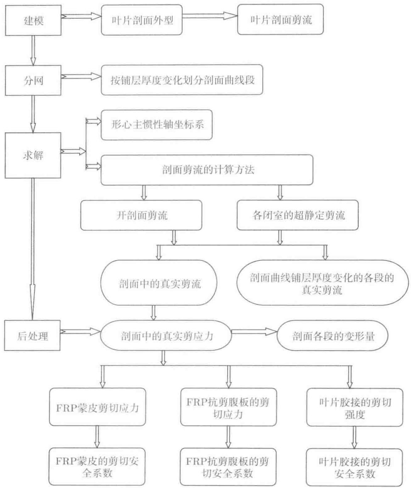

flowchart

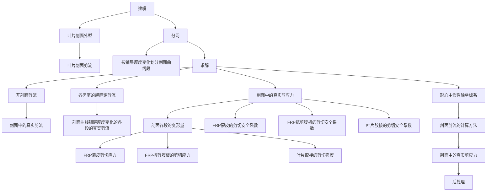
```mermaid
graph TD
    A["建模"] --> B["叶片剖面外型"]
    B --> C["叶片剖面剪流"]
    A --> D["分网"]
    D --> E["按铺层厚度变化划分剖面曲线段"]
    D --> F["求解"]
    F --> G["开剖面剪流"]
    F --> H["各闭室的超静定剪流"]
    G --> I["剖面中的真实剪流"]
    H --> J["剖面曲线铺层厚度变化的各段的真实剪流"]
    F --> K["剖面中的真实剪应力"]
    K --> L["剖面各段的变形量"]
    L --> M["FRP蒙皮剪切应力"]
    L --> N["FRP抗剪腹板的剪切应力"]
    L --> O["叶片胶接的剪切强度"]
    K --> P["FRP蒙皮的剪切安全系数"]
    K --> Q["FRP抗剪腹板的剪切安全系数"]
    K --> R["叶片胶接的剪切安全系数"]
    F --> S["形心主惯性轴坐标系"]
    S --> T["剖面剪流的计算方法"]
    T --> U["剖面中的真实剪应力"]
    U --> V["后处理"]
```

图 8-5 剪应力校核流程

由于薄壁很薄，可以假设薄壁中的剪应力沿其厚度均匀分布 $^{[18]}$ 。并用剪力流q表示剪应力 $\tau$ ，且有 $q=\tau t$ ，t为薄壁的厚度。由 $(N-1)$ 个腹板组成的N个闭室的叶片开剖面剪力流，各闭室剪力流如图8-6所示。 $(N-1)$ 个腹板的叶片剖面划分为N个闭室。每个闭室根据不同材料的铺层厚度的变化点划分曲线段。将叶片剖面分成M段曲线段，进行分段求解。求解叶片剖面的剪应力，要在形心主轴坐标系下求解。因为计算开剖面弯曲引起的剪力流时，在形心主轴坐标系下，自由边处的静矩 $S_{X_{C}}$ ， $S_{Y_{C}}$ 必然为0。故自由边上的剪力流也必然为0。

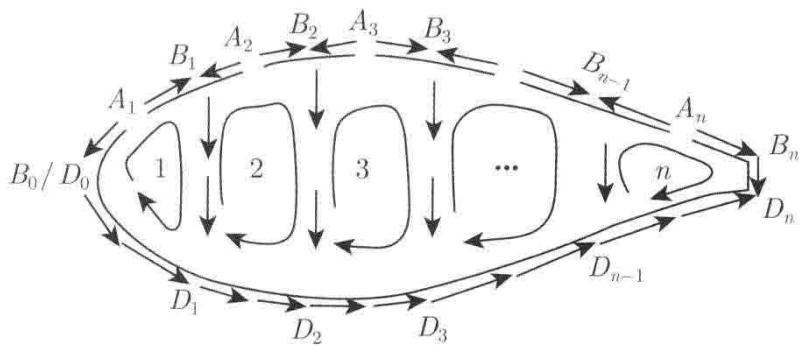

flowchart

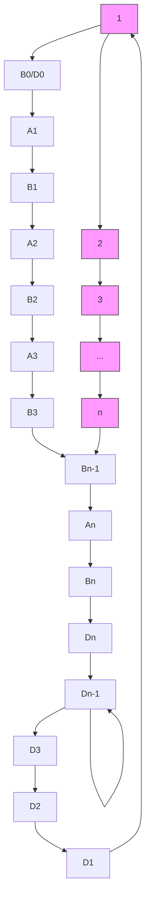
```mermaid
graph TD
    A1 --> B1
    B1 --> A2
    A2 --> B2
    B2 --> A3
    A3 --> B3
    B3 --> Bn-1
    Bn-1 --> An
    An --> Bn
    Bn --> Dn
    Dn --> Dn-1
    Dn-1 --> Dn-1
    Dn-1 --> D3
    D3 --> D2
    D2 --> D1
    D1 --> 1
    1 --> B0/D0
    B0/D0 --> A1
    1 --> 2
    2 --> 3
    3 --> ...[...]
    ... --> n
    n --> Bn-1
    style 1 fill:#f9f,stroke:#333
    style 2 fill:#f9f,stroke:#333
    style 3 fill:#f9f,stroke:#333
    style ... fill:#f9f,stroke:#333
    style n fill:#f9f,stroke:#333
```

图 8-6 叶片剖面各闭室开剖面剪力流

对于多闭室剖面中的剪力流 q, $N-1(N \geqslant 1)$ 个腹板组成的 N 个闭室的剖面系统有 $(N-1)$ 度静不定。仅用平衡方程是不够的，还必须补充 $(N-1)$ 个变形协调条件。为计算方便，在计算多闭室剖面中的剪力流时，我们把每个闭室同时都沿纵向切开，形成开剖面系统。即将计算多闭室剖面的剪力流，转化为开剖面系统的剪力流 $\tilde{q}$ （图 8-7）和 N 个闭室的未知剪力流 $q_{0i}$ （图 8-8）的问题。开剖面系统，开口位置可以任意取。不同的开口位置，对开口剖面剪力流 $\tilde{q}$ 和各闭室周线剪力流 $q_{0i}$ 的大小都有影响。但对合成剪力流 q 无影响。设想在各切口处分别是加剪力流 $q_{01}, q_{02}, q_{03}, \cdots, q_{0n}$ ，为顺时针方向。由剪应力成对定理，剖面上各闭室周线上也将产生相应的剪力流。

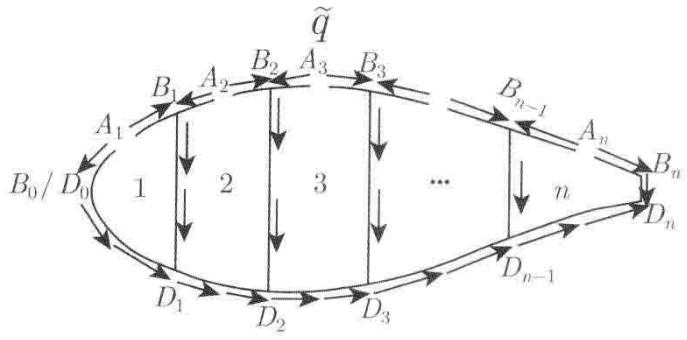

flowchart

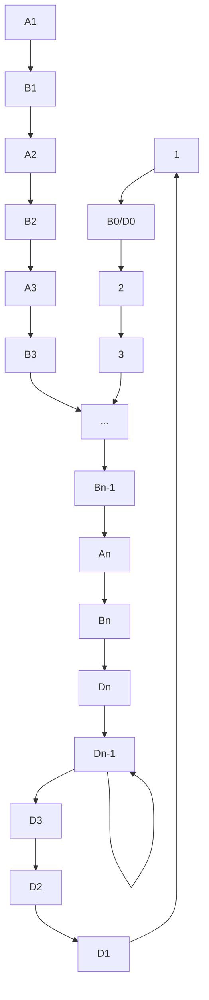
```mermaid
graph TD
    A1 --> B1
    B1 --> A2
    A2 --> B2
    B2 --> A3
    A3 --> B3
    B3 --> ... 
    ... --> Bn-1
    Bn-1 --> An
    An --> Bn
    Bn --> Dn
    Dn --> Dn-1
    Dn-1 --> Dn-1
    Dn-1 --> D3
    D3 --> D2
    D2 --> D1
    D1 --> 1
    1 --> B0/D0
    B0/D0 --> 2
    2 --> 3
    3 --> ...
```

图 8-7 叶片开剖面剪力流

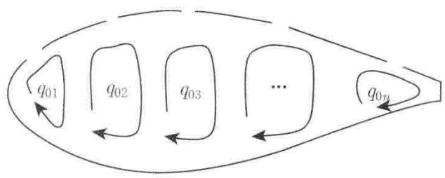

flowchart

```mermaid
graph TD
    q01 --> q02
    q02 --> q03
    q03 --> ...
    ... --> q0n
    q0n --> q01
```

图 8-8 各闭室周线上的剪力流

多闭室剖面中的剪力流 q，等于 $\tilde{q}, q_{01}, q_{02}, q_{03}, \cdots, q_{0n}$ 相应叠加。故，剪力流公式可表示：

$$
q = \tilde {q} + q _ {0 1} + q _ {0 2} + q _ {0 3} + \dots + q _ {0 n} \tag {8-23}
$$

其中，认为在闭室1中， $q_{02}=q_{03}=\cdots=q_{0n}=0$ ；在闭室2中， $q_{01}=q_{03}=\cdots=q_{0n}=0$ ；在闭室N中， $q_{01}=q_{03}=\cdots=q_{0n-1}=0$ 。

# 1. 开剖面剪力流 $\tilde{q}$

叶片截面挥舞摆振坐标系下，作用在叶片剖面上的 $F_{e}, F_{f}$ 起剪力的作用。将 N 闭室的每个闭室都沿纵向切开，形成开剖面系统。在形心主惯性轴下，开剖面系统的剪力流 $\tilde{q}$ 为

$$
\tilde {q} = \frac {F _ {e}}{I _ {X X}} S _ {X} + \frac {F _ {f}}{I _ {Y Y}} S _ {Y} \tag {8-24}
$$

其中， $S_{X}=\int_{0}^{s}Ytds$ ，从自由边算起到所求剪力流 s 处为止，受正应力的面积对形心主轴 X 轴的静矩； $S_{Y}=\int_{0}^{s}Xtds$ ，从自由边算起到所求剪力流 s 处为止，受正应力的面积对形心主轴 Y 轴的静矩。

由计算开剖面剪力流的公式可得，剪力流 $\tilde{q}$ 与剪力 $F_{e}, F_{f}$ 有关，而与弯矩无关。腹板剪力流，类比工字梁的计算方法。可知，腹板 $B_{i}$ 点的剪力流，为 $A_{i}B_{i}$ 段剪力流在 $B_{i}$ 点的剪力流值与 $A_{i+1}B_{i}$ 段剪力流在 $B_{i}$ 点的剪力流之和，作为腹板 $B_{i}D_{i}$ 段剪力流的初值。剖面各闭室曲线段的静定剪力流见表8-1。

表 8-1 剖面各曲线段静定剪力流

<table><tr><td>曲线段</td><td>默认正方向</td><td>静定剪力流</td></tr><tr><td> $\widehat{A_iB_i}$ </td><td> $A_i \to B_i$ </td><td> $\tilde{q}_{A_iB_i}$ </td></tr><tr><td> $\widehat{B_iD_i}$ </td><td> $B_i \to D_i$ </td><td> $\tilde{q}_{B_iD_i}$ </td></tr><tr><td> $\widehat{A_iB_{i-1}}$ </td><td> $A_i \to B_{i-1}$ </td><td> $\tilde{q}_{A_iB_{i-1}}$ </td></tr><tr><td> $\widehat{B_{i-1}D_{i-1}}$ </td><td> $B_{i-1} \to D_{i-1}$ </td><td> $\tilde{q}_{B_{i-1}D_{i-1}}$ </td></tr><tr><td> $\widehat{D_{i-1}D_i}$ </td><td> $D_{i-1} \to D_i$ </td><td> $\tilde{q}_{D_{i-1}D_i}$ </td></tr></table>

# 2. 各闭室周线的剪力流 $q_{0i}$

剪力流 q 应与外载相平衡，而求 $\tilde{q}$ 时只满足了与剪力 $F_{e}, F_{f}$ 的平衡方程，所以 q 还应满足力矩平衡方程。取剖面上的叶片截面坐标系的坐标原点 $O_{S}$ 为力矩中心。因力矩中心取在 $O_{S}$ 点，即为剪力 $F_{e}, F_{f}$ 的作用点。故，剪力对力矩中心产生的附加弯矩为 0，对剖面的力矩即为 $M_{Z}$ ：

$$
M _ {Z} = \int_ {s} q \rho \mathrm{d} s \tag {8-25}
$$

将多闭室剪力流 q 的公式代入，得

$$
M _ {Z} = \int_ {s} \tilde {q} \rho \mathrm{d} s + \Omega_ {1} q _ {0 1} + \Omega_ {2} q _ {0 2} + \Omega_ {3} q _ {0 3} + \dots + \Omega_ {n} q _ {0 n} \tag {8-26}
$$

其中， $\rho$ 表示剖面周线上的剪力流到力矩中心的垂直距离，如图8-9所示； $\int_{s}$ 表示沿整个剖面周线积分； $\Omega$ 即为 $\oint \rho \mathrm{d}s$ ，正好等于闭合周线所围面积的2倍； $\Omega_{i}$ 为闭室 $i$ 周线所围面积的2倍。

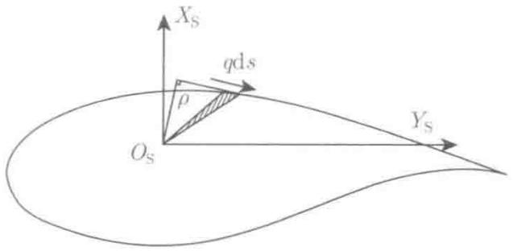

text_image

X_S
qd s
ρ
O_S
Y_S

图8-9 $\rho$ 的示意图

切口处满足变形协调条件。设各闭室的相对扭角为 $\theta_{i}$ ，整个剖面的相对扭角为 $\theta$ 。则各闭室的相对扭角必相等，且都等于整个剖面的相对扭角，此即为变形协调条件：

$$
\theta_ {i} = \theta , \quad i = 1, 2, \dots , n \tag {8-27}
$$

具体计算各闭室的相对扭角时，应注意相邻闭室的腹板中的剪力流，为避免发生错误，常将多闭室分解为单闭室，如图 8-10 所示。

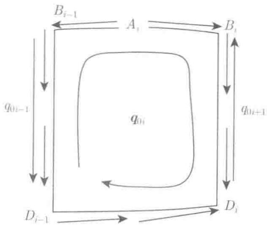

flowchart

```mermaid
graph TD
    A["Square Region with Contour q0i"] --> B["A_i"]
    B --> C["B_i"]
    C --> D["D_i"]
    D --> E["D_{j-1}"]
    E --> F["B_{j-1}"]
    F --> G["A_i"]
    G --> H["B_i"]
    H --> I["D_{j+1}"]
    I --> J["B_{j+1}"]
    J --> K["A_i"]
    K --> L["B_{j-1}"]
    L --> M["A_i"]
    M --> N["B_{j-1}"]
    N --> O["D_{j-1}"]
    O --> P["B_{j-1}"]
    P --> Q["A_i"]
    Q --> R["B_i"]
    R --> S["D_{j+1}"]
    S --> T["B_{j+1}"]
    T --> U["A_i"]
    U --> V["B_{j-1}"]
    V --> W["A_i"]
    W --> X["B_{j-1}"]
    X --> Y["B_{j-1}"]
    Y --> Z["A_i"]
    Z --> AA["B_{j-1}"]
    AA --> AB["A_i"]
    AB --> AC["B_{j-1}"]
    AC --> AD["A_i"]
    AD --> AE["B_{j-1}"]
    AE --> AF["B_{j-1}"]
    AF --> AG["A_i"]
    AG --> AH["B_{j-1}"]
    AH --> AI["A_i"]
    AI --> AJ["B_{j-1}"]
    AJ --> AK["A_i"]
    AK --> AL["B_{j-1}"]
    AL --> AM["A_i"]
    AM --> ANB["B_{j-1}"]
    ANB --> AO["A_i"]
    AO --> AP["B_{j-1}"]
    AP --> AQ["A_i"]
    AQ --> AR["B_{j-1}"]
    AR --> AS["A_i"]
    AS --> AT["B_{j-1}"]
    AT --> AU["A_i"]
    AU --> AV["B_{j-1}"]
    AV --> AW["A_i"]
    AW --> AX["B_{j-1}"]
    AX --> AY["A_i"]
    AY --> AZ["B_{j-1}"]
    AZ --> BA["A_i"]
    BA --> BB["B_{j-1}"]
    BB --> BC["A_i"]
    BC --> BD["B_{j-1}"]
    BD --> BE["A_i"]
    BE --> BF["B_{j-1}"]
    BF --> BG["A_i"]
    BG --> BH["B_{j-1}"]
    BH --> BI["A_i"]
    BI --> BJ["B_{j-1}"]
    BJ --> BK["A_i"]
    BK --> BL["B_{j-1}"]
    BL --> BM["A_i"]
    BM --> BN["B_{j-1}"]
    BN --> BO["A_i"]
    BO --> BP["B_{j-1}"]
    BP --> BQ["A_i"]
    BQ --> BR["B_{j-1}"]
    BR --> BS["A_i"]
    BS --> BT["B_{j-1}"]
    BT --> BU["A_i"]
    BU --> BV["B_{j-1}"]
    BV --> BW["A_i"]
    BW --> BX["B_{j-1}"]
    BX --> BY["A_i"]
    BY --> BZ["B_{j-1}"]
    BZ --> CA["A_i"]
    CA --> CB["B_{j-1}"]
    CB --> CC["A_i"]
    CC --> CD["B_{j-1}"]
    CD --> CE["A_i"]
    CE --> CF["B_{j-1}"]
    CF --> CG["A_i"]
    CG --> CH["B_{j-1}"]
    CH --> CI["A_i"]
    CI --> CJ["B_{j-1}"]
    CJ --> CK["A_i"]
    CK --> CRB["B_{j-1}"]
    CRB --> CS["A_i"]
    CS --> CT["B_{j-1}"]
    CT --> CU["A_i"]
    CU --> CV["B_{j-1}"]
    CV --> CW["A_i"]
    CW --> CX["B_{j-1}"]
    CX --> CYA["A_i"]
    CYA --> CZ["B_{j-1}"]
    CZ --> DA["A_i"]
    DA --> DB["B_{j-1}"]
    DB --> DC["A_i"]
    DC --> DJ["B_{j-1}"]
    DJ --> DEA["A_i"]
    DEA --> DF["B_{j-1}"]
    DF --> DG["A_i"]
    DG --> DH["B_{j-1}"]
    DH --> DI["A_i"]
    DI --> DJ
    DJ --> DK["B_{j-1}"]
    DK --> DL["A_i"]
    DL --> DV["B_{j-1}"]
    DV --> DW["A_i"]
```

图8-10 闭室 $i$ 的剪力流形式

各闭室的相对扭角为

$$
\theta = \theta_ {1} = \frac {1}{\Omega_ {1}} \oint_ {1} \frac {q}{G t} \mathrm{d} s = \frac {1}{\Omega_ {1}} \left[ \oint_ {1} \frac {\tilde {q}}{G t} \mathrm{d} s + q _ {0 1} \oint_ {1} \frac {\mathrm{d} s}{G t} - q _ {0 2} \oint_ {1 - 2} \frac {\mathrm{d} s}{G t} \right]
$$

$$
\theta = \theta_ {2} = \frac {1}{\Omega_ {2}} \oint_ {2} \frac {q}{G t} \mathrm{d} s = \frac {1}{\Omega_ {2}} \left[ \oint_ {2} \frac {\tilde {q}}{G t} \mathrm{d} s - q _ {0 1} \oint_ {1 - 2} \frac {\mathrm{d} s}{G t} + q _ {0 2} \oint_ {2} \frac {\mathrm{d} s}{G t} - q _ {0 3} \oint_ {2 - 3} \frac {\mathrm{d} s}{G t} \right]
$$

$$
\theta = \theta_ {i} = \frac {1}{\Omega_ {i}} \oint_ {i} \frac {q}{G t} \mathrm{d} s = \frac {1}{\Omega_ {i}} \left[ \oint_ {i} \frac {\tilde {q}}{G t} \mathrm{d} s - q _ {0 i - 1} \oint_ {(i - 1) - i} \frac {\mathrm{d} s}{G t} + q _ {0 i} \oint_ {i} \frac {\mathrm{d} s}{G t} - q _ {0 i + 1} \oint_ {i - (i + 1)} \frac {\mathrm{d} s}{G t} \right]
$$

$$
\theta = \theta_ {n} = \frac {1}{\Omega_ {n}} \oint_ {n} \frac {q}{G t} \mathrm{d} s = \frac {1}{\Omega_ {n}} \left[ \oint_ {n} \frac {\tilde {q}}{G t} \mathrm{d} s - q _ {0 n - 1} \oint_ {(n - 1) - n} \frac {\mathrm{d} s}{G t} + q _ {0 n} \oint_ {n} \frac {\mathrm{d} s}{G t} \right] \tag {8-28}
$$

对于每一个闭室求相对扭角时，应沿着各闭室剖面静定剪力流划分的各曲线段进行分段积分。由各闭室的变形协调方程和多闭室剪力流 q 的力矩平衡方程，可求出三个闭室的剪力流 $q_{01}, q_{02}, q_{03}$ ，同时还可以求出剖面的相对扭角 $\theta$ 。

# 3. 剖面的剪力流 q

多闭室剖面中的剪力流 q，应等于 $\tilde{q}, q_{01}, q_{02}, q_{03}, \cdots, q_{0n}$ 相应叠加。故剪力流公式可表示为

$$
q = \tilde {q} + q _ {0 1} + q _ {0 2} + q _ {0 3} + \dots + q _ {0 n} \tag {8-29}
$$

# 4. 多种材料层合结构的折算剪力流 $q$

由于薄壁杆件的剖面剪力流计算方法是基于单层材料展开分析和计算的，而大型风力机叶片的薄壳方向均为多种材料的层合结构，因此应针对薄壁厚度 t 采用缩减系数法进行等效，并统一等效为蒙皮材料。在薄壁假设情况下，同一位置不同铺层材料的剪应变是相等的，因此等效系数为

$$
\varphi_ {i} = \frac {G _ {i} \gamma_ {i}}{G \gamma_ {i}} = \frac {G _ {i}}{G} \tag {8-30}
$$

其中，G 为蒙皮的剪切模量； $G_{i}$ 为等效层的剪切模量。由此得到每种材料铺层的等效厚度为

$$
t _ {i} ^ {\prime} = \varphi_ {i} t _ {i} = G _ {i} t _ {i} / G \tag {8-31}
$$

其中， $t_{i}$ 为等效层原始厚度。则多种材料组成的铺层结构的总厚度 t 计算如下：

$$
t = \sum t _ {i} ^ {\prime} = \sum G _ {i} t _ {i} / G \tag {8-32}
$$

经过上述等效之后便得到了仅由蒙皮构成的双闭室，利用8.1.2节中理论算法即可求出开剖面剪力流 $\tilde{q}$ 和闭室剪力流 $q_{1}, q_{2}$ 。最终由 $\tilde{q}, q_{1}, q_{2}$ 叠加得到剖面各曲线段的剪力流，见表8-2。

表 8-2 闭室 $i$ 的剪力流形式

<table><tr><td>曲线段</td><td>默认正方向</td><td>静定剪力流</td></tr><tr><td> $\widehat{A_iB_i}$ </td><td> $A_i \to B_i$ </td><td> $\tilde{q}_{AiB_i} + q_{0i}$ </td></tr><tr><td> $\widehat{B_iD_i}$ </td><td> $B_i \to D_i$ </td><td> $\tilde{q}_{BiD_i} + q_{0i} - q_{0i+1}$ </td></tr><tr><td> $\widehat{A_iB_{i-1}}$ </td><td> $A_i \to B_{i-1}$ </td><td> $\tilde{q}_{AiB_{i-1}} - q_{0i}$ </td></tr><tr><td> $\widehat{B_{i-1}D_{i-1}}$ </td><td> $B_{i-1} \to D_{i-1}$ </td><td> $\tilde{q}_{Bi-1D_{i-1}} - q_{0i} + q_{0i-1}$ </td></tr><tr><td> $\widehat{D_{i-1}D_i}$ </td><td> $D_{i-1} \to D_i$ </td><td> $\tilde{q}_{Di-1D_i} - q_{0i}$ </td></tr></table>

计算得到剖面的剪力流 q 之后，得到第 i 层铺层的剪力流分配：

$$
q _ {i} = \frac {t _ {i} ^ {\prime}}{t} q = \frac {G _ {i} t _ {i} / G}{\sum G _ {i} t _ {i} / G} q = \frac {G _ {i} t _ {i}}{\sum G _ {i} t _ {i}} q \tag {8-33}
$$

最后可由剪应力计算公式 $\tau_{i} = q_{i} / t_{i}$ ，得到各铺层材料的面内剪应力为

$$
\tau_ {i} = \frac {q _ {i}}{t _ {i}} = \frac {G _ {i} t _ {i}}{\sum G _ {i} t _ {i}} q \times \frac {1}{t _ {i}} = \frac {G _ {i} q}{\sum G _ {i} t _ {i}} \tag {8-34}
$$

# 5. 叶片剖面的剪切应力

由剖面各曲线段的剪力流，可得剖面的剪应力为

$$
\tau = \frac {q}{t} \tag {8-35}
$$

不同曲线段，对应不同的剪力流和不同的材料铺层厚度。材料的铺层厚度，视夹层板与夹芯结构而定。由剪应力与应变关系 $\tau = G\gamma$ ，得出叶片剖面各曲线段的剪应变：

$$
\gamma = \frac {\tau}{G} \tag {8-36}
$$

为了计算叶片剖面的总扭角，则将叶片剖面看做在 Z = 1 为自由端，Z = 0 为固定端的结构，则结构自由端的总扭角 $\varphi$ 为

$$
\varphi = \frac {1}{\Omega} \int_ {0} ^ {1} \oint \frac {M _ {Z} \mathrm{d} s}{\Omega G t} \mathrm{d} z \tag {8-37}
$$

# 8.1.3 叶片挠度计算

叶片二维结构校核方法主要描述了用数值方法计算叶片挠度的过程，计算的过程中是将叶片看成一个悬臂梁。挠度的数值计算参考如图 8-11 所示的截面坐标系。

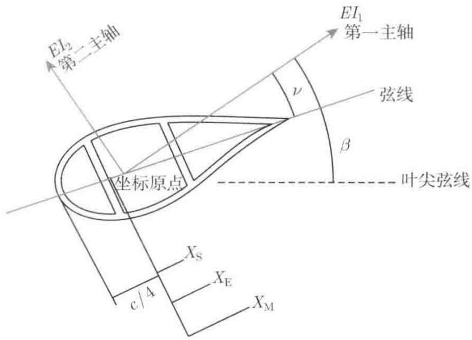

text_image

EI₁
第一主轴
第二主轴
EI₂
γ
β
坐标原点
弦线
叶尖弦线
c/4
Xₛ
Xₑ
Xₘ

图8-11 说明主要结构参数的叶片截面

$EI_{1}$ ：绕第一主轴的弯曲刚度； $EI_{2}$ ：绕第二主轴的弯曲刚度； $GI_{V}$ ：扭转刚度； $X_{\mathrm{E}}$ ：从坐标原点到弹性变形点的距离； $X_{\mathrm{M}}$ ：从坐标原点到质量中心的距离； $X_{\mathrm{S}}$ ：从坐标原点到剪切变形中心的距离； $\beta$ ：翼型截面相对叶尖弦长的扭角； $\nu$ ：弦长与第一主轴的夹角； $\beta +\nu$ ：叶尖弦长与该截面第一主轴的夹角

对叶片的大多数区域而言，由于角度小，第一主轴的位置与弦线几乎重合，所以 $\nu$ 的值近似为 $0^{\circ}$ 。如果已知沿叶片的外力载荷 $p_{y}$ 和 $p_{z}$ ，那么可以通过式 (8-38)～式 (8-41) 的表达式求得剪力 $T_{z}$ 和 $T_{y}$ ，弯矩 $M_{y}$ 和 $M_{z}$ ，图 8-12 给出计算采用的叶根坐标系，图 8-13 为叶片悬臂梁示意图。

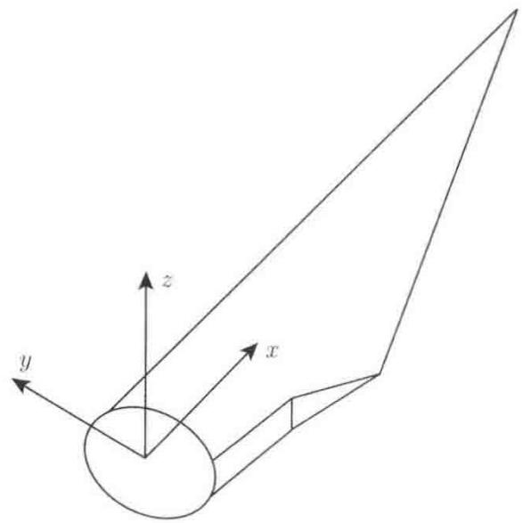

natural_image

3D geometric diagram showing a cone with x, y, z axes and a circular base (no text or symbols)

图 8-12 叶片的叶根坐标系

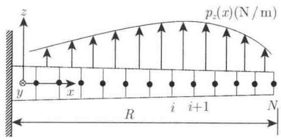

text_image

z
p_z(x)(N/m)
y
x
R i i+1 N

图 8-13 悬臂梁

$$
\frac {\mathrm{d} T _ {z}}{\mathrm{d} x} = - p _ {z} (x) + m (x) \ddot {u} _ {x} (x) \tag {8-38}
$$

$$
\frac {\mathrm{d} T _ {y}}{\mathrm{d} x} = - p _ {y} (x) + m (x) \ddot {u} _ {y} (x) \tag {8-39}
$$

$$
\frac {\mathrm{d} M _ {y}}{\mathrm{d} x} = T _ {z} \tag {8-40}
$$

$$
\frac {\mathrm{d} M _ {z}}{\mathrm{d} x} = - T _ {y} \tag {8-41}
$$

若叶片处于平衡状态，则惯性项为 0。

将叶根坐标系下的弯矩转到主轴上 (此处 y 轴与叶尖弦长一致), 则弯矩 $M_{1}, M_{2}$ 可以表示为

$$
M _ {1} = M _ {y} \cos (\beta + \nu) - M _ {z} \sin (\beta + \nu) \tag {8-42}
$$

$$
M _ {2} = M _ {y} \sin (\beta + \nu) - M _ {z} \cos (\beta + \nu) \tag {8-43}
$$

从简单的梁理论可以得知关于主轴的曲率为

$$
\kappa_ {1} = \frac {M _ {1}}{E I _ {1}} \tag {8-44}
$$

$$
\kappa_ {2} = \frac {M _ {2}}{E I _ {2}} \tag {8-45}
$$

然后将这些曲率转换回 y 轴和 z 轴:

$$
\kappa_ {z} = \kappa_ {1} \sin (\beta + \nu) + \kappa_ {2} \cos (\beta + \nu) \tag {8-46}
$$

$$
\kappa_ {y} = - \kappa_ {1} \cos (\beta + \nu) + \kappa_ {2} \sin (\beta + \nu) \tag {8-47}
$$

计算悬臂梁的转角和挠度:

$$
\frac {\mathrm{d} \theta_ {y}}{\mathrm{d} x} = \kappa_ {y} \tag {8-48}
$$

$$
\frac {\mathrm{d} \theta_ {z}}{\mathrm{d} x} = \kappa_ {z} \tag {8-49}
$$

$$
\frac {\mathrm{d} u _ {z}}{\mathrm{d} x} = - \theta_ {y} \tag {8-50}
$$

$$
\frac {\mathrm{d} u _ {y}}{\mathrm{d} x} = \theta_ {z} \tag {8-51}
$$

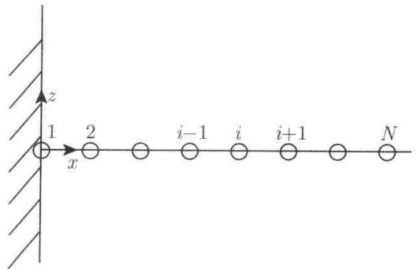

text_image

z
1 2 i-1 i i+1 N
x

图 8-14 离散化的悬臂梁

如果载荷以离散点的形式给出, 如图 8-14 所示, 假设载荷在节点 $i$ 和节点 $i+1$ 之间是线性变化, 可以根据方程进行积分, 则可以得到挠度的数值算法。

边界条件： $\theta_{y}^{i}=0$ 以及 $\theta_{z}^{i}=0$ 。 $i=1,2,\cdots,N-1$ ：

$$
\theta_ {y} ^ {i + 1} = \theta_ {y} ^ {i} + \frac {1}{2} \left(\kappa_ {y} ^ {i + 1} + \kappa_ {y} ^ {i}\right) \left(x ^ {i + 1} - x ^ {i}\right) \tag {8-52}
$$

$$
\theta_ {z} ^ {i + 1} = \theta_ {z} ^ {i} + \frac {1}{2} \left(\kappa_ {z} ^ {i + 1} + \kappa_ {z} ^ {i}\right) \left(x ^ {i + 1} - x ^ {i}\right) \tag {8-53}
$$

按下面的算式来计算叶片的挠度。

边界条件： $u_{y}^{i}=0$ 以及 $u_{z}^{i}=0$ 。 $i=1,2,\cdots,N-1:$ (8-54)

叶片在 $y$ 轴方向的挠度：

$$
u _ {y} ^ {i + 1} = u _ {y} ^ {i} - \theta_ {z} ^ {i} \left(x ^ {i + 1} - x ^ {i}\right) + \left(\frac {1}{6} \kappa_ {z} ^ {i + 1} + \frac {1}{3} \kappa_ {z} ^ {i}\right) \left(x ^ {i + 1} - x ^ {i}\right) ^ {2} \tag {8-55}
$$

叶片在 $z$ 轴方向的挠度：

$$
u _ {z} ^ {i + 1} = u _ {z} ^ {i} - \theta_ {y} ^ {i} \left(x ^ {i + 1} - x ^ {i}\right) - \left(\frac {1}{6} \kappa_ {y} ^ {i + 1} + \frac {1}{3} \kappa_ {y} ^ {i}\right) \left(x ^ {i + 1} - x ^ {i}\right) ^ {2} \tag {8-56}
$$

其中的边界条件是针对悬臂梁的，为了简化，将其中的惯性项已经忽略。

# 8.2 叶片固有频率与特征模态计算

所谓特征模态就是没有外力作用下的自由振动，这样挠度实现方法中方程组变成

$$
\frac {\mathrm{d} T _ {z}}{\mathrm{d} x} = m (x) \ddot {u} _ {z} (x) \tag {8-57}
$$

$$
\frac {\mathrm{d} T _ {y}}{\mathrm{d} x} = m (x) \ddot {u} _ {y} (x) \tag {8-58}
$$

对特征模态而言，位移具有 $u = A \sin(\omega t)$ 的形式，则加速度如式 (8-59) 所示，正比于位移为

$$
\ddot {u} = - \omega^ {2} u \tag {8-59}
$$

其中， $\omega$ 是有关的特征频率。

$$
\frac {\mathrm{d} T _ {z}}{\mathrm{d} x} = - m (x) \omega^ {2} u _ {z} (x) \tag {8-60}
$$

$$
\frac {\mathrm{d} T _ {y}}{\mathrm{d} x} = - m (x) \omega^ {2} u _ {y} (x) \tag {8-61}
$$

比较挠度实现方法中的方程可以发现，当外载荷等于式(8-62)和式(8-63)，使用静态梁方程组求得特征模态：

$$
p _ {z} = m (x) \omega^ {2} u _ {z} (x) \tag {8-62}
$$

$$
p _ {y} = m (x) \omega^ {2} u _ {y} (x) \tag {8-63}
$$

由于式 (8-62)、式 (8-63) 中的位移未知, 因此, 方程组必须迭代求解, 最终将收敛到与最低特征频率相对应的模态, 即第一阶挥舞模态。首先可以假定在 $y$ 和 $z$ 方向有一个常值载荷, 这样就可以求得初始位移。有了这个位移, 就能估算叶片尖部的特征频率:

$$
\omega^ {2} = \frac {p _ {z} ^ {N}}{u _ {z} ^ {N} m ^ {N}} \tag {8-64}
$$

这样又可以计算在所有离散点得到新载荷：

$$
p _ {z} ^ {i} = \frac {\omega^ {2} m ^ {i} u _ {z} ^ {i}}{\sqrt {(u _ {z} ^ {N}) ^ {2} + (u _ {y} ^ {N}) ^ {2}}} \tag {8-65}
$$

$$
p _ {y} ^ {i} = \frac {\omega^ {2} m ^ {i} u _ {y} ^ {i}}{\sqrt {(u _ {z} ^ {N}) ^ {2} + (u _ {y} ^ {N}) ^ {2}}} \tag {8-66}
$$

注意将载荷沿叶尖的位移归一化，这样保证下次迭代时叶尖位移是1。现在使用式(8-65)和式(8-66)中的载荷又可以计算新的位移，将步骤重复几次直到特征频率 $\omega$ 变成常数。这样就可以求得一阶挥舞模态的位移形状 $u_{z}^{1f}$ 和 $u_{y}^{1f}$ ，如图8-15所示。

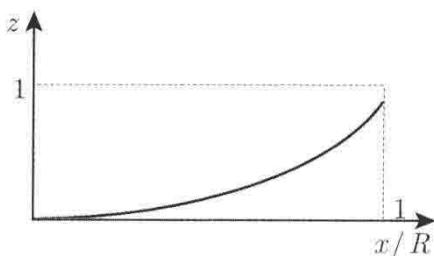

line

| x / R | z   |
|-------|-----|
| 0     | 0   |
| 1     | 1   |

(a) 一阶挥舞模态的位移形状 $u_{z}^{lf}$

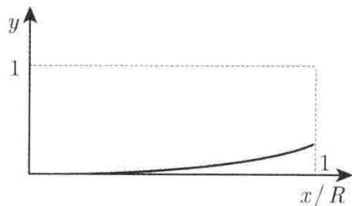

text_image

y
1
x/R
1

(b) 一阶挥舞模态的位移形状 $u_{y}^{1f}$   
图 8-15 一阶挥舞模态

为了求得一阶摆振位移，需要再一次使用该步骤。但是需要作一些修正以保证这种方法不会又收敛到一阶挥舞模态。每一次当计算得到新的位移 $u_{y}(x)$ 和 $u_{z}(x)$ 后，需要减去包含一阶挥舞模态的部分：

$$
u _ {z} ^ {1 e} = u _ {z} - \text { const } 1 \times u _ {z} ^ {1 f} \tag {8-67}
$$

$$
u _ {y} ^ {1 e} = u _ {y} - \text { const } 1 \times u _ {y} ^ {1 f} \tag {8-68}
$$

必须满足式 (8-69) 中的正交性限制来确定式 (8-67) 和式 (8-68) 中的常数:

$$
\int_ {0} ^ {R} u _ {z} ^ {1 f} m u _ {z} ^ {1 e} \mathrm{d} x + \int_ {0} ^ {R} u _ {y} ^ {1 f} m u _ {y} ^ {1 e} \mathrm{d} x = 0 \tag {8-69}
$$

将式(8-67)、式(8-68)和方程式(8-69)联立，便得到该常数的表达式：

$$
\mathrm{const1} = \frac {\int_ {0} ^ {R} u _ {z} ^ {1 f} m u _ {z} \mathrm{d} x + \int_ {0} ^ {R} u _ {y} ^ {1 f} m u _ {y} \mathrm{d} x}{\int_ {0} ^ {R} u _ {z} ^ {1 f} m u _ {z} ^ {1 f} \mathrm{d} x + \int_ {0} ^ {R} u _ {y} ^ {1 f} m u _ {y} ^ {1 f} \mathrm{d} x} \tag {8-70}
$$

这样, 为了使该方法最终收敛到一阶摆振模态, 将每一次计算得到的新位移减去一阶挥舞模态部分。经过几次迭代后, 就可以求得一阶摆振模态的位移形状 $u_{z}^{1e}$ 和 $u_{y}^{1e}$ , 如图 8-16 所示。

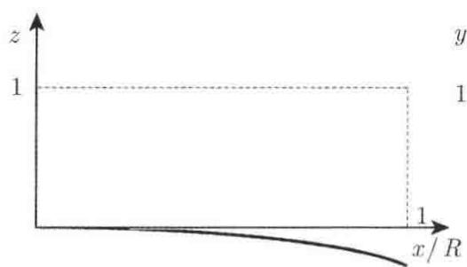

text_image

z
y
1
1
x / R

(a) 一阶摆振模态的位移形状 $u_{z}^{1e}$

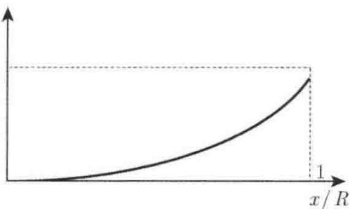

text_image

x / R
1

(b) 一阶摆振模态的位移形状 $u_{y}^{1c}$   
图 8-16 一阶摆振模态

最后, 可以用类似的方法求得二阶挥舞模态。不但需要减去包含一阶挥舞模态的部分, 还需要使用正交性限制来减去一阶摆振模态部分, 迭代方法与上述一致, 经过几次迭代后就可以得到二阶挥舞模态的位移形状 $u_{z}^{2f}$ 和 $u_{y}^{2f}$ 。同样, 更高阶的模态也可以使用上述方法求得, 只是在迭代求解时, 需要减去前面所有阶的模态部分才能收敛到需要的结果, 当然阶数越高, 精度越差。

# 8.3 等效疲劳载荷法计算疲劳损伤

根据叶片每一个截面的原始载荷，通过给定的载荷组合公式计算出叶片最危险截面的载荷。通过叶片主材的材料疲劳 S-N 曲线，进行雨流计数统计，最后通过一系列的数据处理，得到叶片危险截面处不同铺层材料的疲劳寿命。

# 1. 载荷重组

叶片各截面的载荷基于叶片挥舞摆振坐标系的极限载荷，根据叶片疲劳危险面的载荷，将挥舞摆振坐标系下的载荷转化为叶根坐标系下。

$$
\begin{array}{l} M _ {x} = \sin \theta M _ {f} + \cos \theta M _ {e} \\ M _ {y} = \theta M _ {z} - \sin \theta M _ {z} \end{array} \tag {8-71}
$$

$$
M _ {y} = \cos \theta M _ {f} - \sin \theta M _ {e}
$$

将叶片某截面各危险点的纤维方向的应力 $\sigma_{x}$ 表达为极限载荷和系数相乘的表达式进行重组，确定叶片某剖面的应力组合系数。

$$
\sigma_ {x} = M _ {y} a _ {1} + M _ {x} a _ {2} + F _ {z} a _ {3} \tag {8-72}
$$

# 2. 材料 S-N 曲线

要求材料 S-N 曲线的表达式为 $N = kS^{-m}$ 。根据等效疲劳载荷法进行疲劳分析时，必须指定 m 和截距 c，其中 $k = c^{m}$ ，并且可以增加 Goodman 修正。

# 3. 风频分布

根据风场等级，设定每个工况的年小时数，确定风频分布信息。

根据载荷重组、材料 S-N 曲线和风频分布，雨流计数计算疲劳损伤因子，判断疲劳损伤因子是否小于 1。

# 8.4 二维工程算法

根据薄壁杆件结构力学原理，我们自主开发了一款风力机叶片二维结构校核及铺层优化软件，该软件的分析流程如图8-17所示。该优化软件可进行叶片强度校核、总重计算、铺层材料总量与成本核算、刚度与挠度计算、固有频率等计算，同时根据强度和总重约束，通过多轮循环与优化确定最优的铺层厚度[19]。

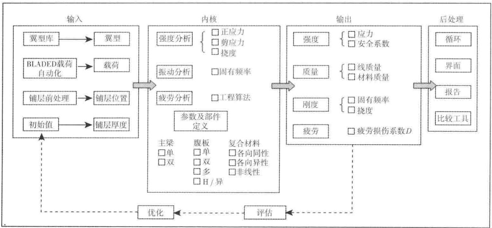

flowchart

```mermaid
graph LR
    A["输入"] --> B["翼型库"]
    A --> C["BLADED载荷自动化"]
    A --> D["铺层前处理"]
    A --> E["初始值"]
    B --> F["翼型"]
    C --> G["载荷"]
    D --> H["铺层位置"]
    E --> I["铺层厚度"]
    J["内核"] --> K["强度分析"]
    J --> L["振动分析"]
    J --> M["疲劳分析"]
    J --> N["参数及部件定义"]
    K --> O["正应力"]
    K --> P["剪应力"]
    K --> Q["挠度"]
    L --> R["固有频率"]
    M --> S["工程算法"]
    T["输出"] --> U["强度"]
    T --> V["质量"]
    T --> W["刚度"]
    T --> X["疲劳"]
    U --> Y["应力"]
    U --> Z["安全系数"]
    V --> AA["线质量"]
    V --> AB["材料质量"]
    W --> AC["固有频率"]
    W --> AD["挠度"]
    X --> AE["疲劳损伤系数D"]
    AF["后处理"] --> AG["循环"]
    AF --> AH["界面"]
    AF --> AI["报告"]
    AF --> AJ["比较工具"]
    
    K --> K1["主梁: □单, □双"]
    K --> K2["腹板: □单, □双, □多, □H/异"]
    K --> K3["复合材料: □各向同性, □各向异性, □非线性"]
    
    L --> L1["主梁: □单, □双, □多, □H/异"]
    L --> L2["腹板: □单, □双, □多, □H/异"]
    L --> L3["复合材料: □各向同性, □各向异性, □非线性"]
    
    M --> M1["主梁: □单, □双, □多, □H/异"]
    M --> M2["腹板: □单, □双, □多, □H/异"]
    M --> M3["复合材料: □各向同性, □各向异性, □非线性"]
    
    N --> N1["主梁: □单, □双, □多, □H/异"]
    N --> N2["腹板: □单, □双, □多, □H/异"]
    N --> N3["复合材料: □各向同性, □各向异性, □非线性"]
    
    O --> O1["主梁: □单, □双, □多, □H/异"]
    O --> O2["腹板: □单, □双, □多, □H/异"]
    O --> O3["复合材料: □各向同性, □各向异性, □非线性"]
    
    P --> P1["主梁: □单, □双, □多, □H/异"]
    P --> P2["腹板: □单, □双, □多, □H/异"]
    P --> P3["复合材料: □各向同性, □各向异性, □非线性"]
    
    Q --> Q1["主梁: □单, □双, □多, □H/异"]
    Q --> Q2["腹板: □单, □双, □多, □H/异"]
    Q --> Q3["复合材料: □各向同性, □各向异性, □非线性"]
    
    R --> R1["主梁: □单, □双, □多, □H/异"]
    R --> R2["腹板: □单, □双, □多, □H/异"]
    R --> R3["复合材料: □各向同性, □各向异性, □非线性"]
    
    S --> S1["主梁: □单, □双, □多, □H/异"]
    S --> S2["腹板: □单, □双, □多, □H/异"]
    S --> S3["复合材料: □各向同性, □各向异性, □非线性"]
    
    T --> T1["主梁: □单, □双, □多, □H/异"]
    T --> T2["腹板: □单, □双, □多, □H/异"]
    T --> T3["复合材料: □各向同性, □各向异性, □非线性"]
    
    U --> U1["主梁: □单, □双, □多, □H/异"]
    U --> U2["腹板: □单, □双, □多, □H/异"]
    U --> U3["复合材料: □各向同性, □各向异性, □非线性"]
    
    V --> V1["主梁: □单, □双, □多, □H/异"]
    V --> V2["腹板: □单, □双, □多, □H/异"]
    V --> V3["复合材料: □各向同性, □各向异性, □非线性"]
    
    W --> W1["主梁: □单, □双, □多, □H/异"]
    W --> W2["腹板: □单, □双, □多, □H/异"]
    W --> W3["复合材料: □各向同性, □各向异性, □非线性"]
    
    X --> X1["主梁: □单, □双, □多, □H/异"]
    X --> X2["腹板: □单, □双, □多, □H/异"]
    X --> X3["复合材料: □各向同性, □各向异性, □非线性"]
    
    Y --> Y1["主梁: □单, □双, □多, □H/异"]
    Y --> Y2["腹板: □单, □双, □多, □H/异"]
    Y --> Y3["复合材料: □各向同性, □各向异性, □非线性"]
    
    Z --> Z1["主梁: □单, □双, □多, □H/异"]
    Z --> Z2["腹板: □单, □双, □多, □H/异"]
    Z --> Z3["复合材料: □各向同性, □各向异性, □非线性"]
    
    AA --> AA1["主梁: □单, □双, □多, □H/异"]
    AA --> AA2["腹板: □单, □双, □多, □H/异"]
    AA --> AA3["复合材料: □各向同性, □各向异性, □非线性"]
    
    AB --> AB1["主梁: □单, □双, □多, □H/异"]
    AB --> AB2["腹板: □单, □双, □多, □H/异"]
    AB --> AB3["复合材料: □各向同性, □各向异性, □非线性"]
    
    AC --> AC1["主梁: □单, □双, □多, □H/异"]
    AC --> AC2["腹板: □单, □双, □多, □H/异"]
    AC --> AC3[复合材料: □各向同性, □各向异性,□债务性质：□债务性质：□债务性质：□债务性质：□债务性质：□债务性质：□债务性质：□债务性质：□债务性质：□债务性质：□债务性质：□债务性质：□债务性质：□债务性质：□债务性质：□债务性质：□债务性质：□债务性质：□债务性质：□债务性质：□债务性质：□债务性质：□债务性质：□债务性质：□债务性质：□债务性质 :□债务性质 :□债务性质 :□债务性质 :□债务性质 :□债务性质 :□债务性质 :□债务性质 :□债务性质 :□债务性质 :□债务性质 :□债务性质 :□债务性质 :□债务性质 :□债务性质 :□债务性质 :□债务性质 :□债务性质 :□债务性质 :□债务性质 :□债务性质 :□债务性质 :□债务性质 :□债务性质 :□债务性质 :□债务性质 -□债务性质 :□债务性质 :□债务性质 :□债务性质 :□债务性质 :□债务性质 :□债务性质 :□债务性质 :□债务性质 :□债务性质 :□债务性质 :□债务性质 :□债务性质 :□债务性质 :□债务性质 :□债务性质 :□债务性质 :□债务性质 :□债务性质 :□债务性质 :□债务性质 :□债务性质 :□债务性质 :□债务性质 :□债务性质：□债务性质：□债务性质：□债务性质：□债务性质：□债务性质：□债务性质：□债务性质：□债务性质：□债务性质：□债务性质：□债务性质：□债务性质：□债务性质：□债务性质：□债务性质：□债务性质：□债务性质：□债务性质：□债务性质：□债务性质：□债务性质：□债务性质：□债务性质：□债务性质 -□债务性质：□债务性质：□债务性质：□债务性质：□债务性质：□债务性质：□债务性质：□债务性质：□债务性质：□债务性质：□债务性质：□债务性质：□债务性质：□债务性质：□债务性质：□债务性质：□债务性质：□债务性质：□债务性质：□债务性质：□债务性质：□债务性质：□债务性质：□债务性质：□债务性质 ：□债务性质 :□债务性质 :□债务性质 :□债务性质 :□债务性质 :□债务性质 :□债务性质 :□债务性质 :□债务性质 :□债务性质 :□债务性质 :□债务性质 :□债务性质 :□债务性质 :□债务性质 :□债务性质 :□债务性质 :□债务性质 :□债务性质 :□债务性质 :□债务性质 :□债务性质 :□债务性质 :□债务性质 :□务类型 -— -— -— -— -— -— -— -— -— -— -— -— -— -— -— -— -— -— -— -— -— -— -— -— -— -— -— -— -— -— -— -— -— -— -— -— -— -— -— -— -— -— -— -— -— -— -— -— -— -— - —- -— -— -— -— -— -— -— -— -— -— -— -— -— -— -— -— -— -— -— -— -— -— -— -— -— -— -— -— -— -— -— -— -— -— -— -— -— -— -— -— -— -— -— -— -— -— -— -— -— -<fcel>输入
输入
输入
输入
输入
输入
输入
输入
输入
输入
输入
输入
输入
输入
输入
输入
输入
输入
输入
输入
输入
输入
输入
输入
输入
输入
输入
输入
输入
输入
输入
输入
输入
输入
输入
输入
输入
输入
输入
输入
输入
输入
输入
输入
输入
输入
输入
输入
输入
输入
输入

All  →  ←  ←  ←  ←  ←  ←  ←  ←  ←  ←  ←  ←  ←  ←  ←  ←  ←  ←  ←  ←  ←  ←  ←  ←  ←  ←  ←  ←  ←  ←  ←  ←  ←  ←  ←  ←  ←  ←  ←  ←  ←  ←  ←  ←  ←  ←  ←  ←  ←  ← ← ————————————————————————————————————————————————————————————————————————————————————————————————————————————————————————————————————————————————————————————————————————————————————————————————————————————————————————————————————————————————————————————————————————————————————————————————————————————————— —————————————————————————————————————————————————————————————————————————————————————————————————————————————————————————————————————————————————————————————————————————————————————————————————————————————————————————————————————————————————————————————————————————————————————————————————————————————————————————————————————————————————————————————————————————————————————————————————————————————————————————————————————————————————————————————————————————————————————————————————————————————————————————————————————————————————————————————————————————————————————————————————————————————————————————一一 ————————————————————————————————————————————————————————————————————————————————————————————————————————————————————————————————————————————————————————————————————————————————————————————————————————————————————————————————————————————————————————————————————————————————————————————————————————————————————————————————————————————————————————————————————————————————————————————————————————————————————————————————————————————————————————————————————————————————————————————————————————————————————————————————————————————————————————————————————————————————————————————————————————————————————————————————————————————————————————————————————————————————————————————————————————————————————————————————————————————————————————————————————————————————————————————————————————————————————————————————————————————————————————————————————————————————————————————————————————————————————————————————————————————————————————————————————————————————————————————————————————————————————————————————————————————————————————————————————————————————————————————————————————————————————————————————————————————————————————————————————————————————————————————————————————————————————————————————————————————————————————————————————————————————————————————————————————————————————————————————————————————————————————————————————————————————————————————————————————————————————————————————————————————————————————————————————————————————————————————————————————————————————————————————————————————————————————————————————————————————————————————————————————————————————————————————————————————————————————————————————————————————————————————————————————————————————————————————————————————————————————————————————————————————————————————————————————————————————————————————————————————————————————————————————————————————————————————————————————— —————————————————————————————————————————————————————————————————————————————————————————————————————————————————————————————————————————————————————————————————————————————————————————————————————————————————————————————————————————————————————————————————————————————————————————————————————————————————————————————————————————————————————————————————————————————————————————————————————————————————————————————————————————————————————————————————————————————————————————————————————————————————————————————————————————————————————————————————————————————————————————————————————————————————————————————————————————————————————————————————————————————————————————————————————————————————————————————————————————————————————————————————————————————————————————————————-------------- — — — — — — — — — — — — — — — — — — — — — — — — — — — — — — — — — — — — — — — — — — — — — — — — — — — — — — — — — — — — — — — — — — — — — — — — — — — — — — — — — — — — — — — — — — — — — — — — — — — — |
```

图 8-17 叶片二维强度校核软件

根据薄壁杆件结构力学和多闭室剖面剪力流的理论, 基于一定工程假设, 该软件可实现 $2 \mathrm{~h}$ 快速叶片二维校核的目标。图 8-18 为叶片二维强度校核软件代码及界面示意图，其叶片剖面闭室剪力流示意图如图 8-19 所示。二维结构校核包括强度、刚度与挠度、总重及各材料重量、频率和振型及疲劳损伤系数。

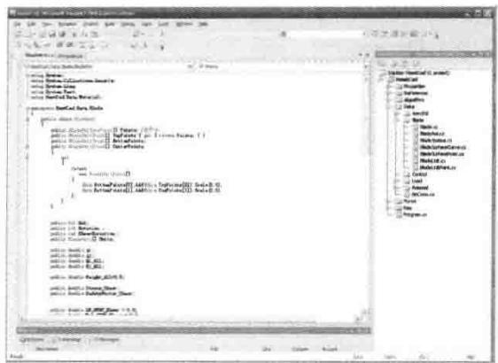

text_image

Name of Microsoft Excel 2003
File Edit View Insert Tools Help Tools Help Tools Help Tools Help Tools Help Tools Help Tools Help Tools Help Tools Help Tools Help Tools Help Tools Help Tools Help Tools Help Tools Help Tools Help Tools Help Tools Help Tools Help Tools Help Tools Help Tools Help Tools Help Tools Help Tools Help Tools Help Tools Help Tools Help Tools Help Tools Help Tools Help Tools Help Tools Help Tools Help Tools Help Tools Help Tools Help Tools Help Tools Help Tools Help Tools Help Tools Help Tools Help Tools Help Tools Help Tools Help Tools Help Tools Help Tools Help Tools Help Tools help
Microsoft Excel 2003
Name: Microsoft Excel 2003
Description: Excel
Name: Microsoft Excel 2003
Description: Excel
Name: Microsoft Excel 2003
Description: Excel
Name: Microsoft Excel 2003
Description: Excel
Name: Microsoft Excel 2003
Description: Excel
Name: Microsoft Excel 2003
Description: Excel
Name: Microsoft Excel 2003
Description: Excel
Name: Microsoft Excel 2003
Description: Excel
名称: Microsoft Excel 2003
名称: Microsoft Excel 2003
名称: Microsoft Excel 2003
名称: Microsoft Excel 2003
名称: Microsoft Excel 2003
名称: Microsoft Excel 2003
名称: Microsoft Excel 2003
名称: Microsoft Excel 2003
名称: Microsoft Excel 2003
名称: Microsoft Excel 2003
名称: Microsoft Excel 2004
名称: Microsoft Excel 2004
名称: Microsoft Excel 2004
名称: Microsoft Excel 2004
名称: Microsoft Excel 2004
名称: Microsoft Excel 2004
名称: Microsoft Excel 2004
名称: Microsoft Excel 2004
名称: Microsoft Excel 2004
名称: Microsoft Excel 2004
名称: Microsoft Excel 2005
名称: Microsoft Excel 2005
名称: Microsoft Excel 2005
名称: Microsoft Excel 2005
名称: Microsoft Excel 2005
名称: Microsoft Excel 2006
名称: Microsoft Excel 2006
名称: Microsoft Excel 2006
名称: Microsoft Excel 2006
名称: Microsoft Excel 2007
名称: Microsoft Excel 2007
名称: Microsoft Excel 2007
名称: Microsoft Excel 2008
名称: Microsoft Excel 2008
名称: Microsoft Excel 2008
名称: Microsoft Excel 2011
名称: Microsoft Excel 2011
名称: Microsoft Excel 2011
名称: Microsoft Excel 2011
名称: Microsoft Excel 2011
名称: Microsoft Excel 2011
名称: Microsoft Excel 2011
名称: Microsoft Excel 2011
名称: Microsoft Excel 2011
名称: Microsoft Excel 2011
名称: Microsoft Excel 2012
名称: Microsoft Excel 2012
名称: Microsoft Excel 2012
名称: Microsoft Excel 2012
名称: Microsoft Excel 2012
名称: Microsoft Excel 2013
名称: Microsoft Excel 2013
名称: Microsoft Excel 2013
名称: Microsoft Excel 2013
名称: Microsoft Excel 2013
名称: Microsoft Excel 2013
名称: Microsoft Excel 2013
名称: Microsoft Excel 2013
名称: Microsoft Excel 2013
名称: Microsoft Excel 2013
名称: Microsoft Excel 2014
名称: Microsoft Excel 2014
名称: Microsoft Excel 2014
名称: Microsoft Excel 2014
名称: Microsoft Excel 2014
名称: Microsoft Excel 2014
名称: Microsoft Excel 2014
名称: Microsoft Excel 2014
名称: Microsoft Excel 2014
名称: Microsoft Excel 2014
名称: Microsoft Excel 2015
名称: Microsoft Excel 2015
名称: Microsoft Excel 2015
名称: Microsoft Excel 2015
名称: Microsoft Excel 2015
名称: Microsoft Excel 2015
名称: Microsoft Excel 2015
名称: Microsoft Excel 2015
名称: Microsoft Excel 2015
名称: Microsoft Excel 2015

(a) 叶片结构设计软件源代码示意图

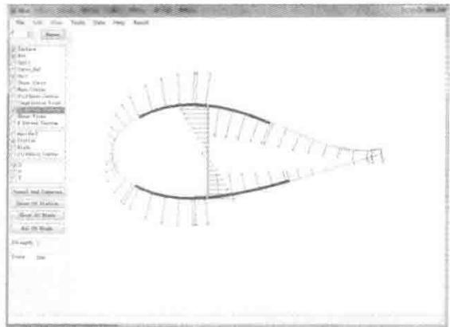

text_image

File Edit View Tools Date Help Assist
Name
Section
Apt
Top1
Tape_Rad
Face
Down Curve
Down Curve
Top Curve
Top Curve
Top Curve
Layer Type
Top Curve
Layer Type
Layer Type
Layer Type
Layer Type
Layer Type
Layer Type
Layer Type
Layer Type
Layer Type
Layer Type
Layer Type
Layer Type
Layer Type
Layer Type
Layer Type
Layer Type
Layer Type
Layer Type
Layer Type
Layer Type
Layer Type
Layer Type
Layer Type
Layer Type
Layer Type
Layer Type
Layer Type
Layer Type
Layer Type
Layer Type
Layer Type
Layer Type
Layer Type
Layer Type

(b) 叶片结构设计软件界面示意图

图 8-18 叶片结构设计软件平台  
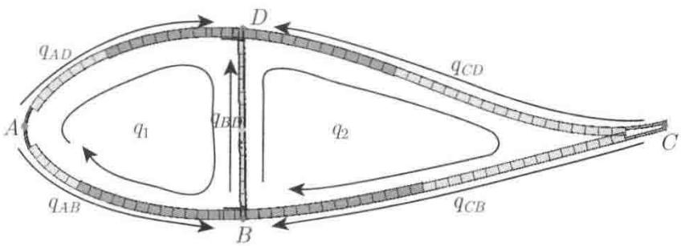

text_image

qAD
D
qCD
A
q1
qBD
q2
qAB
B
qCB
C

图 8-19 叶片闭室剪力流

通过二维强度和刚度校核，验证铺层设计的合理性，满足叶片技术准则的要求，且能在约束强度和总重的情况下优化铺层。

# 8.5 二维等截面有限元方法

叶片二维结构校核等截面的有限元方法，包括二维壳模型和体模型的有限元校核，叶片为薄壁杆件的结构体，一般情况下应用壳模型建立叶片有限元模型已比较精确。但由于叶片结构模型划分区域较多，在叶片受力很复杂的尾缘段及尾缘胶接段，则通常采用体单元模拟。

叶片二维结构校核模型既可近似模拟叶片三维的特性，又方便叶片局部模型的拓扑优化与局部分析，还可快速应用成熟的商业有限元软件进行二次开发，因此叶片二维结构校核等截面有限元方法有很高的实用价值。

# 8.5.1 二维壳模型有限元校核

叶片二维壳模型有限元校核，包括建模、分网、加载与分析。

# 1. 几何模型

应用有限元软件建立叶片剖面模型，按照铺层位置，通过布尔运算，分割剖面曲线段，分割后的叶片某截面示意图如图 8-20 所示。

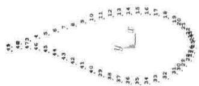

scatter

| X | Y |
|---|---|
| 1 | 1 |
| 2 | 2 |
| 3 | 3 |
| 4 | 4 |
| 5 | 5 |
| 6 | 6 |
| 7 | 7 |
| 8 | 8 |
| 9 | 9 |
| 10 | 10 |
| 11 | 11 |
| 12 | 12 |
| 13 | 13 |
| 14 | 14 |
| 15 | 15 |
| 16 | 16 |
| 17 | 17 |
| 18 | 18 |
| 19 | 19 |
| 20 | 20 |
| 21 | 21 |
| 22 | 22 |
| 23 | 23 |
| 24 | 24 |
| 25 | 25 |
| 26 | 26 |
| 27 | 27 |
| 28 | 28 |
| 29 | 29 |
| 30 | 30 |
| 31 | 31 |
| 32 | 32 |
| 33 | 33 |
| 34 | 34 |
| 35 | 35 |
| 36 | 36 |
| 37 | 37 |
| 38 | 38 |
| 39 | 39 |
| 40 | 40 |
| 41 | 41 |
| 42 | 42 |
| 43 | 43 |
| 44 | 44 |
| 45 | 45 |
| 46 | 46 |
| 47 | 47 |
| 48 | 48 |
| 49 | 49 |
| 50 | 50 |
| 51 | 51 |
| 52 | 52 |
| 53 | 53 |
| 54 | 54 |
| 55 | 55 |
| 56 | 56 |
| 57 | 57 |
| 58 | 58 |
| 59 | 59 |
| 60 | 60 |
| 61 | 61 |
| 62 | 62 |
| 63 | 63 |
| 64 | 64 |
| 65 | 65 |
| 66 | 66 |
| 67 | 67 |
| 68 | 68 |
| 69 | 69 |
| 70 | 70 |
| 71 | 71 |
| 72 | 72 |
| 73 | 73 |
| 74 | 74 |
| 75 | 75 |
| 76 | 76 |
| 77 | 77 |
| 78 | 78 |
| 79 | 79 |
| 80 | 80 |
| 81 | 81 |
| 82 | 82 |
| 83 | 83 |
| 84 | 84 |
| 85 | 85 |
| 86 | 86 |
| 87 | 87 |
| 88 | 88 |
| 89 | 89 |
| 90 | 90 |
| Note: The actual values for 'X' and 'Y' are not explicitly provided in the code, so they are represented as placeholders. The actual values would be the result of the random number generation. The numbers in the 'X' column are estimated based on the number of bins. The numbers in the 'Y' column are estimated based on the bin width. There is no label for the data series. The box plot visualizes the distribution of these values. The box plot does not have explicit labels or units specified in the code.

(a) 翼型剖面点云坐标

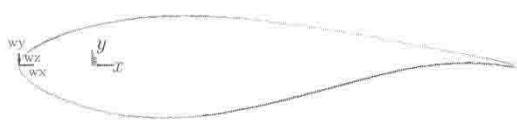

text_image

wxy
wzx
y
x

(b) 翼型剖面外形  
图8-20 翼型分割曲线段

将叶片剖面沿长度方向等截面拉伸一段，拉伸长度应足够长，避免由于圣维南原理造成提取叶片展向应力数值不正确。图 8-21 为叶片等截面拉伸模型示意图。

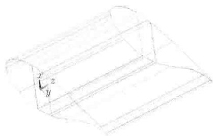

natural_image

3D wireframe diagram of a curved rectangular prism with labeled axes x, y, z (no text or symbols beyond labels)

(a) 等截面线性模型

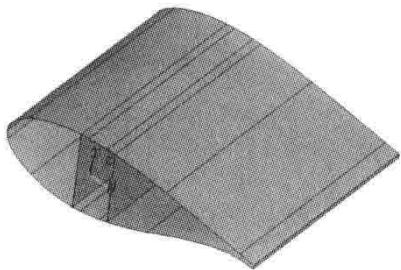

natural_image

3D wireframe model of a curved surface with grid lines, no text or symbols present

(b) 等截面曲面模型  
图8-21 拉伸等截面模型

# 2. 网格与单元属性

定义网格尺寸, 合理控制网格密度与网格精度进行网格划分, 考虑复合材料坐标系与有限元模型单元坐标系, 定义层合板属性附于二维有限元模型。图 8-22 给出叶片等截面模型的网格和属性。

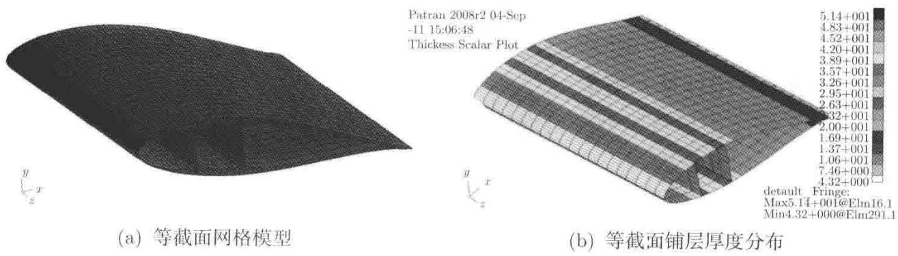

text_image

(a) 等截面网格模型
Patran 2008r2 04-Sep
-11 15:06:48
Thickness Scalar Plot
y
x
z
y
x
z
(b) 等截面铺层厚度分布
default Fringe:
Max5.14+001@Elm16.1
Min4.32+000@Elm291.1

图8-22 网格与单元属性

# 3. 有限元加载

根据叶片各截面的极限载荷进行二维模型的 MPC 加载：在剖面一端固定约束，使端部截面各节点的自由度为 0；在延伸面的截面设置 MPC 加载，加载点设为叶片截面坐标系中段的变桨轴位置。计算之后直接选取中段截面上的应力值。MPC 有限元加载如图 8-23 所示。

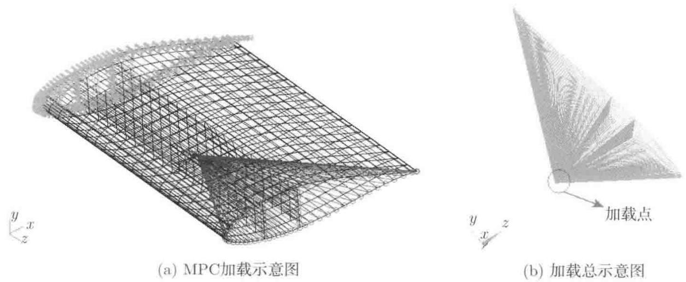  
图 8-23 叶片有限元加载

# 4. 有限元求解

叶片二维壳模型有限元校核，图 8-24 为应力分布示意图，二维有限元方法可以进行叶片截面的静强度、挠度、屈曲与疲劳特性。

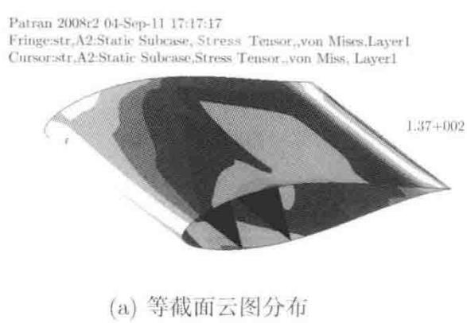

text_image

Patran 2008r2 04-Sep-11 17:17:17
Fringe:str,A2:Static Subcase,Stress Tensor,,von Mises,Layer1
Cursor:str,A2:Static Subcase,Stress Tensor,,von Miss,Layer1
1.37+002
(a) 等截面云图分布

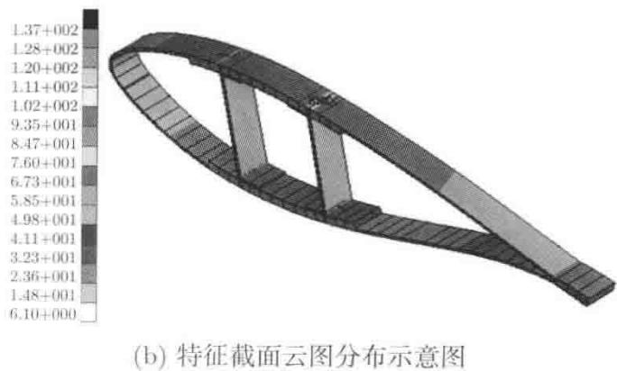

text_image

(b) 特征截面云图分布示意图

图 8-24 截面应力示意图

# 8.5.2 二维体模型有限元校核

叶片二维等截面模型除采用壳单元形式外，同样可采用体单元模型，如图 8-25 所示。体单元模型可进行叶片拓扑优化、层间分析、铺层细化等细节设计与分析。

叶片本身为复合材料层合结构形式，又为薄壁结构，因此将叶片整体或各截面建立为体模型并不合适，但可进行叶片二维模型的局部细化，进行叶片尾缘铺层与胶接分析时应将叶片尾缘和尾缘胶接建立为体单元，可分析胶接的剥离强度和剪切特性，如图 8-26 所示。

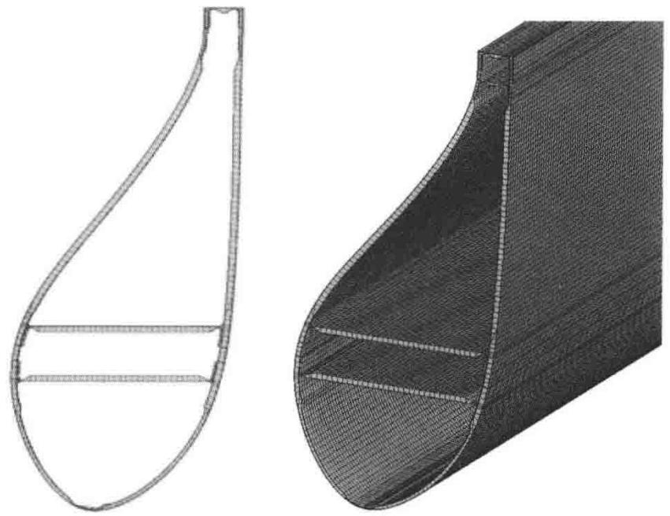

natural_image

Two technical diagrams showing a curved structural component and its textured surface (no text or symbols)

图 8-25 二维体模型

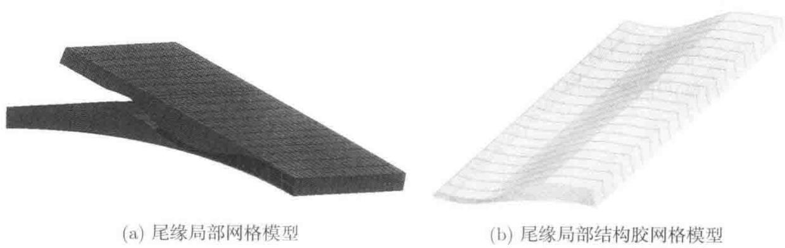

text_image

(a) 尾缘局部网格模型
(b) 尾缘局部结构胶网格模型

图 8-26 尾缘局部体模型

# 第9章 三维方法

有限单元法 (finite element method) 是在当今工程分析中最广泛应用的数值计算方法。在工程或物理问题的数学模型（基本变量、基本方程、求解域和边界条件等）确定以后，有限元法作为对其进行分析的数值计算方法的要点 $^{[20]}$ 可归纳为：

(1) 将一个表示结构或者连续体的求解域离散为若干个子域 (单元), 并通过它们边界上的节点相互联结成为组合体;  
(2) 用每个单元内所假设的近似函数来分片地表示全求解域内待求的未知场变量，而每个单元内的近似函数由未知场函数在单元各个节点上的数值和与其对应的插值函数来表达；  
(3) 通过和原问题数学模型 (基本方程、边界条件) 等效的变分原理或加权余量法, 建立求解基本未知量的代数方程组或常微分方程组。

根据有限单元法的上述要点, 可以理解其所固有的如下特征:

(1) 对于复杂几何构形的适应性。由于单元在空间可以是一维、二维或三维的，并且每一种单元可以有不同的形状，同时各单元之间也可以采用不同的连接方式。  
(2) 对于各种物理问题的可应用性。可以利用有限元法对不同物理现象相互耦合的问题进行有效的分析。  
(3) 基于严格理论基础上的可靠性。只要原问题的数学模型是正确的，同时用来求解有限元方程的算法是稳定、可靠的，则随着单元数目的增加，即单元尺寸的缩小，或者随着单元自由度数目的增加及插值函数阶次的提高，有限元解的近似程度都将不断地被改进。  
(4) 适合计算机实现的高效性。

# 9.1 风力机叶片有限元分析

有限元分析可以使分析结果更为精确，采用软件将一个虚拟三维叶片分割成几千个细小单元，就像瓦片一样。通过计算机的分析，可以得到每一片的受力情况和力传递过程，从而可以模拟整体受到外力时叶片的反应。有限元分析方法主要有3个步骤组成：创建有限元模型、施加载荷及边界条件、求解分析及查看结果[21]。

# 9.2 叶片有限元建模

有限元模型的生成是指狭义上的节点和单元表示空间体域及实际系统连接的生成过程，即模型的节点和单元的几何模型，一般构造有限元模型的方法有以下三种：

(1) 用于小型或简单模型的直接建模法;  
(2) 创建点、线、面、体的方式，采用自底向上、自顶向下或者混生成有限元模型；  
(3) 适用于形状复杂, 难以在有限元软件中进行建模的构件, 通过制图软件构建模型, 模型可以精确地传入有限元分析软件中。

# 9.2.1 几何外形

风力机叶片的几何外形是一个复杂的三维空间结构，由一些特征翼型曲线构成截面，每个截面相对于变浆轴心有一定的扭转角度。这样直接运用有限元软件建模比较困难，本书采用第三种方法引入模型法，通过 CATIA 建叶片外形图导入有限元软件 MSC。

在 CATIA 中导入翼型截面的数据点, 建立单位弦长的初始翼型截面, 放样生成初始叶片。由初始叶片插值得出真实叶片的翼型截面, 根据气动布局的变浆轴、弦长、扭转角对翼型截面移轴、放大、旋转, 对翼型截面整体放样生成叶片的外形空间曲壳 (图 9-1)。其中叶根圆柱段和叶片翼型曲面采用桥接, 再将各段曲面接合生成整个叶片外壳。这样就实现其几何外形的模型构建, 反映出了叶片的实际几何形状。对这样一个有效的几何模型保存生成格式, 利用数据接口, 导入 MSC 进行后续的有限元分析。

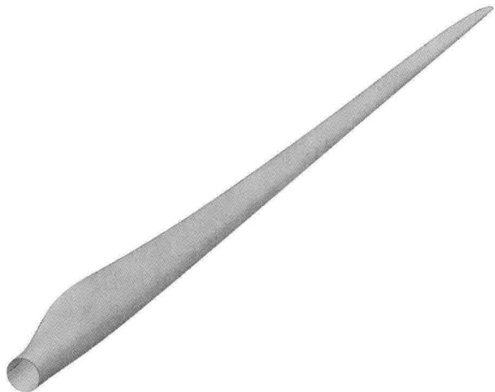

natural_image

3D rendered image of a conical tool or blade with mesh texture, no text or symbols visible

图 9-1 叶片外形图

直接将叶片外形图导入有限元中，容易丢失模型特征，因而分两步由 CATIA 图形导入有限元软件 MSC 中：首先将只有翼型截面曲线的 CATIA 图形导入有限元软件 MSC 中 (图 9-2)，其次将叶片外形曲面导入有限元软件 MSC 中 (图 9-3)，至此完成叶片外形建模。

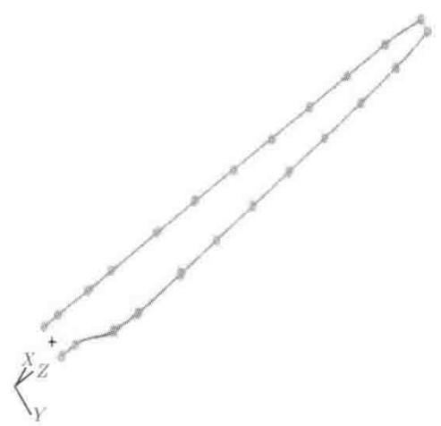

natural_image

Pure geometric line diagram with X, Y, Z axes and a plus symbol at origin (no text or labels)

图 9-2 叶片截面翼型线导入 MSC

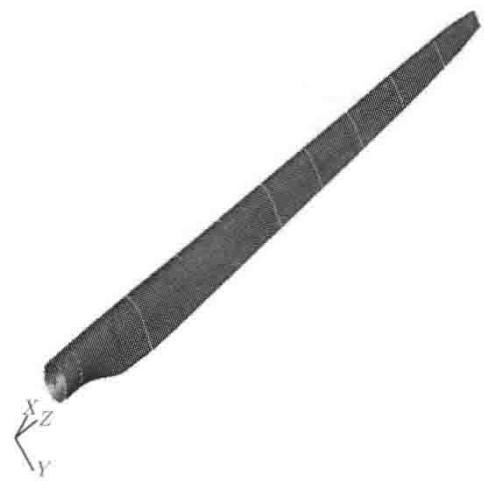

natural_image

3D rendered image of a long, segmented cylindrical object with XYZ axis indicators (no text or symbols on the object itself)

图 9-3 叶片曲面导入 MSC

# 9.2.2 坐标系

本书将进行结构校核的有限元模型的坐标系分为总体坐标系与局部坐标系。为了获得较好的气动性能，风力机叶片的扭角沿展向连续变化，各截面翼型的扭角均不同。以叶根坐标系作为基准，如图9-4所示，以叶根圆面中心作为原点，Z轴沿叶片的变桨轴方向，X轴与Z轴正交，上风向时指向塔架，下风向时背离塔架。按右手坐标系确定Y轴方向。

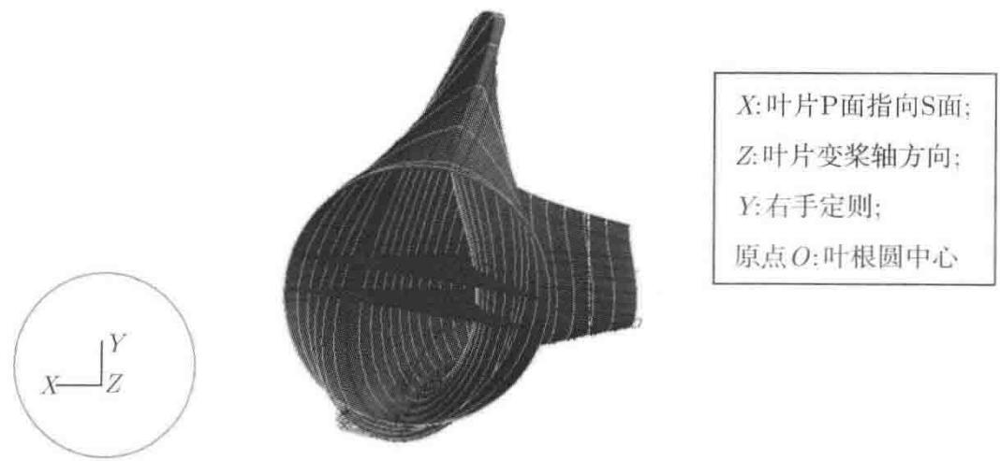

text_image

X:叶片P面指向S面;
Z:叶片变桨轴方向;
Y:右手定则;
原点O:叶根圆中心

图 9-4 叶片总体坐标系

为了建模和加载方便，在每一个翼型截面上均建立了局部坐标系（图9-5）， $Y$ 轴为各截面前缘分模点与尾缘分模点连线，正方向指向尾缘； $Z$ 轴为叶片变桨轴方向，正方向为由叶根指向叶尖； $Y$ 轴方向按右手定则确定。坐标原点 $O$ 为叶片每一个截面前缘分模点。

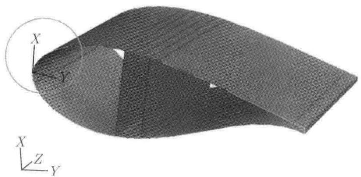

natural_image

3D rendered curved surface with X, Y, Z coordinate axes labeled (no text or symbols on the surface itself)

Y: 各截面前缘分模点与尾缘分模点的连线;

Z:叶片变桨轴;

X:右手定则;

原点O: 叶片各截面的前缘分模点

图 9-5 叶片各截面局部坐标系

# 9.2.3 结构布局型式

应用有限元软件，根据叶片的气动外形，将叶片沿展长方向分成 N 段。根据结构设计的铺层型式，划分叶片各段弦长方向分区，叶片几何模型如图 9-6 所示。

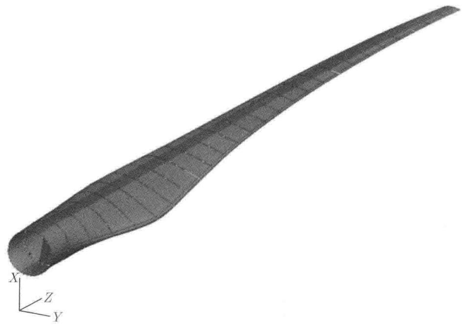

natural_image

3D rendered model of a curved, elongated structure with XYZ axis indicators (no text or symbols on the object itself)

图9-6 叶片几何模型

由于叶尖结构特性对整体叶片的结构强度影响较小，在有限元整体结构校核中可不考虑最叶尖段。

# 9.2.4 网格划分

实体模型建好后，就需要将其进行网格划分。有限元网格生成就是将工作环境下的物体离散成简单单元的过程。划分网格是建立有限元模型的一个重要环节，所划分的网格形式和大小直接影响着计算精度和计算规模。为了建立正确、合理的有限元模型，必须考虑网格数量、网格密度、单元属性、网格质量、网格的分界面分界点以及网格布局等众多因素。

针对叶片的形状，考虑其铺层设计，主要从叶片的展向和弦向进行网格划分。展向主要考虑叶片主梁的梯度的变化点为网格划分的控制点；弦向考虑叶片铺层变化段、腹板缘条为其主要的控制点以及从叶片整体考虑一些关键性部位为控制点来进行网格划分。此外，对其需要严格控制的截面区域可以采用加密网格数量的方法来提高整体分析精度，对叶尖这些区域可采用粗网格划分以降低能耗，节约资源空间。

叶片是薄壁结构，长宽与铺层厚度的比值仍远大于10，故有限元建模中采用壳单元较为合适。叶片上下蒙皮采用QUAD4 SHELL单元，QUAD4单元计算精度较高，在应力场分析中一般要求受集中力或结构刚度突变导致应力变化梯度大的部位网格要求密一些，应力变化平坦的区域网格可以稀一些。网格的长宽比不宜过大，一般控制在3\~5为宜，相邻曲面上的网格必须保证共节点。

综上所述，对网格进行合理规划，首先计算出各曲面的合适网格密度，再对各曲面边界布种子进行控制。本书根据叶片外形，对叶片展向、弦向各四边形曲面区域进行网格划分，通过共节点的方式使其相连，从而生成了整体与局部均满足分析要求的网格。实践表明：单元数目的选取有一个最佳范围，小于这个范围，求解精度不够，超过这个范围，对结果精度的提高则很有限，反而会影响求解速度。

叶片网格图如图 9-7 所示，腹板网格图如图 9-8 所示。

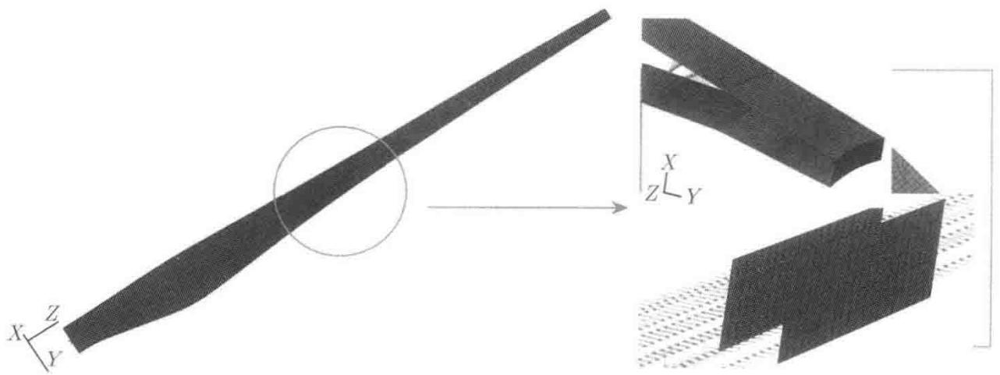

text_image

X
Z
Y
→
X
Z
Y

图9-7 叶片网格

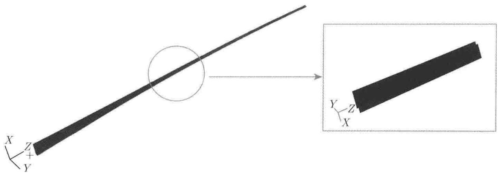

text_image

X
Z
+
Y
→
Y
Z
X

图 9-8 腹板网格

# 9.2.5 单元法向与单元坐标系

统一叶片的单元法向与单元坐标系。规定叶片和腹板的单元法向朝内，即 Z 方向朝里，图 9-9 为叶片和腹板的单元法向示意图，图 9-10 为叶片和腹板单元坐标系示意图。单元坐标系的 X 轴方向为叶片展向，Y 轴方向通过右手定则确定。

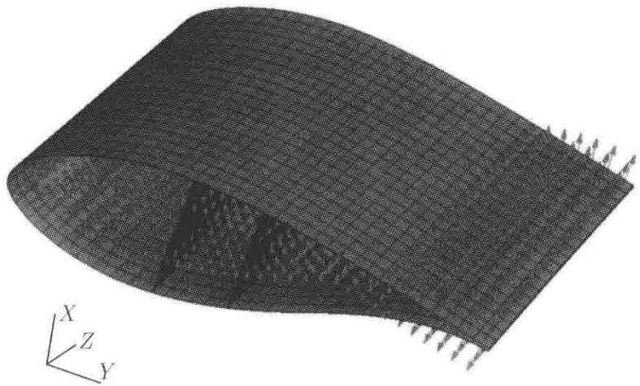

natural_image

3D mesh surface plot with X, Y, Z axis indicators (no text or symbols on the surface itself)

图 9-9 叶片和腹板单元法向

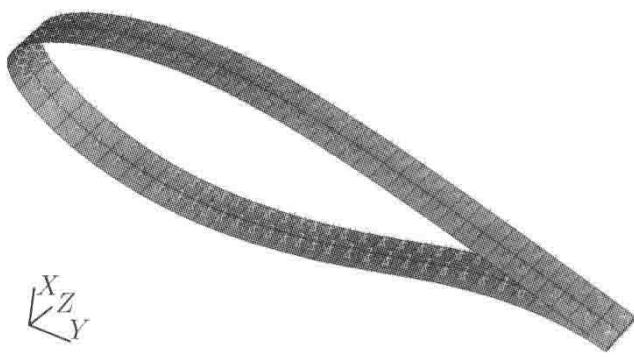

natural_image

3D rendered curved object with grid pattern, labeled X, Y, Z axes at bottom-left (no text or symbols on the object itself)

(a) 壳体单元坐标系

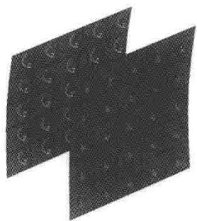

natural_image

Two dark, textured rectangular panels with repeating patterns and small circular motifs (no text or symbols)

(b) 腹板单元坐标系  
图 9-10 叶片与腹板的单元坐标系

# 9.2.6 材料属性

一般的，一个模型要采用几种不同的材料属性。叶片的主要铺层材料有： $0^{\circ}$ 单向布、 $\pm45^{\circ}$ 双轴布、 $[\pm45^{\circ}/0^{\circ}]$ 三轴布、PVC泡沫、Balsa木、环氧或不饱和型结构胶黏剂。其中， $0^{\circ}$ 单向布按正交各向异性材料定义材料属性，铺层角度为 $0^{\circ}$ ； $\pm45^{\circ}$ 双轴布按 $0^{\circ}$ 单向布的材料性能定义材料属性，铺层方向为 $+45^{\circ}$ 和 $-45^{\circ}$ 分别建层；三轴布折算为 $0^{\circ}$ 单向布和 $\pm45^{\circ}$ 双轴布。叶片是由玻璃纤维以不同的铺设角铺设而成，可将叶片主梁、尾缘梁和前缘梁视为层合板模型，即由相同的单向板以不同的角度铺设而成。在有限元软件MSC中构建2D正交各向异性材料单层板模型，再根据结构设计铺层方案，构建层合板模型，最后将各层合板模型材料属性附到相应的区域。

双轴布为 $\pm 45^{\circ}$ 单向布编织而成, 可认为双轴布的纤维方向材料性能与单向布相同, 而铺层方向为 $45^{\circ}$ 和 $-45^{\circ}$ , 各单层的铺层厚度为双轴布厚度的一半。三轴布的铺层分为单向布与双轴布, 双轴布分为 $45^{\circ}$ 方向的单向布与 $-45^{\circ}$ 方向的单向布。既可按照重量相等原则折算三轴布中单向布和双轴布的厚度, 也可以按照刚度等价的原则。

考虑到静强度分析的材料安全系数等因素, 确定材料许用值。双轴布的材料许用值, 可根据单向布的材料许用值, 按照转轴公式得到, 计算方法如下:

$$
\sigma_ {x c} = \sigma_ {1 c} \cos^ {2} \theta + \sigma_ {2 c} \sin^ {2} \theta - 2 \tau_ {1 2} \sin \theta \cos \theta
$$

$$
\sigma_ {x t} = \sigma_ {1 t} \cos^ {2} \theta + \sigma_ {2 t} \sin^ {2} \theta - 2 \tau_ {1 2} \sin \theta \cos \theta
$$

$$
\sigma_ {y c} = \sigma_ {1 c} \sin^ {2} \theta + \sigma_ {2 c} \cos^ {2} \theta + 2 \tau_ {1 2} \sin \theta \cos \theta \tag {9-1}
$$

$$
\sigma_ {y t} = \sigma_ {1 t} \sin^ {2} \theta + \sigma_ {2 t} \cos^ {2} \theta + 2 \tau_ {1 2} \sin \theta \cos \theta
$$

$$
\tau_ {x y} = \sigma_ {1 t} \sin \theta \cos \theta - \sigma_ {2 t} \sin \theta \cos \theta + \tau_ {1 2} (\cos^ {2} \theta - \sin^ {2} \theta)
$$

# 9.2.7 材料方向

叶片材料轴方向定义为叶片展向，如图 9-11 所示。

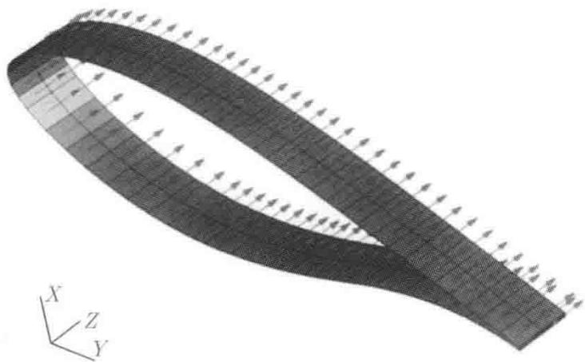

natural_image

3D structural model of a curved pipe or duct with grid pattern, no visible text or symbols

图 9-11 叶片和腹板材料轴方向

# 9.2.8 叶片展向分区

在叶片展向方向，根据铺层材料、铺层厚度及特殊铺层建模及分析需要，将叶片沿展向划分为 N 段，如图 9-12 所示划分为 26 段。

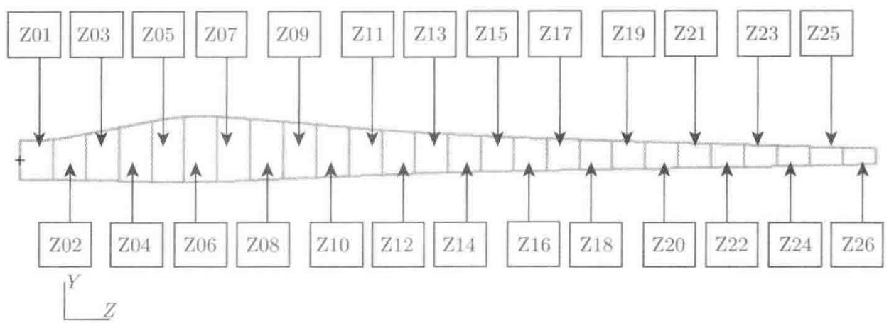

flowchart

```mermaid
graph TD
    Z01 --> A
    Z03 --> A
    Z05 --> A
    Z07 --> A
    Z09 --> A
    Z11 --> A
    Z13 --> A
    Z15 --> A
    Z17 --> A
    Z19 --> A
    Z21 --> A
    Z23 --> A
    Z25 --> A
    Z02 --> B
    Z04 --> B
    Z06 --> B
    Z08 --> B
    Z10 --> B
    Z12 --> B
    Z14 --> B
    Z16 --> B
    Z18 --> B
    Z20 --> B
    Z22 --> B
    Z24 --> B
    Z26 --> B
```

图 9-12 叶片展向分区示意图

# 9.2.9 单元属性

沿弦向根据结构设计结果按铺层变化位置将展向各分段分为 N 个区，如图 9-13 所示分为 7 个区域，分区说明见表 9-1，带有特殊叶片结构形式的（如三腹板）弦向分区会增加。其中，由于叶片 S 面与 P 面的前缘夹芯与尾缘夹芯的厚度不同，且前缘腹板和尾缘腹板的夹芯厚度也可能不同。

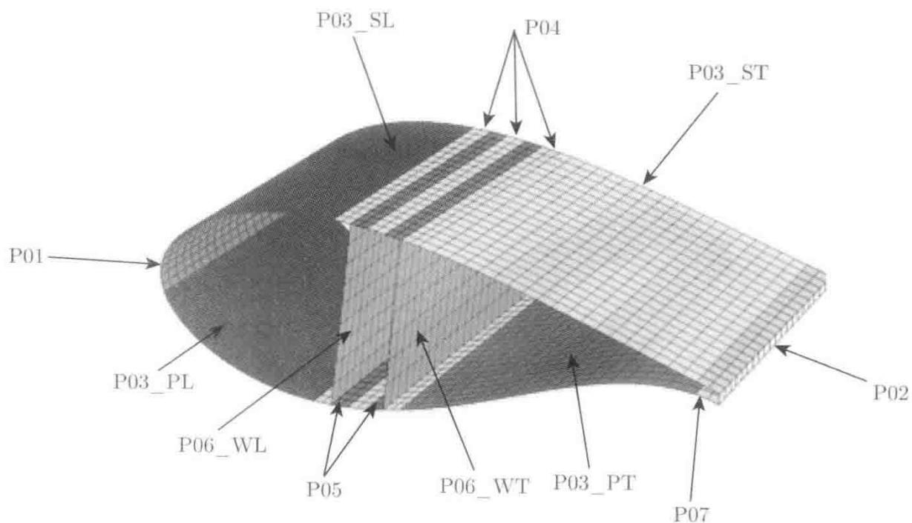

text_image

P01
P03_SL
P04
P03_ST
P02
P03_PL
P06_WL
P05
P06_WT
P03_PT
P07

图 9-13 叶片弦向分区示意图

表 9-1 叶片弦向分区说明

<table><tr><td>项目</td><td>弦向分区说明</td></tr><tr><td>P01</td><td>叶片前缘梁</td></tr><tr><td>P02</td><td>叶片尾缘厚度铺层</td></tr><tr><td>P03_SL</td><td>叶片吸力面前缘夹芯结构区域</td></tr><tr><td>P03_ST</td><td>叶片吸力面尾缘夹芯结构区域</td></tr><tr><td>P03_PL</td><td>叶片压力面前缘夹芯结构区域</td></tr><tr><td>P03_PT</td><td>叶片压力面尾缘夹芯结构区域</td></tr><tr><td>P04</td><td>叶片主梁区域</td></tr><tr><td>P05</td><td>叶片腹板缘条区域</td></tr><tr><td>P06_WL</td><td>叶片前缘腹板夹芯结构区域</td></tr><tr><td>P06_WT</td><td>叶片尾缘腹板夹芯结构区域</td></tr><tr><td>P07</td><td>叶片尾缘梁区域</td></tr></table>

对叶片模型定义单元属性，叶片各分区厚度如图 9-14 所示。

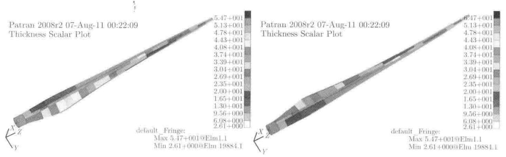

heatmap

| Parameter | Value |
|-----------|-------|
| Max 5.47+001@Elm1.1 | 5.47+001 |
| Min 2.61+000@Elm 19884.1 | 2.61+000 |

图 9-14 叶片铺层厚度

# 9.2.10 叶片总重

# 1. 叶片铺层总重

叶片单元属性定义后，可以统计叶片铺层的重量，如图 9-15 所示，确定叶片铺层总重和叶片重心位置。

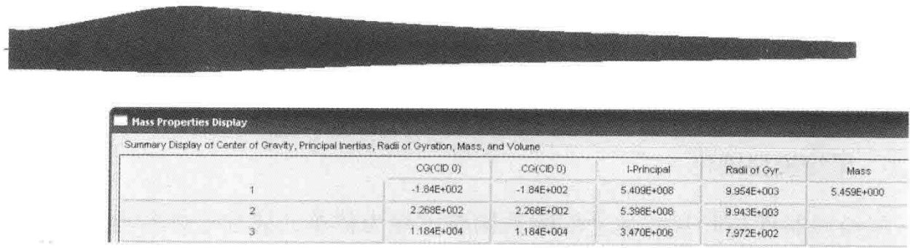

text_image

Mass Properties Display
Summary Display of Center of Gravity, Principal Inertias, Radii of Gyration, Mass, and Volume
CG(CID 0)	CG(CID 0)	I-Principal	Radii of Gyr.
1	-1.84E+002	-1.84E+002	5.409E+008	9.954E+003	5.459E+000
2	2.268E+002	2.268E+002	5.398E+008	9.943E+003
3	1.184E+004	1.184E+004	3.470E+006	7.972E+002

图 9-15 叶片总重

# 2. 叶片 BOM

如图 9-16 所示，叶片 BOM 应包含主材、PVC、结构胶及其他相关的附加质量。

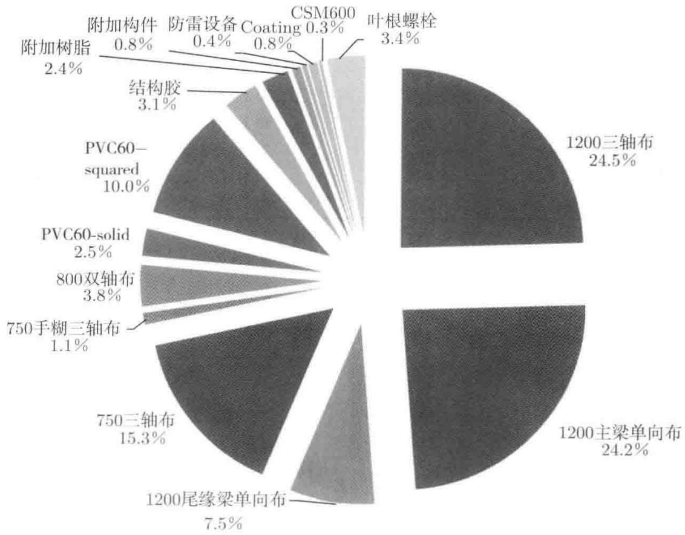

pie

| 类别 | 占比 (%) |
| :--- | :--- |
| 1200三轴布 | 24.5 |
| 1200主梁单向布 | 24.2 |
| 1200尾缘梁单向布 | 7.5 |
| 750三轴布 | 15.3 |
| 750手糊三轴布 | 1.1 |
| 800双轴布 | 3.8 |
| PVC60-solid | 2.5 |
| PVC60-squared | 10.0 |
| 结构胶 | 3.1 |
| 附加树脂 | 2.4 |
| 附加构件 | 0.8 |
| 防雷设备 | 0.4 |
| Coating | 0.8 |
| CSM600 | 0.3 |
| 叶根螺栓 | 3.4 |

图 9-16 叶片 BOM

# 9.3 叶片有限元模型局部细化

本书只是举例说明单元属性的基本分区，大型风力机叶片的叶片结构形式很复杂，局部可能有三腹板、尾缘预制件、泡沫倒角、叶根螺栓等特殊的构件，所以在建立叶片有限元模型中，应当充分考虑叶片局部的特殊构件，一方面真实模拟叶片的结构布局；另一方面合理地简化模型，是结构工程师的重要工作。

# 9.3.1 尾缘模型细化

尾缘预制件与叶片壳体之间的结构胶可视为体单元建立于叶片全局有限元模型中，如图 9-17 所示。

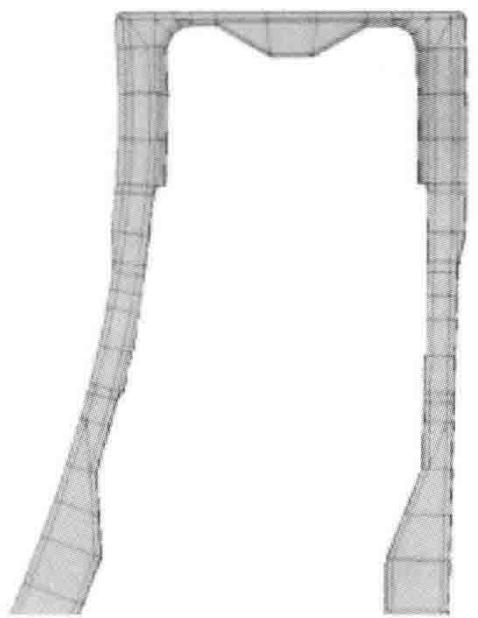

natural_image

3D wireframe model of a mechanical part with curved and straight edges (no text or symbols)

图 9-17 叶片尾缘局部有限元模型

# 9.3.2 腹板缘条与壳体黏接

腹板与壳体之间通过缘条胶接连接，有限元模拟中可将腹板缘条与壳体黏接局部细化，采用 Glue 单元模拟腹板与壳体之间的连接，如图 9-18 所示。

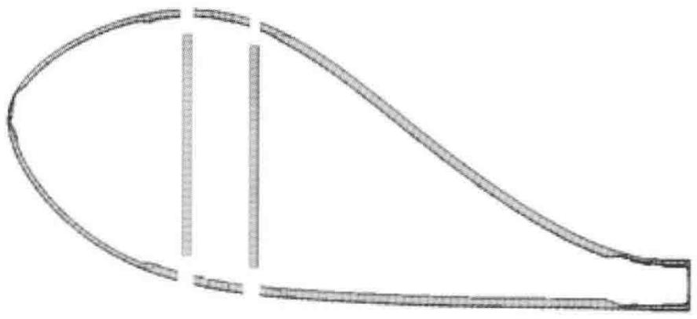

natural_image

Pure geometric shape diagram with curved and straight lines, no text or symbols present

图 9-18 腹板与壳体 Glue 连接

# 9.3.3 叶根螺栓模型

叶片叶根与变桨轴承之间通过螺栓连接，前面已经介绍叶根有2种连接形式，即后打孔工艺和预埋叶根工艺。在叶片有限元模型的局部细化中，可考虑将叶根螺栓以杆单元的形式建立于整体模型中。以预埋螺栓为例，螺栓与螺栓套耦合的螺纹段、螺栓与垫片均采用MPC连接，如图9-19所示。

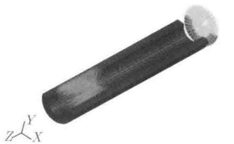

natural_image

3D rendered object resembling a cylindrical rod or tube with a small protrusion, labeled X, Y, Z at the base (no text or symbols on the object itself)

(a) 螺栓与螺栓套、垫片MPC连接

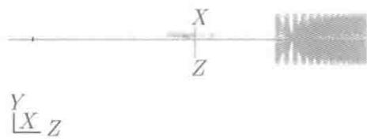

text_image

Y
X
Z

(b) MPC示意图  
图 9-19 螺栓与螺栓套、垫片 MPC 连接

# 9.3.4 叶根假体模型

叶片叶根应建立叶根假体圆柱段的有限元模型，以考虑假体的刚度，假体主要考虑变桨轴承与轮毂的刚度；若通过叶片有限元模型验证叶片在测试载荷下的强度和挠度特性，还需要考虑测试台的刚度。而在叶片的整体有限元分析中，应约束在叶根假体段，避免约束于叶根段以影响叶片的整体刚度，如图9-20所示。

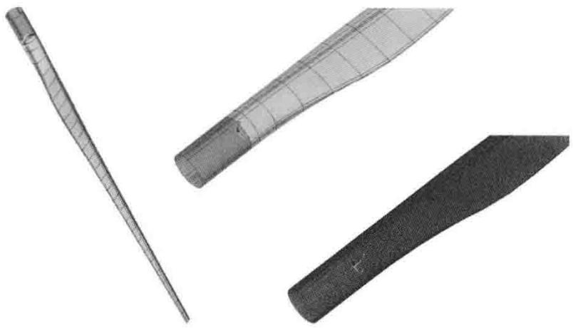

natural_image

Three abstract geometric shapes with grid patterns, no text or symbols visible

图 9-20 叶根假体模型

# 9.3.5 叶片集中点质量

叶片的功能件，如配重腔的配置质量、叶尖防雷块等，都应该作为点质量建立于整体有限元模型中。这些质量影响叶片的质量分布与刚度分布，影响叶片的固有频率，因此在叶片全局有限元模型中应尽可能真实地考虑集中质量。

# 9.4 叶片有限元边界与加载

# 9.4.1 叶片有限元边界条件

考虑到叶片的实际情况，叶片根部采用预埋金属螺杆，便于与变桨轴承、轮毂连接。此时，叶片根部连接被认为是刚性的，固定根部所在节点的6个自由度，则整个叶片简化为悬臂梁模型。叶片根部需要增加假体，而假体的刚度和长度应与实际变桨轴承、轮毂的刚度和形式相当。

# 9.4.2 叶片有限元极限加载形式

一般有限元分析中的载荷包括边界条件和内外环境对物体的作用，可以分为自由度、集中载荷、面载荷、体载荷和惯性载荷。载荷可以在几何模型上或者有限元模型上直接加载。如果直接在实体模型上加载，独立于有限元网格的划分，重新划分网格或者局部网格修改不影响加载并且加载操作方便，可以在图形中直接拾取。这两种方法的最终结果都是有限元分析程序在求解前都将载荷转化到有限元模型上，因此，加在实体上的载荷将自动转化到节点或单元上。

一般情况下需要验证叶片在极限载荷、测试载荷、疲劳载荷作用下的承载特性。风力机叶片所受的载荷十分复杂，有超过3000种工况，因此，从其中合理筛选出多种叶片结构受载最严重的极限工况进行叶片结构校核是必要的。

# 9.4.3 极限包络载荷

风力机运行环境复杂多变，受各种复杂工况的影响。要想验证所有工况下风力机受到的载荷的承载能力是不可能的，故在计算风力机的各种载荷时，根据风力机标准进行载荷计算得到叶片的极限载荷和包络载荷。

本书给出按照叶片叶根坐标系的载荷计算结果汇总包络载荷得到叶片整体有限元分析中的各套极限载荷的流程。

对于 $N$ 种工况的载荷曲线，根据特定载荷坐标系，给出这些曲线族的包络图，如图9-21所示。

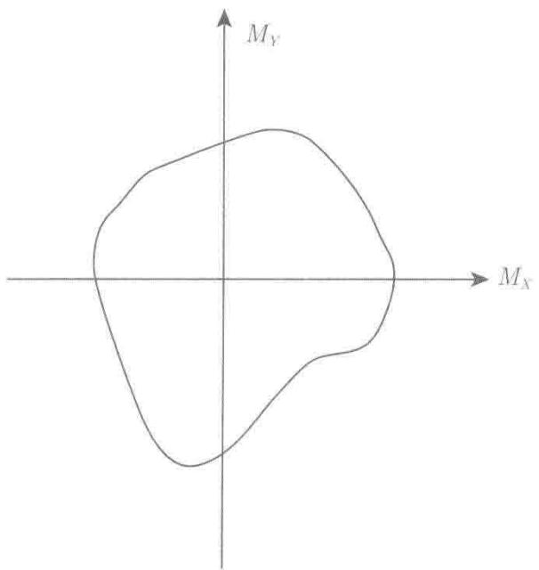

text_image

M_Y
M_X

图9-21 $N$ 种工况的载荷包络图

根据叶片载荷计算统计的包络载荷，按照不同的提取原则提取多套载荷，每一套载荷为某种工况、某一时刻叶片的极限载荷。

# 1. 放射线法选取工况

由载荷包络图，以 $\Delta \theta$ 角度，由坐标原点做一组放射线，这组放射线与载荷包络图的交点对应不同的工况，每一种工况都需要进行载荷计算。 $\Delta \theta$ 取值越小，需要参与计算的工况越多，结果越精确，但耗时也更长，如图9-22所示。 $\Delta \theta$ 的不同取值对应的模型误差不同。 $\Delta \theta$ 越小，模型越精确。

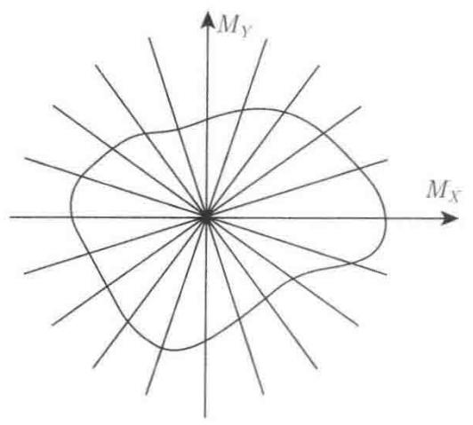

text_image

M_y
M_x

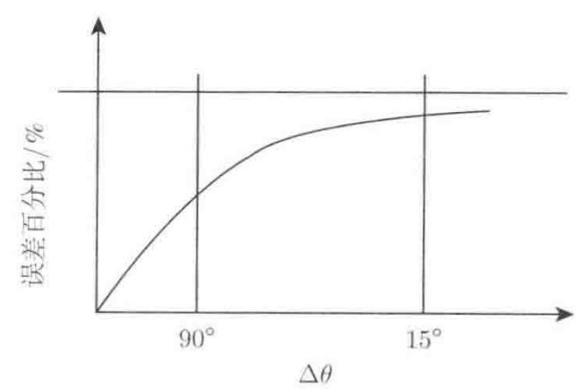

line

| Δθ   | 误差百分比/% |
| ---- | ------------ |
| 0    | 0            |
| 90°  | ~0.8         |
| 15°  | ~1.0         |

图9-22 载荷包络图的放射线

# 2. 经验选择

如图 9-23 所示，可按照弯矩极值来选择工况。

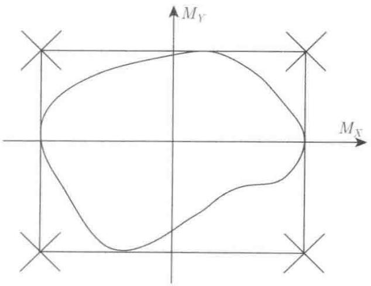

text_image

M_Y
M_X

图9-23 按 $M_X$ 和 $M_Y$ 的极值选择工况

按此方法分别取叶根坐标系的 $M_X$ 和 $M_Y$ 极值作为极限载荷值，这种选取方式过于保守。也可以按照 $M_{XY\max}\left(M_{XY} = \sqrt{M_X^2 + M_Y^2}\right)$ 来选取载荷。

如图 9-24 所示, 取 $M_{XY\max}$ 对应的载荷值, 可能并没有取到 $M_{X}$ 或者 $M_{Y}$ 对应的极限载荷的工况。所以这种方法偏乐观。

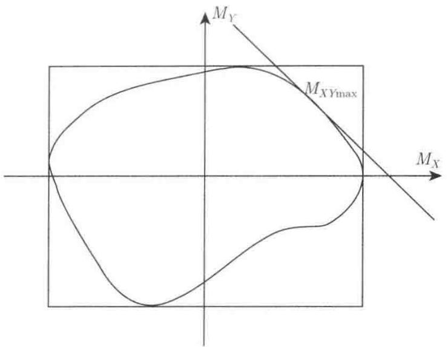

text_image

M_Y
M_XYmax
M_X

图9-24 按 $M_{XY\max}$ 选择工况

# 3. 叶片剖面工况选择

表 9-2 表明叶片剖面位置不同, 选择的工况也是不同。叶尖是按照叶尖变形量 $\Delta X$ 和 $\Delta Y$ 的极值载荷选择工况, 叶中和叶根是依据不同加载力的极值来选择。

表 9-2 载荷工况选取

<table><tr><td>极限载荷</td><td>叶尖</td><td>叶中</td><td>叶根</td></tr><tr><td> $\Delta X_{\max}$ </td><td>√</td><td></td><td></td></tr><tr><td> $\Delta X_{\min}$ </td><td>√</td><td></td><td></td></tr><tr><td> $\Delta Y_{\max}$ </td><td>√</td><td></td><td></td></tr><tr><td> $\Delta Y_{\min}$ </td><td>√</td><td></td><td></td></tr><tr><td> $M_X_{\max}$ </td><td></td><td>√</td><td>√</td></tr><tr><td> $M_X_{\min}$ </td><td></td><td>√</td><td>√</td></tr><tr><td> $M_Y_{\max}$ </td><td></td><td>√</td><td>√</td></tr><tr><td> $M_Y_{\min}$ </td><td></td><td>√</td><td>√</td></tr><tr><td> $M_Z_{\max}$ </td><td></td><td>√</td><td>√</td></tr><tr><td> $M_Z_{\min}$ </td><td></td><td>√</td><td>√</td></tr><tr><td> $F_X_{\max}$ </td><td></td><td>√</td><td>√</td></tr><tr><td> $F_X_{\min}$ </td><td></td><td>√</td><td>√</td></tr><tr><td> $F_Y_{\max}$ </td><td></td><td>√</td><td>√</td></tr><tr><td> $F_Y_{\min}$ </td><td></td><td>√</td><td>√</td></tr><tr><td> $F_Z_{\max}$ </td><td></td><td>√</td><td>√</td></tr><tr><td> $F_Z_{\min}$ </td><td></td><td>√</td><td>√</td></tr><tr><td> $F_{XY}_{\max}$ </td><td></td><td>√</td><td>√</td></tr><tr><td> $M_{XY}_{\max}$ </td><td></td><td>√</td><td>√</td></tr><tr><td>合计</td><td>4</td><td>14</td><td>14</td></tr></table>

# 9.4.4 集中力极限载荷加载形式

# 1. 集中力载荷转化

不考虑叶片桨距角的影响, 则风力机叶片截面坐标系和叶根坐标系只存在叶片截面扭角的变化。风力机叶片在叶根坐标系下的集中力为 $F_{xB}, F_{yB}, F_{zB}$ , 其中, $F_{zB}$ 是由叶片铺层总重和集中点质量引起的离心力和重力; $F_{xB}, F_{yB}$ 为外载荷引起的剪力。采用 MPC 多点约束加载的方法, 对于叶片展向每个分区, 根据风力机极限载荷, 按照力等效的原则, 将叶根坐标系下的集中力转化为各截面多点约束的集中力载荷 $\Delta F_{xB}^{\prime}, \Delta F_{yB}^{\prime}, \Delta F_{zB}^{\prime}$ 加载在有限元模型上。同时, 载荷计算软件 Bladed 输出载荷中, 扭矩 $M_{zB}$ 是根据俯仰力矩系数计算得到, 所以应该将 $M_{zB}$ 转化为各截面的扭矩 $M_{zB}^{\prime}$ 加载在有限元模型上。以挥舞弯矩最大的极限载荷为例, Bladed 输出为挥舞-摆振坐标系下的载荷, 通过坐标变换将挥舞-摆振坐标系下的力转化为叶根坐标系下的力。

$$
\left\{ \begin{array}{l} F _ {x B} = F _ {f} \cos \theta + F _ {e} \sin \theta \\ F _ {y B} = - F _ {f} \sin \theta + F _ {e} \cos \theta \\ M _ {x B} = M _ {e} \cos \theta + M _ {f} \sin \theta \\ M _ {y B} = M _ {f} \cos \theta - M _ {e} \sin \theta \end{array} \right. \tag {9-2}
$$

# 2. 集中力加载

将 MPC 多点约束的载荷加载在叶片有限元模型上，叶片根部固支约束。加载结果示意图如图 9-25 所示。

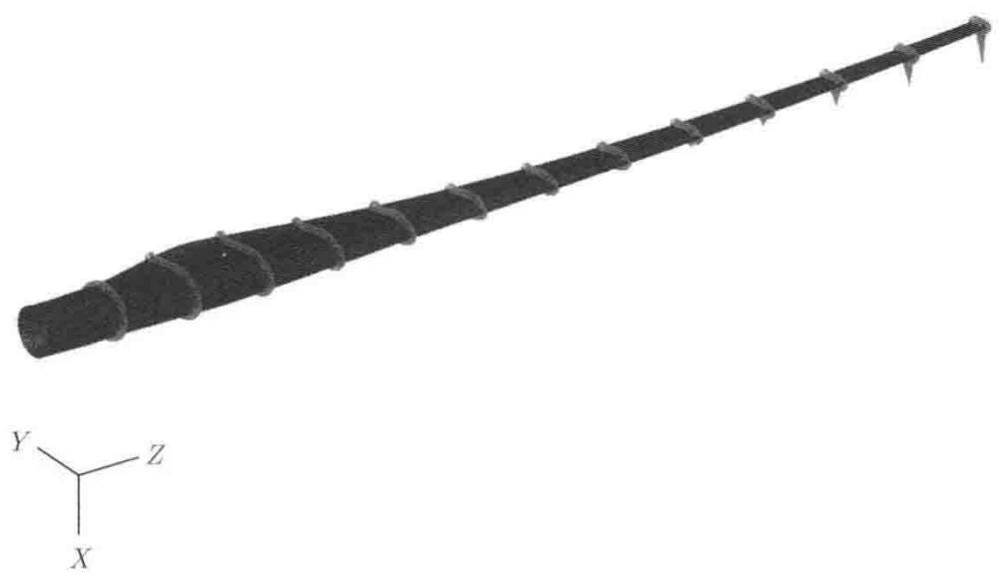

natural_image

3D rendered mechanical component with labeled X, Y, Z axes (no text or symbols on the part itself)

图 9-25 叶片 MPC 加载示意图

多点约束 MPC 加载集中力和扭矩，加载载荷的叶根合力、合力矩与 Bladed

输出叶根载荷相比，见表 9-3，误差小于 5%。

表 9-3 MPC 加载下叶根力和力矩比较

<table><tr><td>载荷比较</td><td> $F_{xB}/N$ </td><td> $F_{yB}/N$ </td><td> $F_{zB}/N$ </td><td> $M_{yB}/(N·m)$ </td><td> $M_{xB}/(N·m)$ </td><td> $M_{zB}/(N·m)$ </td></tr><tr><td>Bladed 输出叶根载荷</td><td> $1.23×10^5$ </td><td> $-1.49×10^4$ </td><td> $1.59×10^5$ </td><td> $1.87×10^6$ </td><td> $2.73×10^5$ </td><td> $5.66×10^3$ </td></tr><tr><td>MPC 加载的叶根载荷</td><td> $1.22×10^5$ </td><td> $-1.48×10^4$ </td><td> $1.60×10^5$ </td><td> $1.92×10^6$ </td><td> $2.65×10^5$ </td><td> $5.61×10^3$ </td></tr><tr><td>误差</td><td>-0.81%</td><td>-0.67%</td><td>0.63%</td><td>2.67%</td><td>-2.93%</td><td>-0.88%</td></tr></table>

# 9.4.5 分布力极限载荷加载形式

传统的加载方式以多点约束的集中力加载在叶片模型上，而叶片主要受到各种工况下的气动载荷，是以分布力的形式作用在叶片表面上的，所以为了更好地模拟叶片的真实受力，本书给出分布力加载的方法。根据最大挥舞弯矩对应的极限载荷，按照力等效的方法转化为分布力载荷。对于分布力载荷，本书在加载的过程中，根据叶根坐标系下的载荷，对于第 $N$ 个展向分区，以 total load 形式将 $Z$ 向剪力 $F_{zB}$ 均匀加载在此分区段； $F_{xB}, F_{yB}$ 将转化为沿叶片展向和弦向的分布力的形式，以分布载荷形式加载在整个叶片蒙皮单元上[22]。

# 1. 叶片展向压力分布

叶根坐标系下所给外载荷为剪力，为将其转化为分布力的形式，考虑用高阶曲线对其进行拟合。假设三次函数分别拟合剪力 $F_{xB}$ 和 $F_{yB}$ ，则拟合函数的边界条件为叶尖位置(R)剪力为0。

$$
F (x) = (R - x) \left(a x ^ {2} + b x + c\right) \tag {9-3}
$$

用 Matlab 函数拟合剪力 $F_{xB}$ 和 $F_{yB}$ ，其拟合结果分别如图 9-26 和图 9-27 所示。

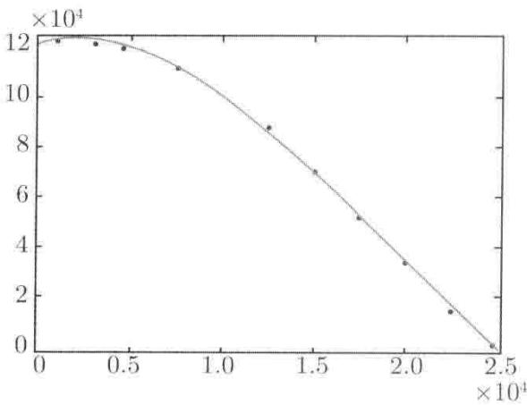

line

| x (×10⁴) | y (×10⁴) |
| -------- | -------- |
| 0.0      | 12.0     |
| 0.5      | 11.8     |
| 1.0      | 10.5     |
| 1.5      | 7.0      |
| 2.0      | 3.5      |
| 2.5      | 0.0      |

图9-26 拟合函数 $F_{xB}$

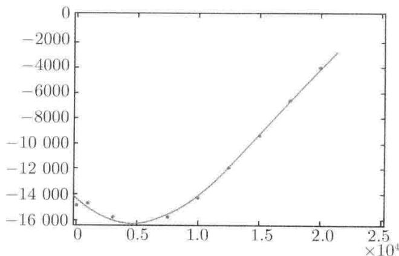

line

| x (×10⁴) | y       |
| -------- | ------- |
| 0.0      | -14000  |
| 0.2      | -15000  |
| 0.4      | -16000  |
| 0.6      | -15500  |
| 0.8      | -14500  |
| 1.0      | -13000  |
| 1.2      | -11500  |
| 1.4      | -9500   |
| 1.6      | -7500   |
| 1.8      | -5500   |
| 2.0      | -4000   |
| 2.2      | -2500   |

图9-27 拟合函数 $F_{yB}$

拟合函数表达式为

$$
F (x) = (2 5 0 0 0 - x) \times (- 0. 0 0 0 0 0 0 0 0 9 x ^ {2} + 0. 0 0 0 2 7 2 9 x + 4. 7 4 1) \tag {9-4}
$$

$$
F (y) = (2 5 0 0 0 - x) \times (0. 0 0 0 0 0 0 0 0 2 4 6 8 x ^ {2} - 0. 0 0 0 0 6 6 6 7 x - 0. 5 7 3 3)
$$

对拟合函数求导，得到 x 方向分布力函数表达式：

$$
f (x) = 0. 0 0 0 0 0 0 0 2 7 x ^ {2} - 0. 0 0 0 9 9 5 8 x + 2. 0 8 1 5 \tag {9-5}
$$

同理，可得 y 方向分布力函数表达式：

$$
f (y) = - 0. 0 0 0 0 0 0 0 0 7 4 0 4 x ^ {2} + 0. 0 0 0 2 5 6 7 4 x - 1. 0 9 3 4 5 \tag {9-6}
$$

x,y 方向分布力沿叶片展向的曲线分别如图 9-28 和图 9-29 所示。

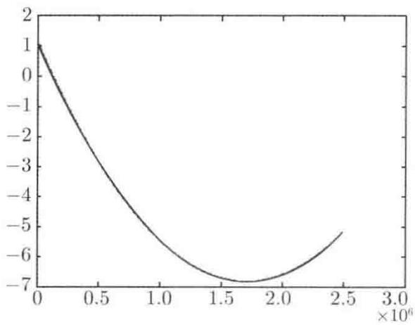

line

| x (×10⁶) | y     |
| -------- | ----- |
| 0.0      | 1.0   |
| 0.5      | -2.0  |
| 1.0      | -4.0  |
| 1.5      | -6.0  |
| 2.0      | -7.0  |
| 2.5      | -5.0  |

图9-28 $x$ 方向分布力函数图

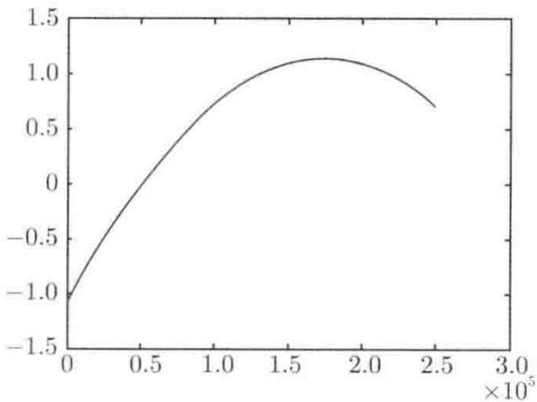

line

| x (×10⁵) | y     |
| -------- | ----- |
| 0        | -1.0  |
| 0.5      | 0.0   |
| 1.0      | 0.7   |
| 1.5      | 1.1   |
| 2.0      | 1.0   |
| 2.5      | 0.7   |

图 9-29 y 方向分布力函数图

为检验分布力的正确性, 根据分布力计算叶根坐标系下叶片各截面的剪力和弯矩, 分别按式 (9-4) 对叶片展向进行积分:

$$
F (x) = - \int_ {R} ^ {L} f (x) \mathrm{d} x + F (R), \quad F (R) = 0 \tag {9-7}
$$

$$
M (x) = - \int_ {R} ^ {L} f (x) (x - L) \mathrm{d} x + M (R), \quad M (R) = 0
$$

通过计算得到分布力计算的叶片截面剪力和弯矩，与 Bladed 输出剪力和弯矩对比，如图 9-30～图 9-33 所示。

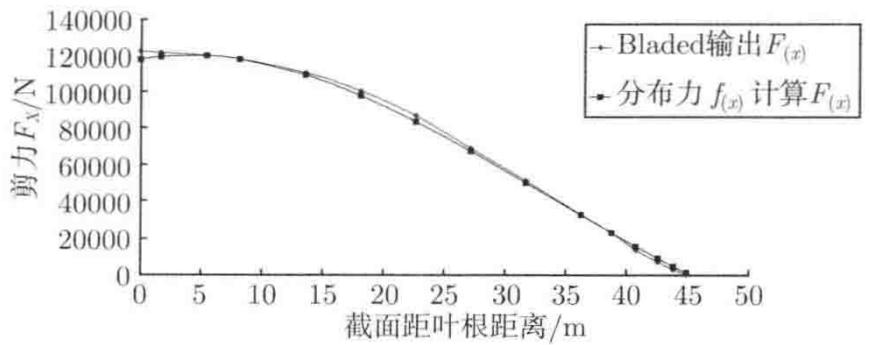

line

| 截面距叶根距离/m | 剪力F_N/N (Bladed输出) | 剪力F_N/N (分布力 f_x) 计算F_x |
| ---------------- | --------------------- | ------------------------------ |
| 0                | 120000                | 120000                         |
| 5                | 120000                | 120000                         |
| 10               | 115000                | 115000                         |
| 15               | 105000                | 105000                         |
| 20               | 95000                 | 95000                          |
| 25               | 85000                 | 85000                          |
| 30               | 70000                 | 70000                          |
| 35               | 55000                 | 55000                          |
| 40               | 35000                 | 35000                          |
| 45               | 1000                  | 1000                           |

图9-30 $x$ 方向剪力计算值与给定值比较

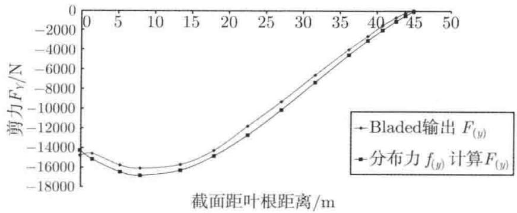

line

| 截面距叶根距离/m | Bladed输出 F_y/N | 分布力 f_y) 计算 F_y) |
| ---------------- | ---------------- | ---------------------- |
| 0                | -14000           | -14000                 |
| 5                | -16000           | -16000                 |
| 10               | -16500           | -16500                 |
| 15               | -16000           | -16000                 |
| 20               | -13000           | -13000                 |
| 25               | -10000           | -10000                 |
| 30               | -7000            | -7000                  |
| 35               | -4000            | -4000                  |
| 40               | -2000            | -2000                  |
| 45               | 0                | 0                      |

图9-31 $y$ 方向剪力计算值与给定值比较

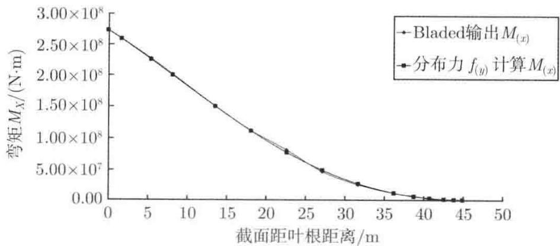

line

| 截面距叶根距离/m | Bladed输出M(x) (弯矩Mx/N·m) | 分布力 f(y) 计算M(x) (弯矩Mx/N·m) |
| ---------------- | -------------------------- | ---------------------------------- |
| 0                | 2.8e8                      | 2.8e8                              |
| 5                | 2.3e8                      | 2.3e8                              |
| 10               | 2.0e8                      | 2.0e8                              |
| 15               | 1.5e8                      | 1.5e8                              |
| 20               | 1.1e8                      | 1.1e8                              |
| 25               | 7.5e7                      | 7.5e7                              |
| 30               | 5.0e7                      | 5.0e7                              |
| 35               | 2.5e7                      | 2.5e7                              |
| 40               | 1.0e7                      | 1.0e7                              |
| 45               | 5.0e6                      | 5.0e6                              |

图9-32 $x$ 方向弯矩计算值与给定值比较

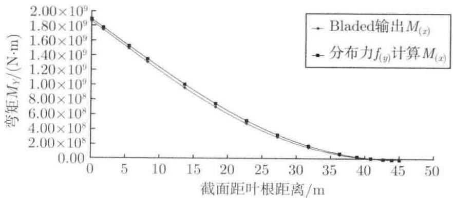

line

| 截面距叶根距离/m | Bladed输出M(x) (弯矩M_y/(N·m)) | 分布力f(y)计算M(x) (弯矩M_y/(N·m)) |
| ---------------- | ----------------------------- | ---------------------------------- |
| 0                | 2.00×10⁹                     | 2.00×10⁹                          |
| 5                | 1.80×10⁹                     | 1.80×10⁹                          |
| 10               | 1.60×10⁹                     | 1.60×10⁹                          |
| 15               | 1.40×10⁹                     | 1.40×10⁹                          |
| 20               | 1.20×10⁹                     | 1.20×10⁹                          |
| 25               | 1.00×10⁹                     | 1.00×10⁹                          |
| 30               | 8.00×10⁸                     | 8.00×10⁸                          |
| 35               | 6.00×10⁸                     | 6.00×10⁸                          |
| 40               | 4.00×10⁸                     | 4.00×10⁸                          |
| 45               | 2.00×10⁸                     | 2.00×10⁸                          |

图9-33 $y$ 方向弯矩计算值与给定值比较

按分布力转化的剪力和弯矩与 Bladed 输出的剪力和弯矩相比较，分布趋势一致且误差较小。叶尖相对误差较大但绝对误差较小， $F_{y}$ 误差略大，但由于 $F_{y}$ 为摆振方向，误差绝对值也较小。力的分布处理对整体分析影响较小，证实可以用于加载。

# 2. 叶片弦向压力分布

对 x, y 方向的剪力 $F_{x}, F_{y}$ 沿展向进行分布处理后，还需对其进行弦向分布处理，才能作用于曲面上。弦向应该根据翼型压力分布函数来确定分布力函数。通过 CFD 计算软件 Fluent 计算翼型压力分布（图 9-34），可以得到翼型表面压力分布数值，将压力分布数值导入 Excel 中，得出压力分布函数图（图 9-35）。以某叶片截面在 $C_{p\max}$ 对应的攻角下的翼型表面压力分布为例，说明叶片弦向压力分布形式。

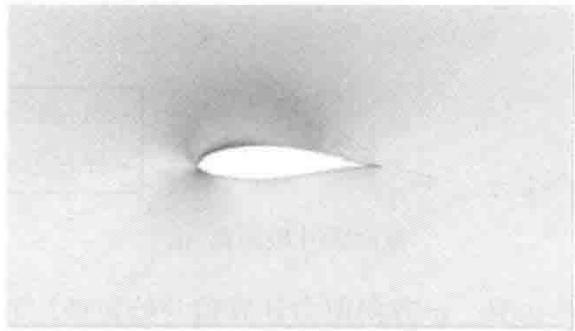

natural_image

Close-up of a white, elongated object with a pointed tip against a plain background (no text or symbols visible)

图 9-34 CFD 计算翼型压力分布图

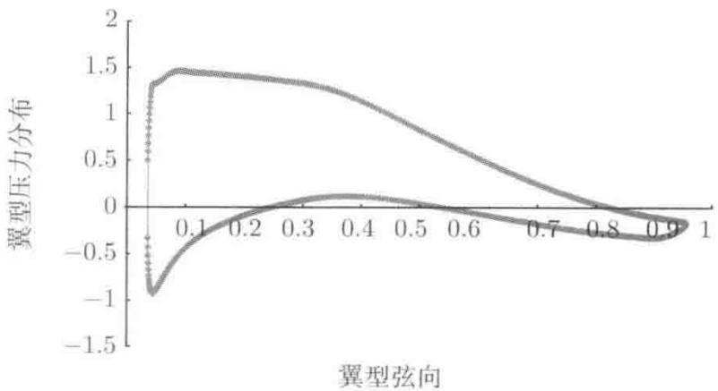

line

| 翼型弦向 | 翼型压力分布 |
| -------- | ------------ |
| 0.0      | -1.0         |
| 0.1      | 1.5          |
| 0.2      | 1.4          |
| 0.3      | 1.3          |
| 0.4      | 1.2          |
| 0.5      | 1.0          |
| 0.6      | 0.8          |
| 0.7      | 0.5          |
| 0.8      | 0.2          |
| 0.9      | 0.0          |
| 1.0      | -0.5         |

图 9-35 翼型压力分布函数图

在翼型坐标系下，根据翼型压力分布，只考虑压差阻力，不考虑摩擦阻力的前提下，可得翼型表面轴向力系数：

$$
c _ {n} = \frac {1}{c} \left[ \int_ {0} ^ {c} (C _ {p, l} - C _ {p, u}) \mathrm{d} x \right] \tag {9-8}
$$

$$
c _ {a} = \frac {1}{c} \left[ \int_ {0} ^ {c} \left(C _ {p, u} \frac {\mathrm{d} y _ {u}}{\mathrm{d} x} - C _ {p, l} \frac {\mathrm{d} y _ {l}}{\mathrm{d} x}\right) \mathrm{d} x \right]
$$

其中， $y_{u}$ 在 x 轴以上为正， $y_{l}$ 在 x 轴以下为负； $C_{p,l}$ 为翼型上表面的 $C_{p,y}$ ， $C_{p,u}$ 为翼型上表面的 $C_{p,y}$ ; c 为翼型弦长; $c_{n}$ 为 y 轴向力系数, $c_{a}$ 为 x 轴向力系数。可得由 CFD 计算的翼型截面的 $F_{x}$ 和 $F_{y}$

$$
F _ {y} = c _ {n} \frac {1}{2} \rho v _ {0} ^ {2} c \tag {9-9}
$$

$$
F _ {x} = c _ {a} \frac {1}{2} \rho v _ {0} ^ {2} c
$$

CFD 计算的翼型各截面的剪力与 Bladed 有差别，将 Bladed 输出的各截面的 $(F_{x}, F_{y})_{\text{Bladed}}$ 与通过 CFD 计算的 $(F_{x}, F_{y})_{\text{CFD}}$ 做差值，将此差值均匀分配到翼型弦向分布力上。

$$
\Delta = (F _ {x}, F _ {y}) _ {\text { Bladed }} - (F _ {x}, F _ {y}) _ {\text { CFD }} \tag {9-10}
$$

根据翼型压力分布数值，将 Bladed 输出的集中力与 CFD 计算的集中力差值做归一化处理，计算出每个点的 $C_{p,yl} - C_{p,yu}$ ，得到 $C_{p,yl} - C_{p,yu}$ 随翼型弦向 x/c 变化的函数，再用 Matlab 通过函数拟合离散点 $f(x/c)$ ，如图 9-36 所示。

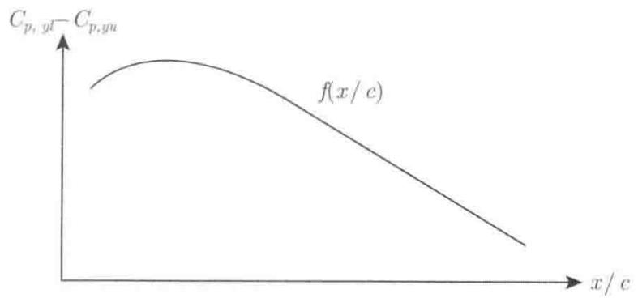

line

| x / c | f(x / c) |
|-------|----------|
| 0     | 0        |
| Peak  | High     |
| End   | Low      |

图 9-36 压力分布离散点拟合函数

将 Bladed 输出的剪力与 CFD 计算的剪力的差值归一化处理:

$$
C _ {p, y l} - C _ {p, y u} = f (x / c) + \frac {\Delta}{c _ {n} \frac {1}{2} \rho v _ {0} ^ {2} c} \tag {9-11}
$$

在翼型弦向整体积分得到弦向分布函数:

$$
\int_ {0} ^ {1} (C _ {p, y l} - C _ {p, y u}) \mathrm{d} \left(\frac {x}{c}\right) = \int_ {0} ^ {1} f (x / c) \mathrm{d} \left(\frac {x}{c}\right) + \Delta \tag {9-12}
$$

根据翼型 CFD 计算结果, 可以看出翼型弦向的压力分布近似为二次函数的分布, 如图 9-37 所示。根据翼型压力分布函数变化趋势, 假设弦向分布力函数 $q(t)$ 为二次函数, 如图 9-38 所示。

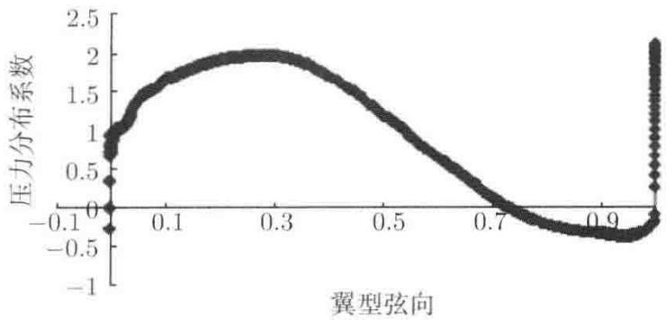

line

| 翼型弦向 | 压力分布系数 |
| -------- | ------------ |
| -0.1     | 0.0          |
| 0.0      | 0.5          |
| 0.1      | 1.5          |
| 0.3      | 2.0          |
| 0.5      | 1.5          |
| 0.7      | 0.5          |
| 0.9      | -0.5         |
| >0.9     | >2.0         |

图 9-37 翼型弦向压力分布函数图

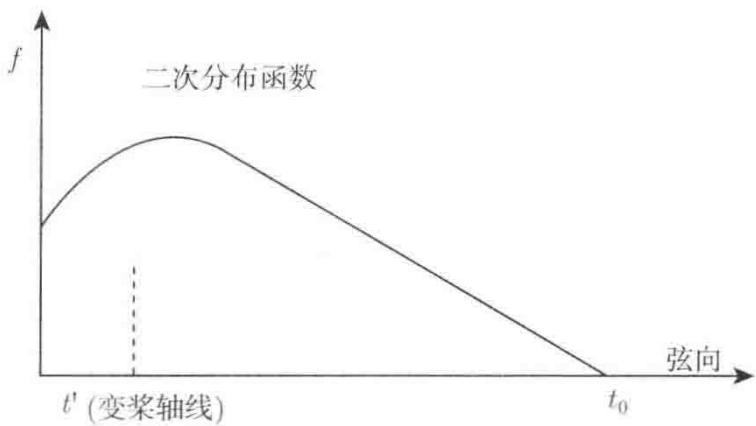

line

| 弦向 | f     |
| ---- | ----- |
| t' (变桨轴线) | 高点 |
| t₀   | 0     |

图 9-38 弦向二次分布函数分布图

二次函数 $q(t)$ 满足以下 3 个条件: $q(t)$ 沿弦向积分合力与翼型剪力平衡; $q(t)$ 沿弦向积分取弯矩与翼型剪力到前缘的弯矩平衡; $q(t)$ 沿弦向分布的边界条件为尾缘为 0。

$$
\left\{ \begin{array}{l} \int_ {0} ^ {c} q (t) \mathrm{d} t = f (l) \\ \int_ {0} ^ {c} q (t) t \mathrm{d} t = f (l) t ^ {\prime} \\ q \left(t _ {0}\right) = 0 \end{array} \right. \tag {9-13}
$$

通过计算可得翼型弦向分布力函数。

# 3. 分布力加载

根据叶片展向和弦向分布力函数表达式，在有限元模型中建场加载。场是 MSC. Nastran/Patran 中一个灵活、强大、易用的工具。场通过简单而直观的方法来定义和操作复杂的数据，表达复杂的变化。通过场可以定义多种多样的随时间、空间、材料属性等变化的标量场和矢量场。这里将风力机叶片受到的多工况下的载荷数据定义为空间场，所谓空间场描述的是一个数据组，它们在实数坐标空间或参数坐标空间中变化。空间场可能是 1D、2D 或者 3D 的。在实坐标空间，场可以在选定的直角坐标系、柱坐标系、球坐标系中变化。

选择最大挥舞弯矩极限载荷加载在有限元模型上, 通过建场函数, 将叶片各截面剪力 $(F_{xB}, F_{yB})$ 转化为沿叶片展向的分布力函数 $f(x), f(y)$ 和沿弦向的分布力函数 $q(t)$ , 以场加载的形式加载在模型表面; 将叶片离心力 $F_{zB}$ 以 total load 形式均匀分布在叶片各截面上。叶片加载和约束的结果如图 9-39 所示。

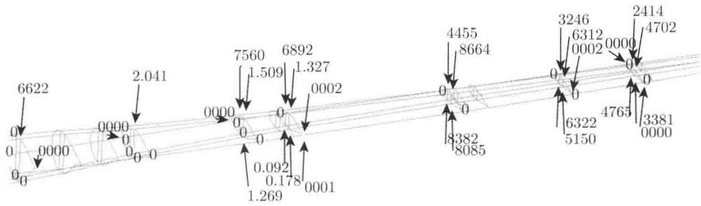

tree

| Node | Value |
|---|---|
| 6622 | 0 |
| 0000 | 0 |
| 0000 | 2.041 |
| 0000 | 0 |
| 0000 | 0 |
| 7560 | 1.509 |
| 6892 | 1.327 |
| 0002 | 0 |
| 0 | 0 |
| 0.092 | 0.178 |
| 1.269 | 0 |
| 4455 | 8664 |
| 8382 | 8085 |
| 3246 | 6312 |
| 6312 | 0002 |
| 0000 | 0 |
| 4765 | 5150 |
| 2414 | 4702 |
| 3381 | 0000 |
The image displays a hierarchical tree structure with multiple labeled nodes connected by arrows indicating hierarchical relationships or dependencies.

图 9-39 叶片场加载示意图

根据分布力加载的结果，提取叶片叶根的力和力矩，与 Bladed 输出的叶根力和力矩比较，误差结果见表 9-4。

表 9-4 分布力加载下叶根力和力矩误差

<table><tr><td>载荷比较</td><td> $F_{xB}/N$ </td><td> $F_{yB}/N$ </td><td> $F_{zB}/N$ </td><td> $M_{yB}/(N·m)$ </td><td> $M_{xB}/(N·m)$ </td><td> $M_{zB}/(N·m)$ </td></tr><tr><td>Bladed 输出叶根载荷</td><td> $1.23×10^5$ </td><td> $-1.49×10^4$ </td><td> $1.59×10^5$ </td><td> $1.87×10^6$ </td><td> $2.73×10^5$ </td><td> $5.66×10^3$ </td></tr><tr><td>分布力加载的叶根载荷</td><td> $1.27×10^5$ </td><td> $-1.44×10^4$ </td><td> $1.60×10^5$ </td><td> $1.90×10^6$ </td><td> $2.79×10^5$ </td><td> $-2.34×10^4$ </td></tr><tr><td>误差</td><td>3.25%</td><td>-3.36%</td><td>0.63%</td><td>1.60%</td><td>2.20%</td><td>-513.43%</td></tr></table>

分布力加载在有限元模型上，力的误差较小，分布力加载过程中，力矩是由分布力计算得到的。弯矩 $M_{yB}$ 、 $M_{xB}$ 的误差在 10% 以内，分布力加载的载荷大于 Bladed 输出的叶根载荷，故分布力计算的结果偏保守。分布力加载得到的扭矩 $M_{zB}$ ，由于力的作用点和翼型的压力中心不重合，由 x 和 y 方向的分布力产生附加扭矩 $M_{zB}$ ，而 Bladed 得到的扭矩，是由翼型俯仰力矩系数得到的，所以两者差别较大。

# 9.4.6 测试载荷加载形式

测试载荷应用包络载荷，考虑最大挥舞弯矩、最小挥舞弯矩、最大摆振弯矩和最小摆振弯矩。

# 1. 测试载荷转化

测试载荷需考虑坐标系、叶片安装角、测试安全系数与测试设备、加载位置等，叶片外载荷转化为测试载荷的流程如图 9-40 所示。

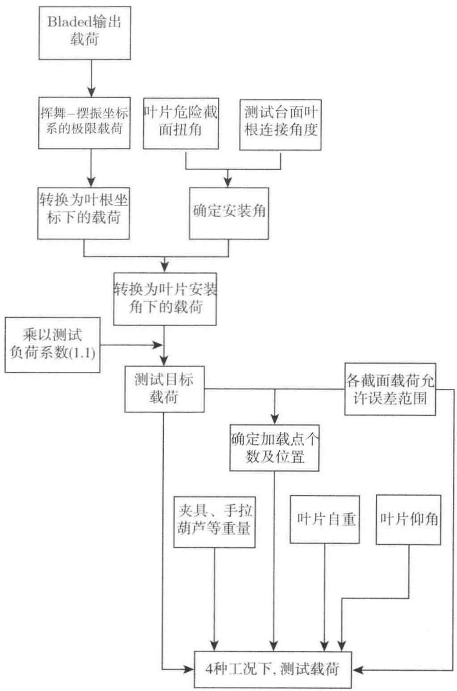

flowchart

```mermaid
graph TD
    A["Bladed输出载荷"] --> B["挥舞-摆振坐标系的极限载荷"]
    B --> C["转换为叶根坐标下的载荷"]
    D["叶片危险截面扭角"] --> E["确定安装角"]
    F["测试台面叶根连接角度"] --> E
    E --> G["转换为叶片安装角下的载荷"]
    G --> H["测试目标载荷"]
    H --> I["确定加载点个数及位置"]
    I --> J["夹具、手拉葫芦等重量"]
    I --> K["叶片自重"]
    I --> L["叶片仰角"]
    J --> M["4种工况下, 测试载荷"]
    K --> M
    L --> M
    M --> N["乘以测试负荷系数(1.1)"]
```

图 9-40 测试载荷流程

# 2. 测试载荷安全系数

Bladed 输出载荷转换为叶根坐标系下，考虑叶片安装角之后的最大挥舞弯矩、最小挥舞弯矩、最大摆振弯矩和最小摆振弯矩。