# 3. 考虑叶片安装角的设计载荷

考虑叶片安装角，调整设计载荷的作用方向。

# 4. 叶片测试载荷

根据 IEC/TS 61400，对于静态试验，叶片测试载荷与叶片设计载荷的关系为

$$
F _ {t \mathrm{arget-u}} = F _ {\mathrm{du}} \gamma_ {\mathrm{nu}} \gamma_ {\mathrm{su}} \tag {9-14}
$$

其中， $F_{t\arg\mathrm{et}-u}$ 是测试载荷； $F_{du}$ 为设计载荷； $\gamma_{nu}$ 是故障影响准因子； $\gamma_{su}$ 是叶片间振动准因子。

按照 IEC/TS 61400，对于静态试验，取叶片间振动准因子 $\gamma_{su} = 1.1$ 。考虑结构的重要性和事故影响的重要性，假设该静载测试取故障影响影子 $\gamma_{nu} = 1.0$ 。所以，将叶片的设计载荷转化为叶片的测试载荷。

叶片测试载荷为最大挥舞载荷、最小挥舞载荷、最大摆振载荷、最小摆振载荷。设计载荷考虑叶片自身重力的影响，同时考虑叶片仰角和叶片安装角的影响以及测试中夹具的重量。图 9-41 以最大挥舞测试载荷为例，100% 测试载荷时叶片各个截面的载荷对比。

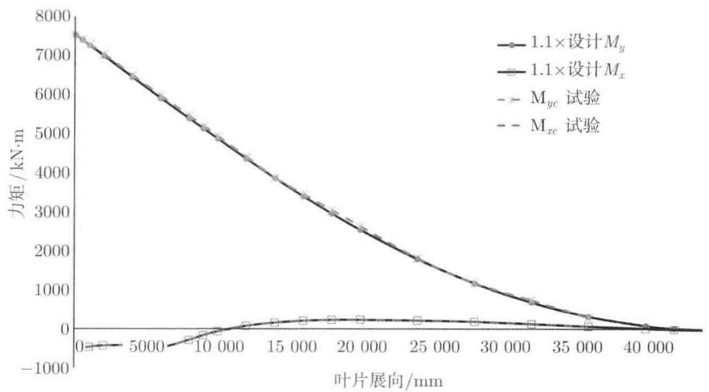

<details>
<summary>line</summary>

| 叶片展向/mm | 1.1×设计My (kN·m) | 1.1×设计Mx (kN·m) | Myc 试验 (kN·m) | Mxc 试验 (kN·m) |
| ----------- | ------------------ | ------------------ | --------------- | --------------- |
| 0           | 7500               | 7500               | -               | -               |
| 5000        | 6500               | 6500               | -               | -               |
| 10000       | 5500               | 5500               | -               | -               |
| 15000       | 4500               | 4500               | -               | -               |
| 20000       | 3500               | 3500               | -               | -               |
| 25000       | 2500               | 2500               | -               | -               |
| 30000       | 1500               | 1500               | -               | -               |
| 35000       | 500                | 500                | -               | -               |
| 40000       | 0                  | 0                  | -               | -               |
</details>

图 9-41 最大挥舞测试载荷对比

# 5. 测试载荷加载

叶片测试载荷加载，根据测试中实际夹具的大小，确定载荷加载作用范围，如图 9-42 所示。同时考虑叶片自重和各角度影响，在叶片测试的加载位置（如剪心）施加集中的设计载荷。一般情况下，不同叶片和测试机构对载荷加载的方案不同，有限元的测试载荷加载应按照叶片测试的方案，模拟真实的加载过程。

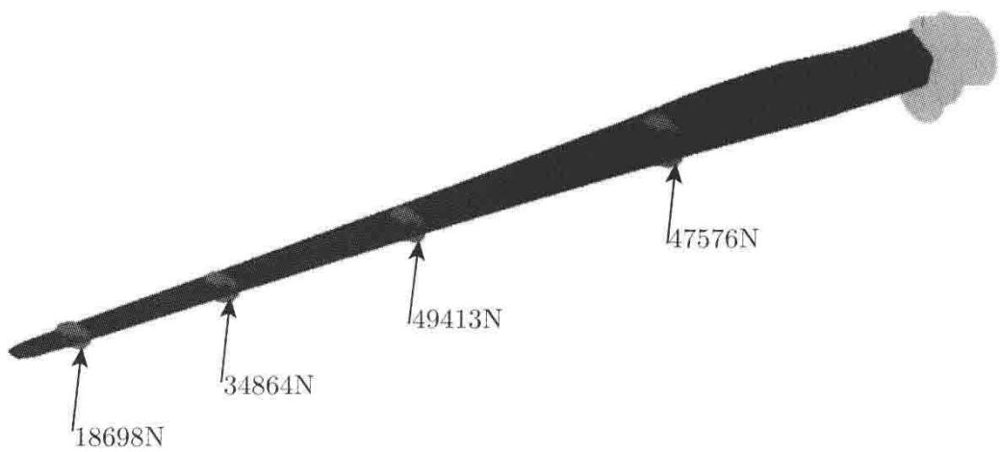

<details>
<summary>text_image</summary>

18698N
34864N
49413N
47576N
</details>

图 9-42 测试载荷加载示意图

# 9.4.7 重力载荷

考虑重力载荷的方向和安全系数，将重力载荷以重力场的形式作用于叶片重心位置，如图 9-43。

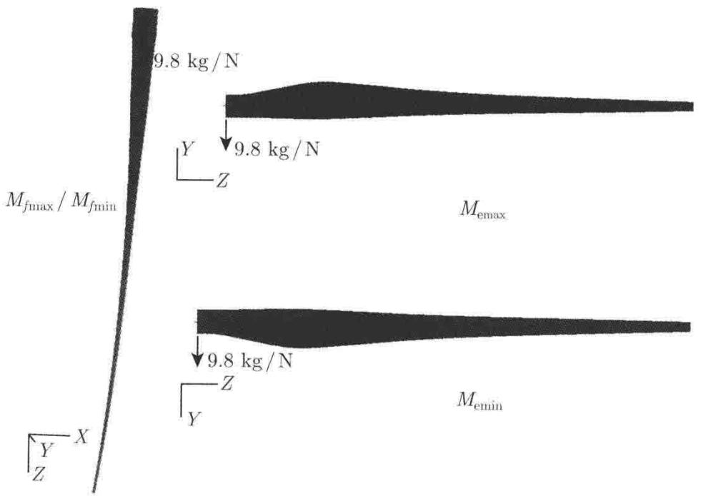

<details>
<summary>bar</summary>

| Moment | Maximum Moment (kg/N) | Minimum Moment (kg/N) |
|--------|------------------------|------------------------|
| M_fmax | 9.8                    | 9.8                    |
| M_emax | 9.8                    | 9.8                    |
| M_emin | 9.8                    | 9.8                    |
</details>

图 9-43 重力载荷

# 9.4.8 疲劳载荷

叶片疲劳载荷以疲劳载荷谱和时间历程曲线的形式用于叶片的疲劳分析，详见本书第 16 章，这里暂不做介绍。

同时，将在本书第 20 章详细阐述叶片全尺寸测试。

# 第10章 其他方法

叶片结构校核与分析中，除了有限元方法之外，工程界还通常使用 FOCUS 进行叶片的结构校核。在 FOCUS 软件进行叶片模型建立，并根据叶片的极限设计载荷，对叶片挠度、静强度和屈曲性能进行分析。本章节简述 FOCUS 软件设计叶片的流程和叶片数据库。

# 10.1 叶片建模流程

应用 FOCUS 软件进行叶片建模流程如图 10-1 所示。

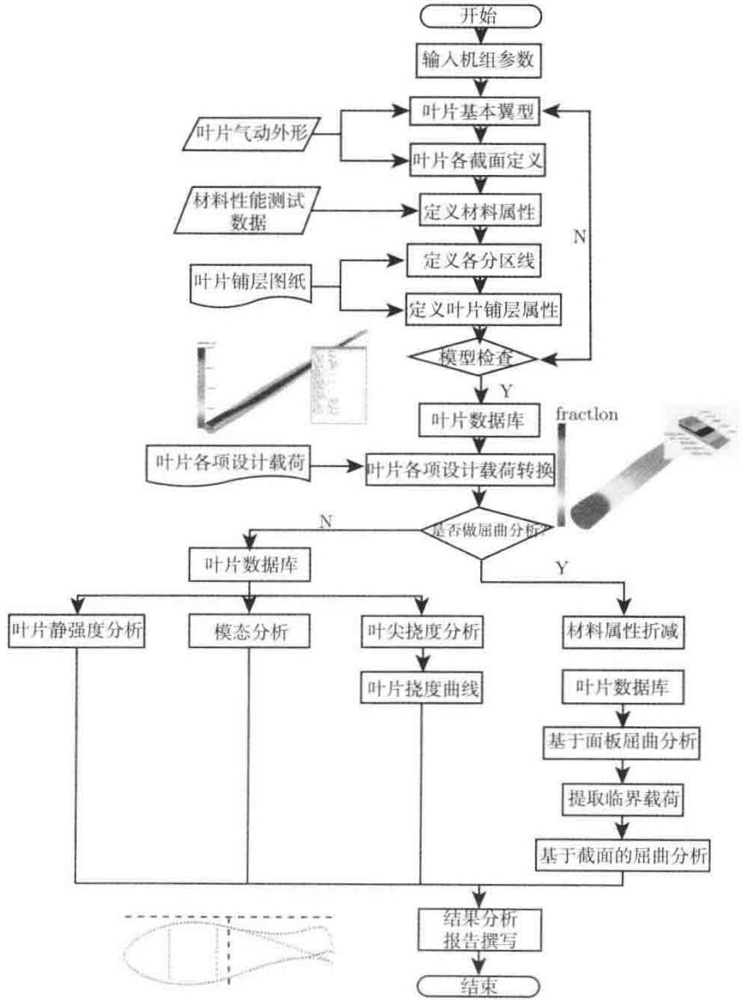

<details>
<summary>flowchart</summary>

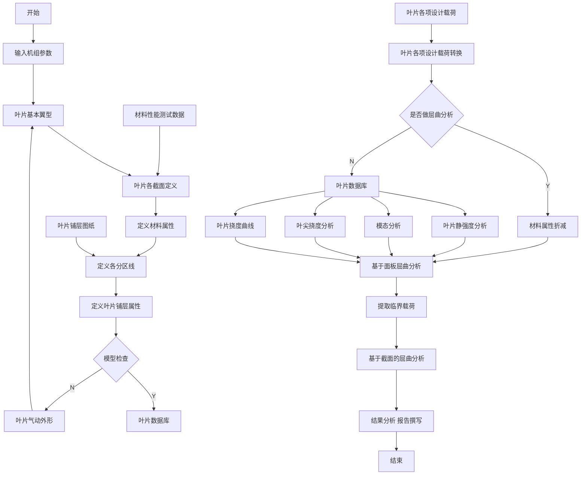
```mermaid
graph TD
    A["开始"] --> B["输入机组参数"]
    B --> C["叶片基本翼型"]
    C --> D["叶片各截面定义"]
    D --> E["定义材料属性"]
    E --> F["定义各分区线"]
    F --> G["定义叶片铺层属性"]
    G --> H{模型检查}
    H -->|Y| I["叶片数据库"]
    H -->|N| J["叶片气动外形"]
    J --> C
    K["材料性能测试数据"] --> D
    L["叶片铺层图纸"] --> F
    M["叶片各项设计载荷"] --> N["叶片各项设计载荷转换"]
    N --> O{是否做屈曲分析}
    O -->|Y| P["材料属性折减"]
    O -->|N| Q["叶片数据库"]
    P --> R["基于面板屈曲分析"]
    R --> S["提取临界载荷"]
    S --> T["基于截面的屈曲分析"]
    T --> U["结果分析 报告撰写"]
    U --> V["结束"]
    Q --> W["叶片静强度分析"]
    Q --> X["模态分析"]
    Q --> Y["叶尖挠度分析"]
    Q --> Z["叶片挠度曲线"]
    W --> R
    X --> R
    Y --> R
    Z --> R
```
</details>

图 10-1 FOCUS 软件叶片建模分析流程图

# 10.2 叶片数据库

FOCUS 建立叶片数据库包括气动性能、质量分布和结构特性，如图 10-2 和图 10-3 所示。

<table><tr><td>□nr</td><td>□Ip</td><td>□Iyy_Z*G</td><td>□Sxx</td><td>□alpha 2</td><td>□Reduct. ma...</td><td>□rdel_flat</td></tr><tr><td>□R. radius</td><td>□Ip*E</td><td>□Iyy_Z*Ro</td><td>□Sxx*E</td><td>□Mass</td><td>□phi_E</td><td>□rdel_cross</td></tr><tr><td>□Chord length</td><td>□Ip*G</td><td>□Ixy_Z</td><td>□Sxx*G</td><td>□Mass_C</td><td>□R. radius2</td><td>□Mass_GFRP45</td></tr><tr><td>□Chord thic...</td><td>□Ip*Ro</td><td>□Ixy_Z*E</td><td>□Sxx*Ro</td><td>□D-Mass</td><td>□Area*E2</td><td>□Mass_UD1150</td></tr><tr><td>□Chord ratio</td><td>□Ixx</td><td>□Ixy_Z*G</td><td>□Syy</td><td>□D-Mass_C</td><td>□Area*Ro2</td><td>□Mass_UD1280</td></tr><tr><td>□Chord angle</td><td>□Ixx*E</td><td>□Ixy_Z*Ro</td><td>□Syy*E</td><td>□Mass_per_L</td><td>□I1*E2</td><td>□Mass_UD128...</td></tr><tr><td>□X_chord/4</td><td>□Ixx*G</td><td>□EI_edge</td><td>□Syy*G</td><td>□Mass moment</td><td>□I2*E2</td><td>□Mass_Adhesive</td></tr><tr><td>□Y_chord/4</td><td>□Ixx*Ro</td><td>□EI_flat</td><td>□Syy*Ro</td><td>□Mass_C moment</td><td>□Phi_E2</td><td>□Mass_Balsa</td></tr><tr><td>□CL_TOT</td><td>□Iyy</td><td>□EI_cross</td><td>□Phi</td><td>□C_mass distr</td><td>Zx_E2</td><td>□Mass_pvc</td></tr><tr><td>□Wet_Area</td><td>□Iyy*E</td><td>□aero_centre</td><td>□Phi_E</td><td>□Mass momen...</td><td>Zy_E2</td><td>□Mass_Root</td></tr><tr><td>□Area</td><td>□Iyy*G</td><td>×cg</td><td>□Phi_G</td><td>□Wind moment</td><td>x_shi ft</td><td>□AreaRo_GFRP45</td></tr><tr><td>□Area*E</td><td>□Iyy*Ro</td><td>rdel</td><td>□Phi_Ro</td><td>□D-Chord angle</td><td>y_shi ft</td><td>□AreaRo_UD1150</td></tr><tr><td>□Area*G</td><td>□Ixy</td><td>Zx</td><td>□St</td><td>□Defl. mass I2</td><td>shear_centre</td><td>AreaRo_UD1280</td></tr><tr><td>□Area*Ro</td><td>□Ixy*E</td><td>Zx_E</td><td>□X_sc</td><td>□Reduct. ma...</td><td>aero_ctr_flat</td><td>AreaRo_UD1...</td></tr><tr><td>□I1</td><td>□Ixy*G</td><td>Zx_G</td><td>□Y_sc</td><td>□Defl. wind I2</td><td>aero_ctr_edge</td><td>AreaRo_Adh...</td></tr><tr><td>□I1*E</td><td>□Ixy*Ro</td><td>Zx_Ro</td><td>□☐_1</td><td>□Reduct. wi...</td><td>ctr_grav_flat</td><td>AreaRo_Balsa</td></tr><tr><td>□I1*G</td><td>□Ixx_Z</td><td>Cx_Ro</td><td>□☐_2</td><td>□Defl. mass I1</td><td>ctr_grav_edge</td><td>AreaRo_pvc</td></tr><tr><td>□I1*Ro</td><td>□Ixx_Z*E</td><td>Zy</td><td>X_sc torsion</td><td>□Reduct. ma...</td><td>el_ctr_flat</td><td>AreaRo_Root</td></tr><tr><td>□I2</td><td>□Ixx_Z*G</td><td>Zy_E</td><td>Y_sc torsion</td><td>□Defl. wind I1</td><td>el_ctr_edge</td><td>points</td></tr><tr><td>□I2*E</td><td>□Ixx_Z*Ro</td><td>Zy_G</td><td>X_sc shear</td><td>□Reduct. wi...</td><td>shear_ctr...</td><td></td></tr><tr><td>□I2*G</td><td>Iyy_Z</td><td>Zy_Ro</td><td>Y_sc shear</td><td colspan="2">Break moment □shear_ctr...</td><td></td></tr><tr><td>□I2*Ro</td><td>Iyy_Z*E</td><td>Cy_Ro</td><td colspan="3">alpha 1 □Reduct. ma... □rdel_edge</td><td></td></tr></table>

图 10-2 叶片数据库包含结果

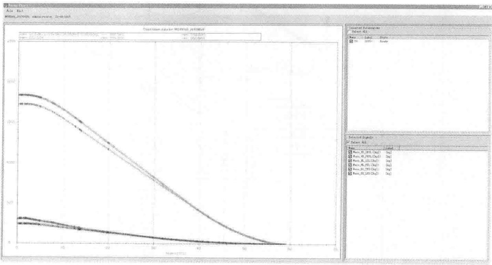

<details>
<summary>line</summary>

| Number of WIG | Count from data for WIG/Weig, wt 100% |
| ------------- | -------------------------------------- |
| 0             | ~2500                                  |
| 10            | ~2000                                  |
| 22            | ~1500                                  |
| 30            | ~1000                                  |
| 42            | ~500                                   |
| 50            | ~200                                   |
| 60            | ~50                                    |
</details>

图 10-3 叶片各材料质量统计

# 第四篇

# 叶片结构构件设计

# 第11章 基本校核分析

叶片基本校核包括叶片整体的静强度分析，刚度和挠度校核，振动特性分析与叶片整体屈曲分析。

# 11.1 叶片基本校核

叶片基本校核流程如图 11-1 所示。

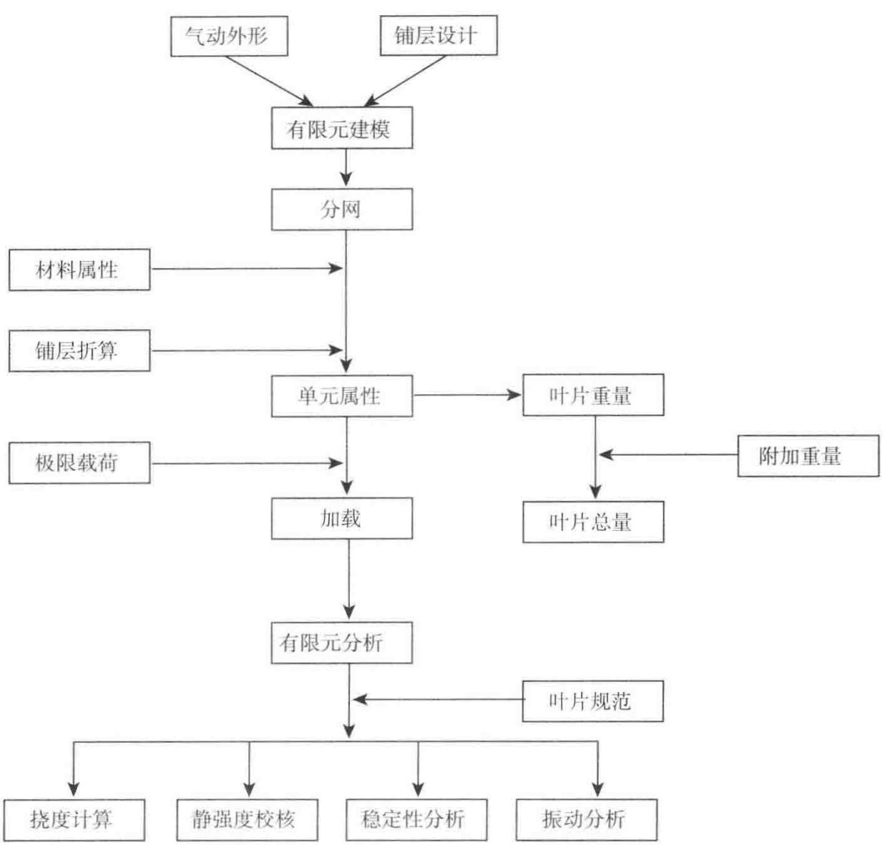

<details>
<summary>flowchart</summary>

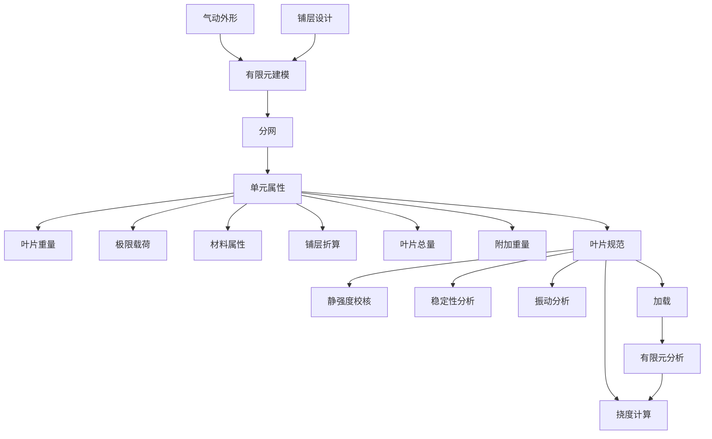
```mermaid
graph TD
    A["气动外形"] --> D["有限元建模"]
    B["铺层设计"] --> D
    D --> E["分网"]
    E --> F["单元属性"]
    F --> G["叶片重量"]
    F --> H["极限载荷"]
    F --> I["材料属性"]
    F --> J["铺层折算"]
    F --> K["叶片总量"]
    F --> L["附加重量"]
    F --> M["叶片规范"]
    M --> N["挠度计算"]
    M --> O["静强度校核"]
    M --> P["稳定性分析"]
    M --> Q["振动分析"]
    M --> R["加载"]
    R --> S["有限元分析"]
    S --> N
```
</details>

图 11-1 叶片结构基本校核流程

# 11.2 结构校核安全系数

不同的标准规定的结构校核安全系数的分类和原则也不同，本章节将分别介绍 GL 2010 和 DNV 的结构校核安全系数。

# 11.2.1 GL 2010 结构校核安全系数

GL 2010 的结构校核安全系数是由载荷局部安全系数 $\gamma_{f}$ 和材料局部安全系数 $\gamma_{Mx}$ 共同确定的 $^{[14]}$ 。

# 1. 载荷局部安全系数 $\gamma_{f}$

(1) 对于正常使用极限状态 $\gamma_{f}=1.0$ 。  
(2) 极限强度、失稳、失衡的载荷局部安全系数，参见表 11-1。

表 11-1 载荷局部安全系数

<table><tr><td rowspan="2">载荷来源</td><td colspan="3">不利载荷</td><td>有利载荷</td></tr><tr><td>正常和极端 (N)</td><td>非正常 (A)</td><td>运输和装配 (T)</td><td>所有设计工况</td></tr><tr><td>空气动力</td><td>1.35</td><td>1.1</td><td>1.5</td><td>0.9</td></tr><tr><td>运行</td><td>1.35</td><td>1.1</td><td>1.5</td><td>0.9</td></tr><tr><td>重力</td><td>1.1/1.35*</td><td>1.1</td><td>1.25</td><td>0.9</td></tr><tr><td>其他惯性力</td><td>1.25</td><td>1.1</td><td>1.3</td><td>0.9</td></tr><tr><td>热影响</td><td>1.35</td><td>—</td><td>—</td><td>—</td></tr></table>

(3) 疲劳分析， $\gamma_{f}=1.0$ 。  
(4) 地震作用， $\gamma_{f}=1.0$ 。

# 2. 材料局部安全系数 $\gamma_{Mx}$

GL 2010 规定的材料安全系数按照式 (11-1) 确定

$$
\gamma_ {M x} = \gamma_ {M 0} \prod_ {i} C _ {i x} \tag {11-1}
$$

其中， $\gamma_{M0}=1.35;C_{ix}$ 为温度影响，当层合板 $50^{\circ}C$ 时的剪切模量和弯曲模量不大于 $23^{\circ}C$ 的剪切模量和弯曲模量，则 $C_{ix}$ 的影响范围是 $-30\sim50^{\circ}C$ 。

# 1) 静强度分析

在叶片进行静强度分析时，需要考虑到材料特性的影响，应用如下的缩减系数。

对于所有分析，局部安全系数 $\gamma_{M0}$ 为

$$
\gamma_ {M 0} = 1. 3 5
$$

而其他缩减系数: ① $C_{1a}=1.35$ , 老化影响; ② $C_{2a}=1.1$ , 温度影响; ③ $C_{3a}=1.1$ , 用预浸料、弯曲技术、拉挤或树脂浇灌方法成型; (4) $C_{4a}=1.1$ , 非后固化成型。

因而，材料安全系数为

$$
\gamma_ {M a} = \gamma_ {M 0} \times C _ {1 a} \times C _ {2 a} \times C _ {3 a} \times C _ {4 a} = 1. 3 5 \times 1. 3 5 \times 1. 1 \times 1. 1 \times 1. 1 = 2. 4 2 6
$$

# 2) 胶接分析

进行结构胶胶接性能分析时, 需要考虑到材料特性的影响, 应用如下的缩减系数。

对于所有分析，局部安全系数 $\gamma_{M0}$ 为

$$
\gamma_ {M 0} = 1. 3 5
$$

而其他缩减系数: ① $C_{1d}=1.5$ , 老化影响; ② $C_{2d}=1.0$ , 温度影响; ③ $C_{3d}=1.1$ , 用预浸料、弯曲技术、拉挤或树脂浇灌方法成型; ④ $C_{4d}=1.1$ , 非后固化成型。

因而，材料安全系数等于

$$
\gamma_ {M d} = \gamma_ {M 0} \times C _ {1 d} \times C _ {2 d} \times C _ {3 d} \times C _ {4 d} = 1. 3 5 \times 1. 5 \times 1. 0 \times 1. 1 \times 1. 1 = 2. 4 5
$$

# 3) 稳定性分析

在叶片进行线性稳定性分析时，需要考虑到材料特性的影响，应用如下的缩减系数。

对于所有分析，局部安全系数 $\gamma_{M0}$ 为

$$
\gamma_ {M 0} = 1. 3 5
$$

而其他缩减系数：① $C_{1c}=1.1$ ，适于模量离散；② $C_{2c}=1.1$ ，温度影响（参见GL 2010-5.5.4(15)）；③ $C_{3c}=1.25$ ，线性计算。

因而，稳定性分析的材料局部安全系数等于

$$
\gamma_ {M c} = \gamma_ {M 0} \times C _ {1 c} \times C _ {2 c} \times C _ {3 c} = 1. 3 5 \times 1. 1 \times 1. 1 \times 1. 2 5 = 2. 0 4
$$

# 4) 疲劳分析

在叶片进行疲劳性能分析时，需要考虑到材料特性的影响，应用如下的缩减系数。

对于所有分析，局部安全系数 $\gamma_{M0}$ 为

$$
\gamma_ {M 0} = 1. 3 5
$$

而其他缩减系数: ① $C_{1b}=N^{1/10}=5.012$ ，对应于载荷循环次数 N 和斜率参数 m 的高周疲劳强度曲线；针对环氧树脂基体层板，m=10， $N=10^{7}$ 。② $C_{2b}=1.1$ ，温度影响。③ $C_{3b}=1.0$ ，单向增强制品； $C_{3b}=1.1$ ，非编织纤维和单向编织粗砂； $C_{3b}=1.2$ ，编织纤维和毡。④ $C_{4b}=1.1$ ，非后固化成型。⑤ $C_{5b}=1.0$ ，叶片后缘的局部安全系数，针对摆振方向的动态叶片试验； $C_{5b}=1.1$ ，叶片后缘的局部安全系数，针有限元方法； $C_{5b}=1.2$ ，叶片后缘的局部安全系数，根据伯努利理论计算； $C_{5b}=1.0$ 其他位置。

因而，单向增强制品的有限元方法的尾缘疲劳分析的材料局部安全系数等于

$$
\gamma_ {M b} = \gamma_ {M 0} \times C _ {1 b} \times C _ {2 b} \times C _ {3 b} \times C _ {4 b} \times C _ {5 b} = 1. 3 5 \times 5. 0 1 2 \times 1. 1 \times 1. 0 \times 1. 1 \times 1. 1 = 9. 0 0 6
$$

# 11.2.2 DNV 结构校核安全系数

DNV 的结构校核安全系数是由载荷安全系数 $\gamma_{f}$ 、失效安全系数 $\gamma_{n}$ 和材料安全系数 $\gamma_{m}$ 共同确定的 $^{[23]}$ 。

# 1. 载荷安全系数

表 11-2 为载荷安全系数表。

表 11-2 载荷安全系数 ${\gamma }_{f}$ 

<table><tr><td colspan="3">不利载荷</td><td>有利载荷</td></tr><tr><td>正常的</td><td>异常的</td><td>运输和安装</td><td>所有设计工况</td></tr><tr><td>1.35*</td><td>1.1</td><td>1.5</td><td>0.9</td></tr></table>

\* 如果载荷由外推法得到，那么 1.35 可以降为 1.25。

# 2. 失效安全系数

表 11-3 为失效安全系数表。

表 11-3 失效安全系数 ${\gamma }_{n}$ 

<table><tr><td colspan="2">极限状态</td></tr><tr><td>ULS 和净空</td><td>FLS</td></tr><tr><td>1</td><td>1.15</td></tr></table>

表 11-3 中, ULS 为最大极限状态; FLS 为疲劳极限状态

# 3. 材料安全系数

材料局部安全系数针对 FRP、层合木和胶黏剂，见表 11-4。

表 11-4 材料安全系数

<table><tr><td>描述</td><td>因子</td><td>ULS</td><td>FLS</td></tr><tr><td>材料的基础材质因子</td><td> $\gamma_{m_1}$ </td><td>1.3</td><td>1.2</td></tr><tr><td>如果强度数据参考97.5%可靠性代替95%的修正系数</td><td> $\gamma_{m_2}$ </td><td>0.95</td><td>0.95</td></tr><tr><td>交变载荷/低周期疲劳下的强度衰减因子</td><td> $\gamma_{m3}$ </td><td>1.1</td><td>-</td></tr><tr><td>尺寸效应、温度、老化的强度衰减因子和 UV 辐射和湿度的退化</td><td></td><td></td><td></td></tr><tr><td>— 环氧树脂体系</td><td></td><td>1.1</td><td></td></tr><tr><td>— 聚酯、乙烯基酯树脂体系</td><td> $\gamma_{m4}$ </td><td>1.2</td><td></td></tr><tr><td>— 木与环氧 FRP</td><td></td><td>1.1</td><td></td></tr><tr><td>材料选型和制造方法的强度衰减因子</td><td></td><td></td><td></td></tr><tr><td>纤维增强热树脂</td><td></td><td>1.0</td><td></td></tr><tr><td>— 预浸料或树脂灌输单向带-连续铺层且无厚度突变,制造工艺无褶皱</td><td></td><td>1.1</td><td></td></tr><tr><td>— 预浸料或树脂灌输主要与单向带,包括厚度突变</td><td></td><td>1.2</td><td></td></tr><tr><td>— 任意方向毡和 (或) 手糊工艺</td><td></td><td></td><td></td></tr><tr><td>层合木,厚度方向很多薄木</td><td></td><td></td><td></td></tr><tr><td>— 多于 11 层薄木</td><td></td><td>1.0</td><td></td></tr><tr><td>—6 层薄木</td><td></td><td>1.1</td><td></td></tr><tr><td>—4 层薄木</td><td> $\gamma_{m5}$ </td><td>1.2</td><td></td></tr><tr><td>—3 层薄木或更少</td><td></td><td>1.3</td><td></td></tr><tr><td>其他中薄木层数用内插法得到</td><td></td><td></td><td></td></tr><tr><td>夹芯材料</td><td></td><td></td><td></td></tr><tr><td>— 塑性聚合泡沫,设计为屈服 (PVC)</td><td></td><td>1.0</td><td></td></tr><tr><td>— 脆性聚合泡沫,设计为破裂 (PMI)</td><td></td><td>1.1</td><td></td></tr><tr><td>—Balsa</td><td></td><td>1.3</td><td></td></tr><tr><td>胶接连接</td><td></td><td>1.3</td><td></td></tr><tr><td>— 糊状胶黏剂</td><td></td><td></td><td></td></tr><tr><td>后固化的强度衰减因子</td><td></td><td></td><td></td></tr><tr><td>— 按照 DSC 或设备控制后固化</td><td></td><td>1.0</td><td></td></tr><tr><td>— 无控制的后固化</td><td> $r_{m6}$ </td><td>1.05</td><td></td></tr><tr><td>— 仅放热固化</td><td></td><td>1.1</td><td></td></tr></table>

# 11.3 强度校核

叶片有限元极限强度分析，即在极限载荷与重力载荷作用下，叶片的整体静强度、刚度和叶尖挠度的校核与分析，验证极限强度是否满足强度失效准则与初始净空要求。

# 11.3.1 失效准则

复合材料的失效判定准则较多，包括最大应变失效准则、最大应力失效准则、Tsai-Hill 失效准则、Norris 失效准则、Hoffmann 失效准则、Tsai-Wu 失效准则等。叶片有限元整体极限强度校核，主要分析不同铺设角度的 $0^{\circ}$ 单层布的失效。如主梁、尾缘梁的各层 $0^{\circ}$ 单层布，蒙皮与叶根加强层的 $+45^{\circ}/-45^{\circ}$ 单层布等。另外，由于叶片芯材 Balsa 木的单方向特性明显优于其他两个方向，也可作为正交各向异性材料判断失效。

# 1. 正交各向异性复合材料失效判断

2d 正交各向异性材料失效判断，常采用 Tsai-Hill 失效准则，根据失效准则与材料强度许用值，在 MSC 的 Laminate Modeler 模块中，确定材料失效因子和失效安全系数。

Tsai-Hill 失效准则的计算公式:

$$
\mathrm{FI} = \frac {\sigma_ {1} ^ {2}}{X ^ {2}} - \frac {\sigma_ {1} \sigma_ {2}}{X ^ {2}} + \frac {\sigma_ {2} ^ {2}}{Y ^ {2}} + \frac {\tau_ {1 2} ^ {2}}{S ^ {2}} \tag {11-2}
$$

3d 正交各向异性材料失效判断，可使用三方向 Tsai-Hill 失效准则:

$$
\begin{array}{l} \mathrm{FI} = (G + H) \sigma_ {1} ^ {2} + (F + H) \sigma_ {2} ^ {2} + (F + G) \sigma_ {3} ^ {2} - 2 H \sigma_ {1} \sigma_ {2} - 2 G \sigma_ {1} \sigma_ {3} - 2 F \sigma_ {2} \sigma_ {3} \\ + 2 L \tau_ {2 3} ^ {2} + 2 M \tau_ {3 1} ^ {2} + 2 N \tau_ {1 2} ^ {2} \\ \end{array}
$$

式中

$$
H = \left(\frac {1}{X ^ {2}} + \frac {1}{Y ^ {2}} - \frac {1}{Z ^ {2}}\right) / 2; \quad G = \left(\frac {1}{X ^ {2}} - \frac {1}{Y ^ {2}} + \frac {1}{Z ^ {2}}\right) / 2
$$

$$
F = \left(- \frac {1}{X ^ {2}} + \frac {1}{Y ^ {2}} + \frac {1}{Z ^ {2}}\right) / 2; L = \frac {1}{2 S _ {Y Z} ^ {2}}
$$

$$
M = \frac {1}{2 S _ {Z X} ^ {2}}; \quad N = \frac {1}{2 S _ {X Y} ^ {2}}
$$

# 2. 各向同性复合材料失效判断

叶片复合材料铺层中，芯材 PVC 与树脂可作为各向同性材料。各向同性材料的失效准则通常选用 von Mises 屈服准则。由于树脂受力特性的特点，也可选用面内剪切失效的判断准则。

von Mises 屈服准则可用于评估屈服载荷下各向同性材料，如 FRP 层合板典型的各向同性材料为树脂。von Mises 屈服准则为

$$
\sqrt {(\sigma_ {1} - \sigma_ {2}) ^ {2} + (\sigma_ {2} - \sigma_ {3}) ^ {2} + (\sigma_ {3} - \sigma_ {1}) ^ {2}} <   \sigma_ {y} \tag {11-3}
$$

其中， $\sigma_{n}$ 为主应力，设计载荷对应的 n=1,2,3； $\sigma_{y}$ 为材料屈服应力的设计值。

树脂面内剪切失效模式可应用面内剪切应力 $\tau_{12}$ 。对于简化的 2D 面内剪切，设计准则归纳为

$$
\tau_ {1 2} <   \widehat {\tau} _ {1 2} ^ {\text {matrix}} \tag {11-4}
$$

其中， $\tau_{12}$ 为面内剪切应力； $\hat{\tau}_{12}^{matrix}$ 为树脂面内剪切应力设计值。

# 11.3.2 整体极限强度校核

极限强度校核主要考虑叶片壳体不同铺设方向的 $0^{\circ}$ 单层布、芯材、结构胶黏剂和腹板蒙皮的强度特性，根据不同的材料特性选择不同的失效判断准则进行叶片各构件强度校核。

单层/层合板中的第一根玻纤破坏则定义为纤维失效。纤维强度或者应变失效主要是基于单层或者层合板的测试结果。而在静态测试中，单层布/层合板的失效的定义是单层布/层合板中的纤维断裂。

考虑了结构校核安全系数后，材料的失效安全系数 $= 1$ /失效因子。图11-2给出叶片蒙皮的应力云图。

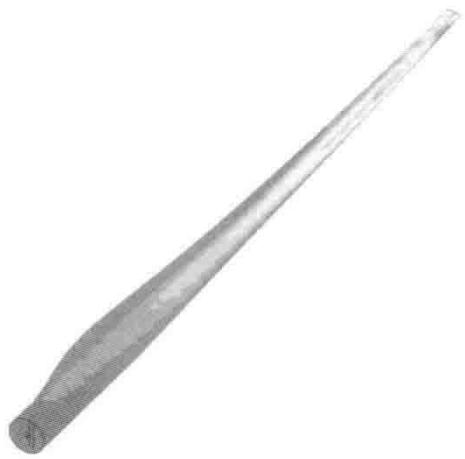

<details>
<summary>natural_image</summary>

Metal rod with tapered tip, no visible text or markings
</details>

图 11-2 叶片应力云图

# 11.3.3 吊装工况强度校核

在叶片的运输和吊装过程中，叶片吊装部位会安装上夹具、吊装带之类的，如果不加以保护，叶片会受到一定程度的损坏，因此，叶片设计过程中，在运输加强层处加上绑带宽度的吊装载荷。图 11-3 为有限元模型中，运输加强层网格情况和材料的分布情况。

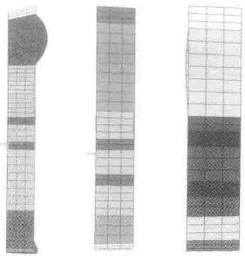

<details>
<summary>natural_image</summary>

Three vertical panels showing layered geological strata with varying textures and patterns (no text or symbols)
</details>

图11-3 运输加强层的网格划分和材料分布

模拟实际吊装情况，在有限元软件中建立水平吊装和倾斜一定角度下（如 $30^{\circ}$ ）

吊装的情况。在叶片上方建立一个节点（全自由度约束），通过此节点建立多个杆单元与叶片 P 面的节点相连接，以模拟吊装情况。叶片加载约束情况如图 11-4 所示。

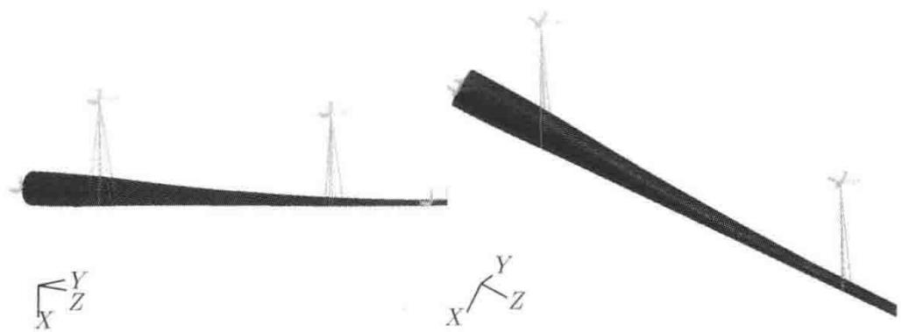

<details>
<summary>natural_image</summary>

Three 3D structural diagrams showing different beam configurations with X, Y, Z coordinate axes labeled (no text or symbols beyond axis labels)
</details>

图 11-4 水平吊装和倾斜 $30^{\circ}$ 吊装的模型建立

在有限元计算时，为避免出现叶片约束不够的情况，在叶片前、尾缘处，建立4个弹簧元单元，设定其弹簧刚度常数为1(避免弹簧元刚度影响叶片的受力情况)，弹簧元位置以及约束情况如图11-5所示。

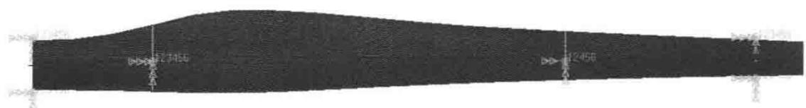

<details>
<summary>area</summary>

| Position | Value |
| -------- | ----- |
| Left     | 12456 |
| Middle   | 12456 |
</details>

图 11-5 模型辅助弹簧元模型

# 1. 加载校核

在有限元中进行静强度计算，从结果提取出杆单元上面的拉力信息，并与叶片自重进行比较，得到水平吊装和倾斜 $30^{\circ}$ 吊装时误差分别为 $1.11\%$ 和 $1.52\%$ ，见表11-5，因而可以认为该分析能够模拟真实情况。

表 11-5 杆单元拉力总和与叶片重力的比较

<table><tr><td colspan="2">水平吊装</td><td colspan="2">倾斜30°吊装</td></tr><tr><td>杆单元编号</td><td>拉力/N</td><td>杆单元编号</td><td>拉力/N</td></tr><tr><td>38039</td><td>3275.589</td><td>38055</td><td>5216.284</td></tr><tr><td>38040</td><td>1917.129</td><td>38056</td><td>5292.853</td></tr><tr><td>38041</td><td>2915.69</td><td>38057</td><td>4121.54</td></tr><tr><td>38042</td><td>2519.363</td><td>38058</td><td>4037.894</td></tr><tr><td>38055</td><td>2093.653</td><td>38059</td><td>1994.842</td></tr><tr><td>38056</td><td>2637.76</td><td>38060</td><td>1814.921</td></tr><tr><td>38057</td><td>2505.828</td><td>38061</td><td>826.6034</td></tr><tr><td>38058</td><td>2417.607</td><td>38062</td><td>679.2391</td></tr><tr><td>38059</td><td>2475.342</td><td>38063</td><td>422.7888</td></tr><tr><td>38060</td><td>1838.706</td><td>38064</td><td>355.1039</td></tr><tr><td>38061</td><td>1859.198</td><td>38065</td><td>1062.164</td></tr><tr><td>38062</td><td>1134.814</td><td>38066</td><td>4376.944</td></tr><tr><td>38063</td><td>2310.033</td><td>38067</td><td>3158.556</td></tr><tr><td>38064</td><td>4345.039</td><td>38068</td><td>4441.556</td></tr><tr><td>38065</td><td>5162.692</td><td>38069</td><td>4388.313</td></tr><tr><td>38066</td><td>5019.805</td><td>38070</td><td>4133.918</td></tr><tr><td>38067</td><td>4560.015</td><td>38071</td><td>3558.917</td></tr><tr><td>38068</td><td>4339.091</td><td>38072</td><td>3365.631</td></tr><tr><td>38069</td><td>2914.434</td><td>38073</td><td>2730.023</td></tr><tr><td>38070</td><td>2052.111</td><td>38074</td><td>2550.783</td></tr><tr><td>力的总和</td><td>58293.9</td><td>力的总和</td><td>58528.87</td></tr><tr><td>叶片自重</td><td>57653.4</td><td>叶片自重</td><td>57653.4</td></tr><tr><td>误差</td><td>1.11%</td><td>误差</td><td>1.52%</td></tr></table>

# 2. 计算与分析

根据吊装静强度计算结果, 提取叶片外蒙皮 $+45^{\circ}$ 玻纤、主梁铺层的应力结果。叶片外蒙皮 $+45^{\circ}$ 玻纤布的铺层方向为 $+45^{\circ}$ , 此时应该将 $X, Y$ 方向的应力转化为纤维方向的应力, 与 $0^{\circ}$ 玻纤布的强度比较, 不同吊装角度的叶片外蒙皮的应力云图如图 11-6 所示。图 11-7 为不同吊装角度的叶片主梁的应力云图。

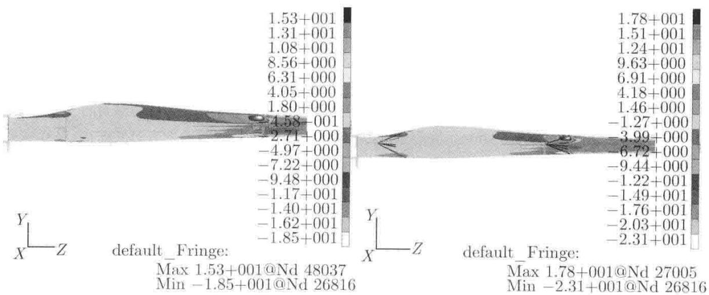  
图 11-6 $0^{\circ}$ 和 $30^{\circ}$ 吊装, 外蒙皮 $+45^{\circ}$ 玻纤布的 X 方向应力分布情况

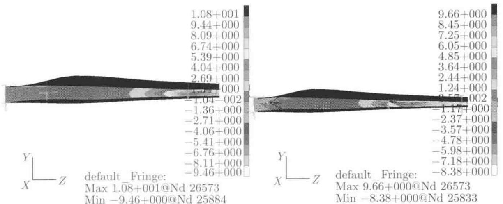

<details>
<summary>heatmap</summary>

| X | Y | Value |
| --- | --- | --- |
| 1.08+001 | 1.08+001 | 1.08+001 |
| 1.08+001 | 9.44+000 | 9.44+000 |
| 1.08+001 | 8.09+000 | 8.09+000 |
| 1.08+001 | 6.74+000 | 6.74+000 |
| 1.08+001 | 5.39+000 | 5.39+000 |
| 1.08+001 | 4.04+000 | 4.04+000 |
| 1.08+001 | 2.69+000 | 2.69+000 |
| 1.08+001 | -1.54+002 | -1.54+002 |
| -1.54+002 | -1.36+000 | -1.36+000 |
| -1.36+000 | -2.71+000 | -2.71+000 |
| -1.36+000 | -4.06+000 | -4.06+000 |
| -1.36+000 | -5.41+000 | -5.41+000 |
| -1.36+000 | -6.76+000 | -6.76+000 |
| -1.36+000 | -8.11+000 | -8.11+000 |
| -1.36+002 | -9.46+002 | -9.46+002 |
| 9.66+001 | 9.66+001 | 9.66+001 |
| 8.45+001 | 8.45+001 | 8.45+001 |
| 7.25+001 | 7.25+001 | 7.25+001 |
| 6.05+001 | 6.05+001 | 6.05+001 |
| 4.85+001 | 4.85+001 | 4.85+001 |
| 3.64+001 | 3.64+001 | 3.64+001 |
| 2.44+001 | 2.44+001 | 2.44+001 |
| 1.24+002 | 1.24+02 | 1.24+2 |
| -3.57+2 | -3.57+2 | -3.57+2 |
| -2.37+2 | -2.37+2 | -2.37+2 |
| -3.57+2 | -3.57+2 | -3.57+2 |
| -4.78+2 | -4.78+2 | -4.78+2 |
| -5.98+2 | -5.98+2 | -5.98+2 |
| -7.18+2 | -7.18+2 | -7.18+2 |
| -8.38+2 | -8.38+2 | -8.38+2 |
default Fringe: Max 1.58±2nd Nd 26573 Min -9.46±2nd Nd 25884 default Fringe: Max 9.66±2nd Nd 26573 Min -8.38±2nd Nd 25833 default Fringe: Max 9.66±2nd Nd 26573 Min -8.38±2nd Nd 25833 default Fringe: Max 9.66±2nd Nd 26573 Min -8.38±2nd Nd 25833 default Fringe: Max 9.66±2nd Nd 26573 Min -8.38±3rd Nd 25833 default Fringe: Max 9.66±2nd Nd 26573 Min -9.46±2nd Nd 25884 default Fringe: Max 9.66±2nd Nd 26573 Min -8.38±2nd Nd 25833 default Fringe: Max 9.66±2nd Nd 26573 Min -8.38±3rd Nd 25833 default Fringe: Max 9.66±2nd Nd 26573 Min -8.38±3rd Nd 25833 default Fringe: Max 9.66±2nd Nd 26573 Min -8.38±3rd Nd 25833 default Fringe: Max 9.66±2nd Nd 26573 min -9.46±2nd Nd 25884 min -9.46±2nd Nd 25833 min -9.46±2nd Nd 25833 min -9.46±2nd Nd 25833 min -9.46±2nd Nd 25833 min -9.46±2nd Nd 25833 min -9.46±2nd Nd 25833 min -9.46±2nd Nd 25833 min -9,46±2nd Nd 25833 min -9,46±2nd Nd 25833 min -9,46±2nd Nd 25833 min -9,46±2nd Nd 25833 min -9,46±2nd Nd 25833 min -9,46±2nd Nd 25833 min -9,46±<nl>
</details>

图 11-7 $0^{\circ}$ 和 $30^{\circ}$ 吊装, 主复合层 UD 的 X 方向应力分布情况

# 11.4 刚度校核

风力发电机运行时，叶片受到极限载荷的作用，发生柔性变形。为避免叶尖与塔架发生干涉，参照相关的国际和国家风力发电机组规范[14]，以保证与叶和塔架不会发生干涉，确保风力发电机能够正常运转。挠度分析是风力机典型刚度模型的分析，包括轮毂刚度、变桨轴承刚度以及其他相关组件的刚度。

# 11.4.1 挠度分析规范

1. GL 2010 的叶尖变形量规定 $^{[14]}$

<table><tr><td colspan="2">GL 2010</td></tr><tr><td>To ensure maintenance of a minimum clearance between the rotor blades and other parts of the plant, a deformation analysis shall be performed in the serviceability limit state. If the analysis is performed by static means, a minimum clearance of 50% shall be verified for all load cases with the rotor turning, and 5% for load cases with the rotor standing still, in relation to the clearance in the unloaded state.If the deformation analysis is performed by dynamic and aeroelastic means, at no time may the clearance be less than the minimum of 30% for the rotor turning.</td><td>为了确保风轮叶片和其他设备部件之间的最小间隙,应在使用极限状态下进行变形分析。如用静态方法分析,风轮旋转时,在所有载荷情况下,叶片和其他部件之间的最小间隙应不小于结构未变形时的50%;风轮静止时,在所有载荷情况下,叶片和其他部件之间的最小间隙应不小于结构未变形时的5%;如由动态和气动弹性方法进行变形分析,在风轮旋转的所有时间内,应保持的最小间隙不小于结构未变形时的30%。</td></tr></table>

# 2. DNV 的挠度计算 $^{[10]}$

叶片挠度应保证小于规定的上限，避免叶片打塔。叶片挠度的设计准则规定如下：

$$
D _ {d} (\gamma_ {f} F _ {k}) \leqslant \frac {D _ {i}}{\gamma_ {n} \gamma_ {m}} \tag {11-5}
$$

其中， $F_{k}$ 为载荷特征值； $D_{d}$ 为经过塔架时叶尖最大挠度； $D_{i}$ 为叶尖到塔架的最小距离； $\gamma_{f}$ 为载荷因子； $\gamma_{m}$ 为材料刚度安全系数； $\gamma_{n}$ 为失效安全系数。

挠度分析时， $\gamma_{m} = 1.1$ ，如确保叶片制造的刚度精度等同于测试叶片的刚度，通过全尺寸试验验证过，则 $\gamma_{m} = 1.0$ 。

# 11.4.2 刚度分布

叶片挥舞刚度、摆振刚度、扭转刚度为叶片的固有特性，影响叶片的整体变形、固有频率、振型和气弹等性能。较好的刚度特性，不但可以降低叶片的挠度，而且可有效控制叶片的气弹响应。叶片的刚度分布，如图 11-8 所示，随着叶片展向距离的增加，挥舞和摆振刚度逐渐减小。在叶根处叶片的刚度最大，在叶尖处叶片的挥舞和摆振刚度同时达到了最小值。由于叶片弦向分布的特性，摆振刚度在最大弦长附件会出现局部极大值。极限载荷工况下，叶尖挠度的计算采用载荷特征值，刚度性能取材料刚度平均值。

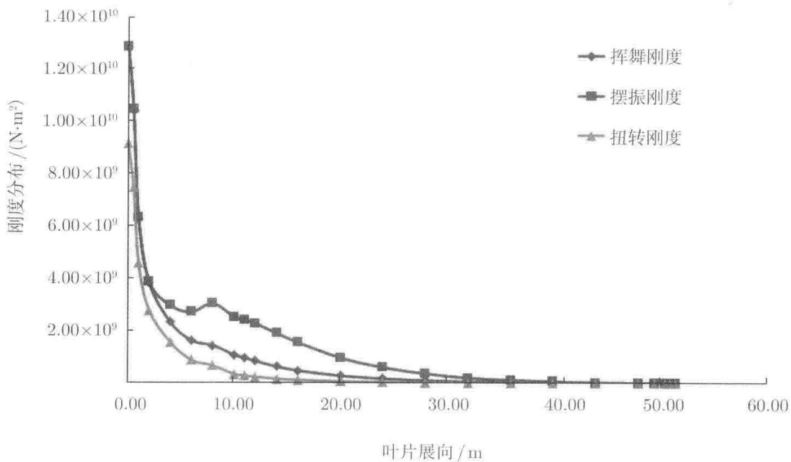

<details>
<summary>line</summary>

| 叶片展向 /m | 挥舞刚度 (N·m²) | 摆振刚度 (N·m²) | 扭转刚度 (N·m²) |
| ----------- | --------------- | --------------- | --------------- |
| 0.00        | 1.35×10¹⁰       | 1.30×10¹⁰       | 9.0×10⁹         |
| 5.00        | 4.00×10⁹        | 6.00×10⁹        | 3.00×10⁹        |
| 10.00       | 2.50×10⁹        | 3.00×10⁹        | 1.50×10⁹        |
| 15.00       | 1.80×10⁹        | 2.50×10⁹        | 1.00×10⁹        |
| 20.00       | 1.20×10⁹        | 2.00×10⁹        | 7.0×10⁸         |
| 25.00       | 8.0×10⁸         | 1.50×10⁹        | 5.0×10⁸         |
| 30.00       | 5.0×10⁸         | 1.0×10⁹         | 3.5×10⁸         |
| 35.00       | 3.5×10⁸         | 7.5×10⁸         | 2.5×10⁸         |
| 40.00       | 2.5×10⁸         | 5.5×10⁸         | 2.0×10⁸         |
| 45.00       | 2.0×10⁸         | 4.5×10⁸         | 1.5×10⁸         |
| 50.00       | 1.5×10⁸         | 4.0×10⁸         | 1.2×10⁸         |
| 55.00       | 1.2×10⁸         | 3.5×10⁸         | 1.0×10⁸         |
| 60.00       | 1.0×10⁸         | 3.0×10⁸         | 8.0×10⁷         |
</details>

图11-8 叶片刚度分布

# 11.4.3 叶尖挠度

叶尖挠度的许用值与初始净空密切相关，避免叶片打塔，应合理控制叶片叶尖变形量。图 11-9 给出初始净空和叶尖变形量的示意图。

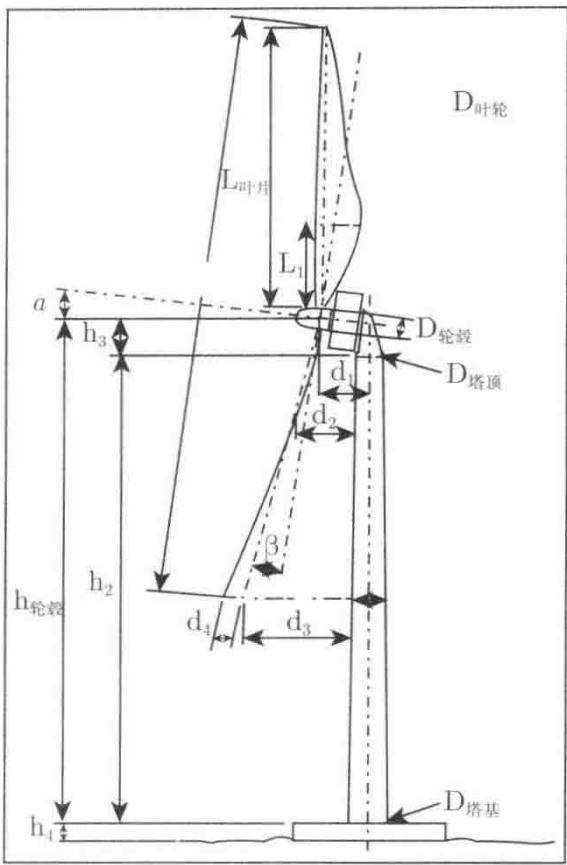

<details>
<summary>text_image</summary>

D叶轮
L叶片
L1
a
h3
d1
D轮毂
D塔顶
d2
β
h轮毂
h2
d4
d3
D塔基
h1
</details>

图 11-9 叶片初始净空与叶尖挠度

# 11.5 振动特性分析

设计风力机时，必须对叶片进行动力特性分析，以便排除叶片各阶固有频率与那些能引起很大交变应力的激振力谐波发生共振。在旋转中，本书认为作用在叶片上的空气动力的谐波分量，直至第八阶谐波，数值都比较大。八阶以上的谐波分量，数值较小，可以不必考虑。在额定转速时，如果叶片固有频率曲线和表示风轮某阶激振频率的直线相交，则表明风力机在该点对应的转速工作时，叶片这一阶固有频率将会发生共振。如果叶片低阶固有频率在工作转速范围内与激振频率相交，叶片就会发生强烈的共振。这是叶片设计时必须要避免的。综上所述，主要关注的是叶片振动的低阶固有频率。

# 11.5.1 固有频率与振型

# 1. 固有频率

它是系统本身所具有的一种振动性质。当系统做固有振动时，它的振动频率就是“固有频率”。

(1) 固有模态 (固有振型)。对于一个具备振动必要条件的系统, 就存在振动的固有模态特征，模态是系统振动的固有特征，而描述方法有很多，比如使用位移、应力等。

(2) 阻尼比。阻尼比用于表达结构阻尼的大小, 是结构的动力特性之一, 用以描述结构在振动过程中某种能量耗散。引起结构能量耗散的因素 (或称之为影响结构阻尼比的因素) 有很多, 主要有: ①材料阻尼, 它是能量耗散的主要原因; ②周围介质对振动的阻尼; ③节点、支座连接处的阻尼; ④通过支座基础消散一部分能量。

# 2. 激振频率

激振频率是在外界条件下引发的，即工作频率。

# 3. 共振

共振是由于一种振动引起的其他振动，它们具有频率相同、相近或有相似规律的特点。在某一个特定的频率范围内发生，离开这个频率区，共振就消失。如系统受外界激励，做强迫振动时，若外界激励的频率接近于系统固有频率时，强迫振动的振幅可能达到非常大的值，这种现象叫共振。

# 4. 临界阻尼

任何一个振动系统，当阻尼增加到一定程度时，物体的运动是非周期性的，物体振动连一次都不能完成，只是慢慢地回到平衡位置而停止。当阻力使振动物体刚能不做周期性振动而又是最快地回到平衡位置的情况，称为“临界阻尼”，如图 11-10 所示。

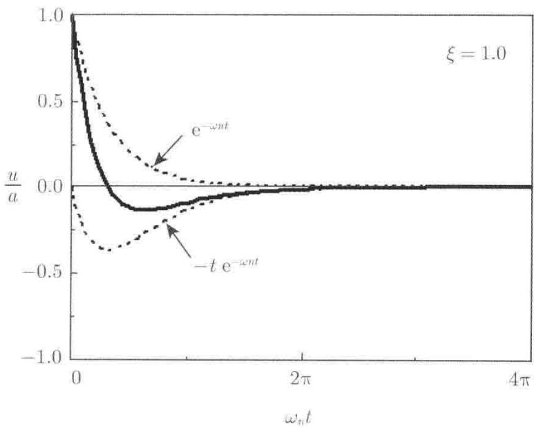

<details>
<summary>line</summary>

| ωₙt | u/a (solid) | u/a (dashed) | e^(-ωnt) |
| --- | --- | --- | --- |
| 0 | 1.0 | 1.0 | 1.0 |
| 2π | ~0.0 | ~-0.2 | ~0.1 |
| 4π | ~0.0 | ~0.0 | ~0.0 |
</details>

图11-10 阻尼比为1.0时的临界阻尼示意图

# 5. 叶片的固有频率

(1) 叶片的 Flapwise 的固有频率: 叶片在挥舞方向的固有频率;  
(2) 叶片的 Edgewise 的固有频率: 叶片在摆振方向的固有频率。

# 6. 风轮的固有频率

(1) 风轮的 In-Plane 的固有频率：在风轮旋转平面内的风轮固有频率；  
(2) 风轮的 Out-of-Plane 的固有频率: 垂直于风轮旋转平面的风轮固有频率。

# 7. 旋转风轮的固有频率

(1) 旋转风轮的 In-Plane 的固有频率;  
(2) 旋转风轮的 Out-of-Plane 的固有频率。

# 8. 塔架的固有频率

(1) FA(Fore-Aft) 的固有频率;  
(2) SS(Side-Side) 的固有频率。

# 9. 风轮塔架系统的固有频率

如机舱的 Nodding 的固有频率，偏航的 Yawing 的固有频率。

# 10. 风的激振频率

风的激振频率: 风是一个连续频率的激振源。其激振频率可以按照 von Karman 模型等生成。

# 11. 风轮的激振频率

风轮的 1P, 2P, 3P, 6P, 9P, 12P 频率。

# 12. 其他激振频率

风力机叶片动力特性分析即叶片模态分析, 包括确定叶片固有频率、阻尼和模态形状, 主要是确定第 1 阶、第 2 阶挥舞频率和第 1 阶摆振频率以及第 1 阶扭振频率。世界各国多年来开展了一系列的相关研究方法, 主要为两大类: 实验方法和计算方法[24]。一般分为有限元等数值模态分析分法和试验测试方法[25], 而试验测试方法由于其可行性和可靠性较高, 得到了风力机设计和生产厂家的高度重视。

考虑到作用在风机叶片上载荷的交变形和随机性，其本身又是弹性结构，因此叶片的振动是不可避免的。当叶片运行的旋转频率接近其固有频率时就会产生较大的动应力，会发生共振。另外，振动带来的疲劳会降低材料的强度，缩短叶片的使用寿命，因此非常有必要分析叶片的结构动力特征。模态分析是近年来进行结构动力学研究的主要手段，本书通过有限元法来实现模态分析和固有频率的计算。

叶片运动可表示为内力、外力和惯性力的微分方程:

$$
[ M ] \{\ddot {a} \} + [ C ] \{\dot {a} \} + [ K ] \{a \} = \{P (t) \} + \{N \} + \{Q \} \tag {11-6}
$$

其中，[M]为质量矩阵；[C]为阻尼矩阵；[K]为刚度矩阵。{ä}、{å}、{a}分别表示有限元节点加速度、速度、位移。{P(t)}为外力函数矢量；{N}为非线性外力项矢量。{Q}为边界约束反力矢量。

式（11-6）是结构动力性分析的基本方程。若其右端 $\{P(t)\} + \{N\} + \{Q\} = 0$ ，在非零的初始条件下，方程（11-6）有非零解，这时叶片处于自由振动状态。由于没有外载作用，该方程的解反映了结构本身固有的特性，即频率与振型。

在工程上，一般在讨论叶片的这种固有动力特性时，不考虑阻尼作用，假设系统在无阻尼及无外载荷状态下求解自由振动的模态矢量，于是方程（11-6）可变为

$$
[ K ] \{\Phi \} = \lambda [ M ] \{\Phi \} \tag {11-7}
$$

式(11-7)就是叶片结构动力问题的广义特征值方程。式中求解的未知量 $\lambda = \omega^2$ 和 $\{\Phi\}$ 分别为叶片结构的特征值和特征矢量。

叶片模型的固有频率分析，计算叶片前五阶固有频率及振型，验证叶片的振动特性。图 11-11 和图 11-12 分别给出了叶片挥舞 1 阶和摆振 1 阶振型示意图。

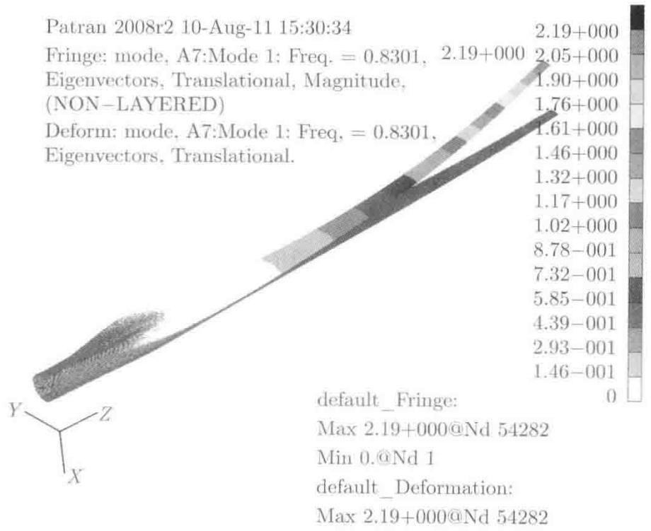

<details>
<summary>heatmap</summary>

| Parameter | Value |
| --- | --- |
| default_Fringe | 0 |
| Max 2.19+000@Nd 54282 | 2.19+000 |
| Min 0.@Nd 1 | 0.0@Nd 1 |
| default_Deformation | Max 2.19+000@Nd 54282 |
</details>

图 11-11 叶片挥舞 1 阶振型

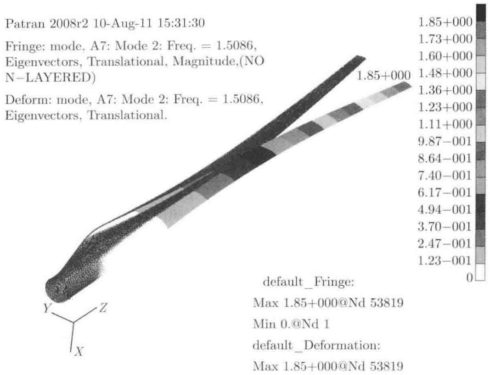

<details>
<summary>heatmap</summary>

| Category | Value Range |
| -------- | ----------- |
| default_Fringe | Max 1.85+000@Nd 53819 |
| min 0.@Nd 1 | 0           |
| default_Deformation | Max 1.85+000@Nd 53819 |
</details>

图 11-12 叶片摆振 1 阶振型

# 11.5.2 叶片振动坎贝尔图

在许多情况下，监测系统需要监测转子速度变化时频谱中若干分量的动态变化过程，以确定转子在整个转速范围内的工作特性。坎贝尔图就是达到这一目的有效分析方法之一。

所谓的坎贝尔图就是监测点的振动幅值作为转速和振动频率的函数，将整个转速范围内转子振动的全部分量的变化特征表示出来。坎贝尔图是瞬态信号分析中最基本的方法，从中可以得到整个转速范围内转子振动全部频率分量的变化特征，转子某部分发生故障，可根据发生故障时的坎贝尔图得到其振动的转速、频率和振动幅值的大小，对进一步分析异常故障的原因以及允许极限振幅的设定有着十分重要的价值。如图 11-13 所示，通过坎贝尔图可以大致掌握每个叶片的振动性能。

# 1. 坎贝尔图的意义

坎贝尔图是在三维谱图的基础上，以谐波阶次为特征的振动旋转信号三维谱图。图 11-14 为汽轮发电机组振动的坎贝尔图，图中右侧的序数 1-13 为转速的谐波次数，每一条斜线代表转速在变化过程中该次谐波的谱线变化情况。

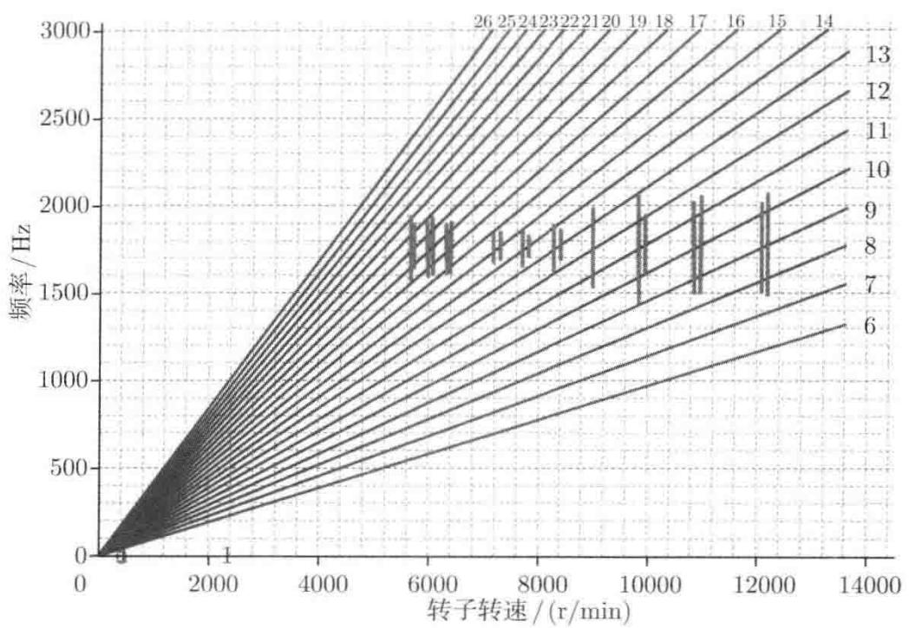

<details>
<summary>line</summary>

| 转子转速 (r/min) | 频率 / Hz |
| ---------------- | --------- |
| 0                | 0         |
| 2000             | 500       |
| 4000             | 1000      |
| 6000             | 1500      |
| 8000             | 2000      |
| 10000            | 2500      |
| 12000            | 3000      |
| 14000            | 3500      |
</details>

图 11-13 叶片振动的坎贝尔图  
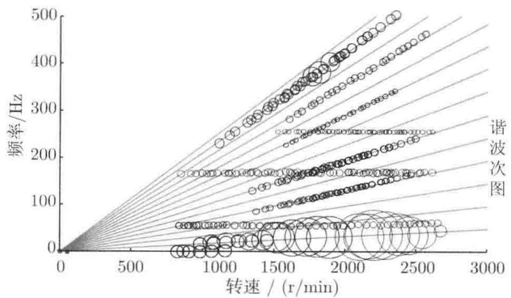

<details>
<summary>scatter</summary>

| 转速 / (r/min) | 频率 / Hz |
| -------------- | --------- |
| 0              | 0         |
| 500            | ~50       |
| 1000           | ~100      |
| 1500           | ~150      |
| 2000           | ~200      |
| 2500           | ~250      |
| 3000           | ~300      |
</details>

图 11-14 振动的坎贝尔图

# 2. 坎贝尔图的使用

(1) 定转速风力机的旋转速度为定值, 不同的标准约束的避免共振的范围不同。一般要求 $\left|\Delta f\right|/f_{0} \geqslant 20\%$ .  
(2) 多转速风力机的旋转速度为多个定值，一般要求 $\left|\Delta f\right|/f_{0} \geqslant 20\%$ .  
(3) 变转速风力机的旋转速度为连续变化的数值: ①无法避免共振的出现; ②一般要求, 在启动转速和额定转速, $|\Delta f| / f_0 \geqslant 20\%$ ; ③在中间位置, 要根据坎贝尔图计算出共振对应的转速, 采用快速通过等办法实现避共振。

对于变桨距的风力机，固有频率还会与当前的桨距角、当前的转速、轮毂是否抱闸有关。

# 3. 坎贝尔图的生成

坎贝尔图的绘制方法是: 先在旋转过程中在各转速点上取振动信号, 然后作出各转速点上振动的自谱, 以各条谱线的高度为半径, 以该条谱线在频率轴上的点为圆心作圆, 形成一个以圆大小表达的自谱图, 将各转速上振动信号的圆自谱图组合起来, 绘出各次谐波斜线就成为最后的坎贝尔图, 这种谱图可更为直观地看出随着转速的增加, 各次谐波频率成分的变化, 如图 11-15 所示。

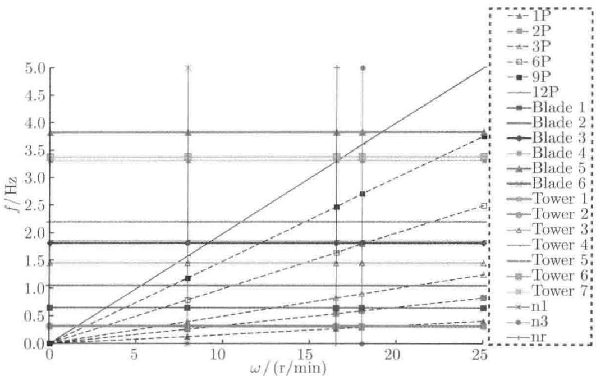  
图 11-15 叶片振动坎贝尔图

叶片挥舞振动和摆振振动的自振频率较低，而叶片扭转振动的自振频率较高。根据振动理论，叶片振动过程中的能量主要集中于一、二阶频率处，所以挥舞振动和摆振振动是风力机叶片的主要振动。鉴于扭转振动发生在高阶，不是主要振动。叶片共振图中的从原点出发的射线表示在不同转速下叶片的激振力频率，八阶以下为低阶频率，低阶频率在叶片共振分析中显得更加重要。各个垂直线表示叶片的额定转速。根据叶片振动的坎贝尔图，检查叶片 NP 激振力频率与额定转速相交点处是否存在共振的危险。

由于风力机叶片的叶根部分与轮毂之间的连接并不是完全等价于固定连接, 所以有限元计算的叶片自振频率可能比实际值偏高。一般可以改变叶片的质量分布和刚度分布来改变叶片的固有频率。这通常在叶片设计中称为 “调频”。增加叶片刚度可以提高叶片的固有频率。但是, 由于一般叶片受剖面形状和重量的限制, 改变弯曲刚度有困难, 所以只能通过改变质量分布来改变固有频率。只要在对应的振型的最大振幅处加集中质量, 就可以降低其固有频率。

# 11.6 叶片整体屈曲

叶片整体屈曲，需综合考虑屈曲分析的材料安全系数、载荷安全系数与模型安全系数，计算叶片的全尺寸有限元分析验证屈曲因子是否满足叶片的稳定性要求，如图 11-16 所示。

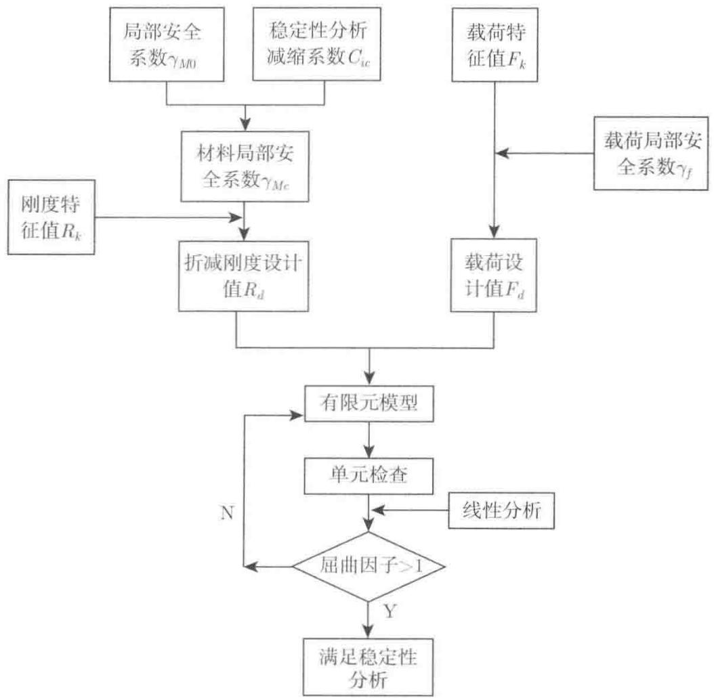

<details>
<summary>flowchart</summary>

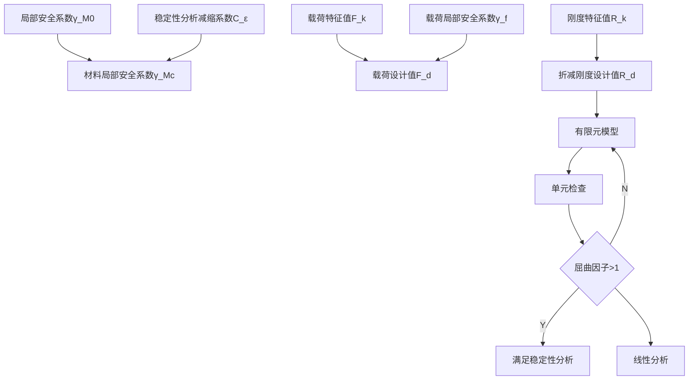
```mermaid
graph TD
    A["局部安全系数γ_M0"] --> B["材料局部安全系数γ_Mc"]
    C["稳定性分析减缩系数C_ε"] --> B
    D["载荷特征值F_k"] --> E["载荷设计值F_d"]
    F["载荷局部安全系数γ_f"] --> E
    G["刚度特征值R_k"] --> H["折减刚度设计值R_d"]
    H --> I["有限元模型"]
    I --> J["单元检查"]
    J --> K{屈曲因子>1}
    K -->|N| I
    K -->|Y| L["满足稳定性分析"]
    K --> M["线性分析"]
```
</details>

图11-16 叶片整体屈曲分析流程

折减刚度后的有限元模型，在考虑载荷安全系数的极限载荷作用下得到的屈曲因子和屈曲云图，如图 11-17 所示，屈曲因子应直接与 1 比较。若屈曲因子小于 1，则需要修改结构设计以满足稳定性分析要求。

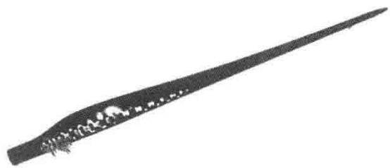

<details>
<summary>natural_image</summary>

Black metal tool with pointed tip and textured surface (no visible text or symbols)
</details>

图11-17 某工况下叶片的一阶屈曲

# 第 12 章 层合板分析

通常将用多层单层板黏合在一起组成整体的结构板，称为层合板。当层合板铺层多于一层时，层合板坐标系按照图 12-1 标识 “X” “Y” 和 “Z”。X 轴沿着层合板的主方向，通常沿着玻纤布的 $0^{\circ}$ 方向，Y 轴位于层压平面内，并垂直于 X 轴，Z 轴指向层合板的厚度方向。

定义单层中间的纤维方向和层合板的主方向 (X 方向) 之间的夹角为 “ $\alpha$ ”，表示玻纤铺放角度。

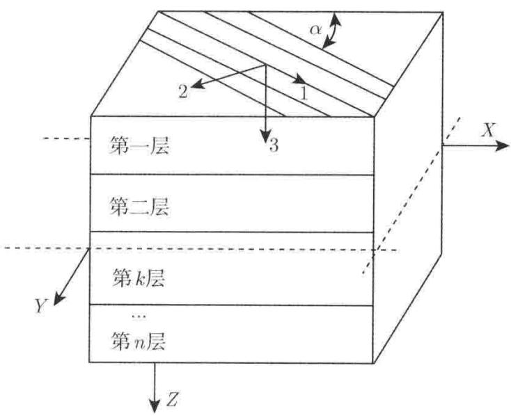

<details>
<summary>text_image</summary>

第一层
第二层
第k层
...
第n层
α
1
2
3
Y
Z
X
</details>

图 12-1 复合材料层合板坐标系

# 12.1 层合板理论

层合板的理论基于一般的薄板理论的经典假设，体现为：

(1) 板厚比板的平面尺寸小得多;   
(2) 忽略板表面形状的改变;   
(3) 在板弯曲变形中, 原板中面法线上各点仍保持在挠曲线的法线上;  
(4) 板的法向挠度沿板厚不变;   
(5) 忽略垂直于板面方向的应力。

# 12.1.1 复合材料板壳理论

# 1. 非线性经典板壳理论

由于复合材料具有比强度高、比刚度高的优异性能，所以在实际应用中，叠层的厚度往往较小。当板的挠度与厚度相比较大时，就需要按几何非线性理论进行计算[26,27]。

1) 几何方程

$$
\varepsilon_ {i j} = \frac {1}{2} (u _ {i, j} + u _ {j, i} + u _ {k, i j}) \tag {12-1}
$$

其位移可表示成

$$
\left\{ \begin{array}{l} u = u ^ {0} (x, y) - z \frac {\partial w}{\partial x} \\ v = v ^ {0} (x, y) - z \frac {\partial w}{\partial y} \\ w = w ^ {0} (x, y) \end{array} \right. \tag {12-2}
$$

2) 物理方程

$$
\{\sigma \} ^ {(k)} = \left\{\bar {Q} \right\} ^ {(k)} \{\varepsilon \} \tag {12-3}
$$

3) 运动方程

$$
\left(\sigma_ {k l} u _ {j, l}\right), _ {k} + \left(\sigma_ {k l} u _ {j, j}\right), _ {k} + f _ {j} = \rho_ {0} w, _ {t t} \tag {12-4}
$$

# 2. 一阶剪切理论

经典板壳理论基于忽略横向剪切变形的直法线假设。对于复合材料层合板，经典理论虽然有一定的精度，但不及各向同性材料薄板。总体而言，对于均匀各向同性板，跨高比 $l/h \geqslant 20$ 就可以采用经典理论计算，而对于复合材料层合板，则要求 $l/h \geqslant 40$ 。

一些计算结果表明, 一阶剪切理论所得的横向剪力已有足够的精度, 横向位移也比经典理论的计算结果好, 但面内应力与经典理论相当, 改进不大, 所以一阶剪切理论主要还是用来研究层合板的总体力学响应。

1) 几何方程

$$
\varepsilon_ {i j} = \frac {1}{2} (u _ {i, j} + u _ {j, i}) \tag {12-5}
$$

考虑剪切效应, 变形前垂直于中面的直线变形后仍为直线, 但不垂直于变形后的中面。引入变形后 $xz$ 和 $yz$ 平面内的角位移分别为 $\varphi_x$ 和 $\varphi_y$ , 则位移可表示为

$$
\left\{ \begin{array}{l} u = u ^ {0} (x, y) + z \varphi_ {x} (x, y) \\ v = v ^ {0} (x, y) + z \varphi_ {y} (x, y) \\ w = w ^ {0} (x, y) \end{array} \right. \tag {12-6}
$$

2) 物理方程

$$
\{\sigma \} ^ {(k)} = \{\bar {Q} \} ^ {(k)} \{\varepsilon \} \tag {12-7}
$$

3) 运动方程

$$
\left\{ \begin{array}{l} \sigma_ {x, x} + \sigma_ {x y, y} + \sigma_ {x z, z} + f _ {x} = \rho_ {0} u _ {, t t} \\ \sigma_ {x y, x} + \sigma_ {y, y} + \sigma_ {y z, z} + f _ {y} = \rho_ {0} v _ {, t t} \\ (\sigma_ {x} w _ {, x} + \sigma_ {x y} w _ {, y} + \sigma_ {x z}), _ {x} + (\sigma_ {x y} w _ {, x} + \sigma_ {y} w _ {, y} + \sigma_ {y z}), _ {y} \\ + (\sigma_ {x z} w _ {, x} + \sigma_ {y z} w _ {, y} + \sigma_ {z}), _ {z} + f _ {z} = \rho_ {0} w _ {, t t} \end{array} \right. \tag {12-8}
$$

# 3. 高阶剪切理论

为了既考虑剪切变形的影响, 又比较精确地得到层合板的应力分布, 可采用高阶剪切理论。

1) 几何方程

几何方程同一阶剪切理论

$$
\varepsilon_ {i j} = \frac {1}{2} (u _ {i, j} + u _ {j, i}) \tag {12-9}
$$

位移表达式表示为 $z$ 的幂级数：

$$
\left\{ \begin{array}{l} u = u ^ {0} (x, y) + z \phi_ {x} (x, y) + z ^ {2} \xi_ {x} (x, y) + \dots \\ v = v ^ {0} (x, y) + z \phi_ {y} (x, y) + z ^ {2} \xi_ {y} (x, y) + \dots \\ w = w ^ {0} (x, y) + z \phi_ {z} (x, y) + z ^ {2} \xi_ {z} (x, y) + \dots \end{array} \right. \tag {12-10}
$$

需要说明的是，其计算精度与复杂程度取决于 z 的幂次的高低。

2) 物理方程

$$
\{\sigma \} ^ {(k)} = \left\{\bar {Q} \right\} ^ {(k)} \{\varepsilon \} \tag {12-11}
$$

3) 运动方程

运动方程的数量取决于广义位移函数的数量。

# 12.1.2 层合板特性

层合板的性能既与各层单层布的材料性能有关，又与各层单层板的铺设方式有关，而单层板的性能则与其材料以及材料主方向有关。相比于单层板相，层合板有下列特性：

(1) 一般单层板以纤维方向为材料主方向, 而层合板的各单层板的材料主方向一般按不同角度排列, 导致层合板不一定有确定的材料主方向。如主梁的各单层材料主方向一致, 层合板模型的材料主方向为展向。但是叶根加强层的各单层材料主方向不一致, 具有叶片展向和弦向的差别, 因此叶根加强层无确切的材料主方向。

(2) 层合板的结构刚度取决于各单层板性能和铺设方式，若层合板中各单层板的性能和铺设顺序已确定，则可推算出层合板的结构刚度。  
(3) 一般层合板有耦合效应，体现为在面内拉 (压)、剪切载荷作用下引起弯、扭变形，在弯、扭载荷作用下引起拉 (压)、剪变形。  
(4) 单层板受载破坏时就会全部失效, 而层合板由各单层板组成, 当某一层或数层破坏时, 其余各层可能继续承受载荷, 不一定全部失效, 因此层合板的强度分析要比单层板复杂得多。  
(5) 层合板在成型时要加热固化，冷却后由于各单层板的热胀冷缩不一致，存在温度应力，在强度计算时也就需要考虑这个因素。  
(6) 层合板由不同的单层板固化成型在一起，在变形时为满足变形协调条件，各层之间会有层间应力存在。

# 12.1.3 层合板的性能与刚度

结构分析中，通常要计算层合板的弯曲和拉伸刚度，用来表示中面应变和曲率与薄膜合力、合力矩之间的关系[28]。

层合板应力系数沿厚度不连续，而应变为参考面的应变及曲率的函数：

$$
\left\{ \begin{array}{l} \varepsilon_ {1} \\ \varepsilon_ {2} \\ \gamma_ {1 2} \end{array} \right\} = \left\{ \begin{array}{l} \varepsilon_ {1} ^ {0} \\ \varepsilon_ {2} ^ {0} \\ \gamma_ {1 2} ^ {0} \end{array} \right\} + z \left\{ \begin{array}{l} \chi_ {1} \\ \chi_ {2} \\ \chi_ {1 2} \end{array} \right\} \tag {12-12}
$$

第 $k$ 层应力-应变关系

$$
\left\{ \begin{array}{l} \varepsilon_ {1} \\ \varepsilon_ {2} \\ \gamma_ {1 2} \end{array} \right\} _ {k} = \left[ \begin{array}{c c c} Q _ {1 1} & Q _ {1 2} & Q _ {1 3} \\ Q _ {2 1} & Q _ {2 2} & Q _ {2 3} \\ Q _ {3 1} & Q _ {3 2} & Q _ {3 3} \end{array} \right] _ {k} \left(\left\{ \begin{array}{l} \varepsilon_ {1} ^ {0} \\ \varepsilon_ {2} ^ {0} \\ \gamma_ {1 2} ^ {0} \end{array} \right\} + z \left\{ \begin{array}{l} \chi_ {1} \\ \chi_ {2} \\ \chi_ {1 2} \end{array} \right\}\right) _ {k} + \Delta T \left\{ \begin{array}{l} \alpha_ {1} \\ \alpha_ {2} \\ \alpha_ {3} \end{array} \right\} _ {k} \tag {12-13}
$$

层合材料的排列次序如图 12-2 所示。

沿厚度分段积分, 即可以得到微元体边界上的拉力、平面剪力及弯矩、扭矩等参数

$$
\begin{array}{l} [ N ] = \left\{ \begin{array}{l} N _ {x} \\ N _ {y} \\ N _ {x y} \end{array} \right\} = \sum_ {k = 1} ^ {N} [ Q ] _ {k} \left(\int_ {Z _ {k - 1}} ^ {Z _ {k}} \{\varepsilon \} \mathrm{d} z + \int_ {Z _ {k - 1}} ^ {Z _ {k}} \{\chi \} z \mathrm{d} z\right) \tag {12-14} \\ [ M ] = \left\{ \begin{array}{l} M _ {x} \\ M _ {y} \\ M _ {x y} \end{array} \right\} = \sum_ {k = 1} ^ {N} [ Q ] _ {k} \left(\int_ {Z _ {k - 1}} ^ {Z _ {k}} \{\varepsilon \} z \mathrm{d} z + \int_ {Z _ {k - 1}} ^ {Z _ {k}} \{\chi \} z ^ {2} \mathrm{d} z\right) \\ \end{array}
$$

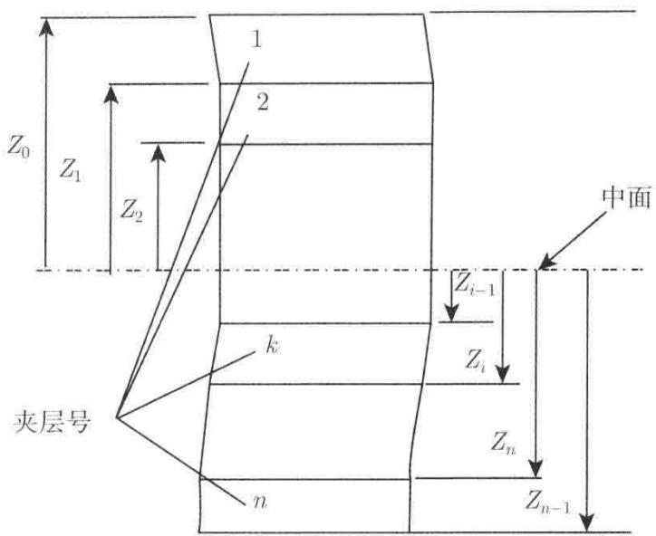

<details>
<summary>text_image</summary>

Z₀
Z₁
Z₂
1
2
Zᵢ₋₁
Zᵢ
Zₙ₋₁
中面
夹层号
k
n
</details>

图 12-2 层合板叠加次序

因为参考面的应变和曲率不是 Z 的函数，所以以上的合力和合力矩可以写成

$$
[ N ] = [ A ] \left\{\varepsilon^ {0} \right\} + [ B ] \{\chi \} \tag {12-15}
$$

$$
[ M ] = [ B ] \left\{\varepsilon^ {0} \right\} + [ D ] \left\{\chi \right\}
$$

这里刚度矩阵系数为

$$
\begin{array}{l} A _ {i j} = \sum_ {k = 1} ^ {N} (Q _ {i j}) _ {k} (z _ {k} - z _ {k - 1}) \\ B _ {i j} = \frac {1}{2} \sum_ {k = 1} ^ {N} (Q _ {i j}) _ {k} (z _ {k} ^ {2} - z _ {k - 1} ^ {2}) \tag {12-16} \\ D _ {i j} = \frac {1}{3} \sum_ {k = 1} ^ {N} (Q _ {i j}) _ {k} (z _ {k} ^ {3} - z _ {k - 1} ^ {3}) \\ \end{array}
$$

弹性矩阵 [A] 和 [D] 分别称为拉伸和弯曲刚度；[B] 矩阵为耦合矩阵。因为耦合矩阵为偶函数，所以对称夹层板的耦合矩阵为零矩阵。其中， $A_{ij}$ 与铺层次序无关，仅与各铺层的模量 $Q_{ij}$ 有关； $B_{ij}$ 和 $D_{ij}$ 均与铺层次序有关。耦合刚度矩阵 $B_{ij}$ 的存在，使得表面层合板在受到面内力时将引起弯曲或扭转变形，受到弯曲力矩时会引起面内轴向或剪切变形，如图 12-3 所示。

层合板是由各个夹层黏合而成，本书认为各层间的黏合厚度无限小，并且没有剪切变形。以4层单层板组成的层合板为例，表达应变-应力关系。

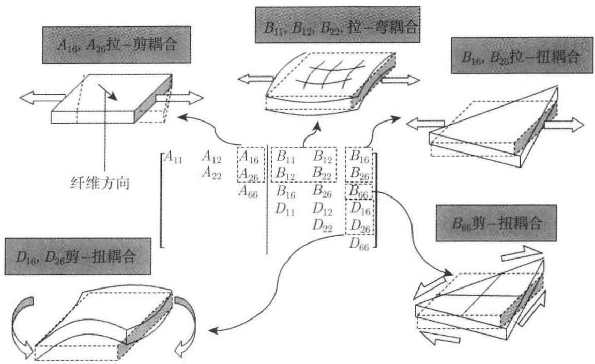

<details>
<summary>flowchart</summary>


```mermaid
graph TD
    A["纤维方向"] --> B["A11"]
    A --> C["A12"]
    A --> D["A22"]
    A --> E["A16"]
    E --> F["B11, B12, B22, 拉-弯耦合"]
    F --> G["B16, B26, 拉-扭耦合"]
    G --> H["B60剪-扭耦合"]
    H --> I["D66"]
    I --> J["D22"]
    J --> K["D16"]
    K --> L["B26, B26"]
    L --> M["B16"]
    M --> N["B12"]
    N --> O["B16"]
    O --> P["B11"]
    P --> Q["B22"]
    Q --> R["B66"]
    R --> S["B16"]
    S --> T["B12"]
    T --> U["B16"]
    U --> V["B11"]
    V --> W["B22"]
    W --> X["B66"]
    X --> Y["B16"]
    Y --> Z["B12"]
    Z --> AA["B16"]
    AA --> AB["B11"]
    AB --> AC["B22"]
    AC --> AD["B66"]
    AD --> AE["B16"]
    AE --> AF["B12"]
    AF --> AG["B16"]
    AG --> AH["B11"]
    AH --> AI["B22"]
    AI --> AJ["B66"]
    AJ --> AK["B16"]
    AK --> AL["B12"]
    AL --> AM["B16"]
    AM --> AN["B11"]
    AN --> AO["B22"]
    AO --> AP["B66"]
    AP --> AQ["B16"]
    AQ --> AR["B12"]
    AR --> AS["B16"]
    AS --> AT["B11"]
    AT --> AU["B22"]
    AU --> AV["B66"]
    AV --> AW["B16"]
    AW --> AX["B12"]
    AX --> AY["B16"]
    AY --> AZ["B11"]
    AZ --> BA["B22"]
    BA --> BB["B66"]
    BB --> BC["B16"]
    BC --> BD["B12"]
    BD --> BE["B16"]
    BE --> BF["B11"]
    BF --> BG["B22"]
    BG --> BH["B66"]
    BH --> BI["B16"]
    BI --> BJ["B12"]
    BJ --> BK["B16"]
    BK --> BL["B11"]
    BL --> BM["B22"]
    BM --> BN["B66"]
    BN --> BO["B16"]
    BO --> BP["B12"]
    BP --> BQ["B16"]
    BQ --> BR["B11"]
    BR --> BS["B22"]
    BS --> BT["B66"]
    BT --> BU["B16"]
    BU --> BV["B12"]
    BV --> BW["B16"]
```
</details>

图 12-3 刚度矩阵系数对变形的影响

图 12-4 显示层合板应变由中面应变和中面曲率两部分组成，并沿厚度线性分布，而层合板应力除与应变有关外，还与单层刚度特性有关。若各层刚度不相同，则各层应力也会不连续分布，但在同一层内，应力是线性分布的。

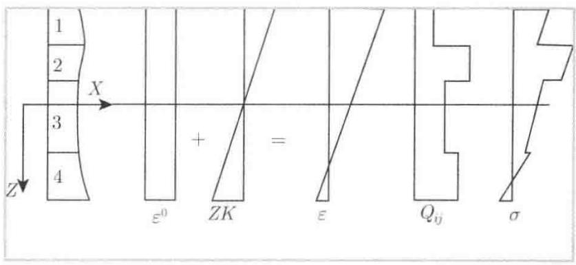

<details>
<summary>text_image</summary>

1
2
3
4
X
Z
ε⁰
+
ZK
=
ε
Qᵢⱼ
σ
</details>

图 12-4 层合板沿厚度的应力和应变变化  
$\varepsilon^{0}$ 为层合板中面应变；ZK 为层合板中面弯曲挠曲率； $\varepsilon$ 为层合板应变；  
$Q_{ij}$ 为层合板刚度； $\sigma$ 为层合板应力

# 12.1.4 层合板的强度分析

与刚度一样, 层合板由基本元件单层板组成, 因此主要根据单层板的强度来预测层合板的强度。该方法的基础是计算每一层单层板的应力状态。由于复合材料的各向异性和不均匀性, 加上破坏形式复杂, 对于层压复合材料板, 某一单层板的破坏不一定等同于整个层合板的破坏。尽管由于某个或某几个单层板破坏会降低层合板的刚度, 但层合板仍有可能承受更大的载荷, 继续加载直到层合板全部破坏,此时的外载荷称为层合板的极限载荷。综上分析，层合板强度分析的主要目的是确定其极限载荷。

当层合板的极限载荷较为复杂时，其计算步骤大致如下：

(1) 先设定各外载荷之间的比例, 即按各载荷分量比例加载;   
(2) 根据各单层性能，计算层合板刚度 $A_{ij}$ ， $B_{ij}$ 和 $D_{ij}$ ;  
(3) 求各单层在材料主方向上应力与外载荷之间的关系;  
(4) 将各单层应力分别代入强度准则关系式进行比较, 确定哪一层单层先破坏;  
(5) 将已破坏单层板从层合板中排除, 但仍保持其余单层板的几何位置, 重新计算层合板刚度;  
(6) 重复以上过程, 计算各层应力, 再用强度理论比较, 检查其他单层是否破坏。然后计算和检查其他单层的刚度, 直到剩下的层合板能继续承受增加的载荷为止。当所有单层板破坏, 此时的载荷即为层合板极限载荷, 如图 12-5 所示。

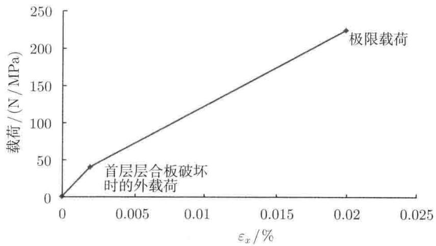

<details>
<summary>line</summary>

| ε_x / % | 载荷 (N/MPa) |
|---------|--------------|
| 0       | 0            |
| 0.005   | 40           |
| 0.01    | 100          |
| 0.015   | 150          |
| 0.02    | 230          |
</details>

图 12-5 层合板载荷-应变特征曲线

# 12.1.5 结构设计许用值

一般情况下, 复合材料力学性能应该从能代表层合组件的层合板试验中得到, 而每个独立的材料特性则可通过不同的方法来描述。结构设计中, 单向的层板强度值并不是非常重要的, 因为大多数结构都要面临复杂的受力状态, 需要铺设各种方向的层板来共同承受这些载荷, 这往往需要通过试样和元件试验来得到一组结构设计许用值, 用微应变加以表示, 包括拉伸许用值、压缩许用值、剪切许用值。

特征值为表示随机变量特征的名义值, 是假设无数次试验而得到的基本不被超过的值 (极小值)。强度特性特征值, 如果任意强度分布的最低值为 $2.5\%$ , 则等同于 $97.5\%$ 的公差。刚度和泊松比的特征值一般取平均值。所有结果应当满足 $97.5\%$ 的公差和 $95\%$ 的可靠度, 特别是当只有有限个试验结果满足要求时, 可靠度尤为重要。

试验数据按照数理统计方法进行处理，Weibull 分布提供了最保守的基准值，许用值一般采用 Weibull 分布处理。

为保证整个结构的完整性且具有高置信度，由试验数据确定结构元件和结构细节所需要的材料性能。这些值通常基于未考虑实际结构状态而经过修正的许用值，一般用于分析计算安全裕度。复合材料测试的静态试验结果需给出平均值、标准方程、离散系数和试件个数。疲劳试验的结果需给出平均回归线，与时间或周期相关的标准方差、试件个数、试验时间或试验周期，这些试验点可相对平均地散布于 $\log$ 试件周期内。叶片结构设计与强度校核时，应根据具体结构部位或结构细节选用合适的设计值，以满足该部位或结构细节需要的结构完整性要求。

# 12.2 层合板设计

# 12.2.1 层合板的刚度预测与设计

对主要设计参数（如铺层方向、铺层顺序等）的工艺过程进行控制是所有预测层合板性能的先决条件。通过分析证明预测的准确性（如层合板刚度、结构变形、传力路径、稳定性等）。层合板的设计参数如图 12-6 所示。

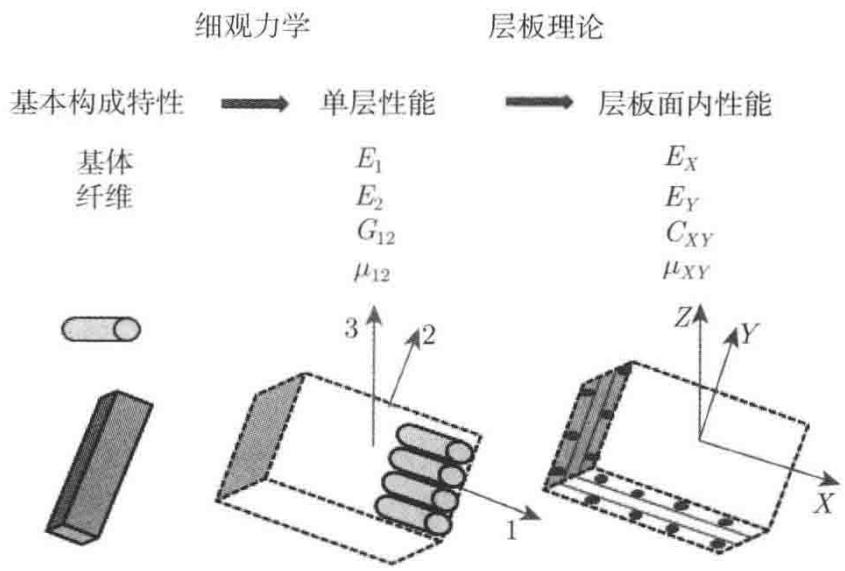

<details>
<summary>text_image</summary>

细观力学
层板理论
基本构成特性 → 单层性能 → 层板面内性能
基体
纤维
E₁
E₂
G₁₂
μ₁₂
3
2
1
Eₓ
Eᵧ
Cₓᵧ
μₓᵧ
Z
Y
X
</details>

图 12-6 层合板设计参数

# 12.2.2 层合板初步设计

在初步设计阶段，常采用 Carpet 曲线对结构的刚度进行预测，这样可以快速进行复合材料结构件的初步设计。举例来说，如要设计一层合板，使其拉伸刚度 $E_A \geqslant a$ ，弯曲刚度 $E_I \geqslant b$ ，那么利用 Carpet 曲线可迅速得到符合这两个要求的层合板 $E$ 的刚度值，进而可得知达到 $E$ 要求值的可能的铺层比例[5]。

玻璃纤维环氧 (fiberglass-epoxy), E-Glass/934, $V_{f} = 0.63$ 模量的 Carpet 曲线如图 12-7 所示。

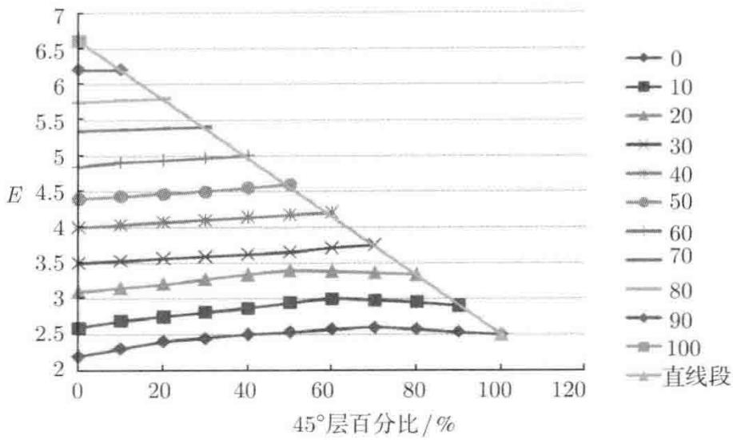  
图12-7 弹性模量的Carpet曲线

# 12.2.3 环境影响的考虑

温度和湿度沿板厚的分布会影响层合板的性能，在不受约束的单层中，温度变化或吸湿膨胀会引起不产生应力的变形。在层合板中，一个单层的无应力变形会受到相邻单层的限制而产生内应力。除了引起内应力外，温度和吸湿量也会影响材料的性能，这些效应主要与基体控制的强度性能有关[29]。

强度退化主要与基体材料的玻璃化转变温度有关。吸湿时，基体从玻璃态变为黏稠态时温度下降，于是，其高温强度性能随吸湿量的增加而下降。

设计中采用的典型方法是假设一种最坏的情况，如假设材料处于全饱和状态，则这样可以计算其减缩许用强度。

层合板的弯曲和扭转刚度不仅受铺层顺序的影响，还受到环境的影响，对于具有对称温度和吸湿量分布的对称层合板而言，其耦合刚度分量为零，而对于具有非对称温度和吸湿量分布的对称层合板，其耦合刚度分量并不为零。

一般而言，非对称层合板都会受环境影响而发生翘曲。非对称层合板的翘曲与铺层顺序有关，鉴于其变形大小受到温度和吸湿量的影响，所以在工程结构中，一般避免使用非对称层合板。

由于复合材料纤维和树脂的化学特性不同，加上环境对其表现不同的作用方式，纤维和树脂界面特性受纤维类型、规格、树脂与工艺特性等方面影响较大。此外，不同孔隙率和树脂裂纹也会影响复合材料的抗环境性。

# 12.3 层合平板的屈曲

这里采用非线性经典理论，将位移表达式代入非线性几何方程，然后引入应力函数，再将挠度表示的非线性几何方程和应力函数分别代入本构方程，最后代入运动方程中，就可以得到位移和应力函数所表示的运动方程。

在边界面内外力作用的几何非线性的基本方程式，可由一般非线性基本方程式中去掉横向载荷 q 和横向惯性力 $\rho\omega_{,ii}$ 而得到，即

$$
L _ {1} (\omega) + L _ {3} (\phi) = \phi , _ {x x} \omega , _ {y y} + \phi , _ {y y} \omega , _ {x x} - 2 \phi , _ {x y} \omega , _ {x y} \tag {12-17}
$$

$$
L _ {3} (\omega) + L _ {2} (\phi) = \omega_ {, x x} \omega_ {, y y} - \omega_ {, x y} ^ {2}
$$

其中，微分算子 $L_{i}(i = 1,2,3)$ 为

$$
L _ {1} = d _ {1 1} \frac {\partial^ {4}}{\partial x ^ {4}} + 4 d _ {1 6} \frac {\partial^ {4}}{\partial x ^ {3} \partial y} + 2 \left(d _ {1 2} + 2 d _ {6 6}\right) \frac {\partial^ {4}}{\partial x ^ {2} \partial y ^ {2}} + 4 d _ {2 6} \frac {\partial^ {4}}{\partial x \partial y ^ {3}} + d _ {2 2} \frac {\partial^ {4}}{\partial y ^ {4}} \tag {12-18}
$$

$$
L _ {2} = - a _ {2 2} \frac {\partial^ {4}}{\partial x ^ {4}} + 2 a _ {2 6} \frac {\partial^ {4}}{\partial x ^ {3} \partial y} - (2 a _ {1 2} + a _ {6 6}) \frac {\partial^ {4}}{\partial x ^ {2} \partial y ^ {2}} + 2 a _ {1 6} \frac {\partial^ {4}}{\partial x \partial y ^ {3}} - a _ {1 1} \frac {\partial^ {4}}{\partial y ^ {4}} \tag {12-19}
$$

$$
L _ {3} = b _ {2 1} \frac {\partial^ {4}}{\partial x ^ {4}} + 2 \left(b _ {2 6} - b _ {6 1}\right) \frac {\partial^ {4}}{\partial x ^ {3} \partial y} + \left(b _ {1 1} + b _ {2 2} - 2 b _ {6 6}\right) \frac {\partial^ {4}}{\partial x ^ {2} \partial y ^ {2}} + 2 \left(b _ {1 6} - b _ {6 2}\right) \frac {\partial^ {4} y}{\partial x \partial y ^ {3}} + b _ {1 2} \frac {\partial^ {4}}{\partial y ^ {4}} \tag {12-20}
$$

$$
a = A ^ {- 1}, \quad b = - a B, \quad c = - B a = - b ^ {\mathrm{T}}, \quad d = D - B a B
$$

A、B、D 分别为经典层合板本构方程的刚度矩阵中的拉剪刚度，拉剪-弯扭耦合刚度和弯扭刚度。根据面内边界载荷及边界支承情况，求解此非线性方程组并作出载荷-挠度曲线。稳定性问题可以根据面内边界载荷及边界支承情况对以上方程的特征值问题进行求解。

# 12.3.1 屈曲计算算法

# 1. 理论解

由于一般的层合板具有拉剪、弯扭和拉剪-弯扭耦合效应，所以除了一些简单的情形外，都难以求得解析解，这时可以采用能量原理求得近似解。

# 2. 应变能公式

弹性体的应变能可表示为

$$
U = \frac {1}{2} \iiint_ {V} \left(\sigma_ {x} \varepsilon_ {x} + \sigma_ {y} \varepsilon_ {y} + \sigma_ {z} \varepsilon_ {z} + \sigma_ {x y} \gamma_ {x y} + \sigma_ {y z} \gamma_ {y z} + \sigma_ {x z} \gamma_ {x z}\right) d x d y d z \tag {12-21}
$$

采用平面应力的基本假设后，应变能可以表示为

$$
U = \frac {1}{2} \iiint_ {V} \left(\sigma_ {x} \varepsilon_ {x} + \sigma_ {y} \varepsilon_ {y} + \sigma_ {x y} \gamma_ {x y}\right) \mathrm{d} x \mathrm{d} y \mathrm{d} z \tag {12-22}
$$

将内力-应力关系代入式 (12-22)，可得

$$
\begin{array}{l} U = \frac {1}{2} \iint \left(N _ {x} \varepsilon_ {x} ^ {0} + N _ {y} \varepsilon_ {y} ^ {0} + N _ {x y} \gamma_ {x y} ^ {0} + M _ {x} \kappa_ {x} + M _ {y} \kappa_ {y} + M _ {x y} \kappa_ {x y}\right) d x d y \\ = \frac {1}{2} \iint_ {S} ^ {S} \left(\{N \} ^ {\mathrm{T}} \left\{\varepsilon^ {0} \right\} + \{M \} ^ {\mathrm{T}} \left\{\kappa \right\}\right) \mathrm{d} x \mathrm{d} y \tag {12-23} \\ \end{array}
$$

利用本构关系后:

$$
U = \frac {1}{2} \iint_ {S} \left(\left\{\varepsilon^ {0} \right\} ^ {\mathrm{T}} \{A \} \left\{\varepsilon^ {0} \right\} + 2 \left\{\varepsilon^ {0} \right\} ^ {\mathrm{T}} \{B \} \{\kappa \} + \{\kappa \} ^ {\mathrm{T}} \{D \} \{\kappa \}\right) \mathrm{d} x \mathrm{d} y \tag {12-24}
$$

将线性几何方程代入式 (12-24) 便可以得到用中面位移 $u^0, v^0$ 和 $w$ 表示的小挠度层合板应变能公式。若将非线性的几何方程代入式 (12-24)，同样可以得到 $u^0, v^0$ 和 $w$ 表示的大挠度层合板应变能公式。

对于对称层合板，由于耦合刚度矩阵 $B_{ij}$ 全为零，则层合板的应变能可以表示为平面应变能 $U_{1}$ 和弯曲应变能 $U_{2}$ 两个独立的部分：

$$
U = U _ {1} + U _ {2} = \frac {1}{2} \iint_ {S} \left\{\varepsilon^ {0} \right\} ^ {\mathrm{T}} \{A \} \left\{\varepsilon^ {0} \right\} \mathrm{d} x \mathrm{d} y + \frac {1}{2} \iint_ {S} \left\{\kappa \right\} ^ {\mathrm{T}} \{D \} \left\{\kappa \right\} \mathrm{d} x \mathrm{d} y \tag {12-25}
$$

# 3. 最小势能原理

对于层合板在横向分布载荷 $q(x,y)$ 作用下的静力弯曲问题，不计体力的情况下，其最小势能原理可以表示成：

$$
\delta \Pi = 0 \tag {12-26}
$$

其中， $\Pi$ 为总势能:

$$
\Pi = U - \iint_ {S} q w \mathrm{d} x \mathrm{d} y \tag {12-27}
$$

# 4. 里茨法

假设层合板的位移分量可以用下列适当的函数的线性组合表示:

$$
u ^ {0} = \sum_ {m = 1} ^ {M _ {1}} \sum_ {n = 1} ^ {N _ {1}} A _ {m n} ^ {0} U _ {m n} (x, y)
$$

$$
v ^ {0} = \sum_ {m = 1} ^ {M _ {2}} \sum_ {n = 1} ^ {N _ {2}} B _ {m n} ^ {0} V _ {m n} (x, y) \tag {12-28}
$$

$$
w = \sum_ {m = 1} ^ {M _ {3}} \sum_ {n = 1} ^ {N _ {3}} C _ {m n} ^ {0} W _ {m n} (x, y)
$$

其中， $A_{0}, B_{0}, C_{0}$ 是待定常数； $U_{mn}, V_{mn}, W_{mn}$ 分别是彼此线性无关的已知函数。

式 (12-28) 需满足位移边界条件及连续可微条件。将式 (12-28) 代入系统的总势能中，可以得到参数 $A_{0}, B_{0}, C_{0}$ 表示的层合板总势能 $F_{d}$ 。通过以下等价于 $\partial \Pi = 0$ 的条件：

$$
\frac {\partial \Pi}{\partial A _ {m n} ^ {0}} = 0 m = 1, 2, \dots , M _ {1}; n = 1, 2, \dots , N _ {1}
$$

$$
\frac {\partial \Pi}{\partial B _ {m n} ^ {0}} = 0 m = 1, 2, \dots , M _ {2}; n = 1, 2, \dots , N _ {2} \tag {12-29}
$$

$$
\frac {\partial \Pi}{\partial C _ {m n} ^ {0}} = 0 m = 1, 2, \dots , M _ {3}; n = 1, 2, \dots , N _ {3}
$$

可以求解出这些参数，从而求得中面位移的近似解。所得近似解的近似程度取决于 $U_{mn}$ 等的选择和所取级数的项数。

# 12.3.2 边界条件

对控制方程进行求解时，需要根据具体情况给定位移和外力的边界条件，三种常用的边界条件见表 12-1。

表 12-1 边界条件

<table><tr><td>序号</td><td>边界</td><td colspan="2">说明</td></tr><tr><td>1</td><td>简支边界条件</td><td>边界上挠度等于0,弯矩等于0</td><td> $w=0;M_{n}=0$ </td></tr><tr><td>2</td><td>固支边界条件</td><td>边界上挠度等于0,转角等于0</td><td> $w=0;w,n=0$ </td></tr><tr><td>3</td><td>自由边边界条件</td><td>边界上弯矩等于0,剪力等于0</td><td> $Q=0;M_{n}=0$ </td></tr></table>

# 12.3.3 理论解算例

# 1. 各向同性薄板面内压曲

微分方程为

$$
D \nabla^ {4} w - \left(N _ {x} \frac {\partial^ {2} w}{\partial x ^ {2}} + 2 N _ {x y} \frac {\partial^ {2} w}{\partial x \partial y} + N _ {y} \frac {\partial^ {2} w}{\partial y ^ {2}}\right) = 0 \tag {12-30}
$$

1) 矩形板四边简支，对边均匀受压

如图12-8所示， $\sigma_{x} = -\frac{P_{x}}{t},\sigma_{y} = 0,\tau_{xy} = 0$ ，则有 $N_{x} = -P_{x},N_{y} = 0,N_{xy} = 0,$

代入微分方程中则有

$$
D \nabla^ {4} w + P _ {x} \frac {\partial^ {2} w}{\partial x ^ {2}} = 0 \tag {12-31}
$$

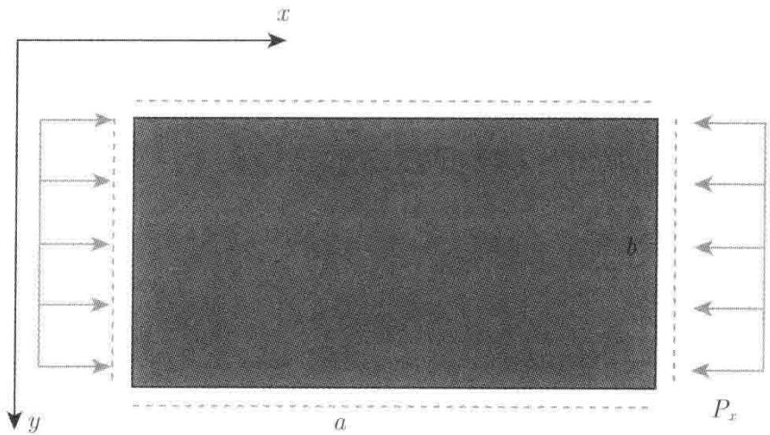

<details>
<summary>text_image</summary>

x
y
a
b
Px
</details>

图 12-8 矩形板四边简支对边受压

引入薄板小挠度弯曲问题中的挠度表达式为

$$
w = \sum_ {m = 1} ^ {\infty} \sum_ {n = 1} ^ {\infty} A _ {m n} \sin \left(\frac {m \pi x}{a}\right) \sin \left(\frac {n \pi y}{b}\right) \tag {12-32}
$$

此位移形式满足四边简支的边界条件:

$$
x = 0 \text {及} x = a \text {时}, \quad w = 0
$$

$$
y = 0 \text {及} y = b \text {时,} w = 0
$$

将位移表达式代入压曲微分方程中，得出

$$
\sum_ {m = 1} ^ {\infty} \sum_ {n = 1} ^ {\infty} A _ {m n} \left[ D \left(\frac {m ^ {2}}{a ^ {2}} + \frac {n ^ {2}}{b ^ {2}}\right) ^ {2} - P _ {x} \frac {m ^ {2}}{\pi^ {2} a ^ {2}} \right] \sin \left(\frac {m \pi x}{a}\right) \sin \left(\frac {n \pi y}{b}\right) = 0 \tag {12-33}
$$

当载荷 $P_{x}$ 从0增大到临界载荷时，对于任意的 $m, n, A_{mn}$ 总为0，当达到临界载荷时， $A_{mn}$ 不等于0， $w$ 不等于0，而上式仍然成立，则有

$$
D \left(\frac {m ^ {2}}{a ^ {2}} + \frac {n ^ {2}}{b ^ {2}}\right) ^ {2} - P _ {x} \frac {m ^ {2}}{\pi^ {2} a ^ {2}} = 0 \tag {12-34}
$$

因此，可以得到

$$
P _ {\mathrm{cr}} = P _ {x} = \frac {\pi^ {2} a ^ {2} D \left(\frac {m ^ {2}}{a ^ {2}} + \frac {n ^ {2}}{b ^ {2}}\right) ^ {2}}{m ^ {2}} \tag {12-35}
$$

2) 矩形板四边简支，四边均匀受压

如图 12-9 所示，可以得到

$$
P _ {\mathrm{cr}} = P _ {x} = \frac {\pi^ {2} D}{a ^ {2}} \frac {\left(m ^ {2} + n ^ {2} \frac {a ^ {2}}{b ^ {2}}\right) ^ {2}}{m ^ {2} + \alpha n ^ {2} \frac {a ^ {2}}{b ^ {2}}} \tag {12-36}
$$

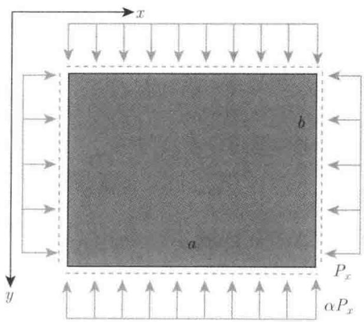

<details>
<summary>text_image</summary>

x
y
a
b
Pₓ
αPₓ
</details>

图 12-9 矩形板四边简支四边受压

2. 正交各向异性层合板面内压曲

正交各向异性层合板受压形式如图 12-10 所示。

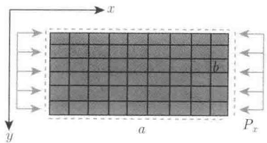

<details>
<summary>text_image</summary>

x
y
a
b
Px
</details>

图 12-10 正交各向异性层合板受压

1) 矩形板四边简支， $[0/90]_{N/2}(N$ 为偶数

根据铺层可对刚度矩阵的系数进行简化

$$
\begin{array}{l} { A _ {1 6} = A _ {2 6} = 0 \quad D _ {1 6} = D _ {2 6} = 0 \quad A _ {1 1} = A _ {2 2}} \\ { B _ {1 1} = - B _ {2 2} \quad D _ {1 1} = D _ {2 2}, \quad \text {其余} B _ {i j} = 0} \end{array} \tag {12-37}
$$

压曲稳定性基本方程

$$
\left\{ \begin{array}{l} L _ {1 1} (\Delta u ^ {0}) + L _ {1 2} (\Delta v ^ {0}) + L _ {1 3} (\Delta w) = 0 \\ L _ {1 2} (\Delta u ^ {0}) + L _ {2 2} (\Delta v ^ {0}) + L _ {2 3} (\Delta w) = 0 \\ L _ {1 3} (\Delta u ^ {0}) + L _ {2 3} (\Delta v ^ {0}) + L _ {3 3} (\Delta w) = N _ {x} \Delta w, _ {x x} + N _ {y} \Delta w, _ {y y} + 2 N _ {x y} \Delta w, _ {x y} \end{array} \right. \tag {12-38}
$$

其中， $L_{ij}$ 与层合板本构方程中的刚度矩阵系数相关，则控制方程可写为

$$
\left\{ \begin{array}{l} A _ {1 1} (\Delta u), _ {x x} + A _ {6 6} (\Delta u), _ {y y} + A _ {1 6} (\Delta v), _ {x x} + (A _ {1 2} + A _ {6 6}) (\Delta v), _ {x y} - B _ {1 1} (\Delta w), _ {x x x} = 0 \\ (A _ {1 2} + A _ {6 6}) (\Delta u), _ {x y} + A _ {6 6} (\Delta v), _ {x x} + A _ {1 1} (\Delta v), _ {y y} + B _ {1 1} (\Delta w), _ {y y y} = 0 \\ D _ {1 1} [ (\Delta w), _ {x x x x} + (\Delta w), _ {y y y y} ] + 2 (D _ {1 2} + 2 D _ {2 6}) (\Delta w), _ {x x y y} + 4 D _ {2 6} (\Delta u), _ {x y y y} \\ - B _ {1 1} [ (\Delta u), _ {x x x} - (\Delta v), _ {y y y} ] + N _ {x} \Delta w, _ {x x} = 0 \end{array} \right. \tag {12-39}
$$

为满足四边简支边界条件，取位移形式为

$$
\Delta u ^ {0} = U \cos {\frac {m \pi x}{a}} \sin {\frac {n \pi y}{b}}
$$

$$
\Delta v ^ {0} = V \sin {\frac {m \pi x}{a}} \cos {\frac {n \pi y}{b}} \tag {12-40}
$$

$$
\Delta w ^ {0} = W \sin {\frac {m \pi x}{a}} \sin {\frac {n \pi y}{b}}
$$

代入方程中得到关于 U, V, W 的方程组，令方程组的系数矩阵行列式为零，可得临界力 $N_{x}$

$$
N _ {x} = \left(\frac {a}{m \pi}\right) ^ {2} \left(T _ {3 3} + \frac {2 T _ {1 2} T _ {2 3} T _ {1 3} - T _ {2 2} T _ {1 3} ^ {2} - T _ {1 1} T _ {2 3} ^ {2}}{T _ {1 1} T _ {2 2} - T _ {1 2} ^ {2}}\right) \tag {12-41}
$$

其中， $T_{ij}$ 与层合板本构方程中的刚度矩阵系数相关。

2) 特殊正交各向异性层合板

方法同上，可得

$$
N _ {x} = \pi^ {2} \left[ D _ {1 1} \left(\frac {m}{a}\right) ^ {2} + 2 (D _ {1 2} + 2 D _ {6 6}) \left(\frac {n}{b}\right) ^ {2} + D _ {2 2} \left(\frac {n}{b}\right) ^ {4} \left(\frac {a}{m}\right) ^ {2} \right] \tag {12-42}
$$

# 12.3.4 工程算法

1. 四边简支矩形层合板的轴压屈曲载荷

$$
N _ {x} = \frac {\pi^ {2} \sqrt {D _ {1 1} D _ {2 2}}}{b ^ {2}} \left[ K - 2 \left(1 - \frac {D _ {1 2} + 2 D _ {6 6}}{\sqrt {D _ {1 1} D _ {2 2}}}\right) \right] \tag {12-43}
$$

其中， $\lambda = (a / b)(D_{22} / D_{11})^{1/4}$ 。

$$
N _ {x} = \frac {\pi^ {2} \sqrt {D _ {1 1} D _ {2 2}}}{b ^ {2}} \left[ K - 2. 4 6 \left(1 - \frac {D _ {1 2} + 2 D _ {6 6}}{\sqrt {D _ {1 1} D _ {2 2}}}\right) \right] \tag {12-44}
$$

2. 加载边简支，侧边固支矩形层合板的屈曲

$$
N _ {x} = \frac {\pi^ {2} \sqrt {D _ {1 1} D _ {2 2}}}{b ^ {2}} \left[ K - 2. 4 0 \left(1 - \frac {D _ {1 2} + 2 D _ {6 6}}{\sqrt {D _ {1 1} D _ {2 2}}}\right) \right] \tag {12-45}
$$

3. 加载边固支，侧边简支矩形层合板的屈曲

$$
N _ {x} = \frac {\pi^ {2} \sqrt {D _ {1 1} D _ {2 2}}}{b ^ {2}} \left[ K - 2. 0 \left(1 - \frac {D _ {1 2} + 2 D _ {6 6}}{\sqrt {D _ {1 1} D _ {2 2}}}\right) \right] \tag {12-46}
$$

图 12-11 给出不同边界条件下，对称层合板的 K 系数分布。

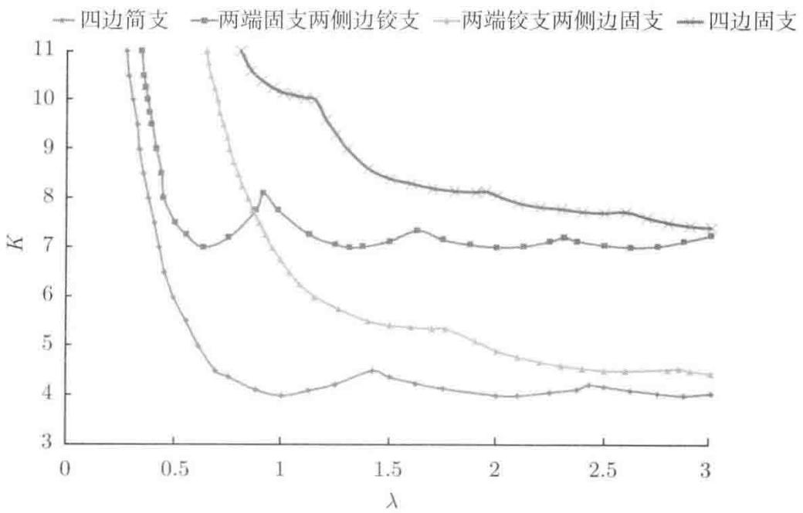

<details>
<summary>line</summary>

| λ    | 四边简支 | 两端固支两侧边铰支 | 两端铰支两侧边固支 | 四边固支 |
| ---- | -------- | ------------------- | ------------------- | -------- |
| 0.0  | 11.0     | 11.0                | 11.0                | 11.0     |
| 0.5  | 7.0      | 8.0                 | 9.0                 | 10.0     |
| 1.0  | 4.0      | 7.0                 | 6.0                 | 8.0      |
| 1.5  | 4.5      | 7.5                 | 5.5                 | 7.5      |
| 2.0  | 4.0      | 7.0                 | 5.0                 | 7.0      |
| 2.5  | 4.2      | 7.2                 | 4.5                 | 7.2      |
| 3.0  | 4.0      | 7.0                 | 4.2                 | 7.0      |
</details>

图12-11 对称层合板的 $K$ 系数

4. 正交各向异性矩形层压平板的剪切屈曲分析

剪切屈曲载荷的计算公式为

$$
N _ {x y \mathrm{cr}} = K _ {s} \frac {\pi^ {2} \sqrt [ 4 ]{D _ {1 1} D _ {2 2} ^ {3}}}{b ^ {2}} \tag {12-47}
$$

$K_{s}$ 通过查 $\alpha - K$ 和 $\beta - K$ 曲线得到, 这两个曲线分别见图12-12和图12-13。

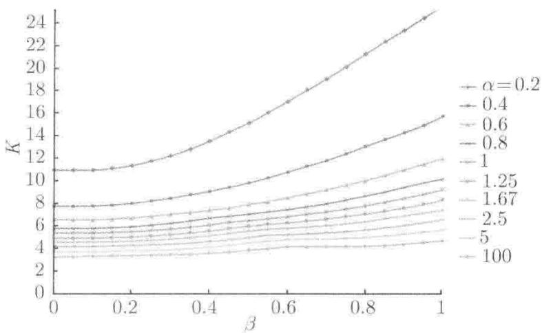

<details>
<summary>line</summary>

| β    | α=0.2 | 0.4  | 0.6  | 0.8  | 1    | 1.25 | 1.67 | 2.5  | 5    | 100  |
|------|-------|------|------|------|------|------|------|------|------|------|
| 0.0  | 11.0  | 11.0 | 11.0 | 11.0 | 11.0 | 11.0 | 11.0 | 11.0 | 11.0 | 11.0 |
| 0.2  | 11.5  | 11.5 | 11.5 | 11.5 | 11.5 | 11.5 | 11.5 | 11.5 | 11.5 | 11.5 |
| 0.4  | 13.0  | 13.0 | 13.0 | 13.0 | 13.0 | 13.0 | 13.0 | 13.0 | 13.0 | 13.0 |
| 0.6  | 15.0  | 15.0 | 15.0 | 15.0 | 15.0 | 15.0 | 15.0 | 15.0 | 15.0 | 15.0 |
| 0.8  | 17.5  | 17.5 | 17.5 | 17.5 | 17.5 | 17.5 | 17.5 | 17.5 | 17.5 | 17.5 |
| 1.0  | 24.0  | 24.0 | 24.0 | 24.0 | 24.0 | 24.0 | 24.0 | 24.0 | 24.0 | 24.0 |
</details>

图12-12 四边简支对应的 $K_{s}$

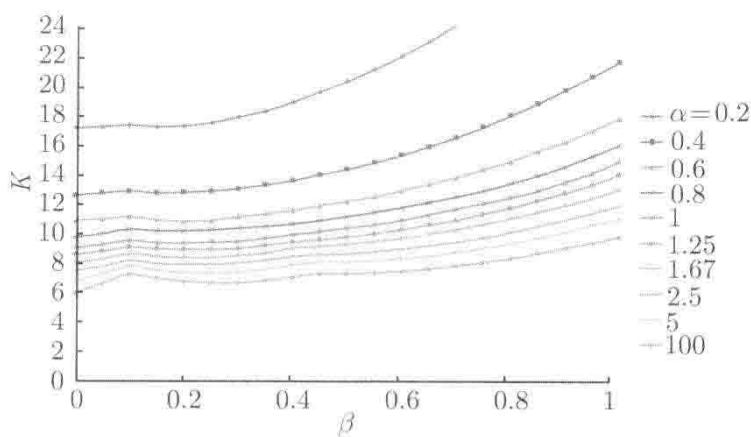

<details>
<summary>line</summary>

| β    | α=0.2 | 0.4  | 0.6  | 0.8  | 1    | 1.25 | 1.67 | 2.5  | 5    | 100  |
|------|-------|------|------|------|------|------|------|------|------|------|
| 0.0  | 17.0  | 13.0 | 11.0 | 10.0 | 9.0  | 8.0  | 7.0  | 6.0  | 5.0  | 4.0  |
| 0.2  | 17.5  | 13.5 | 11.5 | 10.5 | 9.5  | 8.5  | 7.5  | 6.5  | 5.5  | 4.5  |
| 0.4  | 18.5  | 14.5 | 12.5 | 11.5 | 10.5 | 9.5  | 8.5  | 7.5  | 6.5  | 5.5  |
| 0.6  | 20.0  | 16.0 | 14.0 | 13.0 | 12.0 | 11.0 | 10.0 | 9.0  | 8.0  | 7.0  |
| 0.8  | 22.0  | 18.0 | 16.0 | 14.5 | 13.5 | 12.5 | 11.5 | 10.5 | 9.5  | 8.5  |
| 1.0  | 24.0  | 20.0 | 18.0 | 16.5 | 15.5 | 14.5 | 13.5 | 12.5 | 11.5 | 10.5 |
</details>

图 12-13 四边固支对应的 $K_{s}$

# 12.3.5 有限元算例

矩形板的尺寸为: $a = 2000\mathrm{mm}$ , $b = 1000\mathrm{mm}$ , $[0, 90, 0]3\mathrm{s}$ , 每层 $0.5\mathrm{mm}$ , $E_{1} = 130000\mathrm{MPa}$ , $E_{2} = 9500\mathrm{MPa}$ , $\nu_{1} = 0.33$ , $G = 0.024\mathrm{GPa}$ , 四边简支, $x$ 方向均匀轴压, 分别用 ANSYS 有限元和 MSC 有限元软件模拟计算如图 12-14 和图 12-15 所示。

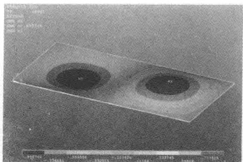

<details>
<summary>natural_image</summary>

Microscopic view of two circular dark regions on a light background, with a scale bar at the bottom (no text or symbols visible)
</details>

图 12-14 ANSYS 矩形板屈曲云图

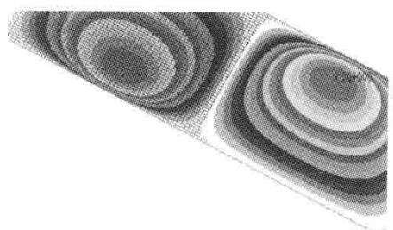

<details>
<summary>natural_image</summary>

Abstract grayscale pattern with concentric circular wave-like shapes (no text or symbols)
</details>

图 12-15 MSC 矩形板屈曲云图

表 12-2 矩形板四边简支临界载荷  
(单位: N) 

<table><tr><td>序号</td><td>ANSYS</td><td>MSC</td><td>理论</td><td>工程算法</td><td>误差</td></tr><tr><td>一阶</td><td>12.333</td><td>12.342</td><td>12.35</td><td>12.74</td><td>3.3%</td></tr><tr><td>二阶</td><td>18.548</td><td>18.562</td><td>17.4</td><td>—</td><td></td></tr><tr><td>三阶</td><td>18.696</td><td>18.712</td><td>19.29</td><td>—</td><td></td></tr></table>

表 12-3 矩形板四边固支临界载荷  
(单位: N) 

<table><tr><td>序号</td><td>ANSYS</td><td>工程算法</td><td>误差</td></tr><tr><td>一阶</td><td>30.918</td><td>30.76</td><td>0.5%</td></tr><tr><td>二阶</td><td>32.820</td><td>—</td><td></td></tr><tr><td>三阶</td><td>49.029</td><td>—</td><td></td></tr></table>

从表 12-2 和表 12-3 可以看出, 工程算法在矩形层合板的稳定性的计算中拥有较高的精度, 一方面对于相同问题可以更快地得到结果, 另一方面在对有限元分析结果的评估上具有良好的工程指导意义。

# 12.3.6 层合板的有限元分析

# 1. 建模

屈曲分析中根据基本假设将空间问题转化为平面应力问题来求解，采用有限元方法对层合板和夹芯板进行屈曲分析时，应当选择适当的单元类型，例如，在ANSYS中选用 shell281 单元类型；然后根据具体的情况选择是否考虑剪切效应，目前在ANSYS中 shell281 单元可以考虑到一阶剪切效应，需要用户输入横向剪切刚度矩阵，如图 12-16 所示。划分有限元网格时，网格的数量应能合理反映失稳模态。

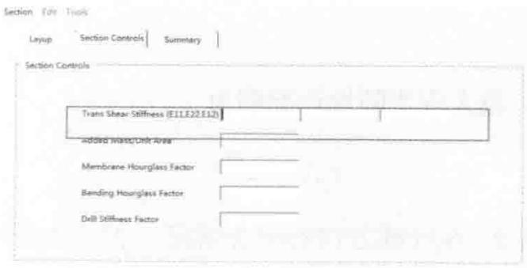

<details>
<summary>text_image</summary>

Section 4th Tools
Layup Section Controls Summary
Section Controls
Trans Shear Stiffness (E11,E22,E12)
Added Mass/Unit Area
Membrane Hourglass Factor
Bending Hourglass Factor
Delt Stiffness Factor
</details>

图 12-16 剪切刚度输入界面

# 2. 边界条件模拟

# 1) 四边简支

(1) 边界。x = 0, a; y = 0, b 时，w = 0。   
(2) 点。x=0; y=0 时，u=v=0。  
(3) 点。x = a; y = 0, b 时，v = 0。

2) 四边固支

(1) 边界。x = 0, a 时， $w = \theta, y = 0$ 。  
(2) 边界。y = 0, b 时，w = $\theta$ , x = 0。   
(3) 点。x = 0; y = 0 时，u = v = 0。   
(4) 点。x = a; y = 0 时，v = 0。

3) 其他边界条件

如边界不同时为固支或简支，类似处理。

4) 弹性支持

在面板各边界点上加弹簧元表示弹性支持。

# 3. 临界载荷

利用有限元软件自带的屈曲模块进行屈曲分析，所得结果为各阶的稳定特征值，若利用最小的特征值 $\lambda_{1}$ 进行简单的运算便可得到该构件在相应边界条件下的屈曲临界载荷。

当施加线载荷 P 时， $N_{cr} = \lambda_{1} \times P$ 。

当在节点上施加节点力 F 时， $N_{cr} = \lambda_{1} \times F / \left( \frac{\text{边长}}{\text{节点数} - 1} \right)$ 。

# 12.4 纤维失效分析

单层/层合板中的第一根玻纤破坏定义为纤维失效，而纤维强度或者应变失效主要是基于单层或者层合板的测试结果。静态测试中，单层布/层合板的失效的定义则是单层布/层合板中的纤维断裂。

# 1. 最大应变失效准则

独立载荷作用下，最大应变的设计准则为

$$
\varepsilon_ {n k} <   \hat {\varepsilon} _ {k} ^ {\text {fiber}} \tag {12-48}
$$

其中， $\varepsilon_{nk}$ 为设计载荷下，在纤维方向的应变响应； $\hat{\varepsilon}_k^{\mathrm{fiber}}$ 为纤维失效的轴向应变设计值。

对于层合板各纤维方向的局部分析系数按照式 (12-49) 获得

$$
\gamma = E _ {\mathrm{lin}} / E _ {\mathrm{nonlin}} \tag {12-49}
$$

其中， $E_{lin}$ 和 $E_{nonlin}$ 是层合板的模量（刚度），与考虑纤维方向后的加载有关。 $E_{lin}$ 是层合板的刚度，是基于初始层的属性； $E_{nonlin}$ 是减弱的层合板刚度，是由于基体破坏而得到的减弱的层的属性，它们之间的关系如图 12-17 所示。

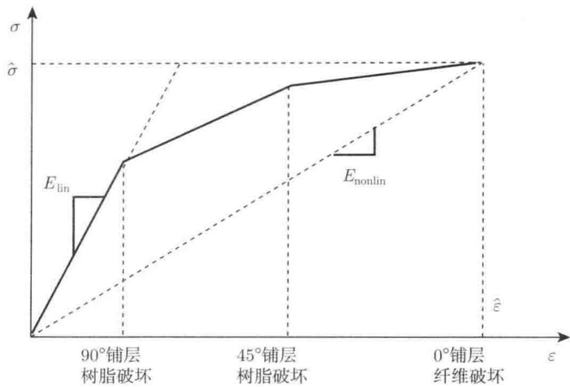

<details>
<summary>line</summary>

| ε       | σ (E_lin) | σ (E_nonlin) |
| ------- | --------- | ------------ |
| 0°      | -         | -            |
| 45°     | -         | -            |
| 90°     | -         | -            |
</details>

图 12-17 含 $0^{\circ}$ 、 $45^{\circ}$ 和 $90^{\circ}$ 层合板的典型应力-应变关系

对于拉伸和压缩应变，最大应变失效准则可用于验证平行于纤维的所有方向。

# 2. Tsai-Hill 失效准则

当两个或者更多的面内应力被应用到一个层合板/单层布，一个有用的失效准则是 Tsai-Hill 准则最大畸变能理论。这个理论考虑了应力的相互作用，可以表示为 2D 形式

$$
\left(\frac {\sigma_ {1}}{X}\right) ^ {2} + \left(\frac {\sigma_ {2}}{Y}\right) ^ {2} - \frac {\sigma_ {1} \sigma_ {2}}{X ^ {2}} + \left(\frac {\tau_ {1 2}}{S}\right) ^ {2} = 1 \tag {12-50}
$$

其中，X 和 Y 为拉伸和压缩强度。不同的材料，对于拉伸应力用拉伸强度，而对于压缩应力则用压缩强度。Tsai-Hill 理论中，破坏强度 X, Y, S 之间存在重要的相互联系，而其他理论假定 3 种破坏是单独发生的。Tsai-Hill 失效准则适用于 E-玻璃纤维/环氧树脂制成的单向层合板在偏轴向方向单独拉伸或压缩的判断。

# 3. Hoffmann 失效准则

Tsai-Hill 理论未考虑拉伸、压缩性能不同的复合材料，Hoffmann 提出如下新理论：

$$
\frac {\sigma_ {1} ^ {2}}{X _ {t} X _ {c}} - \frac {\sigma_ {1} \sigma_ {2}}{X _ {t} X _ {c}} + \frac {\sigma_ {2} ^ {2}}{Y _ {t} Y _ {c}} + \frac {X _ {c} - X _ {t}}{X _ {t} X _ {c}} \sigma_ {1} + \frac {Y _ {c} - Y _ {t}}{Y _ {t} Y _ {c}} \sigma_ {2} + \frac {\tau_ {1 2} ^ {2}}{S ^ {2}} = 1 \tag {12-51}
$$

当 $X_{t} = X_{c}, Y_{t} = Y_{c}$ 时 (这里 $X_{c}, Y_{c}$ 均取正值), 式 (12-51) 即为 Tsai-Hill 失效准则。

4. Tsai-Wu 失效准则

$$
\left\{ \begin{array}{l} F _ {1 1} \sigma_ {1} ^ {2} + 2 F _ {1 2} \sigma_ {1} \sigma_ {2} + F _ {2 2} \sigma_ {2} ^ {2} + F _ {6 6} \sigma_ {6} ^ {2} + F _ {1} \sigma_ {1} + F _ {2} \sigma_ {2} = 1 \\ F _ {1 1} = \frac {1}{X _ {t} X _ {c}}, F _ {1} = \frac {1}{X _ {t}} - \frac {1}{X _ {c}}, F _ {2 2} = \frac {1}{Y _ {t} Y _ {c}} \\ F _ {2} = \frac {1}{Y _ {t}} - \frac {1}{Y _ {c}}, F _ {6 6} = \frac {1}{S ^ {2}}, \sigma_ {6} = \tau_ {1 2} \end{array} \right. \tag {12-52}
$$

其中， $-1 < F_{12}^{*} < 1, F_{12}^{*} = F_{12} / \sqrt{F_{11}F_{22}}$ 。一般 $F_{12}^{*} = -0.5$

# 12.5 树脂失效分析

树脂破裂被定义为树脂的初始破裂。本章所阐述的树脂破裂准则不包含高应力或应变下树脂破裂的增长。一般而言，有两种设计准则可供选择：最大应力失效准则和 Puck 准则。例如，在压缩载荷作用下楔形树脂破裂导致结构失效，Puck 准则可用于获得失效面的方向。另外，树脂失效不是在层合板范围内分析，而通常是根据单层进行审核。

树脂破裂最初只是个简单的概念，但其实细节非常复杂。很多层合板结构在制造期间已存在树脂破裂，这些裂纹在固化期内通过热应力或树脂收缩而扩展。无树脂破裂的层合板，在最初形成破裂时即存在初始层应力，一旦形成裂纹，则在高应力下，裂纹开始生长且开始形成附加裂纹，这种裂纹构造最终将导致刚度的变化，此处称为树脂破裂点或第一层失效。层合板最终体现为破裂饱和，且在载荷作用下不会再破裂。在很多文献里指出这种情况下的模量改变与树脂破裂密度相关。

# 1. 最大应力失效准则

最大应力准则应用于单方向的应力相比其他方向起主导作用。在这种情况下，简化的最大应力失效准则中，主导应力为

$$
\sigma_ {n k} <   \hat {\sigma} _ {n k} ^ {\text { matrix }} \tag {12-53}
$$

其中，n 为主导应力方向； $\sigma_{nk}$ 为设计载荷下 n 方向，结构局部载荷效应（应力）； $\hat{\sigma}_{nk}^{matrix}$ 为树脂破裂方向的应力分量设计值。

树脂最大应力存在方向性, 主要源于纤维的应力集中, 纤维纵向的树脂应力通常比横向大很多。

当没有主导应力的情况下，简化的最大应力失效准则不再适用，此时需要评估应力分量的组合效应，复杂应力的最大应力失效准则为

$$
\sqrt {\sum_ {n} \left(\frac {\sigma_ {n k}}{\hat {\sigma} _ {n k} ^ {\text { matrix }}}\right) ^ {2}} <   1 \tag {12-54}
$$

其中，n 为铺层坐标系； $\sigma_{nk}$ 为设计载荷下 n 方向，结构局部载荷效应 (应力)； $\hat{\sigma}_{nk}^{matrix}$ 为方向 n 下树脂破裂的应力分量设计值。

# 2. Puck 准则

Puck 强度理论是基于库仑-莫尔脆性破坏假设，由于该理论符合实际并且使用方便，被广泛使用 $^{[30]}$ 。

Puck 理论涉及 4 个基本内容:

(1) 纤维间失效前的非线性应力应变分析;   
(2) 关于作用面的纤维失效和纤维间失效的破坏准则;  
(3) 纤维间失效开始后的连续性退化;  
(4) 层合板弯曲失效的注意事项。

实验所得，单向复合材料的破坏属于脆性破坏。因此，用于分析塑性金属材料的“von Mises 屈服准则”和类似的一些屈服准则就不再适用。

对于一个单向复合材料单元，有 6 种不同形式的应力会造成材料破坏，如图 12-18 所示。

<table><tr><td>σ∥t</td><td>σ⊥t</td><td>τ⊥t</td><td>τ⊥∥</td></tr><tr><td>σ∥t</td><td>σ⊥t</td><td>τ⊥∥</td><td>τ∥∥</td></tr><tr><td>FF</td><td colspan="3">IFF</td></tr></table>

图 12-18 复合材料破坏

与 6 种形式的应力对应的有 6 种强度:

$$
R _ {| |} ^ {t}, R _ {| |} ^ {c}, R _ {\perp} ^ {t}, R _ {\perp} ^ {c}, R _ {\perp \perp}, R _ {\perp | |}
$$

破坏面上的法向应力 $\sigma_{n}$ 和切向应力 $\sigma_{nt}, \sigma_{nl}$ 是导致纤维间破坏的主要原因。法向拉应力 $\sigma_{n}$ 促使材料破坏，而法向压应力能减缓材料发生破坏。Puck 准则的坐标系与应力分量如图 12-19 所示。

纤维破坏-FF:

$$
\left\{ \begin{array}{l l} \frac {\sigma_ {1}}{R _ {| |} ^ {t}} = 1, & \sigma_ {1} > 0 \\ \frac {\sigma_ {1}}{\left(- R _ {| |} ^ {c}\right)} = 1, & \sigma_ {1} <   0 \end{array} \right. \tag {12-55}
$$

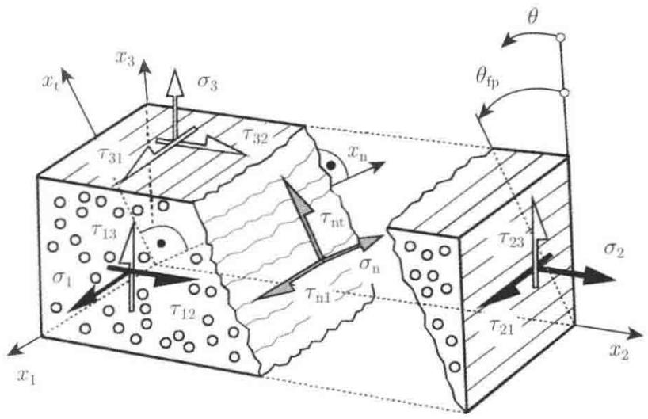

<details>
<summary>text_image</summary>

x_t
x_3
σ_3
τ_31
τ_32
x_u
τ_nt
τ_13
σ_1
τ_12
x_1
τ_n1
σ_n
τ_23
θ
θ_fp
σ_2
τ_21
x_2
</details>

图 12-19 Puck 准则的坐标系与应力分量

纤维间破坏-IFF:

$$
\left\{ \begin{array}{l l} \left(\frac {\tau_ {\mathrm{nt}}}{R _ {\perp \perp} ^ {A}}\right) ^ {2} + \left(\frac {\tau_ {\mathrm{nl}}}{R _ {\perp | |} ^ {A}}\right) ^ {2} + (1 - c) \left(\frac {\sigma_ {\mathrm{n}}}{R _ {\perp} ^ {t A}}\right) ^ {2} + c \left(\frac {\sigma_ {\mathrm{n}}}{R _ {\perp} ^ {t A}}\right) = 1, & \sigma_ {\mathrm{n}} \geqslant 0 \\ \left(\frac {\tau_ {\mathrm{nt}}}{R _ {\perp \perp} ^ {A} - p _ {\perp \perp} ^ {c} \times \sigma_ {\mathrm{n}}}\right) ^ {2} + \left(\frac {\tau_ {\mathrm{nl}}}{R _ {\perp | |} ^ {A} - p _ {\perp | |} ^ {c} \times \sigma_ {\mathrm{n}}}\right) ^ {2} = 1, & \sigma_ {\mathrm{n}} <   0 \end{array} \right. \tag {12-56}
$$

其中，常数 c 表示纤维间破坏描述的曲线上， $(\tau_{\mathrm{nt}}, \tau_{\mathrm{nl}})$ 平面内 $\sigma_{n} = 0$ 所在点的斜率。 $\sigma_{n}, \tau_{nt}, \tau_{nl}$ 是由 5 个应力分量转换得到，公式如下：

$$
\left\{ \begin{array}{l} \sigma_ {\mathrm{n}} (\theta_ {f p}) \\ \tau_ {\mathrm{nt}} (\theta_ {f p}) \\ \tau_ {\mathrm{nl}} (\theta_ {f p}) \end{array} \right\} = \left[ \begin{array}{c c c c c} c ^ {2} & s ^ {2} & 2 s c & 0 & 0 \\ - s c & s c & (c ^ {2} - s ^ {2}) & 0 & 0 \\ 0 & 0 & 0 & s & c \end{array} \right] \left\{ \begin{array}{l} \sigma_ {2} \\ \sigma_ {3} \\ \tau_ {2 3} \\ \tau_ {3 1} \\ \tau_ {2 1} \end{array} \right\} \tag {12-57}
$$

其中， $c=\cos\theta_{fp}$ ; $s=\sin\theta_{fp}$ 。

$R_{\perp}^{tA}, R_{\perp\perp}^{A}, R_{\perp\parallel}^{A}$ 中的 A 表示作用面。不能混淆作用面上的抗力 $R_{\perp\perp}^{A}$ 和强度 $R_{\perp\perp}$ ， $R_{\perp\perp}^{A}$ 的值不能通过纯剪切试验得到，只能通过横向压缩试验的结果再经过计算得到。

根据 GL 2010 $^{[14]}$ ，确定 Puck 准则的参数 $p_{\perp\perp}^{c}=0.25, p_{\perp\parallel}^{c}=0.3$ 。

# 3. 面内剪切失效

潜在的树脂面内剪切失效模式可通过最大应力失效准则校核，仅需应用面内剪切应力 $\tau_{12}$ 来判断。对于简化的 2D 面内剪切，设计准则归纳为

$$
\tau_ {1 2} <   \hat {\tau} _ {1 2} ^ {\text { matrix }} \tag {12-58}
$$

其中， $\tau_{12}$ 为面内剪切应力； $\hat{\tau}_{12}^{matrix}$ 为树脂面内剪切应力设计值。

# 4. von Mises 屈服准则

von Mises 屈服准则可用于评估屈服载荷下各向同性材料，如树脂可看作 FRP 层合板典型的各向同性材料。von Mises 屈服准则为

$$
\sqrt {(\sigma_ {1} - \sigma_ {2}) ^ {2} + (\sigma_ {2} - \sigma_ {3}) ^ {2} + (\sigma_ {3} - \sigma_ {1}) ^ {2}} <   \sigma_ {y} \tag {12-59}
$$

其中， $\sigma_{n}$ 为主应力，设计载荷对应的 n=1,2,3； $\sigma_{y}$ 为材料屈服应力的设计值。

当两种或更多载荷出现，每个应力分量 $\sigma_{n}$ 是由组合载荷引起的。在这种情况下，对于每个应力分量 $\sigma_{nj}$ 单独考虑，即载荷 j 作用下的方向 n 的结构局部响应。除非可以充分地证明结构能允许大变形，否则任何树脂材料的屈服都是不可接受的。

# 12.6 层合板在叶片上的应用

叶片的承力梁结构相当于复合材料层合板模型，将多层单层黏合在一起组成整体的单向带，如图 12-20 所示。叶片主梁、前缘梁和尾缘梁的单向带主要是沿叶片展向的单向布黏接而成。

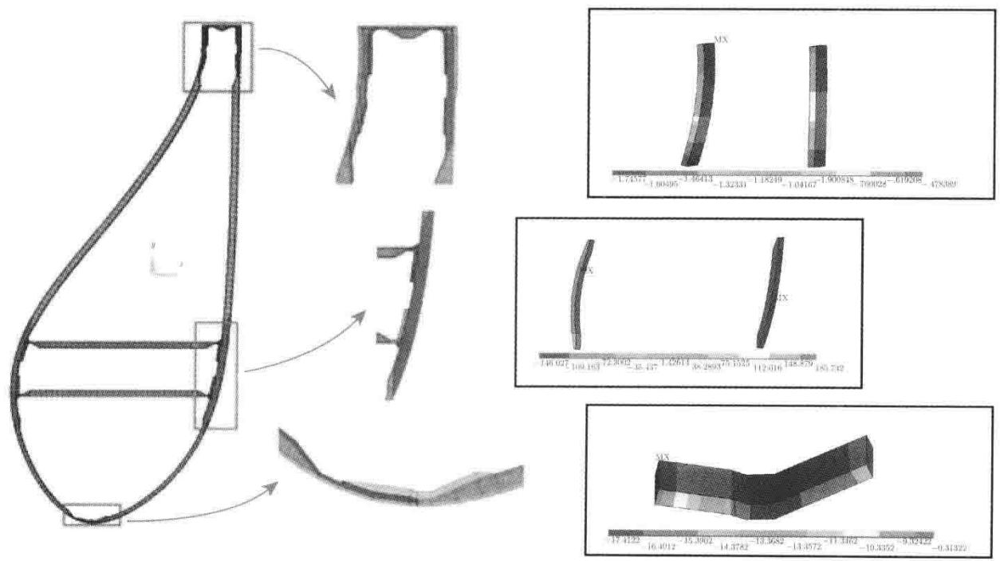

<details>
<summary>text_image</summary>

Archaeological site plan with structural diagrams and corresponding 3D model views labeled MX, IX, and numerical values
</details>

图 12-20 叶片前缘梁、主梁和尾缘梁的层合板结构

叶片铺层为层合板形式，如图 12-21 所示，根据层合板理论中沿层板厚度方向的应力与应变，可知叶片主梁段最外层的应变应大于叶片最内层，因此在叶片主梁设计与校核中应着重验证主梁最外层的应力与应变。

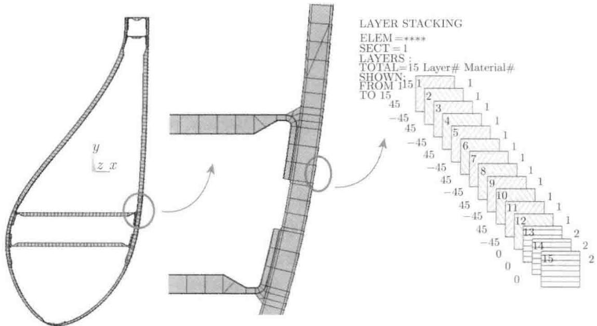

<details>
<summary>text_image</summary>

y
z x
LAYER STACKING
ELEM =****
SECT = 1
LAYERS :
TOTAL=15 Layer# Material#
SHOWN:
FROM 115
TO 15
45
-45
45
-45
45
-45
45
-45
45
-45
45
-45
45
-45
45
-45
45
-45
45
-45
45
-45
45
-45
45
-45
45
-45
45
-45
</details>

图 12-21 叶片铺层的层合板结构示意图

# 第 13 章 夹芯结构分析

# 13.1 夹芯结构基础

夹芯结构，由两块高强度面板与两面板间的夹芯所组成，如图 13-1 所示。芯材刚度较小，故通常在平行面板平面内刚度甚微，故可认为夹芯只承受横向剪切内力。夹芯结构设计的目的是减少重量、增加刚度和减少总的产品成本。对结构设计来说，主要的问题是在规定的变形、外形、重量和成本的情况下，使设计的夹芯结构能合理地承受载荷与传递载荷。夹芯结构厚度示意图如图 13-2 所示。图中， $t_{1}$ 和 $t_{2}$ 为面板厚度，h 为夹芯厚度。

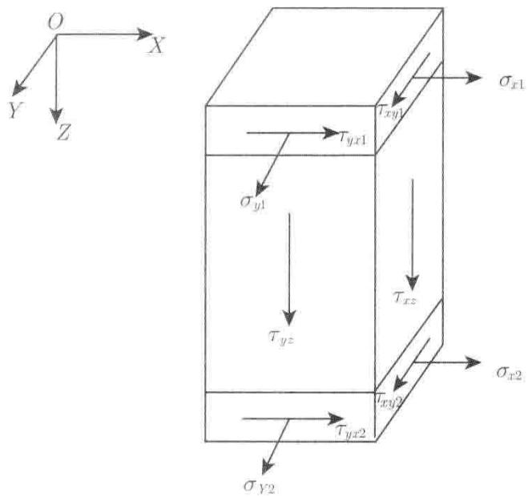

<details>
<summary>text_image</summary>

O
X
Y
Z
σx1
τxy1
τyx1
σy1
τyz
τxz
σx2
τxy2
τyx2
σy2
</details>

图 13-1 夹芯结构示意图

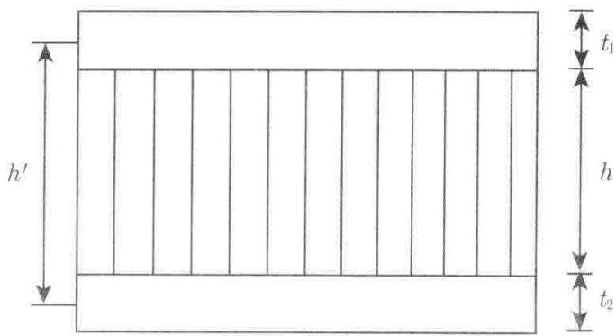

<details>
<summary>text_image</summary>

h'
t₁
h
t₂
</details>

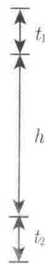  
图 13-2 夹芯结构厚度示意图

夹芯结构具有下列特点 $^{[28]}$ :

(1) 具有大的弯曲刚度/重量比及弯曲强度/重量比;  
(2) 具有良好的吸声、隔声和隔热性能;  
(3) 具有大的临界屈曲载荷;  
(4) 对湿热环境敏感，设计时要防潮密封；  
(5) 面板薄时对低能冲击敏感;   
(6) 修补较困难。

# 13.2 夹芯结构设计

夹芯结构适用于次级传力结构，风力机叶片中抗屈曲的结构件主要为夹芯结构形式。

# 13.2.1 夹芯结构设计准则

夹芯结构设计应满足下列设计准则 $^{[28]}$ :

(1) 在 “设计外加载荷” 下, 面板的面内应力应小于材料强度, 或在设计载荷下, 面板应变小于考虑损伤容限的许用应变;  
(2) 芯材应有足够的厚度、强度和刚度，以保证在“设计外加载荷”作用下，夹层板不发生总体屈曲、剪切破坏以及过大的挠度；  
(3) 芯材应有足够的弹性模量，以及夹芯结构在垂直方向上应有足够的拉、压强度，以保证在“设计外加载荷”下，面板不发生皱曲；  
(4) 面板应足够厚，以防止在“设计外加载荷”作用下发生格内面板失稳；  
(5) 应尽量避免夹芯结构承受垂直于平面方向的局部集中载荷，以防止局部芯子压塌或拉脱，当集中载荷不可避免时，应采取结构保护措施，将传到芯材的集中载荷分散到其他承力构件上。

# 13.2.2 设计要点

目前较常用的夹芯结构有蜂窝板和泡沫夹芯，从类型上可分全高度夹层和等高度夹层板。

一般对于翼型较薄的结构采用全高度夹层，由于此时夹层上下的面板都是气动外形面，因此对其要求较高，需要在工艺上采取一定的措施来加以保证，否则会产生很多制造缺陷，如脱胶、弱胶、芯子压塌等。

对于翼型较高的结构采用等高度的夹层板，此时夹层的一面位于气动外形面，而另一面则属于内部结构，对外形要求较低，这样只需采取一定的措施充分保证外形面的胶接质量即可。

风力机叶片的夹芯结构分为壳体夹芯和腹板夹芯，壳体夹芯的一面面板属于气动外形面，应当做等高度夹层板设计，而芯材与其他部件连接处，则需做圆角或斜角进行过渡；此外，腹板夹芯的两面面板都不属于气动外形面。

# 13.3 夹芯结构分析

# 13.3.1 基本参数

如图 13-3 所示，夹芯结构由面板和芯子组成，上、下面板厚度分别为 $t_{1}$ 、 $t_{2}$ ，芯子高度为 c，芯子边长为 b，芯格间距为 S。对于夹芯结构在设计中首先关注的是夹层板弯曲刚度、拉压刚度和剪切刚度。

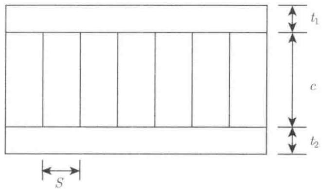

<details>
<summary>text_image</summary>

S
t₁
c
t₂
</details>

图 13-3 夹芯结构参数定义

夹层板弯曲刚度:

$$
D _ {i} = \frac {E _ {f i} t _ {f} (t _ {f} + c) ^ {2}}{2} + \frac {E _ {f i} t _ {f} ^ {3}}{6} \quad (i = x, y) \tag {13-1}
$$

夹层板拉压刚度:

$$
H _ {i} = 2 E _ {f i} t _ {f} \quad (i = x, y) \tag {13-2}
$$

夹层板剪切刚度:

$$
U _ {L T} = \frac {(t _ {f} + c) ^ {2}}{c} G _ {\mathrm{CLT}} \approx (t _ {f} + c) G _ {\mathrm{CLT}} \tag {13-3}
$$

$$
U _ {W T} = \frac {(t _ {f} + c) ^ {2}}{c} G _ {\mathrm{CWT}} \approx (t _ {f} + c) G _ {\mathrm{CWT}} \tag {13-4}
$$

其中， $E_{fi}$ 为面板的弹性模量； $t_{f}$ 为面板的总厚度， $t_{f}=t_{1}+t_{2}$ ; $G_{CLT}$ 、 $G_{CWT}$ 分别为芯材纵、横向剪切模量。

# 13.3.2 局部失效分析

# 1. 夹芯结构典型失效机理

由于层板与夹芯之间的相互作用，夹芯结构存在附加的失效机理。典型的夹芯失效模式如图 13-4 所示，失效模式的解释见表 13-1。

表 13-1 失效模式

<table><tr><td>序号</td><td>失效模式</td><td>序号</td><td>失效模式</td></tr><tr><td>a</td><td>层板/芯材失效</td><td>e</td><td>总体屈曲</td></tr><tr><td>b</td><td>芯材剪切</td><td>f</td><td>剪切压皱屈曲</td></tr><tr><td>c</td><td>层板起皱屈曲</td><td>g</td><td>层板表面微凸屈曲</td></tr><tr><td>d</td><td>分层</td><td>h</td><td>芯材凹陷</td></tr></table>

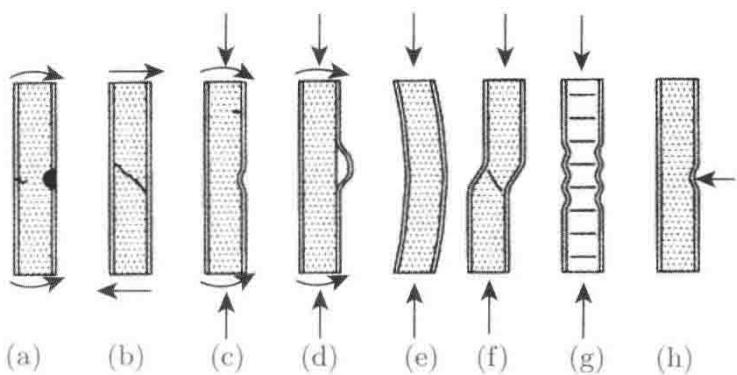

<details>
<summary>text_image</summary>

(a)
(b)
(c)
(d)
(e)
(f)
(g)
(h)
</details>

图 13-4 典型夹芯结构失效模式

多种情况下，芯材主导应力为剪切，包括剪切屈服、极限剪切失效或全厚度方向的 $45^{\circ}$ 拉伸破坏。同时，由于局部压缩应力导致的芯材凹陷也应校核，若压缩强度超过芯材许用强度则会出现芯材凹陷。

# 2.夹芯结构界面

夹芯结构的面板可用层合板方法来分析，两边面板都需进行失效校核，因为它们在弯矩作用下会呈现不同的应力状态。

夹芯结构的面板和芯材间的界面破坏应分析层间应力，根据设计准则分析代表材料的特性。界面特性通常不同于芯材或面板特性，理应通过试验确定。

叶片里常用的芯材为 PVC 和 Balsa 木，PVC 芯材的夹芯结构中，界面典型地表现出无方向性破坏，而界面以下的破坏往往发生在 PVC 芯材内。另外，Balsa 木芯材的夹芯结构的破坏典型发生在界面。

# 3.夹芯结构屈曲

夹芯结构表现出一些经典的屈曲模式，但同时也应评估一定的附加模式，如层

板起皱、剪切皱纹和层板表面微凸。

面板起皱发生于层板法向压缩应力将达到局部不稳定（或起皱）应力的情况下：

$$
\bar {\sigma} _ {\text { face }} \geqslant \hat {\sigma} _ {\text { wrinkling }} \tag {13-5}
$$

剪切皱纹发生于法向应力将达到起皱应力的情况下:

$$
\bar {\sigma} _ {\text { face }} \geqslant \hat {\sigma} _ {\text { crimping }} \tag {13-6}
$$

层板表面微凸或屈曲仅发生于蜂窝和波纹状芯材的夹芯结构中。层板表面微凸发生于压缩应力达到蜂窝单元或波纹状单元的屈曲应力的情况下：

$$
\bar {\sigma} _ {\text { core }} \geqslant \hat {\sigma} _ {\text { dinpling }} \tag {13-7}
$$

# 13.4 夹芯结构分析方法

# 13.4.1 各向同性材料面板夹芯板

如图 13-5 所示，如果面板的弹性模量 E 对平行于面板方向的夹芯弹性模量 $\bar{E}_{x}$ 、 $\bar{E}_{y}$ 之比很大，而面板厚度 t 与夹芯厚度 h 之比为 $\bar{E}_{x}h/E(t_{1}+t_{2})<0.1$ ， $\bar{E}_{y}h/E(t_{1}+t_{2})<0.1$ ，这样的夹芯可以视为软夹芯。软夹芯的刚性较小，尤其在平行面板平面内刚性甚微，因而可以认为软夹芯只承受横向剪切内力，而平行面板的内力与内力矩由面板来承受。

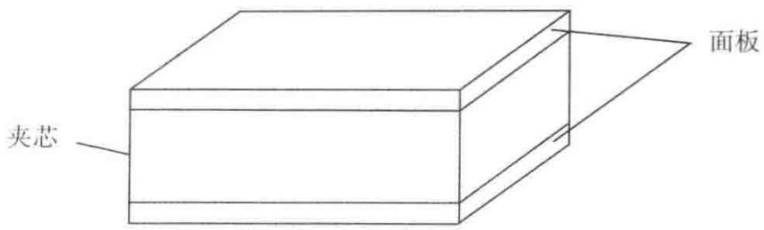

<details>
<summary>text_image</summary>

夹芯
面板
</details>

图 13-5 夹芯结构面板与芯材

# 1. 基本假设

这里的夹芯结构主要是由两块各向同性的薄面板与各向同性或正交各向异性软夹芯构成的夹层板。

整体稳定性分析中，采用以下基本假设：

(1) 忽略夹芯在平行面板方向的刚度，即 $\bar{E}_{x} = \bar{E}_{y} = \bar{G}_{xy} = 0;$   
(2) 夹芯横向不可压缩，即 $\bar{E}_{z} = \infty;$

(3) 面板很薄 $(t_{1} \ll h, t_{2} \ll h)$ ，面板自身弯曲刚度 $\bar{D}$ 可以忽略不计（但在受载荷的夹芯板弯曲问题中不可忽略 $\bar{D}$ ）；

(4) 夹芯结构的总厚度远比板的长宽小;

(5) 采用线性理论。

特别说明，在局部稳定性分析中， $\bar{D}$ 和 $\bar{E}_{z}$ 都取有限值。

这里给出的夹芯板是由各向同性面板与正交各向异性(或各向同性)夹芯所组成的夹芯板, 计算在各种载荷及边界条件下的弹性失稳的临界力。根据相关曲线,可以用插值法求得具有各种参数值的矩形夹芯板的临界应力。

# 2.均匀轴压

面板临界应力按式（13-8）计算[26]：

$$
\sigma_ {x, c r i} = K \pi^ {2} \frac {E _ {1} t _ {1} E _ {2} t _ {2}}{(E _ {1} t _ {1} + E _ {2} t _ {2}) ^ {2}} \frac {\left(h + \frac {t _ {1} + t _ {2}}{2}\right) ^ {2}}{b ^ {2}} \frac {E _ {i}}{1 - \mu^ {2}} \tag {13-8}
$$

其中， $K = K_{h} + K_{f}$ 。

$K_{f}$ 根据 a/b, k, g 的值及边界条件可由图 13-6\~图 13-17 查出。

$$
k = \frac {\pi^ {2} h E _ {1} t _ {1} E _ {2} t _ {2}}{(1 - \mu^ {2}) b ^ {2} G _ {x z} (E _ {1} t _ {1} + E _ {2} t _ {2})} \tag {13-9}
$$

$$
g = \frac {G _ {y z}}{G _ {x z}} \tag {13-10}
$$

$$
K _ {h} = \frac {(E _ {1} t _ {1} ^ {3} + E _ {2} t _ {2} ^ {3}) (E _ {1} t _ {1} + E _ {2} t _ {2})}{1 2 E _ {1} t _ {1} E _ {2} t _ {2} \left(h + \frac {t _ {1} + t _ {2}}{2}\right) ^ {2}} K _ {f 0} \tag {13-11}
$$

其中， $K_{f0}$ 是 k=0 时的 $K_{f}$ 值。

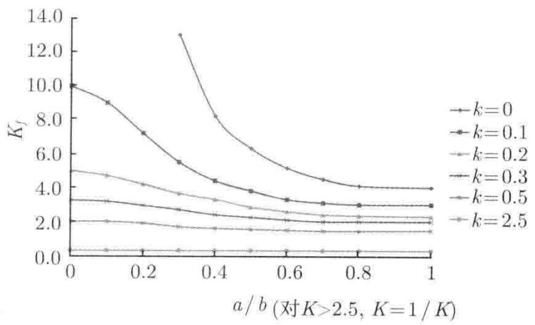

<details>
<summary>line</summary>

| a/b | k=0   | k=0.1 | k=0.2 | k=0.3 | k=0.5 | k=2.5 |
|-----|-------|-------|-------|-------|-------|-------|
| 0.0 | 10.0  | 10.0  | 5.0   | 3.5   | 2.5   | 0.0   |
| 0.2 | 9.0   | 7.5   | 4.5   | 3.0   | 2.2   | 0.0   |
| 0.4 | 8.0   | 6.0   | 4.0   | 2.8   | 2.0   | 0.0   |
| 0.6 | 7.0   | 5.0   | 3.5   | 2.5   | 1.8   | 0.0   |
| 0.8 | 6.0   | 4.5   | 3.2   | 2.3   | 1.7   | 0.0   |
| 1.0 | 5.5   | 4.2   | 3.0   | 2.2   | 1.6   | 0.0   |
</details>

图13-6 四边简支 $g = 0.4$

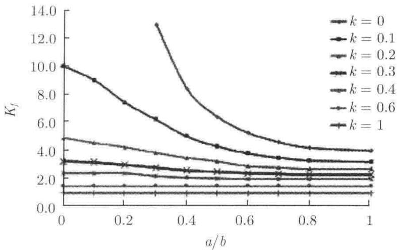

<details>
<summary>line</summary>

| a/b | k = 0 | k = 0.1 | k = 0.2 | k = 0.3 | k = 0.4 | k = 0.6 | k = 1 |
| --- | --- | --- | --- | --- | --- | --- | --- |
| 0.0 | 10.0 | 10.0 | 5.0 | 3.5 | 3.5 | 2.5 | 1.5 |
| 0.2 | 8.0 | 9.0 | 4.5 | 3.0 | 3.0 | 2.5 | 1.5 |
| 0.4 | 6.0 | 7.0 | 4.0 | 2.5 | 2.5 | 2.5 | 1.5 |
| 0.6 | 5.0 | 6.0 | 3.5 | 2.5 | 2.5 | 2.5 | 1.5 |
| 0.8 | 4.5 | 5.0 | 3.5 | 2.5 | 2.5 | 2.5 | 1.5 |
| 1.0 | 4.0 | 4.5 | 3.5 | 2.5 | 2.5 | 2.5 | 1.5 |
</details>

图13-7 四边简支 $g = 1$

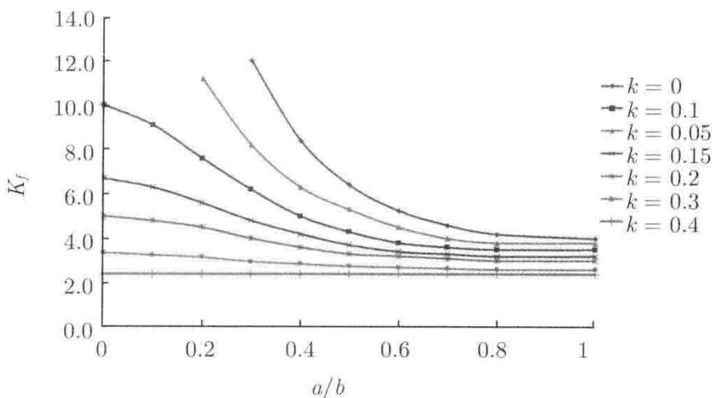

<details>
<summary>line</summary>

| a/b | k = 0 | k = 0.1 | k = 0.05 | k = 0.15 | k = 0.2 | k = 0.3 | k = 0.4 |
| --- | --- | --- | --- | --- | --- | --- | --- |
| 0.0 | 10.0 | 10.0 | 7.0 | 6.8 | 5.2 | 3.8 | 2.8 |
| 0.2 | 9.0 | 8.0 | 6.5 | 6.2 | 5.0 | 3.6 | 2.7 |
| 0.4 | 8.0 | 6.5 | 5.5 | 5.2 | 4.5 | 3.4 | 2.6 |
| 0.6 | 7.0 | 5.5 | 4.8 | 4.6 | 4.2 | 3.3 | 2.5 |
| 0.8 | 6.0 | 4.8 | 4.3 | 4.2 | 4.0 | 3.2 | 2.4 |
| 1.0 | 5.5 | 4.5 | 4.1 | 4.0 | 3.8 | 3.1 | 2.3 |
</details>

图13-8 四边简支 $g = 2.5$

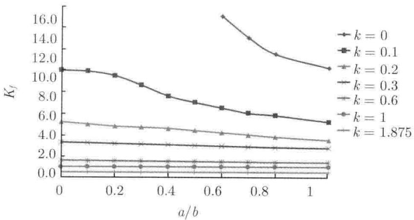

<details>
<summary>line</summary>

| a/b | k = 0 | k = 0.1 | k = 0.2 | k = 0.3 | k = 0.6 | k = 1 | k = 1.875 |
| --- | --- | --- | --- | --- | --- | --- | --- |
| 0.0 | 11.0 | 11.0 | 5.5 | 3.5 | 2.5 | 1.0 | 0.5 |
| 0.2 | 10.5 | 10.5 | 5.0 | 3.5 | 2.5 | 1.0 | 0.5 |
| 0.4 | 9.0 | 9.0 | 4.5 | 3.5 | 2.5 | 1.0 | 0.5 |
| 0.6 | 7.5 | 7.5 | 4.0 | 3.5 | 2.5 | 1.0 | 0.5 |
| 0.8 | 6.0 | 6.0 | 3.5 | 3.5 | 2.5 | 1.0 | 0.5 |
| 1.0 | 5.0 | 5.0 | 3.0 | 3.5 | 2.5 | 1.0 | 0.5 |
</details>

图13-9 四边固支 $g = 0.4$

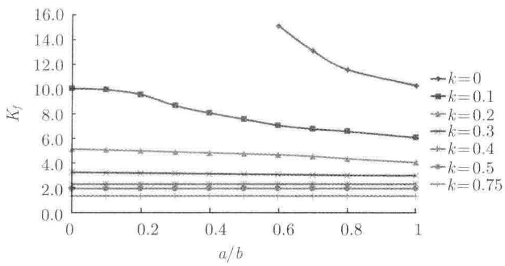

<details>
<summary>line</summary>

| a/b | k=0   | k=0.1 | k=0.2 | k=0.3 | k=0.4 | k=0.5 | k=0.75 |
|-----|-------|-------|-------|-------|-------|-------|--------|
| 0.0 | 10.0  | 10.0  | 5.0   | 3.5   | 3.5   | 2.0   | 2.0    |
| 0.2 | 9.5   | 9.5   | 4.8   | 3.4   | 3.4   | 2.0   | 2.0    |
| 0.4 | 8.5   | 8.5   | 4.6   | 3.3   | 3.3   | 2.0   | 2.0    |
| 0.6 | 7.5   | 7.5   | 4.4   | 3.2   | 3.2   | 2.0   | 2.0    |
| 0.8 | 6.5   | 6.5   | 4.2   | 3.1   | 3.1   | 2.0   | 2.0    |
| 1.0 | 6.0   | 6.0   | 4.0   | 3.0   | 3.0   | 2.0   | 2.0    |
</details>

图13-10 四边固支 $g = 1$

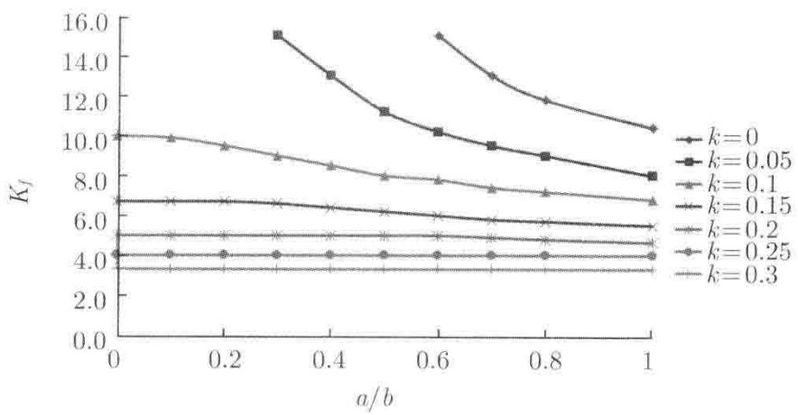

<details>
<summary>line</summary>

| a/b | k=0   | k=0.05 | k=0.1  | k=0.15 | k=0.2  | k=0.25 | k=0.3  |
|-----|-------|--------|--------|--------|--------|--------|--------|
| 0.0 | 15.0  | 15.0   | 10.0   | 7.0    | 4.0    | 4.0    | 4.0    |
| 0.2 | 13.5  | 13.5   | 9.5    | 6.8    | 4.0    | 4.0    | 4.0    |
| 0.4 | 12.0  | 12.0   | 9.0    | 6.5    | 4.0    | 4.0    | 4.0    |
| 0.6 | 11.0  | 11.0   | 8.5    | 6.2    | 4.0    | 4.0    | 4.0    |
| 0.8 | 10.0  | 10.0   | 8.0    | 6.0    | 4.0    | 4.0    | 4.0    |
| 1.0 | 9.0   | 9.0    | 7.5    | 5.8    | 4.0    | 4.0    | 4.0    |
</details>

图13-11 四边固支 $g = 2.5$

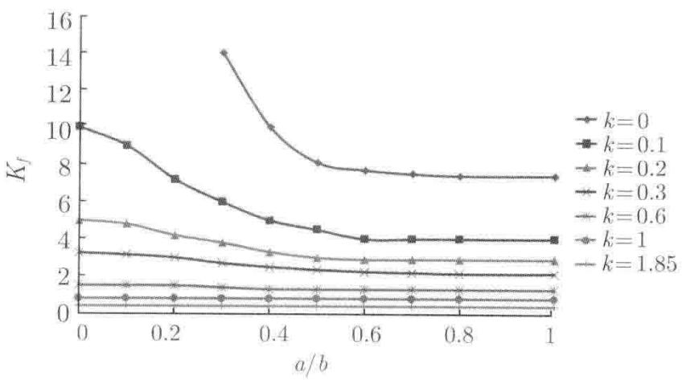

<details>
<summary>line</summary>

| a/b | k=0   | k=0.1 | k=0.2 | k=0.3 | k=0.6 | k=1   | k=1.85 |
|-----|-------|-------|-------|-------|-------|-------|--------|
| 0.0 | 10.0  | 10.0  | 5.0   | 3.5   | 2.0   | 1.0   | 0.5    |
| 0.2 | 9.0   | 7.5   | 4.5   | 3.0   | 2.0   | 1.0   | 0.5    |
| 0.4 | 6.0   | 5.0   | 3.5   | 2.5   | 1.5   | 1.0   | 0.5    |
| 0.6 | 4.5   | 4.0   | 3.0   | 2.0   | 1.5   | 1.0   | 0.5    |
| 0.8 | 4.0   | 4.0   | 3.0   | 2.0   | 1.5   | 1.0   | 0.5    |
| 1.0 | 4.0   | 4.0   | 3.0   | 2.0   | 1.5   | 1.0   | 0.5    |
</details>

图13-12 加载边简支侧边固支 $g = 0.4$

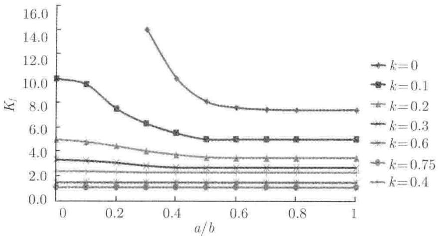

<details>
<summary>line</summary>

| a/b | k=0   | k=0.1 | k=0.2 | k=0.3 | k=0.6 | k=0.75 | k=0.4 |
|-----|-------|-------|-------|-------|-------|--------|-------|
| 0.0 | 10.5  | 10.5  | 5.0   | 3.5   | 2.5   | 1.5    | 1.5   |
| 0.2 | 8.0   | 8.0   | 4.5   | 3.0   | 2.5   | 1.5    | 1.5   |
| 0.4 | 6.5   | 6.5   | 4.0   | 2.5   | 2.5   | 1.5    | 1.5   |
| 0.6 | 5.5   | 5.5   | 3.5   | 2.5   | 2.5   | 1.5    | 1.5   |
| 0.8 | 5.0   | 5.0   | 3.5   | 2.5   | 2.5   | 1.5    | 1.5   |
| 1.0 | 5.0   | 5.0   | 3.5   | 2.5   | 2.5   | 1.5    | 1.5   |
</details>

图13-13 加载边简支侧边固支 $g = 1$

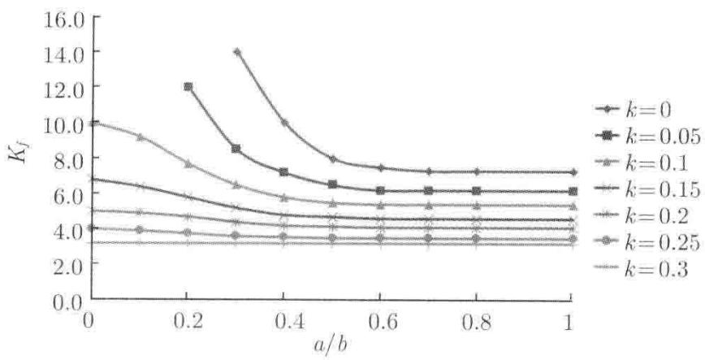

<details>
<summary>line</summary>

| a/b | k=0   | k=0.05 | k=0.1  | k=0.15 | k=0.2  | k=0.25 | k=0.3  |
|-----|-------|--------|--------|--------|--------|--------|--------|
| 0.0 | 10.0  | 12.0   | 7.0    | 6.0    | 5.0    | 4.0    | 4.0    |
| 0.2 | 8.0   | 9.0    | 6.0    | 5.0    | 4.5    | 3.8    | 3.8    |
| 0.4 | 7.0   | 7.5    | 5.5    | 4.8    | 4.3    | 3.7    | 3.7    |
| 0.6 | 7.0   | 6.5    | 5.5    | 4.8    | 4.3    | 3.7    | 3.7    |
| 0.8 | 7.0   | 6.5    | 5.5    | 4.8    | 4.3    | 3.7    | 3.7    |
| 1.0 | 7.0   | 6.5    | 5.5    | 4.8    | 4.3    | 3.7    | 3.7    |
</details>

图13-14 加载边简支侧边固支 $g = 2.5$

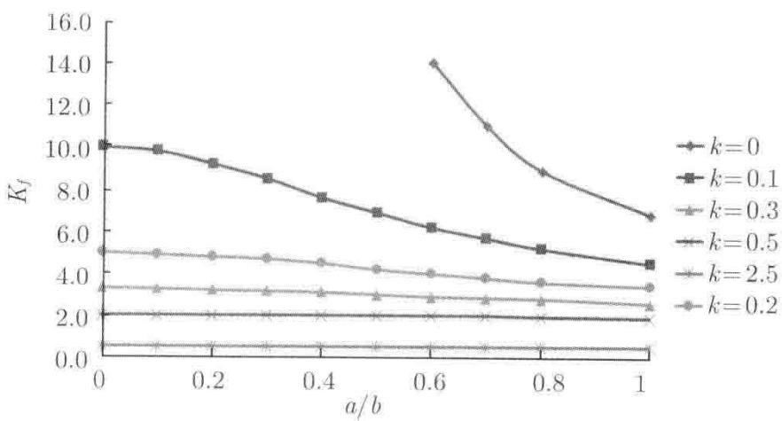

<details>
<summary>line</summary>

| a/b | k=0   | k=0.1 | k=0.3 | k=0.5 | k=2.5 | k=0.2 |
|-----|-------|-------|-------|-------|-------|-------|
| 0.0 | 10.0  | 10.0  | 5.0   | 4.0   | 2.0   | 1.0   |
| 0.2 | 9.5   | 9.5   | 4.8   | 3.8   | 2.0   | 1.0   |
| 0.4 | 8.5   | 8.5   | 4.5   | 3.5   | 2.0   | 1.0   |
| 0.6 | 7.5   | 7.5   | 4.2   | 3.2   | 2.0   | 1.0   |
| 0.8 | 6.5   | 6.5   | 4.0   | 3.0   | 2.0   | 1.0   |
| 1.0 | 6.0   | 6.0   | 3.8   | 2.8   | 2.0   | 1.0   |
</details>

图 13-15 加载边固支侧边简支 g = 0.4

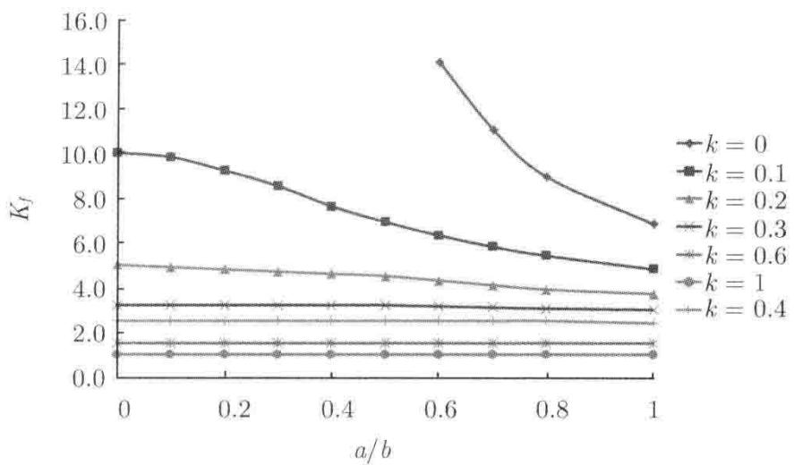

<details>
<summary>line</summary>

| a/b | k = 0 | k = 0.1 | k = 0.2 | k = 0.3 | k = 0.6 | k = 1 | k = 0.4 |
| --- | --- | --- | --- | --- | --- | --- | --- |
| 0.0 | 10.0 | 10.0 | 5.0 | 3.5 | 3.5 | 1.5 | 1.5 |
| 0.2 | 9.5 | 9.5 | 4.8 | 3.4 | 3.4 | 1.5 | 1.5 |
| 0.4 | 8.5 | 8.5 | 4.6 | 3.3 | 3.3 | 1.5 | 1.5 |
| 0.6 | 7.5 | 7.5 | 4.4 | 3.2 | 3.2 | 1.5 | 1.5 |
| 0.8 | 6.5 | 6.5 | 4.2 | 3.1 | 3.1 | 1.5 | 1.5 |
| 1.0 | 5.0 | 5.0 | 4.0 | 3.0 | 3.0 | 1.5 | 1.5 |
</details>

图13-16 加载边固支侧边简支 $g = 1$

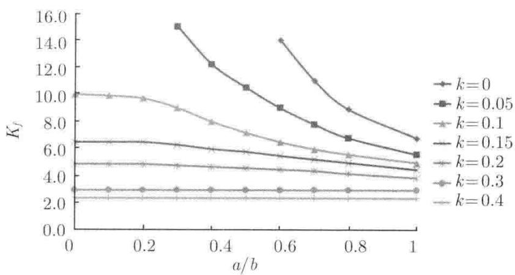

<details>
<summary>line</summary>

| a/b | k=0   | k=0.05 | k=0.1  | k=0.15 | k=0.2  | k=0.3  | k=0.4  |
|-----|-------|--------|--------|--------|--------|--------|--------|
| 0.0 | 10.0  | 15.0   | 10.0   | 6.5    | 5.0    | 3.0    | 2.5    |
| 0.2 | 9.5   | 14.0   | 9.5    | 6.0    | 4.8    | 3.0    | 2.5    |
| 0.4 | 9.0   | 12.5   | 8.5    | 5.5    | 4.5    | 3.0    | 2.5    |
| 0.6 | 8.5   | 11.0   | 7.5    | 5.0    | 4.2    | 3.0    | 2.5    |
| 0.8 | 8.0   | 9.5    | 6.5    | 4.5    | 4.0    | 3.0    | 2.5    |
| 1.0 | 7.5   | 8.0    | 5.5    | 4.0    | 3.8    | 3.0    | 2.5    |
</details>

图13-17 加载边固支侧边简支 $g = 2.5$

# 3.均匀剪切

面板均匀剪切示意图如图 13-18 所示，其临界剪应力按下式确定：

$$
\tau_ {x y, c r i} = K \pi^ {2} \frac {E _ {1} t _ {1} E _ {2} t _ {2}}{(E _ {1} t _ {1} + E _ {2} t _ {2}) ^ {2}} \frac {\left(h + \frac {t _ {1} + t _ {2}}{2}\right) ^ {2}}{b ^ {2}} \frac {E _ {i}}{1 - \mu^ {2}} (i = 1, 2) \tag {13-12}
$$

对于相同面板，则有

$$
\tau_ {x y, c r} = K \frac {\pi^ {2} E (h + t) ^ {2}}{4 b ^ {2} (1 - \mu^ {2})} \tag {13-13}
$$

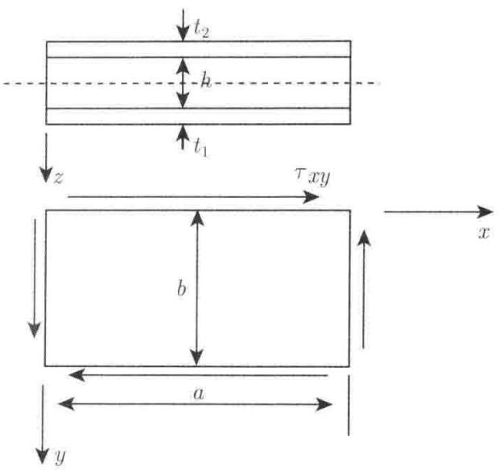

<details>
<summary>text_image</summary>

t₂
h
t₁
z
τxy
x
b
a
y
</details>

图 13-18 剪切示意图

式中

$$
K = K _ {f} + K _ {h} \tag {13-14}
$$

$K_{f}$ 根据 b/a, k, g 值及边界条件确定。

$$
k = \left\{ \begin{array}{l l} \frac {\pi^ {2} h E _ {1} t _ {1} E _ {2} t _ {2}}{(1 - \mu^ {2}) b ^ {2} \bar {G} _ {x z} (E _ {1} t _ {1} + E _ {2} t _ {2})} & (\text {两面板不同}) \\ \frac {\pi^ {2} h E t}{2 (1 - \mu^ {2}) b ^ {2} \bar {G} _ {x z}} & (\text {两面板相同}) \end{array} \right. \tag {13-15}
$$

$$
g = \frac {\bar {G} _ {y z}}{\bar {G} _ {x z}} \tag {13-16}
$$

$K_{h}$ 值由式(13-17)确定

$$
K _ {h} = \frac {(E _ {1} t _ {1} ^ {3} + E _ {2} t _ {2} ^ {3}) (E _ {1} t _ {1} + E _ {2} t _ {2})}{1 2 E _ {1} t _ {1} E _ {2} t _ {2} \left(h + \frac {t _ {1} + t _ {2}}{2}\right) ^ {2}} K _ {f 0} \tag {13-17}
$$

对于相同的面板，有

$$
K _ {h} = \frac {t ^ {2} K _ {f 0}}{3 (h + t) ^ {2}} \tag {13-18}
$$

$K_{f0}$ 是 k=0 时的 $K_{f}$ 值，根据 a/b 或 b/a, g 值及边界条件由相应的图中 k=0 的曲线查得。

# 4. 弯矩

面板弯矩作用示意图如图 13-19 所示，最大应力处的临界值按下式确定：

$$
\sigma_ {0, c r i} = K \pi^ {2} \frac {E _ {1} t _ {1} E _ {2} t _ {2}}{(E _ {1} t _ {1} + E _ {2} t _ {2}) ^ {2}} \frac {\left(h + \frac {t _ {1} + t _ {2}}{2}\right) ^ {2}}{b ^ {2}} \frac {E _ {i}}{1 - \mu^ {2}} (i = 1, 2) \tag {13-19}
$$

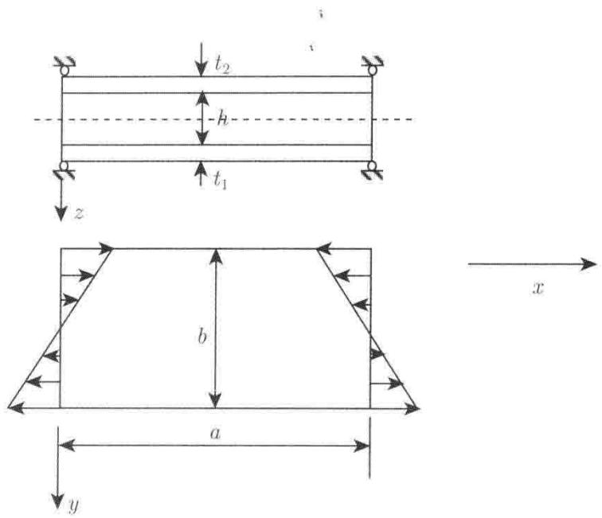

<details>
<summary>text_image</summary>

t₂
h
t₁
z
b
a
y
x
</details>

图 13-19 受弯示意图

对于相同面板，有

$$
\sigma_ {0, \mathrm{cr}} = K \frac {\pi^ {2} E (h + t) ^ {2}}{4 b ^ {2} (1 - \mu^ {2})} \tag {13-20}
$$

式中临界应力系数为

$$
K = K _ {f} + K _ {h} \tag {13-21}
$$

$K_{f}$ 根据 b/a, k, g 值及边界条件而确定。

$$
k = \left\{ \begin{array}{l l} { \frac {\pi^ {2} h E _ {1} t _ {1} E _ {2} t _ {2}}{(1 - \mu^ {2}) b ^ {2} \bar {G} _ {x z} (E _ {1} t _ {1} + E _ {2} t _ {2})}} & {(\text {两面板不同})} \\ { \frac {\pi^ {2} h E t}{2 (1 - \mu^ {2}) b ^ {2} \bar {G} _ {x z}}} & {(\text {两面板相同})} \end{array} \right. \tag {13-22}
$$

$$
g = \frac {\bar {G} _ {y z}}{\bar {G} _ {x z}} \tag {13-23}
$$

$K_{h}$ 值由下式确定：

$$
K _ {h} = \frac {(E _ {1} t _ {1} ^ {3} + E _ {2} t _ {2} ^ {3}) (E _ {1} t _ {1} + E _ {2} t _ {2})}{1 2 E _ {1} t _ {1} E _ {2} t _ {2} \left(h + \frac {t _ {1} + t _ {2}}{2}\right) ^ {2}} K _ {f 0} \tag {13-24}
$$

对于相同面板，有

$$
K _ {h} = \frac {t ^ {2} K _ {f 0}}{3 (h + t) ^ {2}} \tag {13-25}
$$

# 13.4.2 正交各向异性面板夹芯板

# 1.均匀轴压

夹芯板在均匀轴压下的屈曲载荷为

$$
N _ {x, c r} = \frac {\pi^ {2} (D D _ {1 1} D D _ {2 2}) ^ {1 / 2}}{b ^ {2}} K \tag {13-26}
$$

其中， $N_{x,cr}$ 为单位宽度上的屈曲轴压力；a,b 分别为板的长度和宽度； $DD_{11}, DD_{22}$ 为折算弯曲刚度系数；K 为屈曲系数，是边界条件、刚度与半波数的函数，计算公式为

$$
K = \min (K (m)) = \min \left(\frac {A _ {1} + A _ {2}}{1 + A _ {3} + A _ {4}}\right) \quad (m = 1, 2, 3, \dots) \tag {13-27}
$$

其中， $A_{1}, A_{2}, A_{3}, A_{4}$ 为由边界条件、刚度等确定的系数。

# 2. 剪切

夹芯板在剪切载荷 $N_{xy}$ 下的剪切屈曲载荷为

$$
N _ {x y, c r} = \frac {4 (D D _ {1 1} D D _ {2 2} ^ {3}) ^ {1 / 4}}{b ^ {2} \left[ 1 + 4 \left(\frac {K ^ {\prime}}{K} - 1\right) \right]} K _ {s} \tag {13-28}
$$

其中， $N_{xy,cr}$ 为单位宽度上的屈曲剪力；K 为屈曲系数， $K' = A_{1}$ ; $K_{s}$ 为剪切屈曲系数。

# 13.4.3 局部失稳工程算法

# 1. 面板局部失稳

如图 13-20 所示的面板轴压屈曲，当面板出现局部屈曲时，面板会起皱，其临界载荷小于经典理论（假定初始波纹度 $\delta = 0$ ）的计算值。在面板起皱现象中，初始波纹起着重要作用，它引起面板横向挠度的发展，致使夹芯横向拉伸或压缩破坏，或是拉脱夹芯与面板的连接处。

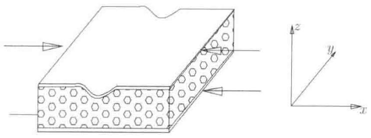

<details>
<summary>text_image</summary>

Technical diagram showing a 3D cross-section with hatched material and coordinate axes (x, y, z) labeled.
</details>

图 13-20 轴压屈曲示意图

面板起皱的临界应力按下列步骤确定。

1) 计算参数 $q$

$$
q = \frac {h}{t} \left(\frac {1 - \mu^ {2}}{\eta E \bar {E} _ {z} \bar {G}}\right) ^ {1 / 3} \bar {G} \tag {13-29}
$$

其中，h 为夹芯厚度； $\bar{G}$ 为垂直面板且平行于加载方向的平面内的夹芯剪切模量； $\bar{E}_{z}$ 为夹芯法向弹性模量；t 为面板厚度；E 为面板弹性模量； $\mu$ 为面板泊松系数； $\eta$ 为塑性减缩系数，面板为弹性时 $\eta = 1$ 。

2) 计算参数 $K_{\delta}$

$$
K _ {\delta} = \frac {\bar {E} _ {z} \delta}{\sigma_ {z} ^ {0} h} \tag {13-30}
$$

其中， $\delta$ 为面板初始波纹的波幅； $\sigma_z^0$ 为夹芯的平面破坏强度，取夹芯在 $z$ 方向的抗拉强度、抗压强度及夹芯与面板连接强度三者的最小值。

3) 确定 $Q$

根据 q 和 $K_{\delta}$ ，由图 13-21 确定 Q。

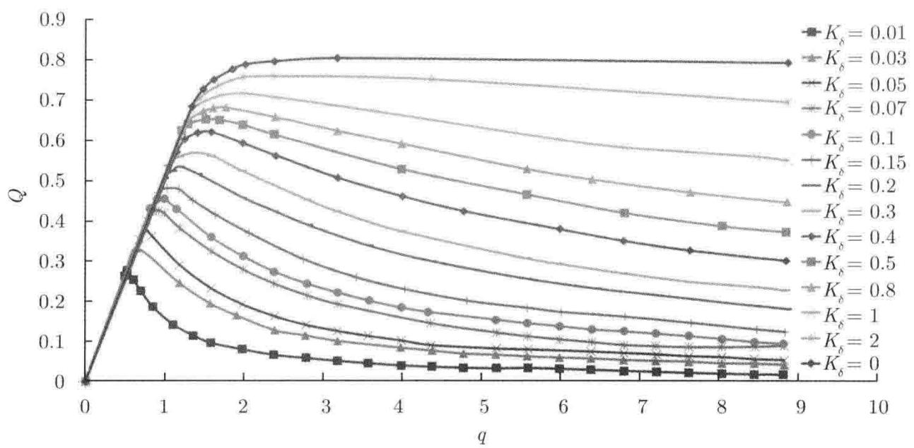  
图13-21 $Q$ 曲线分布

4) 计算面板起皱的临界力

$$
\sigma_ {c w} = Q \left(\frac {1 - \mu^ {2}}{\eta E \bar {E} _ {z} \bar {G}}\right) ^ {- 1 / 3} \tag {13-31}
$$

在面板初始波纹度不确定时，建议取 $Q = 0.5$ 估算面板起皱的临界应力。

当面板双向受压时，在弹性范围内，可采用下列相关方程：

$$
R _ {x} ^ {3} + R _ {y} = 1 \tag {13-32}
$$

其中， $R_{x}=\frac{\sigma_{x}}{\sigma_{x,cr}}$ ; $R_{y}=\frac{\sigma_{y}}{\sigma_{y,cr}}$ ; $\sigma_{x},\sigma_{y}$ 分别为作用在 x 与 y 方向的应力； $\sigma_{x,cr},\sigma_{y,cr}$ 分别为作用在 x 与 y 方向单独均匀压缩的面板起皱临界应力，而 y 方向对应于最大压缩应力的作用方向。

# 2. 剪切褶皱

剪切褶皱是总体失稳的一种特殊情况，对于具有低剪切模量夹芯的夹芯结构进行总体失稳分析，即能得到剪切褶皱的面板临界应力公式。图 13-22 为剪切褶皱示意图。

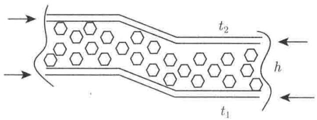

<details>
<summary>text_image</summary>

t₂
h
t₁
</details>

图 13-22 剪切褶皱示意图

1) 面板承受一个方向的均匀压缩

$$
\sigma_ {w r 1} = \frac {\left(h + \frac {t _ {1} + t _ {2}}{2}\right) ^ {2}}{\left(t _ {1} + \frac {E _ {2}}{E _ {1}} t _ {2}\right) h} \bar {G} _ {i j}; \quad \sigma_ {w r 2} = \frac {\left(h + \frac {t _ {1} + t _ {2}}{2}\right) ^ {2}}{\left(t _ {2} + \frac {E _ {1}}{E _ {2}} t _ {1}\right) h} \bar {G} _ {i j} \tag {13-33}
$$

其中， $\bar{G}_{ij}=\left\{\begin{array}{ll}\bar{G}_{xy}&(\text{载荷平行于}x\text{轴})\\\bar{G}_{yz}&(\text{载荷平行于}y\text{轴})\end{array}\right.$

2) 面板承受纯剪

$$
\tau_ {w r 1} = \frac {\left(h + \frac {t _ {1} + t _ {2}}{2}\right) ^ {2}}{\left(t _ {1} + \frac {E _ {2}}{E _ {1}} t _ {2}\right) h} \sqrt {\bar {G} _ {x z} \bar {G} _ {y z}}; \quad \tau_ {w r 2} = \frac {\left(h + \frac {t _ {1} + t _ {2}}{2}\right) ^ {2}}{\left(t _ {2} + \frac {E _ {1}}{E _ {2}} t _ {1}\right) h} \sqrt {\bar {G} _ {x z} \bar {G} _ {y z}} \tag {13-34}
$$

其中， $\bar{G}_{xz},\bar{G}_{yz}$ 为夹芯在 xz 平面、yz 平面内的剪切模量。

因剪切褶皱对初始挠度不敏感，因而公式中无需引用缩减系数。但是，由于在以上的公式推导过程中，忽略了面板本身的弯曲刚度，而使计算略偏保守。

# 13.4.4 有限元分析

正方形各向同性夹芯结构，四边简支，如图 13-23 所示，a=b=228mm，面板为铝板，厚 0.65mm，弹性模量 E=67.6GPa，泊松比 $\mu=0.33$ ; 夹芯的材料性能剪切强度 $G_{xz}=0.06GPa$ ， $G_{yz}=0.0352GPa$ ， $E_{z}=0.298GPa$ 。

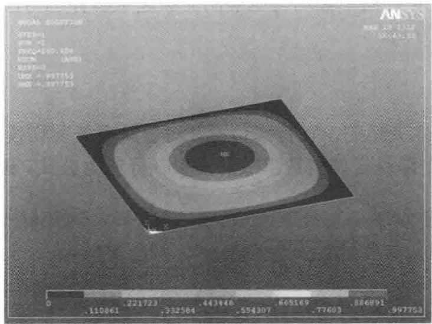

<details>
<summary>text_image</summary>

0.004 8067728
STEP=1
FEN=1
FEN=45,204
SEM = (ANS)
SEM=0
ISO: 4.97755
ISO: 4.97753
AMS
AMS 19 3.519
16.43.02
0 110861 221723 332564 443446 554307 665169 77603 886991 997752
AMS YS
</details>

图 13-23 正方形板屈曲分析

表 13-2 临界载荷  
(单位: N/mm) 

<table><tr><td>实测</td><td>有限元算例</td><td>有限元</td><td>工程算法</td></tr><tr><td>234</td><td>238.4</td><td>260</td><td>219</td></tr></table>

从表 13-2 的计算结果可以看出，工程算法在矩形层合板的稳定性的计算中拥有较高的精度，一方面对于相同问题可以更快地得到结果；另一方面在对有限元分析结果的评估上面具有比较好的指导意义。

# 13.4.5 局部二次分析法

总体思路是: 在总体应力分析的基础上, 取出可能出现失稳破坏的部位, 建立“局部分析模型”, 并对该“分析模型”的边界弹性支撑刚度进行模拟, 然后对该“局部分析模型”进行有限元稳定性分析。分析步骤如下:

(1) 对结构进行总体应力分析;  
(2) 取出可能出现失稳破坏的部位建立“局部分析模型”；  
(3) 根据总体应力分析结果, 模拟 “局部分析模型” 的弹性支撑边界, 即由结构总体应力分析得到的边界位移或力换算其边界支撑刚度;  
(4) 对局部模型进行稳定性有限元分析。

# 13.5 夹芯结构在叶片上的应用

叶片总重是决定风力机叶片结构设计好坏的关键控制因素，在满足静强度、刚度、稳定性、振动特性等力学性能的基础上，应严格控制风力机叶片的重量。在主梁两侧，沿叶片展向铺设夹芯层，在防止叶片发生整体失稳破坏的同时能有效限制叶片的总重。此外，腹板作为叶片结构的主要抗剪构件，为防止发生局部失稳破坏，腹板的结构形式也同为夹芯结构。

# 13.6 腹板屈曲分析

夹芯结构的腹板需承受不同面内载荷，在面内压缩、剪切、弯曲及其联合作用下的初始屈曲应力，容易造成腹板屈曲破坏，特别是腹板根部。腹板将载荷传递至腹板根部，再通过腹板根部的开口传递到叶片壳体，继而再传给叶片根部。因此，腹板根部的局部设计对腹板整体的屈曲分析尤为重要。本节简略讨论腹板屈曲的影响因素，为提高腹板根部的抗屈曲能力提供依据。

腹板的全尺寸有限元中，鉴于叶尖段腹板对整个腹板的屈曲分析影响很小，因此重点关注腹板从叶根到最大弦长附近段的屈曲。腹板采用夹芯结构，下文为加单位载荷进行腹板抗屈曲分析的定性分析。

# 1. 无开口腹板分析

由图 13-24 腹板根部的静强度应力云图可以看出，腹板根部应力集中发生在两个尖角处，而根部中间段的应力很小。腹板主要传递剪应力，所以应该重点关注腹板叶根的剪应力如何均匀地传递到叶片蒙皮上，同时不在尖端出现应力集中，故腹板根部多做成开口的形式，以改善腹板根部的应力集中，这样还可以降低腹板重量。由梯形腹板一阶屈曲可以看出，屈曲分析中的最危险点与静强度分析的应力集中点密切相关。

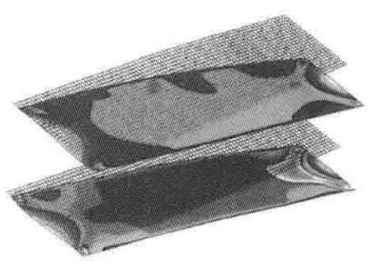

<details>
<summary>natural_image</summary>

Two stacked rectangular sheets with textured surfaces, no visible text or symbols
</details>

(a) 梯形腹板的静强度应力云图

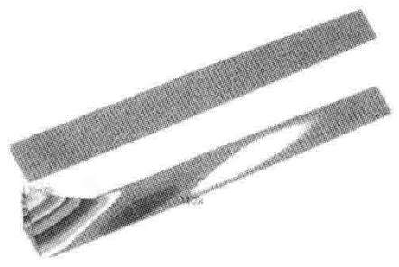

<details>
<summary>natural_image</summary>

Close-up of two metallic strips with textured surfaces, no visible text or symbols
</details>

(b) 梯形腹板的一阶屈曲云图  
图 13-24 梯形腹板的静强度应力云图和一阶屈曲

# 2. 梯形开口腹板分析

梯形腹板的根部开梯形口，此时腹板根部的静强度应力云图与一阶屈曲云图如图 13-25 所示。

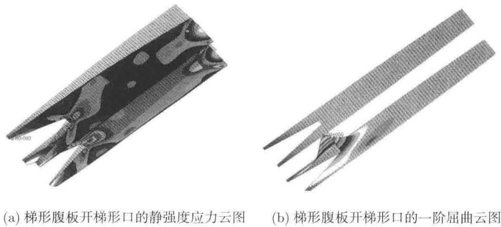  
图 13-25 梯形腹板开梯形口的静强度应力云图与一阶屈曲

由静强度的应力云图可以看出，此时应力集中发生在梯形口处，而腹板根部尖角的应力集中得到明显改善。故开口后，腹板根部的应力能够均匀地传到叶片蒙皮上。腹板开口处出现应力集中，说明开口的尺寸不合适，存在合理的开口尺寸使腹板开口处的应力集中值最小。

开梯形口容易造成梯形口处应力集中，也容易造成腹板根部失稳，但便于腹板根部的剪应力传递。

# 3. 梯形腹板加筋分析

针对梯形腹板开梯形口后造成的应力集中和屈曲分析结果，选择在腹板局部加筋的改进方案。加筋梁的尺寸为高 30mm，宽 40mm，加筋位置和断面形式如图 13-26 所示。

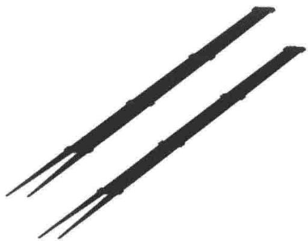

<details>
<summary>natural_image</summary>

Two black elongated metal rods with three pointed tips, isolated on white background (no text or symbols)
</details>

图13-26 梯形开口腹板加筋

梯形开口腹板加筋后的分析，包括静强度分析和屈曲分析。加筋只是将较长的腹板分割成一个个单元，提高腹板的整体抗失稳能力，并不能改善腹板的应力水平，结果表明加筋后可明显提高腹板的抗屈曲能力。

由图 13-27 梯形腹板开梯形口的屈曲分析可以看出，相对于未开口的梯形腹板，此方案可显著改善腹板根部的剪应力传递。通过比较梯形腹板开梯形口后局部加玻纤布的屈曲分析、梯形腹板开梯形口后加筋的屈曲分析，加筋对提高腹板稳定性有非常显著的效果。在腹板屈曲最危险点，局部加双轴玻纤布，不但可以提高腹板的抗屈曲能力，还可以明显改善腹板开口处的应力集中。

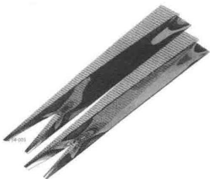

<details>
<summary>natural_image</summary>

Close-up of a textured, metallic object with triangular grooves and a central dark band (no visible text or symbols)
</details>

(a) 梯形腹板开梯形口加筋的静强度应力云图

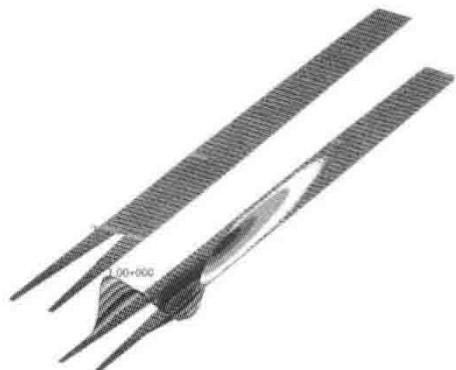

<details>
<summary>natural_image</summary>

3D simulation of a conical structure with two parallel grooves and a central cavity, no text or symbols present
</details>

(b) 梯形腹板开梯形口加筋的一阶屈曲云图  
图 13-27 梯形腹板开梯形口后加筋的静强度应力云图与一阶屈曲

# 4. 弧形腹板开口分析

由于腹板根部开梯形口，容易造成腹板根部梯形口处的应力集中，所以改用开弧形口，同样可以改善腹板根部的剪应力传递，还可以减小腹板根部的应力集中水平。

由图 13-28 静强度的应力云图可以看出，此时应力集中发生在腹板根部弧型口处，但腹板根部尖角的应力集中得到明显改善，故开口后，腹板根部的应力能够均匀地传到叶片蒙皮上。腹板开口处出现应力集中，说明开口的尺寸不合适，存在合理的开口尺寸，使腹板开口处的应力集中值最小。由于腹板开口处最大应力小于梯形开口处的应力集中值，所以弧形开口更有效地减小腹板根部的应力集中，利于剪应力的传递。因此，腹板根部开弧形口比开梯形口更有益于提高腹板的抗失稳能力。

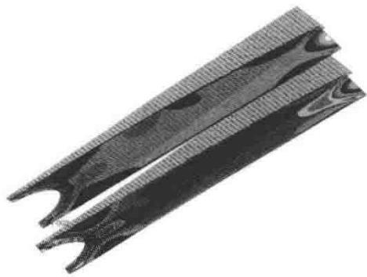

<details>
<summary>natural_image</summary>

Close-up of a textured, elongated object with two curved cutouts, possibly a tool or component (no visible text or symbols)
</details>

(a) 梯形腹板开弧形口的静强度应力云图

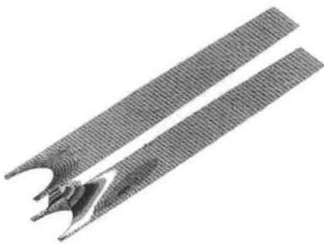

<details>
<summary>natural_image</summary>

Abstract 3D wireframe structure with two parallel bands and a central angular feature (no text or symbols)
</details>

(b) 梯形腹板开弧形口的一阶屈曲云图  
图 13-28 梯形腹板开弧形口的静强度应力云图与一阶屈曲

# 5. 弧形开口后根部翻边

腹板根部做翻边结构，如图 13-29 所示，翻边为 40mm 宽，铺层与腹板铺层一致。翻边后，并不改变腹板的铺层和受力形式。

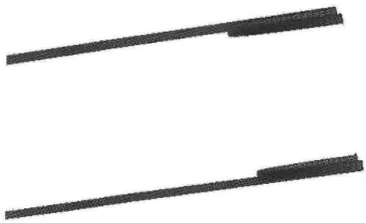

<details>
<summary>natural_image</summary>

Two parallel black rectangular strips with textured ends, no text or symbols present
</details>

图 13-29 腹板根部翻边结构

由图 13-30 腹板翻边的静强度云图分析，翻边不能改变腹板根部的应力集中，对剪应力的传递效果基本无影响。但是，腹板根部翻边，可以显著提高腹板的抗失稳能力。

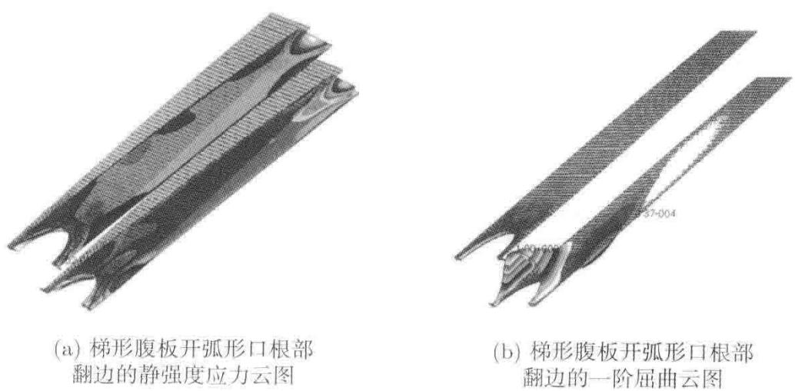  
图 13-30 弧形开口腹板根部翻边的分析

# 13.7 叶片局部屈曲分析

在叶片全尺寸有限元分析中，验证叶片整体抗屈曲能力，根据整体分析的危险位置，确定局部屈曲分析的区域。而局部屈曲分析中，应细化局部模型，网格应适当加密，确保网格精度。当包含局部加密网格，对此部位应单独分析，进行一定的修正，此时局部模型应使用位移边界[31]。

由于复合材料所具有的许多独特的优点，如比强度和比刚度高、抗疲劳性能和抗震性能好、结构的可设计性和工艺性好等，现今风力机叶片结构上主要采用先进复合材料构件作为主承力构件。但同时这种材料所具有的显著各向异性，加上叶片结构的基本形式为薄壁结构，所以在叶片结构的稳定性分析方面，也为人们带来了很多新的且特殊的难题。根据大量试验和计算证明，结构的失效除少数是由局部强度破坏引起的外，其余的多是因局部屈曲而引起的后屈曲破坏所导致的。

线性屈曲理论认为结构总是在受载的初始构型上达到了平衡。当屈曲产生时，结构的构型从一种平衡状态突然到达另一种平衡状态，进而发展为一种随遇平衡。图 13-31(a) 为面内单向受压方板的线性屈曲示意图，其中 $\lambda$ 和 q 分别为载荷因子和位移向量。a 点为由线性理论得到的分支屈曲点（也称为初始屈曲点），相应的屈曲载荷因子为 $\lambda_{cr1}$ ，其值由线性特征方程确定。此时，板的压缩刚度突然下降，从平板突然跳到曲板（壳）的平衡状态，随之板的挠曲率无限增大而最终破坏。

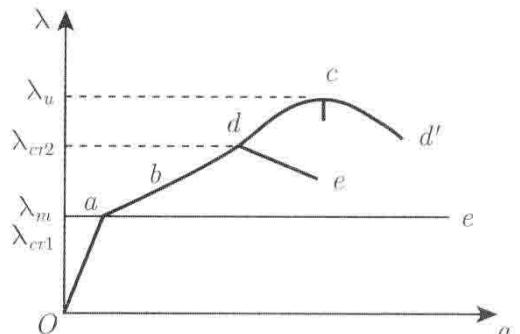

<details>
<summary>line</summary>

| Point | x    | y    |
|-------|------|------|
| a     | 0    | λ_m  |
| b     | ~0.5 | λ_cr1 |
| c     | ~1.0 | λ_u  |
| d     | ~0.8 | λ_cr2 |
| e     | ~0.6 | λ_e  |
| d'    | ~0.7 | λ'_d |
</details>

(a) 面内单向受压方板线性屈曲

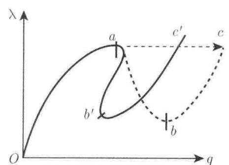

<details>
<summary>text_image</summary>

λ
a
c'
c
b'
b
O
q
</details>

(b) 板壳非线性屈曲  
图 13-31 一般板（壳）非线性屈曲和后屈曲

如果采用几何非线性理论, 一开始只需给予平板一个法向的微小干扰, 随着单向压力的增加, 就能够得到一条极为逼近于 $Oa$ 的非线性平衡路径。经过 $a$ 点后, 发现由线性理论得出的随遇平衡路径 $aE$ 是不存在的。实际存在的后屈曲路径 $ab$ 由非线性弯曲方程控制, $ab$ 呈稳态平衡阶段, 在这一阶段, 随 $abcd$ 载荷增加, 板的挠曲率、抗弯刚度也随之增大, 体现出明显的后屈曲强度问题。当然, 后屈曲强度不是无限的, 随着结构内部应力水平的提高, 或者是由于材料内部逐渐出现破坏, 在 $c$ 点附近时结构发生强度破坏; 又或者是由于结构变形增大的原因, $c$ 点成为刚度极值点而呈现极值型屈曲，致使结构从稳态平衡路径 abcd 转变为非稳态平衡路径 $cd'$ 。值得一提的是，结构还可能发生二次分支屈曲 $\lambda_{cr2}$ ，即结构在达到强度破坏之前的某一点 d 处突然出现波形突变，而跳到另一个更高阶的平衡状态，如图 13-31(a) 中的路径 abcd。但是，二次分支屈曲只发生在极少数特定载荷下的理想板结构中。

按照非线性屈曲理论, 分析一般板、壳结构的非线性屈曲示意图如图 13-31(b), 随着载荷的增加, 非线性平衡路径逐渐延伸, 达到并通过极值点 $a$ , 这个极值点就是非线性屈曲点 (通常称极值型屈曲), 通过极值点后的平衡路径称为后屈曲路径。通过极值点 $a$ 后, 结构出现软化而卸载, 又在经过 $b$ 点后, 结构开始转为强化。在有些曲板 (壳) 结构中, 这种从强化到软化的反复可多次发生, 反复中有可能出现位移极值点 $b$ 。经过非线性路径 $Oabc$ 中第一、二个载荷极值点 $a$ 、 $b$ 后到达 $c$ 点的情况称为跳跃, 而经过第二个位移极值点 $b'$ 达到 $c'$ 点的情况可称为回弹。

从上述分析可以看出，按照非线性屈曲理论，结构的稳定性问题和强度问题是紧密联系在一起的。非线性平衡路径可以准确地把结构的强度、稳定性以及刚度的整个变化历程表达得很清楚。由于受载结构实际上是在变形后的位置上处于平衡状态的，从加载一开始就呈几何非线性特性，从这层意义上说，非线性理论相对更接近于实际情况。

# 13.8 叶片截面屈曲分析

叶片截面屈曲分析的基本方法如下:

(1) 在叶片全尺寸模型中, 定义叶片展向和弦向曲壳板区域, 对叶片进行基于面板的屈曲分析, 用于快速判断各个工况下载荷对叶片屈曲敏感的截面位置;  
(2) 根据叶片分割成 N 个夹芯结构后的分析结果, 提取叶片全局的最危险屈曲位置的临界载荷;  
(3) 根据截面的属性信息和载荷情况, 进行截面屈曲分析的计算, 得到该屈曲危险截面的最小模态值。

图 13-32 为叶片截面前缘夹芯结构屈曲和腹板夹芯结构屈曲的示意图。

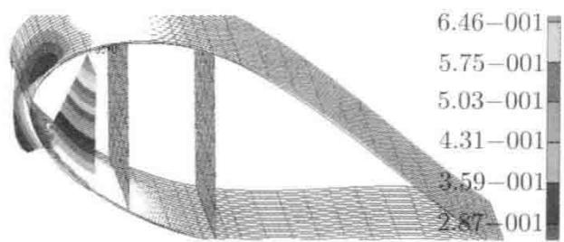

<details>
<summary>heatmap</summary>

| Value Range | Color Intensity |
| ----------- | --------------- |
| 6.46-001    | Dark Blue       |
| 5.75-001    | Medium Blue     |
| 5.03-001    | Light Blue      |
| 4.31-001    | Light Grey      |
| 3.59-001    | Medium Grey     |
| 2.87-001    | Dark Grey       |
</details>

(a) 叶片前缘屈曲云图

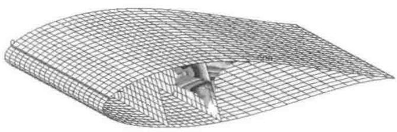

<details>
<summary>natural_image</summary>

3D wireframe model of a curved surface with a central cutout and grid lines, no text or symbols present
</details>

(b) 腹板屈曲云图  
图 13-32 截面屈曲分析

# 第 14 章 胶接连接分析

# 14.1 胶接理论

胶接是复合材料结构主要连接方法之一，它是借助胶黏剂将零件连接成不可拆卸的整体 $^{[32]}$ 。胶接的优缺点列于表 14-1 中。

表 14-1 胶接优缺点

<table><tr><td>胶接的优点</td><td>胶接的缺点</td></tr><tr><td>无钻孔引起的应力集中,连接效率高,结构轻;抗疲劳、密封、减震及绝缘性能好;有阻止裂纹扩展作用,破损安全性好;能获得光滑气动外形;不同材料连接无电偶腐蚀问题</td><td>缺少可靠的无损检测方法,胶接质量控制比较困难;胶接强度分散性大,剥离强度低,不能传递大的载荷;胶接性能受胶层厚度、胶接宽度和胶接工艺性影响较大;胶接性能受湿、热、腐蚀介质等环境影响大,存在一定的老化问题;胶接表面在胶接前需作特殊的表面处理,工艺要求严格;被胶接件间配合公差要求严格,需加温加压固化设备,修补较困难;胶接后不可拆卸</td></tr></table>

# 14.1.1 胶黏剂性能

作为胶接连接的主要材料，胶黏剂其本身应具有如下性能：

(1) 与被胶接件的相容性好，即黏接强度要高，不致在胶接件截面发生破坏；  
(2) 在尽量低的温度下固化；  
(3) 与被胶接件的热膨胀系数较接近；  
(4) 湿度影响应尽可能小；  
(5) 具有较好的综合力学性能;  
(6) 工艺性好，使用方便；  
(7) 胶接的耐久性应高于结构所预期的寿命。

如图 14-1 所示，胶黏剂按应力-应变特性，可分为韧性胶黏剂和脆性胶黏剂，一般脆性胶黏剂的剪切强度高于韧性胶黏剂，而在胶层剥离应力可忽略的情况下，由于胶接连接静剪切强度并不只取决于某个特征参数，而是由剪切应变能（曲线下的面积）所决定的，使得韧性胶黏剂的连接强度较脆性胶黏剂的高。从疲劳特性来看，脆性胶黏剂在拐点附近即决裂，疲劳寿命较短，而韧性胶黏剂极限应变较大，由于降低了胶层的应力峰值，即应力集中小，可承受较高的疲劳极限应力，疲劳寿命较长。

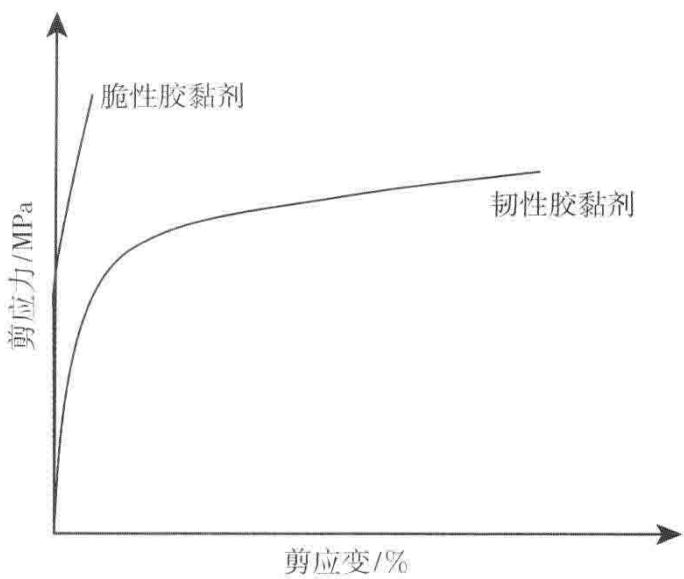

<details>
<summary>line</summary>

| 剪应变/% | 剪应力/MPa |
| -------- | ---------- |
| 脆性胶黏剂 | 高 |
| 韧性胶黏剂 | 中 |
</details>

图 14-1 胶黏剂的剪应变与剪应力的关系

# 14.1.2 复合材料胶接缺陷与原因

# 1. 胶接厚度过大

胶接厚度对胶层剪切性能和抗剥离性能影响较大，胶接过厚会显著降低复合材料的黏接特性，造成胶接结构破坏。

(1) 合模尺寸控制。合模中由于叶片上下模合模干涉、合模缝隙等由模具、翻转机构等造成的合模尺寸偏差，影响腹板与叶片上下壳体的黏接厚度。  
(2) 腹板高度偏低。腹板高度偏低，造成腹板与叶片壳体合模的黏接厚度过厚。  
(3) 模具形状偏差。包括腹板模具或叶片模具的变形造成的黏接偏差。  
(4) 铺层厚度偏差。由于生产制造、公差控制等原因造成实际铺层厚度与设计厚度有偏差，影响叶片空腔的整体高度。

# 2. 缺胶

叶片上下壳体与腹板黏接段局部缺胶，影响叶片整体特性与局部性能。

(1) 工艺涂胶不均匀。腹板与叶片壳体黏接段应使用刮胶工装，因刮胶工装造成涂胶不均匀而引起局部黏接缺胶。  
(2) 胶接面积过小。因胶层过薄、胶接宽度不够而造成腹板与叶片壳体黏接的整体胶接面积过小。

# 3. 胶黏剂未硬化

胶黏剂需要固化，在固化不充分的情况下会降低胶层的力学特性。

(1) 结构胶与固化剂配比错误。结构胶与固化剂应按照确定的比例混合，因配比错误而造成结构胶在叶片固化过程中始终不固化。  
(2) 固化时间偏差。因胶黏剂的固化时间偏差而造成腹板与壳体黏接的胶层未

固化。

(3) 固化温度不够。因环境温度、固化温度、模具温度等原因造成胶黏剂固化不充分。

# 4. 局部积胶

叶片合模中，叶片上下壳体与腹板黏接胶黏剂过多易造成胶接堆积形成胶块，在叶片运行过程中胶块易脱落，损坏叶片内部结构件。

(1) 腹板缘条几何尺寸偏差。缘条刚度过大或缘条几何尺寸偏差, 而引起合模过程中造成腹板缘条与叶片壳体呈现点接触状态, 而非面接触, 造成腹板与叶片壳体黏接局部积胶。  
(2) 胶黏剂用量过多。若胶黏剂涂胶过多，合模中过多的胶黏剂挤出而堆积于腹板缘条与叶片壳体黏接边缘。

# 5. 胶黏剂气泡

胶黏剂自身带气泡，降低胶层的力学特性。

(1) 混胶时带入气泡。因混胶流程、设备、工具错误而混入气泡。  
(2) 涂胶不均而混入气泡。因工艺涂胶过程中操作不当而引入气泡。

# 6. 胶黏剂裂痕

胶黏剂黏接存在胶层裂痕，易造成胶层的裂纹生长直至胶层破坏。

(1) 涂胶不均匀造成初始裂纹。涂胶过程中腹板与叶片壳体黏接局部胶接不均匀而引起固化后胶层的初始裂纹，裂纹后续生长造成胶层破坏。  
(2) 胶层潜在缺陷。由于以上提到的各种胶接缺陷而造成胶层的潜在缺陷，在周期载荷和变形下，胶层逐渐出现裂纹。

# 14.2 胶接连接设计

# 14.2.1 胶接设计一般原则

从强度观点考虑，胶接连接设计的基本原则是：

(1) 选择合理连接形式, 使胶层在最大强度方向受剪力, 同时尽可能避免胶层受到法向力, 以防止发生剥离破坏;

(2) 尽可能减小应力集中;

(3) 力求避免连接端部层合板发生层间剥离破坏；

(4) 承受动载荷时，应选低模量韧性胶黏剂。

这些原则目的是尽可能使胶接连接强度高于被胶接件强度或者与之相近。对此，需从连接形式、几何参数选择等方面考虑，以满足上述要求。

# 14.2.2 胶接基本破坏模式

胶接的破坏模式主要有三种：

(1) 被胶接件拉伸 (或拉弯) 破坏, 如图 14-2 所示;  
(2) 胶层剪切破坏，如图 14-3 所示；  
(3) 剥离破坏，如图 14-4 和图 14-5 所示；

除这三种基本破坏模式外，还会发生组合破坏。胶接连接发生何种模式的破坏，与连接形式、连接几何参数、邻近胶层的纤维方向及载荷性质密切有关。在连接几何参数中，被胶接件厚度起着极为重要的作用。当被胶接件很薄，连接强度足够时，被胶接件发生拉伸（或拉弯）破坏；当被胶接件较厚，但偏心力矩尚小时，易在胶层发生剪切破坏；当被胶接件厚到一定程度，胶接连接长度不够长时，在偏心力矩作用下，将发生剥离破坏。而对于双搭接层合板，由于层间拉伸强度低，剥离破坏通常发生在层间。

胶接接头通过胶层受剪来传递载荷，并且大部分对胶接接头的分析都是按此假设进行的[33]。剥离破坏将使胶接连接的承载能力显著下降，应力求避免。

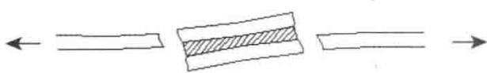

<details>
<summary>natural_image</summary>

Pure diagram of a rectangular object with a diagonal hatched pattern inside, connected by an arrow (no text or symbols)
</details>

图 14-2 被胶接件拉伸 (或拉弯) 破坏

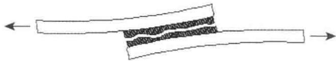

<details>
<summary>natural_image</summary>

Simple line drawing of two parallel pipes with a textured central section, no text or symbols present
</details>

图 14-3 胶层剪切破坏

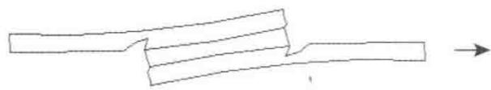

<details>
<summary>natural_image</summary>

Pure schematic lines of a mechanical or electrical component without any text, numbers, or symbols
</details>

图 14-4 被胶接件剥离破坏

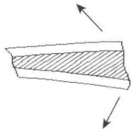

<details>
<summary>natural_image</summary>

Simple line drawing of a triangular shape with two arrows indicating direction (no text or symbols)
</details>

图 14-5 胶层剥离 (劈裂) 破坏

# 14.2.3 胶接基本连接形式

胶接连接的基本构型主要有图 14-6\~图 14-9 等几种形式，分别为单搭接、双搭接、斜面搭接和阶梯形搭接。当被胶接件比较薄（小于 1.8mm），可采用单搭接；对于中等厚度层板 $(l/t \approx 30)$ ，采用双搭接比较适宜。但是，对于无支撑单搭接连接，由于载荷偏心产生的附加弯矩，胶接连接的两端出现很高的剥离应力而使连接强度降低，则需要增大搭接长度与厚度之比，使 $l/t = 50 \sim 100$ ，以减轻这种偏心效应。当两个被胶接件刚度不等时，偏心效应会更明显，应尽量避免选用单搭接。倘若单搭接有支撑（如梁、肋、框等），变形受到限制，由于偏心效应减轻，可将其视作双搭接来分析。当被搭接件很厚时，宜选用斜面搭接，其搭接角度在 $6^{\circ} \sim 8^{\circ}$ 范围内可获得较高的连接效率，但是由于所需角度非常小，工艺上比较难实现，因此对于厚的被胶接件，通常采用阶梯形搭接。阶梯形搭接具有双搭接和斜面搭接两种连接的特性，通过增加台阶数，使之接近于斜面搭接角，每一阶梯胶层接近于纯剪状态，同样可获得较高的连接效率。

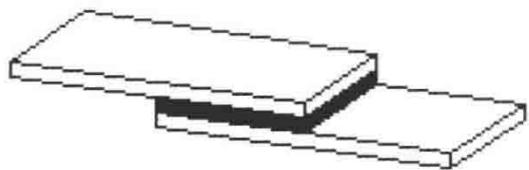

<details>
<summary>natural_image</summary>

Simple line drawing of two stacked rectangular blocks (no text or symbols)
</details>

图 14-6 胶接单搭接示意图

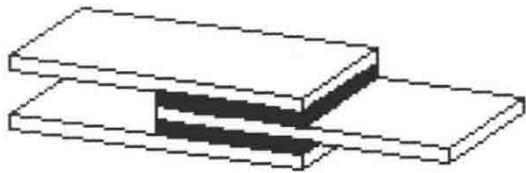

<details>
<summary>natural_image</summary>

Pure 3D schematic of two stacked rectangular blocks with no text, numbers, or symbols
</details>

图 14-7 胶接双搭接示意图

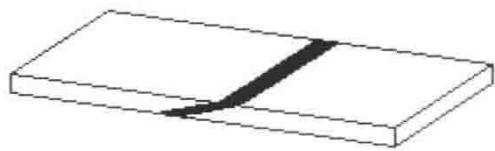

<details>
<summary>natural_image</summary>

Simple 3D diagram of a rectangular block with a diagonal seam, no text or symbols present
</details>

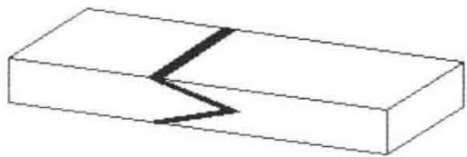

<details>
<summary>natural_image</summary>

Simple line drawing of a rectangular block with a zigzag line indicating a crack or fracture (no text or symbols)
</details>

图 14-8 胶接斜面搭接示意图

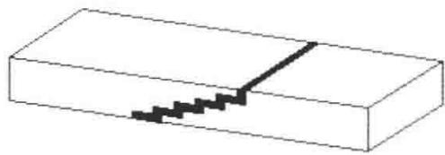

<details>
<summary>natural_image</summary>

Simple line drawing of a rectangular block with a diagonal line and a stepped arrow on the side (no text or symbols)
</details>

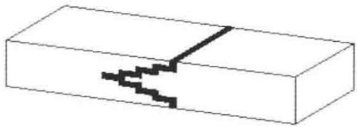

<details>
<summary>natural_image</summary>

Simple 3D diagram of a rectangular block with a zigzag line and a small triangular cutout (no text or symbols)
</details>

图 14-9 胶接阶梯型搭接示意图

# 14.2.4 胶接几何参数选取

图 14-10 给出胶接连接的几何参数, 主要为被胶接件厚度 $t$ , 胶层厚度为 $h$ , 搭接长度 $L$ 。被胶接件厚度 $t$ 通常由需传递的载荷 $P$ 来确定, 胶层厚度 $h$ 对连接强度有一定影响。增加胶层厚度, 可以减小应力集中, 提高连接强度, 但厚度过大易产生气泡等缺陷, 反使强度下降, 胶层薄则要求被胶接件间贴合度高, 但是也不宜过薄。

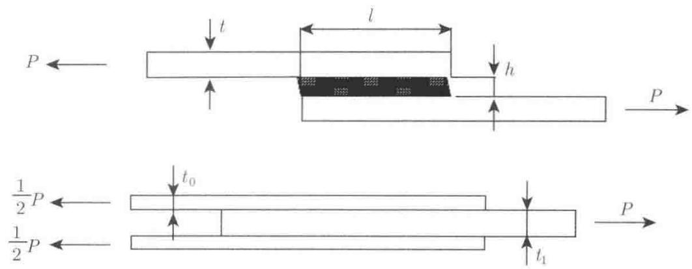

<details>
<summary>text_image</summary>

P ←
t
l
h
P
½P ←
t₀
½P ←
t₁
P →
</details>

图 14-10 胶接连接的几何参数

胶黏剂厚度较薄的试件,采用如图 14-11 所示的单搭接试件型式进行胶接试验。

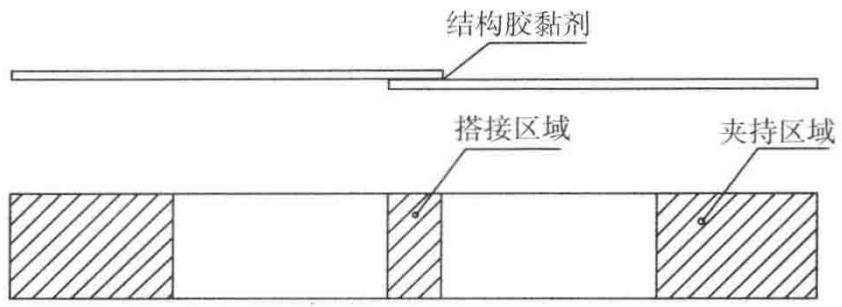

<details>
<summary>text_image</summary>

结构胶黏剂
搭接区域
夹持区域
</details>

图14-11 单搭接试件型式

当胶层厚度较厚以及大于此厚度时, 采用双搭接试件型式进行胶接试验, 具体尺寸如图 14-12 所示。

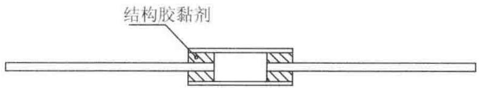

<details>
<summary>text_image</summary>

结构胶黏剂
</details>

图 14-12 双搭接试件型式

分析及试验结果表明，在载荷作用下，如图 14-13 所示，胶层中剪应力沿搭接长度方向的分布是不均匀的，主要集中在两端，中间最低应力弹性槽。由于弹性槽的存在，开始时，随着搭接长度的增加，胶接件承载能力逐渐提高，但当搭接长度达到一定值时，只是弹性槽的宽度和深度继续增加，而承载能力并无明显提高。从静强度观点分析，继续增加搭接长度似无必要，但从使用寿命，结构耐久性考虑，在可能范围内，仍希望将搭接长度（或搭接长度与厚度之比 l/t）取得尽可能大些。因为搭接长度很短而传递较大载荷时，搭接长度中间部分最小剪应力和剪应变几乎与两端的值相等，整个胶层进入塑性状态，卸去载荷后，中间没有可能恢复到原来状态，接头就会很快破坏。当搭接长度足够大时，弹性槽最小剪应力和剪应变可低到所希望的程度，即使卸载后，由于被胶接件的作用，将使胶层恢复到原来状态，蠕变不会积累。图 14-14 为胶层剪应变分布。

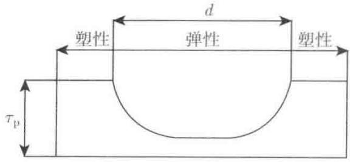

<details>
<summary>text_image</summary>

d
塑性 弹性 塑性
τp
</details>

图 14-13 胶层剪应力

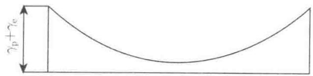

<details>
<summary>text_image</summary>

γp + γc
</details>

图 14-14 胶层剪应变分布

# 14.2.5 胶接纤维取向

复合材料层合板待胶接表面纤维最好与载荷方向一致（或者纤维方向与载荷方向成 $45^{\circ}$ ），不得与载荷方向垂直，以免被胶接件过早产生层间剥离破坏，详见表14-2。

表 14-2 胶接面纤维取向

<table><tr><td rowspan="2">作用</td><td colspan="2">胶接面纤维取向</td></tr><tr><td>正确</td><td>不正确</td></tr><tr><td>横向剪切</td><td>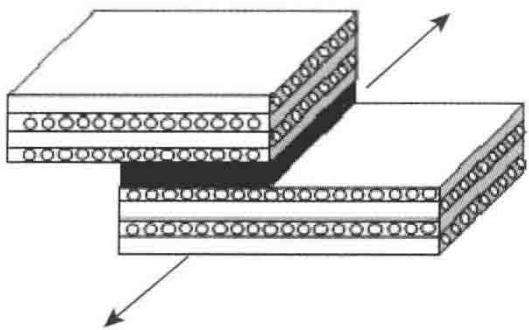</td><td>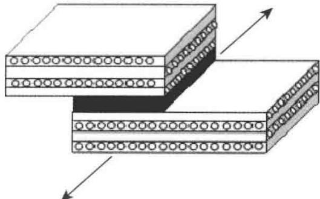</td></tr><tr><td>拉伸剪切</td><td>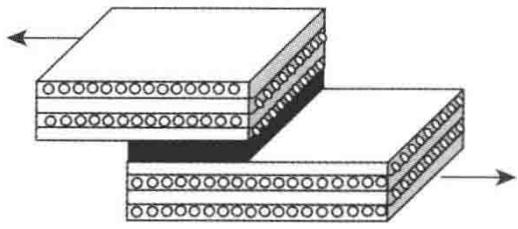</td><td>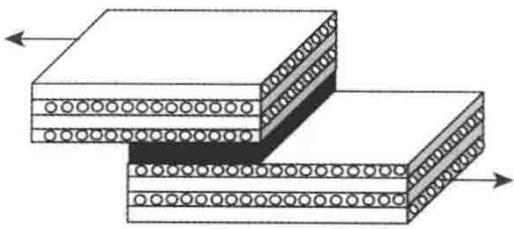</td></tr></table>

# 14.2.6 胶接连接细节设计

复合材料胶接结构细节设计，不仅影响胶接结构的静强度，而且直接关系到胶接结构的耐久性、胶接工艺及成本。

# 1. 基本要求

设计复合材料胶接结构应使胶层在剪切状态下工作，尽量避免胶层受拉力和剥离力。

胶接强度必须高于被胶接件本身的强度，否则，胶接连接将成为薄弱环节，使胶接结构过早破坏。

# 2. 应力水平

根据 GL 2010 的要求，胶黏剂在拉伸搭接-剪切强度最小为 12MPa。

# 3. 胶接连接形式选择

胶接连接形式的选择是胶接连接设计的关键。设计的目标应使制造工艺尽可能简单，成本尽可能低，同时连接强度不低于连接区外边被胶接件的强度。胶接连接承剪能力很强，但抗剥离能力很差。因此，优良的设计应根据最大载荷的作用方向，使所设计的连接以剪切的方式传递最大载荷，而其他方向载荷很小，就不致引起较大的剥离应力。

# 4. 蒙皮 (腹板) 的加强方法

当蒙皮（腹板）需加强时，推荐采用“T”形件，不用角形件。因为若有拉力存在，极易在角形加强件的转角处产生剥离，当然在转角处加填料有助于防止过早剥离。当采用“T”形件加强时，如有拉力作用，也需要注意防止剥离。

# 14.3 胶接工程算法

复合材料的胶接连接, 一般分为四种形式, 包括单搭接、双搭接、斜面搭接和阶梯形搭接。当两个被胶接件刚度不等时, 偏心效应很大, 应尽量避免选用单搭接。倘若单搭接有支撑 (如梁、框、肋等), 变形受到了限制, 偏心效应减轻, 可将其视作双搭接来分析。每一种胶接形式都可以应用工程算法计算胶接性能, 也可通过有限元分析胶层特性。

# 14.3.1 静强度计算

实践表明，胶接连接的线弹性分析是比较保守的。对于每种胶接连接形式，都存在静强度分析的工程方法。用这些方法进行分析前，需针对实际被胶接件和所选胶黏剂，预先测试得到胶层剪应力-应变曲线及其他特征参数。应指出的是，静强度分析的工程算法给出的设计参数是仅考虑静强度的结果，工程应用时，应综合考虑其他因素，特别是环境的长期影响。应通过必要的试验验证确定设计参数。

# 1. 概述

叶片腹板与壳体之间通过腹板缘条胶接连接，连接形式为单搭接，但由于腹板缘条黏接端有腹板支撑，因此整个胶接连接可视为考虑热不匹配性的不等刚度双搭接来分析[34]，如图14-15所示。

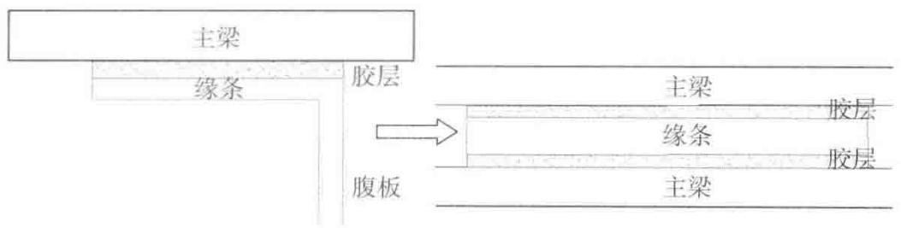

<details>
<summary>flowchart</summary>

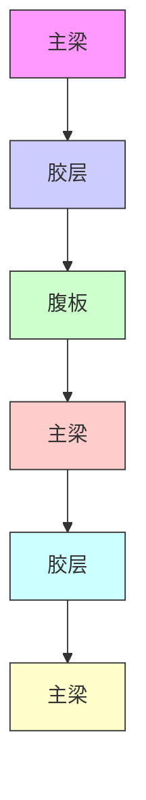
```mermaid
graph TD
    A["主梁"] --> B["胶层"]
    B --> C["腹板"]
    C --> D["主梁"]
    D --> E["胶层"]
    E --> F["主梁"]
    style A fill:#f9f,stroke:#333
    style B fill:#ccf,stroke:#333
    style C fill:#cfc,stroke:#333
    style D fill:#fcc,stroke:#333
    style E fill:#cff,stroke:#333
    style F fill:#ffc,stroke:#333
```
</details>

图14-15 双搭接模型

# 2. 计算模型

计算模型采用沿叶片展向，叶片壳体与腹板胶接局部模型，如图 14-16 所示。

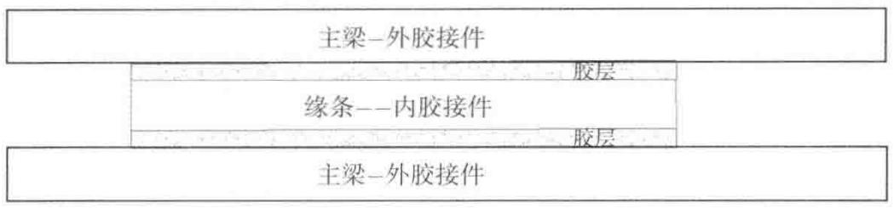

<details>
<summary>flowchart</summary>

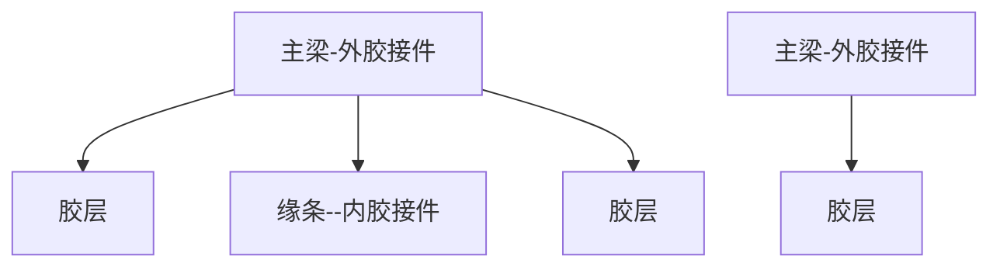
```mermaid
graph TD
    A["主梁-外胶接件"] --> B["胶层"]
    A --> C["缘条--内胶接件"]
    A --> D["胶层"]
    E["主梁-外胶接件"] --> F["胶层"]
```
</details>

图14-16 双搭接参数

# 3. 输入信息

对于不等刚度的双搭接胶接连接， $E_{0}(t_{01} + t_{02}) \neq E_{1}t_{1}$ ，需给出内胶接件、外胶接件和胶层特性用于工程算法计算胶接性能，被胶接件的性能见表 14-3，胶层性能见表 14-4。

表 14-3 被胶接件性能

<table><tr><td rowspan="2">特性</td><td colspan="3">内胶接件特性</td><td colspan="3">外胶接件特性</td></tr><tr><td>物理量符号</td><td>单位</td><td>数值</td><td>物理量符号</td><td>单位</td><td>数值</td></tr><tr><td>模量</td><td> $E_1$ </td><td>Pa</td><td> $4.00 \times 10^{10}$ </td><td> $E_0$ </td><td>Pa</td><td> $4.00 \times 10^{10}$ </td></tr><tr><td>厚度</td><td> $t_1$ </td><td>m</td><td> $5.00 \times 10^{-3}$ </td><td> $t_{01} = t_{02}$ </td><td>m</td><td>0.02</td></tr><tr><td>剪切模量</td><td> $G_1$ </td><td>Pa</td><td> $1.29 \times 10^{10}$ </td><td> $G_0$ </td><td>Pa</td><td> $1.29 \times 10^{10}$ </td></tr><tr><td>泊松比</td><td> $μ_1$ </td><td>—</td><td>0.285</td><td> $μ_0$ </td><td>—</td><td>0.285</td></tr><tr><td>许用应力</td><td> $[\sigma]_1$ </td><td>Pa</td><td> $3.18 \times 10^8$ </td><td> $[\sigma]_0$ </td><td>Pa</td><td> $3.18 \times 10^8$ </td></tr><tr><td>剪切应力</td><td> $[\tau]_1$ </td><td>Pa</td><td> $2.25 \times 10^8$ </td><td> $[\tau]_0$ </td><td>Pa</td><td> $2.25 \times 10^8$ </td></tr><tr><td>抗剥离应力</td><td> $[\sigma_{pe}]_1$ </td><td>Pa</td><td> $4.88 \times 10^7$ </td><td> $[\sigma_{pe}]_0$ </td><td>Pa</td><td> $4.88 \times 10^7$ </td></tr><tr><td>温度系数</td><td> $α_1$ </td><td>/°C</td><td> $1.80 \times 10^{-6}$ </td><td> $α_0$ </td><td>/°C</td><td> $2.00 \times 10^{-6}$ </td></tr></table>

# 4. 确定搭接长度

$$
\lambda^ {2} = \frac {G}{h} \left[ \frac {2}{E _ {0} (t _ {0 1} + t _ {0 2})} + \frac {2}{E _ {1} t _ {1}} \right] \tag {14-1}
$$

$$
l _ {t} = \frac {2}{\lambda} \sqrt {\frac {2 \gamma_ {p}}{\gamma_ {e}}} \tag {14-2}
$$

$$
l = l _ {t} + \frac {6}{\lambda} \tag {14-3}
$$

表 14-4 胶层性能

<table><tr><td rowspan="2">特性</td><td colspan="3">胶层特性</td></tr><tr><td>符号</td><td>单位</td><td>数值</td></tr><tr><td>模量</td><td> $E_c$ </td><td>Pa</td><td> $3.45 \times 10^9$ </td></tr><tr><td>剪切模量</td><td>G</td><td>Pa</td><td> $3.45 \times 10^8$ </td></tr><tr><td>厚度</td><td>h</td><td>m</td><td> $3.00 \times 10^{-3}$ </td></tr><tr><td>最大剪应力</td><td> $τ_p$ </td><td>Pa</td><td> $3.45 \times 10^7$ </td></tr><tr><td>弹性应变</td><td> $γ_e$ </td><td>—</td><td>0.10</td></tr><tr><td>塑性应变</td><td> $γ_p$ </td><td>—</td><td>1.00</td></tr><tr><td>抗剥离应力</td><td> $[\sigma_{pe}]$ </td><td>Pa</td><td> $6.90 \times 10^7$ </td></tr></table>

式中， $l_{t}$ 是胶层剪应力的弹性槽宽度为零，即胶层全部进入塑性时的搭接长度。6/ $\lambda$ 是为了充分保证胶层槽分布的剪应力最小值不大于最大剪应力的10%。若不考虑耐久性，只保证连接强度不变，可取短的搭接长度 $l = l_{t} + 2/\lambda$ 。

值得注意的是，制造公差应附加到搭接长度中。

根据本节输入信息，按照搭接长度的工程算法，计算得到搭接长度为 0.416m，考虑制造公差，可取 0.5m，即沿着叶片展向，至少在 0.5m 范围内保证叶片壳体与腹板缘条的搭接长度无缺陷，否则将影响叶片壳体与腹板缘条胶接的整体性能。

# 5. 确定拉伸载荷条件下的胶层破坏载荷

P 为下述公式中的较小值:

$$
(\alpha_ {0} - \alpha_ {1}) \Delta T E _ {1} t _ {1} + \left[ 2 \tau_ {p} h \left(\frac {\gamma_ {e}}{2} + \gamma_ {p}\right) 2 E _ {1} t _ {1} \left(1 + \frac {E _ {1} t _ {1}}{E _ {0} (t _ {0 1} + t _ {0 2})}\right) \right] ^ {1 / 2} \tag {14-4}
$$

$$
(\alpha_ {0} - \alpha_ {1}) \Delta T E _ {0} (t _ {0 1} + t _ {0 2}) + \left[ 2 \tau_ {p} h \left(\frac {\gamma_ {e}}{2} + \gamma_ {p}\right) 2 E _ {0} (t _ {0 1} + t _ {0 2}) \left(1 + \frac {E _ {0} (t _ {0 1} + t _ {0 2})}{E _ {1} t _ {1}}\right) \right] ^ {1 / 2}
$$

需要指出的是:

(1) 需要上述方程来决定连接的危险端；  
(2) 对压缩加载，需改变上述方程中带温度项的符号；  
(3) 对剪切加载, $E_{1}$ 和 $E_{0}$ 用 $G_{1}$ 和 $G_{0}$ 代替, $\lambda$ 用 $\lambda_{t}$ 代替, 其中, 不计热不匹配效应时:

$$
\lambda_ {t} ^ {2} = \frac {G}{h} \left[ \frac {2}{G _ {0} (t _ {0 1} + t _ {0 2})} + \frac {2}{G _ {1} t _ {1}} \right] \tag {14-5}
$$

按照拉伸载荷条件下的胶层强度分析, 确定胶层的破坏载荷为 $9.89 \times 10^{6}$ Pa。考虑热不匹配性, 确定热不匹配系数:

$$
\begin{array}{l} \begin{array}{l} C _ {1} = \left(\alpha_ {0} - \alpha_ {1}\right) \Delta T \left(E _ {1} t _ {1}\right) \\ C _ {2} = \left(\alpha_ {2} - \alpha_ {3}\right) \Delta T \left(E _ {2} t _ {2}\right) \end{array} \tag {14-6} \\ C _ {2} = (\alpha_ {1} - \alpha_ {0}) \Delta T (E _ {0} t _ {0}) \\ \end{array}
$$

(4) 对于拉伸加载, 考虑热不匹配性, 连接端部内被胶接件胶接强度:

$$
P _ {1} = C _ {1} + P _ {1} \tag {14-7}
$$

外被胶接件胶接强度：

$$
P _ {0} = C _ {2} + P _ {2} \tag {14-8}
$$

(5) 对于压缩加载, 考虑热不匹配性, 连接端部内被胶接件胶接强度:

$$
P _ {1} = P _ {1} - C _ {1} \tag {14-9}
$$

外被胶接件胶接强度：

$$
P _ {0} = P _ {2} - C _ {2} \tag {14-10}
$$

热效应影响危险端面的位置及破坏载荷值，且温度也影响被胶接件的特性和许用值。

根据以上工程算法, 计算得到拉伸加载, 考虑热不匹配性, 连接端部内被胶接件胶接强度为

$$
P _ {1} = (9. 8 8 \times 1 0 ^ {6}) + 4 3 2 0 \times \Delta T \tag {14-11}
$$

外被胶接件胶接强度：

$$
P _ {0} = (7. 9 0 \times 1 0 ^ {7}) - 3 4 5 6 0 \times \Delta T \tag {14-12}
$$

由于叶片壳体与腹板缘条的厚度差别较大，整体刚度 $Et$ 差别大，因此这种胶接结构的内外被胶接件的连接强度差别较大。

# 6. 确定剥离应力

$$
\sigma_ {p} = \tau_ {p} \left[ \frac {3 E _ {0} (1 - \mu_ {0} ^ {2}) t _ {0}}{E _ {0} h} \right] ^ {1 / 4} \tag {14-13}
$$

根据工程算法确定此种胶接连接的剥离应力为 $3.87 \times 10^{7}$ Pa，与胶层的抗剥离性能 ( $[\sigma_{pe}]1 = 4.88 \times 10^{7}$ Pa，取被胶接件的抗剥离性能与胶层抗剥离性能的较小值作为界面特性) 进行比较，确定此种双搭接胶层连接的抗剥离性能与材料特性相接近，安全裕度为 0.9957 < 1。

# 7. 被胶接件破坏载荷

对于轴向加载，被胶接件的破坏载荷为

$$
\begin{array}{l} P _ {1} = \left[ \sigma \right] _ {1} t _ {1} = 1. 5 9 \times 1 0 ^ {6} \mathrm{Pa} \\ P _ {2} = 2 [ \sigma ] t _ {2} = 1. 3 7 \times 1 0 ^ {7} \mathrm{Pa} \end{array} \tag {14-14}
$$

$$
P _ {0} = 2 [ \sigma ] _ {0} t _ {0} = 1. 2 7 \times 1 0 ^ {7} \mathrm{Pa}
$$

# 14.3.2 耐久性分析

复合材料胶接结构耐久性指在循环载荷和环境条件下结构的疲劳特性，与金属胶接结构一样，现在还没有可靠的复合材料胶接结构寿命的估算方法，一般通过实验验证。

胶接结构的耐久性取决于胶黏剂性能、被胶接件的表面制备、载荷及环境条件、被胶接件的结构特征和细节设计等因素。

国外根据胶接与螺栓连接的对比试验研究的结果提出: 在耐久性条件下, 控制胶接设计的是耐久性而不是静强度。

# 14.4 胶接连接分析

胶接连接中，被胶接件的层合结构对胶接特性影响较大，其通过层间强度较低。目前在计算搭接长度中，这些胶接危险区域已经采用3D应力场方法，胶黏剂层作为线弹性材料考虑而被胶接件材料为正交各向异性考虑。因此，应选择精确的合适的失效准则来预算3D局部应力场的胶接连接强度和判断初始破坏及生长[35]。图14-17为三维胶接连接模型，其胶接分析包括4个步骤：

(1) 三维应力分析与计算，验证剥离应力的重要性；  
(2) 计算不同分析面的失效因子;  
(3) 基于失效因子值确定初始破坏的位置;  
(4) 应用断裂力学方法分析损伤扩展, 即计算应变能释放率 (SERR) 的虚拟裂纹闭合法 (VCCT)。

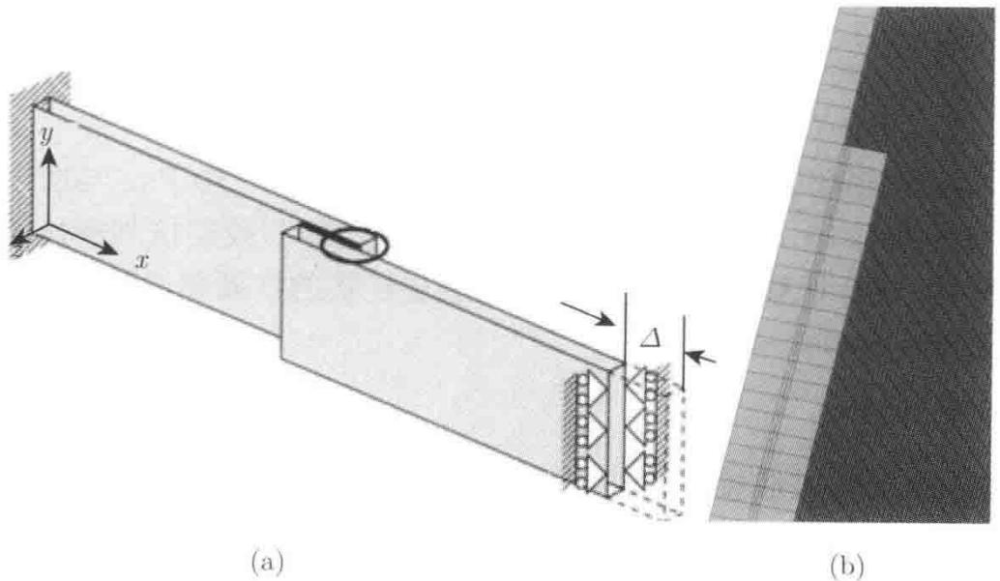

<details>
<summary>text_image</summary>

y
x
(a)
(b)
</details>

图 14-17 三维胶接连接分析

有限元分析中，三个分析面对于胶接分析是关键区域，常用的三个面为：

(1) 在搭接区域，底部被胶接件与胶黏剂的界面；  
(2) 胶黏剂的中间层;   
(3) 在搭接区域，上部被胶接件与胶黏剂的界面；

胶接连接的胶层剥离应力分布如图 14-18 所示, 同样可以显示胶层的剪切应力分布。

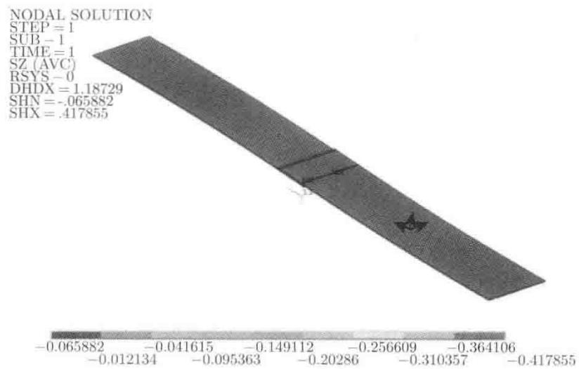

<details>
<summary>surface_3d</summary>

| Parameter       | Value        |
| --------------- | ------------ |
| STEP            | 1            |
| SUB             | -1           |
| TIME            | 1            |
| SZ (AVC)        | -            |
| RSYS            | 0            |
| DHDX            | 1.18729      |
| SHN             | -.065882     |
| SHX             | .417855      |
</details>

图 14-18 胶接连接的胶层剥离应力分布

如图 14-19 所示，胶接应力分析显示了每个分析层的剥离应力和面外剪切应力的分布，连接中间的剥离应力最大而在边缘骤增，并且除边缘外，搭接区域的应力分布为常数。造成这种分布的原因为弹性性能的不协调及被胶接件的非弹性弯曲。胶层的剥离应力相比于胶层-被胶接件的界面层较大，剪切应力也体现出重要的三维效应。通过应力分析，相比于其他应力分量，远离自由面，在搭接区域的末端存在很大的拉伸剥离应力，故在远离自由面而不是边界的点，剥离应力引起胶接分层。

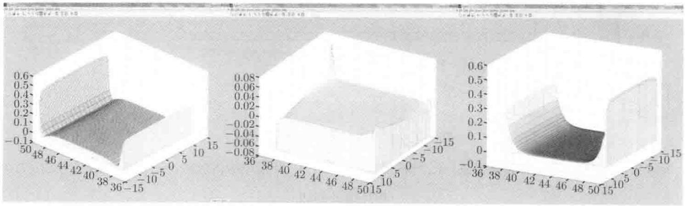

<details>
<summary>surface_3d</summary>

| X Range     | Y Range | Value  |
| ----------- | ------- | ------ |
| -15 to 50   | -15 to 15 | -0.1   |
| -15 to 50   | 0 to 15  | 0.6    |
| -15 to 50   | 15 to 36 | 0.6    |
| -15 to 50   | 36 to 50 | 0.6    |
| -15 to 50   | 50 to 10 | 0.6    |
| -15 to 50   | 10 to 15 | 0.6    |
| -15 to 50   | 15 to 36 | 0.6    |
| -15 to 50   | 36 to 50 | 0.6    |
| -15 to 50   | 50 to 10 | 0.6    |
| -15 to 50   | 10 to 15 | 0, 0.6  |
| -15 to 50   | 15 to 36 | 0.6    |
| -15 to 50   | 36 to 50 | 0.6    |
| -15 to 50   | 50 to 10 | 0.6    |
| -15 to 50   | 10 to 15 | 0.6    |
| -20 to 25   | -20 to 25 | -0.1   |
| -20 to 25   | -25 to 25 | -0.1   |
| -20 to 25   | -30 to 25 | -0.1   |
| -20 to 25   | -35 to 25 | -0.1   |
| -20 to 25   | -40 to 25 | -0.1   |
| -20 to 25   | -45 to 25 | -0.1   |
| -20 to 25   | -50 to 25 | -0.1   |
| -20 to 25   | -75 to 25 | -0.1   |
| -20 to 25   | -80 to 25 | -0.1   |
| -20 to 25   | -90 to 25 | -0.1   |
| -20 to 25   | -100 to 25 | -0.1   |
| -20 to 25   | -110 to 25 | -0.1   |
| -20 to 25   | -120 to 25 | -0.1   |
| -20 to 25   | -130 to 25 | -0.1   |
| -20 to 25   | -140 to 25 | -0.1   |
| -20 to 25   | -145 to 25 | -0.1   |
| -20 to 25   | -148 to 25 | -0.1   |
| -20 to 25   | -149 to 25 | -0.1   |
| -20 to 25   | -149.75 | -0.1   |
| -20 to 30   | -75 to 36 | -0.1   |
| -20 to 30   | -80 to 36 | -0.1   |
| -20 to 30   | -85 to 36 | -0.1   |
| -20 to 30   | -90 to 36 | -0.1   |
| -20 to 30   | -95 to 36 | -0.1   |
| -20 to 30   | -100 to 36 | -0.1   |
| -20 to 30   | -105 to 36 | -0.1   |
| -20 to 30   | -110 to 36 | -0.1   |
| -20 to 30   | -115 to 36 | -0.1   |
| -20 to 30   | -120 to 36 | -0.1   |
| -20 to 30   | -125 to 36 | -0.1   |
| -20 to 35    | -75 to 36 | -0.1   |
| -20 to 35    | -80 to 36 | -0.1   |
| -20 to 35    | -85 to 36 | -0.1   |
| -20 to 35    | -90 to 36 | -0.1   |
| -20 to 35    | -95 to 36 | -0.1   |
| -20 to 35    | -100 to 36 | -0.1   |
| -20 to 35    | -105 to 36 | -0.1   |
| -20 to 35    | -110 to 36 | -0.1   |
| -20 to 35    | -115 to 36 | -0.1   |
| -20 to 35    | -120 to 36 | -0.1   |
| -20 to 35    | -125 to 36 | -0.1   |
| -20 to 48    | -75 to 36 | -0.1   |
| -20 to 48    | -80 to 36 | -0.1   |
| -20 to 48    | -85 to 36 | -0.1   |
| -20 to 48    | -90 to 36 | -0.1   |
| -20 to 48    | -95 to 36 | -0.1   |
| -20 to 48    | -100 to 36 | -0.1   |
| -20 to 48    | -105 to 36 | -0.1   |
| -20 to 48    | -110 to 36 | -0.1   |
| -20 to 48    | -115 to 36 | -0.1   |
| -20 to 48    | -120 to 36 | -0.1   |
| -20 to 48    | -125 to 36 | -0.1   |
| ...         | ...     | ...    |
| ...         | ...     | ...    |
| ...         | ...     | ...    |
| ...         | ...     | ...    |
| ...         | ...     | ...    |
| ...         | ...     | ...    |
| ...         | ...     | ...    |
| ...         | ...     | ...    |
| ...         | ...     | ...    |
| ...         | ...     | ...    |
| ...         | ...     | ...     |
| ...         | ...     | ...    |
| ...         | ...     | ...    |
| ...         | ...     | ...    |
| ...         | ...     | ...    |
| ...         | ...     | ...    |
| ...         | ...     | ...    |
| ...         | ...     | ...    |
| ...         | ...     | ...    |
| ...         | ...     | ...    |
| ...         | ...     | ...```
</details>

图 14-19 胶接应力分布

胶接连接的裂纹扩展分析，基于虚拟裂纹闭合法，将在第 18 章详述断裂力学分析。

# 14.5 胶接连接在叶片上的应用

胶接连接的设计尤其复杂，因为其复合材料被胶接件的复杂特性，如双材料界面效应表现出较低的层间应力。在胶接件中，层间应力是导致胶接前缘分层的本质因素，也是黏结和胶接失效时胶接件的主要威胁。应用有限元软件，建立一种新型的实体单元用于建模胶层和被胶接件。并且考虑了搭接区域与被胶接件的自由旋转，此时会忽略了二阶弯曲力矩。胶接分析的目标：

(1) 在偏心载荷加载形式下, 确定三维单搭接或双搭接模型的层间应力及剥离应力分布;  
(2) 基于力学, 被胶接件的各向异性与胶黏剂的各向同性特性, 确定初始损伤的位置;  
(3) 讨论胶接连接中被胶接件和胶黏剂的各种失效/损伤类型;   
(4) 应用断裂力学的方法确定损伤扩展的应变能释放率。

叶片前缘与尾缘合模黏接区域、腹板缘条与壳体黏接区域都需要胶接设计，因此胶接设计与分析在叶片结构设计中占有举足轻重的地位。黏接区域应保持清洁、无油和粗糙表面处理，以保证黏接性能。

叶片上下壳体，需要在叶片前缘、尾缘、腹板缘条处黏接结构胶，将叶片上下壳体黏接到一起。为保证叶片的黏接特性，需要满足黏接段的剪切强度与疲劳特性，而这不仅仅与结构胶的自身性能相关，还与气动前缘和尾缘设计、结构前缘和尾缘的铺层设计、腹板缘条的宽度设计、工艺胶接特性、工艺温度控制等密切相关。图 14-20 为叶片合模黏接区域。

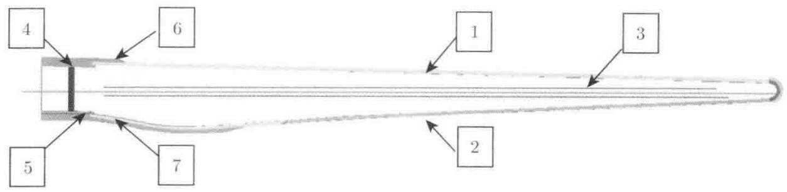

<details>
<summary>text_image</summary>

4
6
1
3
5
7
2
</details>

图 14-20 叶片合膜黏接区域

1. 前缘条；2. 尾缘条；3. 腹板缘条；4. 叶根前缘内包边；5. 叶根尾缘内包边；6. 叶根前缘外包边；7. 叶根尾缘外包边

叶片合模黏接、合模时，应确保夹芯区域和尾缘梁区域不会发生干涉。

前缘条与尾缘条黏接时，考虑黏接厚度后应确保黏接缘条尺寸合适。尾缘条黏接较复杂，沿叶片展向不同位置黏接型式不同。前缘与尾缘黏接，保证前缘与尾缘黏接面积与黏接厚度。叶片前缘与尾缘黏接的宽度，随着叶片展长递减。一般情况为沿叶片弦向黏接宽度最小为 60mm。另外，胶接厚度需要满足叶片结构设计要求。

# 14.5.1 腹板缘条与壳体黏接

叶片腹板与壳体之间通过胶接连接在一起，由于叶片壳体曲率及胶接工艺控制差等原因，常常发生腹板缘条与壳体黏接不良的情况，如局部缺胶、断胶等，因此应针对叶片腹板缘条与壳体黏接的局部进行分析，而且腹板与壳体黏接的缺陷分析时应从全局模型走入局部，建立缺陷的局部模型，进行细节的分析，包括胶接件和被胶接件的静强度分析，如图 14-21 所示。

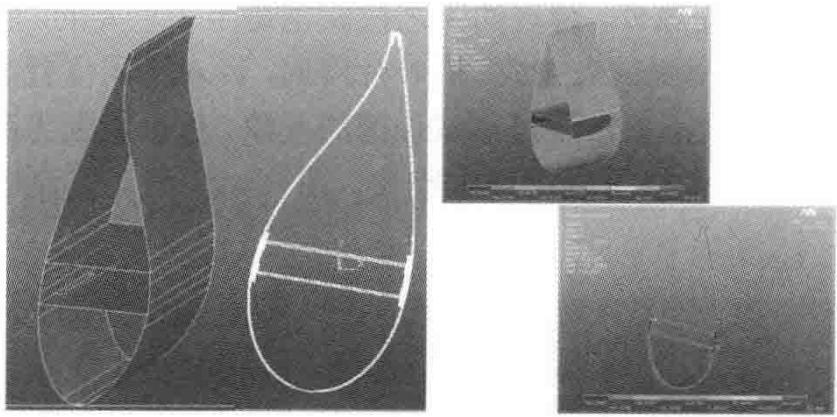

<details>
<summary>natural_image</summary>

Three technical diagrams showing wireframe and 3D model views of a sailboat or sail (no text or symbols present)
</details>

图 14-21 缺胶模型示意图

# 14.5.2 尾缘胶接

叶片尾缘胶接结构中尾缘胶应采用体单元建立于叶片尾缘局部的有限元模型中，如图 14-22 所示。进行尾缘局部的模型细化，进行尾缘胶接结构的胶层与被胶接件的强度分析，如图 14-23 所示。

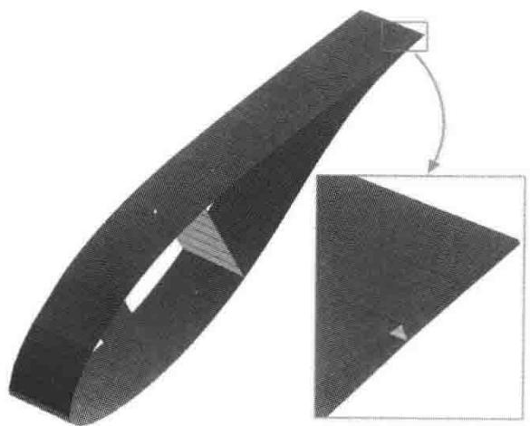

<details>
<summary>natural_image</summary>

3D diagram of a curved structural component with an inset showing a triangular cutout (no text or symbols)
</details>

图 14-22 叶片尾缘体单元模型

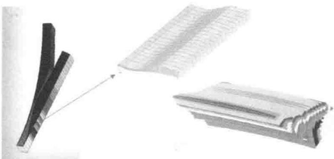

<details>
<summary>natural_image</summary>

Three views of a mechanical component: a cantilever beam, a folded sheet, and a flat base (no text or symbols visible)
</details>

图 14-23 尾缘胶接的局部模型

# 14.5.3 胶接工艺控制

胶接性能的影响因素主要有胶层厚度、胶接宽度以及被胶接件的厚度。胶接厚度的控制，除考虑合模间隙外，合理的工艺控制也是至关重要的。目前工艺上主要采用制作刮胶工具和合模测试来完成。沿叶片展向，针对不同位置制作不同的刮胶工具，以确保胶接的厚度不要出现过厚或过薄的现象，也不能因为刮胶之后胶层形状的缺陷引起合模过程中挤压胶层产生胶块。图 14-24 为工艺刮胶后胶黏剂的效果图。

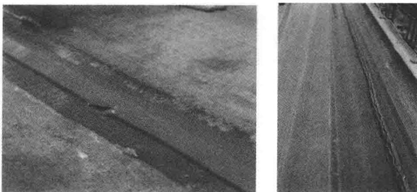

<details>
<summary>natural_image</summary>

Two grayscale close-up photos showing textured surfaces with diagonal lines and a visible crack or defect in the right image (no text or symbols)
</details>

图 14-24 工艺刮胶

# 第 15 章 螺栓连接分析

叶片叶根与变桨轴承通过螺栓连接，再通过变桨轴承与轮毂连接。叶片根部涉及复合材料与金属的连接，图 15-1 为叶根螺栓连接的示意图。

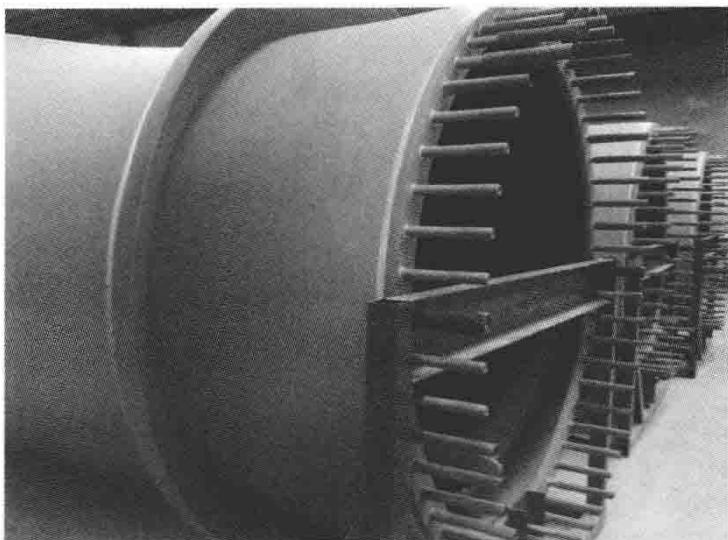

<details>
<summary>natural_image</summary>

Close-up of a large cylindrical mechanical component with internal gear-like structure (no visible text or symbols)
</details>

图 15-1 叶根螺栓连接示意图

螺栓连接的静力分析包括以下内容:

(1) 从总体结构分析确定螺栓连接所受的外力；  
(2) 由螺栓连接所受的外力确定各个连接孔处的挤压载荷；  
(3) 进行细节分析, 得到连接区域的应力, 利用材料的失效准则和特征曲线评定螺栓连接的强度。

# 15.1 叶根预埋工艺的结构校核

# 15.1.1 叶根端面形式

预埋螺栓的结构形式设计中，需采用合理的叶根端面形式，使得叶根总体受力特性最优。

这里主要针对叶根预埋螺栓模型端面的不同形式，分析叶根模型在轴向拉力、螺栓预紧力、组合力下的受力情况，为选择叶根端面形式提供理论依据。

三种叶根预埋螺栓模型的端面形式见表 15-1，图 15-2 为 B 形式叶根端面，图 15-3 为 C 形式叶根端面。

表 15-1 叶根模型端面形式

<table><tr><td>叶根端面形式</td><td>说明</td></tr><tr><td>A</td><td>螺栓套、玻纤丝、树脂、玻纤层、玻纤棒、复合层都与叶根法兰平齐</td></tr><tr><td>B</td><td>螺栓套与法兰连接,复合层、玻纤棒、玻纤丝、玻纤层、树脂等都与法兰端面存在一定的空隙</td></tr><tr><td>C</td><td>复合层、玻纤棒与法兰连接,螺栓套、玻纤丝、树脂都与法兰端面存在一定的空隙</td></tr></table>

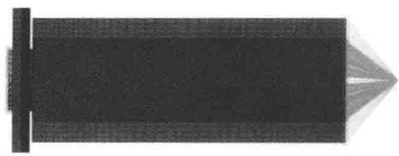

<details>
<summary>natural_image</summary>

Pure diagram of a rectangular object with a pointed tip and internal structure, no text or symbols present.
</details>

图 15-2 叶根端面形式 B

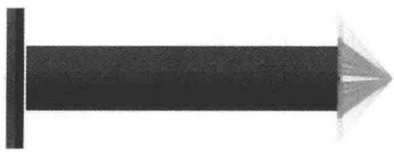

<details>
<summary>natural_image</summary>

Simple black arrow pointing right, no text or symbols present
</details>

图 15-3 叶根端面形式 C

本章节中，几何模型与有限元模型都采用 MSC 的总体坐标系。复合材料的纤维方向，本章节应用局部坐标系定义。坐标系说明如图 15-4 所示。

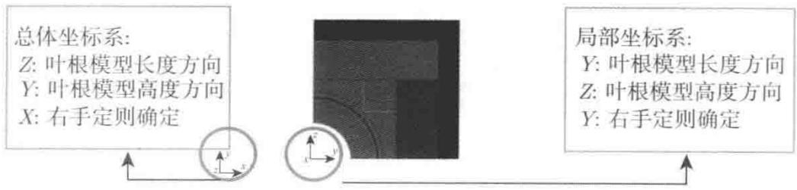

<details>
<summary>flowchart</summary>

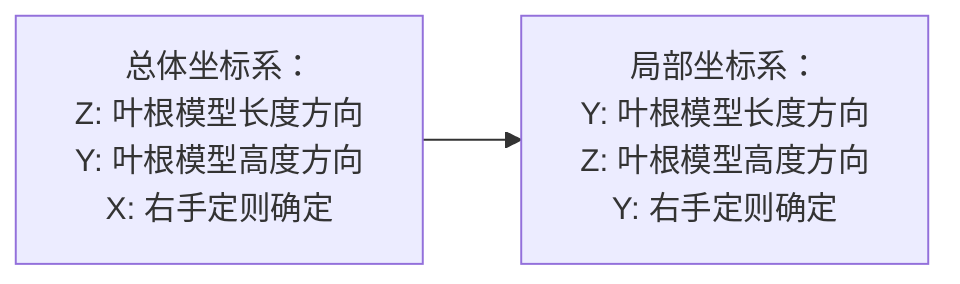
```mermaid
graph LR
    A["总体坐标系：<br>Z: 叶根模型长度方向<br>Y: 叶根模型高度方向<br>X: 右手定则确定"] --> B["局部坐标系：<br>Y: 叶根模型长度方向<br>Z: 叶根模型高度方向<br>Y: 右手定则确定"]
```
</details>

图 15-4 坐标系说明

# 1. 几何模型

本章节中，叶根预埋螺栓端面形式的几何模型由以下部件组成：垫片、变桨轴承、法兰、复合层、玻纤棒、玻纤层、树脂、玻纤丝、螺栓套与螺栓。各部件的几何模型如图 15-5 所示。

# 2. 载荷条件

假设四种载荷工况，见表 15-2，分别根据各种载荷工况进行有限元分析。

表 15-2 载荷工况

<table><tr><td>载荷工况</td><td>工况说明</td><td>分析形式</td></tr><tr><td>Case_01</td><td>MPC 加载轴向拉力</td><td>静力分析</td></tr><tr><td>Case_02</td><td>螺栓预紧力</td><td>非线性 SOL600 分析</td></tr><tr><td>Case_03</td><td>MPC 轴向拉力 + 螺栓预紧位移</td><td>非线性 SOL600 分析</td></tr><tr><td>Case_04</td><td>MPC 轴向压力 + 螺栓预紧位移</td><td>非线性 SOL600 分析</td></tr></table>

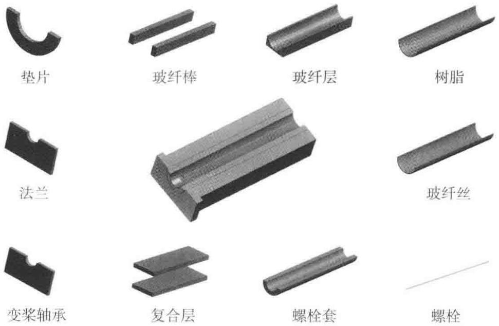

<details>
<summary>text_image</summary>

垫片
玻纤棒
玻纤层
树脂
法兰
玻纤丝
变桨轴承
复合层
螺栓套
螺栓
</details>

图 15-5 叶根预埋螺栓端面形式几何模型

# 3. 网格

预埋工艺的叶根端面形式的网格划分如图 15-6 所示。

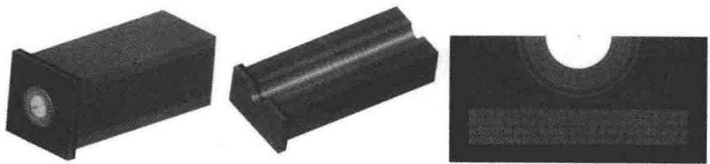

<details>
<summary>natural_image</summary>

Three black mechanical components with textured surfaces, no visible text or symbols
</details>

图 15-6 叶根预埋螺栓端面形式网络模型

取叶根预埋螺栓有限元分析的一半模型,示意网格尺寸与细节,如图 15-7 所示。

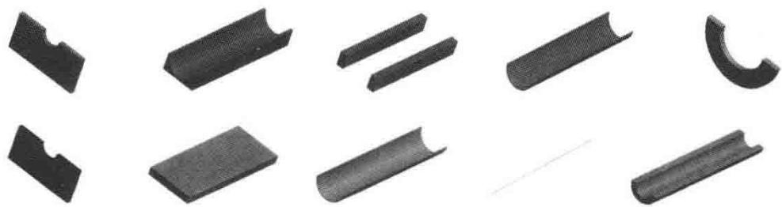

<details>
<summary>natural_image</summary>

Collection of various black plastic components and cutouts, no text or symbols visible
</details>

图 15-7 叶根各部件一半模型的网络示意图

# 4. 材料方向

复合材料的材料轴方向很重要，玻纤丝是缠绕于螺栓套表面，因此玻纤丝的材料轴方向为环绕方向，如图 15-8 所示。玻纤层与玻纤棒和复合层的材料轴方向均为叶根模型长度方向，如图 15-9 所示。

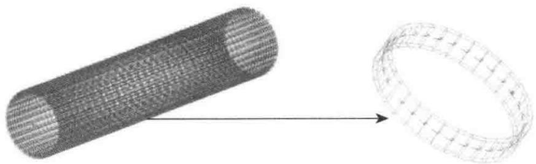

<details>
<summary>natural_image</summary>

Diagram showing a cylindrical object being converted into a toroidal mesh structure (no text or symbols)
</details>

图 15-8 玻纤丝的材料轴方向

# 5. 载荷边界条件

(1) 载荷工况 Case\_01，螺栓轴向拉力为叶根螺栓载荷的单位近似载荷。  
(2) 载荷工况 Case\_02，根据螺栓等级确定预紧力范围。   
(3) 载荷工况 Case\_03，预紧载荷工况 Case\_02 得到螺栓在预紧力作用下的位移，Case\_03 工况下选择加载预紧位移与轴向拉力共同作用。  
(4) 载荷工况 Case\_04，预紧载荷工况 Case\_02 得到螺栓在预紧力作用下的位移，Case\_04 工况下选择加载预紧位移与轴向压力共同作用。

# 6. 有限元分析

各工况下分析各模型的应力，提取应力分析对象的单元最大应力和平均应力，本节仅以 Case\_02 工况为例，示例螺栓套的应力分析结果，如图 15-9 所示。

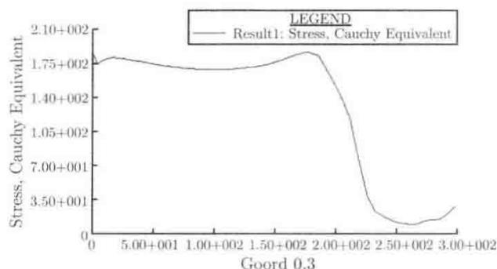

<details>
<summary>line</summary>

| Goord 0.3 | Stress, Cauchy Equivalent |
| --------- | -------------------------- |
| 0         | 1.75+002                   |
| 5.00+001  | 1.75+002                   |
| 1.00+002  | 1.75+002                   |
| 1.50+002  | 1.75+002                   |
| 2.00+002  | 1.75+002                   |
| 2.50+002  | 3.50+001                   |
| 3.00+002  | 3.50+001                   |
</details>

叶根端面A模型

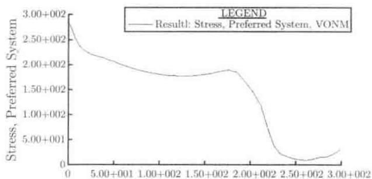

<details>
<summary>line</summary>

| Stress, Preferred System | Value     |
| ------------------------- | --------- |
| 0                         | 3.00+002  |
| 5.00+001                  | 2.50+002  |
| 1.00+002                  | 2.00+002  |
| 1.50+002                  | 1.75+002  |
| 2.00+002                  | 1.85+002  |
| 2.50+002                  | 1.00+001  |
| 3.00+002                  | 5.00+001  |
</details>

Coord 0.3
叶根端面B模型

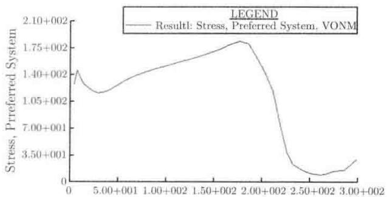

<details>
<summary>line</summary>

| Pressure Range | Stress, Preferred System |
| -------------- | ------------------------- |
| 0              | 1.40+002                  |
| 5.00+001       | 1.05+002                  |
| 1.00+002       | 1.40+002                  |
| 1.50+002       | 1.75+002                  |
| 2.00+002       | 1.80+002                  |
| 2.50+002       | 3.50+001                  |
| 3.00+002       | 3.50+001                  |
</details>

Coord 0.3
叶根端面C模型  
图 15-9 Case\_02 工况下，A、B、C 模型对应的螺栓套 Z 向 von Mises 应力分布

# 15.1.2 整体有限元分析

针对风力机叶片预埋螺栓的形式, 取叶根螺栓局部作为研究对象, 对其进行网格细化、有限元加载与结构分析, 得到其在叶根螺栓的极限载荷作用下各构件的应力分布, 分析风力机叶片叶根预埋螺栓周围构件的受力特性。

# 1. 几何模型

图 15-10 为叶根螺栓套与角条的整体几何模型，图 15-11 为叶根螺栓的几何模型。叶根螺栓与螺栓套过盈配合，而螺栓套外侧需要缠绕玻纤丝与复合毡，目的是为了减小叶根各构件之间的缝隙，避免积胶；螺栓套四周三角条用于保证螺栓套与左右玻纤棒、上下复合层之间的平面度。叶片叶根需要与法兰相接，通过螺栓及密封圈等将法兰与叶片根部连接到一起。

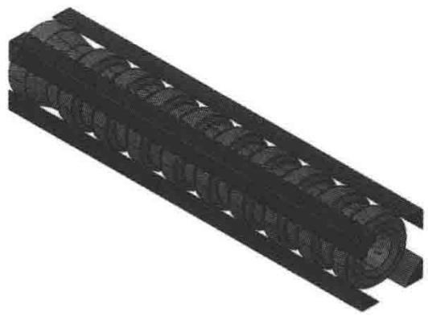

<details>
<summary>natural_image</summary>

3D rendering of a mechanical component with helical grooves and mounting holes (no text or symbols)
</details>

图 15-10 叶根螺栓套与角条

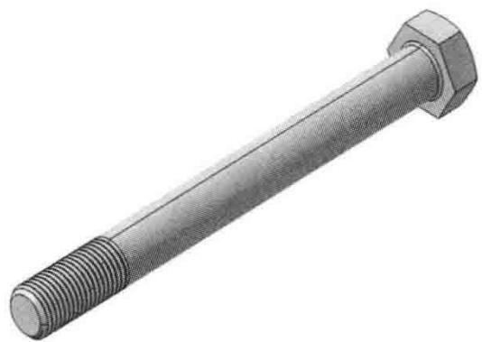

<details>
<summary>natural_image</summary>

Illustration of a metallic hexagonal bolt with threaded shaft (no text or symbols)
</details>

图 15-11 叶根螺栓

叶片叶根预埋螺栓的构件整体形式如图 15-12 所示。

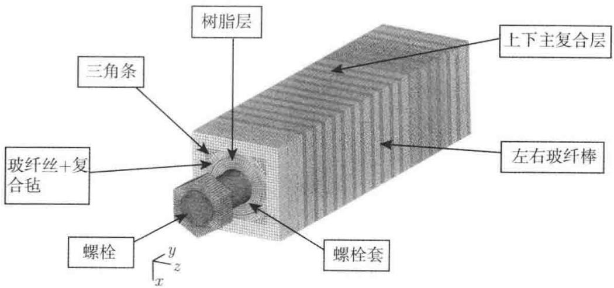

<details>
<summary>text_image</summary>

树脂层
三角条
玻纤丝+复合毡
上下主复合层
左右玻纤棒
螺栓套
螺栓
y
z
x
</details>

图 15-12 叶根螺栓各构件示意图

# 2. 叶根模型剖面网格图

图 15-13～图 15-15 分别从正视图和剖视图的角度来表征叶根预埋螺栓整体和

局部的网格划分。

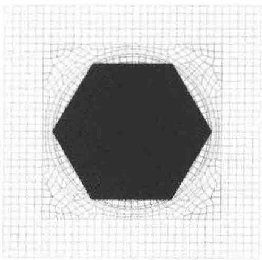

<details>
<summary>natural_image</summary>

Geometric diagram showing a black hexagon inscribed in a grid with a circular border (no text or symbols)
</details>

图 15-13 模型网络正视图 (叶根-叶尖)

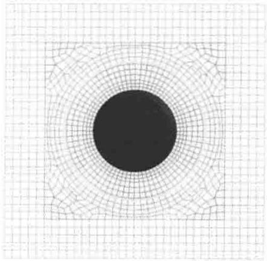

<details>
<summary>natural_image</summary>

Abstract grid pattern with concentric circles and radial lines, no text or symbols present
</details>

图 15-14 模型网络正视图 (叶尖-叶根)

# 3. 叶根螺栓载荷

根据风力机载荷计算软件 Bladed，输出叶片叶根载荷，载荷坐标系基于叶根坐标系，因此 Bladed 输出叶片的叶根载荷为剪力、弯矩、轴向力和扭矩的形式，即 $[F_{x}, F_{y}, F_{z}, M_{x}, M_{y}, M_{z}]$ 。将 Bladed 输出的力矩转化为叶根坐标系下的剪力，则可将 Bladed 输出叶根载荷转化为剪力、轴向力和扭矩的形式，即 $[F_{x}, F_{y}, F_{z}, M_{z}]$ 。

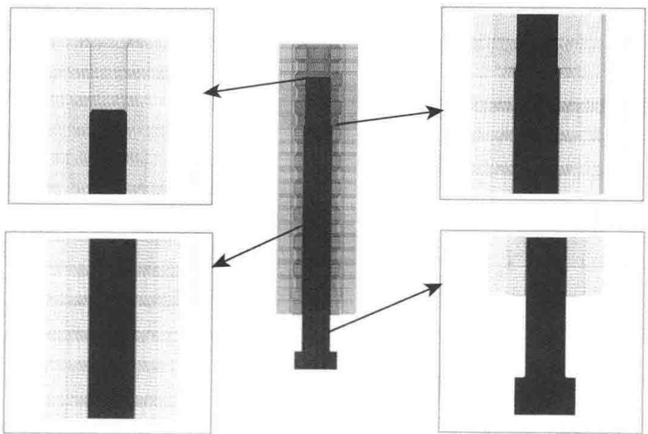

<details>
<summary>flowchart</summary>

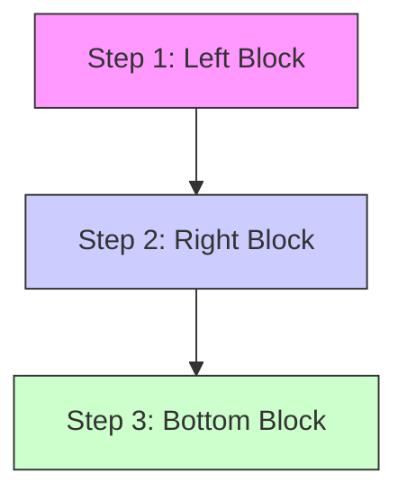
```mermaid
graph TD
    A["Step 1: Left Block"] --> B["Step 2: Right Block"]
    B --> C["Step 3: Bottom Block"]
    style A fill:#f9f,stroke:#333
    style B fill:#ccf,stroke:#333
    style C fill:#cfc,stroke:#333
```
</details>

图15-15 模型剖视图

由于叶根螺栓的分布是均匀的，所以默认为叶根每颗螺栓的载荷相同，均匀承受叶片叶根的总载荷。通过坐标变化、力的平移等，得到叶根螺栓载荷的几种工况形式，取一种叶根螺栓载荷形式加载于叶根有限元模型上，取叶根螺栓的载荷坐标系为 $x_{i}y_{i}z_{i}$ ，图15-16为叶根螺栓坐标系。

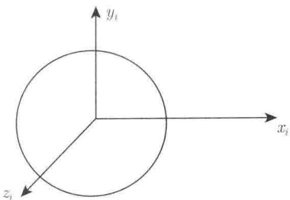

<details>
<summary>text_image</summary>

y₁
x₁
z₁
</details>

图 15-16 叶根螺栓坐标系

# 4. 有限元加载

# 1) 边界条件

根据叶根模型的真实边界条件，固支约束选择在法兰盘的两侧节点上，如图15-17所示。

# 2) 有限元加载

根据叶根螺栓的极限载荷, 结合叶片叶根模型的传力路径, 将叶根螺栓的载荷加载于叶根有限元模型上。加载形式列于表 15-3 中。

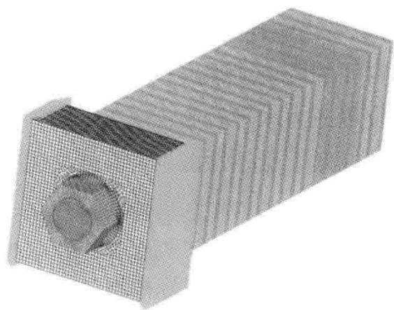

<details>
<summary>natural_image</summary>

3D rendered mechanical component with a central circular feature, no visible text or symbols
</details>

图 15-17 叶根法兰固支

表 15-3 有限元载荷

<table><tr><td>载荷形式</td><td>有限元坐标系</td><td>叶根螺栓载荷</td><td>加载位置</td><td>载荷形式</td></tr><tr><td>剪力</td><td>x-z 平面</td><td> $f_{xi}$ 与 $f_{yi}$ </td><td>叶根模型远断面</td><td>Total load</td></tr><tr><td>轴向力</td><td>y 正方向</td><td> $f_{zi}$ </td><td>叶根模型最外层</td><td>Total load</td></tr><tr><td>扭矩</td><td>y 轴</td><td> $m_{zi}$ </td><td>叶根模型远断面</td><td>MPC</td></tr></table>

# 5. 整体静力分析

叶片在运转过程中受离心力等作用，轴向载荷由叶根螺栓承受，其分析云图和

应力分布如图 15-18 所示。

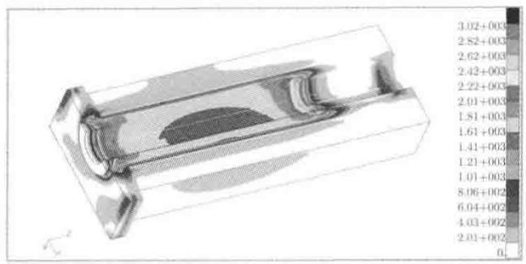

<details>
<summary>text_image</summary>

3.02+003
2.82+003
2.62+003
2.42+003
2.22+003
2.01+003
1.81+003
1.61+003
1.41+003
1.21+003
1.01+003
8.06+002
6.04+002
4.03+002
2.01+002
0.
</details>

(a) 螺栓构件整体有限元分析的应力云图

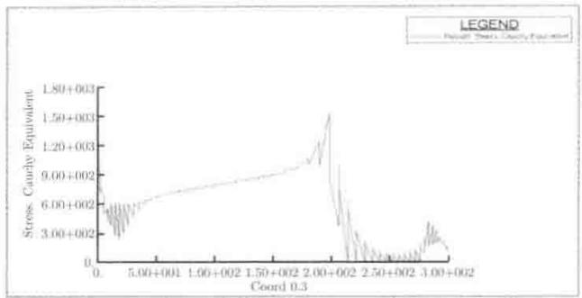

<details>
<summary>line</summary>

| Coord 0.3 | Stress County Equivalent |
| --------- | ------------------------ |
| 0         | 6.00+002                 |
| 5.00+001  | 9.00+002                 |
| 1.00+002  | 1.20+003                 |
| 1.50+002  | 1.50+003                 |
| 2.00+002  | 1.80+003                 |
| 2.50+002  | 3.00+002                 |
| 3.00+002  | 3.00+002                 |
</details>

(b) 螺栓长度方向应力分布  
图 15-18 整体分析云图和螺栓长度方向应力分布

由于篇幅限制, 未列举所有计算结果, 通过分析叶根螺栓在各种极限载荷工况下的受力情况, 可得到如下结论:

(1) 由于螺栓套等几何模型形状不规则, 倒圆角较多, 避免由于几何或网格引起应力集中, 将叶根整体模型进行网格细化;  
(2) 主要考虑叶根模型在轴向拉力、面内剪力、扭矩以及以上极限载荷组合作用下的静力分析；  
(3) 通过静力分析, 可以看出螺栓与螺栓套承受且传递主要载荷, 应力值较高;  
(4) 螺栓套与复合材料间的胶接层强度较低，应力值较高，应重点分析；  
(5) 法兰在接触面等位置应力水平较高；  
(6) 复合材料的受压性能低于受拉性能，应重点关注复合材料在受压情形下的应力应变情况。  
本节分析中有诸多不足，主要体现在：

(1) 对接触面采用共节点处理, 不能较好模拟某些工况下的传力情况;

(2) 未考虑螺栓预紧力的情况;

(3) 材料性能较简单, 需要将玻纤棒、主复合层、三角条、玻纤丝等分别给予材料性能;

基于以上不足之处, 将在下一步工作中将法兰面与叶根模型作为接触分析, 同时考虑螺栓预紧力, 结合较全面的材料属性, 进一步进行叶根模型的有限元分析。

# 15.1.3 接触面局部分析

采用二维有限元模型，针对叶根预埋螺栓在轴向拉力与压力、螺栓预紧力以及组合力作用下的螺纹连接及法兰端面的受力情况进行分析，为更详细进行叶根预埋螺栓模型建模的合理简化与分析提供依据。

# 1.主要内容

应用有限元软件 MSC. Nastran 对叶根预埋螺栓的 2D 有限元模型进行了接触分析，不同的分析模型和加载方式选择不同的分析方法，见表 15-4。

表 15-4 叶根预埋螺栓 2D 接触分析

<table><tr><td>分析名称</td><td>工况说明</td><td>载荷工况</td></tr><tr><td>A_01</td><td>拉力</td><td>Case_01</td></tr><tr><td>A_02</td><td>压力</td><td>Case_02</td></tr><tr><td>A_03</td><td>预紧力</td><td>Case_03</td></tr><tr><td>A_04</td><td>拉力 + 预紧力</td><td>Case_04</td></tr><tr><td>A_05</td><td>压力 + 预紧力</td><td>Case_05</td></tr></table>

# 2. 几何模型

叶根预埋螺栓的几何模型采用三维 CAD 模型的轴向剖面，并作适当简化，由以下部件组成：螺栓套、螺栓，法兰。各部件的几何模型如图 15-19 和图 15-20 所示，此处法兰未提供实际模型。

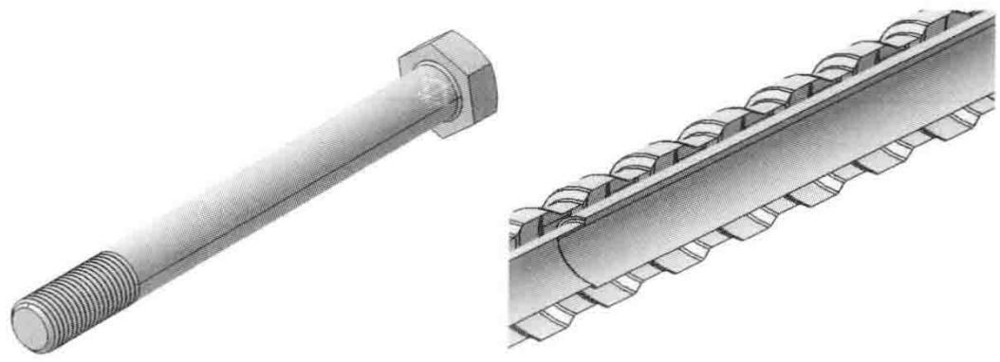

<details>
<summary>natural_image</summary>

Technical illustration of a bolt and its threaded fastener assembly (no text or symbols)
</details>

图 15-19 叶根预埋螺栓 3D 几何模型

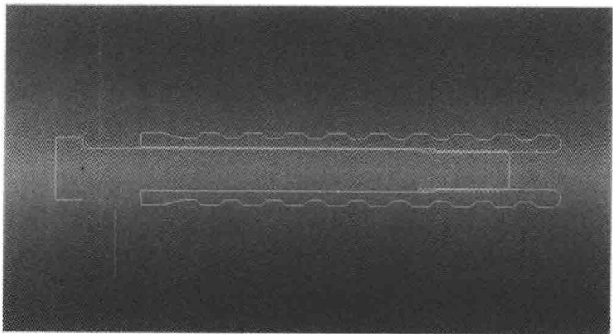

<details>
<summary>natural_image</summary>

Pure technical line drawing of a mechanical component without any text, numbers, or symbols
</details>

图 15-20 叶根预埋螺栓 2D 剖面几何模型

对称模型的几何模型如图 15-21 所示。

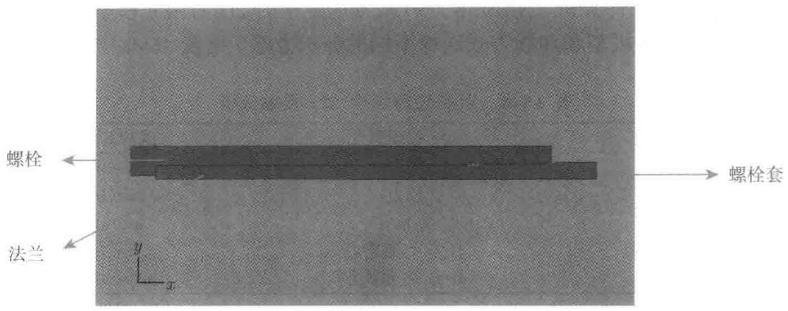

<details>
<summary>text_image</summary>

螺栓
法兰
y
x
螺栓套
</details>

图 15-21 叶根预埋螺栓 2D 剖面构件示意

# 3. 载荷条件

建立了 5 种载荷工况，分别根据各种载荷工况进行有限元分析，列于表 15-5。

表 15-5 载荷工况

<table><tr><td>载荷工况</td><td>工况说明</td><td>分析形式</td></tr><tr><td>Case_01</td><td>拉力</td><td>SOL600 隐式非线性分析</td></tr><tr><td>Case_02</td><td>压力</td><td>SOL600 隐式非线性分析</td></tr><tr><td>Case_03</td><td>预紧力</td><td>SOL600 隐式非线性分析</td></tr><tr><td>Case_04</td><td>拉力 + 预紧力</td><td>SOL600 隐式非线性分析</td></tr><tr><td>Case_05</td><td>压力 + 预紧力</td><td>SOL600 隐式非线性分析</td></tr></table>

# 4. 各部件网格模型

由于接触计算需要反复迭代, 计算时间长, 接触区域需要细化网格, 螺栓部件为近似轴对称结构, 且侧重于机理分析, 不涉及具体工况计算, 因此采用叶根预埋螺栓的 2D 模型进行建模。应用有限元软件 MSC. Patran 创建模型, 对接触部位局部细化网格。采用接触非线性的方法进行叶根预埋螺栓接触面的有限元分析。

根据叶根预埋螺栓的 2D 剖面几何模型，划分有限元单元。模型分为螺栓、螺栓套、法兰三个组，针对接触区域进行了网格细化。避免由于网格质量引起应力集中，采用一分二的拓扑结构细化网格，如图 15-22 所示，单元采用 2D solid 体单元，以便合理简化结构，同时提高计算速度。非传力部位，网格数目较少。

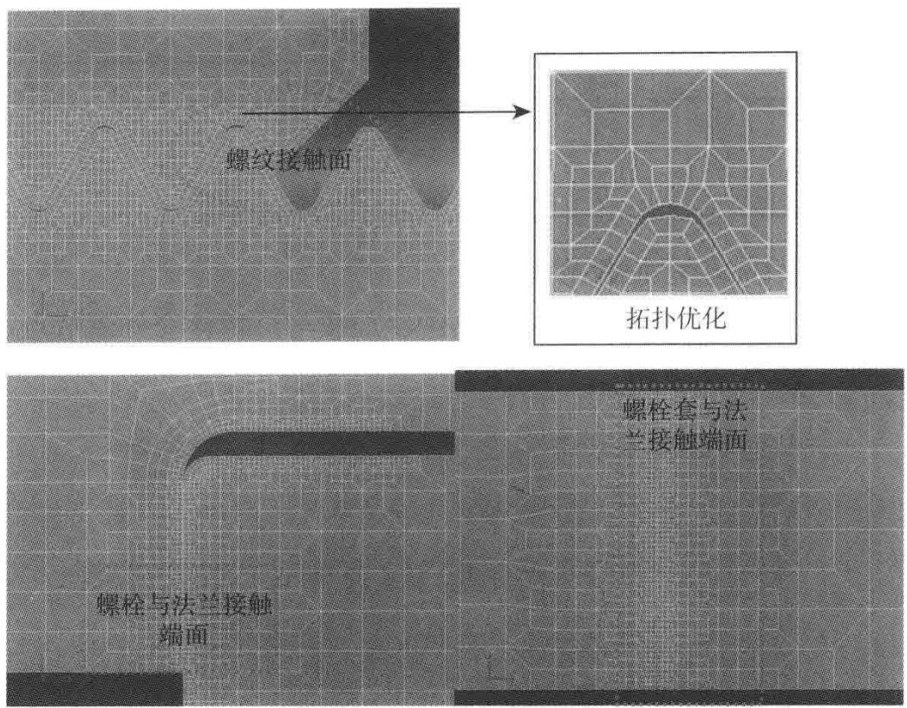

<details>
<summary>text_image</summary>

螺纹接触面
拓扑优化
螺栓套与法兰接触端面
螺栓与法兰接触端面
</details>

图 15-22 局部细化网格模型

# 5. 位移边界条件

根据对称条件，叶根预埋螺栓模型设置了两个方向的边界条件，其中 X 方向约束于法兰，Y 方向为对称边界条件约束各部件，如图 15-23 所示。

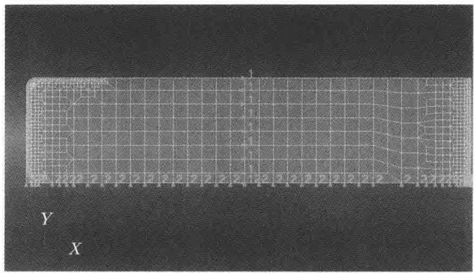

<details>
<summary>text_image</summary>

Y
X
</details>

图 15-23 法兰位移边界条件

# 6. 接触边界条件

根据螺栓连接实际情况，分别针对螺栓与螺栓套螺纹连接段、螺栓与法兰连接端面、螺栓套与法兰连接端面设置接触分析，确定接触边界条件为 Touch 还是 Glue，列于表 15-6 中。

表 15-6 接触边界条件

<table><tr><td>部件</td><td>螺栓</td><td>螺栓套</td><td>法兰</td></tr><tr><td>螺栓</td><td></td><td>T</td><td>T</td></tr><tr><td>螺栓套</td><td>T</td><td></td><td>T</td></tr><tr><td>法兰</td><td>T</td><td>T</td><td></td></tr></table>

1) Case\_01 与 Case\_02 加载形式

拉伸外力与压缩外力的加载形式为 MPC 加载与沿螺栓套外侧节点，如图 15-24 所示，加载方向为 X 方向。

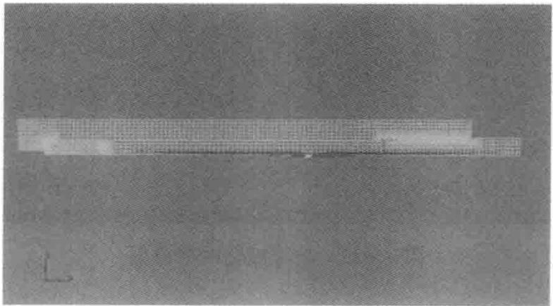

<details>
<summary>text_image</summary>

Scanned document with dense text and a horizontal bar, likely a form or table header
</details>

图 15-24 外力 MPC 加载示意图

2) Case\_03 加载形式

预紧力的加载形式的加载方向为螺栓轴向，如图 15-25 所示，即 X 方向。

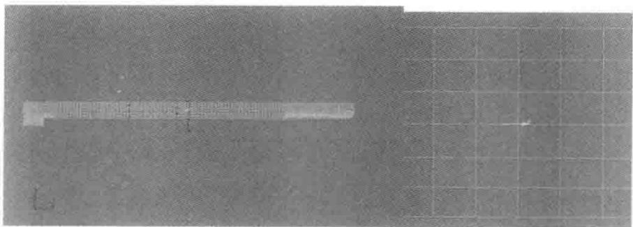

<details>
<summary>text_image</summary>

Scanned document with faint Chinese text and grid pattern, likely a form or table header
</details>

图 15-25 螺栓预紧力加载示意图

3) Case\_04、Case\_05 加载形式

Case\_04 与 Case\_05 为外力和预紧力的组合工况，载荷作用形式为 MPC 外力和预紧力共同作用。

# 7. 有限元分析

以 Case\_03 加载预紧力情形工况为例，各接触面均受载。预紧力分别从螺栓头传至法兰，同时从螺纹经螺栓套传至法兰，螺栓头与螺杆过渡处应力集中明显，如

图 15-26 所示。

1) 应力分析

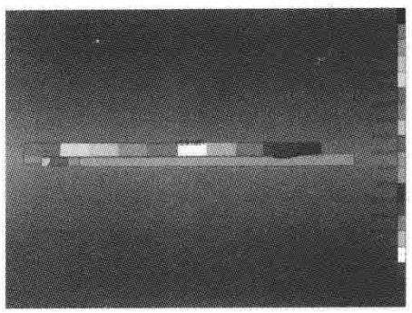

<details>
<summary>natural_image</summary>

Aerial view of a rectangular object with a dark horizontal bar extending into it, against a textured gray background (no visible text or symbols)
</details>

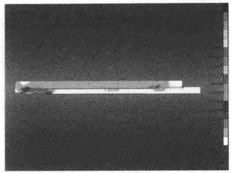

<details>
<summary>natural_image</summary>

Close-up of a thin white rectangular object on a textured gray surface, no visible text or symbols.
</details>

图 15-26 Case\_03 轴向位移云图和应力云图

靠近螺杆方向的前 5 个螺纹承载远大于其余螺纹，如图 15-27 所示。螺栓与法兰接触面的应力集中较明显，如图 15-28 所示。

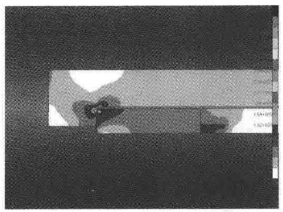

<details>
<summary>natural_image</summary>

Black-and-white photo of a person holding a flower with visible petals and leaves, against a dark background (no text or symbols)
</details>

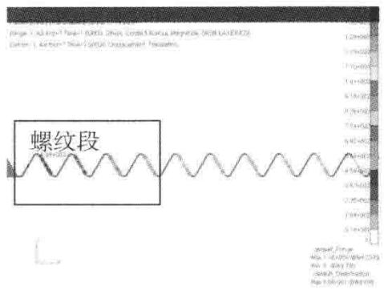

<details>
<summary>text_image</summary>

螺纹段
1.2mV/0.0000
1.2mV/0.0000
1.2mV/0.0000
1.2mV/0.0000
1.2mV/0.0000
1.2mV/0.0000
1.2mV/0.0000
1.2mV/0.0000
1.2mV/0.
1.2mV/0.
1.2mV/0.
1.2mV/0.
1.2mV/0.
1.2mV/0.
1.2mV/0.
1.2mV/0.
1.2mV/0.
1.2mV/0.
1.2mV/0.
1.2mV/0.
1.2mV/0.
1.2nV/0.0000
1.2nV/0.0000
1.2nV/0.0000
1.2nV/0.0000
1.2nV/0.0000
1.2nV/0.0000
1.2nV/0.
1.2nV/0.
1.2nV/0.
1.2nV/0.
1.2nV/0.
1.2nV/0.
1.2nV/0.
1.2nV/0.
1.2nV/0.
1.2nV/0.
1.2nV/0.
1.2nV/0.
1.2nV/0.
1.2N/A
1.2N/A
1.2N/A
1.2N/A
1.2N/A
1.2N/A
1.2N/A
1.2N/A
1.2N/A
1.2N/A
1.2N/A
1.2N/A
1.2N/A
1.2N/A
1.2N/A
1.2N/A
1.2N/A
1.2nA
1.2nA
1.2nA
1.2nA
1.2nA
1.2nA
1.2nA
1.2nA
1.2nA
1.2nA
1.2nA
1.2nA
1.2nA
1.2nA
1.2nA
1.2nA
1.2nA
1.5nA
1.5nA
1.5nA
1.5nA
1.5nA
1.5nA
1.5nA
1.5nA
1.5nA
1.5nA
1.5nA
1.5nA
1.5nA
1.5nA
1.5nA
1.5nA
1.5nA
3 3 3 3 3 3 3 3 3 3 3 3 3 3 3 3 3 3 3 3 3 3 3 3 3 3 3 3 3 3 3 3 3 3 3 3 3 3 3 3 3 3 3 3 3 3 3 3 3 3 3
</details>

图 15-27 Case\_03 局部应力云图

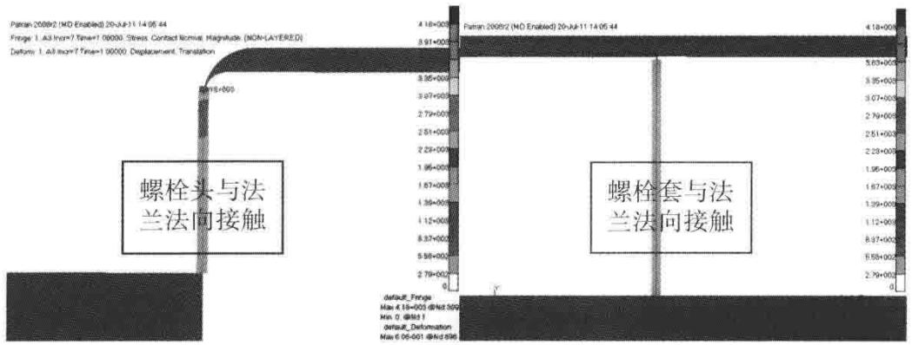

<details>
<summary>text_image</summary>

Patran 2009/2 (MD Enabled) 20-Jun-11 14:05:44
Fringe 1. All In=7 Timer=1 08000 Stress Contact Normat Highstroke (NON-LAT/ER2D)
Deflation 1. All In=7 Timer=1 08000 Displacement Translation
螺栓头与法兰法向接触
螺栓套与法兰法向接触
default_Fringe
Max 4.16+000 dB/d 300
Min 0 dB/d
default_Defamination
Max 6.06+001 dB/d 896
</details>

图 15-28 接触面应力

2) 法兰接触面应力分析

法兰分别与螺栓头及螺栓套端面相接触, 提取了法兰端面接触单元的应力, 进行分析, 如图 15-29 所示。

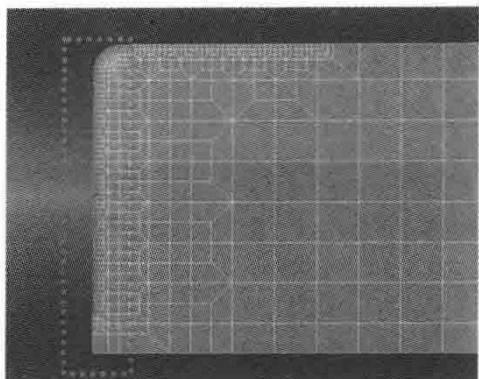

<details>
<summary>text_image</summary>

Scanned document page with grid pattern and Chinese text, likely a technical or legal document
</details>

(a) 螺栓-法兰接触端面

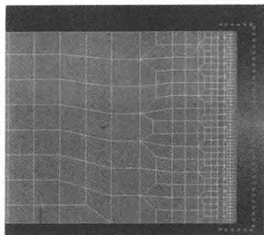

<details>
<summary>natural_image</summary>

Grayscale aerial or satellite view of a grid-patterned urban area with no visible text or symbols
</details>

(b) 螺栓套-法兰接触端面  
图 15-29 法兰端面接触区域

图 15-30 显示了预紧力作用下的后三个工况下，法兰与螺栓接触端面单元 Cauchy 应力分布曲线，横坐标与单元的对应关系为从上至下，可见由于外力由螺栓套从法兰与螺栓套接触端面传走，转角处存在较大应力集中。将金属材料设置为弹塑性材料重新计算，得到新的应力分布，如图 15-31 所示，接触面 Cauchy 应力水平明显下降，接触面法向应力分布也有明显不同。

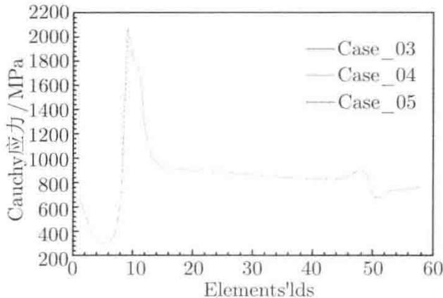

<details>
<summary>line</summary>

| Elements'Ids | Case_03 | Case_04 | Case_05 |
| ------------ | ------- | ------- | ------- |
| 0            | 200     | 200     | 200     |
| 10           | 2000    | 2000    | 2000    |
| 20           | 900     | 900     | 900     |
| 30           | 900     | 900     | 900     |
| 40           | 900     | 900     | 900     |
| 50           | 700     | 700     | 700     |
| 60           | 800     | 800     | 800     |
</details>

(a) 螺栓-法兰接触端面单元的Cauchy应力分布

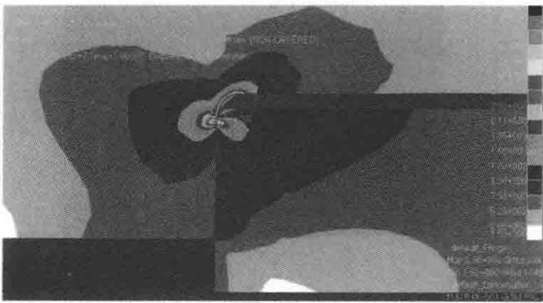

<details>
<summary>text_image</summary>

Scanned document page with fragmented text and a central abstract graphic, likely from a technical or legal report.
</details>

(b) 螺栓-法兰接触端面的应力云图(弹性)

图 15-30 螺栓-法兰接触端面单元 Cauchy 应力云图 (弹性)  
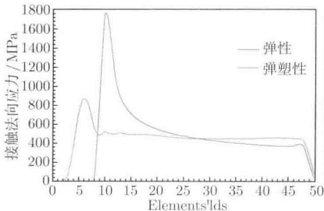

<details>
<summary>line</summary>

| Elements'lds | 弹性 (MPa) | 弹塑性 (MPa) |
| ------------ | ---------- | ------------ |
| 5            | 800        | 400          |
| 10           | 1800       | 500          |
| 50           | 0          | 0            |
</details>

(a) 螺栓-法兰接触端面的弹性-弹塑性
Cauchy应力对比

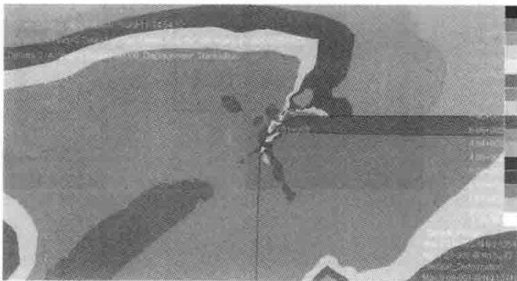

<details>
<summary>text_image</summary>

Scanned document with Chinese text and a grayscale photo of a person climbing a rope, likely a report or instruction.
</details>

(b) 螺栓-法兰接触端面的应力云图  
(弹塑性)  
图 15-31 螺栓-法兰接触端面单元 Cauchy 应力云图 (弹塑性)

图 15-32 和图 15-33 分别显示了后三个工况下，法兰与螺栓套接触端面单元 Cauchy 应力与接触法向应力分布曲线。可见接触面区域 Cauchy 应力与法向应力分布趋势由内向外增大。由于外力由螺栓套从法兰与螺栓套接触端面传走，因此拉力对螺栓套起卸载作用，压力起加载作用，三个工况下的应力曲线验证了这一分析。

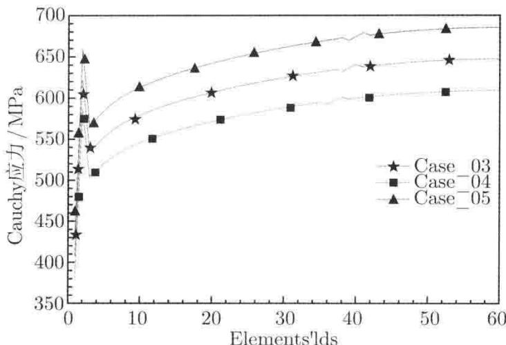

<details>
<summary>line</summary>

| Elements'lds | Case_03 | Case_04 | Case_05 |
| ------------- | ------- | ------- | ------- |
| 0             | 430     | 470     | 460     |
| 5             | 510     | 510     | 570     |
| 10            | 570     | 550     | 610     |
| 20            | 600     | 570     | 630     |
| 30            | 620     | 580     | 650     |
| 40            | 630     | 590     | 670     |
| 50            | 640     | 600     | 680     |
| 60            | 650     | 610     | 690     |
</details>

图 15-32 法兰与螺栓套接触端面单元 Cauchy 应力分布和云图

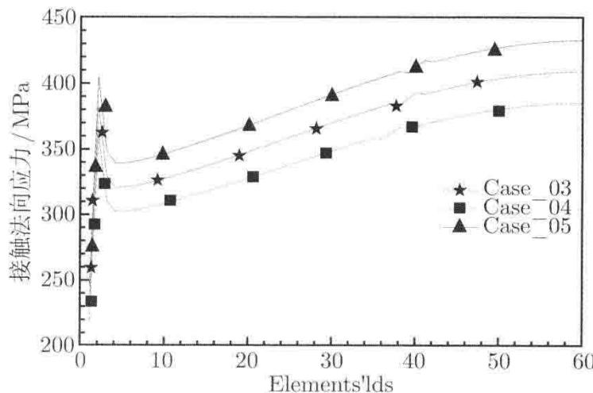

<details>
<summary>line</summary>

| Elements'Ids | Case_03 | Case_04 | Case_05 |
| ------------ | ------- | ------- | ------- |
| 0            | 260     | 230     | 280     |
| 5            | 360     | 320     | 380     |
| 10           | 330     | 310     | 350     |
| 20           | 350     | 330     | 370     |
| 30           | 370     | 350     | 390     |
| 40           | 380     | 370     | 410     |
| 50           | 400     | 380     | 430     |
</details>

图 15-33 法兰与螺栓套接触端面单元和接触法向应力分布

# 3) 螺纹段应力分析

螺纹连接段是本节重点关注的对象，提取了三组单元的应力数值，如图 15-34 所示。可见三组单元的应力分布趋势较为一致，靠近螺纹面的单元应力分布受螺纹影响较大，呈现明显波动，而另两组单元应力分布较平滑。三组曲线应力分布由左至右逐渐减小，体现出传力路径最短的特点。值得一提的是，螺栓应力高于螺栓套应力。

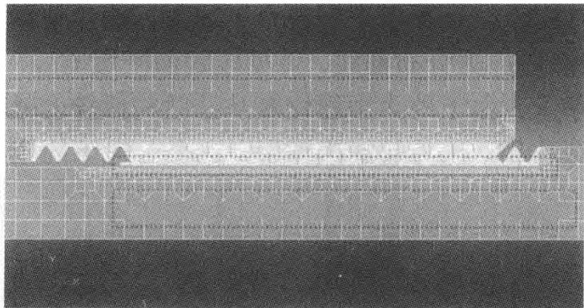

<details>
<summary>text_image</summary>

Scanned document with dense text and a grid overlay, likely a technical or legal report
</details>

图 15-34 螺纹段选取单元

图 15-35 和图 15-36 显示了前五个螺纹面法向应力分布，可见第一个螺纹应力  
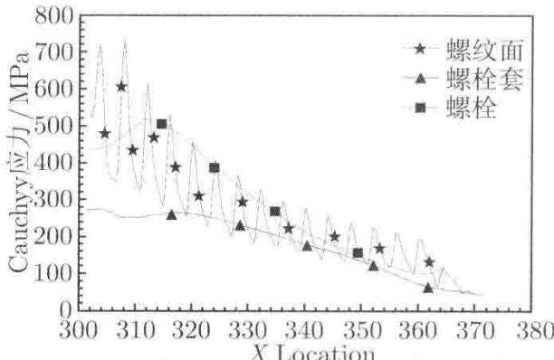

<details>
<summary>line</summary>

| X Location | 螺纹面 (MPa) | 螺栓套 (MPa) | 螺栓 (MPa) |
| ---------- | ------------ | ------------ | ---------- |
| 300        | 450          | -            | -          |
| 310        | 600          | -            | -          |
| 320        | 450          | 250          | 500        |
| 330        | 300          | 200          | 350        |
| 340        | 250          | 150          | 250        |
| 350        | 200          | 100          | 150        |
| 360        | 150          | 50           | -          |
| 370        | -            | -            | -          |
| 380        | -            | -            | -          |
</details>

(a) 螺纹面、螺栓套和螺栓沿螺纹段轴向的Cauchy应力分布

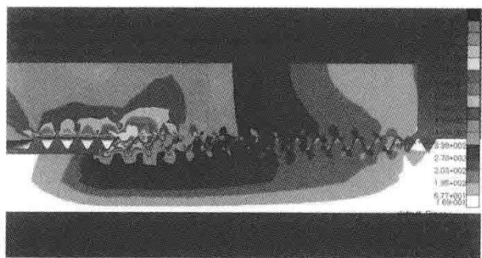

<details>
<summary>text_image</summary>

3.39+002
2.70+003
2.03+002
1.85+002
6.77+001
1.69+001
</details>

(b) 螺纹段应力云图

图 15-35 螺纹段沿轴向 Cauchy 应力分布  
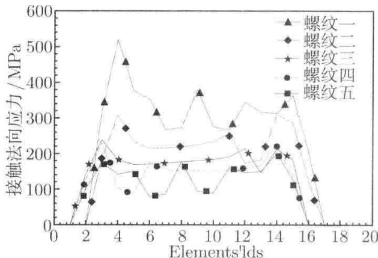

<details>
<summary>line</summary>

| Elements'Ids | 螺纹一 | 螺纹二 | 螺纹三 | 螺纹四 | 螺纹五 |
| ------------ | ----- | ----- | ----- | ------ | ------ |
| 2            | 180   | 60    | 170   | 120    | 80     |
| 4            | 450   | 280   | 190   | 180    | 150    |
| 6            | 320   | 220   | 180   | 160    | 140    |
| 8            | 380   | 250   | 190   | 170    | 160    |
| 10           | 290   | 260   | 200   | 180    | 170    |
| 12           | 340   | 270   | 210   | 190    | 180    |
| 14           | 350   | 280   | 220   | 200    | 190    |
| 16           | 140   | 70    | 150   | 80     | 120    |
| 18           | 0     | 0     | 0     | 0      | 0      |
| 20           | 0     | 0     | 0     | 0      | 0      |
</details>

(a) 前五个螺纹的法向应力分布

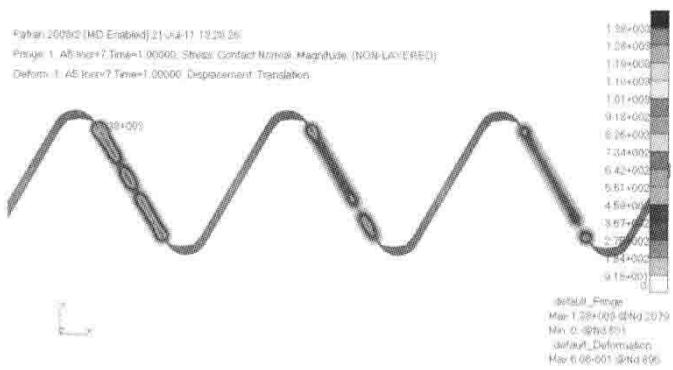

<details>
<summary>line</summary>

| Metric | Value |
|--------|-------|
| Pange 1 | A8 Rate=7 Time=1.00000 |
| Deform 1 | A8 Rate=7 Time=1.00000 |
| default_Pange | 1.28+0.00 |
| Min. 0 | @N=3.81 |
| default_Deformation | 6.06-0.01 @N=4.86 |
</details>

(b) 螺纹段的法向应力云图  
图 15-36 螺纹面接触法向应力分布

值最大，其余依次递减，至第五个螺纹已下降约 50%，因此应力分析时应重点关注前 4\~5 个螺纹的应力水平。

针对叶根预埋螺栓的受力问题, 参考实际结构, 进行合理的简化, 通过建立二维有限元模型, 对叶根预埋螺栓在轴向拉力与压力、螺栓预紧力以及组合力作用下的螺纹连接及端面的受力情况进行了接触分析。计算结果模拟了实际各部件间的接触关系和传力情况，得到了预紧力及外力作用下的传力路径及应力分布情况的直观结果，说明了应力分析中需要重点关注的部位，为实际叶根预埋螺栓线性有限元模型建模的合理简化与分析提供了依据与参考。

# 15.2 后打孔叶根工艺的结构校核

本节给出后打孔叶根工艺的结构分析流程。若叶根后打孔螺栓增多，将复合层的分析作为重点。但是由于螺栓增多，螺栓间的间距减小，需确保增多螺栓个数后的叶根仍能满足施加预紧扭矩时的扳手空间，保证高强叶根螺栓的预紧力。后打孔叶根螺栓结构分析流程如图 15-37 所示。

# 1. 叶根打孔

叶根打孔时根据叶根零刻度线和打孔设备，按照正确的打孔顺序和打孔操作流程进行叶根打孔。叶根打孔过程中应进行结构分析：

(1) 打孔时的冲击 + 振动 + 高频摩擦作用下, 叶根复合材料积层的结构特性, 计算复合层的塑性应变是否超出材料许用值;  
(2) 打孔后, 叶根复合层冲击后存在分层或泛白, 表明打孔后已削弱叶根复合层的力学特性。因此需考虑打孔后叶根复合层的结构模型安全系数。

# 2. 安装

叶根螺栓、螺母与叶根复合层贴合，在安装叶根螺栓与螺母的时候不需要进行叶片结构分析，而叶片与变桨轴承连接，再通过变桨轴承连接于轮毂。由于大型风力机叶片叶根大多安装高强螺栓，叶片安装时应着重考虑对叶根螺栓施加预紧力，预紧力确保叶根复合层不失效，保证叶根螺栓只受拉伸作用，不受压并且不受剪。

# 15.2.1 结构分析流程

图 15-37 为叶根螺栓结构分析流程图。

# 15.2.2 整体有限元分析

后打孔叶根工艺形式，叶根校核的内容见表 15-7。

表 15-7 叶根校核内容

<table><tr><td>叶根静强度</td><td>叶根疲劳强度</td></tr><tr><td>螺栓缩颈处静强度</td><td>圆柱螺母间的层合板疲劳</td></tr><tr><td>圆柱螺母下的层合板挤压静强度</td><td>螺栓螺纹疲劳</td></tr><tr><td>圆柱螺母之间的层合板抗弯静强度</td><td>圆柱螺母疲劳</td></tr><tr><td>圆柱螺母抗弯静强度</td><td></td></tr></table>

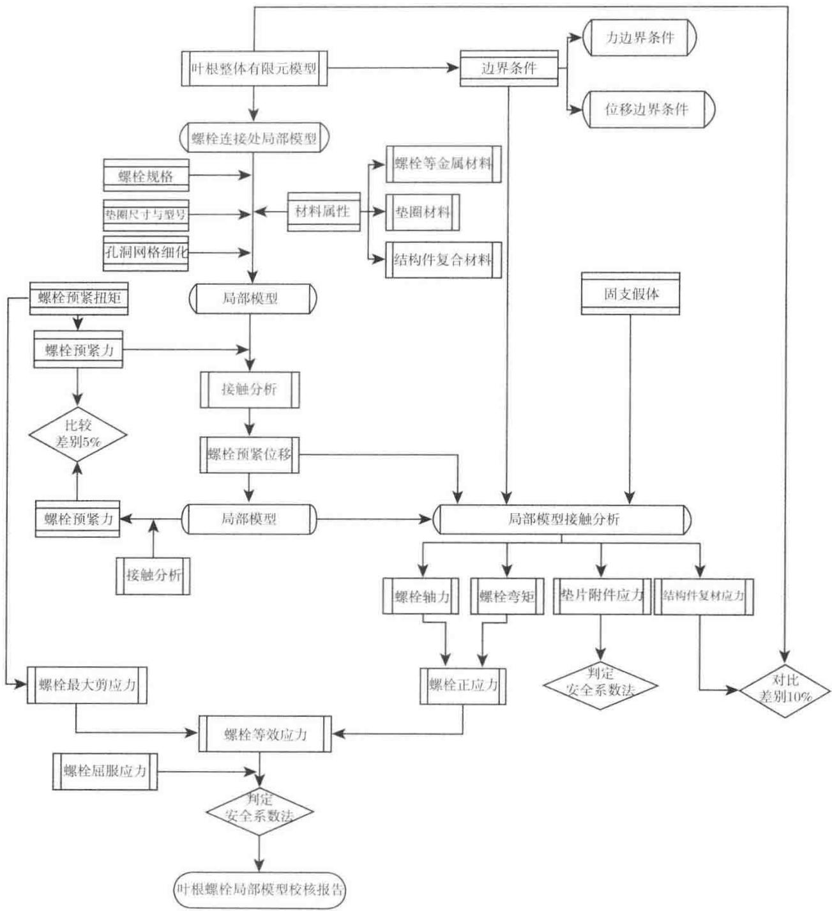

<details>
<summary>flowchart</summary>

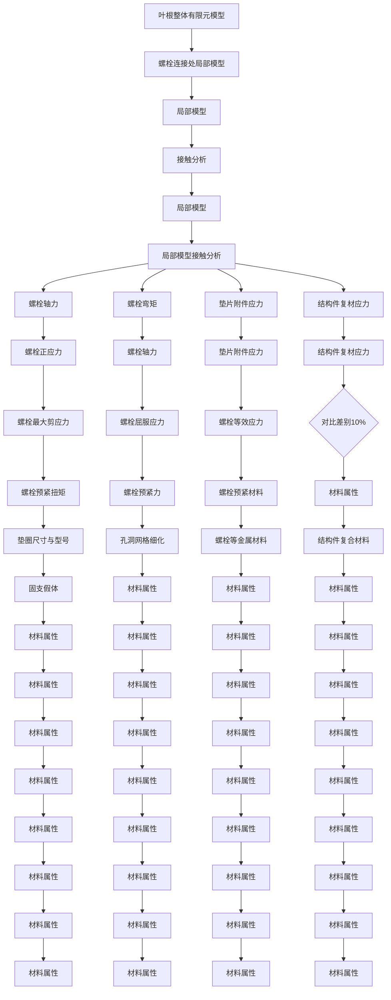
```mermaid
graph TD
    A["叶根整体有限元模型"] --> B["螺栓连接处局部模型"]
    B --> C["局部模型"]
    C --> D["接触分析"]
    D --> E["局部模型"]
    E --> F["局部模型接触分析"]
    F --> G["螺栓轴力"]
    F --> H["螺栓弯矩"]
    F --> I["垫片附件应力"]
    F --> J["结构件复材应力"]
    G --> K["螺栓正应力"]
    H --> L["螺栓轴力"]
    I --> M["垫片附件应力"]
    J --> N["结构件复材应力"]
    K --> O["螺栓最大剪应力"]
    L --> P["螺栓屈服应力"]
    M --> Q["螺栓等效应力"]
    N --> R{对比差别10%}
    O --> S["螺栓预紧扭矩"]
    P --> T["螺栓预紧力"]
    Q --> U["螺栓预紧材料"]
    R --> V["材料属性"]
    S --> W["垫圈尺寸与型号"]
    T --> X["孔洞网格细化"]
    U --> Y["螺栓等金属材料"]
    V --> Z["结构件复合材料"]
    W --> AA["固支假体"]
    X --> AB["材料属性"]
    Y --> AC["材料属性"]
    Z --> AD["材料属性"]
    AA --> AE["材料属性"]
    AB --> AF["材料属性"]
    AC --> AG["材料属性"]
    AD --> AH["材料属性"]
    AE --> AI["材料属性"]
    AF --> AJ["材料属性"]
    AG --> AK["材料属性"]
    AH --> AL["材料属性"]
    AI --> AM["材料属性"]
    AJ --> AN["材料属性"]
    AK --> AO["材料属性"]
    AL --> AP["材料属性"]
    AM --> AQ["材料属性"]
    AN --> AR["材料属性"]
    AO --> AS["材料属性"]
    AP --> AT["材料属性"]
    AQ --> AU["材料属性"]
    AR --> AV["材料属性"]
    AS --> AW["材料属性"]
    AT --> AX["材料属性"]
    AU --> AY["材料属性"]
    AV --> AZ["材料属性"]
    AW --> BA["材料属性"]
    AX --> BB["材料属性"]
    AY --> BC["材料属性"]
    AZ --> BD["材料属性"]
    BA --> BE["材料属性"]
    BB --> BF["材料属性"]
    BC --> BG["材料属性"]
    BD --> BH["材料属性"]
    BE --> BI["材料属性"]
    BF --> BJ["材料属性"]
```
</details>

图 15-37 叶根螺栓结构分析流程

# 1. 有限元模型

有限元模型网格如图 15-38 所示。

模型简化依据：

(1) 叶根有限元模型考虑叶根、叶根法兰、变桨轴承和轮毂。模型主要分析螺栓受力，故忽略叶根螺母开孔、其他螺栓孔、小孔、小倒角；  
(2) 考虑轮毂假体，与变桨轴承外圈共节点连接，以施加位移边界；  
(3) 轮毂假体、变桨轴承和叶片采用体单元模拟；

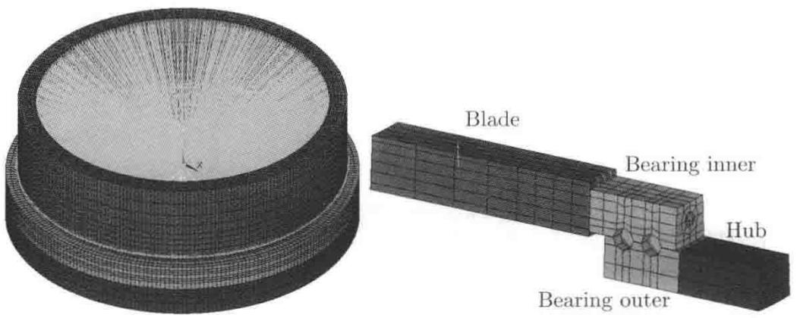

<details>
<summary>text_image</summary>

Blade
Bearing inner
Hub
Bearing outer
</details>

图 15-38 叶根有限元模型

(4) 叶片变桨轴承类型为双排四点球接触轴承，内外轴承间的滚珠采用交叉的杆单元模拟；

(5) 叶根法兰几何并入变桨轴承内圈，叶片不考虑圆柱螺母开孔；

(6) 螺栓采用梁单元建模，与变桨轴承对应垫片区域节点 MPC-RBE2 连接，与叶片对应螺纹区域节点 MPC-RBE2 连接。

# 2. 螺栓校核

通过有限元计算可得到各个螺栓在外载及预紧力载荷下轴向应力云图，如图15-39所示，其中轴向应力最大的螺栓云图如图15-40所示。

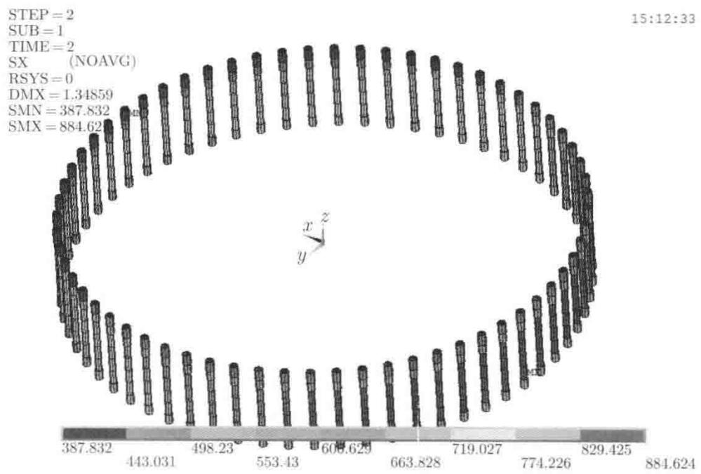

<details>
<summary>polar_bar</summary>

| Parameter | Value     |
| --------- | --------- |
| STEP      | 2         |
| SUB       | 1         |
| TIME      | 2         |
| SX        | (NOAVG)   |
| RSYS      | 0         |
| DMX       | 1.34859   |
| SMN       | 387.832   |
| SMX       | 884.62    |
</details>

图 15-39 螺栓轴向应力云图

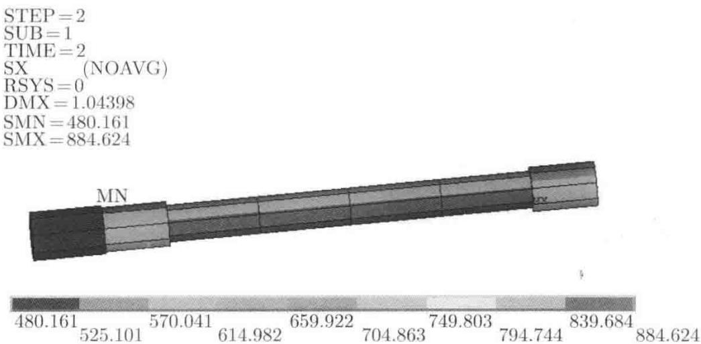

<details>
<summary>heatmap</summary>

| Parameter | Value    |
| --------- | -------- |
| STEP      | 2        |
| SUB       | 1        |
| TIME      | 2        |
| SX (NOAVG)| 0        |
| RSYS      | 0        |
| DMX       | 1.04398  |
| SMN       | 480.161  |
| SMX       | 884.624  |
</details>

图 15-40 静强度最危险螺栓的轴向正应力云图

同时，通过 VDI 2230 及 GL 2010 可计算圆柱螺母、叶根复合层的抗弯和抗挤压受力分析，由于篇幅原因，这里不作为重点阐述该计算过程，详细可查阅相关参考文献。

# 15.2.3 螺栓工程方法

一般情况下，高强螺栓的预紧力都是通过液压扳手施加拧紧力矩提供的。按照预紧螺栓的规格与强度等级，由 VDI 2230 中相关计算方法得到拧紧力，计算公式为 $^{[36]}$

$$
F _ {x} = K _ {x} (U _ {1} - U _ {3}), \quad F _ {y} = K _ {y} (U _ {2} - U _ {4}) \tag {15-1}
$$

其中， $D_{km}=\frac{d_{m}+D_{ki}}{2};D_{ki}=\max(D_{a},d_{ha},d_{h},d_{a})$ 。

螺栓采用梁单元或体单元，根据螺栓连接的有限元局部模型确定各工况下螺栓的轴向力和弯矩，计算得到螺栓正应力：

$$
\sigma_ {M} = \frac {F _ {M}}{A _ {0}} + \frac {M _ {X Y}}{W} \tag {15-2}
$$

其中， $A_{0}$ 为螺栓的公称应力截面积；W 为抗弯截面系数。

由 VDI 2230 确定螺栓扭矩产生的螺栓最大剪应力为

$$
\tau_ {M} = \frac {M _ {G}}{W _ {t}} \tag {15-3}
$$

其中， $W_{t}$ 为抗扭截面系数。

由 VDI 2230，同时考虑正应力与剪应力校核螺栓强度，确定等效应力

$$
\sigma = \sqrt {\sigma_ {M} ^ {2} + 3 \times (\kappa_ {\tau} \times \tau_ {M}) ^ {2}} \tag {15-4}
$$

其中， $\kappa_{\tau}$ 按照 VDI 2230 取为 0.5。

将螺栓的等效应力与螺栓的屈服强度比较，同时考虑材料安全系数影响，确定螺栓强度是否满足要求。

# 第五篇

# 叶片结构设计专题

# 第16章 疲劳分析

强度、刚度和疲劳寿命是对工程结构和机械使用的三个基本要求。疲劳破坏是工程结构和机械失效的主要原因之一，引起疲劳失效的循环载荷的峰值往往远小于根据静态断裂分析估算出来的“安全”载荷，因此开展结构疲劳研究有着重要意义。设计上，叶片运行周期为20年，只验证叶片静强度等特性是不能保证风力机20年运行可靠性的，因此需要对风力机叶片进行疲劳校核，验证叶片在运行20年的过程中是否满足疲劳特性的要求。证明风力机使用寿命期内不会发生由疲劳引起的破坏，应通过评估强度特性、细节设计和工艺流程。

# 16.1 理论基础

疲劳用于表达材料在循环载荷作用下的损伤和破坏。另外，在周期性应力或应变的反复作用下所发生的性能变化也叫做疲劳。在一般情况下，疲劳可表征开裂或破坏的性能变化 $^{[37]}$ 。影响结构静强度的因素同样影响其疲劳强度或疲劳寿命，只是影响的程度有所差别。此外，还有很多对静强度几乎没有影响的因素却对疲劳强度、疲劳寿命有着明显的影响。对此，影响疲劳寿命的因素很多，归纳起来有以下方面，见表 16-1。

表 16-1 影响疲劳强度的因素

<table><tr><td>工作条件</td><td>零件状态</td><td>材料本质</td></tr><tr><td>载荷特性</td><td>缺口效应</td><td>化学成分</td></tr><tr><td>加载频率</td><td>尺寸效应</td><td>纤维方向</td></tr><tr><td>服役温度</td><td>零件热处理</td><td>内部缺陷分布</td></tr><tr><td>环境介质</td><td>表面粗糙度</td><td>金相组织</td></tr><tr><td></td><td>表面热处理</td><td></td></tr><tr><td></td><td>残余应力应变</td><td></td></tr></table>

按照疲劳机理可以将影响疲劳强度或疲劳寿命的因素分成三类：

(1) 影响局部应力应变大小的因素, 如载荷特性 (应力状态、循环特性、高载效应、残余应力等);  
(2) 影响材料微观结构的因素, 如材料种类、热处理状态 (影响材料的延性、缺陷分布、缺陷的种类)、机械加工 (加锻使晶粒细化, 缺陷增多; 表面淬火使表面层强度增加, 延性下降) 等;

(3) 影响疲劳损伤源的因素，如表面粗糙度、化学物理腐蚀和应力腐蚀等。

# 16.1.1 循环载荷

循环载荷用于确定最大应力、最小应力和应力幅值与应力均值，如图16-1所示。图中， $\sigma_{\mathrm{max}}$ 为最大应力； $\sigma_{\mathrm{min}}$ 为最小应力； $\sigma_0$ 为应力幅值， $\sigma_0 = (\sigma_{\mathrm{max}} - \sigma_{\mathrm{min}}) / 2$ ； $\sigma_{\mathrm{m}}$ 为应力均值， $\sigma_{\mathrm{m}} = (\sigma_{\mathrm{max}} + \sigma_{\mathrm{min}}) / 2$ ；T为周期。

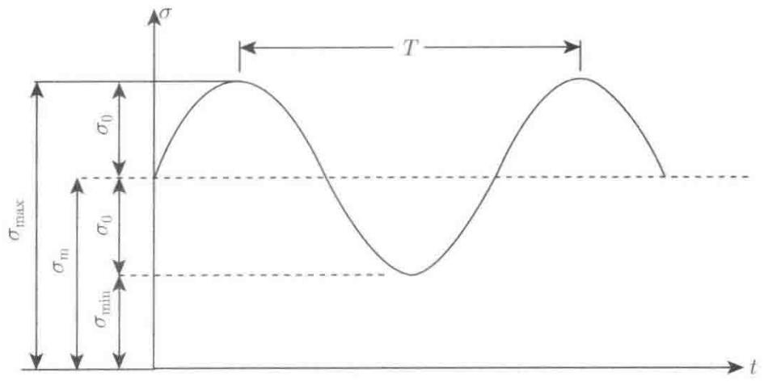

<details>
<summary>line</summary>

| t     | σ     |
|-------|-------|
| 0     | σ_max |
| T     | σ₀    |
| >T    | σ₀    |
| <T    | σ_min |
</details>

图 16-1 循环载荷

在非线性分析中，需考虑均值、幅值在外加载荷转变为载荷效应过程中的相关性。此时结构性能退化是非线性的。

# 16.1.2 疲劳寿命

疲劳寿命是指结构或机械直至破坏所作用的循环载荷的次数或时间。从疲劳损伤发展来看，有二阶段疲劳寿命模型、三阶段疲劳寿命和多阶段疲劳寿命模型。

二阶段疲劳寿命分为裂纹形成和裂纹扩展；三阶段模型认为疲劳损伤过程由无裂纹、小裂纹和大裂纹三个阶段组成；多阶段模型将小裂纹细分为三个阶段：微观小裂纹、物理小裂纹和结构小裂纹，如图 16-2 所示。

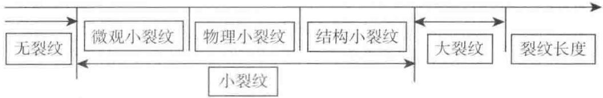

<details>
<summary>flowchart</summary>

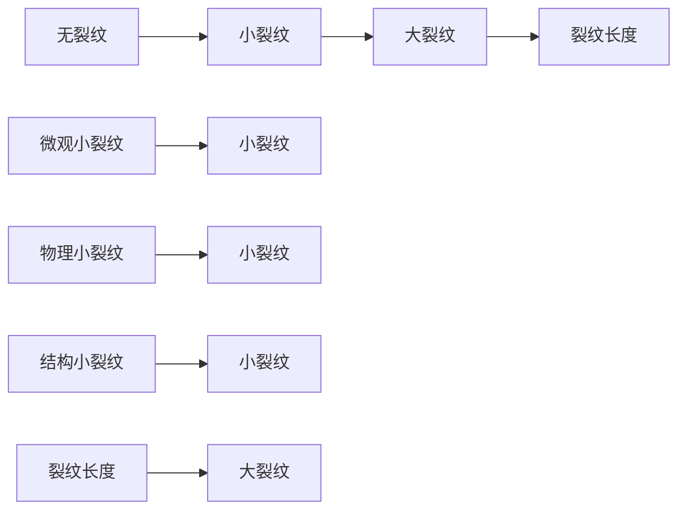
```mermaid
graph LR
    A["无裂纹"] --> B["小裂纹"]
    B --> C["大裂纹"]
    C --> D["裂纹长度"]
    E["微观小裂纹"] --> F["小裂纹"]
    G["物理小裂纹"] --> H["小裂纹"]
    I["结构小裂纹"] --> J["小裂纹"]
    K["裂纹长度"] --> L["大裂纹"]
```
</details>

图 16-2 多阶段模型疲劳寿命

从设计准则看，又有安全寿命、经济寿命、可靠性寿命、使用寿命、设计寿命、剩余寿命等。

# 16.1.3 应力比

应力比 $R = \sigma_{\mathrm{min}} / \sigma_{\mathrm{max}}$ ，试件循环加载时的试件最小应力与最大应力之比，表

16-2 中详细展开不同应力比的示意图。

表 16-2 应力比

<table><tr><td>序号</td><td>应力范围</td><td>应力比范围</td><td>备注</td></tr><tr><td>1</td><td>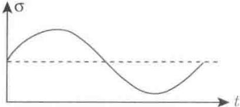</td><td>0 &lt; R &lt; 1</td><td rowspan="3">拉-拉</td></tr><tr><td>2</td><td>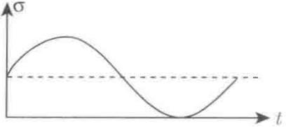</td><td>R = 0</td></tr><tr><td>3</td><td>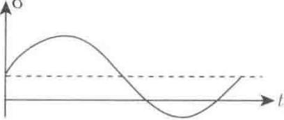</td><td>-1 &lt; R &lt; 0</td></tr><tr><td>4</td><td>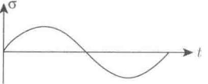</td><td>R = -1</td><td rowspan="3">拉-压</td></tr><tr><td>5</td><td>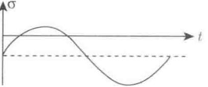</td><td>R &lt; -1</td></tr><tr><td>6</td><td>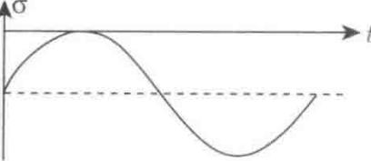</td><td>R ∈ -∞</td></tr><tr><td>7</td><td>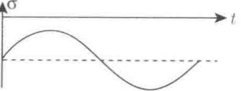</td><td>R &gt; 1</td><td>压-压</td></tr></table>

各应力比下的应力-周期汇总，如图 16-3 所示。

# 16.1.4 S-N 曲线

为了评估和估算疲劳寿命或疲劳强度，需要建立外载荷与寿命之间的关系，而反映外加应力幅值 $\sigma$ 和疲劳寿命 N 之间关系的曲线叫做 S-N 线，S-N 曲线示意图如图 16-4 所示。

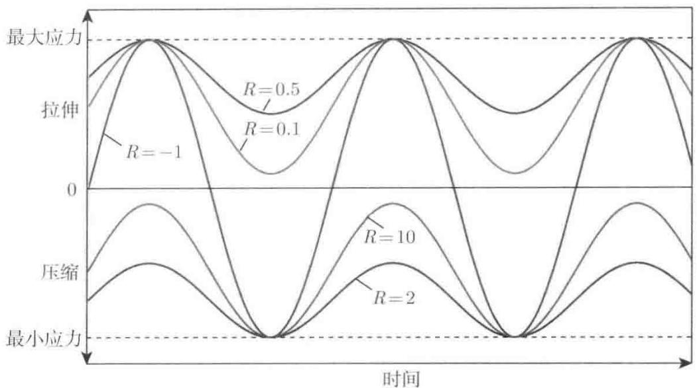  
图 16-3 应力比汇总

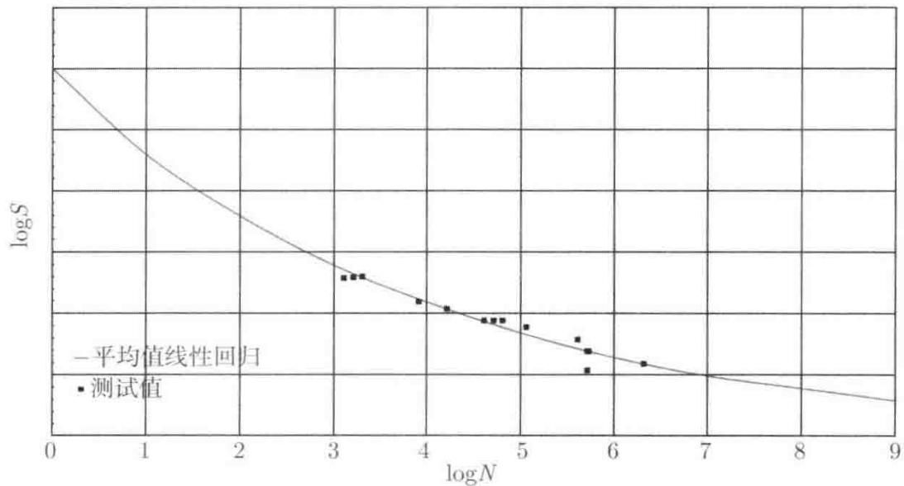

<details>
<summary>scatter</summary>

| logN | logS | Type        |
|------|------|-------------|
| 3.2  | 0.8  | 测试值     |
| 3.3  | 0.75 | 测试值     |
| 3.4  | 0.7  | 测试值     |
| 3.9  | 0.65 | 测试值     |
| 4.1  | 0.6  | 测试值     |
| 4.2  | 0.55 | 测试值     |
| 4.3  | 0.5  | 测试值     |
| 4.4  | 0.45 | 测试值     |
| 4.5  | 0.4  | 测试值     |
| 4.6  | 0.35 | 测试值     |
| 4.7  | 0.3  | 测试值     |
| 4.8  | 0.25 | 测试值     |
| 4.9  | 0.2  | 测试值     |
| 5.0  | 0.15 | 测试值     |
| 5.1  | 0.1  | 测试值     |
| 5.2  | 0.05 | 测试值     |
| 5.3  | 0.0  | 测试值     |
| 5.4  | -0.05| 测试值     |
| 5.5  | -0.1 | 测试值     |
| 5.6  | -0.15| 测试值     |
| 5.7  | -0.2 | 测试值     |
| 5.8  | -0.25| 测试值     |
| 5.9  | -0.3 | 测试值     |
| 6.0  | -0.35| 测试值     |
| 6.1  | -0.4 | 测试值     |
| 6.2  | -0.45| 测试值     |
| 6.3  | -0.5 | 测试值     |
| 6.4  | -0.55| 测试值     |
| 6.5  | -0.6 | 测试值     |
| 6.6  | -0.65| 测试值     |
| 6.7  | -0.7 | 测试值     |
| 6.8  | -0.75| 测试值     |
| 6.9  | -0.8 | 测试值     |
| 7.0  | -0.85| 测试值     |
| 7.1  | -0.9 | 测试值     |
| 7.2  | -0.95| 测试值     |
| 7.3  | -1.0 | 测试值     |
| 7.4  | -1.05| 测试值     |
| 7.5  | -1.1 | 测试值     |
| 7.6  | -1.15| 测试值     |
| 7.7  | -1.2 | 测试值     |
| 7.8  | -1.25| 测试值     |
| 7.9  | -1.3 | 测试值     |
| 8.0  | -1.35| 测试值     |
| 8.1  | -1.4 | 测试值     |
| 8.2  | -1.45| 测试值     |
| 8.3  | -1.5 | 测试值     |
| 8.4  | -1.55| 测试值     |
| 8.5  | -1.6 | 测试值     |
| 8.6  | -1.65| 测试值     |
| 8.7  | -1.7 | 测试值     |
| 8.8  | -1.75| 测试值     |
| 8.9  | -1.8 | 测试值     |
| 9.0  | -1.85| 测试值     |
</details>

图 16-4 S-N 曲线示意图

复合材料的疲劳 S-N 曲线, 可以用强度极限、疲劳极限与寿命来定义, 如图 16-5 所示。其中, $\sigma_{\mathrm{b}}$ 为强度极限, 即静拉伸对应的疲劳强度为 $\sigma_{\max} = \sigma_{\mathrm{b}}$ ; $\sigma_{-1}$ 为疲劳极限, $N = 10^{6} \sim 10^{7}$ 对应的疲劳强度为疲劳极限 $\sigma_{\max} = \sigma_{-1}$ 。

# 16.1.5 疲劳极限图

不同应力比时的疲劳极限是不同的。将不同应力比 R 时的疲劳极限画在 $\sigma_{a}$ 和 $\sigma_{m}$ 图上，即为疲劳极限图。实验测定不同应力比的疲劳极限是十分困难的，为此提出了一些经验模型来估算疲劳极限图。疲劳极限图的估算方法如图 16-6 所示。

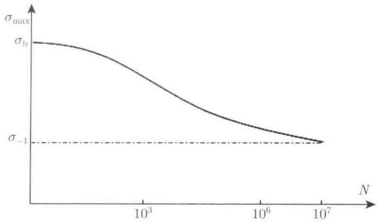

<details>
<summary>line</summary>

| N       | σ_max |
| ------- | ----- |
| 10^3    | σ_1   |
| 10^6    | σ_1   |
| 10^7    | σ_1   |
</details>

图16-5 复合材料的疲劳S-N曲线

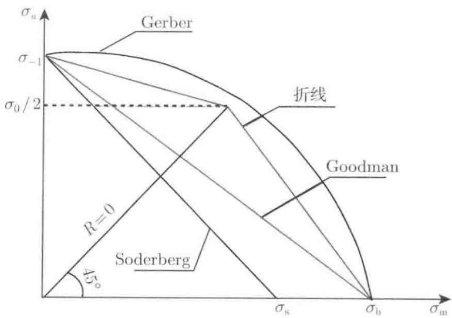

<details>
<summary>text_image</summary>

σₐ
Gerber
σ₋₁
σ₀/2
折线
Goodman
R=0
Soderberg
45°
σₛ
σᵦ
σᵢₙ
</details>

图16-6 疲劳极限图

Gerber 抛物线模型:

$$
\sigma_ {a} = \sigma_ {- 1} \left[ 1 - \left(\frac {\sigma_ {\mathrm{m}}}{\sigma_ {\mathrm{b}}}\right) ^ {2} \right] \tag {16-1}
$$

Goodman 直线模型:

$$
\sigma_ {a} = \sigma_ {- 1} \left[ 1 - \left(\frac {\sigma_ {\mathrm{m}}}{\sigma_ {\mathrm{b}}}\right) \right] \tag {16-2}
$$

Soderberg 直线模型:

$$
\sigma_ {a} = \sigma_ {- 1} \left[ 1 - \left(\frac {\sigma_ {\mathrm{m}}}{\sigma_ {\mathrm{s}}}\right) \right] \tag {16-3}
$$

其中，Soderberg 模型太保守，而 Gerber 模型可能偏于危险。为了提高精度，提出

了折线模型，设由实验得到的应力比 R=0 的疲劳极限为 $\sigma_{0}$ ，其折线方程为

$$
\sigma_ {a} = \left\{ \begin{array}{l l} \sigma_ {- 1} - \frac {2 \sigma_ {- 1} - \sigma_ {0}}{\sigma_ {0}} \sigma_ {\mathrm{m}}, & R \leqslant 0 \\ \sigma_ {0} \left(\frac {\sigma_ {\mathrm{m}} - \sigma_ {\mathrm{b}}}{\sigma_ {0} - 2 \sigma_ {\mathrm{b}}}\right), & R > 0 \end{array} \right. \tag {16-4}
$$

应力比 R 作为考虑平均应力影响的一个参数应用于等寿命曲线族，等寿命曲线族反映了在全部应力变化范围内的寿命特性，如图 16-7 所示。为简化计算，采用直线形等寿命曲线族，在考虑复合材料拉伸强度和压缩强度不相等的一般情况 $^{[38]}$ 。

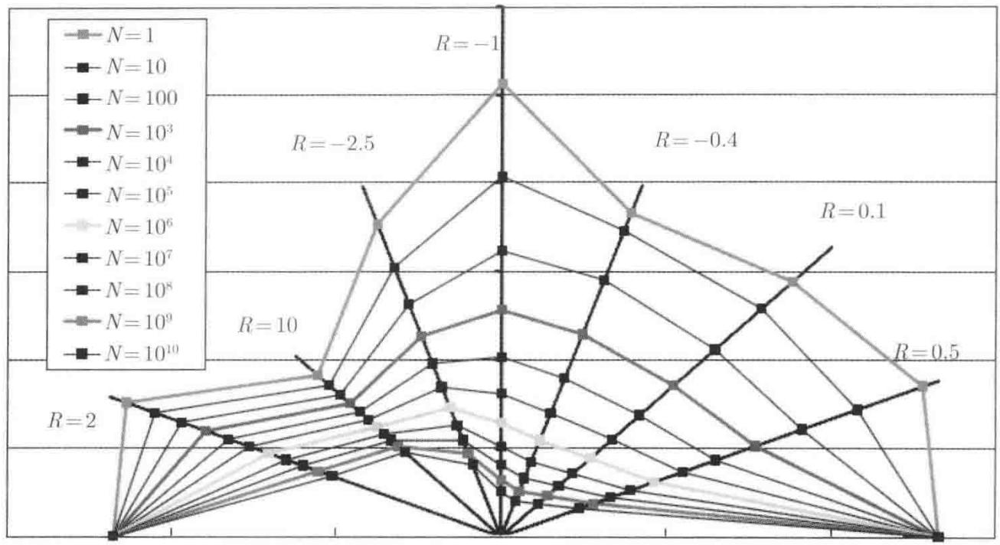

<details>
<summary>radar</summary>

| R Value | N=1 | N=10 | N=100 | N=10^3 | N=10^4 | N=10^5 | N=10^6 | N=10^7 | N=10^8 | N=10^9 | N=10^10 |
|---------|-----|------|-------|--------|--------|--------|--------|--------|--------|--------|---------|
| R = -1  |     |      |       |        |        |        |        |        |        |        |         |
| R = -2.5|     |      |       |        |        |        |        |        |        |        |         |
| R = -0.4|     |      |       |        |        |        |        |        |        |        |         |
| R = 0.1 |     |      |       |        |        |        |        |        |        |        |         |
| R = 0.5 |     |      |       |        |        |        |        |        |        |        |         |
| R = 2   |     |      |       |        |        |        |        |        |        |        |         |
</details>

图 16-7 等寿命曲线族 (直线假设)

# 16.2 复合材料疲劳

叶片的疲劳主要表现为复合材料层合板结构的疲劳特性，复合材料层压结构一般都有优良的疲劳性能。对于常用的纤维控制的多向层合板（包括含孔试样），在拉-拉疲劳下，它能在最大应力为 $80\%$ 极限拉伸强度的载荷下经受 $10^{6}$ 次循环，而在拉-压或压-压疲劳下，其疲劳强度略低一些。 $10^{6}$ 次循环对应的疲劳强度一般约为相应静强度的 $50\%$ ，特别是含冲击损伤试样在压-压疲劳下 $10^{6}$ 次循环对应的疲劳强度，一般不低于相应静强度的 $60\%$ ，对热塑性复合材料更高达 $65\%$ 。由于目前复合材料结构设计许用值主要取决于损伤容限许用值，在这样的应变水平下，复合材料结构通常是无限寿命的，这就是习惯上所说的“静力覆盖疲劳”的含义。特别需要注意的是胶接结构，如果设计不当，有可能出现疲劳破坏。

复合材料层合板结构，即使最大应力没有达到在静力试验中的初始树脂破裂的水平，在周期性载荷下，树脂可能会先发生破坏。树脂破裂效应应在疲劳分析加以考虑。

# 16.2.1 疲劳累积损伤模型

# 1. 剩余强度降模型

由疲劳试验可以得到复合材料层合板的剩余强度-寿命曲线，它表征了层合板强度的退化。剩余强度降模型认为当剩余强度和外加交变载荷的最大值相等时，相应的寿命就是使用寿命。

# 2. 剩余刚度降模型

复合材料层合板或层压结构在循环应力作用下，随着循环次数的增加，材料性能下降，应力-应变曲线也会相应变化，反映其刚度的主要参数弹性模量亦随之下降，由此表明复合材料的疲劳寿命估算可以采用剩余刚度来描述。剩余刚度降模型认为当疲劳累计应变达到材料的极限应变时，疲劳破坏已经发生。已有研究表明，以纤维控制破坏的层合板或结构在交变载荷下，刚度变化很小，所以刚度模型一般不适于这类板或结构的疲劳寿命预测。

# 3. 疲劳寿命估算的累积损伤模型

累积损伤理论是提供在程序加载或随机加载下进行构件疲劳寿命估算方法的理论，其中最为典型的是 Miner 理论和相对 Miner 理论。

# 1) Miner 累积损伤理论

复合材料构件疲劳寿命分析目前基本上仍采用 Miner 线性累积损伤理论。对复合材料，Miner 理论数学表达式为

$$
\sum_ {i = 1} ^ {k} (n _ {i} / N _ {i}) = a \tag {16-5}
$$

其中， $n_{i}$ 为第 i 级载荷（应变） $P_{i}$ 在谱载荷中发生的次数； $N_{i}$ 为第 i 级载荷（应变） $P_{i}$ 单独作用下的破坏循环数；k 为交变载荷的应力（应变）水平级数；a 为损伤累积度常数。

# 2) 相对 Miner 累积损伤理论

相对 Miner 理论仍然采用损失线性累积，但不采用累积损伤度等于 1 或 $\alpha$ 代表破坏这一确定假设，而采用相似谱的寿命结果作为预测依据。相对 Miner 理论认为寿命与累积损伤度的乘积应为常值，即

$$
N _ {\mathrm{A}} \sum_ {i = 1} ^ {k} (n _ {i} / N _ {i}) _ {\mathrm{A}} = N _ {\mathrm{B}} \sum_ {i = 1} ^ {k} (n _ {i} / N _ {i}) _ {\mathrm{B}} \tag {16-6}
$$

则

$$
N _ {\mathrm{A}} = N _ {\mathrm{B}} \sum_ {i = 1} ^ {k} (n _ {i} / N _ {i}) _ {\mathrm{B}} \Big / \sum_ {i = 1} ^ {k} (n _ {i} / N _ {i}) _ {\mathrm{A}}
$$

其中， $N_{A}$ 为计算谱 A 的预估寿命； $N_{B}$ 为计算谱 B 的试验寿命； $\sum_{i=1}^{k}(n_{i}/N_{i})_{A}$ ， $\sum_{i=1}^{k}(n_{i}/N_{i})_{B}$ 分别为计算谱 A 和相似谱 B 的计算累积损伤度。

相对 Miner 理论的特点是以相似谱 B 的试验寿命为依据，问题关键是相似谱 B 的确定和试验寿命 $N_{B}$ 的确定。相似谱 B 应较好地模拟计算载荷谱，两者的主要载荷峰谷值（特别是压缩载荷）相同或接近，且两者的主要载荷峰谷次序相同。对确定试验寿命 $N_{B}$ 的试验，要求试验件能反映出结构几何特征、铺层顺序和支持情况，以使试验件能发生反映结构危险部位实际情况的破坏。

# 4. 复合材料指数函数

复合材料的 S-N 曲线可以用如下的指数型函数表示:

$$
N \propto (\Delta S) ^ {- m} \tag {16-7}
$$

其中，N 为疲劳周期； $\Delta S$ 为循环应力幅值和应变幅值；m 为 Wohler 系数（与材料相关）。

# 16.2.2 疲劳寿命估算方法

在疲劳寿命估算时采用累积损伤理论 (通常用 Miner 线性累积损伤理论)，它在金属结构的疲劳分析中得到普遍应用，因为该理论相对比较简单。复合材料结构目前也大多采用该理论，特别是复合材料/金属混合结构寿命估算方面，采用该理论估算会带来很大方便。

在以压缩破坏为破坏模型的复合材料疲劳问题中，S-N 曲线的数学表达式表达为

$$
S _ {a} = k \lg N - X _ {c} \tag {16-8}
$$

其中， $S_{a}$ 为应力幅值；N 为疲劳寿命；k 为常数； $X_{c}$ 为静压缩强度值。

随机疲劳载荷谱中几乎每一个循环的应力比 R 值都互不相同，而 S-N 曲线是对应特定 R 值的疲劳曲线，用一条 S-N 曲线并不能直接估算构件在随机载荷下的寿命。一般而言，R 值对寿命的影响通常用等寿命曲线描述。复合材料层合板的疲劳问题主要考虑以压缩为主的交变载荷，于是在工程上，只对等寿命曲线的左半部分（即 $\sigma_{m} \leqslant 0$ ）感兴趣。为简化处理，假设等寿命曲线在 $\sigma_{m} - \sigma_{a}$ 坐标系中为直线。

对随机谱中的任一循环，设峰值应力为 $\sigma_{max,i}$ ，谷值应力为 $\sigma_{min,i}$ ，该循环的应力幅值 $\sigma_{a,i}$ 和应力均值 $\sigma_{m,i}$ 可表示为

$$
\sigma_ {a, i} = \frac {\sigma_ {\max , i} - \sigma_ {\min , i}}{2} \tag {16-9}
$$

$$
\sigma_ {m, i} = \frac {\sigma_ {\max , i} + \sigma_ {\min , i}}{2}
$$

由于等寿命曲线都通过 $(X_{c},0)$ 点，根据直线假设，可得出随机谱中 $\sigma_{\mathrm{max},i}$ 和 $\sigma_{\mathrm{min},i}$ 所对应（等损伤）的 $R = -1$ 的常幅 $\sigma_{a}$

$$
\sigma_ {a} = \frac {\sigma_ {a , i} X _ {c}}{X _ {c} - \sigma_ {m , i}} \tag {16-10}
$$

确定应力幅值 $\sigma_{a}$ ，可根据 S-N 曲线确定寿命 N，得到

$$
N = 1 0 ^ {\sigma_ {a} + X _ {c} / k} \tag {16-11}
$$

根据以上公式，得常幅谱峰谷值应力分别为 $\sigma_{max,i}$ 和 $\sigma_{min,i}$ 所对应的寿命 $N_{i}$

$$
N _ {i} = 1 0 ^ {\frac {X _ {c}}{k} \times \frac {\sigma_ {a} (i) + X _ {c} - \sigma_ {m} (i)}{X _ {c} - \sigma_ {m} (i)}} \tag {16-12}
$$

随机谱中，若峰谷值应力分别为 $\sigma_{max,i}$ 和 $\sigma_{min,i}$ ，出现的次数为 $n_{i}$ ，结构产生的损伤为

$$
d _ {i} = \frac {n _ {i}}{N _ {i}} \tag {16-13}
$$

定义风力机运行寿命期内 T 小时的载荷谱为一块，每块中有 k 个不同的峰谷值，经过 T 小时后结构产生的损伤为

$$
D = \sum_ {i = 1} ^ {k} d _ {i} \tag {16-14}
$$

# 16.3 叶片疲劳校核流程

叶片疲劳校核流程如图 16-8 所示。

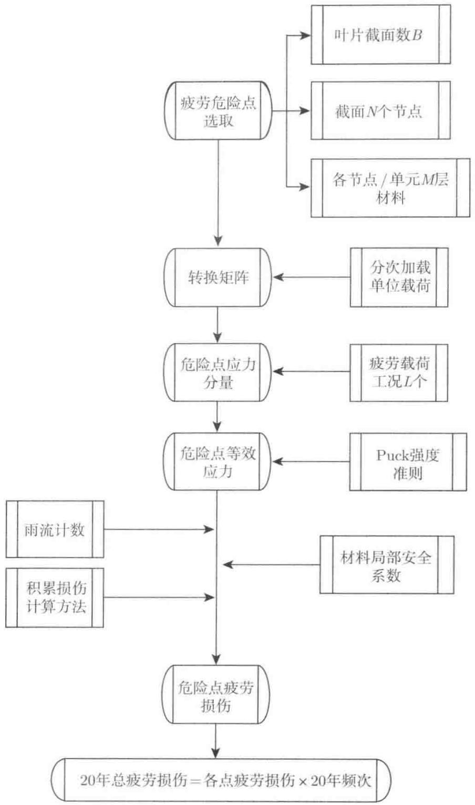

<details>
<summary>flowchart</summary>

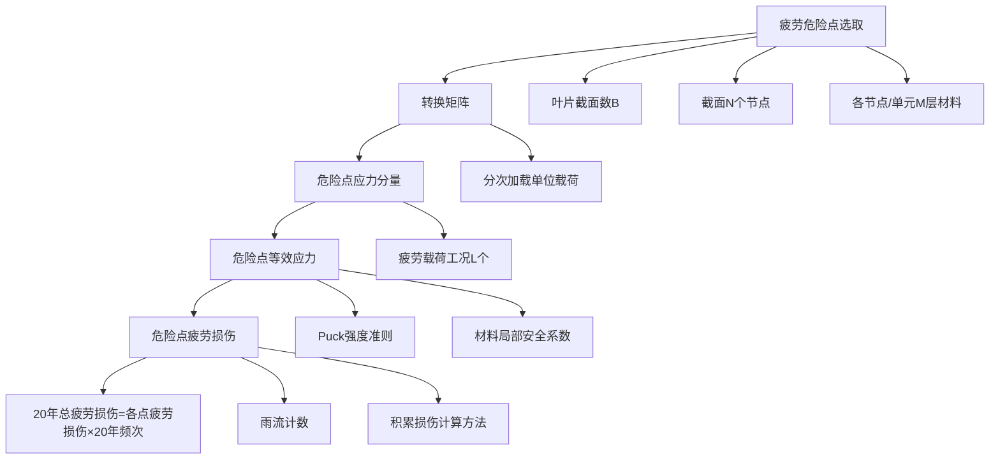
```mermaid
graph TD
    A["疲劳危险点选取"] --> B["转换矩阵"]
    B --> C["危险点应力分量"]
    C --> D["危险点等效应力"]
    D --> E["危险点疲劳损伤"]
    E --> F["20年总疲劳损伤=各点疲劳损伤×20年频次"]
    
    A --> G["叶片截面数B"]
    A --> H["截面N个节点"]
    A --> I["各节点/单元M层材料"]
    
    B --> J["分次加载单位载荷"]
    C --> K["疲劳载荷工况L个"]
    D --> L["Puck强度准则"]
    
    E --> M["雨流计数"]
    E --> N["积累损伤计算方法"]
    
    D --> O["材料局部安全系数"]
```
</details>

图 16-8 疲劳校核流程

# 16.4 疲劳载荷

根据叶片疲劳载荷工况，计算得到疲劳载荷工况频次表，用于叶片的疲劳校核，疲劳工况频次表见表 16-3。

表 16-3 疲劳工况频次表

<table><tr><td>DLC</td><td>20年频次</td><td>DLC</td><td>20年频次</td><td>DLC</td><td>20年频次</td><td>DLC</td><td>20年频次</td></tr><tr><td>1.1v03y000</td><td>30871</td><td>2.1v13eyen</td><td>1200</td><td>2.2v09y330</td><td>2</td><td>2.2v19y060</td><td>2</td></tr><tr><td>1.1v03y008</td><td>30871</td><td>2.1v13eyep</td><td>1200</td><td>2.2v09ycrp</td><td>2</td><td>2.2v19y090</td><td>2</td></tr><tr><td>1.1v03y352</td><td>30871</td><td>2.1v15eyen</td><td>1200</td><td>2.2v11apcrn</td><td>7</td><td>2.2v19y120</td><td>2</td></tr><tr><td>1.1v13y000</td><td>8958</td><td>2.2v03apcrn</td><td>7</td><td>2.2v11y210</td><td>2</td><td>2.2v21spcrp</td><td>7</td></tr><tr><td>1.1v25y000</td><td>26</td><td>2.2v05apcrp</td><td>7</td><td>2.2v13y210</td><td>2</td><td>2.2v23spcrp</td><td>7</td></tr><tr><td>1.4v25y352</td><td>163</td><td>2.2v09y000</td><td>2</td><td>2.2v17y270</td><td>2</td><td>4.1v11</td><td>1000</td></tr><tr><td>......</td><td>......</td><td>......</td><td>......</td><td>......</td><td>......</td><td>......</td><td>......</td></tr></table>

# 16.5 疲劳校核危险点选取

静态分析中所有破坏模式都应该评估潜在的疲劳破坏,确认叶片上可能发生疲劳破坏的临界单元和危险位置。由于复合材料在风力机叶片的展向和弦向分布不同,因此在计算疲劳损伤时必须计算叶片上的分布点,以确定尽可能多的危险点。

易发生疲劳破坏的位置为：应力集中处、载荷作用处、转载点。

而容易发生应力集中的位置可以确认为：断口和开孔处；线性和平滑几何不连续（包括粗糙边缘）；螺栓、黏接及其他的机械连接；在相邻的部件或材料之间的弹性属性不协调；材料制作时的孔洞或其他损伤。

叶片疲劳校核中，由于危险点数目众多，如何减少计算量已经成为比较关键性的问题。减少计算量意味着计算中选取的危险点的数量要减少，需要确保这些危险点必须具有一定的代表性。如 WB45.3 叶片，以 N 段截面为例，通过对主梁及尾缘梁上的位于叶片最外层的单向布的疲劳损伤的统计，得出叶片主梁及尾缘梁上单向布疲劳损伤的分布规律，以此为减少疲劳计算量提供重要的依据。

对于每一个截面, 疲劳损伤最大的点位于主梁中心线附近, 尾缘梁处的疲劳损伤, 除去尾缘梁与尾缘泡沫相交处的节点外, 其他各点的损伤值均处于同一个数量级, 并且基本符合越靠近尾缘点的节点的损伤值越大的规律, 如图 16-9 和图 16-10 所示。

GL 2010 中规定对于疲劳分析, 可以采用关键点作为危险点进行疲劳计算 (危险点可选主轴或者叶素坐标系轴线上的点), 对于挥舞方向和摆振方向上的安全余量大于 1.2 时, 可不必扩大校验范围。

综合叶片主梁和尾缘梁疲劳损伤分布与 GL 2010，建议在进行疲劳校核时，每个截面危险点选取采用如下准则：

(1) 主梁可以选取主梁中心线左右各一个节点作为主梁疲劳校核的危险点；  
(2) 尾缘梁可以在 P 面和 S 面上各选取最靠近尾缘点的一个节点作为尾缘梁

疲劳校核的危险点，同时要考虑上下尾缘点；

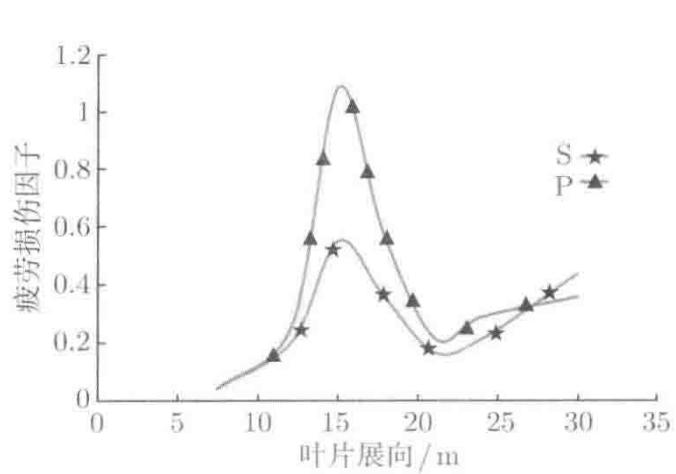

<details>
<summary>line</summary>

| 叶片展向/m | S     | P     |
| ---------- | ------- | ------- |
| 10         | 0.15  | 0.18  |
| 12         | 0.25  | 0.30  |
| 14         | 0.50  | 0.80  |
| 15         | 0.55  | 1.10  |
| 16         | 0.50  | 1.05  |
| 18         | 0.35  | 0.80  |
| 20         | 0.20  | 0.35  |
| 22         | 0.18  | 0.25  |
| 24         | 0.25  | 0.30  |
| 26         | 0.30  | 0.35  |
| 28         | 0.35  | 0.40  |
| 30         | 0.40  | 0.45  |
</details>

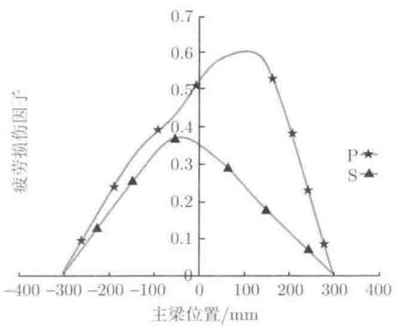

<details>
<summary>line</summary>

| 主梁位置/mm | P     | S     |
| ----------- | ------- | ------- |
| -400        | 0.0000 | 0.0000 |
| -300        | 0.1000 | 0.1200 |
| -200        | 0.2500 | 0.2800 |
| -100        | 0.4000 | 0.3800 |
| 0           | 0.5200 | 0.3500 |
| 100         | 0.6000 | 0.2800 |
| 200         | 0.4500 | 0.1800 |
| 300         | 0.1500 | 0.0800 |
| 400         | 0.0000 | 0.0000 |
</details>

图 16-9 叶片各截面主梁中心疲劳损伤分布 图 16-10 叶片某截面主梁危险点疲劳损伤分布

(3) 前缘危险点应确定为合模后坐标系下的叶片前缘点，疲劳危险点示意图如图 16-11 所示。

该简化方法与 GL 2010 的相关规定相一致，同时校验范围相比较更大。

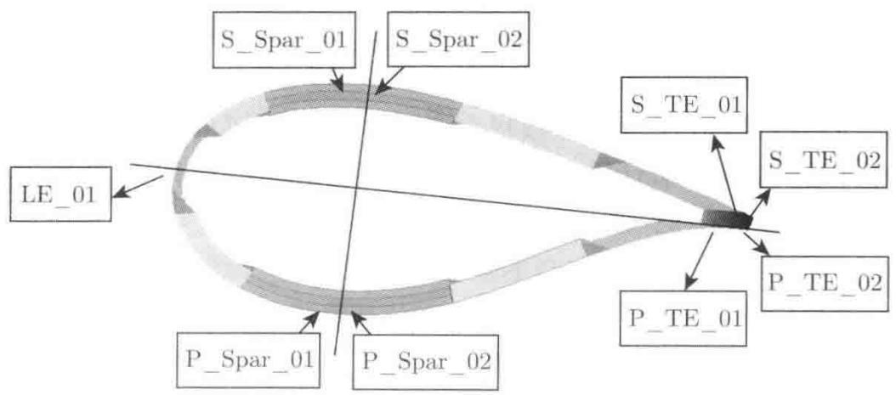

<details>
<summary>flowchart</summary>

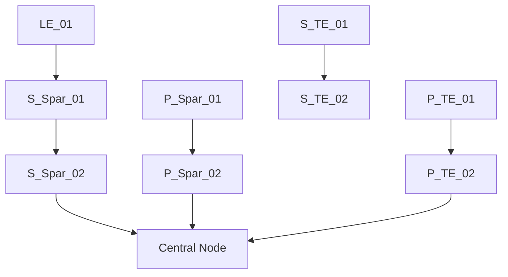
```mermaid
graph TD
    A["S_Spar_01"] --> B["S_Spar_02"]
    C["LE_01"] --> A
    D["P_Spar_01"] --> E["P_Spar_02"]
    F["S_TE_01"] --> G["S_TE_02"]
    H["P_TE_01"] --> I["P_TE_02"]
    B --> J["Central Node"]
    E --> J
    I --> J
```
</details>

图 16-11 疲劳危险点

# 16.6 叶片疲劳校核方法

叶片疲劳强度校核，为了检验叶片在20年的使用期限内是否会发生疲劳破坏。首先通过有限元方法得到所有危险点的转换矩阵，根据载荷计算得到的各载荷工况下的载荷时间历程，经过处理得到所有危险点的等效应力，通过雨流计数法，按照Miner线性疲劳累积损伤理论计算所有危险点的疲劳损伤。

# 16.6.1 坐标系

疲劳校核中采用的载荷坐标系为叶片叶根坐标系，如图 16-12 所示。

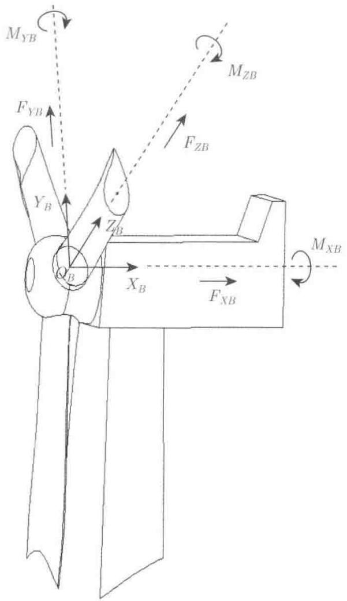

<details>
<summary>text_image</summary>

M_{YB}
F_{YB}
Y_B
Z_B
X_B
F_{ZB}
M_{ZB}
F_{XB}
Q_B
M_{XB}
</details>

图 16-12 疲劳校核载荷坐标系

# 16.6.2 应力转换矩阵

应力转换矩阵基于叶片在运转过程中材料处于线弹性范围内的基本假设，通过对3D等截面的有限元模型分别施加单位载荷（力和力矩），提取出危险点的6个应力分量，组成 $6\times6$ 的矩阵。

其形式如下：

$$
\left[ \begin{array}{l} \sigma_ {x} \\ \sigma_ {y} \\ \sigma_ {z} \\ \tau_ {x y} \\ \tau_ {y z} \\ \tau_ {z x} \end{array} \right] = \left[ \begin{array}{l l l l l l} a _ {1 1} & a _ {1 2} & a _ {1 3} & a _ {1 4} & a _ {1 5} & a _ {1 6} \\ a _ {2 1} & a _ {2 2} & a _ {2 3} & a _ {2 4} & a _ {2 5} & a _ {2 6} \\ a _ {3 1} & a _ {3 2} & a _ {3 3} & a _ {3 4} & a _ {3 5} & a _ {3 6} \\ a _ {4 1} & a _ {4 2} & a _ {4 3} & a _ {4 4} & a _ {4 5} & a _ {4 6} \\ a _ {5 1} & a _ {5 2} & a _ {5 3} & a _ {5 4} & a _ {5 5} & a _ {5 6} \\ a _ {6 1} & a _ {6 2} & a _ {6 3} & a _ {6 4} & a _ {6 5} & a _ {6 6} \end{array} \right] \cdot \left[ \begin{array}{l} M _ {x} \\ M _ {y} \\ M _ {z} \\ F _ {x} \\ F _ {y} \\ F _ {z} \end{array} \right] \tag {16-15}
$$

根据叶片强度分析确定危险截面，建立2D有限元模型。施加单位外载荷，例如施加 $M_{x} = 1, M_{y} = 0, M_{z} = 0, F_{x} = 1, F_{y} = 0, F_{z} = 0$ 的外载荷，得到的危险点的应力就是转换矩阵 $[a]$ 中第一列元素 $(a_{11}, a_{21}, a_{31}, a_{41}, a_{51}, a_{61})$ 的值；加 $M_{x} = 0, M_{y} = 1, M_{z} = 0, F_{x} = 1, F_{y} = 0, F_{z} = 0$ 的外载荷，得到的危险点的应力就是转换矩阵 $[a]$ 中第二列元素 $(a_{12}, a_{22}, a_{32}, a_{42}, a_{52}, a_{62})$ 的值，同理，可得其他列的元素。各危险点的转换矩阵见表16-4。

表 16-4 危险点的转换矩阵

<table><tr><td>a</td><td>1</td><td>2</td><td>3</td><td>4</td><td>5</td><td>6</td></tr><tr><td>1</td><td> $a_{11}$ </td><td> $a_{12}$ </td><td> $a_{13}$ </td><td> $a_{14}$ </td><td> $a_{15}$ </td><td> $a_{16}$ </td></tr><tr><td>2</td><td> $a_{21}$ </td><td> $a_{22}$ </td><td> $a_{23}$ </td><td> $a_{24}$ </td><td> $a_{25}$ </td><td> $a_{26}$ </td></tr><tr><td>3</td><td> $a_{31}$ </td><td> $a_{32}$ </td><td> $a_{33}$ </td><td> $a_{34}$ </td><td> $a_{35}$ </td><td> $a_{36}$ </td></tr><tr><td>4</td><td> $a_{41}$ </td><td> $a_{42}$ </td><td> $a_{43}$ </td><td> $a_{44}$ </td><td> $a_{45}$ </td><td> $a_{46}$ </td></tr><tr><td>5</td><td> $a_{51}$ </td><td> $a_{52}$ </td><td> $a_{53}$ </td><td> $a_{54}$ </td><td> $a_{55}$ </td><td> $a_{56}$ </td></tr><tr><td>6</td><td> $a_{61}$ </td><td> $a_{62}$ </td><td> $a_{63}$ </td><td> $a_{64}$ </td><td> $a_{65}$ </td><td> $a_{66}$ </td></tr></table>

# 16.6.3 等效应力

# 1. 复合材料构件

对于叶片结构中的玻纤构件, 假设层合板处于平面应力状态, 利用转换矩阵和作用在危险点上的外载荷, 可得到该点某一层玻纤的 6 个应力分量:

$$
\{\sigma \} _ {6 \times 1} = [ A ] _ {6 \times 6} \cdot \{P \} _ {6 \times 1} \tag {16-16}
$$

其中， $\{\sigma\}_{6\times1}=\{\sigma_{x},\sigma_{y},0,\tau_{xy},0,0\}^{\mathrm{T}};\left[A\right]_{6\times6}$ 为转换矩阵； $\{P\}_{6\times1}=\{M_{x},M_{y},M_{z},F_{x},F_{y},F_{z}\}^{\mathrm{T}}$ 为疲劳载荷计算给出的各工况各截面的载荷时间历程。

对于任意时刻的应力状态，利用材料局部坐标系与结构整体坐标系的转换关系可以得到危险点在玻纤材料方向的应力 $\sigma_{1}$ 、根据 Puck 强度准则，将材料主方向的应力作为该危险点的等效应力 $\sigma_{1}$ 、并对其进行雨流计数。

# 2. 金属构件

对于叶片结构中的金属构件, 利用转换矩阵和作用在危险点上的外载荷, 可得到该点的 6 个应力分量:

$$
\{\sigma \} _ {6 \times 1} = [ A ] _ {6 \times 6} \cdot \{P \} _ {6 \times 1} \tag {16-17}
$$

其中， $\{\sigma\}_{6\times1}=\{\sigma_{x},\sigma_{y},\sigma_{z},\tau_{xy},\tau_{yz},\tau_{zx}\}^{\mathrm{T}}$ ； $[A]_{6\times6}$ 为转换矩阵； $\{P\}_{6\times1}=\{M_{x},M_{y},M_{z},F_{x},F_{y},F_{z}\}^{\mathrm{T}}$ 为疲劳载荷计算给出的各工况各截面的载荷时间历程。

任何一个时刻的应力状态为 $\sigma_{x},\sigma_{y},\sigma_{z},\tau_{xy},\tau_{yz},\tau_{2x}$ ，则第一、二、三应力不变量分别为

$$
I _ {1} = \sigma_ {x} + \sigma_ {y} + \sigma_ {z}
$$

$$
I _ {2} = \sigma_ {x} \sigma_ {y} + \sigma_ {y} \sigma_ {z} + \sigma_ {x} \sigma_ {z} - \tau_ {x y} ^ {2} - \tau_ {y z} ^ {2} - \tau_ {x z} ^ {2} \tag {16-18}
$$

$$
I _ {3} = \sigma_ {x} \sigma_ {y} \sigma_ {z} + \tau_ {x y} \tau_ {y x} \tau_ {x z} - \sigma_ {x} \tau_ {y z} ^ {2} - \sigma_ {y} \tau_ {x z} ^ {2} - \sigma_ {z} \tau_ {x y} ^ {2}
$$

三个主应力即为方程 $\sigma^{3}-I_{1}\sigma^{2}+I_{2}\sigma-I_{3}=0$ 的根，并将三个主应力中绝对值的最大值其作为等效应力，等效应力谱见表 16-5，并对其进行雨流计数。

表 16-5 等效应力谱

<table><tr><td>危险点</td><td>疲劳工况</td><td>等效应力谱</td></tr><tr><td>Node</td><td>B1_20.750_1.1V03Y00</td><td>×10^6
-2
-4
-6
-8
-10
-12
-14
0 2000 4000 6000 8000 10000 12000</td></tr></table>

# 16.6.4 雨流计数

雨流计数法又称雨流法，也叫塔顶法，其计数原理如图 16-13 所示。用这种方法时，把载荷-时间历程的时间轴向下面，想象有一系列宝塔形屋顶，雨流都从内测开始，并允许继续往下流，根据雨流迹线来确定载荷循环，其计数规则如下：

(1) 雨流的起点依次在每个峰值 (谷值) 的内测;  
(2) 雨流在下一个峰值 (谷值) 处落下, 直到对面的峰值 (谷值) 比开始时更大 (更小) 为止;  
(3) 当雨流遇到上面屋顶流下的雨时，就停止；  
(4) 取出所有的全循环，并记下各自的幅值；  
(5) 按正、负斜率取出所有的半循环，并记下各自的幅值；  
(6) 把取出的半循环按雨流法第二阶段计数法则处理并计数。

根据上述法则，在图 16-13 中，第一个雨流应从 O 点开始，流到 a 点落下，经 $a'$ 点继续流到 c 点落下，最后停止在谷值比 O 点更小的 d 点的对应处，取出一个半循环 $Oaa'c$ 。第二个雨流从 a 点的内测开始，在 b 点落下，由于 c 点的峰值比 a 点的峰值大，故雨流停止于 c 点的对应处，取出半循环 ab。第三个雨流从 b 点开始流下，由于遇到来时上面的雨流 $Oaa'$ ，故停止于 $a'$ 点，取出半循环 $ba'$ 。 $ba'$ 与 ab构成一个闭合的应力-应变迟滞回线，形成一个全循环 $a^{\prime}ba$ 。依次，雨流从 c 点的内测开始，经过 d, $d^{\prime}$ 流至 f 点垂直向下，因 i 点的峰值比 c 点的峰值更大，故雨流停止于 i 点的对应处，取出半循环 $cdd^{\prime}f$ ，如此继续下去。图 16-13 只给出了载荷-时间历程中的一小段，雨流没有流完。假定雨流在 i 点停止，于是在图 16-13 的载荷历程中，左后取出三个全循环 $a^{\prime}ba, d^{\prime}ed, g^{\prime}hg$ ，三个半循环 $Oaa^{\prime}c, cdd^{\prime}, fgg^{\prime}i$ 。

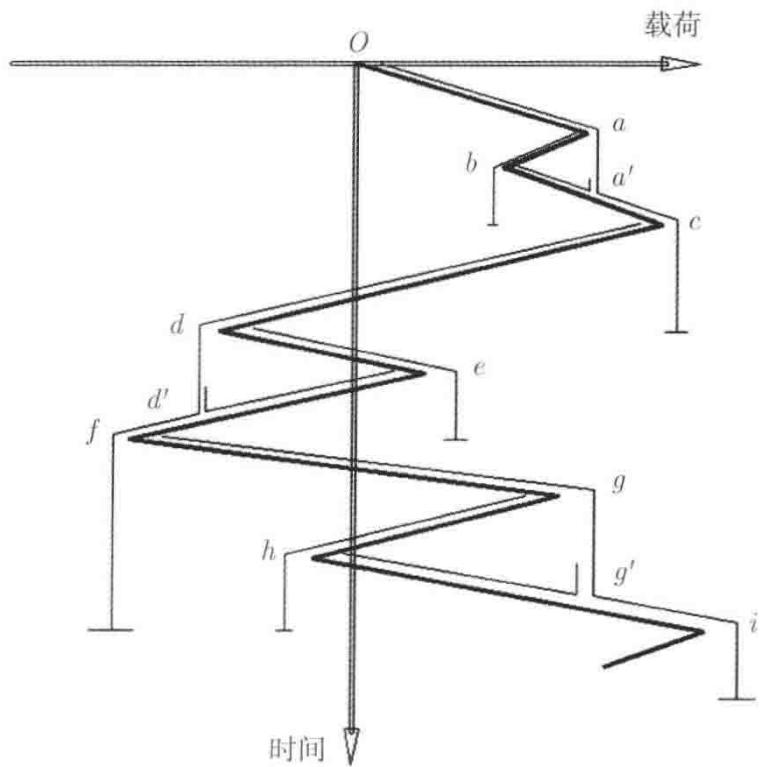

<details>
<summary>text_image</summary>

载荷
O
a
b
a'
c
d
d'
e
f
h
g
g'
i
时间
</details>

图 16-13 雨流计数法

通过雨流计数法对等效应力谱进行计数，得到各工况下每个应力等级的应力均值 $\sigma_{m,i}$ 、应力幅值 $\sigma_{a,i}$ 和循环次数 n。

# 16.6.5 疲劳分析安全系数

各载荷等级下危险点的许用循环次数，依据 GL 2010 中所规定的方式获取，许用循环次数 N 按下式确定，且 GL 2010 中规定各系数的值见表 16-6。

$$
N = \left[ \frac {R _ {k , t} + | R _ {k , c} | - | 2 \cdot \gamma_ {M a} \cdot S _ {k , M} - R _ {k , t} + | R _ {k , c} | |}{2 \cdot (\gamma_ {M b} / C _ {1 b}) \cdot S _ {k , A}} \right] ^ {m} \tag {16-19}
$$

其中， $S_{k,M}$ 为各载荷等级的均值； $S_{k,A}$ 为各载荷等级的幅值； $R_{k,t}, R_{k,c}$ 为材料试验的特征值。

材料试验的特征值应用 95% 置信度，5% 破坏概率的正态分布可按式 (16-20) 确定

$$
R _ {k} (5 \%, 95 \%, v, n) = \bar {x} \left[ 1 - v \left[ 1. 6 4 5 + \frac {1 . 6 4 5}{\sqrt {n}} \right] \right] \tag{16 - 20}
$$

其中，m 为 S-N 曲线的斜率参数，按照 GL 2010，对于聚酯树脂基体层合板 m=9，对于环氧树脂基体层合板 m=10； $\gamma_{Ma}$ 为静强度材料局部安全系数，按照 GL 2010， $\gamma_{Ma} = \gamma_{M0} \cdot \prod_{i=1}^{4} C_{ia}$ ; $\gamma_{Mb}$ 为疲劳强度材料的局部安全系数，按照 GL 2010， $\gamma_{Mb} = \gamma_{M0} \cdot \prod_{i=1}^{5} C_{ib}$ 。

表 16-6 GL 2010 中规定各系数的值

<table><tr><td>系数</td><td>安全系数分量</td><td>数值</td></tr><tr><td> $\gamma_{M0}$ </td><td>材料局部安全系数</td><td>1.35</td></tr><tr><td> $C_{1a}$ </td><td>老化影响</td><td>1.35</td></tr><tr><td> $C_{2a}$ </td><td>温度影响</td><td>1.1</td></tr><tr><td> $C_{3a}$ </td><td>用预浸料、弯曲技术、拉挤或树脂浇灌方法成型</td><td>1.1</td></tr><tr><td></td><td>用手工铺层、压制技术湿法成型</td><td>1.2</td></tr><tr><td> $C_{4a}$ </td><td>后固化成型</td><td>1.0</td></tr><tr><td></td><td>非后固化成型</td><td>1.1</td></tr><tr><td> $C_{1b}$ </td><td> $N^{1/m}$ </td><td></td></tr><tr><td> $C_{2b}$ </td><td>温度影响</td><td>1.1</td></tr><tr><td></td><td>UD增强制品</td><td>1.0</td></tr><tr><td> $C_{3b}$ </td><td>非编织纤维和单向编织粗纱</td><td>1.1</td></tr><tr><td></td><td>编织纤维和垫子</td><td>1.2</td></tr><tr><td> $C_{4b}$ </td><td>后固化成型</td><td>1.0</td></tr><tr><td></td><td>非后固化成型</td><td>1.1</td></tr><tr><td></td><td>对摆振方向的动态叶片试验</td><td>1.0</td></tr><tr><td> $C_{5b}$ </td><td>有限元</td><td>1.1</td></tr><tr><td></td><td>根据伯努利理论的计算</td><td>1.2</td></tr></table>

# 16.7 叶片疲劳损伤判断

危险点的疲劳损伤按照 Miner 线性疲劳累积损伤理论进行计算，即

$$
D = \sum_ {i = 1} ^ {n} \frac {1}{N _ {i}} \tag {16-21}
$$

叶片上某危险点在风力机运行 20 年的寿命中所发生的疲劳总损伤为

$$
\text {总损伤} D = \sum_ {j = 1} ^ {\text {工况数}} \left(\left(\sum_ {i = 1} ^ {\text {载荷等级数}} \frac {\text {载荷等级循环次数} n _ {i}}{\text {许用循环次数} N _ {i}}\right) \times 2 0 \text {年内该工况发生次数}\right)
$$

以 WB45.3 叶片疲劳校核结果为例，最危险点为叶中附近截面的尾缘梁处，该危险点 20 年仿真时间内各个工况损伤如图 16-14 所示。通过计算得到所有截面上各危险点的疲劳损伤，统计得到最危险点在各工况的疲劳损伤。

20 年疲劳总损伤 D 是否满足复合材料的疲劳损伤要求为 $D \leqslant 1$ 。

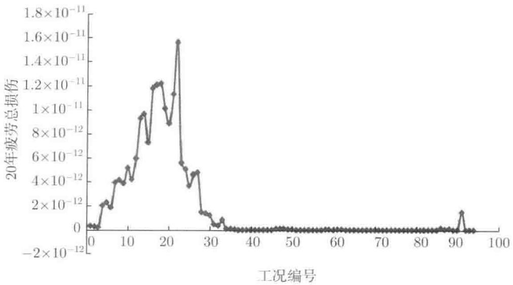

<details>
<summary>line</summary>

| 工况编号 | 20年疲劳总损伤 |
| -------- | -------------- |
| 0        | 0              |
| 5        | 2.5e-12        |
| 10       | 4.0e-12        |
| 15       | 7.5e-12        |
| 20       | 1.2e-11        |
| 25       | 1.6e-11        |
| 30       | 4.5e-12        |
| 35       | 0.5e-12        |
| 40       | 0              |
| 45       | 0              |
| 50       | 0              |
| 55       | 0              |
| 60       | 0              |
| 65       | 0              |
| 70       | 0              |
| 75       | 0              |
| 80       | 0              |
| 85       | 0              |
| 90       | 1.5e-12        |
| 95       | 0              |
| 100      | 0              |
</details>

图 16-14 最危险点各工况的疲劳损伤

# 第 17 章 叶片抗冲击分析

复合材料结构对外来物冲击极为敏感，低速低能冲击会产生不可见的损伤，隐患极大，而高速高能冲击会直接造成失效破坏，后果更为严重。鉴于冲击有可能造成灾难性事故，所以叶片设计时需特别重视风力机的冲击现象，在基本设计中就要考虑冲击可能造成的损伤，而结构设计中应尽量考虑增加结构的吸能特性和耗散能特性，使该结构能充分吸收耗散冲击能量，具体来说在设计中应采取以下措施：

(1) 在保证一定刚度要求的前提下, 应尽量增大弹塑性变形能, 以最大限度地吸收冲击能量, 使其在载荷消失后慢慢释放, 概括地说应降低刚度及加大变形;  
(2) 结构阻尼的作用就是吸收耗散能量, 故在复合材料铺层与结构设计中应注意加大结构阻尼;  
(3) PVC 夹芯或 Balsa 木夹芯具有高效吸能特性, 故在复合材料叶片设计中应尽量采用夹层结构;  
(4) 叶片前缘受冲击损伤的影响最大, 应在前缘采用多层防护设计原则, 如在前缘设计中, 通过逐层吸收耗散能量来达到抵抗冲击的作用;  
(5) 利用残余响应谱, 控制冲击响应的设计原则也是抗冲击设计的一种主要方法。冲击载荷历程可近似为一个半正弦脉冲载荷。在结构设计不合理的情况下, 其最大响应有可能落在载荷作用后, 所以设计中应使结构响应的残余谱落在谷值区来控制最大位移, 以防止损坏。

复合材料风力机叶片结构的冲击损伤，产生很小且不可察觉的表面损伤，导致很严重的铺层内损伤。结构损伤可能有两种效应：

(1) 设计载荷下引入失效模式减弱载荷承载能力;  
(2) 轻微失效导致较深损伤增加，且可能失效。

# 17.1 冲击损伤分析技术

冲击问题是一个瞬态的复杂物理过程，涉及材料非线性、几何非线性和边界条件非线性，并且冲击过程中，载荷随时间和结构的变形而变化，导致结构与载荷在计算过程中发生了耦合。目前国内外分析冲击问题的方法主要有三种：以MSC/DYTRAN为代表的流固耦合分析方法、以LS-DYNA为代表的弹性碰撞分析方法和工程分析方法。流固耦合法将用在欧拉坐标系中建立流体(冲击体)模型和在拉格朗日坐标系中建立的结构模型进行耦合分析，虽然在理论上比较先进，但计算所得的冲击载荷历程曲线与测试曲线差距较大；弹性碰撞法的缺点是冲击体建模难度太大，往往因冲击体畸变而使计算无法进行；而工程化方法的计算工作量远小于前两种方法，其结果可以满足工程应用。

当冲击物以一定的速度作用在构件上时，在极短时间内，构件使冲击物的速度为零，此时两者之间产生一定的冲击载荷、冲击变形及由冲击载荷产生的冲击应力。碰撞时产生的冲击力不仅很大，而且很复杂。在碰撞的瞬间冲击力的波形与碰撞的速度、相撞双方的质量分布、接触处的形状、材料变形等因素相关。在一般计算中，根据动量守恒定理计算得到的只是名义上的平均冲击力，而最大冲击力可能远远超过平均冲击力。

风力机叶片前缘极易受到沙尘及石块等冲击，冲击之后还会留下砂眼附着于叶片前缘表面，故叶片的前缘是抗冲击分析的关键部位，如图 17-1 所示。

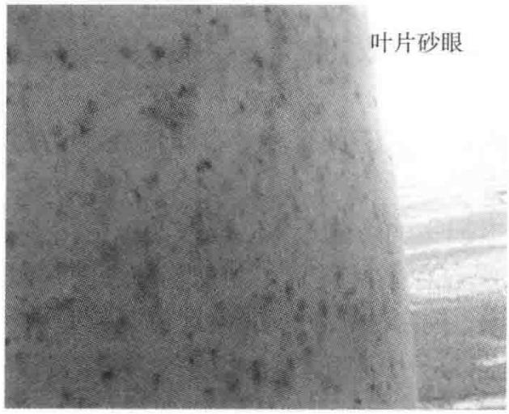

<details>
<summary>text_image</summary>

叶片砂眼
</details>

图 17-1 叶片前缘抗冲击部位

# 17.1.1 工程化分析方法

工程化方法的基本假设 [39]:

(1) 结构在冲击载荷作用下处于大变形状态，其破坏形式为脆性破坏；  
(2) 因复合材料为一种可设计的高阻尼材料，在分析中必须考虑复合材料的阻尼耗散能量的影响；  
(3) 在载荷处理上将冲击视为软体冲击，但应考虑结构变形的影响。

根据上述基本假设, 复合材料结构非线性鸟撞分析的增量方程为

$$
\begin{array}{l} { } ^ { t } K \Delta u ^ { ( i ) } + M ^ { t + \Delta t } \ddot { u } ^ { ( i ) } = ^ { t + \Delta t } R - ^ { t + \Delta t } F ^ { ( i - 1 ) } K _ { d } ^ { t } u ^ { ( i ) } \\ { } ^ { t + \Delta t } u ^ { ( i ) } = { } ^ { t + \Delta t } u ^ { ( i - 1 ) } + \Delta u ^ { ( i ) } \tag {17-1} \\ \end{array}
$$

其中， $^{t}K$ 和 M 为结构的刚度和质量矩阵；R 和 F 为载荷和等效节点力矢量； $K_{d}$

为等效阻尼刚阵, 其表达式为

$$
K _ {d} = \int_ {V _ {\mathrm{e}}} B ^ {\mathrm{T}} D _ {\mathrm{d}} B \mathrm{d} V \tag {17-2}
$$

其中， $D_{d}=\Psi D$ 和 $\Psi=\mathrm{diag}\Psi_{i}$ 为复合材料的比阻尼矩阵；D 为复合材料本构矩阵。

# 17.1.2 载荷处理技术

冲击分析的典型案例为鸟撞，鸟撞过程时间相对较长，一般在 ms 量级上，撞击速度不算很快。而风力机叶片运行过程中，由于受到冰雹等影响，需要进行冲击问题的分析。由于风力机转速不高，冰雹冲击时间相对较长，因此风力机叶片的冲击分析更接近于鸟撞问题。

鸟撞载荷的处理和载荷模型的选取是鸟撞损伤分析的关系，为此国内外研究人员对其进行了大量卓有成效的理论和试验研究工作。图 17-2 给出了试验结果和常用的几种理论曲线。其中曲线①为试验曲线，曲线②为 MSC/DYTRAN 软件的计算曲线，曲线③④为工程分析中常用的两种载荷模式——三角形模式和矩形模式。可以看出，所有计算模式与试验曲线相比均有偏差，但由大量鸟撞分析结果表明，三角形模式较为理想。

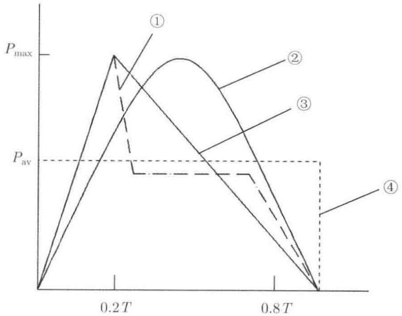

<details>
<summary>line</summary>

| T     | P_max (Curve 1) | P_av (Curve 2) | P_av (Curve 3) | P_av (Curve 4) |
|-------|-----------------|----------------|----------------|----------------|
| 0.2T  | Peak            | Low            | High           | Low            |
| 0.8T  | Low             | Low            | Low            | Low            |
</details>

图 17-2 鸟撞载荷曲线图

根据稳态无旋流假设, 将鸟体处理为以圆柱形流体, 其长度为直径的 2 倍。当鸟体质量确定后, 体长 L 与直径 d 由下式给出:

$$
d = \sqrt [ 3 ]{\frac {2 m}{\pi \rho}}, \quad L = 2 d \tag {17-3}
$$

若在斜撞击情况下，鸟体的有效长度为

$$
L _ {\mathrm{eff}} = L + d / \tan \theta \tag {17-4}
$$

其中，冲击角 $\theta$ 为斜面法向矢量与鸟速 V 的夹角。

因此，鸟撞载荷的作用时间为

$$
T = L _ {\text {eff}} / V \tag {17-5}
$$

根据冲击理论，在冲击周期内的平均冲击力为

$$
F _ {\mathrm{av}} = \frac {m V \sin \theta}{T} \tag {17-6}
$$

从图 17-2 中可以看出，三角形载荷模式的数学表达式为

$$
F (t) = \left\{ \begin{array}{l l} 1 0 F _ {\mathrm{av}} t / T, & 0 \leqslant t \leqslant 0. 2 T \\ \frac {5}{2} F _ {\mathrm{a}} \left(1 - \frac {t}{T}\right), & 0. 2 T \leqslant t \leqslant T \end{array} \right. \tag {17-7}
$$

$F(t)$ 在椭圆形接触界面上的空间分布为：

(1) 沿椭圆短轴 b, $p(x)=q$ ;   
(2) 沿椭圆长轴 a, $p(x) = (2x \sin \theta / d + 1)q$ 。

其中，平均分布力 $q = F(t)/\pi ab$ 。

工程分析的控制方程中的载荷矢量 $t+\Delta t R$ 由下列元素公式得到

$$
R = \int_ {S} N p (x) \mathrm{d} S \tag {17-8}
$$

# 17.2 显式时间积分方法

MD Nastran 提供了显式非线性模块 SOL 700，可以求解包含几何非线性的瞬态动力性问题。SOL 700 模块的显式时间积分方法所需求解的是一个运动方程

$$
M a _ {n} + C v _ {n} + K d _ {n} = F _ {n} ^ {\text {ext}} \tag {17-9}
$$

式 (17-9) 可改写为

$$
\begin{array}{l} M a _ {n} = F _ {n} ^ {\text {ext}} - F _ {n} ^ {\text {int}} \\ \text {Fint} = G _ {n} + H _ {n} \end{array} \tag {17-10}
$$

$$
F _ {n} ^ {\text { int }} = C v _ {n} + K d _ {n}
$$

从而容易得到

$$
a _ {n} = M ^ {- 1} F _ {n} ^ {\text { residual }} \tag {17-11}
$$

其中，M 为结构的质量矩阵；C 为结构的阻尼系数矩阵；K 为结构的刚度矩阵； $F_{n}^{ext}$ 为第 n 个增量步的外力矢量； $F_{n}^{int}$ 为第 n 个增量步的内力矢量； $a_{n}$ 为第 n 个增量步的加速度矢量； $v_{n}$ 为第 n 个增量步的速度矢量； $d_{n}$ 为第 n 个增量步的位移矢量。

在显示有限元分析程序中，一般采用集中质量矩阵，即质量矩阵 $M$ 只有对角元素，此时第 $n$ 个增量步的加速度分量由式(17-12)计算

$$
a _ {n i} = F _ {n i} ^ {\text {residual}} / M _ {i} \tag {17-12}
$$

应用显式时间积分方法的每个增量步求解抗冲击特性，在每个增量步的求解过程中，加速度、位移和力均取为当前增量步，而速度则是由中心差分法确定

$$
v _ {n + 1 / 2} = v _ {n - 1 / 2} + a _ {n} \left(\Delta t _ {n + 1 / 2} + \Delta t _ {n - 1 / 2}\right) / 2 \tag {17-13}
$$

$$
d _ {n + 1} = d _ {n} + v _ {n + 1 / 2} \Delta t _ {n + 1 / 2}
$$

纵观显式时间积分方法，它不需要进行矩阵的分解或矩阵求逆，因此每个增量步的计算量较小，基本与求解对象的规模（即质量矩阵规模）成正比，求解速度也是非常快的，这对大规模有限元模型求解是有明显优势的。另外，对于包含几何非线性、材料非线性、接触等复杂因素的强非线性问题，非线性程度的大小对求解过程影响不大，使得显式时间积分方法的应用范围很广。

显式时间积分不是无条件稳定的，其积分步长必须小于一个完整的应力波传过模型中最小单元的时间，从数值计算上要求小于模型的所有固有周期。

显式时间积分的时间步长为

$$
\Delta t = S L / c \tag {17-14}
$$

其中， $\Delta t$ 为时间步长； $S$ 为时间步长因子，应满足 $S < 1$ ； $L$ 为模型中的最小单元尺度； $c$ 为材料中的声速。

对于一维单元，材料中的声速 $c$ 由式(17-15)确定

$$
c = \sqrt {E / \rho} \tag {17-15}
$$

其中， $E$ 为材料的弹性模量； $\rho$ 为材料密度。

# 17.3 材料本构关系

# 17.3.1 鸟体冲击材料

鸟体材料的描述需要用到状态方程 (equation of state)，用于描述材料内部压力 $p$ 与材料密度的关系。状态方程有多个，本例使用的是多项式形式的状态方程 EOSPOL，其理论定义为

$$
p = a _ {1} \mu + a _ {2} \mu^ {2} + a _ {3} \mu^ {3} + (b _ {0} + b _ {1} \mu + b _ {2} \mu^ {2} + b _ {3} \mu^ {3}) \rho_ {0} e \tag {17-16}
$$

$$
p = a _ {1} \mu + (b _ {0} + b _ {1} \mu) \rho_ {0} e \tag {17-17}
$$

其中， $\mu=\rho/\rho_{0}-1;\quad\rho$ 为任意时刻材料密度； $\rho_{0}$ 为材料参考密度；e 为材料的比内能； $a_{i},b_{i}$ 为材料常数。

# 17.3.2 冰雹冲击材料

冰雹冲击中采用 30mm 直径的球体来模拟冰雹，可用 8 节点三维的显示结构实体单元，如图 17-3 所示。冲击过程中，冰雹被撞碎，体现出流体的性能，因此采用带有失效模式的 Plastic Kinematic 材料模型，模型中应变率用 Cowper-Symonds 模型来考虑，用与应变率有关的因素表示屈服应力：

$$
\sigma_ {y} = \left[ 1 + \left(\frac {\dot {\varepsilon}}{C}\right) ^ {\frac {1}{P}} \right] (\sigma_ {0} + \beta E _ {P} \varepsilon_ {P} ^ {\mathrm{eff}}) \tag {17-18}
$$

其中， $\sigma_{0}$ 为初始屈服应力； $\dot{\varepsilon}$ 为应变率；C 和 P 为 Cowper-Symonds 应变率参数； $\varepsilon_{P}^{eff}$ 为有效塑性应变； $E_{P}$ 为塑性硬化模量，由下式给出

$$
E _ {P} = \frac {E _ {\mathrm{tan}} E}{E - E _ {\mathrm{tan}}} \tag {17-19}
$$

其中， $E_{\tan}$ 为切线模量。

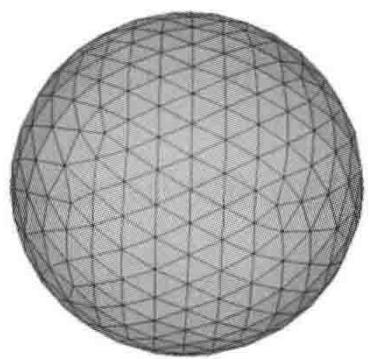

<details>
<summary>natural_image</summary>

3D wireframe sphere with triangular mesh pattern (no text or symbols)
</details>

图 17-3 冰雹冲击体模型

# 17.4 叶片抗冲击校核

风力机一般均需要安装在风力资源比较丰富的地方，大部分安装在海边或者离海边比较近的山顶野外，其环境严酷，需经常承受雨雪甚至冰雹的冲击，加上当前风力机叶片主要采用热固性树脂基体的复合材料，热固性树脂的脆性大，不耐冲击。若风力机在运行过程里，特别是恶劣天气（如冰雹）和候鸟迁徙等情况下，会不时发生鸟撞之类的冲击载荷，因此需要对风力机叶片进行抗冲击性能的分析。

# 17.4.1 叶片抗冲击模型

叶片运行过程中，发生冲击损伤的部位基本为叶片前缘。图 17-4 为叶片抗冲击分析模型。

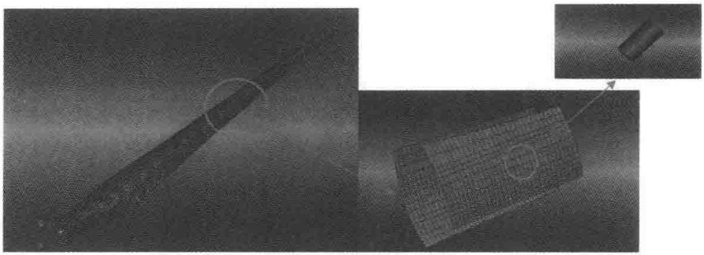

<details>
<summary>natural_image</summary>

Close-up of a mechanical component with a circular feature and a grid-patterned inset showing a cylindrical part (no text or symbols visible)
</details>

图 17-4 叶片冲击示意图

根据第 4 章的介绍，叶片前缘的铺层形式采用内/外蒙皮与手糊前缘条，如图 17-5 所示。

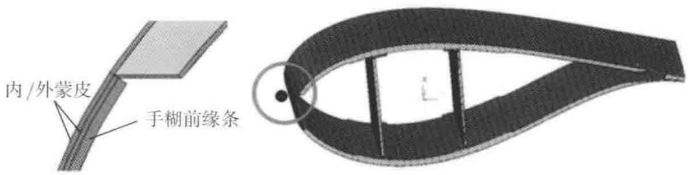

<details>
<summary>text_image</summary>

内/外蒙皮
手糊前缘条
</details>

图 17-5 叶片前缘抗冲击模型

# 17.4.2 叶片抗冲击分析

运用显示动力分析方法对冰雹冲击叶片前缘进行数值模拟, 算法采用默认的单点积分 (Const. Stress), 可以节省计算时间。设定冲击冰雹的初始速度为 $V_{\mathrm{Y}} = 80 \mathrm{~m} / \mathrm{s}$ , 即沿叶片弦向冲击前缘, 计算时间设置为 $0.001 \mathrm{~s}$ , 计算步数取 50 步。叶片叶中附近前缘抗冰雹冲击分析结果, 冰雹与前缘在 $t = 80 \mu \mathrm{s}$ 时开始接触, 在 $t = 0.38 \mathrm{~ms}$ 时应力达到最大值, 在 $t = 0.8 \mathrm{~ms}$ 时应力值又一次出现一个最大值, 被冲击体的各个节点应力值从外层向内层依次减小, 并且衰减很快, 如图 17-6 所示。

从开始冲击到冲击结束一般分为不同的阶段，各阶段的冲击破坏效果不同。冲击最后时刻，叶片损伤较大，此时冲击体与叶片的接触区域已经非常小。整个冲击结束之后，根据叶片复合材料的塑性应变判断叶片是否满足抗冲击的要求。图 17-7 为叶片冲击不同时刻的效果图。

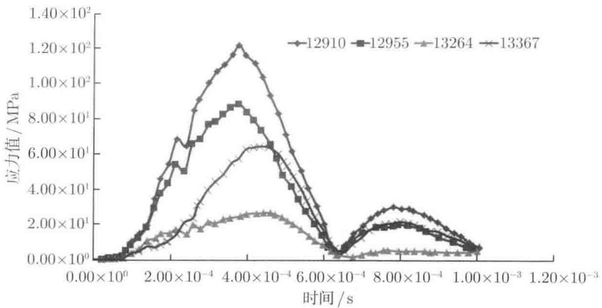

<details>
<summary>line</summary>

| 时间 /s | 12910 | 12955 | 13264 | 13367 |
| -------- | ----- | ----- | ----- | ----- |
| 0.00×10⁰ | 0.00×10⁰ | 0.00×10⁰ | 0.00×10⁰ | 0.00×10⁰ |
| 2.00×10⁻⁴ | 6.00×10¹ | 5.00×10¹ | 2.00×10¹ | 1.50×10¹ |
| 4.00×10⁻⁴ | 1.20×10² | 8.00×10¹ | 2.50×10¹ | 3.00×10¹ |
| 6.00×10⁻⁴ | 6.00×10¹ | 4.00×10¹ | 1.50×10¹ | 2.00×10¹ |
| 8.00×10⁻⁴ | 3.00×10¹ | 2.50×10¹ | 1.00×10¹ | 1.50×10¹ |
| 1.00×10⁻³ | 1.00×10¹ | 1.50×10¹ | 5.00×10¹ | 8.00×10¹ |
| 1.20×10⁻³ | 5.00×10¹ | 8.00×10¹ | 3.00×10¹ | 6.00×10¹ |
</details>

图 17-6 叶片前缘抗冲击响应-时间曲线

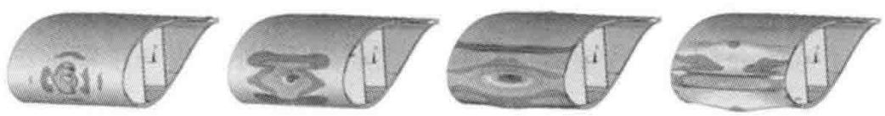

<details>
<summary>natural_image</summary>

Four-panel illustration of a wooden plank showing cross-sections and surface texture (no text or symbols)
</details>

图17-7 冲击效果

# 17.5 叶片抗冲击试验

叶片的冲击试验应考虑最差的冲击几何尺寸和边界条件。改变冲击体尺寸、边界条件、材料特性或测试率通常彻底改变结构的响应。在叶片的冲击试验中，应确保验证过程中不会发生任何不可预期的破坏。

# 第 18 章 断裂力学与层间分析

经过半个多世纪的发展，断裂力学作为一个研究领域已经相当成熟。断裂力学有助于人们认识和理解材料中裂纹的产生、扩展和最终破坏的过程，并为结构损伤容限设计提供理论基础。

# 18.1 复合材料的断裂分析

复合材料中的断裂问题可以分为两大类：面内断裂和层间开裂。

复合材料的面内断裂主要是为了确认其断裂韧度，复合材料自身的复杂性，没有解析的计算公式可用于计算复合材料的断裂韧度，故需要用有限元分析复合材料的面内断裂 $^{[40]}$ 。

复合材料的层间开裂也叫分层，是纤维增强复合材料的基本破坏形式。引起复合材料层间开裂的原因很多，主要有制造中的缺陷、外部冲击载荷引起的层间损伤、高度的应力集中等。无论是单调静态加载还是循环疲劳加载，层间开裂的产生和发展都会显著降低复合材料结构物的强度，并可能对结构物造成灾难性的破坏，从而带来严重的可靠性和安全性问题。因此，层间开裂是复合材料最为严重的一种破坏模式，也是有关复合材料断裂的主要研究方向。

# 18.2 断裂力学中的主要参数

断裂力学中有 3 个最为基本的参数，即应力强度因子 K、路径无关积分 J 和应变能释放率 G。

(1) 应力强度因子 $K$ 描述了弹性裂纹尖端应力场的强弱, 此参数的引入消除了由裂纹引起的应力奇异性所带来的数学上的困扰, 其计算依赖于断裂前端的局部应力场;  
(2) J 积分和应变能释放率则是基于能量的参数;   
(3) J 积分描述的是由于裂纹的存在所吸收的能量, 而应变能释放率描述的则是产生新裂纹面所需要的能量。

断裂力学中基本的断裂模式有Ⅰ型、Ⅱ型和Ⅲ型，如图18-1所示。Ⅰ型断裂也叫张开型断裂，是一种最为危险同时也是研究最为深入的断裂模式；Ⅱ型和Ⅲ型断裂分别叫滑移型断裂和撕裂型断裂，它们都和剪切应力相关，因此也都属于剪切断裂。Ⅰ型和Ⅱ型属于面内断裂，Ⅲ型则属于面外断裂。在工程实际上，并不是所有的断裂问题都可以简化为上述三个基本模式之一，因此存在着复合型断裂，即上述三种基本模式的组合。

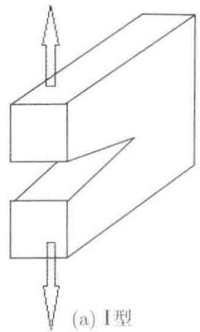

<details>
<summary>text_image</summary>

(a) I型
</details>

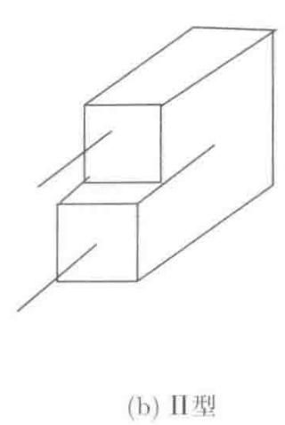

<details>
<summary>text_image</summary>

(b) Π型
</details>

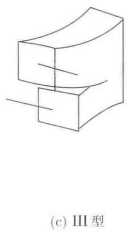

<details>
<summary>text_image</summary>

(c) III型
</details>

图 18-1 I 型、II 型和III型断裂模式示意图

# 18.3 断裂力学计算方法

最为直观的早期方法是利用裂纹尖端前沿的单元应力，或裂纹尖端后面的节点位移进行外推，来计算应力强度因子。这种外推方法要求裂纹尖端具有非常细密的网格。为提高计算效率，建议在裂纹尖端使用奇异单元或叠折单元，但是这些特殊单元在建模时显得很麻烦，也不便于用来模拟裂纹扩展问题。引入 J 积分的最初目的是为了处理弹塑性材料的断裂问题，对于一个特定长度的裂纹，应变能释放率的计算可通过虚拟裂纹扩展法、闭合法来实现，虚拟裂纹闭合法的基本特点：

(1) 计算过程中只用到裂纹尖端的节点力和裂纹尖端后面的张开位移，而节点力和位移又都是有限元分析的基本量，因而精度上需有一定的保证；  
(2) 不需要使用奇异单元或叠折单元，对有限元网格尺寸大小也不敏感，计算公式简单明了。

# 18.3.1 有限宽中心裂纹板理论解

有限宽中心裂纹板，其板的高度、宽度和厚度分别用 2H、2W 和 B 来表示，中心裂纹的总长为 2a。在板的远处承受均匀的拉伸应力 $\sigma$ 。假设板的材料各向同性、均匀、线弹性，其弹性模量和泊松比分别用 E 和 $\mu$ 表示。

这是典型的 I 型裂纹问题，其应力强度因子 $K_{I}$ 的计算公式可通过求解无限大板中周期排列的裂纹阵问题而得到。典型的三个计算公式为

$$
K _ {I} = \sigma \sqrt {\pi a} \sqrt {\frac {2 W}{\pi a} \tan \frac {\pi a}{2 W}} \tag {18-1}
$$

$$
K _ {I} = \sigma \sqrt {\pi a} \sqrt {\sec \frac {\pi a}{2 W}} \left[ 1 - 0. 0 2 5 \left(\frac {a}{W}\right) ^ {2} + 0. 0 6 \left(\frac {a}{W}\right) ^ {4} \right] \tag {18-2}
$$

$$
K _ {I} = \sigma \sqrt {\pi a} \sqrt {\sec \frac {\pi a}{2 W}} \tag {18-3}
$$

通过分析证明, 对于各向同性均匀线弹性材料而言, J 积分、应力强度因子 $K_{I}$ 和应变能释放率 $G_{I}$ 有以下的关系:

$$
J = G _ {I} = \frac {K _ {I} ^ {2}}{\bar {E}} \tag {18-4}
$$

$$
K _ {I} = \sqrt {\bar {E} J} = \sqrt {\bar {E} G _ {I}} \tag {18-5}
$$

其中，对于平面应力状态， $\bar{E}=E$ ；对于平面应变状态， $\bar{E}=E/(1-\mu^{2})$ 。

假设一块含有中心裂纹的平板，其几何尺寸为：半宽 $W = 100\mathrm{mm}$ ，半高 $H = 200\mathrm{mm}$ ，板厚 $B = 1.0\mathrm{mm}$ 以及半裂纹长度 $a = 20\mathrm{mm}$ 。材料的弹性模量和泊松比分别为 $E = 200 \times 10^{3}\mathrm{MPa}$ 和 $\mu = 0.25$ 。该裂纹板承受均匀应力为 $\sigma = 30\mathrm{MPa}$ 。基于理论公式计算得到的断裂力学基本参数值，列于表18-1。

表 18-1 当 a/W = 0.2 时，3 个计算公式的结果分析

<table><tr><td rowspan="2"> $\frac{a}{W}$ </td><td colspan="3"> ${K}_{I}/\left( {\mathrm{{MPa}} \cdot \sqrt{\mathrm{{mm}}}}\right)$ </td><td colspan="3"> ${G}_{I}\left( {\text{或}J}\right) /\left( {\mathrm{N}/\mathrm{{mm}}}\right)$ </td></tr><tr><td>式 (18-1)</td><td>式 (18-2)</td><td>式 (18-3)</td><td>式 (18-1)</td><td>式 (18-2)</td><td>式 (18-3)</td></tr><tr><td>0.2</td><td>241.8</td><td>243.6</td><td>243.8</td><td>0.2924</td><td>0.2968</td><td>0.2973</td></tr></table>

# 18.3.2 应力强度因子与外推法

众所周知，对于线弹性材料而言，裂纹尖端的应力是无穷大（即应力奇异性）的。因此，裂尖前端单元内积分点上的应力值将依赖于有限元的网格尺寸，即网格尺寸越小，所得到的应力值就越高，并且应力值不收敛于网格尺寸，因此裂纹尖端前的应力值不能作为研究裂纹问题的参数。应力强度因子概念的引入，就是为了克服这个数学上的固有困难，用来描述裂纹附近应力奇异的严重程度。

# 1. 基于单元应力的外推法

计算应力强度因子最为直接的方法是基于应力的外推法。采用外推法计算的应力强度因子

$$
K _ {I} \approx \frac {\sum r _ {i} \sum r _ {i} K _ {I i} - \sum r _ {i} ^ {2} \sum K _ {I i}}{(\sum r _ {i}) ^ {2} - N \sum r _ {i} ^ {2}} \tag {18-6}
$$

其中，r 为距离裂纹尖端的极半径。

应用有限元商业软件 ABAQUS $^{[41]}$ 进行有限宽中心裂纹板模型的有限元分析，裂纹尖端的应力云图如图 18-2 所示。

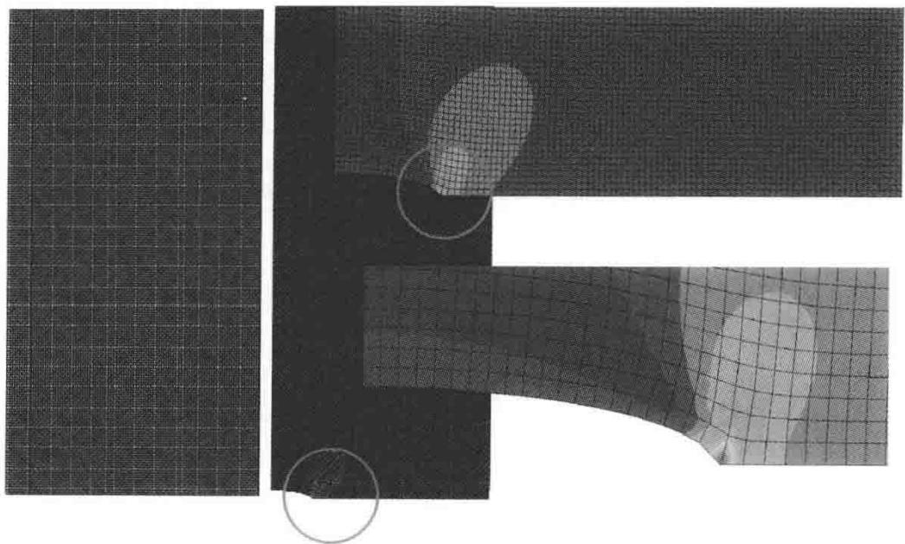

<details>
<summary>natural_image</summary>

Close-up of a textured surface with grid patterns and two circular highlights (no text or symbols)
</details>

图 18-2 裂纹尖端应力云图

<table><tr><td>ELEMENT</td><td>PT FOOT-</td><td>COORD1</td><td>COORD2</td><td>S22</td></tr><tr><td colspan="5">NOTE</td></tr><tr><td>21</td><td>1</td><td>20.21</td><td>0.2113</td><td>163.2</td></tr><tr><td>21</td><td>2</td><td>20.79</td><td>0.2113</td><td>112.9</td></tr><tr><td>21</td><td>3</td><td>20.21</td><td>0.7887</td><td>148.3</td></tr><tr><td>21</td><td>4</td><td>20.79</td><td>0.7887</td><td>97.93</td></tr><tr><td>22</td><td>1</td><td>21.21</td><td>0.2113</td><td>86.68</td></tr><tr><td>22</td><td>2</td><td>21.79</td><td>0.2113</td><td>76.91</td></tr><tr><td>22</td><td>3</td><td>21.21</td><td>0.7887</td><td>82.03</td></tr><tr><td>22</td><td>4</td><td>21.79</td><td>0.7887</td><td>72.26</td></tr><tr><td>23</td><td>1</td><td>22.21</td><td>0.2113</td><td>68.28</td></tr><tr><td>23</td><td>2</td><td>22.79</td><td>0.2113</td><td>63.36</td></tr><tr><td>23</td><td>3</td><td>22.21</td><td>0.7887</td><td>66.77</td></tr><tr><td>23</td><td>4</td><td>22.79</td><td>0.7887</td><td>61.86</td></tr><tr><td>24</td><td>1</td><td>23.21</td><td>0.2113</td><td>58.91</td></tr><tr><td>24</td><td>2</td><td>23.79</td><td>0.2113</td><td>56.11</td></tr><tr><td>24</td><td>3</td><td>23.21</td><td>0.7887</td><td>58.18</td></tr><tr><td>24</td><td>4</td><td>23.79</td><td>0.7887</td><td>55.38</td></tr><tr><td>25</td><td>1</td><td>24.21</td><td>0.2113</td><td>53.33</td></tr><tr><td>25</td><td>2</td><td>24.79</td><td>0.2113</td><td>51.47</td></tr><tr><td>25</td><td>3</td><td>24.21</td><td>0.7887</td><td>52.93</td></tr><tr><td>25</td><td>4</td><td>24.79</td><td>0.7887</td><td>51.06</td></tr><tr><td>26</td><td>1</td><td>25.21</td><td>0.2113</td><td>49.54</td></tr><tr><td>26</td><td>2</td><td>25.79</td><td>0.2113</td><td>48.21</td></tr><tr><td>26</td><td>3</td><td>25.21</td><td>0.7887</td><td>49.29</td></tr><tr><td>26</td><td>4</td><td>25.79</td><td>0.7887</td><td>47.96</td></tr><tr><td>27</td><td>1</td><td>26.21</td><td>0.2113</td><td>46.80</td></tr><tr><td>27</td><td>2</td><td>26.79</td><td>0.2113</td><td>45.79</td></tr><tr><td>27</td><td>3</td><td>26.21</td><td>0.7887</td><td>46.63</td></tr><tr><td>27</td><td>4</td><td>26.79</td><td>0.7887</td><td>45.63</td></tr><tr><td>28</td><td>1</td><td>27.21</td><td>0.2113</td><td>44.70</td></tr><tr><td>28</td><td>2</td><td>27.79</td><td>0.2113</td><td>43.92</td></tr><tr><td>28</td><td>3</td><td>27.21</td><td>0.7887</td><td>44.58</td></tr><tr><td>28</td><td>4</td><td>27.79</td><td>0.7887</td><td>43.80</td></tr><tr><td>29</td><td>1</td><td>28.21</td><td>0.2113</td><td>43.05</td></tr><tr><td>29</td><td>2</td><td>28.79</td><td>0.2113</td><td>42.42</td></tr><tr><td>29</td><td>3</td><td>28.21</td><td>0.7887</td><td>42.96</td></tr><tr><td>29</td><td></td><td></td><td></td><td></td></tr></table>

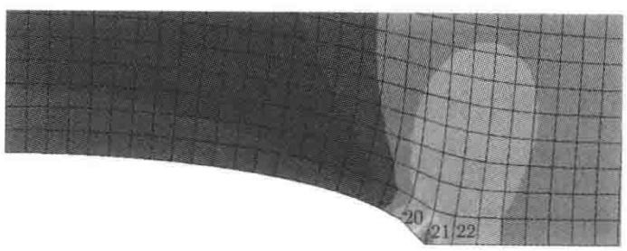

<details>
<summary>natural_image</summary>

Grayscale grid pattern with a curved boundary and faint circular shapes, no text or symbols present.
</details>

图 18-3 裂纹前端单元应力分量

如图 18-3 所示的裂纹前端单元应力分量，根据应力强度因子计算公式

$$
K _ {I} \approx \frac {\sum r _ {i} \sum r _ {i} K _ {I i} - \sum r _ {i} ^ {2} \sum K _ {I i}}{(\sum r _ {i}) ^ {2} - N \sum r _ {i} ^ {2}} = 2 2 7. 0 (\mathrm{MPa} \cdot \sqrt {\mathrm{mm}})
$$

与理论解析解

$$
K _ {I} = 2 4 3. 6 (\mathrm{MPa} \cdot \sqrt {\mathrm{mm}})
$$

相比, 相对误差为 -6.8%。

将 $(r_{i}, K_{Ii})$ 的数据对作图，该曲线表面接近裂纹尖端的时候，有较大的振荡，并且不满足线性假设条件，如图 18-4 所示。

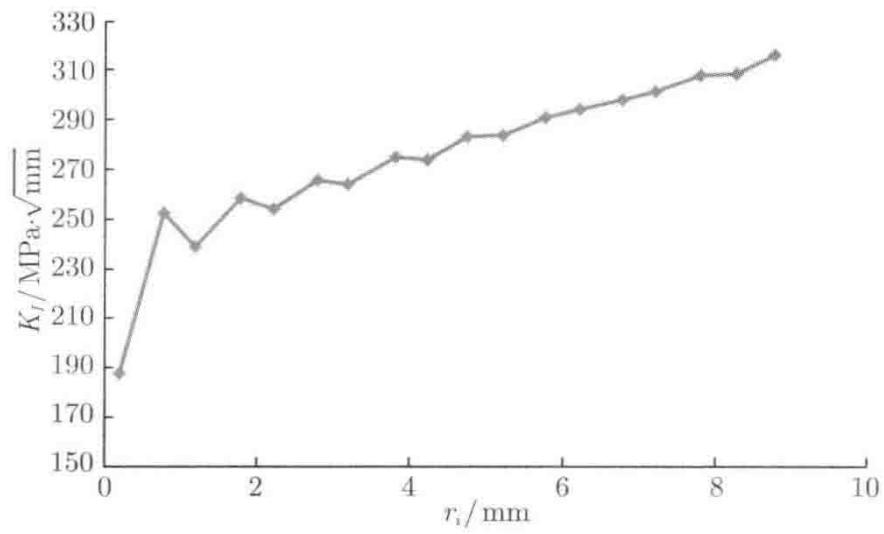

<details>
<summary>line</summary>

| r_i / mm | K_j / MPa·√mm |
| -------- | ------------- |
| 0        | 185           |
| 1        | 250           |
| 2        | 235           |
| 3        | 260           |
| 4        | 270           |
| 5        | 275           |
| 6        | 285           |
| 7        | 290           |
| 8        | 300           |
| 9        | 310           |
| 10       | 315           |
</details>

图 18-4 基于应力外推法计算应力强度因子

基于以上分析可以看到应用应力的外推法主要有以下两个局限性：

(1) 靠近裂纹尖端处的数据反而是引起误差的主要来源，而在断裂分析中又恰恰应该更多关注裂纹尖端，因此逻辑上有悖论；  
(2) 如何剔除引起误差的数据以及剔除多少数据应具体情况具体分析, 因此其具有不确定性。

# 2. 基于节点位移的外推法

在绝大多数商业有限元软件中，位移是求解的基本变量，而应力是通过应变和位移联系起来的，是次要变量，所以应力的精度比位移低，因此另外一种方法就是直接用位移来计算应力强度因子。图 18-5 为裂纹尖端位移云图，位移分量数值如图 18-6 所示。

根据应力强度因子计算公式

$$
K _ {I} \approx \frac {\sum r _ {i} \sum r _ {i} K _ {I i} - \sum r _ {i} ^ {2} \sum K _ {I i}}{(\sum r _ {i}) ^ {2} - N \sum r _ {i} ^ {2}} = 2 3 3. 1 (\mathrm{MPa} \cdot \sqrt {\mathrm{mm}})
$$

与理论解析解

$$
K _ {I} = 2 4 3. 6 (\mathrm{MPa} \cdot \sqrt {\mathrm{mm}})
$$

相比，相对误差为 $-4.3\%$ 。与应力外推法相比（相对误差为 $-6.8\%$ ），计算精度确实有所改善。

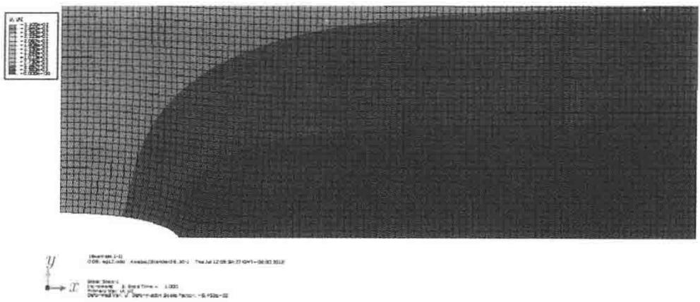

<details>
<summary>text_image</summary>

6.0K
Barrow 1-2
038. ap12.000 Analog/Standard 4.0-1 The Jul 12 09:27 QH1=56.02 03.8
X
Bar: Steel
X: maximum & Max Time = 1.000
M: max time / d
D: Max Time / D: Max Time / Max Time = -0.452e-12
</details>

图 18-5 裂纹尖端附近位移云图

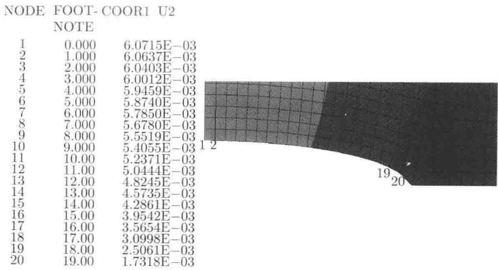

<details>
<summary>heatmap</summary>

| NODE | FOOT- COOR1 U2 NOTE | Value |
|---|---|---|
| 1 | 0.000 | 6.0715E-03 |
| 2 | 1.000 | 6.0637E-03 |
| 3 | 2.000 | 6.0403E-03 |
| 4 | 3.000 | 6.0012E-03 |
| 5 | 4.000 | 5.9459E-03 |
| 6 | 5.000 | 5.8740E-03 |
| 7 | 6.000 | 5.7850E-03 |
| 8 | 7.000 | 5.6780E-03 |
| 9 | 8.000 | 5.5519E-03 |
| 10 | 9.000 | 5.4055E-03 |
| 11 | 10.00 | 5.2371E-03 |
| 12 | 11.00 | 5.0444E-03 |
| 13 | 12.00 | 4.8245E-03 |
| 14 | 13.00 | 4.5735E-03 |
| 15 | 14.00 | 4.2861E-03 |
| 16 | 15.00 | 3.9542E-03 |
| 17 | 16.00 | 3.5654E-03 |
| 18 | 17.00 | 3.0998E-03 |
| 19 | 18.00 | 2.5061E-03 |
| 20 | 19.00 | 1.7318E-03 |
</details>

图 18-6 裂纹后端节点位移分量

将 $(r_i, K_{Ii})$ 的数据对作图，该曲线表面接近裂纹尖端的时候，和应力外推法类似，也不满足线性假设，如图18-7所示。

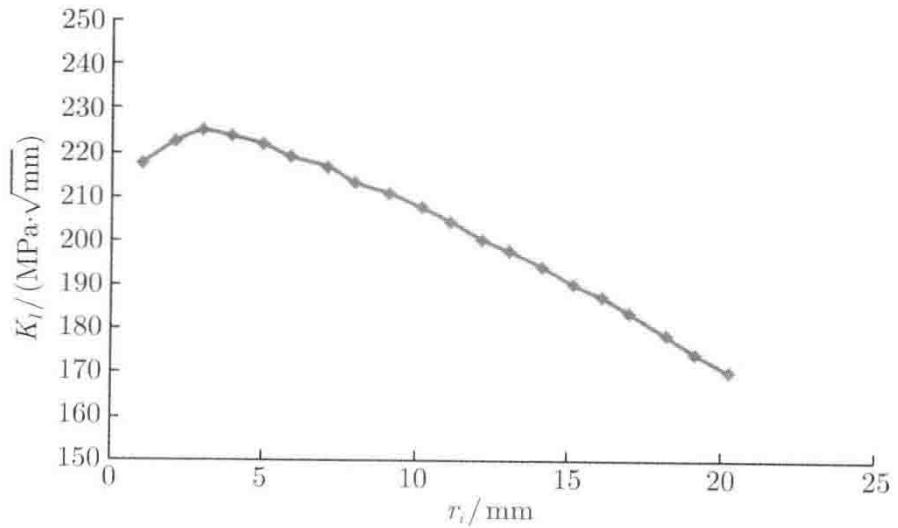

<details>
<summary>line</summary>

| r_i / mm | K_i / (MPa·√mm) |
| -------- | --------------- |
| 0        | 218             |
| 1        | 222             |
| 2        | 225             |
| 3        | 226             |
| 4        | 225             |
| 5        | 224             |
| 6        | 222             |
| 7        | 220             |
| 8        | 218             |
| 9        | 216             |
| 10       | 214             |
| 11       | 212             |
| 12       | 210             |
| 13       | 208             |
| 14       | 206             |
| 15       | 204             |
| 16       | 202             |
| 17       | 200             |
| 18       | 198             |
| 19       | 196             |
| 20       | 194             |
| 21       | 192             |
| 22       | 190             |
| 23       | 188             |
| 24       | 186             |
| 25       | 184             |
</details>

图 18-7 基于位移的外推法计算应力强度因子

上述两个具体算例清晰表明，用本例中采用的常规网格并不能很好地表征裂纹尖端的信息。如果使用较粗糙的网格，计算精度就将快速下降，对此引入奇异单元和折叠单元，将它们放置在裂纹尖端，其他区域则采用常规网格，从而能极大地减少网格数量，同时保证计算精度。

# 18.3.3 $J$ 积分与等效积分区域法

J 积分是一个处理非线性断裂问题的断裂参数，这个参数的引入基于能量守恒的概念，对裂纹尖端应力奇异性的依赖程度相对较弱，并不需要对裂纹尖端处的单元进行特殊的处理。应用等效积分区域法对 J 积分进行数值计算，通过散度定理，用裂纹尖端附近一个区域内来代替积分回路进行 J 积分的计算。J 积分围绕裂纹尖端的封闭积分区域如图 18-8 所示。

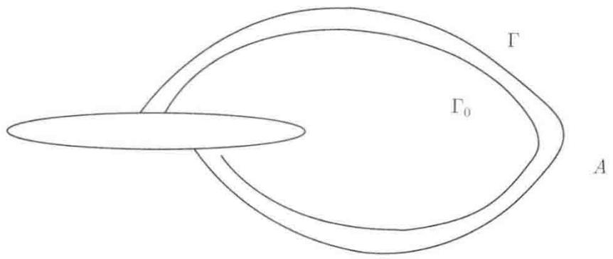

<details>
<summary>text_image</summary>

Γ
Γ₀
A
</details>

图 18-8 围绕裂纹尖端的封闭积分区域

针对二维问题可具体地展开成

$$
J = \int_ {A} \left[ \left(\sigma_ {x x} \frac {\partial u}{\partial x} + \tau_ {x y} \frac {\partial v}{\partial x} - \omega\right) \frac {\partial q}{\partial x} + \left(\tau_ {x y} \frac {\partial u}{\partial x} + \sigma_ {y y} \frac {\partial v}{\partial x}\right) \frac {\partial q}{\partial y} \right] \mathrm{d} A \tag {18-7}
$$

进行计算时，应当首先确定积分区域 A。函数 $q(x,y)$ 只是一个数学上的处理，这使得积分表达式更便于采用数值计算方法。在积分区域的所有节点上，函数 $q(x,y)$ 都必须有确定的值。J 积分区域法计算方法覆盖积分区域内所有的单元，就可以得到对应积分路径下的 J 积分。通过编写 Matlab 程序，程序代码如图 18-9 所示。

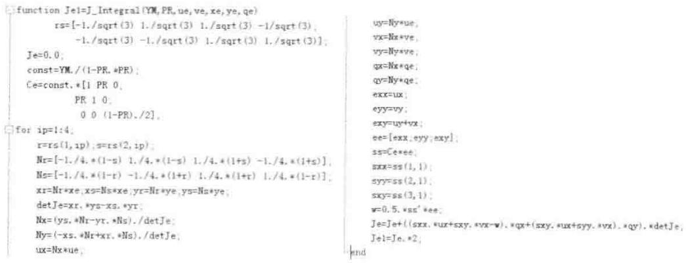  
图 18-9 Matlab 计算程序

应用有限元商业软件，输出如下节点集合的节点坐标和节点位移，如图 18-10 和图 18-11 所示。

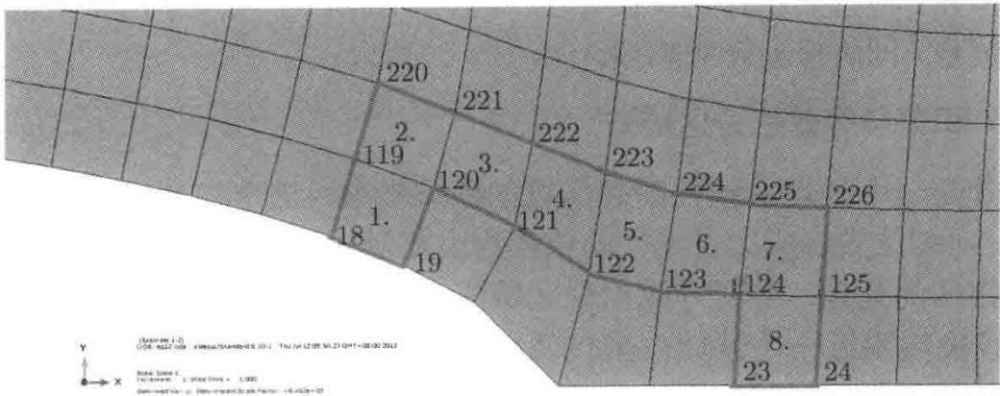

<details>
<summary>heatmap</summary>

| Row | Column | Value |
|---|---|---|
| 1 | 1 | 220 |
| 1 | 2 | 221 |
| 1 | 3 | 222 |
| 1 | 4 | 223 |
| 1 | 5 | 224 |
| 1 | 6 | 225 |
| 1 | 7 | 226 |
| 1 | 8 | 227 |
| 1 | 9 | 228 |
| 1 | 10 | 229 |
| 2 | 1 | 220 |
| 2 | 2 | 119 |
| 2 | 3 | 120 |
| 2 | 4 | 3 |
| 2 | 5 | 4 |
| 2 | 6 | 5 |
| 2 | 7 | 6 |
| 2 | 8 | 7 |
| 2 | 9 | 8 |
| 2 | 10 | 9 |
| 3 | 1 | 18 |
| 3 | 2 | 19 |
| 3 | 3 | 19 |
| 3 | 4 | 19 |
| 3 | 5 | 19 |
| 3 | 6 | 19 |
| 3 | 7 | 19 |
| 3 | 8 | 19 |
| 3 | 9 | 19 |
| 3 | 10 | 19 |
| 4 | 1 | 19 |
Y
State: Time = (1 hour time + 1.000)
Date: Date = (Time=0.000) (Time=0.000) (Time=0.000) (Time=0.000) (Time=0.000) (Time=0.000) (Time=0.000) (Time=0.000) (Time=0.000) (Time=0.000) (Time=0.000) (Time=0.000) Y
X
[Data not extractable as follows in the table above]
</details>

图18-10 等效积分区域

<table><tr><td>NODE</td><td>FOOT- NOTE</td><td>COOR1</td><td>COOR2</td><td>U1</td><td>U2</td></tr><tr><td>18</td><td></td><td>17.00</td><td>0.000</td><td>-2.6224E-03</td><td>3.0998E-03</td></tr><tr><td>19</td><td></td><td>18.00</td><td>0.000</td><td>-2.7748E-03</td><td>2.5061E-03</td></tr><tr><td>23</td><td></td><td>22.00</td><td>0.000</td><td>-2.3639E-03</td><td>0.000</td></tr><tr><td>24</td><td></td><td>23.00</td><td>0.000</td><td>-2.2885E-03</td><td>0.000</td></tr><tr><td>119</td><td></td><td>17.00</td><td>1.000</td><td>-2.12222E-3</td><td>3.1309E-03</td></tr><tr><td>120</td><td></td><td>18.00</td><td>1.000</td><td>-2.1475E-03</td><td>2.5440E-03</td></tr><tr><td>121</td><td></td><td>19.00</td><td>1.000</td><td>-2.0871E-03</td><td>1.7081E-03</td></tr><tr><td>122</td><td></td><td>20.00</td><td>1.000</td><td>-2.1583E-03</td><td>7.7282E-04</td></tr><tr><td>123</td><td></td><td>21.00</td><td>1.000</td><td>-2.2880E-03</td><td>3.7576E-04</td></tr><tr><td>124</td><td></td><td>22.00</td><td>1.000</td><td>-2.2680E-03</td><td>2.9873E-04</td></tr><tr><td>125</td><td></td><td>23.00</td><td>1.000</td><td>-2.2320E-03</td><td>2.5998E-04</td></tr><tr><td>220</td><td></td><td>17.00</td><td>2.000</td><td>-1.7141E-03</td><td>3.1578E-03</td></tr><tr><td>221</td><td></td><td>18.00</td><td>2.000</td><td>-1.7128E-03</td><td>2.5800E-03</td></tr><tr><td>222</td><td></td><td>19.00</td><td>2.000</td><td>-1.7367E-03</td><td>1.9017E-03</td></tr><tr><td>223</td><td></td><td>20.00</td><td>2.000</td><td>-1.8302E-03</td><td>1.2600E-03</td></tr><tr><td>224</td><td></td><td>21.00</td><td>2.000</td><td>-1.9602E-03</td><td>8.3592E-04</td></tr><tr><td>225</td><td></td><td>22.00</td><td>2.000</td><td>-2.0542E-03</td><td>6.3274E-04</td></tr><tr><td>226</td><td></td><td>23.00</td><td>2.000</td><td>-2.0903E-03</td><td>5.4093E-04</td></tr></table>

图 18-11 ABAQUS 输出的等效积分区域的节点坐标和位移

等效积分区域的子域⑧由节点 23,24,125,124 组成，其对应的 ABAQUS 输出结果见表 18-2。

表 18-2 等效积分子域⑧的 ABAQUS 输出结果

<table><tr><td>NODE ID</td><td>COOR1/mm</td><td>COOR2/mm</td><td>U1/mm</td><td>U2/mm</td></tr><tr><td>23</td><td>22.00</td><td>0.000</td><td> $- {2.3639} \times {10}^{-3}$ </td><td>0.000</td></tr><tr><td>24</td><td>23.00</td><td>0.000</td><td> $- {2.2885} \times {10}^{-3}$ </td><td>0.000</td></tr><tr><td>125</td><td>24.00</td><td>1.000</td><td> $- {2.2320} \times {10}^{-3}$ </td><td> ${2.5998} \times {10}^{-4}$ </td></tr><tr><td>124</td><td>25.00</td><td>1.000</td><td> $- {2.2680} \times {10}^{-3}$ </td><td> ${2.9873} \times {10}^{-4}$ </td></tr></table>

根据以上 Matlab 的数据，子域⑧计算结果为 0.0169。

同样，对其他 7 个子域重复进行上述计算，分别得到各子域的计算结果，再将 8 个子域中所得计算结果相加，即得到 J 积分的值为 0.2929N/mm，其与解析解 $(G = 0.2968\mathrm{N/mm})$ 的相对误差为 -1.3%。

由此可以看出 J 积分有较好的精度, 无需对裂纹尖端的单元进行特殊处理, 但它的计算过程相对烦琐和复杂, 因此用其分析裂纹扩展问题并不方便。

# 18.3.4 应变能释放率与虚拟裂纹法

与 J 积分相比，能量释放率的计算过程非常简单，且新计算结果对网格尺寸不敏感，在计算精度和计算效率之间达到了很好的平衡，因而受到工程师的广泛欢迎。目前广泛应用的有限元分析方法即为虚拟裂纹闭合法，其基本假设是虚拟裂纹尖端后面的张开位移和实际裂纹尖端后面的张开位移近似相等。故虚拟裂纹闭合法用来计算裂纹尖端的能量释放率为

$$
G = G _ {\mathrm{I}} + G _ {\mathrm{II}} \approx \frac {F _ {y _ {1}} \Delta v _ {3 , 4}}{2 B \Delta a} + \frac {F _ {x 1} \Delta u _ {3 , 4}}{2 B \Delta a} \tag {18-8}
$$

虚拟裂纹闭合法的示意图如图 18-12 所示，其计算结果如图 18-13 所示。

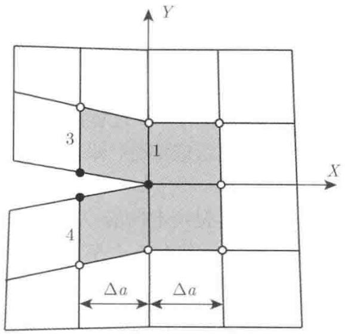

<details>
<summary>text_image</summary>

Y
3
1
X
4
Δa
Δa
</details>

图 18-12 虚拟裂纹闭合法计算应变能释放

<table><tr><td>ELEMENT FOOT- NOTE</td><td>NODE</td><td>NFORC1</td><td>NFORC2</td><td></td></tr><tr><td>20</td><td>20</td><td>-3.936</td><td>-1.716</td><td></td></tr><tr><td>20</td><td>21</td><td>-44.19</td><td>85.80</td><td></td></tr><tr><td>20</td><td>122</td><td>13.61</td><td>-37.67</td><td></td></tr><tr><td>20</td><td>121</td><td>34.51</td><td>-46.41</td><td rowspan="3">NODE FOOT- U2
NOTE</td></tr><tr><td>21</td><td>21</td><td>44.19</td><td>83.40</td></tr><tr><td>21</td><td>22</td><td>-27.61</td><td>47.18</td></tr><tr><td>21</td><td>123</td><td>-24.81</td><td>-63.76</td><td rowspan="2">20 1.7318E-03</td></tr><tr><td>21</td><td>122</td><td>8.227</td><td>-66.82</td></tr></table>

图 18-13 ABAQUS 输出裂纹尖端的节点和张开位移

从本例可知裂纹尖端处的节点力

$$
F _ {y} = 8 5. 8 0 + 8 3. 4 0 = 1 6 9. 2 (\mathrm{N})
$$

裂纹尖端后面的张开位移为

$$
\Delta v = 2 \times 0. 0 0 1 7 3 1 8 = 0. 0 0 3 4 6 3 6 (\mathrm{mm})
$$

利用虚拟裂纹闭合法求出能量释放率

$$
G _ {1} = \frac {1 6 9 . 2 \times 0 . 0 0 3 4 6 3 6}{2 \times 1 . 0 \times 1 . 0} = 0. 2 9 3 0 (\mathrm{N/mm})
$$

因此，能量释放率 $G = G_{I} + G_{II} = 0.2930 \, N/mm$ ，其与解析解 $(G = 0.2967 \, \text{N/mm})$ 的相对误差为 -1.2%。

# 18.4 哑节点断裂单元

# 18.4.1 线状裂纹的哑节点断裂单元

根据 18.3 节的介绍，讨论了与三个基本断裂参数相关的数值计算方法，基本做法是对有限元分析的结果进行后处理，以得到所需要的断裂参数。这些方法的计算过程或繁或简，但都是在得到有限元结果之后再进行的，与有限元分析是相对独立的。哑节点断裂单元，可将断裂参数的计算过程镶嵌到断裂单元中，使得断裂参数的计算成为有限元分析的一个有机组成部分，即有限元分析结束时，断裂参数也就同时得到了。

考虑一个二维线状裂纹，假设其裂纹走向沿 X 方向，哑节点断裂单元的定义及其节点编号如图 18-14 所示，该单元共有 5 个节点。使用这种单元时，节点 1 和节点 2 对应于裂纹尖端，节点 3 和节点 4 在裂纹尖端的后面，节点 5 在裂纹尖端的前面。单元包含 2 组节点：顶部节点（节点 1、节点 3 和节点 5）和底部节点（节点 2 和节点 4）。在实际应用时，节点 1 和节点 2、节点 3 和节点 4 的坐标分别是重合的，因此图中的间距其实是不存在的。由于单元具有 5 个节点，因此在有限元中单元所具有的完整的节点位移矢量如图 18-15 所示。

$$
U = \{U _ {1}, U _ {2}, U _ {3}, U _ {4}, U _ {5}, U _ {6}, U _ {7}, U _ {8}, U _ {9}, U _ {1 0} \} ^ {\mathrm{T}} \tag {18-9}
$$

为了计算裂纹尖端处的节点力，在节点 1 和节点 2 之间放置有特殊刚度的弹簧，取断裂单元中参与刚度矩阵的位移矢量仅为 $\{U_{1}, U_{2}, U_{3}, U_{4}\}^{T}$ ，于是裂纹尖端的节点力

$$
F _ {x} = K _ {x} (U _ {1} - U _ {3}), F _ {y} = K _ {y} (U _ {2} - U _ {4}) \tag {18-10}
$$

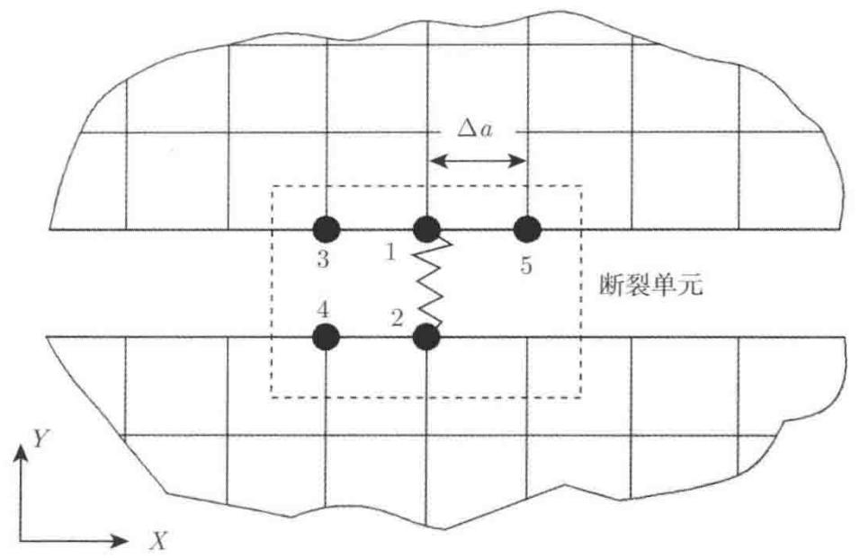

<details>
<summary>text_image</summary>

Δa
3 1 5
断裂单元
4 2
Y
X
</details>

图 18-14 哑节点断裂单元的定义及其节点编号

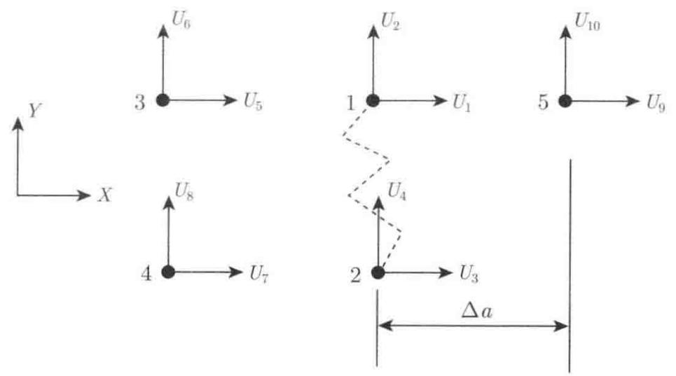

<details>
<summary>text_image</summary>

Y
X
U6
3 → U5
U2
1 → U1
U10
5 → U9
U8
4 → U7
U4
2 → U3
Δa
</details>

图 18-15 断裂单元的位移矢量

节点 3、节点 4 和节点 5 的引入仅仅是被用来从有限元分析结果中提取相关信息, 进而计算裂纹尖端后面的张开位移和裂纹尖端前面的虚拟裂纹扩展量, 它们对单元的刚度矩阵并没有贡献, 因此这类节点被称为“哑节点”。哑节点的引入是此断裂单元和常规单元的区别所在, 节点 3 和节点 4 可以用来计算裂纹尖端后面的张开位移:

$$
\Delta u = U _ {5} - U _ {7}, \Delta v = U _ {6} - U _ {8} \tag {18-11}
$$

裂纹虚拟扩展量是节点1和节点5之间沿 $X$ 方向的距离

$$
\Delta a = | X _ {5} - X _ {1} | \tag {18-12}
$$

能量释放率为

$$
G _ {\mathrm{I}} \frac {F _ {y} \Delta v}{2 B \Delta a}, G _ {\mathrm{II}} = \frac {F _ {x} \Delta u}{2 B \Delta a} \tag {18-13}
$$

其中，B 为裂纹体的厚度。

根据哑节点的定义方式及虚拟裂纹闭合法计算能量释放率的方法，应用有限元分析软件可分析断裂力学问题，如图 18-16 和图 18-17 所示。

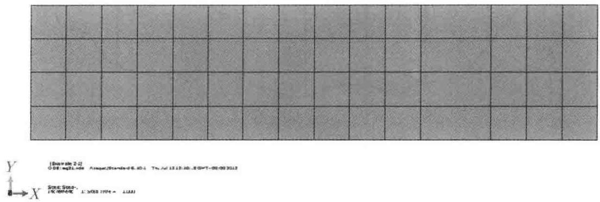

<details>
<summary>text_image</summary>

Y
O DE: eq2L-ide A##gcr/Standard 6.40.1 To, Jul 13.12.30..E#PT-08.00.2013
X
So#c S###-
INC ####C : L#GSS H## = L##
</details>

图 18-16 有限元分析模型

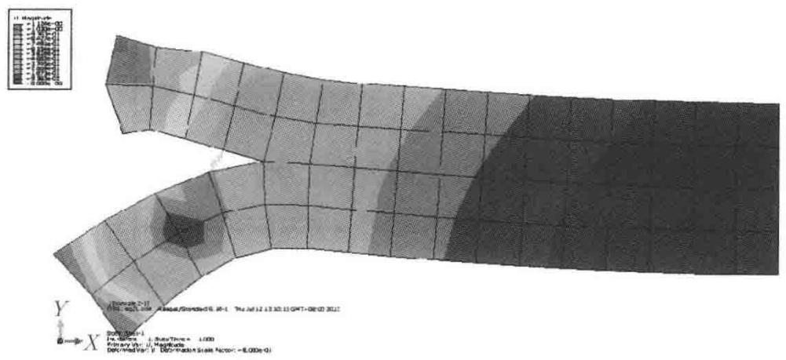

<details>
<summary>text_image</summary>

11 Meters
0.1 (Dec-20)
0.2 (Feb-21)
0.3 (Mar-22)
0.4 (Apr-23)
0.5 (May-24)
0.6 (Jun-25)
0.7 (Jul-26)
0.8 (Aug-27)
0.9 (Sep-28)
1.0 (Oct-29)
1.1 (Nov-30)
1.2 (Dec-31)
1.3 (Jan-32)
1.4 (Feb-33)
1.5 (Mar-34)
1.6 (Apr-35)
1.7 (May-36)
1.8 (Jun-37)
1.9 (Jul-38)
2.0 (Aug-39)
2.1 (Sep-40)
2.2 (Oct-41)
2.3 (Nov-42)
2.4 (Dec-43)
2.5 (Jan-44)
2.6 (Feb-45)
2.7 (Mar-46)
2.8 (Apr-47)
2.9 (May-48)
3.0 (Jun-49)
3.1 (Jul-50)
3.2 (Aug-51)
3.3 (Sep-52)
3.4 (Oct-53)
3.5 (Nov-54)
3.6 (Dec-55)
3.7 (Jan-56)
3.8 (Feb-57)
3.9 (Mar-58)
4.0 (Apr-59)
4.1 (May-60)
4.2 (Jun-61)
4.3 (Jul-62)
4.4 (Aug-63)
4.5 (Sep-64)
4.6 (Oct-65)
4.7 (Nov-66)
4.8 (Dec-67)
4.9 (Jan-68)
5.0 (Feb-69)
5.1 (Mar-70)
5.2 (Apr-71)
5.3 (May-72)
5.4 (Jun-73)
5.5 (Jul-74)
5.6 (Aug-75)
5.7 (Sep-76)
5.8 (Oct-77)
5.9 (Nov-78)
6.0 (Dec-79)
</details>

图 18-17 哑节点单元模拟的特殊刚度弹簧应力云图

平面内任意线状裂纹的断裂单元，如图 18-18 所示，可考虑位于 $(x, y)$ 平面内的倾斜裂纹，虚拟裂纹扩展量是主节点 1 和哑节点 5 之间的距离：

$$
\Delta a = \sqrt {(x _ {5} - x _ {1}) ^ {2} + (y _ {5} - y _ {1}) ^ {2}} \tag {18-14}
$$

其中， $(x_{1},y_{1})$ 和 $(x_{5},y_{5})$ 分别为节点 1 和节点 5 在整体坐标系 $(x,y)$ 下的坐标。如果它们在每个增量步中都通过位移来更新，那么裂纹的方向也将更新，这在分析大变形问题时很有用。

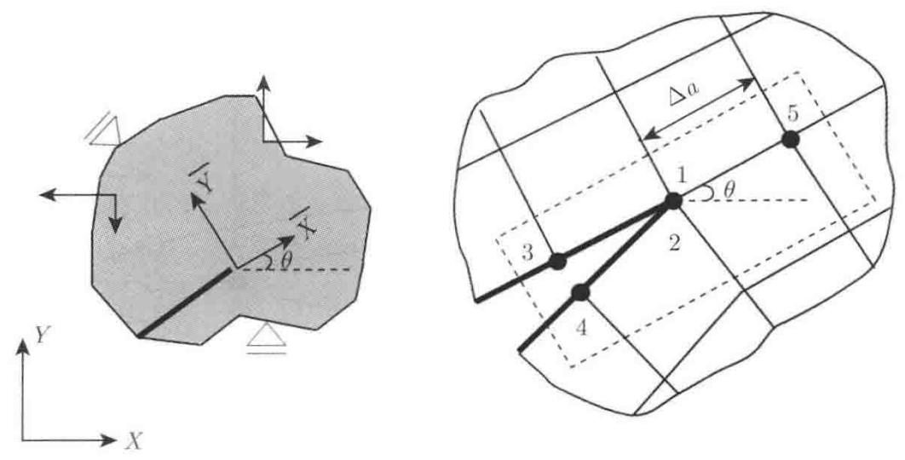

<details>
<summary>text_image</summary>

Diagram illustrating 3D coordinate system and its projection with labeled points and angles
</details>

图 18-18 平面内任意线状裂纹的哑节点断裂单元

为了分离断裂模式（Ⅰ型和Ⅱ型），应变能释放率必须在裂纹尖端处的局部坐标系下计算 $(\bar{X},\bar{Y})$ ，X轴和 $\bar{X}$ 轴之间的夹角为

$$
\cos \theta = \frac {x _ {5} - x _ {1}}{\Delta a}, \sin \theta = \frac {y _ {5} - y _ {1}}{\Delta a} \tag {18-15}
$$

此时，通过简单的矢量投影关系，节点力和张开位移在局部坐标系下表示为

$$
\bar {F} _ {x} = F _ {x} \cos \theta + F _ {y} \sin \theta \tag {18-16}
$$

$$
\bar {F} _ {y} = - F _ {x} \sin \theta + F _ {y} \cos \theta
$$

$$
\Delta \bar {u} = \Delta u \cos \theta + \Delta v \sin \theta \tag {18-17}
$$

$$
\Delta \bar {v} = - \Delta u \sin \theta + \Delta v \cos \theta
$$

应变能释放率近似表示为裂纹尖端的节点力和裂纹尖端后面的张开位移的乘积:

$$
G _ {\mathrm{I}} = \frac {\bar {F} _ {l} \Delta \bar {v}}{2 B \Delta a}, G _ {\mathrm{II}} = \frac {\bar {F} _ {l} \Delta \bar {u}}{2 B \Delta a} \tag {18-18}
$$

其中，B 为列裂纹体的厚度。

# 18.4.2 面状裂纹的哑节点断裂单元

在工程结构件中，当裂纹足够长时（相对于结构件的尺寸而言），通常可以忽略裂纹前沿的具体形貌，将其简化为线状裂纹。不过在具体实践中，也有一些裂纹是不能进行上述简化的，例如压力容器壁内的缺陷、复合材料层合板中的分层等。总之，当裂纹的主导尺寸相近时，不宜对裂纹做简化处理。

面状裂纹由裂纹前沿而不只是一个点（线状裂纹的裂纹尖端）来描述，因而更加复杂，但是其虚拟裂纹闭合法的基本思路并没有变，如图 18-19 所示。

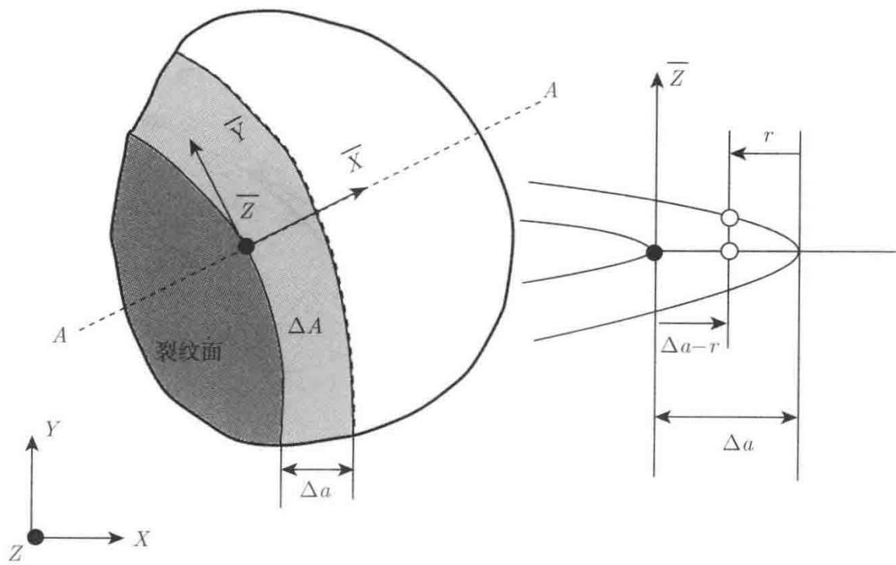

<details>
<summary>text_image</summary>

裂纹面
ΔA
Y
Z
X
A
Z
X
A
Δa
Y
X
Δa-r
r
Δa
</details>

图 18-19 面状裂纹的裂纹前沿及局部坐标系

面状裂纹的断裂单元，假定裂纹位于 $(X,Y)$ 平面内，且其局部的 $\bar{Z}$ 轴一致。这种断裂单元需要9个节点，只有位于裂纹尖端的节点1和节点2对单元的刚度矩阵产生影响。节点3和节点4用来计算裂纹张开位移。其他节点（节点5\~9）用来确定局部坐标系和计算虚拟裂纹扩展面积。该9节点单元的完整位移矢量如图18-20所示。

$$
U = \{U _ {1}, U _ {2}, \dots , U _ {2 7} \} ^ {\mathrm{T}} \tag {18-19}
$$

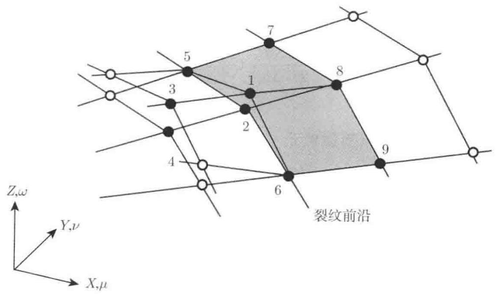

<details>
<summary>text_image</summary>

Z,ω
Y,ν
X,μ
5
3
1
2
4
6
7
8
9
裂纹前沿
</details>

图 18-20 9 节点的面状裂纹断裂单元

为了计算裂纹尖端处的节点力，在节点 1 和节点 2 之间放置强弹簧（这里指刚度取值很大的弹簧）。因此，参与刚度矩阵的位移矢量仅为

$$
U = \left\{U _ {1}, U _ {2}, U _ {3}, U _ {4}, U _ {5}, U _ {6} \right\} ^ {\mathrm{T}} \tag {18-20}
$$

设 $K_{x}, K_{y}, K_{z}$ 分别为对应于总体坐标系 $(X, Y, Z)$ 的弹簧刚度系数，则三个总体坐标方向上的节点力分量为

$$
F _ {x} = K _ {x} \left(U _ {1} - U _ {2}\right), \quad F _ {y} = K _ {y} \left(U _ {2} - U _ {5}\right), \quad F _ {z} = K _ {z} \left(U _ {3} - U _ {6}\right) \tag {18-21}
$$

显然，单元的刚度矩阵为

$$
\left[ \begin{array}{l} F _ {1} \\ F _ {2} \\ F _ {3} \\ F _ {4} \\ F _ {5} \\ F _ {6} \end{array} \right] = \left[ \begin{array}{c c c c c c} K _ {X} & & & - K _ {X} & & \\ & K _ {Y} & & & - K _ {Y} & \\ & & K _ {Z} & & & - K _ {Z} \\ - K _ {X} & & & K _ {X} & & \\ & - K _ {Y} & & & K _ {Y} & \\ & & - K _ {Z} & & & K _ {Z} \end{array} \right] \left[ \begin{array}{l} U _ {1} \\ U _ {2} \\ U _ {3} \\ U _ {4} \\ U _ {5} \\ U _ {6} \end{array} \right] \tag {18-22}
$$

节点 3 和节点 4 是哑节点，它们可用来计算裂纹张开位移如下：

$$
\Delta u = U _ {1} - U _ {1 0}, \quad \Delta v = U _ {8} - U _ {1 1}, \quad \Delta w = U _ {9} - U _ {1 2} \tag {18-23}
$$

节点 5\~9 也是哑节点，它们可以用来计算虚拟裂纹扩展面积 $\Delta A$ 。可以利用它们的节点坐标和高斯积分法求出面积。目前，所求得的节点力和张开位移都是总体坐标系下的值，为了将它们投射到局部坐标系，必须先创建好局部坐标。应用节点 1 和节点 8 来计算倾斜角，即

$$
\cos \theta = \frac {x _ {8} - x _ {1}}{\Delta a}, \quad \sin \theta = \frac {y _ {8} - y _ {1}}{\Delta a} \tag {18-24}
$$

式中，

$$
\Delta a = \sqrt {(x _ {8} - x _ {1}) ^ {2} + (y _ {8} - y _ {1}) ^ {2}} \tag {18-25}
$$

然后，很容易得到在局部坐标系中的节点力

$$
\begin{array}{l} \bar {F} _ {X} = F _ {X} \cos \theta + F _ {Y} \sin \theta \\ \bar {\bar {F}} _ {X} = F _ {X} \cos \theta + F _ {Y} \sin \theta \end{array} \tag {18-26}
$$

$$
\bar {F} _ {Y} = - F _ {X} \cos \theta + F _ {Y} \sin \theta
$$

和张开位移

$$
\begin{array}{l} \Delta \bar {u} = \Delta u \cos \theta + \Delta v \sin \theta \\ \Delta \bar {v} = \Delta v \sin \theta + \Delta v \cos \theta \end{array} \tag {18-27}
$$

$$
\Delta \bar {v} = - \Delta u \sin \theta + \Delta v \cos \theta
$$

故最终计算能量释放率

$$
G _ {\mathrm{I}} \approx \frac {F _ {Z} \Delta w}{2 \Delta A}, \quad G _ {\mathrm{II}} \approx \frac {\bar {F} _ {x} \Delta \bar {u}}{2 \Delta A}, \quad G _ {\mathrm{III}} \approx \frac {\bar {F} _ {y} \Delta \bar {v}}{2 \Delta A} \tag {18-28}
$$

# 18.5 复合材料层间应力

在经典层合板理论中，只考虑层合板的平面内应力 $\sigma_{x}$ ， $\sigma_{y}$ 和 $\tau_{xy}$ ，即假设存在平面应力状态。而实际上应力状态还具有 $\sigma_{z}$ ， $\sigma_{xz}$ 和 $\tau_{yz}$ 这些层间应力，它们存在于相邻层之间的表面，而且通常在层界面上最大。高的层间应力是复合材料特有的破坏机理之一的根源。对称层合板中受拉伸载荷 $N_{x}$ 时，实际存在三维的应力状态。由于层间应力作用，在层合板自由边界出现脱层和随后脱层扩大，层合板在 z 方向分离。此外在经典层合板理论中所指的 $\sigma_{y}$ 和 $\tau_{xy}$ 在层合板边缘不可能存在。

图 18-21 为对称角铺层层合板几何形状和应力示意图，图 18-22 为自由边界脱层示意图。

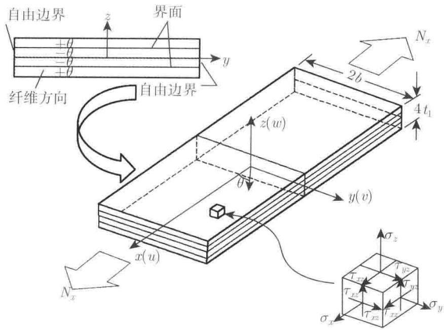

<details>
<summary>text_image</summary>

自由边界
z
界面
y
+θ
-θ
-θ
+θ
纤维方向
自由边界
Nx
2b
4t1
z(w)
θ
y(v)
x(u)
Nx
σz
τyz
τxz
τyz
τxz
σx
σy
</details>

图 18-21 对称角铺层层合板几何形状和应力

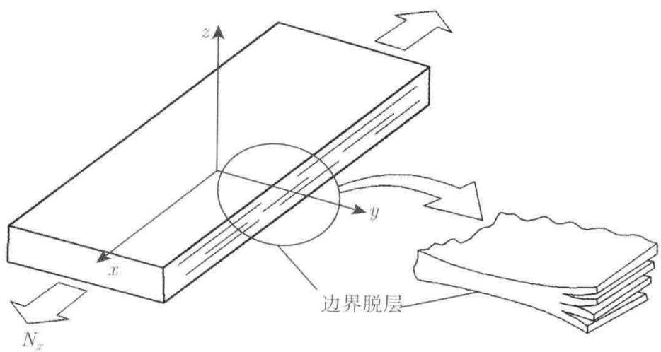

<details>
<summary>text_image</summary>

z
y
x
边界脱层
Nx
</details>

图 18-22 自由边界脱层

(1) 在层合板自由边界 (层合板边界或孔边) 层间剪应力和 (或) 层间正应力很高 (可能是奇点), 从而造成这些区域内有脱胶现象;  
(2) 如改变铺层顺序, 即使不改变每层的方向, 也将使层合板强度不同, 这是层合板边界附近的层间正应力 $\sigma_{z}$ 改变的结果。

本书考虑 4 层角铺设层合板的顶层一半的自由体图，在远离自由边界的 x-z 平面左手侧，可由经典层合板理论预定 $\tau_{xy}$ 。相反，图中自由边界 ABCD 面不存在 $\tau_{xy}$ 。此外，x 方向的前面和背面的 $\tau_{xy}$ 在 AB 和 CD 线处应趋于零。为了实现 x 方向力的平衡，应当有一应力代替 ABCD 面上不存在的 $\tau_{xy}$ ，这只可能是自由体的顶层的底面应存在 $\tau_{xz}$ 。为了对 z 轴的力矩平衡， $\tau_{xz}$ 应当很高，因为它存在于接近自由边界处，如图 18-23 所示。

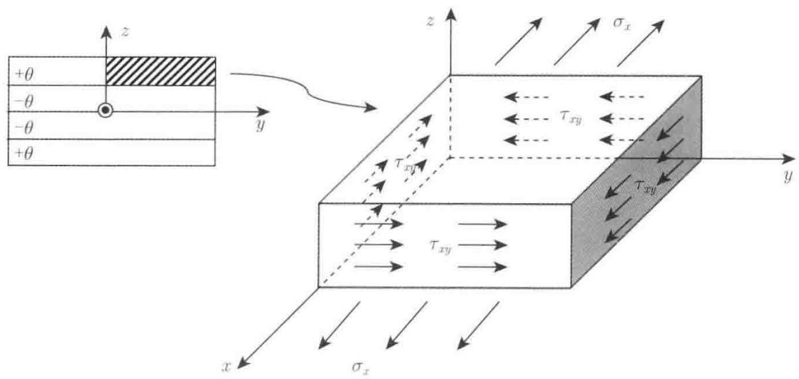

<details>
<summary>text_image</summary>

+θ
-θ
-θ
+θ
z
y
z
σₓ
τₓᵧ
τₓᵧ
τₓᵧ
x
σₓ
</details>

图 18-23 对称角铺设层合板自由体图

通常，对于层合板模型的层间分析，只需依据层合板 $y - z$ 截面（为任意值）的四分之一区域，来研究四层对称于中面角铺设层合板，宽度为 $2b$ ，厚度 $t = 4t_{1}$ ，有限元模型中取 $t_1 = 1\mathrm{mm}$ 。分析与计算模型如图18-24和图18-25所示。

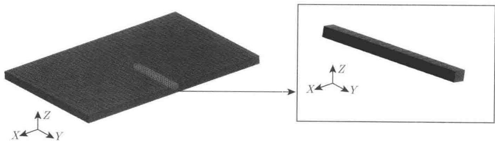

<details>
<summary>natural_image</summary>

3D diagram showing a rectangular block with X, Y, Z coordinate axes and an inset view of a rectangular prism (no text or symbols)
</details>

图 18-24 有限元模型与分析对象

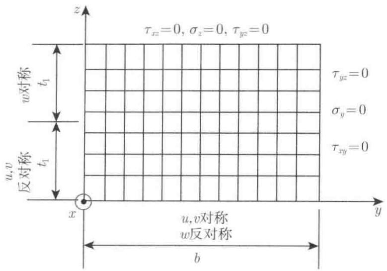

<details>
<summary>text_image</summary>

z
τxz=0, σz=0, τyz=0
τyz=0
σy=0
τxy=0
w对称
t1
u,v
反对称
t1
x
y
u,v对称
w反对称
b
</details>

图 18-25 理论分析对象

# 18.5.1 层间界面的剪应力分布

由于在层合板自由边界端上不存在 $\tau_{xy}$ ，为了实现 x 方向力的平衡，应当有一应力代替 ABCD 面上不存在的 $\tau_{xy}$ ，这只可能是自由体的顶层底面应存在 $\tau_{yz}$ 。为了对 z 轴的力矩平衡， $\tau_{yz}$ 应当很高，因为它只存在于接近自由边界处，如图 18-26 所示。

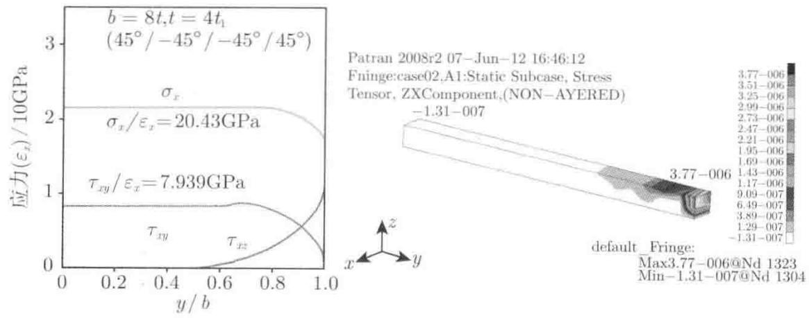

<details>
<summary>line</summary>

| y / b | σ_x / ε_x = 20.43 GPa | τ_xy / ε_x = 7.939 GPa |
|-------|------------------------|-------------------------|
| 0.0   | 2.0                    | 0.0                     |
| 0.2   | 2.0                    | 0.0                     |
| 0.4   | 2.0                    | 0.0                     |
| 0.6   | 2.0                    | 0.0                     |
| 0.8   | 2.0                    | 0.0                     |
| 1.0   | 2.0                    | 0.0                     |
</details>

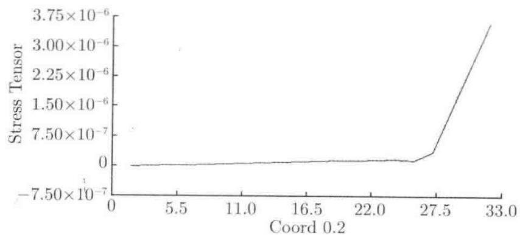

<details>
<summary>line</summary>

| Coord 0.2 | Stress Tensor     |
| --------- | ----------------- |
| 0         | 0                 |
| 5.5       | 0                 |
| 11.0      | 0                 |
| 16.5      | 0                 |
| 22.0      | 0                 |
| 27.5      | 0                 |
| 33.0      | 3.75×10⁻⁶         |
</details>

图18-26 有限元计算得到的沿 $y$ 方向的层间剪应力 $\tau_{xz}$ 分布

有限元计算的层间剪应力分布可以看出，层间 $\tau_{xz}$ 应力的分布范围大约为层合板厚度 t，因为层间应力可看作边缘效应，预计在离边界一个板厚度采用经典层合板理论是准确的。有限元的体模型也可以验证这一结论。

# 18.5.2 层合板厚度的层间剪应力分布

对于 y 向任意段沿厚度方向的任何曲线， $\tau_{xz}$ 极大值总发生在层间截面上（即 $z/t_{1}=1$ ）。在 z=0 处即层合板的中面上， $\tau_{xz}=0$ （图 18-27）。

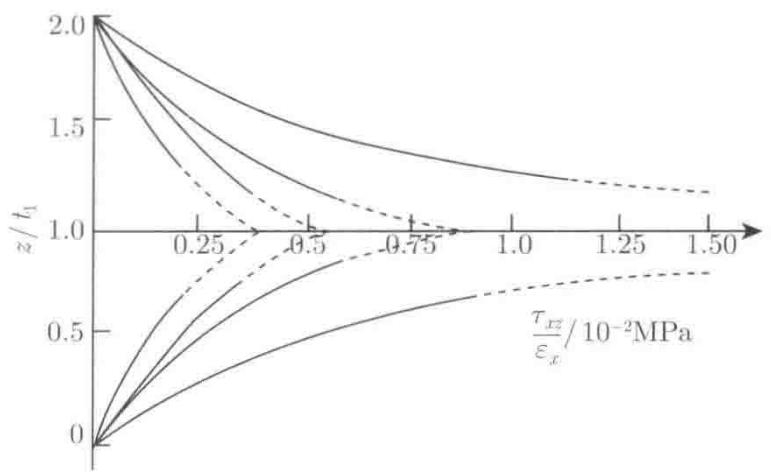

<details>
<summary>line</summary>

| z/t₁ | τₓz/εₓ / 10⁻²MPa (Curve 1) | τₓz/εₓ / 10⁻²MPa (Curve 2) | τₓz/εₓ / 10⁻²MPa (Curve 3) | τₓz/εₓ / 10⁻²MPa (Curve 4) | τₓz/εₓ / 10⁻²MPa (Curve 5) |
|------|-----------------------------|-----------------------------|-----------------------------|-----------------------------|-----------------------------|
| 0.0  | 2.0                         | 2.0                         | 2.0                         | 2.0                         | 2.0                         |
| 0.25 | ~1.8                        | ~1.6                        | ~1.4                        | ~1.2                        | ~0.8                        |
| 0.5  | ~1.6                        | ~1.4                        | ~1.2                        | ~1.0                        | ~0.6                        |
| 0.75 | ~1.4                        | ~1.2                        | ~1.0                        | ~0.9                        | ~0.5                        |
| 1.0  | ~1.2                        | ~1.0                        | ~0.9                        | ~0.8                        | ~0.4                        |
| 1.25 | ~1.0                        | ~0.9                        | ~0.8                        | ~0.7                        | ~0.3                        |
| 1.50 | ~0.8                        | ~0.8                        | ~0.7                        | ~0.6                        | ~0.2                        |
</details>

图 18-27 沿层合板厚度的层间剪应力分布

# 18.5.3 层间正应力

经典层合板理论中存在的 $\sigma_{y}$ 在自由体的左半部存在，但是作为右部边界，自由体图有自由边界 ABCD，因此在 ABCD 无 $\sigma_{y}$ 。为满足力在 y 方向的平衡，y 方向只有应力分量 $\tau_{yz}$ ，而且 $\tau_{yz}$ 应存在于靠近自由边界的顶层的底面。为了对 x 轴的力矩平衡，顺时针方向的力偶应提供左手面上 $\sigma_{y}$ 的力矩平衡，能提供这一力矩的只有应力 $\sigma_{z}$ 。但是 $\sigma_{z}$ 应服从 z 方向力的平衡要求而无合力。 $\sigma_{z}$ 趋于零而在自由边界可能趋向无限大。显然高的拉伸 $\sigma_{z}$ 值像高的 $\tau_{yz}$ 值一样会造成自由边界脱层。如图 18-28 所示，根据层间正应力 $\sigma_{z}$ 的分布可以看出， $\sigma_{z}$ 沿着 y/b 的分布存在拉伸与压缩之间的转变。

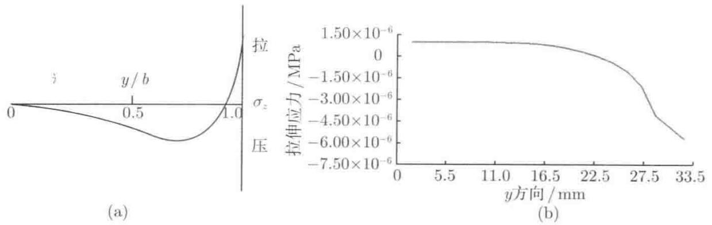

<details>
<summary>line</summary>

| y方向/mm | 拉伸应力/MPa |
| -------- | ------------ |
| 0        | 1.50×10⁻⁶    |
| 5.5      | 1.50×10⁻⁶    |
| 11.0     | 1.50×10⁻⁶    |
| 16.5     | 1.50×10⁻⁶    |
| 22.5     | 1.50×10⁻⁶    |
| 27.5     | -3.00×10⁻⁶   |
| 33.5     | -6.00×10⁻⁶   |
</details>

图18-28 层间正应力 $\sigma_z$ 与 $y / b$ 关系

# 18.5.4 层合板表面的轴向位移分布

利用云纹法来检测对称角铺设层合板在轴向拉力作用下的表面位移。云纹法是由于两组栅线的相对位移引起的云纹现象而得名。根据云纹法的结果，显示层合板表面的轴向位移是 S 形分布，在层合板自由边界局部层板厚度附近轴向位移增大，如图 18-29 所示。

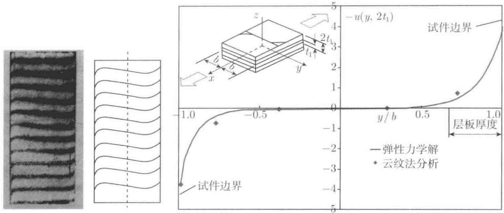

<details>
<summary>text_image</summary>

试件边界
- u(y, 2t₁)
层板厚度
-1.0
-0.5
y/b
0.5
1.0
试件边界
-弹性力学解
云纹法分析
</details>

图 18-29 层合板表面的轴向位移分布

有限元体模型计算得到的层合板表面的轴向位置分布, 不能出现 S 形的位移分布图, 表明采用体单元分层的有限元模型, 针对层合板表面的特性分析是不准确的。

层间应力的意义与由经典层合板理论确定的层合板刚度、强度和寿命有关，即除了接近自由边界的很窄的边界层以外，经典层合板理论确定的应力在大部分层合板中是精确的。这样层合板刚度受总体而非局部的应力影响，所以层合板刚度实质上不受层间应力影响。另一方面局部的高应力控制破坏过程，而较低的总体应力是不重要的，这样层合板的强度和寿命受层间应力控制。

# 18.6 叶片的层间失效与断裂破坏

风力机叶片运行环境复杂，层间失效和断裂破坏的现象时有发生，应在叶片设计、生产、运输等多重产业链中合理控制，降低层间及断裂失效的破坏，如图 18-30 为叶片层间失效破坏示意图。

一般情况下，层合板的自由边界应采用脱层的抑制方法来控制层间失效，如“边界增强”和“边界改变”等都是有效降低层合板边界层间应力的方法。“边界增强”是用边界带帽、缝补等方法增强自由边界，边界带帽和缝补可抵抗层间正应力和剪应力；“边界改变”不引起增强的自由边界性质改变，如层片终止、切口。切口虽然好处不明显，但是使接近自由边界的应力场混乱，可以减小脱层效应。

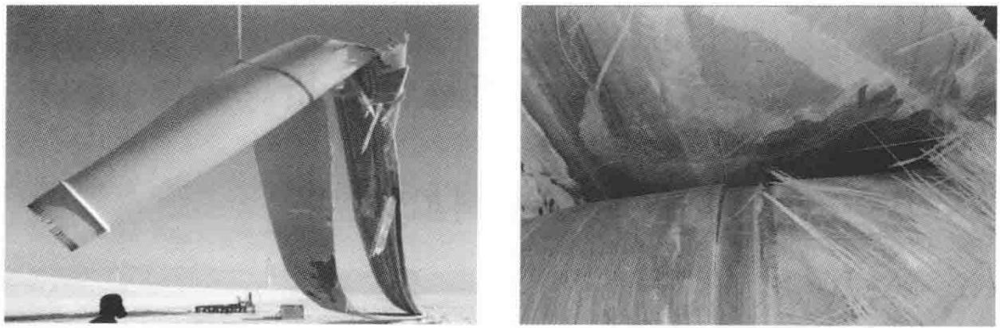  
图 18-30 叶片的层间失效

# 第 19 章 可靠性分析

# 19.1 复合材料损伤容限

# 19.1.1 概述

损伤容限提供了结构在含有一定损伤（或缺陷）时能够承受设计载荷并能实现使用功能的能力，因此损伤容限最终关心，在损伤能被定期维护检测出（或出现故障）并达到修理之前，又或是达到最终寿命之前，损伤结构具有适当的剩余强度和刚度，来保证结构持续安全的使用。损伤的范围和可检性决定了需承受的载荷水平，可以说安全性是损伤容限的主要目标 $^{[42]}$ 。

复合材料对拉伸和压缩载荷有其独特的损伤敏感性。复合材料层合板中的纤维起着抑制拉伸裂纹扩展的作用，只有在较高的应力水平下才会出现裂纹扩展，故在复合材料中使得纤维相继断裂的穿透厚度的损伤扩展通常并不是一个简单的问题。在研究脱胶、分层或冲击损伤的影响时，由于局部失稳会促使载荷增大，此时所关心的载荷就变成压缩和剪切载荷。复合材料是脆性材料，一旦出现损伤和裂纹将会迅速扩展。为保证不会出现重复载荷下的损伤扩展，通常在确定设计值时需要有足够的裕度，同时在设计和验证时避免可能的损伤扩展，即采用损伤“无扩展方法”，证明在通常的设计应力水平下，给出结构对疲劳不敏感的结论。

复合材料结构的耐久性/损伤容限设计方法与金属结构有较大区别，其主要设计要求和步骤有以下几方面。

# 1) 结构选材

除了考虑基本性能和工艺性外，根据部件的耐久性/损伤容限要求，着重考虑材料体系的韧性性能（如冲击后压缩强度等）和最高使用温度等环境因素。

# 2) 确定设计许用值

采用蒙皮的典型铺层和厚度，通过试验确定设计许用值。其中重点是典型铺层层合板试样的冲击后压缩破坏应变、开孔拉伸破坏应变和连接许用值，同时还应考虑湿热影响和分散性，甚至必要时还应给出有关的疲劳性能。

# 3) 结构细节设计

着重考虑结构形式对抗冲击损伤性能的影响，避免结构受到面外载荷，表面铺层要耐冲击损伤。值得一提的是，叶片前缘和蒙皮结构应注意冲击损伤带来的维护问题。

4) 典型结构件和全尺寸结构件的耐久性/损伤容限试验验证

由简单到复杂, 通过积木式设计验证试验方法, 分层试验证实所选择的关键部位结构形式、工艺方法和制造水平能满足规定的耐久性/损伤容限要求。

5) 全尺寸部件的耐久性/损伤容限试验验证

试验证实结构部件满足耐久性/损伤容限的要求。

# 19.1.2 损伤容限三大要素

# 1. 允许损伤

允许损伤包括两个方面的工作：

(1) 在限制载荷下结构能允许的最大损伤 (包括多处损伤), 即临界损伤;  
(2) 在临界损伤下结构能承受的剩余强度。

此两项工作可由剩余强度分析完成。

# 2. 损伤增长

所谓损伤增长是指在使用载荷下，损伤从初始缺陷扩展至最大允许损伤之间的时间间隔（即裂纹扩展寿命）。该工作由裂纹扩展分析完成。

# 3. 损伤检测

利用规定的检测和维护手段，对损伤进行检测和评定，保证及时发现、预防或修复由疲劳、环境或意外损伤引起的损伤，以维持叶片在运行周期内的适应性。此项为检测大纲的内容。

从保证结构完整性的角度出发，可将结构分为重要结构和次要结构两类。而从保证结构安全性的角度来说，重要结构又包括主要结构件和其他结构两类，见表19-1。

表 19-1 损伤容限结构分类

<table><tr><td colspan="2">结构类型</td><td>设计原则</td><td>确保安全的技术</td><td>控制方法</td><td>实例</td></tr><tr><td rowspan="4">重要结构</td><td rowspan="3">主要结构件</td><td>安全寿命</td><td>保守的疲劳寿命</td><td>疲劳</td><td>叶根连接及叶片黏接部位</td></tr><tr><td rowspan="2">损伤容限</td><td>损伤明显或功能失效</td><td>剩余强度</td><td>叶片承力梁结构</td></tr><tr><td>通过预定的有计划检查来检出损伤</td><td>剩余刚度;裂纹扩展;检查大纲</td><td>除以上两种情况以外的所有主要结构件</td></tr><tr><td>其他结构(非主要结构件)</td><td></td><td>一般的维护</td><td>某些情况下可保守的列入上一类</td><td>叶根盖板、配重腔等功能件</td></tr><tr><td>次要结构</td><td></td><td></td><td>可安全避免运行失效</td><td>继续安全运行</td><td>叶片保护层</td></tr></table>

# 19.2 可靠性

结构可靠性分析与设计在结构安全性的评定中能够大放异彩，这是因为结构可靠性理论能合理地处理结构工程设计中的不确定性，而其他方法不能做到这一点。往往这些不确定性也正是工程结构安全性评定的难点。现实中几乎所有设计变量都带有一定的随机性，在结构可靠性分析中，可按其来源将它们分为三类：

(1) 物理性不确定性。在结构强度分析中, 有很多物理量, 如载荷、材料性能、几何尺寸等均存在着分散性, 通常称这类与物理量直接相关的不确定性为物理性不确定性, 大多数物理性不确定性都与时间有关。

(2) 统计性不确定性。对变量的分布特征的分析与分布函数的确定离不开统计和推断，但是任何一个统计与推断均是以变量的样本作为依据进行的，而任意一个样本的容量均不可能是无穷大，所以任何一种参数统计方法都带有不确定性，这种由于样本容量有限而产生的不确定性叫做统计性不确定性。

(3) 模型性不确定性。结构设计与分析首先要建立输入量与输出量之间关系的模型，这一模型通常是按力学原理或经验建立的，同一实际问题可以建立不同的模型。模型可能是确定性的，也可能是随机性的。由于现实世界的复杂性，通常数学模型不可能是现实世界的完完全全的再现，对模型所作的建设和对复杂边界条件所作的简化都会使模型包含有不确定性。在很多情况下，模型不确定性对结构可靠性有很大的影响，是不容忽略的。

技术性能、经济指标和可靠性是产品质量的标志。而可靠性即系统或设备在规定的条件下，在规定的时间内，完成规定功能的能力，以可靠性度量；安全性即建立一种环境，使人们在这种环境下生活与工作感受到的危害或危险是已知的、清楚的，并且是控制在可接受的水平上，以安全度度量；风险性以风险值度量，它是事故发生概率和该事故的后果的乘积。图 19-1 为产品质量与可靠性流程图。

# 19.2.1 可靠性的技术基础

可靠性的技术基础包括：概率论与数理统计；材料、结构等物理学；故障物理；基础试验技术；环境试验技术。

可靠性分析中一般分为三种水平，每种水平应用不同的分析方法评估不同阶段的可靠性。

1) 半经验半概率法 —— 第Ⅰ水平法

对影响结构可靠度的某些参数做统计分析，然后结合经验给出一系列局部安全因子，对结构可靠性做出半定量的估计。

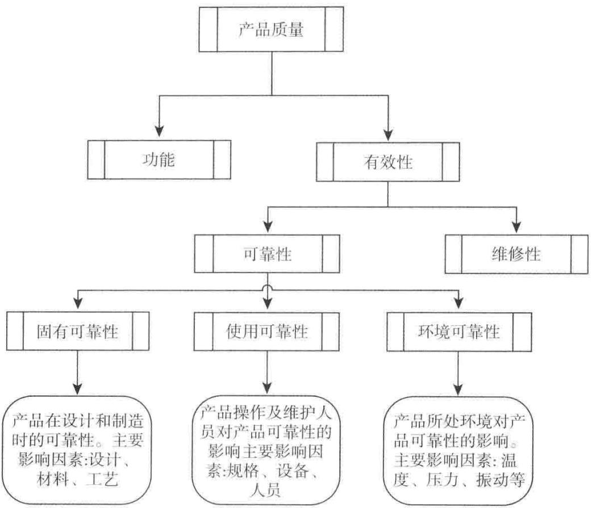

<details>
<summary>flowchart</summary>

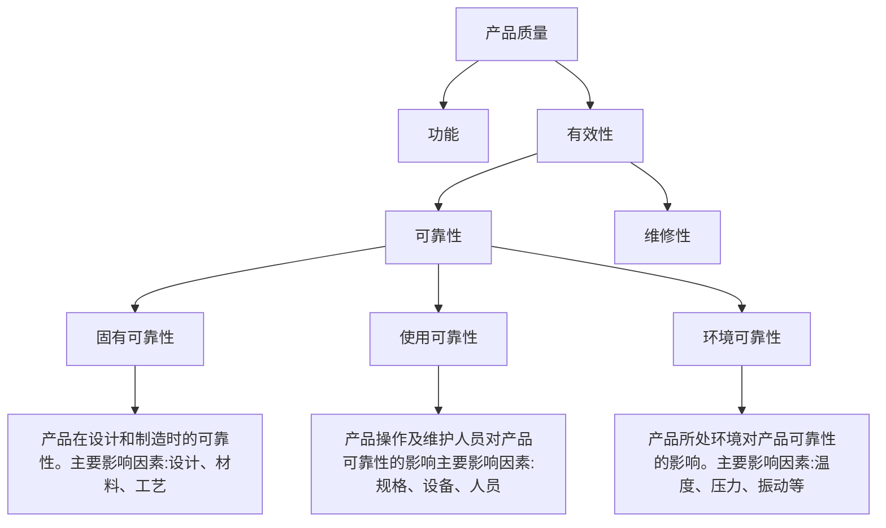
```mermaid
graph TD
    A["产品质量"] --> B["功能"]
    A --> C["有效性"]
    C --> D["可靠性"]
    C --> E["维修性"]
    D --> F["固有可靠性"]
    D --> G["使用可靠性"]
    D --> H["环境可靠性"]
    F --> I["产品在设计和制造时的可靠性。主要影响因素:设计、材料、工艺"]
    G --> J["产品操作及维护人员对产品可靠性的影响主要影响因素:规格、设备、人员"]
    H --> K["产品所处环境对产品可靠性的影响。主要影响因素:温度、压力、振动等"]
```
</details>

图 19-1 产品质量与可靠性

2) 近似概率法 —— 第Ⅱ水平法

对失效域做理想化的处理, 然后采用近似概率计算方法, 对结构可靠度做出近似的定量估计。

3) 全概率法 —— 第Ⅲ水平法

对各变量做全概率描述，用联合概率密度函数求解结构可靠度。

# 19.2.2 可靠性评价指标

可靠性分析中，用如下相关术语及可靠性评定指标：

(1) 失效概率 $F(t)$ ，结构的失效概率也称做破坏概率，它是结构在时刻 t 之前破坏的概率，即 $F(t)$ 是结构寿命 $\Gamma$ 不超过 t 的概率。  
(2) 可靠度 $R(t)$ ，可靠度也称做存活率，按定义 $R(t)$ 表示产品在规定的使用条件下，在规定的时间内，完成规定功能的概率。  
(3) 失效率 $\lambda(t)$ ，失效率亦称做故障率，产品在 t 时刻以前未发生破坏的条件下，在 t 时刻的条件破坏概率密度。  
(4) 可靠性寿命的尺度, 可用平均寿命来评价, 对发生故障就不能修理的零部件或系统而言, 平均寿命指从开始使用到发生故障的工作时间的期望值, 即为平均无故障时间。

(5) 维修度 $M(t)$ ，指可维修产品在规定的条件下和规定的时间内完成维修的概率。

(6) 有效度 $A(t)$ , 对可维修产品, 指在某时刻 $t$ 之前维持其功能的概率; 对不可修复产品, 有效度 $A(t)$ 即为可靠度 $R(t)$ 。

各可靠性指标不是相互独立的，图 19-2 给出各可靠性指标之间的关系。

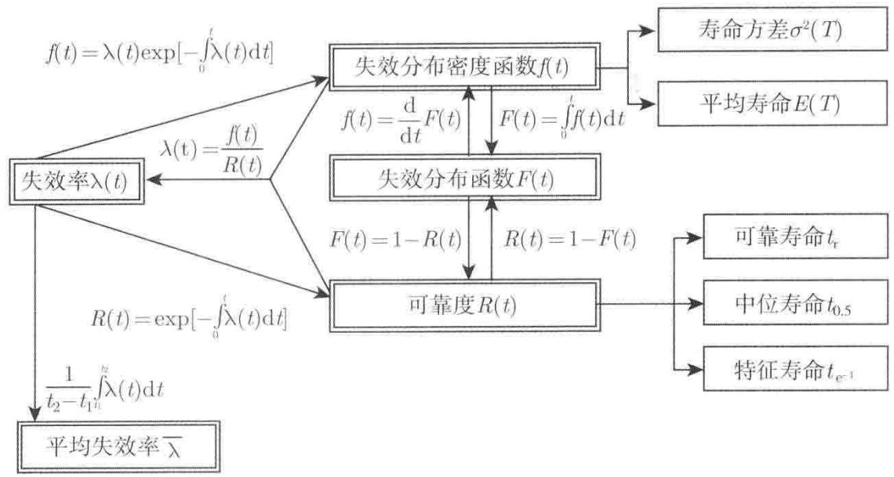

<details>
<summary>flowchart</summary>

```mermaid
graph TD
    A["失效率λ(t)"] --> B["f(t)=λ(t)exp[-∫₀^t λ(t)dt"]]
    A --> C["R(t)=exp[-∫₀^t λ(t)dt"]]
    A --> D["平均失效率λ̄"]
    B --> E["失效分布密度函数f(t)"]
    C --> F["失效分布函数F(t)"]
    D --> G["可靠度R(t)"]
    E --> H["寿命方差σ²(T)"]
    E --> I["平均寿命E(T)"]
    F --> J["可靠寿命t_r"]
    F --> K["中位寿命t_{0.5}"]
    F --> L["特征寿命t_{e⁻¹}"]
    G --> M["平均失效率τ̄"]
    G --> N["1/(t₂−t₁)^{n} ∫_n^n λ(t)dt"]
    E --> O["f(t)=d/dt F(t)"]
    E --> P["F(t)=∫₀^t f(t)dt"]
    F --> Q["F(t)=1-R(t)"]
    F --> R["R(t)=1-F(t)"]
```
</details>

图 19-2 可靠性指标之间的关系图

# 19.2.3 结构系统可靠性设计

结构系统的可靠性 $R_{s}$ 不仅取决于组成结构的元件的可靠性，还与结构的拓扑有关，结构系统可靠性分析的特点有：破坏模式众多；破坏模式之间高度相关；工程结构通常是非线性的。

系统设计的可靠性设计必须建立在可靠性优化的基础上，采用数值分析的方法，才能为工程设计服务。

在结构设计的方案设计阶段，精确计算各候选方案中结构体系的可靠度是十分困难和费时的，实际上也是非必要的。通常情况下，只需知道各方案的结构体系的可靠性的等级，以作为比较不同设计方案优劣的标准之一即可。结构体系的破坏可归结为两大类：

(1) 由于出现了超过设计载荷的非预期的过大载荷而导致结构体系的整体破坏, 如大地震、特大暴风雪等, 这一类破坏实际上是不可避免的;  
(2) 由于意外事件引起的结构体系内一部分元件的失效而导致的整个结构体系的破坏, 如疲劳、断裂、腐蚀、颤振等;

对第一类问题，通常以加一个统一的安全系数来处理；对第二类问题，人们认识到合理的解决途径是使结构具有一定的余度。

(1) 0 级结构余度。结构体系内任意一个元件的失效就会导致整个结构体系的破坏。  
(2) 1 级结构余度。结构体系内的一些次要元件失效后，残余结构仍具有承受大部分原设计载荷的能力。  
(3) 2 级结构余度。结构体系内的一个主要元件失效后，残余结构仍具有承受大部分原设计载荷的能力。

实践经验和历史事实证明，采用只具有0级结构余度的结构体系是不适当的，此结构体系没有抵抗任何意外事件发生的能力；而对大部分结构，采用2级结构余度又是不经济的，所以实际的工程结构通常采用1级结构余度。

# 第20章 叶片全尺寸测试

# 20.1 概述

对于风力机叶片本身结构性能测试来说，主要指叶片全尺寸结构测试，从叶片研发周期角度讲，还包括材料测试与构件测试。并且由于叶片复合材料各向异性的特性，不同于金属材料与标准构件，复合材料及其构件性能并没有具体标准规范规定，且性能受加工工艺影响，因此材料测试与构件测试并不能简单排除在设计流程之外。由于篇幅限制，本章节对材料测试与构件测试只做简单介绍，主要介绍叶片全尺寸结构测试。

# 20.2 材料测试与构件测试

# 1. 材料测试

复合材料性能是叶片结构设计师所关心的重要问题，而复合材料性能的稳定性是影响材料质量的最主要因素，由于组分材料的分散、制备工艺的不稳定性、材料供应商等因素导致性能分散性大，叶片设计之初需要考虑供应商等级、生产工艺等因素进行材料测试。

材料测试试件由测试材料加工成层合板，采用设计要求的树脂材料，试件与试验设备如图 20-1 所示。

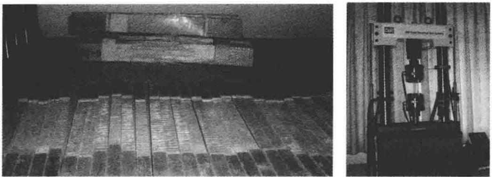

<details>
<summary>natural_image</summary>

Two black-and-white photos: one showing a tiled floor with a rectangular object, the other showing a mechanical testing machine (no visible text or symbols)
</details>

图20-1 试件与材料试验机

实际测试有不同类型试件与加载方法, 不同类型试件与方法各有优缺点, ASTM D 4762-04 中对适用于连续纤维增强聚合物基复合材料的 ASTM 标准 (和其他标准) 进行总结 [45]。

材料测试主要围绕物理性能与力学性能，力学性能测试方面目前主要为极限强度测试和疲劳强度测试，复合材料在不同应力比下疲劳性能差异大。由于疲劳测试费用昂贵，研发过程中较少对材料单独进行疲劳性能测试，国外“OPTIMAT BLADES”项目对复合材料疲劳性能进行了详细研究。

不同类型复合材料的不同测试项依据不同的测试标准，见表 20-1～表 20-3。

表 20-1 玻纤材料不同测试项目所用标准

<table><tr><td>项目</td><td>双轴布</td><td>三轴布</td></tr><tr><td>纤维体积含量</td><td>ISO 1172</td><td>ISO 1172</td></tr><tr><td>纤维质量分数</td><td>ISO 1172</td><td>ISO 1172</td></tr><tr><td>纤维方向弹性模量</td><td>ISO 527-5</td><td>ISO 527-4</td></tr><tr><td>纤维垂直方向弹性模量</td><td>ISO 527-5</td><td>ISO 527-4</td></tr><tr><td>剪切模量</td><td>ISO 14129</td><td>ASTM 7078</td></tr><tr><td>极限拉伸强度</td><td>ISO 527-5</td><td>ISO 527-4</td></tr><tr><td>极限压缩强度</td><td>ISO 14126</td><td>ISO 14126</td></tr><tr><td>极限剪切强度</td><td>ISO 14129</td><td>ASTM 7078</td></tr><tr><td>拉伸应变</td><td>ISO 527-5</td><td>ISO 527-4</td></tr><tr><td>压缩应变</td><td>ISO 14126</td><td>ISO 14126</td></tr></table>

表 20-2 泡沫测试所用标准

<table><tr><td>项目</td><td>泡沫</td></tr><tr><td>弹性模量</td><td>DIN 53421</td></tr><tr><td>剪切模量</td><td>ASTM C-273/DIN 53294</td></tr><tr><td>极限拉伸强度</td><td>ASTM D 1621</td></tr><tr><td>极限压缩强度</td><td>ASTM D 1621</td></tr><tr><td>极限剪切强度</td><td>ASTM C-273/DIN 53294</td></tr></table>

表 20-3 结构胶测试所用标准

<table><tr><td>项目</td><td>结构胶</td></tr><tr><td>负荷下变形温度</td><td>ISO 75-2</td></tr><tr><td>拉伸模量</td><td>ISO 527</td></tr><tr><td>拉伸强度</td><td>ISO 527</td></tr><tr><td>延伸率</td><td>ISO 527</td></tr><tr><td>拉伸搭接剪切强度</td><td>DIN 1465</td></tr><tr><td>弯曲强度</td><td>ISO 178</td></tr><tr><td>剥离强度</td><td>ISO 11339</td></tr></table>

# 2. 构件测试

目前叶片构件测试主要针对预制叶根螺栓，其他诸多构件测试并没有在行业内流行。针对预埋叶根螺栓，根据设计要求制作单个预埋螺栓构件进行加载测试，试件横截面及试件如图 20-2 所示。

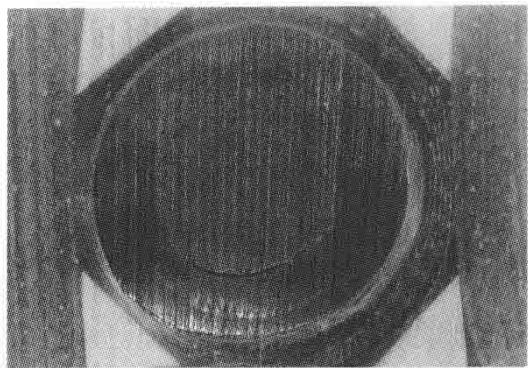

<details>
<summary>natural_image</summary>

Close-up of a circular mechanical component with textured surface and flanged edges (no visible text or symbols)
</details>

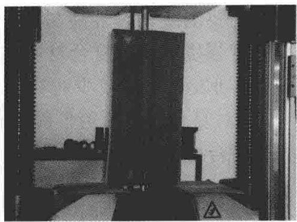

<details>
<summary>natural_image</summary>

Interior view of a mechanical testing setup with no visible text or symbols
</details>

图 20-2 预埋螺栓构件测试试件横截面与试件

# 20.3 叶片全尺寸测试简介

# 20.3.1 基本原则与相关标准规范

叶片全尺寸测试目的为验证叶片能满足设计规定的强度和使用寿命。考虑到环境因素、测试不确定度和制造差异性等影响因素，测试载荷应高于设计载荷。国内外对叶片全尺寸测试制定了相应标准规范指导叶片测试，涉及叶片全尺寸测试的标准规范有：

(1) IEC 61400-23 Wind turbine generator systems – Part 23: Full-scale structural testing of rotor blades;   
(2) Germanischer Lloyd: Guideline for the Certification of Wind Turbines and Guideline for the Certification of Offshore Wind Turbines;   
(3) DNV: ds-j102 Design and Manufacture of Wind Turbine Blades Offshore and Onshore Wind Turbines;   
(4) GB/T 25384 风力发电机组风轮叶片全尺寸结构试验。

# 20.3.2 测试项目与流程

所有新设计叶片需要测试，叶片测试需要验证以下叶片结构参数：质量与重心、刚度分布、挠度变形量、固有频率、极限强度和疲劳强度。归结起来就是下面三项测试。

(1) 质量和动态特性测试。质量、重心、一阶挥舞/摆振频率、二阶挥舞/摆振频率。对于扭转柔性 (扭转频率小于 5 倍同阶挥舞频率)，叶片需要测试一阶扭转频率[14]。  
(2) 静强度测试 (非破坏性)。通常进行以下 4 个方向: 最大/最小挥舞弯矩 (包含仿真时同一时刻的摆振弯矩)、最大/最小摆振弯矩 (包含仿真时同一时刻的挥舞弯矩)。如果扭转频率达到设计临界值, 需要进行扭转方向测试[47]。  
(3) 疲劳测试。挥舞方向和摆振方向。

静强度测试与疲劳测试均采用同一只测试叶片，叶片先需要测量质量和重心位置，然后测量固有频率，后续进行非破坏性静载测试，非破坏性静载测试后执行疲劳测试。建议疲劳测试完成后进行破坏性试验完成剩余强度测试[46]。实际是否进行破坏性试验根据设计方、制造方或采购方要求。

# 20.4 叶片数据与试验件要求

# 20.4.1 叶片数据

叶片测试可能是一个多方参与的项目，设计、制造、实验室并不一定来自于同一机构，尤其是出于叶片用户考虑还会有第三方评估机构介入，因此叶片测试初期明确叶片数据来源将是十分重要的。

测试叶片需要配有可追溯的设计和制造文档以及相应图纸说明材料。并且叶片本身具有唯一编码。叶片测试需要大量数据完整详细地描述叶片，以供制定测试计划。例如确保试验台能承担该尺寸叶片测试等。叶片数据分为外形与接口尺寸、叶片特性和材料数据。

# 1. 外形与接口尺寸

为了确定测试所需空间、设备及工装，需要叶片长度、叶根螺栓型式与布局、叶片翼型与气动布局，尤其是最大弦长及其所在截面位置。此外还需要有叶片各测试方向下的计算挠度。

# 2. 叶片特性

(1) 叶片结构设计细节。包括材料分布、构件起始终止位置、主要结构布局与特性、主要制造工艺说明等。  
(2) 叶片质量与动态特性。总质量、质量分布、质心、一阶挥舞/摆振频率、二阶挥舞/摆振频率、一阶扭转频率、刚度分布。  
(3) 截面信息。加载截面处翼型、弦长、扭角与剪切中心。

# 3. 材料数据

应给出叶片测试区域所用材料的响应强度、疲劳公式及弹性特征。对于疲劳测试来说，还应包含 S-N 曲线、应力比影响等。

# 20.4.2 样片要求

取第一批生产叶片中的某个叶片作为测试叶片，疲劳测试和静载测试采用同样的叶片。该测试叶片需要配有设计和制造文档，测试叶片不需要涂装胶衣。

测试叶片选择可以参考以下三点：第一个制造的样片；从生产叶片中随机抽样；生产记录历史和无损检测中较差情况的叶片。

叶片测试采用多点集中加载的方式进行加载。为了避免造成局部过载，建议在加载点范围的腹板进行加强。

# 20.5 试验台

# 20.5.1 加载方向

试验台差异主要在加载方向和加载方式上。加载方向主要有向上、向下和侧向三种，向下多用卷扬机加载（图 20-3），向上适合吊车（图 20-4）。向上或向下测试载荷需要考虑叶片自身重力影响，而侧向加载叶片自身重力对加载影响可以忽略。

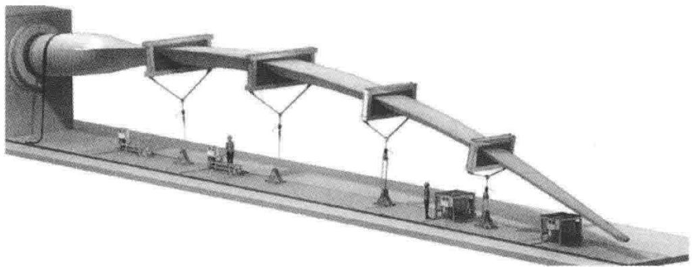

<details>
<summary>natural_image</summary>

Technical illustration of a conveyor system with workers and equipment (no text or symbols visible)
</details>

图 20-3 向下加载实验台示意图

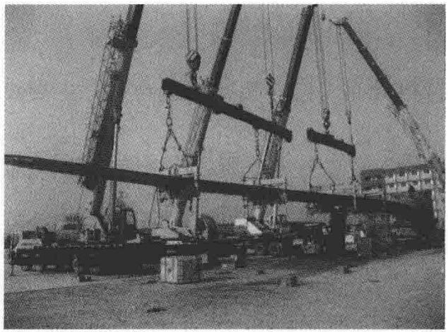

<details>
<summary>natural_image</summary>

Black-and-white photo of a construction site with multiple cranes lifting large beams of steel (no visible text or symbols)
</details>

(a) 吊车

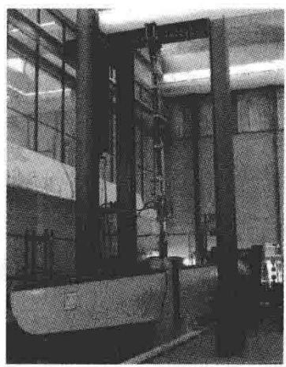

<details>
<summary>natural_image</summary>

Interior view of a large industrial or warehouse space with machinery and structural beams (no visible text or symbols)
</details>

(b) 液压   
图20-4 不同加载方式[48]

# 20.5.2 加载方式

叶片测试发展过程中存在很多加载方式，如静力试验中的分配梁加载和沙袋加载。目前常用加载形式为静力试验采用吊车/卷扬机、液压，而疲劳试验采用摆振块、液压。

# 1. 液压加载

液压加载适用于静力试验和疲劳试验，液压执行器安装在试验台与叶片上的夹具之间，通过载荷或位移来控制加载。液压加载适用于更多的试验条件，可采用不同控制方式。测试过程中可控制加载频率、载荷幅值、载荷序列、载荷分布以及加载点方向和数目，能实现多轴加载和施加变幅载荷。

液压加载的缺点：成本高，大尺寸、大载荷、高频率的叶片测试液压设备费用高昂。对于叶片测试需要大容量液压泵和多个液压执行器适应不同加载要求。全套设备需要能在测试期间承受数百万次的载荷循环。

# 2. 吊车/卷扬机

此类加载方式仅用于静力测试，对于位移较大且上部加载适合采用吊车或卷扬机，但吊车相对控制加载的速率较为困难。相比卷扬机可以安装在任何刚性支架或地面上，适用性更好。

# 3. 摆振块

摆振块用于叶片疲劳测试，通过旋转偏心轮产生循环载荷，调节变速装置到能产生测试所需响应的振动频率，产生测试所需等幅循环载荷。通过调整摆振块处静载可改变疲劳载荷的应力比。测试装置示意图如图 20-5 所示。

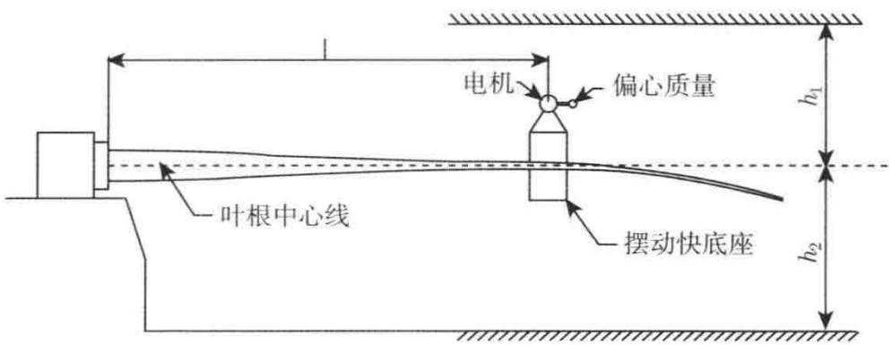

<details>
<summary>text_image</summary>

电机
偏心质量
叶根中心线
摆动快底座
h₁
h₂
</details>

图20-5 摆振块加载

# 20.5.3 其他设备与工装

# 1. 应变片与应变仪

用于疲劳测试中监测刚度变化，静力测试中记录极限载荷下测试应变用于与理论应变的对比验证。

应变片位置主要分叶片表面、腹板、叶根螺栓。叶片表面沿叶片展向在关心截面处布置应变片，通常选取前缘、尾缘、吸力面及压力面主梁区域，如图 20-6 所示；腹板处通常选择在所选截面中央，包括前缘腹板与尾缘腹板；螺栓选择特征方向处位置的螺栓，在螺杆处 $120^{\circ}$ 均布应变片，如图 20-7 所示。

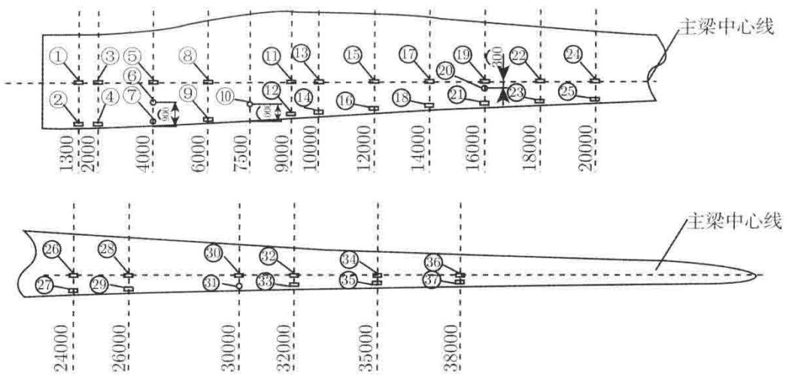

<details>
<summary>text_image</summary>

主梁中心线
①
②
③
④
⑤
⑥
⑦
⑧
⑨
⑩
⑪
⑫
⑬
⑭
⑮
⑯
⑰
⑱
⑲
⑳
㉑
㉒
㉓
㉔
㉕
㉖
㉗
㉘
㉙
㉚
㉛
㉜
㉝
㉞
㉟
㉳
㉴
㉵
㉶
2000
1300
4000
6000
7500
9000
10000
12000
14000
16000
18000
20000
24000
26000
30000
32000
35000
38000
</details>

图 20-6 叶片表面应变片布局示意图 (单位: mm)

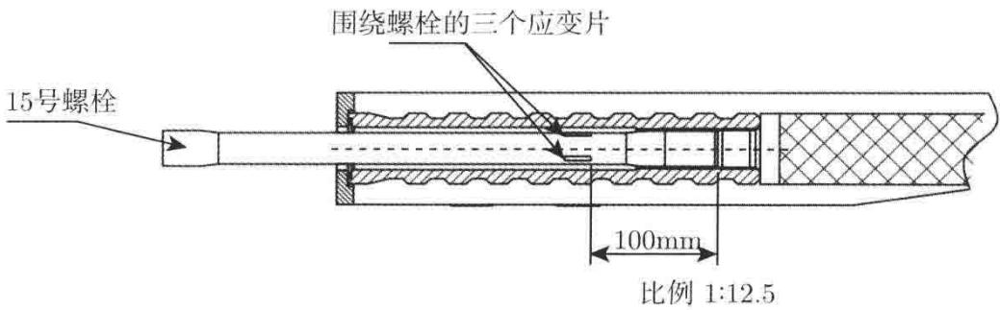

<details>
<summary>text_image</summary>

围绕螺栓的三个应变片
15号螺栓
100mm
比例 1:12.5
</details>

图 20-7 螺栓处应变片布置示意图

# 2. 转接盘

由于叶片根部螺栓布局未必与承力座螺栓布局一致，因此需要通过转接盘连接叶片与承力座，如图 20-8 所示。

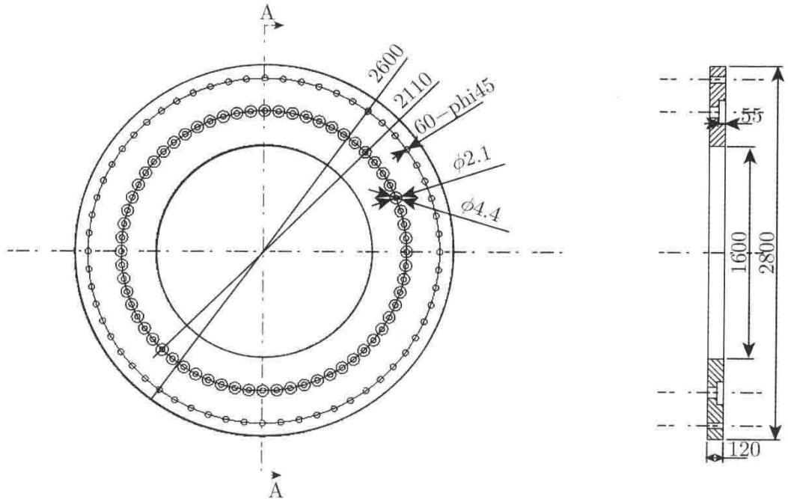

<details>
<summary>text_image</summary>

A
2600
2110
60-phi45
φ2.1
φ4.4
A
1600
2800
120
5
</details>

图 20-8 转接盘示意图 (单位: mm)

# 3.夹具

根据截面处外形加工而成, 保障载荷均匀加载在叶片表面, 为避免测试过程中产生不必要的扭矩, 截面剪心需在作用力轴线上。由于剪心在截面内部, 测试过程中难以直接根据剪心位置调整作用力方向, 为便于测试过程中作用力经过截面剪心, 建议给出各个测试方向下加载点与截面外轮廓指定点沿表面距离, 如图 20-9 所示, 可以在测试过程中更好地控制作用力方向。

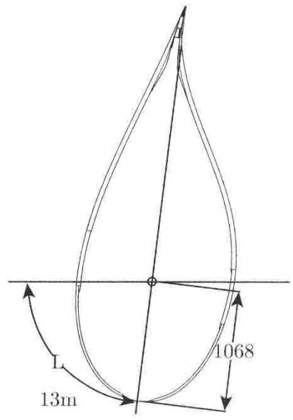

<details>
<summary>text_image</summary>

L
13m
1068
</details>

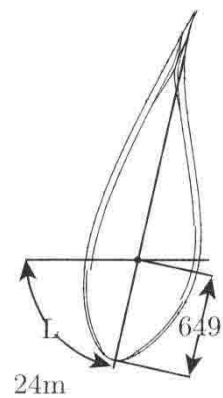

<details>
<summary>text_image</summary>

L
24m
649
</details>

<table><tr><td>截面位置</td><td>最大挥舞工况</td><td>最小挥舞工况</td><td>最大摆振工况</td><td>最小摆振工况</td></tr><tr><td>[-]</td><td>[mm]</td><td>[mm]</td><td>[mm]</td><td>[mm]</td></tr><tr><td>13m</td><td>-1308</td><td>1118</td><td>568</td><td>-2019</td></tr><tr><td>24m</td><td>-706</td><td>676</td><td>401</td><td>-1050</td></tr><tr><td>34m</td><td>-413</td><td>410</td><td>267</td><td>-614</td></tr><tr><td>46m</td><td>-258</td><td>258</td><td>200</td><td>-371</td></tr></table>

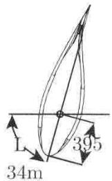

<details>
<summary>text_image</summary>

L
34m
395
</details>

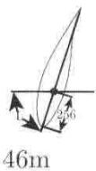  
图 20-9 测试过程中剪心位置确定方法示意图（单位：mm）

# 20.6 设计载荷与测试载荷

整个叶片采用设计载荷乘以 IEC 61400-23 规定的测试系数。测试载荷计算如下：

$$
F _ {\mathrm{test-u}} = F _ {\mathrm{du}} \times \gamma_ {\mathrm{nu}} \times \gamma_ {\mathrm{sfu}} \tag {20-1}
$$

$$
F _ {\text { test - f }} = F _ {\text { equivalent }} \times \gamma_ {\mathrm{nf}} \times \gamma_ {\mathrm{sf}} \times \gamma_ {\mathrm{ef}} \tag {20-2}
$$

其中， $F_{test}$ 为测试载荷； $F_{test-u}$ 为静载测试载荷； $F_{test-f}$ 为疲劳测试载荷； $F_{du}$ 为设计极限载荷； $F_{equivalent}$ 为根据设计载荷谱（需要考虑载荷局部安全系数）得出的等效疲劳载荷。等效疲劳载荷依据测试载荷循环次数，根据 IEC 61400-1 疲劳测试所用设计载荷局部安全系数取 1.0； $\gamma_{n}$ 为失效重要性系数，静载测试取 1.0，疲劳测试取 1.15； $\gamma_{s}$ 为叶片差异系数，均取 1.1，此系数根据叶片生产方法与失效概率增加或减小。系数减小需要根据多重案例评估； $\gamma_{ef}$ 为补偿疲劳公式中可能的误差，取 1.05。

GL 2010 测试要求中设计包络载荷乘以 1.1 的分散系数。由于测试在实验室条件下保证温度在 $20^{\circ}$ C 以上，温度影响系数为 1。如果实际测试温度过低，测试机构需要考虑温度影响，温度从 20 deg 到 -30 deg 下系数按 1.0\~1.1 线性插值 $^{[14]}$ 。

# 20.7 失效模式

测试过程中对叶片失效的判断准则直接影响了对测试结果的评估，叶片测试过程中可能会出现各种不同变化（可逆或不可逆）和响应（噪声或异响），如何评价测试过程中出现各种状况的叶片是否满足要求，就需要讨论叶片失效模式。

失效模式定义为叶片发生不可逆的改变，对于测试过程中出现的所有不可逆变化都需要进行记录及测后分析，在 IEC 61400-23 中失效模式被分为以下三类。

# 1) 灾难性失效

一个部件或结构瓦解或破坏，导致失去基本功能或削弱安全性能。以下可考虑为致命失效：叶片主要结构破裂或瓦解；结构单元完全失效，诸如内外包边、蒙皮、腹板、根部紧固件等；大片区域与主体结构分离。

# 2) 功能性失效

当特定部件或组件超出限制范围而失去功能则判断为功能性失效。以下例子可能考虑为功能性失效：叶片刚度显著且不可逆降低（规定 $5\% \sim 10\%$ ）；空载下叶片明显永久性变形；截面形状明显出现永久性变形；空载下叶片机械装置无法达到设计要求性能。

# 3) 表面失效

与结构重要性不密切相关的，以下作为浅部失效考虑的例子：小裂缝，不显著降低强度或黏接缝开裂；胶衣开裂；油漆剥落；起褶皱；次要弹性平板屈曲；小变形。

# 20.8 质量与动态特性测试

测量质量和重心位置，然后测量一阶和二阶的挥舞摆振方向固有频率，扭转频率可根据叶片是否具有扭转柔性决定是否测试。

从挥舞固有频率和摆振固有频率测试可以推算出阻尼值。为了减小气动阻尼对测试影响，挥舞频率测试时尽可能减小位移幅值。

叶片阻尼比可以通过对数衰减率进行计算，叶片固有频率测试期间，当停止激励后叶片做自由衰减振动期间，叶尖振幅随时间逐渐减小，如图 20-10 所示。

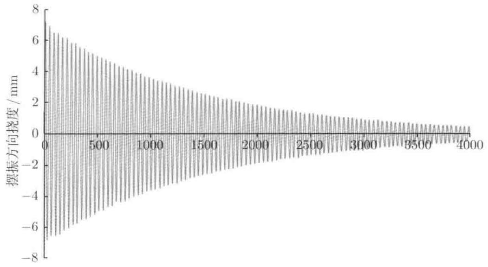

<details>
<summary>area</summary>

| x    | 摆振方向挠度 / mm |
| ---- | ------------------ |
| 0    | 6.5                |
| 500  | 4.0                |
| 1000 | 2.5                |
| 1500 | 1.5                |
| 2000 | 1.0                |
| 2500 | 0.5                |
| 3000 | 0.2                |
| 3500 | 0.1                |
| 4000 | 0.0                |
</details>

图 20-10 叶片位移随时间变化 $^{[48]}$

根据记录的振动数据，取第 $i$ 个周期振幅为 $A_{i}$ ，第 $i + n$ 个周期振幅为 $A_{i + n}$ ，阻尼比计算公式为

$$
\zeta = \frac {\ln \frac {A _ {i}}{A _ {i + n}}}{n} \tag {20-3}
$$

# 20.9 静强度测试

测试载荷加载在测试坐标系下，如图 20-11 所示。测试中，在叶片四个位置加载单向载荷模拟。测试载荷加载到 100% 时，载荷方向垂直叶片变形状态。因此测试中修正加载点初始的 Y、Z 处位置。

不同加载方向需要考虑不同叶片自重修正，对于侧向加载可不考虑叶片重力影响，测试执行过程中不需要考虑重力载荷影响。当叶片在自身重力和测试夹具重力下准备加载时，应变片和位移调零。

对于向上加载，在开始每一个静态测试前，施加自重补偿载荷，应变仪和挠度调零。所有静态载荷测试的自重补偿载荷相等。

对于向下加载，最终加载测试载荷需要减去自重补偿载荷。

测试中叶片定位方向选择基于叶片截面坐标系下挥舞摆振合弯矩方向。报告中需要给出各个测试项目下叶片定位方向图纸。

对于测试载荷与极限设计载荷的正确比较，测试载荷需转化到叶片截面坐标系，在实验室通过叶片方位角和叶片扭角分布来实现转化。

需要给出测试载荷下应变片粘贴位置的理论应变。采用有限元计算测试加载情况下应变，未考虑自身重力以及夹具影响。

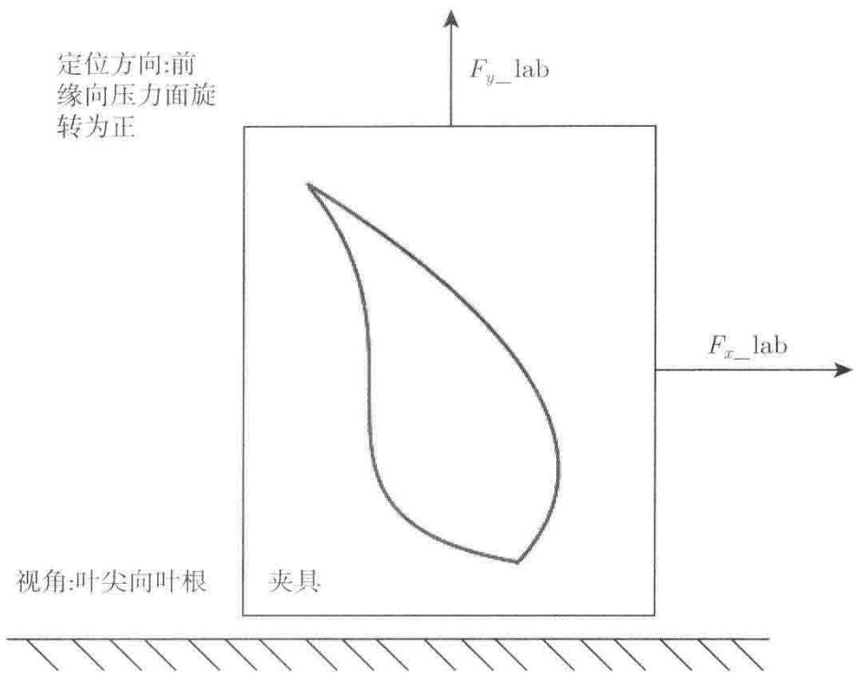

<details>
<summary>text_image</summary>

定位方向:前
缘向压力面旋
转为正
Fy_lab
Fx_lab
视角:叶尖向叶根
夹具
</details>

图20-11 测试加载方向示意图

测试前需要根据测试载荷与叶片结构模型预估叶片变形与挠度，确定满足测试空间限制和与测试值对比验证。

在极限载荷测试中，采用逐级加载方式，每个载荷步至少持续 10s，期间数据（如应变仪）需要不间断记录。每项测试同时需要测量截面位移，测量位置，加载截面处和叶尖处三方向位移。

每项测试加载前，应变仪读数和挠度数应归零。

加载测试载荷步时，载荷在上一个载荷步基础上增加载荷（载荷不需要回零）。在每个载荷步，该步载荷至少维持 10s 以上载荷水平并记录数据。完成 100% 测试载荷加载后再载荷缓慢回零。

在每项测试结束时，要检查测量仪，目测检查叶片。

静载测试，通过统计获取四个方向极限载荷以及该极限载荷发生时垂直方向载荷，通过计算弯矩大小与方向，确定理想加载方向，实际受限于螺栓分布，加载角度只能按 $360^{\circ} / n$ 调整角度（其中 $n$ 为螺栓数目），选择与目标加载方向最近的安装方式，如图20-12所示。

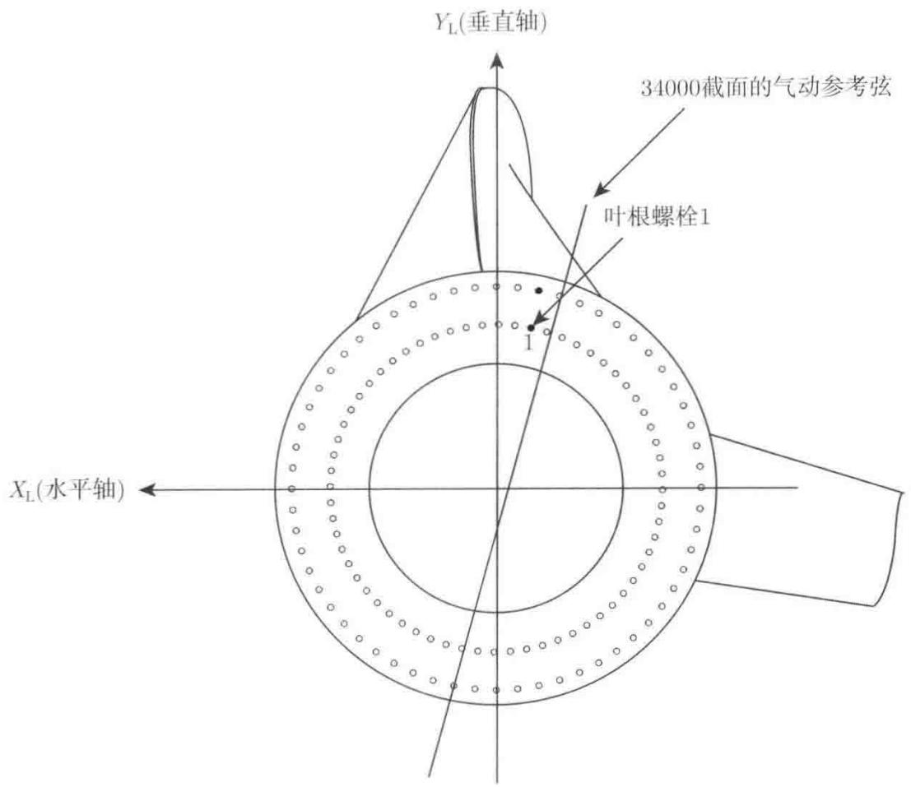

<details>
<summary>text_image</summary>

Y_L(垂直轴)
34000截面的气动参考弦
叶根螺栓1
1
X_L(水平轴)
</details>

图 20-12 静加载测试某一测试项目叶片固定位置说明

例如，最大挥舞方向测试，假设安全系数为 1.1，测试载荷计算中，需要使得70%以上截面处测试载荷下挥舞方向弯矩大于 1.1 倍设计挥舞弯矩，如图 20-13 所示。需要注意的是，载荷对比需要转化到同一坐标系下。

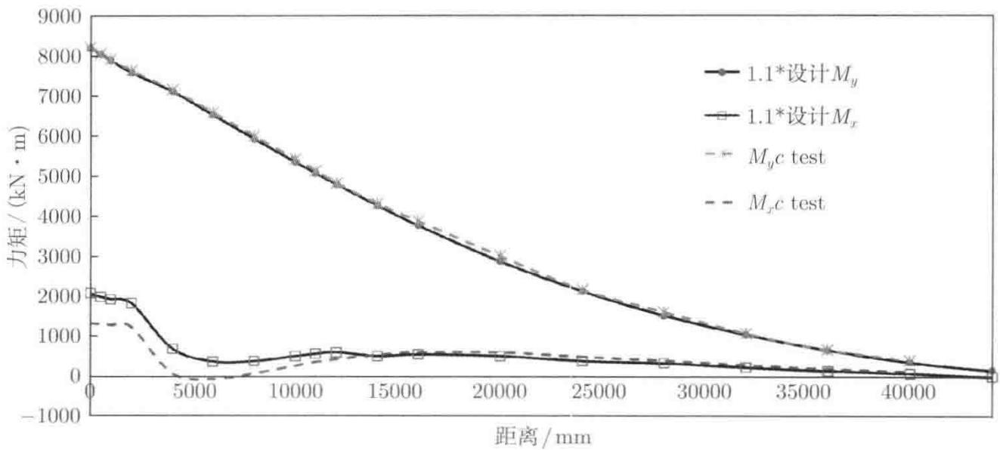  
图 20-13 测试载荷加载效果与 1.1 倍设计载荷对比

# 20.10 疲劳测试

疲劳测试首先需要确定载荷。

(1) 平均载荷。由于叶片自身重力、测试配重以及加载装置自身重力，测试时需要考虑以上因素对平均载荷影响，将设计载荷转化为截面指定平均弯矩下的疲劳载荷。  
(2) 载荷幅值。来源为叶片自身重力、夹具、摆振块以及附属测试装置重力影响，根据加载截面的不同，导致载荷平均值不同。

由于风力机设计寿命长、运行时间长、设计疲劳载荷循环次数多，为缩短测试试件可通过增大加载频率与载荷加快测试。其中增大循环载荷是一种有效途径，但载荷不能大于极限载荷并避免载荷过大导致局部过热增加疲劳损伤。

测试机构需要定期校正。校正刚度与弯矩-应变关系函数。采用如下校正间隔：

(1) 测试开始前；  
(2) 第 10000 次循环;  
(3) 第 50000 次循环;  
(4) 第 100000 次循环;  
(5) 第 250000 次循环;  
(6) 第 500000 次循环；  
(7) 以后间隔 1000000 次循环；  
(8) 测试完成。

测试期间异常情况需要记录，环境温度、叶片温度、应变片应变等需要监视与记录。需要配备红外线照相设备检查叶片温升情况。

在每项测试结束时，要检查测量仪，目测检查叶片。

摆振块加载方法。将摆振块安置在指定位置处，摆振块载荷作用方向穿过截面剪心，避免测试过程中产生不必要的扭转载荷。设备安装就绪后测量设备归零。测试期间，启动摆振块，调节至产生共振，直至测量挠度幅值达到预期水平。

# 20.11 破坏性测试

通过逐级加载，在每个载荷步停留合适时间，以便及早确定破坏阶段。

# 第 21 章 总结与展望

# 21.1 设计与流程

结构设计本质上是在满足结构校核要求以及其他外部条件的前提下，最优化的一个问题。由于叶片结构设计的自由度非常高，在这么多自由度中如何逐步细化各个参数的范围，并最终确定参数值，是一个艺术的过程。

本书无法全面给出的是我们的实践，因为每一次设计实践都具有其问题的独特性。一种可以参考的结构设计流程是依次按照主梁、结构连接、前尾缘梁、腹板、蒙皮、芯材、胶接、结构局部细节、功能件、次要结构件、其他细节的顺序进行，用实践验证设计，在学习中成长，不断积累经验，用实践实现设计和指导设计。

特别需要指出的是叶片的螺栓连接设计，它是与结构设计并行的一项工作，所需要的知识基础与叶片结构分析所需要的知识基础有较大差别，其设计理念和方法与复合材料层合板/夹芯结构/胶接结构非常不同，在计算上的非线性以及工艺实践的重要性对测试提出更高的要求，工艺敏感性和结果的离散性对工艺和质控细节达到苛刻的程度，因为这对整个结构是否能通过疲劳校核至关重要。但叶片的螺栓连接处常常作为叶片设计/认证与整机设计/认证的接口部位而同时受到双方的忽视，因此，常常成为叶片设计的颠覆项而在项目后期甚至是整机完成载荷计算后改变整个设计，它的约束影响到叶片内部的铺层、变桨轴承的尺寸、孔数、孔径、模具的圆周部位尺寸，而这些零部件或工装恰恰是新产品开发的关键路径。

一个可以参考的项目开发计划案例见表 21-1。

表 21-1 叶片开发计划

<table><tr><td>步骤</td><td>客户</td><td>气动</td><td>结构</td><td>螺栓</td><td>工艺</td><td>工装</td><td>模具</td><td>材料</td></tr><tr><td rowspan="3">概念设计</td><td rowspan="2">机组参数</td><td>气动概念</td><td>结构概念</td><td>螺栓概念</td><td>工艺概念</td><td rowspan="2">工装设计</td><td rowspan="2"></td><td rowspan="2">材料选型</td></tr><tr><td>设计</td><td>设计</td><td>设计</td><td>设计</td></tr><tr><td>设计要求</td><td>载荷计算I</td><td>认证标准</td><td></td><td></td><td></td><td></td><td></td></tr><tr><td colspan="9">设计要求 Fixed</td></tr><tr><td rowspan="2">设计准备</td><td>控制算法</td><td>翼型数据</td><td></td><td></td><td></td><td></td><td></td><td>材料性能</td></tr><tr><td>控制初步</td><td>气动初步</td><td></td><td></td><td>工艺初步</td><td></td><td></td><td></td></tr><tr><td rowspan="3">初步设计</td><td>设计</td><td>设计</td><td></td><td></td><td>设计</td><td></td><td></td><td></td></tr><tr><td></td><td>载荷计算II</td><td>结构初步设计</td><td>螺栓初步设计</td><td></td><td></td><td></td><td></td></tr><tr><td></td><td>气动细节设计</td><td></td><td>螺栓试验I</td><td></td><td></td><td></td><td></td></tr><tr><td></td><td></td><td></td><td></td><td>外形 Fixed</td><td></td><td></td><td></td><td>材料测试</td></tr><tr><td rowspan="4">细节设计</td><td rowspan="4">控制细节设计</td><td>载荷计算III</td><td>控制细节设计</td><td>螺栓概念设计</td><td></td><td></td><td>模具设计</td><td>疲劳测试</td></tr><tr><td>气弹分析I</td><td>FEM建模</td><td>螺栓试验II</td><td></td><td></td><td></td><td></td></tr><tr><td>载荷计算IV</td><td>FEM校核结构疲劳校核</td><td></td><td></td><td></td><td></td><td></td></tr><tr><td>气弹校核</td><td>结构修正I</td><td></td><td></td><td></td><td>阳模制造</td><td></td></tr><tr><td rowspan="5">工程设计</td><td></td><td></td><td></td><td>结构Fixed</td><td></td><td></td><td>阴模制造</td><td></td></tr><tr><td></td><td></td><td></td><td>螺栓疲劳实验</td><td>工艺细节设计</td><td>腹板模具设计</td><td></td><td></td></tr><tr><td></td><td></td><td>铺层图</td><td></td><td>工艺文本</td><td>腹板模具制造</td><td></td><td></td></tr><tr><td></td><td></td><td>测试大纲</td><td>叶根工艺试验</td><td>工艺试验</td><td>配套工装</td><td>模具调试</td><td></td></tr><tr><td></td><td></td><td></td><td>工艺Fixed</td><td></td><td></td><td></td><td></td></tr><tr><td rowspan="2">样片测试</td><td></td><td>气动修正II</td><td>静载测试</td><td></td><td>样片生产</td><td></td><td></td><td></td></tr><tr><td></td><td></td><td>结构修正II</td><td></td><td>工艺修正II</td><td></td><td></td><td></td></tr><tr><td rowspan="4">样机运行</td><td>样机吊装</td><td>气动性能测试</td><td>疲劳测试</td><td></td><td>样机生产</td><td></td><td></td><td></td></tr><tr><td>试运行</td><td>载荷测试噪声测试</td><td></td><td></td><td></td><td></td><td></td><td></td></tr><tr><td></td><td>气动修正III</td><td>结构修正III</td><td></td><td>工艺修正III</td><td></td><td></td><td></td></tr><tr><td></td><td></td><td></td><td>产品Fixed</td><td></td><td></td><td></td><td></td></tr></table>

# 21.2 校核与经验

结构校核本身是不需要流程的，可以说，将所有可以用的校核方法，用于所有的需要校核部位，校核所有需要校核的类别和准则，如果无一例外地给出了“绿灯”，则校核工程师可以给这个设计开“绿灯”；而只要有一个“红灯”的存在，那么整个校核流水线就要回归设计。从设计中更改不满足校核要求的关键点，优化设计，重新校核。

以上穷举法的校核方式往往被世人诟病为官僚主义的 Over-Engineering。作者在没有充分理由放松警惕之前，还是应该保持“永远战战兢兢，永远如履薄冰”的态度。只有经过大量的以上官僚化的胆小，才能换回一点点“艺高人胆大”的经验，因为有大量的经验证明某种官僚化的分析是不必要的，所以才敢跳过一两步的分析；这是与无知者无畏的那种初生牛犊不怕虎的“大胆”是完全不一样的。而结构校核的本身就是需要找到一种等效和简化的方法，既能满足安全性的需求，同时又不至于让整个校核过程过于复杂。从这个角度说，结构校核方法会受到结构校核工具的影响。或者说，对于结构校核工程师，所需要考虑的是，能够在第一时间发现一个设计中可能存在的问题，并在约定的时间内最大程度地提升设计不存在问题的概率。或者说，如何能用最少的校核获得最可靠的保证，这就是校核工程师的经

验所在。

# 21.3 设计和校核之外的眼界

在结构校核的所有“绿灯”已经点亮的情况下，并不意味这个产品的其他方面，也都点亮“绿灯”。

本书未提到结构设计和结构校核之外的很多东西，包括复合材料一套测试体系，选用新材料时需要完成的工作规范，材料安全系数的确定，材料环境与工艺性、振动、气动弹性、叶片结构状态监控，工艺操作，缺陷分析与损伤容限确定，雷击预防与设计分析，模具的公差对性能的影响，材料的保养对性能的影响等方面的问题。

在这个高度耦合的产品设计过程中，特别值得一提的是气动和结构的一体化设计。通常结构工程师并不希望讨论这个话题，而气动工程师也乐得不讨论这个话题。但是，气动工程师总是希望叶片越薄越好，而翼型的形状和厚度的设定，与结构工程师的计算结果密切相关。可以说，两者的联合设计，是风力机叶片设计的基础，也是叶片结构工程师无法回避的，这是必须正视的问题。关于这个问题，国内可参考文献[43-44]。图21-1为叶片一体化优化流程。

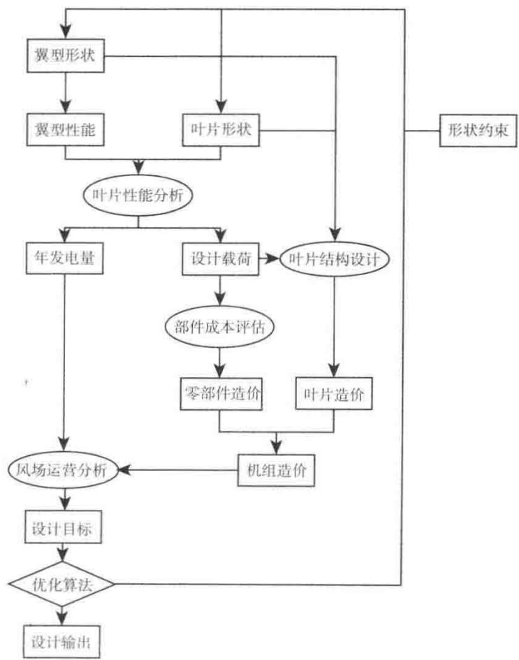

<details>
<summary>flowchart</summary>

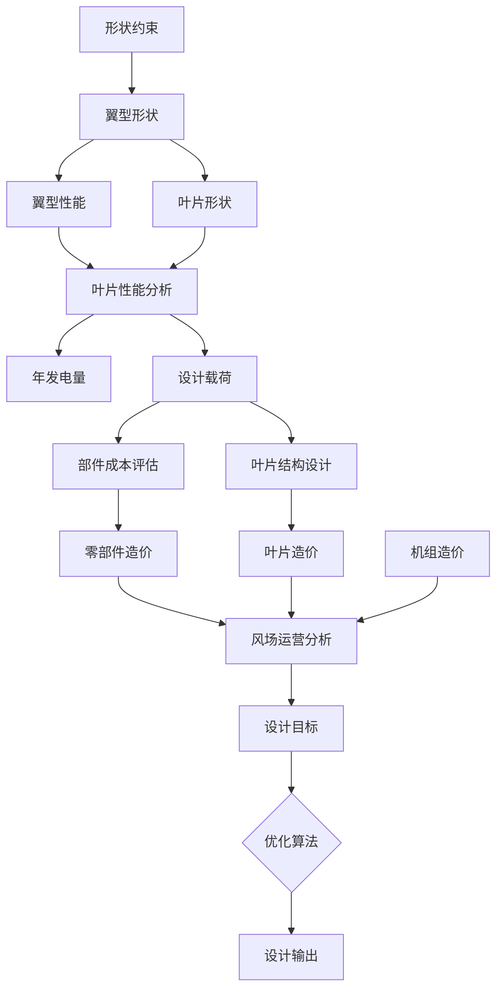
```mermaid
graph TD
    A["翼型形状"] --> B["翼型性能"]
    A --> C["叶片形状"]
    B --> D["叶片性能分析"]
    C --> D
    D --> E["年发电量"]
    D --> F["设计载荷"]
    F --> G["部件成本评估"]
    G --> H["零部件造价"]
    F --> I["叶片结构设计"]
    I --> J["叶片造价"]
    H --> K["风场运营分析"]
    J --> K
    K --> L["设计目标"]
    L --> M{优化算法}
    M --> N["设计输出"]
    O["形状约束"] --> A
    P["机组造价"] --> K
```
</details>

图 21-1 叶片结构一体化优化思路

# 21.4 对未来的展望

未来的叶片会是什么样子？这个问题的答案是很容易回答的，同时又是最难回答的。

说其容易，因为叶片作为风力机的一个部分，其发展的趋势不仅由其自身的特性决定，更多的由风力机的发展需求决定，就这点意义而言，叶片发展的总趋势是如何配合风力机实现 COE(度电成本) 的最小化。所有能够帮助风力机 COE 最小化的设计就是未来的发展趋势。

说这个问题难回答，因为有无数的可能性：

(1) 纤维方面。下一代玻璃纤维如 S-Glass、H-Glass、高模量玻璃纤维；现有的高强纤维如芳纶纤维、硼纤维；不常用的纤维，如氧化铝纤维、超高分子量聚乙烯纤维，也都有其优势所在；生物纤维，如木纤维、竹纤维、棉纤维、麻纤维；碳纤维似乎是目前最好的一种选择，除成本之外，其工艺特性、导雷特性和修补特性方面的不足，可能会超过其高强性能的优势。  
(2) 基体方面。环氧树脂仍然是主流, 其数据的易获得性不断强化其在工程界的优势; 包括风场维护在内的便捷性方面, 不饱和树脂仍然在叶片大型化的过程中保持一定成本优势; 环氧乙烯基, 似乎是一种可能性; 热塑性塑料以及更加环保的生物基的树脂也有讨论。在这个过程中, 树脂在力学性能、工艺性和成本之间保持着微妙的平衡。  
(3) 泡沫方面。PVC 泡沫、PE 泡沫以及其他化工发泡材料都在尝试与现有叶片的体系兼容；Balsa 木的生长是会扩大化还是会缩小，取决于产品的应用需求和价格走势；蜂窝材料，无论是铝制蜂窝材料还是纤维增强的蜂窝材料，如 WebCore $^{®}$ 技术的使用，这种芯材性能定制化的发展方向在大型叶片中似乎是一种诱人的应用。  
(4) 防护方面。后喷漆或者预喷胶衣、刷漆等方式对工厂环境的 EHS 带来不同的效果被各国工会及政策左右；不同化学成分的表面防护，在盐雾、酸雨、沙尘、冰雹、冻雨、冰冻等自然灾害的保护方面有不同的选项和组合。  
(5) 黏接方面。结构胶、钝尾缘尝试解决一些问题，但是尾缘部位的连接强度的不足，还是会改变黏接的方式方法。铆接、预制尾缘，特别值得一提的是智能内腔技术、一体成型技术等成型方法的不断尝试和成熟应用也给行业带来了一缕新意；20年的寿命和复杂的环境适应性验证阻碍着不断涌现的新的黏接剂切入市场；相反，基于已有黏接剂的黏接厚度的控制和黏接工艺的改进成为各个公司关注的重点。  
(6) 工艺方面。真空导注目前已是主流，但是手糊、真空辅助、预浸料等方法

也都是可选项；对于主梁而言，预制的主梁在工艺可靠性方面得到提升，同时也给主梁的材料及其制作工艺提供了大量的可选项，如热塑的预制单向带等。

(7) 铺放方面。目前人工剪裁和人工铺放的格局还会在长时间内存在，但是预剪裁、自动剪裁、激光指示辅助的人工剪裁等剪裁技术，以及自动铺放、立体编织等技术已经不断涌现。  
(8) 工装方面。更加柔性的生产要求将预埋和后打孔的方案进行对比；越来越高的产品精度要求、表面要求、过程控制、检测要求都不断提升工装的数量和质量。  
(9) 模具方面。由于叶片的定制化生产与开发，一套模具在保证不变形及自身特性的情况下如何更柔性地生产叶片；模具运输的不便利、产品之间模具的复用性、模具的系列化设计不仅改变着模具，而且深刻影响着叶片设计的理念和方法；模具精度要求的提升，必然改变阳模和模具的材料、工艺、收缩控制、钢架形式、翻转机构、加热设备等方面。  
(10) 生产技术方面。绿色生产的理念、劳保要求的提升、无打磨叶片厂、自动喷漆设备都会提升产品的自动化程度，更重要的是，提升产品的一致性和可靠性，从而将半手工生产的产品向更加工业化的方向推进。  
(11) 质量管理方面。全生命周期的引入和大数据战略建立，会将叶片产品生产的车间包更加数字化并贴上标签，每一支上百万元的叶片所拥有的信息可能会装满一块上千元的硬盘，而正是这些增加了千分之一成本的信息，让所有的叶片帮助工程师一起积累经验，降低风险。  
(12) 结构型式方面。飞机中经常用的肋、桁架、筋板、肋板等结构也可能成为风力机叶片未来结构的主要形式，特别是当这些结构大到能够带来显而易见的结构优势时。  
(13) 构件方面。更多的预制件和构件或许会应用到风力机里面，如同飞机行业中已经形成的一样。各种各样的传感器，更好的形状控制的尾缘和叶尖，拥有气动控制功能的副翼和襟翼；气动领域的潜在创新也带动着有质量扰流和无质量扰流等技术的进步。  
(14) 连接方面。非圆形的连接、非螺栓的连接 (如铆接)、黏接、铆接、对接、指接、斜街等技术都会在风力机中更多的应用, 如分段叶片也给这种技术的应用带来了挑战。  
(15) 空气动力学方面。飞机上的各种叶尖小翼技术毫无疑问地会被应用在高尖速比的机型上，尽管工艺要考虑简化问题；气动副翼、襟翼、有质量扰流、无质量扰流等各种技术可能会用于创新的叶片。  
(16) 噪声控制方面。变转速运行是最便捷的昼夜噪声控制技术，叶尖的良好设计、尾缘的优化、尾缘的导流条以及钝尾缘带来的新的噪声问题，将随着风力机逐渐走近人类居住地而变得重要；另一方面，在人烟稀少的陆上或海上地区，噪声在

放弃成为制约机组叶尖速度的瓶颈之后，更高的叶尖速比在提升机组效率，改变发电机单位重量效率的情况下，将面临由此带来的前缘冲击和前缘磨损问题。

(17) 气弹方面。气动剪裁技术、被动的扭转卸载、被动的气弹阻尼技术会逐渐被采用；气弹的重要性往往仍然是在产品出现气弹问题之后，而不是在产品设计之前被人们所重视；尽管随着叶片越来越长，在风的激振能量中叶片发生颤振的可能性越来越大；但是这种重视直到气弹分析软件，特别是频域分析软件的出现，才可能在连续谱上进行设计，而不是在时间域上进行越来越大样本的蒙特卡罗模拟，加上基于概率的外推法的不完全归纳。  
(18) 机组方面。各种降载控制技术的应用，柔性塔架技术带来的动力学问题，运输、吊装过程的问题都会改变叶片的形式。  
(19) 可能的设计趋势方面。两叶片、单叶片、下风向、变半径 (如伸缩式、铰接式)、柔性叶片、叶片轮毂一体化风轮等创新概念的实现与应用。  
(20) 环境兼容性方面。针对不同的地区提出不同的要求: 在高原地区, 凝露与冰冻不仅是预防的, 而且是工艺人员在进行胶接工艺设计时, 必须要为每一个微裂纹抵抗的; 在低温地区, 材料变得更脆, 任何低估这种低温下的强度分析和疲劳分析的设计成为行业发展的陷阱; 在沙尘地区, 冲击的分析, 粗糙翼型的性能分析, 是虽然很难但是不得不尝试的思考题; 高温地区, 如科威特地区局部 $60^{\circ} \mathrm{C}$ 的高温, 会让 $T_{\mathrm{g}}$ 仅为 $80^{\circ} \mathrm{C}$ 的叶片处于很尴尬的地位。  
(21) 在线状态监控方面。在叶片中预埋光导纤维的传感器、声发射传感器、加速度传感器，在叶根布置应变传感器，实时在线监控叶片的动态响应，结合损伤诊断数据库与剩余寿命分析方法，预判叶片损伤类型及等级。  
(22) 海上风力机叶片和垂直轴叶片方面。这里不加阐述，因为这都是很大的单独的题目，需要引入太多的全新的技术难题，不可盲目投入设计理念。

以上的每一项技术都可能极大地改变叶片行业的未来，但是需要注意的是，这些是各种可能，且仅是可能。在这些可能性中，只有数量很少的创新具备可行性；在这些少量的可行性中，又只剩下更少的创新在某个具体产品型号上具备经济性；在这些具备经济性的创新中，又有很多因为失败的项目管理最终流产。

作者不能确切知道的是将来哪些会成为主流，但是能确切知道的是，这些创新的发生改变，甚至决定了下一代产品的样式，并改变着整个行业的生态。推动我们认识不断提升的，并不是我们知道了什么，而是我们在探索中发现了那些我们所不知道的。

# 21.5 回到原点——复合材料薄壁杆件结构力学

在本书的最后，我们又回到了原点——我们似乎知道了些什么，但是我们发现了更多的未知。

复合材料，我们研究了各向异性，发现了还有 Puck 准则这样一个知识；我们研究了层间破坏，发现了断裂力学也是必要的；当我们满怀欣喜地研究了几本大部头的航空复合材料设计手册之后，2012 年初空客的螺栓连接所带来的召回问题和波音的层间剥离问题，这让我们很沮丧——又回到了原点，对于复合材料，我们才刚刚开始，距离金属的几百年，甚至上千年的成熟应用相比，我们还太年轻。

薄壁杆件, 我们研究工字梁, 发现了弯心和刚心; 研究蒙皮和夹芯, 发现了剪心和扭心; 研究动力学, 发现了原来剪心和弯心并不是一个概念, 而对动响应分析的影响还不小; 似乎很难找到一本讲解复杂铺层的薄壁杆件结构力学的书籍, 我们所熟练背诵, 甚至写成软件的公式, 往往停留在各向同性材料、同质材料的薄壁杆件中, 甚至将剪心、弯心、扭心、刚心与几何中心的概念混淆; 这种混淆并不是有意的, 而是在不断简化过程中所丢掉的; 这让我们很沮丧——又回到了原点, 对于有限元, 我们把自己交付给我们的作品, 我们花几天时间建立一个程序, 运行出结果, 却难以在结果中确认与现实的对应性, 因为相比几十万个自由度的程序, 我们又太简单。

结构力学, 我们研究屈曲, 发现那是全局性的; 研究螺栓, 发现边界是周期的; 研究尾缘, 发现结构是奇异的; 研究非线性, 发现在有工具的情况下, 材料非线性竟然是最简单的, 而这最简单的计算输入却得不到可靠的测试结果。我们回到最基本的校核方法, 这让我们很沮丧——又回到了原点, 不是采用什么高深的方法和理论, 而是把一些最基本的工程方法用扎实, 并注重每一个细节。我们在学校的书本上花了近 20 年的青春, 相比实实在在的工程问题, 我们还太理想化。

回到了原点。这种将我们工程设计能力建立在随时可能被证伪的公理/定理体系之上的感觉，令人很沮丧，同时也很兴奋。

# 参考文献

[1] 沈观林, 胡更开. 复合材料力学 [M]. 北京: 清华大学出版社, 2006.  
[2] 牛春匀. 实用飞机结构应用分析及尺寸设计 [M]. 北京: 航空工业出版社, 2009.  
[3] 刘雄亚, 晏石林. 复合材料制品设计及应用 [M]. 北京: 化学工业出版社, 2003.  
[4] Bir G, Migliore P. Preliminary Structural Design of Composite Blades for Two-and Three-Blade Rotors[M]. National Renewable Energy Laboratory, 2004.   
[5] 郑晓玲. 民用飞机复合材料结构设计与验证 [M]. 上海: 上海交通大学出版社, 2011.  
[6] 黄发荣, 周燕, 等. 先进树脂基复合材料 [M]. 北京: 化学工业出版社, 2008.  
[7] Dawson D. Big blades cut wind energy cost[J]. Composites Technology, 2003, 9(1): 28.   
[8] 牛春匀. 实用飞机复合材料结构设计与制造 [M]. 北京: 航空工业出版社, 2010.  
[9] Fibre-reinforced plastic composites-Determination of the in-plane shear stress/shear strain response, including the in-plane shear modulus and strength, by the $\pm45^{\circ}$ tension test method[Z]. STD. ISO 14129-ENGL, 1997.   
[10] Guidelines for Design of Wind Turbines[Z]. DNV/Riso in technical co-operation. ISBN 87-55-2870-5.   
[11] 芮晓明, 柳亦兵, 等. 风力发电机组设计 [M]. 北京: 机械工业出版社, 2010.  
[12] 罗永康, 李炜. 碳纤维复合材料在风力发电机叶片中的应用 [J]. 电网与清洁能源, 2008, 24(5): 2\~4.  
[13] Wind turbine generator systems-Lighting protection[Z]. IEC/TR 61400-24: 2002(E).   
[14] Guidelines for Design of Wind Turbines[Z]. Germanischer Lloyd Industrial Services GmbH, 2010.   
[15] 风力发电机组风轮叶片 GB/T 25383—2010[S]. 中华人民共和国国家质量监督检验检疫总局, 2010.  
[16] 刘鸿文. 材料力学 I[M]. 4 版. 北京: 高等教育出版社, 2004.  
[17] 陈佳慧. 风力机气动弹性与动态响应计算 [D]. 南京: 南京航空航天大学, 2011.  
[18] 丁锡洪. 结构力学 [M]. 北京: 航空工业出版社, 1991.  
[19] 李慧. 大型风力机叶片的静强度设计与分析 [C]. 2010 第七届风能应用技术年会论文集, 2010.  
[20] 王助成. 有限单元法 [M]. 北京: 清华大学出版社, 2005.  
[21] 李慧. 大型风力机叶片结构/力学设计与分析 [D]. 南京: 南京航空航天大学, 2010.  
[22] 李慧, 王同光. 风力机叶片分布力函数加载方式有限元分析 [J], 太阳能学报, 2013, 3: 384\~391.  
[23] Design and manufacture of wind turbine blades, offshore and onshore wind turbines[Z]. DNV/Riso in technical co-operation. DNV-OS-J102, 2006.   
[24] 叶枝全, 马昊漫. 水平轴风力机浆叶的实验模态分析 [J]. 太阳能学报, 2001, 22(4): 473\~477.  
[25] Ye Z Q, Liu X, Chen Y. Structure dynamic analysis of a horizontal axis wind turbine system using a FEM analysis method[J]. Wind Engineering, 2001, 25 (4): 237\~248.   
[26] 周覆, 范赋群. 复合材料力学 [M]. 北京: 高等教育出版社, 1991.

[27] 张承宗. 复合材料板壳力学解析理论 [M]. 北京: 国防工业出版社, 2009.  
[28] 中国航天研究院. 复合材料结构设计手册 [M]. 北京: 航空工业出版社, 2001.  
[29] Offshore standard DNV-OS-C501, Composite components[Z]. DNV/Riso in technical co-operation, 2003.   
[30] Puck A, Kopp J. Guidelines for the determination of the parameters in Puck's action plane strength criterion. Institute of plastics processing[J]. Composites Science and Technology, 2002, 62: 371\~378.   
[31] 朱菊芳, 汪海, 等. 非线性有限元及其在飞机结构设计中的应用 [M]. 上海: 上海交通大学出版社, 2012.  
[32] 中国航空研究院. 复合材料连接手册 [M]. 北京: 航空工业出版社, 1994.  
[33] 牛春匀. 实用飞机结构工程设计 [M]. 北京: 航空工业出版社, 2008.  
[34] 谢鸣九. 复合材料连接手册 [M]. 上海: 上海交通大学出版社, 2011.  
[35] Panigrahi S K. Pradhan B. Three dimensional failure analysis and damage propagation behavior of adhesively bonded single lap joints in laminated FRP composites[J]. Journal of Reinforced Plastics and Composites, 2007, 26(2): 183—201.   
[36] Systematic calculation of high duty bolted joints with one cylindrical bolt[Z]. VDI 2230 Blatt1/Part1, 2003.   
[37] 姚卫星. 结构疲劳寿命分析 [M]. 北京: 国防工业出版社, 2003.  
[38] Janssen L G J. Reliable Optimal Use of Materials for Wind Turbine Rotor Blades[R]. ECN-C-06-023: 15.   
[39] 杨剑, 张璞. 新编 MD Nastran 有限元实例教程 [M]. 北京: 机械工业出版社, 2008.  
[40] 解德, 钱勤. 断裂力学中的数值计算方法及工程应用 [M]. 北京: 科学出版社, 2009.  
[41] 石亦平. ABAQUS 有限元分析实例详解 [M]. 北京: 机械工业出版社, 2006.  
[42] 姚卫星, 顾怡. 结构可靠性设计 [M]. 北京: 航空工业出版社, 1997.  
[43] 吴江海, 王同光. 风力机叶片优化设计目标 [J]. 南京航空航天大学学报, 2011, 43(5): 661\~666.  
[44] 王珑, 王同光, 罗源. 改进的 NSGA-II 算法研究风力机叶片多目标优化 [J]. 应用数学与力学, 2011, 6: 693\~701.  
[45] 益小苏, 杜善义, 张立同. 中国材料工程大典 [M]. 北京: 化学工业出版社, 2005.  
[46] IEC 61400-23 Wind turbine generator systems – Part 23: Full-scale structural testing of rotor blades, 1999.   
[47] DNV: Design and Manufacture of Wind Turbine Blades Offshore and Onshore Wind Turbines, 2006.   
[48] Bulder B H, Dam J J. European Wind Turbine Testing Procedure Development SMT4-CT96-2116 Subtask 2: Final Report Blade testing methods, 2000.

# 附录 A 坐标系

风力发电机组的坐标系如表 A-1 所示。

表 A-1 风力发电机组坐标系

<table><tr><td>序号</td><td>坐标系名称</td><td>坐标系符号</td><td>备注</td></tr><tr><td>1</td><td>风坐标系</td><td>W</td><td></td></tr><tr><td>2</td><td>地表坐标系</td><td>G</td><td></td></tr><tr><td>3</td><td>基础坐标系</td><td>F</td><td></td></tr><tr><td>4</td><td>塔架截面坐标系</td><td>Th</td><td></td></tr><tr><td>5</td><td>塔顶坐标系</td><td>K</td><td>偏航轴承坐标系</td></tr><tr><td>6</td><td>机舱坐标系</td><td>Y</td><td>偏航坐标系</td></tr><tr><td>7</td><td>轮毂坐标系</td><td>N</td><td>固定轮毂坐标系</td></tr><tr><td>8</td><td>风轮坐标系</td><td>R</td><td>旋转轮毂坐标系</td></tr><tr><td>9</td><td>叶根坐标系</td><td>B</td><td>叶片坐标系</td></tr><tr><td>10</td><td>变桨坐标系</td><td>P</td><td></td></tr><tr><td>11</td><td>叶片截面坐标系</td><td>S</td><td></td></tr><tr><td>12</td><td>叶片挥舞摆振坐标系</td><td>Bl</td><td></td></tr><tr><td>13</td><td>弦线坐标系</td><td>C</td><td></td></tr><tr><td>14</td><td>翼型坐标系</td><td>A</td><td></td></tr><tr><td>15</td><td>模具坐标系</td><td>M</td><td></td></tr><tr><td>16</td><td>合模前铺层坐标系</td><td>L</td><td></td></tr><tr><td>17</td><td>合模后铺层坐标系</td><td>AM</td><td></td></tr></table>

风力机坐标系在定义时主要参考了表 A-2 中列出的各家坐标系, 其中带有 “√” 标识的表示各参考标准中涵盖的坐标系。

表 A-2 参考坐标系列表

<table><tr><td>序号</td><td>坐标系符号</td><td>CWPI 坐标系</td><td>GH</td><td>GL</td><td>DNV</td><td>Aerodyn</td><td>LM</td></tr><tr><td>1</td><td>W</td><td>风坐标系</td><td></td><td></td><td></td><td></td><td></td></tr><tr><td>2</td><td>G</td><td>地表坐标系</td><td></td><td></td><td></td><td></td><td></td></tr><tr><td>3</td><td>F</td><td>基础坐标系</td><td></td><td>√</td><td></td><td></td><td></td></tr><tr><td>4</td><td>Th</td><td>塔架截面坐标系</td><td></td><td></td><td>√</td><td></td><td></td></tr><tr><td>5</td><td>K</td><td>塔顶坐标系</td><td></td><td></td><td></td><td></td><td></td></tr><tr><td>6</td><td>Y</td><td>机舱坐标系</td><td>√</td><td>√</td><td></td><td></td><td></td></tr><tr><td>7</td><td>N</td><td>轮毂坐标系</td><td>√</td><td>√</td><td>√</td><td>√</td><td></td></tr><tr><td>8</td><td>R</td><td>风轮坐标系</td><td></td><td>√</td><td></td><td>√</td><td></td></tr><tr><td>9</td><td>B</td><td>叶根坐标系</td><td>√</td><td>√</td><td></td><td>√</td><td></td></tr><tr><td>10</td><td>P</td><td>变桨坐标系</td><td></td><td></td><td></td><td></td><td></td></tr><tr><td>11</td><td>S</td><td>叶片截面坐标系</td><td></td><td>√</td><td></td><td>√</td><td></td></tr><tr><td>12</td><td>Bl</td><td>叶片挥舞摆振坐标系</td><td></td><td></td><td>√</td><td></td><td></td></tr><tr><td>13</td><td>C</td><td>弦线坐标系</td><td></td><td></td><td></td><td></td><td></td></tr><tr><td>14</td><td>A</td><td>翼型坐标系</td><td></td><td></td><td></td><td></td><td></td></tr><tr><td>15</td><td>M</td><td>模具坐标系</td><td></td><td></td><td></td><td>√</td><td></td></tr><tr><td>16</td><td>L</td><td>合模前铺层坐标系</td><td></td><td></td><td></td><td></td><td>√</td></tr><tr><td>17</td><td>AM</td><td>合模后铺层坐标系</td><td></td><td></td><td></td><td></td><td></td></tr></table>

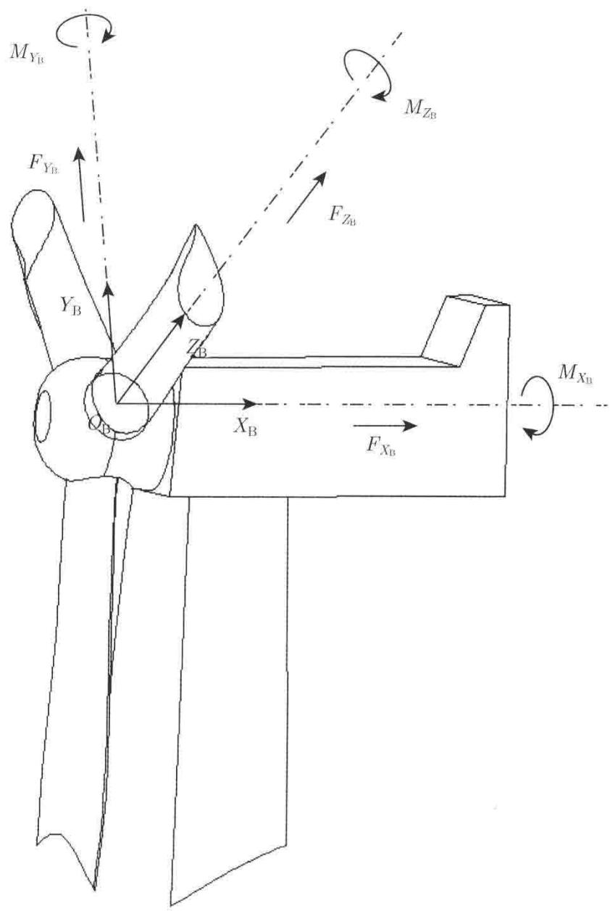

<details>
<summary>text_image</summary>

M_{Y_B}
F_{Y_B}
Y_B
Z_B
X_B
F_{Z_B}
M_{Z_B}
F_{X_B}
M_{X_B}
</details>

图A-1 叶根坐标系

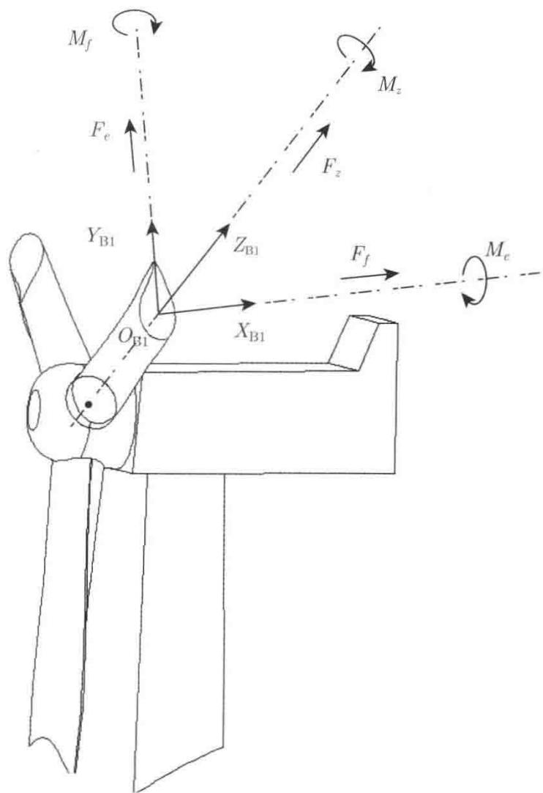

<details>
<summary>text_image</summary>

Mf
Fe
YB1
OB1
XB1
ZB1
Fz
Mz
Ff
Mc
</details>

图 A-2 叶片挥舞摆振坐标系

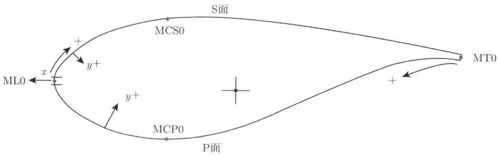

<details>
<summary>text_image</summary>

S面
MCS0
y+
ML0 ← x →
x
y+
MCP0
P面
MT0
+
</details>

图 A-3 合模后叶片铺层坐标系

# 附录 B WB45.3 叶片

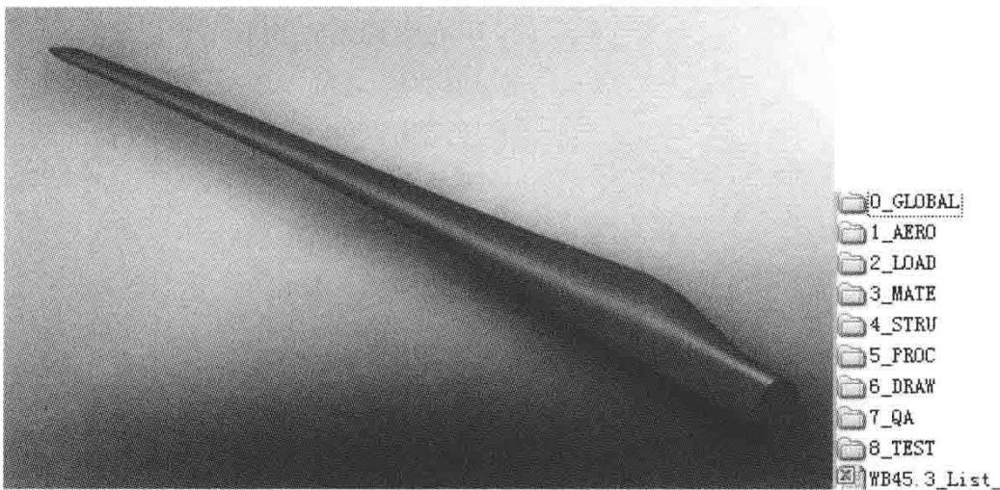

<details>
<summary>text_image</summary>

0_GLOBAL
1_AERO
2_LOAD
3_MATE
4_STRU
5_PROC
6_DRAW
7_QA
8_TEST
WB45.3_List_
</details>

图 B-1 WB45.3 叶片

表 B-1 WB45.3 叶片参数

<table><tr><td>序号</td><td>参数</td><td>单位</td><td>数值</td></tr><tr><td>1</td><td>型号</td><td>[—]</td><td>WB45.3</td></tr><tr><td>2</td><td>风力机制造商和国别</td><td>[—]</td><td></td></tr><tr><td>3</td><td>风力机等级</td><td>[—]</td><td>IIIA</td></tr><tr><td>4</td><td>额定功率</td><td>[kW]</td><td>2000</td></tr><tr><td>5</td><td>额定风速</td><td>[m/s]</td><td>10.5</td></tr><tr><td>6</td><td>风轮额定转速</td><td>[r/min]</td><td>16</td></tr><tr><td>7</td><td>齿轮箱速比</td><td>[—]</td><td>直驱</td></tr><tr><td>8</td><td>发电机额定转速</td><td>[r/min]</td><td>16</td></tr><tr><td>9</td><td>风轮直径</td><td>[m]</td><td>93</td></tr><tr><td>10</td><td>轮毂高度</td><td>[m]</td><td>80</td></tr><tr><td>11</td><td>叶片长度</td><td>[m]</td><td>45.3</td></tr><tr><td>12</td><td>控制器</td><td>[—]</td><td>采用外部控制器</td></tr><tr><td>13</td><td>轮毂高度运行风速</td><td>[m/s]</td><td>切入风速:1.8,切出风速:25</td></tr><tr><td>14</td><td>设计寿命</td><td>[a]</td><td>20</td></tr><tr><td>15</td><td>叶片总重</td><td>[kg]</td><td>8800</td></tr><tr><td>16</td><td>叶根工艺形式</td><td>[—]</td><td>预埋螺栓</td></tr></table>

# 名词索引

# A

安装角 182

# B

摆振刚度 199

摆振弯矩 40

包络载荷 171

变形分析 121

玻璃纤维增强环氧树脂复合材料(GFRP) 17

剥离应力 265

薄壁 2

薄壁杆件 2

薄壁翼型 137

不饱和聚酯 21

Balsa 木 22

# C

材料各向同性假设 138

材料局部安全系数 190

测试载荷 353

层合板 208

层间开裂 319

层间应力 334

超高分子量聚乙烯纤维 20

冲击 311

# D

搭接长度 263

单搭接 258

单元法向 164

单元属性 166

单元坐标系 164

挡雨环 111

导流毡 98

等截面 155

等效疲劳载荷 353

等效应力 306

堵头 98

度电成本 362

断裂 319

钝尾缘 18

多闭式结构 15

多闭室剖面 143

# E

二阶挥舞模态 153

二维方法 137

E-Glass 19

# F

发电量 7

法向应力 229

非线性经典板壳理论 209

分布力 175

分歧屈曲 119

分支屈曲点 253

风剪切 36

风频分布 154

幅值 294

复合材料 13

复合毡 98

腹板 61

FF 229

# G

杆件 1

各闭室周线剪力流 144

工字梁理论 124

工作时间 343

功能件 49

功能载荷 35

攻角 178

共振 201

固有频率 200

惯性和重力载荷 34

惯性矩 126

# H

后打孔 93

后打孔叶根工艺的结构校核 287

后屈曲 253

环境条件 266

环境温度 257

环氧树脂 21

环氧乙烯基 21

挥舞刚度 199

挥舞弯矩 40

Hoffmann 失效准则 227

# I

IFF 230

# J

激振频率 201

极端载荷 33

极限点屈曲 119

极限载荷 40

夹芯结构 233

夹芯失效模式 236

剪力流 144

剪切 24

剪切褶皱 247

桨距角 40

胶接连接 257

胶接缺陷 256

胶衣 109

接闪器 107

结构构型 43

结构极限状态分析 40

结构件 49

结构力学 1

结构模型 39

结构设计 31

结构设计流程 44

结构校核方法 116

结构校核总则 115

结构指数 105

解耦 1

净空 121

局部二次分析法 248

局部屈曲 253

矩形单元假设 138

均匀轴压 238

均值 294

# K

开剖面剪力流 144

坎贝尔图 204

抗疲劳性能 25

可靠度 343

空气动力 1

空气动力载荷 33

# L

拉伸 23

累积损伤 299

力学 1

临界阻尼 201

流线型外形 7

螺栓套 95

# M

蒙皮 72

面内剪切失效 230

MPC 多点约束 174

# N

扭转刚度 199

# O

欧拉梁理论 1

# P

配重腔 110

疲劳 293

疲劳测试 358

疲劳分析 122

疲劳极限图 296

疲劳寿命 294

疲劳载荷 40

偏航 35

剖面无畸变假设 138

铺层 14

PMI 泡沫 17

Puck 准则 229

PU 硬质泡沫 17

PVC 泡沫 17

# Q

气弹计算 36

气动布局 130

气动模型 36

前缘梁 78

强度 115

强度分析 118

切向应力 229

切应力 125

屈曲因子 207

全寿命周期 11

# S

三角条 100

设计工况 190

升力 34

升力系数 37

失速 37

失稳 115

失效概率 343

失效率 320

失效因子 194

失效准则 193

使用极限状态 190

使用寿命 202

树脂破裂 228

衰减因子 193

双搭接 258

损伤容限 340

S-Glass 19

S-N 曲线 295

# T

碳纤维 20

弹性矩阵 212

弹性屈曲 119

特征模态 151

特征值 214

湍流 36

脱模 11

陀螺载荷 35

Tsai-Hill 失效准则 227

Tsai-Wu 失效准则 228

# V

von Mises 屈服准则 231

# W

弯曲 24

弯曲刚度 40

维修度 344

尾缘几何奇点 88

尾缘开裂 81

尾缘梁 80

稳定性分析 118

# X

吸力面 83

线应变假设 135

楔形块 98

虚拟裂纹闭合法 320

许用值 214

循环载荷 294

# Y

压力分布 178

压力面 83

压缩 24

哑节点断裂单元 328

仰角 183

叶根法兰 92

叶根盖板 110

叶根加强层 90

叶根连接 92

叶根内包边 87

叶根外包边 87

叶根预埋工艺的结构校核 271

叶根坐标系 149

叶尖挠度 199

叶尖速比 40

叶片 1

叶片材料轴 165

叶片全尺寸测试 346

叶片拓扑图 116

叶片展向 54

叶素动量理论 37

一阶摆振模态 153

一阶挥舞模态 152

一维方法 124

翼型 31

翼型族 32

应变能 217

应变能释放率 319

应力比 294

应力与应变 24

有限单元法 159

有效度 344

雨流计数 307

预埋螺栓 97

预制主梁 59

云纹法 338

运输加强层 109

# Z

载荷 31

载荷幅值 351

载荷计算 36

载荷局部安全系数 190

载荷时间历程 306

噪声 354

展弦比 1

阵风 33

正交各向异性 194

正应力 124

重力载荷 34

主梁 50

阻力 34

阻力系数 37

阻尼 201

阻尼比 201

最大极限状态 40

最大应变失效准则 226

最大应力失效准则 228

Document generated by Anna's Archive around 2023-2024 as part of the DuXiu collection (https://annas-blog.org/duxiu-exclusive.html).

Images have been losslessly embedded. Information about the original file can be found in PDF attachments. Some stats (more in the PDF attachments):

```json
{
    "filename": "MTM5MDYwNjQuemlw",
    "filename_decoded": "13906064.zip",
    "filesize": 50048616,
    "md5": "417671171c98d3ef3997226b2fef6e94",
    "header_md5": "d87c8dd17b2ab413d20de1bc2c844201",
    "sha1": "88cb3c19457761fda432b82508d4a33100c759e9",
    "sha256": "61590e33f8e03af538854047348f41cdb4ba5e0e2be8cf7dd7ee3f2324623162",
    "crc32": 2919782462,
    "zip_password": "28zrs",
    "uncompressed_size": 64854330,
    "pdg_dir_name": "\u98ce\u529b\u673a\u53f6\u7247\u7ed3\u6784\u8bbe\u8ba1_13906064",
    "pdg_main_pages_found": 375,
    "pdg_main_pages_max": 375,
    "total_pages": 386,
    "total_pixels": 1962967152,
    "pdf_generation_missing_pages": false
} 
```